cola Report for GDS596
==================

**Date**: 2019-12-25 22:15:49 CET, **cola version**: 1.3.2

----------------------------------------------------------------

<style type='text/css'>

body, td, th {
   font-family: Arial,Helvetica,sans-serif;
   background-color: white;
   font-size: 13px;
  max-width: 800px;
  margin: auto;
  margin-left:210px;
  padding: 0px 10px 0px 10px;
  border-left: 1px solid #EEEEEE;
  line-height: 150%;
}

tt, code, pre {
   font-family: 'DejaVu Sans Mono', 'Droid Sans Mono', 'Lucida Console', Consolas, Monaco, 

monospace;
}

h1 {
   font-size:2.2em;
}

h2 {
   font-size:1.8em;
}

h3 {
   font-size:1.4em;
}

h4 {
   font-size:1.0em;
}

h5 {
   font-size:0.9em;
}

h6 {
   font-size:0.8em;
}

a {
  text-decoration: none;
  color: #0366d6;
}

a:hover {
  text-decoration: underline;
}

a:visited {
   color: #0366d6;
}

pre, img {
  max-width: 100%;
}
pre {
  overflow-x: auto;
}
pre code {
   display: block; padding: 0.5em;
}

code {
  font-size: 92%;
  border: 1px solid #ccc;
}

code[class] {
  background-color: #F8F8F8;
}

table, td, th {
  border: 1px solid #ccc;
}

blockquote {
   color:#666666;
   margin:0;
   padding-left: 1em;
   border-left: 0.5em #EEE solid;
}

hr {
   height: 0px;
   border-bottom: none;
   border-top-width: thin;
   border-top-style: dotted;
   border-top-color: #999999;
}

@media print {
   * {
      background: transparent !important;
      color: black !important;
      filter:none !important;
      -ms-filter: none !important;
   }

   body {
      font-size:12pt;
      max-width:100%;
   }

   a, a:visited {
      text-decoration: underline;
   }

   hr {
      visibility: hidden;
      page-break-before: always;
   }

   pre, blockquote {
      padding-right: 1em;
      page-break-inside: avoid;
   }

   tr, img {
      page-break-inside: avoid;
   }

   img {
      max-width: 100% !important;
   }

   @page :left {
      margin: 15mm 20mm 15mm 10mm;
   }

   @page :right {
      margin: 15mm 10mm 15mm 20mm;
   }

   p, h2, h3 {
      orphans: 3; widows: 3;
   }

   h2, h3 {
      page-break-after: avoid;
   }
}
</style>


## Summary


All available functions which can be applied to this `res_list` object:


```r
res_list
```

```
#> A 'ConsensusPartitionList' object with 24 methods.
#>   On a matrix with 21168 rows and 158 columns.
#>   Top rows are extracted by 'SD, CV, MAD, ATC' methods.
#>   Subgroups are detected by 'hclust, kmeans, skmeans, pam, mclust, NMF' method.
#>   Number of partitions are tried for k = 2, 3, 4, 5, 6.
#>   Performed in total 30000 partitions by row resampling.
#> 
#> Following methods can be applied to this 'ConsensusPartitionList' object:
#>  [1] "cola_report"           "collect_classes"       "collect_plots"         "collect_stats"        
#>  [5] "colnames"              "functional_enrichment" "get_anno_col"          "get_anno"             
#>  [9] "get_classes"           "get_matrix"            "get_membership"        "get_stats"            
#> [13] "is_best_k"             "is_stable_k"           "ncol"                  "nrow"                 
#> [17] "rownames"              "show"                  "suggest_best_k"        "test_to_known_factors"
#> [21] "top_rows_heatmap"      "top_rows_overlap"     
#> 
#> You can get result for a single method by, e.g. object["SD", "hclust"] or object["SD:hclust"]
#> or a subset of methods by object[c("SD", "CV")], c("hclust", "kmeans")]
```

The call of `run_all_consensus_partition_methods()` was:


```
#> run_all_consensus_partition_methods(data = mat, mc.cores = 4, anno = anno)
```

Dimension of the input matrix:


```r
mat = get_matrix(res_list)
dim(mat)
```

```
#> [1] 21168   158
```

### Density distribution

The density distribution for each sample is visualized as in one column in the
following heatmap. The clustering is based on the distance which is the
Kolmogorov-Smirnov statistic between two distributions.


```r
library(ComplexHeatmap)
densityHeatmap(mat, top_annotation = HeatmapAnnotation(df = get_anno(res_list), 
    col = get_anno_col(res_list)), ylab = "value", cluster_columns = TRUE, show_column_names = FALSE,
    mc.cores = 4)
```


### Suggest the best k


Folowing table shows the best `k` (number of partitions) for each combination
of top-value methods and partition methods. Clicking on the method name in
the table goes to the section for a single combination of methods.

[The cola vignette](http://bioconductor.org/packages/devel/bioc/vignettes/cola/inst/doc/cola.html#toc_13)
explains the definition of the metrics used for determining the best
number of partitions.


```r
suggest_best_k(res_list)
```


|                            | The best k| 1-PAC| Mean silhouette| Concordance|   |Optional k |
|:---------------------------|----------:|-----:|---------------:|-----------:|:--|:----------|
|[SD:kmeans](#SD-kmeans)     |          3| 1.000|           0.964|       0.954|** |           |
|[SD:NMF](#SD-NMF)           |          3| 1.000|           0.979|       0.991|** |           |
|[CV:NMF](#CV-NMF)           |          3| 1.000|           0.978|       0.991|** |           |
|[ATC:kmeans](#ATC-kmeans)   |          2| 1.000|           0.997|       0.999|** |           |
|[CV:kmeans](#CV-kmeans)     |          3| 0.997|           0.962|       0.962|** |           |
|[MAD:NMF](#MAD-NMF)         |          3| 0.990|           0.956|       0.982|** |2          |
|[MAD:kmeans](#MAD-kmeans)   |          3| 0.980|           0.947|       0.967|** |           |
|[MAD:pam](#MAD-pam)         |          6| 0.975|           0.935|       0.972|** |2,5        |
|[SD:skmeans](#SD-skmeans)   |          5| 0.972|           0.937|       0.962|** |3,4        |
|[ATC:pam](#ATC-pam)         |          5| 0.969|           0.913|       0.956|** |4          |
|[MAD:skmeans](#MAD-skmeans) |          5| 0.961|           0.913|       0.959|** |2,3,4      |
|[ATC:skmeans](#ATC-skmeans) |          5| 0.954|           0.940|       0.965|** |2,3,4      |
|[ATC:NMF](#ATC-NMF)         |          4| 0.949|           0.926|       0.964|*  |2,3        |
|[CV:skmeans](#CV-skmeans)   |          5| 0.942|           0.932|       0.956|*  |3,4        |
|[CV:pam](#CV-pam)           |          6| 0.930|           0.907|       0.958|*  |3          |
|[SD:pam](#SD-pam)           |          6| 0.914|           0.914|       0.943|*  |3          |
|[SD:hclust](#SD-hclust)     |          2| 0.902|           0.922|       0.968|*  |           |
|[MAD:mclust](#MAD-mclust)   |          3| 0.875|           0.879|       0.944|   |           |
|[ATC:mclust](#ATC-mclust)   |          6| 0.858|           0.874|       0.916|   |           |
|[CV:mclust](#CV-mclust)     |          2| 0.833|           0.879|       0.952|   |           |
|[ATC:hclust](#ATC-hclust)   |          2| 0.745|           0.862|       0.938|   |           |
|[SD:mclust](#SD-mclust)     |          2| 0.610|           0.828|       0.923|   |           |
|[MAD:hclust](#MAD-hclust)   |          3| 0.582|           0.887|       0.902|   |           |
|[CV:hclust](#CV-hclust)     |          3| 0.562|           0.849|       0.888|   |           |

\*\*: 1-PAC > 0.95, \*: 1-PAC > 0.9


### CDF of consensus matrices

Cumulative distribution function curves of consensus matrix for all methods.


```r
collect_plots(res_list, fun = plot_ecdf)
```


### Consensus heatmap

Consensus heatmaps for all methods. ([What is a consensus heatmap?](http://bioconductor.org/packages/devel/bioc/vignettes/cola/inst/doc/cola.html#toc_9))


<style type='text/css'>


.ui-helper-hidden {
	display: none;
}
.ui-helper-hidden-accessible {
	border: 0;
	clip: rect(0 0 0 0);
	height: 1px;
	margin: -1px;
	overflow: hidden;
	padding: 0;
	position: absolute;
	width: 1px;
}
.ui-helper-reset {
	margin: 0;
	padding: 0;
	border: 0;
	outline: 0;
	line-height: 1.3;
	text-decoration: none;
	font-size: 100%;
	list-style: none;
}
.ui-helper-clearfix:before,
.ui-helper-clearfix:after {
	content: "";
	display: table;
	border-collapse: collapse;
}
.ui-helper-clearfix:after {
	clear: both;
}
.ui-helper-zfix {
	width: 100%;
	height: 100%;
	top: 0;
	left: 0;
	position: absolute;
	opacity: 0;
	filter:Alpha(Opacity=0); 
}

.ui-front {
	z-index: 100;
}


.ui-state-disabled {
	cursor: default !important;
	pointer-events: none;
}


.ui-icon {
	display: inline-block;
	vertical-align: middle;
	margin-top: -.25em;
	position: relative;
	text-indent: -99999px;
	overflow: hidden;
	background-repeat: no-repeat;
}

.ui-widget-icon-block {
	left: 50%;
	margin-left: -8px;
	display: block;
}


.ui-widget-overlay {
	position: fixed;
	top: 0;
	left: 0;
	width: 100%;
	height: 100%;
}
.ui-accordion .ui-accordion-header {
	display: block;
	cursor: pointer;
	position: relative;
	margin: 2px 0 0 0;
	padding: .5em .5em .5em .7em;
	font-size: 100%;
}
.ui-accordion .ui-accordion-content {
	padding: 1em 2.2em;
	border-top: 0;
	overflow: auto;
}
.ui-autocomplete {
	position: absolute;
	top: 0;
	left: 0;
	cursor: default;
}
.ui-menu {
	list-style: none;
	padding: 0;
	margin: 0;
	display: block;
	outline: 0;
}
.ui-menu .ui-menu {
	position: absolute;
}
.ui-menu .ui-menu-item {
	margin: 0;
	cursor: pointer;
	
	list-style-image: url("data:image/gif;base64,R0lGODlhAQABAIAAAAAAAP///yH5BAEAAAAALAAAAAABAAEAAAIBRAA7");
}
.ui-menu .ui-menu-item-wrapper {
	position: relative;
	padding: 3px 1em 3px .4em;
}
.ui-menu .ui-menu-divider {
	margin: 5px 0;
	height: 0;
	font-size: 0;
	line-height: 0;
	border-width: 1px 0 0 0;
}
.ui-menu .ui-state-focus,
.ui-menu .ui-state-active {
	margin: -1px;
}


.ui-menu-icons {
	position: relative;
}
.ui-menu-icons .ui-menu-item-wrapper {
	padding-left: 2em;
}


.ui-menu .ui-icon {
	position: absolute;
	top: 0;
	bottom: 0;
	left: .2em;
	margin: auto 0;
}


.ui-menu .ui-menu-icon {
	left: auto;
	right: 0;
}
.ui-button {
	padding: .4em 1em;
	display: inline-block;
	position: relative;
	line-height: normal;
	margin-right: .1em;
	cursor: pointer;
	vertical-align: middle;
	text-align: center;
	-webkit-user-select: none;
	-moz-user-select: none;
	-ms-user-select: none;
	user-select: none;

	
	overflow: visible;
}

.ui-button,
.ui-button:link,
.ui-button:visited,
.ui-button:hover,
.ui-button:active {
	text-decoration: none;
}


.ui-button-icon-only {
	width: 2em;
	box-sizing: border-box;
	text-indent: -9999px;
	white-space: nowrap;
}


input.ui-button.ui-button-icon-only {
	text-indent: 0;
}


.ui-button-icon-only .ui-icon {
	position: absolute;
	top: 50%;
	left: 50%;
	margin-top: -8px;
	margin-left: -8px;
}

.ui-button.ui-icon-notext .ui-icon {
	padding: 0;
	width: 2.1em;
	height: 2.1em;
	text-indent: -9999px;
	white-space: nowrap;

}

input.ui-button.ui-icon-notext .ui-icon {
	width: auto;
	height: auto;
	text-indent: 0;
	white-space: normal;
	padding: .4em 1em;
}


input.ui-button::-moz-focus-inner,
button.ui-button::-moz-focus-inner {
	border: 0;
	padding: 0;
}
.ui-controlgroup {
	vertical-align: middle;
	display: inline-block;
}
.ui-controlgroup > .ui-controlgroup-item {
	float: left;
	margin-left: 0;
	margin-right: 0;
}
.ui-controlgroup > .ui-controlgroup-item:focus,
.ui-controlgroup > .ui-controlgroup-item.ui-visual-focus {
	z-index: 9999;
}
.ui-controlgroup-vertical > .ui-controlgroup-item {
	display: block;
	float: none;
	width: 100%;
	margin-top: 0;
	margin-bottom: 0;
	text-align: left;
}
.ui-controlgroup-vertical .ui-controlgroup-item {
	box-sizing: border-box;
}
.ui-controlgroup .ui-controlgroup-label {
	padding: .4em 1em;
}
.ui-controlgroup .ui-controlgroup-label span {
	font-size: 80%;
}
.ui-controlgroup-horizontal .ui-controlgroup-label + .ui-controlgroup-item {
	border-left: none;
}
.ui-controlgroup-vertical .ui-controlgroup-label + .ui-controlgroup-item {
	border-top: none;
}
.ui-controlgroup-horizontal .ui-controlgroup-label.ui-widget-content {
	border-right: none;
}
.ui-controlgroup-vertical .ui-controlgroup-label.ui-widget-content {
	border-bottom: none;
}


.ui-controlgroup-vertical .ui-spinner-input {

	
	width: 75%;
	width: calc( 100% - 2.4em );
}
.ui-controlgroup-vertical .ui-spinner .ui-spinner-up {
	border-top-style: solid;
}

.ui-checkboxradio-label .ui-icon-background {
	box-shadow: inset 1px 1px 1px #ccc;
	border-radius: .12em;
	border: none;
}
.ui-checkboxradio-radio-label .ui-icon-background {
	width: 16px;
	height: 16px;
	border-radius: 1em;
	overflow: visible;
	border: none;
}
.ui-checkboxradio-radio-label.ui-checkboxradio-checked .ui-icon,
.ui-checkboxradio-radio-label.ui-checkboxradio-checked:hover .ui-icon {
	background-image: none;
	width: 8px;
	height: 8px;
	border-width: 4px;
	border-style: solid;
}
.ui-checkboxradio-disabled {
	pointer-events: none;
}
.ui-datepicker {
	width: 17em;
	padding: .2em .2em 0;
	display: none;
}
.ui-datepicker .ui-datepicker-header {
	position: relative;
	padding: .2em 0;
}
.ui-datepicker .ui-datepicker-prev,
.ui-datepicker .ui-datepicker-next {
	position: absolute;
	top: 2px;
	width: 1.8em;
	height: 1.8em;
}
.ui-datepicker .ui-datepicker-prev-hover,
.ui-datepicker .ui-datepicker-next-hover {
	top: 1px;
}
.ui-datepicker .ui-datepicker-prev {
	left: 2px;
}
.ui-datepicker .ui-datepicker-next {
	right: 2px;
}
.ui-datepicker .ui-datepicker-prev-hover {
	left: 1px;
}
.ui-datepicker .ui-datepicker-next-hover {
	right: 1px;
}
.ui-datepicker .ui-datepicker-prev span,
.ui-datepicker .ui-datepicker-next span {
	display: block;
	position: absolute;
	left: 50%;
	margin-left: -8px;
	top: 50%;
	margin-top: -8px;
}
.ui-datepicker .ui-datepicker-title {
	margin: 0 2.3em;
	line-height: 1.8em;
	text-align: center;
}
.ui-datepicker .ui-datepicker-title select {
	font-size: 1em;
	margin: 1px 0;
}
.ui-datepicker select.ui-datepicker-month,
.ui-datepicker select.ui-datepicker-year {
	width: 45%;
}
.ui-datepicker table {
	width: 100%;
	font-size: .9em;
	border-collapse: collapse;
	margin: 0 0 .4em;
}
.ui-datepicker th {
	padding: .7em .3em;
	text-align: center;
	font-weight: bold;
	border: 0;
}
.ui-datepicker td {
	border: 0;
	padding: 1px;
}
.ui-datepicker td span,
.ui-datepicker td a {
	display: block;
	padding: .2em;
	text-align: right;
	text-decoration: none;
}
.ui-datepicker .ui-datepicker-buttonpane {
	background-image: none;
	margin: .7em 0 0 0;
	padding: 0 .2em;
	border-left: 0;
	border-right: 0;
	border-bottom: 0;
}
.ui-datepicker .ui-datepicker-buttonpane button {
	float: right;
	margin: .5em .2em .4em;
	cursor: pointer;
	padding: .2em .6em .3em .6em;
	width: auto;
	overflow: visible;
}
.ui-datepicker .ui-datepicker-buttonpane button.ui-datepicker-current {
	float: left;
}


.ui-datepicker.ui-datepicker-multi {
	width: auto;
}
.ui-datepicker-multi .ui-datepicker-group {
	float: left;
}
.ui-datepicker-multi .ui-datepicker-group table {
	width: 95%;
	margin: 0 auto .4em;
}
.ui-datepicker-multi-2 .ui-datepicker-group {
	width: 50%;
}
.ui-datepicker-multi-3 .ui-datepicker-group {
	width: 33.3%;
}
.ui-datepicker-multi-4 .ui-datepicker-group {
	width: 25%;
}
.ui-datepicker-multi .ui-datepicker-group-last .ui-datepicker-header,
.ui-datepicker-multi .ui-datepicker-group-middle .ui-datepicker-header {
	border-left-width: 0;
}
.ui-datepicker-multi .ui-datepicker-buttonpane {
	clear: left;
}
.ui-datepicker-row-break {
	clear: both;
	width: 100%;
	font-size: 0;
}


.ui-datepicker-rtl {
	direction: rtl;
}
.ui-datepicker-rtl .ui-datepicker-prev {
	right: 2px;
	left: auto;
}
.ui-datepicker-rtl .ui-datepicker-next {
	left: 2px;
	right: auto;
}
.ui-datepicker-rtl .ui-datepicker-prev:hover {
	right: 1px;
	left: auto;
}
.ui-datepicker-rtl .ui-datepicker-next:hover {
	left: 1px;
	right: auto;
}
.ui-datepicker-rtl .ui-datepicker-buttonpane {
	clear: right;
}
.ui-datepicker-rtl .ui-datepicker-buttonpane button {
	float: left;
}
.ui-datepicker-rtl .ui-datepicker-buttonpane button.ui-datepicker-current,
.ui-datepicker-rtl .ui-datepicker-group {
	float: right;
}
.ui-datepicker-rtl .ui-datepicker-group-last .ui-datepicker-header,
.ui-datepicker-rtl .ui-datepicker-group-middle .ui-datepicker-header {
	border-right-width: 0;
	border-left-width: 1px;
}


.ui-datepicker .ui-icon {
	display: block;
	text-indent: -99999px;
	overflow: hidden;
	background-repeat: no-repeat;
	left: .5em;
	top: .3em;
}
.ui-dialog {
	position: absolute;
	top: 0;
	left: 0;
	padding: .2em;
	outline: 0;
}
.ui-dialog .ui-dialog-titlebar {
	padding: .4em 1em;
	position: relative;
}
.ui-dialog .ui-dialog-title {
	float: left;
	margin: .1em 0;
	white-space: nowrap;
	width: 90%;
	overflow: hidden;
	text-overflow: ellipsis;
}
.ui-dialog .ui-dialog-titlebar-close {
	position: absolute;
	right: .3em;
	top: 50%;
	width: 20px;
	margin: -10px 0 0 0;
	padding: 1px;
	height: 20px;
}
.ui-dialog .ui-dialog-content {
	position: relative;
	border: 0;
	padding: .5em 1em;
	background: none;
	overflow: auto;
}
.ui-dialog .ui-dialog-buttonpane {
	text-align: left;
	border-width: 1px 0 0 0;
	background-image: none;
	margin-top: .5em;
	padding: .3em 1em .5em .4em;
}
.ui-dialog .ui-dialog-buttonpane .ui-dialog-buttonset {
	float: right;
}
.ui-dialog .ui-dialog-buttonpane button {
	margin: .5em .4em .5em 0;
	cursor: pointer;
}
.ui-dialog .ui-resizable-n {
	height: 2px;
	top: 0;
}
.ui-dialog .ui-resizable-e {
	width: 2px;
	right: 0;
}
.ui-dialog .ui-resizable-s {
	height: 2px;
	bottom: 0;
}
.ui-dialog .ui-resizable-w {
	width: 2px;
	left: 0;
}
.ui-dialog .ui-resizable-se,
.ui-dialog .ui-resizable-sw,
.ui-dialog .ui-resizable-ne,
.ui-dialog .ui-resizable-nw {
	width: 7px;
	height: 7px;
}
.ui-dialog .ui-resizable-se {
	right: 0;
	bottom: 0;
}
.ui-dialog .ui-resizable-sw {
	left: 0;
	bottom: 0;
}
.ui-dialog .ui-resizable-ne {
	right: 0;
	top: 0;
}
.ui-dialog .ui-resizable-nw {
	left: 0;
	top: 0;
}
.ui-draggable .ui-dialog-titlebar {
	cursor: move;
}
.ui-draggable-handle {
	-ms-touch-action: none;
	touch-action: none;
}
.ui-resizable {
	position: relative;
}
.ui-resizable-handle {
	position: absolute;
	font-size: 0.1px;
	display: block;
	-ms-touch-action: none;
	touch-action: none;
}
.ui-resizable-disabled .ui-resizable-handle,
.ui-resizable-autohide .ui-resizable-handle {
	display: none;
}
.ui-resizable-n {
	cursor: n-resize;
	height: 7px;
	width: 100%;
	top: -5px;
	left: 0;
}
.ui-resizable-s {
	cursor: s-resize;
	height: 7px;
	width: 100%;
	bottom: -5px;
	left: 0;
}
.ui-resizable-e {
	cursor: e-resize;
	width: 7px;
	right: -5px;
	top: 0;
	height: 100%;
}
.ui-resizable-w {
	cursor: w-resize;
	width: 7px;
	left: -5px;
	top: 0;
	height: 100%;
}
.ui-resizable-se {
	cursor: se-resize;
	width: 12px;
	height: 12px;
	right: 1px;
	bottom: 1px;
}
.ui-resizable-sw {
	cursor: sw-resize;
	width: 9px;
	height: 9px;
	left: -5px;
	bottom: -5px;
}
.ui-resizable-nw {
	cursor: nw-resize;
	width: 9px;
	height: 9px;
	left: -5px;
	top: -5px;
}
.ui-resizable-ne {
	cursor: ne-resize;
	width: 9px;
	height: 9px;
	right: -5px;
	top: -5px;
}
.ui-progressbar {
	height: 2em;
	text-align: left;
	overflow: hidden;
}
.ui-progressbar .ui-progressbar-value {
	margin: -1px;
	height: 100%;
}
.ui-progressbar .ui-progressbar-overlay {
	background: url("data:image/gif;base64,R0lGODlhKAAoAIABAAAAAP///yH/C05FVFNDQVBFMi4wAwEAAAAh+QQJAQABACwAAAAAKAAoAAACkYwNqXrdC52DS06a7MFZI+4FHBCKoDeWKXqymPqGqxvJrXZbMx7Ttc+w9XgU2FB3lOyQRWET2IFGiU9m1frDVpxZZc6bfHwv4c1YXP6k1Vdy292Fb6UkuvFtXpvWSzA+HycXJHUXiGYIiMg2R6W459gnWGfHNdjIqDWVqemH2ekpObkpOlppWUqZiqr6edqqWQAAIfkECQEAAQAsAAAAACgAKAAAApSMgZnGfaqcg1E2uuzDmmHUBR8Qil95hiPKqWn3aqtLsS18y7G1SzNeowWBENtQd+T1JktP05nzPTdJZlR6vUxNWWjV+vUWhWNkWFwxl9VpZRedYcflIOLafaa28XdsH/ynlcc1uPVDZxQIR0K25+cICCmoqCe5mGhZOfeYSUh5yJcJyrkZWWpaR8doJ2o4NYq62lAAACH5BAkBAAEALAAAAAAoACgAAAKVDI4Yy22ZnINRNqosw0Bv7i1gyHUkFj7oSaWlu3ovC8GxNso5fluz3qLVhBVeT/Lz7ZTHyxL5dDalQWPVOsQWtRnuwXaFTj9jVVh8pma9JjZ4zYSj5ZOyma7uuolffh+IR5aW97cHuBUXKGKXlKjn+DiHWMcYJah4N0lYCMlJOXipGRr5qdgoSTrqWSq6WFl2ypoaUAAAIfkECQEAAQAsAAAAACgAKAAAApaEb6HLgd/iO7FNWtcFWe+ufODGjRfoiJ2akShbueb0wtI50zm02pbvwfWEMWBQ1zKGlLIhskiEPm9R6vRXxV4ZzWT2yHOGpWMyorblKlNp8HmHEb/lCXjcW7bmtXP8Xt229OVWR1fod2eWqNfHuMjXCPkIGNileOiImVmCOEmoSfn3yXlJWmoHGhqp6ilYuWYpmTqKUgAAIfkECQEAAQAsAAAAACgAKAAAApiEH6kb58biQ3FNWtMFWW3eNVcojuFGfqnZqSebuS06w5V80/X02pKe8zFwP6EFWOT1lDFk8rGERh1TTNOocQ61Hm4Xm2VexUHpzjymViHrFbiELsefVrn6XKfnt2Q9G/+Xdie499XHd2g4h7ioOGhXGJboGAnXSBnoBwKYyfioubZJ2Hn0RuRZaflZOil56Zp6iioKSXpUAAAh+QQJAQABACwAAAAAKAAoAAACkoQRqRvnxuI7kU1a1UU5bd5tnSeOZXhmn5lWK3qNTWvRdQxP8qvaC+/yaYQzXO7BMvaUEmJRd3TsiMAgswmNYrSgZdYrTX6tSHGZO73ezuAw2uxuQ+BbeZfMxsexY35+/Qe4J1inV0g4x3WHuMhIl2jXOKT2Q+VU5fgoSUI52VfZyfkJGkha6jmY+aaYdirq+lQAACH5BAkBAAEALAAAAAAoACgAAAKWBIKpYe0L3YNKToqswUlvznigd4wiR4KhZrKt9Upqip61i9E3vMvxRdHlbEFiEXfk9YARYxOZZD6VQ2pUunBmtRXo1Lf8hMVVcNl8JafV38aM2/Fu5V16Bn63r6xt97j09+MXSFi4BniGFae3hzbH9+hYBzkpuUh5aZmHuanZOZgIuvbGiNeomCnaxxap2upaCZsq+1kAACH5BAkBAAEALAAAAAAoACgAAAKXjI8By5zf4kOxTVrXNVlv1X0d8IGZGKLnNpYtm8Lr9cqVeuOSvfOW79D9aDHizNhDJidFZhNydEahOaDH6nomtJjp1tutKoNWkvA6JqfRVLHU/QUfau9l2x7G54d1fl995xcIGAdXqMfBNadoYrhH+Mg2KBlpVpbluCiXmMnZ2Sh4GBqJ+ckIOqqJ6LmKSllZmsoq6wpQAAAh+QQJAQABACwAAAAAKAAoAAAClYx/oLvoxuJDkU1a1YUZbJ59nSd2ZXhWqbRa2/gF8Gu2DY3iqs7yrq+xBYEkYvFSM8aSSObE+ZgRl1BHFZNr7pRCavZ5BW2142hY3AN/zWtsmf12p9XxxFl2lpLn1rseztfXZjdIWIf2s5dItwjYKBgo9yg5pHgzJXTEeGlZuenpyPmpGQoKOWkYmSpaSnqKileI2FAAACH5BAkBAAEALAAAAAAoACgAAAKVjB+gu+jG4kORTVrVhRlsnn2dJ3ZleFaptFrb+CXmO9OozeL5VfP99HvAWhpiUdcwkpBH3825AwYdU8xTqlLGhtCosArKMpvfa1mMRae9VvWZfeB2XfPkeLmm18lUcBj+p5dnN8jXZ3YIGEhYuOUn45aoCDkp16hl5IjYJvjWKcnoGQpqyPlpOhr3aElaqrq56Bq7VAAAOw==");
	height: 100%;
	filter: alpha(opacity=25); 
	opacity: 0.25;
}
.ui-progressbar-indeterminate .ui-progressbar-value {
	background-image: none;
}
.ui-selectable {
	-ms-touch-action: none;
	touch-action: none;
}
.ui-selectable-helper {
	position: absolute;
	z-index: 100;
	border: 1px dotted black;
}
.ui-selectmenu-menu {
	padding: 0;
	margin: 0;
	position: absolute;
	top: 0;
	left: 0;
	display: none;
}
.ui-selectmenu-menu .ui-menu {
	overflow: auto;
	overflow-x: hidden;
	padding-bottom: 1px;
}
.ui-selectmenu-menu .ui-menu .ui-selectmenu-optgroup {
	font-size: 1em;
	font-weight: bold;
	line-height: 1.5;
	padding: 2px 0.4em;
	margin: 0.5em 0 0 0;
	height: auto;
	border: 0;
}
.ui-selectmenu-open {
	display: block;
}
.ui-selectmenu-text {
	display: block;
	margin-right: 20px;
	overflow: hidden;
	text-overflow: ellipsis;
}
.ui-selectmenu-button.ui-button {
	text-align: left;
	white-space: nowrap;
	width: 14em;
}
.ui-selectmenu-icon.ui-icon {
	float: right;
	margin-top: 0;
}
.ui-slider {
	position: relative;
	text-align: left;
}
.ui-slider .ui-slider-handle {
	position: absolute;
	z-index: 2;
	width: 1.2em;
	height: 1.2em;
	cursor: default;
	-ms-touch-action: none;
	touch-action: none;
}
.ui-slider .ui-slider-range {
	position: absolute;
	z-index: 1;
	font-size: .7em;
	display: block;
	border: 0;
	background-position: 0 0;
}


.ui-slider.ui-state-disabled .ui-slider-handle,
.ui-slider.ui-state-disabled .ui-slider-range {
	filter: inherit;
}

.ui-slider-horizontal {
	height: .8em;
}
.ui-slider-horizontal .ui-slider-handle {
	top: -.3em;
	margin-left: -.6em;
}
.ui-slider-horizontal .ui-slider-range {
	top: 0;
	height: 100%;
}
.ui-slider-horizontal .ui-slider-range-min {
	left: 0;
}
.ui-slider-horizontal .ui-slider-range-max {
	right: 0;
}

.ui-slider-vertical {
	width: .8em;
	height: 100px;
}
.ui-slider-vertical .ui-slider-handle {
	left: -.3em;
	margin-left: 0;
	margin-bottom: -.6em;
}
.ui-slider-vertical .ui-slider-range {
	left: 0;
	width: 100%;
}
.ui-slider-vertical .ui-slider-range-min {
	bottom: 0;
}
.ui-slider-vertical .ui-slider-range-max {
	top: 0;
}
.ui-sortable-handle {
	-ms-touch-action: none;
	touch-action: none;
}
.ui-spinner {
	position: relative;
	display: inline-block;
	overflow: hidden;
	padding: 0;
	vertical-align: middle;
}
.ui-spinner-input {
	border: none;
	background: none;
	color: inherit;
	padding: .222em 0;
	margin: .2em 0;
	vertical-align: middle;
	margin-left: .4em;
	margin-right: 2em;
}
.ui-spinner-button {
	width: 1.6em;
	height: 50%;
	font-size: .5em;
	padding: 0;
	margin: 0;
	text-align: center;
	position: absolute;
	cursor: default;
	display: block;
	overflow: hidden;
	right: 0;
}

.ui-spinner a.ui-spinner-button {
	border-top-style: none;
	border-bottom-style: none;
	border-right-style: none;
}
.ui-spinner-up {
	top: 0;
}
.ui-spinner-down {
	bottom: 0;
}
.ui-tabs {
	position: relative;
	padding: .2em;
}
.ui-tabs .ui-tabs-nav {
	margin: 0;
	padding: .2em .2em 0;
}
.ui-tabs .ui-tabs-nav li {
	list-style: none;
	float: left;
	position: relative;
	top: 0;
	margin: 1px .2em 0 0;
	border-bottom-width: 0;
	padding: 0;
	white-space: nowrap;
}
.ui-tabs .ui-tabs-nav .ui-tabs-anchor {
	float: left;
	padding: .5em 1em;
	text-decoration: none;
}
.ui-tabs .ui-tabs-nav li.ui-tabs-active {
	margin-bottom: -1px;
	padding-bottom: 1px;
}
.ui-tabs .ui-tabs-nav li.ui-tabs-active .ui-tabs-anchor,
.ui-tabs .ui-tabs-nav li.ui-state-disabled .ui-tabs-anchor,
.ui-tabs .ui-tabs-nav li.ui-tabs-loading .ui-tabs-anchor {
	cursor: text;
}
.ui-tabs-collapsible .ui-tabs-nav li.ui-tabs-active .ui-tabs-anchor {
	cursor: pointer;
}
.ui-tabs .ui-tabs-panel {
	display: block;
	border-width: 0;
	padding: 1em 1.4em;
	background: none;
}
.ui-tooltip {
	padding: 8px;
	position: absolute;
	z-index: 9999;
	max-width: 300px;
}
body .ui-tooltip {
	border-width: 2px;
}

.ui-widget {
	font-family: Arial,Helvetica,sans-serif;
	font-size: 1em;
}
.ui-widget .ui-widget {
	font-size: 1em;
}
.ui-widget input,
.ui-widget select,
.ui-widget textarea,
.ui-widget button {
	font-family: Arial,Helvetica,sans-serif;
	font-size: 1em;
}
.ui-widget.ui-widget-content {
	border: 1px solid #c5c5c5;
}
.ui-widget-content {
	border: 1px solid #dddddd;
	background: #ffffff;
	color: #333333;
}
.ui-widget-content a {
	color: #333333;
}
.ui-widget-header {
	border: 1px solid #dddddd;
	background: #e9e9e9;
	color: #333333;
	font-weight: bold;
}
.ui-widget-header a {
	color: #333333;
}


.ui-state-default,
.ui-widget-content .ui-state-default,
.ui-widget-header .ui-state-default,
.ui-button,


html .ui-button.ui-state-disabled:hover,
html .ui-button.ui-state-disabled:active {
	border: 1px solid #c5c5c5;
	background: #f6f6f6;
	font-weight: normal;
	color: #454545;
}
.ui-state-default a,
.ui-state-default a:link,
.ui-state-default a:visited,
a.ui-button,
a:link.ui-button,
a:visited.ui-button,
.ui-button {
	color: #454545;
	text-decoration: none;
}
.ui-state-hover,
.ui-widget-content .ui-state-hover,
.ui-widget-header .ui-state-hover,
.ui-state-focus,
.ui-widget-content .ui-state-focus,
.ui-widget-header .ui-state-focus,
.ui-button:hover,
.ui-button:focus {
	border: 1px solid #cccccc;
	background: #ededed;
	font-weight: normal;
	color: #2b2b2b;
}
.ui-state-hover a,
.ui-state-hover a:hover,
.ui-state-hover a:link,
.ui-state-hover a:visited,
.ui-state-focus a,
.ui-state-focus a:hover,
.ui-state-focus a:link,
.ui-state-focus a:visited,
a.ui-button:hover,
a.ui-button:focus {
	color: #2b2b2b;
	text-decoration: none;
}

.ui-visual-focus {
	box-shadow: 0 0 3px 1px rgb(94, 158, 214);
}
.ui-state-active,
.ui-widget-content .ui-state-active,
.ui-widget-header .ui-state-active,
a.ui-button:active,
.ui-button:active,
.ui-button.ui-state-active:hover {
	border: 1px solid #003eff;
	background: #007fff;
	font-weight: normal;
	color: #ffffff;
}
.ui-icon-background,
.ui-state-active .ui-icon-background {
	border: #003eff;
	background-color: #ffffff;
}
.ui-state-active a,
.ui-state-active a:link,
.ui-state-active a:visited {
	color: #ffffff;
	text-decoration: none;
}


.ui-state-highlight,
.ui-widget-content .ui-state-highlight,
.ui-widget-header .ui-state-highlight {
	border: 1px solid #dad55e;
	background: #fffa90;
	color: #777620;
}
.ui-state-checked {
	border: 1px solid #dad55e;
	background: #fffa90;
}
.ui-state-highlight a,
.ui-widget-content .ui-state-highlight a,
.ui-widget-header .ui-state-highlight a {
	color: #777620;
}
.ui-state-error,
.ui-widget-content .ui-state-error,
.ui-widget-header .ui-state-error {
	border: 1px solid #f1a899;
	background: #fddfdf;
	color: #5f3f3f;
}
.ui-state-error a,
.ui-widget-content .ui-state-error a,
.ui-widget-header .ui-state-error a {
	color: #5f3f3f;
}
.ui-state-error-text,
.ui-widget-content .ui-state-error-text,
.ui-widget-header .ui-state-error-text {
	color: #5f3f3f;
}
.ui-priority-primary,
.ui-widget-content .ui-priority-primary,
.ui-widget-header .ui-priority-primary {
	font-weight: bold;
}
.ui-priority-secondary,
.ui-widget-content .ui-priority-secondary,
.ui-widget-header .ui-priority-secondary {
	opacity: .7;
	filter:Alpha(Opacity=70); 
	font-weight: normal;
}
.ui-state-disabled,
.ui-widget-content .ui-state-disabled,
.ui-widget-header .ui-state-disabled {
	opacity: .35;
	filter:Alpha(Opacity=35); 
	background-image: none;
}
.ui-state-disabled .ui-icon {
	filter:Alpha(Opacity=35); 
}


.ui-icon {
	width: 16px;
	height: 16px;
}
.ui-icon,
.ui-widget-content .ui-icon {
	background-image: url("images/ui-icons_444444_256x240.png");
}
.ui-widget-header .ui-icon {
	background-image: url("images/ui-icons_444444_256x240.png");
}
.ui-state-hover .ui-icon,
.ui-state-focus .ui-icon,
.ui-button:hover .ui-icon,
.ui-button:focus .ui-icon {
	background-image: url("images/ui-icons_555555_256x240.png");
}
.ui-state-active .ui-icon,
.ui-button:active .ui-icon {
	background-image: url("images/ui-icons_ffffff_256x240.png");
}
.ui-state-highlight .ui-icon,
.ui-button .ui-state-highlight.ui-icon {
	background-image: url("images/ui-icons_777620_256x240.png");
}
.ui-state-error .ui-icon,
.ui-state-error-text .ui-icon {
	background-image: url("images/ui-icons_cc0000_256x240.png");
}
.ui-button .ui-icon {
	background-image: url("images/ui-icons_777777_256x240.png");
}


.ui-icon-blank { background-position: 16px 16px; }
.ui-icon-caret-1-n { background-position: 0 0; }
.ui-icon-caret-1-ne { background-position: -16px 0; }
.ui-icon-caret-1-e { background-position: -32px 0; }
.ui-icon-caret-1-se { background-position: -48px 0; }
.ui-icon-caret-1-s { background-position: -65px 0; }
.ui-icon-caret-1-sw { background-position: -80px 0; }
.ui-icon-caret-1-w { background-position: -96px 0; }
.ui-icon-caret-1-nw { background-position: -112px 0; }
.ui-icon-caret-2-n-s { background-position: -128px 0; }
.ui-icon-caret-2-e-w { background-position: -144px 0; }
.ui-icon-triangle-1-n { background-position: 0 -16px; }
.ui-icon-triangle-1-ne { background-position: -16px -16px; }
.ui-icon-triangle-1-e { background-position: -32px -16px; }
.ui-icon-triangle-1-se { background-position: -48px -16px; }
.ui-icon-triangle-1-s { background-position: -65px -16px; }
.ui-icon-triangle-1-sw { background-position: -80px -16px; }
.ui-icon-triangle-1-w { background-position: -96px -16px; }
.ui-icon-triangle-1-nw { background-position: -112px -16px; }
.ui-icon-triangle-2-n-s { background-position: -128px -16px; }
.ui-icon-triangle-2-e-w { background-position: -144px -16px; }
.ui-icon-arrow-1-n { background-position: 0 -32px; }
.ui-icon-arrow-1-ne { background-position: -16px -32px; }
.ui-icon-arrow-1-e { background-position: -32px -32px; }
.ui-icon-arrow-1-se { background-position: -48px -32px; }
.ui-icon-arrow-1-s { background-position: -65px -32px; }
.ui-icon-arrow-1-sw { background-position: -80px -32px; }
.ui-icon-arrow-1-w { background-position: -96px -32px; }
.ui-icon-arrow-1-nw { background-position: -112px -32px; }
.ui-icon-arrow-2-n-s { background-position: -128px -32px; }
.ui-icon-arrow-2-ne-sw { background-position: -144px -32px; }
.ui-icon-arrow-2-e-w { background-position: -160px -32px; }
.ui-icon-arrow-2-se-nw { background-position: -176px -32px; }
.ui-icon-arrowstop-1-n { background-position: -192px -32px; }
.ui-icon-arrowstop-1-e { background-position: -208px -32px; }
.ui-icon-arrowstop-1-s { background-position: -224px -32px; }
.ui-icon-arrowstop-1-w { background-position: -240px -32px; }
.ui-icon-arrowthick-1-n { background-position: 1px -48px; }
.ui-icon-arrowthick-1-ne { background-position: -16px -48px; }
.ui-icon-arrowthick-1-e { background-position: -32px -48px; }
.ui-icon-arrowthick-1-se { background-position: -48px -48px; }
.ui-icon-arrowthick-1-s { background-position: -64px -48px; }
.ui-icon-arrowthick-1-sw { background-position: -80px -48px; }
.ui-icon-arrowthick-1-w { background-position: -96px -48px; }
.ui-icon-arrowthick-1-nw { background-position: -112px -48px; }
.ui-icon-arrowthick-2-n-s { background-position: -128px -48px; }
.ui-icon-arrowthick-2-ne-sw { background-position: -144px -48px; }
.ui-icon-arrowthick-2-e-w { background-position: -160px -48px; }
.ui-icon-arrowthick-2-se-nw { background-position: -176px -48px; }
.ui-icon-arrowthickstop-1-n { background-position: -192px -48px; }
.ui-icon-arrowthickstop-1-e { background-position: -208px -48px; }
.ui-icon-arrowthickstop-1-s { background-position: -224px -48px; }
.ui-icon-arrowthickstop-1-w { background-position: -240px -48px; }
.ui-icon-arrowreturnthick-1-w { background-position: 0 -64px; }
.ui-icon-arrowreturnthick-1-n { background-position: -16px -64px; }
.ui-icon-arrowreturnthick-1-e { background-position: -32px -64px; }
.ui-icon-arrowreturnthick-1-s { background-position: -48px -64px; }
.ui-icon-arrowreturn-1-w { background-position: -64px -64px; }
.ui-icon-arrowreturn-1-n { background-position: -80px -64px; }
.ui-icon-arrowreturn-1-e { background-position: -96px -64px; }
.ui-icon-arrowreturn-1-s { background-position: -112px -64px; }
.ui-icon-arrowrefresh-1-w { background-position: -128px -64px; }
.ui-icon-arrowrefresh-1-n { background-position: -144px -64px; }
.ui-icon-arrowrefresh-1-e { background-position: -160px -64px; }
.ui-icon-arrowrefresh-1-s { background-position: -176px -64px; }
.ui-icon-arrow-4 { background-position: 0 -80px; }
.ui-icon-arrow-4-diag { background-position: -16px -80px; }
.ui-icon-extlink { background-position: -32px -80px; }
.ui-icon-newwin { background-position: -48px -80px; }
.ui-icon-refresh { background-position: -64px -80px; }
.ui-icon-shuffle { background-position: -80px -80px; }
.ui-icon-transfer-e-w { background-position: -96px -80px; }
.ui-icon-transferthick-e-w { background-position: -112px -80px; }
.ui-icon-folder-collapsed { background-position: 0 -96px; }
.ui-icon-folder-open { background-position: -16px -96px; }
.ui-icon-document { background-position: -32px -96px; }
.ui-icon-document-b { background-position: -48px -96px; }
.ui-icon-note { background-position: -64px -96px; }
.ui-icon-mail-closed { background-position: -80px -96px; }
.ui-icon-mail-open { background-position: -96px -96px; }
.ui-icon-suitcase { background-position: -112px -96px; }
.ui-icon-comment { background-position: -128px -96px; }
.ui-icon-person { background-position: -144px -96px; }
.ui-icon-print { background-position: -160px -96px; }
.ui-icon-trash { background-position: -176px -96px; }
.ui-icon-locked { background-position: -192px -96px; }
.ui-icon-unlocked { background-position: -208px -96px; }
.ui-icon-bookmark { background-position: -224px -96px; }
.ui-icon-tag { background-position: -240px -96px; }
.ui-icon-home { background-position: 0 -112px; }
.ui-icon-flag { background-position: -16px -112px; }
.ui-icon-calendar { background-position: -32px -112px; }
.ui-icon-cart { background-position: -48px -112px; }
.ui-icon-pencil { background-position: -64px -112px; }
.ui-icon-clock { background-position: -80px -112px; }
.ui-icon-disk { background-position: -96px -112px; }
.ui-icon-calculator { background-position: -112px -112px; }
.ui-icon-zoomin { background-position: -128px -112px; }
.ui-icon-zoomout { background-position: -144px -112px; }
.ui-icon-search { background-position: -160px -112px; }
.ui-icon-wrench { background-position: -176px -112px; }
.ui-icon-gear { background-position: -192px -112px; }
.ui-icon-heart { background-position: -208px -112px; }
.ui-icon-star { background-position: -224px -112px; }
.ui-icon-link { background-position: -240px -112px; }
.ui-icon-cancel { background-position: 0 -128px; }
.ui-icon-plus { background-position: -16px -128px; }
.ui-icon-plusthick { background-position: -32px -128px; }
.ui-icon-minus { background-position: -48px -128px; }
.ui-icon-minusthick { background-position: -64px -128px; }
.ui-icon-close { background-position: -80px -128px; }
.ui-icon-closethick { background-position: -96px -128px; }
.ui-icon-key { background-position: -112px -128px; }
.ui-icon-lightbulb { background-position: -128px -128px; }
.ui-icon-scissors { background-position: -144px -128px; }
.ui-icon-clipboard { background-position: -160px -128px; }
.ui-icon-copy { background-position: -176px -128px; }
.ui-icon-contact { background-position: -192px -128px; }
.ui-icon-image { background-position: -208px -128px; }
.ui-icon-video { background-position: -224px -128px; }
.ui-icon-script { background-position: -240px -128px; }
.ui-icon-alert { background-position: 0 -144px; }
.ui-icon-info { background-position: -16px -144px; }
.ui-icon-notice { background-position: -32px -144px; }
.ui-icon-help { background-position: -48px -144px; }
.ui-icon-check { background-position: -64px -144px; }
.ui-icon-bullet { background-position: -80px -144px; }
.ui-icon-radio-on { background-position: -96px -144px; }
.ui-icon-radio-off { background-position: -112px -144px; }
.ui-icon-pin-w { background-position: -128px -144px; }
.ui-icon-pin-s { background-position: -144px -144px; }
.ui-icon-play { background-position: 0 -160px; }
.ui-icon-pause { background-position: -16px -160px; }
.ui-icon-seek-next { background-position: -32px -160px; }
.ui-icon-seek-prev { background-position: -48px -160px; }
.ui-icon-seek-end { background-position: -64px -160px; }
.ui-icon-seek-start { background-position: -80px -160px; }

.ui-icon-seek-first { background-position: -80px -160px; }
.ui-icon-stop { background-position: -96px -160px; }
.ui-icon-eject { background-position: -112px -160px; }
.ui-icon-volume-off { background-position: -128px -160px; }
.ui-icon-volume-on { background-position: -144px -160px; }
.ui-icon-power { background-position: 0 -176px; }
.ui-icon-signal-diag { background-position: -16px -176px; }
.ui-icon-signal { background-position: -32px -176px; }
.ui-icon-battery-0 { background-position: -48px -176px; }
.ui-icon-battery-1 { background-position: -64px -176px; }
.ui-icon-battery-2 { background-position: -80px -176px; }
.ui-icon-battery-3 { background-position: -96px -176px; }
.ui-icon-circle-plus { background-position: 0 -192px; }
.ui-icon-circle-minus { background-position: -16px -192px; }
.ui-icon-circle-close { background-position: -32px -192px; }
.ui-icon-circle-triangle-e { background-position: -48px -192px; }
.ui-icon-circle-triangle-s { background-position: -64px -192px; }
.ui-icon-circle-triangle-w { background-position: -80px -192px; }
.ui-icon-circle-triangle-n { background-position: -96px -192px; }
.ui-icon-circle-arrow-e { background-position: -112px -192px; }
.ui-icon-circle-arrow-s { background-position: -128px -192px; }
.ui-icon-circle-arrow-w { background-position: -144px -192px; }
.ui-icon-circle-arrow-n { background-position: -160px -192px; }
.ui-icon-circle-zoomin { background-position: -176px -192px; }
.ui-icon-circle-zoomout { background-position: -192px -192px; }
.ui-icon-circle-check { background-position: -208px -192px; }
.ui-icon-circlesmall-plus { background-position: 0 -208px; }
.ui-icon-circlesmall-minus { background-position: -16px -208px; }
.ui-icon-circlesmall-close { background-position: -32px -208px; }
.ui-icon-squaresmall-plus { background-position: -48px -208px; }
.ui-icon-squaresmall-minus { background-position: -64px -208px; }
.ui-icon-squaresmall-close { background-position: -80px -208px; }
.ui-icon-grip-dotted-vertical { background-position: 0 -224px; }
.ui-icon-grip-dotted-horizontal { background-position: -16px -224px; }
.ui-icon-grip-solid-vertical { background-position: -32px -224px; }
.ui-icon-grip-solid-horizontal { background-position: -48px -224px; }
.ui-icon-gripsmall-diagonal-se { background-position: -64px -224px; }
.ui-icon-grip-diagonal-se { background-position: -80px -224px; }


.ui-corner-all,
.ui-corner-top,
.ui-corner-left,
.ui-corner-tl {
	border-top-left-radius: 3px;
}
.ui-corner-all,
.ui-corner-top,
.ui-corner-right,
.ui-corner-tr {
	border-top-right-radius: 3px;
}
.ui-corner-all,
.ui-corner-bottom,
.ui-corner-left,
.ui-corner-bl {
	border-bottom-left-radius: 3px;
}
.ui-corner-all,
.ui-corner-bottom,
.ui-corner-right,
.ui-corner-br {
	border-bottom-right-radius: 3px;
}


.ui-widget-overlay {
	background: #aaaaaa;
	opacity: .3;
	filter: Alpha(Opacity=30); 
}
.ui-widget-shadow {
	-webkit-box-shadow: 0px 0px 5px #666666;
	box-shadow: 0px 0px 5px #666666;
} 
</style>
<script src='js/jquery-1.12.4.js'></script>
<script src='js/jquery-ui.js'></script>

<script>
$( function() {
	$( '#tabs-collect-consensus-heatmap' ).tabs();
} );
</script>
<div id='tabs-collect-consensus-heatmap'>
<ul>
<li><a href='#tab-collect-consensus-heatmap-1'>k = 2</a></li>
<li><a href='#tab-collect-consensus-heatmap-2'>k = 3</a></li>
<li><a href='#tab-collect-consensus-heatmap-3'>k = 4</a></li>
<li><a href='#tab-collect-consensus-heatmap-4'>k = 5</a></li>
<li><a href='#tab-collect-consensus-heatmap-5'>k = 6</a></li>
</ul>
<div id='tab-collect-consensus-heatmap-1'>
<pre><code class="r">collect_plots(res_list, k = 2, fun = consensus_heatmap, mc.cores = 4)
</code></pre>

<p></p>

</div>
<div id='tab-collect-consensus-heatmap-2'>
<pre><code class="r">collect_plots(res_list, k = 3, fun = consensus_heatmap, mc.cores = 4)
</code></pre>

<p></p>

</div>
<div id='tab-collect-consensus-heatmap-3'>
<pre><code class="r">collect_plots(res_list, k = 4, fun = consensus_heatmap, mc.cores = 4)
</code></pre>

<p></p>

</div>
<div id='tab-collect-consensus-heatmap-4'>
<pre><code class="r">collect_plots(res_list, k = 5, fun = consensus_heatmap, mc.cores = 4)
</code></pre>

<p></p>

</div>
<div id='tab-collect-consensus-heatmap-5'>
<pre><code class="r">collect_plots(res_list, k = 6, fun = consensus_heatmap, mc.cores = 4)
</code></pre>

<p></p>

</div>
</div>


### Membership heatmap

Membership heatmaps for all methods. ([What is a membership heatmap?](http://bioconductor.org/packages/devel/bioc/vignettes/cola/inst/doc/cola.html#toc_12))


<script>
$( function() {
	$( '#tabs-collect-membership-heatmap' ).tabs();
} );
</script>
<div id='tabs-collect-membership-heatmap'>
<ul>
<li><a href='#tab-collect-membership-heatmap-1'>k = 2</a></li>
<li><a href='#tab-collect-membership-heatmap-2'>k = 3</a></li>
<li><a href='#tab-collect-membership-heatmap-3'>k = 4</a></li>
<li><a href='#tab-collect-membership-heatmap-4'>k = 5</a></li>
<li><a href='#tab-collect-membership-heatmap-5'>k = 6</a></li>
</ul>
<div id='tab-collect-membership-heatmap-1'>
<pre><code class="r">collect_plots(res_list, k = 2, fun = membership_heatmap, mc.cores = 4)
</code></pre>

<p></p>

</div>
<div id='tab-collect-membership-heatmap-2'>
<pre><code class="r">collect_plots(res_list, k = 3, fun = membership_heatmap, mc.cores = 4)
</code></pre>

<p></p>

</div>
<div id='tab-collect-membership-heatmap-3'>
<pre><code class="r">collect_plots(res_list, k = 4, fun = membership_heatmap, mc.cores = 4)
</code></pre>

<p></p>

</div>
<div id='tab-collect-membership-heatmap-4'>
<pre><code class="r">collect_plots(res_list, k = 5, fun = membership_heatmap, mc.cores = 4)
</code></pre>

<p>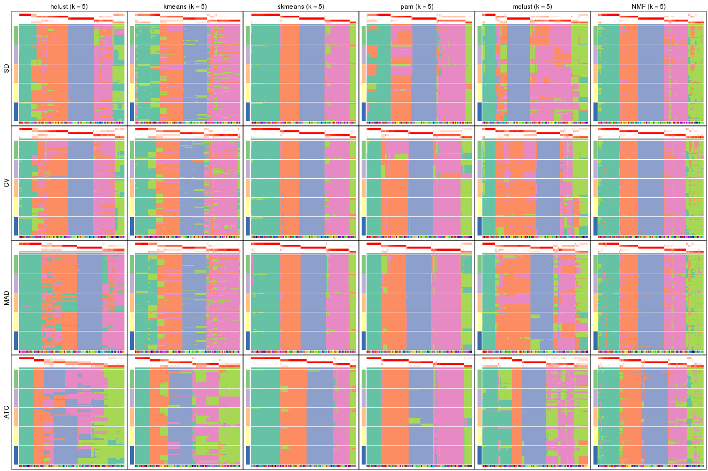</p>

</div>
<div id='tab-collect-membership-heatmap-5'>
<pre><code class="r">collect_plots(res_list, k = 6, fun = membership_heatmap, mc.cores = 4)
</code></pre>

<p></p>

</div>
</div>


### Signature heatmap

Signature heatmaps for all methods. ([What is a signature heatmap?](http://bioconductor.org/packages/devel/bioc/vignettes/cola/inst/doc/cola.html#toc_22))


Note in following heatmaps, rows are scaled.


<script>
$( function() {
	$( '#tabs-collect-get-signatures' ).tabs();
} );
</script>
<div id='tabs-collect-get-signatures'>
<ul>
<li><a href='#tab-collect-get-signatures-1'>k = 2</a></li>
<li><a href='#tab-collect-get-signatures-2'>k = 3</a></li>
<li><a href='#tab-collect-get-signatures-3'>k = 4</a></li>
<li><a href='#tab-collect-get-signatures-4'>k = 5</a></li>
<li><a href='#tab-collect-get-signatures-5'>k = 6</a></li>
</ul>
<div id='tab-collect-get-signatures-1'>
<pre><code class="r">collect_plots(res_list, k = 2, fun = get_signatures, mc.cores = 4)
</code></pre>

<p></p>

</div>
<div id='tab-collect-get-signatures-2'>
<pre><code class="r">collect_plots(res_list, k = 3, fun = get_signatures, mc.cores = 4)
</code></pre>

<p></p>

</div>
<div id='tab-collect-get-signatures-3'>
<pre><code class="r">collect_plots(res_list, k = 4, fun = get_signatures, mc.cores = 4)
</code></pre>

<p>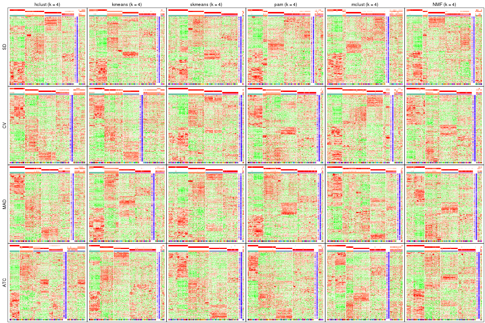</p>

</div>
<div id='tab-collect-get-signatures-4'>
<pre><code class="r">collect_plots(res_list, k = 5, fun = get_signatures, mc.cores = 4)
</code></pre>

<p></p>

</div>
<div id='tab-collect-get-signatures-5'>
<pre><code class="r">collect_plots(res_list, k = 6, fun = get_signatures, mc.cores = 4)
</code></pre>

<p></p>

</div>
</div>


### Statistics table

The statistics used for measuring the stability of consensus partitioning.
([How are they
defined?](http://bioconductor.org/packages/devel/bioc/vignettes/cola/inst/doc/cola.html#toc_13))


<script>
$( function() {
	$( '#tabs-get-stats-from-consensus-partition-list' ).tabs();
} );
</script>
<div id='tabs-get-stats-from-consensus-partition-list'>
<ul>
<li><a href='#tab-get-stats-from-consensus-partition-list-1'>k = 2</a></li>
<li><a href='#tab-get-stats-from-consensus-partition-list-2'>k = 3</a></li>
<li><a href='#tab-get-stats-from-consensus-partition-list-3'>k = 4</a></li>
<li><a href='#tab-get-stats-from-consensus-partition-list-4'>k = 5</a></li>
<li><a href='#tab-get-stats-from-consensus-partition-list-5'>k = 6</a></li>
</ul>
<div id='tab-get-stats-from-consensus-partition-list-1'>
<pre><code class="r">get_stats(res_list, k = 2)
</code></pre>

<pre><code>#&gt;             k 1-PAC mean_silhouette concordance area_increased  Rand Jaccard
#&gt; SD:NMF      2 0.849           0.923       0.966          0.474 0.529   0.529
#&gt; CV:NMF      2 0.818           0.908       0.958          0.469 0.536   0.536
#&gt; MAD:NMF     2 0.947           0.947       0.978          0.481 0.520   0.520
#&gt; ATC:NMF     2 1.000           0.960       0.984          0.465 0.536   0.536
#&gt; SD:skmeans  2 0.700           0.921       0.957          0.494 0.497   0.497
#&gt; CV:skmeans  2 0.720           0.914       0.959          0.496 0.497   0.497
#&gt; MAD:skmeans 2 1.000           0.991       0.996          0.503 0.497   0.497
#&gt; ATC:skmeans 2 1.000           0.981       0.992          0.492 0.510   0.510
#&gt; SD:mclust   2 0.610           0.828       0.923          0.498 0.497   0.497
#&gt; CV:mclust   2 0.833           0.879       0.952          0.497 0.505   0.505
#&gt; MAD:mclust  2 0.494           0.730       0.877          0.461 0.501   0.501
#&gt; ATC:mclust  2 0.534           0.862       0.864          0.484 0.508   0.508
#&gt; SD:kmeans   2 0.459           0.817       0.831          0.409 0.585   0.585
#&gt; CV:kmeans   2 0.498           0.825       0.825          0.407 0.585   0.585
#&gt; MAD:kmeans  2 0.427           0.744       0.795          0.419 0.585   0.585
#&gt; ATC:kmeans  2 1.000           0.997       0.999          0.412 0.590   0.590
#&gt; SD:pam      2 0.398           0.423       0.661          0.427 0.646   0.646
#&gt; CV:pam      2 0.388           0.781       0.869          0.427 0.526   0.526
#&gt; MAD:pam     2 0.906           0.891       0.939          0.433 0.560   0.560
#&gt; ATC:pam     2 0.560           0.901       0.940          0.480 0.501   0.501
#&gt; SD:hclust   2 0.902           0.922       0.968          0.367 0.660   0.660
#&gt; CV:hclust   2 0.442           0.883       0.866          0.352 0.660   0.660
#&gt; MAD:hclust  2 0.853           0.939       0.965          0.370 0.660   0.660
#&gt; ATC:hclust  2 0.745           0.862       0.938          0.449 0.551   0.551
</code></pre>

</div>
<div id='tab-get-stats-from-consensus-partition-list-2'>
<pre><code class="r">get_stats(res_list, k = 3)
</code></pre>

<pre><code>#&gt;             k 1-PAC mean_silhouette concordance area_increased  Rand Jaccard
#&gt; SD:NMF      3 1.000           0.979       0.991          0.350 0.701   0.496
#&gt; CV:NMF      3 1.000           0.978       0.991          0.365 0.710   0.510
#&gt; MAD:NMF     3 0.990           0.956       0.982          0.335 0.688   0.476
#&gt; ATC:NMF     3 0.932           0.929       0.969          0.422 0.758   0.566
#&gt; SD:skmeans  3 1.000           0.986       0.993          0.306 0.644   0.412
#&gt; CV:skmeans  3 1.000           0.985       0.993          0.306 0.650   0.417
#&gt; MAD:skmeans 3 1.000           0.989       0.995          0.289 0.657   0.424
#&gt; ATC:skmeans 3 1.000           0.977       0.991          0.342 0.804   0.626
#&gt; SD:mclust   3 0.735           0.757       0.877          0.254 0.718   0.499
#&gt; CV:mclust   3 0.661           0.782       0.892          0.280 0.609   0.395
#&gt; MAD:mclust  3 0.875           0.879       0.944          0.337 0.635   0.405
#&gt; ATC:mclust  3 0.649           0.852       0.914          0.331 0.626   0.402
#&gt; SD:kmeans   3 1.000           0.964       0.954          0.495 0.741   0.575
#&gt; CV:kmeans   3 0.997           0.962       0.962          0.503 0.741   0.575
#&gt; MAD:kmeans  3 0.980           0.947       0.967          0.468 0.741   0.575
#&gt; ATC:kmeans  3 0.476           0.642       0.824          0.509 0.644   0.458
#&gt; SD:pam      3 0.931           0.928       0.971          0.430 0.754   0.620
#&gt; CV:pam      3 0.979           0.952       0.976          0.408 0.631   0.432
#&gt; MAD:pam     3 0.709           0.789       0.840          0.432 0.682   0.499
#&gt; ATC:pam     3 0.848           0.857       0.947          0.305 0.762   0.576
#&gt; SD:hclust   3 0.658           0.876       0.900          0.662 0.737   0.601
#&gt; CV:hclust   3 0.562           0.849       0.888          0.730 0.737   0.601
#&gt; MAD:hclust  3 0.582           0.887       0.902          0.658 0.737   0.601
#&gt; ATC:hclust  3 0.515           0.682       0.736          0.384 0.779   0.599
</code></pre>

</div>
<div id='tab-get-stats-from-consensus-partition-list-3'>
<pre><code class="r">get_stats(res_list, k = 4)
</code></pre>

<pre><code>#&gt;             k 1-PAC mean_silhouette concordance area_increased  Rand Jaccard
#&gt; SD:NMF      4 0.784           0.755       0.865          0.154 0.898   0.721
#&gt; CV:NMF      4 0.787           0.785       0.888          0.159 0.877   0.663
#&gt; MAD:NMF     4 0.777           0.829       0.881          0.162 0.877   0.661
#&gt; ATC:NMF     4 0.949           0.926       0.964          0.138 0.837   0.565
#&gt; SD:skmeans  4 1.000           0.961       0.980          0.168 0.865   0.635
#&gt; CV:skmeans  4 1.000           0.975       0.989          0.164 0.883   0.673
#&gt; MAD:skmeans 4 0.988           0.948       0.977          0.160 0.859   0.618
#&gt; ATC:skmeans 4 1.000           0.959       0.984          0.125 0.895   0.700
#&gt; SD:mclust   4 0.654           0.714       0.829          0.131 0.864   0.641
#&gt; CV:mclust   4 0.772           0.792       0.880          0.129 0.844   0.617
#&gt; MAD:mclust  4 0.745           0.875       0.894          0.159 0.802   0.526
#&gt; ATC:mclust  4 0.739           0.746       0.890          0.134 0.888   0.699
#&gt; SD:kmeans   4 0.757           0.826       0.826          0.171 0.874   0.664
#&gt; CV:kmeans   4 0.752           0.648       0.795          0.159 0.938   0.836
#&gt; MAD:kmeans  4 0.750           0.751       0.810          0.163 0.823   0.565
#&gt; ATC:kmeans  4 0.797           0.871       0.909          0.160 0.907   0.749
#&gt; SD:pam      4 0.747           0.744       0.870          0.154 0.910   0.780
#&gt; CV:pam      4 0.838           0.874       0.909          0.211 0.832   0.590
#&gt; MAD:pam     4 0.863           0.915       0.953          0.208 0.830   0.581
#&gt; ATC:pam     4 0.916           0.902       0.962          0.180 0.812   0.551
#&gt; SD:hclust   4 0.765           0.818       0.889          0.200 0.865   0.658
#&gt; CV:hclust   4 0.690           0.726       0.829          0.192 0.863   0.653
#&gt; MAD:hclust  4 0.756           0.773       0.876          0.177 0.869   0.670
#&gt; ATC:hclust  4 0.566           0.580       0.789          0.151 0.775   0.468
</code></pre>

</div>
<div id='tab-get-stats-from-consensus-partition-list-4'>
<pre><code class="r">get_stats(res_list, k = 5)
</code></pre>

<pre><code>#&gt;             k 1-PAC mean_silhouette concordance area_increased  Rand Jaccard
#&gt; SD:NMF      5 0.846           0.821       0.908         0.0768 0.879   0.592
#&gt; CV:NMF      5 0.843           0.834       0.909         0.0724 0.891   0.608
#&gt; MAD:NMF     5 0.839           0.829       0.911         0.0687 0.911   0.667
#&gt; ATC:NMF     5 0.830           0.792       0.893         0.0606 0.921   0.700
#&gt; SD:skmeans  5 0.972           0.937       0.962         0.0383 0.968   0.871
#&gt; CV:skmeans  5 0.942           0.932       0.956         0.0367 0.968   0.871
#&gt; MAD:skmeans 5 0.961           0.913       0.959         0.0382 0.959   0.840
#&gt; ATC:skmeans 5 0.954           0.940       0.965         0.0406 0.969   0.880
#&gt; SD:mclust   5 0.672           0.640       0.796         0.0758 0.950   0.825
#&gt; CV:mclust   5 0.704           0.693       0.828         0.0595 0.909   0.695
#&gt; MAD:mclust  5 0.714           0.692       0.771         0.0507 0.903   0.676
#&gt; ATC:mclust  5 0.728           0.689       0.816         0.0608 0.931   0.749
#&gt; SD:kmeans   5 0.707           0.763       0.808         0.0674 0.973   0.897
#&gt; CV:kmeans   5 0.712           0.695       0.813         0.0785 0.838   0.553
#&gt; MAD:kmeans  5 0.735           0.716       0.833         0.0756 0.959   0.849
#&gt; ATC:kmeans  5 0.767           0.783       0.822         0.0796 0.881   0.605
#&gt; SD:pam      5 0.806           0.809       0.846         0.0786 0.863   0.601
#&gt; CV:pam      5 0.804           0.862       0.884         0.0565 0.935   0.755
#&gt; MAD:pam     5 0.905           0.890       0.920         0.0459 0.960   0.841
#&gt; ATC:pam     5 0.969           0.913       0.956         0.0494 0.958   0.842
#&gt; SD:hclust   5 0.742           0.749       0.820         0.0506 0.927   0.735
#&gt; CV:hclust   5 0.756           0.731       0.833         0.0630 0.964   0.863
#&gt; MAD:hclust  5 0.718           0.745       0.818         0.0668 0.967   0.882
#&gt; ATC:hclust  5 0.637           0.620       0.730         0.0655 0.811   0.465
</code></pre>

</div>
<div id='tab-get-stats-from-consensus-partition-list-5'>
<pre><code class="r">get_stats(res_list, k = 6)
</code></pre>

<pre><code>#&gt;             k 1-PAC mean_silhouette concordance area_increased  Rand Jaccard
#&gt; SD:NMF      6 0.824           0.686       0.812         0.0323 0.965   0.834
#&gt; CV:NMF      6 0.835           0.763       0.845         0.0316 0.966   0.835
#&gt; MAD:NMF     6 0.824           0.729       0.833         0.0323 0.940   0.721
#&gt; ATC:NMF     6 0.840           0.761       0.865         0.0337 0.929   0.678
#&gt; SD:skmeans  6 0.892           0.803       0.901         0.0368 0.975   0.888
#&gt; CV:skmeans  6 0.881           0.791       0.891         0.0382 0.976   0.893
#&gt; MAD:skmeans 6 0.897           0.810       0.902         0.0374 0.976   0.894
#&gt; ATC:skmeans 6 0.866           0.785       0.897         0.0367 0.984   0.928
#&gt; SD:mclust   6 0.753           0.740       0.830         0.0487 0.983   0.934
#&gt; CV:mclust   6 0.774           0.727       0.843         0.0479 0.899   0.631
#&gt; MAD:mclust  6 0.661           0.532       0.729         0.0480 0.848   0.496
#&gt; ATC:mclust  6 0.858           0.874       0.916         0.0409 0.882   0.560
#&gt; SD:kmeans   6 0.670           0.543       0.734         0.0424 0.975   0.900
#&gt; CV:kmeans   6 0.735           0.681       0.783         0.0450 0.963   0.848
#&gt; MAD:kmeans  6 0.784           0.699       0.791         0.0422 0.965   0.856
#&gt; ATC:kmeans  6 0.799           0.643       0.791         0.0458 0.920   0.670
#&gt; SD:pam      6 0.914           0.914       0.943         0.0633 0.966   0.846
#&gt; CV:pam      6 0.930           0.907       0.958         0.0509 0.970   0.862
#&gt; MAD:pam     6 0.975           0.935       0.972         0.0348 0.972   0.870
#&gt; ATC:pam     6 0.887           0.786       0.863         0.0371 0.979   0.909
#&gt; SD:hclust   6 0.823           0.787       0.862         0.0539 0.942   0.745
#&gt; CV:hclust   6 0.779           0.765       0.812         0.0398 0.971   0.875
#&gt; MAD:hclust  6 0.766           0.629       0.787         0.0424 0.947   0.791
#&gt; ATC:hclust  6 0.695           0.587       0.792         0.0540 0.874   0.547
</code></pre>

</div>
</div>

Following heatmap plots the partition for each combination of methods and the
lightness correspond to the silhouette scores for samples in each method. On
top the consensus subgroup is inferred from all methods by taking the mean
silhouette scores as weight.


<script>
$( function() {
	$( '#tabs-collect-stats-from-consensus-partition-list' ).tabs();
} );
</script>
<div id='tabs-collect-stats-from-consensus-partition-list'>
<ul>
<li><a href='#tab-collect-stats-from-consensus-partition-list-1'>k = 2</a></li>
<li><a href='#tab-collect-stats-from-consensus-partition-list-2'>k = 3</a></li>
<li><a href='#tab-collect-stats-from-consensus-partition-list-3'>k = 4</a></li>
<li><a href='#tab-collect-stats-from-consensus-partition-list-4'>k = 5</a></li>
<li><a href='#tab-collect-stats-from-consensus-partition-list-5'>k = 6</a></li>
</ul>
<div id='tab-collect-stats-from-consensus-partition-list-1'>
<pre><code class="r">collect_stats(res_list, k = 2)
</code></pre>

<p></p>

</div>
<div id='tab-collect-stats-from-consensus-partition-list-2'>
<pre><code class="r">collect_stats(res_list, k = 3)
</code></pre>

<p></p>

</div>
<div id='tab-collect-stats-from-consensus-partition-list-3'>
<pre><code class="r">collect_stats(res_list, k = 4)
</code></pre>

<p></p>

</div>
<div id='tab-collect-stats-from-consensus-partition-list-4'>
<pre><code class="r">collect_stats(res_list, k = 5)
</code></pre>

<p>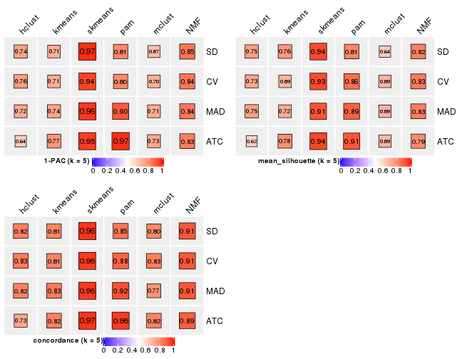</p>

</div>
<div id='tab-collect-stats-from-consensus-partition-list-5'>
<pre><code class="r">collect_stats(res_list, k = 6)
</code></pre>

<p></p>

</div>
</div>

### Partition from all methods


Collect partitions from all methods:


<script>
$( function() {
	$( '#tabs-collect-classes-from-consensus-partition-list' ).tabs();
} );
</script>
<div id='tabs-collect-classes-from-consensus-partition-list'>
<ul>
<li><a href='#tab-collect-classes-from-consensus-partition-list-1'>k = 2</a></li>
<li><a href='#tab-collect-classes-from-consensus-partition-list-2'>k = 3</a></li>
<li><a href='#tab-collect-classes-from-consensus-partition-list-3'>k = 4</a></li>
<li><a href='#tab-collect-classes-from-consensus-partition-list-4'>k = 5</a></li>
<li><a href='#tab-collect-classes-from-consensus-partition-list-5'>k = 6</a></li>
</ul>
<div id='tab-collect-classes-from-consensus-partition-list-1'>
<pre><code class="r">collect_classes(res_list, k = 2)
</code></pre>

<p></p>

</div>
<div id='tab-collect-classes-from-consensus-partition-list-2'>
<pre><code class="r">collect_classes(res_list, k = 3)
</code></pre>

<p></p>

</div>
<div id='tab-collect-classes-from-consensus-partition-list-3'>
<pre><code class="r">collect_classes(res_list, k = 4)
</code></pre>

<p></p>

</div>
<div id='tab-collect-classes-from-consensus-partition-list-4'>
<pre><code class="r">collect_classes(res_list, k = 5)
</code></pre>

<p></p>

</div>
<div id='tab-collect-classes-from-consensus-partition-list-5'>
<pre><code class="r">collect_classes(res_list, k = 6)
</code></pre>

<p></p>

</div>
</div>


### Top rows overlap


Overlap of top rows from different top-row methods:


<script>
$( function() {
	$( '#tabs-top-rows-overlap-by-euler' ).tabs();
} );
</script>
<div id='tabs-top-rows-overlap-by-euler'>
<ul>
<li><a href='#tab-top-rows-overlap-by-euler-1'>top_n = 1000</a></li>
<li><a href='#tab-top-rows-overlap-by-euler-2'>top_n = 2000</a></li>
<li><a href='#tab-top-rows-overlap-by-euler-3'>top_n = 3000</a></li>
<li><a href='#tab-top-rows-overlap-by-euler-4'>top_n = 4000</a></li>
<li><a href='#tab-top-rows-overlap-by-euler-5'>top_n = 5000</a></li>
</ul>
<div id='tab-top-rows-overlap-by-euler-1'>
<pre><code class="r">top_rows_overlap(res_list, top_n = 1000, method = &quot;euler&quot;)
</code></pre>

<p></p>

</div>
<div id='tab-top-rows-overlap-by-euler-2'>
<pre><code class="r">top_rows_overlap(res_list, top_n = 2000, method = &quot;euler&quot;)
</code></pre>

<p></p>

</div>
<div id='tab-top-rows-overlap-by-euler-3'>
<pre><code class="r">top_rows_overlap(res_list, top_n = 3000, method = &quot;euler&quot;)
</code></pre>

<p></p>

</div>
<div id='tab-top-rows-overlap-by-euler-4'>
<pre><code class="r">top_rows_overlap(res_list, top_n = 4000, method = &quot;euler&quot;)
</code></pre>

<p></p>

</div>
<div id='tab-top-rows-overlap-by-euler-5'>
<pre><code class="r">top_rows_overlap(res_list, top_n = 5000, method = &quot;euler&quot;)
</code></pre>

<p></p>

</div>
</div>

Also visualize the correspondance of rankings between different top-row methods:


<script>
$( function() {
	$( '#tabs-top-rows-overlap-by-correspondance' ).tabs();
} );
</script>
<div id='tabs-top-rows-overlap-by-correspondance'>
<ul>
<li><a href='#tab-top-rows-overlap-by-correspondance-1'>top_n = 1000</a></li>
<li><a href='#tab-top-rows-overlap-by-correspondance-2'>top_n = 2000</a></li>
<li><a href='#tab-top-rows-overlap-by-correspondance-3'>top_n = 3000</a></li>
<li><a href='#tab-top-rows-overlap-by-correspondance-4'>top_n = 4000</a></li>
<li><a href='#tab-top-rows-overlap-by-correspondance-5'>top_n = 5000</a></li>
</ul>
<div id='tab-top-rows-overlap-by-correspondance-1'>
<pre><code class="r">top_rows_overlap(res_list, top_n = 1000, method = &quot;correspondance&quot;)
</code></pre>

<p></p>

</div>
<div id='tab-top-rows-overlap-by-correspondance-2'>
<pre><code class="r">top_rows_overlap(res_list, top_n = 2000, method = &quot;correspondance&quot;)
</code></pre>

<p></p>

</div>
<div id='tab-top-rows-overlap-by-correspondance-3'>
<pre><code class="r">top_rows_overlap(res_list, top_n = 3000, method = &quot;correspondance&quot;)
</code></pre>

<p></p>

</div>
<div id='tab-top-rows-overlap-by-correspondance-4'>
<pre><code class="r">top_rows_overlap(res_list, top_n = 4000, method = &quot;correspondance&quot;)
</code></pre>

<p></p>

</div>
<div id='tab-top-rows-overlap-by-correspondance-5'>
<pre><code class="r">top_rows_overlap(res_list, top_n = 5000, method = &quot;correspondance&quot;)
</code></pre>

<p></p>

</div>
</div>


Heatmaps of the top rows:


<script>
$( function() {
	$( '#tabs-top-rows-heatmap' ).tabs();
} );
</script>
<div id='tabs-top-rows-heatmap'>
<ul>
<li><a href='#tab-top-rows-heatmap-1'>top_n = 1000</a></li>
<li><a href='#tab-top-rows-heatmap-2'>top_n = 2000</a></li>
<li><a href='#tab-top-rows-heatmap-3'>top_n = 3000</a></li>
<li><a href='#tab-top-rows-heatmap-4'>top_n = 4000</a></li>
<li><a href='#tab-top-rows-heatmap-5'>top_n = 5000</a></li>
</ul>
<div id='tab-top-rows-heatmap-1'>
<pre><code class="r">top_rows_heatmap(res_list, top_n = 1000)
</code></pre>

<p></p>

</div>
<div id='tab-top-rows-heatmap-2'>
<pre><code class="r">top_rows_heatmap(res_list, top_n = 2000)
</code></pre>

<p></p>

</div>
<div id='tab-top-rows-heatmap-3'>
<pre><code class="r">top_rows_heatmap(res_list, top_n = 3000)
</code></pre>

<p></p>

</div>
<div id='tab-top-rows-heatmap-4'>
<pre><code class="r">top_rows_heatmap(res_list, top_n = 4000)
</code></pre>

<p></p>

</div>
<div id='tab-top-rows-heatmap-5'>
<pre><code class="r">top_rows_heatmap(res_list, top_n = 5000)
</code></pre>

<p></p>

</div>
</div>


### Test to known annotations


Test correlation between subgroups and known annotations. If the known
annotation is numeric, one-way ANOVA test is applied, and if the known
annotation is discrete, chi-squared contingency table test is applied.


<script>
$( function() {
	$( '#tabs-test-to-known-factors-from-consensus-partition-list' ).tabs();
} );
</script>
<div id='tabs-test-to-known-factors-from-consensus-partition-list'>
<ul>
<li><a href='#tab-test-to-known-factors-from-consensus-partition-list-1'>k = 2</a></li>
<li><a href='#tab-test-to-known-factors-from-consensus-partition-list-2'>k = 3</a></li>
<li><a href='#tab-test-to-known-factors-from-consensus-partition-list-3'>k = 4</a></li>
<li><a href='#tab-test-to-known-factors-from-consensus-partition-list-4'>k = 5</a></li>
<li><a href='#tab-test-to-known-factors-from-consensus-partition-list-5'>k = 6</a></li>
</ul>
<div id='tab-test-to-known-factors-from-consensus-partition-list-1'>
<pre><code class="r">test_to_known_factors(res_list, k = 2)
</code></pre>

<pre><code>#&gt;               n tissue(p) k
#&gt; SD:NMF      154  3.37e-06 2
#&gt; CV:NMF      152  2.90e-06 2
#&gt; MAD:NMF     153  5.02e-06 2
#&gt; ATC:NMF     156  2.53e-06 2
#&gt; SD:skmeans  156  6.50e-07 2
#&gt; CV:skmeans  153  6.91e-07 2
#&gt; MAD:skmeans 158  3.86e-07 2
#&gt; ATC:skmeans 157  1.12e-05 2
#&gt; SD:mclust   143  1.87e-06 2
#&gt; CV:mclust   145  1.89e-06 2
#&gt; MAD:mclust  129  5.75e-06 2
#&gt; ATC:mclust  155  5.01e-07 2
#&gt; SD:kmeans   158  2.28e-07 2
#&gt; CV:kmeans   158  2.28e-07 2
#&gt; MAD:kmeans  155  3.48e-07 2
#&gt; ATC:kmeans  158  4.35e-07 2
#&gt; SD:pam      124  4.99e-06 2
#&gt; CV:pam      148  7.31e-07 2
#&gt; MAD:pam     151  4.79e-07 2
#&gt; ATC:pam     154  3.04e-06 2
#&gt; SD:hclust   148  5.05e-07 2
#&gt; CV:hclust   150  4.31e-07 2
#&gt; MAD:hclust  158  2.28e-07 2
#&gt; ATC:hclust  146  1.09e-06 2
</code></pre>

</div>
<div id='tab-test-to-known-factors-from-consensus-partition-list-2'>
<pre><code class="r">test_to_known_factors(res_list, k = 3)
</code></pre>

<pre><code>#&gt;               n tissue(p) k
#&gt; SD:NMF      157  1.06e-12 3
#&gt; CV:NMF      157  1.06e-12 3
#&gt; MAD:NMF     155  2.96e-12 3
#&gt; ATC:NMF     156  1.37e-11 3
#&gt; SD:skmeans  158  6.33e-13 3
#&gt; CV:skmeans  158  6.33e-13 3
#&gt; MAD:skmeans 158  1.28e-12 3
#&gt; ATC:skmeans 156  5.31e-11 3
#&gt; SD:mclust   126  3.98e-10 3
#&gt; CV:mclust   134  5.58e-11 3
#&gt; MAD:mclust  142  1.59e-11 3
#&gt; ATC:mclust  149  3.71e-12 3
#&gt; SD:kmeans   157  1.06e-12 3
#&gt; CV:kmeans   156  8.65e-13 3
#&gt; MAD:kmeans  154  1.18e-12 3
#&gt; ATC:kmeans  122  1.05e-08 3
#&gt; SD:pam      152  3.32e-12 3
#&gt; CV:pam      156  1.77e-12 3
#&gt; MAD:pam     152  3.32e-12 3
#&gt; ATC:pam     141  3.44e-10 3
#&gt; SD:hclust   148  3.02e-12 3
#&gt; CV:hclust   150  2.21e-12 3
#&gt; MAD:hclust  158  6.33e-13 3
#&gt; ATC:hclust  146  1.90e-11 3
</code></pre>

</div>
<div id='tab-test-to-known-factors-from-consensus-partition-list-3'>
<pre><code class="r">test_to_known_factors(res_list, k = 4)
</code></pre>

<pre><code>#&gt;               n tissue(p) k
#&gt; SD:NMF      143  1.13e-16 4
#&gt; CV:NMF      145  6.30e-16 4
#&gt; MAD:NMF     148  4.80e-16 4
#&gt; ATC:NMF     154  2.47e-15 4
#&gt; SD:skmeans  154  1.52e-17 4
#&gt; CV:skmeans  155  2.09e-17 4
#&gt; MAD:skmeans 154  1.33e-16 4
#&gt; ATC:skmeans 155  2.17e-16 4
#&gt; SD:mclust   129  2.44e-14 4
#&gt; CV:mclust   139  3.68e-15 4
#&gt; MAD:mclust  154  1.39e-16 4
#&gt; ATC:mclust  130  1.15e-14 4
#&gt; SD:kmeans   149  2.79e-17 4
#&gt; CV:kmeans   111  2.97e-09 4
#&gt; MAD:kmeans  137  3.75e-15 4
#&gt; ATC:kmeans  149  1.31e-15 4
#&gt; SD:pam      139  8.31e-16 4
#&gt; CV:pam      152  6.13e-15 4
#&gt; MAD:pam     154  1.76e-15 4
#&gt; ATC:pam     147  6.18e-14 4
#&gt; SD:hclust   143  1.13e-16 4
#&gt; CV:hclust   132  8.61e-16 4
#&gt; MAD:hclust  134  1.58e-15 4
#&gt; ATC:hclust  118  1.66e-13 4
</code></pre>

</div>
<div id='tab-test-to-known-factors-from-consensus-partition-list-4'>
<pre><code class="r">test_to_known_factors(res_list, k = 5)
</code></pre>

<pre><code>#&gt;               n tissue(p) k
#&gt; SD:NMF      145  1.58e-19 5
#&gt; CV:NMF      148  3.40e-20 5
#&gt; MAD:NMF     146  7.51e-20 5
#&gt; ATC:NMF     142  1.22e-18 5
#&gt; SD:skmeans  158  2.31e-23 5
#&gt; CV:skmeans  156  1.79e-22 5
#&gt; MAD:skmeans 152  6.36e-22 5
#&gt; ATC:skmeans 158  1.35e-21 5
#&gt; SD:mclust   117  4.04e-13 5
#&gt; CV:mclust   131  3.01e-18 5
#&gt; MAD:mclust  132  3.88e-18 5
#&gt; ATC:mclust  124  1.18e-16 5
#&gt; SD:kmeans   142  2.43e-16 5
#&gt; CV:kmeans   125  7.58e-15 5
#&gt; MAD:kmeans  137  3.74e-20 5
#&gt; ATC:kmeans  139  1.41e-16 5
#&gt; SD:pam      149  2.47e-20 5
#&gt; CV:pam      152  6.04e-19 5
#&gt; MAD:pam     156  6.46e-21 5
#&gt; ATC:pam     152  2.96e-18 5
#&gt; SD:hclust   141  2.65e-21 5
#&gt; CV:hclust   134  1.14e-20 5
#&gt; MAD:hclust  122  2.61e-14 5
#&gt; ATC:hclust  113  4.36e-17 5
</code></pre>

</div>
<div id='tab-test-to-known-factors-from-consensus-partition-list-5'>
<pre><code class="r">test_to_known_factors(res_list, k = 6)
</code></pre>

<pre><code>#&gt;               n tissue(p) k
#&gt; SD:NMF      121  5.39e-18 6
#&gt; CV:NMF      142  2.04e-24 6
#&gt; MAD:NMF     124  1.14e-20 6
#&gt; ATC:NMF     140  6.59e-22 6
#&gt; SD:skmeans  144  1.72e-25 6
#&gt; CV:skmeans  144  2.12e-21 6
#&gt; MAD:skmeans 143  5.95e-25 6
#&gt; ATC:skmeans 141  2.31e-25 6
#&gt; SD:mclust   123  1.92e-21 6
#&gt; CV:mclust   125  2.12e-19 6
#&gt; MAD:mclust  109  1.94e-17 6
#&gt; ATC:mclust  153  6.02e-26 6
#&gt; SD:kmeans   109  5.49e-17 6
#&gt; CV:kmeans   127  2.04e-19 6
#&gt; MAD:kmeans  127  8.35e-19 6
#&gt; ATC:kmeans  118  6.17e-18 6
#&gt; SD:pam      151  3.70e-25 6
#&gt; CV:pam      155  6.42e-25 6
#&gt; MAD:pam     153  6.88e-26 6
#&gt; ATC:pam     150  2.52e-22 6
#&gt; SD:hclust   145  8.51e-27 6
#&gt; CV:hclust   138  5.24e-26 6
#&gt; MAD:hclust  117  4.56e-18 6
#&gt; ATC:hclust  112  2.53e-20 6
</code></pre>

</div>
</div>


 
## Results for each method


---------------------------------------------------


### SD:hclust*


The object with results only for a single top-value method and a single partition method 
can be extracted as:

```r
res = res_list["SD", "hclust"]
# you can also extract it by
# res = res_list["SD:hclust"]
```

A summary of `res` and all the functions that can be applied to it:

```r
res
```

```
#> A 'ConsensusPartition' object with k = 2, 3, 4, 5, 6.
#>   On a matrix with 21168 rows and 158 columns.
#>   Top rows (1000, 2000, 3000, 4000, 5000) are extracted by 'SD' method.
#>   Subgroups are detected by 'hclust' method.
#>   Performed in total 1250 partitions by row resampling.
#>   Best k for subgroups seems to be 2.
#> 
#> Following methods can be applied to this 'ConsensusPartition' object:
#>  [1] "cola_report"             "collect_classes"         "collect_plots"          
#>  [4] "collect_stats"           "colnames"                "compare_signatures"     
#>  [7] "consensus_heatmap"       "dimension_reduction"     "functional_enrichment"  
#> [10] "get_anno_col"            "get_anno"                "get_classes"            
#> [13] "get_consensus"           "get_matrix"              "get_membership"         
#> [16] "get_param"               "get_signatures"          "get_stats"              
#> [19] "is_best_k"               "is_stable_k"             "membership_heatmap"     
#> [22] "ncol"                    "nrow"                    "plot_ecdf"              
#> [25] "rownames"                "select_partition_number" "show"                   
#> [28] "suggest_best_k"          "test_to_known_factors"
```

`collect_plots()` function collects all the plots made from `res` for all `k` (number of partitions)
into one single page to provide an easy and fast comparison between different `k`.

```r
collect_plots(res)
```


The plots are:

- The first row: a plot of the ECDF (empirical cumulative distribution
  function) curves of the consensus matrix for each `k` and the heatmap of
  predicted classes for each `k`.
- The second row: heatmaps of the consensus matrix for each `k`.
- The third row: heatmaps of the membership matrix for each `k`.
- The fouth row: heatmaps of the signatures for each `k`.

All the plots in panels can be made by individual functions and they are
plotted later in this section.

`select_partition_number()` produces several plots showing different
statistics for choosing "optimized" `k`. There are following statistics:

- ECDF curves of the consensus matrix for each `k`;
- 1-PAC. [The PAC
  score](https://en.wikipedia.org/wiki/Consensus_clustering#Over-interpretation_potential_of_consensus_clustering)
  measures the proportion of the ambiguous subgrouping.
- Mean silhouette score.
- Concordance. The mean probability of fiting the consensus class ids in all
  partitions.
- Area increased. Denote $A_k$ as the area under the ECDF curve for current
  `k`, the area increased is defined as $A_k - A_{k-1}$.
- Rand index. The percent of pairs of samples that are both in a same cluster
  or both are not in a same cluster in the partition of k and k-1.
- Jaccard index. The ratio of pairs of samples are both in a same cluster in
  the partition of k and k-1 and the pairs of samples are both in a same
  cluster in the partition k or k-1.

The detailed explanations of these statistics can be found in [the _cola_
vignette](http://bioconductor.org/packages/devel/bioc/vignettes/cola/inst/doc/cola.html#toc_13).

Generally speaking, lower PAC score, higher mean silhouette score or higher
concordance corresponds to better partition. Rand index and Jaccard index
measure how similar the current partition is compared to partition with `k-1`.
If they are too similar, we won't accept `k` is better than `k-1`.

```r
select_partition_number(res)
```


The numeric values for all these statistics can be obtained by `get_stats()`.

```r
get_stats(res)
```

```
#>   k 1-PAC mean_silhouette concordance area_increased  Rand Jaccard
#> 2 2 0.902           0.922       0.968         0.3672 0.660   0.660
#> 3 3 0.658           0.876       0.900         0.6623 0.737   0.601
#> 4 4 0.765           0.818       0.889         0.2002 0.865   0.658
#> 5 5 0.742           0.749       0.820         0.0506 0.927   0.735
#> 6 6 0.823           0.787       0.862         0.0539 0.942   0.745
```

`suggest_best_k()` suggests the best $k$ based on these statistics. The rules are as follows:

- All $k$ with Jaccard index larger than 0.95 are removed because increasing
  $k$ does not provide enough extra information. If all $k$ are removed, it is
  marked as no subgroup is detected.
- For all $k$ with 1-PAC score larger than 0.9, the maximal $k$ is taken as
  the best $k$, and other $k$ are marked as optional $k$.
- If it does not fit the second rule. The $k$ with the maximal vote of the
  highest 1-PAC score, highest mean silhouette, and highest concordance is
  taken as the best $k$.

```r
suggest_best_k(res)
```

```
#> [1] 2
```


Following shows the table of the partitions (You need to click the **show/hide
code output** link to see it). The membership matrix (columns with name `p*`)
is inferred by
[`clue::cl_consensus()`](https://www.rdocumentation.org/link/cl_consensus?package=clue)
function with the `SE` method. Basically the value in the membership matrix
represents the probability to belong to a certain group. The finall class
label for an item is determined with the group with highest probability it
belongs to.

In `get_classes()` function, the entropy is calculated from the membership
matrix and the silhouette score is calculated from the consensus matrix.


<script>
$( function() {
	$( '#tabs-SD-hclust-get-classes' ).tabs();
} );
</script>
<div id='tabs-SD-hclust-get-classes'>
<ul>
<li><a href='#tab-SD-hclust-get-classes-1'>k = 2</a></li>
<li><a href='#tab-SD-hclust-get-classes-2'>k = 3</a></li>
<li><a href='#tab-SD-hclust-get-classes-3'>k = 4</a></li>
<li><a href='#tab-SD-hclust-get-classes-4'>k = 5</a></li>
<li><a href='#tab-SD-hclust-get-classes-5'>k = 6</a></li>
</ul>

<div id='tab-SD-hclust-get-classes-1'>
<p><a id='tab-SD-hclust-get-classes-1-a' style='color:#0366d6' href='#'>show/hide code output</a></p>
<pre><code class="r">cbind(get_classes(res, k = 2), get_membership(res, k = 2))
</code></pre>

<pre><code>#&gt;          class entropy silhouette    p1    p2
#&gt; GSM18927     2  0.0376     0.9603 0.004 0.996
#&gt; GSM18928     2  0.0376     0.9603 0.004 0.996
#&gt; GSM18915     2  0.0376     0.9603 0.004 0.996
#&gt; GSM18916     2  0.0376     0.9603 0.004 0.996
#&gt; GSM18939     2  0.0376     0.9603 0.004 0.996
#&gt; GSM18940     2  0.0376     0.9603 0.004 0.996
#&gt; GSM18933     2  0.0376     0.9603 0.004 0.996
#&gt; GSM18934     2  0.0376     0.9603 0.004 0.996
#&gt; GSM18925     2  0.0376     0.9603 0.004 0.996
#&gt; GSM18926     2  0.0376     0.9603 0.004 0.996
#&gt; GSM18931     2  0.0376     0.9603 0.004 0.996
#&gt; GSM18932     2  0.0376     0.9603 0.004 0.996
#&gt; GSM19019     2  0.0376     0.9603 0.004 0.996
#&gt; GSM19020     2  0.0376     0.9603 0.004 0.996
#&gt; GSM18923     2  0.0376     0.9603 0.004 0.996
#&gt; GSM18924     2  0.0376     0.9603 0.004 0.996
#&gt; GSM18941     2  0.0376     0.9603 0.004 0.996
#&gt; GSM18942     2  0.0376     0.9603 0.004 0.996
#&gt; GSM18929     2  0.0376     0.9603 0.004 0.996
#&gt; GSM18930     2  0.0376     0.9603 0.004 0.996
#&gt; GSM18911     2  0.0376     0.9603 0.004 0.996
#&gt; GSM18912     2  0.0376     0.9603 0.004 0.996
#&gt; GSM18935     2  0.0376     0.9603 0.004 0.996
#&gt; GSM18936     2  0.0376     0.9603 0.004 0.996
#&gt; GSM19005     2  0.0000     0.9614 0.000 1.000
#&gt; GSM19006     2  0.0000     0.9614 0.000 1.000
#&gt; GSM18921     2  0.0376     0.9603 0.004 0.996
#&gt; GSM18922     2  0.0376     0.9603 0.004 0.996
#&gt; GSM18919     2  0.0376     0.9603 0.004 0.996
#&gt; GSM18920     2  0.0376     0.9603 0.004 0.996
#&gt; GSM18917     2  0.0376     0.9603 0.004 0.996
#&gt; GSM18918     2  0.0376     0.9603 0.004 0.996
#&gt; GSM18913     2  0.0376     0.9603 0.004 0.996
#&gt; GSM18914     2  0.0376     0.9603 0.004 0.996
#&gt; GSM18937     2  0.0376     0.9603 0.004 0.996
#&gt; GSM18938     2  0.0376     0.9603 0.004 0.996
#&gt; GSM18943     2  0.0376     0.9603 0.004 0.996
#&gt; GSM18944     2  0.0376     0.9603 0.004 0.996
#&gt; GSM19003     2  0.0000     0.9614 0.000 1.000
#&gt; GSM19004     2  0.0000     0.9614 0.000 1.000
#&gt; GSM19011     2  0.0000     0.9614 0.000 1.000
#&gt; GSM19012     2  0.0000     0.9614 0.000 1.000
#&gt; GSM19009     2  0.0000     0.9614 0.000 1.000
#&gt; GSM19010     2  0.0000     0.9614 0.000 1.000
#&gt; GSM18945     2  0.0376     0.9603 0.004 0.996
#&gt; GSM18946     2  0.0376     0.9603 0.004 0.996
#&gt; GSM18963     2  0.0000     0.9614 0.000 1.000
#&gt; GSM18964     2  0.0000     0.9614 0.000 1.000
#&gt; GSM18905     2  0.0000     0.9614 0.000 1.000
#&gt; GSM18906     2  0.0000     0.9614 0.000 1.000
#&gt; GSM18965     2  0.0376     0.9591 0.004 0.996
#&gt; GSM18966     2  0.0376     0.9591 0.004 0.996
#&gt; GSM18873     1  0.0376     0.9893 0.996 0.004
#&gt; GSM18874     1  0.0376     0.9893 0.996 0.004
#&gt; GSM18973     2  0.1414     0.9455 0.020 0.980
#&gt; GSM18974     2  0.1414     0.9455 0.020 0.980
#&gt; GSM18977     2  0.0000     0.9614 0.000 1.000
#&gt; GSM18978     2  0.0000     0.9614 0.000 1.000
#&gt; GSM18979     2  0.0000     0.9614 0.000 1.000
#&gt; GSM18980     2  0.0000     0.9614 0.000 1.000
#&gt; GSM18883     1  0.0376     0.9893 0.996 0.004
#&gt; GSM18884     1  0.0376     0.9893 0.996 0.004
#&gt; GSM18885     1  0.0376     0.9893 0.996 0.004
#&gt; GSM18886     1  0.0376     0.9893 0.996 0.004
#&gt; GSM18907     1  0.0376     0.9893 0.996 0.004
#&gt; GSM18908     1  0.0376     0.9893 0.996 0.004
#&gt; GSM18909     2  0.9795     0.3159 0.416 0.584
#&gt; GSM18910     2  0.9795     0.3159 0.416 0.584
#&gt; GSM18867     1  0.0376     0.9893 0.996 0.004
#&gt; GSM18868     1  0.0376     0.9893 0.996 0.004
#&gt; GSM18947     2  0.0000     0.9614 0.000 1.000
#&gt; GSM18948     2  0.0000     0.9614 0.000 1.000
#&gt; GSM18995     2  0.0000     0.9614 0.000 1.000
#&gt; GSM18996     2  0.0000     0.9614 0.000 1.000
#&gt; GSM18975     2  0.0000     0.9614 0.000 1.000
#&gt; GSM18976     2  0.0000     0.9614 0.000 1.000
#&gt; GSM18997     2  0.0000     0.9614 0.000 1.000
#&gt; GSM18998     2  0.0000     0.9614 0.000 1.000
#&gt; GSM18967     2  0.0376     0.9591 0.004 0.996
#&gt; GSM18968     2  0.0376     0.9591 0.004 0.996
#&gt; GSM18959     2  0.0000     0.9614 0.000 1.000
#&gt; GSM18960     2  0.0000     0.9614 0.000 1.000
#&gt; GSM19015     2  0.0000     0.9614 0.000 1.000
#&gt; GSM19016     2  0.0000     0.9614 0.000 1.000
#&gt; GSM18957     2  0.0376     0.9591 0.004 0.996
#&gt; GSM18958     2  0.0376     0.9591 0.004 0.996
#&gt; GSM18981     2  0.0000     0.9614 0.000 1.000
#&gt; GSM18982     2  0.0000     0.9614 0.000 1.000
#&gt; GSM18989     2  0.0000     0.9614 0.000 1.000
#&gt; GSM18990     2  0.0000     0.9614 0.000 1.000
#&gt; GSM18985     2  0.0000     0.9614 0.000 1.000
#&gt; GSM18986     2  0.0000     0.9614 0.000 1.000
#&gt; GSM18987     2  0.0000     0.9614 0.000 1.000
#&gt; GSM18988     2  0.0000     0.9614 0.000 1.000
#&gt; GSM18983     2  0.0000     0.9614 0.000 1.000
#&gt; GSM18984     2  0.0000     0.9614 0.000 1.000
#&gt; GSM18951     2  0.0000     0.9614 0.000 1.000
#&gt; GSM18952     2  0.0000     0.9614 0.000 1.000
#&gt; GSM19007     2  0.0000     0.9614 0.000 1.000
#&gt; GSM19008     2  0.0000     0.9614 0.000 1.000
#&gt; GSM18999     2  0.0000     0.9614 0.000 1.000
#&gt; GSM19000     2  0.0000     0.9614 0.000 1.000
#&gt; GSM18889     1  0.0376     0.9893 0.996 0.004
#&gt; GSM18890     1  0.0376     0.9893 0.996 0.004
#&gt; GSM18881     1  0.0376     0.9893 0.996 0.004
#&gt; GSM18882     1  0.0376     0.9893 0.996 0.004
#&gt; GSM18877     1  0.0376     0.9893 0.996 0.004
#&gt; GSM18878     1  0.0376     0.9893 0.996 0.004
#&gt; GSM18875     1  0.0376     0.9893 0.996 0.004
#&gt; GSM18876     1  0.0376     0.9893 0.996 0.004
#&gt; GSM18879     1  0.0376     0.9893 0.996 0.004
#&gt; GSM18880     1  0.0376     0.9893 0.996 0.004
#&gt; GSM18871     1  0.0376     0.9893 0.996 0.004
#&gt; GSM18872     1  0.0376     0.9893 0.996 0.004
#&gt; GSM18903     2  0.9795     0.3159 0.416 0.584
#&gt; GSM18904     2  0.9795     0.3159 0.416 0.584
#&gt; GSM18949     2  0.0376     0.9591 0.004 0.996
#&gt; GSM18950     2  0.0376     0.9591 0.004 0.996
#&gt; GSM18953     2  0.0000     0.9614 0.000 1.000
#&gt; GSM18954     2  0.0000     0.9614 0.000 1.000
#&gt; GSM19013     2  0.0000     0.9614 0.000 1.000
#&gt; GSM19014     2  0.0000     0.9614 0.000 1.000
#&gt; GSM18971     2  0.0672     0.9561 0.008 0.992
#&gt; GSM18972     2  0.0672     0.9561 0.008 0.992
#&gt; GSM18969     2  0.0672     0.9561 0.008 0.992
#&gt; GSM18970     2  0.0000     0.9614 0.000 1.000
#&gt; GSM18869     1  0.0376     0.9893 0.996 0.004
#&gt; GSM18870     1  0.0376     0.9893 0.996 0.004
#&gt; GSM19017     2  0.0000     0.9614 0.000 1.000
#&gt; GSM19018     2  0.0000     0.9614 0.000 1.000
#&gt; GSM18991     2  0.0000     0.9614 0.000 1.000
#&gt; GSM18992     2  0.0000     0.9614 0.000 1.000
#&gt; GSM19021     2  0.0000     0.9614 0.000 1.000
#&gt; GSM19022     2  0.0000     0.9614 0.000 1.000
#&gt; GSM19001     2  0.0000     0.9614 0.000 1.000
#&gt; GSM19002     2  0.0000     0.9614 0.000 1.000
#&gt; GSM18899     2  0.9795     0.3159 0.416 0.584
#&gt; GSM18900     2  0.9795     0.3159 0.416 0.584
#&gt; GSM18961     2  0.0000     0.9614 0.000 1.000
#&gt; GSM18962     2  0.0000     0.9614 0.000 1.000
#&gt; GSM18901     2  0.9795     0.3159 0.416 0.584
#&gt; GSM18902     2  0.9795     0.3159 0.416 0.584
#&gt; GSM18993     2  0.0000     0.9614 0.000 1.000
#&gt; GSM18994     2  0.0000     0.9614 0.000 1.000
#&gt; GSM18865     2  0.9993     0.0657 0.484 0.516
#&gt; GSM18866     2  0.9993     0.0657 0.484 0.516
#&gt; GSM18897     1  0.2043     0.9758 0.968 0.032
#&gt; GSM18898     1  0.2043     0.9758 0.968 0.032
#&gt; GSM18887     1  0.2043     0.9758 0.968 0.032
#&gt; GSM18888     1  0.2043     0.9758 0.968 0.032
#&gt; GSM18893     1  0.2423     0.9699 0.960 0.040
#&gt; GSM18894     1  0.2423     0.9699 0.960 0.040
#&gt; GSM18895     1  0.2423     0.9699 0.960 0.040
#&gt; GSM18896     1  0.2423     0.9699 0.960 0.040
#&gt; GSM18891     1  0.2423     0.9699 0.960 0.040
#&gt; GSM18892     1  0.2423     0.9699 0.960 0.040
#&gt; GSM18955     2  0.0000     0.9614 0.000 1.000
#&gt; GSM18956     2  0.0000     0.9614 0.000 1.000
</code></pre>

<script>
$('#tab-SD-hclust-get-classes-1-a').parent().next().next().hide();
$('#tab-SD-hclust-get-classes-1-a').click(function(){
  $('#tab-SD-hclust-get-classes-1-a').parent().next().next().toggle();
  return(false);
});
</script>
</div>

<div id='tab-SD-hclust-get-classes-2'>
<p><a id='tab-SD-hclust-get-classes-2-a' style='color:#0366d6' href='#'>show/hide code output</a></p>
<pre><code class="r">cbind(get_classes(res, k = 3), get_membership(res, k = 3))
</code></pre>

<pre><code>#&gt;          class entropy silhouette    p1    p2    p3
#&gt; GSM18927     3  0.1163    0.99462 0.000 0.028 0.972
#&gt; GSM18928     3  0.1163    0.99462 0.000 0.028 0.972
#&gt; GSM18915     3  0.1163    0.99462 0.000 0.028 0.972
#&gt; GSM18916     3  0.1163    0.99462 0.000 0.028 0.972
#&gt; GSM18939     3  0.1163    0.99462 0.000 0.028 0.972
#&gt; GSM18940     3  0.1163    0.99462 0.000 0.028 0.972
#&gt; GSM18933     3  0.1163    0.99462 0.000 0.028 0.972
#&gt; GSM18934     3  0.1163    0.99462 0.000 0.028 0.972
#&gt; GSM18925     3  0.1163    0.99462 0.000 0.028 0.972
#&gt; GSM18926     3  0.1163    0.99462 0.000 0.028 0.972
#&gt; GSM18931     3  0.1163    0.99462 0.000 0.028 0.972
#&gt; GSM18932     3  0.1163    0.99462 0.000 0.028 0.972
#&gt; GSM19019     3  0.2356    0.95220 0.000 0.072 0.928
#&gt; GSM19020     3  0.2356    0.95220 0.000 0.072 0.928
#&gt; GSM18923     3  0.1163    0.99462 0.000 0.028 0.972
#&gt; GSM18924     3  0.1163    0.99462 0.000 0.028 0.972
#&gt; GSM18941     3  0.1163    0.99462 0.000 0.028 0.972
#&gt; GSM18942     3  0.1163    0.99462 0.000 0.028 0.972
#&gt; GSM18929     3  0.1163    0.99462 0.000 0.028 0.972
#&gt; GSM18930     3  0.1163    0.99462 0.000 0.028 0.972
#&gt; GSM18911     3  0.1163    0.99462 0.000 0.028 0.972
#&gt; GSM18912     3  0.1163    0.99462 0.000 0.028 0.972
#&gt; GSM18935     3  0.1163    0.99462 0.000 0.028 0.972
#&gt; GSM18936     3  0.1163    0.99462 0.000 0.028 0.972
#&gt; GSM19005     2  0.4291    0.85674 0.000 0.820 0.180
#&gt; GSM19006     2  0.4291    0.85674 0.000 0.820 0.180
#&gt; GSM18921     3  0.1163    0.99462 0.000 0.028 0.972
#&gt; GSM18922     3  0.1163    0.99462 0.000 0.028 0.972
#&gt; GSM18919     3  0.1163    0.99462 0.000 0.028 0.972
#&gt; GSM18920     3  0.1163    0.99462 0.000 0.028 0.972
#&gt; GSM18917     3  0.1163    0.99462 0.000 0.028 0.972
#&gt; GSM18918     3  0.1163    0.99462 0.000 0.028 0.972
#&gt; GSM18913     3  0.1163    0.99462 0.000 0.028 0.972
#&gt; GSM18914     3  0.1163    0.99462 0.000 0.028 0.972
#&gt; GSM18937     3  0.1163    0.99462 0.000 0.028 0.972
#&gt; GSM18938     3  0.1163    0.99462 0.000 0.028 0.972
#&gt; GSM18943     3  0.2356    0.95220 0.000 0.072 0.928
#&gt; GSM18944     3  0.2356    0.95220 0.000 0.072 0.928
#&gt; GSM19003     2  0.4291    0.85674 0.000 0.820 0.180
#&gt; GSM19004     2  0.4291    0.85674 0.000 0.820 0.180
#&gt; GSM19011     2  0.4291    0.85674 0.000 0.820 0.180
#&gt; GSM19012     2  0.4291    0.85674 0.000 0.820 0.180
#&gt; GSM19009     2  0.4291    0.85674 0.000 0.820 0.180
#&gt; GSM19010     2  0.4291    0.85674 0.000 0.820 0.180
#&gt; GSM18945     3  0.1163    0.99462 0.000 0.028 0.972
#&gt; GSM18946     3  0.1163    0.99462 0.000 0.028 0.972
#&gt; GSM18963     2  0.0592    0.83832 0.000 0.988 0.012
#&gt; GSM18964     2  0.0592    0.83832 0.000 0.988 0.012
#&gt; GSM18905     2  0.3879    0.86299 0.000 0.848 0.152
#&gt; GSM18906     2  0.3879    0.86299 0.000 0.848 0.152
#&gt; GSM18965     2  0.0424    0.83651 0.000 0.992 0.008
#&gt; GSM18966     2  0.0424    0.83651 0.000 0.992 0.008
#&gt; GSM18873     1  0.0000    0.98992 1.000 0.000 0.000
#&gt; GSM18874     1  0.0000    0.98992 1.000 0.000 0.000
#&gt; GSM18973     2  0.1905    0.81161 0.016 0.956 0.028
#&gt; GSM18974     2  0.1905    0.81161 0.016 0.956 0.028
#&gt; GSM18977     2  0.1163    0.84429 0.000 0.972 0.028
#&gt; GSM18978     2  0.1163    0.84429 0.000 0.972 0.028
#&gt; GSM18979     2  0.1163    0.84429 0.000 0.972 0.028
#&gt; GSM18980     2  0.1031    0.84296 0.000 0.976 0.024
#&gt; GSM18883     1  0.0000    0.98992 1.000 0.000 0.000
#&gt; GSM18884     1  0.0000    0.98992 1.000 0.000 0.000
#&gt; GSM18885     1  0.0000    0.98992 1.000 0.000 0.000
#&gt; GSM18886     1  0.0000    0.98992 1.000 0.000 0.000
#&gt; GSM18907     1  0.0000    0.98992 1.000 0.000 0.000
#&gt; GSM18908     1  0.0000    0.98992 1.000 0.000 0.000
#&gt; GSM18909     2  0.8093    0.33277 0.416 0.516 0.068
#&gt; GSM18910     2  0.8093    0.33277 0.416 0.516 0.068
#&gt; GSM18867     1  0.0000    0.98992 1.000 0.000 0.000
#&gt; GSM18868     1  0.0000    0.98992 1.000 0.000 0.000
#&gt; GSM18947     2  0.3941    0.86197 0.000 0.844 0.156
#&gt; GSM18948     2  0.3941    0.86197 0.000 0.844 0.156
#&gt; GSM18995     2  0.3941    0.86197 0.000 0.844 0.156
#&gt; GSM18996     2  0.3941    0.86197 0.000 0.844 0.156
#&gt; GSM18975     2  0.0592    0.83832 0.000 0.988 0.012
#&gt; GSM18976     2  0.0592    0.83832 0.000 0.988 0.012
#&gt; GSM18997     2  0.4235    0.85798 0.000 0.824 0.176
#&gt; GSM18998     2  0.4235    0.85798 0.000 0.824 0.176
#&gt; GSM18967     2  0.0424    0.83651 0.000 0.992 0.008
#&gt; GSM18968     2  0.0424    0.83651 0.000 0.992 0.008
#&gt; GSM18959     2  0.0592    0.83832 0.000 0.988 0.012
#&gt; GSM18960     2  0.0592    0.83832 0.000 0.988 0.012
#&gt; GSM19015     2  0.4235    0.85787 0.000 0.824 0.176
#&gt; GSM19016     2  0.4235    0.85787 0.000 0.824 0.176
#&gt; GSM18957     2  0.0424    0.83651 0.000 0.992 0.008
#&gt; GSM18958     2  0.0424    0.83651 0.000 0.992 0.008
#&gt; GSM18981     2  0.4178    0.85877 0.000 0.828 0.172
#&gt; GSM18982     2  0.4178    0.85877 0.000 0.828 0.172
#&gt; GSM18989     2  0.4178    0.85877 0.000 0.828 0.172
#&gt; GSM18990     2  0.4178    0.85877 0.000 0.828 0.172
#&gt; GSM18985     2  0.4178    0.85877 0.000 0.828 0.172
#&gt; GSM18986     2  0.3412    0.86093 0.000 0.876 0.124
#&gt; GSM18987     2  0.4178    0.85877 0.000 0.828 0.172
#&gt; GSM18988     2  0.4178    0.85877 0.000 0.828 0.172
#&gt; GSM18983     2  0.4178    0.85877 0.000 0.828 0.172
#&gt; GSM18984     2  0.4178    0.85877 0.000 0.828 0.172
#&gt; GSM18951     2  0.4291    0.85674 0.000 0.820 0.180
#&gt; GSM18952     2  0.4291    0.85674 0.000 0.820 0.180
#&gt; GSM19007     2  0.4291    0.85674 0.000 0.820 0.180
#&gt; GSM19008     2  0.4291    0.85674 0.000 0.820 0.180
#&gt; GSM18999     2  0.4291    0.85674 0.000 0.820 0.180
#&gt; GSM19000     2  0.4291    0.85674 0.000 0.820 0.180
#&gt; GSM18889     1  0.0000    0.98992 1.000 0.000 0.000
#&gt; GSM18890     1  0.0000    0.98992 1.000 0.000 0.000
#&gt; GSM18881     1  0.0000    0.98992 1.000 0.000 0.000
#&gt; GSM18882     1  0.0000    0.98992 1.000 0.000 0.000
#&gt; GSM18877     1  0.0000    0.98992 1.000 0.000 0.000
#&gt; GSM18878     1  0.0000    0.98992 1.000 0.000 0.000
#&gt; GSM18875     1  0.0000    0.98992 1.000 0.000 0.000
#&gt; GSM18876     1  0.0000    0.98992 1.000 0.000 0.000
#&gt; GSM18879     1  0.0000    0.98992 1.000 0.000 0.000
#&gt; GSM18880     1  0.0000    0.98992 1.000 0.000 0.000
#&gt; GSM18871     1  0.0000    0.98992 1.000 0.000 0.000
#&gt; GSM18872     1  0.0000    0.98992 1.000 0.000 0.000
#&gt; GSM18903     2  0.8093    0.33277 0.416 0.516 0.068
#&gt; GSM18904     2  0.8093    0.33277 0.416 0.516 0.068
#&gt; GSM18949     2  0.0424    0.83651 0.000 0.992 0.008
#&gt; GSM18950     2  0.0424    0.83651 0.000 0.992 0.008
#&gt; GSM18953     2  0.4291    0.85674 0.000 0.820 0.180
#&gt; GSM18954     2  0.4291    0.85674 0.000 0.820 0.180
#&gt; GSM19013     2  0.4291    0.85674 0.000 0.820 0.180
#&gt; GSM19014     2  0.4291    0.85674 0.000 0.820 0.180
#&gt; GSM18971     2  0.1399    0.81596 0.004 0.968 0.028
#&gt; GSM18972     2  0.1399    0.81596 0.004 0.968 0.028
#&gt; GSM18969     2  0.1399    0.81596 0.004 0.968 0.028
#&gt; GSM18970     2  0.2878    0.84758 0.000 0.904 0.096
#&gt; GSM18869     1  0.0000    0.98992 1.000 0.000 0.000
#&gt; GSM18870     1  0.0000    0.98992 1.000 0.000 0.000
#&gt; GSM19017     2  0.4291    0.85674 0.000 0.820 0.180
#&gt; GSM19018     2  0.4291    0.85674 0.000 0.820 0.180
#&gt; GSM18991     2  0.4121    0.85963 0.000 0.832 0.168
#&gt; GSM18992     2  0.4121    0.85963 0.000 0.832 0.168
#&gt; GSM19021     2  0.2261    0.82884 0.000 0.932 0.068
#&gt; GSM19022     2  0.2261    0.82884 0.000 0.932 0.068
#&gt; GSM19001     2  0.4291    0.85674 0.000 0.820 0.180
#&gt; GSM19002     2  0.4291    0.85674 0.000 0.820 0.180
#&gt; GSM18899     2  0.8093    0.33277 0.416 0.516 0.068
#&gt; GSM18900     2  0.8093    0.33277 0.416 0.516 0.068
#&gt; GSM18961     2  0.0592    0.83832 0.000 0.988 0.012
#&gt; GSM18962     2  0.0592    0.83832 0.000 0.988 0.012
#&gt; GSM18901     2  0.8093    0.33277 0.416 0.516 0.068
#&gt; GSM18902     2  0.8093    0.33277 0.416 0.516 0.068
#&gt; GSM18993     2  0.3752    0.86258 0.000 0.856 0.144
#&gt; GSM18994     2  0.3752    0.86258 0.000 0.856 0.144
#&gt; GSM18865     2  0.6302    0.00197 0.480 0.520 0.000
#&gt; GSM18866     2  0.6302    0.00197 0.480 0.520 0.000
#&gt; GSM18897     1  0.1163    0.97751 0.972 0.028 0.000
#&gt; GSM18898     1  0.1163    0.97751 0.972 0.028 0.000
#&gt; GSM18887     1  0.1163    0.97751 0.972 0.028 0.000
#&gt; GSM18888     1  0.1163    0.97751 0.972 0.028 0.000
#&gt; GSM18893     1  0.1411    0.97236 0.964 0.036 0.000
#&gt; GSM18894     1  0.1411    0.97236 0.964 0.036 0.000
#&gt; GSM18895     1  0.1411    0.97236 0.964 0.036 0.000
#&gt; GSM18896     1  0.1411    0.97236 0.964 0.036 0.000
#&gt; GSM18891     1  0.1411    0.97236 0.964 0.036 0.000
#&gt; GSM18892     1  0.1411    0.97236 0.964 0.036 0.000
#&gt; GSM18955     2  0.4291    0.85674 0.000 0.820 0.180
#&gt; GSM18956     2  0.4291    0.85674 0.000 0.820 0.180
</code></pre>

<script>
$('#tab-SD-hclust-get-classes-2-a').parent().next().next().hide();
$('#tab-SD-hclust-get-classes-2-a').click(function(){
  $('#tab-SD-hclust-get-classes-2-a').parent().next().next().toggle();
  return(false);
});
</script>
</div>

<div id='tab-SD-hclust-get-classes-3'>
<p><a id='tab-SD-hclust-get-classes-3-a' style='color:#0366d6' href='#'>show/hide code output</a></p>
<pre><code class="r">cbind(get_classes(res, k = 4), get_membership(res, k = 4))
</code></pre>

<pre><code>#&gt;          class entropy silhouette    p1    p2    p3    p4
#&gt; GSM18927     3  0.0000     0.9950 0.000 0.000 1.000 0.000
#&gt; GSM18928     3  0.0000     0.9950 0.000 0.000 1.000 0.000
#&gt; GSM18915     3  0.0000     0.9950 0.000 0.000 1.000 0.000
#&gt; GSM18916     3  0.0000     0.9950 0.000 0.000 1.000 0.000
#&gt; GSM18939     3  0.0000     0.9950 0.000 0.000 1.000 0.000
#&gt; GSM18940     3  0.0000     0.9950 0.000 0.000 1.000 0.000
#&gt; GSM18933     3  0.0000     0.9950 0.000 0.000 1.000 0.000
#&gt; GSM18934     3  0.0000     0.9950 0.000 0.000 1.000 0.000
#&gt; GSM18925     3  0.0000     0.9950 0.000 0.000 1.000 0.000
#&gt; GSM18926     3  0.0000     0.9950 0.000 0.000 1.000 0.000
#&gt; GSM18931     3  0.0000     0.9950 0.000 0.000 1.000 0.000
#&gt; GSM18932     3  0.0000     0.9950 0.000 0.000 1.000 0.000
#&gt; GSM19019     3  0.1488     0.9554 0.000 0.012 0.956 0.032
#&gt; GSM19020     3  0.1488     0.9554 0.000 0.012 0.956 0.032
#&gt; GSM18923     3  0.0000     0.9950 0.000 0.000 1.000 0.000
#&gt; GSM18924     3  0.0000     0.9950 0.000 0.000 1.000 0.000
#&gt; GSM18941     3  0.0000     0.9950 0.000 0.000 1.000 0.000
#&gt; GSM18942     3  0.0000     0.9950 0.000 0.000 1.000 0.000
#&gt; GSM18929     3  0.0000     0.9950 0.000 0.000 1.000 0.000
#&gt; GSM18930     3  0.0000     0.9950 0.000 0.000 1.000 0.000
#&gt; GSM18911     3  0.0000     0.9950 0.000 0.000 1.000 0.000
#&gt; GSM18912     3  0.0000     0.9950 0.000 0.000 1.000 0.000
#&gt; GSM18935     3  0.0000     0.9950 0.000 0.000 1.000 0.000
#&gt; GSM18936     3  0.0000     0.9950 0.000 0.000 1.000 0.000
#&gt; GSM19005     2  0.0000     0.8024 0.000 1.000 0.000 0.000
#&gt; GSM19006     2  0.0000     0.8024 0.000 1.000 0.000 0.000
#&gt; GSM18921     3  0.0000     0.9950 0.000 0.000 1.000 0.000
#&gt; GSM18922     3  0.0000     0.9950 0.000 0.000 1.000 0.000
#&gt; GSM18919     3  0.0000     0.9950 0.000 0.000 1.000 0.000
#&gt; GSM18920     3  0.0000     0.9950 0.000 0.000 1.000 0.000
#&gt; GSM18917     3  0.0000     0.9950 0.000 0.000 1.000 0.000
#&gt; GSM18918     3  0.0000     0.9950 0.000 0.000 1.000 0.000
#&gt; GSM18913     3  0.0000     0.9950 0.000 0.000 1.000 0.000
#&gt; GSM18914     3  0.0000     0.9950 0.000 0.000 1.000 0.000
#&gt; GSM18937     3  0.0000     0.9950 0.000 0.000 1.000 0.000
#&gt; GSM18938     3  0.0000     0.9950 0.000 0.000 1.000 0.000
#&gt; GSM18943     3  0.1488     0.9554 0.000 0.012 0.956 0.032
#&gt; GSM18944     3  0.1488     0.9554 0.000 0.012 0.956 0.032
#&gt; GSM19003     2  0.0000     0.8024 0.000 1.000 0.000 0.000
#&gt; GSM19004     2  0.0000     0.8024 0.000 1.000 0.000 0.000
#&gt; GSM19011     2  0.0000     0.8024 0.000 1.000 0.000 0.000
#&gt; GSM19012     2  0.0000     0.8024 0.000 1.000 0.000 0.000
#&gt; GSM19009     2  0.0000     0.8024 0.000 1.000 0.000 0.000
#&gt; GSM19010     2  0.0000     0.8024 0.000 1.000 0.000 0.000
#&gt; GSM18945     3  0.0000     0.9950 0.000 0.000 1.000 0.000
#&gt; GSM18946     3  0.0000     0.9950 0.000 0.000 1.000 0.000
#&gt; GSM18963     4  0.3649     0.8026 0.000 0.204 0.000 0.796
#&gt; GSM18964     4  0.3649     0.8026 0.000 0.204 0.000 0.796
#&gt; GSM18905     2  0.2530     0.7550 0.000 0.888 0.000 0.112
#&gt; GSM18906     2  0.2530     0.7550 0.000 0.888 0.000 0.112
#&gt; GSM18965     4  0.4164     0.7979 0.000 0.264 0.000 0.736
#&gt; GSM18966     4  0.4164     0.7979 0.000 0.264 0.000 0.736
#&gt; GSM18873     1  0.0000     0.9849 1.000 0.000 0.000 0.000
#&gt; GSM18874     1  0.0000     0.9849 1.000 0.000 0.000 0.000
#&gt; GSM18973     4  0.0336     0.7286 0.000 0.008 0.000 0.992
#&gt; GSM18974     4  0.0336     0.7286 0.000 0.008 0.000 0.992
#&gt; GSM18977     4  0.4866     0.5506 0.000 0.404 0.000 0.596
#&gt; GSM18978     4  0.4866     0.5506 0.000 0.404 0.000 0.596
#&gt; GSM18979     4  0.4866     0.5506 0.000 0.404 0.000 0.596
#&gt; GSM18980     4  0.4543     0.7095 0.000 0.324 0.000 0.676
#&gt; GSM18883     1  0.0592     0.9803 0.984 0.000 0.000 0.016
#&gt; GSM18884     1  0.0592     0.9803 0.984 0.000 0.000 0.016
#&gt; GSM18885     1  0.0592     0.9803 0.984 0.000 0.000 0.016
#&gt; GSM18886     1  0.0592     0.9803 0.984 0.000 0.000 0.016
#&gt; GSM18907     1  0.0592     0.9803 0.984 0.000 0.000 0.016
#&gt; GSM18908     1  0.0592     0.9803 0.984 0.000 0.000 0.016
#&gt; GSM18909     2  0.5873     0.3446 0.416 0.548 0.000 0.036
#&gt; GSM18910     2  0.5873     0.3446 0.416 0.548 0.000 0.036
#&gt; GSM18867     1  0.0000     0.9849 1.000 0.000 0.000 0.000
#&gt; GSM18868     1  0.0000     0.9849 1.000 0.000 0.000 0.000
#&gt; GSM18947     2  0.3528     0.6333 0.000 0.808 0.000 0.192
#&gt; GSM18948     2  0.3528     0.6333 0.000 0.808 0.000 0.192
#&gt; GSM18995     2  0.3528     0.6333 0.000 0.808 0.000 0.192
#&gt; GSM18996     2  0.3528     0.6333 0.000 0.808 0.000 0.192
#&gt; GSM18975     4  0.2469     0.7766 0.000 0.108 0.000 0.892
#&gt; GSM18976     4  0.2469     0.7766 0.000 0.108 0.000 0.892
#&gt; GSM18997     2  0.0817     0.7989 0.000 0.976 0.000 0.024
#&gt; GSM18998     2  0.0817     0.7989 0.000 0.976 0.000 0.024
#&gt; GSM18967     4  0.4164     0.7979 0.000 0.264 0.000 0.736
#&gt; GSM18968     4  0.4164     0.7979 0.000 0.264 0.000 0.736
#&gt; GSM18959     4  0.3528     0.8019 0.000 0.192 0.000 0.808
#&gt; GSM18960     4  0.3528     0.8019 0.000 0.192 0.000 0.808
#&gt; GSM19015     2  0.1302     0.7878 0.000 0.956 0.000 0.044
#&gt; GSM19016     2  0.1302     0.7878 0.000 0.956 0.000 0.044
#&gt; GSM18957     4  0.4164     0.7979 0.000 0.264 0.000 0.736
#&gt; GSM18958     4  0.4164     0.7979 0.000 0.264 0.000 0.736
#&gt; GSM18981     2  0.3088     0.7465 0.000 0.864 0.008 0.128
#&gt; GSM18982     2  0.3088     0.7465 0.000 0.864 0.008 0.128
#&gt; GSM18989     2  0.3088     0.7465 0.000 0.864 0.008 0.128
#&gt; GSM18990     2  0.3088     0.7465 0.000 0.864 0.008 0.128
#&gt; GSM18985     2  0.3088     0.7465 0.000 0.864 0.008 0.128
#&gt; GSM18986     2  0.5263     0.1183 0.000 0.544 0.008 0.448
#&gt; GSM18987     2  0.3088     0.7465 0.000 0.864 0.008 0.128
#&gt; GSM18988     2  0.3088     0.7465 0.000 0.864 0.008 0.128
#&gt; GSM18983     2  0.3088     0.7465 0.000 0.864 0.008 0.128
#&gt; GSM18984     2  0.3088     0.7465 0.000 0.864 0.008 0.128
#&gt; GSM18951     2  0.2081     0.7637 0.000 0.916 0.000 0.084
#&gt; GSM18952     2  0.2081     0.7637 0.000 0.916 0.000 0.084
#&gt; GSM19007     2  0.0000     0.8024 0.000 1.000 0.000 0.000
#&gt; GSM19008     2  0.0000     0.8024 0.000 1.000 0.000 0.000
#&gt; GSM18999     2  0.0592     0.8000 0.000 0.984 0.000 0.016
#&gt; GSM19000     2  0.0592     0.8000 0.000 0.984 0.000 0.016
#&gt; GSM18889     1  0.0000     0.9849 1.000 0.000 0.000 0.000
#&gt; GSM18890     1  0.0000     0.9849 1.000 0.000 0.000 0.000
#&gt; GSM18881     1  0.0000     0.9849 1.000 0.000 0.000 0.000
#&gt; GSM18882     1  0.0000     0.9849 1.000 0.000 0.000 0.000
#&gt; GSM18877     1  0.0000     0.9849 1.000 0.000 0.000 0.000
#&gt; GSM18878     1  0.0000     0.9849 1.000 0.000 0.000 0.000
#&gt; GSM18875     1  0.0000     0.9849 1.000 0.000 0.000 0.000
#&gt; GSM18876     1  0.0000     0.9849 1.000 0.000 0.000 0.000
#&gt; GSM18879     1  0.0000     0.9849 1.000 0.000 0.000 0.000
#&gt; GSM18880     1  0.0000     0.9849 1.000 0.000 0.000 0.000
#&gt; GSM18871     1  0.0000     0.9849 1.000 0.000 0.000 0.000
#&gt; GSM18872     1  0.0000     0.9849 1.000 0.000 0.000 0.000
#&gt; GSM18903     2  0.5873     0.3446 0.416 0.548 0.000 0.036
#&gt; GSM18904     2  0.5873     0.3446 0.416 0.548 0.000 0.036
#&gt; GSM18949     4  0.4164     0.7979 0.000 0.264 0.000 0.736
#&gt; GSM18950     4  0.4164     0.7979 0.000 0.264 0.000 0.736
#&gt; GSM18953     2  0.1022     0.7978 0.000 0.968 0.000 0.032
#&gt; GSM18954     2  0.1022     0.7978 0.000 0.968 0.000 0.032
#&gt; GSM19013     2  0.0000     0.8024 0.000 1.000 0.000 0.000
#&gt; GSM19014     2  0.0000     0.8024 0.000 1.000 0.000 0.000
#&gt; GSM18971     4  0.0707     0.7369 0.000 0.020 0.000 0.980
#&gt; GSM18972     4  0.0707     0.7369 0.000 0.020 0.000 0.980
#&gt; GSM18969     4  0.0707     0.7369 0.000 0.020 0.000 0.980
#&gt; GSM18970     4  0.2281     0.7306 0.000 0.096 0.000 0.904
#&gt; GSM18869     1  0.0000     0.9849 1.000 0.000 0.000 0.000
#&gt; GSM18870     1  0.0000     0.9849 1.000 0.000 0.000 0.000
#&gt; GSM19017     2  0.0188     0.8025 0.000 0.996 0.000 0.004
#&gt; GSM19018     2  0.0188     0.8025 0.000 0.996 0.000 0.004
#&gt; GSM18991     2  0.4331     0.4670 0.000 0.712 0.000 0.288
#&gt; GSM18992     2  0.4331     0.4670 0.000 0.712 0.000 0.288
#&gt; GSM19021     4  0.5678     0.7001 0.000 0.316 0.044 0.640
#&gt; GSM19022     4  0.5678     0.7001 0.000 0.316 0.044 0.640
#&gt; GSM19001     2  0.0188     0.8025 0.000 0.996 0.000 0.004
#&gt; GSM19002     2  0.0188     0.8025 0.000 0.996 0.000 0.004
#&gt; GSM18899     2  0.5873     0.3446 0.416 0.548 0.000 0.036
#&gt; GSM18900     2  0.5873     0.3446 0.416 0.548 0.000 0.036
#&gt; GSM18961     4  0.4164     0.7963 0.000 0.264 0.000 0.736
#&gt; GSM18962     4  0.4164     0.7963 0.000 0.264 0.000 0.736
#&gt; GSM18901     2  0.5873     0.3446 0.416 0.548 0.000 0.036
#&gt; GSM18902     2  0.5873     0.3446 0.416 0.548 0.000 0.036
#&gt; GSM18993     2  0.4643     0.3126 0.000 0.656 0.000 0.344
#&gt; GSM18994     2  0.4643     0.3126 0.000 0.656 0.000 0.344
#&gt; GSM18865     4  0.5147    -0.0218 0.460 0.004 0.000 0.536
#&gt; GSM18866     4  0.5147    -0.0218 0.460 0.004 0.000 0.536
#&gt; GSM18897     1  0.1302     0.9695 0.956 0.000 0.000 0.044
#&gt; GSM18898     1  0.1302     0.9695 0.956 0.000 0.000 0.044
#&gt; GSM18887     1  0.1302     0.9695 0.956 0.000 0.000 0.044
#&gt; GSM18888     1  0.1302     0.9695 0.956 0.000 0.000 0.044
#&gt; GSM18893     1  0.1211     0.9655 0.960 0.000 0.000 0.040
#&gt; GSM18894     1  0.1211     0.9655 0.960 0.000 0.000 0.040
#&gt; GSM18895     1  0.1211     0.9655 0.960 0.000 0.000 0.040
#&gt; GSM18896     1  0.1211     0.9655 0.960 0.000 0.000 0.040
#&gt; GSM18891     1  0.1211     0.9655 0.960 0.000 0.000 0.040
#&gt; GSM18892     1  0.1211     0.9655 0.960 0.000 0.000 0.040
#&gt; GSM18955     2  0.1022     0.7978 0.000 0.968 0.000 0.032
#&gt; GSM18956     2  0.1022     0.7978 0.000 0.968 0.000 0.032
</code></pre>

<script>
$('#tab-SD-hclust-get-classes-3-a').parent().next().next().hide();
$('#tab-SD-hclust-get-classes-3-a').click(function(){
  $('#tab-SD-hclust-get-classes-3-a').parent().next().next().toggle();
  return(false);
});
</script>
</div>

<div id='tab-SD-hclust-get-classes-4'>
<p><a id='tab-SD-hclust-get-classes-4-a' style='color:#0366d6' href='#'>show/hide code output</a></p>
<pre><code class="r">cbind(get_classes(res, k = 5), get_membership(res, k = 5))
</code></pre>

<pre><code>#&gt;          class entropy silhouette    p1    p2    p3    p4    p5
#&gt; GSM18927     3  0.0000      0.995 0.000 0.000 1.000 0.000 0.000
#&gt; GSM18928     3  0.0000      0.995 0.000 0.000 1.000 0.000 0.000
#&gt; GSM18915     3  0.0000      0.995 0.000 0.000 1.000 0.000 0.000
#&gt; GSM18916     3  0.0000      0.995 0.000 0.000 1.000 0.000 0.000
#&gt; GSM18939     3  0.0000      0.995 0.000 0.000 1.000 0.000 0.000
#&gt; GSM18940     3  0.0000      0.995 0.000 0.000 1.000 0.000 0.000
#&gt; GSM18933     3  0.0000      0.995 0.000 0.000 1.000 0.000 0.000
#&gt; GSM18934     3  0.0000      0.995 0.000 0.000 1.000 0.000 0.000
#&gt; GSM18925     3  0.0000      0.995 0.000 0.000 1.000 0.000 0.000
#&gt; GSM18926     3  0.0000      0.995 0.000 0.000 1.000 0.000 0.000
#&gt; GSM18931     3  0.0000      0.995 0.000 0.000 1.000 0.000 0.000
#&gt; GSM18932     3  0.0000      0.995 0.000 0.000 1.000 0.000 0.000
#&gt; GSM19019     3  0.1281      0.954 0.000 0.012 0.956 0.032 0.000
#&gt; GSM19020     3  0.1281      0.954 0.000 0.012 0.956 0.032 0.000
#&gt; GSM18923     3  0.0000      0.995 0.000 0.000 1.000 0.000 0.000
#&gt; GSM18924     3  0.0000      0.995 0.000 0.000 1.000 0.000 0.000
#&gt; GSM18941     3  0.0000      0.995 0.000 0.000 1.000 0.000 0.000
#&gt; GSM18942     3  0.0000      0.995 0.000 0.000 1.000 0.000 0.000
#&gt; GSM18929     3  0.0000      0.995 0.000 0.000 1.000 0.000 0.000
#&gt; GSM18930     3  0.0000      0.995 0.000 0.000 1.000 0.000 0.000
#&gt; GSM18911     3  0.0000      0.995 0.000 0.000 1.000 0.000 0.000
#&gt; GSM18912     3  0.0000      0.995 0.000 0.000 1.000 0.000 0.000
#&gt; GSM18935     3  0.0000      0.995 0.000 0.000 1.000 0.000 0.000
#&gt; GSM18936     3  0.0000      0.995 0.000 0.000 1.000 0.000 0.000
#&gt; GSM19005     2  0.0000      0.830 0.000 1.000 0.000 0.000 0.000
#&gt; GSM19006     2  0.0000      0.830 0.000 1.000 0.000 0.000 0.000
#&gt; GSM18921     3  0.0000      0.995 0.000 0.000 1.000 0.000 0.000
#&gt; GSM18922     3  0.0000      0.995 0.000 0.000 1.000 0.000 0.000
#&gt; GSM18919     3  0.0000      0.995 0.000 0.000 1.000 0.000 0.000
#&gt; GSM18920     3  0.0000      0.995 0.000 0.000 1.000 0.000 0.000
#&gt; GSM18917     3  0.0000      0.995 0.000 0.000 1.000 0.000 0.000
#&gt; GSM18918     3  0.0000      0.995 0.000 0.000 1.000 0.000 0.000
#&gt; GSM18913     3  0.0000      0.995 0.000 0.000 1.000 0.000 0.000
#&gt; GSM18914     3  0.0000      0.995 0.000 0.000 1.000 0.000 0.000
#&gt; GSM18937     3  0.0000      0.995 0.000 0.000 1.000 0.000 0.000
#&gt; GSM18938     3  0.0000      0.995 0.000 0.000 1.000 0.000 0.000
#&gt; GSM18943     3  0.1281      0.954 0.000 0.012 0.956 0.032 0.000
#&gt; GSM18944     3  0.1281      0.954 0.000 0.012 0.956 0.032 0.000
#&gt; GSM19003     2  0.0000      0.830 0.000 1.000 0.000 0.000 0.000
#&gt; GSM19004     2  0.0000      0.830 0.000 1.000 0.000 0.000 0.000
#&gt; GSM19011     2  0.0000      0.830 0.000 1.000 0.000 0.000 0.000
#&gt; GSM19012     2  0.0000      0.830 0.000 1.000 0.000 0.000 0.000
#&gt; GSM19009     2  0.0000      0.830 0.000 1.000 0.000 0.000 0.000
#&gt; GSM19010     2  0.0000      0.830 0.000 1.000 0.000 0.000 0.000
#&gt; GSM18945     3  0.0000      0.995 0.000 0.000 1.000 0.000 0.000
#&gt; GSM18946     3  0.0000      0.995 0.000 0.000 1.000 0.000 0.000
#&gt; GSM18963     4  0.2997      0.827 0.000 0.148 0.000 0.840 0.012
#&gt; GSM18964     4  0.2997      0.827 0.000 0.148 0.000 0.840 0.012
#&gt; GSM18905     2  0.4869      0.690 0.000 0.712 0.000 0.096 0.192
#&gt; GSM18906     2  0.4869      0.690 0.000 0.712 0.000 0.096 0.192
#&gt; GSM18965     4  0.3333      0.826 0.000 0.208 0.000 0.788 0.004
#&gt; GSM18966     4  0.3333      0.826 0.000 0.208 0.000 0.788 0.004
#&gt; GSM18873     1  0.0000      0.573 1.000 0.000 0.000 0.000 0.000
#&gt; GSM18874     1  0.0000      0.573 1.000 0.000 0.000 0.000 0.000
#&gt; GSM18973     4  0.2280      0.715 0.000 0.000 0.000 0.880 0.120
#&gt; GSM18974     4  0.2280      0.715 0.000 0.000 0.000 0.880 0.120
#&gt; GSM18977     4  0.4671      0.601 0.000 0.332 0.000 0.640 0.028
#&gt; GSM18978     4  0.4671      0.601 0.000 0.332 0.000 0.640 0.028
#&gt; GSM18979     4  0.4671      0.601 0.000 0.332 0.000 0.640 0.028
#&gt; GSM18980     4  0.4843      0.727 0.000 0.292 0.000 0.660 0.048
#&gt; GSM18883     5  0.4192      0.762 0.404 0.000 0.000 0.000 0.596
#&gt; GSM18884     5  0.4192      0.762 0.404 0.000 0.000 0.000 0.596
#&gt; GSM18885     5  0.4305      0.727 0.488 0.000 0.000 0.000 0.512
#&gt; GSM18886     5  0.4305      0.727 0.488 0.000 0.000 0.000 0.512
#&gt; GSM18907     5  0.4192      0.762 0.404 0.000 0.000 0.000 0.596
#&gt; GSM18908     5  0.4192      0.762 0.404 0.000 0.000 0.000 0.596
#&gt; GSM18909     1  0.6988      0.310 0.392 0.332 0.000 0.008 0.268
#&gt; GSM18910     1  0.6988      0.310 0.392 0.332 0.000 0.008 0.268
#&gt; GSM18867     1  0.0000      0.573 1.000 0.000 0.000 0.000 0.000
#&gt; GSM18868     1  0.0000      0.573 1.000 0.000 0.000 0.000 0.000
#&gt; GSM18947     2  0.4193      0.649 0.000 0.748 0.000 0.212 0.040
#&gt; GSM18948     2  0.4193      0.649 0.000 0.748 0.000 0.212 0.040
#&gt; GSM18995     2  0.4119      0.651 0.000 0.752 0.000 0.212 0.036
#&gt; GSM18996     2  0.4119      0.651 0.000 0.752 0.000 0.212 0.036
#&gt; GSM18975     4  0.3471      0.783 0.000 0.072 0.000 0.836 0.092
#&gt; GSM18976     4  0.3471      0.783 0.000 0.072 0.000 0.836 0.092
#&gt; GSM18997     2  0.1282      0.820 0.000 0.952 0.000 0.044 0.004
#&gt; GSM18998     2  0.1282      0.820 0.000 0.952 0.000 0.044 0.004
#&gt; GSM18967     4  0.3333      0.826 0.000 0.208 0.000 0.788 0.004
#&gt; GSM18968     4  0.3333      0.826 0.000 0.208 0.000 0.788 0.004
#&gt; GSM18959     4  0.2818      0.826 0.000 0.132 0.000 0.856 0.012
#&gt; GSM18960     4  0.2818      0.826 0.000 0.132 0.000 0.856 0.012
#&gt; GSM19015     2  0.1608      0.806 0.000 0.928 0.000 0.072 0.000
#&gt; GSM19016     2  0.1608      0.806 0.000 0.928 0.000 0.072 0.000
#&gt; GSM18957     4  0.3333      0.826 0.000 0.208 0.000 0.788 0.004
#&gt; GSM18958     4  0.3333      0.826 0.000 0.208 0.000 0.788 0.004
#&gt; GSM18981     2  0.3229      0.776 0.000 0.860 0.008 0.088 0.044
#&gt; GSM18982     2  0.3229      0.776 0.000 0.860 0.008 0.088 0.044
#&gt; GSM18989     2  0.3229      0.776 0.000 0.860 0.008 0.088 0.044
#&gt; GSM18990     2  0.3229      0.776 0.000 0.860 0.008 0.088 0.044
#&gt; GSM18985     2  0.3229      0.776 0.000 0.860 0.008 0.088 0.044
#&gt; GSM18986     2  0.5362      0.144 0.000 0.500 0.008 0.456 0.036
#&gt; GSM18987     2  0.3229      0.776 0.000 0.860 0.008 0.088 0.044
#&gt; GSM18988     2  0.3229      0.776 0.000 0.860 0.008 0.088 0.044
#&gt; GSM18983     2  0.3229      0.776 0.000 0.860 0.008 0.088 0.044
#&gt; GSM18984     2  0.3229      0.776 0.000 0.860 0.008 0.088 0.044
#&gt; GSM18951     2  0.5516      0.614 0.000 0.640 0.000 0.128 0.232
#&gt; GSM18952     2  0.5516      0.614 0.000 0.640 0.000 0.128 0.232
#&gt; GSM19007     2  0.0000      0.830 0.000 1.000 0.000 0.000 0.000
#&gt; GSM19008     2  0.0000      0.830 0.000 1.000 0.000 0.000 0.000
#&gt; GSM18999     2  0.0963      0.822 0.000 0.964 0.000 0.036 0.000
#&gt; GSM19000     2  0.0963      0.822 0.000 0.964 0.000 0.036 0.000
#&gt; GSM18889     1  0.1965      0.375 0.904 0.000 0.000 0.000 0.096
#&gt; GSM18890     1  0.1965      0.375 0.904 0.000 0.000 0.000 0.096
#&gt; GSM18881     1  0.0000      0.573 1.000 0.000 0.000 0.000 0.000
#&gt; GSM18882     1  0.0000      0.573 1.000 0.000 0.000 0.000 0.000
#&gt; GSM18877     1  0.0000      0.573 1.000 0.000 0.000 0.000 0.000
#&gt; GSM18878     1  0.0000      0.573 1.000 0.000 0.000 0.000 0.000
#&gt; GSM18875     1  0.0000      0.573 1.000 0.000 0.000 0.000 0.000
#&gt; GSM18876     1  0.0000      0.573 1.000 0.000 0.000 0.000 0.000
#&gt; GSM18879     1  0.0000      0.573 1.000 0.000 0.000 0.000 0.000
#&gt; GSM18880     1  0.0000      0.573 1.000 0.000 0.000 0.000 0.000
#&gt; GSM18871     1  0.0000      0.573 1.000 0.000 0.000 0.000 0.000
#&gt; GSM18872     1  0.0000      0.573 1.000 0.000 0.000 0.000 0.000
#&gt; GSM18903     1  0.6988      0.310 0.392 0.332 0.000 0.008 0.268
#&gt; GSM18904     1  0.6988      0.310 0.392 0.332 0.000 0.008 0.268
#&gt; GSM18949     4  0.3333      0.826 0.000 0.208 0.000 0.788 0.004
#&gt; GSM18950     4  0.3333      0.826 0.000 0.208 0.000 0.788 0.004
#&gt; GSM18953     2  0.4169      0.698 0.000 0.732 0.000 0.028 0.240
#&gt; GSM18954     2  0.4169      0.698 0.000 0.732 0.000 0.028 0.240
#&gt; GSM19013     2  0.0000      0.830 0.000 1.000 0.000 0.000 0.000
#&gt; GSM19014     2  0.0000      0.830 0.000 1.000 0.000 0.000 0.000
#&gt; GSM18971     4  0.2127      0.721 0.000 0.000 0.000 0.892 0.108
#&gt; GSM18972     4  0.2127      0.721 0.000 0.000 0.000 0.892 0.108
#&gt; GSM18969     4  0.2127      0.721 0.000 0.000 0.000 0.892 0.108
#&gt; GSM18970     4  0.3731      0.721 0.000 0.072 0.000 0.816 0.112
#&gt; GSM18869     1  0.0000      0.573 1.000 0.000 0.000 0.000 0.000
#&gt; GSM18870     1  0.0000      0.573 1.000 0.000 0.000 0.000 0.000
#&gt; GSM19017     2  0.0451      0.830 0.000 0.988 0.000 0.008 0.004
#&gt; GSM19018     2  0.0451      0.830 0.000 0.988 0.000 0.008 0.004
#&gt; GSM18991     2  0.4972      0.421 0.000 0.620 0.000 0.336 0.044
#&gt; GSM18992     2  0.4972      0.421 0.000 0.620 0.000 0.336 0.044
#&gt; GSM19021     4  0.5478      0.716 0.000 0.288 0.044 0.640 0.028
#&gt; GSM19022     4  0.5478      0.716 0.000 0.288 0.044 0.640 0.028
#&gt; GSM19001     2  0.0451      0.830 0.000 0.988 0.000 0.008 0.004
#&gt; GSM19002     2  0.0451      0.830 0.000 0.988 0.000 0.008 0.004
#&gt; GSM18899     1  0.6988      0.310 0.392 0.332 0.000 0.008 0.268
#&gt; GSM18900     1  0.6988      0.310 0.392 0.332 0.000 0.008 0.268
#&gt; GSM18961     4  0.3333      0.825 0.000 0.208 0.000 0.788 0.004
#&gt; GSM18962     4  0.3333      0.825 0.000 0.208 0.000 0.788 0.004
#&gt; GSM18901     1  0.6988      0.310 0.392 0.332 0.000 0.008 0.268
#&gt; GSM18902     1  0.6988      0.310 0.392 0.332 0.000 0.008 0.268
#&gt; GSM18993     2  0.5077      0.257 0.000 0.568 0.000 0.392 0.040
#&gt; GSM18994     2  0.5077      0.257 0.000 0.568 0.000 0.392 0.040
#&gt; GSM18865     5  0.6247      0.209 0.144 0.000 0.000 0.420 0.436
#&gt; GSM18866     5  0.6247      0.209 0.144 0.000 0.000 0.420 0.436
#&gt; GSM18897     5  0.4114      0.776 0.376 0.000 0.000 0.000 0.624
#&gt; GSM18898     5  0.4114      0.776 0.376 0.000 0.000 0.000 0.624
#&gt; GSM18887     5  0.4114      0.776 0.376 0.000 0.000 0.000 0.624
#&gt; GSM18888     5  0.4114      0.776 0.376 0.000 0.000 0.000 0.624
#&gt; GSM18893     5  0.4307      0.718 0.496 0.000 0.000 0.000 0.504
#&gt; GSM18894     5  0.4307      0.718 0.496 0.000 0.000 0.000 0.504
#&gt; GSM18895     5  0.4307      0.718 0.496 0.000 0.000 0.000 0.504
#&gt; GSM18896     5  0.4307      0.718 0.496 0.000 0.000 0.000 0.504
#&gt; GSM18891     5  0.4307      0.718 0.496 0.000 0.000 0.000 0.504
#&gt; GSM18892     5  0.4307      0.718 0.496 0.000 0.000 0.000 0.504
#&gt; GSM18955     2  0.4169      0.698 0.000 0.732 0.000 0.028 0.240
#&gt; GSM18956     2  0.4169      0.698 0.000 0.732 0.000 0.028 0.240
</code></pre>

<script>
$('#tab-SD-hclust-get-classes-4-a').parent().next().next().hide();
$('#tab-SD-hclust-get-classes-4-a').click(function(){
  $('#tab-SD-hclust-get-classes-4-a').parent().next().next().toggle();
  return(false);
});
</script>
</div>

<div id='tab-SD-hclust-get-classes-5'>
<p><a id='tab-SD-hclust-get-classes-5-a' style='color:#0366d6' href='#'>show/hide code output</a></p>
<pre><code class="r">cbind(get_classes(res, k = 6), get_membership(res, k = 6))
</code></pre>

<pre><code>#&gt;          class entropy silhouette    p1    p2    p3    p4    p5    p6
#&gt; GSM18927     3  0.0000     0.9945 0.000 0.000 1.000 0.000 0.000 0.000
#&gt; GSM18928     3  0.0000     0.9945 0.000 0.000 1.000 0.000 0.000 0.000
#&gt; GSM18915     3  0.0000     0.9945 0.000 0.000 1.000 0.000 0.000 0.000
#&gt; GSM18916     3  0.0000     0.9945 0.000 0.000 1.000 0.000 0.000 0.000
#&gt; GSM18939     3  0.0000     0.9945 0.000 0.000 1.000 0.000 0.000 0.000
#&gt; GSM18940     3  0.0000     0.9945 0.000 0.000 1.000 0.000 0.000 0.000
#&gt; GSM18933     3  0.0000     0.9945 0.000 0.000 1.000 0.000 0.000 0.000
#&gt; GSM18934     3  0.0000     0.9945 0.000 0.000 1.000 0.000 0.000 0.000
#&gt; GSM18925     3  0.0000     0.9945 0.000 0.000 1.000 0.000 0.000 0.000
#&gt; GSM18926     3  0.0000     0.9945 0.000 0.000 1.000 0.000 0.000 0.000
#&gt; GSM18931     3  0.0000     0.9945 0.000 0.000 1.000 0.000 0.000 0.000
#&gt; GSM18932     3  0.0000     0.9945 0.000 0.000 1.000 0.000 0.000 0.000
#&gt; GSM19019     3  0.1151     0.9520 0.000 0.012 0.956 0.032 0.000 0.000
#&gt; GSM19020     3  0.1151     0.9520 0.000 0.012 0.956 0.032 0.000 0.000
#&gt; GSM18923     3  0.0000     0.9945 0.000 0.000 1.000 0.000 0.000 0.000
#&gt; GSM18924     3  0.0000     0.9945 0.000 0.000 1.000 0.000 0.000 0.000
#&gt; GSM18941     3  0.0000     0.9945 0.000 0.000 1.000 0.000 0.000 0.000
#&gt; GSM18942     3  0.0000     0.9945 0.000 0.000 1.000 0.000 0.000 0.000
#&gt; GSM18929     3  0.0000     0.9945 0.000 0.000 1.000 0.000 0.000 0.000
#&gt; GSM18930     3  0.0000     0.9945 0.000 0.000 1.000 0.000 0.000 0.000
#&gt; GSM18911     3  0.0000     0.9945 0.000 0.000 1.000 0.000 0.000 0.000
#&gt; GSM18912     3  0.0000     0.9945 0.000 0.000 1.000 0.000 0.000 0.000
#&gt; GSM18935     3  0.0000     0.9945 0.000 0.000 1.000 0.000 0.000 0.000
#&gt; GSM18936     3  0.0000     0.9945 0.000 0.000 1.000 0.000 0.000 0.000
#&gt; GSM19005     2  0.0000     0.8462 0.000 1.000 0.000 0.000 0.000 0.000
#&gt; GSM19006     2  0.0000     0.8462 0.000 1.000 0.000 0.000 0.000 0.000
#&gt; GSM18921     3  0.0000     0.9945 0.000 0.000 1.000 0.000 0.000 0.000
#&gt; GSM18922     3  0.0000     0.9945 0.000 0.000 1.000 0.000 0.000 0.000
#&gt; GSM18919     3  0.0000     0.9945 0.000 0.000 1.000 0.000 0.000 0.000
#&gt; GSM18920     3  0.0000     0.9945 0.000 0.000 1.000 0.000 0.000 0.000
#&gt; GSM18917     3  0.0000     0.9945 0.000 0.000 1.000 0.000 0.000 0.000
#&gt; GSM18918     3  0.0000     0.9945 0.000 0.000 1.000 0.000 0.000 0.000
#&gt; GSM18913     3  0.0000     0.9945 0.000 0.000 1.000 0.000 0.000 0.000
#&gt; GSM18914     3  0.0000     0.9945 0.000 0.000 1.000 0.000 0.000 0.000
#&gt; GSM18937     3  0.0000     0.9945 0.000 0.000 1.000 0.000 0.000 0.000
#&gt; GSM18938     3  0.0000     0.9945 0.000 0.000 1.000 0.000 0.000 0.000
#&gt; GSM18943     3  0.1151     0.9520 0.000 0.012 0.956 0.032 0.000 0.000
#&gt; GSM18944     3  0.1151     0.9520 0.000 0.012 0.956 0.032 0.000 0.000
#&gt; GSM19003     2  0.0000     0.8462 0.000 1.000 0.000 0.000 0.000 0.000
#&gt; GSM19004     2  0.0000     0.8462 0.000 1.000 0.000 0.000 0.000 0.000
#&gt; GSM19011     2  0.0000     0.8462 0.000 1.000 0.000 0.000 0.000 0.000
#&gt; GSM19012     2  0.0000     0.8462 0.000 1.000 0.000 0.000 0.000 0.000
#&gt; GSM19009     2  0.0000     0.8462 0.000 1.000 0.000 0.000 0.000 0.000
#&gt; GSM19010     2  0.0000     0.8462 0.000 1.000 0.000 0.000 0.000 0.000
#&gt; GSM18945     3  0.0000     0.9945 0.000 0.000 1.000 0.000 0.000 0.000
#&gt; GSM18946     3  0.0000     0.9945 0.000 0.000 1.000 0.000 0.000 0.000
#&gt; GSM18963     4  0.2164     0.7703 0.000 0.068 0.000 0.900 0.032 0.000
#&gt; GSM18964     4  0.2164     0.7703 0.000 0.068 0.000 0.900 0.032 0.000
#&gt; GSM18905     5  0.5634     0.2393 0.000 0.424 0.000 0.104 0.460 0.012
#&gt; GSM18906     5  0.5634     0.2393 0.000 0.424 0.000 0.104 0.460 0.012
#&gt; GSM18965     4  0.2277     0.7658 0.000 0.032 0.000 0.892 0.076 0.000
#&gt; GSM18966     4  0.2277     0.7658 0.000 0.032 0.000 0.892 0.076 0.000
#&gt; GSM18873     1  0.0000     0.9727 1.000 0.000 0.000 0.000 0.000 0.000
#&gt; GSM18874     1  0.0000     0.9727 1.000 0.000 0.000 0.000 0.000 0.000
#&gt; GSM18973     4  0.3582     0.6833 0.000 0.000 0.000 0.732 0.252 0.016
#&gt; GSM18974     4  0.3582     0.6833 0.000 0.000 0.000 0.732 0.252 0.016
#&gt; GSM18977     4  0.4390     0.6282 0.000 0.148 0.000 0.720 0.132 0.000
#&gt; GSM18978     4  0.4390     0.6282 0.000 0.148 0.000 0.720 0.132 0.000
#&gt; GSM18979     4  0.4390     0.6282 0.000 0.148 0.000 0.720 0.132 0.000
#&gt; GSM18980     4  0.4428     0.6572 0.000 0.244 0.000 0.684 0.072 0.000
#&gt; GSM18883     6  0.1644     0.8146 0.076 0.000 0.000 0.000 0.004 0.920
#&gt; GSM18884     6  0.1644     0.8146 0.076 0.000 0.000 0.000 0.004 0.920
#&gt; GSM18885     6  0.2772     0.7848 0.180 0.000 0.000 0.000 0.004 0.816
#&gt; GSM18886     6  0.2772     0.7848 0.180 0.000 0.000 0.000 0.004 0.816
#&gt; GSM18907     6  0.1644     0.8146 0.076 0.000 0.000 0.000 0.004 0.920
#&gt; GSM18908     6  0.1644     0.8146 0.076 0.000 0.000 0.000 0.004 0.920
#&gt; GSM18909     5  0.5840     0.5731 0.368 0.024 0.000 0.012 0.520 0.076
#&gt; GSM18910     5  0.5840     0.5731 0.368 0.024 0.000 0.012 0.520 0.076
#&gt; GSM18867     1  0.0000     0.9727 1.000 0.000 0.000 0.000 0.000 0.000
#&gt; GSM18868     1  0.0000     0.9727 1.000 0.000 0.000 0.000 0.000 0.000
#&gt; GSM18947     2  0.5080     0.4825 0.000 0.624 0.000 0.236 0.140 0.000
#&gt; GSM18948     2  0.5080     0.4825 0.000 0.624 0.000 0.236 0.140 0.000
#&gt; GSM18995     2  0.5047     0.4893 0.000 0.628 0.000 0.236 0.136 0.000
#&gt; GSM18996     2  0.5047     0.4893 0.000 0.628 0.000 0.236 0.136 0.000
#&gt; GSM18975     4  0.3582     0.7316 0.000 0.036 0.000 0.768 0.196 0.000
#&gt; GSM18976     4  0.3582     0.7316 0.000 0.036 0.000 0.768 0.196 0.000
#&gt; GSM18997     2  0.1411     0.8246 0.000 0.936 0.000 0.060 0.004 0.000
#&gt; GSM18998     2  0.1411     0.8246 0.000 0.936 0.000 0.060 0.004 0.000
#&gt; GSM18967     4  0.2277     0.7658 0.000 0.032 0.000 0.892 0.076 0.000
#&gt; GSM18968     4  0.2277     0.7658 0.000 0.032 0.000 0.892 0.076 0.000
#&gt; GSM18959     4  0.1856     0.7710 0.000 0.048 0.000 0.920 0.032 0.000
#&gt; GSM18960     4  0.1856     0.7710 0.000 0.048 0.000 0.920 0.032 0.000
#&gt; GSM19015     2  0.1958     0.7980 0.000 0.896 0.000 0.100 0.004 0.000
#&gt; GSM19016     2  0.1958     0.7980 0.000 0.896 0.000 0.100 0.004 0.000
#&gt; GSM18957     4  0.2277     0.7658 0.000 0.032 0.000 0.892 0.076 0.000
#&gt; GSM18958     4  0.2277     0.7658 0.000 0.032 0.000 0.892 0.076 0.000
#&gt; GSM18981     2  0.3059     0.7864 0.000 0.848 0.004 0.040 0.104 0.004
#&gt; GSM18982     2  0.3059     0.7864 0.000 0.848 0.004 0.040 0.104 0.004
#&gt; GSM18989     2  0.3059     0.7864 0.000 0.848 0.004 0.040 0.104 0.004
#&gt; GSM18990     2  0.3059     0.7864 0.000 0.848 0.004 0.040 0.104 0.004
#&gt; GSM18985     2  0.3059     0.7864 0.000 0.848 0.004 0.040 0.104 0.004
#&gt; GSM18986     4  0.5409    -0.0559 0.000 0.452 0.004 0.456 0.084 0.004
#&gt; GSM18987     2  0.3059     0.7864 0.000 0.848 0.004 0.040 0.104 0.004
#&gt; GSM18988     2  0.3059     0.7864 0.000 0.848 0.004 0.040 0.104 0.004
#&gt; GSM18983     2  0.3059     0.7864 0.000 0.848 0.004 0.040 0.104 0.004
#&gt; GSM18984     2  0.3059     0.7864 0.000 0.848 0.004 0.040 0.104 0.004
#&gt; GSM18951     5  0.4614     0.5214 0.000 0.108 0.000 0.208 0.684 0.000
#&gt; GSM18952     5  0.4614     0.5214 0.000 0.108 0.000 0.208 0.684 0.000
#&gt; GSM19007     2  0.0000     0.8462 0.000 1.000 0.000 0.000 0.000 0.000
#&gt; GSM19008     2  0.0000     0.8462 0.000 1.000 0.000 0.000 0.000 0.000
#&gt; GSM18999     2  0.1141     0.8285 0.000 0.948 0.000 0.052 0.000 0.000
#&gt; GSM19000     2  0.1141     0.8285 0.000 0.948 0.000 0.052 0.000 0.000
#&gt; GSM18889     1  0.2527     0.7589 0.832 0.000 0.000 0.000 0.000 0.168
#&gt; GSM18890     1  0.2527     0.7589 0.832 0.000 0.000 0.000 0.000 0.168
#&gt; GSM18881     1  0.0000     0.9727 1.000 0.000 0.000 0.000 0.000 0.000
#&gt; GSM18882     1  0.0000     0.9727 1.000 0.000 0.000 0.000 0.000 0.000
#&gt; GSM18877     1  0.0000     0.9727 1.000 0.000 0.000 0.000 0.000 0.000
#&gt; GSM18878     1  0.0000     0.9727 1.000 0.000 0.000 0.000 0.000 0.000
#&gt; GSM18875     1  0.0000     0.9727 1.000 0.000 0.000 0.000 0.000 0.000
#&gt; GSM18876     1  0.0000     0.9727 1.000 0.000 0.000 0.000 0.000 0.000
#&gt; GSM18879     1  0.0000     0.9727 1.000 0.000 0.000 0.000 0.000 0.000
#&gt; GSM18880     1  0.0000     0.9727 1.000 0.000 0.000 0.000 0.000 0.000
#&gt; GSM18871     1  0.0000     0.9727 1.000 0.000 0.000 0.000 0.000 0.000
#&gt; GSM18872     1  0.0000     0.9727 1.000 0.000 0.000 0.000 0.000 0.000
#&gt; GSM18903     5  0.5840     0.5731 0.368 0.024 0.000 0.012 0.520 0.076
#&gt; GSM18904     5  0.5840     0.5731 0.368 0.024 0.000 0.012 0.520 0.076
#&gt; GSM18949     4  0.2277     0.7658 0.000 0.032 0.000 0.892 0.076 0.000
#&gt; GSM18950     4  0.2277     0.7658 0.000 0.032 0.000 0.892 0.076 0.000
#&gt; GSM18953     5  0.4327     0.5864 0.000 0.264 0.000 0.056 0.680 0.000
#&gt; GSM18954     5  0.4327     0.5864 0.000 0.264 0.000 0.056 0.680 0.000
#&gt; GSM19013     2  0.0000     0.8462 0.000 1.000 0.000 0.000 0.000 0.000
#&gt; GSM19014     2  0.0000     0.8462 0.000 1.000 0.000 0.000 0.000 0.000
#&gt; GSM18971     4  0.3314     0.6869 0.000 0.000 0.000 0.740 0.256 0.004
#&gt; GSM18972     4  0.3314     0.6869 0.000 0.000 0.000 0.740 0.256 0.004
#&gt; GSM18969     4  0.3314     0.6869 0.000 0.000 0.000 0.740 0.256 0.004
#&gt; GSM18970     4  0.4464     0.6594 0.000 0.056 0.000 0.676 0.264 0.004
#&gt; GSM18869     1  0.0000     0.9727 1.000 0.000 0.000 0.000 0.000 0.000
#&gt; GSM18870     1  0.0000     0.9727 1.000 0.000 0.000 0.000 0.000 0.000
#&gt; GSM19017     2  0.0806     0.8396 0.000 0.972 0.000 0.008 0.020 0.000
#&gt; GSM19018     2  0.0806     0.8396 0.000 0.972 0.000 0.008 0.020 0.000
#&gt; GSM18991     2  0.5820    -0.0573 0.000 0.416 0.000 0.400 0.184 0.000
#&gt; GSM18992     2  0.5820    -0.0573 0.000 0.416 0.000 0.400 0.184 0.000
#&gt; GSM19021     4  0.4875     0.6477 0.000 0.240 0.044 0.676 0.040 0.000
#&gt; GSM19022     4  0.4875     0.6477 0.000 0.240 0.044 0.676 0.040 0.000
#&gt; GSM19001     2  0.0806     0.8396 0.000 0.972 0.000 0.008 0.020 0.000
#&gt; GSM19002     2  0.0806     0.8396 0.000 0.972 0.000 0.008 0.020 0.000
#&gt; GSM18899     5  0.5840     0.5731 0.368 0.024 0.000 0.012 0.520 0.076
#&gt; GSM18900     5  0.5840     0.5731 0.368 0.024 0.000 0.012 0.520 0.076
#&gt; GSM18961     4  0.2164     0.7666 0.000 0.032 0.000 0.900 0.068 0.000
#&gt; GSM18962     4  0.2164     0.7666 0.000 0.032 0.000 0.900 0.068 0.000
#&gt; GSM18901     5  0.5840     0.5731 0.368 0.024 0.000 0.012 0.520 0.076
#&gt; GSM18902     5  0.5840     0.5731 0.368 0.024 0.000 0.012 0.520 0.076
#&gt; GSM18993     4  0.5753     0.1977 0.000 0.364 0.000 0.460 0.176 0.000
#&gt; GSM18994     4  0.5753     0.1977 0.000 0.364 0.000 0.460 0.176 0.000
#&gt; GSM18865     6  0.6043     0.2740 0.008 0.000 0.000 0.304 0.212 0.476
#&gt; GSM18866     6  0.6043     0.2740 0.008 0.000 0.000 0.304 0.212 0.476
#&gt; GSM18897     6  0.1082     0.8237 0.040 0.000 0.000 0.000 0.004 0.956
#&gt; GSM18898     6  0.1082     0.8237 0.040 0.000 0.000 0.000 0.004 0.956
#&gt; GSM18887     6  0.1082     0.8237 0.040 0.000 0.000 0.000 0.004 0.956
#&gt; GSM18888     6  0.1082     0.8237 0.040 0.000 0.000 0.000 0.004 0.956
#&gt; GSM18893     6  0.2778     0.7942 0.168 0.000 0.000 0.000 0.008 0.824
#&gt; GSM18894     6  0.2778     0.7942 0.168 0.000 0.000 0.000 0.008 0.824
#&gt; GSM18895     6  0.2778     0.7942 0.168 0.000 0.000 0.000 0.008 0.824
#&gt; GSM18896     6  0.2778     0.7942 0.168 0.000 0.000 0.000 0.008 0.824
#&gt; GSM18891     6  0.2778     0.7942 0.168 0.000 0.000 0.000 0.008 0.824
#&gt; GSM18892     6  0.2778     0.7942 0.168 0.000 0.000 0.000 0.008 0.824
#&gt; GSM18955     5  0.4291     0.5839 0.000 0.268 0.000 0.052 0.680 0.000
#&gt; GSM18956     5  0.4291     0.5839 0.000 0.268 0.000 0.052 0.680 0.000
</code></pre>

<script>
$('#tab-SD-hclust-get-classes-5-a').parent().next().next().hide();
$('#tab-SD-hclust-get-classes-5-a').click(function(){
  $('#tab-SD-hclust-get-classes-5-a').parent().next().next().toggle();
  return(false);
});
</script>
</div>
</div>

Heatmaps for the consensus matrix. It visualizes the probability of two
samples to be in a same group.


<script>
$( function() {
	$( '#tabs-SD-hclust-consensus-heatmap' ).tabs();
} );
</script>
<div id='tabs-SD-hclust-consensus-heatmap'>
<ul>
<li><a href='#tab-SD-hclust-consensus-heatmap-1'>k = 2</a></li>
<li><a href='#tab-SD-hclust-consensus-heatmap-2'>k = 3</a></li>
<li><a href='#tab-SD-hclust-consensus-heatmap-3'>k = 4</a></li>
<li><a href='#tab-SD-hclust-consensus-heatmap-4'>k = 5</a></li>
<li><a href='#tab-SD-hclust-consensus-heatmap-5'>k = 6</a></li>
</ul>
<div id='tab-SD-hclust-consensus-heatmap-1'>
<pre><code class="r">consensus_heatmap(res, k = 2)
</code></pre>

<p></p>

</div>
<div id='tab-SD-hclust-consensus-heatmap-2'>
<pre><code class="r">consensus_heatmap(res, k = 3)
</code></pre>

<p></p>

</div>
<div id='tab-SD-hclust-consensus-heatmap-3'>
<pre><code class="r">consensus_heatmap(res, k = 4)
</code></pre>

<p></p>

</div>
<div id='tab-SD-hclust-consensus-heatmap-4'>
<pre><code class="r">consensus_heatmap(res, k = 5)
</code></pre>

<p></p>

</div>
<div id='tab-SD-hclust-consensus-heatmap-5'>
<pre><code class="r">consensus_heatmap(res, k = 6)
</code></pre>

<p></p>

</div>
</div>

Heatmaps for the membership of samples in all partitions to see how consistent they are:


<script>
$( function() {
	$( '#tabs-SD-hclust-membership-heatmap' ).tabs();
} );
</script>
<div id='tabs-SD-hclust-membership-heatmap'>
<ul>
<li><a href='#tab-SD-hclust-membership-heatmap-1'>k = 2</a></li>
<li><a href='#tab-SD-hclust-membership-heatmap-2'>k = 3</a></li>
<li><a href='#tab-SD-hclust-membership-heatmap-3'>k = 4</a></li>
<li><a href='#tab-SD-hclust-membership-heatmap-4'>k = 5</a></li>
<li><a href='#tab-SD-hclust-membership-heatmap-5'>k = 6</a></li>
</ul>
<div id='tab-SD-hclust-membership-heatmap-1'>
<pre><code class="r">membership_heatmap(res, k = 2)
</code></pre>

<p></p>

</div>
<div id='tab-SD-hclust-membership-heatmap-2'>
<pre><code class="r">membership_heatmap(res, k = 3)
</code></pre>

<p></p>

</div>
<div id='tab-SD-hclust-membership-heatmap-3'>
<pre><code class="r">membership_heatmap(res, k = 4)
</code></pre>

<p></p>

</div>
<div id='tab-SD-hclust-membership-heatmap-4'>
<pre><code class="r">membership_heatmap(res, k = 5)
</code></pre>

<p></p>

</div>
<div id='tab-SD-hclust-membership-heatmap-5'>
<pre><code class="r">membership_heatmap(res, k = 6)
</code></pre>

<p></p>

</div>
</div>

As soon as we have had the classes for columns, we can look for signatures
which are significantly different between classes which can be candidate marks
for certain classes. Following are the heatmaps for signatures.


Signature heatmaps where rows are scaled:


<script>
$( function() {
	$( '#tabs-SD-hclust-get-signatures' ).tabs();
} );
</script>
<div id='tabs-SD-hclust-get-signatures'>
<ul>
<li><a href='#tab-SD-hclust-get-signatures-1'>k = 2</a></li>
<li><a href='#tab-SD-hclust-get-signatures-2'>k = 3</a></li>
<li><a href='#tab-SD-hclust-get-signatures-3'>k = 4</a></li>
<li><a href='#tab-SD-hclust-get-signatures-4'>k = 5</a></li>
<li><a href='#tab-SD-hclust-get-signatures-5'>k = 6</a></li>
</ul>
<div id='tab-SD-hclust-get-signatures-1'>
<pre><code class="r">get_signatures(res, k = 2)
</code></pre>

<p></p>

</div>
<div id='tab-SD-hclust-get-signatures-2'>
<pre><code class="r">get_signatures(res, k = 3)
</code></pre>

<p></p>

</div>
<div id='tab-SD-hclust-get-signatures-3'>
<pre><code class="r">get_signatures(res, k = 4)
</code></pre>

<p></p>

</div>
<div id='tab-SD-hclust-get-signatures-4'>
<pre><code class="r">get_signatures(res, k = 5)
</code></pre>

<p></p>

</div>
<div id='tab-SD-hclust-get-signatures-5'>
<pre><code class="r">get_signatures(res, k = 6)
</code></pre>

<p></p>

</div>
</div>


Signature heatmaps where rows are not scaled:


<script>
$( function() {
	$( '#tabs-SD-hclust-get-signatures-no-scale' ).tabs();
} );
</script>
<div id='tabs-SD-hclust-get-signatures-no-scale'>
<ul>
<li><a href='#tab-SD-hclust-get-signatures-no-scale-1'>k = 2</a></li>
<li><a href='#tab-SD-hclust-get-signatures-no-scale-2'>k = 3</a></li>
<li><a href='#tab-SD-hclust-get-signatures-no-scale-3'>k = 4</a></li>
<li><a href='#tab-SD-hclust-get-signatures-no-scale-4'>k = 5</a></li>
<li><a href='#tab-SD-hclust-get-signatures-no-scale-5'>k = 6</a></li>
</ul>
<div id='tab-SD-hclust-get-signatures-no-scale-1'>
<pre><code class="r">get_signatures(res, k = 2, scale_rows = FALSE)
</code></pre>

<p></p>

</div>
<div id='tab-SD-hclust-get-signatures-no-scale-2'>
<pre><code class="r">get_signatures(res, k = 3, scale_rows = FALSE)
</code></pre>

<p></p>

</div>
<div id='tab-SD-hclust-get-signatures-no-scale-3'>
<pre><code class="r">get_signatures(res, k = 4, scale_rows = FALSE)
</code></pre>

<p></p>

</div>
<div id='tab-SD-hclust-get-signatures-no-scale-4'>
<pre><code class="r">get_signatures(res, k = 5, scale_rows = FALSE)
</code></pre>

<p></p>

</div>
<div id='tab-SD-hclust-get-signatures-no-scale-5'>
<pre><code class="r">get_signatures(res, k = 6, scale_rows = FALSE)
</code></pre>

<p></p>

</div>
</div>


Compare the overlap of signatures from different k:

```r
compare_signatures(res)
```


`get_signature()` returns a data frame invisibly. TO get the list of signatures, the function
call should be assigned to a variable explicitly. In following code, if `plot` argument is set
to `FALSE`, no heatmap is plotted while only the differential analysis is performed.

```r
# code only for demonstration
tb = get_signature(res, k = ..., plot = FALSE)
```

An example of the output of `tb` is:

```
#>   which_row         fdr    mean_1    mean_2 scaled_mean_1 scaled_mean_2 km
#> 1        38 0.042760348  8.373488  9.131774    -0.5533452     0.5164555  1
#> 2        40 0.018707592  7.106213  8.469186    -0.6173731     0.5762149  1
#> 3        55 0.019134737 10.221463 11.207825    -0.6159697     0.5749050  1
#> 4        59 0.006059896  5.921854  7.869574    -0.6899429     0.6439467  1
#> 5        60 0.018055526  8.928898 10.211722    -0.6204761     0.5791110  1
#> 6        98 0.009384629 15.714769 14.887706     0.6635654    -0.6193277  2
...
```

The columns in `tb` are:

1. `which_row`: row indices corresponding to the input matrix.
2. `fdr`: FDR for the differential test. 
3. `mean_x`: The mean value in group x.
4. `scaled_mean_x`: The mean value in group x after rows are scaled.
5. `km`: Row groups if k-means clustering is applied to rows.


UMAP plot which shows how samples are separated.


<script>
$( function() {
	$( '#tabs-SD-hclust-dimension-reduction' ).tabs();
} );
</script>
<div id='tabs-SD-hclust-dimension-reduction'>
<ul>
<li><a href='#tab-SD-hclust-dimension-reduction-1'>k = 2</a></li>
<li><a href='#tab-SD-hclust-dimension-reduction-2'>k = 3</a></li>
<li><a href='#tab-SD-hclust-dimension-reduction-3'>k = 4</a></li>
<li><a href='#tab-SD-hclust-dimension-reduction-4'>k = 5</a></li>
<li><a href='#tab-SD-hclust-dimension-reduction-5'>k = 6</a></li>
</ul>
<div id='tab-SD-hclust-dimension-reduction-1'>
<pre><code class="r">dimension_reduction(res, k = 2, method = &quot;UMAP&quot;)
</code></pre>

<p></p>

</div>
<div id='tab-SD-hclust-dimension-reduction-2'>
<pre><code class="r">dimension_reduction(res, k = 3, method = &quot;UMAP&quot;)
</code></pre>

<p></p>

</div>
<div id='tab-SD-hclust-dimension-reduction-3'>
<pre><code class="r">dimension_reduction(res, k = 4, method = &quot;UMAP&quot;)
</code></pre>

<p></p>

</div>
<div id='tab-SD-hclust-dimension-reduction-4'>
<pre><code class="r">dimension_reduction(res, k = 5, method = &quot;UMAP&quot;)
</code></pre>

<p></p>

</div>
<div id='tab-SD-hclust-dimension-reduction-5'>
<pre><code class="r">dimension_reduction(res, k = 6, method = &quot;UMAP&quot;)
</code></pre>

<p></p>

</div>
</div>


Following heatmap shows how subgroups are split when increasing `k`:

```r
collect_classes(res)
```


Test correlation between subgroups and known annotations. If the known
annotation is numeric, one-way ANOVA test is applied, and if the known
annotation is discrete, chi-squared contingency table test is applied.

```r
test_to_known_factors(res)
```

```
#>             n tissue(p) k
#> SD:hclust 148  5.05e-07 2
#> SD:hclust 148  3.02e-12 3
#> SD:hclust 143  1.13e-16 4
#> SD:hclust 141  2.65e-21 5
#> SD:hclust 145  8.51e-27 6
```


If matrix rows can be associated to genes, consider to use `functional_enrichment(res,
...)` to perform function enrichment for the signature genes. See [this vignette](http://bioconductor.org/packages/devel/bioc/vignettes/cola/inst/doc/functional_enrichment.html) for more detailed explanations.


 

---------------------------------------------------


### SD:kmeans**


The object with results only for a single top-value method and a single partition method 
can be extracted as:

```r
res = res_list["SD", "kmeans"]
# you can also extract it by
# res = res_list["SD:kmeans"]
```

A summary of `res` and all the functions that can be applied to it:

```r
res
```

```
#> A 'ConsensusPartition' object with k = 2, 3, 4, 5, 6.
#>   On a matrix with 21168 rows and 158 columns.
#>   Top rows (1000, 2000, 3000, 4000, 5000) are extracted by 'SD' method.
#>   Subgroups are detected by 'kmeans' method.
#>   Performed in total 1250 partitions by row resampling.
#>   Best k for subgroups seems to be 3.
#> 
#> Following methods can be applied to this 'ConsensusPartition' object:
#>  [1] "cola_report"             "collect_classes"         "collect_plots"          
#>  [4] "collect_stats"           "colnames"                "compare_signatures"     
#>  [7] "consensus_heatmap"       "dimension_reduction"     "functional_enrichment"  
#> [10] "get_anno_col"            "get_anno"                "get_classes"            
#> [13] "get_consensus"           "get_matrix"              "get_membership"         
#> [16] "get_param"               "get_signatures"          "get_stats"              
#> [19] "is_best_k"               "is_stable_k"             "membership_heatmap"     
#> [22] "ncol"                    "nrow"                    "plot_ecdf"              
#> [25] "rownames"                "select_partition_number" "show"                   
#> [28] "suggest_best_k"          "test_to_known_factors"
```

`collect_plots()` function collects all the plots made from `res` for all `k` (number of partitions)
into one single page to provide an easy and fast comparison between different `k`.

```r
collect_plots(res)
```


The plots are:

- The first row: a plot of the ECDF (empirical cumulative distribution
  function) curves of the consensus matrix for each `k` and the heatmap of
  predicted classes for each `k`.
- The second row: heatmaps of the consensus matrix for each `k`.
- The third row: heatmaps of the membership matrix for each `k`.
- The fouth row: heatmaps of the signatures for each `k`.

All the plots in panels can be made by individual functions and they are
plotted later in this section.

`select_partition_number()` produces several plots showing different
statistics for choosing "optimized" `k`. There are following statistics:

- ECDF curves of the consensus matrix for each `k`;
- 1-PAC. [The PAC
  score](https://en.wikipedia.org/wiki/Consensus_clustering#Over-interpretation_potential_of_consensus_clustering)
  measures the proportion of the ambiguous subgrouping.
- Mean silhouette score.
- Concordance. The mean probability of fiting the consensus class ids in all
  partitions.
- Area increased. Denote $A_k$ as the area under the ECDF curve for current
  `k`, the area increased is defined as $A_k - A_{k-1}$.
- Rand index. The percent of pairs of samples that are both in a same cluster
  or both are not in a same cluster in the partition of k and k-1.
- Jaccard index. The ratio of pairs of samples are both in a same cluster in
  the partition of k and k-1 and the pairs of samples are both in a same
  cluster in the partition k or k-1.

The detailed explanations of these statistics can be found in [the _cola_
vignette](http://bioconductor.org/packages/devel/bioc/vignettes/cola/inst/doc/cola.html#toc_13).

Generally speaking, lower PAC score, higher mean silhouette score or higher
concordance corresponds to better partition. Rand index and Jaccard index
measure how similar the current partition is compared to partition with `k-1`.
If they are too similar, we won't accept `k` is better than `k-1`.

```r
select_partition_number(res)
```


The numeric values for all these statistics can be obtained by `get_stats()`.

```r
get_stats(res)
```

```
#>   k 1-PAC mean_silhouette concordance area_increased  Rand Jaccard
#> 2 2 0.459           0.817       0.831         0.4090 0.585   0.585
#> 3 3 1.000           0.964       0.954         0.4948 0.741   0.575
#> 4 4 0.757           0.826       0.826         0.1708 0.874   0.664
#> 5 5 0.707           0.763       0.808         0.0674 0.973   0.897
#> 6 6 0.670           0.543       0.734         0.0424 0.975   0.900
```

`suggest_best_k()` suggests the best $k$ based on these statistics. The rules are as follows:

- All $k$ with Jaccard index larger than 0.95 are removed because increasing
  $k$ does not provide enough extra information. If all $k$ are removed, it is
  marked as no subgroup is detected.
- For all $k$ with 1-PAC score larger than 0.9, the maximal $k$ is taken as
  the best $k$, and other $k$ are marked as optional $k$.
- If it does not fit the second rule. The $k$ with the maximal vote of the
  highest 1-PAC score, highest mean silhouette, and highest concordance is
  taken as the best $k$.

```r
suggest_best_k(res)
```

```
#> [1] 3
```


Following shows the table of the partitions (You need to click the **show/hide
code output** link to see it). The membership matrix (columns with name `p*`)
is inferred by
[`clue::cl_consensus()`](https://www.rdocumentation.org/link/cl_consensus?package=clue)
function with the `SE` method. Basically the value in the membership matrix
represents the probability to belong to a certain group. The finall class
label for an item is determined with the group with highest probability it
belongs to.

In `get_classes()` function, the entropy is calculated from the membership
matrix and the silhouette score is calculated from the consensus matrix.


<script>
$( function() {
	$( '#tabs-SD-kmeans-get-classes' ).tabs();
} );
</script>
<div id='tabs-SD-kmeans-get-classes'>
<ul>
<li><a href='#tab-SD-kmeans-get-classes-1'>k = 2</a></li>
<li><a href='#tab-SD-kmeans-get-classes-2'>k = 3</a></li>
<li><a href='#tab-SD-kmeans-get-classes-3'>k = 4</a></li>
<li><a href='#tab-SD-kmeans-get-classes-4'>k = 5</a></li>
<li><a href='#tab-SD-kmeans-get-classes-5'>k = 6</a></li>
</ul>

<div id='tab-SD-kmeans-get-classes-1'>
<p><a id='tab-SD-kmeans-get-classes-1-a' style='color:#0366d6' href='#'>show/hide code output</a></p>
<pre><code class="r">cbind(get_classes(res, k = 2), get_membership(res, k = 2))
</code></pre>

<pre><code>#&gt;          class entropy silhouette    p1    p2
#&gt; GSM18927     2   0.278      0.685 0.048 0.952
#&gt; GSM18928     2   0.278      0.685 0.048 0.952
#&gt; GSM18915     2   0.278      0.685 0.048 0.952
#&gt; GSM18916     2   0.278      0.685 0.048 0.952
#&gt; GSM18939     2   0.278      0.685 0.048 0.952
#&gt; GSM18940     2   0.278      0.685 0.048 0.952
#&gt; GSM18933     2   0.278      0.685 0.048 0.952
#&gt; GSM18934     2   0.278      0.685 0.048 0.952
#&gt; GSM18925     2   0.278      0.685 0.048 0.952
#&gt; GSM18926     2   0.278      0.685 0.048 0.952
#&gt; GSM18931     2   0.278      0.685 0.048 0.952
#&gt; GSM18932     2   0.278      0.685 0.048 0.952
#&gt; GSM19019     2   0.788      0.788 0.236 0.764
#&gt; GSM19020     2   0.788      0.788 0.236 0.764
#&gt; GSM18923     2   0.278      0.685 0.048 0.952
#&gt; GSM18924     2   0.278      0.685 0.048 0.952
#&gt; GSM18941     2   0.278      0.685 0.048 0.952
#&gt; GSM18942     2   0.278      0.685 0.048 0.952
#&gt; GSM18929     2   0.278      0.685 0.048 0.952
#&gt; GSM18930     2   0.278      0.685 0.048 0.952
#&gt; GSM18911     2   0.278      0.685 0.048 0.952
#&gt; GSM18912     2   0.278      0.685 0.048 0.952
#&gt; GSM18935     2   0.278      0.685 0.048 0.952
#&gt; GSM18936     2   0.278      0.685 0.048 0.952
#&gt; GSM19005     2   0.788      0.788 0.236 0.764
#&gt; GSM19006     2   0.788      0.788 0.236 0.764
#&gt; GSM18921     2   0.278      0.685 0.048 0.952
#&gt; GSM18922     2   0.278      0.685 0.048 0.952
#&gt; GSM18919     2   0.278      0.685 0.048 0.952
#&gt; GSM18920     2   0.278      0.685 0.048 0.952
#&gt; GSM18917     2   0.278      0.685 0.048 0.952
#&gt; GSM18918     2   0.278      0.685 0.048 0.952
#&gt; GSM18913     2   0.278      0.685 0.048 0.952
#&gt; GSM18914     2   0.278      0.685 0.048 0.952
#&gt; GSM18937     2   0.278      0.685 0.048 0.952
#&gt; GSM18938     2   0.278      0.685 0.048 0.952
#&gt; GSM18943     2   0.278      0.685 0.048 0.952
#&gt; GSM18944     2   0.278      0.685 0.048 0.952
#&gt; GSM19003     2   0.788      0.788 0.236 0.764
#&gt; GSM19004     2   0.788      0.788 0.236 0.764
#&gt; GSM19011     2   0.788      0.788 0.236 0.764
#&gt; GSM19012     2   0.788      0.788 0.236 0.764
#&gt; GSM19009     2   0.788      0.788 0.236 0.764
#&gt; GSM19010     2   0.788      0.788 0.236 0.764
#&gt; GSM18945     2   0.278      0.685 0.048 0.952
#&gt; GSM18946     2   0.278      0.685 0.048 0.952
#&gt; GSM18963     2   0.925      0.789 0.340 0.660
#&gt; GSM18964     2   0.925      0.789 0.340 0.660
#&gt; GSM18905     2   0.932      0.783 0.348 0.652
#&gt; GSM18906     2   0.932      0.783 0.348 0.652
#&gt; GSM18965     2   0.932      0.783 0.348 0.652
#&gt; GSM18966     2   0.932      0.783 0.348 0.652
#&gt; GSM18873     1   0.000      0.980 1.000 0.000
#&gt; GSM18874     1   0.000      0.980 1.000 0.000
#&gt; GSM18973     1   0.443      0.886 0.908 0.092
#&gt; GSM18974     1   0.443      0.886 0.908 0.092
#&gt; GSM18977     2   0.932      0.783 0.348 0.652
#&gt; GSM18978     2   0.932      0.783 0.348 0.652
#&gt; GSM18979     2   0.932      0.783 0.348 0.652
#&gt; GSM18980     2   0.925      0.789 0.340 0.660
#&gt; GSM18883     1   0.000      0.980 1.000 0.000
#&gt; GSM18884     1   0.000      0.980 1.000 0.000
#&gt; GSM18885     1   0.000      0.980 1.000 0.000
#&gt; GSM18886     1   0.000      0.980 1.000 0.000
#&gt; GSM18907     1   0.000      0.980 1.000 0.000
#&gt; GSM18908     1   0.000      0.980 1.000 0.000
#&gt; GSM18909     1   0.278      0.938 0.952 0.048
#&gt; GSM18910     1   0.278      0.938 0.952 0.048
#&gt; GSM18867     1   0.000      0.980 1.000 0.000
#&gt; GSM18868     1   0.000      0.980 1.000 0.000
#&gt; GSM18947     2   0.913      0.794 0.328 0.672
#&gt; GSM18948     2   0.917      0.793 0.332 0.668
#&gt; GSM18995     2   0.913      0.794 0.328 0.672
#&gt; GSM18996     2   0.913      0.794 0.328 0.672
#&gt; GSM18975     2   0.925      0.789 0.340 0.660
#&gt; GSM18976     2   0.925      0.789 0.340 0.660
#&gt; GSM18997     2   0.913      0.794 0.328 0.672
#&gt; GSM18998     2   0.913      0.794 0.328 0.672
#&gt; GSM18967     2   0.932      0.783 0.348 0.652
#&gt; GSM18968     2   0.932      0.783 0.348 0.652
#&gt; GSM18959     2   0.925      0.789 0.340 0.660
#&gt; GSM18960     2   0.925      0.789 0.340 0.660
#&gt; GSM19015     2   0.913      0.794 0.328 0.672
#&gt; GSM19016     2   0.913      0.794 0.328 0.672
#&gt; GSM18957     2   0.925      0.789 0.340 0.660
#&gt; GSM18958     2   0.932      0.783 0.348 0.652
#&gt; GSM18981     2   0.925      0.789 0.340 0.660
#&gt; GSM18982     2   0.925      0.789 0.340 0.660
#&gt; GSM18989     2   0.913      0.794 0.328 0.672
#&gt; GSM18990     2   0.925      0.789 0.340 0.660
#&gt; GSM18985     2   0.925      0.789 0.340 0.660
#&gt; GSM18986     2   0.925      0.789 0.340 0.660
#&gt; GSM18987     2   0.925      0.789 0.340 0.660
#&gt; GSM18988     2   0.925      0.789 0.340 0.660
#&gt; GSM18983     2   0.913      0.794 0.328 0.672
#&gt; GSM18984     2   0.913      0.794 0.328 0.672
#&gt; GSM18951     2   0.913      0.794 0.328 0.672
#&gt; GSM18952     2   0.932      0.783 0.348 0.652
#&gt; GSM19007     2   0.839      0.793 0.268 0.732
#&gt; GSM19008     2   0.839      0.793 0.268 0.732
#&gt; GSM18999     2   0.844      0.793 0.272 0.728
#&gt; GSM19000     2   0.844      0.793 0.272 0.728
#&gt; GSM18889     1   0.000      0.980 1.000 0.000
#&gt; GSM18890     1   0.000      0.980 1.000 0.000
#&gt; GSM18881     1   0.000      0.980 1.000 0.000
#&gt; GSM18882     1   0.000      0.980 1.000 0.000
#&gt; GSM18877     1   0.000      0.980 1.000 0.000
#&gt; GSM18878     1   0.000      0.980 1.000 0.000
#&gt; GSM18875     1   0.000      0.980 1.000 0.000
#&gt; GSM18876     1   0.000      0.980 1.000 0.000
#&gt; GSM18879     1   0.000      0.980 1.000 0.000
#&gt; GSM18880     1   0.000      0.980 1.000 0.000
#&gt; GSM18871     1   0.000      0.980 1.000 0.000
#&gt; GSM18872     1   0.000      0.980 1.000 0.000
#&gt; GSM18903     1   0.278      0.938 0.952 0.048
#&gt; GSM18904     1   0.278      0.938 0.952 0.048
#&gt; GSM18949     2   0.932      0.783 0.348 0.652
#&gt; GSM18950     2   0.932      0.783 0.348 0.652
#&gt; GSM18953     2   0.929      0.787 0.344 0.656
#&gt; GSM18954     2   0.932      0.783 0.348 0.652
#&gt; GSM19013     2   0.844      0.793 0.272 0.728
#&gt; GSM19014     2   0.850      0.794 0.276 0.724
#&gt; GSM18971     2   0.932      0.783 0.348 0.652
#&gt; GSM18972     2   0.932      0.783 0.348 0.652
#&gt; GSM18969     2   0.932      0.783 0.348 0.652
#&gt; GSM18970     2   0.932      0.783 0.348 0.652
#&gt; GSM18869     1   0.000      0.980 1.000 0.000
#&gt; GSM18870     1   0.000      0.980 1.000 0.000
#&gt; GSM19017     2   0.913      0.794 0.328 0.672
#&gt; GSM19018     2   0.913      0.794 0.328 0.672
#&gt; GSM18991     2   0.932      0.783 0.348 0.652
#&gt; GSM18992     2   0.932      0.783 0.348 0.652
#&gt; GSM19021     2   0.788      0.788 0.236 0.764
#&gt; GSM19022     2   0.788      0.788 0.236 0.764
#&gt; GSM19001     2   0.891      0.795 0.308 0.692
#&gt; GSM19002     2   0.891      0.795 0.308 0.692
#&gt; GSM18899     1   0.278      0.938 0.952 0.048
#&gt; GSM18900     1   0.278      0.938 0.952 0.048
#&gt; GSM18961     2   0.929      0.787 0.344 0.656
#&gt; GSM18962     2   0.925      0.789 0.340 0.660
#&gt; GSM18901     1   0.278      0.938 0.952 0.048
#&gt; GSM18902     1   0.278      0.938 0.952 0.048
#&gt; GSM18993     2   0.932      0.783 0.348 0.652
#&gt; GSM18994     2   0.932      0.783 0.348 0.652
#&gt; GSM18865     1   0.278      0.922 0.952 0.048
#&gt; GSM18866     1   0.000      0.980 1.000 0.000
#&gt; GSM18897     1   0.000      0.980 1.000 0.000
#&gt; GSM18898     1   0.000      0.980 1.000 0.000
#&gt; GSM18887     1   0.000      0.980 1.000 0.000
#&gt; GSM18888     1   0.000      0.980 1.000 0.000
#&gt; GSM18893     1   0.000      0.980 1.000 0.000
#&gt; GSM18894     1   0.000      0.980 1.000 0.000
#&gt; GSM18895     1   0.000      0.980 1.000 0.000
#&gt; GSM18896     1   0.000      0.980 1.000 0.000
#&gt; GSM18891     1   0.000      0.980 1.000 0.000
#&gt; GSM18892     1   0.000      0.980 1.000 0.000
#&gt; GSM18955     2   0.913      0.794 0.328 0.672
#&gt; GSM18956     2   0.917      0.793 0.332 0.668
</code></pre>

<script>
$('#tab-SD-kmeans-get-classes-1-a').parent().next().next().hide();
$('#tab-SD-kmeans-get-classes-1-a').click(function(){
  $('#tab-SD-kmeans-get-classes-1-a').parent().next().next().toggle();
  return(false);
});
</script>
</div>

<div id='tab-SD-kmeans-get-classes-2'>
<p><a id='tab-SD-kmeans-get-classes-2-a' style='color:#0366d6' href='#'>show/hide code output</a></p>
<pre><code class="r">cbind(get_classes(res, k = 3), get_membership(res, k = 3))
</code></pre>

<pre><code>#&gt;          class entropy silhouette    p1    p2    p3
#&gt; GSM18927     3  0.2537      0.996 0.000 0.080 0.920
#&gt; GSM18928     3  0.2537      0.996 0.000 0.080 0.920
#&gt; GSM18915     3  0.2537      0.996 0.000 0.080 0.920
#&gt; GSM18916     3  0.2537      0.996 0.000 0.080 0.920
#&gt; GSM18939     3  0.3120      0.995 0.012 0.080 0.908
#&gt; GSM18940     3  0.3120      0.995 0.012 0.080 0.908
#&gt; GSM18933     3  0.2537      0.996 0.000 0.080 0.920
#&gt; GSM18934     3  0.2537      0.996 0.000 0.080 0.920
#&gt; GSM18925     3  0.3120      0.995 0.012 0.080 0.908
#&gt; GSM18926     3  0.3120      0.995 0.012 0.080 0.908
#&gt; GSM18931     3  0.2772      0.996 0.004 0.080 0.916
#&gt; GSM18932     3  0.2772      0.996 0.004 0.080 0.916
#&gt; GSM19019     2  0.0424      0.978 0.000 0.992 0.008
#&gt; GSM19020     2  0.0424      0.978 0.000 0.992 0.008
#&gt; GSM18923     3  0.3120      0.995 0.012 0.080 0.908
#&gt; GSM18924     3  0.3120      0.995 0.012 0.080 0.908
#&gt; GSM18941     3  0.3120      0.995 0.012 0.080 0.908
#&gt; GSM18942     3  0.3120      0.995 0.012 0.080 0.908
#&gt; GSM18929     3  0.2537      0.996 0.000 0.080 0.920
#&gt; GSM18930     3  0.2537      0.996 0.000 0.080 0.920
#&gt; GSM18911     3  0.3120      0.995 0.012 0.080 0.908
#&gt; GSM18912     3  0.3120      0.995 0.012 0.080 0.908
#&gt; GSM18935     3  0.2537      0.996 0.000 0.080 0.920
#&gt; GSM18936     3  0.2537      0.996 0.000 0.080 0.920
#&gt; GSM19005     2  0.0424      0.978 0.000 0.992 0.008
#&gt; GSM19006     2  0.0424      0.978 0.000 0.992 0.008
#&gt; GSM18921     3  0.2537      0.996 0.000 0.080 0.920
#&gt; GSM18922     3  0.2537      0.996 0.000 0.080 0.920
#&gt; GSM18919     3  0.2537      0.996 0.000 0.080 0.920
#&gt; GSM18920     3  0.2537      0.996 0.000 0.080 0.920
#&gt; GSM18917     3  0.2537      0.996 0.000 0.080 0.920
#&gt; GSM18918     3  0.2537      0.996 0.000 0.080 0.920
#&gt; GSM18913     3  0.3120      0.995 0.012 0.080 0.908
#&gt; GSM18914     3  0.3120      0.995 0.012 0.080 0.908
#&gt; GSM18937     3  0.3120      0.995 0.012 0.080 0.908
#&gt; GSM18938     3  0.3120      0.995 0.012 0.080 0.908
#&gt; GSM18943     3  0.2537      0.996 0.000 0.080 0.920
#&gt; GSM18944     3  0.2537      0.996 0.000 0.080 0.920
#&gt; GSM19003     2  0.0424      0.978 0.000 0.992 0.008
#&gt; GSM19004     2  0.0424      0.978 0.000 0.992 0.008
#&gt; GSM19011     2  0.0424      0.978 0.000 0.992 0.008
#&gt; GSM19012     2  0.0424      0.978 0.000 0.992 0.008
#&gt; GSM19009     2  0.0424      0.978 0.000 0.992 0.008
#&gt; GSM19010     2  0.0424      0.978 0.000 0.992 0.008
#&gt; GSM18945     3  0.2772      0.996 0.004 0.080 0.916
#&gt; GSM18946     3  0.2772      0.996 0.004 0.080 0.916
#&gt; GSM18963     2  0.0237      0.978 0.004 0.996 0.000
#&gt; GSM18964     2  0.0237      0.978 0.004 0.996 0.000
#&gt; GSM18905     2  0.2383      0.938 0.044 0.940 0.016
#&gt; GSM18906     2  0.2663      0.931 0.044 0.932 0.024
#&gt; GSM18965     2  0.0237      0.978 0.004 0.996 0.000
#&gt; GSM18966     2  0.0237      0.978 0.004 0.996 0.000
#&gt; GSM18873     1  0.2152      0.957 0.948 0.016 0.036
#&gt; GSM18874     1  0.2152      0.957 0.948 0.016 0.036
#&gt; GSM18973     2  0.3148      0.912 0.048 0.916 0.036
#&gt; GSM18974     2  0.3148      0.912 0.048 0.916 0.036
#&gt; GSM18977     2  0.2269      0.939 0.040 0.944 0.016
#&gt; GSM18978     2  0.0237      0.978 0.004 0.996 0.000
#&gt; GSM18979     2  0.0237      0.978 0.004 0.996 0.000
#&gt; GSM18980     2  0.0237      0.978 0.004 0.996 0.000
#&gt; GSM18883     1  0.1620      0.955 0.964 0.012 0.024
#&gt; GSM18884     1  0.1751      0.954 0.960 0.012 0.028
#&gt; GSM18885     1  0.2229      0.957 0.944 0.012 0.044
#&gt; GSM18886     1  0.2229      0.957 0.944 0.012 0.044
#&gt; GSM18907     1  0.1999      0.953 0.952 0.012 0.036
#&gt; GSM18908     1  0.1999      0.953 0.952 0.012 0.036
#&gt; GSM18909     1  0.4629      0.778 0.808 0.188 0.004
#&gt; GSM18910     1  0.4682      0.773 0.804 0.192 0.004
#&gt; GSM18867     1  0.2152      0.957 0.948 0.016 0.036
#&gt; GSM18868     1  0.2152      0.957 0.948 0.016 0.036
#&gt; GSM18947     2  0.0237      0.978 0.000 0.996 0.004
#&gt; GSM18948     2  0.0237      0.978 0.000 0.996 0.004
#&gt; GSM18995     2  0.0424      0.978 0.000 0.992 0.008
#&gt; GSM18996     2  0.0424      0.978 0.000 0.992 0.008
#&gt; GSM18975     2  0.0237      0.978 0.004 0.996 0.000
#&gt; GSM18976     2  0.0237      0.978 0.004 0.996 0.000
#&gt; GSM18997     2  0.0424      0.978 0.000 0.992 0.008
#&gt; GSM18998     2  0.0424      0.978 0.000 0.992 0.008
#&gt; GSM18967     2  0.0237      0.978 0.004 0.996 0.000
#&gt; GSM18968     2  0.0237      0.978 0.004 0.996 0.000
#&gt; GSM18959     2  0.0237      0.978 0.004 0.996 0.000
#&gt; GSM18960     2  0.0237      0.978 0.004 0.996 0.000
#&gt; GSM19015     2  0.0424      0.978 0.000 0.992 0.008
#&gt; GSM19016     2  0.0424      0.978 0.000 0.992 0.008
#&gt; GSM18957     2  0.0237      0.978 0.004 0.996 0.000
#&gt; GSM18958     2  0.0237      0.978 0.004 0.996 0.000
#&gt; GSM18981     2  0.0983      0.969 0.004 0.980 0.016
#&gt; GSM18982     2  0.0983      0.969 0.004 0.980 0.016
#&gt; GSM18989     2  0.0983      0.969 0.004 0.980 0.016
#&gt; GSM18990     2  0.0983      0.969 0.004 0.980 0.016
#&gt; GSM18985     2  0.0983      0.969 0.004 0.980 0.016
#&gt; GSM18986     2  0.0424      0.974 0.000 0.992 0.008
#&gt; GSM18987     2  0.0983      0.969 0.004 0.980 0.016
#&gt; GSM18988     2  0.0983      0.969 0.004 0.980 0.016
#&gt; GSM18983     2  0.0983      0.969 0.004 0.980 0.016
#&gt; GSM18984     2  0.0983      0.969 0.004 0.980 0.016
#&gt; GSM18951     2  0.0237      0.978 0.000 0.996 0.004
#&gt; GSM18952     2  0.0237      0.978 0.004 0.996 0.000
#&gt; GSM19007     2  0.0424      0.978 0.000 0.992 0.008
#&gt; GSM19008     2  0.0424      0.978 0.000 0.992 0.008
#&gt; GSM18999     2  0.0424      0.978 0.000 0.992 0.008
#&gt; GSM19000     2  0.0424      0.978 0.000 0.992 0.008
#&gt; GSM18889     1  0.2550      0.956 0.932 0.012 0.056
#&gt; GSM18890     1  0.2550      0.956 0.932 0.012 0.056
#&gt; GSM18881     1  0.2152      0.957 0.948 0.016 0.036
#&gt; GSM18882     1  0.2152      0.957 0.948 0.016 0.036
#&gt; GSM18877     1  0.2152      0.957 0.948 0.016 0.036
#&gt; GSM18878     1  0.2152      0.957 0.948 0.016 0.036
#&gt; GSM18875     1  0.2152      0.957 0.948 0.016 0.036
#&gt; GSM18876     1  0.2152      0.957 0.948 0.016 0.036
#&gt; GSM18879     1  0.2152      0.957 0.948 0.016 0.036
#&gt; GSM18880     1  0.2152      0.957 0.948 0.016 0.036
#&gt; GSM18871     1  0.2152      0.957 0.948 0.016 0.036
#&gt; GSM18872     1  0.2152      0.957 0.948 0.016 0.036
#&gt; GSM18903     1  0.3267      0.872 0.884 0.116 0.000
#&gt; GSM18904     1  0.3267      0.872 0.884 0.116 0.000
#&gt; GSM18949     2  0.0237      0.978 0.004 0.996 0.000
#&gt; GSM18950     2  0.0237      0.978 0.004 0.996 0.000
#&gt; GSM18953     2  0.0237      0.978 0.004 0.996 0.000
#&gt; GSM18954     2  0.0237      0.978 0.004 0.996 0.000
#&gt; GSM19013     2  0.0424      0.978 0.000 0.992 0.008
#&gt; GSM19014     2  0.0424      0.978 0.000 0.992 0.008
#&gt; GSM18971     2  0.2550      0.932 0.040 0.936 0.024
#&gt; GSM18972     2  0.2550      0.932 0.040 0.936 0.024
#&gt; GSM18969     2  0.2681      0.928 0.040 0.932 0.028
#&gt; GSM18970     2  0.2152      0.942 0.036 0.948 0.016
#&gt; GSM18869     1  0.2152      0.957 0.948 0.016 0.036
#&gt; GSM18870     1  0.2152      0.957 0.948 0.016 0.036
#&gt; GSM19017     2  0.0424      0.978 0.000 0.992 0.008
#&gt; GSM19018     2  0.0424      0.978 0.000 0.992 0.008
#&gt; GSM18991     2  0.0237      0.978 0.004 0.996 0.000
#&gt; GSM18992     2  0.0237      0.978 0.004 0.996 0.000
#&gt; GSM19021     2  0.0424      0.978 0.000 0.992 0.008
#&gt; GSM19022     2  0.0424      0.978 0.000 0.992 0.008
#&gt; GSM19001     2  0.0424      0.978 0.000 0.992 0.008
#&gt; GSM19002     2  0.0424      0.978 0.000 0.992 0.008
#&gt; GSM18899     1  0.1765      0.947 0.956 0.040 0.004
#&gt; GSM18900     1  0.1878      0.944 0.952 0.044 0.004
#&gt; GSM18961     2  0.0237      0.978 0.004 0.996 0.000
#&gt; GSM18962     2  0.0237      0.978 0.004 0.996 0.000
#&gt; GSM18901     1  0.1765      0.947 0.956 0.040 0.004
#&gt; GSM18902     1  0.1989      0.941 0.948 0.048 0.004
#&gt; GSM18993     2  0.0237      0.978 0.004 0.996 0.000
#&gt; GSM18994     2  0.0237      0.978 0.004 0.996 0.000
#&gt; GSM18865     2  0.4092      0.875 0.088 0.876 0.036
#&gt; GSM18866     2  0.7411      0.206 0.416 0.548 0.036
#&gt; GSM18897     1  0.1999      0.953 0.952 0.012 0.036
#&gt; GSM18898     1  0.1999      0.953 0.952 0.012 0.036
#&gt; GSM18887     1  0.1999      0.953 0.952 0.012 0.036
#&gt; GSM18888     1  0.1999      0.953 0.952 0.012 0.036
#&gt; GSM18893     1  0.1999      0.953 0.952 0.012 0.036
#&gt; GSM18894     1  0.1999      0.953 0.952 0.012 0.036
#&gt; GSM18895     1  0.1999      0.953 0.952 0.012 0.036
#&gt; GSM18896     1  0.1999      0.953 0.952 0.012 0.036
#&gt; GSM18891     1  0.1999      0.953 0.952 0.012 0.036
#&gt; GSM18892     1  0.1999      0.953 0.952 0.012 0.036
#&gt; GSM18955     2  0.0424      0.978 0.000 0.992 0.008
#&gt; GSM18956     2  0.0237      0.978 0.000 0.996 0.004
</code></pre>

<script>
$('#tab-SD-kmeans-get-classes-2-a').parent().next().next().hide();
$('#tab-SD-kmeans-get-classes-2-a').click(function(){
  $('#tab-SD-kmeans-get-classes-2-a').parent().next().next().toggle();
  return(false);
});
</script>
</div>

<div id='tab-SD-kmeans-get-classes-3'>
<p><a id='tab-SD-kmeans-get-classes-3-a' style='color:#0366d6' href='#'>show/hide code output</a></p>
<pre><code class="r">cbind(get_classes(res, k = 4), get_membership(res, k = 4))
</code></pre>

<pre><code>#&gt;          class entropy silhouette    p1    p2    p3    p4
#&gt; GSM18927     3  0.1488      0.982 0.000 0.032 0.956 0.012
#&gt; GSM18928     3  0.1488      0.982 0.000 0.032 0.956 0.012
#&gt; GSM18915     3  0.1174      0.979 0.000 0.020 0.968 0.012
#&gt; GSM18916     3  0.1388      0.978 0.000 0.028 0.960 0.012
#&gt; GSM18939     3  0.0937      0.981 0.000 0.012 0.976 0.012
#&gt; GSM18940     3  0.0937      0.981 0.000 0.012 0.976 0.012
#&gt; GSM18933     3  0.1677      0.981 0.000 0.040 0.948 0.012
#&gt; GSM18934     3  0.1677      0.981 0.000 0.040 0.948 0.012
#&gt; GSM18925     3  0.0937      0.981 0.000 0.012 0.976 0.012
#&gt; GSM18926     3  0.0937      0.981 0.000 0.012 0.976 0.012
#&gt; GSM18931     3  0.1488      0.982 0.000 0.032 0.956 0.012
#&gt; GSM18932     3  0.1488      0.982 0.000 0.032 0.956 0.012
#&gt; GSM19019     4  0.3837      0.390 0.000 0.224 0.000 0.776
#&gt; GSM19020     4  0.3942      0.345 0.000 0.236 0.000 0.764
#&gt; GSM18923     3  0.0937      0.981 0.000 0.012 0.976 0.012
#&gt; GSM18924     3  0.0937      0.981 0.000 0.012 0.976 0.012
#&gt; GSM18941     3  0.0937      0.981 0.000 0.012 0.976 0.012
#&gt; GSM18942     3  0.0937      0.981 0.000 0.012 0.976 0.012
#&gt; GSM18929     3  0.1488      0.982 0.000 0.032 0.956 0.012
#&gt; GSM18930     3  0.1488      0.982 0.000 0.032 0.956 0.012
#&gt; GSM18911     3  0.0937      0.981 0.000 0.012 0.976 0.012
#&gt; GSM18912     3  0.0937      0.981 0.000 0.012 0.976 0.012
#&gt; GSM18935     3  0.1677      0.981 0.000 0.040 0.948 0.012
#&gt; GSM18936     3  0.1677      0.981 0.000 0.040 0.948 0.012
#&gt; GSM19005     2  0.4955      0.873 0.000 0.556 0.000 0.444
#&gt; GSM19006     2  0.4955      0.873 0.000 0.556 0.000 0.444
#&gt; GSM18921     3  0.1488      0.982 0.000 0.032 0.956 0.012
#&gt; GSM18922     3  0.1488      0.982 0.000 0.032 0.956 0.012
#&gt; GSM18919     3  0.1677      0.981 0.000 0.040 0.948 0.012
#&gt; GSM18920     3  0.1677      0.981 0.000 0.040 0.948 0.012
#&gt; GSM18917     3  0.1174      0.979 0.000 0.020 0.968 0.012
#&gt; GSM18918     3  0.1174      0.979 0.000 0.020 0.968 0.012
#&gt; GSM18913     3  0.0937      0.981 0.000 0.012 0.976 0.012
#&gt; GSM18914     3  0.0937      0.981 0.000 0.012 0.976 0.012
#&gt; GSM18937     3  0.0937      0.981 0.000 0.012 0.976 0.012
#&gt; GSM18938     3  0.0937      0.981 0.000 0.012 0.976 0.012
#&gt; GSM18943     3  0.1854      0.979 0.000 0.048 0.940 0.012
#&gt; GSM18944     3  0.1854      0.979 0.000 0.048 0.940 0.012
#&gt; GSM19003     2  0.4955      0.873 0.000 0.556 0.000 0.444
#&gt; GSM19004     2  0.4955      0.873 0.000 0.556 0.000 0.444
#&gt; GSM19011     2  0.4955      0.873 0.000 0.556 0.000 0.444
#&gt; GSM19012     2  0.4955      0.873 0.000 0.556 0.000 0.444
#&gt; GSM19009     2  0.4955      0.873 0.000 0.556 0.000 0.444
#&gt; GSM19010     2  0.4955      0.873 0.000 0.556 0.000 0.444
#&gt; GSM18945     3  0.1854      0.979 0.000 0.048 0.940 0.012
#&gt; GSM18946     3  0.1854      0.979 0.000 0.048 0.940 0.012
#&gt; GSM18963     4  0.0188      0.840 0.000 0.004 0.000 0.996
#&gt; GSM18964     4  0.0188      0.840 0.000 0.004 0.000 0.996
#&gt; GSM18905     4  0.2530      0.788 0.000 0.100 0.004 0.896
#&gt; GSM18906     4  0.2611      0.788 0.000 0.096 0.008 0.896
#&gt; GSM18965     4  0.0188      0.841 0.000 0.004 0.000 0.996
#&gt; GSM18966     4  0.0188      0.841 0.000 0.004 0.000 0.996
#&gt; GSM18873     1  0.0188      0.881 0.996 0.004 0.000 0.000
#&gt; GSM18874     1  0.0188      0.881 0.996 0.004 0.000 0.000
#&gt; GSM18973     4  0.4220      0.585 0.000 0.248 0.004 0.748
#&gt; GSM18974     4  0.4220      0.585 0.000 0.248 0.004 0.748
#&gt; GSM18977     4  0.0921      0.827 0.000 0.028 0.000 0.972
#&gt; GSM18978     4  0.0188      0.839 0.000 0.004 0.000 0.996
#&gt; GSM18979     4  0.0188      0.839 0.000 0.004 0.000 0.996
#&gt; GSM18980     4  0.1302      0.826 0.000 0.044 0.000 0.956
#&gt; GSM18883     1  0.3681      0.876 0.816 0.176 0.008 0.000
#&gt; GSM18884     1  0.3768      0.875 0.808 0.184 0.008 0.000
#&gt; GSM18885     1  0.1118      0.882 0.964 0.036 0.000 0.000
#&gt; GSM18886     1  0.1118      0.882 0.964 0.036 0.000 0.000
#&gt; GSM18907     1  0.3893      0.873 0.796 0.196 0.008 0.000
#&gt; GSM18908     1  0.3893      0.873 0.796 0.196 0.008 0.000
#&gt; GSM18909     1  0.6517      0.705 0.648 0.136 0.004 0.212
#&gt; GSM18910     1  0.6549      0.699 0.644 0.136 0.004 0.216
#&gt; GSM18867     1  0.0336      0.881 0.992 0.008 0.000 0.000
#&gt; GSM18868     1  0.0336      0.881 0.992 0.008 0.000 0.000
#&gt; GSM18947     4  0.1022      0.820 0.000 0.032 0.000 0.968
#&gt; GSM18948     4  0.1022      0.820 0.000 0.032 0.000 0.968
#&gt; GSM18995     2  0.4967      0.864 0.000 0.548 0.000 0.452
#&gt; GSM18996     2  0.4961      0.869 0.000 0.552 0.000 0.448
#&gt; GSM18975     4  0.1474      0.823 0.000 0.052 0.000 0.948
#&gt; GSM18976     4  0.1474      0.823 0.000 0.052 0.000 0.948
#&gt; GSM18997     2  0.4955      0.873 0.000 0.556 0.000 0.444
#&gt; GSM18998     2  0.4955      0.873 0.000 0.556 0.000 0.444
#&gt; GSM18967     4  0.0188      0.841 0.000 0.004 0.000 0.996
#&gt; GSM18968     4  0.0188      0.841 0.000 0.004 0.000 0.996
#&gt; GSM18959     4  0.0000      0.841 0.000 0.000 0.000 1.000
#&gt; GSM18960     4  0.0000      0.841 0.000 0.000 0.000 1.000
#&gt; GSM19015     2  0.4955      0.873 0.000 0.556 0.000 0.444
#&gt; GSM19016     2  0.4955      0.873 0.000 0.556 0.000 0.444
#&gt; GSM18957     4  0.0000      0.841 0.000 0.000 0.000 1.000
#&gt; GSM18958     4  0.0000      0.841 0.000 0.000 0.000 1.000
#&gt; GSM18981     2  0.4916      0.661 0.000 0.576 0.000 0.424
#&gt; GSM18982     2  0.4916      0.661 0.000 0.576 0.000 0.424
#&gt; GSM18989     2  0.4916      0.661 0.000 0.576 0.000 0.424
#&gt; GSM18990     2  0.4916      0.661 0.000 0.576 0.000 0.424
#&gt; GSM18985     2  0.4916      0.661 0.000 0.576 0.000 0.424
#&gt; GSM18986     2  0.4961      0.661 0.000 0.552 0.000 0.448
#&gt; GSM18987     2  0.4916      0.661 0.000 0.576 0.000 0.424
#&gt; GSM18988     2  0.4916      0.661 0.000 0.576 0.000 0.424
#&gt; GSM18983     2  0.4916      0.661 0.000 0.576 0.000 0.424
#&gt; GSM18984     2  0.4888      0.672 0.000 0.588 0.000 0.412
#&gt; GSM18951     4  0.4661     -0.323 0.000 0.348 0.000 0.652
#&gt; GSM18952     4  0.0707      0.835 0.000 0.020 0.000 0.980
#&gt; GSM19007     2  0.4955      0.873 0.000 0.556 0.000 0.444
#&gt; GSM19008     2  0.4955      0.873 0.000 0.556 0.000 0.444
#&gt; GSM18999     2  0.4955      0.873 0.000 0.556 0.000 0.444
#&gt; GSM19000     2  0.4955      0.873 0.000 0.556 0.000 0.444
#&gt; GSM18889     1  0.2530      0.881 0.896 0.100 0.004 0.000
#&gt; GSM18890     1  0.2530      0.881 0.896 0.100 0.004 0.000
#&gt; GSM18881     1  0.0188      0.881 0.996 0.000 0.004 0.000
#&gt; GSM18882     1  0.0188      0.881 0.996 0.000 0.004 0.000
#&gt; GSM18877     1  0.0657      0.882 0.984 0.012 0.004 0.000
#&gt; GSM18878     1  0.0657      0.882 0.984 0.012 0.004 0.000
#&gt; GSM18875     1  0.0376      0.881 0.992 0.004 0.004 0.000
#&gt; GSM18876     1  0.0376      0.881 0.992 0.004 0.004 0.000
#&gt; GSM18879     1  0.0657      0.882 0.984 0.012 0.004 0.000
#&gt; GSM18880     1  0.0657      0.882 0.984 0.012 0.004 0.000
#&gt; GSM18871     1  0.0336      0.881 0.992 0.008 0.000 0.000
#&gt; GSM18872     1  0.0336      0.881 0.992 0.008 0.000 0.000
#&gt; GSM18903     1  0.6400      0.376 0.524 0.068 0.000 0.408
#&gt; GSM18904     1  0.6400      0.376 0.524 0.068 0.000 0.408
#&gt; GSM18949     4  0.0469      0.836 0.000 0.012 0.000 0.988
#&gt; GSM18950     4  0.0469      0.836 0.000 0.012 0.000 0.988
#&gt; GSM18953     4  0.1118      0.816 0.000 0.036 0.000 0.964
#&gt; GSM18954     4  0.1118      0.816 0.000 0.036 0.000 0.964
#&gt; GSM19013     2  0.4955      0.873 0.000 0.556 0.000 0.444
#&gt; GSM19014     2  0.4955      0.873 0.000 0.556 0.000 0.444
#&gt; GSM18971     4  0.3105      0.735 0.000 0.140 0.004 0.856
#&gt; GSM18972     4  0.3105      0.735 0.000 0.140 0.004 0.856
#&gt; GSM18969     4  0.3105      0.735 0.000 0.140 0.004 0.856
#&gt; GSM18970     4  0.2814      0.747 0.000 0.132 0.000 0.868
#&gt; GSM18869     1  0.0336      0.881 0.992 0.008 0.000 0.000
#&gt; GSM18870     1  0.0336      0.881 0.992 0.008 0.000 0.000
#&gt; GSM19017     2  0.4955      0.873 0.000 0.556 0.000 0.444
#&gt; GSM19018     2  0.4955      0.873 0.000 0.556 0.000 0.444
#&gt; GSM18991     4  0.3649      0.463 0.000 0.204 0.000 0.796
#&gt; GSM18992     4  0.4164      0.193 0.000 0.264 0.000 0.736
#&gt; GSM19021     4  0.3219      0.588 0.000 0.164 0.000 0.836
#&gt; GSM19022     4  0.3219      0.588 0.000 0.164 0.000 0.836
#&gt; GSM19001     2  0.4955      0.873 0.000 0.556 0.000 0.444
#&gt; GSM19002     2  0.4955      0.873 0.000 0.556 0.000 0.444
#&gt; GSM18899     1  0.6685      0.609 0.592 0.124 0.000 0.284
#&gt; GSM18900     1  0.6685      0.609 0.592 0.124 0.000 0.284
#&gt; GSM18961     4  0.0000      0.841 0.000 0.000 0.000 1.000
#&gt; GSM18962     4  0.0000      0.841 0.000 0.000 0.000 1.000
#&gt; GSM18901     1  0.5664      0.769 0.720 0.124 0.000 0.156
#&gt; GSM18902     1  0.5708      0.764 0.716 0.124 0.000 0.160
#&gt; GSM18993     4  0.0469      0.838 0.000 0.012 0.000 0.988
#&gt; GSM18994     4  0.0469      0.838 0.000 0.012 0.000 0.988
#&gt; GSM18865     4  0.5476      0.470 0.028 0.308 0.004 0.660
#&gt; GSM18866     4  0.6637      0.382 0.096 0.308 0.004 0.592
#&gt; GSM18897     1  0.4343      0.843 0.732 0.264 0.004 0.000
#&gt; GSM18898     1  0.4343      0.843 0.732 0.264 0.004 0.000
#&gt; GSM18887     1  0.3710      0.872 0.804 0.192 0.004 0.000
#&gt; GSM18888     1  0.3710      0.872 0.804 0.192 0.004 0.000
#&gt; GSM18893     1  0.3668      0.873 0.808 0.188 0.004 0.000
#&gt; GSM18894     1  0.3668      0.873 0.808 0.188 0.004 0.000
#&gt; GSM18895     1  0.3668      0.873 0.808 0.188 0.004 0.000
#&gt; GSM18896     1  0.3668      0.873 0.808 0.188 0.004 0.000
#&gt; GSM18891     1  0.3668      0.873 0.808 0.188 0.004 0.000
#&gt; GSM18892     1  0.3668      0.873 0.808 0.188 0.004 0.000
#&gt; GSM18955     4  0.1118      0.816 0.000 0.036 0.000 0.964
#&gt; GSM18956     4  0.0707      0.830 0.000 0.020 0.000 0.980
</code></pre>

<script>
$('#tab-SD-kmeans-get-classes-3-a').parent().next().next().hide();
$('#tab-SD-kmeans-get-classes-3-a').click(function(){
  $('#tab-SD-kmeans-get-classes-3-a').parent().next().next().toggle();
  return(false);
});
</script>
</div>

<div id='tab-SD-kmeans-get-classes-4'>
<p><a id='tab-SD-kmeans-get-classes-4-a' style='color:#0366d6' href='#'>show/hide code output</a></p>
<pre><code class="r">cbind(get_classes(res, k = 5), get_membership(res, k = 5))
</code></pre>

<pre><code>#&gt;          class entropy silhouette    p1    p2    p3    p4    p5
#&gt; GSM18927     3  0.0404     0.9434 0.000 0.012 0.988 0.000 0.000
#&gt; GSM18928     3  0.0404     0.9434 0.000 0.012 0.988 0.000 0.000
#&gt; GSM18915     3  0.2110     0.9425 0.000 0.016 0.912 0.000 0.072
#&gt; GSM18916     3  0.2727     0.9368 0.000 0.016 0.868 0.000 0.116
#&gt; GSM18939     3  0.2563     0.9387 0.000 0.008 0.872 0.000 0.120
#&gt; GSM18940     3  0.2563     0.9387 0.000 0.008 0.872 0.000 0.120
#&gt; GSM18933     3  0.0798     0.9411 0.000 0.008 0.976 0.000 0.016
#&gt; GSM18934     3  0.0798     0.9411 0.000 0.008 0.976 0.000 0.016
#&gt; GSM18925     3  0.2563     0.9387 0.000 0.008 0.872 0.000 0.120
#&gt; GSM18926     3  0.2563     0.9387 0.000 0.008 0.872 0.000 0.120
#&gt; GSM18931     3  0.0798     0.9443 0.000 0.016 0.976 0.000 0.008
#&gt; GSM18932     3  0.0798     0.9443 0.000 0.016 0.976 0.000 0.008
#&gt; GSM19019     4  0.4779     0.2375 0.000 0.340 0.000 0.628 0.032
#&gt; GSM19020     4  0.4849     0.1720 0.000 0.360 0.000 0.608 0.032
#&gt; GSM18923     3  0.2563     0.9387 0.000 0.008 0.872 0.000 0.120
#&gt; GSM18924     3  0.2563     0.9387 0.000 0.008 0.872 0.000 0.120
#&gt; GSM18941     3  0.2563     0.9387 0.000 0.008 0.872 0.000 0.120
#&gt; GSM18942     3  0.2563     0.9387 0.000 0.008 0.872 0.000 0.120
#&gt; GSM18929     3  0.0404     0.9434 0.000 0.012 0.988 0.000 0.000
#&gt; GSM18930     3  0.0404     0.9434 0.000 0.012 0.988 0.000 0.000
#&gt; GSM18911     3  0.2563     0.9387 0.000 0.008 0.872 0.000 0.120
#&gt; GSM18912     3  0.2563     0.9387 0.000 0.008 0.872 0.000 0.120
#&gt; GSM18935     3  0.0798     0.9411 0.000 0.008 0.976 0.000 0.016
#&gt; GSM18936     3  0.0798     0.9411 0.000 0.008 0.976 0.000 0.016
#&gt; GSM19005     2  0.3210     0.8553 0.000 0.788 0.000 0.212 0.000
#&gt; GSM19006     2  0.3210     0.8553 0.000 0.788 0.000 0.212 0.000
#&gt; GSM18921     3  0.0404     0.9434 0.000 0.012 0.988 0.000 0.000
#&gt; GSM18922     3  0.0404     0.9434 0.000 0.012 0.988 0.000 0.000
#&gt; GSM18919     3  0.0798     0.9411 0.000 0.008 0.976 0.000 0.016
#&gt; GSM18920     3  0.0798     0.9411 0.000 0.008 0.976 0.000 0.016
#&gt; GSM18917     3  0.2110     0.9425 0.000 0.016 0.912 0.000 0.072
#&gt; GSM18918     3  0.2110     0.9425 0.000 0.016 0.912 0.000 0.072
#&gt; GSM18913     3  0.2563     0.9387 0.000 0.008 0.872 0.000 0.120
#&gt; GSM18914     3  0.2563     0.9387 0.000 0.008 0.872 0.000 0.120
#&gt; GSM18937     3  0.2563     0.9387 0.000 0.008 0.872 0.000 0.120
#&gt; GSM18938     3  0.2563     0.9387 0.000 0.008 0.872 0.000 0.120
#&gt; GSM18943     3  0.1557     0.9270 0.000 0.008 0.940 0.000 0.052
#&gt; GSM18944     3  0.1557     0.9270 0.000 0.008 0.940 0.000 0.052
#&gt; GSM19003     2  0.3210     0.8553 0.000 0.788 0.000 0.212 0.000
#&gt; GSM19004     2  0.3210     0.8553 0.000 0.788 0.000 0.212 0.000
#&gt; GSM19011     2  0.3210     0.8553 0.000 0.788 0.000 0.212 0.000
#&gt; GSM19012     2  0.3210     0.8553 0.000 0.788 0.000 0.212 0.000
#&gt; GSM19009     2  0.3210     0.8553 0.000 0.788 0.000 0.212 0.000
#&gt; GSM19010     2  0.3210     0.8553 0.000 0.788 0.000 0.212 0.000
#&gt; GSM18945     3  0.1399     0.9383 0.000 0.020 0.952 0.000 0.028
#&gt; GSM18946     3  0.1399     0.9383 0.000 0.020 0.952 0.000 0.028
#&gt; GSM18963     4  0.0566     0.7835 0.000 0.012 0.000 0.984 0.004
#&gt; GSM18964     4  0.0566     0.7835 0.000 0.012 0.000 0.984 0.004
#&gt; GSM18905     4  0.3812     0.7275 0.000 0.092 0.000 0.812 0.096
#&gt; GSM18906     4  0.3494     0.7495 0.004 0.060 0.000 0.840 0.096
#&gt; GSM18965     4  0.0290     0.7849 0.000 0.000 0.000 0.992 0.008
#&gt; GSM18966     4  0.0290     0.7849 0.000 0.000 0.000 0.992 0.008
#&gt; GSM18873     1  0.4114     0.8158 0.624 0.000 0.000 0.000 0.376
#&gt; GSM18874     1  0.4114     0.8158 0.624 0.000 0.000 0.000 0.376
#&gt; GSM18973     4  0.5909     0.6159 0.104 0.080 0.000 0.692 0.124
#&gt; GSM18974     4  0.5909     0.6159 0.104 0.080 0.000 0.692 0.124
#&gt; GSM18977     4  0.0898     0.7828 0.000 0.008 0.000 0.972 0.020
#&gt; GSM18978     4  0.1012     0.7831 0.000 0.012 0.000 0.968 0.020
#&gt; GSM18979     4  0.1106     0.7832 0.000 0.012 0.000 0.964 0.024
#&gt; GSM18980     4  0.1310     0.7807 0.000 0.020 0.000 0.956 0.024
#&gt; GSM18883     1  0.1965     0.7892 0.924 0.024 0.000 0.000 0.052
#&gt; GSM18884     1  0.1965     0.7892 0.924 0.024 0.000 0.000 0.052
#&gt; GSM18885     1  0.4173     0.8202 0.688 0.012 0.000 0.000 0.300
#&gt; GSM18886     1  0.4173     0.8202 0.688 0.012 0.000 0.000 0.300
#&gt; GSM18907     1  0.1753     0.7821 0.936 0.032 0.000 0.000 0.032
#&gt; GSM18908     1  0.1753     0.7821 0.936 0.032 0.000 0.000 0.032
#&gt; GSM18909     1  0.7344     0.2884 0.400 0.028 0.000 0.272 0.300
#&gt; GSM18910     1  0.7344     0.2884 0.400 0.028 0.000 0.272 0.300
#&gt; GSM18867     1  0.4354     0.8161 0.624 0.008 0.000 0.000 0.368
#&gt; GSM18868     1  0.4367     0.8151 0.620 0.008 0.000 0.000 0.372
#&gt; GSM18947     4  0.3281     0.7391 0.000 0.060 0.000 0.848 0.092
#&gt; GSM18948     4  0.3281     0.7391 0.000 0.060 0.000 0.848 0.092
#&gt; GSM18995     2  0.4169     0.8254 0.000 0.732 0.000 0.240 0.028
#&gt; GSM18996     2  0.4054     0.8391 0.000 0.748 0.000 0.224 0.028
#&gt; GSM18975     4  0.2221     0.7660 0.000 0.036 0.000 0.912 0.052
#&gt; GSM18976     4  0.2221     0.7660 0.000 0.036 0.000 0.912 0.052
#&gt; GSM18997     2  0.3596     0.8527 0.000 0.776 0.000 0.212 0.012
#&gt; GSM18998     2  0.3596     0.8527 0.000 0.776 0.000 0.212 0.012
#&gt; GSM18967     4  0.0290     0.7849 0.000 0.000 0.000 0.992 0.008
#&gt; GSM18968     4  0.0290     0.7849 0.000 0.000 0.000 0.992 0.008
#&gt; GSM18959     4  0.0579     0.7852 0.000 0.008 0.000 0.984 0.008
#&gt; GSM18960     4  0.0579     0.7852 0.000 0.008 0.000 0.984 0.008
#&gt; GSM19015     2  0.3596     0.8527 0.000 0.776 0.000 0.212 0.012
#&gt; GSM19016     2  0.3596     0.8527 0.000 0.776 0.000 0.212 0.012
#&gt; GSM18957     4  0.0798     0.7848 0.000 0.008 0.000 0.976 0.016
#&gt; GSM18958     4  0.0798     0.7848 0.000 0.008 0.000 0.976 0.016
#&gt; GSM18981     2  0.6358     0.6052 0.004 0.544 0.000 0.248 0.204
#&gt; GSM18982     2  0.6358     0.6052 0.004 0.544 0.000 0.248 0.204
#&gt; GSM18989     2  0.6308     0.6125 0.004 0.552 0.000 0.248 0.196
#&gt; GSM18990     2  0.6308     0.6125 0.004 0.552 0.000 0.248 0.196
#&gt; GSM18985     2  0.6308     0.6125 0.004 0.552 0.000 0.248 0.196
#&gt; GSM18986     2  0.6371     0.5660 0.000 0.508 0.000 0.292 0.200
#&gt; GSM18987     2  0.6308     0.6125 0.004 0.552 0.000 0.248 0.196
#&gt; GSM18988     2  0.6308     0.6125 0.004 0.552 0.000 0.248 0.196
#&gt; GSM18983     2  0.6308     0.6125 0.004 0.552 0.000 0.248 0.196
#&gt; GSM18984     2  0.6267     0.6198 0.004 0.560 0.000 0.240 0.196
#&gt; GSM18951     4  0.5855     0.0380 0.000 0.356 0.000 0.536 0.108
#&gt; GSM18952     4  0.3229     0.7488 0.000 0.032 0.000 0.840 0.128
#&gt; GSM19007     2  0.3210     0.8553 0.000 0.788 0.000 0.212 0.000
#&gt; GSM19008     2  0.3210     0.8553 0.000 0.788 0.000 0.212 0.000
#&gt; GSM18999     2  0.3210     0.8553 0.000 0.788 0.000 0.212 0.000
#&gt; GSM19000     2  0.3210     0.8553 0.000 0.788 0.000 0.212 0.000
#&gt; GSM18889     1  0.2625     0.8075 0.876 0.016 0.000 0.000 0.108
#&gt; GSM18890     1  0.2625     0.8075 0.876 0.016 0.000 0.000 0.108
#&gt; GSM18881     1  0.4196     0.8172 0.640 0.004 0.000 0.000 0.356
#&gt; GSM18882     1  0.4196     0.8172 0.640 0.004 0.000 0.000 0.356
#&gt; GSM18877     1  0.4323     0.8187 0.656 0.012 0.000 0.000 0.332
#&gt; GSM18878     1  0.4323     0.8187 0.656 0.012 0.000 0.000 0.332
#&gt; GSM18875     1  0.4354     0.8162 0.624 0.008 0.000 0.000 0.368
#&gt; GSM18876     1  0.4354     0.8162 0.624 0.008 0.000 0.000 0.368
#&gt; GSM18879     1  0.4323     0.8187 0.656 0.012 0.000 0.000 0.332
#&gt; GSM18880     1  0.4323     0.8187 0.656 0.012 0.000 0.000 0.332
#&gt; GSM18871     1  0.4354     0.8161 0.624 0.008 0.000 0.000 0.368
#&gt; GSM18872     1  0.4354     0.8161 0.624 0.008 0.000 0.000 0.368
#&gt; GSM18903     4  0.6809     0.2959 0.208 0.024 0.000 0.528 0.240
#&gt; GSM18904     4  0.6809     0.2959 0.208 0.024 0.000 0.528 0.240
#&gt; GSM18949     4  0.2390     0.7690 0.000 0.020 0.000 0.896 0.084
#&gt; GSM18950     4  0.2390     0.7690 0.000 0.020 0.000 0.896 0.084
#&gt; GSM18953     4  0.3558     0.7298 0.000 0.064 0.000 0.828 0.108
#&gt; GSM18954     4  0.3558     0.7298 0.000 0.064 0.000 0.828 0.108
#&gt; GSM19013     2  0.3789     0.8492 0.000 0.768 0.000 0.212 0.020
#&gt; GSM19014     2  0.3789     0.8492 0.000 0.768 0.000 0.212 0.020
#&gt; GSM18971     4  0.3845     0.7203 0.012 0.064 0.000 0.824 0.100
#&gt; GSM18972     4  0.3845     0.7203 0.012 0.064 0.000 0.824 0.100
#&gt; GSM18969     4  0.3897     0.7177 0.012 0.064 0.000 0.820 0.104
#&gt; GSM18970     4  0.3558     0.7224 0.000 0.064 0.000 0.828 0.108
#&gt; GSM18869     1  0.4354     0.8161 0.624 0.008 0.000 0.000 0.368
#&gt; GSM18870     1  0.4354     0.8161 0.624 0.008 0.000 0.000 0.368
#&gt; GSM19017     2  0.3789     0.8492 0.000 0.768 0.000 0.212 0.020
#&gt; GSM19018     2  0.3789     0.8492 0.000 0.768 0.000 0.212 0.020
#&gt; GSM18991     4  0.4519     0.5325 0.000 0.228 0.000 0.720 0.052
#&gt; GSM18992     4  0.4863     0.3588 0.000 0.296 0.000 0.656 0.048
#&gt; GSM19021     4  0.4468     0.4893 0.000 0.240 0.000 0.716 0.044
#&gt; GSM19022     4  0.4468     0.4893 0.000 0.240 0.000 0.716 0.044
#&gt; GSM19001     2  0.3210     0.8553 0.000 0.788 0.000 0.212 0.000
#&gt; GSM19002     2  0.3210     0.8553 0.000 0.788 0.000 0.212 0.000
#&gt; GSM18899     4  0.7201     0.0359 0.304 0.024 0.000 0.428 0.244
#&gt; GSM18900     4  0.7201     0.0359 0.304 0.024 0.000 0.428 0.244
#&gt; GSM18961     4  0.0693     0.7850 0.000 0.008 0.000 0.980 0.012
#&gt; GSM18962     4  0.0693     0.7850 0.000 0.008 0.000 0.980 0.012
#&gt; GSM18901     1  0.7210     0.3315 0.428 0.024 0.000 0.296 0.252
#&gt; GSM18902     1  0.7210     0.3315 0.428 0.024 0.000 0.296 0.252
#&gt; GSM18993     4  0.1408     0.7817 0.000 0.008 0.000 0.948 0.044
#&gt; GSM18994     4  0.1408     0.7817 0.000 0.008 0.000 0.948 0.044
#&gt; GSM18865     4  0.7107     0.4564 0.256 0.072 0.000 0.536 0.136
#&gt; GSM18866     4  0.7107     0.4564 0.256 0.072 0.000 0.536 0.136
#&gt; GSM18897     1  0.3393     0.7192 0.848 0.044 0.000 0.008 0.100
#&gt; GSM18898     1  0.3393     0.7192 0.848 0.044 0.000 0.008 0.100
#&gt; GSM18887     1  0.1012     0.7815 0.968 0.012 0.000 0.000 0.020
#&gt; GSM18888     1  0.1012     0.7815 0.968 0.012 0.000 0.000 0.020
#&gt; GSM18893     1  0.0566     0.7891 0.984 0.012 0.000 0.000 0.004
#&gt; GSM18894     1  0.0566     0.7891 0.984 0.012 0.000 0.000 0.004
#&gt; GSM18895     1  0.0566     0.7891 0.984 0.012 0.000 0.000 0.004
#&gt; GSM18896     1  0.0566     0.7891 0.984 0.012 0.000 0.000 0.004
#&gt; GSM18891     1  0.0566     0.7891 0.984 0.012 0.000 0.000 0.004
#&gt; GSM18892     1  0.0566     0.7891 0.984 0.012 0.000 0.000 0.004
#&gt; GSM18955     4  0.3464     0.7307 0.000 0.068 0.000 0.836 0.096
#&gt; GSM18956     4  0.3037     0.7499 0.000 0.040 0.000 0.860 0.100
</code></pre>

<script>
$('#tab-SD-kmeans-get-classes-4-a').parent().next().next().hide();
$('#tab-SD-kmeans-get-classes-4-a').click(function(){
  $('#tab-SD-kmeans-get-classes-4-a').parent().next().next().toggle();
  return(false);
});
</script>
</div>

<div id='tab-SD-kmeans-get-classes-5'>
<p><a id='tab-SD-kmeans-get-classes-5-a' style='color:#0366d6' href='#'>show/hide code output</a></p>
<pre><code class="r">cbind(get_classes(res, k = 6), get_membership(res, k = 6))
</code></pre>

<pre><code>#&gt;          class entropy silhouette    p1    p2    p3    p4    p5    p6
#&gt; GSM18927     3  0.0405    0.89244 0.000 0.008 0.988 0.000 0.000 0.004
#&gt; GSM18928     3  0.0405    0.89244 0.000 0.008 0.988 0.000 0.000 0.004
#&gt; GSM18915     3  0.3868    0.87112 0.000 0.012 0.792 0.000 0.096 0.100
#&gt; GSM18916     3  0.4545    0.85977 0.000 0.012 0.728 0.000 0.124 0.136
#&gt; GSM18939     3  0.3880    0.88323 0.000 0.004 0.780 0.000 0.096 0.120
#&gt; GSM18940     3  0.3880    0.88323 0.000 0.004 0.780 0.000 0.096 0.120
#&gt; GSM18933     3  0.0935    0.88701 0.000 0.000 0.964 0.000 0.032 0.004
#&gt; GSM18934     3  0.1010    0.88695 0.000 0.000 0.960 0.000 0.036 0.004
#&gt; GSM18925     3  0.3885    0.88324 0.000 0.004 0.780 0.000 0.100 0.116
#&gt; GSM18926     3  0.3885    0.88324 0.000 0.004 0.780 0.000 0.100 0.116
#&gt; GSM18931     3  0.0881    0.89413 0.000 0.008 0.972 0.000 0.008 0.012
#&gt; GSM18932     3  0.0665    0.89337 0.000 0.008 0.980 0.000 0.004 0.008
#&gt; GSM19019     4  0.4917    0.19940 0.000 0.432 0.000 0.520 0.020 0.028
#&gt; GSM19020     4  0.4924    0.18006 0.000 0.440 0.000 0.512 0.020 0.028
#&gt; GSM18923     3  0.3880    0.88323 0.000 0.004 0.780 0.000 0.096 0.120
#&gt; GSM18924     3  0.3880    0.88323 0.000 0.004 0.780 0.000 0.096 0.120
#&gt; GSM18941     3  0.3885    0.88324 0.000 0.004 0.780 0.000 0.100 0.116
#&gt; GSM18942     3  0.3885    0.88324 0.000 0.004 0.780 0.000 0.100 0.116
#&gt; GSM18929     3  0.0405    0.89244 0.000 0.008 0.988 0.000 0.000 0.004
#&gt; GSM18930     3  0.0405    0.89244 0.000 0.008 0.988 0.000 0.000 0.004
#&gt; GSM18911     3  0.3885    0.88324 0.000 0.004 0.780 0.000 0.100 0.116
#&gt; GSM18912     3  0.3885    0.88324 0.000 0.004 0.780 0.000 0.100 0.116
#&gt; GSM18935     3  0.1010    0.88695 0.000 0.000 0.960 0.000 0.036 0.004
#&gt; GSM18936     3  0.1010    0.88695 0.000 0.000 0.960 0.000 0.036 0.004
#&gt; GSM19005     2  0.1152    0.96346 0.000 0.952 0.000 0.044 0.004 0.000
#&gt; GSM19006     2  0.1152    0.96346 0.000 0.952 0.000 0.044 0.004 0.000
#&gt; GSM18921     3  0.0405    0.89244 0.000 0.008 0.988 0.000 0.000 0.004
#&gt; GSM18922     3  0.0405    0.89244 0.000 0.008 0.988 0.000 0.000 0.004
#&gt; GSM18919     3  0.0858    0.88904 0.000 0.000 0.968 0.000 0.028 0.004
#&gt; GSM18920     3  0.0858    0.88904 0.000 0.000 0.968 0.000 0.028 0.004
#&gt; GSM18917     3  0.3868    0.87112 0.000 0.012 0.792 0.000 0.096 0.100
#&gt; GSM18918     3  0.3868    0.87112 0.000 0.012 0.792 0.000 0.096 0.100
#&gt; GSM18913     3  0.3880    0.88323 0.000 0.004 0.780 0.000 0.096 0.120
#&gt; GSM18914     3  0.3880    0.88323 0.000 0.004 0.780 0.000 0.096 0.120
#&gt; GSM18937     3  0.3880    0.88323 0.000 0.004 0.780 0.000 0.096 0.120
#&gt; GSM18938     3  0.3880    0.88323 0.000 0.004 0.780 0.000 0.096 0.120
#&gt; GSM18943     3  0.2272    0.86567 0.000 0.004 0.900 0.000 0.056 0.040
#&gt; GSM18944     3  0.2272    0.86567 0.000 0.004 0.900 0.000 0.056 0.040
#&gt; GSM19003     2  0.1152    0.96346 0.000 0.952 0.000 0.044 0.004 0.000
#&gt; GSM19004     2  0.1152    0.96346 0.000 0.952 0.000 0.044 0.004 0.000
#&gt; GSM19011     2  0.1152    0.96346 0.000 0.952 0.000 0.044 0.004 0.000
#&gt; GSM19012     2  0.1152    0.96346 0.000 0.952 0.000 0.044 0.004 0.000
#&gt; GSM19009     2  0.1152    0.96346 0.000 0.952 0.000 0.044 0.004 0.000
#&gt; GSM19010     2  0.1152    0.96346 0.000 0.952 0.000 0.044 0.004 0.000
#&gt; GSM18945     3  0.2583    0.87552 0.000 0.008 0.884 0.000 0.052 0.056
#&gt; GSM18946     3  0.2583    0.87552 0.000 0.008 0.884 0.000 0.052 0.056
#&gt; GSM18963     4  0.2274    0.72864 0.000 0.088 0.000 0.892 0.012 0.008
#&gt; GSM18964     4  0.2274    0.72864 0.000 0.088 0.000 0.892 0.012 0.008
#&gt; GSM18905     4  0.5311    0.67750 0.000 0.080 0.000 0.692 0.120 0.108
#&gt; GSM18906     4  0.4997    0.68323 0.000 0.056 0.000 0.716 0.120 0.108
#&gt; GSM18965     4  0.2209    0.73278 0.000 0.072 0.000 0.900 0.024 0.004
#&gt; GSM18966     4  0.2209    0.73278 0.000 0.072 0.000 0.900 0.024 0.004
#&gt; GSM18873     1  0.3999   -0.96390 0.500 0.000 0.000 0.000 0.004 0.496
#&gt; GSM18874     1  0.3999   -0.96390 0.500 0.000 0.000 0.000 0.004 0.496
#&gt; GSM18973     4  0.5337    0.52138 0.072 0.004 0.000 0.660 0.220 0.044
#&gt; GSM18974     4  0.5337    0.52138 0.072 0.004 0.000 0.660 0.220 0.044
#&gt; GSM18977     4  0.2009    0.72736 0.000 0.040 0.000 0.916 0.040 0.004
#&gt; GSM18978     4  0.2364    0.73070 0.000 0.072 0.000 0.892 0.004 0.032
#&gt; GSM18979     4  0.2288    0.73079 0.000 0.072 0.000 0.896 0.004 0.028
#&gt; GSM18980     4  0.2670    0.72031 0.000 0.052 0.000 0.884 0.044 0.020
#&gt; GSM18883     1  0.2430    0.33493 0.900 0.004 0.000 0.012 0.048 0.036
#&gt; GSM18884     1  0.2430    0.33493 0.900 0.004 0.000 0.012 0.048 0.036
#&gt; GSM18885     1  0.4205   -0.72011 0.564 0.000 0.000 0.000 0.016 0.420
#&gt; GSM18886     1  0.4205   -0.72011 0.564 0.000 0.000 0.000 0.016 0.420
#&gt; GSM18907     1  0.2345    0.33788 0.904 0.004 0.000 0.012 0.052 0.028
#&gt; GSM18908     1  0.2345    0.33788 0.904 0.004 0.000 0.012 0.052 0.028
#&gt; GSM18909     1  0.7409    0.11944 0.340 0.000 0.000 0.256 0.120 0.284
#&gt; GSM18910     1  0.7409    0.11944 0.340 0.000 0.000 0.256 0.120 0.284
#&gt; GSM18867     6  0.3999    0.96850 0.496 0.004 0.000 0.000 0.000 0.500
#&gt; GSM18868     6  0.3997    0.96863 0.488 0.004 0.000 0.000 0.000 0.508
#&gt; GSM18947     4  0.4470    0.70009 0.000 0.092 0.000 0.760 0.044 0.104
#&gt; GSM18948     4  0.4470    0.70009 0.000 0.092 0.000 0.760 0.044 0.104
#&gt; GSM18995     2  0.3014    0.84826 0.000 0.856 0.000 0.084 0.012 0.048
#&gt; GSM18996     2  0.2908    0.86623 0.000 0.864 0.000 0.076 0.012 0.048
#&gt; GSM18975     4  0.3763    0.68156 0.000 0.056 0.000 0.808 0.108 0.028
#&gt; GSM18976     4  0.3763    0.68156 0.000 0.056 0.000 0.808 0.108 0.028
#&gt; GSM18997     2  0.1857    0.95545 0.000 0.924 0.000 0.044 0.004 0.028
#&gt; GSM18998     2  0.1857    0.95545 0.000 0.924 0.000 0.044 0.004 0.028
#&gt; GSM18967     4  0.2420    0.73294 0.000 0.076 0.000 0.888 0.032 0.004
#&gt; GSM18968     4  0.2420    0.73294 0.000 0.076 0.000 0.888 0.032 0.004
#&gt; GSM18959     4  0.2169    0.73065 0.000 0.080 0.000 0.900 0.012 0.008
#&gt; GSM18960     4  0.2169    0.73065 0.000 0.080 0.000 0.900 0.012 0.008
#&gt; GSM19015     2  0.1857    0.95545 0.000 0.924 0.000 0.044 0.004 0.028
#&gt; GSM19016     2  0.1857    0.95545 0.000 0.924 0.000 0.044 0.004 0.028
#&gt; GSM18957     4  0.1588    0.73187 0.000 0.072 0.000 0.924 0.000 0.004
#&gt; GSM18958     4  0.1531    0.73253 0.000 0.068 0.000 0.928 0.000 0.004
#&gt; GSM18981     5  0.6079    0.97259 0.008 0.356 0.000 0.156 0.472 0.008
#&gt; GSM18982     5  0.6079    0.97259 0.008 0.356 0.000 0.156 0.472 0.008
#&gt; GSM18989     5  0.5727    0.97098 0.004 0.372 0.000 0.148 0.476 0.000
#&gt; GSM18990     5  0.5858    0.98015 0.008 0.360 0.000 0.156 0.476 0.000
#&gt; GSM18985     5  0.5858    0.98015 0.008 0.360 0.000 0.156 0.476 0.000
#&gt; GSM18986     5  0.5771    0.93136 0.000 0.336 0.000 0.188 0.476 0.000
#&gt; GSM18987     5  0.5858    0.98015 0.008 0.360 0.000 0.156 0.476 0.000
#&gt; GSM18988     5  0.5858    0.98015 0.008 0.360 0.000 0.156 0.476 0.000
#&gt; GSM18983     5  0.5727    0.97098 0.004 0.372 0.000 0.148 0.476 0.000
#&gt; GSM18984     5  0.5727    0.97098 0.004 0.372 0.000 0.148 0.476 0.000
#&gt; GSM18951     4  0.6559    0.25100 0.000 0.344 0.000 0.456 0.068 0.132
#&gt; GSM18952     4  0.4615    0.67798 0.000 0.056 0.000 0.748 0.072 0.124
#&gt; GSM19007     2  0.1152    0.96346 0.000 0.952 0.000 0.044 0.004 0.000
#&gt; GSM19008     2  0.1152    0.96346 0.000 0.952 0.000 0.044 0.004 0.000
#&gt; GSM18999     2  0.1007    0.96307 0.000 0.956 0.000 0.044 0.000 0.000
#&gt; GSM19000     2  0.1007    0.96307 0.000 0.956 0.000 0.044 0.000 0.000
#&gt; GSM18889     1  0.3078    0.00575 0.796 0.000 0.000 0.000 0.012 0.192
#&gt; GSM18890     1  0.3078    0.00575 0.796 0.000 0.000 0.000 0.012 0.192
#&gt; GSM18881     1  0.4184   -0.93875 0.504 0.000 0.000 0.000 0.012 0.484
#&gt; GSM18882     1  0.4184   -0.93875 0.504 0.000 0.000 0.000 0.012 0.484
#&gt; GSM18877     1  0.4333   -0.90612 0.512 0.000 0.000 0.000 0.020 0.468
#&gt; GSM18878     1  0.4333   -0.90612 0.512 0.000 0.000 0.000 0.020 0.468
#&gt; GSM18875     1  0.4097   -0.95265 0.500 0.000 0.000 0.000 0.008 0.492
#&gt; GSM18876     1  0.4097   -0.95265 0.500 0.000 0.000 0.000 0.008 0.492
#&gt; GSM18879     1  0.4333   -0.90612 0.512 0.000 0.000 0.000 0.020 0.468
#&gt; GSM18880     1  0.4333   -0.90612 0.512 0.000 0.000 0.000 0.020 0.468
#&gt; GSM18871     1  0.4129   -0.97496 0.496 0.004 0.000 0.000 0.004 0.496
#&gt; GSM18872     1  0.4129   -0.97496 0.496 0.004 0.000 0.000 0.004 0.496
#&gt; GSM18903     4  0.6680    0.32279 0.176 0.000 0.000 0.508 0.084 0.232
#&gt; GSM18904     4  0.6680    0.32279 0.176 0.000 0.000 0.508 0.084 0.232
#&gt; GSM18949     4  0.3805    0.70050 0.000 0.044 0.000 0.812 0.056 0.088
#&gt; GSM18950     4  0.3805    0.70050 0.000 0.044 0.000 0.812 0.056 0.088
#&gt; GSM18953     4  0.4742    0.69234 0.000 0.084 0.000 0.740 0.060 0.116
#&gt; GSM18954     4  0.4742    0.69234 0.000 0.084 0.000 0.740 0.060 0.116
#&gt; GSM19013     2  0.2007    0.95075 0.000 0.916 0.000 0.044 0.004 0.036
#&gt; GSM19014     2  0.2007    0.95075 0.000 0.916 0.000 0.044 0.004 0.036
#&gt; GSM18971     4  0.4587    0.59501 0.004 0.032 0.000 0.720 0.204 0.040
#&gt; GSM18972     4  0.4587    0.59501 0.004 0.032 0.000 0.720 0.204 0.040
#&gt; GSM18969     4  0.4587    0.59501 0.004 0.032 0.000 0.720 0.204 0.040
#&gt; GSM18970     4  0.4867    0.59204 0.000 0.036 0.000 0.696 0.204 0.064
#&gt; GSM18869     1  0.4129   -0.97496 0.496 0.004 0.000 0.000 0.004 0.496
#&gt; GSM18870     1  0.4129   -0.97496 0.496 0.004 0.000 0.000 0.004 0.496
#&gt; GSM19017     2  0.2146    0.94591 0.000 0.908 0.000 0.044 0.004 0.044
#&gt; GSM19018     2  0.2146    0.94591 0.000 0.908 0.000 0.044 0.004 0.044
#&gt; GSM18991     4  0.5725    0.42694 0.000 0.284 0.000 0.576 0.032 0.108
#&gt; GSM18992     4  0.5880    0.26728 0.000 0.360 0.000 0.504 0.028 0.108
#&gt; GSM19021     4  0.5196    0.45820 0.000 0.280 0.000 0.628 0.040 0.052
#&gt; GSM19022     4  0.5196    0.45820 0.000 0.280 0.000 0.628 0.040 0.052
#&gt; GSM19001     2  0.1461    0.95994 0.000 0.940 0.000 0.044 0.000 0.016
#&gt; GSM19002     2  0.1461    0.95994 0.000 0.940 0.000 0.044 0.000 0.016
#&gt; GSM18899     4  0.7145    0.08283 0.276 0.000 0.000 0.400 0.092 0.232
#&gt; GSM18900     4  0.7145    0.08283 0.276 0.000 0.000 0.400 0.092 0.232
#&gt; GSM18961     4  0.1588    0.73187 0.000 0.072 0.000 0.924 0.000 0.004
#&gt; GSM18962     4  0.1588    0.73187 0.000 0.072 0.000 0.924 0.000 0.004
#&gt; GSM18901     1  0.7193    0.11489 0.380 0.000 0.000 0.284 0.092 0.244
#&gt; GSM18902     1  0.7200    0.11489 0.376 0.000 0.000 0.288 0.092 0.244
#&gt; GSM18993     4  0.2895    0.72034 0.000 0.052 0.000 0.868 0.016 0.064
#&gt; GSM18994     4  0.2895    0.72034 0.000 0.052 0.000 0.868 0.016 0.064
#&gt; GSM18865     4  0.6844    0.23603 0.312 0.008 0.000 0.432 0.204 0.044
#&gt; GSM18866     4  0.6844    0.23603 0.312 0.008 0.000 0.432 0.204 0.044
#&gt; GSM18897     1  0.4075    0.29123 0.788 0.004 0.000 0.036 0.128 0.044
#&gt; GSM18898     1  0.4075    0.29123 0.788 0.004 0.000 0.036 0.128 0.044
#&gt; GSM18887     1  0.1109    0.34279 0.964 0.004 0.000 0.004 0.016 0.012
#&gt; GSM18888     1  0.1109    0.34279 0.964 0.004 0.000 0.004 0.016 0.012
#&gt; GSM18893     1  0.0146    0.33917 0.996 0.000 0.000 0.000 0.004 0.000
#&gt; GSM18894     1  0.0146    0.33917 0.996 0.000 0.000 0.000 0.004 0.000
#&gt; GSM18895     1  0.0146    0.33917 0.996 0.000 0.000 0.000 0.004 0.000
#&gt; GSM18896     1  0.0146    0.33917 0.996 0.000 0.000 0.000 0.004 0.000
#&gt; GSM18891     1  0.0146    0.33917 0.996 0.000 0.000 0.000 0.004 0.000
#&gt; GSM18892     1  0.0146    0.33917 0.996 0.000 0.000 0.000 0.004 0.000
#&gt; GSM18955     4  0.4509    0.69816 0.000 0.088 0.000 0.756 0.044 0.112
#&gt; GSM18956     4  0.4466    0.69927 0.000 0.088 0.000 0.760 0.044 0.108
</code></pre>

<script>
$('#tab-SD-kmeans-get-classes-5-a').parent().next().next().hide();
$('#tab-SD-kmeans-get-classes-5-a').click(function(){
  $('#tab-SD-kmeans-get-classes-5-a').parent().next().next().toggle();
  return(false);
});
</script>
</div>
</div>

Heatmaps for the consensus matrix. It visualizes the probability of two
samples to be in a same group.


<script>
$( function() {
	$( '#tabs-SD-kmeans-consensus-heatmap' ).tabs();
} );
</script>
<div id='tabs-SD-kmeans-consensus-heatmap'>
<ul>
<li><a href='#tab-SD-kmeans-consensus-heatmap-1'>k = 2</a></li>
<li><a href='#tab-SD-kmeans-consensus-heatmap-2'>k = 3</a></li>
<li><a href='#tab-SD-kmeans-consensus-heatmap-3'>k = 4</a></li>
<li><a href='#tab-SD-kmeans-consensus-heatmap-4'>k = 5</a></li>
<li><a href='#tab-SD-kmeans-consensus-heatmap-5'>k = 6</a></li>
</ul>
<div id='tab-SD-kmeans-consensus-heatmap-1'>
<pre><code class="r">consensus_heatmap(res, k = 2)
</code></pre>

<p></p>

</div>
<div id='tab-SD-kmeans-consensus-heatmap-2'>
<pre><code class="r">consensus_heatmap(res, k = 3)
</code></pre>

<p></p>

</div>
<div id='tab-SD-kmeans-consensus-heatmap-3'>
<pre><code class="r">consensus_heatmap(res, k = 4)
</code></pre>

<p></p>

</div>
<div id='tab-SD-kmeans-consensus-heatmap-4'>
<pre><code class="r">consensus_heatmap(res, k = 5)
</code></pre>

<p></p>

</div>
<div id='tab-SD-kmeans-consensus-heatmap-5'>
<pre><code class="r">consensus_heatmap(res, k = 6)
</code></pre>

<p></p>

</div>
</div>

Heatmaps for the membership of samples in all partitions to see how consistent they are:


<script>
$( function() {
	$( '#tabs-SD-kmeans-membership-heatmap' ).tabs();
} );
</script>
<div id='tabs-SD-kmeans-membership-heatmap'>
<ul>
<li><a href='#tab-SD-kmeans-membership-heatmap-1'>k = 2</a></li>
<li><a href='#tab-SD-kmeans-membership-heatmap-2'>k = 3</a></li>
<li><a href='#tab-SD-kmeans-membership-heatmap-3'>k = 4</a></li>
<li><a href='#tab-SD-kmeans-membership-heatmap-4'>k = 5</a></li>
<li><a href='#tab-SD-kmeans-membership-heatmap-5'>k = 6</a></li>
</ul>
<div id='tab-SD-kmeans-membership-heatmap-1'>
<pre><code class="r">membership_heatmap(res, k = 2)
</code></pre>

<p></p>

</div>
<div id='tab-SD-kmeans-membership-heatmap-2'>
<pre><code class="r">membership_heatmap(res, k = 3)
</code></pre>

<p></p>

</div>
<div id='tab-SD-kmeans-membership-heatmap-3'>
<pre><code class="r">membership_heatmap(res, k = 4)
</code></pre>

<p></p>

</div>
<div id='tab-SD-kmeans-membership-heatmap-4'>
<pre><code class="r">membership_heatmap(res, k = 5)
</code></pre>

<p></p>

</div>
<div id='tab-SD-kmeans-membership-heatmap-5'>
<pre><code class="r">membership_heatmap(res, k = 6)
</code></pre>

<p></p>

</div>
</div>

As soon as we have had the classes for columns, we can look for signatures
which are significantly different between classes which can be candidate marks
for certain classes. Following are the heatmaps for signatures.


Signature heatmaps where rows are scaled:


<script>
$( function() {
	$( '#tabs-SD-kmeans-get-signatures' ).tabs();
} );
</script>
<div id='tabs-SD-kmeans-get-signatures'>
<ul>
<li><a href='#tab-SD-kmeans-get-signatures-1'>k = 2</a></li>
<li><a href='#tab-SD-kmeans-get-signatures-2'>k = 3</a></li>
<li><a href='#tab-SD-kmeans-get-signatures-3'>k = 4</a></li>
<li><a href='#tab-SD-kmeans-get-signatures-4'>k = 5</a></li>
<li><a href='#tab-SD-kmeans-get-signatures-5'>k = 6</a></li>
</ul>
<div id='tab-SD-kmeans-get-signatures-1'>
<pre><code class="r">get_signatures(res, k = 2)
</code></pre>

<p></p>

</div>
<div id='tab-SD-kmeans-get-signatures-2'>
<pre><code class="r">get_signatures(res, k = 3)
</code></pre>

<pre><code>#&gt; Error in mat[ceiling(1:nr/h_ratio), ceiling(1:nc/w_ratio), drop = FALSE]: subscript out of bounds
</code></pre>

<p></p>

</div>
<div id='tab-SD-kmeans-get-signatures-3'>
<pre><code class="r">get_signatures(res, k = 4)
</code></pre>

<p></p>

</div>
<div id='tab-SD-kmeans-get-signatures-4'>
<pre><code class="r">get_signatures(res, k = 5)
</code></pre>

<p></p>

</div>
<div id='tab-SD-kmeans-get-signatures-5'>
<pre><code class="r">get_signatures(res, k = 6)
</code></pre>

<p></p>

</div>
</div>


Signature heatmaps where rows are not scaled:


<script>
$( function() {
	$( '#tabs-SD-kmeans-get-signatures-no-scale' ).tabs();
} );
</script>
<div id='tabs-SD-kmeans-get-signatures-no-scale'>
<ul>
<li><a href='#tab-SD-kmeans-get-signatures-no-scale-1'>k = 2</a></li>
<li><a href='#tab-SD-kmeans-get-signatures-no-scale-2'>k = 3</a></li>
<li><a href='#tab-SD-kmeans-get-signatures-no-scale-3'>k = 4</a></li>
<li><a href='#tab-SD-kmeans-get-signatures-no-scale-4'>k = 5</a></li>
<li><a href='#tab-SD-kmeans-get-signatures-no-scale-5'>k = 6</a></li>
</ul>
<div id='tab-SD-kmeans-get-signatures-no-scale-1'>
<pre><code class="r">get_signatures(res, k = 2, scale_rows = FALSE)
</code></pre>

<p></p>

</div>
<div id='tab-SD-kmeans-get-signatures-no-scale-2'>
<pre><code class="r">get_signatures(res, k = 3, scale_rows = FALSE)
</code></pre>

<pre><code>#&gt; Error in mat[ceiling(1:nr/h_ratio), ceiling(1:nc/w_ratio), drop = FALSE]: subscript out of bounds
</code></pre>

<p></p>

</div>
<div id='tab-SD-kmeans-get-signatures-no-scale-3'>
<pre><code class="r">get_signatures(res, k = 4, scale_rows = FALSE)
</code></pre>

<p></p>

</div>
<div id='tab-SD-kmeans-get-signatures-no-scale-4'>
<pre><code class="r">get_signatures(res, k = 5, scale_rows = FALSE)
</code></pre>

<p>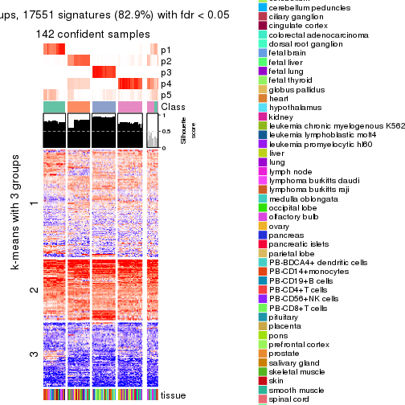</p>

</div>
<div id='tab-SD-kmeans-get-signatures-no-scale-5'>
<pre><code class="r">get_signatures(res, k = 6, scale_rows = FALSE)
</code></pre>

<p></p>

</div>
</div>


Compare the overlap of signatures from different k:

```r
compare_signatures(res)
```


`get_signature()` returns a data frame invisibly. TO get the list of signatures, the function
call should be assigned to a variable explicitly. In following code, if `plot` argument is set
to `FALSE`, no heatmap is plotted while only the differential analysis is performed.

```r
# code only for demonstration
tb = get_signature(res, k = ..., plot = FALSE)
```

An example of the output of `tb` is:

```
#>   which_row         fdr    mean_1    mean_2 scaled_mean_1 scaled_mean_2 km
#> 1        38 0.042760348  8.373488  9.131774    -0.5533452     0.5164555  1
#> 2        40 0.018707592  7.106213  8.469186    -0.6173731     0.5762149  1
#> 3        55 0.019134737 10.221463 11.207825    -0.6159697     0.5749050  1
#> 4        59 0.006059896  5.921854  7.869574    -0.6899429     0.6439467  1
#> 5        60 0.018055526  8.928898 10.211722    -0.6204761     0.5791110  1
#> 6        98 0.009384629 15.714769 14.887706     0.6635654    -0.6193277  2
...
```

The columns in `tb` are:

1. `which_row`: row indices corresponding to the input matrix.
2. `fdr`: FDR for the differential test. 
3. `mean_x`: The mean value in group x.
4. `scaled_mean_x`: The mean value in group x after rows are scaled.
5. `km`: Row groups if k-means clustering is applied to rows.


UMAP plot which shows how samples are separated.


<script>
$( function() {
	$( '#tabs-SD-kmeans-dimension-reduction' ).tabs();
} );
</script>
<div id='tabs-SD-kmeans-dimension-reduction'>
<ul>
<li><a href='#tab-SD-kmeans-dimension-reduction-1'>k = 2</a></li>
<li><a href='#tab-SD-kmeans-dimension-reduction-2'>k = 3</a></li>
<li><a href='#tab-SD-kmeans-dimension-reduction-3'>k = 4</a></li>
<li><a href='#tab-SD-kmeans-dimension-reduction-4'>k = 5</a></li>
<li><a href='#tab-SD-kmeans-dimension-reduction-5'>k = 6</a></li>
</ul>
<div id='tab-SD-kmeans-dimension-reduction-1'>
<pre><code class="r">dimension_reduction(res, k = 2, method = &quot;UMAP&quot;)
</code></pre>

<p></p>

</div>
<div id='tab-SD-kmeans-dimension-reduction-2'>
<pre><code class="r">dimension_reduction(res, k = 3, method = &quot;UMAP&quot;)
</code></pre>

<p></p>

</div>
<div id='tab-SD-kmeans-dimension-reduction-3'>
<pre><code class="r">dimension_reduction(res, k = 4, method = &quot;UMAP&quot;)
</code></pre>

<p></p>

</div>
<div id='tab-SD-kmeans-dimension-reduction-4'>
<pre><code class="r">dimension_reduction(res, k = 5, method = &quot;UMAP&quot;)
</code></pre>

<p></p>

</div>
<div id='tab-SD-kmeans-dimension-reduction-5'>
<pre><code class="r">dimension_reduction(res, k = 6, method = &quot;UMAP&quot;)
</code></pre>

<p></p>

</div>
</div>


Following heatmap shows how subgroups are split when increasing `k`:

```r
collect_classes(res)
```


Test correlation between subgroups and known annotations. If the known
annotation is numeric, one-way ANOVA test is applied, and if the known
annotation is discrete, chi-squared contingency table test is applied.

```r
test_to_known_factors(res)
```

```
#>             n tissue(p) k
#> SD:kmeans 158  2.28e-07 2
#> SD:kmeans 157  1.06e-12 3
#> SD:kmeans 149  2.79e-17 4
#> SD:kmeans 142  2.43e-16 5
#> SD:kmeans 109  5.49e-17 6
```


If matrix rows can be associated to genes, consider to use `functional_enrichment(res,
...)` to perform function enrichment for the signature genes. See [this vignette](http://bioconductor.org/packages/devel/bioc/vignettes/cola/inst/doc/functional_enrichment.html) for more detailed explanations.


 

---------------------------------------------------


### SD:skmeans**


The object with results only for a single top-value method and a single partition method 
can be extracted as:

```r
res = res_list["SD", "skmeans"]
# you can also extract it by
# res = res_list["SD:skmeans"]
```

A summary of `res` and all the functions that can be applied to it:

```r
res
```

```
#> A 'ConsensusPartition' object with k = 2, 3, 4, 5, 6.
#>   On a matrix with 21168 rows and 158 columns.
#>   Top rows (1000, 2000, 3000, 4000, 5000) are extracted by 'SD' method.
#>   Subgroups are detected by 'skmeans' method.
#>   Performed in total 1250 partitions by row resampling.
#>   Best k for subgroups seems to be 5.
#> 
#> Following methods can be applied to this 'ConsensusPartition' object:
#>  [1] "cola_report"             "collect_classes"         "collect_plots"          
#>  [4] "collect_stats"           "colnames"                "compare_signatures"     
#>  [7] "consensus_heatmap"       "dimension_reduction"     "functional_enrichment"  
#> [10] "get_anno_col"            "get_anno"                "get_classes"            
#> [13] "get_consensus"           "get_matrix"              "get_membership"         
#> [16] "get_param"               "get_signatures"          "get_stats"              
#> [19] "is_best_k"               "is_stable_k"             "membership_heatmap"     
#> [22] "ncol"                    "nrow"                    "plot_ecdf"              
#> [25] "rownames"                "select_partition_number" "show"                   
#> [28] "suggest_best_k"          "test_to_known_factors"
```

`collect_plots()` function collects all the plots made from `res` for all `k` (number of partitions)
into one single page to provide an easy and fast comparison between different `k`.

```r
collect_plots(res)
```


The plots are:

- The first row: a plot of the ECDF (empirical cumulative distribution
  function) curves of the consensus matrix for each `k` and the heatmap of
  predicted classes for each `k`.
- The second row: heatmaps of the consensus matrix for each `k`.
- The third row: heatmaps of the membership matrix for each `k`.
- The fouth row: heatmaps of the signatures for each `k`.

All the plots in panels can be made by individual functions and they are
plotted later in this section.

`select_partition_number()` produces several plots showing different
statistics for choosing "optimized" `k`. There are following statistics:

- ECDF curves of the consensus matrix for each `k`;
- 1-PAC. [The PAC
  score](https://en.wikipedia.org/wiki/Consensus_clustering#Over-interpretation_potential_of_consensus_clustering)
  measures the proportion of the ambiguous subgrouping.
- Mean silhouette score.
- Concordance. The mean probability of fiting the consensus class ids in all
  partitions.
- Area increased. Denote $A_k$ as the area under the ECDF curve for current
  `k`, the area increased is defined as $A_k - A_{k-1}$.
- Rand index. The percent of pairs of samples that are both in a same cluster
  or both are not in a same cluster in the partition of k and k-1.
- Jaccard index. The ratio of pairs of samples are both in a same cluster in
  the partition of k and k-1 and the pairs of samples are both in a same
  cluster in the partition k or k-1.

The detailed explanations of these statistics can be found in [the _cola_
vignette](http://bioconductor.org/packages/devel/bioc/vignettes/cola/inst/doc/cola.html#toc_13).

Generally speaking, lower PAC score, higher mean silhouette score or higher
concordance corresponds to better partition. Rand index and Jaccard index
measure how similar the current partition is compared to partition with `k-1`.
If they are too similar, we won't accept `k` is better than `k-1`.

```r
select_partition_number(res)
```


The numeric values for all these statistics can be obtained by `get_stats()`.

```r
get_stats(res)
```

```
#>   k 1-PAC mean_silhouette concordance area_increased  Rand Jaccard
#> 2 2 0.700           0.921       0.957         0.4937 0.497   0.497
#> 3 3 1.000           0.986       0.993         0.3064 0.644   0.412
#> 4 4 1.000           0.961       0.980         0.1675 0.865   0.635
#> 5 5 0.972           0.937       0.962         0.0383 0.968   0.871
#> 6 6 0.892           0.803       0.901         0.0368 0.975   0.888
```

`suggest_best_k()` suggests the best $k$ based on these statistics. The rules are as follows:

- All $k$ with Jaccard index larger than 0.95 are removed because increasing
  $k$ does not provide enough extra information. If all $k$ are removed, it is
  marked as no subgroup is detected.
- For all $k$ with 1-PAC score larger than 0.9, the maximal $k$ is taken as
  the best $k$, and other $k$ are marked as optional $k$.
- If it does not fit the second rule. The $k$ with the maximal vote of the
  highest 1-PAC score, highest mean silhouette, and highest concordance is
  taken as the best $k$.

```r
suggest_best_k(res)
```

```
#> [1] 5
#> attr(,"optional")
#> [1] 3 4
```

There is also optional best $k$ = 3 4 that is worth to check.

Following shows the table of the partitions (You need to click the **show/hide
code output** link to see it). The membership matrix (columns with name `p*`)
is inferred by
[`clue::cl_consensus()`](https://www.rdocumentation.org/link/cl_consensus?package=clue)
function with the `SE` method. Basically the value in the membership matrix
represents the probability to belong to a certain group. The finall class
label for an item is determined with the group with highest probability it
belongs to.

In `get_classes()` function, the entropy is calculated from the membership
matrix and the silhouette score is calculated from the consensus matrix.


<script>
$( function() {
	$( '#tabs-SD-skmeans-get-classes' ).tabs();
} );
</script>
<div id='tabs-SD-skmeans-get-classes'>
<ul>
<li><a href='#tab-SD-skmeans-get-classes-1'>k = 2</a></li>
<li><a href='#tab-SD-skmeans-get-classes-2'>k = 3</a></li>
<li><a href='#tab-SD-skmeans-get-classes-3'>k = 4</a></li>
<li><a href='#tab-SD-skmeans-get-classes-4'>k = 5</a></li>
<li><a href='#tab-SD-skmeans-get-classes-5'>k = 6</a></li>
</ul>

<div id='tab-SD-skmeans-get-classes-1'>
<p><a id='tab-SD-skmeans-get-classes-1-a' style='color:#0366d6' href='#'>show/hide code output</a></p>
<pre><code class="r">cbind(get_classes(res, k = 2), get_membership(res, k = 2))
</code></pre>

<pre><code>#&gt;          class entropy silhouette    p1    p2
#&gt; GSM18927     2  0.0000      0.928 0.000 1.000
#&gt; GSM18928     2  0.0000      0.928 0.000 1.000
#&gt; GSM18915     2  0.0000      0.928 0.000 1.000
#&gt; GSM18916     2  0.0000      0.928 0.000 1.000
#&gt; GSM18939     2  0.0000      0.928 0.000 1.000
#&gt; GSM18940     2  0.0000      0.928 0.000 1.000
#&gt; GSM18933     2  0.0000      0.928 0.000 1.000
#&gt; GSM18934     2  0.0000      0.928 0.000 1.000
#&gt; GSM18925     2  0.0000      0.928 0.000 1.000
#&gt; GSM18926     2  0.0000      0.928 0.000 1.000
#&gt; GSM18931     2  0.0000      0.928 0.000 1.000
#&gt; GSM18932     2  0.0000      0.928 0.000 1.000
#&gt; GSM19019     2  0.0000      0.928 0.000 1.000
#&gt; GSM19020     2  0.0000      0.928 0.000 1.000
#&gt; GSM18923     2  0.0000      0.928 0.000 1.000
#&gt; GSM18924     2  0.0000      0.928 0.000 1.000
#&gt; GSM18941     2  0.0000      0.928 0.000 1.000
#&gt; GSM18942     2  0.0000      0.928 0.000 1.000
#&gt; GSM18929     2  0.0000      0.928 0.000 1.000
#&gt; GSM18930     2  0.0000      0.928 0.000 1.000
#&gt; GSM18911     2  0.0000      0.928 0.000 1.000
#&gt; GSM18912     2  0.0000      0.928 0.000 1.000
#&gt; GSM18935     2  0.0000      0.928 0.000 1.000
#&gt; GSM18936     2  0.0000      0.928 0.000 1.000
#&gt; GSM19005     2  0.0000      0.928 0.000 1.000
#&gt; GSM19006     2  0.0000      0.928 0.000 1.000
#&gt; GSM18921     2  0.0000      0.928 0.000 1.000
#&gt; GSM18922     2  0.0000      0.928 0.000 1.000
#&gt; GSM18919     2  0.0000      0.928 0.000 1.000
#&gt; GSM18920     2  0.0000      0.928 0.000 1.000
#&gt; GSM18917     2  0.0000      0.928 0.000 1.000
#&gt; GSM18918     2  0.0000      0.928 0.000 1.000
#&gt; GSM18913     2  0.0000      0.928 0.000 1.000
#&gt; GSM18914     2  0.0000      0.928 0.000 1.000
#&gt; GSM18937     2  0.0000      0.928 0.000 1.000
#&gt; GSM18938     2  0.0000      0.928 0.000 1.000
#&gt; GSM18943     2  0.0000      0.928 0.000 1.000
#&gt; GSM18944     2  0.0000      0.928 0.000 1.000
#&gt; GSM19003     2  0.0000      0.928 0.000 1.000
#&gt; GSM19004     2  0.0000      0.928 0.000 1.000
#&gt; GSM19011     2  0.0000      0.928 0.000 1.000
#&gt; GSM19012     2  0.0000      0.928 0.000 1.000
#&gt; GSM19009     2  0.0000      0.928 0.000 1.000
#&gt; GSM19010     2  0.0000      0.928 0.000 1.000
#&gt; GSM18945     2  0.0000      0.928 0.000 1.000
#&gt; GSM18946     2  0.0000      0.928 0.000 1.000
#&gt; GSM18963     2  0.9944      0.291 0.456 0.544
#&gt; GSM18964     1  0.5294      0.850 0.880 0.120
#&gt; GSM18905     1  0.0000      0.980 1.000 0.000
#&gt; GSM18906     1  0.0000      0.980 1.000 0.000
#&gt; GSM18965     1  0.0000      0.980 1.000 0.000
#&gt; GSM18966     1  0.0000      0.980 1.000 0.000
#&gt; GSM18873     1  0.0000      0.980 1.000 0.000
#&gt; GSM18874     1  0.0000      0.980 1.000 0.000
#&gt; GSM18973     1  0.0000      0.980 1.000 0.000
#&gt; GSM18974     1  0.0000      0.980 1.000 0.000
#&gt; GSM18977     1  0.0000      0.980 1.000 0.000
#&gt; GSM18978     1  0.0000      0.980 1.000 0.000
#&gt; GSM18979     1  0.0000      0.980 1.000 0.000
#&gt; GSM18980     1  0.4161      0.893 0.916 0.084
#&gt; GSM18883     1  0.0000      0.980 1.000 0.000
#&gt; GSM18884     1  0.0000      0.980 1.000 0.000
#&gt; GSM18885     1  0.0000      0.980 1.000 0.000
#&gt; GSM18886     1  0.0000      0.980 1.000 0.000
#&gt; GSM18907     1  0.0000      0.980 1.000 0.000
#&gt; GSM18908     1  0.0000      0.980 1.000 0.000
#&gt; GSM18909     1  0.0000      0.980 1.000 0.000
#&gt; GSM18910     1  0.0000      0.980 1.000 0.000
#&gt; GSM18867     1  0.0000      0.980 1.000 0.000
#&gt; GSM18868     1  0.0000      0.980 1.000 0.000
#&gt; GSM18947     2  0.7056      0.826 0.192 0.808
#&gt; GSM18948     2  0.7219      0.819 0.200 0.800
#&gt; GSM18995     2  0.3879      0.896 0.076 0.924
#&gt; GSM18996     2  0.3584      0.900 0.068 0.932
#&gt; GSM18975     1  0.7376      0.716 0.792 0.208
#&gt; GSM18976     1  0.5946      0.818 0.856 0.144
#&gt; GSM18997     2  0.7219      0.819 0.200 0.800
#&gt; GSM18998     2  0.7219      0.819 0.200 0.800
#&gt; GSM18967     1  0.0000      0.980 1.000 0.000
#&gt; GSM18968     1  0.0000      0.980 1.000 0.000
#&gt; GSM18959     1  0.5519      0.840 0.872 0.128
#&gt; GSM18960     1  0.5059      0.861 0.888 0.112
#&gt; GSM19015     2  0.7219      0.819 0.200 0.800
#&gt; GSM19016     2  0.7219      0.819 0.200 0.800
#&gt; GSM18957     1  0.0000      0.980 1.000 0.000
#&gt; GSM18958     1  0.0000      0.980 1.000 0.000
#&gt; GSM18981     2  0.7219      0.819 0.200 0.800
#&gt; GSM18982     2  0.7219      0.819 0.200 0.800
#&gt; GSM18989     2  0.7139      0.823 0.196 0.804
#&gt; GSM18990     2  0.7219      0.819 0.200 0.800
#&gt; GSM18985     2  0.7219      0.819 0.200 0.800
#&gt; GSM18986     2  0.7139      0.823 0.196 0.804
#&gt; GSM18987     2  0.7219      0.819 0.200 0.800
#&gt; GSM18988     2  0.7219      0.819 0.200 0.800
#&gt; GSM18983     2  0.7139      0.823 0.196 0.804
#&gt; GSM18984     2  0.7139      0.823 0.196 0.804
#&gt; GSM18951     2  0.7219      0.819 0.200 0.800
#&gt; GSM18952     1  0.1184      0.966 0.984 0.016
#&gt; GSM19007     2  0.0000      0.928 0.000 1.000
#&gt; GSM19008     2  0.0000      0.928 0.000 1.000
#&gt; GSM18999     2  0.2423      0.913 0.040 0.960
#&gt; GSM19000     2  0.2603      0.911 0.044 0.956
#&gt; GSM18889     1  0.0000      0.980 1.000 0.000
#&gt; GSM18890     1  0.0000      0.980 1.000 0.000
#&gt; GSM18881     1  0.0000      0.980 1.000 0.000
#&gt; GSM18882     1  0.0000      0.980 1.000 0.000
#&gt; GSM18877     1  0.0000      0.980 1.000 0.000
#&gt; GSM18878     1  0.0000      0.980 1.000 0.000
#&gt; GSM18875     1  0.0000      0.980 1.000 0.000
#&gt; GSM18876     1  0.0000      0.980 1.000 0.000
#&gt; GSM18879     1  0.0000      0.980 1.000 0.000
#&gt; GSM18880     1  0.0000      0.980 1.000 0.000
#&gt; GSM18871     1  0.0000      0.980 1.000 0.000
#&gt; GSM18872     1  0.0000      0.980 1.000 0.000
#&gt; GSM18903     1  0.0000      0.980 1.000 0.000
#&gt; GSM18904     1  0.0000      0.980 1.000 0.000
#&gt; GSM18949     1  0.0000      0.980 1.000 0.000
#&gt; GSM18950     1  0.0000      0.980 1.000 0.000
#&gt; GSM18953     1  0.9580      0.292 0.620 0.380
#&gt; GSM18954     1  0.3114      0.926 0.944 0.056
#&gt; GSM19013     2  0.1843      0.918 0.028 0.972
#&gt; GSM19014     2  0.3114      0.906 0.056 0.944
#&gt; GSM18971     1  0.0000      0.980 1.000 0.000
#&gt; GSM18972     1  0.0000      0.980 1.000 0.000
#&gt; GSM18969     1  0.0000      0.980 1.000 0.000
#&gt; GSM18970     1  0.0672      0.973 0.992 0.008
#&gt; GSM18869     1  0.0000      0.980 1.000 0.000
#&gt; GSM18870     1  0.0000      0.980 1.000 0.000
#&gt; GSM19017     2  0.7219      0.819 0.200 0.800
#&gt; GSM19018     2  0.7219      0.819 0.200 0.800
#&gt; GSM18991     1  0.0000      0.980 1.000 0.000
#&gt; GSM18992     1  0.5842      0.821 0.860 0.140
#&gt; GSM19021     2  0.0000      0.928 0.000 1.000
#&gt; GSM19022     2  0.0000      0.928 0.000 1.000
#&gt; GSM19001     2  0.7219      0.819 0.200 0.800
#&gt; GSM19002     2  0.7219      0.819 0.200 0.800
#&gt; GSM18899     1  0.0000      0.980 1.000 0.000
#&gt; GSM18900     1  0.0000      0.980 1.000 0.000
#&gt; GSM18961     1  0.0000      0.980 1.000 0.000
#&gt; GSM18962     1  0.0000      0.980 1.000 0.000
#&gt; GSM18901     1  0.0000      0.980 1.000 0.000
#&gt; GSM18902     1  0.0000      0.980 1.000 0.000
#&gt; GSM18993     1  0.0000      0.980 1.000 0.000
#&gt; GSM18994     1  0.0000      0.980 1.000 0.000
#&gt; GSM18865     1  0.0000      0.980 1.000 0.000
#&gt; GSM18866     1  0.0000      0.980 1.000 0.000
#&gt; GSM18897     1  0.0000      0.980 1.000 0.000
#&gt; GSM18898     1  0.0000      0.980 1.000 0.000
#&gt; GSM18887     1  0.0000      0.980 1.000 0.000
#&gt; GSM18888     1  0.0000      0.980 1.000 0.000
#&gt; GSM18893     1  0.0000      0.980 1.000 0.000
#&gt; GSM18894     1  0.0000      0.980 1.000 0.000
#&gt; GSM18895     1  0.0000      0.980 1.000 0.000
#&gt; GSM18896     1  0.0000      0.980 1.000 0.000
#&gt; GSM18891     1  0.0000      0.980 1.000 0.000
#&gt; GSM18892     1  0.0000      0.980 1.000 0.000
#&gt; GSM18955     2  0.7219      0.819 0.200 0.800
#&gt; GSM18956     2  0.7219      0.819 0.200 0.800
</code></pre>

<script>
$('#tab-SD-skmeans-get-classes-1-a').parent().next().next().hide();
$('#tab-SD-skmeans-get-classes-1-a').click(function(){
  $('#tab-SD-skmeans-get-classes-1-a').parent().next().next().toggle();
  return(false);
});
</script>
</div>

<div id='tab-SD-skmeans-get-classes-2'>
<p><a id='tab-SD-skmeans-get-classes-2-a' style='color:#0366d6' href='#'>show/hide code output</a></p>
<pre><code class="r">cbind(get_classes(res, k = 3), get_membership(res, k = 3))
</code></pre>

<pre><code>#&gt;          class entropy silhouette    p1    p2    p3
#&gt; GSM18927     3  0.0000      1.000 0.000 0.000 1.000
#&gt; GSM18928     3  0.0000      1.000 0.000 0.000 1.000
#&gt; GSM18915     3  0.0000      1.000 0.000 0.000 1.000
#&gt; GSM18916     3  0.0000      1.000 0.000 0.000 1.000
#&gt; GSM18939     3  0.0000      1.000 0.000 0.000 1.000
#&gt; GSM18940     3  0.0000      1.000 0.000 0.000 1.000
#&gt; GSM18933     3  0.0000      1.000 0.000 0.000 1.000
#&gt; GSM18934     3  0.0000      1.000 0.000 0.000 1.000
#&gt; GSM18925     3  0.0000      1.000 0.000 0.000 1.000
#&gt; GSM18926     3  0.0000      1.000 0.000 0.000 1.000
#&gt; GSM18931     3  0.0000      1.000 0.000 0.000 1.000
#&gt; GSM18932     3  0.0000      1.000 0.000 0.000 1.000
#&gt; GSM19019     2  0.4346      0.790 0.000 0.816 0.184
#&gt; GSM19020     2  0.4346      0.790 0.000 0.816 0.184
#&gt; GSM18923     3  0.0000      1.000 0.000 0.000 1.000
#&gt; GSM18924     3  0.0000      1.000 0.000 0.000 1.000
#&gt; GSM18941     3  0.0000      1.000 0.000 0.000 1.000
#&gt; GSM18942     3  0.0000      1.000 0.000 0.000 1.000
#&gt; GSM18929     3  0.0000      1.000 0.000 0.000 1.000
#&gt; GSM18930     3  0.0000      1.000 0.000 0.000 1.000
#&gt; GSM18911     3  0.0000      1.000 0.000 0.000 1.000
#&gt; GSM18912     3  0.0000      1.000 0.000 0.000 1.000
#&gt; GSM18935     3  0.0000      1.000 0.000 0.000 1.000
#&gt; GSM18936     3  0.0000      1.000 0.000 0.000 1.000
#&gt; GSM19005     2  0.0000      0.985 0.000 1.000 0.000
#&gt; GSM19006     2  0.0000      0.985 0.000 1.000 0.000
#&gt; GSM18921     3  0.0000      1.000 0.000 0.000 1.000
#&gt; GSM18922     3  0.0000      1.000 0.000 0.000 1.000
#&gt; GSM18919     3  0.0000      1.000 0.000 0.000 1.000
#&gt; GSM18920     3  0.0000      1.000 0.000 0.000 1.000
#&gt; GSM18917     3  0.0000      1.000 0.000 0.000 1.000
#&gt; GSM18918     3  0.0000      1.000 0.000 0.000 1.000
#&gt; GSM18913     3  0.0000      1.000 0.000 0.000 1.000
#&gt; GSM18914     3  0.0000      1.000 0.000 0.000 1.000
#&gt; GSM18937     3  0.0000      1.000 0.000 0.000 1.000
#&gt; GSM18938     3  0.0000      1.000 0.000 0.000 1.000
#&gt; GSM18943     3  0.0000      1.000 0.000 0.000 1.000
#&gt; GSM18944     3  0.0000      1.000 0.000 0.000 1.000
#&gt; GSM19003     2  0.0000      0.985 0.000 1.000 0.000
#&gt; GSM19004     2  0.0000      0.985 0.000 1.000 0.000
#&gt; GSM19011     2  0.2959      0.893 0.000 0.900 0.100
#&gt; GSM19012     2  0.2796      0.901 0.000 0.908 0.092
#&gt; GSM19009     2  0.3267      0.875 0.000 0.884 0.116
#&gt; GSM19010     2  0.2878      0.897 0.000 0.904 0.096
#&gt; GSM18945     3  0.0000      1.000 0.000 0.000 1.000
#&gt; GSM18946     3  0.0000      1.000 0.000 0.000 1.000
#&gt; GSM18963     2  0.0000      0.985 0.000 1.000 0.000
#&gt; GSM18964     2  0.0000      0.985 0.000 1.000 0.000
#&gt; GSM18905     2  0.0000      0.985 0.000 1.000 0.000
#&gt; GSM18906     2  0.0000      0.985 0.000 1.000 0.000
#&gt; GSM18965     2  0.0000      0.985 0.000 1.000 0.000
#&gt; GSM18966     2  0.0000      0.985 0.000 1.000 0.000
#&gt; GSM18873     1  0.0000      1.000 1.000 0.000 0.000
#&gt; GSM18874     1  0.0000      1.000 1.000 0.000 0.000
#&gt; GSM18973     1  0.0237      0.995 0.996 0.004 0.000
#&gt; GSM18974     1  0.0237      0.995 0.996 0.004 0.000
#&gt; GSM18977     2  0.0000      0.985 0.000 1.000 0.000
#&gt; GSM18978     2  0.0000      0.985 0.000 1.000 0.000
#&gt; GSM18979     2  0.0000      0.985 0.000 1.000 0.000
#&gt; GSM18980     2  0.0000      0.985 0.000 1.000 0.000
#&gt; GSM18883     1  0.0000      1.000 1.000 0.000 0.000
#&gt; GSM18884     1  0.0000      1.000 1.000 0.000 0.000
#&gt; GSM18885     1  0.0000      1.000 1.000 0.000 0.000
#&gt; GSM18886     1  0.0000      1.000 1.000 0.000 0.000
#&gt; GSM18907     1  0.0000      1.000 1.000 0.000 0.000
#&gt; GSM18908     1  0.0000      1.000 1.000 0.000 0.000
#&gt; GSM18909     1  0.0000      1.000 1.000 0.000 0.000
#&gt; GSM18910     1  0.0000      1.000 1.000 0.000 0.000
#&gt; GSM18867     1  0.0000      1.000 1.000 0.000 0.000
#&gt; GSM18868     1  0.0000      1.000 1.000 0.000 0.000
#&gt; GSM18947     2  0.0000      0.985 0.000 1.000 0.000
#&gt; GSM18948     2  0.0000      0.985 0.000 1.000 0.000
#&gt; GSM18995     2  0.0000      0.985 0.000 1.000 0.000
#&gt; GSM18996     2  0.0000      0.985 0.000 1.000 0.000
#&gt; GSM18975     2  0.0000      0.985 0.000 1.000 0.000
#&gt; GSM18976     2  0.0000      0.985 0.000 1.000 0.000
#&gt; GSM18997     2  0.0000      0.985 0.000 1.000 0.000
#&gt; GSM18998     2  0.0000      0.985 0.000 1.000 0.000
#&gt; GSM18967     2  0.0000      0.985 0.000 1.000 0.000
#&gt; GSM18968     2  0.0000      0.985 0.000 1.000 0.000
#&gt; GSM18959     2  0.0000      0.985 0.000 1.000 0.000
#&gt; GSM18960     2  0.0000      0.985 0.000 1.000 0.000
#&gt; GSM19015     2  0.0000      0.985 0.000 1.000 0.000
#&gt; GSM19016     2  0.0000      0.985 0.000 1.000 0.000
#&gt; GSM18957     2  0.0000      0.985 0.000 1.000 0.000
#&gt; GSM18958     2  0.0000      0.985 0.000 1.000 0.000
#&gt; GSM18981     2  0.0000      0.985 0.000 1.000 0.000
#&gt; GSM18982     2  0.0000      0.985 0.000 1.000 0.000
#&gt; GSM18989     2  0.0000      0.985 0.000 1.000 0.000
#&gt; GSM18990     2  0.0000      0.985 0.000 1.000 0.000
#&gt; GSM18985     2  0.0000      0.985 0.000 1.000 0.000
#&gt; GSM18986     2  0.0000      0.985 0.000 1.000 0.000
#&gt; GSM18987     2  0.0000      0.985 0.000 1.000 0.000
#&gt; GSM18988     2  0.0000      0.985 0.000 1.000 0.000
#&gt; GSM18983     2  0.0000      0.985 0.000 1.000 0.000
#&gt; GSM18984     2  0.0000      0.985 0.000 1.000 0.000
#&gt; GSM18951     2  0.0000      0.985 0.000 1.000 0.000
#&gt; GSM18952     2  0.0000      0.985 0.000 1.000 0.000
#&gt; GSM19007     2  0.0000      0.985 0.000 1.000 0.000
#&gt; GSM19008     2  0.0000      0.985 0.000 1.000 0.000
#&gt; GSM18999     2  0.0000      0.985 0.000 1.000 0.000
#&gt; GSM19000     2  0.0000      0.985 0.000 1.000 0.000
#&gt; GSM18889     1  0.0000      1.000 1.000 0.000 0.000
#&gt; GSM18890     1  0.0000      1.000 1.000 0.000 0.000
#&gt; GSM18881     1  0.0000      1.000 1.000 0.000 0.000
#&gt; GSM18882     1  0.0000      1.000 1.000 0.000 0.000
#&gt; GSM18877     1  0.0000      1.000 1.000 0.000 0.000
#&gt; GSM18878     1  0.0000      1.000 1.000 0.000 0.000
#&gt; GSM18875     1  0.0000      1.000 1.000 0.000 0.000
#&gt; GSM18876     1  0.0000      1.000 1.000 0.000 0.000
#&gt; GSM18879     1  0.0000      1.000 1.000 0.000 0.000
#&gt; GSM18880     1  0.0000      1.000 1.000 0.000 0.000
#&gt; GSM18871     1  0.0000      1.000 1.000 0.000 0.000
#&gt; GSM18872     1  0.0000      1.000 1.000 0.000 0.000
#&gt; GSM18903     1  0.0000      1.000 1.000 0.000 0.000
#&gt; GSM18904     1  0.0000      1.000 1.000 0.000 0.000
#&gt; GSM18949     2  0.0000      0.985 0.000 1.000 0.000
#&gt; GSM18950     2  0.0000      0.985 0.000 1.000 0.000
#&gt; GSM18953     2  0.0000      0.985 0.000 1.000 0.000
#&gt; GSM18954     2  0.0000      0.985 0.000 1.000 0.000
#&gt; GSM19013     2  0.0000      0.985 0.000 1.000 0.000
#&gt; GSM19014     2  0.0000      0.985 0.000 1.000 0.000
#&gt; GSM18971     2  0.3038      0.886 0.104 0.896 0.000
#&gt; GSM18972     2  0.3038      0.886 0.104 0.896 0.000
#&gt; GSM18969     2  0.3038      0.886 0.104 0.896 0.000
#&gt; GSM18970     2  0.0000      0.985 0.000 1.000 0.000
#&gt; GSM18869     1  0.0000      1.000 1.000 0.000 0.000
#&gt; GSM18870     1  0.0000      1.000 1.000 0.000 0.000
#&gt; GSM19017     2  0.0000      0.985 0.000 1.000 0.000
#&gt; GSM19018     2  0.0000      0.985 0.000 1.000 0.000
#&gt; GSM18991     2  0.0000      0.985 0.000 1.000 0.000
#&gt; GSM18992     2  0.0000      0.985 0.000 1.000 0.000
#&gt; GSM19021     3  0.0000      1.000 0.000 0.000 1.000
#&gt; GSM19022     3  0.0000      1.000 0.000 0.000 1.000
#&gt; GSM19001     2  0.0000      0.985 0.000 1.000 0.000
#&gt; GSM19002     2  0.0000      0.985 0.000 1.000 0.000
#&gt; GSM18899     1  0.0000      1.000 1.000 0.000 0.000
#&gt; GSM18900     1  0.0000      1.000 1.000 0.000 0.000
#&gt; GSM18961     2  0.0000      0.985 0.000 1.000 0.000
#&gt; GSM18962     2  0.0000      0.985 0.000 1.000 0.000
#&gt; GSM18901     1  0.0000      1.000 1.000 0.000 0.000
#&gt; GSM18902     1  0.0000      1.000 1.000 0.000 0.000
#&gt; GSM18993     2  0.0000      0.985 0.000 1.000 0.000
#&gt; GSM18994     2  0.0000      0.985 0.000 1.000 0.000
#&gt; GSM18865     1  0.0000      1.000 1.000 0.000 0.000
#&gt; GSM18866     1  0.0000      1.000 1.000 0.000 0.000
#&gt; GSM18897     1  0.0000      1.000 1.000 0.000 0.000
#&gt; GSM18898     1  0.0000      1.000 1.000 0.000 0.000
#&gt; GSM18887     1  0.0000      1.000 1.000 0.000 0.000
#&gt; GSM18888     1  0.0000      1.000 1.000 0.000 0.000
#&gt; GSM18893     1  0.0000      1.000 1.000 0.000 0.000
#&gt; GSM18894     1  0.0000      1.000 1.000 0.000 0.000
#&gt; GSM18895     1  0.0000      1.000 1.000 0.000 0.000
#&gt; GSM18896     1  0.0000      1.000 1.000 0.000 0.000
#&gt; GSM18891     1  0.0000      1.000 1.000 0.000 0.000
#&gt; GSM18892     1  0.0000      1.000 1.000 0.000 0.000
#&gt; GSM18955     2  0.0000      0.985 0.000 1.000 0.000
#&gt; GSM18956     2  0.0000      0.985 0.000 1.000 0.000
</code></pre>

<script>
$('#tab-SD-skmeans-get-classes-2-a').parent().next().next().hide();
$('#tab-SD-skmeans-get-classes-2-a').click(function(){
  $('#tab-SD-skmeans-get-classes-2-a').parent().next().next().toggle();
  return(false);
});
</script>
</div>

<div id='tab-SD-skmeans-get-classes-3'>
<p><a id='tab-SD-skmeans-get-classes-3-a' style='color:#0366d6' href='#'>show/hide code output</a></p>
<pre><code class="r">cbind(get_classes(res, k = 4), get_membership(res, k = 4))
</code></pre>

<pre><code>#&gt;          class entropy silhouette    p1    p2    p3    p4
#&gt; GSM18927     3  0.0000      0.981 0.000 0.000 1.000 0.000
#&gt; GSM18928     3  0.0000      0.981 0.000 0.000 1.000 0.000
#&gt; GSM18915     3  0.0000      0.981 0.000 0.000 1.000 0.000
#&gt; GSM18916     3  0.0000      0.981 0.000 0.000 1.000 0.000
#&gt; GSM18939     3  0.0000      0.981 0.000 0.000 1.000 0.000
#&gt; GSM18940     3  0.0000      0.981 0.000 0.000 1.000 0.000
#&gt; GSM18933     3  0.0000      0.981 0.000 0.000 1.000 0.000
#&gt; GSM18934     3  0.0000      0.981 0.000 0.000 1.000 0.000
#&gt; GSM18925     3  0.0000      0.981 0.000 0.000 1.000 0.000
#&gt; GSM18926     3  0.0000      0.981 0.000 0.000 1.000 0.000
#&gt; GSM18931     3  0.0000      0.981 0.000 0.000 1.000 0.000
#&gt; GSM18932     3  0.0000      0.981 0.000 0.000 1.000 0.000
#&gt; GSM19019     3  0.5736      0.447 0.000 0.328 0.628 0.044
#&gt; GSM19020     3  0.5736      0.447 0.000 0.328 0.628 0.044
#&gt; GSM18923     3  0.0000      0.981 0.000 0.000 1.000 0.000
#&gt; GSM18924     3  0.0000      0.981 0.000 0.000 1.000 0.000
#&gt; GSM18941     3  0.0000      0.981 0.000 0.000 1.000 0.000
#&gt; GSM18942     3  0.0000      0.981 0.000 0.000 1.000 0.000
#&gt; GSM18929     3  0.0000      0.981 0.000 0.000 1.000 0.000
#&gt; GSM18930     3  0.0000      0.981 0.000 0.000 1.000 0.000
#&gt; GSM18911     3  0.0000      0.981 0.000 0.000 1.000 0.000
#&gt; GSM18912     3  0.0000      0.981 0.000 0.000 1.000 0.000
#&gt; GSM18935     3  0.0000      0.981 0.000 0.000 1.000 0.000
#&gt; GSM18936     3  0.0000      0.981 0.000 0.000 1.000 0.000
#&gt; GSM19005     2  0.0921      0.960 0.000 0.972 0.000 0.028
#&gt; GSM19006     2  0.0921      0.960 0.000 0.972 0.000 0.028
#&gt; GSM18921     3  0.0000      0.981 0.000 0.000 1.000 0.000
#&gt; GSM18922     3  0.0000      0.981 0.000 0.000 1.000 0.000
#&gt; GSM18919     3  0.0000      0.981 0.000 0.000 1.000 0.000
#&gt; GSM18920     3  0.0000      0.981 0.000 0.000 1.000 0.000
#&gt; GSM18917     3  0.0000      0.981 0.000 0.000 1.000 0.000
#&gt; GSM18918     3  0.0000      0.981 0.000 0.000 1.000 0.000
#&gt; GSM18913     3  0.0000      0.981 0.000 0.000 1.000 0.000
#&gt; GSM18914     3  0.0000      0.981 0.000 0.000 1.000 0.000
#&gt; GSM18937     3  0.0000      0.981 0.000 0.000 1.000 0.000
#&gt; GSM18938     3  0.0000      0.981 0.000 0.000 1.000 0.000
#&gt; GSM18943     3  0.0000      0.981 0.000 0.000 1.000 0.000
#&gt; GSM18944     3  0.0000      0.981 0.000 0.000 1.000 0.000
#&gt; GSM19003     2  0.0921      0.960 0.000 0.972 0.000 0.028
#&gt; GSM19004     2  0.0921      0.960 0.000 0.972 0.000 0.028
#&gt; GSM19011     2  0.0921      0.960 0.000 0.972 0.000 0.028
#&gt; GSM19012     2  0.0921      0.960 0.000 0.972 0.000 0.028
#&gt; GSM19009     2  0.0921      0.960 0.000 0.972 0.000 0.028
#&gt; GSM19010     2  0.0921      0.960 0.000 0.972 0.000 0.028
#&gt; GSM18945     3  0.0000      0.981 0.000 0.000 1.000 0.000
#&gt; GSM18946     3  0.0000      0.981 0.000 0.000 1.000 0.000
#&gt; GSM18963     4  0.0000      0.985 0.000 0.000 0.000 1.000
#&gt; GSM18964     4  0.0000      0.985 0.000 0.000 0.000 1.000
#&gt; GSM18905     4  0.2011      0.930 0.000 0.080 0.000 0.920
#&gt; GSM18906     4  0.0921      0.969 0.000 0.028 0.000 0.972
#&gt; GSM18965     4  0.0000      0.985 0.000 0.000 0.000 1.000
#&gt; GSM18966     4  0.0000      0.985 0.000 0.000 0.000 1.000
#&gt; GSM18873     1  0.0000      0.999 1.000 0.000 0.000 0.000
#&gt; GSM18874     1  0.0000      0.999 1.000 0.000 0.000 0.000
#&gt; GSM18973     4  0.0921      0.969 0.000 0.028 0.000 0.972
#&gt; GSM18974     4  0.0921      0.969 0.000 0.028 0.000 0.972
#&gt; GSM18977     4  0.0921      0.969 0.000 0.028 0.000 0.972
#&gt; GSM18978     4  0.0000      0.985 0.000 0.000 0.000 1.000
#&gt; GSM18979     4  0.0000      0.985 0.000 0.000 0.000 1.000
#&gt; GSM18980     4  0.0921      0.969 0.000 0.028 0.000 0.972
#&gt; GSM18883     1  0.0000      0.999 1.000 0.000 0.000 0.000
#&gt; GSM18884     1  0.0000      0.999 1.000 0.000 0.000 0.000
#&gt; GSM18885     1  0.0000      0.999 1.000 0.000 0.000 0.000
#&gt; GSM18886     1  0.0000      0.999 1.000 0.000 0.000 0.000
#&gt; GSM18907     1  0.0000      0.999 1.000 0.000 0.000 0.000
#&gt; GSM18908     1  0.0000      0.999 1.000 0.000 0.000 0.000
#&gt; GSM18909     1  0.0000      0.999 1.000 0.000 0.000 0.000
#&gt; GSM18910     1  0.0000      0.999 1.000 0.000 0.000 0.000
#&gt; GSM18867     1  0.0000      0.999 1.000 0.000 0.000 0.000
#&gt; GSM18868     1  0.0000      0.999 1.000 0.000 0.000 0.000
#&gt; GSM18947     4  0.0000      0.985 0.000 0.000 0.000 1.000
#&gt; GSM18948     4  0.0000      0.985 0.000 0.000 0.000 1.000
#&gt; GSM18995     2  0.0921      0.960 0.000 0.972 0.000 0.028
#&gt; GSM18996     2  0.0921      0.960 0.000 0.972 0.000 0.028
#&gt; GSM18975     4  0.0000      0.985 0.000 0.000 0.000 1.000
#&gt; GSM18976     4  0.0000      0.985 0.000 0.000 0.000 1.000
#&gt; GSM18997     2  0.0921      0.960 0.000 0.972 0.000 0.028
#&gt; GSM18998     2  0.0921      0.960 0.000 0.972 0.000 0.028
#&gt; GSM18967     4  0.0000      0.985 0.000 0.000 0.000 1.000
#&gt; GSM18968     4  0.0000      0.985 0.000 0.000 0.000 1.000
#&gt; GSM18959     4  0.0000      0.985 0.000 0.000 0.000 1.000
#&gt; GSM18960     4  0.0000      0.985 0.000 0.000 0.000 1.000
#&gt; GSM19015     2  0.0921      0.960 0.000 0.972 0.000 0.028
#&gt; GSM19016     2  0.0921      0.960 0.000 0.972 0.000 0.028
#&gt; GSM18957     4  0.0000      0.985 0.000 0.000 0.000 1.000
#&gt; GSM18958     4  0.0000      0.985 0.000 0.000 0.000 1.000
#&gt; GSM18981     2  0.0000      0.949 0.000 1.000 0.000 0.000
#&gt; GSM18982     2  0.0000      0.949 0.000 1.000 0.000 0.000
#&gt; GSM18989     2  0.0000      0.949 0.000 1.000 0.000 0.000
#&gt; GSM18990     2  0.0000      0.949 0.000 1.000 0.000 0.000
#&gt; GSM18985     2  0.0000      0.949 0.000 1.000 0.000 0.000
#&gt; GSM18986     2  0.0000      0.949 0.000 1.000 0.000 0.000
#&gt; GSM18987     2  0.0000      0.949 0.000 1.000 0.000 0.000
#&gt; GSM18988     2  0.0000      0.949 0.000 1.000 0.000 0.000
#&gt; GSM18983     2  0.0000      0.949 0.000 1.000 0.000 0.000
#&gt; GSM18984     2  0.0000      0.949 0.000 1.000 0.000 0.000
#&gt; GSM18951     2  0.3975      0.715 0.000 0.760 0.000 0.240
#&gt; GSM18952     4  0.0000      0.985 0.000 0.000 0.000 1.000
#&gt; GSM19007     2  0.0921      0.960 0.000 0.972 0.000 0.028
#&gt; GSM19008     2  0.0921      0.960 0.000 0.972 0.000 0.028
#&gt; GSM18999     2  0.0921      0.960 0.000 0.972 0.000 0.028
#&gt; GSM19000     2  0.0921      0.960 0.000 0.972 0.000 0.028
#&gt; GSM18889     1  0.0000      0.999 1.000 0.000 0.000 0.000
#&gt; GSM18890     1  0.0000      0.999 1.000 0.000 0.000 0.000
#&gt; GSM18881     1  0.0000      0.999 1.000 0.000 0.000 0.000
#&gt; GSM18882     1  0.0000      0.999 1.000 0.000 0.000 0.000
#&gt; GSM18877     1  0.0000      0.999 1.000 0.000 0.000 0.000
#&gt; GSM18878     1  0.0000      0.999 1.000 0.000 0.000 0.000
#&gt; GSM18875     1  0.0000      0.999 1.000 0.000 0.000 0.000
#&gt; GSM18876     1  0.0000      0.999 1.000 0.000 0.000 0.000
#&gt; GSM18879     1  0.0000      0.999 1.000 0.000 0.000 0.000
#&gt; GSM18880     1  0.0000      0.999 1.000 0.000 0.000 0.000
#&gt; GSM18871     1  0.0000      0.999 1.000 0.000 0.000 0.000
#&gt; GSM18872     1  0.0000      0.999 1.000 0.000 0.000 0.000
#&gt; GSM18903     1  0.0000      0.999 1.000 0.000 0.000 0.000
#&gt; GSM18904     1  0.0000      0.999 1.000 0.000 0.000 0.000
#&gt; GSM18949     4  0.0000      0.985 0.000 0.000 0.000 1.000
#&gt; GSM18950     4  0.0000      0.985 0.000 0.000 0.000 1.000
#&gt; GSM18953     4  0.0000      0.985 0.000 0.000 0.000 1.000
#&gt; GSM18954     4  0.0000      0.985 0.000 0.000 0.000 1.000
#&gt; GSM19013     2  0.0921      0.960 0.000 0.972 0.000 0.028
#&gt; GSM19014     2  0.0921      0.960 0.000 0.972 0.000 0.028
#&gt; GSM18971     4  0.0921      0.969 0.000 0.028 0.000 0.972
#&gt; GSM18972     4  0.0921      0.969 0.000 0.028 0.000 0.972
#&gt; GSM18969     4  0.0921      0.969 0.000 0.028 0.000 0.972
#&gt; GSM18970     4  0.3907      0.720 0.000 0.232 0.000 0.768
#&gt; GSM18869     1  0.0000      0.999 1.000 0.000 0.000 0.000
#&gt; GSM18870     1  0.0000      0.999 1.000 0.000 0.000 0.000
#&gt; GSM19017     2  0.1474      0.943 0.000 0.948 0.000 0.052
#&gt; GSM19018     2  0.1474      0.943 0.000 0.948 0.000 0.052
#&gt; GSM18991     2  0.4998      0.126 0.000 0.512 0.000 0.488
#&gt; GSM18992     2  0.4790      0.445 0.000 0.620 0.000 0.380
#&gt; GSM19021     3  0.0000      0.981 0.000 0.000 1.000 0.000
#&gt; GSM19022     3  0.0000      0.981 0.000 0.000 1.000 0.000
#&gt; GSM19001     2  0.0921      0.960 0.000 0.972 0.000 0.028
#&gt; GSM19002     2  0.0921      0.960 0.000 0.972 0.000 0.028
#&gt; GSM18899     1  0.0000      0.999 1.000 0.000 0.000 0.000
#&gt; GSM18900     1  0.0000      0.999 1.000 0.000 0.000 0.000
#&gt; GSM18961     4  0.0000      0.985 0.000 0.000 0.000 1.000
#&gt; GSM18962     4  0.0000      0.985 0.000 0.000 0.000 1.000
#&gt; GSM18901     1  0.0000      0.999 1.000 0.000 0.000 0.000
#&gt; GSM18902     1  0.0000      0.999 1.000 0.000 0.000 0.000
#&gt; GSM18993     4  0.0000      0.985 0.000 0.000 0.000 1.000
#&gt; GSM18994     4  0.0000      0.985 0.000 0.000 0.000 1.000
#&gt; GSM18865     1  0.0921      0.975 0.972 0.028 0.000 0.000
#&gt; GSM18866     1  0.0921      0.975 0.972 0.028 0.000 0.000
#&gt; GSM18897     1  0.0000      0.999 1.000 0.000 0.000 0.000
#&gt; GSM18898     1  0.0000      0.999 1.000 0.000 0.000 0.000
#&gt; GSM18887     1  0.0000      0.999 1.000 0.000 0.000 0.000
#&gt; GSM18888     1  0.0000      0.999 1.000 0.000 0.000 0.000
#&gt; GSM18893     1  0.0000      0.999 1.000 0.000 0.000 0.000
#&gt; GSM18894     1  0.0000      0.999 1.000 0.000 0.000 0.000
#&gt; GSM18895     1  0.0000      0.999 1.000 0.000 0.000 0.000
#&gt; GSM18896     1  0.0000      0.999 1.000 0.000 0.000 0.000
#&gt; GSM18891     1  0.0000      0.999 1.000 0.000 0.000 0.000
#&gt; GSM18892     1  0.0000      0.999 1.000 0.000 0.000 0.000
#&gt; GSM18955     4  0.0000      0.985 0.000 0.000 0.000 1.000
#&gt; GSM18956     4  0.0000      0.985 0.000 0.000 0.000 1.000
</code></pre>

<script>
$('#tab-SD-skmeans-get-classes-3-a').parent().next().next().hide();
$('#tab-SD-skmeans-get-classes-3-a').click(function(){
  $('#tab-SD-skmeans-get-classes-3-a').parent().next().next().toggle();
  return(false);
});
</script>
</div>

<div id='tab-SD-skmeans-get-classes-4'>
<p><a id='tab-SD-skmeans-get-classes-4-a' style='color:#0366d6' href='#'>show/hide code output</a></p>
<pre><code class="r">cbind(get_classes(res, k = 5), get_membership(res, k = 5))
</code></pre>

<pre><code>#&gt;          class entropy silhouette    p1    p2    p3    p4    p5
#&gt; GSM18927     3  0.0000      1.000 0.000 0.000 1.000 0.000 0.000
#&gt; GSM18928     3  0.0000      1.000 0.000 0.000 1.000 0.000 0.000
#&gt; GSM18915     3  0.0000      1.000 0.000 0.000 1.000 0.000 0.000
#&gt; GSM18916     3  0.0000      1.000 0.000 0.000 1.000 0.000 0.000
#&gt; GSM18939     3  0.0000      1.000 0.000 0.000 1.000 0.000 0.000
#&gt; GSM18940     3  0.0000      1.000 0.000 0.000 1.000 0.000 0.000
#&gt; GSM18933     3  0.0000      1.000 0.000 0.000 1.000 0.000 0.000
#&gt; GSM18934     3  0.0000      1.000 0.000 0.000 1.000 0.000 0.000
#&gt; GSM18925     3  0.0000      1.000 0.000 0.000 1.000 0.000 0.000
#&gt; GSM18926     3  0.0000      1.000 0.000 0.000 1.000 0.000 0.000
#&gt; GSM18931     3  0.0000      1.000 0.000 0.000 1.000 0.000 0.000
#&gt; GSM18932     3  0.0000      1.000 0.000 0.000 1.000 0.000 0.000
#&gt; GSM19019     2  0.2928      0.829 0.000 0.872 0.064 0.064 0.000
#&gt; GSM19020     2  0.2209      0.867 0.000 0.912 0.056 0.032 0.000
#&gt; GSM18923     3  0.0000      1.000 0.000 0.000 1.000 0.000 0.000
#&gt; GSM18924     3  0.0000      1.000 0.000 0.000 1.000 0.000 0.000
#&gt; GSM18941     3  0.0000      1.000 0.000 0.000 1.000 0.000 0.000
#&gt; GSM18942     3  0.0000      1.000 0.000 0.000 1.000 0.000 0.000
#&gt; GSM18929     3  0.0000      1.000 0.000 0.000 1.000 0.000 0.000
#&gt; GSM18930     3  0.0000      1.000 0.000 0.000 1.000 0.000 0.000
#&gt; GSM18911     3  0.0000      1.000 0.000 0.000 1.000 0.000 0.000
#&gt; GSM18912     3  0.0000      1.000 0.000 0.000 1.000 0.000 0.000
#&gt; GSM18935     3  0.0000      1.000 0.000 0.000 1.000 0.000 0.000
#&gt; GSM18936     3  0.0000      1.000 0.000 0.000 1.000 0.000 0.000
#&gt; GSM19005     2  0.0000      0.951 0.000 1.000 0.000 0.000 0.000
#&gt; GSM19006     2  0.0000      0.951 0.000 1.000 0.000 0.000 0.000
#&gt; GSM18921     3  0.0000      1.000 0.000 0.000 1.000 0.000 0.000
#&gt; GSM18922     3  0.0000      1.000 0.000 0.000 1.000 0.000 0.000
#&gt; GSM18919     3  0.0000      1.000 0.000 0.000 1.000 0.000 0.000
#&gt; GSM18920     3  0.0000      1.000 0.000 0.000 1.000 0.000 0.000
#&gt; GSM18917     3  0.0000      1.000 0.000 0.000 1.000 0.000 0.000
#&gt; GSM18918     3  0.0000      1.000 0.000 0.000 1.000 0.000 0.000
#&gt; GSM18913     3  0.0000      1.000 0.000 0.000 1.000 0.000 0.000
#&gt; GSM18914     3  0.0000      1.000 0.000 0.000 1.000 0.000 0.000
#&gt; GSM18937     3  0.0000      1.000 0.000 0.000 1.000 0.000 0.000
#&gt; GSM18938     3  0.0000      1.000 0.000 0.000 1.000 0.000 0.000
#&gt; GSM18943     3  0.0000      1.000 0.000 0.000 1.000 0.000 0.000
#&gt; GSM18944     3  0.0000      1.000 0.000 0.000 1.000 0.000 0.000
#&gt; GSM19003     2  0.0000      0.951 0.000 1.000 0.000 0.000 0.000
#&gt; GSM19004     2  0.0000      0.951 0.000 1.000 0.000 0.000 0.000
#&gt; GSM19011     2  0.0000      0.951 0.000 1.000 0.000 0.000 0.000
#&gt; GSM19012     2  0.0000      0.951 0.000 1.000 0.000 0.000 0.000
#&gt; GSM19009     2  0.0000      0.951 0.000 1.000 0.000 0.000 0.000
#&gt; GSM19010     2  0.0000      0.951 0.000 1.000 0.000 0.000 0.000
#&gt; GSM18945     3  0.0000      1.000 0.000 0.000 1.000 0.000 0.000
#&gt; GSM18946     3  0.0000      1.000 0.000 0.000 1.000 0.000 0.000
#&gt; GSM18963     4  0.0162      0.919 0.000 0.004 0.000 0.996 0.000
#&gt; GSM18964     4  0.0162      0.919 0.000 0.004 0.000 0.996 0.000
#&gt; GSM18905     4  0.4823      0.650 0.000 0.052 0.000 0.672 0.276
#&gt; GSM18906     4  0.3534      0.729 0.000 0.000 0.000 0.744 0.256
#&gt; GSM18965     4  0.0162      0.919 0.000 0.004 0.000 0.996 0.000
#&gt; GSM18966     4  0.0162      0.919 0.000 0.004 0.000 0.996 0.000
#&gt; GSM18873     1  0.0000      0.973 1.000 0.000 0.000 0.000 0.000
#&gt; GSM18874     1  0.0000      0.973 1.000 0.000 0.000 0.000 0.000
#&gt; GSM18973     4  0.4003      0.664 0.008 0.000 0.000 0.704 0.288
#&gt; GSM18974     4  0.4003      0.664 0.008 0.000 0.000 0.704 0.288
#&gt; GSM18977     4  0.0609      0.911 0.000 0.000 0.000 0.980 0.020
#&gt; GSM18978     4  0.0324      0.918 0.000 0.004 0.000 0.992 0.004
#&gt; GSM18979     4  0.0324      0.918 0.000 0.004 0.000 0.992 0.004
#&gt; GSM18980     4  0.0794      0.908 0.000 0.000 0.000 0.972 0.028
#&gt; GSM18883     1  0.0794      0.968 0.972 0.000 0.000 0.000 0.028
#&gt; GSM18884     1  0.0794      0.968 0.972 0.000 0.000 0.000 0.028
#&gt; GSM18885     1  0.0000      0.973 1.000 0.000 0.000 0.000 0.000
#&gt; GSM18886     1  0.0000      0.973 1.000 0.000 0.000 0.000 0.000
#&gt; GSM18907     1  0.0955      0.966 0.968 0.000 0.000 0.004 0.028
#&gt; GSM18908     1  0.0955      0.966 0.968 0.000 0.000 0.004 0.028
#&gt; GSM18909     1  0.0404      0.968 0.988 0.000 0.000 0.000 0.012
#&gt; GSM18910     1  0.0404      0.968 0.988 0.000 0.000 0.000 0.012
#&gt; GSM18867     1  0.0000      0.973 1.000 0.000 0.000 0.000 0.000
#&gt; GSM18868     1  0.0000      0.973 1.000 0.000 0.000 0.000 0.000
#&gt; GSM18947     4  0.0798      0.914 0.000 0.008 0.000 0.976 0.016
#&gt; GSM18948     4  0.0798      0.914 0.000 0.008 0.000 0.976 0.016
#&gt; GSM18995     2  0.0290      0.945 0.000 0.992 0.000 0.000 0.008
#&gt; GSM18996     2  0.0162      0.948 0.000 0.996 0.000 0.000 0.004
#&gt; GSM18975     4  0.0955      0.910 0.000 0.004 0.000 0.968 0.028
#&gt; GSM18976     4  0.0955      0.910 0.000 0.004 0.000 0.968 0.028
#&gt; GSM18997     2  0.0000      0.951 0.000 1.000 0.000 0.000 0.000
#&gt; GSM18998     2  0.0000      0.951 0.000 1.000 0.000 0.000 0.000
#&gt; GSM18967     4  0.0162      0.919 0.000 0.004 0.000 0.996 0.000
#&gt; GSM18968     4  0.0162      0.919 0.000 0.004 0.000 0.996 0.000
#&gt; GSM18959     4  0.0162      0.919 0.000 0.004 0.000 0.996 0.000
#&gt; GSM18960     4  0.0162      0.919 0.000 0.004 0.000 0.996 0.000
#&gt; GSM19015     2  0.0000      0.951 0.000 1.000 0.000 0.000 0.000
#&gt; GSM19016     2  0.0000      0.951 0.000 1.000 0.000 0.000 0.000
#&gt; GSM18957     4  0.0162      0.919 0.000 0.004 0.000 0.996 0.000
#&gt; GSM18958     4  0.0162      0.919 0.000 0.004 0.000 0.996 0.000
#&gt; GSM18981     5  0.1544      0.999 0.000 0.068 0.000 0.000 0.932
#&gt; GSM18982     5  0.1544      0.999 0.000 0.068 0.000 0.000 0.932
#&gt; GSM18989     5  0.1544      0.999 0.000 0.068 0.000 0.000 0.932
#&gt; GSM18990     5  0.1544      0.999 0.000 0.068 0.000 0.000 0.932
#&gt; GSM18985     5  0.1544      0.999 0.000 0.068 0.000 0.000 0.932
#&gt; GSM18986     5  0.1704      0.995 0.000 0.068 0.000 0.004 0.928
#&gt; GSM18987     5  0.1544      0.999 0.000 0.068 0.000 0.000 0.932
#&gt; GSM18988     5  0.1544      0.999 0.000 0.068 0.000 0.000 0.932
#&gt; GSM18983     5  0.1544      0.999 0.000 0.068 0.000 0.000 0.932
#&gt; GSM18984     5  0.1544      0.999 0.000 0.068 0.000 0.000 0.932
#&gt; GSM18951     2  0.4275      0.588 0.000 0.696 0.000 0.284 0.020
#&gt; GSM18952     4  0.0771      0.914 0.000 0.004 0.000 0.976 0.020
#&gt; GSM19007     2  0.0000      0.951 0.000 1.000 0.000 0.000 0.000
#&gt; GSM19008     2  0.0000      0.951 0.000 1.000 0.000 0.000 0.000
#&gt; GSM18999     2  0.0000      0.951 0.000 1.000 0.000 0.000 0.000
#&gt; GSM19000     2  0.0000      0.951 0.000 1.000 0.000 0.000 0.000
#&gt; GSM18889     1  0.0703      0.969 0.976 0.000 0.000 0.000 0.024
#&gt; GSM18890     1  0.0703      0.969 0.976 0.000 0.000 0.000 0.024
#&gt; GSM18881     1  0.0000      0.973 1.000 0.000 0.000 0.000 0.000
#&gt; GSM18882     1  0.0000      0.973 1.000 0.000 0.000 0.000 0.000
#&gt; GSM18877     1  0.0000      0.973 1.000 0.000 0.000 0.000 0.000
#&gt; GSM18878     1  0.0000      0.973 1.000 0.000 0.000 0.000 0.000
#&gt; GSM18875     1  0.0000      0.973 1.000 0.000 0.000 0.000 0.000
#&gt; GSM18876     1  0.0000      0.973 1.000 0.000 0.000 0.000 0.000
#&gt; GSM18879     1  0.0000      0.973 1.000 0.000 0.000 0.000 0.000
#&gt; GSM18880     1  0.0000      0.973 1.000 0.000 0.000 0.000 0.000
#&gt; GSM18871     1  0.0000      0.973 1.000 0.000 0.000 0.000 0.000
#&gt; GSM18872     1  0.0000      0.973 1.000 0.000 0.000 0.000 0.000
#&gt; GSM18903     1  0.0671      0.961 0.980 0.000 0.000 0.016 0.004
#&gt; GSM18904     1  0.0671      0.961 0.980 0.000 0.000 0.016 0.004
#&gt; GSM18949     4  0.0324      0.918 0.000 0.004 0.000 0.992 0.004
#&gt; GSM18950     4  0.0324      0.918 0.000 0.004 0.000 0.992 0.004
#&gt; GSM18953     4  0.1493      0.897 0.000 0.028 0.000 0.948 0.024
#&gt; GSM18954     4  0.1310      0.903 0.000 0.020 0.000 0.956 0.024
#&gt; GSM19013     2  0.0000      0.951 0.000 1.000 0.000 0.000 0.000
#&gt; GSM19014     2  0.0000      0.951 0.000 1.000 0.000 0.000 0.000
#&gt; GSM18971     4  0.3534      0.707 0.000 0.000 0.000 0.744 0.256
#&gt; GSM18972     4  0.3534      0.707 0.000 0.000 0.000 0.744 0.256
#&gt; GSM18969     4  0.3534      0.707 0.000 0.000 0.000 0.744 0.256
#&gt; GSM18970     4  0.5758      0.506 0.000 0.132 0.000 0.600 0.268
#&gt; GSM18869     1  0.0000      0.973 1.000 0.000 0.000 0.000 0.000
#&gt; GSM18870     1  0.0000      0.973 1.000 0.000 0.000 0.000 0.000
#&gt; GSM19017     2  0.0000      0.951 0.000 1.000 0.000 0.000 0.000
#&gt; GSM19018     2  0.0000      0.951 0.000 1.000 0.000 0.000 0.000
#&gt; GSM18991     2  0.3861      0.625 0.000 0.728 0.000 0.264 0.008
#&gt; GSM18992     2  0.3783      0.641 0.000 0.740 0.000 0.252 0.008
#&gt; GSM19021     3  0.0000      1.000 0.000 0.000 1.000 0.000 0.000
#&gt; GSM19022     3  0.0000      1.000 0.000 0.000 1.000 0.000 0.000
#&gt; GSM19001     2  0.0000      0.951 0.000 1.000 0.000 0.000 0.000
#&gt; GSM19002     2  0.0000      0.951 0.000 1.000 0.000 0.000 0.000
#&gt; GSM18899     1  0.0162      0.972 0.996 0.000 0.000 0.000 0.004
#&gt; GSM18900     1  0.0162      0.972 0.996 0.000 0.000 0.000 0.004
#&gt; GSM18961     4  0.0162      0.919 0.000 0.004 0.000 0.996 0.000
#&gt; GSM18962     4  0.0162      0.919 0.000 0.004 0.000 0.996 0.000
#&gt; GSM18901     1  0.0162      0.972 0.996 0.000 0.000 0.000 0.004
#&gt; GSM18902     1  0.0162      0.972 0.996 0.000 0.000 0.000 0.004
#&gt; GSM18993     4  0.0451      0.918 0.000 0.004 0.000 0.988 0.008
#&gt; GSM18994     4  0.0451      0.918 0.000 0.004 0.000 0.988 0.008
#&gt; GSM18865     1  0.4130      0.612 0.696 0.000 0.000 0.012 0.292
#&gt; GSM18866     1  0.4109      0.619 0.700 0.000 0.000 0.012 0.288
#&gt; GSM18897     1  0.1205      0.961 0.956 0.000 0.000 0.004 0.040
#&gt; GSM18898     1  0.1205      0.961 0.956 0.000 0.000 0.004 0.040
#&gt; GSM18887     1  0.1041      0.965 0.964 0.000 0.000 0.004 0.032
#&gt; GSM18888     1  0.1041      0.965 0.964 0.000 0.000 0.004 0.032
#&gt; GSM18893     1  0.1041      0.965 0.964 0.000 0.000 0.004 0.032
#&gt; GSM18894     1  0.1041      0.965 0.964 0.000 0.000 0.004 0.032
#&gt; GSM18895     1  0.1041      0.965 0.964 0.000 0.000 0.004 0.032
#&gt; GSM18896     1  0.1041      0.965 0.964 0.000 0.000 0.004 0.032
#&gt; GSM18891     1  0.1041      0.965 0.964 0.000 0.000 0.004 0.032
#&gt; GSM18892     1  0.1041      0.965 0.964 0.000 0.000 0.004 0.032
#&gt; GSM18955     4  0.3562      0.710 0.000 0.196 0.000 0.788 0.016
#&gt; GSM18956     4  0.0671      0.915 0.000 0.004 0.000 0.980 0.016
</code></pre>

<script>
$('#tab-SD-skmeans-get-classes-4-a').parent().next().next().hide();
$('#tab-SD-skmeans-get-classes-4-a').click(function(){
  $('#tab-SD-skmeans-get-classes-4-a').parent().next().next().toggle();
  return(false);
});
</script>
</div>

<div id='tab-SD-skmeans-get-classes-5'>
<p><a id='tab-SD-skmeans-get-classes-5-a' style='color:#0366d6' href='#'>show/hide code output</a></p>
<pre><code class="r">cbind(get_classes(res, k = 6), get_membership(res, k = 6))
</code></pre>

<pre><code>#&gt;          class entropy silhouette    p1    p2    p3    p4    p5    p6
#&gt; GSM18927     3  0.0000     0.9970 0.000 0.000 1.000 0.000 0.000 0.000
#&gt; GSM18928     3  0.0000     0.9970 0.000 0.000 1.000 0.000 0.000 0.000
#&gt; GSM18915     3  0.0146     0.9971 0.000 0.000 0.996 0.000 0.000 0.004
#&gt; GSM18916     3  0.0146     0.9971 0.000 0.000 0.996 0.000 0.000 0.004
#&gt; GSM18939     3  0.0146     0.9971 0.000 0.000 0.996 0.000 0.000 0.004
#&gt; GSM18940     3  0.0146     0.9971 0.000 0.000 0.996 0.000 0.000 0.004
#&gt; GSM18933     3  0.0000     0.9970 0.000 0.000 1.000 0.000 0.000 0.000
#&gt; GSM18934     3  0.0000     0.9970 0.000 0.000 1.000 0.000 0.000 0.000
#&gt; GSM18925     3  0.0146     0.9971 0.000 0.000 0.996 0.000 0.000 0.004
#&gt; GSM18926     3  0.0146     0.9971 0.000 0.000 0.996 0.000 0.000 0.004
#&gt; GSM18931     3  0.0000     0.9970 0.000 0.000 1.000 0.000 0.000 0.000
#&gt; GSM18932     3  0.0000     0.9970 0.000 0.000 1.000 0.000 0.000 0.000
#&gt; GSM19019     2  0.3110     0.7860 0.000 0.836 0.020 0.128 0.000 0.016
#&gt; GSM19020     2  0.2133     0.8811 0.000 0.912 0.020 0.052 0.000 0.016
#&gt; GSM18923     3  0.0146     0.9971 0.000 0.000 0.996 0.000 0.000 0.004
#&gt; GSM18924     3  0.0146     0.9971 0.000 0.000 0.996 0.000 0.000 0.004
#&gt; GSM18941     3  0.0146     0.9971 0.000 0.000 0.996 0.000 0.000 0.004
#&gt; GSM18942     3  0.0146     0.9971 0.000 0.000 0.996 0.000 0.000 0.004
#&gt; GSM18929     3  0.0000     0.9970 0.000 0.000 1.000 0.000 0.000 0.000
#&gt; GSM18930     3  0.0000     0.9970 0.000 0.000 1.000 0.000 0.000 0.000
#&gt; GSM18911     3  0.0146     0.9971 0.000 0.000 0.996 0.000 0.000 0.004
#&gt; GSM18912     3  0.0146     0.9971 0.000 0.000 0.996 0.000 0.000 0.004
#&gt; GSM18935     3  0.0000     0.9970 0.000 0.000 1.000 0.000 0.000 0.000
#&gt; GSM18936     3  0.0000     0.9970 0.000 0.000 1.000 0.000 0.000 0.000
#&gt; GSM19005     2  0.0000     0.9533 0.000 1.000 0.000 0.000 0.000 0.000
#&gt; GSM19006     2  0.0000     0.9533 0.000 1.000 0.000 0.000 0.000 0.000
#&gt; GSM18921     3  0.0000     0.9970 0.000 0.000 1.000 0.000 0.000 0.000
#&gt; GSM18922     3  0.0000     0.9970 0.000 0.000 1.000 0.000 0.000 0.000
#&gt; GSM18919     3  0.0000     0.9970 0.000 0.000 1.000 0.000 0.000 0.000
#&gt; GSM18920     3  0.0000     0.9970 0.000 0.000 1.000 0.000 0.000 0.000
#&gt; GSM18917     3  0.0146     0.9971 0.000 0.000 0.996 0.000 0.000 0.004
#&gt; GSM18918     3  0.0146     0.9971 0.000 0.000 0.996 0.000 0.000 0.004
#&gt; GSM18913     3  0.0146     0.9971 0.000 0.000 0.996 0.000 0.000 0.004
#&gt; GSM18914     3  0.0146     0.9971 0.000 0.000 0.996 0.000 0.000 0.004
#&gt; GSM18937     3  0.0146     0.9971 0.000 0.000 0.996 0.000 0.000 0.004
#&gt; GSM18938     3  0.0146     0.9971 0.000 0.000 0.996 0.000 0.000 0.004
#&gt; GSM18943     3  0.0363     0.9892 0.000 0.000 0.988 0.000 0.000 0.012
#&gt; GSM18944     3  0.0363     0.9892 0.000 0.000 0.988 0.000 0.000 0.012
#&gt; GSM19003     2  0.0000     0.9533 0.000 1.000 0.000 0.000 0.000 0.000
#&gt; GSM19004     2  0.0000     0.9533 0.000 1.000 0.000 0.000 0.000 0.000
#&gt; GSM19011     2  0.0000     0.9533 0.000 1.000 0.000 0.000 0.000 0.000
#&gt; GSM19012     2  0.0000     0.9533 0.000 1.000 0.000 0.000 0.000 0.000
#&gt; GSM19009     2  0.0000     0.9533 0.000 1.000 0.000 0.000 0.000 0.000
#&gt; GSM19010     2  0.0000     0.9533 0.000 1.000 0.000 0.000 0.000 0.000
#&gt; GSM18945     3  0.0000     0.9970 0.000 0.000 1.000 0.000 0.000 0.000
#&gt; GSM18946     3  0.0000     0.9970 0.000 0.000 1.000 0.000 0.000 0.000
#&gt; GSM18963     4  0.1327     0.7390 0.000 0.000 0.000 0.936 0.000 0.064
#&gt; GSM18964     4  0.1327     0.7390 0.000 0.000 0.000 0.936 0.000 0.064
#&gt; GSM18905     6  0.5746     0.4066 0.000 0.060 0.000 0.236 0.092 0.612
#&gt; GSM18906     6  0.4573     0.4527 0.000 0.000 0.000 0.244 0.084 0.672
#&gt; GSM18965     4  0.1387     0.7342 0.000 0.000 0.000 0.932 0.000 0.068
#&gt; GSM18966     4  0.1387     0.7342 0.000 0.000 0.000 0.932 0.000 0.068
#&gt; GSM18873     1  0.0000     0.8292 1.000 0.000 0.000 0.000 0.000 0.000
#&gt; GSM18874     1  0.0000     0.8292 1.000 0.000 0.000 0.000 0.000 0.000
#&gt; GSM18973     6  0.3784     0.6082 0.004 0.000 0.000 0.236 0.024 0.736
#&gt; GSM18974     6  0.3784     0.6082 0.004 0.000 0.000 0.236 0.024 0.736
#&gt; GSM18977     4  0.3810     0.1650 0.000 0.000 0.000 0.572 0.000 0.428
#&gt; GSM18978     4  0.1007     0.7437 0.000 0.000 0.000 0.956 0.000 0.044
#&gt; GSM18979     4  0.0790     0.7471 0.000 0.000 0.000 0.968 0.000 0.032
#&gt; GSM18980     4  0.3828     0.1078 0.000 0.000 0.000 0.560 0.000 0.440
#&gt; GSM18883     1  0.3309     0.7369 0.720 0.000 0.000 0.000 0.000 0.280
#&gt; GSM18884     1  0.3330     0.7349 0.716 0.000 0.000 0.000 0.000 0.284
#&gt; GSM18885     1  0.1267     0.8201 0.940 0.000 0.000 0.000 0.000 0.060
#&gt; GSM18886     1  0.1267     0.8201 0.940 0.000 0.000 0.000 0.000 0.060
#&gt; GSM18907     1  0.3499     0.7075 0.680 0.000 0.000 0.000 0.000 0.320
#&gt; GSM18908     1  0.3499     0.7075 0.680 0.000 0.000 0.000 0.000 0.320
#&gt; GSM18909     1  0.1958     0.7698 0.896 0.000 0.000 0.004 0.000 0.100
#&gt; GSM18910     1  0.1958     0.7698 0.896 0.000 0.000 0.004 0.000 0.100
#&gt; GSM18867     1  0.0000     0.8292 1.000 0.000 0.000 0.000 0.000 0.000
#&gt; GSM18868     1  0.0000     0.8292 1.000 0.000 0.000 0.000 0.000 0.000
#&gt; GSM18947     4  0.2734     0.6794 0.000 0.008 0.000 0.840 0.004 0.148
#&gt; GSM18948     4  0.2734     0.6794 0.000 0.008 0.000 0.840 0.004 0.148
#&gt; GSM18995     2  0.1471     0.9034 0.000 0.932 0.000 0.000 0.004 0.064
#&gt; GSM18996     2  0.1219     0.9162 0.000 0.948 0.000 0.000 0.004 0.048
#&gt; GSM18975     4  0.3789     0.1798 0.000 0.000 0.000 0.584 0.000 0.416
#&gt; GSM18976     4  0.3789     0.1798 0.000 0.000 0.000 0.584 0.000 0.416
#&gt; GSM18997     2  0.0000     0.9533 0.000 1.000 0.000 0.000 0.000 0.000
#&gt; GSM18998     2  0.0000     0.9533 0.000 1.000 0.000 0.000 0.000 0.000
#&gt; GSM18967     4  0.1387     0.7353 0.000 0.000 0.000 0.932 0.000 0.068
#&gt; GSM18968     4  0.1387     0.7353 0.000 0.000 0.000 0.932 0.000 0.068
#&gt; GSM18959     4  0.1204     0.7407 0.000 0.000 0.000 0.944 0.000 0.056
#&gt; GSM18960     4  0.0937     0.7451 0.000 0.000 0.000 0.960 0.000 0.040
#&gt; GSM19015     2  0.0000     0.9533 0.000 1.000 0.000 0.000 0.000 0.000
#&gt; GSM19016     2  0.0000     0.9533 0.000 1.000 0.000 0.000 0.000 0.000
#&gt; GSM18957     4  0.0146     0.7497 0.000 0.000 0.000 0.996 0.000 0.004
#&gt; GSM18958     4  0.0146     0.7497 0.000 0.000 0.000 0.996 0.000 0.004
#&gt; GSM18981     5  0.0000     0.9943 0.000 0.000 0.000 0.000 1.000 0.000
#&gt; GSM18982     5  0.0000     0.9943 0.000 0.000 0.000 0.000 1.000 0.000
#&gt; GSM18989     5  0.0146     0.9986 0.000 0.004 0.000 0.000 0.996 0.000
#&gt; GSM18990     5  0.0146     0.9986 0.000 0.004 0.000 0.000 0.996 0.000
#&gt; GSM18985     5  0.0146     0.9986 0.000 0.004 0.000 0.000 0.996 0.000
#&gt; GSM18986     5  0.0146     0.9986 0.000 0.004 0.000 0.000 0.996 0.000
#&gt; GSM18987     5  0.0146     0.9986 0.000 0.004 0.000 0.000 0.996 0.000
#&gt; GSM18988     5  0.0146     0.9986 0.000 0.004 0.000 0.000 0.996 0.000
#&gt; GSM18983     5  0.0146     0.9986 0.000 0.004 0.000 0.000 0.996 0.000
#&gt; GSM18984     5  0.0146     0.9986 0.000 0.004 0.000 0.000 0.996 0.000
#&gt; GSM18951     4  0.5850     0.0495 0.000 0.408 0.000 0.424 0.004 0.164
#&gt; GSM18952     4  0.2668     0.6718 0.000 0.000 0.000 0.828 0.004 0.168
#&gt; GSM19007     2  0.0000     0.9533 0.000 1.000 0.000 0.000 0.000 0.000
#&gt; GSM19008     2  0.0000     0.9533 0.000 1.000 0.000 0.000 0.000 0.000
#&gt; GSM18999     2  0.0000     0.9533 0.000 1.000 0.000 0.000 0.000 0.000
#&gt; GSM19000     2  0.0000     0.9533 0.000 1.000 0.000 0.000 0.000 0.000
#&gt; GSM18889     1  0.3330     0.7347 0.716 0.000 0.000 0.000 0.000 0.284
#&gt; GSM18890     1  0.3330     0.7347 0.716 0.000 0.000 0.000 0.000 0.284
#&gt; GSM18881     1  0.0000     0.8292 1.000 0.000 0.000 0.000 0.000 0.000
#&gt; GSM18882     1  0.0000     0.8292 1.000 0.000 0.000 0.000 0.000 0.000
#&gt; GSM18877     1  0.0146     0.8293 0.996 0.000 0.000 0.000 0.000 0.004
#&gt; GSM18878     1  0.0146     0.8293 0.996 0.000 0.000 0.000 0.000 0.004
#&gt; GSM18875     1  0.0000     0.8292 1.000 0.000 0.000 0.000 0.000 0.000
#&gt; GSM18876     1  0.0000     0.8292 1.000 0.000 0.000 0.000 0.000 0.000
#&gt; GSM18879     1  0.0146     0.8293 0.996 0.000 0.000 0.000 0.000 0.004
#&gt; GSM18880     1  0.0146     0.8293 0.996 0.000 0.000 0.000 0.000 0.004
#&gt; GSM18871     1  0.0000     0.8292 1.000 0.000 0.000 0.000 0.000 0.000
#&gt; GSM18872     1  0.0000     0.8292 1.000 0.000 0.000 0.000 0.000 0.000
#&gt; GSM18903     1  0.3196     0.6845 0.828 0.000 0.000 0.108 0.000 0.064
#&gt; GSM18904     1  0.3196     0.6845 0.828 0.000 0.000 0.108 0.000 0.064
#&gt; GSM18949     4  0.0937     0.7442 0.000 0.000 0.000 0.960 0.000 0.040
#&gt; GSM18950     4  0.0937     0.7442 0.000 0.000 0.000 0.960 0.000 0.040
#&gt; GSM18953     4  0.3389     0.6508 0.000 0.032 0.000 0.800 0.004 0.164
#&gt; GSM18954     4  0.3389     0.6508 0.000 0.032 0.000 0.800 0.004 0.164
#&gt; GSM19013     2  0.0260     0.9495 0.000 0.992 0.000 0.000 0.000 0.008
#&gt; GSM19014     2  0.0260     0.9495 0.000 0.992 0.000 0.000 0.000 0.008
#&gt; GSM18971     4  0.4856    -0.1447 0.000 0.000 0.000 0.476 0.056 0.468
#&gt; GSM18972     4  0.4856    -0.1447 0.000 0.000 0.000 0.476 0.056 0.468
#&gt; GSM18969     4  0.4856    -0.1447 0.000 0.000 0.000 0.476 0.056 0.468
#&gt; GSM18970     6  0.6495     0.3044 0.000 0.124 0.000 0.340 0.068 0.468
#&gt; GSM18869     1  0.0000     0.8292 1.000 0.000 0.000 0.000 0.000 0.000
#&gt; GSM18870     1  0.0000     0.8292 1.000 0.000 0.000 0.000 0.000 0.000
#&gt; GSM19017     2  0.0146     0.9515 0.000 0.996 0.000 0.000 0.000 0.004
#&gt; GSM19018     2  0.0146     0.9515 0.000 0.996 0.000 0.000 0.000 0.004
#&gt; GSM18991     2  0.4750     0.3936 0.000 0.596 0.000 0.340 0.000 0.064
#&gt; GSM18992     2  0.4191     0.5399 0.000 0.676 0.000 0.284 0.000 0.040
#&gt; GSM19021     3  0.0363     0.9892 0.000 0.000 0.988 0.000 0.000 0.012
#&gt; GSM19022     3  0.0363     0.9892 0.000 0.000 0.988 0.000 0.000 0.012
#&gt; GSM19001     2  0.0000     0.9533 0.000 1.000 0.000 0.000 0.000 0.000
#&gt; GSM19002     2  0.0000     0.9533 0.000 1.000 0.000 0.000 0.000 0.000
#&gt; GSM18899     1  0.1867     0.7836 0.916 0.000 0.000 0.020 0.000 0.064
#&gt; GSM18900     1  0.1867     0.7836 0.916 0.000 0.000 0.020 0.000 0.064
#&gt; GSM18961     4  0.0146     0.7497 0.000 0.000 0.000 0.996 0.000 0.004
#&gt; GSM18962     4  0.0146     0.7497 0.000 0.000 0.000 0.996 0.000 0.004
#&gt; GSM18901     1  0.1471     0.7942 0.932 0.000 0.000 0.004 0.000 0.064
#&gt; GSM18902     1  0.1471     0.7942 0.932 0.000 0.000 0.004 0.000 0.064
#&gt; GSM18993     4  0.0865     0.7431 0.000 0.000 0.000 0.964 0.000 0.036
#&gt; GSM18994     4  0.0865     0.7431 0.000 0.000 0.000 0.964 0.000 0.036
#&gt; GSM18865     6  0.3831     0.4657 0.224 0.000 0.000 0.020 0.012 0.744
#&gt; GSM18866     6  0.3884     0.4475 0.232 0.000 0.000 0.020 0.012 0.736
#&gt; GSM18897     1  0.3782     0.5719 0.588 0.000 0.000 0.000 0.000 0.412
#&gt; GSM18898     1  0.3782     0.5719 0.588 0.000 0.000 0.000 0.000 0.412
#&gt; GSM18887     1  0.3446     0.7194 0.692 0.000 0.000 0.000 0.000 0.308
#&gt; GSM18888     1  0.3446     0.7194 0.692 0.000 0.000 0.000 0.000 0.308
#&gt; GSM18893     1  0.3446     0.7194 0.692 0.000 0.000 0.000 0.000 0.308
#&gt; GSM18894     1  0.3446     0.7194 0.692 0.000 0.000 0.000 0.000 0.308
#&gt; GSM18895     1  0.3446     0.7194 0.692 0.000 0.000 0.000 0.000 0.308
#&gt; GSM18896     1  0.3446     0.7194 0.692 0.000 0.000 0.000 0.000 0.308
#&gt; GSM18891     1  0.3446     0.7194 0.692 0.000 0.000 0.000 0.000 0.308
#&gt; GSM18892     1  0.3446     0.7194 0.692 0.000 0.000 0.000 0.000 0.308
#&gt; GSM18955     4  0.4357     0.5629 0.000 0.108 0.000 0.732 0.004 0.156
#&gt; GSM18956     4  0.2558     0.6809 0.000 0.000 0.000 0.840 0.004 0.156
</code></pre>

<script>
$('#tab-SD-skmeans-get-classes-5-a').parent().next().next().hide();
$('#tab-SD-skmeans-get-classes-5-a').click(function(){
  $('#tab-SD-skmeans-get-classes-5-a').parent().next().next().toggle();
  return(false);
});
</script>
</div>
</div>

Heatmaps for the consensus matrix. It visualizes the probability of two
samples to be in a same group.


<script>
$( function() {
	$( '#tabs-SD-skmeans-consensus-heatmap' ).tabs();
} );
</script>
<div id='tabs-SD-skmeans-consensus-heatmap'>
<ul>
<li><a href='#tab-SD-skmeans-consensus-heatmap-1'>k = 2</a></li>
<li><a href='#tab-SD-skmeans-consensus-heatmap-2'>k = 3</a></li>
<li><a href='#tab-SD-skmeans-consensus-heatmap-3'>k = 4</a></li>
<li><a href='#tab-SD-skmeans-consensus-heatmap-4'>k = 5</a></li>
<li><a href='#tab-SD-skmeans-consensus-heatmap-5'>k = 6</a></li>
</ul>
<div id='tab-SD-skmeans-consensus-heatmap-1'>
<pre><code class="r">consensus_heatmap(res, k = 2)
</code></pre>

<p></p>

</div>
<div id='tab-SD-skmeans-consensus-heatmap-2'>
<pre><code class="r">consensus_heatmap(res, k = 3)
</code></pre>

<p></p>

</div>
<div id='tab-SD-skmeans-consensus-heatmap-3'>
<pre><code class="r">consensus_heatmap(res, k = 4)
</code></pre>

<p></p>

</div>
<div id='tab-SD-skmeans-consensus-heatmap-4'>
<pre><code class="r">consensus_heatmap(res, k = 5)
</code></pre>

<p></p>

</div>
<div id='tab-SD-skmeans-consensus-heatmap-5'>
<pre><code class="r">consensus_heatmap(res, k = 6)
</code></pre>

<p></p>

</div>
</div>

Heatmaps for the membership of samples in all partitions to see how consistent they are:


<script>
$( function() {
	$( '#tabs-SD-skmeans-membership-heatmap' ).tabs();
} );
</script>
<div id='tabs-SD-skmeans-membership-heatmap'>
<ul>
<li><a href='#tab-SD-skmeans-membership-heatmap-1'>k = 2</a></li>
<li><a href='#tab-SD-skmeans-membership-heatmap-2'>k = 3</a></li>
<li><a href='#tab-SD-skmeans-membership-heatmap-3'>k = 4</a></li>
<li><a href='#tab-SD-skmeans-membership-heatmap-4'>k = 5</a></li>
<li><a href='#tab-SD-skmeans-membership-heatmap-5'>k = 6</a></li>
</ul>
<div id='tab-SD-skmeans-membership-heatmap-1'>
<pre><code class="r">membership_heatmap(res, k = 2)
</code></pre>

<p></p>

</div>
<div id='tab-SD-skmeans-membership-heatmap-2'>
<pre><code class="r">membership_heatmap(res, k = 3)
</code></pre>

<p></p>

</div>
<div id='tab-SD-skmeans-membership-heatmap-3'>
<pre><code class="r">membership_heatmap(res, k = 4)
</code></pre>

<p></p>

</div>
<div id='tab-SD-skmeans-membership-heatmap-4'>
<pre><code class="r">membership_heatmap(res, k = 5)
</code></pre>

<p></p>

</div>
<div id='tab-SD-skmeans-membership-heatmap-5'>
<pre><code class="r">membership_heatmap(res, k = 6)
</code></pre>

<p></p>

</div>
</div>

As soon as we have had the classes for columns, we can look for signatures
which are significantly different between classes which can be candidate marks
for certain classes. Following are the heatmaps for signatures.


Signature heatmaps where rows are scaled:


<script>
$( function() {
	$( '#tabs-SD-skmeans-get-signatures' ).tabs();
} );
</script>
<div id='tabs-SD-skmeans-get-signatures'>
<ul>
<li><a href='#tab-SD-skmeans-get-signatures-1'>k = 2</a></li>
<li><a href='#tab-SD-skmeans-get-signatures-2'>k = 3</a></li>
<li><a href='#tab-SD-skmeans-get-signatures-3'>k = 4</a></li>
<li><a href='#tab-SD-skmeans-get-signatures-4'>k = 5</a></li>
<li><a href='#tab-SD-skmeans-get-signatures-5'>k = 6</a></li>
</ul>
<div id='tab-SD-skmeans-get-signatures-1'>
<pre><code class="r">get_signatures(res, k = 2)
</code></pre>

<p></p>

</div>
<div id='tab-SD-skmeans-get-signatures-2'>
<pre><code class="r">get_signatures(res, k = 3)
</code></pre>

<p></p>

</div>
<div id='tab-SD-skmeans-get-signatures-3'>
<pre><code class="r">get_signatures(res, k = 4)
</code></pre>

<p></p>

</div>
<div id='tab-SD-skmeans-get-signatures-4'>
<pre><code class="r">get_signatures(res, k = 5)
</code></pre>

<p></p>

</div>
<div id='tab-SD-skmeans-get-signatures-5'>
<pre><code class="r">get_signatures(res, k = 6)
</code></pre>

<p></p>

</div>
</div>


Signature heatmaps where rows are not scaled:


<script>
$( function() {
	$( '#tabs-SD-skmeans-get-signatures-no-scale' ).tabs();
} );
</script>
<div id='tabs-SD-skmeans-get-signatures-no-scale'>
<ul>
<li><a href='#tab-SD-skmeans-get-signatures-no-scale-1'>k = 2</a></li>
<li><a href='#tab-SD-skmeans-get-signatures-no-scale-2'>k = 3</a></li>
<li><a href='#tab-SD-skmeans-get-signatures-no-scale-3'>k = 4</a></li>
<li><a href='#tab-SD-skmeans-get-signatures-no-scale-4'>k = 5</a></li>
<li><a href='#tab-SD-skmeans-get-signatures-no-scale-5'>k = 6</a></li>
</ul>
<div id='tab-SD-skmeans-get-signatures-no-scale-1'>
<pre><code class="r">get_signatures(res, k = 2, scale_rows = FALSE)
</code></pre>

<p></p>

</div>
<div id='tab-SD-skmeans-get-signatures-no-scale-2'>
<pre><code class="r">get_signatures(res, k = 3, scale_rows = FALSE)
</code></pre>

<p></p>

</div>
<div id='tab-SD-skmeans-get-signatures-no-scale-3'>
<pre><code class="r">get_signatures(res, k = 4, scale_rows = FALSE)
</code></pre>

<p></p>

</div>
<div id='tab-SD-skmeans-get-signatures-no-scale-4'>
<pre><code class="r">get_signatures(res, k = 5, scale_rows = FALSE)
</code></pre>

<p></p>

</div>
<div id='tab-SD-skmeans-get-signatures-no-scale-5'>
<pre><code class="r">get_signatures(res, k = 6, scale_rows = FALSE)
</code></pre>

<p></p>

</div>
</div>


Compare the overlap of signatures from different k:

```r
compare_signatures(res)
```


`get_signature()` returns a data frame invisibly. TO get the list of signatures, the function
call should be assigned to a variable explicitly. In following code, if `plot` argument is set
to `FALSE`, no heatmap is plotted while only the differential analysis is performed.

```r
# code only for demonstration
tb = get_signature(res, k = ..., plot = FALSE)
```

An example of the output of `tb` is:

```
#>   which_row         fdr    mean_1    mean_2 scaled_mean_1 scaled_mean_2 km
#> 1        38 0.042760348  8.373488  9.131774    -0.5533452     0.5164555  1
#> 2        40 0.018707592  7.106213  8.469186    -0.6173731     0.5762149  1
#> 3        55 0.019134737 10.221463 11.207825    -0.6159697     0.5749050  1
#> 4        59 0.006059896  5.921854  7.869574    -0.6899429     0.6439467  1
#> 5        60 0.018055526  8.928898 10.211722    -0.6204761     0.5791110  1
#> 6        98 0.009384629 15.714769 14.887706     0.6635654    -0.6193277  2
...
```

The columns in `tb` are:

1. `which_row`: row indices corresponding to the input matrix.
2. `fdr`: FDR for the differential test. 
3. `mean_x`: The mean value in group x.
4. `scaled_mean_x`: The mean value in group x after rows are scaled.
5. `km`: Row groups if k-means clustering is applied to rows.


UMAP plot which shows how samples are separated.


<script>
$( function() {
	$( '#tabs-SD-skmeans-dimension-reduction' ).tabs();
} );
</script>
<div id='tabs-SD-skmeans-dimension-reduction'>
<ul>
<li><a href='#tab-SD-skmeans-dimension-reduction-1'>k = 2</a></li>
<li><a href='#tab-SD-skmeans-dimension-reduction-2'>k = 3</a></li>
<li><a href='#tab-SD-skmeans-dimension-reduction-3'>k = 4</a></li>
<li><a href='#tab-SD-skmeans-dimension-reduction-4'>k = 5</a></li>
<li><a href='#tab-SD-skmeans-dimension-reduction-5'>k = 6</a></li>
</ul>
<div id='tab-SD-skmeans-dimension-reduction-1'>
<pre><code class="r">dimension_reduction(res, k = 2, method = &quot;UMAP&quot;)
</code></pre>

<p></p>

</div>
<div id='tab-SD-skmeans-dimension-reduction-2'>
<pre><code class="r">dimension_reduction(res, k = 3, method = &quot;UMAP&quot;)
</code></pre>

<p></p>

</div>
<div id='tab-SD-skmeans-dimension-reduction-3'>
<pre><code class="r">dimension_reduction(res, k = 4, method = &quot;UMAP&quot;)
</code></pre>

<p></p>

</div>
<div id='tab-SD-skmeans-dimension-reduction-4'>
<pre><code class="r">dimension_reduction(res, k = 5, method = &quot;UMAP&quot;)
</code></pre>

<p></p>

</div>
<div id='tab-SD-skmeans-dimension-reduction-5'>
<pre><code class="r">dimension_reduction(res, k = 6, method = &quot;UMAP&quot;)
</code></pre>

<p></p>

</div>
</div>


Following heatmap shows how subgroups are split when increasing `k`:

```r
collect_classes(res)
```


Test correlation between subgroups and known annotations. If the known
annotation is numeric, one-way ANOVA test is applied, and if the known
annotation is discrete, chi-squared contingency table test is applied.

```r
test_to_known_factors(res)
```

```
#>              n tissue(p) k
#> SD:skmeans 156  6.50e-07 2
#> SD:skmeans 158  6.33e-13 3
#> SD:skmeans 154  1.52e-17 4
#> SD:skmeans 158  2.31e-23 5
#> SD:skmeans 144  1.72e-25 6
```


If matrix rows can be associated to genes, consider to use `functional_enrichment(res,
...)` to perform function enrichment for the signature genes. See [this vignette](http://bioconductor.org/packages/devel/bioc/vignettes/cola/inst/doc/functional_enrichment.html) for more detailed explanations.


 

---------------------------------------------------


### SD:pam*


The object with results only for a single top-value method and a single partition method 
can be extracted as:

```r
res = res_list["SD", "pam"]
# you can also extract it by
# res = res_list["SD:pam"]
```

A summary of `res` and all the functions that can be applied to it:

```r
res
```

```
#> A 'ConsensusPartition' object with k = 2, 3, 4, 5, 6.
#>   On a matrix with 21168 rows and 158 columns.
#>   Top rows (1000, 2000, 3000, 4000, 5000) are extracted by 'SD' method.
#>   Subgroups are detected by 'pam' method.
#>   Performed in total 1250 partitions by row resampling.
#>   Best k for subgroups seems to be 6.
#> 
#> Following methods can be applied to this 'ConsensusPartition' object:
#>  [1] "cola_report"             "collect_classes"         "collect_plots"          
#>  [4] "collect_stats"           "colnames"                "compare_signatures"     
#>  [7] "consensus_heatmap"       "dimension_reduction"     "functional_enrichment"  
#> [10] "get_anno_col"            "get_anno"                "get_classes"            
#> [13] "get_consensus"           "get_matrix"              "get_membership"         
#> [16] "get_param"               "get_signatures"          "get_stats"              
#> [19] "is_best_k"               "is_stable_k"             "membership_heatmap"     
#> [22] "ncol"                    "nrow"                    "plot_ecdf"              
#> [25] "rownames"                "select_partition_number" "show"                   
#> [28] "suggest_best_k"          "test_to_known_factors"
```

`collect_plots()` function collects all the plots made from `res` for all `k` (number of partitions)
into one single page to provide an easy and fast comparison between different `k`.

```r
collect_plots(res)
```


The plots are:

- The first row: a plot of the ECDF (empirical cumulative distribution
  function) curves of the consensus matrix for each `k` and the heatmap of
  predicted classes for each `k`.
- The second row: heatmaps of the consensus matrix for each `k`.
- The third row: heatmaps of the membership matrix for each `k`.
- The fouth row: heatmaps of the signatures for each `k`.

All the plots in panels can be made by individual functions and they are
plotted later in this section.

`select_partition_number()` produces several plots showing different
statistics for choosing "optimized" `k`. There are following statistics:

- ECDF curves of the consensus matrix for each `k`;
- 1-PAC. [The PAC
  score](https://en.wikipedia.org/wiki/Consensus_clustering#Over-interpretation_potential_of_consensus_clustering)
  measures the proportion of the ambiguous subgrouping.
- Mean silhouette score.
- Concordance. The mean probability of fiting the consensus class ids in all
  partitions.
- Area increased. Denote $A_k$ as the area under the ECDF curve for current
  `k`, the area increased is defined as $A_k - A_{k-1}$.
- Rand index. The percent of pairs of samples that are both in a same cluster
  or both are not in a same cluster in the partition of k and k-1.
- Jaccard index. The ratio of pairs of samples are both in a same cluster in
  the partition of k and k-1 and the pairs of samples are both in a same
  cluster in the partition k or k-1.

The detailed explanations of these statistics can be found in [the _cola_
vignette](http://bioconductor.org/packages/devel/bioc/vignettes/cola/inst/doc/cola.html#toc_13).

Generally speaking, lower PAC score, higher mean silhouette score or higher
concordance corresponds to better partition. Rand index and Jaccard index
measure how similar the current partition is compared to partition with `k-1`.
If they are too similar, we won't accept `k` is better than `k-1`.

```r
select_partition_number(res)
```


The numeric values for all these statistics can be obtained by `get_stats()`.

```r
get_stats(res)
```

```
#>   k 1-PAC mean_silhouette concordance area_increased  Rand Jaccard
#> 2 2 0.398           0.423       0.661         0.4270 0.646   0.646
#> 3 3 0.931           0.928       0.971         0.4301 0.754   0.620
#> 4 4 0.747           0.744       0.870         0.1536 0.910   0.780
#> 5 5 0.806           0.809       0.846         0.0786 0.863   0.601
#> 6 6 0.914           0.914       0.943         0.0633 0.966   0.846
```

`suggest_best_k()` suggests the best $k$ based on these statistics. The rules are as follows:

- All $k$ with Jaccard index larger than 0.95 are removed because increasing
  $k$ does not provide enough extra information. If all $k$ are removed, it is
  marked as no subgroup is detected.
- For all $k$ with 1-PAC score larger than 0.9, the maximal $k$ is taken as
  the best $k$, and other $k$ are marked as optional $k$.
- If it does not fit the second rule. The $k$ with the maximal vote of the
  highest 1-PAC score, highest mean silhouette, and highest concordance is
  taken as the best $k$.

```r
suggest_best_k(res)
```

```
#> [1] 6
#> attr(,"optional")
#> [1] 3
```

There is also optional best $k$ = 3 that is worth to check.

Following shows the table of the partitions (You need to click the **show/hide
code output** link to see it). The membership matrix (columns with name `p*`)
is inferred by
[`clue::cl_consensus()`](https://www.rdocumentation.org/link/cl_consensus?package=clue)
function with the `SE` method. Basically the value in the membership matrix
represents the probability to belong to a certain group. The finall class
label for an item is determined with the group with highest probability it
belongs to.

In `get_classes()` function, the entropy is calculated from the membership
matrix and the silhouette score is calculated from the consensus matrix.


<script>
$( function() {
	$( '#tabs-SD-pam-get-classes' ).tabs();
} );
</script>
<div id='tabs-SD-pam-get-classes'>
<ul>
<li><a href='#tab-SD-pam-get-classes-1'>k = 2</a></li>
<li><a href='#tab-SD-pam-get-classes-2'>k = 3</a></li>
<li><a href='#tab-SD-pam-get-classes-3'>k = 4</a></li>
<li><a href='#tab-SD-pam-get-classes-4'>k = 5</a></li>
<li><a href='#tab-SD-pam-get-classes-5'>k = 6</a></li>
</ul>

<div id='tab-SD-pam-get-classes-1'>
<p><a id='tab-SD-pam-get-classes-1-a' style='color:#0366d6' href='#'>show/hide code output</a></p>
<pre><code class="r">cbind(get_classes(res, k = 2), get_membership(res, k = 2))
</code></pre>

<pre><code>#&gt;          class entropy silhouette    p1    p2
#&gt; GSM18927     2  0.9922     1.0000 0.448 0.552
#&gt; GSM18928     2  0.9922     1.0000 0.448 0.552
#&gt; GSM18915     2  0.9922     1.0000 0.448 0.552
#&gt; GSM18916     2  0.9922     1.0000 0.448 0.552
#&gt; GSM18939     2  0.9922     1.0000 0.448 0.552
#&gt; GSM18940     2  0.9922     1.0000 0.448 0.552
#&gt; GSM18933     2  0.9922     1.0000 0.448 0.552
#&gt; GSM18934     2  0.9922     1.0000 0.448 0.552
#&gt; GSM18925     2  0.9922     1.0000 0.448 0.552
#&gt; GSM18926     2  0.9922     1.0000 0.448 0.552
#&gt; GSM18931     2  0.9922     1.0000 0.448 0.552
#&gt; GSM18932     2  0.9922     1.0000 0.448 0.552
#&gt; GSM19019     1  0.9993    -0.8523 0.516 0.484
#&gt; GSM19020     1  0.9977    -0.8239 0.528 0.472
#&gt; GSM18923     2  0.9922     1.0000 0.448 0.552
#&gt; GSM18924     2  0.9922     1.0000 0.448 0.552
#&gt; GSM18941     2  0.9922     1.0000 0.448 0.552
#&gt; GSM18942     2  0.9922     1.0000 0.448 0.552
#&gt; GSM18929     2  0.9922     1.0000 0.448 0.552
#&gt; GSM18930     2  0.9922     1.0000 0.448 0.552
#&gt; GSM18911     2  0.9922     1.0000 0.448 0.552
#&gt; GSM18912     2  0.9922     1.0000 0.448 0.552
#&gt; GSM18935     2  0.9922     1.0000 0.448 0.552
#&gt; GSM18936     2  0.9922     1.0000 0.448 0.552
#&gt; GSM19005     1  0.9954    -0.7953 0.540 0.460
#&gt; GSM19006     1  0.9954    -0.7953 0.540 0.460
#&gt; GSM18921     2  0.9922     1.0000 0.448 0.552
#&gt; GSM18922     2  0.9922     1.0000 0.448 0.552
#&gt; GSM18919     2  0.9922     1.0000 0.448 0.552
#&gt; GSM18920     2  0.9922     1.0000 0.448 0.552
#&gt; GSM18917     2  0.9922     1.0000 0.448 0.552
#&gt; GSM18918     2  0.9922     1.0000 0.448 0.552
#&gt; GSM18913     2  0.9922     1.0000 0.448 0.552
#&gt; GSM18914     2  0.9922     1.0000 0.448 0.552
#&gt; GSM18937     2  0.9922     1.0000 0.448 0.552
#&gt; GSM18938     2  0.9922     1.0000 0.448 0.552
#&gt; GSM18943     2  0.9922     1.0000 0.448 0.552
#&gt; GSM18944     2  0.9922     1.0000 0.448 0.552
#&gt; GSM19003     1  0.9954    -0.7953 0.540 0.460
#&gt; GSM19004     1  0.9963    -0.8046 0.536 0.464
#&gt; GSM19011     1  0.9963    -0.8046 0.536 0.464
#&gt; GSM19012     1  0.9963    -0.8046 0.536 0.464
#&gt; GSM19009     1  0.9996    -0.8617 0.512 0.488
#&gt; GSM19010     1  0.9963    -0.8046 0.536 0.464
#&gt; GSM18945     2  0.9922     1.0000 0.448 0.552
#&gt; GSM18946     2  0.9922     1.0000 0.448 0.552
#&gt; GSM18963     1  0.0000     0.5189 1.000 0.000
#&gt; GSM18964     1  0.0000     0.5189 1.000 0.000
#&gt; GSM18905     1  0.0000     0.5189 1.000 0.000
#&gt; GSM18906     1  0.0000     0.5189 1.000 0.000
#&gt; GSM18965     1  0.0000     0.5189 1.000 0.000
#&gt; GSM18966     1  0.0000     0.5189 1.000 0.000
#&gt; GSM18873     1  0.9922     0.5376 0.552 0.448
#&gt; GSM18874     1  0.9922     0.5376 0.552 0.448
#&gt; GSM18973     1  0.4690     0.5286 0.900 0.100
#&gt; GSM18974     1  0.3431     0.5262 0.936 0.064
#&gt; GSM18977     1  0.0000     0.5189 1.000 0.000
#&gt; GSM18978     1  0.0000     0.5189 1.000 0.000
#&gt; GSM18979     1  0.0000     0.5189 1.000 0.000
#&gt; GSM18980     1  0.8443    -0.2416 0.728 0.272
#&gt; GSM18883     1  0.9922     0.5376 0.552 0.448
#&gt; GSM18884     1  0.9922     0.5376 0.552 0.448
#&gt; GSM18885     1  0.9922     0.5376 0.552 0.448
#&gt; GSM18886     1  0.9922     0.5376 0.552 0.448
#&gt; GSM18907     1  0.9922     0.5376 0.552 0.448
#&gt; GSM18908     1  0.9922     0.5376 0.552 0.448
#&gt; GSM18909     1  0.9922     0.5376 0.552 0.448
#&gt; GSM18910     1  0.9909     0.5376 0.556 0.444
#&gt; GSM18867     1  0.9922     0.5376 0.552 0.448
#&gt; GSM18868     1  0.9922     0.5376 0.552 0.448
#&gt; GSM18947     1  0.0000     0.5189 1.000 0.000
#&gt; GSM18948     1  0.0000     0.5189 1.000 0.000
#&gt; GSM18995     1  0.9580    -0.5959 0.620 0.380
#&gt; GSM18996     1  0.9427    -0.5392 0.640 0.360
#&gt; GSM18975     1  0.0376     0.5139 0.996 0.004
#&gt; GSM18976     1  0.0000     0.5189 1.000 0.000
#&gt; GSM18997     1  0.0376     0.5139 0.996 0.004
#&gt; GSM18998     1  0.0000     0.5189 1.000 0.000
#&gt; GSM18967     1  0.0000     0.5189 1.000 0.000
#&gt; GSM18968     1  0.0000     0.5189 1.000 0.000
#&gt; GSM18959     1  0.0000     0.5189 1.000 0.000
#&gt; GSM18960     1  0.0000     0.5189 1.000 0.000
#&gt; GSM19015     1  0.8207    -0.1801 0.744 0.256
#&gt; GSM19016     1  0.8144    -0.1645 0.748 0.252
#&gt; GSM18957     1  0.0000     0.5189 1.000 0.000
#&gt; GSM18958     1  0.0000     0.5189 1.000 0.000
#&gt; GSM18981     1  0.0000     0.5189 1.000 0.000
#&gt; GSM18982     1  0.0000     0.5189 1.000 0.000
#&gt; GSM18989     1  0.9000    -0.4010 0.684 0.316
#&gt; GSM18990     1  0.3431     0.4208 0.936 0.064
#&gt; GSM18985     1  0.6623     0.1491 0.828 0.172
#&gt; GSM18986     1  0.8144    -0.1683 0.748 0.252
#&gt; GSM18987     1  0.3274     0.4276 0.940 0.060
#&gt; GSM18988     1  0.4562     0.3564 0.904 0.096
#&gt; GSM18983     1  0.7299     0.0338 0.796 0.204
#&gt; GSM18984     1  0.9795    -0.6904 0.584 0.416
#&gt; GSM18951     1  0.0000     0.5189 1.000 0.000
#&gt; GSM18952     1  0.0000     0.5189 1.000 0.000
#&gt; GSM19007     1  0.9881    -0.7386 0.564 0.436
#&gt; GSM19008     1  0.9881    -0.7386 0.564 0.436
#&gt; GSM18999     1  0.9866    -0.7291 0.568 0.432
#&gt; GSM19000     1  0.9866    -0.7291 0.568 0.432
#&gt; GSM18889     1  0.9922     0.5376 0.552 0.448
#&gt; GSM18890     1  0.9922     0.5376 0.552 0.448
#&gt; GSM18881     1  0.9922     0.5376 0.552 0.448
#&gt; GSM18882     1  0.9922     0.5376 0.552 0.448
#&gt; GSM18877     1  0.9922     0.5376 0.552 0.448
#&gt; GSM18878     1  0.9922     0.5376 0.552 0.448
#&gt; GSM18875     1  0.9922     0.5376 0.552 0.448
#&gt; GSM18876     1  0.9922     0.5376 0.552 0.448
#&gt; GSM18879     1  0.9922     0.5376 0.552 0.448
#&gt; GSM18880     1  0.9922     0.5376 0.552 0.448
#&gt; GSM18871     1  0.9922     0.5376 0.552 0.448
#&gt; GSM18872     1  0.9922     0.5376 0.552 0.448
#&gt; GSM18903     1  0.9909     0.5376 0.556 0.444
#&gt; GSM18904     1  0.9815     0.5362 0.580 0.420
#&gt; GSM18949     1  0.0000     0.5189 1.000 0.000
#&gt; GSM18950     1  0.0000     0.5189 1.000 0.000
#&gt; GSM18953     1  0.0000     0.5189 1.000 0.000
#&gt; GSM18954     1  0.0000     0.5189 1.000 0.000
#&gt; GSM19013     1  0.9881    -0.7386 0.564 0.436
#&gt; GSM19014     1  0.9881    -0.7386 0.564 0.436
#&gt; GSM18971     1  0.0000     0.5189 1.000 0.000
#&gt; GSM18972     1  0.0000     0.5189 1.000 0.000
#&gt; GSM18969     1  0.0376     0.5196 0.996 0.004
#&gt; GSM18970     1  0.0000     0.5189 1.000 0.000
#&gt; GSM18869     1  0.9922     0.5376 0.552 0.448
#&gt; GSM18870     1  0.9922     0.5376 0.552 0.448
#&gt; GSM19017     1  0.0000     0.5189 1.000 0.000
#&gt; GSM19018     1  0.0000     0.5189 1.000 0.000
#&gt; GSM18991     1  0.0000     0.5189 1.000 0.000
#&gt; GSM18992     1  0.0000     0.5189 1.000 0.000
#&gt; GSM19021     1  0.9963    -0.8046 0.536 0.464
#&gt; GSM19022     1  0.9988    -0.8429 0.520 0.480
#&gt; GSM19001     1  0.5178     0.3098 0.884 0.116
#&gt; GSM19002     1  0.7219     0.0494 0.800 0.200
#&gt; GSM18899     1  0.9922     0.5376 0.552 0.448
#&gt; GSM18900     1  0.9922     0.5376 0.552 0.448
#&gt; GSM18961     1  0.0000     0.5189 1.000 0.000
#&gt; GSM18962     1  0.0000     0.5189 1.000 0.000
#&gt; GSM18901     1  0.9922     0.5376 0.552 0.448
#&gt; GSM18902     1  0.9922     0.5376 0.552 0.448
#&gt; GSM18993     1  0.0000     0.5189 1.000 0.000
#&gt; GSM18994     1  0.0000     0.5189 1.000 0.000
#&gt; GSM18865     1  0.1843     0.5228 0.972 0.028
#&gt; GSM18866     1  0.5294     0.5295 0.880 0.120
#&gt; GSM18897     1  0.5842     0.5301 0.860 0.140
#&gt; GSM18898     1  0.5737     0.5300 0.864 0.136
#&gt; GSM18887     1  0.9922     0.5376 0.552 0.448
#&gt; GSM18888     1  0.9922     0.5376 0.552 0.448
#&gt; GSM18893     1  0.9922     0.5376 0.552 0.448
#&gt; GSM18894     1  0.9922     0.5376 0.552 0.448
#&gt; GSM18895     1  0.9922     0.5376 0.552 0.448
#&gt; GSM18896     1  0.9922     0.5376 0.552 0.448
#&gt; GSM18891     1  0.9922     0.5376 0.552 0.448
#&gt; GSM18892     1  0.9922     0.5376 0.552 0.448
#&gt; GSM18955     1  0.8081    -0.1519 0.752 0.248
#&gt; GSM18956     1  0.0672     0.5088 0.992 0.008
</code></pre>

<script>
$('#tab-SD-pam-get-classes-1-a').parent().next().next().hide();
$('#tab-SD-pam-get-classes-1-a').click(function(){
  $('#tab-SD-pam-get-classes-1-a').parent().next().next().toggle();
  return(false);
});
</script>
</div>

<div id='tab-SD-pam-get-classes-2'>
<p><a id='tab-SD-pam-get-classes-2-a' style='color:#0366d6' href='#'>show/hide code output</a></p>
<pre><code class="r">cbind(get_classes(res, k = 3), get_membership(res, k = 3))
</code></pre>

<pre><code>#&gt;          class entropy silhouette    p1    p2    p3
#&gt; GSM18927     3  0.0000      1.000 0.000 0.000 1.000
#&gt; GSM18928     3  0.0000      1.000 0.000 0.000 1.000
#&gt; GSM18915     3  0.0000      1.000 0.000 0.000 1.000
#&gt; GSM18916     3  0.0000      1.000 0.000 0.000 1.000
#&gt; GSM18939     3  0.0000      1.000 0.000 0.000 1.000
#&gt; GSM18940     3  0.0000      1.000 0.000 0.000 1.000
#&gt; GSM18933     3  0.0000      1.000 0.000 0.000 1.000
#&gt; GSM18934     3  0.0000      1.000 0.000 0.000 1.000
#&gt; GSM18925     3  0.0000      1.000 0.000 0.000 1.000
#&gt; GSM18926     3  0.0000      1.000 0.000 0.000 1.000
#&gt; GSM18931     3  0.0000      1.000 0.000 0.000 1.000
#&gt; GSM18932     3  0.0000      1.000 0.000 0.000 1.000
#&gt; GSM19019     2  0.0747      0.941 0.000 0.984 0.016
#&gt; GSM19020     2  0.0000      0.955 0.000 1.000 0.000
#&gt; GSM18923     3  0.0000      1.000 0.000 0.000 1.000
#&gt; GSM18924     3  0.0000      1.000 0.000 0.000 1.000
#&gt; GSM18941     3  0.0000      1.000 0.000 0.000 1.000
#&gt; GSM18942     3  0.0000      1.000 0.000 0.000 1.000
#&gt; GSM18929     3  0.0000      1.000 0.000 0.000 1.000
#&gt; GSM18930     3  0.0000      1.000 0.000 0.000 1.000
#&gt; GSM18911     3  0.0000      1.000 0.000 0.000 1.000
#&gt; GSM18912     3  0.0000      1.000 0.000 0.000 1.000
#&gt; GSM18935     3  0.0000      1.000 0.000 0.000 1.000
#&gt; GSM18936     3  0.0000      1.000 0.000 0.000 1.000
#&gt; GSM19005     2  0.0000      0.955 0.000 1.000 0.000
#&gt; GSM19006     2  0.0000      0.955 0.000 1.000 0.000
#&gt; GSM18921     3  0.0000      1.000 0.000 0.000 1.000
#&gt; GSM18922     3  0.0000      1.000 0.000 0.000 1.000
#&gt; GSM18919     3  0.0000      1.000 0.000 0.000 1.000
#&gt; GSM18920     3  0.0000      1.000 0.000 0.000 1.000
#&gt; GSM18917     3  0.0000      1.000 0.000 0.000 1.000
#&gt; GSM18918     3  0.0000      1.000 0.000 0.000 1.000
#&gt; GSM18913     3  0.0000      1.000 0.000 0.000 1.000
#&gt; GSM18914     3  0.0000      1.000 0.000 0.000 1.000
#&gt; GSM18937     3  0.0000      1.000 0.000 0.000 1.000
#&gt; GSM18938     3  0.0000      1.000 0.000 0.000 1.000
#&gt; GSM18943     3  0.0000      1.000 0.000 0.000 1.000
#&gt; GSM18944     3  0.0000      1.000 0.000 0.000 1.000
#&gt; GSM19003     2  0.0000      0.955 0.000 1.000 0.000
#&gt; GSM19004     2  0.0000      0.955 0.000 1.000 0.000
#&gt; GSM19011     2  0.0000      0.955 0.000 1.000 0.000
#&gt; GSM19012     2  0.0000      0.955 0.000 1.000 0.000
#&gt; GSM19009     2  0.0000      0.955 0.000 1.000 0.000
#&gt; GSM19010     2  0.0000      0.955 0.000 1.000 0.000
#&gt; GSM18945     3  0.0000      1.000 0.000 0.000 1.000
#&gt; GSM18946     3  0.0000      1.000 0.000 0.000 1.000
#&gt; GSM18963     2  0.0000      0.955 0.000 1.000 0.000
#&gt; GSM18964     2  0.0000      0.955 0.000 1.000 0.000
#&gt; GSM18905     2  0.0000      0.955 0.000 1.000 0.000
#&gt; GSM18906     2  0.0000      0.955 0.000 1.000 0.000
#&gt; GSM18965     2  0.0000      0.955 0.000 1.000 0.000
#&gt; GSM18966     2  0.0000      0.955 0.000 1.000 0.000
#&gt; GSM18873     1  0.0000      0.967 1.000 0.000 0.000
#&gt; GSM18874     1  0.0000      0.967 1.000 0.000 0.000
#&gt; GSM18973     2  0.3686      0.819 0.140 0.860 0.000
#&gt; GSM18974     2  0.1529      0.922 0.040 0.960 0.000
#&gt; GSM18977     2  0.0000      0.955 0.000 1.000 0.000
#&gt; GSM18978     2  0.0000      0.955 0.000 1.000 0.000
#&gt; GSM18979     2  0.0000      0.955 0.000 1.000 0.000
#&gt; GSM18980     2  0.0000      0.955 0.000 1.000 0.000
#&gt; GSM18883     1  0.0000      0.967 1.000 0.000 0.000
#&gt; GSM18884     1  0.0000      0.967 1.000 0.000 0.000
#&gt; GSM18885     1  0.0000      0.967 1.000 0.000 0.000
#&gt; GSM18886     1  0.0000      0.967 1.000 0.000 0.000
#&gt; GSM18907     1  0.0000      0.967 1.000 0.000 0.000
#&gt; GSM18908     1  0.0000      0.967 1.000 0.000 0.000
#&gt; GSM18909     2  0.5098      0.671 0.248 0.752 0.000
#&gt; GSM18910     2  0.4605      0.736 0.204 0.796 0.000
#&gt; GSM18867     1  0.0000      0.967 1.000 0.000 0.000
#&gt; GSM18868     1  0.0000      0.967 1.000 0.000 0.000
#&gt; GSM18947     2  0.0000      0.955 0.000 1.000 0.000
#&gt; GSM18948     2  0.0000      0.955 0.000 1.000 0.000
#&gt; GSM18995     2  0.0000      0.955 0.000 1.000 0.000
#&gt; GSM18996     2  0.0000      0.955 0.000 1.000 0.000
#&gt; GSM18975     2  0.0000      0.955 0.000 1.000 0.000
#&gt; GSM18976     2  0.0000      0.955 0.000 1.000 0.000
#&gt; GSM18997     2  0.0000      0.955 0.000 1.000 0.000
#&gt; GSM18998     2  0.0000      0.955 0.000 1.000 0.000
#&gt; GSM18967     2  0.0000      0.955 0.000 1.000 0.000
#&gt; GSM18968     2  0.0000      0.955 0.000 1.000 0.000
#&gt; GSM18959     2  0.0000      0.955 0.000 1.000 0.000
#&gt; GSM18960     2  0.0000      0.955 0.000 1.000 0.000
#&gt; GSM19015     2  0.0000      0.955 0.000 1.000 0.000
#&gt; GSM19016     2  0.0000      0.955 0.000 1.000 0.000
#&gt; GSM18957     2  0.0000      0.955 0.000 1.000 0.000
#&gt; GSM18958     2  0.0000      0.955 0.000 1.000 0.000
#&gt; GSM18981     2  0.0000      0.955 0.000 1.000 0.000
#&gt; GSM18982     2  0.0000      0.955 0.000 1.000 0.000
#&gt; GSM18989     2  0.0000      0.955 0.000 1.000 0.000
#&gt; GSM18990     2  0.0000      0.955 0.000 1.000 0.000
#&gt; GSM18985     2  0.3192      0.849 0.000 0.888 0.112
#&gt; GSM18986     2  0.0000      0.955 0.000 1.000 0.000
#&gt; GSM18987     2  0.0000      0.955 0.000 1.000 0.000
#&gt; GSM18988     2  0.0000      0.955 0.000 1.000 0.000
#&gt; GSM18983     2  0.0000      0.955 0.000 1.000 0.000
#&gt; GSM18984     2  0.0000      0.955 0.000 1.000 0.000
#&gt; GSM18951     2  0.0000      0.955 0.000 1.000 0.000
#&gt; GSM18952     2  0.0000      0.955 0.000 1.000 0.000
#&gt; GSM19007     2  0.0000      0.955 0.000 1.000 0.000
#&gt; GSM19008     2  0.0000      0.955 0.000 1.000 0.000
#&gt; GSM18999     2  0.0000      0.955 0.000 1.000 0.000
#&gt; GSM19000     2  0.0000      0.955 0.000 1.000 0.000
#&gt; GSM18889     1  0.0000      0.967 1.000 0.000 0.000
#&gt; GSM18890     1  0.0000      0.967 1.000 0.000 0.000
#&gt; GSM18881     1  0.0000      0.967 1.000 0.000 0.000
#&gt; GSM18882     1  0.0000      0.967 1.000 0.000 0.000
#&gt; GSM18877     1  0.0000      0.967 1.000 0.000 0.000
#&gt; GSM18878     1  0.0000      0.967 1.000 0.000 0.000
#&gt; GSM18875     1  0.0000      0.967 1.000 0.000 0.000
#&gt; GSM18876     1  0.0000      0.967 1.000 0.000 0.000
#&gt; GSM18879     1  0.0000      0.967 1.000 0.000 0.000
#&gt; GSM18880     1  0.0000      0.967 1.000 0.000 0.000
#&gt; GSM18871     1  0.0000      0.967 1.000 0.000 0.000
#&gt; GSM18872     1  0.0000      0.967 1.000 0.000 0.000
#&gt; GSM18903     2  0.6192      0.266 0.420 0.580 0.000
#&gt; GSM18904     2  0.6026      0.390 0.376 0.624 0.000
#&gt; GSM18949     2  0.0000      0.955 0.000 1.000 0.000
#&gt; GSM18950     2  0.0000      0.955 0.000 1.000 0.000
#&gt; GSM18953     2  0.0000      0.955 0.000 1.000 0.000
#&gt; GSM18954     2  0.0000      0.955 0.000 1.000 0.000
#&gt; GSM19013     2  0.0000      0.955 0.000 1.000 0.000
#&gt; GSM19014     2  0.0000      0.955 0.000 1.000 0.000
#&gt; GSM18971     2  0.0000      0.955 0.000 1.000 0.000
#&gt; GSM18972     2  0.0000      0.955 0.000 1.000 0.000
#&gt; GSM18969     2  0.0000      0.955 0.000 1.000 0.000
#&gt; GSM18970     2  0.0000      0.955 0.000 1.000 0.000
#&gt; GSM18869     1  0.0000      0.967 1.000 0.000 0.000
#&gt; GSM18870     1  0.0000      0.967 1.000 0.000 0.000
#&gt; GSM19017     2  0.0000      0.955 0.000 1.000 0.000
#&gt; GSM19018     2  0.0000      0.955 0.000 1.000 0.000
#&gt; GSM18991     2  0.0000      0.955 0.000 1.000 0.000
#&gt; GSM18992     2  0.0000      0.955 0.000 1.000 0.000
#&gt; GSM19021     2  0.5835      0.494 0.000 0.660 0.340
#&gt; GSM19022     2  0.5810      0.502 0.000 0.664 0.336
#&gt; GSM19001     2  0.0000      0.955 0.000 1.000 0.000
#&gt; GSM19002     2  0.0000      0.955 0.000 1.000 0.000
#&gt; GSM18899     1  0.6168      0.282 0.588 0.412 0.000
#&gt; GSM18900     2  0.5591      0.567 0.304 0.696 0.000
#&gt; GSM18961     2  0.0237      0.951 0.000 0.996 0.004
#&gt; GSM18962     2  0.0000      0.955 0.000 1.000 0.000
#&gt; GSM18901     1  0.4974      0.680 0.764 0.236 0.000
#&gt; GSM18902     1  0.4974      0.680 0.764 0.236 0.000
#&gt; GSM18993     2  0.0000      0.955 0.000 1.000 0.000
#&gt; GSM18994     2  0.0000      0.955 0.000 1.000 0.000
#&gt; GSM18865     2  0.2173      0.910 0.048 0.944 0.008
#&gt; GSM18866     2  0.5431      0.610 0.284 0.716 0.000
#&gt; GSM18897     2  0.6280      0.176 0.460 0.540 0.000
#&gt; GSM18898     2  0.6008      0.422 0.372 0.628 0.000
#&gt; GSM18887     1  0.0000      0.967 1.000 0.000 0.000
#&gt; GSM18888     1  0.0000      0.967 1.000 0.000 0.000
#&gt; GSM18893     1  0.0000      0.967 1.000 0.000 0.000
#&gt; GSM18894     1  0.0000      0.967 1.000 0.000 0.000
#&gt; GSM18895     1  0.0000      0.967 1.000 0.000 0.000
#&gt; GSM18896     1  0.0000      0.967 1.000 0.000 0.000
#&gt; GSM18891     1  0.0000      0.967 1.000 0.000 0.000
#&gt; GSM18892     1  0.0000      0.967 1.000 0.000 0.000
#&gt; GSM18955     2  0.0000      0.955 0.000 1.000 0.000
#&gt; GSM18956     2  0.0000      0.955 0.000 1.000 0.000
</code></pre>

<script>
$('#tab-SD-pam-get-classes-2-a').parent().next().next().hide();
$('#tab-SD-pam-get-classes-2-a').click(function(){
  $('#tab-SD-pam-get-classes-2-a').parent().next().next().toggle();
  return(false);
});
</script>
</div>

<div id='tab-SD-pam-get-classes-3'>
<p><a id='tab-SD-pam-get-classes-3-a' style='color:#0366d6' href='#'>show/hide code output</a></p>
<pre><code class="r">cbind(get_classes(res, k = 4), get_membership(res, k = 4))
</code></pre>

<pre><code>#&gt;          class entropy silhouette    p1    p2    p3    p4
#&gt; GSM18927     3  0.0000     0.9799 0.000 0.000 1.000 0.000
#&gt; GSM18928     3  0.0000     0.9799 0.000 0.000 1.000 0.000
#&gt; GSM18915     3  0.0000     0.9799 0.000 0.000 1.000 0.000
#&gt; GSM18916     3  0.0000     0.9799 0.000 0.000 1.000 0.000
#&gt; GSM18939     3  0.0000     0.9799 0.000 0.000 1.000 0.000
#&gt; GSM18940     3  0.0000     0.9799 0.000 0.000 1.000 0.000
#&gt; GSM18933     3  0.0000     0.9799 0.000 0.000 1.000 0.000
#&gt; GSM18934     3  0.0000     0.9799 0.000 0.000 1.000 0.000
#&gt; GSM18925     3  0.0000     0.9799 0.000 0.000 1.000 0.000
#&gt; GSM18926     3  0.0000     0.9799 0.000 0.000 1.000 0.000
#&gt; GSM18931     3  0.0000     0.9799 0.000 0.000 1.000 0.000
#&gt; GSM18932     3  0.0000     0.9799 0.000 0.000 1.000 0.000
#&gt; GSM19019     4  0.4456     0.6448 0.000 0.280 0.004 0.716
#&gt; GSM19020     4  0.4406     0.6361 0.000 0.300 0.000 0.700
#&gt; GSM18923     3  0.0000     0.9799 0.000 0.000 1.000 0.000
#&gt; GSM18924     3  0.0000     0.9799 0.000 0.000 1.000 0.000
#&gt; GSM18941     3  0.0000     0.9799 0.000 0.000 1.000 0.000
#&gt; GSM18942     3  0.0000     0.9799 0.000 0.000 1.000 0.000
#&gt; GSM18929     3  0.0000     0.9799 0.000 0.000 1.000 0.000
#&gt; GSM18930     3  0.0000     0.9799 0.000 0.000 1.000 0.000
#&gt; GSM18911     3  0.0000     0.9799 0.000 0.000 1.000 0.000
#&gt; GSM18912     3  0.0000     0.9799 0.000 0.000 1.000 0.000
#&gt; GSM18935     3  0.0000     0.9799 0.000 0.000 1.000 0.000
#&gt; GSM18936     3  0.0000     0.9799 0.000 0.000 1.000 0.000
#&gt; GSM19005     4  0.4933     0.4501 0.000 0.432 0.000 0.568
#&gt; GSM19006     4  0.4933     0.4501 0.000 0.432 0.000 0.568
#&gt; GSM18921     3  0.0000     0.9799 0.000 0.000 1.000 0.000
#&gt; GSM18922     3  0.0000     0.9799 0.000 0.000 1.000 0.000
#&gt; GSM18919     3  0.0000     0.9799 0.000 0.000 1.000 0.000
#&gt; GSM18920     3  0.0000     0.9799 0.000 0.000 1.000 0.000
#&gt; GSM18917     3  0.0000     0.9799 0.000 0.000 1.000 0.000
#&gt; GSM18918     3  0.0000     0.9799 0.000 0.000 1.000 0.000
#&gt; GSM18913     3  0.0000     0.9799 0.000 0.000 1.000 0.000
#&gt; GSM18914     3  0.0000     0.9799 0.000 0.000 1.000 0.000
#&gt; GSM18937     3  0.0000     0.9799 0.000 0.000 1.000 0.000
#&gt; GSM18938     3  0.0000     0.9799 0.000 0.000 1.000 0.000
#&gt; GSM18943     3  0.0000     0.9799 0.000 0.000 1.000 0.000
#&gt; GSM18944     3  0.0000     0.9799 0.000 0.000 1.000 0.000
#&gt; GSM19003     4  0.4406     0.6361 0.000 0.300 0.000 0.700
#&gt; GSM19004     4  0.4431     0.6326 0.000 0.304 0.000 0.696
#&gt; GSM19011     4  0.4933     0.4501 0.000 0.432 0.000 0.568
#&gt; GSM19012     4  0.4713     0.5682 0.000 0.360 0.000 0.640
#&gt; GSM19009     4  0.4406     0.6361 0.000 0.300 0.000 0.700
#&gt; GSM19010     4  0.4406     0.6361 0.000 0.300 0.000 0.700
#&gt; GSM18945     3  0.0000     0.9799 0.000 0.000 1.000 0.000
#&gt; GSM18946     3  0.0000     0.9799 0.000 0.000 1.000 0.000
#&gt; GSM18963     4  0.0000     0.7173 0.000 0.000 0.000 1.000
#&gt; GSM18964     4  0.0000     0.7173 0.000 0.000 0.000 1.000
#&gt; GSM18905     4  0.3219     0.6871 0.000 0.164 0.000 0.836
#&gt; GSM18906     4  0.1022     0.7158 0.000 0.032 0.000 0.968
#&gt; GSM18965     4  0.0188     0.7153 0.000 0.004 0.000 0.996
#&gt; GSM18966     4  0.0000     0.7173 0.000 0.000 0.000 1.000
#&gt; GSM18873     1  0.0000     0.9312 1.000 0.000 0.000 0.000
#&gt; GSM18874     1  0.0000     0.9312 1.000 0.000 0.000 0.000
#&gt; GSM18973     4  0.4289     0.4624 0.032 0.172 0.000 0.796
#&gt; GSM18974     4  0.2973     0.5579 0.000 0.144 0.000 0.856
#&gt; GSM18977     4  0.0336     0.7130 0.000 0.008 0.000 0.992
#&gt; GSM18978     4  0.0336     0.7180 0.000 0.008 0.000 0.992
#&gt; GSM18979     4  0.0000     0.7173 0.000 0.000 0.000 1.000
#&gt; GSM18980     4  0.0000     0.7173 0.000 0.000 0.000 1.000
#&gt; GSM18883     1  0.0336     0.9300 0.992 0.008 0.000 0.000
#&gt; GSM18884     1  0.2589     0.9009 0.884 0.116 0.000 0.000
#&gt; GSM18885     1  0.0000     0.9312 1.000 0.000 0.000 0.000
#&gt; GSM18886     1  0.0000     0.9312 1.000 0.000 0.000 0.000
#&gt; GSM18907     1  0.4356     0.7187 0.708 0.292 0.000 0.000
#&gt; GSM18908     1  0.3123     0.8762 0.844 0.156 0.000 0.000
#&gt; GSM18909     4  0.6354     0.0501 0.416 0.064 0.000 0.520
#&gt; GSM18910     4  0.6920     0.1805 0.316 0.132 0.000 0.552
#&gt; GSM18867     1  0.0000     0.9312 1.000 0.000 0.000 0.000
#&gt; GSM18868     1  0.0000     0.9312 1.000 0.000 0.000 0.000
#&gt; GSM18947     4  0.0469     0.7180 0.000 0.012 0.000 0.988
#&gt; GSM18948     4  0.0188     0.7176 0.000 0.004 0.000 0.996
#&gt; GSM18995     4  0.4907     0.4726 0.000 0.420 0.000 0.580
#&gt; GSM18996     4  0.4817     0.5271 0.000 0.388 0.000 0.612
#&gt; GSM18975     4  0.0469     0.7180 0.000 0.012 0.000 0.988
#&gt; GSM18976     4  0.0336     0.7180 0.000 0.008 0.000 0.992
#&gt; GSM18997     4  0.4406     0.6361 0.000 0.300 0.000 0.700
#&gt; GSM18998     4  0.4406     0.6361 0.000 0.300 0.000 0.700
#&gt; GSM18967     4  0.0188     0.7153 0.000 0.004 0.000 0.996
#&gt; GSM18968     4  0.0000     0.7173 0.000 0.000 0.000 1.000
#&gt; GSM18959     4  0.0000     0.7173 0.000 0.000 0.000 1.000
#&gt; GSM18960     4  0.0000     0.7173 0.000 0.000 0.000 1.000
#&gt; GSM19015     4  0.4406     0.6361 0.000 0.300 0.000 0.700
#&gt; GSM19016     4  0.4406     0.6361 0.000 0.300 0.000 0.700
#&gt; GSM18957     4  0.0469     0.7106 0.000 0.012 0.000 0.988
#&gt; GSM18958     4  0.0469     0.7106 0.000 0.012 0.000 0.988
#&gt; GSM18981     2  0.4866     0.6096 0.000 0.596 0.000 0.404
#&gt; GSM18982     2  0.4888     0.5968 0.000 0.588 0.000 0.412
#&gt; GSM18989     2  0.2704     0.7093 0.000 0.876 0.000 0.124
#&gt; GSM18990     2  0.2760     0.7091 0.000 0.872 0.000 0.128
#&gt; GSM18985     2  0.5186     0.6480 0.000 0.640 0.016 0.344
#&gt; GSM18986     2  0.4898     0.6026 0.000 0.584 0.000 0.416
#&gt; GSM18987     2  0.2704     0.7093 0.000 0.876 0.000 0.124
#&gt; GSM18988     2  0.2704     0.7093 0.000 0.876 0.000 0.124
#&gt; GSM18983     2  0.2704     0.7093 0.000 0.876 0.000 0.124
#&gt; GSM18984     2  0.2704     0.7093 0.000 0.876 0.000 0.124
#&gt; GSM18951     4  0.4134     0.6552 0.000 0.260 0.000 0.740
#&gt; GSM18952     4  0.0469     0.7106 0.000 0.012 0.000 0.988
#&gt; GSM19007     4  0.4866     0.5011 0.000 0.404 0.000 0.596
#&gt; GSM19008     4  0.4454     0.6287 0.000 0.308 0.000 0.692
#&gt; GSM18999     4  0.4406     0.6361 0.000 0.300 0.000 0.700
#&gt; GSM19000     4  0.4406     0.6361 0.000 0.300 0.000 0.700
#&gt; GSM18889     1  0.1302     0.9227 0.956 0.044 0.000 0.000
#&gt; GSM18890     1  0.1474     0.9209 0.948 0.052 0.000 0.000
#&gt; GSM18881     1  0.0000     0.9312 1.000 0.000 0.000 0.000
#&gt; GSM18882     1  0.0000     0.9312 1.000 0.000 0.000 0.000
#&gt; GSM18877     1  0.0000     0.9312 1.000 0.000 0.000 0.000
#&gt; GSM18878     1  0.0000     0.9312 1.000 0.000 0.000 0.000
#&gt; GSM18875     1  0.0000     0.9312 1.000 0.000 0.000 0.000
#&gt; GSM18876     1  0.0000     0.9312 1.000 0.000 0.000 0.000
#&gt; GSM18879     1  0.0000     0.9312 1.000 0.000 0.000 0.000
#&gt; GSM18880     1  0.0000     0.9312 1.000 0.000 0.000 0.000
#&gt; GSM18871     1  0.0000     0.9312 1.000 0.000 0.000 0.000
#&gt; GSM18872     1  0.0000     0.9312 1.000 0.000 0.000 0.000
#&gt; GSM18903     4  0.4635     0.3192 0.268 0.012 0.000 0.720
#&gt; GSM18904     4  0.4387     0.3816 0.236 0.012 0.000 0.752
#&gt; GSM18949     4  0.0469     0.7106 0.000 0.012 0.000 0.988
#&gt; GSM18950     4  0.0469     0.7106 0.000 0.012 0.000 0.988
#&gt; GSM18953     4  0.0469     0.7180 0.000 0.012 0.000 0.988
#&gt; GSM18954     4  0.0592     0.7179 0.000 0.016 0.000 0.984
#&gt; GSM19013     4  0.4933     0.4501 0.000 0.432 0.000 0.568
#&gt; GSM19014     4  0.4933     0.4501 0.000 0.432 0.000 0.568
#&gt; GSM18971     4  0.0000     0.7173 0.000 0.000 0.000 1.000
#&gt; GSM18972     4  0.0000     0.7173 0.000 0.000 0.000 1.000
#&gt; GSM18969     4  0.0000     0.7173 0.000 0.000 0.000 1.000
#&gt; GSM18970     4  0.3688     0.6738 0.000 0.208 0.000 0.792
#&gt; GSM18869     1  0.0000     0.9312 1.000 0.000 0.000 0.000
#&gt; GSM18870     1  0.0000     0.9312 1.000 0.000 0.000 0.000
#&gt; GSM19017     4  0.4406     0.6361 0.000 0.300 0.000 0.700
#&gt; GSM19018     4  0.4406     0.6361 0.000 0.300 0.000 0.700
#&gt; GSM18991     4  0.1792     0.7106 0.000 0.068 0.000 0.932
#&gt; GSM18992     4  0.4277     0.6463 0.000 0.280 0.000 0.720
#&gt; GSM19021     4  0.4967     0.1240 0.000 0.000 0.452 0.548
#&gt; GSM19022     3  0.5781    -0.1713 0.000 0.028 0.488 0.484
#&gt; GSM19001     4  0.4406     0.6361 0.000 0.300 0.000 0.700
#&gt; GSM19002     4  0.4406     0.6361 0.000 0.300 0.000 0.700
#&gt; GSM18899     4  0.5186     0.1522 0.344 0.016 0.000 0.640
#&gt; GSM18900     4  0.4253     0.4267 0.208 0.016 0.000 0.776
#&gt; GSM18961     4  0.0469     0.7106 0.000 0.012 0.000 0.988
#&gt; GSM18962     4  0.0000     0.7173 0.000 0.000 0.000 1.000
#&gt; GSM18901     1  0.5823     0.6371 0.704 0.120 0.000 0.176
#&gt; GSM18902     1  0.6178     0.5432 0.660 0.112 0.000 0.228
#&gt; GSM18993     4  0.0000     0.7173 0.000 0.000 0.000 1.000
#&gt; GSM18994     4  0.0469     0.7106 0.000 0.012 0.000 0.988
#&gt; GSM18865     4  0.5220     0.0271 0.016 0.352 0.000 0.632
#&gt; GSM18866     4  0.6831    -0.2249 0.112 0.352 0.000 0.536
#&gt; GSM18897     2  0.7421     0.3999 0.220 0.512 0.000 0.268
#&gt; GSM18898     2  0.7317     0.4256 0.204 0.528 0.000 0.268
#&gt; GSM18887     1  0.2973     0.8860 0.856 0.144 0.000 0.000
#&gt; GSM18888     1  0.2921     0.8886 0.860 0.140 0.000 0.000
#&gt; GSM18893     1  0.2704     0.8977 0.876 0.124 0.000 0.000
#&gt; GSM18894     1  0.2704     0.8977 0.876 0.124 0.000 0.000
#&gt; GSM18895     1  0.2704     0.8977 0.876 0.124 0.000 0.000
#&gt; GSM18896     1  0.2704     0.8977 0.876 0.124 0.000 0.000
#&gt; GSM18891     1  0.2704     0.8977 0.876 0.124 0.000 0.000
#&gt; GSM18892     1  0.2704     0.8977 0.876 0.124 0.000 0.000
#&gt; GSM18955     4  0.3907     0.6661 0.000 0.232 0.000 0.768
#&gt; GSM18956     4  0.0000     0.7173 0.000 0.000 0.000 1.000
</code></pre>

<script>
$('#tab-SD-pam-get-classes-3-a').parent().next().next().hide();
$('#tab-SD-pam-get-classes-3-a').click(function(){
  $('#tab-SD-pam-get-classes-3-a').parent().next().next().toggle();
  return(false);
});
</script>
</div>

<div id='tab-SD-pam-get-classes-4'>
<p><a id='tab-SD-pam-get-classes-4-a' style='color:#0366d6' href='#'>show/hide code output</a></p>
<pre><code class="r">cbind(get_classes(res, k = 5), get_membership(res, k = 5))
</code></pre>

<pre><code>#&gt;          class entropy silhouette    p1    p2    p3    p4    p5
#&gt; GSM18927     3  0.0000     0.9637 0.000 0.000 1.000 0.000 0.000
#&gt; GSM18928     3  0.0000     0.9637 0.000 0.000 1.000 0.000 0.000
#&gt; GSM18915     3  0.0000     0.9637 0.000 0.000 1.000 0.000 0.000
#&gt; GSM18916     3  0.0000     0.9637 0.000 0.000 1.000 0.000 0.000
#&gt; GSM18939     3  0.0000     0.9637 0.000 0.000 1.000 0.000 0.000
#&gt; GSM18940     3  0.0000     0.9637 0.000 0.000 1.000 0.000 0.000
#&gt; GSM18933     3  0.0000     0.9637 0.000 0.000 1.000 0.000 0.000
#&gt; GSM18934     3  0.0000     0.9637 0.000 0.000 1.000 0.000 0.000
#&gt; GSM18925     3  0.0000     0.9637 0.000 0.000 1.000 0.000 0.000
#&gt; GSM18926     3  0.0000     0.9637 0.000 0.000 1.000 0.000 0.000
#&gt; GSM18931     3  0.0000     0.9637 0.000 0.000 1.000 0.000 0.000
#&gt; GSM18932     3  0.0000     0.9637 0.000 0.000 1.000 0.000 0.000
#&gt; GSM19019     2  0.0794     0.8747 0.000 0.972 0.000 0.028 0.000
#&gt; GSM19020     2  0.0000     0.8862 0.000 1.000 0.000 0.000 0.000
#&gt; GSM18923     3  0.0000     0.9637 0.000 0.000 1.000 0.000 0.000
#&gt; GSM18924     3  0.0000     0.9637 0.000 0.000 1.000 0.000 0.000
#&gt; GSM18941     3  0.0000     0.9637 0.000 0.000 1.000 0.000 0.000
#&gt; GSM18942     3  0.0000     0.9637 0.000 0.000 1.000 0.000 0.000
#&gt; GSM18929     3  0.0000     0.9637 0.000 0.000 1.000 0.000 0.000
#&gt; GSM18930     3  0.0000     0.9637 0.000 0.000 1.000 0.000 0.000
#&gt; GSM18911     3  0.0000     0.9637 0.000 0.000 1.000 0.000 0.000
#&gt; GSM18912     3  0.0000     0.9637 0.000 0.000 1.000 0.000 0.000
#&gt; GSM18935     3  0.0000     0.9637 0.000 0.000 1.000 0.000 0.000
#&gt; GSM18936     3  0.0000     0.9637 0.000 0.000 1.000 0.000 0.000
#&gt; GSM19005     2  0.1121     0.8601 0.000 0.956 0.000 0.000 0.044
#&gt; GSM19006     2  0.1043     0.8641 0.000 0.960 0.000 0.000 0.040
#&gt; GSM18921     3  0.0000     0.9637 0.000 0.000 1.000 0.000 0.000
#&gt; GSM18922     3  0.0000     0.9637 0.000 0.000 1.000 0.000 0.000
#&gt; GSM18919     3  0.0000     0.9637 0.000 0.000 1.000 0.000 0.000
#&gt; GSM18920     3  0.0000     0.9637 0.000 0.000 1.000 0.000 0.000
#&gt; GSM18917     3  0.0000     0.9637 0.000 0.000 1.000 0.000 0.000
#&gt; GSM18918     3  0.0000     0.9637 0.000 0.000 1.000 0.000 0.000
#&gt; GSM18913     3  0.0000     0.9637 0.000 0.000 1.000 0.000 0.000
#&gt; GSM18914     3  0.0000     0.9637 0.000 0.000 1.000 0.000 0.000
#&gt; GSM18937     3  0.0000     0.9637 0.000 0.000 1.000 0.000 0.000
#&gt; GSM18938     3  0.0000     0.9637 0.000 0.000 1.000 0.000 0.000
#&gt; GSM18943     3  0.0000     0.9637 0.000 0.000 1.000 0.000 0.000
#&gt; GSM18944     3  0.0000     0.9637 0.000 0.000 1.000 0.000 0.000
#&gt; GSM19003     2  0.0000     0.8862 0.000 1.000 0.000 0.000 0.000
#&gt; GSM19004     2  0.0162     0.8853 0.000 0.996 0.000 0.000 0.004
#&gt; GSM19011     2  0.1197     0.8552 0.000 0.952 0.000 0.000 0.048
#&gt; GSM19012     2  0.0703     0.8755 0.000 0.976 0.000 0.000 0.024
#&gt; GSM19009     2  0.0000     0.8862 0.000 1.000 0.000 0.000 0.000
#&gt; GSM19010     2  0.0000     0.8862 0.000 1.000 0.000 0.000 0.000
#&gt; GSM18945     3  0.0000     0.9637 0.000 0.000 1.000 0.000 0.000
#&gt; GSM18946     3  0.0000     0.9637 0.000 0.000 1.000 0.000 0.000
#&gt; GSM18963     4  0.3816     0.8610 0.000 0.304 0.000 0.696 0.000
#&gt; GSM18964     4  0.3816     0.8610 0.000 0.304 0.000 0.696 0.000
#&gt; GSM18905     2  0.5274     0.1231 0.000 0.600 0.000 0.336 0.064
#&gt; GSM18906     4  0.5891     0.7039 0.000 0.328 0.000 0.552 0.120
#&gt; GSM18965     4  0.3796     0.8610 0.000 0.300 0.000 0.700 0.000
#&gt; GSM18966     4  0.3816     0.8610 0.000 0.304 0.000 0.696 0.000
#&gt; GSM18873     1  0.0000     0.8148 1.000 0.000 0.000 0.000 0.000
#&gt; GSM18874     1  0.0000     0.8148 1.000 0.000 0.000 0.000 0.000
#&gt; GSM18973     4  0.4610     0.7691 0.016 0.204 0.000 0.740 0.040
#&gt; GSM18974     4  0.4313     0.8067 0.000 0.228 0.000 0.732 0.040
#&gt; GSM18977     4  0.3796     0.8610 0.000 0.300 0.000 0.700 0.000
#&gt; GSM18978     4  0.3895     0.8475 0.000 0.320 0.000 0.680 0.000
#&gt; GSM18979     4  0.3816     0.8610 0.000 0.304 0.000 0.696 0.000
#&gt; GSM18980     4  0.3816     0.8610 0.000 0.304 0.000 0.696 0.000
#&gt; GSM18883     1  0.1121     0.8058 0.956 0.000 0.000 0.044 0.000
#&gt; GSM18884     1  0.5385     0.7275 0.624 0.000 0.000 0.288 0.088
#&gt; GSM18885     1  0.0000     0.8148 1.000 0.000 0.000 0.000 0.000
#&gt; GSM18886     1  0.0000     0.8148 1.000 0.000 0.000 0.000 0.000
#&gt; GSM18907     1  0.5906     0.6837 0.576 0.000 0.000 0.284 0.140
#&gt; GSM18908     1  0.5394     0.7284 0.628 0.000 0.000 0.280 0.092
#&gt; GSM18909     1  0.7793     0.1707 0.436 0.204 0.000 0.272 0.088
#&gt; GSM18910     1  0.7983     0.0264 0.380 0.248 0.000 0.284 0.088
#&gt; GSM18867     1  0.0000     0.8148 1.000 0.000 0.000 0.000 0.000
#&gt; GSM18868     1  0.0000     0.8148 1.000 0.000 0.000 0.000 0.000
#&gt; GSM18947     4  0.3913     0.8442 0.000 0.324 0.000 0.676 0.000
#&gt; GSM18948     4  0.3895     0.8475 0.000 0.320 0.000 0.680 0.000
#&gt; GSM18995     2  0.3141     0.8324 0.000 0.852 0.000 0.108 0.040
#&gt; GSM18996     2  0.2984     0.8318 0.000 0.860 0.000 0.108 0.032
#&gt; GSM18975     4  0.4045     0.8025 0.000 0.356 0.000 0.644 0.000
#&gt; GSM18976     4  0.3966     0.8307 0.000 0.336 0.000 0.664 0.000
#&gt; GSM18997     2  0.2127     0.8165 0.000 0.892 0.000 0.108 0.000
#&gt; GSM18998     2  0.2127     0.8165 0.000 0.892 0.000 0.108 0.000
#&gt; GSM18967     4  0.3796     0.8610 0.000 0.300 0.000 0.700 0.000
#&gt; GSM18968     4  0.3816     0.8610 0.000 0.304 0.000 0.696 0.000
#&gt; GSM18959     4  0.3816     0.8610 0.000 0.304 0.000 0.696 0.000
#&gt; GSM18960     4  0.3816     0.8610 0.000 0.304 0.000 0.696 0.000
#&gt; GSM19015     2  0.2020     0.8255 0.000 0.900 0.000 0.100 0.000
#&gt; GSM19016     2  0.1608     0.8509 0.000 0.928 0.000 0.072 0.000
#&gt; GSM18957     4  0.3796     0.8610 0.000 0.300 0.000 0.700 0.000
#&gt; GSM18958     4  0.3796     0.8610 0.000 0.300 0.000 0.700 0.000
#&gt; GSM18981     5  0.2069     0.9181 0.000 0.012 0.000 0.076 0.912
#&gt; GSM18982     5  0.2017     0.9134 0.000 0.008 0.000 0.080 0.912
#&gt; GSM18989     5  0.1851     0.9494 0.000 0.088 0.000 0.000 0.912
#&gt; GSM18990     5  0.1732     0.9473 0.000 0.080 0.000 0.000 0.920
#&gt; GSM18985     5  0.2209     0.9314 0.000 0.032 0.000 0.056 0.912
#&gt; GSM18986     5  0.2069     0.9181 0.000 0.012 0.000 0.076 0.912
#&gt; GSM18987     5  0.1851     0.9494 0.000 0.088 0.000 0.000 0.912
#&gt; GSM18988     5  0.1851     0.9494 0.000 0.088 0.000 0.000 0.912
#&gt; GSM18983     5  0.1851     0.9494 0.000 0.088 0.000 0.000 0.912
#&gt; GSM18984     5  0.1851     0.9494 0.000 0.088 0.000 0.000 0.912
#&gt; GSM18951     2  0.3424     0.5899 0.000 0.760 0.000 0.240 0.000
#&gt; GSM18952     4  0.3796     0.8610 0.000 0.300 0.000 0.700 0.000
#&gt; GSM19007     2  0.0963     0.8672 0.000 0.964 0.000 0.000 0.036
#&gt; GSM19008     2  0.0290     0.8835 0.000 0.992 0.000 0.000 0.008
#&gt; GSM18999     2  0.0000     0.8862 0.000 1.000 0.000 0.000 0.000
#&gt; GSM19000     2  0.0000     0.8862 0.000 1.000 0.000 0.000 0.000
#&gt; GSM18889     1  0.3011     0.7891 0.844 0.000 0.000 0.140 0.016
#&gt; GSM18890     1  0.3098     0.7873 0.836 0.000 0.000 0.148 0.016
#&gt; GSM18881     1  0.0000     0.8148 1.000 0.000 0.000 0.000 0.000
#&gt; GSM18882     1  0.0000     0.8148 1.000 0.000 0.000 0.000 0.000
#&gt; GSM18877     1  0.0000     0.8148 1.000 0.000 0.000 0.000 0.000
#&gt; GSM18878     1  0.0000     0.8148 1.000 0.000 0.000 0.000 0.000
#&gt; GSM18875     1  0.0000     0.8148 1.000 0.000 0.000 0.000 0.000
#&gt; GSM18876     1  0.0000     0.8148 1.000 0.000 0.000 0.000 0.000
#&gt; GSM18879     1  0.0000     0.8148 1.000 0.000 0.000 0.000 0.000
#&gt; GSM18880     1  0.0000     0.8148 1.000 0.000 0.000 0.000 0.000
#&gt; GSM18871     1  0.0000     0.8148 1.000 0.000 0.000 0.000 0.000
#&gt; GSM18872     1  0.0000     0.8148 1.000 0.000 0.000 0.000 0.000
#&gt; GSM18903     4  0.4887     0.6892 0.148 0.132 0.000 0.720 0.000
#&gt; GSM18904     4  0.4879     0.7191 0.124 0.156 0.000 0.720 0.000
#&gt; GSM18949     4  0.3684     0.8502 0.000 0.280 0.000 0.720 0.000
#&gt; GSM18950     4  0.3684     0.8502 0.000 0.280 0.000 0.720 0.000
#&gt; GSM18953     4  0.3895     0.8475 0.000 0.320 0.000 0.680 0.000
#&gt; GSM18954     4  0.3857     0.8550 0.000 0.312 0.000 0.688 0.000
#&gt; GSM19013     2  0.1043     0.8641 0.000 0.960 0.000 0.000 0.040
#&gt; GSM19014     2  0.1197     0.8552 0.000 0.952 0.000 0.000 0.048
#&gt; GSM18971     4  0.3816     0.8610 0.000 0.304 0.000 0.696 0.000
#&gt; GSM18972     4  0.3816     0.8610 0.000 0.304 0.000 0.696 0.000
#&gt; GSM18969     4  0.3837     0.8583 0.000 0.308 0.000 0.692 0.000
#&gt; GSM18970     2  0.4029     0.3136 0.000 0.680 0.000 0.316 0.004
#&gt; GSM18869     1  0.0000     0.8148 1.000 0.000 0.000 0.000 0.000
#&gt; GSM18870     1  0.0000     0.8148 1.000 0.000 0.000 0.000 0.000
#&gt; GSM19017     2  0.1270     0.8646 0.000 0.948 0.000 0.052 0.000
#&gt; GSM19018     2  0.0880     0.8750 0.000 0.968 0.000 0.032 0.000
#&gt; GSM18991     4  0.3999     0.7956 0.000 0.344 0.000 0.656 0.000
#&gt; GSM18992     2  0.2929     0.7297 0.000 0.820 0.000 0.180 0.000
#&gt; GSM19021     3  0.6428    -0.1078 0.000 0.364 0.456 0.180 0.000
#&gt; GSM19022     3  0.5821    -0.0291 0.000 0.400 0.504 0.096 0.000
#&gt; GSM19001     2  0.0162     0.8852 0.000 0.996 0.000 0.000 0.004
#&gt; GSM19002     2  0.0000     0.8862 0.000 1.000 0.000 0.000 0.000
#&gt; GSM18899     4  0.5716     0.5772 0.240 0.144 0.000 0.616 0.000
#&gt; GSM18900     4  0.4967     0.7484 0.104 0.192 0.000 0.704 0.000
#&gt; GSM18961     4  0.3796     0.8610 0.000 0.300 0.000 0.700 0.000
#&gt; GSM18962     4  0.3816     0.8610 0.000 0.304 0.000 0.696 0.000
#&gt; GSM18901     1  0.5506     0.7330 0.644 0.008 0.000 0.260 0.088
#&gt; GSM18902     1  0.6358     0.6286 0.572 0.040 0.000 0.300 0.088
#&gt; GSM18993     4  0.3730     0.8546 0.000 0.288 0.000 0.712 0.000
#&gt; GSM18994     4  0.3684     0.8502 0.000 0.280 0.000 0.720 0.000
#&gt; GSM18865     4  0.2228     0.5139 0.008 0.020 0.000 0.916 0.056
#&gt; GSM18866     4  0.2962     0.3779 0.084 0.000 0.000 0.868 0.048
#&gt; GSM18897     4  0.6589    -0.4084 0.224 0.000 0.000 0.448 0.328
#&gt; GSM18898     4  0.6543    -0.3901 0.212 0.000 0.000 0.456 0.332
#&gt; GSM18887     1  0.5365     0.7293 0.628 0.000 0.000 0.284 0.088
#&gt; GSM18888     1  0.5365     0.7293 0.628 0.000 0.000 0.284 0.088
#&gt; GSM18893     1  0.5365     0.7293 0.628 0.000 0.000 0.284 0.088
#&gt; GSM18894     1  0.5365     0.7293 0.628 0.000 0.000 0.284 0.088
#&gt; GSM18895     1  0.5365     0.7293 0.628 0.000 0.000 0.284 0.088
#&gt; GSM18896     1  0.5365     0.7293 0.628 0.000 0.000 0.284 0.088
#&gt; GSM18891     1  0.5365     0.7293 0.628 0.000 0.000 0.284 0.088
#&gt; GSM18892     1  0.5365     0.7293 0.628 0.000 0.000 0.284 0.088
#&gt; GSM18955     2  0.3366     0.6058 0.000 0.768 0.000 0.232 0.000
#&gt; GSM18956     4  0.3816     0.8610 0.000 0.304 0.000 0.696 0.000
</code></pre>

<script>
$('#tab-SD-pam-get-classes-4-a').parent().next().next().hide();
$('#tab-SD-pam-get-classes-4-a').click(function(){
  $('#tab-SD-pam-get-classes-4-a').parent().next().next().toggle();
  return(false);
});
</script>
</div>

<div id='tab-SD-pam-get-classes-5'>
<p><a id='tab-SD-pam-get-classes-5-a' style='color:#0366d6' href='#'>show/hide code output</a></p>
<pre><code class="r">cbind(get_classes(res, k = 6), get_membership(res, k = 6))
</code></pre>

<pre><code>#&gt;          class entropy silhouette    p1    p2    p3    p4    p5    p6
#&gt; GSM18927     3  0.0000      0.973 0.000 0.000 1.000 0.000 0.000 0.000
#&gt; GSM18928     3  0.0000      0.973 0.000 0.000 1.000 0.000 0.000 0.000
#&gt; GSM18915     3  0.0000      0.973 0.000 0.000 1.000 0.000 0.000 0.000
#&gt; GSM18916     3  0.0000      0.973 0.000 0.000 1.000 0.000 0.000 0.000
#&gt; GSM18939     3  0.0000      0.973 0.000 0.000 1.000 0.000 0.000 0.000
#&gt; GSM18940     3  0.0000      0.973 0.000 0.000 1.000 0.000 0.000 0.000
#&gt; GSM18933     3  0.0000      0.973 0.000 0.000 1.000 0.000 0.000 0.000
#&gt; GSM18934     3  0.0000      0.973 0.000 0.000 1.000 0.000 0.000 0.000
#&gt; GSM18925     3  0.0000      0.973 0.000 0.000 1.000 0.000 0.000 0.000
#&gt; GSM18926     3  0.0000      0.973 0.000 0.000 1.000 0.000 0.000 0.000
#&gt; GSM18931     3  0.0000      0.973 0.000 0.000 1.000 0.000 0.000 0.000
#&gt; GSM18932     3  0.0000      0.973 0.000 0.000 1.000 0.000 0.000 0.000
#&gt; GSM19019     2  0.0632      0.885 0.000 0.976 0.000 0.024 0.000 0.000
#&gt; GSM19020     2  0.0000      0.894 0.000 1.000 0.000 0.000 0.000 0.000
#&gt; GSM18923     3  0.0000      0.973 0.000 0.000 1.000 0.000 0.000 0.000
#&gt; GSM18924     3  0.0000      0.973 0.000 0.000 1.000 0.000 0.000 0.000
#&gt; GSM18941     3  0.0000      0.973 0.000 0.000 1.000 0.000 0.000 0.000
#&gt; GSM18942     3  0.0000      0.973 0.000 0.000 1.000 0.000 0.000 0.000
#&gt; GSM18929     3  0.0000      0.973 0.000 0.000 1.000 0.000 0.000 0.000
#&gt; GSM18930     3  0.0000      0.973 0.000 0.000 1.000 0.000 0.000 0.000
#&gt; GSM18911     3  0.0000      0.973 0.000 0.000 1.000 0.000 0.000 0.000
#&gt; GSM18912     3  0.0000      0.973 0.000 0.000 1.000 0.000 0.000 0.000
#&gt; GSM18935     3  0.0000      0.973 0.000 0.000 1.000 0.000 0.000 0.000
#&gt; GSM18936     3  0.0000      0.973 0.000 0.000 1.000 0.000 0.000 0.000
#&gt; GSM19005     2  0.0000      0.894 0.000 1.000 0.000 0.000 0.000 0.000
#&gt; GSM19006     2  0.0000      0.894 0.000 1.000 0.000 0.000 0.000 0.000
#&gt; GSM18921     3  0.0000      0.973 0.000 0.000 1.000 0.000 0.000 0.000
#&gt; GSM18922     3  0.0000      0.973 0.000 0.000 1.000 0.000 0.000 0.000
#&gt; GSM18919     3  0.0000      0.973 0.000 0.000 1.000 0.000 0.000 0.000
#&gt; GSM18920     3  0.0000      0.973 0.000 0.000 1.000 0.000 0.000 0.000
#&gt; GSM18917     3  0.0000      0.973 0.000 0.000 1.000 0.000 0.000 0.000
#&gt; GSM18918     3  0.0000      0.973 0.000 0.000 1.000 0.000 0.000 0.000
#&gt; GSM18913     3  0.0000      0.973 0.000 0.000 1.000 0.000 0.000 0.000
#&gt; GSM18914     3  0.0000      0.973 0.000 0.000 1.000 0.000 0.000 0.000
#&gt; GSM18937     3  0.0000      0.973 0.000 0.000 1.000 0.000 0.000 0.000
#&gt; GSM18938     3  0.0000      0.973 0.000 0.000 1.000 0.000 0.000 0.000
#&gt; GSM18943     3  0.0000      0.973 0.000 0.000 1.000 0.000 0.000 0.000
#&gt; GSM18944     3  0.0000      0.973 0.000 0.000 1.000 0.000 0.000 0.000
#&gt; GSM19003     2  0.0000      0.894 0.000 1.000 0.000 0.000 0.000 0.000
#&gt; GSM19004     2  0.0000      0.894 0.000 1.000 0.000 0.000 0.000 0.000
#&gt; GSM19011     2  0.0000      0.894 0.000 1.000 0.000 0.000 0.000 0.000
#&gt; GSM19012     2  0.0000      0.894 0.000 1.000 0.000 0.000 0.000 0.000
#&gt; GSM19009     2  0.0000      0.894 0.000 1.000 0.000 0.000 0.000 0.000
#&gt; GSM19010     2  0.0000      0.894 0.000 1.000 0.000 0.000 0.000 0.000
#&gt; GSM18945     3  0.0000      0.973 0.000 0.000 1.000 0.000 0.000 0.000
#&gt; GSM18946     3  0.0000      0.973 0.000 0.000 1.000 0.000 0.000 0.000
#&gt; GSM18963     4  0.0000      0.952 0.000 0.000 0.000 1.000 0.000 0.000
#&gt; GSM18964     4  0.0000      0.952 0.000 0.000 0.000 1.000 0.000 0.000
#&gt; GSM18905     2  0.5381      0.496 0.000 0.560 0.000 0.296 0.144 0.000
#&gt; GSM18906     4  0.3383      0.647 0.000 0.004 0.000 0.728 0.268 0.000
#&gt; GSM18965     4  0.0363      0.952 0.000 0.000 0.000 0.988 0.000 0.012
#&gt; GSM18966     4  0.0363      0.952 0.000 0.000 0.000 0.988 0.000 0.012
#&gt; GSM18873     1  0.0000      0.959 1.000 0.000 0.000 0.000 0.000 0.000
#&gt; GSM18874     1  0.0000      0.959 1.000 0.000 0.000 0.000 0.000 0.000
#&gt; GSM18973     4  0.1958      0.920 0.004 0.000 0.000 0.896 0.000 0.100
#&gt; GSM18974     4  0.1765      0.923 0.000 0.000 0.000 0.904 0.000 0.096
#&gt; GSM18977     4  0.0363      0.952 0.000 0.000 0.000 0.988 0.000 0.012
#&gt; GSM18978     4  0.0146      0.952 0.000 0.000 0.000 0.996 0.000 0.004
#&gt; GSM18979     4  0.0260      0.952 0.000 0.000 0.000 0.992 0.000 0.008
#&gt; GSM18980     4  0.0547      0.947 0.000 0.000 0.000 0.980 0.000 0.020
#&gt; GSM18883     1  0.1765      0.877 0.904 0.000 0.000 0.000 0.000 0.096
#&gt; GSM18884     6  0.2300      0.902 0.144 0.000 0.000 0.000 0.000 0.856
#&gt; GSM18885     1  0.0000      0.959 1.000 0.000 0.000 0.000 0.000 0.000
#&gt; GSM18886     1  0.0000      0.959 1.000 0.000 0.000 0.000 0.000 0.000
#&gt; GSM18907     6  0.1863      0.961 0.104 0.000 0.000 0.000 0.000 0.896
#&gt; GSM18908     6  0.1863      0.961 0.104 0.000 0.000 0.000 0.000 0.896
#&gt; GSM18909     6  0.2703      0.872 0.172 0.000 0.000 0.004 0.000 0.824
#&gt; GSM18910     6  0.2527      0.879 0.168 0.000 0.000 0.000 0.000 0.832
#&gt; GSM18867     1  0.0000      0.959 1.000 0.000 0.000 0.000 0.000 0.000
#&gt; GSM18868     1  0.0000      0.959 1.000 0.000 0.000 0.000 0.000 0.000
#&gt; GSM18947     4  0.0146      0.951 0.000 0.004 0.000 0.996 0.000 0.000
#&gt; GSM18948     4  0.0000      0.952 0.000 0.000 0.000 1.000 0.000 0.000
#&gt; GSM18995     2  0.2135      0.841 0.000 0.872 0.000 0.128 0.000 0.000
#&gt; GSM18996     2  0.2135      0.841 0.000 0.872 0.000 0.128 0.000 0.000
#&gt; GSM18975     4  0.2776      0.855 0.000 0.088 0.000 0.860 0.000 0.052
#&gt; GSM18976     4  0.1594      0.924 0.000 0.016 0.000 0.932 0.000 0.052
#&gt; GSM18997     2  0.2135      0.841 0.000 0.872 0.000 0.128 0.000 0.000
#&gt; GSM18998     2  0.2135      0.841 0.000 0.872 0.000 0.128 0.000 0.000
#&gt; GSM18967     4  0.0000      0.952 0.000 0.000 0.000 1.000 0.000 0.000
#&gt; GSM18968     4  0.0000      0.952 0.000 0.000 0.000 1.000 0.000 0.000
#&gt; GSM18959     4  0.0363      0.952 0.000 0.000 0.000 0.988 0.000 0.012
#&gt; GSM18960     4  0.0000      0.952 0.000 0.000 0.000 1.000 0.000 0.000
#&gt; GSM19015     2  0.2092      0.844 0.000 0.876 0.000 0.124 0.000 0.000
#&gt; GSM19016     2  0.1610      0.865 0.000 0.916 0.000 0.084 0.000 0.000
#&gt; GSM18957     4  0.0363      0.952 0.000 0.000 0.000 0.988 0.000 0.012
#&gt; GSM18958     4  0.0363      0.952 0.000 0.000 0.000 0.988 0.000 0.012
#&gt; GSM18981     5  0.0000      1.000 0.000 0.000 0.000 0.000 1.000 0.000
#&gt; GSM18982     5  0.0000      1.000 0.000 0.000 0.000 0.000 1.000 0.000
#&gt; GSM18989     5  0.0000      1.000 0.000 0.000 0.000 0.000 1.000 0.000
#&gt; GSM18990     5  0.0000      1.000 0.000 0.000 0.000 0.000 1.000 0.000
#&gt; GSM18985     5  0.0000      1.000 0.000 0.000 0.000 0.000 1.000 0.000
#&gt; GSM18986     5  0.0000      1.000 0.000 0.000 0.000 0.000 1.000 0.000
#&gt; GSM18987     5  0.0000      1.000 0.000 0.000 0.000 0.000 1.000 0.000
#&gt; GSM18988     5  0.0000      1.000 0.000 0.000 0.000 0.000 1.000 0.000
#&gt; GSM18983     5  0.0000      1.000 0.000 0.000 0.000 0.000 1.000 0.000
#&gt; GSM18984     5  0.0000      1.000 0.000 0.000 0.000 0.000 1.000 0.000
#&gt; GSM18951     2  0.3804      0.422 0.000 0.576 0.000 0.424 0.000 0.000
#&gt; GSM18952     4  0.0146      0.953 0.000 0.000 0.000 0.996 0.000 0.004
#&gt; GSM19007     2  0.0000      0.894 0.000 1.000 0.000 0.000 0.000 0.000
#&gt; GSM19008     2  0.0000      0.894 0.000 1.000 0.000 0.000 0.000 0.000
#&gt; GSM18999     2  0.0000      0.894 0.000 1.000 0.000 0.000 0.000 0.000
#&gt; GSM19000     2  0.0000      0.894 0.000 1.000 0.000 0.000 0.000 0.000
#&gt; GSM18889     1  0.3499      0.489 0.680 0.000 0.000 0.000 0.000 0.320
#&gt; GSM18890     1  0.3499      0.489 0.680 0.000 0.000 0.000 0.000 0.320
#&gt; GSM18881     1  0.0000      0.959 1.000 0.000 0.000 0.000 0.000 0.000
#&gt; GSM18882     1  0.0000      0.959 1.000 0.000 0.000 0.000 0.000 0.000
#&gt; GSM18877     1  0.0000      0.959 1.000 0.000 0.000 0.000 0.000 0.000
#&gt; GSM18878     1  0.0000      0.959 1.000 0.000 0.000 0.000 0.000 0.000
#&gt; GSM18875     1  0.0000      0.959 1.000 0.000 0.000 0.000 0.000 0.000
#&gt; GSM18876     1  0.0000      0.959 1.000 0.000 0.000 0.000 0.000 0.000
#&gt; GSM18879     1  0.0000      0.959 1.000 0.000 0.000 0.000 0.000 0.000
#&gt; GSM18880     1  0.0000      0.959 1.000 0.000 0.000 0.000 0.000 0.000
#&gt; GSM18871     1  0.0000      0.959 1.000 0.000 0.000 0.000 0.000 0.000
#&gt; GSM18872     1  0.0000      0.959 1.000 0.000 0.000 0.000 0.000 0.000
#&gt; GSM18903     4  0.1141      0.939 0.000 0.000 0.000 0.948 0.000 0.052
#&gt; GSM18904     4  0.1141      0.939 0.000 0.000 0.000 0.948 0.000 0.052
#&gt; GSM18949     4  0.1141      0.939 0.000 0.000 0.000 0.948 0.000 0.052
#&gt; GSM18950     4  0.1141      0.939 0.000 0.000 0.000 0.948 0.000 0.052
#&gt; GSM18953     4  0.0000      0.952 0.000 0.000 0.000 1.000 0.000 0.000
#&gt; GSM18954     4  0.0000      0.952 0.000 0.000 0.000 1.000 0.000 0.000
#&gt; GSM19013     2  0.0000      0.894 0.000 1.000 0.000 0.000 0.000 0.000
#&gt; GSM19014     2  0.0000      0.894 0.000 1.000 0.000 0.000 0.000 0.000
#&gt; GSM18971     4  0.1141      0.933 0.000 0.000 0.000 0.948 0.000 0.052
#&gt; GSM18972     4  0.1141      0.933 0.000 0.000 0.000 0.948 0.000 0.052
#&gt; GSM18969     4  0.1141      0.933 0.000 0.000 0.000 0.948 0.000 0.052
#&gt; GSM18970     2  0.4119      0.716 0.000 0.728 0.000 0.216 0.004 0.052
#&gt; GSM18869     1  0.0000      0.959 1.000 0.000 0.000 0.000 0.000 0.000
#&gt; GSM18870     1  0.0000      0.959 1.000 0.000 0.000 0.000 0.000 0.000
#&gt; GSM19017     2  0.1701      0.863 0.000 0.920 0.000 0.072 0.000 0.008
#&gt; GSM19018     2  0.1398      0.871 0.000 0.940 0.000 0.052 0.000 0.008
#&gt; GSM18991     4  0.2618      0.882 0.000 0.076 0.000 0.872 0.000 0.052
#&gt; GSM18992     2  0.3740      0.716 0.000 0.740 0.000 0.228 0.000 0.032
#&gt; GSM19021     3  0.5641      0.270 0.000 0.168 0.504 0.328 0.000 0.000
#&gt; GSM19022     3  0.5121      0.420 0.000 0.272 0.604 0.124 0.000 0.000
#&gt; GSM19001     2  0.0000      0.894 0.000 1.000 0.000 0.000 0.000 0.000
#&gt; GSM19002     2  0.0000      0.894 0.000 1.000 0.000 0.000 0.000 0.000
#&gt; GSM18899     4  0.2328      0.903 0.056 0.000 0.000 0.892 0.000 0.052
#&gt; GSM18900     4  0.1500      0.934 0.012 0.000 0.000 0.936 0.000 0.052
#&gt; GSM18961     4  0.0363      0.952 0.000 0.000 0.000 0.988 0.000 0.012
#&gt; GSM18962     4  0.0363      0.952 0.000 0.000 0.000 0.988 0.000 0.012
#&gt; GSM18901     6  0.2048      0.905 0.120 0.000 0.000 0.000 0.000 0.880
#&gt; GSM18902     6  0.2135      0.900 0.128 0.000 0.000 0.000 0.000 0.872
#&gt; GSM18993     4  0.1075      0.940 0.000 0.000 0.000 0.952 0.000 0.048
#&gt; GSM18994     4  0.1141      0.939 0.000 0.000 0.000 0.948 0.000 0.052
#&gt; GSM18865     4  0.3011      0.798 0.004 0.000 0.000 0.800 0.004 0.192
#&gt; GSM18866     4  0.3688      0.717 0.020 0.000 0.000 0.724 0.000 0.256
#&gt; GSM18897     6  0.2020      0.957 0.096 0.000 0.000 0.000 0.008 0.896
#&gt; GSM18898     6  0.2147      0.947 0.084 0.000 0.000 0.000 0.020 0.896
#&gt; GSM18887     6  0.1863      0.961 0.104 0.000 0.000 0.000 0.000 0.896
#&gt; GSM18888     6  0.1863      0.961 0.104 0.000 0.000 0.000 0.000 0.896
#&gt; GSM18893     6  0.1863      0.961 0.104 0.000 0.000 0.000 0.000 0.896
#&gt; GSM18894     6  0.1863      0.961 0.104 0.000 0.000 0.000 0.000 0.896
#&gt; GSM18895     6  0.1863      0.961 0.104 0.000 0.000 0.000 0.000 0.896
#&gt; GSM18896     6  0.1863      0.961 0.104 0.000 0.000 0.000 0.000 0.896
#&gt; GSM18891     6  0.1863      0.961 0.104 0.000 0.000 0.000 0.000 0.896
#&gt; GSM18892     6  0.1863      0.961 0.104 0.000 0.000 0.000 0.000 0.896
#&gt; GSM18955     2  0.3737      0.496 0.000 0.608 0.000 0.392 0.000 0.000
#&gt; GSM18956     4  0.0000      0.952 0.000 0.000 0.000 1.000 0.000 0.000
</code></pre>

<script>
$('#tab-SD-pam-get-classes-5-a').parent().next().next().hide();
$('#tab-SD-pam-get-classes-5-a').click(function(){
  $('#tab-SD-pam-get-classes-5-a').parent().next().next().toggle();
  return(false);
});
</script>
</div>
</div>

Heatmaps for the consensus matrix. It visualizes the probability of two
samples to be in a same group.


<script>
$( function() {
	$( '#tabs-SD-pam-consensus-heatmap' ).tabs();
} );
</script>
<div id='tabs-SD-pam-consensus-heatmap'>
<ul>
<li><a href='#tab-SD-pam-consensus-heatmap-1'>k = 2</a></li>
<li><a href='#tab-SD-pam-consensus-heatmap-2'>k = 3</a></li>
<li><a href='#tab-SD-pam-consensus-heatmap-3'>k = 4</a></li>
<li><a href='#tab-SD-pam-consensus-heatmap-4'>k = 5</a></li>
<li><a href='#tab-SD-pam-consensus-heatmap-5'>k = 6</a></li>
</ul>
<div id='tab-SD-pam-consensus-heatmap-1'>
<pre><code class="r">consensus_heatmap(res, k = 2)
</code></pre>

<p></p>

</div>
<div id='tab-SD-pam-consensus-heatmap-2'>
<pre><code class="r">consensus_heatmap(res, k = 3)
</code></pre>

<p></p>

</div>
<div id='tab-SD-pam-consensus-heatmap-3'>
<pre><code class="r">consensus_heatmap(res, k = 4)
</code></pre>

<p></p>

</div>
<div id='tab-SD-pam-consensus-heatmap-4'>
<pre><code class="r">consensus_heatmap(res, k = 5)
</code></pre>

<p></p>

</div>
<div id='tab-SD-pam-consensus-heatmap-5'>
<pre><code class="r">consensus_heatmap(res, k = 6)
</code></pre>

<p></p>

</div>
</div>

Heatmaps for the membership of samples in all partitions to see how consistent they are:


<script>
$( function() {
	$( '#tabs-SD-pam-membership-heatmap' ).tabs();
} );
</script>
<div id='tabs-SD-pam-membership-heatmap'>
<ul>
<li><a href='#tab-SD-pam-membership-heatmap-1'>k = 2</a></li>
<li><a href='#tab-SD-pam-membership-heatmap-2'>k = 3</a></li>
<li><a href='#tab-SD-pam-membership-heatmap-3'>k = 4</a></li>
<li><a href='#tab-SD-pam-membership-heatmap-4'>k = 5</a></li>
<li><a href='#tab-SD-pam-membership-heatmap-5'>k = 6</a></li>
</ul>
<div id='tab-SD-pam-membership-heatmap-1'>
<pre><code class="r">membership_heatmap(res, k = 2)
</code></pre>

<p></p>

</div>
<div id='tab-SD-pam-membership-heatmap-2'>
<pre><code class="r">membership_heatmap(res, k = 3)
</code></pre>

<p></p>

</div>
<div id='tab-SD-pam-membership-heatmap-3'>
<pre><code class="r">membership_heatmap(res, k = 4)
</code></pre>

<p></p>

</div>
<div id='tab-SD-pam-membership-heatmap-4'>
<pre><code class="r">membership_heatmap(res, k = 5)
</code></pre>

<p></p>

</div>
<div id='tab-SD-pam-membership-heatmap-5'>
<pre><code class="r">membership_heatmap(res, k = 6)
</code></pre>

<p></p>

</div>
</div>

As soon as we have had the classes for columns, we can look for signatures
which are significantly different between classes which can be candidate marks
for certain classes. Following are the heatmaps for signatures.


Signature heatmaps where rows are scaled:


<script>
$( function() {
	$( '#tabs-SD-pam-get-signatures' ).tabs();
} );
</script>
<div id='tabs-SD-pam-get-signatures'>
<ul>
<li><a href='#tab-SD-pam-get-signatures-1'>k = 2</a></li>
<li><a href='#tab-SD-pam-get-signatures-2'>k = 3</a></li>
<li><a href='#tab-SD-pam-get-signatures-3'>k = 4</a></li>
<li><a href='#tab-SD-pam-get-signatures-4'>k = 5</a></li>
<li><a href='#tab-SD-pam-get-signatures-5'>k = 6</a></li>
</ul>
<div id='tab-SD-pam-get-signatures-1'>
<pre><code class="r">get_signatures(res, k = 2)
</code></pre>

<p></p>

</div>
<div id='tab-SD-pam-get-signatures-2'>
<pre><code class="r">get_signatures(res, k = 3)
</code></pre>

<p></p>

</div>
<div id='tab-SD-pam-get-signatures-3'>
<pre><code class="r">get_signatures(res, k = 4)
</code></pre>

<p></p>

</div>
<div id='tab-SD-pam-get-signatures-4'>
<pre><code class="r">get_signatures(res, k = 5)
</code></pre>

<p></p>

</div>
<div id='tab-SD-pam-get-signatures-5'>
<pre><code class="r">get_signatures(res, k = 6)
</code></pre>

<p></p>

</div>
</div>


Signature heatmaps where rows are not scaled:


<script>
$( function() {
	$( '#tabs-SD-pam-get-signatures-no-scale' ).tabs();
} );
</script>
<div id='tabs-SD-pam-get-signatures-no-scale'>
<ul>
<li><a href='#tab-SD-pam-get-signatures-no-scale-1'>k = 2</a></li>
<li><a href='#tab-SD-pam-get-signatures-no-scale-2'>k = 3</a></li>
<li><a href='#tab-SD-pam-get-signatures-no-scale-3'>k = 4</a></li>
<li><a href='#tab-SD-pam-get-signatures-no-scale-4'>k = 5</a></li>
<li><a href='#tab-SD-pam-get-signatures-no-scale-5'>k = 6</a></li>
</ul>
<div id='tab-SD-pam-get-signatures-no-scale-1'>
<pre><code class="r">get_signatures(res, k = 2, scale_rows = FALSE)
</code></pre>

<p></p>

</div>
<div id='tab-SD-pam-get-signatures-no-scale-2'>
<pre><code class="r">get_signatures(res, k = 3, scale_rows = FALSE)
</code></pre>

<p></p>

</div>
<div id='tab-SD-pam-get-signatures-no-scale-3'>
<pre><code class="r">get_signatures(res, k = 4, scale_rows = FALSE)
</code></pre>

<p></p>

</div>
<div id='tab-SD-pam-get-signatures-no-scale-4'>
<pre><code class="r">get_signatures(res, k = 5, scale_rows = FALSE)
</code></pre>

<p></p>

</div>
<div id='tab-SD-pam-get-signatures-no-scale-5'>
<pre><code class="r">get_signatures(res, k = 6, scale_rows = FALSE)
</code></pre>

<p></p>

</div>
</div>


Compare the overlap of signatures from different k:

```r
compare_signatures(res)
```


`get_signature()` returns a data frame invisibly. TO get the list of signatures, the function
call should be assigned to a variable explicitly. In following code, if `plot` argument is set
to `FALSE`, no heatmap is plotted while only the differential analysis is performed.

```r
# code only for demonstration
tb = get_signature(res, k = ..., plot = FALSE)
```

An example of the output of `tb` is:

```
#>   which_row         fdr    mean_1    mean_2 scaled_mean_1 scaled_mean_2 km
#> 1        38 0.042760348  8.373488  9.131774    -0.5533452     0.5164555  1
#> 2        40 0.018707592  7.106213  8.469186    -0.6173731     0.5762149  1
#> 3        55 0.019134737 10.221463 11.207825    -0.6159697     0.5749050  1
#> 4        59 0.006059896  5.921854  7.869574    -0.6899429     0.6439467  1
#> 5        60 0.018055526  8.928898 10.211722    -0.6204761     0.5791110  1
#> 6        98 0.009384629 15.714769 14.887706     0.6635654    -0.6193277  2
...
```

The columns in `tb` are:

1. `which_row`: row indices corresponding to the input matrix.
2. `fdr`: FDR for the differential test. 
3. `mean_x`: The mean value in group x.
4. `scaled_mean_x`: The mean value in group x after rows are scaled.
5. `km`: Row groups if k-means clustering is applied to rows.


UMAP plot which shows how samples are separated.


<script>
$( function() {
	$( '#tabs-SD-pam-dimension-reduction' ).tabs();
} );
</script>
<div id='tabs-SD-pam-dimension-reduction'>
<ul>
<li><a href='#tab-SD-pam-dimension-reduction-1'>k = 2</a></li>
<li><a href='#tab-SD-pam-dimension-reduction-2'>k = 3</a></li>
<li><a href='#tab-SD-pam-dimension-reduction-3'>k = 4</a></li>
<li><a href='#tab-SD-pam-dimension-reduction-4'>k = 5</a></li>
<li><a href='#tab-SD-pam-dimension-reduction-5'>k = 6</a></li>
</ul>
<div id='tab-SD-pam-dimension-reduction-1'>
<pre><code class="r">dimension_reduction(res, k = 2, method = &quot;UMAP&quot;)
</code></pre>

<p></p>

</div>
<div id='tab-SD-pam-dimension-reduction-2'>
<pre><code class="r">dimension_reduction(res, k = 3, method = &quot;UMAP&quot;)
</code></pre>

<p></p>

</div>
<div id='tab-SD-pam-dimension-reduction-3'>
<pre><code class="r">dimension_reduction(res, k = 4, method = &quot;UMAP&quot;)
</code></pre>

<p></p>

</div>
<div id='tab-SD-pam-dimension-reduction-4'>
<pre><code class="r">dimension_reduction(res, k = 5, method = &quot;UMAP&quot;)
</code></pre>

<p></p>

</div>
<div id='tab-SD-pam-dimension-reduction-5'>
<pre><code class="r">dimension_reduction(res, k = 6, method = &quot;UMAP&quot;)
</code></pre>

<p></p>

</div>
</div>


Following heatmap shows how subgroups are split when increasing `k`:

```r
collect_classes(res)
```


Test correlation between subgroups and known annotations. If the known
annotation is numeric, one-way ANOVA test is applied, and if the known
annotation is discrete, chi-squared contingency table test is applied.

```r
test_to_known_factors(res)
```

```
#>          n tissue(p) k
#> SD:pam 124  4.99e-06 2
#> SD:pam 152  3.32e-12 3
#> SD:pam 139  8.31e-16 4
#> SD:pam 149  2.47e-20 5
#> SD:pam 151  3.70e-25 6
```


If matrix rows can be associated to genes, consider to use `functional_enrichment(res,
...)` to perform function enrichment for the signature genes. See [this vignette](http://bioconductor.org/packages/devel/bioc/vignettes/cola/inst/doc/functional_enrichment.html) for more detailed explanations.


 

---------------------------------------------------


### SD:mclust


The object with results only for a single top-value method and a single partition method 
can be extracted as:

```r
res = res_list["SD", "mclust"]
# you can also extract it by
# res = res_list["SD:mclust"]
```

A summary of `res` and all the functions that can be applied to it:

```r
res
```

```
#> A 'ConsensusPartition' object with k = 2, 3, 4, 5, 6.
#>   On a matrix with 21168 rows and 158 columns.
#>   Top rows (1000, 2000, 3000, 4000, 5000) are extracted by 'SD' method.
#>   Subgroups are detected by 'mclust' method.
#>   Performed in total 1250 partitions by row resampling.
#>   Best k for subgroups seems to be 2.
#> 
#> Following methods can be applied to this 'ConsensusPartition' object:
#>  [1] "cola_report"             "collect_classes"         "collect_plots"          
#>  [4] "collect_stats"           "colnames"                "compare_signatures"     
#>  [7] "consensus_heatmap"       "dimension_reduction"     "functional_enrichment"  
#> [10] "get_anno_col"            "get_anno"                "get_classes"            
#> [13] "get_consensus"           "get_matrix"              "get_membership"         
#> [16] "get_param"               "get_signatures"          "get_stats"              
#> [19] "is_best_k"               "is_stable_k"             "membership_heatmap"     
#> [22] "ncol"                    "nrow"                    "plot_ecdf"              
#> [25] "rownames"                "select_partition_number" "show"                   
#> [28] "suggest_best_k"          "test_to_known_factors"
```

`collect_plots()` function collects all the plots made from `res` for all `k` (number of partitions)
into one single page to provide an easy and fast comparison between different `k`.

```r
collect_plots(res)
```


The plots are:

- The first row: a plot of the ECDF (empirical cumulative distribution
  function) curves of the consensus matrix for each `k` and the heatmap of
  predicted classes for each `k`.
- The second row: heatmaps of the consensus matrix for each `k`.
- The third row: heatmaps of the membership matrix for each `k`.
- The fouth row: heatmaps of the signatures for each `k`.

All the plots in panels can be made by individual functions and they are
plotted later in this section.

`select_partition_number()` produces several plots showing different
statistics for choosing "optimized" `k`. There are following statistics:

- ECDF curves of the consensus matrix for each `k`;
- 1-PAC. [The PAC
  score](https://en.wikipedia.org/wiki/Consensus_clustering#Over-interpretation_potential_of_consensus_clustering)
  measures the proportion of the ambiguous subgrouping.
- Mean silhouette score.
- Concordance. The mean probability of fiting the consensus class ids in all
  partitions.
- Area increased. Denote $A_k$ as the area under the ECDF curve for current
  `k`, the area increased is defined as $A_k - A_{k-1}$.
- Rand index. The percent of pairs of samples that are both in a same cluster
  or both are not in a same cluster in the partition of k and k-1.
- Jaccard index. The ratio of pairs of samples are both in a same cluster in
  the partition of k and k-1 and the pairs of samples are both in a same
  cluster in the partition k or k-1.

The detailed explanations of these statistics can be found in [the _cola_
vignette](http://bioconductor.org/packages/devel/bioc/vignettes/cola/inst/doc/cola.html#toc_13).

Generally speaking, lower PAC score, higher mean silhouette score or higher
concordance corresponds to better partition. Rand index and Jaccard index
measure how similar the current partition is compared to partition with `k-1`.
If they are too similar, we won't accept `k` is better than `k-1`.

```r
select_partition_number(res)
```


The numeric values for all these statistics can be obtained by `get_stats()`.

```r
get_stats(res)
```

```
#>   k 1-PAC mean_silhouette concordance area_increased  Rand Jaccard
#> 2 2 0.610           0.828       0.923         0.4980 0.497   0.497
#> 3 3 0.735           0.757       0.877         0.2537 0.718   0.499
#> 4 4 0.654           0.714       0.829         0.1309 0.864   0.641
#> 5 5 0.672           0.640       0.796         0.0758 0.950   0.825
#> 6 6 0.753           0.740       0.830         0.0487 0.983   0.934
```

`suggest_best_k()` suggests the best $k$ based on these statistics. The rules are as follows:

- All $k$ with Jaccard index larger than 0.95 are removed because increasing
  $k$ does not provide enough extra information. If all $k$ are removed, it is
  marked as no subgroup is detected.
- For all $k$ with 1-PAC score larger than 0.9, the maximal $k$ is taken as
  the best $k$, and other $k$ are marked as optional $k$.
- If it does not fit the second rule. The $k$ with the maximal vote of the
  highest 1-PAC score, highest mean silhouette, and highest concordance is
  taken as the best $k$.

```r
suggest_best_k(res)
```

```
#> [1] 2
```


Following shows the table of the partitions (You need to click the **show/hide
code output** link to see it). The membership matrix (columns with name `p*`)
is inferred by
[`clue::cl_consensus()`](https://www.rdocumentation.org/link/cl_consensus?package=clue)
function with the `SE` method. Basically the value in the membership matrix
represents the probability to belong to a certain group. The finall class
label for an item is determined with the group with highest probability it
belongs to.

In `get_classes()` function, the entropy is calculated from the membership
matrix and the silhouette score is calculated from the consensus matrix.


<script>
$( function() {
	$( '#tabs-SD-mclust-get-classes' ).tabs();
} );
</script>
<div id='tabs-SD-mclust-get-classes'>
<ul>
<li><a href='#tab-SD-mclust-get-classes-1'>k = 2</a></li>
<li><a href='#tab-SD-mclust-get-classes-2'>k = 3</a></li>
<li><a href='#tab-SD-mclust-get-classes-3'>k = 4</a></li>
<li><a href='#tab-SD-mclust-get-classes-4'>k = 5</a></li>
<li><a href='#tab-SD-mclust-get-classes-5'>k = 6</a></li>
</ul>

<div id='tab-SD-mclust-get-classes-1'>
<p><a id='tab-SD-mclust-get-classes-1-a' style='color:#0366d6' href='#'>show/hide code output</a></p>
<pre><code class="r">cbind(get_classes(res, k = 2), get_membership(res, k = 2))
</code></pre>

<pre><code>#&gt;          class entropy silhouette    p1    p2
#&gt; GSM18927     2  0.0000      0.889 0.000 1.000
#&gt; GSM18928     2  0.0000      0.889 0.000 1.000
#&gt; GSM18915     2  0.0000      0.889 0.000 1.000
#&gt; GSM18916     2  0.0000      0.889 0.000 1.000
#&gt; GSM18939     2  0.0000      0.889 0.000 1.000
#&gt; GSM18940     2  0.0000      0.889 0.000 1.000
#&gt; GSM18933     2  0.0000      0.889 0.000 1.000
#&gt; GSM18934     2  0.0000      0.889 0.000 1.000
#&gt; GSM18925     2  0.0000      0.889 0.000 1.000
#&gt; GSM18926     2  0.0000      0.889 0.000 1.000
#&gt; GSM18931     2  0.0000      0.889 0.000 1.000
#&gt; GSM18932     2  0.0000      0.889 0.000 1.000
#&gt; GSM19019     2  0.0938      0.888 0.012 0.988
#&gt; GSM19020     2  0.0938      0.888 0.012 0.988
#&gt; GSM18923     2  0.0000      0.889 0.000 1.000
#&gt; GSM18924     2  0.0000      0.889 0.000 1.000
#&gt; GSM18941     2  0.0000      0.889 0.000 1.000
#&gt; GSM18942     2  0.0000      0.889 0.000 1.000
#&gt; GSM18929     2  0.0000      0.889 0.000 1.000
#&gt; GSM18930     2  0.0000      0.889 0.000 1.000
#&gt; GSM18911     2  0.0000      0.889 0.000 1.000
#&gt; GSM18912     2  0.0000      0.889 0.000 1.000
#&gt; GSM18935     2  0.0000      0.889 0.000 1.000
#&gt; GSM18936     2  0.0000      0.889 0.000 1.000
#&gt; GSM19005     2  0.7139      0.750 0.196 0.804
#&gt; GSM19006     2  0.7453      0.730 0.212 0.788
#&gt; GSM18921     2  0.0000      0.889 0.000 1.000
#&gt; GSM18922     2  0.0000      0.889 0.000 1.000
#&gt; GSM18919     2  0.0000      0.889 0.000 1.000
#&gt; GSM18920     2  0.0000      0.889 0.000 1.000
#&gt; GSM18917     2  0.0000      0.889 0.000 1.000
#&gt; GSM18918     2  0.0000      0.889 0.000 1.000
#&gt; GSM18913     2  0.0000      0.889 0.000 1.000
#&gt; GSM18914     2  0.0000      0.889 0.000 1.000
#&gt; GSM18937     2  0.0000      0.889 0.000 1.000
#&gt; GSM18938     2  0.0000      0.889 0.000 1.000
#&gt; GSM18943     2  0.0000      0.889 0.000 1.000
#&gt; GSM18944     2  0.0000      0.889 0.000 1.000
#&gt; GSM19003     2  0.7219      0.746 0.200 0.800
#&gt; GSM19004     2  0.6973      0.759 0.188 0.812
#&gt; GSM19011     2  0.7056      0.754 0.192 0.808
#&gt; GSM19012     2  0.7056      0.754 0.192 0.808
#&gt; GSM19009     2  0.1184      0.887 0.016 0.984
#&gt; GSM19010     2  0.5737      0.809 0.136 0.864
#&gt; GSM18945     2  0.0000      0.889 0.000 1.000
#&gt; GSM18946     2  0.0000      0.889 0.000 1.000
#&gt; GSM18963     2  0.2043      0.881 0.032 0.968
#&gt; GSM18964     2  0.1633      0.884 0.024 0.976
#&gt; GSM18905     1  0.0000      0.938 1.000 0.000
#&gt; GSM18906     1  0.0000      0.938 1.000 0.000
#&gt; GSM18965     2  0.8207      0.684 0.256 0.744
#&gt; GSM18966     2  0.9044      0.582 0.320 0.680
#&gt; GSM18873     1  0.0000      0.938 1.000 0.000
#&gt; GSM18874     1  0.0000      0.938 1.000 0.000
#&gt; GSM18973     1  0.0000      0.938 1.000 0.000
#&gt; GSM18974     1  0.0000      0.938 1.000 0.000
#&gt; GSM18977     1  0.0000      0.938 1.000 0.000
#&gt; GSM18978     1  0.9044      0.486 0.680 0.320
#&gt; GSM18979     2  0.8955      0.603 0.312 0.688
#&gt; GSM18980     2  0.1414      0.886 0.020 0.980
#&gt; GSM18883     1  0.0000      0.938 1.000 0.000
#&gt; GSM18884     1  0.0000      0.938 1.000 0.000
#&gt; GSM18885     1  0.0000      0.938 1.000 0.000
#&gt; GSM18886     1  0.0000      0.938 1.000 0.000
#&gt; GSM18907     1  0.0000      0.938 1.000 0.000
#&gt; GSM18908     1  0.0000      0.938 1.000 0.000
#&gt; GSM18909     1  0.0000      0.938 1.000 0.000
#&gt; GSM18910     1  0.0000      0.938 1.000 0.000
#&gt; GSM18867     1  0.0000      0.938 1.000 0.000
#&gt; GSM18868     1  0.0000      0.938 1.000 0.000
#&gt; GSM18947     2  0.0938      0.888 0.012 0.988
#&gt; GSM18948     2  0.0938      0.888 0.012 0.988
#&gt; GSM18995     2  0.6247      0.793 0.156 0.844
#&gt; GSM18996     2  0.7056      0.755 0.192 0.808
#&gt; GSM18975     2  0.1843      0.883 0.028 0.972
#&gt; GSM18976     2  0.2603      0.876 0.044 0.956
#&gt; GSM18997     2  0.9850      0.303 0.428 0.572
#&gt; GSM18998     2  0.9881      0.282 0.436 0.564
#&gt; GSM18967     2  0.7139      0.759 0.196 0.804
#&gt; GSM18968     2  0.6973      0.766 0.188 0.812
#&gt; GSM18959     2  0.2236      0.880 0.036 0.964
#&gt; GSM18960     2  0.4815      0.839 0.104 0.896
#&gt; GSM19015     2  0.9833      0.303 0.424 0.576
#&gt; GSM19016     2  0.9944      0.216 0.456 0.544
#&gt; GSM18957     2  0.3431      0.865 0.064 0.936
#&gt; GSM18958     2  0.7674      0.725 0.224 0.776
#&gt; GSM18981     1  0.0000      0.938 1.000 0.000
#&gt; GSM18982     1  0.0000      0.938 1.000 0.000
#&gt; GSM18989     1  0.0000      0.938 1.000 0.000
#&gt; GSM18990     1  0.0000      0.938 1.000 0.000
#&gt; GSM18985     1  0.0000      0.938 1.000 0.000
#&gt; GSM18986     1  0.9580      0.385 0.620 0.380
#&gt; GSM18987     1  0.0000      0.938 1.000 0.000
#&gt; GSM18988     1  0.0000      0.938 1.000 0.000
#&gt; GSM18983     1  0.0000      0.938 1.000 0.000
#&gt; GSM18984     1  0.0000      0.938 1.000 0.000
#&gt; GSM18951     1  0.9775      0.257 0.588 0.412
#&gt; GSM18952     2  0.8713      0.635 0.292 0.708
#&gt; GSM19007     2  0.8555      0.628 0.280 0.720
#&gt; GSM19008     2  0.9635      0.397 0.388 0.612
#&gt; GSM18999     1  0.9661      0.344 0.608 0.392
#&gt; GSM19000     1  0.9491      0.407 0.632 0.368
#&gt; GSM18889     1  0.0000      0.938 1.000 0.000
#&gt; GSM18890     1  0.0000      0.938 1.000 0.000
#&gt; GSM18881     1  0.0000      0.938 1.000 0.000
#&gt; GSM18882     1  0.0000      0.938 1.000 0.000
#&gt; GSM18877     1  0.0000      0.938 1.000 0.000
#&gt; GSM18878     1  0.0000      0.938 1.000 0.000
#&gt; GSM18875     1  0.0000      0.938 1.000 0.000
#&gt; GSM18876     1  0.0000      0.938 1.000 0.000
#&gt; GSM18879     1  0.0000      0.938 1.000 0.000
#&gt; GSM18880     1  0.0000      0.938 1.000 0.000
#&gt; GSM18871     1  0.0000      0.938 1.000 0.000
#&gt; GSM18872     1  0.0000      0.938 1.000 0.000
#&gt; GSM18903     1  0.0000      0.938 1.000 0.000
#&gt; GSM18904     1  0.0000      0.938 1.000 0.000
#&gt; GSM18949     2  0.9795      0.375 0.416 0.584
#&gt; GSM18950     2  0.9795      0.375 0.416 0.584
#&gt; GSM18953     1  0.5059      0.829 0.888 0.112
#&gt; GSM18954     1  0.0000      0.938 1.000 0.000
#&gt; GSM19013     1  0.9815      0.263 0.580 0.420
#&gt; GSM19014     1  0.9427      0.426 0.640 0.360
#&gt; GSM18971     1  0.0376      0.935 0.996 0.004
#&gt; GSM18972     1  0.0672      0.931 0.992 0.008
#&gt; GSM18969     1  0.0938      0.928 0.988 0.012
#&gt; GSM18970     1  0.0376      0.935 0.996 0.004
#&gt; GSM18869     1  0.0000      0.938 1.000 0.000
#&gt; GSM18870     1  0.0000      0.938 1.000 0.000
#&gt; GSM19017     1  0.8763      0.553 0.704 0.296
#&gt; GSM19018     1  0.8955      0.526 0.688 0.312
#&gt; GSM18991     1  0.0000      0.938 1.000 0.000
#&gt; GSM18992     1  0.0000      0.938 1.000 0.000
#&gt; GSM19021     2  0.0938      0.888 0.012 0.988
#&gt; GSM19022     2  0.0938      0.888 0.012 0.988
#&gt; GSM19001     1  0.8955      0.527 0.688 0.312
#&gt; GSM19002     1  0.9460      0.417 0.636 0.364
#&gt; GSM18899     1  0.0000      0.938 1.000 0.000
#&gt; GSM18900     1  0.0000      0.938 1.000 0.000
#&gt; GSM18961     2  0.6801      0.774 0.180 0.820
#&gt; GSM18962     2  0.4815      0.839 0.104 0.896
#&gt; GSM18901     1  0.0000      0.938 1.000 0.000
#&gt; GSM18902     1  0.0000      0.938 1.000 0.000
#&gt; GSM18993     2  0.8661      0.636 0.288 0.712
#&gt; GSM18994     2  0.8555      0.648 0.280 0.720
#&gt; GSM18865     1  0.0000      0.938 1.000 0.000
#&gt; GSM18866     1  0.0000      0.938 1.000 0.000
#&gt; GSM18897     1  0.0000      0.938 1.000 0.000
#&gt; GSM18898     1  0.0000      0.938 1.000 0.000
#&gt; GSM18887     1  0.0000      0.938 1.000 0.000
#&gt; GSM18888     1  0.0000      0.938 1.000 0.000
#&gt; GSM18893     1  0.0000      0.938 1.000 0.000
#&gt; GSM18894     1  0.0000      0.938 1.000 0.000
#&gt; GSM18895     1  0.0000      0.938 1.000 0.000
#&gt; GSM18896     1  0.0000      0.938 1.000 0.000
#&gt; GSM18891     1  0.0000      0.938 1.000 0.000
#&gt; GSM18892     1  0.0000      0.938 1.000 0.000
#&gt; GSM18955     2  0.1184      0.887 0.016 0.984
#&gt; GSM18956     2  0.0938      0.888 0.012 0.988
</code></pre>

<script>
$('#tab-SD-mclust-get-classes-1-a').parent().next().next().hide();
$('#tab-SD-mclust-get-classes-1-a').click(function(){
  $('#tab-SD-mclust-get-classes-1-a').parent().next().next().toggle();
  return(false);
});
</script>
</div>

<div id='tab-SD-mclust-get-classes-2'>
<p><a id='tab-SD-mclust-get-classes-2-a' style='color:#0366d6' href='#'>show/hide code output</a></p>
<pre><code class="r">cbind(get_classes(res, k = 3), get_membership(res, k = 3))
</code></pre>

<pre><code>#&gt;          class entropy silhouette    p1    p2    p3
#&gt; GSM18927     3  0.0000     0.9754 0.000 0.000 1.000
#&gt; GSM18928     3  0.0000     0.9754 0.000 0.000 1.000
#&gt; GSM18915     3  0.0000     0.9754 0.000 0.000 1.000
#&gt; GSM18916     3  0.0000     0.9754 0.000 0.000 1.000
#&gt; GSM18939     3  0.0000     0.9754 0.000 0.000 1.000
#&gt; GSM18940     3  0.0000     0.9754 0.000 0.000 1.000
#&gt; GSM18933     3  0.0000     0.9754 0.000 0.000 1.000
#&gt; GSM18934     3  0.0000     0.9754 0.000 0.000 1.000
#&gt; GSM18925     3  0.0000     0.9754 0.000 0.000 1.000
#&gt; GSM18926     3  0.0000     0.9754 0.000 0.000 1.000
#&gt; GSM18931     3  0.0000     0.9754 0.000 0.000 1.000
#&gt; GSM18932     3  0.0000     0.9754 0.000 0.000 1.000
#&gt; GSM19019     2  0.2625     0.8115 0.000 0.916 0.084
#&gt; GSM19020     2  0.2625     0.8115 0.000 0.916 0.084
#&gt; GSM18923     3  0.0000     0.9754 0.000 0.000 1.000
#&gt; GSM18924     3  0.0000     0.9754 0.000 0.000 1.000
#&gt; GSM18941     3  0.0000     0.9754 0.000 0.000 1.000
#&gt; GSM18942     3  0.0000     0.9754 0.000 0.000 1.000
#&gt; GSM18929     3  0.0000     0.9754 0.000 0.000 1.000
#&gt; GSM18930     3  0.0000     0.9754 0.000 0.000 1.000
#&gt; GSM18911     3  0.0000     0.9754 0.000 0.000 1.000
#&gt; GSM18912     3  0.0000     0.9754 0.000 0.000 1.000
#&gt; GSM18935     3  0.0000     0.9754 0.000 0.000 1.000
#&gt; GSM18936     3  0.0000     0.9754 0.000 0.000 1.000
#&gt; GSM19005     2  0.2599     0.8846 0.052 0.932 0.016
#&gt; GSM19006     2  0.2599     0.8846 0.052 0.932 0.016
#&gt; GSM18921     3  0.0000     0.9754 0.000 0.000 1.000
#&gt; GSM18922     3  0.0000     0.9754 0.000 0.000 1.000
#&gt; GSM18919     3  0.0000     0.9754 0.000 0.000 1.000
#&gt; GSM18920     3  0.0000     0.9754 0.000 0.000 1.000
#&gt; GSM18917     3  0.0000     0.9754 0.000 0.000 1.000
#&gt; GSM18918     3  0.0000     0.9754 0.000 0.000 1.000
#&gt; GSM18913     3  0.0000     0.9754 0.000 0.000 1.000
#&gt; GSM18914     3  0.0000     0.9754 0.000 0.000 1.000
#&gt; GSM18937     3  0.0000     0.9754 0.000 0.000 1.000
#&gt; GSM18938     3  0.0000     0.9754 0.000 0.000 1.000
#&gt; GSM18943     3  0.6204     0.3660 0.000 0.424 0.576
#&gt; GSM18944     3  0.6204     0.3660 0.000 0.424 0.576
#&gt; GSM19003     2  0.2599     0.8846 0.052 0.932 0.016
#&gt; GSM19004     2  0.3009     0.8790 0.052 0.920 0.028
#&gt; GSM19011     2  0.3009     0.8790 0.052 0.920 0.028
#&gt; GSM19012     2  0.3009     0.8790 0.052 0.920 0.028
#&gt; GSM19009     2  0.3797     0.8573 0.052 0.892 0.056
#&gt; GSM19010     2  0.3369     0.8709 0.052 0.908 0.040
#&gt; GSM18945     3  0.0000     0.9754 0.000 0.000 1.000
#&gt; GSM18946     3  0.0000     0.9754 0.000 0.000 1.000
#&gt; GSM18963     2  0.0424     0.8766 0.008 0.992 0.000
#&gt; GSM18964     2  0.0000     0.8726 0.000 1.000 0.000
#&gt; GSM18905     1  0.6280     0.3627 0.540 0.460 0.000
#&gt; GSM18906     1  0.6260     0.3949 0.552 0.448 0.000
#&gt; GSM18965     2  0.1964     0.8581 0.056 0.944 0.000
#&gt; GSM18966     2  0.2448     0.8409 0.076 0.924 0.000
#&gt; GSM18873     1  0.0000     0.7643 1.000 0.000 0.000
#&gt; GSM18874     1  0.0000     0.7643 1.000 0.000 0.000
#&gt; GSM18973     1  0.6154     0.4674 0.592 0.408 0.000
#&gt; GSM18974     1  0.6154     0.4674 0.592 0.408 0.000
#&gt; GSM18977     1  0.6267     0.3845 0.548 0.452 0.000
#&gt; GSM18978     2  0.2261     0.8798 0.068 0.932 0.000
#&gt; GSM18979     2  0.2711     0.8599 0.088 0.912 0.000
#&gt; GSM18980     2  0.2301     0.8848 0.060 0.936 0.004
#&gt; GSM18883     1  0.0000     0.7643 1.000 0.000 0.000
#&gt; GSM18884     1  0.0000     0.7643 1.000 0.000 0.000
#&gt; GSM18885     1  0.0000     0.7643 1.000 0.000 0.000
#&gt; GSM18886     1  0.0000     0.7643 1.000 0.000 0.000
#&gt; GSM18907     1  0.0000     0.7643 1.000 0.000 0.000
#&gt; GSM18908     1  0.0000     0.7643 1.000 0.000 0.000
#&gt; GSM18909     1  0.6095     0.4881 0.608 0.392 0.000
#&gt; GSM18910     1  0.6095     0.4881 0.608 0.392 0.000
#&gt; GSM18867     1  0.0000     0.7643 1.000 0.000 0.000
#&gt; GSM18868     1  0.0000     0.7643 1.000 0.000 0.000
#&gt; GSM18947     2  0.0000     0.8726 0.000 1.000 0.000
#&gt; GSM18948     2  0.0000     0.8726 0.000 1.000 0.000
#&gt; GSM18995     2  0.1860     0.8873 0.052 0.948 0.000
#&gt; GSM18996     2  0.1860     0.8873 0.052 0.948 0.000
#&gt; GSM18975     2  0.0000     0.8726 0.000 1.000 0.000
#&gt; GSM18976     2  0.0000     0.8726 0.000 1.000 0.000
#&gt; GSM18997     2  0.1860     0.8873 0.052 0.948 0.000
#&gt; GSM18998     2  0.1860     0.8873 0.052 0.948 0.000
#&gt; GSM18967     2  0.0424     0.8741 0.008 0.992 0.000
#&gt; GSM18968     2  0.0424     0.8741 0.008 0.992 0.000
#&gt; GSM18959     2  0.0000     0.8726 0.000 1.000 0.000
#&gt; GSM18960     2  0.0237     0.8735 0.004 0.996 0.000
#&gt; GSM19015     2  0.1860     0.8873 0.052 0.948 0.000
#&gt; GSM19016     2  0.1860     0.8873 0.052 0.948 0.000
#&gt; GSM18957     2  0.0000     0.8726 0.000 1.000 0.000
#&gt; GSM18958     2  0.1031     0.8731 0.024 0.976 0.000
#&gt; GSM18981     1  0.6267     0.3844 0.548 0.452 0.000
#&gt; GSM18982     1  0.6260     0.3949 0.552 0.448 0.000
#&gt; GSM18989     1  0.6260     0.3949 0.552 0.448 0.000
#&gt; GSM18990     1  0.6260     0.3949 0.552 0.448 0.000
#&gt; GSM18985     1  0.6260     0.3949 0.552 0.448 0.000
#&gt; GSM18986     2  0.2066     0.8843 0.060 0.940 0.000
#&gt; GSM18987     1  0.6260     0.3949 0.552 0.448 0.000
#&gt; GSM18988     1  0.6260     0.3949 0.552 0.448 0.000
#&gt; GSM18983     1  0.6260     0.3949 0.552 0.448 0.000
#&gt; GSM18984     1  0.6260     0.3949 0.552 0.448 0.000
#&gt; GSM18951     2  0.1860     0.8873 0.052 0.948 0.000
#&gt; GSM18952     2  0.1529     0.8678 0.040 0.960 0.000
#&gt; GSM19007     2  0.2096     0.8872 0.052 0.944 0.004
#&gt; GSM19008     2  0.2280     0.8868 0.052 0.940 0.008
#&gt; GSM18999     2  0.2384     0.8861 0.056 0.936 0.008
#&gt; GSM19000     2  0.2486     0.8844 0.060 0.932 0.008
#&gt; GSM18889     1  0.0000     0.7643 1.000 0.000 0.000
#&gt; GSM18890     1  0.0000     0.7643 1.000 0.000 0.000
#&gt; GSM18881     1  0.0000     0.7643 1.000 0.000 0.000
#&gt; GSM18882     1  0.0000     0.7643 1.000 0.000 0.000
#&gt; GSM18877     1  0.0000     0.7643 1.000 0.000 0.000
#&gt; GSM18878     1  0.0000     0.7643 1.000 0.000 0.000
#&gt; GSM18875     1  0.0000     0.7643 1.000 0.000 0.000
#&gt; GSM18876     1  0.0000     0.7643 1.000 0.000 0.000
#&gt; GSM18879     1  0.0000     0.7643 1.000 0.000 0.000
#&gt; GSM18880     1  0.0000     0.7643 1.000 0.000 0.000
#&gt; GSM18871     1  0.0000     0.7643 1.000 0.000 0.000
#&gt; GSM18872     1  0.0000     0.7643 1.000 0.000 0.000
#&gt; GSM18903     1  0.6154     0.4674 0.592 0.408 0.000
#&gt; GSM18904     1  0.6154     0.4674 0.592 0.408 0.000
#&gt; GSM18949     2  0.6026     0.1580 0.376 0.624 0.000
#&gt; GSM18950     2  0.5988     0.1902 0.368 0.632 0.000
#&gt; GSM18953     2  0.1964     0.8863 0.056 0.944 0.000
#&gt; GSM18954     2  0.4702     0.6964 0.212 0.788 0.000
#&gt; GSM19013     2  0.2066     0.8843 0.060 0.940 0.000
#&gt; GSM19014     2  0.2066     0.8843 0.060 0.940 0.000
#&gt; GSM18971     2  0.6299    -0.1677 0.476 0.524 0.000
#&gt; GSM18972     2  0.6280    -0.1033 0.460 0.540 0.000
#&gt; GSM18969     2  0.6244    -0.0205 0.440 0.560 0.000
#&gt; GSM18970     1  0.6291     0.3384 0.532 0.468 0.000
#&gt; GSM18869     1  0.0000     0.7643 1.000 0.000 0.000
#&gt; GSM18870     1  0.0000     0.7643 1.000 0.000 0.000
#&gt; GSM19017     2  0.1860     0.8873 0.052 0.948 0.000
#&gt; GSM19018     2  0.1860     0.8873 0.052 0.948 0.000
#&gt; GSM18991     2  0.6267    -0.0440 0.452 0.548 0.000
#&gt; GSM18992     2  0.5560     0.5095 0.300 0.700 0.000
#&gt; GSM19021     2  0.2959     0.7978 0.000 0.900 0.100
#&gt; GSM19022     2  0.2959     0.7978 0.000 0.900 0.100
#&gt; GSM19001     2  0.1860     0.8873 0.052 0.948 0.000
#&gt; GSM19002     2  0.1860     0.8873 0.052 0.948 0.000
#&gt; GSM18899     1  0.6154     0.4674 0.592 0.408 0.000
#&gt; GSM18900     1  0.6154     0.4674 0.592 0.408 0.000
#&gt; GSM18961     2  0.1163     0.8723 0.028 0.972 0.000
#&gt; GSM18962     2  0.0000     0.8726 0.000 1.000 0.000
#&gt; GSM18901     1  0.6095     0.4881 0.608 0.392 0.000
#&gt; GSM18902     1  0.6095     0.4881 0.608 0.392 0.000
#&gt; GSM18993     2  0.4178     0.7113 0.172 0.828 0.000
#&gt; GSM18994     2  0.4346     0.6908 0.184 0.816 0.000
#&gt; GSM18865     1  0.6062     0.4944 0.616 0.384 0.000
#&gt; GSM18866     1  0.5968     0.5146 0.636 0.364 0.000
#&gt; GSM18897     1  0.0000     0.7643 1.000 0.000 0.000
#&gt; GSM18898     1  0.0000     0.7643 1.000 0.000 0.000
#&gt; GSM18887     1  0.0000     0.7643 1.000 0.000 0.000
#&gt; GSM18888     1  0.0000     0.7643 1.000 0.000 0.000
#&gt; GSM18893     1  0.0000     0.7643 1.000 0.000 0.000
#&gt; GSM18894     1  0.0000     0.7643 1.000 0.000 0.000
#&gt; GSM18895     1  0.0000     0.7643 1.000 0.000 0.000
#&gt; GSM18896     1  0.0000     0.7643 1.000 0.000 0.000
#&gt; GSM18891     1  0.0000     0.7643 1.000 0.000 0.000
#&gt; GSM18892     1  0.0000     0.7643 1.000 0.000 0.000
#&gt; GSM18955     2  0.1860     0.8873 0.052 0.948 0.000
#&gt; GSM18956     2  0.0000     0.8726 0.000 1.000 0.000
</code></pre>

<script>
$('#tab-SD-mclust-get-classes-2-a').parent().next().next().hide();
$('#tab-SD-mclust-get-classes-2-a').click(function(){
  $('#tab-SD-mclust-get-classes-2-a').parent().next().next().toggle();
  return(false);
});
</script>
</div>

<div id='tab-SD-mclust-get-classes-3'>
<p><a id='tab-SD-mclust-get-classes-3-a' style='color:#0366d6' href='#'>show/hide code output</a></p>
<pre><code class="r">cbind(get_classes(res, k = 4), get_membership(res, k = 4))
</code></pre>

<pre><code>#&gt;          class entropy silhouette    p1    p2    p3    p4
#&gt; GSM18927     3  0.0000     0.9993 0.000 0.000 1.000 0.000
#&gt; GSM18928     3  0.0000     0.9993 0.000 0.000 1.000 0.000
#&gt; GSM18915     3  0.0000     0.9993 0.000 0.000 1.000 0.000
#&gt; GSM18916     3  0.0000     0.9993 0.000 0.000 1.000 0.000
#&gt; GSM18939     3  0.0000     0.9993 0.000 0.000 1.000 0.000
#&gt; GSM18940     3  0.0000     0.9993 0.000 0.000 1.000 0.000
#&gt; GSM18933     3  0.0000     0.9993 0.000 0.000 1.000 0.000
#&gt; GSM18934     3  0.0000     0.9993 0.000 0.000 1.000 0.000
#&gt; GSM18925     3  0.0000     0.9993 0.000 0.000 1.000 0.000
#&gt; GSM18926     3  0.0000     0.9993 0.000 0.000 1.000 0.000
#&gt; GSM18931     3  0.0000     0.9993 0.000 0.000 1.000 0.000
#&gt; GSM18932     3  0.0000     0.9993 0.000 0.000 1.000 0.000
#&gt; GSM19019     2  0.7165     0.1413 0.000 0.488 0.140 0.372
#&gt; GSM19020     2  0.7165     0.1413 0.000 0.488 0.140 0.372
#&gt; GSM18923     3  0.0000     0.9993 0.000 0.000 1.000 0.000
#&gt; GSM18924     3  0.0000     0.9993 0.000 0.000 1.000 0.000
#&gt; GSM18941     3  0.0188     0.9958 0.000 0.004 0.996 0.000
#&gt; GSM18942     3  0.0524     0.9869 0.000 0.004 0.988 0.008
#&gt; GSM18929     3  0.0000     0.9993 0.000 0.000 1.000 0.000
#&gt; GSM18930     3  0.0000     0.9993 0.000 0.000 1.000 0.000
#&gt; GSM18911     3  0.0000     0.9993 0.000 0.000 1.000 0.000
#&gt; GSM18912     3  0.0000     0.9993 0.000 0.000 1.000 0.000
#&gt; GSM18935     3  0.0000     0.9993 0.000 0.000 1.000 0.000
#&gt; GSM18936     3  0.0000     0.9993 0.000 0.000 1.000 0.000
#&gt; GSM19005     4  0.2494     0.7644 0.000 0.036 0.048 0.916
#&gt; GSM19006     4  0.2494     0.7644 0.000 0.036 0.048 0.916
#&gt; GSM18921     3  0.0000     0.9993 0.000 0.000 1.000 0.000
#&gt; GSM18922     3  0.0000     0.9993 0.000 0.000 1.000 0.000
#&gt; GSM18919     3  0.0000     0.9993 0.000 0.000 1.000 0.000
#&gt; GSM18920     3  0.0000     0.9993 0.000 0.000 1.000 0.000
#&gt; GSM18917     3  0.0000     0.9993 0.000 0.000 1.000 0.000
#&gt; GSM18918     3  0.0000     0.9993 0.000 0.000 1.000 0.000
#&gt; GSM18913     3  0.0000     0.9993 0.000 0.000 1.000 0.000
#&gt; GSM18914     3  0.0000     0.9993 0.000 0.000 1.000 0.000
#&gt; GSM18937     3  0.0000     0.9993 0.000 0.000 1.000 0.000
#&gt; GSM18938     3  0.0000     0.9993 0.000 0.000 1.000 0.000
#&gt; GSM18943     2  0.7698     0.0877 0.000 0.440 0.324 0.236
#&gt; GSM18944     2  0.7698     0.0877 0.000 0.440 0.324 0.236
#&gt; GSM19003     4  0.2399     0.7667 0.000 0.032 0.048 0.920
#&gt; GSM19004     4  0.2399     0.7667 0.000 0.032 0.048 0.920
#&gt; GSM19011     4  0.2494     0.7644 0.000 0.036 0.048 0.916
#&gt; GSM19012     4  0.2494     0.7644 0.000 0.036 0.048 0.916
#&gt; GSM19009     4  0.2399     0.7667 0.000 0.032 0.048 0.920
#&gt; GSM19010     4  0.2399     0.7667 0.000 0.032 0.048 0.920
#&gt; GSM18945     3  0.0188     0.9964 0.000 0.004 0.996 0.000
#&gt; GSM18946     3  0.0188     0.9964 0.000 0.004 0.996 0.000
#&gt; GSM18963     4  0.0921     0.8030 0.000 0.028 0.000 0.972
#&gt; GSM18964     4  0.1867     0.7895 0.000 0.072 0.000 0.928
#&gt; GSM18905     4  0.7206    -0.3494 0.140 0.400 0.000 0.460
#&gt; GSM18906     4  0.7312    -0.3816 0.152 0.412 0.000 0.436
#&gt; GSM18965     4  0.2760     0.7805 0.000 0.128 0.000 0.872
#&gt; GSM18966     4  0.2760     0.7805 0.000 0.128 0.000 0.872
#&gt; GSM18873     1  0.0000     0.8337 1.000 0.000 0.000 0.000
#&gt; GSM18874     1  0.0000     0.8337 1.000 0.000 0.000 0.000
#&gt; GSM18973     2  0.6439     0.5222 0.180 0.648 0.000 0.172
#&gt; GSM18974     2  0.6316     0.5083 0.184 0.660 0.000 0.156
#&gt; GSM18977     4  0.7115    -0.3309 0.128 0.420 0.000 0.452
#&gt; GSM18978     4  0.2081     0.7895 0.000 0.084 0.000 0.916
#&gt; GSM18979     4  0.2281     0.7906 0.000 0.096 0.000 0.904
#&gt; GSM18980     2  0.6395     0.1009 0.000 0.476 0.064 0.460
#&gt; GSM18883     1  0.3907     0.8095 0.768 0.232 0.000 0.000
#&gt; GSM18884     1  0.3873     0.8128 0.772 0.228 0.000 0.000
#&gt; GSM18885     1  0.3074     0.8298 0.848 0.152 0.000 0.000
#&gt; GSM18886     1  0.3400     0.8273 0.820 0.180 0.000 0.000
#&gt; GSM18907     1  0.4103     0.8088 0.744 0.256 0.000 0.000
#&gt; GSM18908     1  0.4040     0.8166 0.752 0.248 0.000 0.000
#&gt; GSM18909     2  0.7676     0.5146 0.264 0.460 0.000 0.276
#&gt; GSM18910     2  0.7721     0.5099 0.272 0.448 0.000 0.280
#&gt; GSM18867     1  0.0188     0.8341 0.996 0.004 0.000 0.000
#&gt; GSM18868     1  0.0188     0.8341 0.996 0.004 0.000 0.000
#&gt; GSM18947     4  0.2081     0.7850 0.000 0.084 0.000 0.916
#&gt; GSM18948     4  0.2216     0.7863 0.000 0.092 0.000 0.908
#&gt; GSM18995     4  0.0817     0.8017 0.000 0.024 0.000 0.976
#&gt; GSM18996     4  0.0469     0.7997 0.000 0.012 0.000 0.988
#&gt; GSM18975     4  0.2011     0.7860 0.000 0.080 0.000 0.920
#&gt; GSM18976     4  0.2011     0.7860 0.000 0.080 0.000 0.920
#&gt; GSM18997     4  0.0336     0.8009 0.000 0.008 0.000 0.992
#&gt; GSM18998     4  0.0336     0.8009 0.000 0.008 0.000 0.992
#&gt; GSM18967     4  0.2760     0.7805 0.000 0.128 0.000 0.872
#&gt; GSM18968     4  0.2760     0.7805 0.000 0.128 0.000 0.872
#&gt; GSM18959     4  0.2921     0.7821 0.000 0.140 0.000 0.860
#&gt; GSM18960     4  0.2760     0.7805 0.000 0.128 0.000 0.872
#&gt; GSM19015     4  0.0336     0.8009 0.000 0.008 0.000 0.992
#&gt; GSM19016     4  0.0336     0.8009 0.000 0.008 0.000 0.992
#&gt; GSM18957     4  0.2647     0.7824 0.000 0.120 0.000 0.880
#&gt; GSM18958     4  0.2814     0.7801 0.000 0.132 0.000 0.868
#&gt; GSM18981     2  0.7474     0.4584 0.176 0.424 0.000 0.400
#&gt; GSM18982     2  0.7474     0.4584 0.176 0.424 0.000 0.400
#&gt; GSM18989     2  0.7472     0.4599 0.176 0.428 0.000 0.396
#&gt; GSM18990     2  0.7474     0.4584 0.176 0.424 0.000 0.400
#&gt; GSM18985     2  0.7474     0.4584 0.176 0.424 0.000 0.400
#&gt; GSM18986     4  0.2021     0.7804 0.024 0.040 0.000 0.936
#&gt; GSM18987     2  0.7472     0.4599 0.176 0.428 0.000 0.396
#&gt; GSM18988     2  0.7472     0.4599 0.176 0.428 0.000 0.396
#&gt; GSM18983     2  0.7446     0.4574 0.172 0.432 0.000 0.396
#&gt; GSM18984     2  0.7474     0.4584 0.176 0.424 0.000 0.400
#&gt; GSM18951     4  0.2011     0.7870 0.000 0.080 0.000 0.920
#&gt; GSM18952     4  0.3074     0.7746 0.000 0.152 0.000 0.848
#&gt; GSM19007     4  0.1118     0.7938 0.000 0.036 0.000 0.964
#&gt; GSM19008     4  0.1118     0.7951 0.000 0.036 0.000 0.964
#&gt; GSM18999     4  0.1118     0.7965 0.000 0.036 0.000 0.964
#&gt; GSM19000     4  0.2021     0.7855 0.024 0.040 0.000 0.936
#&gt; GSM18889     1  0.3907     0.8243 0.768 0.232 0.000 0.000
#&gt; GSM18890     1  0.3907     0.8243 0.768 0.232 0.000 0.000
#&gt; GSM18881     1  0.0000     0.8337 1.000 0.000 0.000 0.000
#&gt; GSM18882     1  0.0000     0.8337 1.000 0.000 0.000 0.000
#&gt; GSM18877     1  0.0000     0.8337 1.000 0.000 0.000 0.000
#&gt; GSM18878     1  0.0000     0.8337 1.000 0.000 0.000 0.000
#&gt; GSM18875     1  0.0000     0.8337 1.000 0.000 0.000 0.000
#&gt; GSM18876     1  0.0000     0.8337 1.000 0.000 0.000 0.000
#&gt; GSM18879     1  0.0000     0.8337 1.000 0.000 0.000 0.000
#&gt; GSM18880     1  0.0000     0.8337 1.000 0.000 0.000 0.000
#&gt; GSM18871     1  0.0000     0.8337 1.000 0.000 0.000 0.000
#&gt; GSM18872     1  0.0000     0.8337 1.000 0.000 0.000 0.000
#&gt; GSM18903     2  0.6613     0.5150 0.200 0.628 0.000 0.172
#&gt; GSM18904     2  0.6537     0.5084 0.200 0.636 0.000 0.164
#&gt; GSM18949     4  0.3837     0.7023 0.000 0.224 0.000 0.776
#&gt; GSM18950     4  0.3907     0.6904 0.000 0.232 0.000 0.768
#&gt; GSM18953     4  0.2216     0.7823 0.000 0.092 0.000 0.908
#&gt; GSM18954     4  0.4508     0.6159 0.036 0.184 0.000 0.780
#&gt; GSM19013     4  0.2949     0.7475 0.024 0.088 0.000 0.888
#&gt; GSM19014     4  0.3051     0.7426 0.028 0.088 0.000 0.884
#&gt; GSM18971     4  0.7076    -0.3243 0.124 0.416 0.000 0.460
#&gt; GSM18972     4  0.7026    -0.2873 0.120 0.404 0.000 0.476
#&gt; GSM18969     4  0.7248    -0.3214 0.148 0.380 0.000 0.472
#&gt; GSM18970     4  0.7231    -0.3460 0.144 0.392 0.000 0.464
#&gt; GSM18869     1  0.0000     0.8337 1.000 0.000 0.000 0.000
#&gt; GSM18870     1  0.0000     0.8337 1.000 0.000 0.000 0.000
#&gt; GSM19017     4  0.0707     0.8016 0.000 0.020 0.000 0.980
#&gt; GSM19018     4  0.0592     0.8008 0.000 0.016 0.000 0.984
#&gt; GSM18991     4  0.6189     0.2486 0.092 0.268 0.000 0.640
#&gt; GSM18992     4  0.4514     0.6417 0.056 0.148 0.000 0.796
#&gt; GSM19021     2  0.7402     0.2149 0.000 0.500 0.192 0.308
#&gt; GSM19022     2  0.7402     0.2149 0.000 0.500 0.192 0.308
#&gt; GSM19001     4  0.1118     0.7977 0.000 0.036 0.000 0.964
#&gt; GSM19002     4  0.1118     0.7977 0.000 0.036 0.000 0.964
#&gt; GSM18899     2  0.6364     0.4925 0.204 0.652 0.000 0.144
#&gt; GSM18900     2  0.6364     0.4925 0.204 0.652 0.000 0.144
#&gt; GSM18961     4  0.2868     0.7812 0.000 0.136 0.000 0.864
#&gt; GSM18962     4  0.2814     0.7811 0.000 0.132 0.000 0.868
#&gt; GSM18901     2  0.7476     0.5018 0.260 0.504 0.000 0.236
#&gt; GSM18902     2  0.7508     0.4918 0.272 0.496 0.000 0.232
#&gt; GSM18993     4  0.3024     0.7747 0.000 0.148 0.000 0.852
#&gt; GSM18994     4  0.3356     0.7547 0.000 0.176 0.000 0.824
#&gt; GSM18865     2  0.5783     0.4198 0.188 0.704 0.000 0.108
#&gt; GSM18866     2  0.5964     0.4102 0.208 0.684 0.000 0.108
#&gt; GSM18897     1  0.4072     0.8121 0.748 0.252 0.000 0.000
#&gt; GSM18898     1  0.4072     0.8121 0.748 0.252 0.000 0.000
#&gt; GSM18887     1  0.4008     0.8204 0.756 0.244 0.000 0.000
#&gt; GSM18888     1  0.4008     0.8204 0.756 0.244 0.000 0.000
#&gt; GSM18893     1  0.4008     0.8204 0.756 0.244 0.000 0.000
#&gt; GSM18894     1  0.4008     0.8204 0.756 0.244 0.000 0.000
#&gt; GSM18895     1  0.4008     0.8204 0.756 0.244 0.000 0.000
#&gt; GSM18896     1  0.4008     0.8204 0.756 0.244 0.000 0.000
#&gt; GSM18891     1  0.4008     0.8204 0.756 0.244 0.000 0.000
#&gt; GSM18892     1  0.4008     0.8204 0.756 0.244 0.000 0.000
#&gt; GSM18955     4  0.0592     0.8007 0.000 0.016 0.000 0.984
#&gt; GSM18956     4  0.2011     0.7852 0.000 0.080 0.000 0.920
</code></pre>

<script>
$('#tab-SD-mclust-get-classes-3-a').parent().next().next().hide();
$('#tab-SD-mclust-get-classes-3-a').click(function(){
  $('#tab-SD-mclust-get-classes-3-a').parent().next().next().toggle();
  return(false);
});
</script>
</div>

<div id='tab-SD-mclust-get-classes-4'>
<p><a id='tab-SD-mclust-get-classes-4-a' style='color:#0366d6' href='#'>show/hide code output</a></p>
<pre><code class="r">cbind(get_classes(res, k = 5), get_membership(res, k = 5))
</code></pre>

<pre><code>#&gt;          class entropy silhouette    p1    p2    p3    p4    p5
#&gt; GSM18927     3  0.0000     1.0000 0.000 0.000 1.000 0.000 0.000
#&gt; GSM18928     3  0.0000     1.0000 0.000 0.000 1.000 0.000 0.000
#&gt; GSM18915     3  0.0000     1.0000 0.000 0.000 1.000 0.000 0.000
#&gt; GSM18916     3  0.0000     1.0000 0.000 0.000 1.000 0.000 0.000
#&gt; GSM18939     3  0.0000     1.0000 0.000 0.000 1.000 0.000 0.000
#&gt; GSM18940     3  0.0000     1.0000 0.000 0.000 1.000 0.000 0.000
#&gt; GSM18933     3  0.0000     1.0000 0.000 0.000 1.000 0.000 0.000
#&gt; GSM18934     3  0.0000     1.0000 0.000 0.000 1.000 0.000 0.000
#&gt; GSM18925     3  0.0000     1.0000 0.000 0.000 1.000 0.000 0.000
#&gt; GSM18926     3  0.0000     1.0000 0.000 0.000 1.000 0.000 0.000
#&gt; GSM18931     3  0.0000     1.0000 0.000 0.000 1.000 0.000 0.000
#&gt; GSM18932     3  0.0000     1.0000 0.000 0.000 1.000 0.000 0.000
#&gt; GSM19019     2  0.4356     0.3022 0.000 0.648 0.012 0.340 0.000
#&gt; GSM19020     2  0.4387     0.2901 0.000 0.640 0.012 0.348 0.000
#&gt; GSM18923     3  0.0000     1.0000 0.000 0.000 1.000 0.000 0.000
#&gt; GSM18924     3  0.0000     1.0000 0.000 0.000 1.000 0.000 0.000
#&gt; GSM18941     3  0.0000     1.0000 0.000 0.000 1.000 0.000 0.000
#&gt; GSM18942     3  0.0000     1.0000 0.000 0.000 1.000 0.000 0.000
#&gt; GSM18929     3  0.0000     1.0000 0.000 0.000 1.000 0.000 0.000
#&gt; GSM18930     3  0.0000     1.0000 0.000 0.000 1.000 0.000 0.000
#&gt; GSM18911     3  0.0000     1.0000 0.000 0.000 1.000 0.000 0.000
#&gt; GSM18912     3  0.0000     1.0000 0.000 0.000 1.000 0.000 0.000
#&gt; GSM18935     3  0.0000     1.0000 0.000 0.000 1.000 0.000 0.000
#&gt; GSM18936     3  0.0000     1.0000 0.000 0.000 1.000 0.000 0.000
#&gt; GSM19005     4  0.4401     0.5604 0.000 0.104 0.000 0.764 0.132
#&gt; GSM19006     4  0.4401     0.5604 0.000 0.104 0.000 0.764 0.132
#&gt; GSM18921     3  0.0000     1.0000 0.000 0.000 1.000 0.000 0.000
#&gt; GSM18922     3  0.0000     1.0000 0.000 0.000 1.000 0.000 0.000
#&gt; GSM18919     3  0.0000     1.0000 0.000 0.000 1.000 0.000 0.000
#&gt; GSM18920     3  0.0000     1.0000 0.000 0.000 1.000 0.000 0.000
#&gt; GSM18917     3  0.0000     1.0000 0.000 0.000 1.000 0.000 0.000
#&gt; GSM18918     3  0.0000     1.0000 0.000 0.000 1.000 0.000 0.000
#&gt; GSM18913     3  0.0000     1.0000 0.000 0.000 1.000 0.000 0.000
#&gt; GSM18914     3  0.0000     1.0000 0.000 0.000 1.000 0.000 0.000
#&gt; GSM18937     3  0.0000     1.0000 0.000 0.000 1.000 0.000 0.000
#&gt; GSM18938     3  0.0000     1.0000 0.000 0.000 1.000 0.000 0.000
#&gt; GSM18943     2  0.6066     0.1386 0.000 0.488 0.388 0.124 0.000
#&gt; GSM18944     2  0.6066     0.1386 0.000 0.488 0.388 0.124 0.000
#&gt; GSM19003     4  0.3691     0.6067 0.000 0.104 0.000 0.820 0.076
#&gt; GSM19004     4  0.4401     0.5604 0.000 0.104 0.000 0.764 0.132
#&gt; GSM19011     4  0.4450     0.5619 0.000 0.108 0.000 0.760 0.132
#&gt; GSM19012     4  0.4401     0.5604 0.000 0.104 0.000 0.764 0.132
#&gt; GSM19009     4  0.4401     0.5604 0.000 0.104 0.000 0.764 0.132
#&gt; GSM19010     4  0.4401     0.5604 0.000 0.104 0.000 0.764 0.132
#&gt; GSM18945     3  0.0000     1.0000 0.000 0.000 1.000 0.000 0.000
#&gt; GSM18946     3  0.0000     1.0000 0.000 0.000 1.000 0.000 0.000
#&gt; GSM18963     4  0.1732     0.6927 0.000 0.080 0.000 0.920 0.000
#&gt; GSM18964     4  0.2424     0.6878 0.000 0.132 0.000 0.868 0.000
#&gt; GSM18905     4  0.6070     0.0214 0.000 0.120 0.000 0.440 0.440
#&gt; GSM18906     4  0.6350    -0.0111 0.000 0.160 0.000 0.420 0.420
#&gt; GSM18965     4  0.4192     0.5704 0.000 0.404 0.000 0.596 0.000
#&gt; GSM18966     4  0.4201     0.5659 0.000 0.408 0.000 0.592 0.000
#&gt; GSM18873     1  0.0000     0.9001 1.000 0.000 0.000 0.000 0.000
#&gt; GSM18874     1  0.0000     0.9001 1.000 0.000 0.000 0.000 0.000
#&gt; GSM18973     2  0.5487     0.1834 0.008 0.564 0.000 0.052 0.376
#&gt; GSM18974     2  0.5497     0.1818 0.008 0.560 0.000 0.052 0.380
#&gt; GSM18977     4  0.6721     0.0839 0.000 0.304 0.000 0.420 0.276
#&gt; GSM18978     4  0.3586     0.6438 0.000 0.264 0.000 0.736 0.000
#&gt; GSM18979     4  0.3612     0.6452 0.000 0.268 0.000 0.732 0.000
#&gt; GSM18980     2  0.4211     0.3049 0.000 0.636 0.000 0.360 0.004
#&gt; GSM18883     5  0.6500     0.3360 0.236 0.276 0.000 0.000 0.488
#&gt; GSM18884     5  0.6287     0.3404 0.184 0.296 0.000 0.000 0.520
#&gt; GSM18885     1  0.3039     0.6534 0.808 0.000 0.000 0.000 0.192
#&gt; GSM18886     1  0.3636     0.4979 0.728 0.000 0.000 0.000 0.272
#&gt; GSM18907     5  0.3750     0.6214 0.232 0.012 0.000 0.000 0.756
#&gt; GSM18908     5  0.3521     0.6256 0.232 0.004 0.000 0.000 0.764
#&gt; GSM18909     2  0.7911     0.1490 0.100 0.396 0.000 0.184 0.320
#&gt; GSM18910     2  0.7918     0.1562 0.100 0.400 0.000 0.188 0.312
#&gt; GSM18867     1  0.0000     0.9001 1.000 0.000 0.000 0.000 0.000
#&gt; GSM18868     1  0.3037     0.7769 0.860 0.100 0.000 0.000 0.040
#&gt; GSM18947     4  0.2230     0.6764 0.000 0.116 0.000 0.884 0.000
#&gt; GSM18948     4  0.2230     0.6764 0.000 0.116 0.000 0.884 0.000
#&gt; GSM18995     4  0.1750     0.6902 0.000 0.036 0.000 0.936 0.028
#&gt; GSM18996     4  0.0566     0.6877 0.000 0.012 0.000 0.984 0.004
#&gt; GSM18975     4  0.2074     0.6858 0.000 0.104 0.000 0.896 0.000
#&gt; GSM18976     4  0.2329     0.6814 0.000 0.124 0.000 0.876 0.000
#&gt; GSM18997     4  0.0992     0.6894 0.000 0.008 0.000 0.968 0.024
#&gt; GSM18998     4  0.0880     0.6853 0.000 0.000 0.000 0.968 0.032
#&gt; GSM18967     4  0.4192     0.5704 0.000 0.404 0.000 0.596 0.000
#&gt; GSM18968     4  0.4192     0.5704 0.000 0.404 0.000 0.596 0.000
#&gt; GSM18959     4  0.4126     0.5754 0.000 0.380 0.000 0.620 0.000
#&gt; GSM18960     4  0.3932     0.6240 0.000 0.328 0.000 0.672 0.000
#&gt; GSM19015     4  0.1168     0.6851 0.000 0.008 0.000 0.960 0.032
#&gt; GSM19016     4  0.1281     0.6860 0.000 0.012 0.000 0.956 0.032
#&gt; GSM18957     4  0.3876     0.6308 0.000 0.316 0.000 0.684 0.000
#&gt; GSM18958     4  0.3876     0.6312 0.000 0.316 0.000 0.684 0.000
#&gt; GSM18981     5  0.3814     0.4025 0.000 0.004 0.000 0.276 0.720
#&gt; GSM18982     5  0.3814     0.4025 0.000 0.004 0.000 0.276 0.720
#&gt; GSM18989     5  0.3579     0.4302 0.000 0.004 0.000 0.240 0.756
#&gt; GSM18990     5  0.3579     0.4302 0.000 0.004 0.000 0.240 0.756
#&gt; GSM18985     5  0.3521     0.4337 0.000 0.004 0.000 0.232 0.764
#&gt; GSM18986     4  0.1626     0.6891 0.000 0.016 0.000 0.940 0.044
#&gt; GSM18987     5  0.3579     0.4302 0.000 0.004 0.000 0.240 0.756
#&gt; GSM18988     5  0.3579     0.4302 0.000 0.004 0.000 0.240 0.756
#&gt; GSM18983     5  0.3607     0.4278 0.000 0.004 0.000 0.244 0.752
#&gt; GSM18984     5  0.3662     0.4231 0.000 0.004 0.000 0.252 0.744
#&gt; GSM18951     4  0.3013     0.6836 0.000 0.160 0.000 0.832 0.008
#&gt; GSM18952     4  0.3707     0.6447 0.000 0.284 0.000 0.716 0.000
#&gt; GSM19007     4  0.2793     0.6457 0.000 0.036 0.000 0.876 0.088
#&gt; GSM19008     4  0.2813     0.6464 0.000 0.040 0.000 0.876 0.084
#&gt; GSM18999     4  0.1661     0.6787 0.000 0.036 0.000 0.940 0.024
#&gt; GSM19000     4  0.1800     0.6778 0.000 0.020 0.000 0.932 0.048
#&gt; GSM18889     1  0.4150     0.1669 0.612 0.000 0.000 0.000 0.388
#&gt; GSM18890     1  0.4138     0.1794 0.616 0.000 0.000 0.000 0.384
#&gt; GSM18881     1  0.0000     0.9001 1.000 0.000 0.000 0.000 0.000
#&gt; GSM18882     1  0.0000     0.9001 1.000 0.000 0.000 0.000 0.000
#&gt; GSM18877     1  0.0000     0.9001 1.000 0.000 0.000 0.000 0.000
#&gt; GSM18878     1  0.0000     0.9001 1.000 0.000 0.000 0.000 0.000
#&gt; GSM18875     1  0.0000     0.9001 1.000 0.000 0.000 0.000 0.000
#&gt; GSM18876     1  0.0000     0.9001 1.000 0.000 0.000 0.000 0.000
#&gt; GSM18879     1  0.0000     0.9001 1.000 0.000 0.000 0.000 0.000
#&gt; GSM18880     1  0.0000     0.9001 1.000 0.000 0.000 0.000 0.000
#&gt; GSM18871     1  0.0000     0.9001 1.000 0.000 0.000 0.000 0.000
#&gt; GSM18872     1  0.0000     0.9001 1.000 0.000 0.000 0.000 0.000
#&gt; GSM18903     2  0.5252     0.3611 0.008 0.656 0.000 0.064 0.272
#&gt; GSM18904     2  0.5364     0.3599 0.008 0.648 0.000 0.072 0.272
#&gt; GSM18949     4  0.4547     0.5564 0.000 0.400 0.000 0.588 0.012
#&gt; GSM18950     4  0.4455     0.5584 0.000 0.404 0.000 0.588 0.008
#&gt; GSM18953     4  0.3430     0.6657 0.000 0.220 0.000 0.776 0.004
#&gt; GSM18954     4  0.5325     0.5701 0.000 0.276 0.000 0.636 0.088
#&gt; GSM19013     4  0.4748     0.5625 0.000 0.100 0.000 0.728 0.172
#&gt; GSM19014     4  0.4514     0.5791 0.000 0.072 0.000 0.740 0.188
#&gt; GSM18971     4  0.6758    -0.0704 0.000 0.300 0.000 0.404 0.296
#&gt; GSM18972     4  0.6593     0.0903 0.000 0.252 0.000 0.464 0.284
#&gt; GSM18969     4  0.6535     0.1132 0.000 0.232 0.000 0.476 0.292
#&gt; GSM18970     4  0.6318     0.0731 0.000 0.156 0.000 0.444 0.400
#&gt; GSM18869     1  0.0000     0.9001 1.000 0.000 0.000 0.000 0.000
#&gt; GSM18870     1  0.0000     0.9001 1.000 0.000 0.000 0.000 0.000
#&gt; GSM19017     4  0.0898     0.6883 0.000 0.008 0.000 0.972 0.020
#&gt; GSM19018     4  0.1018     0.6910 0.000 0.016 0.000 0.968 0.016
#&gt; GSM18991     4  0.6317     0.3280 0.000 0.332 0.000 0.496 0.172
#&gt; GSM18992     4  0.5512     0.5569 0.000 0.276 0.000 0.620 0.104
#&gt; GSM19021     2  0.5264     0.3881 0.000 0.652 0.092 0.256 0.000
#&gt; GSM19022     2  0.5264     0.3881 0.000 0.652 0.092 0.256 0.000
#&gt; GSM19001     4  0.1408     0.6815 0.000 0.008 0.000 0.948 0.044
#&gt; GSM19002     4  0.1282     0.6812 0.000 0.004 0.000 0.952 0.044
#&gt; GSM18899     2  0.5175     0.3567 0.012 0.664 0.000 0.052 0.272
#&gt; GSM18900     2  0.5175     0.3567 0.012 0.664 0.000 0.052 0.272
#&gt; GSM18961     4  0.3876     0.6329 0.000 0.316 0.000 0.684 0.000
#&gt; GSM18962     4  0.4030     0.6064 0.000 0.352 0.000 0.648 0.000
#&gt; GSM18901     2  0.7708     0.1945 0.100 0.440 0.000 0.152 0.308
#&gt; GSM18902     2  0.7708     0.1945 0.100 0.440 0.000 0.152 0.308
#&gt; GSM18993     4  0.4171     0.5714 0.000 0.396 0.000 0.604 0.000
#&gt; GSM18994     4  0.4171     0.5714 0.000 0.396 0.000 0.604 0.000
#&gt; GSM18865     5  0.5028     0.1244 0.000 0.400 0.000 0.036 0.564
#&gt; GSM18866     5  0.5028     0.1244 0.000 0.400 0.000 0.036 0.564
#&gt; GSM18897     5  0.3491     0.6265 0.228 0.004 0.000 0.000 0.768
#&gt; GSM18898     5  0.3582     0.6259 0.224 0.008 0.000 0.000 0.768
#&gt; GSM18887     5  0.3521     0.6256 0.232 0.004 0.000 0.000 0.764
#&gt; GSM18888     5  0.3521     0.6256 0.232 0.004 0.000 0.000 0.764
#&gt; GSM18893     5  0.3521     0.6256 0.232 0.004 0.000 0.000 0.764
#&gt; GSM18894     5  0.3521     0.6256 0.232 0.004 0.000 0.000 0.764
#&gt; GSM18895     5  0.3521     0.6256 0.232 0.004 0.000 0.000 0.764
#&gt; GSM18896     5  0.3521     0.6256 0.232 0.004 0.000 0.000 0.764
#&gt; GSM18891     5  0.3521     0.6256 0.232 0.004 0.000 0.000 0.764
#&gt; GSM18892     5  0.3521     0.6256 0.232 0.004 0.000 0.000 0.764
#&gt; GSM18955     4  0.0880     0.6866 0.000 0.032 0.000 0.968 0.000
#&gt; GSM18956     4  0.2329     0.6754 0.000 0.124 0.000 0.876 0.000
</code></pre>

<script>
$('#tab-SD-mclust-get-classes-4-a').parent().next().next().hide();
$('#tab-SD-mclust-get-classes-4-a').click(function(){
  $('#tab-SD-mclust-get-classes-4-a').parent().next().next().toggle();
  return(false);
});
</script>
</div>

<div id='tab-SD-mclust-get-classes-5'>
<p><a id='tab-SD-mclust-get-classes-5-a' style='color:#0366d6' href='#'>show/hide code output</a></p>
<pre><code class="r">cbind(get_classes(res, k = 6), get_membership(res, k = 6))
</code></pre>

<pre><code>#&gt;          class entropy silhouette    p1    p2    p3    p4    p5    p6
#&gt; GSM18927     3  0.0000     0.9983 0.000 0.000 1.000 0.000 0.000 0.000
#&gt; GSM18928     3  0.0000     0.9983 0.000 0.000 1.000 0.000 0.000 0.000
#&gt; GSM18915     3  0.0000     0.9983 0.000 0.000 1.000 0.000 0.000 0.000
#&gt; GSM18916     3  0.0000     0.9983 0.000 0.000 1.000 0.000 0.000 0.000
#&gt; GSM18939     3  0.0146     0.9975 0.000 0.000 0.996 0.000 0.004 0.000
#&gt; GSM18940     3  0.0146     0.9975 0.000 0.000 0.996 0.000 0.004 0.000
#&gt; GSM18933     3  0.0000     0.9983 0.000 0.000 1.000 0.000 0.000 0.000
#&gt; GSM18934     3  0.0000     0.9983 0.000 0.000 1.000 0.000 0.000 0.000
#&gt; GSM18925     3  0.0146     0.9975 0.000 0.000 0.996 0.000 0.004 0.000
#&gt; GSM18926     3  0.0146     0.9975 0.000 0.000 0.996 0.000 0.004 0.000
#&gt; GSM18931     3  0.0000     0.9983 0.000 0.000 1.000 0.000 0.000 0.000
#&gt; GSM18932     3  0.0000     0.9983 0.000 0.000 1.000 0.000 0.000 0.000
#&gt; GSM19019     4  0.3808     0.4384 0.000 0.284 0.012 0.700 0.000 0.004
#&gt; GSM19020     4  0.3808     0.4384 0.000 0.284 0.012 0.700 0.000 0.004
#&gt; GSM18923     3  0.0146     0.9975 0.000 0.000 0.996 0.000 0.004 0.000
#&gt; GSM18924     3  0.0146     0.9975 0.000 0.000 0.996 0.000 0.004 0.000
#&gt; GSM18941     3  0.0291     0.9948 0.000 0.000 0.992 0.004 0.004 0.000
#&gt; GSM18942     3  0.0291     0.9948 0.000 0.000 0.992 0.004 0.004 0.000
#&gt; GSM18929     3  0.0000     0.9983 0.000 0.000 1.000 0.000 0.000 0.000
#&gt; GSM18930     3  0.0000     0.9983 0.000 0.000 1.000 0.000 0.000 0.000
#&gt; GSM18911     3  0.0146     0.9975 0.000 0.000 0.996 0.000 0.004 0.000
#&gt; GSM18912     3  0.0146     0.9975 0.000 0.000 0.996 0.000 0.004 0.000
#&gt; GSM18935     3  0.0000     0.9983 0.000 0.000 1.000 0.000 0.000 0.000
#&gt; GSM18936     3  0.0000     0.9983 0.000 0.000 1.000 0.000 0.000 0.000
#&gt; GSM19005     2  0.4905     0.4054 0.000 0.580 0.000 0.076 0.344 0.000
#&gt; GSM19006     2  0.4905     0.4054 0.000 0.580 0.000 0.076 0.344 0.000
#&gt; GSM18921     3  0.0000     0.9983 0.000 0.000 1.000 0.000 0.000 0.000
#&gt; GSM18922     3  0.0000     0.9983 0.000 0.000 1.000 0.000 0.000 0.000
#&gt; GSM18919     3  0.0000     0.9983 0.000 0.000 1.000 0.000 0.000 0.000
#&gt; GSM18920     3  0.0000     0.9983 0.000 0.000 1.000 0.000 0.000 0.000
#&gt; GSM18917     3  0.0000     0.9983 0.000 0.000 1.000 0.000 0.000 0.000
#&gt; GSM18918     3  0.0000     0.9983 0.000 0.000 1.000 0.000 0.000 0.000
#&gt; GSM18913     3  0.0146     0.9975 0.000 0.000 0.996 0.000 0.004 0.000
#&gt; GSM18914     3  0.0146     0.9975 0.000 0.000 0.996 0.000 0.004 0.000
#&gt; GSM18937     3  0.0146     0.9975 0.000 0.000 0.996 0.000 0.004 0.000
#&gt; GSM18938     3  0.0146     0.9975 0.000 0.000 0.996 0.000 0.004 0.000
#&gt; GSM18943     4  0.5285     0.3356 0.000 0.108 0.368 0.524 0.000 0.000
#&gt; GSM18944     4  0.5285     0.3356 0.000 0.108 0.368 0.524 0.000 0.000
#&gt; GSM19003     2  0.4645     0.4967 0.000 0.648 0.000 0.076 0.276 0.000
#&gt; GSM19004     2  0.4893     0.4114 0.000 0.584 0.000 0.076 0.340 0.000
#&gt; GSM19011     2  0.4905     0.4054 0.000 0.580 0.000 0.076 0.344 0.000
#&gt; GSM19012     2  0.4905     0.4054 0.000 0.580 0.000 0.076 0.344 0.000
#&gt; GSM19009     2  0.4893     0.4114 0.000 0.584 0.000 0.076 0.340 0.000
#&gt; GSM19010     2  0.4893     0.4114 0.000 0.584 0.000 0.076 0.340 0.000
#&gt; GSM18945     3  0.0000     0.9983 0.000 0.000 1.000 0.000 0.000 0.000
#&gt; GSM18946     3  0.0000     0.9983 0.000 0.000 1.000 0.000 0.000 0.000
#&gt; GSM18963     2  0.0790     0.7139 0.000 0.968 0.000 0.032 0.000 0.000
#&gt; GSM18964     2  0.1501     0.7141 0.000 0.924 0.000 0.076 0.000 0.000
#&gt; GSM18905     2  0.6597     0.3975 0.000 0.548 0.000 0.136 0.176 0.140
#&gt; GSM18906     2  0.6795     0.3515 0.000 0.520 0.000 0.140 0.176 0.164
#&gt; GSM18965     2  0.3737     0.6066 0.000 0.608 0.000 0.392 0.000 0.000
#&gt; GSM18966     2  0.3747     0.6039 0.000 0.604 0.000 0.396 0.000 0.000
#&gt; GSM18873     1  0.0000     0.9366 1.000 0.000 0.000 0.000 0.000 0.000
#&gt; GSM18874     1  0.0000     0.9366 1.000 0.000 0.000 0.000 0.000 0.000
#&gt; GSM18973     4  0.5798     0.4885 0.008 0.044 0.000 0.604 0.084 0.260
#&gt; GSM18974     4  0.5798     0.4885 0.008 0.044 0.000 0.604 0.084 0.260
#&gt; GSM18977     2  0.6298     0.4515 0.000 0.572 0.000 0.212 0.116 0.100
#&gt; GSM18978     2  0.2948     0.6798 0.000 0.804 0.000 0.188 0.000 0.008
#&gt; GSM18979     2  0.3023     0.6845 0.000 0.784 0.000 0.212 0.000 0.004
#&gt; GSM18980     4  0.4250     0.4828 0.000 0.244 0.000 0.708 0.012 0.036
#&gt; GSM18883     6  0.5962     0.0559 0.204 0.004 0.000 0.328 0.000 0.464
#&gt; GSM18884     6  0.4745     0.2253 0.032 0.004 0.000 0.336 0.012 0.616
#&gt; GSM18885     1  0.2632     0.7956 0.832 0.000 0.000 0.004 0.000 0.164
#&gt; GSM18886     1  0.2964     0.7482 0.792 0.000 0.000 0.004 0.000 0.204
#&gt; GSM18907     6  0.0291     0.8952 0.004 0.000 0.000 0.004 0.000 0.992
#&gt; GSM18908     6  0.0146     0.8963 0.004 0.000 0.000 0.000 0.000 0.996
#&gt; GSM18909     4  0.6147     0.4661 0.040 0.036 0.000 0.564 0.060 0.300
#&gt; GSM18910     4  0.6147     0.4661 0.040 0.036 0.000 0.564 0.060 0.300
#&gt; GSM18867     1  0.0291     0.9311 0.992 0.004 0.000 0.004 0.000 0.000
#&gt; GSM18868     1  0.3475     0.7711 0.824 0.012 0.000 0.084 0.000 0.080
#&gt; GSM18947     2  0.2260     0.7006 0.000 0.860 0.000 0.140 0.000 0.000
#&gt; GSM18948     2  0.2260     0.6977 0.000 0.860 0.000 0.140 0.000 0.000
#&gt; GSM18995     2  0.1408     0.7123 0.000 0.944 0.000 0.036 0.020 0.000
#&gt; GSM18996     2  0.1074     0.7153 0.000 0.960 0.000 0.028 0.012 0.000
#&gt; GSM18975     2  0.2048     0.7022 0.000 0.880 0.000 0.120 0.000 0.000
#&gt; GSM18976     2  0.2092     0.7010 0.000 0.876 0.000 0.124 0.000 0.000
#&gt; GSM18997     2  0.1151     0.7083 0.000 0.956 0.000 0.032 0.012 0.000
#&gt; GSM18998     2  0.1074     0.7090 0.000 0.960 0.000 0.028 0.012 0.000
#&gt; GSM18967     2  0.3737     0.6066 0.000 0.608 0.000 0.392 0.000 0.000
#&gt; GSM18968     2  0.3737     0.6066 0.000 0.608 0.000 0.392 0.000 0.000
#&gt; GSM18959     2  0.3482     0.6555 0.000 0.684 0.000 0.316 0.000 0.000
#&gt; GSM18960     2  0.3464     0.6570 0.000 0.688 0.000 0.312 0.000 0.000
#&gt; GSM19015     2  0.1151     0.7083 0.000 0.956 0.000 0.032 0.012 0.000
#&gt; GSM19016     2  0.1151     0.7083 0.000 0.956 0.000 0.032 0.012 0.000
#&gt; GSM18957     2  0.3390     0.6649 0.000 0.704 0.000 0.296 0.000 0.000
#&gt; GSM18958     2  0.3390     0.6637 0.000 0.704 0.000 0.296 0.000 0.000
#&gt; GSM18981     5  0.1934     0.9075 0.000 0.044 0.000 0.000 0.916 0.040
#&gt; GSM18982     5  0.1934     0.9075 0.000 0.044 0.000 0.000 0.916 0.040
#&gt; GSM18989     5  0.0405     0.9718 0.000 0.008 0.000 0.000 0.988 0.004
#&gt; GSM18990     5  0.0405     0.9718 0.000 0.008 0.000 0.000 0.988 0.004
#&gt; GSM18985     5  0.0622     0.9673 0.000 0.008 0.000 0.000 0.980 0.012
#&gt; GSM18986     2  0.1707     0.7071 0.000 0.928 0.000 0.012 0.056 0.004
#&gt; GSM18987     5  0.0405     0.9718 0.000 0.008 0.000 0.000 0.988 0.004
#&gt; GSM18988     5  0.0405     0.9718 0.000 0.008 0.000 0.000 0.988 0.004
#&gt; GSM18983     5  0.0405     0.9718 0.000 0.008 0.000 0.000 0.988 0.004
#&gt; GSM18984     5  0.0508     0.9692 0.000 0.012 0.000 0.000 0.984 0.004
#&gt; GSM18951     2  0.2294     0.7133 0.000 0.892 0.000 0.072 0.036 0.000
#&gt; GSM18952     2  0.3290     0.6888 0.000 0.776 0.000 0.208 0.016 0.000
#&gt; GSM19007     2  0.4094     0.4912 0.000 0.652 0.000 0.024 0.324 0.000
#&gt; GSM19008     2  0.4118     0.5036 0.000 0.660 0.000 0.028 0.312 0.000
#&gt; GSM18999     2  0.2294     0.6975 0.000 0.892 0.000 0.036 0.072 0.000
#&gt; GSM19000     2  0.2164     0.6969 0.000 0.900 0.000 0.032 0.068 0.000
#&gt; GSM18889     1  0.3215     0.6980 0.756 0.000 0.000 0.004 0.000 0.240
#&gt; GSM18890     1  0.3215     0.6980 0.756 0.000 0.000 0.004 0.000 0.240
#&gt; GSM18881     1  0.0000     0.9366 1.000 0.000 0.000 0.000 0.000 0.000
#&gt; GSM18882     1  0.0000     0.9366 1.000 0.000 0.000 0.000 0.000 0.000
#&gt; GSM18877     1  0.0146     0.9355 0.996 0.000 0.000 0.000 0.000 0.004
#&gt; GSM18878     1  0.0146     0.9355 0.996 0.000 0.000 0.000 0.000 0.004
#&gt; GSM18875     1  0.0000     0.9366 1.000 0.000 0.000 0.000 0.000 0.000
#&gt; GSM18876     1  0.0000     0.9366 1.000 0.000 0.000 0.000 0.000 0.000
#&gt; GSM18879     1  0.0146     0.9355 0.996 0.000 0.000 0.000 0.000 0.004
#&gt; GSM18880     1  0.0146     0.9355 0.996 0.000 0.000 0.000 0.000 0.004
#&gt; GSM18871     1  0.0000     0.9366 1.000 0.000 0.000 0.000 0.000 0.000
#&gt; GSM18872     1  0.0000     0.9366 1.000 0.000 0.000 0.000 0.000 0.000
#&gt; GSM18903     4  0.5016     0.5780 0.052 0.044 0.000 0.732 0.028 0.144
#&gt; GSM18904     4  0.5016     0.5780 0.052 0.044 0.000 0.732 0.028 0.144
#&gt; GSM18949     2  0.3965     0.6041 0.008 0.604 0.000 0.388 0.000 0.000
#&gt; GSM18950     2  0.3965     0.6041 0.008 0.604 0.000 0.388 0.000 0.000
#&gt; GSM18953     2  0.2454     0.7121 0.000 0.884 0.000 0.088 0.020 0.008
#&gt; GSM18954     2  0.4467     0.6276 0.000 0.696 0.000 0.236 0.060 0.008
#&gt; GSM19013     2  0.4957     0.3209 0.000 0.520 0.000 0.068 0.412 0.000
#&gt; GSM19014     2  0.4778     0.3228 0.000 0.524 0.000 0.052 0.424 0.000
#&gt; GSM18971     2  0.6437     0.3871 0.000 0.552 0.000 0.224 0.116 0.108
#&gt; GSM18972     2  0.6315     0.4275 0.000 0.572 0.000 0.208 0.116 0.104
#&gt; GSM18969     2  0.6488     0.4132 0.000 0.560 0.000 0.184 0.128 0.128
#&gt; GSM18970     2  0.6330     0.4374 0.000 0.584 0.000 0.136 0.156 0.124
#&gt; GSM18869     1  0.0000     0.9366 1.000 0.000 0.000 0.000 0.000 0.000
#&gt; GSM18870     1  0.0000     0.9366 1.000 0.000 0.000 0.000 0.000 0.000
#&gt; GSM19017     2  0.0909     0.7106 0.000 0.968 0.000 0.020 0.012 0.000
#&gt; GSM19018     2  0.0717     0.7117 0.000 0.976 0.000 0.016 0.008 0.000
#&gt; GSM18991     2  0.4456     0.6047 0.000 0.672 0.000 0.276 0.044 0.008
#&gt; GSM18992     2  0.4130     0.6256 0.000 0.696 0.000 0.260 0.044 0.000
#&gt; GSM19021     4  0.4599     0.4795 0.000 0.192 0.104 0.700 0.000 0.004
#&gt; GSM19022     4  0.4599     0.4795 0.000 0.192 0.104 0.700 0.000 0.004
#&gt; GSM19001     2  0.1951     0.7005 0.000 0.908 0.000 0.016 0.076 0.000
#&gt; GSM19002     2  0.1951     0.7005 0.000 0.908 0.000 0.016 0.076 0.000
#&gt; GSM18899     4  0.5006     0.5777 0.044 0.040 0.000 0.732 0.036 0.148
#&gt; GSM18900     4  0.5006     0.5777 0.044 0.040 0.000 0.732 0.036 0.148
#&gt; GSM18961     2  0.3371     0.6647 0.000 0.708 0.000 0.292 0.000 0.000
#&gt; GSM18962     2  0.3446     0.6589 0.000 0.692 0.000 0.308 0.000 0.000
#&gt; GSM18901     4  0.6103     0.4765 0.040 0.036 0.000 0.576 0.060 0.288
#&gt; GSM18902     4  0.6103     0.4765 0.040 0.036 0.000 0.576 0.060 0.288
#&gt; GSM18993     2  0.3634     0.6286 0.000 0.644 0.000 0.356 0.000 0.000
#&gt; GSM18994     2  0.3634     0.6286 0.000 0.644 0.000 0.356 0.000 0.000
#&gt; GSM18865     4  0.5693     0.2330 0.004 0.036 0.000 0.472 0.056 0.432
#&gt; GSM18866     4  0.5645     0.2423 0.004 0.036 0.000 0.476 0.052 0.432
#&gt; GSM18897     6  0.0291     0.8952 0.004 0.000 0.000 0.004 0.000 0.992
#&gt; GSM18898     6  0.0291     0.8952 0.004 0.000 0.000 0.004 0.000 0.992
#&gt; GSM18887     6  0.0547     0.9049 0.020 0.000 0.000 0.000 0.000 0.980
#&gt; GSM18888     6  0.0547     0.9049 0.020 0.000 0.000 0.000 0.000 0.980
#&gt; GSM18893     6  0.0547     0.9049 0.020 0.000 0.000 0.000 0.000 0.980
#&gt; GSM18894     6  0.0547     0.9049 0.020 0.000 0.000 0.000 0.000 0.980
#&gt; GSM18895     6  0.0547     0.9049 0.020 0.000 0.000 0.000 0.000 0.980
#&gt; GSM18896     6  0.0547     0.9049 0.020 0.000 0.000 0.000 0.000 0.980
#&gt; GSM18891     6  0.0547     0.9049 0.020 0.000 0.000 0.000 0.000 0.980
#&gt; GSM18892     6  0.0547     0.9049 0.020 0.000 0.000 0.000 0.000 0.980
#&gt; GSM18955     2  0.1124     0.7167 0.000 0.956 0.000 0.036 0.000 0.008
#&gt; GSM18956     2  0.2219     0.6999 0.000 0.864 0.000 0.136 0.000 0.000
</code></pre>

<script>
$('#tab-SD-mclust-get-classes-5-a').parent().next().next().hide();
$('#tab-SD-mclust-get-classes-5-a').click(function(){
  $('#tab-SD-mclust-get-classes-5-a').parent().next().next().toggle();
  return(false);
});
</script>
</div>
</div>

Heatmaps for the consensus matrix. It visualizes the probability of two
samples to be in a same group.


<script>
$( function() {
	$( '#tabs-SD-mclust-consensus-heatmap' ).tabs();
} );
</script>
<div id='tabs-SD-mclust-consensus-heatmap'>
<ul>
<li><a href='#tab-SD-mclust-consensus-heatmap-1'>k = 2</a></li>
<li><a href='#tab-SD-mclust-consensus-heatmap-2'>k = 3</a></li>
<li><a href='#tab-SD-mclust-consensus-heatmap-3'>k = 4</a></li>
<li><a href='#tab-SD-mclust-consensus-heatmap-4'>k = 5</a></li>
<li><a href='#tab-SD-mclust-consensus-heatmap-5'>k = 6</a></li>
</ul>
<div id='tab-SD-mclust-consensus-heatmap-1'>
<pre><code class="r">consensus_heatmap(res, k = 2)
</code></pre>

<p></p>

</div>
<div id='tab-SD-mclust-consensus-heatmap-2'>
<pre><code class="r">consensus_heatmap(res, k = 3)
</code></pre>

<p></p>

</div>
<div id='tab-SD-mclust-consensus-heatmap-3'>
<pre><code class="r">consensus_heatmap(res, k = 4)
</code></pre>

<p></p>

</div>
<div id='tab-SD-mclust-consensus-heatmap-4'>
<pre><code class="r">consensus_heatmap(res, k = 5)
</code></pre>

<p></p>

</div>
<div id='tab-SD-mclust-consensus-heatmap-5'>
<pre><code class="r">consensus_heatmap(res, k = 6)
</code></pre>

<p></p>

</div>
</div>

Heatmaps for the membership of samples in all partitions to see how consistent they are:


<script>
$( function() {
	$( '#tabs-SD-mclust-membership-heatmap' ).tabs();
} );
</script>
<div id='tabs-SD-mclust-membership-heatmap'>
<ul>
<li><a href='#tab-SD-mclust-membership-heatmap-1'>k = 2</a></li>
<li><a href='#tab-SD-mclust-membership-heatmap-2'>k = 3</a></li>
<li><a href='#tab-SD-mclust-membership-heatmap-3'>k = 4</a></li>
<li><a href='#tab-SD-mclust-membership-heatmap-4'>k = 5</a></li>
<li><a href='#tab-SD-mclust-membership-heatmap-5'>k = 6</a></li>
</ul>
<div id='tab-SD-mclust-membership-heatmap-1'>
<pre><code class="r">membership_heatmap(res, k = 2)
</code></pre>

<p></p>

</div>
<div id='tab-SD-mclust-membership-heatmap-2'>
<pre><code class="r">membership_heatmap(res, k = 3)
</code></pre>

<p></p>

</div>
<div id='tab-SD-mclust-membership-heatmap-3'>
<pre><code class="r">membership_heatmap(res, k = 4)
</code></pre>

<p></p>

</div>
<div id='tab-SD-mclust-membership-heatmap-4'>
<pre><code class="r">membership_heatmap(res, k = 5)
</code></pre>

<p></p>

</div>
<div id='tab-SD-mclust-membership-heatmap-5'>
<pre><code class="r">membership_heatmap(res, k = 6)
</code></pre>

<p></p>

</div>
</div>

As soon as we have had the classes for columns, we can look for signatures
which are significantly different between classes which can be candidate marks
for certain classes. Following are the heatmaps for signatures.


Signature heatmaps where rows are scaled:


<script>
$( function() {
	$( '#tabs-SD-mclust-get-signatures' ).tabs();
} );
</script>
<div id='tabs-SD-mclust-get-signatures'>
<ul>
<li><a href='#tab-SD-mclust-get-signatures-1'>k = 2</a></li>
<li><a href='#tab-SD-mclust-get-signatures-2'>k = 3</a></li>
<li><a href='#tab-SD-mclust-get-signatures-3'>k = 4</a></li>
<li><a href='#tab-SD-mclust-get-signatures-4'>k = 5</a></li>
<li><a href='#tab-SD-mclust-get-signatures-5'>k = 6</a></li>
</ul>
<div id='tab-SD-mclust-get-signatures-1'>
<pre><code class="r">get_signatures(res, k = 2)
</code></pre>

<p></p>

</div>
<div id='tab-SD-mclust-get-signatures-2'>
<pre><code class="r">get_signatures(res, k = 3)
</code></pre>

<p></p>

</div>
<div id='tab-SD-mclust-get-signatures-3'>
<pre><code class="r">get_signatures(res, k = 4)
</code></pre>

<p></p>

</div>
<div id='tab-SD-mclust-get-signatures-4'>
<pre><code class="r">get_signatures(res, k = 5)
</code></pre>

<p></p>

</div>
<div id='tab-SD-mclust-get-signatures-5'>
<pre><code class="r">get_signatures(res, k = 6)
</code></pre>

<p></p>

</div>
</div>


Signature heatmaps where rows are not scaled:


<script>
$( function() {
	$( '#tabs-SD-mclust-get-signatures-no-scale' ).tabs();
} );
</script>
<div id='tabs-SD-mclust-get-signatures-no-scale'>
<ul>
<li><a href='#tab-SD-mclust-get-signatures-no-scale-1'>k = 2</a></li>
<li><a href='#tab-SD-mclust-get-signatures-no-scale-2'>k = 3</a></li>
<li><a href='#tab-SD-mclust-get-signatures-no-scale-3'>k = 4</a></li>
<li><a href='#tab-SD-mclust-get-signatures-no-scale-4'>k = 5</a></li>
<li><a href='#tab-SD-mclust-get-signatures-no-scale-5'>k = 6</a></li>
</ul>
<div id='tab-SD-mclust-get-signatures-no-scale-1'>
<pre><code class="r">get_signatures(res, k = 2, scale_rows = FALSE)
</code></pre>

<p></p>

</div>
<div id='tab-SD-mclust-get-signatures-no-scale-2'>
<pre><code class="r">get_signatures(res, k = 3, scale_rows = FALSE)
</code></pre>

<p></p>

</div>
<div id='tab-SD-mclust-get-signatures-no-scale-3'>
<pre><code class="r">get_signatures(res, k = 4, scale_rows = FALSE)
</code></pre>

<p></p>

</div>
<div id='tab-SD-mclust-get-signatures-no-scale-4'>
<pre><code class="r">get_signatures(res, k = 5, scale_rows = FALSE)
</code></pre>

<p></p>

</div>
<div id='tab-SD-mclust-get-signatures-no-scale-5'>
<pre><code class="r">get_signatures(res, k = 6, scale_rows = FALSE)
</code></pre>

<p></p>

</div>
</div>


Compare the overlap of signatures from different k:

```r
compare_signatures(res)
```


`get_signature()` returns a data frame invisibly. TO get the list of signatures, the function
call should be assigned to a variable explicitly. In following code, if `plot` argument is set
to `FALSE`, no heatmap is plotted while only the differential analysis is performed.

```r
# code only for demonstration
tb = get_signature(res, k = ..., plot = FALSE)
```

An example of the output of `tb` is:

```
#>   which_row         fdr    mean_1    mean_2 scaled_mean_1 scaled_mean_2 km
#> 1        38 0.042760348  8.373488  9.131774    -0.5533452     0.5164555  1
#> 2        40 0.018707592  7.106213  8.469186    -0.6173731     0.5762149  1
#> 3        55 0.019134737 10.221463 11.207825    -0.6159697     0.5749050  1
#> 4        59 0.006059896  5.921854  7.869574    -0.6899429     0.6439467  1
#> 5        60 0.018055526  8.928898 10.211722    -0.6204761     0.5791110  1
#> 6        98 0.009384629 15.714769 14.887706     0.6635654    -0.6193277  2
...
```

The columns in `tb` are:

1. `which_row`: row indices corresponding to the input matrix.
2. `fdr`: FDR for the differential test. 
3. `mean_x`: The mean value in group x.
4. `scaled_mean_x`: The mean value in group x after rows are scaled.
5. `km`: Row groups if k-means clustering is applied to rows.


UMAP plot which shows how samples are separated.


<script>
$( function() {
	$( '#tabs-SD-mclust-dimension-reduction' ).tabs();
} );
</script>
<div id='tabs-SD-mclust-dimension-reduction'>
<ul>
<li><a href='#tab-SD-mclust-dimension-reduction-1'>k = 2</a></li>
<li><a href='#tab-SD-mclust-dimension-reduction-2'>k = 3</a></li>
<li><a href='#tab-SD-mclust-dimension-reduction-3'>k = 4</a></li>
<li><a href='#tab-SD-mclust-dimension-reduction-4'>k = 5</a></li>
<li><a href='#tab-SD-mclust-dimension-reduction-5'>k = 6</a></li>
</ul>
<div id='tab-SD-mclust-dimension-reduction-1'>
<pre><code class="r">dimension_reduction(res, k = 2, method = &quot;UMAP&quot;)
</code></pre>

<p></p>

</div>
<div id='tab-SD-mclust-dimension-reduction-2'>
<pre><code class="r">dimension_reduction(res, k = 3, method = &quot;UMAP&quot;)
</code></pre>

<p></p>

</div>
<div id='tab-SD-mclust-dimension-reduction-3'>
<pre><code class="r">dimension_reduction(res, k = 4, method = &quot;UMAP&quot;)
</code></pre>

<p></p>

</div>
<div id='tab-SD-mclust-dimension-reduction-4'>
<pre><code class="r">dimension_reduction(res, k = 5, method = &quot;UMAP&quot;)
</code></pre>

<p></p>

</div>
<div id='tab-SD-mclust-dimension-reduction-5'>
<pre><code class="r">dimension_reduction(res, k = 6, method = &quot;UMAP&quot;)
</code></pre>

<p></p>

</div>
</div>


Following heatmap shows how subgroups are split when increasing `k`:

```r
collect_classes(res)
```


Test correlation between subgroups and known annotations. If the known
annotation is numeric, one-way ANOVA test is applied, and if the known
annotation is discrete, chi-squared contingency table test is applied.

```r
test_to_known_factors(res)
```

```
#>             n tissue(p) k
#> SD:mclust 143  1.87e-06 2
#> SD:mclust 126  3.98e-10 3
#> SD:mclust 129  2.44e-14 4
#> SD:mclust 117  4.04e-13 5
#> SD:mclust 123  1.92e-21 6
```


If matrix rows can be associated to genes, consider to use `functional_enrichment(res,
...)` to perform function enrichment for the signature genes. See [this vignette](http://bioconductor.org/packages/devel/bioc/vignettes/cola/inst/doc/functional_enrichment.html) for more detailed explanations.


 

---------------------------------------------------


### SD:NMF**


The object with results only for a single top-value method and a single partition method 
can be extracted as:

```r
res = res_list["SD", "NMF"]
# you can also extract it by
# res = res_list["SD:NMF"]
```

A summary of `res` and all the functions that can be applied to it:

```r
res
```

```
#> A 'ConsensusPartition' object with k = 2, 3, 4, 5, 6.
#>   On a matrix with 21168 rows and 158 columns.
#>   Top rows (1000, 2000, 3000, 4000, 5000) are extracted by 'SD' method.
#>   Subgroups are detected by 'NMF' method.
#>   Performed in total 1250 partitions by row resampling.
#>   Best k for subgroups seems to be 3.
#> 
#> Following methods can be applied to this 'ConsensusPartition' object:
#>  [1] "cola_report"             "collect_classes"         "collect_plots"          
#>  [4] "collect_stats"           "colnames"                "compare_signatures"     
#>  [7] "consensus_heatmap"       "dimension_reduction"     "functional_enrichment"  
#> [10] "get_anno_col"            "get_anno"                "get_classes"            
#> [13] "get_consensus"           "get_matrix"              "get_membership"         
#> [16] "get_param"               "get_signatures"          "get_stats"              
#> [19] "is_best_k"               "is_stable_k"             "membership_heatmap"     
#> [22] "ncol"                    "nrow"                    "plot_ecdf"              
#> [25] "rownames"                "select_partition_number" "show"                   
#> [28] "suggest_best_k"          "test_to_known_factors"
```

`collect_plots()` function collects all the plots made from `res` for all `k` (number of partitions)
into one single page to provide an easy and fast comparison between different `k`.

```r
collect_plots(res)
```


The plots are:

- The first row: a plot of the ECDF (empirical cumulative distribution
  function) curves of the consensus matrix for each `k` and the heatmap of
  predicted classes for each `k`.
- The second row: heatmaps of the consensus matrix for each `k`.
- The third row: heatmaps of the membership matrix for each `k`.
- The fouth row: heatmaps of the signatures for each `k`.

All the plots in panels can be made by individual functions and they are
plotted later in this section.

`select_partition_number()` produces several plots showing different
statistics for choosing "optimized" `k`. There are following statistics:

- ECDF curves of the consensus matrix for each `k`;
- 1-PAC. [The PAC
  score](https://en.wikipedia.org/wiki/Consensus_clustering#Over-interpretation_potential_of_consensus_clustering)
  measures the proportion of the ambiguous subgrouping.
- Mean silhouette score.
- Concordance. The mean probability of fiting the consensus class ids in all
  partitions.
- Area increased. Denote $A_k$ as the area under the ECDF curve for current
  `k`, the area increased is defined as $A_k - A_{k-1}$.
- Rand index. The percent of pairs of samples that are both in a same cluster
  or both are not in a same cluster in the partition of k and k-1.
- Jaccard index. The ratio of pairs of samples are both in a same cluster in
  the partition of k and k-1 and the pairs of samples are both in a same
  cluster in the partition k or k-1.

The detailed explanations of these statistics can be found in [the _cola_
vignette](http://bioconductor.org/packages/devel/bioc/vignettes/cola/inst/doc/cola.html#toc_13).

Generally speaking, lower PAC score, higher mean silhouette score or higher
concordance corresponds to better partition. Rand index and Jaccard index
measure how similar the current partition is compared to partition with `k-1`.
If they are too similar, we won't accept `k` is better than `k-1`.

```r
select_partition_number(res)
```


The numeric values for all these statistics can be obtained by `get_stats()`.

```r
get_stats(res)
```

```
#>   k 1-PAC mean_silhouette concordance area_increased  Rand Jaccard
#> 2 2 0.849           0.923       0.966         0.4742 0.529   0.529
#> 3 3 1.000           0.979       0.991         0.3497 0.701   0.496
#> 4 4 0.784           0.755       0.865         0.1537 0.898   0.721
#> 5 5 0.846           0.821       0.908         0.0768 0.879   0.592
#> 6 6 0.824           0.686       0.812         0.0323 0.965   0.834
```

`suggest_best_k()` suggests the best $k$ based on these statistics. The rules are as follows:

- All $k$ with Jaccard index larger than 0.95 are removed because increasing
  $k$ does not provide enough extra information. If all $k$ are removed, it is
  marked as no subgroup is detected.
- For all $k$ with 1-PAC score larger than 0.9, the maximal $k$ is taken as
  the best $k$, and other $k$ are marked as optional $k$.
- If it does not fit the second rule. The $k$ with the maximal vote of the
  highest 1-PAC score, highest mean silhouette, and highest concordance is
  taken as the best $k$.

```r
suggest_best_k(res)
```

```
#> [1] 3
```


Following shows the table of the partitions (You need to click the **show/hide
code output** link to see it). The membership matrix (columns with name `p*`)
is inferred by
[`clue::cl_consensus()`](https://www.rdocumentation.org/link/cl_consensus?package=clue)
function with the `SE` method. Basically the value in the membership matrix
represents the probability to belong to a certain group. The finall class
label for an item is determined with the group with highest probability it
belongs to.

In `get_classes()` function, the entropy is calculated from the membership
matrix and the silhouette score is calculated from the consensus matrix.


<script>
$( function() {
	$( '#tabs-SD-NMF-get-classes' ).tabs();
} );
</script>
<div id='tabs-SD-NMF-get-classes'>
<ul>
<li><a href='#tab-SD-NMF-get-classes-1'>k = 2</a></li>
<li><a href='#tab-SD-NMF-get-classes-2'>k = 3</a></li>
<li><a href='#tab-SD-NMF-get-classes-3'>k = 4</a></li>
<li><a href='#tab-SD-NMF-get-classes-4'>k = 5</a></li>
<li><a href='#tab-SD-NMF-get-classes-5'>k = 6</a></li>
</ul>

<div id='tab-SD-NMF-get-classes-1'>
<p><a id='tab-SD-NMF-get-classes-1-a' style='color:#0366d6' href='#'>show/hide code output</a></p>
<pre><code class="r">cbind(get_classes(res, k = 2), get_membership(res, k = 2))
</code></pre>

<pre><code>#&gt;          class entropy silhouette    p1    p2
#&gt; GSM18927     2  0.0000     0.9605 0.000 1.000
#&gt; GSM18928     2  0.0000     0.9605 0.000 1.000
#&gt; GSM18915     2  0.0000     0.9605 0.000 1.000
#&gt; GSM18916     2  0.0000     0.9605 0.000 1.000
#&gt; GSM18939     2  0.0000     0.9605 0.000 1.000
#&gt; GSM18940     2  0.0000     0.9605 0.000 1.000
#&gt; GSM18933     2  0.0000     0.9605 0.000 1.000
#&gt; GSM18934     2  0.0000     0.9605 0.000 1.000
#&gt; GSM18925     2  0.0000     0.9605 0.000 1.000
#&gt; GSM18926     2  0.0000     0.9605 0.000 1.000
#&gt; GSM18931     2  0.0000     0.9605 0.000 1.000
#&gt; GSM18932     2  0.0000     0.9605 0.000 1.000
#&gt; GSM19019     2  0.0000     0.9605 0.000 1.000
#&gt; GSM19020     2  0.0000     0.9605 0.000 1.000
#&gt; GSM18923     2  0.0000     0.9605 0.000 1.000
#&gt; GSM18924     2  0.0000     0.9605 0.000 1.000
#&gt; GSM18941     2  0.0000     0.9605 0.000 1.000
#&gt; GSM18942     2  0.0000     0.9605 0.000 1.000
#&gt; GSM18929     2  0.0000     0.9605 0.000 1.000
#&gt; GSM18930     2  0.0000     0.9605 0.000 1.000
#&gt; GSM18911     2  0.0000     0.9605 0.000 1.000
#&gt; GSM18912     2  0.0000     0.9605 0.000 1.000
#&gt; GSM18935     2  0.0000     0.9605 0.000 1.000
#&gt; GSM18936     2  0.0000     0.9605 0.000 1.000
#&gt; GSM19005     2  0.0000     0.9605 0.000 1.000
#&gt; GSM19006     2  0.0000     0.9605 0.000 1.000
#&gt; GSM18921     2  0.0000     0.9605 0.000 1.000
#&gt; GSM18922     2  0.0000     0.9605 0.000 1.000
#&gt; GSM18919     2  0.0000     0.9605 0.000 1.000
#&gt; GSM18920     2  0.0000     0.9605 0.000 1.000
#&gt; GSM18917     2  0.0000     0.9605 0.000 1.000
#&gt; GSM18918     2  0.0000     0.9605 0.000 1.000
#&gt; GSM18913     2  0.0000     0.9605 0.000 1.000
#&gt; GSM18914     2  0.0000     0.9605 0.000 1.000
#&gt; GSM18937     2  0.0000     0.9605 0.000 1.000
#&gt; GSM18938     2  0.0000     0.9605 0.000 1.000
#&gt; GSM18943     2  0.0000     0.9605 0.000 1.000
#&gt; GSM18944     2  0.0000     0.9605 0.000 1.000
#&gt; GSM19003     2  0.0000     0.9605 0.000 1.000
#&gt; GSM19004     2  0.0000     0.9605 0.000 1.000
#&gt; GSM19011     2  0.0000     0.9605 0.000 1.000
#&gt; GSM19012     2  0.0000     0.9605 0.000 1.000
#&gt; GSM19009     2  0.0000     0.9605 0.000 1.000
#&gt; GSM19010     2  0.0000     0.9605 0.000 1.000
#&gt; GSM18945     2  0.0000     0.9605 0.000 1.000
#&gt; GSM18946     2  0.0000     0.9605 0.000 1.000
#&gt; GSM18963     2  0.0938     0.9542 0.012 0.988
#&gt; GSM18964     2  0.0938     0.9542 0.012 0.988
#&gt; GSM18905     2  0.6438     0.8096 0.164 0.836
#&gt; GSM18906     1  0.0376     0.9673 0.996 0.004
#&gt; GSM18965     1  0.5519     0.8363 0.872 0.128
#&gt; GSM18966     1  0.6801     0.7655 0.820 0.180
#&gt; GSM18873     1  0.0000     0.9708 1.000 0.000
#&gt; GSM18874     1  0.0000     0.9708 1.000 0.000
#&gt; GSM18973     1  0.0000     0.9708 1.000 0.000
#&gt; GSM18974     1  0.0000     0.9708 1.000 0.000
#&gt; GSM18977     1  0.0000     0.9708 1.000 0.000
#&gt; GSM18978     2  0.7376     0.7523 0.208 0.792
#&gt; GSM18979     2  0.9129     0.5500 0.328 0.672
#&gt; GSM18980     2  0.1184     0.9504 0.016 0.984
#&gt; GSM18883     1  0.0000     0.9708 1.000 0.000
#&gt; GSM18884     1  0.0000     0.9708 1.000 0.000
#&gt; GSM18885     1  0.0000     0.9708 1.000 0.000
#&gt; GSM18886     1  0.0000     0.9708 1.000 0.000
#&gt; GSM18907     1  0.0000     0.9708 1.000 0.000
#&gt; GSM18908     1  0.0000     0.9708 1.000 0.000
#&gt; GSM18909     1  0.0000     0.9708 1.000 0.000
#&gt; GSM18910     1  0.0000     0.9708 1.000 0.000
#&gt; GSM18867     1  0.0000     0.9708 1.000 0.000
#&gt; GSM18868     1  0.0000     0.9708 1.000 0.000
#&gt; GSM18947     2  0.0000     0.9605 0.000 1.000
#&gt; GSM18948     2  0.0376     0.9586 0.004 0.996
#&gt; GSM18995     2  0.0000     0.9605 0.000 1.000
#&gt; GSM18996     2  0.0000     0.9605 0.000 1.000
#&gt; GSM18975     2  0.1184     0.9516 0.016 0.984
#&gt; GSM18976     2  0.0672     0.9566 0.008 0.992
#&gt; GSM18997     2  0.0000     0.9605 0.000 1.000
#&gt; GSM18998     2  0.0000     0.9605 0.000 1.000
#&gt; GSM18967     1  0.5294     0.8463 0.880 0.120
#&gt; GSM18968     1  0.9954     0.0941 0.540 0.460
#&gt; GSM18959     2  0.0672     0.9566 0.008 0.992
#&gt; GSM18960     2  0.4161     0.8944 0.084 0.916
#&gt; GSM19015     2  0.0000     0.9605 0.000 1.000
#&gt; GSM19016     2  0.0000     0.9605 0.000 1.000
#&gt; GSM18957     2  0.5519     0.8508 0.128 0.872
#&gt; GSM18958     1  0.9248     0.4638 0.660 0.340
#&gt; GSM18981     2  0.0376     0.9586 0.004 0.996
#&gt; GSM18982     2  0.2236     0.9363 0.036 0.964
#&gt; GSM18989     2  0.0000     0.9605 0.000 1.000
#&gt; GSM18990     2  0.0672     0.9568 0.008 0.992
#&gt; GSM18985     2  0.3114     0.9194 0.056 0.944
#&gt; GSM18986     2  0.0000     0.9605 0.000 1.000
#&gt; GSM18987     2  0.1184     0.9516 0.016 0.984
#&gt; GSM18988     2  0.1184     0.9516 0.016 0.984
#&gt; GSM18983     2  0.0672     0.9567 0.008 0.992
#&gt; GSM18984     2  0.0000     0.9605 0.000 1.000
#&gt; GSM18951     2  0.5178     0.8633 0.116 0.884
#&gt; GSM18952     2  0.9248     0.5238 0.340 0.660
#&gt; GSM19007     2  0.0000     0.9605 0.000 1.000
#&gt; GSM19008     2  0.0000     0.9605 0.000 1.000
#&gt; GSM18999     2  0.0000     0.9605 0.000 1.000
#&gt; GSM19000     2  0.0000     0.9605 0.000 1.000
#&gt; GSM18889     1  0.0000     0.9708 1.000 0.000
#&gt; GSM18890     1  0.0000     0.9708 1.000 0.000
#&gt; GSM18881     1  0.0000     0.9708 1.000 0.000
#&gt; GSM18882     1  0.0000     0.9708 1.000 0.000
#&gt; GSM18877     1  0.0000     0.9708 1.000 0.000
#&gt; GSM18878     1  0.0000     0.9708 1.000 0.000
#&gt; GSM18875     1  0.0000     0.9708 1.000 0.000
#&gt; GSM18876     1  0.0000     0.9708 1.000 0.000
#&gt; GSM18879     1  0.0000     0.9708 1.000 0.000
#&gt; GSM18880     1  0.0000     0.9708 1.000 0.000
#&gt; GSM18871     1  0.0000     0.9708 1.000 0.000
#&gt; GSM18872     1  0.0000     0.9708 1.000 0.000
#&gt; GSM18903     1  0.0000     0.9708 1.000 0.000
#&gt; GSM18904     1  0.0000     0.9708 1.000 0.000
#&gt; GSM18949     1  0.0000     0.9708 1.000 0.000
#&gt; GSM18950     1  0.0000     0.9708 1.000 0.000
#&gt; GSM18953     2  0.5737     0.8419 0.136 0.864
#&gt; GSM18954     2  0.8081     0.6938 0.248 0.752
#&gt; GSM19013     2  0.0000     0.9605 0.000 1.000
#&gt; GSM19014     2  0.0000     0.9605 0.000 1.000
#&gt; GSM18971     1  0.0000     0.9708 1.000 0.000
#&gt; GSM18972     1  0.0000     0.9708 1.000 0.000
#&gt; GSM18969     1  0.0000     0.9708 1.000 0.000
#&gt; GSM18970     2  0.8016     0.7010 0.244 0.756
#&gt; GSM18869     1  0.0000     0.9708 1.000 0.000
#&gt; GSM18870     1  0.0000     0.9708 1.000 0.000
#&gt; GSM19017     2  0.0672     0.9566 0.008 0.992
#&gt; GSM19018     2  0.0672     0.9566 0.008 0.992
#&gt; GSM18991     1  0.9286     0.4528 0.656 0.344
#&gt; GSM18992     2  0.9087     0.5575 0.324 0.676
#&gt; GSM19021     2  0.0000     0.9605 0.000 1.000
#&gt; GSM19022     2  0.0000     0.9605 0.000 1.000
#&gt; GSM19001     2  0.0672     0.9566 0.008 0.992
#&gt; GSM19002     2  0.0000     0.9605 0.000 1.000
#&gt; GSM18899     1  0.0000     0.9708 1.000 0.000
#&gt; GSM18900     1  0.0000     0.9708 1.000 0.000
#&gt; GSM18961     2  0.9944     0.2050 0.456 0.544
#&gt; GSM18962     2  0.5629     0.8463 0.132 0.868
#&gt; GSM18901     1  0.0000     0.9708 1.000 0.000
#&gt; GSM18902     1  0.0000     0.9708 1.000 0.000
#&gt; GSM18993     2  0.7815     0.7179 0.232 0.768
#&gt; GSM18994     2  0.9209     0.5322 0.336 0.664
#&gt; GSM18865     1  0.0000     0.9708 1.000 0.000
#&gt; GSM18866     1  0.0000     0.9708 1.000 0.000
#&gt; GSM18897     1  0.0000     0.9708 1.000 0.000
#&gt; GSM18898     1  0.0000     0.9708 1.000 0.000
#&gt; GSM18887     1  0.0000     0.9708 1.000 0.000
#&gt; GSM18888     1  0.0000     0.9708 1.000 0.000
#&gt; GSM18893     1  0.0000     0.9708 1.000 0.000
#&gt; GSM18894     1  0.0000     0.9708 1.000 0.000
#&gt; GSM18895     1  0.0000     0.9708 1.000 0.000
#&gt; GSM18896     1  0.0000     0.9708 1.000 0.000
#&gt; GSM18891     1  0.0000     0.9708 1.000 0.000
#&gt; GSM18892     1  0.0000     0.9708 1.000 0.000
#&gt; GSM18955     2  0.0000     0.9605 0.000 1.000
#&gt; GSM18956     2  0.0000     0.9605 0.000 1.000
</code></pre>

<script>
$('#tab-SD-NMF-get-classes-1-a').parent().next().next().hide();
$('#tab-SD-NMF-get-classes-1-a').click(function(){
  $('#tab-SD-NMF-get-classes-1-a').parent().next().next().toggle();
  return(false);
});
</script>
</div>

<div id='tab-SD-NMF-get-classes-2'>
<p><a id='tab-SD-NMF-get-classes-2-a' style='color:#0366d6' href='#'>show/hide code output</a></p>
<pre><code class="r">cbind(get_classes(res, k = 3), get_membership(res, k = 3))
</code></pre>

<pre><code>#&gt;          class entropy silhouette    p1    p2    p3
#&gt; GSM18927     3  0.0000      0.997 0.000 0.000 1.000
#&gt; GSM18928     3  0.0000      0.997 0.000 0.000 1.000
#&gt; GSM18915     3  0.0000      0.997 0.000 0.000 1.000
#&gt; GSM18916     3  0.0000      0.997 0.000 0.000 1.000
#&gt; GSM18939     3  0.0000      0.997 0.000 0.000 1.000
#&gt; GSM18940     3  0.0000      0.997 0.000 0.000 1.000
#&gt; GSM18933     3  0.0000      0.997 0.000 0.000 1.000
#&gt; GSM18934     3  0.0000      0.997 0.000 0.000 1.000
#&gt; GSM18925     3  0.0000      0.997 0.000 0.000 1.000
#&gt; GSM18926     3  0.0000      0.997 0.000 0.000 1.000
#&gt; GSM18931     3  0.0000      0.997 0.000 0.000 1.000
#&gt; GSM18932     3  0.0000      0.997 0.000 0.000 1.000
#&gt; GSM19019     2  0.0592      0.987 0.000 0.988 0.012
#&gt; GSM19020     2  0.0892      0.979 0.000 0.980 0.020
#&gt; GSM18923     3  0.0000      0.997 0.000 0.000 1.000
#&gt; GSM18924     3  0.0000      0.997 0.000 0.000 1.000
#&gt; GSM18941     3  0.0000      0.997 0.000 0.000 1.000
#&gt; GSM18942     3  0.0000      0.997 0.000 0.000 1.000
#&gt; GSM18929     3  0.0000      0.997 0.000 0.000 1.000
#&gt; GSM18930     3  0.0000      0.997 0.000 0.000 1.000
#&gt; GSM18911     3  0.0000      0.997 0.000 0.000 1.000
#&gt; GSM18912     3  0.0000      0.997 0.000 0.000 1.000
#&gt; GSM18935     3  0.0000      0.997 0.000 0.000 1.000
#&gt; GSM18936     3  0.0000      0.997 0.000 0.000 1.000
#&gt; GSM19005     2  0.0000      0.997 0.000 1.000 0.000
#&gt; GSM19006     2  0.0000      0.997 0.000 1.000 0.000
#&gt; GSM18921     3  0.0000      0.997 0.000 0.000 1.000
#&gt; GSM18922     3  0.0000      0.997 0.000 0.000 1.000
#&gt; GSM18919     3  0.0000      0.997 0.000 0.000 1.000
#&gt; GSM18920     3  0.0000      0.997 0.000 0.000 1.000
#&gt; GSM18917     3  0.0000      0.997 0.000 0.000 1.000
#&gt; GSM18918     3  0.0000      0.997 0.000 0.000 1.000
#&gt; GSM18913     3  0.0000      0.997 0.000 0.000 1.000
#&gt; GSM18914     3  0.0000      0.997 0.000 0.000 1.000
#&gt; GSM18937     3  0.0000      0.997 0.000 0.000 1.000
#&gt; GSM18938     3  0.0000      0.997 0.000 0.000 1.000
#&gt; GSM18943     3  0.0000      0.997 0.000 0.000 1.000
#&gt; GSM18944     3  0.0000      0.997 0.000 0.000 1.000
#&gt; GSM19003     2  0.0000      0.997 0.000 1.000 0.000
#&gt; GSM19004     2  0.0000      0.997 0.000 1.000 0.000
#&gt; GSM19011     2  0.1753      0.951 0.000 0.952 0.048
#&gt; GSM19012     2  0.0592      0.987 0.000 0.988 0.012
#&gt; GSM19009     2  0.1860      0.947 0.000 0.948 0.052
#&gt; GSM19010     2  0.0237      0.994 0.000 0.996 0.004
#&gt; GSM18945     3  0.0000      0.997 0.000 0.000 1.000
#&gt; GSM18946     3  0.0000      0.997 0.000 0.000 1.000
#&gt; GSM18963     2  0.0000      0.997 0.000 1.000 0.000
#&gt; GSM18964     2  0.0000      0.997 0.000 1.000 0.000
#&gt; GSM18905     2  0.0000      0.997 0.000 1.000 0.000
#&gt; GSM18906     2  0.0000      0.997 0.000 1.000 0.000
#&gt; GSM18965     2  0.0000      0.997 0.000 1.000 0.000
#&gt; GSM18966     2  0.0000      0.997 0.000 1.000 0.000
#&gt; GSM18873     1  0.0000      0.971 1.000 0.000 0.000
#&gt; GSM18874     1  0.0000      0.971 1.000 0.000 0.000
#&gt; GSM18973     1  0.5291      0.650 0.732 0.268 0.000
#&gt; GSM18974     1  0.6126      0.364 0.600 0.400 0.000
#&gt; GSM18977     2  0.0000      0.997 0.000 1.000 0.000
#&gt; GSM18978     2  0.0000      0.997 0.000 1.000 0.000
#&gt; GSM18979     2  0.0000      0.997 0.000 1.000 0.000
#&gt; GSM18980     2  0.0237      0.993 0.004 0.996 0.000
#&gt; GSM18883     1  0.0000      0.971 1.000 0.000 0.000
#&gt; GSM18884     1  0.0000      0.971 1.000 0.000 0.000
#&gt; GSM18885     1  0.0000      0.971 1.000 0.000 0.000
#&gt; GSM18886     1  0.0000      0.971 1.000 0.000 0.000
#&gt; GSM18907     1  0.0000      0.971 1.000 0.000 0.000
#&gt; GSM18908     1  0.0000      0.971 1.000 0.000 0.000
#&gt; GSM18909     1  0.1031      0.950 0.976 0.024 0.000
#&gt; GSM18910     1  0.2878      0.876 0.904 0.096 0.000
#&gt; GSM18867     1  0.0000      0.971 1.000 0.000 0.000
#&gt; GSM18868     1  0.0000      0.971 1.000 0.000 0.000
#&gt; GSM18947     2  0.0000      0.997 0.000 1.000 0.000
#&gt; GSM18948     2  0.0000      0.997 0.000 1.000 0.000
#&gt; GSM18995     2  0.0000      0.997 0.000 1.000 0.000
#&gt; GSM18996     2  0.0000      0.997 0.000 1.000 0.000
#&gt; GSM18975     2  0.0000      0.997 0.000 1.000 0.000
#&gt; GSM18976     2  0.0000      0.997 0.000 1.000 0.000
#&gt; GSM18997     2  0.0000      0.997 0.000 1.000 0.000
#&gt; GSM18998     2  0.0000      0.997 0.000 1.000 0.000
#&gt; GSM18967     2  0.0000      0.997 0.000 1.000 0.000
#&gt; GSM18968     2  0.0000      0.997 0.000 1.000 0.000
#&gt; GSM18959     2  0.0000      0.997 0.000 1.000 0.000
#&gt; GSM18960     2  0.0000      0.997 0.000 1.000 0.000
#&gt; GSM19015     2  0.0000      0.997 0.000 1.000 0.000
#&gt; GSM19016     2  0.0000      0.997 0.000 1.000 0.000
#&gt; GSM18957     2  0.0000      0.997 0.000 1.000 0.000
#&gt; GSM18958     2  0.0000      0.997 0.000 1.000 0.000
#&gt; GSM18981     2  0.0000      0.997 0.000 1.000 0.000
#&gt; GSM18982     2  0.0000      0.997 0.000 1.000 0.000
#&gt; GSM18989     2  0.0000      0.997 0.000 1.000 0.000
#&gt; GSM18990     2  0.0000      0.997 0.000 1.000 0.000
#&gt; GSM18985     2  0.0000      0.997 0.000 1.000 0.000
#&gt; GSM18986     2  0.0000      0.997 0.000 1.000 0.000
#&gt; GSM18987     2  0.0000      0.997 0.000 1.000 0.000
#&gt; GSM18988     2  0.0000      0.997 0.000 1.000 0.000
#&gt; GSM18983     2  0.0000      0.997 0.000 1.000 0.000
#&gt; GSM18984     2  0.0000      0.997 0.000 1.000 0.000
#&gt; GSM18951     2  0.0000      0.997 0.000 1.000 0.000
#&gt; GSM18952     2  0.0000      0.997 0.000 1.000 0.000
#&gt; GSM19007     2  0.0000      0.997 0.000 1.000 0.000
#&gt; GSM19008     2  0.0000      0.997 0.000 1.000 0.000
#&gt; GSM18999     2  0.0000      0.997 0.000 1.000 0.000
#&gt; GSM19000     2  0.0000      0.997 0.000 1.000 0.000
#&gt; GSM18889     1  0.0000      0.971 1.000 0.000 0.000
#&gt; GSM18890     1  0.0000      0.971 1.000 0.000 0.000
#&gt; GSM18881     1  0.0000      0.971 1.000 0.000 0.000
#&gt; GSM18882     1  0.0000      0.971 1.000 0.000 0.000
#&gt; GSM18877     1  0.0000      0.971 1.000 0.000 0.000
#&gt; GSM18878     1  0.0000      0.971 1.000 0.000 0.000
#&gt; GSM18875     1  0.0000      0.971 1.000 0.000 0.000
#&gt; GSM18876     1  0.0000      0.971 1.000 0.000 0.000
#&gt; GSM18879     1  0.0000      0.971 1.000 0.000 0.000
#&gt; GSM18880     1  0.0000      0.971 1.000 0.000 0.000
#&gt; GSM18871     1  0.0000      0.971 1.000 0.000 0.000
#&gt; GSM18872     1  0.0000      0.971 1.000 0.000 0.000
#&gt; GSM18903     1  0.3551      0.836 0.868 0.132 0.000
#&gt; GSM18904     1  0.3879      0.813 0.848 0.152 0.000
#&gt; GSM18949     2  0.0000      0.997 0.000 1.000 0.000
#&gt; GSM18950     2  0.0000      0.997 0.000 1.000 0.000
#&gt; GSM18953     2  0.0000      0.997 0.000 1.000 0.000
#&gt; GSM18954     2  0.0000      0.997 0.000 1.000 0.000
#&gt; GSM19013     2  0.0000      0.997 0.000 1.000 0.000
#&gt; GSM19014     2  0.0000      0.997 0.000 1.000 0.000
#&gt; GSM18971     2  0.1289      0.967 0.032 0.968 0.000
#&gt; GSM18972     2  0.1163      0.971 0.028 0.972 0.000
#&gt; GSM18969     2  0.1031      0.975 0.024 0.976 0.000
#&gt; GSM18970     2  0.0000      0.997 0.000 1.000 0.000
#&gt; GSM18869     1  0.0000      0.971 1.000 0.000 0.000
#&gt; GSM18870     1  0.0000      0.971 1.000 0.000 0.000
#&gt; GSM19017     2  0.0000      0.997 0.000 1.000 0.000
#&gt; GSM19018     2  0.0000      0.997 0.000 1.000 0.000
#&gt; GSM18991     2  0.0000      0.997 0.000 1.000 0.000
#&gt; GSM18992     2  0.0000      0.997 0.000 1.000 0.000
#&gt; GSM19021     3  0.2261      0.919 0.000 0.068 0.932
#&gt; GSM19022     3  0.1411      0.957 0.000 0.036 0.964
#&gt; GSM19001     2  0.0000      0.997 0.000 1.000 0.000
#&gt; GSM19002     2  0.0000      0.997 0.000 1.000 0.000
#&gt; GSM18899     1  0.0237      0.968 0.996 0.004 0.000
#&gt; GSM18900     1  0.0424      0.964 0.992 0.008 0.000
#&gt; GSM18961     2  0.0000      0.997 0.000 1.000 0.000
#&gt; GSM18962     2  0.0000      0.997 0.000 1.000 0.000
#&gt; GSM18901     1  0.0000      0.971 1.000 0.000 0.000
#&gt; GSM18902     1  0.0000      0.971 1.000 0.000 0.000
#&gt; GSM18993     2  0.0000      0.997 0.000 1.000 0.000
#&gt; GSM18994     2  0.0000      0.997 0.000 1.000 0.000
#&gt; GSM18865     1  0.0000      0.971 1.000 0.000 0.000
#&gt; GSM18866     1  0.0000      0.971 1.000 0.000 0.000
#&gt; GSM18897     1  0.0000      0.971 1.000 0.000 0.000
#&gt; GSM18898     1  0.0000      0.971 1.000 0.000 0.000
#&gt; GSM18887     1  0.0000      0.971 1.000 0.000 0.000
#&gt; GSM18888     1  0.0000      0.971 1.000 0.000 0.000
#&gt; GSM18893     1  0.0000      0.971 1.000 0.000 0.000
#&gt; GSM18894     1  0.0000      0.971 1.000 0.000 0.000
#&gt; GSM18895     1  0.0000      0.971 1.000 0.000 0.000
#&gt; GSM18896     1  0.0000      0.971 1.000 0.000 0.000
#&gt; GSM18891     1  0.0000      0.971 1.000 0.000 0.000
#&gt; GSM18892     1  0.0000      0.971 1.000 0.000 0.000
#&gt; GSM18955     2  0.0000      0.997 0.000 1.000 0.000
#&gt; GSM18956     2  0.0000      0.997 0.000 1.000 0.000
</code></pre>

<script>
$('#tab-SD-NMF-get-classes-2-a').parent().next().next().hide();
$('#tab-SD-NMF-get-classes-2-a').click(function(){
  $('#tab-SD-NMF-get-classes-2-a').parent().next().next().toggle();
  return(false);
});
</script>
</div>

<div id='tab-SD-NMF-get-classes-3'>
<p><a id='tab-SD-NMF-get-classes-3-a' style='color:#0366d6' href='#'>show/hide code output</a></p>
<pre><code class="r">cbind(get_classes(res, k = 4), get_membership(res, k = 4))
</code></pre>

<pre><code>#&gt;          class entropy silhouette    p1    p2    p3    p4
#&gt; GSM18927     3  0.0000     0.9970 0.000 0.000 1.000 0.000
#&gt; GSM18928     3  0.0000     0.9970 0.000 0.000 1.000 0.000
#&gt; GSM18915     3  0.0000     0.9970 0.000 0.000 1.000 0.000
#&gt; GSM18916     3  0.0000     0.9970 0.000 0.000 1.000 0.000
#&gt; GSM18939     3  0.0000     0.9970 0.000 0.000 1.000 0.000
#&gt; GSM18940     3  0.0000     0.9970 0.000 0.000 1.000 0.000
#&gt; GSM18933     3  0.0000     0.9970 0.000 0.000 1.000 0.000
#&gt; GSM18934     3  0.0000     0.9970 0.000 0.000 1.000 0.000
#&gt; GSM18925     3  0.0000     0.9970 0.000 0.000 1.000 0.000
#&gt; GSM18926     3  0.0000     0.9970 0.000 0.000 1.000 0.000
#&gt; GSM18931     3  0.0000     0.9970 0.000 0.000 1.000 0.000
#&gt; GSM18932     3  0.0000     0.9970 0.000 0.000 1.000 0.000
#&gt; GSM19019     4  0.0657     0.7520 0.000 0.004 0.012 0.984
#&gt; GSM19020     4  0.1151     0.7580 0.000 0.024 0.008 0.968
#&gt; GSM18923     3  0.0000     0.9970 0.000 0.000 1.000 0.000
#&gt; GSM18924     3  0.0000     0.9970 0.000 0.000 1.000 0.000
#&gt; GSM18941     3  0.0000     0.9970 0.000 0.000 1.000 0.000
#&gt; GSM18942     3  0.0469     0.9851 0.000 0.012 0.988 0.000
#&gt; GSM18929     3  0.0000     0.9970 0.000 0.000 1.000 0.000
#&gt; GSM18930     3  0.0000     0.9970 0.000 0.000 1.000 0.000
#&gt; GSM18911     3  0.0000     0.9970 0.000 0.000 1.000 0.000
#&gt; GSM18912     3  0.0000     0.9970 0.000 0.000 1.000 0.000
#&gt; GSM18935     3  0.0000     0.9970 0.000 0.000 1.000 0.000
#&gt; GSM18936     3  0.0000     0.9970 0.000 0.000 1.000 0.000
#&gt; GSM19005     4  0.4855     0.6000 0.000 0.400 0.000 0.600
#&gt; GSM19006     4  0.4855     0.6000 0.000 0.400 0.000 0.600
#&gt; GSM18921     3  0.0000     0.9970 0.000 0.000 1.000 0.000
#&gt; GSM18922     3  0.0188     0.9938 0.000 0.004 0.996 0.000
#&gt; GSM18919     3  0.0000     0.9970 0.000 0.000 1.000 0.000
#&gt; GSM18920     3  0.0000     0.9970 0.000 0.000 1.000 0.000
#&gt; GSM18917     3  0.0000     0.9970 0.000 0.000 1.000 0.000
#&gt; GSM18918     3  0.0000     0.9970 0.000 0.000 1.000 0.000
#&gt; GSM18913     3  0.0000     0.9970 0.000 0.000 1.000 0.000
#&gt; GSM18914     3  0.0000     0.9970 0.000 0.000 1.000 0.000
#&gt; GSM18937     3  0.0000     0.9970 0.000 0.000 1.000 0.000
#&gt; GSM18938     3  0.0000     0.9970 0.000 0.000 1.000 0.000
#&gt; GSM18943     3  0.0000     0.9970 0.000 0.000 1.000 0.000
#&gt; GSM18944     3  0.0000     0.9970 0.000 0.000 1.000 0.000
#&gt; GSM19003     4  0.4730     0.6330 0.000 0.364 0.000 0.636
#&gt; GSM19004     4  0.4830     0.6094 0.000 0.392 0.000 0.608
#&gt; GSM19011     4  0.6197     0.5263 0.000 0.400 0.056 0.544
#&gt; GSM19012     4  0.5004     0.6060 0.000 0.392 0.004 0.604
#&gt; GSM19009     4  0.5793     0.5783 0.000 0.384 0.036 0.580
#&gt; GSM19010     4  0.4830     0.6094 0.000 0.392 0.000 0.608
#&gt; GSM18945     3  0.0000     0.9970 0.000 0.000 1.000 0.000
#&gt; GSM18946     3  0.0000     0.9970 0.000 0.000 1.000 0.000
#&gt; GSM18963     4  0.1118     0.7554 0.000 0.036 0.000 0.964
#&gt; GSM18964     4  0.1557     0.7318 0.000 0.056 0.000 0.944
#&gt; GSM18905     2  0.4817     0.1785 0.000 0.612 0.000 0.388
#&gt; GSM18906     2  0.4925     0.4144 0.000 0.572 0.000 0.428
#&gt; GSM18965     4  0.1022     0.7436 0.000 0.032 0.000 0.968
#&gt; GSM18966     4  0.1389     0.7335 0.000 0.048 0.000 0.952
#&gt; GSM18873     1  0.0000     0.8867 1.000 0.000 0.000 0.000
#&gt; GSM18874     1  0.0000     0.8867 1.000 0.000 0.000 0.000
#&gt; GSM18973     2  0.6774     0.5482 0.120 0.568 0.000 0.312
#&gt; GSM18974     2  0.6603     0.5486 0.100 0.572 0.000 0.328
#&gt; GSM18977     4  0.2704     0.6553 0.000 0.124 0.000 0.876
#&gt; GSM18978     4  0.0336     0.7578 0.000 0.008 0.000 0.992
#&gt; GSM18979     4  0.0188     0.7568 0.000 0.004 0.000 0.996
#&gt; GSM18980     4  0.3810     0.5258 0.008 0.188 0.000 0.804
#&gt; GSM18883     1  0.2469     0.8387 0.892 0.108 0.000 0.000
#&gt; GSM18884     1  0.3649     0.7605 0.796 0.204 0.000 0.000
#&gt; GSM18885     1  0.0469     0.8846 0.988 0.012 0.000 0.000
#&gt; GSM18886     1  0.0469     0.8846 0.988 0.012 0.000 0.000
#&gt; GSM18907     1  0.4998     0.2427 0.512 0.488 0.000 0.000
#&gt; GSM18908     1  0.4981     0.3078 0.536 0.464 0.000 0.000
#&gt; GSM18909     1  0.0779     0.8811 0.980 0.016 0.000 0.004
#&gt; GSM18910     1  0.1209     0.8719 0.964 0.032 0.000 0.004
#&gt; GSM18867     1  0.0000     0.8867 1.000 0.000 0.000 0.000
#&gt; GSM18868     1  0.0000     0.8867 1.000 0.000 0.000 0.000
#&gt; GSM18947     4  0.0188     0.7568 0.000 0.004 0.000 0.996
#&gt; GSM18948     4  0.0336     0.7535 0.000 0.008 0.000 0.992
#&gt; GSM18995     4  0.3074     0.7368 0.000 0.152 0.000 0.848
#&gt; GSM18996     4  0.3400     0.7288 0.000 0.180 0.000 0.820
#&gt; GSM18975     4  0.2469     0.6648 0.000 0.108 0.000 0.892
#&gt; GSM18976     4  0.2921     0.6218 0.000 0.140 0.000 0.860
#&gt; GSM18997     4  0.3311     0.7314 0.000 0.172 0.000 0.828
#&gt; GSM18998     4  0.4134     0.6979 0.000 0.260 0.000 0.740
#&gt; GSM18967     4  0.1389     0.7335 0.000 0.048 0.000 0.952
#&gt; GSM18968     4  0.1302     0.7366 0.000 0.044 0.000 0.956
#&gt; GSM18959     4  0.1022     0.7438 0.000 0.032 0.000 0.968
#&gt; GSM18960     4  0.1022     0.7438 0.000 0.032 0.000 0.968
#&gt; GSM19015     4  0.4250     0.6899 0.000 0.276 0.000 0.724
#&gt; GSM19016     4  0.4406     0.6763 0.000 0.300 0.000 0.700
#&gt; GSM18957     4  0.1211     0.7388 0.000 0.040 0.000 0.960
#&gt; GSM18958     4  0.1557     0.7273 0.000 0.056 0.000 0.944
#&gt; GSM18981     2  0.0817     0.6475 0.000 0.976 0.000 0.024
#&gt; GSM18982     2  0.0707     0.6490 0.000 0.980 0.000 0.020
#&gt; GSM18989     2  0.1637     0.6182 0.000 0.940 0.000 0.060
#&gt; GSM18990     2  0.0707     0.6463 0.000 0.980 0.000 0.020
#&gt; GSM18985     2  0.0524     0.6470 0.004 0.988 0.000 0.008
#&gt; GSM18986     2  0.4992    -0.0168 0.000 0.524 0.000 0.476
#&gt; GSM18987     2  0.1302     0.6379 0.000 0.956 0.000 0.044
#&gt; GSM18988     2  0.1118     0.6412 0.000 0.964 0.000 0.036
#&gt; GSM18983     2  0.2530     0.5615 0.000 0.888 0.000 0.112
#&gt; GSM18984     2  0.1867     0.6075 0.000 0.928 0.000 0.072
#&gt; GSM18951     4  0.2589     0.7450 0.000 0.116 0.000 0.884
#&gt; GSM18952     4  0.0188     0.7568 0.000 0.004 0.000 0.996
#&gt; GSM19007     4  0.4830     0.6094 0.000 0.392 0.000 0.608
#&gt; GSM19008     4  0.4830     0.6094 0.000 0.392 0.000 0.608
#&gt; GSM18999     4  0.4790     0.6202 0.000 0.380 0.000 0.620
#&gt; GSM19000     4  0.4776     0.6235 0.000 0.376 0.000 0.624
#&gt; GSM18889     1  0.1557     0.8681 0.944 0.056 0.000 0.000
#&gt; GSM18890     1  0.1557     0.8681 0.944 0.056 0.000 0.000
#&gt; GSM18881     1  0.0000     0.8867 1.000 0.000 0.000 0.000
#&gt; GSM18882     1  0.0000     0.8867 1.000 0.000 0.000 0.000
#&gt; GSM18877     1  0.0000     0.8867 1.000 0.000 0.000 0.000
#&gt; GSM18878     1  0.0000     0.8867 1.000 0.000 0.000 0.000
#&gt; GSM18875     1  0.0000     0.8867 1.000 0.000 0.000 0.000
#&gt; GSM18876     1  0.0000     0.8867 1.000 0.000 0.000 0.000
#&gt; GSM18879     1  0.0000     0.8867 1.000 0.000 0.000 0.000
#&gt; GSM18880     1  0.0000     0.8867 1.000 0.000 0.000 0.000
#&gt; GSM18871     1  0.0000     0.8867 1.000 0.000 0.000 0.000
#&gt; GSM18872     1  0.0000     0.8867 1.000 0.000 0.000 0.000
#&gt; GSM18903     1  0.3024     0.7314 0.852 0.000 0.000 0.148
#&gt; GSM18904     1  0.3219     0.7083 0.836 0.000 0.000 0.164
#&gt; GSM18949     4  0.0336     0.7531 0.000 0.008 0.000 0.992
#&gt; GSM18950     4  0.0592     0.7504 0.000 0.016 0.000 0.984
#&gt; GSM18953     4  0.0336     0.7578 0.000 0.008 0.000 0.992
#&gt; GSM18954     4  0.0469     0.7583 0.000 0.012 0.000 0.988
#&gt; GSM19013     4  0.4898     0.5780 0.000 0.416 0.000 0.584
#&gt; GSM19014     4  0.4907     0.5720 0.000 0.420 0.000 0.580
#&gt; GSM18971     2  0.5277     0.4321 0.008 0.532 0.000 0.460
#&gt; GSM18972     2  0.5163     0.4012 0.004 0.516 0.000 0.480
#&gt; GSM18969     2  0.4941     0.4656 0.000 0.564 0.000 0.436
#&gt; GSM18970     2  0.4888     0.3907 0.000 0.588 0.000 0.412
#&gt; GSM18869     1  0.0000     0.8867 1.000 0.000 0.000 0.000
#&gt; GSM18870     1  0.0000     0.8867 1.000 0.000 0.000 0.000
#&gt; GSM19017     4  0.4331     0.6832 0.000 0.288 0.000 0.712
#&gt; GSM19018     4  0.4477     0.6687 0.000 0.312 0.000 0.688
#&gt; GSM18991     4  0.3610     0.7229 0.000 0.200 0.000 0.800
#&gt; GSM18992     4  0.4134     0.6985 0.000 0.260 0.000 0.740
#&gt; GSM19021     3  0.1978     0.9152 0.000 0.004 0.928 0.068
#&gt; GSM19022     3  0.0524     0.9865 0.000 0.004 0.988 0.008
#&gt; GSM19001     4  0.4817     0.6132 0.000 0.388 0.000 0.612
#&gt; GSM19002     4  0.4817     0.6132 0.000 0.388 0.000 0.612
#&gt; GSM18899     1  0.1452     0.8597 0.956 0.008 0.000 0.036
#&gt; GSM18900     1  0.1305     0.8610 0.960 0.004 0.000 0.036
#&gt; GSM18961     4  0.1637     0.7240 0.000 0.060 0.000 0.940
#&gt; GSM18962     4  0.1211     0.7388 0.000 0.040 0.000 0.960
#&gt; GSM18901     1  0.0188     0.8859 0.996 0.004 0.000 0.000
#&gt; GSM18902     1  0.0000     0.8867 1.000 0.000 0.000 0.000
#&gt; GSM18993     4  0.0469     0.7581 0.000 0.012 0.000 0.988
#&gt; GSM18994     4  0.0336     0.7578 0.000 0.008 0.000 0.992
#&gt; GSM18865     2  0.6249     0.2188 0.352 0.580 0.000 0.068
#&gt; GSM18866     2  0.6396     0.2055 0.360 0.564 0.000 0.076
#&gt; GSM18897     2  0.4877     0.0526 0.408 0.592 0.000 0.000
#&gt; GSM18898     2  0.4855     0.0784 0.400 0.600 0.000 0.000
#&gt; GSM18887     1  0.4916     0.4051 0.576 0.424 0.000 0.000
#&gt; GSM18888     1  0.4877     0.4386 0.592 0.408 0.000 0.000
#&gt; GSM18893     1  0.4304     0.6620 0.716 0.284 0.000 0.000
#&gt; GSM18894     1  0.4331     0.6562 0.712 0.288 0.000 0.000
#&gt; GSM18895     1  0.3649     0.7618 0.796 0.204 0.000 0.000
#&gt; GSM18896     1  0.3726     0.7553 0.788 0.212 0.000 0.000
#&gt; GSM18891     1  0.2589     0.8359 0.884 0.116 0.000 0.000
#&gt; GSM18892     1  0.2530     0.8386 0.888 0.112 0.000 0.000
#&gt; GSM18955     4  0.1022     0.7584 0.000 0.032 0.000 0.968
#&gt; GSM18956     4  0.0592     0.7511 0.000 0.016 0.000 0.984
</code></pre>

<script>
$('#tab-SD-NMF-get-classes-3-a').parent().next().next().hide();
$('#tab-SD-NMF-get-classes-3-a').click(function(){
  $('#tab-SD-NMF-get-classes-3-a').parent().next().next().toggle();
  return(false);
});
</script>
</div>

<div id='tab-SD-NMF-get-classes-4'>
<p><a id='tab-SD-NMF-get-classes-4-a' style='color:#0366d6' href='#'>show/hide code output</a></p>
<pre><code class="r">cbind(get_classes(res, k = 5), get_membership(res, k = 5))
</code></pre>

<pre><code>#&gt;          class entropy silhouette    p1    p2    p3    p4    p5
#&gt; GSM18927     3  0.0000     0.9952 0.000 0.000 1.000 0.000 0.000
#&gt; GSM18928     3  0.0000     0.9952 0.000 0.000 1.000 0.000 0.000
#&gt; GSM18915     3  0.0000     0.9952 0.000 0.000 1.000 0.000 0.000
#&gt; GSM18916     3  0.0000     0.9952 0.000 0.000 1.000 0.000 0.000
#&gt; GSM18939     3  0.0162     0.9939 0.000 0.004 0.996 0.000 0.000
#&gt; GSM18940     3  0.0000     0.9952 0.000 0.000 1.000 0.000 0.000
#&gt; GSM18933     3  0.0000     0.9952 0.000 0.000 1.000 0.000 0.000
#&gt; GSM18934     3  0.0000     0.9952 0.000 0.000 1.000 0.000 0.000
#&gt; GSM18925     3  0.0162     0.9939 0.000 0.004 0.996 0.000 0.000
#&gt; GSM18926     3  0.0162     0.9939 0.000 0.004 0.996 0.000 0.000
#&gt; GSM18931     3  0.0000     0.9952 0.000 0.000 1.000 0.000 0.000
#&gt; GSM18932     3  0.0000     0.9952 0.000 0.000 1.000 0.000 0.000
#&gt; GSM19019     4  0.3934     0.6715 0.000 0.276 0.008 0.716 0.000
#&gt; GSM19020     2  0.4574     0.2347 0.000 0.576 0.012 0.412 0.000
#&gt; GSM18923     3  0.0162     0.9939 0.000 0.004 0.996 0.000 0.000
#&gt; GSM18924     3  0.0000     0.9952 0.000 0.000 1.000 0.000 0.000
#&gt; GSM18941     3  0.0609     0.9811 0.000 0.020 0.980 0.000 0.000
#&gt; GSM18942     3  0.0880     0.9691 0.000 0.032 0.968 0.000 0.000
#&gt; GSM18929     3  0.0000     0.9952 0.000 0.000 1.000 0.000 0.000
#&gt; GSM18930     3  0.0000     0.9952 0.000 0.000 1.000 0.000 0.000
#&gt; GSM18911     3  0.0162     0.9939 0.000 0.004 0.996 0.000 0.000
#&gt; GSM18912     3  0.0404     0.9882 0.000 0.012 0.988 0.000 0.000
#&gt; GSM18935     3  0.0000     0.9952 0.000 0.000 1.000 0.000 0.000
#&gt; GSM18936     3  0.0000     0.9952 0.000 0.000 1.000 0.000 0.000
#&gt; GSM19005     2  0.0000     0.9108 0.000 1.000 0.000 0.000 0.000
#&gt; GSM19006     2  0.0000     0.9108 0.000 1.000 0.000 0.000 0.000
#&gt; GSM18921     3  0.0000     0.9952 0.000 0.000 1.000 0.000 0.000
#&gt; GSM18922     3  0.0000     0.9952 0.000 0.000 1.000 0.000 0.000
#&gt; GSM18919     3  0.0000     0.9952 0.000 0.000 1.000 0.000 0.000
#&gt; GSM18920     3  0.0000     0.9952 0.000 0.000 1.000 0.000 0.000
#&gt; GSM18917     3  0.0000     0.9952 0.000 0.000 1.000 0.000 0.000
#&gt; GSM18918     3  0.0000     0.9952 0.000 0.000 1.000 0.000 0.000
#&gt; GSM18913     3  0.0162     0.9939 0.000 0.004 0.996 0.000 0.000
#&gt; GSM18914     3  0.0162     0.9939 0.000 0.004 0.996 0.000 0.000
#&gt; GSM18937     3  0.0162     0.9939 0.000 0.004 0.996 0.000 0.000
#&gt; GSM18938     3  0.0290     0.9913 0.000 0.008 0.992 0.000 0.000
#&gt; GSM18943     3  0.0000     0.9952 0.000 0.000 1.000 0.000 0.000
#&gt; GSM18944     3  0.0000     0.9952 0.000 0.000 1.000 0.000 0.000
#&gt; GSM19003     2  0.0510     0.9174 0.000 0.984 0.000 0.016 0.000
#&gt; GSM19004     2  0.0290     0.9156 0.000 0.992 0.000 0.008 0.000
#&gt; GSM19011     2  0.0162     0.9074 0.000 0.996 0.004 0.000 0.000
#&gt; GSM19012     2  0.0000     0.9108 0.000 1.000 0.000 0.000 0.000
#&gt; GSM19009     2  0.0566     0.9153 0.000 0.984 0.004 0.012 0.000
#&gt; GSM19010     2  0.0290     0.9156 0.000 0.992 0.000 0.008 0.000
#&gt; GSM18945     3  0.0000     0.9952 0.000 0.000 1.000 0.000 0.000
#&gt; GSM18946     3  0.0000     0.9952 0.000 0.000 1.000 0.000 0.000
#&gt; GSM18963     4  0.1478     0.8465 0.000 0.064 0.000 0.936 0.000
#&gt; GSM18964     4  0.0794     0.8467 0.000 0.028 0.000 0.972 0.000
#&gt; GSM18905     5  0.4891     0.5080 0.000 0.316 0.000 0.044 0.640
#&gt; GSM18906     5  0.1836     0.7564 0.000 0.036 0.000 0.032 0.932
#&gt; GSM18965     4  0.0880     0.8480 0.000 0.032 0.000 0.968 0.000
#&gt; GSM18966     4  0.0703     0.8455 0.000 0.024 0.000 0.976 0.000
#&gt; GSM18873     1  0.0000     0.9239 1.000 0.000 0.000 0.000 0.000
#&gt; GSM18874     1  0.0000     0.9239 1.000 0.000 0.000 0.000 0.000
#&gt; GSM18973     4  0.4201     0.2342 0.000 0.000 0.000 0.592 0.408
#&gt; GSM18974     4  0.4182     0.2562 0.000 0.000 0.000 0.600 0.400
#&gt; GSM18977     4  0.0162     0.8348 0.000 0.004 0.000 0.996 0.000
#&gt; GSM18978     4  0.3366     0.7357 0.000 0.232 0.000 0.768 0.000
#&gt; GSM18979     4  0.2773     0.7964 0.000 0.164 0.000 0.836 0.000
#&gt; GSM18980     4  0.1082     0.8126 0.000 0.000 0.008 0.964 0.028
#&gt; GSM18883     1  0.3895     0.5531 0.680 0.000 0.000 0.000 0.320
#&gt; GSM18884     1  0.4294     0.1576 0.532 0.000 0.000 0.000 0.468
#&gt; GSM18885     1  0.1121     0.8977 0.956 0.000 0.000 0.000 0.044
#&gt; GSM18886     1  0.1410     0.8861 0.940 0.000 0.000 0.000 0.060
#&gt; GSM18907     5  0.1251     0.7532 0.036 0.008 0.000 0.000 0.956
#&gt; GSM18908     5  0.1952     0.7344 0.084 0.004 0.000 0.000 0.912
#&gt; GSM18909     1  0.0162     0.9219 0.996 0.000 0.000 0.000 0.004
#&gt; GSM18910     1  0.0955     0.9016 0.968 0.028 0.000 0.000 0.004
#&gt; GSM18867     1  0.0000     0.9239 1.000 0.000 0.000 0.000 0.000
#&gt; GSM18868     1  0.0000     0.9239 1.000 0.000 0.000 0.000 0.000
#&gt; GSM18947     4  0.3109     0.7677 0.000 0.200 0.000 0.800 0.000
#&gt; GSM18948     4  0.2929     0.7848 0.000 0.180 0.000 0.820 0.000
#&gt; GSM18995     2  0.3210     0.7596 0.000 0.788 0.000 0.212 0.000
#&gt; GSM18996     2  0.2377     0.8698 0.000 0.872 0.000 0.128 0.000
#&gt; GSM18975     4  0.0324     0.8351 0.000 0.004 0.000 0.992 0.004
#&gt; GSM18976     4  0.0162     0.8324 0.000 0.000 0.000 0.996 0.004
#&gt; GSM18997     2  0.2516     0.8567 0.000 0.860 0.000 0.140 0.000
#&gt; GSM18998     2  0.1671     0.9043 0.000 0.924 0.000 0.076 0.000
#&gt; GSM18967     4  0.0703     0.8455 0.000 0.024 0.000 0.976 0.000
#&gt; GSM18968     4  0.0703     0.8455 0.000 0.024 0.000 0.976 0.000
#&gt; GSM18959     4  0.1410     0.8467 0.000 0.060 0.000 0.940 0.000
#&gt; GSM18960     4  0.1121     0.8496 0.000 0.044 0.000 0.956 0.000
#&gt; GSM19015     2  0.1792     0.9010 0.000 0.916 0.000 0.084 0.000
#&gt; GSM19016     2  0.1341     0.9108 0.000 0.944 0.000 0.056 0.000
#&gt; GSM18957     4  0.1121     0.8495 0.000 0.044 0.000 0.956 0.000
#&gt; GSM18958     4  0.0794     0.8472 0.000 0.028 0.000 0.972 0.000
#&gt; GSM18981     5  0.1410     0.7646 0.000 0.060 0.000 0.000 0.940
#&gt; GSM18982     5  0.1043     0.7646 0.000 0.040 0.000 0.000 0.960
#&gt; GSM18989     5  0.4126     0.4769 0.000 0.380 0.000 0.000 0.620
#&gt; GSM18990     5  0.1671     0.7613 0.000 0.076 0.000 0.000 0.924
#&gt; GSM18985     5  0.1197     0.7654 0.000 0.048 0.000 0.000 0.952
#&gt; GSM18986     5  0.5850     0.3890 0.000 0.316 0.000 0.120 0.564
#&gt; GSM18987     5  0.3305     0.6743 0.000 0.224 0.000 0.000 0.776
#&gt; GSM18988     5  0.3074     0.6970 0.000 0.196 0.000 0.000 0.804
#&gt; GSM18983     5  0.4304     0.2422 0.000 0.484 0.000 0.000 0.516
#&gt; GSM18984     5  0.4302     0.2598 0.000 0.480 0.000 0.000 0.520
#&gt; GSM18951     2  0.3266     0.7724 0.000 0.796 0.000 0.200 0.004
#&gt; GSM18952     4  0.4015     0.6567 0.004 0.284 0.000 0.708 0.004
#&gt; GSM19007     2  0.0290     0.9156 0.000 0.992 0.000 0.008 0.000
#&gt; GSM19008     2  0.0162     0.9134 0.000 0.996 0.000 0.004 0.000
#&gt; GSM18999     2  0.0510     0.9174 0.000 0.984 0.000 0.016 0.000
#&gt; GSM19000     2  0.0510     0.9174 0.000 0.984 0.000 0.016 0.000
#&gt; GSM18889     1  0.2891     0.7735 0.824 0.000 0.000 0.000 0.176
#&gt; GSM18890     1  0.2891     0.7735 0.824 0.000 0.000 0.000 0.176
#&gt; GSM18881     1  0.0000     0.9239 1.000 0.000 0.000 0.000 0.000
#&gt; GSM18882     1  0.0000     0.9239 1.000 0.000 0.000 0.000 0.000
#&gt; GSM18877     1  0.0000     0.9239 1.000 0.000 0.000 0.000 0.000
#&gt; GSM18878     1  0.0000     0.9239 1.000 0.000 0.000 0.000 0.000
#&gt; GSM18875     1  0.0000     0.9239 1.000 0.000 0.000 0.000 0.000
#&gt; GSM18876     1  0.0000     0.9239 1.000 0.000 0.000 0.000 0.000
#&gt; GSM18879     1  0.0000     0.9239 1.000 0.000 0.000 0.000 0.000
#&gt; GSM18880     1  0.0000     0.9239 1.000 0.000 0.000 0.000 0.000
#&gt; GSM18871     1  0.0000     0.9239 1.000 0.000 0.000 0.000 0.000
#&gt; GSM18872     1  0.0000     0.9239 1.000 0.000 0.000 0.000 0.000
#&gt; GSM18903     1  0.1282     0.8787 0.952 0.044 0.000 0.000 0.004
#&gt; GSM18904     1  0.1205     0.8833 0.956 0.040 0.000 0.000 0.004
#&gt; GSM18949     4  0.2338     0.8260 0.000 0.112 0.000 0.884 0.004
#&gt; GSM18950     4  0.2233     0.8299 0.000 0.104 0.000 0.892 0.004
#&gt; GSM18953     4  0.3109     0.7669 0.000 0.200 0.000 0.800 0.000
#&gt; GSM18954     4  0.3398     0.7495 0.000 0.216 0.000 0.780 0.004
#&gt; GSM19013     2  0.0000     0.9108 0.000 1.000 0.000 0.000 0.000
#&gt; GSM19014     2  0.0404     0.8994 0.000 0.988 0.000 0.000 0.012
#&gt; GSM18971     4  0.1792     0.7784 0.000 0.000 0.000 0.916 0.084
#&gt; GSM18972     4  0.1544     0.7917 0.000 0.000 0.000 0.932 0.068
#&gt; GSM18969     4  0.3480     0.5757 0.000 0.000 0.000 0.752 0.248
#&gt; GSM18970     4  0.4747    -0.0318 0.000 0.016 0.000 0.500 0.484
#&gt; GSM18869     1  0.0000     0.9239 1.000 0.000 0.000 0.000 0.000
#&gt; GSM18870     1  0.0000     0.9239 1.000 0.000 0.000 0.000 0.000
#&gt; GSM19017     2  0.2230     0.8809 0.000 0.884 0.000 0.116 0.000
#&gt; GSM19018     2  0.2127     0.8866 0.000 0.892 0.000 0.108 0.000
#&gt; GSM18991     2  0.2919     0.8769 0.024 0.868 0.000 0.104 0.004
#&gt; GSM18992     2  0.1892     0.9021 0.004 0.916 0.000 0.080 0.000
#&gt; GSM19021     3  0.1410     0.9300 0.000 0.000 0.940 0.060 0.000
#&gt; GSM19022     3  0.0290     0.9889 0.000 0.000 0.992 0.008 0.000
#&gt; GSM19001     2  0.0794     0.9172 0.000 0.972 0.000 0.028 0.000
#&gt; GSM19002     2  0.0794     0.9172 0.000 0.972 0.000 0.028 0.000
#&gt; GSM18899     1  0.0324     0.9205 0.992 0.000 0.000 0.004 0.004
#&gt; GSM18900     1  0.0324     0.9205 0.992 0.000 0.000 0.004 0.004
#&gt; GSM18961     4  0.0880     0.8483 0.000 0.032 0.000 0.968 0.000
#&gt; GSM18962     4  0.1341     0.8477 0.000 0.056 0.000 0.944 0.000
#&gt; GSM18901     1  0.0000     0.9239 1.000 0.000 0.000 0.000 0.000
#&gt; GSM18902     1  0.0162     0.9219 0.996 0.000 0.000 0.000 0.004
#&gt; GSM18993     4  0.3790     0.6787 0.000 0.272 0.000 0.724 0.004
#&gt; GSM18994     4  0.3635     0.7122 0.000 0.248 0.000 0.748 0.004
#&gt; GSM18865     5  0.3561     0.5798 0.000 0.000 0.000 0.260 0.740
#&gt; GSM18866     5  0.3684     0.5562 0.000 0.000 0.000 0.280 0.720
#&gt; GSM18897     5  0.0162     0.7571 0.004 0.000 0.000 0.000 0.996
#&gt; GSM18898     5  0.0162     0.7571 0.004 0.000 0.000 0.000 0.996
#&gt; GSM18887     5  0.2561     0.6926 0.144 0.000 0.000 0.000 0.856
#&gt; GSM18888     5  0.2605     0.6892 0.148 0.000 0.000 0.000 0.852
#&gt; GSM18893     5  0.3774     0.4993 0.296 0.000 0.000 0.000 0.704
#&gt; GSM18894     5  0.3707     0.5207 0.284 0.000 0.000 0.000 0.716
#&gt; GSM18895     5  0.4249     0.1700 0.432 0.000 0.000 0.000 0.568
#&gt; GSM18896     5  0.4331     0.2669 0.400 0.004 0.000 0.000 0.596
#&gt; GSM18891     1  0.4030     0.4813 0.648 0.000 0.000 0.000 0.352
#&gt; GSM18892     1  0.3913     0.5421 0.676 0.000 0.000 0.000 0.324
#&gt; GSM18955     4  0.3966     0.5652 0.000 0.336 0.000 0.664 0.000
#&gt; GSM18956     4  0.1043     0.8498 0.000 0.040 0.000 0.960 0.000
</code></pre>

<script>
$('#tab-SD-NMF-get-classes-4-a').parent().next().next().hide();
$('#tab-SD-NMF-get-classes-4-a').click(function(){
  $('#tab-SD-NMF-get-classes-4-a').parent().next().next().toggle();
  return(false);
});
</script>
</div>

<div id='tab-SD-NMF-get-classes-5'>
<p><a id='tab-SD-NMF-get-classes-5-a' style='color:#0366d6' href='#'>show/hide code output</a></p>
<pre><code class="r">cbind(get_classes(res, k = 6), get_membership(res, k = 6))
</code></pre>

<pre><code>#&gt;          class entropy silhouette    p1    p2    p3    p4    p5    p6
#&gt; GSM18927     3  0.0000    0.99366 0.000 0.000 1.000 0.000 0.000 0.000
#&gt; GSM18928     3  0.0000    0.99366 0.000 0.000 1.000 0.000 0.000 0.000
#&gt; GSM18915     3  0.0000    0.99366 0.000 0.000 1.000 0.000 0.000 0.000
#&gt; GSM18916     3  0.0000    0.99366 0.000 0.000 1.000 0.000 0.000 0.000
#&gt; GSM18939     3  0.0000    0.99366 0.000 0.000 1.000 0.000 0.000 0.000
#&gt; GSM18940     3  0.0000    0.99366 0.000 0.000 1.000 0.000 0.000 0.000
#&gt; GSM18933     3  0.0000    0.99366 0.000 0.000 1.000 0.000 0.000 0.000
#&gt; GSM18934     3  0.0000    0.99366 0.000 0.000 1.000 0.000 0.000 0.000
#&gt; GSM18925     3  0.0000    0.99366 0.000 0.000 1.000 0.000 0.000 0.000
#&gt; GSM18926     3  0.0000    0.99366 0.000 0.000 1.000 0.000 0.000 0.000
#&gt; GSM18931     3  0.0000    0.99366 0.000 0.000 1.000 0.000 0.000 0.000
#&gt; GSM18932     3  0.0000    0.99366 0.000 0.000 1.000 0.000 0.000 0.000
#&gt; GSM19019     4  0.6252    0.25112 0.000 0.372 0.008 0.372 0.248 0.000
#&gt; GSM19020     2  0.5123    0.49668 0.000 0.660 0.012 0.184 0.144 0.000
#&gt; GSM18923     3  0.0000    0.99366 0.000 0.000 1.000 0.000 0.000 0.000
#&gt; GSM18924     3  0.0000    0.99366 0.000 0.000 1.000 0.000 0.000 0.000
#&gt; GSM18941     3  0.0260    0.98708 0.000 0.008 0.992 0.000 0.000 0.000
#&gt; GSM18942     3  0.0713    0.96708 0.000 0.028 0.972 0.000 0.000 0.000
#&gt; GSM18929     3  0.0000    0.99366 0.000 0.000 1.000 0.000 0.000 0.000
#&gt; GSM18930     3  0.0000    0.99366 0.000 0.000 1.000 0.000 0.000 0.000
#&gt; GSM18911     3  0.0000    0.99366 0.000 0.000 1.000 0.000 0.000 0.000
#&gt; GSM18912     3  0.0146    0.99053 0.000 0.004 0.996 0.000 0.000 0.000
#&gt; GSM18935     3  0.0000    0.99366 0.000 0.000 1.000 0.000 0.000 0.000
#&gt; GSM18936     3  0.0000    0.99366 0.000 0.000 1.000 0.000 0.000 0.000
#&gt; GSM19005     2  0.0458    0.92369 0.000 0.984 0.000 0.000 0.016 0.000
#&gt; GSM19006     2  0.0458    0.92134 0.000 0.984 0.000 0.000 0.016 0.000
#&gt; GSM18921     3  0.0000    0.99366 0.000 0.000 1.000 0.000 0.000 0.000
#&gt; GSM18922     3  0.0000    0.99366 0.000 0.000 1.000 0.000 0.000 0.000
#&gt; GSM18919     3  0.0000    0.99366 0.000 0.000 1.000 0.000 0.000 0.000
#&gt; GSM18920     3  0.0000    0.99366 0.000 0.000 1.000 0.000 0.000 0.000
#&gt; GSM18917     3  0.0000    0.99366 0.000 0.000 1.000 0.000 0.000 0.000
#&gt; GSM18918     3  0.0000    0.99366 0.000 0.000 1.000 0.000 0.000 0.000
#&gt; GSM18913     3  0.0000    0.99366 0.000 0.000 1.000 0.000 0.000 0.000
#&gt; GSM18914     3  0.0000    0.99366 0.000 0.000 1.000 0.000 0.000 0.000
#&gt; GSM18937     3  0.0000    0.99366 0.000 0.000 1.000 0.000 0.000 0.000
#&gt; GSM18938     3  0.0146    0.99053 0.000 0.004 0.996 0.000 0.000 0.000
#&gt; GSM18943     3  0.0000    0.99366 0.000 0.000 1.000 0.000 0.000 0.000
#&gt; GSM18944     3  0.0000    0.99366 0.000 0.000 1.000 0.000 0.000 0.000
#&gt; GSM19003     2  0.0508    0.92518 0.000 0.984 0.000 0.004 0.012 0.000
#&gt; GSM19004     2  0.0260    0.92510 0.000 0.992 0.000 0.000 0.008 0.000
#&gt; GSM19011     2  0.0692    0.91934 0.000 0.976 0.000 0.000 0.020 0.004
#&gt; GSM19012     2  0.0458    0.92369 0.000 0.984 0.000 0.000 0.016 0.000
#&gt; GSM19009     2  0.0146    0.92634 0.000 0.996 0.000 0.000 0.004 0.000
#&gt; GSM19010     2  0.0146    0.92592 0.000 0.996 0.000 0.000 0.004 0.000
#&gt; GSM18945     3  0.0000    0.99366 0.000 0.000 1.000 0.000 0.000 0.000
#&gt; GSM18946     3  0.0000    0.99366 0.000 0.000 1.000 0.000 0.000 0.000
#&gt; GSM18963     4  0.4964    0.53844 0.000 0.072 0.000 0.540 0.388 0.000
#&gt; GSM18964     4  0.4410    0.53629 0.000 0.028 0.000 0.560 0.412 0.000
#&gt; GSM18905     6  0.5810    0.28652 0.000 0.188 0.000 0.072 0.112 0.628
#&gt; GSM18906     6  0.3249    0.52694 0.000 0.008 0.000 0.060 0.096 0.836
#&gt; GSM18965     4  0.4064    0.58234 0.000 0.016 0.000 0.624 0.360 0.000
#&gt; GSM18966     4  0.4178    0.57255 0.000 0.020 0.000 0.608 0.372 0.000
#&gt; GSM18873     1  0.0000    0.82805 1.000 0.000 0.000 0.000 0.000 0.000
#&gt; GSM18874     1  0.0260    0.82796 0.992 0.000 0.000 0.000 0.008 0.000
#&gt; GSM18973     5  0.6063    0.05963 0.000 0.000 0.000 0.292 0.408 0.300
#&gt; GSM18974     5  0.6062    0.03407 0.000 0.000 0.000 0.304 0.408 0.288
#&gt; GSM18977     4  0.4323    0.56514 0.000 0.020 0.000 0.600 0.376 0.004
#&gt; GSM18978     4  0.4165    0.61625 0.000 0.128 0.000 0.744 0.128 0.000
#&gt; GSM18979     4  0.3650    0.63129 0.000 0.092 0.000 0.792 0.116 0.000
#&gt; GSM18980     4  0.4039    0.52143 0.000 0.008 0.000 0.568 0.424 0.000
#&gt; GSM18883     1  0.4526    0.04052 0.512 0.000 0.000 0.000 0.032 0.456
#&gt; GSM18884     6  0.4561    0.17574 0.428 0.000 0.000 0.000 0.036 0.536
#&gt; GSM18885     1  0.2199    0.76779 0.892 0.000 0.000 0.000 0.020 0.088
#&gt; GSM18886     1  0.2573    0.74250 0.864 0.000 0.000 0.000 0.024 0.112
#&gt; GSM18907     6  0.1633    0.58355 0.024 0.000 0.000 0.000 0.044 0.932
#&gt; GSM18908     6  0.1794    0.58918 0.036 0.000 0.000 0.000 0.040 0.924
#&gt; GSM18909     1  0.7334    0.32515 0.448 0.140 0.000 0.272 0.124 0.016
#&gt; GSM18910     1  0.7401    0.30024 0.432 0.176 0.000 0.260 0.120 0.012
#&gt; GSM18867     1  0.0260    0.82796 0.992 0.000 0.000 0.000 0.008 0.000
#&gt; GSM18868     1  0.0146    0.82820 0.996 0.000 0.000 0.000 0.004 0.000
#&gt; GSM18947     4  0.2121    0.58147 0.000 0.096 0.000 0.892 0.012 0.000
#&gt; GSM18948     4  0.1757    0.59931 0.000 0.076 0.000 0.916 0.008 0.000
#&gt; GSM18995     2  0.2901    0.81596 0.000 0.840 0.000 0.128 0.032 0.000
#&gt; GSM18996     2  0.1701    0.89515 0.000 0.920 0.000 0.072 0.008 0.000
#&gt; GSM18975     4  0.4615    0.51725 0.000 0.040 0.000 0.536 0.424 0.000
#&gt; GSM18976     4  0.4444    0.50710 0.000 0.028 0.000 0.536 0.436 0.000
#&gt; GSM18997     2  0.2499    0.86276 0.000 0.880 0.000 0.072 0.048 0.000
#&gt; GSM18998     2  0.1794    0.90285 0.000 0.924 0.000 0.040 0.036 0.000
#&gt; GSM18967     4  0.3819    0.59914 0.000 0.012 0.000 0.672 0.316 0.000
#&gt; GSM18968     4  0.3835    0.59770 0.000 0.012 0.000 0.668 0.320 0.000
#&gt; GSM18959     4  0.5011    0.51190 0.000 0.072 0.000 0.508 0.420 0.000
#&gt; GSM18960     4  0.4682    0.55483 0.000 0.048 0.000 0.556 0.396 0.000
#&gt; GSM19015     2  0.1720    0.90463 0.000 0.928 0.000 0.032 0.040 0.000
#&gt; GSM19016     2  0.1261    0.91491 0.000 0.952 0.000 0.024 0.024 0.000
#&gt; GSM18957     4  0.2494    0.63421 0.000 0.016 0.000 0.864 0.120 0.000
#&gt; GSM18958     4  0.1462    0.62370 0.000 0.008 0.000 0.936 0.056 0.000
#&gt; GSM18981     6  0.5012    0.23828 0.000 0.048 0.000 0.012 0.400 0.540
#&gt; GSM18982     6  0.4915    0.25487 0.000 0.036 0.000 0.016 0.396 0.552
#&gt; GSM18989     5  0.6206    0.00371 0.000 0.232 0.000 0.008 0.400 0.360
#&gt; GSM18990     6  0.4954    0.24429 0.000 0.052 0.000 0.008 0.388 0.552
#&gt; GSM18985     6  0.4892    0.25304 0.000 0.048 0.000 0.008 0.384 0.560
#&gt; GSM18986     5  0.5829    0.23576 0.000 0.312 0.000 0.024 0.540 0.124
#&gt; GSM18987     6  0.5798    0.05948 0.000 0.140 0.000 0.008 0.396 0.456
#&gt; GSM18988     6  0.5743    0.07849 0.000 0.132 0.000 0.008 0.396 0.464
#&gt; GSM18983     5  0.6288    0.11688 0.000 0.308 0.000 0.008 0.396 0.288
#&gt; GSM18984     5  0.6290    0.10057 0.000 0.296 0.000 0.008 0.396 0.300
#&gt; GSM18951     4  0.5368    0.04126 0.000 0.376 0.000 0.508 0.116 0.000
#&gt; GSM18952     4  0.4598    0.45176 0.024 0.116 0.000 0.736 0.124 0.000
#&gt; GSM19007     2  0.0363    0.92367 0.000 0.988 0.000 0.000 0.012 0.000
#&gt; GSM19008     2  0.0363    0.92367 0.000 0.988 0.000 0.000 0.012 0.000
#&gt; GSM18999     2  0.0405    0.92628 0.000 0.988 0.000 0.004 0.008 0.000
#&gt; GSM19000     2  0.0146    0.92688 0.000 0.996 0.000 0.004 0.000 0.000
#&gt; GSM18889     1  0.4377    0.17962 0.540 0.000 0.000 0.000 0.024 0.436
#&gt; GSM18890     1  0.4389    0.14428 0.528 0.000 0.000 0.000 0.024 0.448
#&gt; GSM18881     1  0.0806    0.82115 0.972 0.000 0.000 0.000 0.020 0.008
#&gt; GSM18882     1  0.0622    0.82402 0.980 0.000 0.000 0.000 0.012 0.008
#&gt; GSM18877     1  0.0405    0.82826 0.988 0.000 0.000 0.000 0.008 0.004
#&gt; GSM18878     1  0.0405    0.82826 0.988 0.000 0.000 0.000 0.008 0.004
#&gt; GSM18875     1  0.0547    0.82665 0.980 0.000 0.000 0.000 0.020 0.000
#&gt; GSM18876     1  0.0547    0.82665 0.980 0.000 0.000 0.000 0.020 0.000
#&gt; GSM18879     1  0.0622    0.82753 0.980 0.000 0.000 0.000 0.008 0.012
#&gt; GSM18880     1  0.0622    0.82753 0.980 0.000 0.000 0.000 0.008 0.012
#&gt; GSM18871     1  0.0547    0.82665 0.980 0.000 0.000 0.000 0.020 0.000
#&gt; GSM18872     1  0.0547    0.82665 0.980 0.000 0.000 0.000 0.020 0.000
#&gt; GSM18903     1  0.2257    0.79979 0.912 0.020 0.000 0.016 0.044 0.008
#&gt; GSM18904     1  0.2213    0.79969 0.912 0.008 0.000 0.024 0.048 0.008
#&gt; GSM18949     4  0.1434    0.60045 0.012 0.028 0.000 0.948 0.012 0.000
#&gt; GSM18950     4  0.1515    0.59891 0.020 0.028 0.000 0.944 0.008 0.000
#&gt; GSM18953     4  0.3611    0.49972 0.000 0.096 0.000 0.796 0.108 0.000
#&gt; GSM18954     4  0.3703    0.49049 0.000 0.104 0.000 0.788 0.108 0.000
#&gt; GSM19013     2  0.1340    0.90734 0.000 0.948 0.000 0.008 0.040 0.004
#&gt; GSM19014     2  0.1410    0.90359 0.000 0.944 0.000 0.004 0.044 0.008
#&gt; GSM18971     4  0.5119    0.39796 0.000 0.012 0.000 0.480 0.456 0.052
#&gt; GSM18972     4  0.4961    0.42289 0.000 0.012 0.000 0.492 0.456 0.040
#&gt; GSM18969     5  0.5802   -0.28294 0.000 0.004 0.000 0.400 0.440 0.156
#&gt; GSM18970     5  0.6978    0.08784 0.000 0.064 0.000 0.256 0.392 0.288
#&gt; GSM18869     1  0.0458    0.82713 0.984 0.000 0.000 0.000 0.016 0.000
#&gt; GSM18870     1  0.0547    0.82665 0.980 0.000 0.000 0.000 0.020 0.000
#&gt; GSM19017     2  0.1563    0.90693 0.000 0.932 0.000 0.056 0.012 0.000
#&gt; GSM19018     2  0.1616    0.90805 0.000 0.932 0.000 0.048 0.020 0.000
#&gt; GSM18991     2  0.3878    0.73183 0.004 0.764 0.000 0.176 0.056 0.000
#&gt; GSM18992     2  0.2457    0.87224 0.000 0.880 0.000 0.084 0.036 0.000
#&gt; GSM19021     3  0.2954    0.82215 0.000 0.004 0.852 0.048 0.096 0.000
#&gt; GSM19022     3  0.0909    0.96515 0.000 0.000 0.968 0.012 0.020 0.000
#&gt; GSM19001     2  0.0146    0.92634 0.000 0.996 0.000 0.000 0.004 0.000
#&gt; GSM19002     2  0.0291    0.92649 0.000 0.992 0.000 0.004 0.004 0.000
#&gt; GSM18899     1  0.5763    0.41054 0.520 0.000 0.000 0.364 0.076 0.040
#&gt; GSM18900     1  0.5818    0.41480 0.524 0.004 0.000 0.356 0.088 0.028
#&gt; GSM18961     4  0.2871    0.62499 0.000 0.004 0.000 0.804 0.192 0.000
#&gt; GSM18962     4  0.3134    0.63543 0.000 0.024 0.000 0.808 0.168 0.000
#&gt; GSM18901     1  0.2535    0.78606 0.888 0.012 0.000 0.000 0.064 0.036
#&gt; GSM18902     1  0.2537    0.78666 0.888 0.016 0.000 0.000 0.068 0.028
#&gt; GSM18993     4  0.4222    0.56966 0.000 0.184 0.000 0.728 0.088 0.000
#&gt; GSM18994     4  0.4074    0.58800 0.000 0.160 0.000 0.748 0.092 0.000
#&gt; GSM18865     6  0.3680    0.43939 0.000 0.000 0.000 0.072 0.144 0.784
#&gt; GSM18866     6  0.3883    0.41714 0.000 0.000 0.000 0.088 0.144 0.768
#&gt; GSM18897     6  0.0458    0.57531 0.000 0.000 0.000 0.000 0.016 0.984
#&gt; GSM18898     6  0.0458    0.57531 0.000 0.000 0.000 0.000 0.016 0.984
#&gt; GSM18887     6  0.1556    0.59676 0.080 0.000 0.000 0.000 0.000 0.920
#&gt; GSM18888     6  0.1610    0.59662 0.084 0.000 0.000 0.000 0.000 0.916
#&gt; GSM18893     6  0.3582    0.56766 0.196 0.000 0.000 0.000 0.036 0.768
#&gt; GSM18894     6  0.3418    0.57189 0.184 0.000 0.000 0.000 0.032 0.784
#&gt; GSM18895     6  0.4151    0.49460 0.264 0.000 0.000 0.000 0.044 0.692
#&gt; GSM18896     6  0.4168    0.50867 0.256 0.000 0.000 0.000 0.048 0.696
#&gt; GSM18891     6  0.4646    0.37168 0.324 0.000 0.000 0.000 0.060 0.616
#&gt; GSM18892     6  0.4859    0.35065 0.332 0.000 0.000 0.004 0.064 0.600
#&gt; GSM18955     4  0.4095    0.42511 0.000 0.208 0.000 0.728 0.064 0.000
#&gt; GSM18956     4  0.1088    0.60154 0.000 0.016 0.000 0.960 0.024 0.000
</code></pre>

<script>
$('#tab-SD-NMF-get-classes-5-a').parent().next().next().hide();
$('#tab-SD-NMF-get-classes-5-a').click(function(){
  $('#tab-SD-NMF-get-classes-5-a').parent().next().next().toggle();
  return(false);
});
</script>
</div>
</div>

Heatmaps for the consensus matrix. It visualizes the probability of two
samples to be in a same group.


<script>
$( function() {
	$( '#tabs-SD-NMF-consensus-heatmap' ).tabs();
} );
</script>
<div id='tabs-SD-NMF-consensus-heatmap'>
<ul>
<li><a href='#tab-SD-NMF-consensus-heatmap-1'>k = 2</a></li>
<li><a href='#tab-SD-NMF-consensus-heatmap-2'>k = 3</a></li>
<li><a href='#tab-SD-NMF-consensus-heatmap-3'>k = 4</a></li>
<li><a href='#tab-SD-NMF-consensus-heatmap-4'>k = 5</a></li>
<li><a href='#tab-SD-NMF-consensus-heatmap-5'>k = 6</a></li>
</ul>
<div id='tab-SD-NMF-consensus-heatmap-1'>
<pre><code class="r">consensus_heatmap(res, k = 2)
</code></pre>

<p></p>

</div>
<div id='tab-SD-NMF-consensus-heatmap-2'>
<pre><code class="r">consensus_heatmap(res, k = 3)
</code></pre>

<p></p>

</div>
<div id='tab-SD-NMF-consensus-heatmap-3'>
<pre><code class="r">consensus_heatmap(res, k = 4)
</code></pre>

<p></p>

</div>
<div id='tab-SD-NMF-consensus-heatmap-4'>
<pre><code class="r">consensus_heatmap(res, k = 5)
</code></pre>

<p></p>

</div>
<div id='tab-SD-NMF-consensus-heatmap-5'>
<pre><code class="r">consensus_heatmap(res, k = 6)
</code></pre>

<p></p>

</div>
</div>

Heatmaps for the membership of samples in all partitions to see how consistent they are:


<script>
$( function() {
	$( '#tabs-SD-NMF-membership-heatmap' ).tabs();
} );
</script>
<div id='tabs-SD-NMF-membership-heatmap'>
<ul>
<li><a href='#tab-SD-NMF-membership-heatmap-1'>k = 2</a></li>
<li><a href='#tab-SD-NMF-membership-heatmap-2'>k = 3</a></li>
<li><a href='#tab-SD-NMF-membership-heatmap-3'>k = 4</a></li>
<li><a href='#tab-SD-NMF-membership-heatmap-4'>k = 5</a></li>
<li><a href='#tab-SD-NMF-membership-heatmap-5'>k = 6</a></li>
</ul>
<div id='tab-SD-NMF-membership-heatmap-1'>
<pre><code class="r">membership_heatmap(res, k = 2)
</code></pre>

<p></p>

</div>
<div id='tab-SD-NMF-membership-heatmap-2'>
<pre><code class="r">membership_heatmap(res, k = 3)
</code></pre>

<p></p>

</div>
<div id='tab-SD-NMF-membership-heatmap-3'>
<pre><code class="r">membership_heatmap(res, k = 4)
</code></pre>

<p></p>

</div>
<div id='tab-SD-NMF-membership-heatmap-4'>
<pre><code class="r">membership_heatmap(res, k = 5)
</code></pre>

<p></p>

</div>
<div id='tab-SD-NMF-membership-heatmap-5'>
<pre><code class="r">membership_heatmap(res, k = 6)
</code></pre>

<p></p>

</div>
</div>

As soon as we have had the classes for columns, we can look for signatures
which are significantly different between classes which can be candidate marks
for certain classes. Following are the heatmaps for signatures.


Signature heatmaps where rows are scaled:


<script>
$( function() {
	$( '#tabs-SD-NMF-get-signatures' ).tabs();
} );
</script>
<div id='tabs-SD-NMF-get-signatures'>
<ul>
<li><a href='#tab-SD-NMF-get-signatures-1'>k = 2</a></li>
<li><a href='#tab-SD-NMF-get-signatures-2'>k = 3</a></li>
<li><a href='#tab-SD-NMF-get-signatures-3'>k = 4</a></li>
<li><a href='#tab-SD-NMF-get-signatures-4'>k = 5</a></li>
<li><a href='#tab-SD-NMF-get-signatures-5'>k = 6</a></li>
</ul>
<div id='tab-SD-NMF-get-signatures-1'>
<pre><code class="r">get_signatures(res, k = 2)
</code></pre>

<p></p>

</div>
<div id='tab-SD-NMF-get-signatures-2'>
<pre><code class="r">get_signatures(res, k = 3)
</code></pre>

<pre><code>#&gt; Error in mat[ceiling(1:nr/h_ratio), ceiling(1:nc/w_ratio), drop = FALSE]: subscript out of bounds
</code></pre>

<p></p>

</div>
<div id='tab-SD-NMF-get-signatures-3'>
<pre><code class="r">get_signatures(res, k = 4)
</code></pre>

<p></p>

</div>
<div id='tab-SD-NMF-get-signatures-4'>
<pre><code class="r">get_signatures(res, k = 5)
</code></pre>

<p></p>

</div>
<div id='tab-SD-NMF-get-signatures-5'>
<pre><code class="r">get_signatures(res, k = 6)
</code></pre>

<p></p>

</div>
</div>


Signature heatmaps where rows are not scaled:


<script>
$( function() {
	$( '#tabs-SD-NMF-get-signatures-no-scale' ).tabs();
} );
</script>
<div id='tabs-SD-NMF-get-signatures-no-scale'>
<ul>
<li><a href='#tab-SD-NMF-get-signatures-no-scale-1'>k = 2</a></li>
<li><a href='#tab-SD-NMF-get-signatures-no-scale-2'>k = 3</a></li>
<li><a href='#tab-SD-NMF-get-signatures-no-scale-3'>k = 4</a></li>
<li><a href='#tab-SD-NMF-get-signatures-no-scale-4'>k = 5</a></li>
<li><a href='#tab-SD-NMF-get-signatures-no-scale-5'>k = 6</a></li>
</ul>
<div id='tab-SD-NMF-get-signatures-no-scale-1'>
<pre><code class="r">get_signatures(res, k = 2, scale_rows = FALSE)
</code></pre>

<p></p>

</div>
<div id='tab-SD-NMF-get-signatures-no-scale-2'>
<pre><code class="r">get_signatures(res, k = 3, scale_rows = FALSE)
</code></pre>

<pre><code>#&gt; Error in mat[ceiling(1:nr/h_ratio), ceiling(1:nc/w_ratio), drop = FALSE]: subscript out of bounds
</code></pre>

<p></p>

</div>
<div id='tab-SD-NMF-get-signatures-no-scale-3'>
<pre><code class="r">get_signatures(res, k = 4, scale_rows = FALSE)
</code></pre>

<p></p>

</div>
<div id='tab-SD-NMF-get-signatures-no-scale-4'>
<pre><code class="r">get_signatures(res, k = 5, scale_rows = FALSE)
</code></pre>

<p></p>

</div>
<div id='tab-SD-NMF-get-signatures-no-scale-5'>
<pre><code class="r">get_signatures(res, k = 6, scale_rows = FALSE)
</code></pre>

<p></p>

</div>
</div>


Compare the overlap of signatures from different k:

```r
compare_signatures(res)
```


`get_signature()` returns a data frame invisibly. TO get the list of signatures, the function
call should be assigned to a variable explicitly. In following code, if `plot` argument is set
to `FALSE`, no heatmap is plotted while only the differential analysis is performed.

```r
# code only for demonstration
tb = get_signature(res, k = ..., plot = FALSE)
```

An example of the output of `tb` is:

```
#>   which_row         fdr    mean_1    mean_2 scaled_mean_1 scaled_mean_2 km
#> 1        38 0.042760348  8.373488  9.131774    -0.5533452     0.5164555  1
#> 2        40 0.018707592  7.106213  8.469186    -0.6173731     0.5762149  1
#> 3        55 0.019134737 10.221463 11.207825    -0.6159697     0.5749050  1
#> 4        59 0.006059896  5.921854  7.869574    -0.6899429     0.6439467  1
#> 5        60 0.018055526  8.928898 10.211722    -0.6204761     0.5791110  1
#> 6        98 0.009384629 15.714769 14.887706     0.6635654    -0.6193277  2
...
```

The columns in `tb` are:

1. `which_row`: row indices corresponding to the input matrix.
2. `fdr`: FDR for the differential test. 
3. `mean_x`: The mean value in group x.
4. `scaled_mean_x`: The mean value in group x after rows are scaled.
5. `km`: Row groups if k-means clustering is applied to rows.


UMAP plot which shows how samples are separated.


<script>
$( function() {
	$( '#tabs-SD-NMF-dimension-reduction' ).tabs();
} );
</script>
<div id='tabs-SD-NMF-dimension-reduction'>
<ul>
<li><a href='#tab-SD-NMF-dimension-reduction-1'>k = 2</a></li>
<li><a href='#tab-SD-NMF-dimension-reduction-2'>k = 3</a></li>
<li><a href='#tab-SD-NMF-dimension-reduction-3'>k = 4</a></li>
<li><a href='#tab-SD-NMF-dimension-reduction-4'>k = 5</a></li>
<li><a href='#tab-SD-NMF-dimension-reduction-5'>k = 6</a></li>
</ul>
<div id='tab-SD-NMF-dimension-reduction-1'>
<pre><code class="r">dimension_reduction(res, k = 2, method = &quot;UMAP&quot;)
</code></pre>

<p></p>

</div>
<div id='tab-SD-NMF-dimension-reduction-2'>
<pre><code class="r">dimension_reduction(res, k = 3, method = &quot;UMAP&quot;)
</code></pre>

<p></p>

</div>
<div id='tab-SD-NMF-dimension-reduction-3'>
<pre><code class="r">dimension_reduction(res, k = 4, method = &quot;UMAP&quot;)
</code></pre>

<p></p>

</div>
<div id='tab-SD-NMF-dimension-reduction-4'>
<pre><code class="r">dimension_reduction(res, k = 5, method = &quot;UMAP&quot;)
</code></pre>

<p></p>

</div>
<div id='tab-SD-NMF-dimension-reduction-5'>
<pre><code class="r">dimension_reduction(res, k = 6, method = &quot;UMAP&quot;)
</code></pre>

<p></p>

</div>
</div>


Following heatmap shows how subgroups are split when increasing `k`:

```r
collect_classes(res)
```

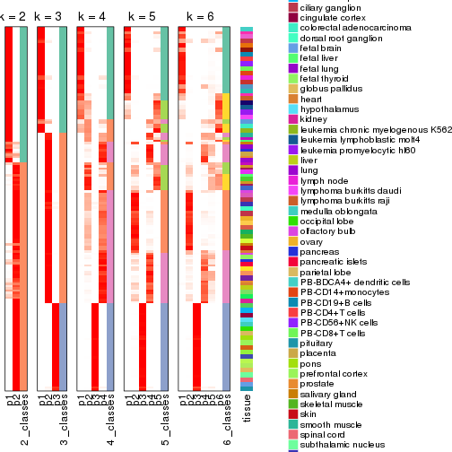


Test correlation between subgroups and known annotations. If the known
annotation is numeric, one-way ANOVA test is applied, and if the known
annotation is discrete, chi-squared contingency table test is applied.

```r
test_to_known_factors(res)
```

```
#>          n tissue(p) k
#> SD:NMF 154  3.37e-06 2
#> SD:NMF 157  1.06e-12 3
#> SD:NMF 143  1.13e-16 4
#> SD:NMF 145  1.58e-19 5
#> SD:NMF 121  5.39e-18 6
```


If matrix rows can be associated to genes, consider to use `functional_enrichment(res,
...)` to perform function enrichment for the signature genes. See [this vignette](http://bioconductor.org/packages/devel/bioc/vignettes/cola/inst/doc/functional_enrichment.html) for more detailed explanations.


 

---------------------------------------------------


### CV:hclust


The object with results only for a single top-value method and a single partition method 
can be extracted as:

```r
res = res_list["CV", "hclust"]
# you can also extract it by
# res = res_list["CV:hclust"]
```

A summary of `res` and all the functions that can be applied to it:

```r
res
```

```
#> A 'ConsensusPartition' object with k = 2, 3, 4, 5, 6.
#>   On a matrix with 21168 rows and 158 columns.
#>   Top rows (1000, 2000, 3000, 4000, 5000) are extracted by 'CV' method.
#>   Subgroups are detected by 'hclust' method.
#>   Performed in total 1250 partitions by row resampling.
#>   Best k for subgroups seems to be 3.
#> 
#> Following methods can be applied to this 'ConsensusPartition' object:
#>  [1] "cola_report"             "collect_classes"         "collect_plots"          
#>  [4] "collect_stats"           "colnames"                "compare_signatures"     
#>  [7] "consensus_heatmap"       "dimension_reduction"     "functional_enrichment"  
#> [10] "get_anno_col"            "get_anno"                "get_classes"            
#> [13] "get_consensus"           "get_matrix"              "get_membership"         
#> [16] "get_param"               "get_signatures"          "get_stats"              
#> [19] "is_best_k"               "is_stable_k"             "membership_heatmap"     
#> [22] "ncol"                    "nrow"                    "plot_ecdf"              
#> [25] "rownames"                "select_partition_number" "show"                   
#> [28] "suggest_best_k"          "test_to_known_factors"
```

`collect_plots()` function collects all the plots made from `res` for all `k` (number of partitions)
into one single page to provide an easy and fast comparison between different `k`.

```r
collect_plots(res)
```


The plots are:

- The first row: a plot of the ECDF (empirical cumulative distribution
  function) curves of the consensus matrix for each `k` and the heatmap of
  predicted classes for each `k`.
- The second row: heatmaps of the consensus matrix for each `k`.
- The third row: heatmaps of the membership matrix for each `k`.
- The fouth row: heatmaps of the signatures for each `k`.

All the plots in panels can be made by individual functions and they are
plotted later in this section.

`select_partition_number()` produces several plots showing different
statistics for choosing "optimized" `k`. There are following statistics:

- ECDF curves of the consensus matrix for each `k`;
- 1-PAC. [The PAC
  score](https://en.wikipedia.org/wiki/Consensus_clustering#Over-interpretation_potential_of_consensus_clustering)
  measures the proportion of the ambiguous subgrouping.
- Mean silhouette score.
- Concordance. The mean probability of fiting the consensus class ids in all
  partitions.
- Area increased. Denote $A_k$ as the area under the ECDF curve for current
  `k`, the area increased is defined as $A_k - A_{k-1}$.
- Rand index. The percent of pairs of samples that are both in a same cluster
  or both are not in a same cluster in the partition of k and k-1.
- Jaccard index. The ratio of pairs of samples are both in a same cluster in
  the partition of k and k-1 and the pairs of samples are both in a same
  cluster in the partition k or k-1.

The detailed explanations of these statistics can be found in [the _cola_
vignette](http://bioconductor.org/packages/devel/bioc/vignettes/cola/inst/doc/cola.html#toc_13).

Generally speaking, lower PAC score, higher mean silhouette score or higher
concordance corresponds to better partition. Rand index and Jaccard index
measure how similar the current partition is compared to partition with `k-1`.
If they are too similar, we won't accept `k` is better than `k-1`.

```r
select_partition_number(res)
```


The numeric values for all these statistics can be obtained by `get_stats()`.

```r
get_stats(res)
```

```
#>   k 1-PAC mean_silhouette concordance area_increased  Rand Jaccard
#> 2 2 0.442           0.883       0.866         0.3515 0.660   0.660
#> 3 3 0.562           0.849       0.888         0.7299 0.737   0.601
#> 4 4 0.690           0.726       0.829         0.1921 0.863   0.653
#> 5 5 0.756           0.731       0.833         0.0630 0.964   0.863
#> 6 6 0.779           0.765       0.812         0.0398 0.971   0.875
```

`suggest_best_k()` suggests the best $k$ based on these statistics. The rules are as follows:

- All $k$ with Jaccard index larger than 0.95 are removed because increasing
  $k$ does not provide enough extra information. If all $k$ are removed, it is
  marked as no subgroup is detected.
- For all $k$ with 1-PAC score larger than 0.9, the maximal $k$ is taken as
  the best $k$, and other $k$ are marked as optional $k$.
- If it does not fit the second rule. The $k$ with the maximal vote of the
  highest 1-PAC score, highest mean silhouette, and highest concordance is
  taken as the best $k$.

```r
suggest_best_k(res)
```

```
#> [1] 3
```


Following shows the table of the partitions (You need to click the **show/hide
code output** link to see it). The membership matrix (columns with name `p*`)
is inferred by
[`clue::cl_consensus()`](https://www.rdocumentation.org/link/cl_consensus?package=clue)
function with the `SE` method. Basically the value in the membership matrix
represents the probability to belong to a certain group. The finall class
label for an item is determined with the group with highest probability it
belongs to.

In `get_classes()` function, the entropy is calculated from the membership
matrix and the silhouette score is calculated from the consensus matrix.


<script>
$( function() {
	$( '#tabs-CV-hclust-get-classes' ).tabs();
} );
</script>
<div id='tabs-CV-hclust-get-classes'>
<ul>
<li><a href='#tab-CV-hclust-get-classes-1'>k = 2</a></li>
<li><a href='#tab-CV-hclust-get-classes-2'>k = 3</a></li>
<li><a href='#tab-CV-hclust-get-classes-3'>k = 4</a></li>
<li><a href='#tab-CV-hclust-get-classes-4'>k = 5</a></li>
<li><a href='#tab-CV-hclust-get-classes-5'>k = 6</a></li>
</ul>

<div id='tab-CV-hclust-get-classes-1'>
<p><a id='tab-CV-hclust-get-classes-1-a' style='color:#0366d6' href='#'>show/hide code output</a></p>
<pre><code class="r">cbind(get_classes(res, k = 2), get_membership(res, k = 2))
</code></pre>

<pre><code>#&gt;          class entropy silhouette    p1    p2
#&gt; GSM18927     2  0.5408      0.874 0.124 0.876
#&gt; GSM18928     2  0.5408      0.874 0.124 0.876
#&gt; GSM18915     2  0.5408      0.874 0.124 0.876
#&gt; GSM18916     2  0.5408      0.874 0.124 0.876
#&gt; GSM18939     2  0.5408      0.874 0.124 0.876
#&gt; GSM18940     2  0.5408      0.874 0.124 0.876
#&gt; GSM18933     2  0.5408      0.874 0.124 0.876
#&gt; GSM18934     2  0.5408      0.874 0.124 0.876
#&gt; GSM18925     2  0.5408      0.874 0.124 0.876
#&gt; GSM18926     2  0.5408      0.874 0.124 0.876
#&gt; GSM18931     2  0.5408      0.874 0.124 0.876
#&gt; GSM18932     2  0.5408      0.874 0.124 0.876
#&gt; GSM19019     2  0.5408      0.874 0.124 0.876
#&gt; GSM19020     2  0.5408      0.874 0.124 0.876
#&gt; GSM18923     2  0.5408      0.874 0.124 0.876
#&gt; GSM18924     2  0.5408      0.874 0.124 0.876
#&gt; GSM18941     2  0.5408      0.874 0.124 0.876
#&gt; GSM18942     2  0.5408      0.874 0.124 0.876
#&gt; GSM18929     2  0.5408      0.874 0.124 0.876
#&gt; GSM18930     2  0.5408      0.874 0.124 0.876
#&gt; GSM18911     2  0.5408      0.874 0.124 0.876
#&gt; GSM18912     2  0.5408      0.874 0.124 0.876
#&gt; GSM18935     2  0.5408      0.874 0.124 0.876
#&gt; GSM18936     2  0.5408      0.874 0.124 0.876
#&gt; GSM19005     2  0.0000      0.923 0.000 1.000
#&gt; GSM19006     2  0.0000      0.923 0.000 1.000
#&gt; GSM18921     2  0.5408      0.874 0.124 0.876
#&gt; GSM18922     2  0.5408      0.874 0.124 0.876
#&gt; GSM18919     2  0.5408      0.874 0.124 0.876
#&gt; GSM18920     2  0.5408      0.874 0.124 0.876
#&gt; GSM18917     2  0.5408      0.874 0.124 0.876
#&gt; GSM18918     2  0.5408      0.874 0.124 0.876
#&gt; GSM18913     2  0.5408      0.874 0.124 0.876
#&gt; GSM18914     2  0.5408      0.874 0.124 0.876
#&gt; GSM18937     2  0.5408      0.874 0.124 0.876
#&gt; GSM18938     2  0.5408      0.874 0.124 0.876
#&gt; GSM18943     2  0.5408      0.874 0.124 0.876
#&gt; GSM18944     2  0.5408      0.874 0.124 0.876
#&gt; GSM19003     2  0.0000      0.923 0.000 1.000
#&gt; GSM19004     2  0.0000      0.923 0.000 1.000
#&gt; GSM19011     2  0.0000      0.923 0.000 1.000
#&gt; GSM19012     2  0.0000      0.923 0.000 1.000
#&gt; GSM19009     2  0.0000      0.923 0.000 1.000
#&gt; GSM19010     2  0.0000      0.923 0.000 1.000
#&gt; GSM18945     2  0.5408      0.874 0.124 0.876
#&gt; GSM18946     2  0.5408      0.874 0.124 0.876
#&gt; GSM18963     2  0.0376      0.922 0.004 0.996
#&gt; GSM18964     2  0.0376      0.922 0.004 0.996
#&gt; GSM18905     2  0.0376      0.922 0.004 0.996
#&gt; GSM18906     2  0.0376      0.922 0.004 0.996
#&gt; GSM18965     2  0.0672      0.920 0.008 0.992
#&gt; GSM18966     2  0.0672      0.920 0.008 0.992
#&gt; GSM18873     1  0.5408      0.949 0.876 0.124
#&gt; GSM18874     1  0.5408      0.949 0.876 0.124
#&gt; GSM18973     2  0.1414      0.911 0.020 0.980
#&gt; GSM18974     2  0.1414      0.911 0.020 0.980
#&gt; GSM18977     2  0.0376      0.922 0.004 0.996
#&gt; GSM18978     2  0.0376      0.922 0.004 0.996
#&gt; GSM18979     2  0.0376      0.922 0.004 0.996
#&gt; GSM18980     2  0.1184      0.920 0.016 0.984
#&gt; GSM18883     1  0.5629      0.946 0.868 0.132
#&gt; GSM18884     1  0.5629      0.946 0.868 0.132
#&gt; GSM18885     1  0.5408      0.949 0.876 0.124
#&gt; GSM18886     1  0.5408      0.949 0.876 0.124
#&gt; GSM18907     1  0.5946      0.941 0.856 0.144
#&gt; GSM18908     1  0.5946      0.941 0.856 0.144
#&gt; GSM18909     2  0.9044      0.401 0.320 0.680
#&gt; GSM18910     2  0.9044      0.401 0.320 0.680
#&gt; GSM18867     1  0.5408      0.949 0.876 0.124
#&gt; GSM18868     1  0.5408      0.949 0.876 0.124
#&gt; GSM18947     2  0.0000      0.923 0.000 1.000
#&gt; GSM18948     2  0.0000      0.923 0.000 1.000
#&gt; GSM18995     2  0.0000      0.923 0.000 1.000
#&gt; GSM18996     2  0.0000      0.923 0.000 1.000
#&gt; GSM18975     2  0.0376      0.922 0.004 0.996
#&gt; GSM18976     2  0.0376      0.922 0.004 0.996
#&gt; GSM18997     2  0.0000      0.923 0.000 1.000
#&gt; GSM18998     2  0.0000      0.923 0.000 1.000
#&gt; GSM18967     2  0.0672      0.920 0.008 0.992
#&gt; GSM18968     2  0.0672      0.920 0.008 0.992
#&gt; GSM18959     2  0.0376      0.922 0.004 0.996
#&gt; GSM18960     2  0.0376      0.922 0.004 0.996
#&gt; GSM19015     2  0.0000      0.923 0.000 1.000
#&gt; GSM19016     2  0.0000      0.923 0.000 1.000
#&gt; GSM18957     2  0.0672      0.920 0.008 0.992
#&gt; GSM18958     2  0.0672      0.920 0.008 0.992
#&gt; GSM18981     2  0.0000      0.923 0.000 1.000
#&gt; GSM18982     2  0.0000      0.923 0.000 1.000
#&gt; GSM18989     2  0.0000      0.923 0.000 1.000
#&gt; GSM18990     2  0.0000      0.923 0.000 1.000
#&gt; GSM18985     2  0.0000      0.923 0.000 1.000
#&gt; GSM18986     2  0.0000      0.923 0.000 1.000
#&gt; GSM18987     2  0.0000      0.923 0.000 1.000
#&gt; GSM18988     2  0.0000      0.923 0.000 1.000
#&gt; GSM18983     2  0.0000      0.923 0.000 1.000
#&gt; GSM18984     2  0.0000      0.923 0.000 1.000
#&gt; GSM18951     2  0.0376      0.922 0.004 0.996
#&gt; GSM18952     2  0.0376      0.922 0.004 0.996
#&gt; GSM19007     2  0.0000      0.923 0.000 1.000
#&gt; GSM19008     2  0.0000      0.923 0.000 1.000
#&gt; GSM18999     2  0.0000      0.923 0.000 1.000
#&gt; GSM19000     2  0.0000      0.923 0.000 1.000
#&gt; GSM18889     1  0.5408      0.949 0.876 0.124
#&gt; GSM18890     1  0.5408      0.949 0.876 0.124
#&gt; GSM18881     1  0.5408      0.949 0.876 0.124
#&gt; GSM18882     1  0.5408      0.949 0.876 0.124
#&gt; GSM18877     1  0.5408      0.949 0.876 0.124
#&gt; GSM18878     1  0.5408      0.949 0.876 0.124
#&gt; GSM18875     1  0.5408      0.949 0.876 0.124
#&gt; GSM18876     1  0.5408      0.949 0.876 0.124
#&gt; GSM18879     1  0.5408      0.949 0.876 0.124
#&gt; GSM18880     1  0.5408      0.949 0.876 0.124
#&gt; GSM18871     1  0.5408      0.949 0.876 0.124
#&gt; GSM18872     1  0.5408      0.949 0.876 0.124
#&gt; GSM18903     2  0.9044      0.401 0.320 0.680
#&gt; GSM18904     2  0.9044      0.401 0.320 0.680
#&gt; GSM18949     2  0.0672      0.920 0.008 0.992
#&gt; GSM18950     2  0.0672      0.920 0.008 0.992
#&gt; GSM18953     2  0.0376      0.922 0.004 0.996
#&gt; GSM18954     2  0.0376      0.922 0.004 0.996
#&gt; GSM19013     2  0.0000      0.923 0.000 1.000
#&gt; GSM19014     2  0.0000      0.923 0.000 1.000
#&gt; GSM18971     2  0.0672      0.920 0.008 0.992
#&gt; GSM18972     2  0.0672      0.920 0.008 0.992
#&gt; GSM18969     2  0.0672      0.920 0.008 0.992
#&gt; GSM18970     2  0.0376      0.922 0.004 0.996
#&gt; GSM18869     1  0.5408      0.949 0.876 0.124
#&gt; GSM18870     1  0.5408      0.949 0.876 0.124
#&gt; GSM19017     2  0.0000      0.923 0.000 1.000
#&gt; GSM19018     2  0.0000      0.923 0.000 1.000
#&gt; GSM18991     2  0.0376      0.922 0.004 0.996
#&gt; GSM18992     2  0.0376      0.922 0.004 0.996
#&gt; GSM19021     2  0.1184      0.920 0.016 0.984
#&gt; GSM19022     2  0.1184      0.920 0.016 0.984
#&gt; GSM19001     2  0.0000      0.923 0.000 1.000
#&gt; GSM19002     2  0.0000      0.923 0.000 1.000
#&gt; GSM18899     2  0.9044      0.401 0.320 0.680
#&gt; GSM18900     2  0.9044      0.401 0.320 0.680
#&gt; GSM18961     2  0.0672      0.920 0.008 0.992
#&gt; GSM18962     2  0.0672      0.920 0.008 0.992
#&gt; GSM18901     2  0.9044      0.401 0.320 0.680
#&gt; GSM18902     2  0.9044      0.401 0.320 0.680
#&gt; GSM18993     2  0.0376      0.922 0.004 0.996
#&gt; GSM18994     2  0.0376      0.922 0.004 0.996
#&gt; GSM18865     2  0.3274      0.875 0.060 0.940
#&gt; GSM18866     2  0.3274      0.875 0.060 0.940
#&gt; GSM18897     1  0.8713      0.810 0.708 0.292
#&gt; GSM18898     1  0.8713      0.810 0.708 0.292
#&gt; GSM18887     1  0.8144      0.867 0.748 0.252
#&gt; GSM18888     1  0.8144      0.867 0.748 0.252
#&gt; GSM18893     1  0.8081      0.871 0.752 0.248
#&gt; GSM18894     1  0.8081      0.871 0.752 0.248
#&gt; GSM18895     1  0.8081      0.871 0.752 0.248
#&gt; GSM18896     1  0.8081      0.871 0.752 0.248
#&gt; GSM18891     1  0.8081      0.871 0.752 0.248
#&gt; GSM18892     1  0.8081      0.871 0.752 0.248
#&gt; GSM18955     2  0.0376      0.922 0.004 0.996
#&gt; GSM18956     2  0.0376      0.922 0.004 0.996
</code></pre>

<script>
$('#tab-CV-hclust-get-classes-1-a').parent().next().next().hide();
$('#tab-CV-hclust-get-classes-1-a').click(function(){
  $('#tab-CV-hclust-get-classes-1-a').parent().next().next().toggle();
  return(false);
});
</script>
</div>

<div id='tab-CV-hclust-get-classes-2'>
<p><a id='tab-CV-hclust-get-classes-2-a' style='color:#0366d6' href='#'>show/hide code output</a></p>
<pre><code class="r">cbind(get_classes(res, k = 3), get_membership(res, k = 3))
</code></pre>

<pre><code>#&gt;          class entropy silhouette    p1    p2    p3
#&gt; GSM18927     3  0.0000      0.996 0.000 0.000 1.000
#&gt; GSM18928     3  0.0000      0.996 0.000 0.000 1.000
#&gt; GSM18915     3  0.0000      0.996 0.000 0.000 1.000
#&gt; GSM18916     3  0.0000      0.996 0.000 0.000 1.000
#&gt; GSM18939     3  0.0000      0.996 0.000 0.000 1.000
#&gt; GSM18940     3  0.0000      0.996 0.000 0.000 1.000
#&gt; GSM18933     3  0.0000      0.996 0.000 0.000 1.000
#&gt; GSM18934     3  0.0000      0.996 0.000 0.000 1.000
#&gt; GSM18925     3  0.0000      0.996 0.000 0.000 1.000
#&gt; GSM18926     3  0.0000      0.996 0.000 0.000 1.000
#&gt; GSM18931     3  0.0000      0.996 0.000 0.000 1.000
#&gt; GSM18932     3  0.0000      0.996 0.000 0.000 1.000
#&gt; GSM19019     3  0.2066      0.938 0.000 0.060 0.940
#&gt; GSM19020     3  0.2066      0.938 0.000 0.060 0.940
#&gt; GSM18923     3  0.0000      0.996 0.000 0.000 1.000
#&gt; GSM18924     3  0.0000      0.996 0.000 0.000 1.000
#&gt; GSM18941     3  0.0000      0.996 0.000 0.000 1.000
#&gt; GSM18942     3  0.0000      0.996 0.000 0.000 1.000
#&gt; GSM18929     3  0.0000      0.996 0.000 0.000 1.000
#&gt; GSM18930     3  0.0000      0.996 0.000 0.000 1.000
#&gt; GSM18911     3  0.0000      0.996 0.000 0.000 1.000
#&gt; GSM18912     3  0.0000      0.996 0.000 0.000 1.000
#&gt; GSM18935     3  0.0000      0.996 0.000 0.000 1.000
#&gt; GSM18936     3  0.0000      0.996 0.000 0.000 1.000
#&gt; GSM19005     2  0.5291      0.806 0.000 0.732 0.268
#&gt; GSM19006     2  0.5291      0.806 0.000 0.732 0.268
#&gt; GSM18921     3  0.0000      0.996 0.000 0.000 1.000
#&gt; GSM18922     3  0.0000      0.996 0.000 0.000 1.000
#&gt; GSM18919     3  0.0000      0.996 0.000 0.000 1.000
#&gt; GSM18920     3  0.0000      0.996 0.000 0.000 1.000
#&gt; GSM18917     3  0.0000      0.996 0.000 0.000 1.000
#&gt; GSM18918     3  0.0000      0.996 0.000 0.000 1.000
#&gt; GSM18913     3  0.0000      0.996 0.000 0.000 1.000
#&gt; GSM18914     3  0.0000      0.996 0.000 0.000 1.000
#&gt; GSM18937     3  0.0000      0.996 0.000 0.000 1.000
#&gt; GSM18938     3  0.0000      0.996 0.000 0.000 1.000
#&gt; GSM18943     3  0.0424      0.987 0.000 0.008 0.992
#&gt; GSM18944     3  0.0424      0.987 0.000 0.008 0.992
#&gt; GSM19003     2  0.5291      0.806 0.000 0.732 0.268
#&gt; GSM19004     2  0.5291      0.806 0.000 0.732 0.268
#&gt; GSM19011     2  0.5291      0.806 0.000 0.732 0.268
#&gt; GSM19012     2  0.5291      0.806 0.000 0.732 0.268
#&gt; GSM19009     2  0.5291      0.806 0.000 0.732 0.268
#&gt; GSM19010     2  0.5291      0.806 0.000 0.732 0.268
#&gt; GSM18945     3  0.0000      0.996 0.000 0.000 1.000
#&gt; GSM18946     3  0.0000      0.996 0.000 0.000 1.000
#&gt; GSM18963     2  0.1529      0.831 0.000 0.960 0.040
#&gt; GSM18964     2  0.1529      0.831 0.000 0.960 0.040
#&gt; GSM18905     2  0.4062      0.841 0.000 0.836 0.164
#&gt; GSM18906     2  0.4062      0.841 0.000 0.836 0.164
#&gt; GSM18965     2  0.1289      0.827 0.000 0.968 0.032
#&gt; GSM18966     2  0.1289      0.827 0.000 0.968 0.032
#&gt; GSM18873     1  0.0000      0.920 1.000 0.000 0.000
#&gt; GSM18874     1  0.0000      0.920 1.000 0.000 0.000
#&gt; GSM18973     2  0.0747      0.801 0.016 0.984 0.000
#&gt; GSM18974     2  0.0747      0.801 0.016 0.984 0.000
#&gt; GSM18977     2  0.1753      0.834 0.000 0.952 0.048
#&gt; GSM18978     2  0.1753      0.834 0.000 0.952 0.048
#&gt; GSM18979     2  0.1753      0.834 0.000 0.952 0.048
#&gt; GSM18980     2  0.2165      0.832 0.000 0.936 0.064
#&gt; GSM18883     1  0.3192      0.875 0.888 0.112 0.000
#&gt; GSM18884     1  0.3192      0.875 0.888 0.112 0.000
#&gt; GSM18885     1  0.0000      0.920 1.000 0.000 0.000
#&gt; GSM18886     1  0.0000      0.920 1.000 0.000 0.000
#&gt; GSM18907     1  0.3482      0.864 0.872 0.128 0.000
#&gt; GSM18908     1  0.3482      0.864 0.872 0.128 0.000
#&gt; GSM18909     2  0.7624      0.281 0.392 0.560 0.048
#&gt; GSM18910     2  0.7624      0.281 0.392 0.560 0.048
#&gt; GSM18867     1  0.0000      0.920 1.000 0.000 0.000
#&gt; GSM18868     1  0.0000      0.920 1.000 0.000 0.000
#&gt; GSM18947     2  0.5216      0.811 0.000 0.740 0.260
#&gt; GSM18948     2  0.5216      0.811 0.000 0.740 0.260
#&gt; GSM18995     2  0.5216      0.811 0.000 0.740 0.260
#&gt; GSM18996     2  0.5216      0.811 0.000 0.740 0.260
#&gt; GSM18975     2  0.0424      0.814 0.000 0.992 0.008
#&gt; GSM18976     2  0.0424      0.814 0.000 0.992 0.008
#&gt; GSM18997     2  0.4974      0.821 0.000 0.764 0.236
#&gt; GSM18998     2  0.4974      0.821 0.000 0.764 0.236
#&gt; GSM18967     2  0.1289      0.827 0.000 0.968 0.032
#&gt; GSM18968     2  0.1289      0.827 0.000 0.968 0.032
#&gt; GSM18959     2  0.1529      0.831 0.000 0.960 0.040
#&gt; GSM18960     2  0.1529      0.831 0.000 0.960 0.040
#&gt; GSM19015     2  0.5291      0.806 0.000 0.732 0.268
#&gt; GSM19016     2  0.5291      0.806 0.000 0.732 0.268
#&gt; GSM18957     2  0.1289      0.827 0.000 0.968 0.032
#&gt; GSM18958     2  0.1289      0.827 0.000 0.968 0.032
#&gt; GSM18981     2  0.3879      0.840 0.000 0.848 0.152
#&gt; GSM18982     2  0.3879      0.840 0.000 0.848 0.152
#&gt; GSM18989     2  0.3879      0.840 0.000 0.848 0.152
#&gt; GSM18990     2  0.3879      0.840 0.000 0.848 0.152
#&gt; GSM18985     2  0.3879      0.840 0.000 0.848 0.152
#&gt; GSM18986     2  0.2165      0.839 0.000 0.936 0.064
#&gt; GSM18987     2  0.3879      0.840 0.000 0.848 0.152
#&gt; GSM18988     2  0.3879      0.840 0.000 0.848 0.152
#&gt; GSM18983     2  0.3879      0.840 0.000 0.848 0.152
#&gt; GSM18984     2  0.3879      0.840 0.000 0.848 0.152
#&gt; GSM18951     2  0.5178      0.813 0.000 0.744 0.256
#&gt; GSM18952     2  0.5178      0.813 0.000 0.744 0.256
#&gt; GSM19007     2  0.5291      0.806 0.000 0.732 0.268
#&gt; GSM19008     2  0.5291      0.806 0.000 0.732 0.268
#&gt; GSM18999     2  0.5291      0.806 0.000 0.732 0.268
#&gt; GSM19000     2  0.5291      0.806 0.000 0.732 0.268
#&gt; GSM18889     1  0.0000      0.920 1.000 0.000 0.000
#&gt; GSM18890     1  0.0000      0.920 1.000 0.000 0.000
#&gt; GSM18881     1  0.0000      0.920 1.000 0.000 0.000
#&gt; GSM18882     1  0.0000      0.920 1.000 0.000 0.000
#&gt; GSM18877     1  0.0000      0.920 1.000 0.000 0.000
#&gt; GSM18878     1  0.0000      0.920 1.000 0.000 0.000
#&gt; GSM18875     1  0.0000      0.920 1.000 0.000 0.000
#&gt; GSM18876     1  0.0000      0.920 1.000 0.000 0.000
#&gt; GSM18879     1  0.0000      0.920 1.000 0.000 0.000
#&gt; GSM18880     1  0.0000      0.920 1.000 0.000 0.000
#&gt; GSM18871     1  0.0000      0.920 1.000 0.000 0.000
#&gt; GSM18872     1  0.0000      0.920 1.000 0.000 0.000
#&gt; GSM18903     2  0.7624      0.281 0.392 0.560 0.048
#&gt; GSM18904     2  0.7624      0.281 0.392 0.560 0.048
#&gt; GSM18949     2  0.1289      0.827 0.000 0.968 0.032
#&gt; GSM18950     2  0.1289      0.827 0.000 0.968 0.032
#&gt; GSM18953     2  0.5178      0.813 0.000 0.744 0.256
#&gt; GSM18954     2  0.5178      0.813 0.000 0.744 0.256
#&gt; GSM19013     2  0.5291      0.806 0.000 0.732 0.268
#&gt; GSM19014     2  0.5291      0.806 0.000 0.732 0.268
#&gt; GSM18971     2  0.0000      0.808 0.000 1.000 0.000
#&gt; GSM18972     2  0.0000      0.808 0.000 1.000 0.000
#&gt; GSM18969     2  0.0000      0.808 0.000 1.000 0.000
#&gt; GSM18970     2  0.0592      0.817 0.000 0.988 0.012
#&gt; GSM18869     1  0.0000      0.920 1.000 0.000 0.000
#&gt; GSM18870     1  0.0000      0.920 1.000 0.000 0.000
#&gt; GSM19017     2  0.5291      0.806 0.000 0.732 0.268
#&gt; GSM19018     2  0.5291      0.806 0.000 0.732 0.268
#&gt; GSM18991     2  0.4121      0.842 0.000 0.832 0.168
#&gt; GSM18992     2  0.4121      0.842 0.000 0.832 0.168
#&gt; GSM19021     2  0.2625      0.826 0.000 0.916 0.084
#&gt; GSM19022     2  0.2625      0.826 0.000 0.916 0.084
#&gt; GSM19001     2  0.5291      0.806 0.000 0.732 0.268
#&gt; GSM19002     2  0.5291      0.806 0.000 0.732 0.268
#&gt; GSM18899     2  0.7624      0.281 0.392 0.560 0.048
#&gt; GSM18900     2  0.7624      0.281 0.392 0.560 0.048
#&gt; GSM18961     2  0.1289      0.827 0.000 0.968 0.032
#&gt; GSM18962     2  0.1289      0.827 0.000 0.968 0.032
#&gt; GSM18901     2  0.7624      0.281 0.392 0.560 0.048
#&gt; GSM18902     2  0.7624      0.281 0.392 0.560 0.048
#&gt; GSM18993     2  0.2261      0.840 0.000 0.932 0.068
#&gt; GSM18994     2  0.2261      0.840 0.000 0.932 0.068
#&gt; GSM18865     2  0.2066      0.772 0.060 0.940 0.000
#&gt; GSM18866     2  0.2066      0.772 0.060 0.940 0.000
#&gt; GSM18897     1  0.5363      0.746 0.724 0.276 0.000
#&gt; GSM18898     1  0.5363      0.746 0.724 0.276 0.000
#&gt; GSM18887     1  0.4452      0.853 0.808 0.192 0.000
#&gt; GSM18888     1  0.4452      0.853 0.808 0.192 0.000
#&gt; GSM18893     1  0.4346      0.859 0.816 0.184 0.000
#&gt; GSM18894     1  0.4346      0.859 0.816 0.184 0.000
#&gt; GSM18895     1  0.4346      0.859 0.816 0.184 0.000
#&gt; GSM18896     1  0.4346      0.859 0.816 0.184 0.000
#&gt; GSM18891     1  0.4346      0.859 0.816 0.184 0.000
#&gt; GSM18892     1  0.4346      0.859 0.816 0.184 0.000
#&gt; GSM18955     2  0.4002      0.841 0.000 0.840 0.160
#&gt; GSM18956     2  0.4002      0.841 0.000 0.840 0.160
</code></pre>

<script>
$('#tab-CV-hclust-get-classes-2-a').parent().next().next().hide();
$('#tab-CV-hclust-get-classes-2-a').click(function(){
  $('#tab-CV-hclust-get-classes-2-a').parent().next().next().toggle();
  return(false);
});
</script>
</div>

<div id='tab-CV-hclust-get-classes-3'>
<p><a id='tab-CV-hclust-get-classes-3-a' style='color:#0366d6' href='#'>show/hide code output</a></p>
<pre><code class="r">cbind(get_classes(res, k = 4), get_membership(res, k = 4))
</code></pre>

<pre><code>#&gt;          class entropy silhouette    p1    p2    p3    p4
#&gt; GSM18927     3  0.0000      0.996 0.000 0.000 1.000 0.000
#&gt; GSM18928     3  0.0000      0.996 0.000 0.000 1.000 0.000
#&gt; GSM18915     3  0.0000      0.996 0.000 0.000 1.000 0.000
#&gt; GSM18916     3  0.0000      0.996 0.000 0.000 1.000 0.000
#&gt; GSM18939     3  0.0000      0.996 0.000 0.000 1.000 0.000
#&gt; GSM18940     3  0.0000      0.996 0.000 0.000 1.000 0.000
#&gt; GSM18933     3  0.0000      0.996 0.000 0.000 1.000 0.000
#&gt; GSM18934     3  0.0000      0.996 0.000 0.000 1.000 0.000
#&gt; GSM18925     3  0.0000      0.996 0.000 0.000 1.000 0.000
#&gt; GSM18926     3  0.0000      0.996 0.000 0.000 1.000 0.000
#&gt; GSM18931     3  0.0000      0.996 0.000 0.000 1.000 0.000
#&gt; GSM18932     3  0.0000      0.996 0.000 0.000 1.000 0.000
#&gt; GSM19019     3  0.1938      0.934 0.000 0.012 0.936 0.052
#&gt; GSM19020     3  0.1938      0.934 0.000 0.012 0.936 0.052
#&gt; GSM18923     3  0.0000      0.996 0.000 0.000 1.000 0.000
#&gt; GSM18924     3  0.0000      0.996 0.000 0.000 1.000 0.000
#&gt; GSM18941     3  0.0000      0.996 0.000 0.000 1.000 0.000
#&gt; GSM18942     3  0.0000      0.996 0.000 0.000 1.000 0.000
#&gt; GSM18929     3  0.0000      0.996 0.000 0.000 1.000 0.000
#&gt; GSM18930     3  0.0000      0.996 0.000 0.000 1.000 0.000
#&gt; GSM18911     3  0.0000      0.996 0.000 0.000 1.000 0.000
#&gt; GSM18912     3  0.0000      0.996 0.000 0.000 1.000 0.000
#&gt; GSM18935     3  0.0000      0.996 0.000 0.000 1.000 0.000
#&gt; GSM18936     3  0.0000      0.996 0.000 0.000 1.000 0.000
#&gt; GSM19005     2  0.0376      0.669 0.000 0.992 0.004 0.004
#&gt; GSM19006     2  0.0376      0.669 0.000 0.992 0.004 0.004
#&gt; GSM18921     3  0.0000      0.996 0.000 0.000 1.000 0.000
#&gt; GSM18922     3  0.0000      0.996 0.000 0.000 1.000 0.000
#&gt; GSM18919     3  0.0000      0.996 0.000 0.000 1.000 0.000
#&gt; GSM18920     3  0.0000      0.996 0.000 0.000 1.000 0.000
#&gt; GSM18917     3  0.0000      0.996 0.000 0.000 1.000 0.000
#&gt; GSM18918     3  0.0000      0.996 0.000 0.000 1.000 0.000
#&gt; GSM18913     3  0.0000      0.996 0.000 0.000 1.000 0.000
#&gt; GSM18914     3  0.0000      0.996 0.000 0.000 1.000 0.000
#&gt; GSM18937     3  0.0000      0.996 0.000 0.000 1.000 0.000
#&gt; GSM18938     3  0.0000      0.996 0.000 0.000 1.000 0.000
#&gt; GSM18943     3  0.0336      0.988 0.000 0.008 0.992 0.000
#&gt; GSM18944     3  0.0336      0.988 0.000 0.008 0.992 0.000
#&gt; GSM19003     2  0.0376      0.669 0.000 0.992 0.004 0.004
#&gt; GSM19004     2  0.0376      0.669 0.000 0.992 0.004 0.004
#&gt; GSM19011     2  0.0376      0.669 0.000 0.992 0.004 0.004
#&gt; GSM19012     2  0.0376      0.669 0.000 0.992 0.004 0.004
#&gt; GSM19009     2  0.0376      0.669 0.000 0.992 0.004 0.004
#&gt; GSM19010     2  0.0376      0.669 0.000 0.992 0.004 0.004
#&gt; GSM18945     3  0.0000      0.996 0.000 0.000 1.000 0.000
#&gt; GSM18946     3  0.0000      0.996 0.000 0.000 1.000 0.000
#&gt; GSM18963     4  0.4713      0.791 0.000 0.360 0.000 0.640
#&gt; GSM18964     4  0.4713      0.791 0.000 0.360 0.000 0.640
#&gt; GSM18905     2  0.4746      0.311 0.000 0.632 0.000 0.368
#&gt; GSM18906     2  0.4746      0.311 0.000 0.632 0.000 0.368
#&gt; GSM18965     4  0.4898      0.751 0.000 0.416 0.000 0.584
#&gt; GSM18966     4  0.4898      0.751 0.000 0.416 0.000 0.584
#&gt; GSM18873     1  0.0000      0.923 1.000 0.000 0.000 0.000
#&gt; GSM18874     1  0.0000      0.923 1.000 0.000 0.000 0.000
#&gt; GSM18973     4  0.3626      0.713 0.004 0.184 0.000 0.812
#&gt; GSM18974     4  0.3626      0.713 0.004 0.184 0.000 0.812
#&gt; GSM18977     4  0.4925      0.686 0.000 0.428 0.000 0.572
#&gt; GSM18978     4  0.4925      0.686 0.000 0.428 0.000 0.572
#&gt; GSM18979     4  0.4925      0.686 0.000 0.428 0.000 0.572
#&gt; GSM18980     4  0.5271      0.786 0.000 0.340 0.020 0.640
#&gt; GSM18883     1  0.3311      0.869 0.828 0.000 0.000 0.172
#&gt; GSM18884     1  0.3311      0.869 0.828 0.000 0.000 0.172
#&gt; GSM18885     1  0.0188      0.922 0.996 0.000 0.000 0.004
#&gt; GSM18886     1  0.0188      0.922 0.996 0.000 0.000 0.004
#&gt; GSM18907     1  0.3626      0.862 0.812 0.004 0.000 0.184
#&gt; GSM18908     1  0.3626      0.862 0.812 0.004 0.000 0.184
#&gt; GSM18909     2  0.7629      0.186 0.392 0.404 0.000 0.204
#&gt; GSM18910     2  0.7629      0.186 0.392 0.404 0.000 0.204
#&gt; GSM18867     1  0.0000      0.923 1.000 0.000 0.000 0.000
#&gt; GSM18868     1  0.0000      0.923 1.000 0.000 0.000 0.000
#&gt; GSM18947     2  0.1109      0.657 0.000 0.968 0.004 0.028
#&gt; GSM18948     2  0.1109      0.657 0.000 0.968 0.004 0.028
#&gt; GSM18995     2  0.1109      0.657 0.000 0.968 0.004 0.028
#&gt; GSM18996     2  0.1109      0.657 0.000 0.968 0.004 0.028
#&gt; GSM18975     4  0.4072      0.760 0.000 0.252 0.000 0.748
#&gt; GSM18976     4  0.4072      0.760 0.000 0.252 0.000 0.748
#&gt; GSM18997     2  0.1743      0.638 0.000 0.940 0.004 0.056
#&gt; GSM18998     2  0.1743      0.638 0.000 0.940 0.004 0.056
#&gt; GSM18967     4  0.4877      0.749 0.000 0.408 0.000 0.592
#&gt; GSM18968     4  0.4877      0.749 0.000 0.408 0.000 0.592
#&gt; GSM18959     4  0.4713      0.791 0.000 0.360 0.000 0.640
#&gt; GSM18960     4  0.4713      0.791 0.000 0.360 0.000 0.640
#&gt; GSM19015     2  0.0657      0.663 0.000 0.984 0.004 0.012
#&gt; GSM19016     2  0.0657      0.663 0.000 0.984 0.004 0.012
#&gt; GSM18957     4  0.4933      0.724 0.000 0.432 0.000 0.568
#&gt; GSM18958     4  0.4933      0.724 0.000 0.432 0.000 0.568
#&gt; GSM18981     2  0.5004      0.213 0.000 0.604 0.004 0.392
#&gt; GSM18982     2  0.5004      0.213 0.000 0.604 0.004 0.392
#&gt; GSM18989     2  0.5004      0.213 0.000 0.604 0.004 0.392
#&gt; GSM18990     2  0.5004      0.213 0.000 0.604 0.004 0.392
#&gt; GSM18985     2  0.5004      0.213 0.000 0.604 0.004 0.392
#&gt; GSM18986     4  0.5151      0.468 0.000 0.464 0.004 0.532
#&gt; GSM18987     2  0.5004      0.213 0.000 0.604 0.004 0.392
#&gt; GSM18988     2  0.5004      0.213 0.000 0.604 0.004 0.392
#&gt; GSM18983     2  0.5004      0.213 0.000 0.604 0.004 0.392
#&gt; GSM18984     2  0.5004      0.213 0.000 0.604 0.004 0.392
#&gt; GSM18951     2  0.2011      0.615 0.000 0.920 0.000 0.080
#&gt; GSM18952     2  0.2011      0.615 0.000 0.920 0.000 0.080
#&gt; GSM19007     2  0.0376      0.669 0.000 0.992 0.004 0.004
#&gt; GSM19008     2  0.0376      0.669 0.000 0.992 0.004 0.004
#&gt; GSM18999     2  0.0376      0.666 0.000 0.992 0.004 0.004
#&gt; GSM19000     2  0.0376      0.666 0.000 0.992 0.004 0.004
#&gt; GSM18889     1  0.0188      0.923 0.996 0.000 0.000 0.004
#&gt; GSM18890     1  0.0188      0.923 0.996 0.000 0.000 0.004
#&gt; GSM18881     1  0.0000      0.923 1.000 0.000 0.000 0.000
#&gt; GSM18882     1  0.0000      0.923 1.000 0.000 0.000 0.000
#&gt; GSM18877     1  0.0000      0.923 1.000 0.000 0.000 0.000
#&gt; GSM18878     1  0.0000      0.923 1.000 0.000 0.000 0.000
#&gt; GSM18875     1  0.0000      0.923 1.000 0.000 0.000 0.000
#&gt; GSM18876     1  0.0000      0.923 1.000 0.000 0.000 0.000
#&gt; GSM18879     1  0.0000      0.923 1.000 0.000 0.000 0.000
#&gt; GSM18880     1  0.0000      0.923 1.000 0.000 0.000 0.000
#&gt; GSM18871     1  0.0000      0.923 1.000 0.000 0.000 0.000
#&gt; GSM18872     1  0.0000      0.923 1.000 0.000 0.000 0.000
#&gt; GSM18903     2  0.7629      0.186 0.392 0.404 0.000 0.204
#&gt; GSM18904     2  0.7629      0.186 0.392 0.404 0.000 0.204
#&gt; GSM18949     4  0.4925      0.723 0.000 0.428 0.000 0.572
#&gt; GSM18950     4  0.4925      0.723 0.000 0.428 0.000 0.572
#&gt; GSM18953     2  0.1022      0.653 0.000 0.968 0.000 0.032
#&gt; GSM18954     2  0.1022      0.653 0.000 0.968 0.000 0.032
#&gt; GSM19013     2  0.0376      0.669 0.000 0.992 0.004 0.004
#&gt; GSM19014     2  0.0376      0.669 0.000 0.992 0.004 0.004
#&gt; GSM18971     4  0.3801      0.742 0.000 0.220 0.000 0.780
#&gt; GSM18972     4  0.3801      0.742 0.000 0.220 0.000 0.780
#&gt; GSM18969     4  0.3801      0.742 0.000 0.220 0.000 0.780
#&gt; GSM18970     4  0.3907      0.742 0.000 0.232 0.000 0.768
#&gt; GSM18869     1  0.0000      0.923 1.000 0.000 0.000 0.000
#&gt; GSM18870     1  0.0000      0.923 1.000 0.000 0.000 0.000
#&gt; GSM19017     2  0.0376      0.669 0.000 0.992 0.004 0.004
#&gt; GSM19018     2  0.0376      0.669 0.000 0.992 0.004 0.004
#&gt; GSM18991     2  0.4277      0.270 0.000 0.720 0.000 0.280
#&gt; GSM18992     2  0.4277      0.270 0.000 0.720 0.000 0.280
#&gt; GSM19021     4  0.5695      0.776 0.000 0.336 0.040 0.624
#&gt; GSM19022     4  0.5695      0.776 0.000 0.336 0.040 0.624
#&gt; GSM19001     2  0.0376      0.669 0.000 0.992 0.004 0.004
#&gt; GSM19002     2  0.0376      0.669 0.000 0.992 0.004 0.004
#&gt; GSM18899     2  0.7629      0.186 0.392 0.404 0.000 0.204
#&gt; GSM18900     2  0.7629      0.186 0.392 0.404 0.000 0.204
#&gt; GSM18961     4  0.4804      0.774 0.000 0.384 0.000 0.616
#&gt; GSM18962     4  0.4804      0.774 0.000 0.384 0.000 0.616
#&gt; GSM18901     2  0.7629      0.186 0.392 0.404 0.000 0.204
#&gt; GSM18902     2  0.7629      0.186 0.392 0.404 0.000 0.204
#&gt; GSM18993     2  0.4972     -0.424 0.000 0.544 0.000 0.456
#&gt; GSM18994     2  0.4972     -0.424 0.000 0.544 0.000 0.456
#&gt; GSM18865     4  0.4544      0.668 0.048 0.164 0.000 0.788
#&gt; GSM18866     4  0.4544      0.668 0.048 0.164 0.000 0.788
#&gt; GSM18897     1  0.5250      0.763 0.660 0.024 0.000 0.316
#&gt; GSM18898     1  0.5250      0.763 0.660 0.024 0.000 0.316
#&gt; GSM18887     1  0.4103      0.831 0.744 0.000 0.000 0.256
#&gt; GSM18888     1  0.4103      0.831 0.744 0.000 0.000 0.256
#&gt; GSM18893     1  0.3649      0.850 0.796 0.000 0.000 0.204
#&gt; GSM18894     1  0.3649      0.850 0.796 0.000 0.000 0.204
#&gt; GSM18895     1  0.3649      0.850 0.796 0.000 0.000 0.204
#&gt; GSM18896     1  0.3649      0.850 0.796 0.000 0.000 0.204
#&gt; GSM18891     1  0.3649      0.850 0.796 0.000 0.000 0.204
#&gt; GSM18892     1  0.3649      0.850 0.796 0.000 0.000 0.204
#&gt; GSM18955     2  0.4222      0.310 0.000 0.728 0.000 0.272
#&gt; GSM18956     2  0.4222      0.310 0.000 0.728 0.000 0.272
</code></pre>

<script>
$('#tab-CV-hclust-get-classes-3-a').parent().next().next().hide();
$('#tab-CV-hclust-get-classes-3-a').click(function(){
  $('#tab-CV-hclust-get-classes-3-a').parent().next().next().toggle();
  return(false);
});
</script>
</div>

<div id='tab-CV-hclust-get-classes-4'>
<p><a id='tab-CV-hclust-get-classes-4-a' style='color:#0366d6' href='#'>show/hide code output</a></p>
<pre><code class="r">cbind(get_classes(res, k = 5), get_membership(res, k = 5))
</code></pre>

<pre><code>#&gt;          class entropy silhouette    p1    p2    p3    p4    p5
#&gt; GSM18927     3  0.0000     0.9954 0.000 0.000 1.000 0.000 0.000
#&gt; GSM18928     3  0.0000     0.9954 0.000 0.000 1.000 0.000 0.000
#&gt; GSM18915     3  0.0000     0.9954 0.000 0.000 1.000 0.000 0.000
#&gt; GSM18916     3  0.0000     0.9954 0.000 0.000 1.000 0.000 0.000
#&gt; GSM18939     3  0.0000     0.9954 0.000 0.000 1.000 0.000 0.000
#&gt; GSM18940     3  0.0000     0.9954 0.000 0.000 1.000 0.000 0.000
#&gt; GSM18933     3  0.0000     0.9954 0.000 0.000 1.000 0.000 0.000
#&gt; GSM18934     3  0.0000     0.9954 0.000 0.000 1.000 0.000 0.000
#&gt; GSM18925     3  0.0000     0.9954 0.000 0.000 1.000 0.000 0.000
#&gt; GSM18926     3  0.0000     0.9954 0.000 0.000 1.000 0.000 0.000
#&gt; GSM18931     3  0.0000     0.9954 0.000 0.000 1.000 0.000 0.000
#&gt; GSM18932     3  0.0000     0.9954 0.000 0.000 1.000 0.000 0.000
#&gt; GSM19019     3  0.1670     0.9256 0.000 0.012 0.936 0.052 0.000
#&gt; GSM19020     3  0.1670     0.9256 0.000 0.012 0.936 0.052 0.000
#&gt; GSM18923     3  0.0000     0.9954 0.000 0.000 1.000 0.000 0.000
#&gt; GSM18924     3  0.0000     0.9954 0.000 0.000 1.000 0.000 0.000
#&gt; GSM18941     3  0.0000     0.9954 0.000 0.000 1.000 0.000 0.000
#&gt; GSM18942     3  0.0000     0.9954 0.000 0.000 1.000 0.000 0.000
#&gt; GSM18929     3  0.0000     0.9954 0.000 0.000 1.000 0.000 0.000
#&gt; GSM18930     3  0.0000     0.9954 0.000 0.000 1.000 0.000 0.000
#&gt; GSM18911     3  0.0000     0.9954 0.000 0.000 1.000 0.000 0.000
#&gt; GSM18912     3  0.0000     0.9954 0.000 0.000 1.000 0.000 0.000
#&gt; GSM18935     3  0.0000     0.9954 0.000 0.000 1.000 0.000 0.000
#&gt; GSM18936     3  0.0000     0.9954 0.000 0.000 1.000 0.000 0.000
#&gt; GSM19005     2  0.0162     0.7000 0.000 0.996 0.004 0.000 0.000
#&gt; GSM19006     2  0.0162     0.7000 0.000 0.996 0.004 0.000 0.000
#&gt; GSM18921     3  0.0000     0.9954 0.000 0.000 1.000 0.000 0.000
#&gt; GSM18922     3  0.0000     0.9954 0.000 0.000 1.000 0.000 0.000
#&gt; GSM18919     3  0.0000     0.9954 0.000 0.000 1.000 0.000 0.000
#&gt; GSM18920     3  0.0000     0.9954 0.000 0.000 1.000 0.000 0.000
#&gt; GSM18917     3  0.0000     0.9954 0.000 0.000 1.000 0.000 0.000
#&gt; GSM18918     3  0.0000     0.9954 0.000 0.000 1.000 0.000 0.000
#&gt; GSM18913     3  0.0000     0.9954 0.000 0.000 1.000 0.000 0.000
#&gt; GSM18914     3  0.0000     0.9954 0.000 0.000 1.000 0.000 0.000
#&gt; GSM18937     3  0.0000     0.9954 0.000 0.000 1.000 0.000 0.000
#&gt; GSM18938     3  0.0000     0.9954 0.000 0.000 1.000 0.000 0.000
#&gt; GSM18943     3  0.0290     0.9861 0.000 0.008 0.992 0.000 0.000
#&gt; GSM18944     3  0.0290     0.9861 0.000 0.008 0.992 0.000 0.000
#&gt; GSM19003     2  0.0162     0.7000 0.000 0.996 0.004 0.000 0.000
#&gt; GSM19004     2  0.0162     0.7000 0.000 0.996 0.004 0.000 0.000
#&gt; GSM19011     2  0.0162     0.7000 0.000 0.996 0.004 0.000 0.000
#&gt; GSM19012     2  0.0162     0.7000 0.000 0.996 0.004 0.000 0.000
#&gt; GSM19009     2  0.0162     0.7000 0.000 0.996 0.004 0.000 0.000
#&gt; GSM19010     2  0.0162     0.7000 0.000 0.996 0.004 0.000 0.000
#&gt; GSM18945     3  0.0000     0.9954 0.000 0.000 1.000 0.000 0.000
#&gt; GSM18946     3  0.0000     0.9954 0.000 0.000 1.000 0.000 0.000
#&gt; GSM18963     4  0.3274     0.7797 0.000 0.220 0.000 0.780 0.000
#&gt; GSM18964     4  0.3274     0.7797 0.000 0.220 0.000 0.780 0.000
#&gt; GSM18905     2  0.5815     0.3372 0.000 0.592 0.000 0.272 0.136
#&gt; GSM18906     2  0.5815     0.3372 0.000 0.592 0.000 0.272 0.136
#&gt; GSM18965     4  0.3766     0.7523 0.000 0.268 0.000 0.728 0.004
#&gt; GSM18966     4  0.3766     0.7523 0.000 0.268 0.000 0.728 0.004
#&gt; GSM18873     1  0.0000     0.9552 1.000 0.000 0.000 0.000 0.000
#&gt; GSM18874     1  0.0000     0.9552 1.000 0.000 0.000 0.000 0.000
#&gt; GSM18973     4  0.2376     0.7046 0.000 0.052 0.000 0.904 0.044
#&gt; GSM18974     4  0.2376     0.7046 0.000 0.052 0.000 0.904 0.044
#&gt; GSM18977     4  0.4661     0.6693 0.000 0.312 0.000 0.656 0.032
#&gt; GSM18978     4  0.4661     0.6693 0.000 0.312 0.000 0.656 0.032
#&gt; GSM18979     4  0.4661     0.6693 0.000 0.312 0.000 0.656 0.032
#&gt; GSM18980     4  0.3852     0.7704 0.000 0.220 0.020 0.760 0.000
#&gt; GSM18883     5  0.3837     0.6263 0.308 0.000 0.000 0.000 0.692
#&gt; GSM18884     5  0.3837     0.6263 0.308 0.000 0.000 0.000 0.692
#&gt; GSM18885     1  0.3336     0.6025 0.772 0.000 0.000 0.000 0.228
#&gt; GSM18886     1  0.3336     0.6025 0.772 0.000 0.000 0.000 0.228
#&gt; GSM18907     5  0.3752     0.6288 0.292 0.000 0.000 0.000 0.708
#&gt; GSM18908     5  0.3752     0.6288 0.292 0.000 0.000 0.000 0.708
#&gt; GSM18909     2  0.7938     0.0799 0.300 0.356 0.000 0.076 0.268
#&gt; GSM18910     2  0.7938     0.0799 0.300 0.356 0.000 0.076 0.268
#&gt; GSM18867     1  0.0000     0.9552 1.000 0.000 0.000 0.000 0.000
#&gt; GSM18868     1  0.0000     0.9552 1.000 0.000 0.000 0.000 0.000
#&gt; GSM18947     2  0.1638     0.6785 0.000 0.932 0.004 0.064 0.000
#&gt; GSM18948     2  0.1638     0.6785 0.000 0.932 0.004 0.064 0.000
#&gt; GSM18995     2  0.1638     0.6785 0.000 0.932 0.004 0.064 0.000
#&gt; GSM18996     2  0.1638     0.6785 0.000 0.932 0.004 0.064 0.000
#&gt; GSM18975     4  0.2286     0.7343 0.000 0.108 0.000 0.888 0.004
#&gt; GSM18976     4  0.2286     0.7343 0.000 0.108 0.000 0.888 0.004
#&gt; GSM18997     2  0.1768     0.6727 0.000 0.924 0.004 0.072 0.000
#&gt; GSM18998     2  0.1768     0.6727 0.000 0.924 0.004 0.072 0.000
#&gt; GSM18967     4  0.3715     0.7500 0.000 0.260 0.000 0.736 0.004
#&gt; GSM18968     4  0.3715     0.7500 0.000 0.260 0.000 0.736 0.004
#&gt; GSM18959     4  0.3305     0.7788 0.000 0.224 0.000 0.776 0.000
#&gt; GSM18960     4  0.3305     0.7788 0.000 0.224 0.000 0.776 0.000
#&gt; GSM19015     2  0.1502     0.6807 0.000 0.940 0.004 0.056 0.000
#&gt; GSM19016     2  0.1502     0.6807 0.000 0.940 0.004 0.056 0.000
#&gt; GSM18957     4  0.4009     0.7252 0.000 0.312 0.000 0.684 0.004
#&gt; GSM18958     4  0.4009     0.7252 0.000 0.312 0.000 0.684 0.004
#&gt; GSM18981     2  0.5683     0.3749 0.000 0.564 0.004 0.352 0.080
#&gt; GSM18982     2  0.5683     0.3749 0.000 0.564 0.004 0.352 0.080
#&gt; GSM18989     2  0.5683     0.3749 0.000 0.564 0.004 0.352 0.080
#&gt; GSM18990     2  0.5683     0.3749 0.000 0.564 0.004 0.352 0.080
#&gt; GSM18985     2  0.5683     0.3749 0.000 0.564 0.004 0.352 0.080
#&gt; GSM18986     4  0.4722     0.3096 0.000 0.412 0.004 0.572 0.012
#&gt; GSM18987     2  0.5683     0.3749 0.000 0.564 0.004 0.352 0.080
#&gt; GSM18988     2  0.5683     0.3749 0.000 0.564 0.004 0.352 0.080
#&gt; GSM18983     2  0.5683     0.3749 0.000 0.564 0.004 0.352 0.080
#&gt; GSM18984     2  0.5683     0.3749 0.000 0.564 0.004 0.352 0.080
#&gt; GSM18951     2  0.3390     0.6204 0.000 0.840 0.000 0.100 0.060
#&gt; GSM18952     2  0.3390     0.6204 0.000 0.840 0.000 0.100 0.060
#&gt; GSM19007     2  0.0162     0.7000 0.000 0.996 0.004 0.000 0.000
#&gt; GSM19008     2  0.0162     0.7000 0.000 0.996 0.004 0.000 0.000
#&gt; GSM18999     2  0.0771     0.6944 0.000 0.976 0.004 0.020 0.000
#&gt; GSM19000     2  0.0771     0.6944 0.000 0.976 0.004 0.020 0.000
#&gt; GSM18889     1  0.1608     0.8760 0.928 0.000 0.000 0.000 0.072
#&gt; GSM18890     1  0.1608     0.8760 0.928 0.000 0.000 0.000 0.072
#&gt; GSM18881     1  0.0000     0.9552 1.000 0.000 0.000 0.000 0.000
#&gt; GSM18882     1  0.0000     0.9552 1.000 0.000 0.000 0.000 0.000
#&gt; GSM18877     1  0.0000     0.9552 1.000 0.000 0.000 0.000 0.000
#&gt; GSM18878     1  0.0000     0.9552 1.000 0.000 0.000 0.000 0.000
#&gt; GSM18875     1  0.0000     0.9552 1.000 0.000 0.000 0.000 0.000
#&gt; GSM18876     1  0.0000     0.9552 1.000 0.000 0.000 0.000 0.000
#&gt; GSM18879     1  0.0000     0.9552 1.000 0.000 0.000 0.000 0.000
#&gt; GSM18880     1  0.0000     0.9552 1.000 0.000 0.000 0.000 0.000
#&gt; GSM18871     1  0.0000     0.9552 1.000 0.000 0.000 0.000 0.000
#&gt; GSM18872     1  0.0000     0.9552 1.000 0.000 0.000 0.000 0.000
#&gt; GSM18903     2  0.7938     0.0799 0.300 0.356 0.000 0.076 0.268
#&gt; GSM18904     2  0.7938     0.0799 0.300 0.356 0.000 0.076 0.268
#&gt; GSM18949     4  0.3884     0.7271 0.000 0.288 0.000 0.708 0.004
#&gt; GSM18950     4  0.3884     0.7271 0.000 0.288 0.000 0.708 0.004
#&gt; GSM18953     2  0.2473     0.6576 0.000 0.896 0.000 0.072 0.032
#&gt; GSM18954     2  0.2473     0.6576 0.000 0.896 0.000 0.072 0.032
#&gt; GSM19013     2  0.0162     0.7000 0.000 0.996 0.004 0.000 0.000
#&gt; GSM19014     2  0.0162     0.7000 0.000 0.996 0.004 0.000 0.000
#&gt; GSM18971     4  0.1768     0.7171 0.000 0.072 0.000 0.924 0.004
#&gt; GSM18972     4  0.1768     0.7171 0.000 0.072 0.000 0.924 0.004
#&gt; GSM18969     4  0.1768     0.7171 0.000 0.072 0.000 0.924 0.004
#&gt; GSM18970     4  0.1952     0.7171 0.000 0.084 0.000 0.912 0.004
#&gt; GSM18869     1  0.0000     0.9552 1.000 0.000 0.000 0.000 0.000
#&gt; GSM18870     1  0.0000     0.9552 1.000 0.000 0.000 0.000 0.000
#&gt; GSM19017     2  0.0162     0.7000 0.000 0.996 0.004 0.000 0.000
#&gt; GSM19018     2  0.0162     0.7000 0.000 0.996 0.004 0.000 0.000
#&gt; GSM18991     2  0.4935     0.1918 0.000 0.616 0.000 0.344 0.040
#&gt; GSM18992     2  0.4935     0.1918 0.000 0.616 0.000 0.344 0.040
#&gt; GSM19021     4  0.4254     0.7637 0.000 0.220 0.040 0.740 0.000
#&gt; GSM19022     4  0.4254     0.7637 0.000 0.220 0.040 0.740 0.000
#&gt; GSM19001     2  0.0162     0.7000 0.000 0.996 0.004 0.000 0.000
#&gt; GSM19002     2  0.0162     0.7000 0.000 0.996 0.004 0.000 0.000
#&gt; GSM18899     2  0.7938     0.0799 0.300 0.356 0.000 0.076 0.268
#&gt; GSM18900     2  0.7938     0.0799 0.300 0.356 0.000 0.076 0.268
#&gt; GSM18961     4  0.3689     0.7663 0.000 0.256 0.000 0.740 0.004
#&gt; GSM18962     4  0.3689     0.7663 0.000 0.256 0.000 0.740 0.004
#&gt; GSM18901     2  0.7938     0.0799 0.300 0.356 0.000 0.076 0.268
#&gt; GSM18902     2  0.7938     0.0799 0.300 0.356 0.000 0.076 0.268
#&gt; GSM18993     4  0.4760     0.5026 0.000 0.416 0.000 0.564 0.020
#&gt; GSM18994     4  0.4760     0.5026 0.000 0.416 0.000 0.564 0.020
#&gt; GSM18865     4  0.3395     0.6691 0.004 0.048 0.000 0.844 0.104
#&gt; GSM18866     4  0.3395     0.6691 0.004 0.048 0.000 0.844 0.104
#&gt; GSM18897     5  0.3446     0.7336 0.104 0.008 0.000 0.044 0.844
#&gt; GSM18898     5  0.3446     0.7336 0.104 0.008 0.000 0.044 0.844
#&gt; GSM18887     5  0.3282     0.7737 0.188 0.000 0.000 0.008 0.804
#&gt; GSM18888     5  0.3282     0.7737 0.188 0.000 0.000 0.008 0.804
#&gt; GSM18893     5  0.4108     0.7529 0.308 0.000 0.000 0.008 0.684
#&gt; GSM18894     5  0.4108     0.7529 0.308 0.000 0.000 0.008 0.684
#&gt; GSM18895     5  0.4108     0.7529 0.308 0.000 0.000 0.008 0.684
#&gt; GSM18896     5  0.4108     0.7529 0.308 0.000 0.000 0.008 0.684
#&gt; GSM18891     5  0.4108     0.7529 0.308 0.000 0.000 0.008 0.684
#&gt; GSM18892     5  0.4108     0.7529 0.308 0.000 0.000 0.008 0.684
#&gt; GSM18955     2  0.4473     0.3460 0.000 0.656 0.000 0.324 0.020
#&gt; GSM18956     2  0.4473     0.3460 0.000 0.656 0.000 0.324 0.020
</code></pre>

<script>
$('#tab-CV-hclust-get-classes-4-a').parent().next().next().hide();
$('#tab-CV-hclust-get-classes-4-a').click(function(){
  $('#tab-CV-hclust-get-classes-4-a').parent().next().next().toggle();
  return(false);
});
</script>
</div>

<div id='tab-CV-hclust-get-classes-5'>
<p><a id='tab-CV-hclust-get-classes-5-a' style='color:#0366d6' href='#'>show/hide code output</a></p>
<pre><code class="r">cbind(get_classes(res, k = 6), get_membership(res, k = 6))
</code></pre>

<pre><code>#&gt;          class entropy silhouette    p1    p2    p3    p4    p5    p6
#&gt; GSM18927     3  0.0000    0.99544 0.000 0.000 1.000 0.000 0.000 0.000
#&gt; GSM18928     3  0.0000    0.99544 0.000 0.000 1.000 0.000 0.000 0.000
#&gt; GSM18915     3  0.0000    0.99544 0.000 0.000 1.000 0.000 0.000 0.000
#&gt; GSM18916     3  0.0000    0.99544 0.000 0.000 1.000 0.000 0.000 0.000
#&gt; GSM18939     3  0.0000    0.99544 0.000 0.000 1.000 0.000 0.000 0.000
#&gt; GSM18940     3  0.0000    0.99544 0.000 0.000 1.000 0.000 0.000 0.000
#&gt; GSM18933     3  0.0000    0.99544 0.000 0.000 1.000 0.000 0.000 0.000
#&gt; GSM18934     3  0.0000    0.99544 0.000 0.000 1.000 0.000 0.000 0.000
#&gt; GSM18925     3  0.0000    0.99544 0.000 0.000 1.000 0.000 0.000 0.000
#&gt; GSM18926     3  0.0000    0.99544 0.000 0.000 1.000 0.000 0.000 0.000
#&gt; GSM18931     3  0.0000    0.99544 0.000 0.000 1.000 0.000 0.000 0.000
#&gt; GSM18932     3  0.0000    0.99544 0.000 0.000 1.000 0.000 0.000 0.000
#&gt; GSM19019     3  0.1542    0.92558 0.000 0.008 0.936 0.052 0.004 0.000
#&gt; GSM19020     3  0.1542    0.92558 0.000 0.008 0.936 0.052 0.004 0.000
#&gt; GSM18923     3  0.0000    0.99544 0.000 0.000 1.000 0.000 0.000 0.000
#&gt; GSM18924     3  0.0000    0.99544 0.000 0.000 1.000 0.000 0.000 0.000
#&gt; GSM18941     3  0.0000    0.99544 0.000 0.000 1.000 0.000 0.000 0.000
#&gt; GSM18942     3  0.0000    0.99544 0.000 0.000 1.000 0.000 0.000 0.000
#&gt; GSM18929     3  0.0000    0.99544 0.000 0.000 1.000 0.000 0.000 0.000
#&gt; GSM18930     3  0.0000    0.99544 0.000 0.000 1.000 0.000 0.000 0.000
#&gt; GSM18911     3  0.0000    0.99544 0.000 0.000 1.000 0.000 0.000 0.000
#&gt; GSM18912     3  0.0000    0.99544 0.000 0.000 1.000 0.000 0.000 0.000
#&gt; GSM18935     3  0.0000    0.99544 0.000 0.000 1.000 0.000 0.000 0.000
#&gt; GSM18936     3  0.0000    0.99544 0.000 0.000 1.000 0.000 0.000 0.000
#&gt; GSM19005     2  0.0000    0.72224 0.000 1.000 0.000 0.000 0.000 0.000
#&gt; GSM19006     2  0.0000    0.72224 0.000 1.000 0.000 0.000 0.000 0.000
#&gt; GSM18921     3  0.0000    0.99544 0.000 0.000 1.000 0.000 0.000 0.000
#&gt; GSM18922     3  0.0000    0.99544 0.000 0.000 1.000 0.000 0.000 0.000
#&gt; GSM18919     3  0.0000    0.99544 0.000 0.000 1.000 0.000 0.000 0.000
#&gt; GSM18920     3  0.0000    0.99544 0.000 0.000 1.000 0.000 0.000 0.000
#&gt; GSM18917     3  0.0000    0.99544 0.000 0.000 1.000 0.000 0.000 0.000
#&gt; GSM18918     3  0.0000    0.99544 0.000 0.000 1.000 0.000 0.000 0.000
#&gt; GSM18913     3  0.0000    0.99544 0.000 0.000 1.000 0.000 0.000 0.000
#&gt; GSM18914     3  0.0000    0.99544 0.000 0.000 1.000 0.000 0.000 0.000
#&gt; GSM18937     3  0.0000    0.99544 0.000 0.000 1.000 0.000 0.000 0.000
#&gt; GSM18938     3  0.0000    0.99544 0.000 0.000 1.000 0.000 0.000 0.000
#&gt; GSM18943     3  0.0260    0.98646 0.000 0.008 0.992 0.000 0.000 0.000
#&gt; GSM18944     3  0.0260    0.98646 0.000 0.008 0.992 0.000 0.000 0.000
#&gt; GSM19003     2  0.0000    0.72224 0.000 1.000 0.000 0.000 0.000 0.000
#&gt; GSM19004     2  0.0000    0.72224 0.000 1.000 0.000 0.000 0.000 0.000
#&gt; GSM19011     2  0.0000    0.72224 0.000 1.000 0.000 0.000 0.000 0.000
#&gt; GSM19012     2  0.0000    0.72224 0.000 1.000 0.000 0.000 0.000 0.000
#&gt; GSM19009     2  0.0000    0.72224 0.000 1.000 0.000 0.000 0.000 0.000
#&gt; GSM19010     2  0.0000    0.72224 0.000 1.000 0.000 0.000 0.000 0.000
#&gt; GSM18945     3  0.0000    0.99544 0.000 0.000 1.000 0.000 0.000 0.000
#&gt; GSM18946     3  0.0000    0.99544 0.000 0.000 1.000 0.000 0.000 0.000
#&gt; GSM18963     4  0.3221    0.77726 0.000 0.188 0.000 0.792 0.020 0.000
#&gt; GSM18964     4  0.3221    0.77726 0.000 0.188 0.000 0.792 0.020 0.000
#&gt; GSM18905     2  0.6744    0.26148 0.000 0.484 0.000 0.284 0.120 0.112
#&gt; GSM18906     2  0.6744    0.26148 0.000 0.484 0.000 0.284 0.120 0.112
#&gt; GSM18965     4  0.4414    0.76884 0.000 0.180 0.000 0.712 0.108 0.000
#&gt; GSM18966     4  0.4414    0.76884 0.000 0.180 0.000 0.712 0.108 0.000
#&gt; GSM18873     1  0.0000    0.93644 1.000 0.000 0.000 0.000 0.000 0.000
#&gt; GSM18874     1  0.0000    0.93644 1.000 0.000 0.000 0.000 0.000 0.000
#&gt; GSM18973     4  0.1934    0.70332 0.000 0.000 0.000 0.916 0.044 0.040
#&gt; GSM18974     4  0.1934    0.70332 0.000 0.000 0.000 0.916 0.044 0.040
#&gt; GSM18977     4  0.5186    0.67318 0.000 0.216 0.000 0.616 0.168 0.000
#&gt; GSM18978     4  0.5186    0.67318 0.000 0.216 0.000 0.616 0.168 0.000
#&gt; GSM18979     4  0.5186    0.67318 0.000 0.216 0.000 0.616 0.168 0.000
#&gt; GSM18980     4  0.3611    0.77252 0.000 0.172 0.020 0.788 0.020 0.000
#&gt; GSM18883     6  0.3295    0.68234 0.056 0.000 0.000 0.000 0.128 0.816
#&gt; GSM18884     6  0.3295    0.68234 0.056 0.000 0.000 0.000 0.128 0.816
#&gt; GSM18885     1  0.4844    0.39704 0.608 0.000 0.000 0.000 0.080 0.312
#&gt; GSM18886     1  0.4844    0.39704 0.608 0.000 0.000 0.000 0.080 0.312
#&gt; GSM18907     6  0.3149    0.67744 0.044 0.000 0.000 0.000 0.132 0.824
#&gt; GSM18908     6  0.3149    0.67744 0.044 0.000 0.000 0.000 0.132 0.824
#&gt; GSM18909     5  0.7300    1.00000 0.200 0.156 0.000 0.012 0.476 0.156
#&gt; GSM18910     5  0.7300    1.00000 0.200 0.156 0.000 0.012 0.476 0.156
#&gt; GSM18867     1  0.0000    0.93644 1.000 0.000 0.000 0.000 0.000 0.000
#&gt; GSM18868     1  0.0000    0.93644 1.000 0.000 0.000 0.000 0.000 0.000
#&gt; GSM18947     2  0.1610    0.70085 0.000 0.916 0.000 0.084 0.000 0.000
#&gt; GSM18948     2  0.1610    0.70085 0.000 0.916 0.000 0.084 0.000 0.000
#&gt; GSM18995     2  0.1610    0.70085 0.000 0.916 0.000 0.084 0.000 0.000
#&gt; GSM18996     2  0.1610    0.70085 0.000 0.916 0.000 0.084 0.000 0.000
#&gt; GSM18975     4  0.2001    0.73481 0.000 0.040 0.000 0.912 0.048 0.000
#&gt; GSM18976     4  0.2001    0.73481 0.000 0.040 0.000 0.912 0.048 0.000
#&gt; GSM18997     2  0.1501    0.70426 0.000 0.924 0.000 0.076 0.000 0.000
#&gt; GSM18998     2  0.1501    0.70426 0.000 0.924 0.000 0.076 0.000 0.000
#&gt; GSM18967     4  0.4496    0.76608 0.000 0.180 0.000 0.704 0.116 0.000
#&gt; GSM18968     4  0.4496    0.76608 0.000 0.180 0.000 0.704 0.116 0.000
#&gt; GSM18959     4  0.3071    0.77844 0.000 0.180 0.000 0.804 0.016 0.000
#&gt; GSM18960     4  0.3071    0.77844 0.000 0.180 0.000 0.804 0.016 0.000
#&gt; GSM19015     2  0.1643    0.70223 0.000 0.924 0.000 0.068 0.008 0.000
#&gt; GSM19016     2  0.1643    0.70223 0.000 0.924 0.000 0.068 0.008 0.000
#&gt; GSM18957     4  0.4760    0.74837 0.000 0.212 0.000 0.668 0.120 0.000
#&gt; GSM18958     4  0.4760    0.74837 0.000 0.212 0.000 0.668 0.120 0.000
#&gt; GSM18981     2  0.5953    0.32557 0.000 0.432 0.000 0.188 0.376 0.004
#&gt; GSM18982     2  0.5953    0.32557 0.000 0.432 0.000 0.188 0.376 0.004
#&gt; GSM18989     2  0.5953    0.32557 0.000 0.432 0.000 0.188 0.376 0.004
#&gt; GSM18990     2  0.5953    0.32557 0.000 0.432 0.000 0.188 0.376 0.004
#&gt; GSM18985     2  0.5953    0.32557 0.000 0.432 0.000 0.188 0.376 0.004
#&gt; GSM18986     4  0.6061    0.17221 0.000 0.312 0.000 0.448 0.236 0.004
#&gt; GSM18987     2  0.5953    0.32557 0.000 0.432 0.000 0.188 0.376 0.004
#&gt; GSM18988     2  0.5953    0.32557 0.000 0.432 0.000 0.188 0.376 0.004
#&gt; GSM18983     2  0.5953    0.32557 0.000 0.432 0.000 0.188 0.376 0.004
#&gt; GSM18984     2  0.5953    0.32557 0.000 0.432 0.000 0.188 0.376 0.004
#&gt; GSM18951     2  0.4511    0.34448 0.000 0.620 0.000 0.048 0.332 0.000
#&gt; GSM18952     2  0.4511    0.34448 0.000 0.620 0.000 0.048 0.332 0.000
#&gt; GSM19007     2  0.0000    0.72224 0.000 1.000 0.000 0.000 0.000 0.000
#&gt; GSM19008     2  0.0000    0.72224 0.000 1.000 0.000 0.000 0.000 0.000
#&gt; GSM18999     2  0.0632    0.71741 0.000 0.976 0.000 0.024 0.000 0.000
#&gt; GSM19000     2  0.0632    0.71741 0.000 0.976 0.000 0.024 0.000 0.000
#&gt; GSM18889     1  0.2003    0.82795 0.884 0.000 0.000 0.000 0.000 0.116
#&gt; GSM18890     1  0.2003    0.82795 0.884 0.000 0.000 0.000 0.000 0.116
#&gt; GSM18881     1  0.0000    0.93644 1.000 0.000 0.000 0.000 0.000 0.000
#&gt; GSM18882     1  0.0000    0.93644 1.000 0.000 0.000 0.000 0.000 0.000
#&gt; GSM18877     1  0.0000    0.93644 1.000 0.000 0.000 0.000 0.000 0.000
#&gt; GSM18878     1  0.0000    0.93644 1.000 0.000 0.000 0.000 0.000 0.000
#&gt; GSM18875     1  0.0000    0.93644 1.000 0.000 0.000 0.000 0.000 0.000
#&gt; GSM18876     1  0.0000    0.93644 1.000 0.000 0.000 0.000 0.000 0.000
#&gt; GSM18879     1  0.0000    0.93644 1.000 0.000 0.000 0.000 0.000 0.000
#&gt; GSM18880     1  0.0000    0.93644 1.000 0.000 0.000 0.000 0.000 0.000
#&gt; GSM18871     1  0.0000    0.93644 1.000 0.000 0.000 0.000 0.000 0.000
#&gt; GSM18872     1  0.0000    0.93644 1.000 0.000 0.000 0.000 0.000 0.000
#&gt; GSM18903     5  0.7300    1.00000 0.200 0.156 0.000 0.012 0.476 0.156
#&gt; GSM18904     5  0.7300    1.00000 0.200 0.156 0.000 0.012 0.476 0.156
#&gt; GSM18949     4  0.4737    0.75052 0.000 0.192 0.000 0.676 0.132 0.000
#&gt; GSM18950     4  0.4737    0.75052 0.000 0.192 0.000 0.676 0.132 0.000
#&gt; GSM18953     2  0.3841    0.50096 0.000 0.724 0.000 0.032 0.244 0.000
#&gt; GSM18954     2  0.3841    0.50096 0.000 0.724 0.000 0.032 0.244 0.000
#&gt; GSM19013     2  0.0000    0.72224 0.000 1.000 0.000 0.000 0.000 0.000
#&gt; GSM19014     2  0.0000    0.72224 0.000 1.000 0.000 0.000 0.000 0.000
#&gt; GSM18971     4  0.1152    0.71501 0.000 0.004 0.000 0.952 0.044 0.000
#&gt; GSM18972     4  0.1152    0.71501 0.000 0.004 0.000 0.952 0.044 0.000
#&gt; GSM18969     4  0.1152    0.71501 0.000 0.004 0.000 0.952 0.044 0.000
#&gt; GSM18970     4  0.1434    0.71657 0.000 0.012 0.000 0.940 0.048 0.000
#&gt; GSM18869     1  0.0000    0.93644 1.000 0.000 0.000 0.000 0.000 0.000
#&gt; GSM18870     1  0.0000    0.93644 1.000 0.000 0.000 0.000 0.000 0.000
#&gt; GSM19017     2  0.0000    0.72224 0.000 1.000 0.000 0.000 0.000 0.000
#&gt; GSM19018     2  0.0000    0.72224 0.000 1.000 0.000 0.000 0.000 0.000
#&gt; GSM18991     2  0.5975   -0.00152 0.000 0.444 0.000 0.300 0.256 0.000
#&gt; GSM18992     2  0.5975   -0.00152 0.000 0.444 0.000 0.300 0.256 0.000
#&gt; GSM19021     4  0.3976    0.76542 0.000 0.172 0.040 0.768 0.020 0.000
#&gt; GSM19022     4  0.3976    0.76542 0.000 0.172 0.040 0.768 0.020 0.000
#&gt; GSM19001     2  0.0000    0.72224 0.000 1.000 0.000 0.000 0.000 0.000
#&gt; GSM19002     2  0.0000    0.72224 0.000 1.000 0.000 0.000 0.000 0.000
#&gt; GSM18899     5  0.7300    1.00000 0.200 0.156 0.000 0.012 0.476 0.156
#&gt; GSM18900     5  0.7300    1.00000 0.200 0.156 0.000 0.012 0.476 0.156
#&gt; GSM18961     4  0.4186    0.77476 0.000 0.192 0.000 0.728 0.080 0.000
#&gt; GSM18962     4  0.4186    0.77476 0.000 0.192 0.000 0.728 0.080 0.000
#&gt; GSM18901     5  0.7300    1.00000 0.200 0.156 0.000 0.012 0.476 0.156
#&gt; GSM18902     5  0.7300    1.00000 0.200 0.156 0.000 0.012 0.476 0.156
#&gt; GSM18993     4  0.5651    0.59045 0.000 0.260 0.000 0.532 0.208 0.000
#&gt; GSM18994     4  0.5651    0.59045 0.000 0.260 0.000 0.532 0.208 0.000
#&gt; GSM18865     4  0.2842    0.66894 0.000 0.000 0.000 0.852 0.044 0.104
#&gt; GSM18866     4  0.2842    0.66894 0.000 0.000 0.000 0.852 0.044 0.104
#&gt; GSM18897     6  0.2404    0.73072 0.000 0.000 0.000 0.036 0.080 0.884
#&gt; GSM18898     6  0.2404    0.73072 0.000 0.000 0.000 0.036 0.080 0.884
#&gt; GSM18887     6  0.2910    0.76523 0.068 0.000 0.000 0.000 0.080 0.852
#&gt; GSM18888     6  0.2910    0.76523 0.068 0.000 0.000 0.000 0.080 0.852
#&gt; GSM18893     6  0.4352    0.73264 0.128 0.000 0.000 0.000 0.148 0.724
#&gt; GSM18894     6  0.4352    0.73264 0.128 0.000 0.000 0.000 0.148 0.724
#&gt; GSM18895     6  0.4352    0.73264 0.128 0.000 0.000 0.000 0.148 0.724
#&gt; GSM18896     6  0.4352    0.73264 0.128 0.000 0.000 0.000 0.148 0.724
#&gt; GSM18891     6  0.4352    0.73264 0.128 0.000 0.000 0.000 0.148 0.724
#&gt; GSM18892     6  0.4352    0.73264 0.128 0.000 0.000 0.000 0.148 0.724
#&gt; GSM18955     2  0.5597    0.24588 0.000 0.532 0.000 0.288 0.180 0.000
#&gt; GSM18956     2  0.5597    0.24588 0.000 0.532 0.000 0.288 0.180 0.000
</code></pre>

<script>
$('#tab-CV-hclust-get-classes-5-a').parent().next().next().hide();
$('#tab-CV-hclust-get-classes-5-a').click(function(){
  $('#tab-CV-hclust-get-classes-5-a').parent().next().next().toggle();
  return(false);
});
</script>
</div>
</div>

Heatmaps for the consensus matrix. It visualizes the probability of two
samples to be in a same group.


<script>
$( function() {
	$( '#tabs-CV-hclust-consensus-heatmap' ).tabs();
} );
</script>
<div id='tabs-CV-hclust-consensus-heatmap'>
<ul>
<li><a href='#tab-CV-hclust-consensus-heatmap-1'>k = 2</a></li>
<li><a href='#tab-CV-hclust-consensus-heatmap-2'>k = 3</a></li>
<li><a href='#tab-CV-hclust-consensus-heatmap-3'>k = 4</a></li>
<li><a href='#tab-CV-hclust-consensus-heatmap-4'>k = 5</a></li>
<li><a href='#tab-CV-hclust-consensus-heatmap-5'>k = 6</a></li>
</ul>
<div id='tab-CV-hclust-consensus-heatmap-1'>
<pre><code class="r">consensus_heatmap(res, k = 2)
</code></pre>

<p></p>

</div>
<div id='tab-CV-hclust-consensus-heatmap-2'>
<pre><code class="r">consensus_heatmap(res, k = 3)
</code></pre>

<p></p>

</div>
<div id='tab-CV-hclust-consensus-heatmap-3'>
<pre><code class="r">consensus_heatmap(res, k = 4)
</code></pre>

<p></p>

</div>
<div id='tab-CV-hclust-consensus-heatmap-4'>
<pre><code class="r">consensus_heatmap(res, k = 5)
</code></pre>

<p></p>

</div>
<div id='tab-CV-hclust-consensus-heatmap-5'>
<pre><code class="r">consensus_heatmap(res, k = 6)
</code></pre>

<p></p>

</div>
</div>

Heatmaps for the membership of samples in all partitions to see how consistent they are:


<script>
$( function() {
	$( '#tabs-CV-hclust-membership-heatmap' ).tabs();
} );
</script>
<div id='tabs-CV-hclust-membership-heatmap'>
<ul>
<li><a href='#tab-CV-hclust-membership-heatmap-1'>k = 2</a></li>
<li><a href='#tab-CV-hclust-membership-heatmap-2'>k = 3</a></li>
<li><a href='#tab-CV-hclust-membership-heatmap-3'>k = 4</a></li>
<li><a href='#tab-CV-hclust-membership-heatmap-4'>k = 5</a></li>
<li><a href='#tab-CV-hclust-membership-heatmap-5'>k = 6</a></li>
</ul>
<div id='tab-CV-hclust-membership-heatmap-1'>
<pre><code class="r">membership_heatmap(res, k = 2)
</code></pre>

<p></p>

</div>
<div id='tab-CV-hclust-membership-heatmap-2'>
<pre><code class="r">membership_heatmap(res, k = 3)
</code></pre>

<p></p>

</div>
<div id='tab-CV-hclust-membership-heatmap-3'>
<pre><code class="r">membership_heatmap(res, k = 4)
</code></pre>

<p></p>

</div>
<div id='tab-CV-hclust-membership-heatmap-4'>
<pre><code class="r">membership_heatmap(res, k = 5)
</code></pre>

<p></p>

</div>
<div id='tab-CV-hclust-membership-heatmap-5'>
<pre><code class="r">membership_heatmap(res, k = 6)
</code></pre>

<p></p>

</div>
</div>

As soon as we have had the classes for columns, we can look for signatures
which are significantly different between classes which can be candidate marks
for certain classes. Following are the heatmaps for signatures.


Signature heatmaps where rows are scaled:


<script>
$( function() {
	$( '#tabs-CV-hclust-get-signatures' ).tabs();
} );
</script>
<div id='tabs-CV-hclust-get-signatures'>
<ul>
<li><a href='#tab-CV-hclust-get-signatures-1'>k = 2</a></li>
<li><a href='#tab-CV-hclust-get-signatures-2'>k = 3</a></li>
<li><a href='#tab-CV-hclust-get-signatures-3'>k = 4</a></li>
<li><a href='#tab-CV-hclust-get-signatures-4'>k = 5</a></li>
<li><a href='#tab-CV-hclust-get-signatures-5'>k = 6</a></li>
</ul>
<div id='tab-CV-hclust-get-signatures-1'>
<pre><code class="r">get_signatures(res, k = 2)
</code></pre>

<p></p>

</div>
<div id='tab-CV-hclust-get-signatures-2'>
<pre><code class="r">get_signatures(res, k = 3)
</code></pre>

<p></p>

</div>
<div id='tab-CV-hclust-get-signatures-3'>
<pre><code class="r">get_signatures(res, k = 4)
</code></pre>

<p></p>

</div>
<div id='tab-CV-hclust-get-signatures-4'>
<pre><code class="r">get_signatures(res, k = 5)
</code></pre>

<p></p>

</div>
<div id='tab-CV-hclust-get-signatures-5'>
<pre><code class="r">get_signatures(res, k = 6)
</code></pre>

<p></p>

</div>
</div>


Signature heatmaps where rows are not scaled:


<script>
$( function() {
	$( '#tabs-CV-hclust-get-signatures-no-scale' ).tabs();
} );
</script>
<div id='tabs-CV-hclust-get-signatures-no-scale'>
<ul>
<li><a href='#tab-CV-hclust-get-signatures-no-scale-1'>k = 2</a></li>
<li><a href='#tab-CV-hclust-get-signatures-no-scale-2'>k = 3</a></li>
<li><a href='#tab-CV-hclust-get-signatures-no-scale-3'>k = 4</a></li>
<li><a href='#tab-CV-hclust-get-signatures-no-scale-4'>k = 5</a></li>
<li><a href='#tab-CV-hclust-get-signatures-no-scale-5'>k = 6</a></li>
</ul>
<div id='tab-CV-hclust-get-signatures-no-scale-1'>
<pre><code class="r">get_signatures(res, k = 2, scale_rows = FALSE)
</code></pre>

<p></p>

</div>
<div id='tab-CV-hclust-get-signatures-no-scale-2'>
<pre><code class="r">get_signatures(res, k = 3, scale_rows = FALSE)
</code></pre>

<p></p>

</div>
<div id='tab-CV-hclust-get-signatures-no-scale-3'>
<pre><code class="r">get_signatures(res, k = 4, scale_rows = FALSE)
</code></pre>

<p></p>

</div>
<div id='tab-CV-hclust-get-signatures-no-scale-4'>
<pre><code class="r">get_signatures(res, k = 5, scale_rows = FALSE)
</code></pre>

<p></p>

</div>
<div id='tab-CV-hclust-get-signatures-no-scale-5'>
<pre><code class="r">get_signatures(res, k = 6, scale_rows = FALSE)
</code></pre>

<p></p>

</div>
</div>


Compare the overlap of signatures from different k:

```r
compare_signatures(res)
```


`get_signature()` returns a data frame invisibly. TO get the list of signatures, the function
call should be assigned to a variable explicitly. In following code, if `plot` argument is set
to `FALSE`, no heatmap is plotted while only the differential analysis is performed.

```r
# code only for demonstration
tb = get_signature(res, k = ..., plot = FALSE)
```

An example of the output of `tb` is:

```
#>   which_row         fdr    mean_1    mean_2 scaled_mean_1 scaled_mean_2 km
#> 1        38 0.042760348  8.373488  9.131774    -0.5533452     0.5164555  1
#> 2        40 0.018707592  7.106213  8.469186    -0.6173731     0.5762149  1
#> 3        55 0.019134737 10.221463 11.207825    -0.6159697     0.5749050  1
#> 4        59 0.006059896  5.921854  7.869574    -0.6899429     0.6439467  1
#> 5        60 0.018055526  8.928898 10.211722    -0.6204761     0.5791110  1
#> 6        98 0.009384629 15.714769 14.887706     0.6635654    -0.6193277  2
...
```

The columns in `tb` are:

1. `which_row`: row indices corresponding to the input matrix.
2. `fdr`: FDR for the differential test. 
3. `mean_x`: The mean value in group x.
4. `scaled_mean_x`: The mean value in group x after rows are scaled.
5. `km`: Row groups if k-means clustering is applied to rows.


UMAP plot which shows how samples are separated.


<script>
$( function() {
	$( '#tabs-CV-hclust-dimension-reduction' ).tabs();
} );
</script>
<div id='tabs-CV-hclust-dimension-reduction'>
<ul>
<li><a href='#tab-CV-hclust-dimension-reduction-1'>k = 2</a></li>
<li><a href='#tab-CV-hclust-dimension-reduction-2'>k = 3</a></li>
<li><a href='#tab-CV-hclust-dimension-reduction-3'>k = 4</a></li>
<li><a href='#tab-CV-hclust-dimension-reduction-4'>k = 5</a></li>
<li><a href='#tab-CV-hclust-dimension-reduction-5'>k = 6</a></li>
</ul>
<div id='tab-CV-hclust-dimension-reduction-1'>
<pre><code class="r">dimension_reduction(res, k = 2, method = &quot;UMAP&quot;)
</code></pre>

<p></p>

</div>
<div id='tab-CV-hclust-dimension-reduction-2'>
<pre><code class="r">dimension_reduction(res, k = 3, method = &quot;UMAP&quot;)
</code></pre>

<p></p>

</div>
<div id='tab-CV-hclust-dimension-reduction-3'>
<pre><code class="r">dimension_reduction(res, k = 4, method = &quot;UMAP&quot;)
</code></pre>

<p></p>

</div>
<div id='tab-CV-hclust-dimension-reduction-4'>
<pre><code class="r">dimension_reduction(res, k = 5, method = &quot;UMAP&quot;)
</code></pre>

<p></p>

</div>
<div id='tab-CV-hclust-dimension-reduction-5'>
<pre><code class="r">dimension_reduction(res, k = 6, method = &quot;UMAP&quot;)
</code></pre>

<p></p>

</div>
</div>


Following heatmap shows how subgroups are split when increasing `k`:

```r
collect_classes(res)
```


Test correlation between subgroups and known annotations. If the known
annotation is numeric, one-way ANOVA test is applied, and if the known
annotation is discrete, chi-squared contingency table test is applied.

```r
test_to_known_factors(res)
```

```
#>             n tissue(p) k
#> CV:hclust 150  4.31e-07 2
#> CV:hclust 150  2.21e-12 3
#> CV:hclust 132  8.61e-16 4
#> CV:hclust 134  1.14e-20 5
#> CV:hclust 138  5.24e-26 6
```


If matrix rows can be associated to genes, consider to use `functional_enrichment(res,
...)` to perform function enrichment for the signature genes. See [this vignette](http://bioconductor.org/packages/devel/bioc/vignettes/cola/inst/doc/functional_enrichment.html) for more detailed explanations.


 

---------------------------------------------------


### CV:kmeans**


The object with results only for a single top-value method and a single partition method 
can be extracted as:

```r
res = res_list["CV", "kmeans"]
# you can also extract it by
# res = res_list["CV:kmeans"]
```

A summary of `res` and all the functions that can be applied to it:

```r
res
```

```
#> A 'ConsensusPartition' object with k = 2, 3, 4, 5, 6.
#>   On a matrix with 21168 rows and 158 columns.
#>   Top rows (1000, 2000, 3000, 4000, 5000) are extracted by 'CV' method.
#>   Subgroups are detected by 'kmeans' method.
#>   Performed in total 1250 partitions by row resampling.
#>   Best k for subgroups seems to be 3.
#> 
#> Following methods can be applied to this 'ConsensusPartition' object:
#>  [1] "cola_report"             "collect_classes"         "collect_plots"          
#>  [4] "collect_stats"           "colnames"                "compare_signatures"     
#>  [7] "consensus_heatmap"       "dimension_reduction"     "functional_enrichment"  
#> [10] "get_anno_col"            "get_anno"                "get_classes"            
#> [13] "get_consensus"           "get_matrix"              "get_membership"         
#> [16] "get_param"               "get_signatures"          "get_stats"              
#> [19] "is_best_k"               "is_stable_k"             "membership_heatmap"     
#> [22] "ncol"                    "nrow"                    "plot_ecdf"              
#> [25] "rownames"                "select_partition_number" "show"                   
#> [28] "suggest_best_k"          "test_to_known_factors"
```

`collect_plots()` function collects all the plots made from `res` for all `k` (number of partitions)
into one single page to provide an easy and fast comparison between different `k`.

```r
collect_plots(res)
```


The plots are:

- The first row: a plot of the ECDF (empirical cumulative distribution
  function) curves of the consensus matrix for each `k` and the heatmap of
  predicted classes for each `k`.
- The second row: heatmaps of the consensus matrix for each `k`.
- The third row: heatmaps of the membership matrix for each `k`.
- The fouth row: heatmaps of the signatures for each `k`.

All the plots in panels can be made by individual functions and they are
plotted later in this section.

`select_partition_number()` produces several plots showing different
statistics for choosing "optimized" `k`. There are following statistics:

- ECDF curves of the consensus matrix for each `k`;
- 1-PAC. [The PAC
  score](https://en.wikipedia.org/wiki/Consensus_clustering#Over-interpretation_potential_of_consensus_clustering)
  measures the proportion of the ambiguous subgrouping.
- Mean silhouette score.
- Concordance. The mean probability of fiting the consensus class ids in all
  partitions.
- Area increased. Denote $A_k$ as the area under the ECDF curve for current
  `k`, the area increased is defined as $A_k - A_{k-1}$.
- Rand index. The percent of pairs of samples that are both in a same cluster
  or both are not in a same cluster in the partition of k and k-1.
- Jaccard index. The ratio of pairs of samples are both in a same cluster in
  the partition of k and k-1 and the pairs of samples are both in a same
  cluster in the partition k or k-1.

The detailed explanations of these statistics can be found in [the _cola_
vignette](http://bioconductor.org/packages/devel/bioc/vignettes/cola/inst/doc/cola.html#toc_13).

Generally speaking, lower PAC score, higher mean silhouette score or higher
concordance corresponds to better partition. Rand index and Jaccard index
measure how similar the current partition is compared to partition with `k-1`.
If they are too similar, we won't accept `k` is better than `k-1`.

```r
select_partition_number(res)
```


The numeric values for all these statistics can be obtained by `get_stats()`.

```r
get_stats(res)
```

```
#>   k 1-PAC mean_silhouette concordance area_increased  Rand Jaccard
#> 2 2 0.498           0.825       0.825         0.4072 0.585   0.585
#> 3 3 0.997           0.962       0.962         0.5028 0.741   0.575
#> 4 4 0.752           0.648       0.795         0.1586 0.938   0.836
#> 5 5 0.712           0.695       0.813         0.0785 0.838   0.553
#> 6 6 0.735           0.681       0.783         0.0450 0.963   0.848
```

`suggest_best_k()` suggests the best $k$ based on these statistics. The rules are as follows:

- All $k$ with Jaccard index larger than 0.95 are removed because increasing
  $k$ does not provide enough extra information. If all $k$ are removed, it is
  marked as no subgroup is detected.
- For all $k$ with 1-PAC score larger than 0.9, the maximal $k$ is taken as
  the best $k$, and other $k$ are marked as optional $k$.
- If it does not fit the second rule. The $k$ with the maximal vote of the
  highest 1-PAC score, highest mean silhouette, and highest concordance is
  taken as the best $k$.

```r
suggest_best_k(res)
```

```
#> [1] 3
```


Following shows the table of the partitions (You need to click the **show/hide
code output** link to see it). The membership matrix (columns with name `p*`)
is inferred by
[`clue::cl_consensus()`](https://www.rdocumentation.org/link/cl_consensus?package=clue)
function with the `SE` method. Basically the value in the membership matrix
represents the probability to belong to a certain group. The finall class
label for an item is determined with the group with highest probability it
belongs to.

In `get_classes()` function, the entropy is calculated from the membership
matrix and the silhouette score is calculated from the consensus matrix.


<script>
$( function() {
	$( '#tabs-CV-kmeans-get-classes' ).tabs();
} );
</script>
<div id='tabs-CV-kmeans-get-classes'>
<ul>
<li><a href='#tab-CV-kmeans-get-classes-1'>k = 2</a></li>
<li><a href='#tab-CV-kmeans-get-classes-2'>k = 3</a></li>
<li><a href='#tab-CV-kmeans-get-classes-3'>k = 4</a></li>
<li><a href='#tab-CV-kmeans-get-classes-4'>k = 5</a></li>
<li><a href='#tab-CV-kmeans-get-classes-5'>k = 6</a></li>
</ul>

<div id='tab-CV-kmeans-get-classes-1'>
<p><a id='tab-CV-kmeans-get-classes-1-a' style='color:#0366d6' href='#'>show/hide code output</a></p>
<pre><code class="r">cbind(get_classes(res, k = 2), get_membership(res, k = 2))
</code></pre>

<pre><code>#&gt;          class entropy silhouette    p1    p2
#&gt; GSM18927     2  0.9522      0.686 0.372 0.628
#&gt; GSM18928     2  0.9522      0.686 0.372 0.628
#&gt; GSM18915     2  0.9522      0.686 0.372 0.628
#&gt; GSM18916     2  0.9522      0.686 0.372 0.628
#&gt; GSM18939     2  0.9522      0.686 0.372 0.628
#&gt; GSM18940     2  0.9522      0.686 0.372 0.628
#&gt; GSM18933     2  0.9522      0.686 0.372 0.628
#&gt; GSM18934     2  0.9522      0.686 0.372 0.628
#&gt; GSM18925     2  0.9522      0.686 0.372 0.628
#&gt; GSM18926     2  0.9522      0.686 0.372 0.628
#&gt; GSM18931     2  0.9522      0.686 0.372 0.628
#&gt; GSM18932     2  0.9522      0.686 0.372 0.628
#&gt; GSM19019     2  0.4161      0.795 0.084 0.916
#&gt; GSM19020     2  0.4161      0.795 0.084 0.916
#&gt; GSM18923     2  0.9522      0.686 0.372 0.628
#&gt; GSM18924     2  0.9522      0.686 0.372 0.628
#&gt; GSM18941     2  0.9522      0.686 0.372 0.628
#&gt; GSM18942     2  0.9522      0.686 0.372 0.628
#&gt; GSM18929     2  0.9522      0.686 0.372 0.628
#&gt; GSM18930     2  0.9522      0.686 0.372 0.628
#&gt; GSM18911     2  0.9522      0.686 0.372 0.628
#&gt; GSM18912     2  0.9522      0.686 0.372 0.628
#&gt; GSM18935     2  0.9522      0.686 0.372 0.628
#&gt; GSM18936     2  0.9522      0.686 0.372 0.628
#&gt; GSM19005     2  0.4161      0.795 0.084 0.916
#&gt; GSM19006     2  0.4161      0.795 0.084 0.916
#&gt; GSM18921     2  0.9522      0.686 0.372 0.628
#&gt; GSM18922     2  0.9522      0.686 0.372 0.628
#&gt; GSM18919     2  0.9522      0.686 0.372 0.628
#&gt; GSM18920     2  0.9522      0.686 0.372 0.628
#&gt; GSM18917     2  0.9522      0.686 0.372 0.628
#&gt; GSM18918     2  0.9522      0.686 0.372 0.628
#&gt; GSM18913     2  0.9522      0.686 0.372 0.628
#&gt; GSM18914     2  0.9522      0.686 0.372 0.628
#&gt; GSM18937     2  0.9522      0.686 0.372 0.628
#&gt; GSM18938     2  0.9522      0.686 0.372 0.628
#&gt; GSM18943     2  0.9522      0.686 0.372 0.628
#&gt; GSM18944     2  0.9522      0.686 0.372 0.628
#&gt; GSM19003     2  0.4161      0.795 0.084 0.916
#&gt; GSM19004     2  0.4161      0.795 0.084 0.916
#&gt; GSM19011     2  0.4161      0.795 0.084 0.916
#&gt; GSM19012     2  0.4161      0.795 0.084 0.916
#&gt; GSM19009     2  0.4161      0.795 0.084 0.916
#&gt; GSM19010     2  0.4161      0.795 0.084 0.916
#&gt; GSM18945     2  0.9522      0.686 0.372 0.628
#&gt; GSM18946     2  0.9522      0.686 0.372 0.628
#&gt; GSM18963     2  0.0376      0.809 0.004 0.996
#&gt; GSM18964     2  0.0376      0.809 0.004 0.996
#&gt; GSM18905     2  0.0376      0.809 0.004 0.996
#&gt; GSM18906     2  0.0376      0.809 0.004 0.996
#&gt; GSM18965     2  0.0376      0.809 0.004 0.996
#&gt; GSM18966     2  0.0376      0.809 0.004 0.996
#&gt; GSM18873     1  0.9000      0.976 0.684 0.316
#&gt; GSM18874     1  0.9000      0.976 0.684 0.316
#&gt; GSM18973     1  0.9775      0.889 0.588 0.412
#&gt; GSM18974     1  0.9775      0.889 0.588 0.412
#&gt; GSM18977     2  0.0376      0.809 0.004 0.996
#&gt; GSM18978     2  0.0376      0.809 0.004 0.996
#&gt; GSM18979     2  0.0376      0.809 0.004 0.996
#&gt; GSM18980     2  0.0376      0.809 0.004 0.996
#&gt; GSM18883     1  0.9087      0.972 0.676 0.324
#&gt; GSM18884     1  0.9087      0.972 0.676 0.324
#&gt; GSM18885     1  0.9000      0.976 0.684 0.316
#&gt; GSM18886     1  0.9000      0.976 0.684 0.316
#&gt; GSM18907     1  0.9087      0.972 0.676 0.324
#&gt; GSM18908     1  0.9087      0.972 0.676 0.324
#&gt; GSM18909     1  0.9522      0.933 0.628 0.372
#&gt; GSM18910     1  0.9522      0.933 0.628 0.372
#&gt; GSM18867     1  0.9000      0.976 0.684 0.316
#&gt; GSM18868     1  0.9000      0.976 0.684 0.316
#&gt; GSM18947     2  0.0000      0.811 0.000 1.000
#&gt; GSM18948     2  0.0000      0.811 0.000 1.000
#&gt; GSM18995     2  0.0000      0.811 0.000 1.000
#&gt; GSM18996     2  0.0000      0.811 0.000 1.000
#&gt; GSM18975     2  0.0376      0.809 0.004 0.996
#&gt; GSM18976     2  0.0376      0.809 0.004 0.996
#&gt; GSM18997     2  0.0000      0.811 0.000 1.000
#&gt; GSM18998     2  0.0000      0.811 0.000 1.000
#&gt; GSM18967     2  0.0376      0.809 0.004 0.996
#&gt; GSM18968     2  0.0376      0.809 0.004 0.996
#&gt; GSM18959     2  0.0376      0.809 0.004 0.996
#&gt; GSM18960     2  0.0376      0.809 0.004 0.996
#&gt; GSM19015     2  0.0000      0.811 0.000 1.000
#&gt; GSM19016     2  0.0000      0.811 0.000 1.000
#&gt; GSM18957     2  0.0376      0.809 0.004 0.996
#&gt; GSM18958     2  0.0376      0.809 0.004 0.996
#&gt; GSM18981     2  0.0376      0.809 0.004 0.996
#&gt; GSM18982     2  0.0376      0.809 0.004 0.996
#&gt; GSM18989     2  0.0000      0.811 0.000 1.000
#&gt; GSM18990     2  0.0376      0.809 0.004 0.996
#&gt; GSM18985     2  0.0376      0.809 0.004 0.996
#&gt; GSM18986     2  0.0376      0.809 0.004 0.996
#&gt; GSM18987     2  0.0376      0.809 0.004 0.996
#&gt; GSM18988     2  0.0376      0.809 0.004 0.996
#&gt; GSM18983     2  0.0000      0.811 0.000 1.000
#&gt; GSM18984     2  0.0000      0.811 0.000 1.000
#&gt; GSM18951     2  0.0000      0.811 0.000 1.000
#&gt; GSM18952     2  0.0376      0.809 0.004 0.996
#&gt; GSM19007     2  0.1414      0.809 0.020 0.980
#&gt; GSM19008     2  0.1414      0.809 0.020 0.980
#&gt; GSM18999     2  0.1184      0.809 0.016 0.984
#&gt; GSM19000     2  0.1184      0.809 0.016 0.984
#&gt; GSM18889     1  0.9000      0.976 0.684 0.316
#&gt; GSM18890     1  0.9000      0.976 0.684 0.316
#&gt; GSM18881     1  0.9000      0.976 0.684 0.316
#&gt; GSM18882     1  0.9000      0.976 0.684 0.316
#&gt; GSM18877     1  0.9000      0.976 0.684 0.316
#&gt; GSM18878     1  0.9000      0.976 0.684 0.316
#&gt; GSM18875     1  0.9000      0.976 0.684 0.316
#&gt; GSM18876     1  0.9000      0.976 0.684 0.316
#&gt; GSM18879     1  0.9000      0.976 0.684 0.316
#&gt; GSM18880     1  0.9000      0.976 0.684 0.316
#&gt; GSM18871     1  0.9000      0.976 0.684 0.316
#&gt; GSM18872     1  0.9000      0.976 0.684 0.316
#&gt; GSM18903     1  0.9522      0.933 0.628 0.372
#&gt; GSM18904     1  0.9522      0.933 0.628 0.372
#&gt; GSM18949     2  0.0376      0.809 0.004 0.996
#&gt; GSM18950     2  0.0376      0.809 0.004 0.996
#&gt; GSM18953     2  0.0376      0.809 0.004 0.996
#&gt; GSM18954     2  0.0376      0.809 0.004 0.996
#&gt; GSM19013     2  0.0376      0.811 0.004 0.996
#&gt; GSM19014     2  0.0376      0.811 0.004 0.996
#&gt; GSM18971     2  0.0376      0.809 0.004 0.996
#&gt; GSM18972     2  0.0376      0.809 0.004 0.996
#&gt; GSM18969     2  0.0376      0.809 0.004 0.996
#&gt; GSM18970     2  0.0376      0.809 0.004 0.996
#&gt; GSM18869     1  0.9000      0.976 0.684 0.316
#&gt; GSM18870     1  0.9000      0.976 0.684 0.316
#&gt; GSM19017     2  0.0000      0.811 0.000 1.000
#&gt; GSM19018     2  0.0000      0.811 0.000 1.000
#&gt; GSM18991     2  0.0376      0.809 0.004 0.996
#&gt; GSM18992     2  0.0376      0.809 0.004 0.996
#&gt; GSM19021     2  0.4298      0.794 0.088 0.912
#&gt; GSM19022     2  0.4298      0.794 0.088 0.912
#&gt; GSM19001     2  0.0376      0.811 0.004 0.996
#&gt; GSM19002     2  0.0376      0.811 0.004 0.996
#&gt; GSM18899     1  0.9522      0.933 0.628 0.372
#&gt; GSM18900     1  0.9522      0.933 0.628 0.372
#&gt; GSM18961     2  0.0376      0.809 0.004 0.996
#&gt; GSM18962     2  0.0376      0.809 0.004 0.996
#&gt; GSM18901     1  0.9522      0.933 0.628 0.372
#&gt; GSM18902     1  0.9522      0.933 0.628 0.372
#&gt; GSM18993     2  0.0376      0.809 0.004 0.996
#&gt; GSM18994     2  0.0376      0.809 0.004 0.996
#&gt; GSM18865     1  0.9608      0.916 0.616 0.384
#&gt; GSM18866     1  0.9286      0.959 0.656 0.344
#&gt; GSM18897     1  0.9129      0.970 0.672 0.328
#&gt; GSM18898     1  0.9129      0.970 0.672 0.328
#&gt; GSM18887     1  0.9000      0.976 0.684 0.316
#&gt; GSM18888     1  0.9000      0.976 0.684 0.316
#&gt; GSM18893     1  0.9000      0.976 0.684 0.316
#&gt; GSM18894     1  0.9000      0.976 0.684 0.316
#&gt; GSM18895     1  0.9000      0.976 0.684 0.316
#&gt; GSM18896     1  0.9000      0.976 0.684 0.316
#&gt; GSM18891     1  0.9000      0.976 0.684 0.316
#&gt; GSM18892     1  0.9000      0.976 0.684 0.316
#&gt; GSM18955     2  0.0000      0.811 0.000 1.000
#&gt; GSM18956     2  0.0000      0.811 0.000 1.000
</code></pre>

<script>
$('#tab-CV-kmeans-get-classes-1-a').parent().next().next().hide();
$('#tab-CV-kmeans-get-classes-1-a').click(function(){
  $('#tab-CV-kmeans-get-classes-1-a').parent().next().next().toggle();
  return(false);
});
</script>
</div>

<div id='tab-CV-kmeans-get-classes-2'>
<p><a id='tab-CV-kmeans-get-classes-2-a' style='color:#0366d6' href='#'>show/hide code output</a></p>
<pre><code class="r">cbind(get_classes(res, k = 3), get_membership(res, k = 3))
</code></pre>

<pre><code>#&gt;          class entropy silhouette    p1    p2    p3
#&gt; GSM18927     3  0.2165      1.000 0.000 0.064 0.936
#&gt; GSM18928     3  0.2165      1.000 0.000 0.064 0.936
#&gt; GSM18915     3  0.2400      0.997 0.004 0.064 0.932
#&gt; GSM18916     3  0.2400      0.997 0.004 0.064 0.932
#&gt; GSM18939     3  0.2165      1.000 0.000 0.064 0.936
#&gt; GSM18940     3  0.2165      1.000 0.000 0.064 0.936
#&gt; GSM18933     3  0.2165      1.000 0.000 0.064 0.936
#&gt; GSM18934     3  0.2165      1.000 0.000 0.064 0.936
#&gt; GSM18925     3  0.2165      1.000 0.000 0.064 0.936
#&gt; GSM18926     3  0.2165      1.000 0.000 0.064 0.936
#&gt; GSM18931     3  0.2165      1.000 0.000 0.064 0.936
#&gt; GSM18932     3  0.2165      1.000 0.000 0.064 0.936
#&gt; GSM19019     2  0.0000      0.988 0.000 1.000 0.000
#&gt; GSM19020     2  0.0000      0.988 0.000 1.000 0.000
#&gt; GSM18923     3  0.2165      1.000 0.000 0.064 0.936
#&gt; GSM18924     3  0.2165      1.000 0.000 0.064 0.936
#&gt; GSM18941     3  0.2165      1.000 0.000 0.064 0.936
#&gt; GSM18942     3  0.2165      1.000 0.000 0.064 0.936
#&gt; GSM18929     3  0.2165      1.000 0.000 0.064 0.936
#&gt; GSM18930     3  0.2165      1.000 0.000 0.064 0.936
#&gt; GSM18911     3  0.2165      1.000 0.000 0.064 0.936
#&gt; GSM18912     3  0.2165      1.000 0.000 0.064 0.936
#&gt; GSM18935     3  0.2165      1.000 0.000 0.064 0.936
#&gt; GSM18936     3  0.2165      1.000 0.000 0.064 0.936
#&gt; GSM19005     2  0.0000      0.988 0.000 1.000 0.000
#&gt; GSM19006     2  0.0000      0.988 0.000 1.000 0.000
#&gt; GSM18921     3  0.2165      1.000 0.000 0.064 0.936
#&gt; GSM18922     3  0.2165      1.000 0.000 0.064 0.936
#&gt; GSM18919     3  0.2165      1.000 0.000 0.064 0.936
#&gt; GSM18920     3  0.2165      1.000 0.000 0.064 0.936
#&gt; GSM18917     3  0.2400      0.997 0.004 0.064 0.932
#&gt; GSM18918     3  0.2400      0.997 0.004 0.064 0.932
#&gt; GSM18913     3  0.2165      1.000 0.000 0.064 0.936
#&gt; GSM18914     3  0.2165      1.000 0.000 0.064 0.936
#&gt; GSM18937     3  0.2165      1.000 0.000 0.064 0.936
#&gt; GSM18938     3  0.2165      1.000 0.000 0.064 0.936
#&gt; GSM18943     3  0.2165      1.000 0.000 0.064 0.936
#&gt; GSM18944     3  0.2165      1.000 0.000 0.064 0.936
#&gt; GSM19003     2  0.0000      0.988 0.000 1.000 0.000
#&gt; GSM19004     2  0.0000      0.988 0.000 1.000 0.000
#&gt; GSM19011     2  0.0000      0.988 0.000 1.000 0.000
#&gt; GSM19012     2  0.0000      0.988 0.000 1.000 0.000
#&gt; GSM19009     2  0.0000      0.988 0.000 1.000 0.000
#&gt; GSM19010     2  0.0000      0.988 0.000 1.000 0.000
#&gt; GSM18945     3  0.2165      1.000 0.000 0.064 0.936
#&gt; GSM18946     3  0.2165      1.000 0.000 0.064 0.936
#&gt; GSM18963     2  0.0000      0.988 0.000 1.000 0.000
#&gt; GSM18964     2  0.0000      0.988 0.000 1.000 0.000
#&gt; GSM18905     2  0.1753      0.951 0.000 0.952 0.048
#&gt; GSM18906     2  0.1753      0.951 0.000 0.952 0.048
#&gt; GSM18965     2  0.0000      0.988 0.000 1.000 0.000
#&gt; GSM18966     2  0.0000      0.988 0.000 1.000 0.000
#&gt; GSM18873     1  0.0237      0.936 0.996 0.004 0.000
#&gt; GSM18874     1  0.0237      0.936 0.996 0.004 0.000
#&gt; GSM18973     2  0.2384      0.934 0.008 0.936 0.056
#&gt; GSM18974     2  0.2384      0.934 0.008 0.936 0.056
#&gt; GSM18977     2  0.1753      0.951 0.000 0.952 0.048
#&gt; GSM18978     2  0.0000      0.988 0.000 1.000 0.000
#&gt; GSM18979     2  0.0000      0.988 0.000 1.000 0.000
#&gt; GSM18980     2  0.0000      0.988 0.000 1.000 0.000
#&gt; GSM18883     1  0.1878      0.933 0.952 0.004 0.044
#&gt; GSM18884     1  0.2096      0.932 0.944 0.004 0.052
#&gt; GSM18885     1  0.0237      0.936 0.996 0.004 0.000
#&gt; GSM18886     1  0.0237      0.936 0.996 0.004 0.000
#&gt; GSM18907     1  0.2200      0.932 0.940 0.004 0.056
#&gt; GSM18908     1  0.2200      0.932 0.940 0.004 0.056
#&gt; GSM18909     1  0.7291      0.481 0.604 0.356 0.040
#&gt; GSM18910     1  0.7363      0.443 0.588 0.372 0.040
#&gt; GSM18867     1  0.0237      0.936 0.996 0.004 0.000
#&gt; GSM18868     1  0.0237      0.936 0.996 0.004 0.000
#&gt; GSM18947     2  0.0000      0.988 0.000 1.000 0.000
#&gt; GSM18948     2  0.0000      0.988 0.000 1.000 0.000
#&gt; GSM18995     2  0.0000      0.988 0.000 1.000 0.000
#&gt; GSM18996     2  0.0000      0.988 0.000 1.000 0.000
#&gt; GSM18975     2  0.0000      0.988 0.000 1.000 0.000
#&gt; GSM18976     2  0.0000      0.988 0.000 1.000 0.000
#&gt; GSM18997     2  0.0000      0.988 0.000 1.000 0.000
#&gt; GSM18998     2  0.0000      0.988 0.000 1.000 0.000
#&gt; GSM18967     2  0.0000      0.988 0.000 1.000 0.000
#&gt; GSM18968     2  0.0000      0.988 0.000 1.000 0.000
#&gt; GSM18959     2  0.0000      0.988 0.000 1.000 0.000
#&gt; GSM18960     2  0.0000      0.988 0.000 1.000 0.000
#&gt; GSM19015     2  0.0000      0.988 0.000 1.000 0.000
#&gt; GSM19016     2  0.0000      0.988 0.000 1.000 0.000
#&gt; GSM18957     2  0.0000      0.988 0.000 1.000 0.000
#&gt; GSM18958     2  0.0000      0.988 0.000 1.000 0.000
#&gt; GSM18981     2  0.0747      0.979 0.000 0.984 0.016
#&gt; GSM18982     2  0.0747      0.979 0.000 0.984 0.016
#&gt; GSM18989     2  0.0747      0.979 0.000 0.984 0.016
#&gt; GSM18990     2  0.0747      0.979 0.000 0.984 0.016
#&gt; GSM18985     2  0.0747      0.979 0.000 0.984 0.016
#&gt; GSM18986     2  0.0592      0.981 0.000 0.988 0.012
#&gt; GSM18987     2  0.0747      0.979 0.000 0.984 0.016
#&gt; GSM18988     2  0.0747      0.979 0.000 0.984 0.016
#&gt; GSM18983     2  0.0747      0.979 0.000 0.984 0.016
#&gt; GSM18984     2  0.0747      0.979 0.000 0.984 0.016
#&gt; GSM18951     2  0.0000      0.988 0.000 1.000 0.000
#&gt; GSM18952     2  0.0000      0.988 0.000 1.000 0.000
#&gt; GSM19007     2  0.0000      0.988 0.000 1.000 0.000
#&gt; GSM19008     2  0.0000      0.988 0.000 1.000 0.000
#&gt; GSM18999     2  0.0000      0.988 0.000 1.000 0.000
#&gt; GSM19000     2  0.0000      0.988 0.000 1.000 0.000
#&gt; GSM18889     1  0.0661      0.935 0.988 0.004 0.008
#&gt; GSM18890     1  0.0661      0.935 0.988 0.004 0.008
#&gt; GSM18881     1  0.0237      0.936 0.996 0.004 0.000
#&gt; GSM18882     1  0.0237      0.936 0.996 0.004 0.000
#&gt; GSM18877     1  0.0237      0.936 0.996 0.004 0.000
#&gt; GSM18878     1  0.0237      0.936 0.996 0.004 0.000
#&gt; GSM18875     1  0.0237      0.936 0.996 0.004 0.000
#&gt; GSM18876     1  0.0237      0.936 0.996 0.004 0.000
#&gt; GSM18879     1  0.0237      0.936 0.996 0.004 0.000
#&gt; GSM18880     1  0.0237      0.936 0.996 0.004 0.000
#&gt; GSM18871     1  0.0237      0.936 0.996 0.004 0.000
#&gt; GSM18872     1  0.0237      0.936 0.996 0.004 0.000
#&gt; GSM18903     1  0.5635      0.778 0.784 0.180 0.036
#&gt; GSM18904     1  0.5635      0.778 0.784 0.180 0.036
#&gt; GSM18949     2  0.0000      0.988 0.000 1.000 0.000
#&gt; GSM18950     2  0.0000      0.988 0.000 1.000 0.000
#&gt; GSM18953     2  0.0000      0.988 0.000 1.000 0.000
#&gt; GSM18954     2  0.0000      0.988 0.000 1.000 0.000
#&gt; GSM19013     2  0.0000      0.988 0.000 1.000 0.000
#&gt; GSM19014     2  0.0000      0.988 0.000 1.000 0.000
#&gt; GSM18971     2  0.1753      0.951 0.000 0.952 0.048
#&gt; GSM18972     2  0.1753      0.951 0.000 0.952 0.048
#&gt; GSM18969     2  0.1753      0.951 0.000 0.952 0.048
#&gt; GSM18970     2  0.1753      0.951 0.000 0.952 0.048
#&gt; GSM18869     1  0.0237      0.936 0.996 0.004 0.000
#&gt; GSM18870     1  0.0237      0.936 0.996 0.004 0.000
#&gt; GSM19017     2  0.0000      0.988 0.000 1.000 0.000
#&gt; GSM19018     2  0.0000      0.988 0.000 1.000 0.000
#&gt; GSM18991     2  0.0000      0.988 0.000 1.000 0.000
#&gt; GSM18992     2  0.0000      0.988 0.000 1.000 0.000
#&gt; GSM19021     2  0.0000      0.988 0.000 1.000 0.000
#&gt; GSM19022     2  0.0000      0.988 0.000 1.000 0.000
#&gt; GSM19001     2  0.0000      0.988 0.000 1.000 0.000
#&gt; GSM19002     2  0.0000      0.988 0.000 1.000 0.000
#&gt; GSM18899     1  0.3554      0.894 0.900 0.064 0.036
#&gt; GSM18900     1  0.3554      0.894 0.900 0.064 0.036
#&gt; GSM18961     2  0.0000      0.988 0.000 1.000 0.000
#&gt; GSM18962     2  0.0000      0.988 0.000 1.000 0.000
#&gt; GSM18901     1  0.5413      0.795 0.800 0.164 0.036
#&gt; GSM18902     1  0.5581      0.782 0.788 0.176 0.036
#&gt; GSM18993     2  0.0000      0.988 0.000 1.000 0.000
#&gt; GSM18994     2  0.0000      0.988 0.000 1.000 0.000
#&gt; GSM18865     2  0.3472      0.903 0.040 0.904 0.056
#&gt; GSM18866     2  0.5166      0.806 0.116 0.828 0.056
#&gt; GSM18897     1  0.2200      0.932 0.940 0.004 0.056
#&gt; GSM18898     1  0.2200      0.932 0.940 0.004 0.056
#&gt; GSM18887     1  0.2200      0.932 0.940 0.004 0.056
#&gt; GSM18888     1  0.2200      0.932 0.940 0.004 0.056
#&gt; GSM18893     1  0.2200      0.932 0.940 0.004 0.056
#&gt; GSM18894     1  0.2200      0.932 0.940 0.004 0.056
#&gt; GSM18895     1  0.2200      0.932 0.940 0.004 0.056
#&gt; GSM18896     1  0.2200      0.932 0.940 0.004 0.056
#&gt; GSM18891     1  0.2200      0.932 0.940 0.004 0.056
#&gt; GSM18892     1  0.2200      0.932 0.940 0.004 0.056
#&gt; GSM18955     2  0.0000      0.988 0.000 1.000 0.000
#&gt; GSM18956     2  0.0000      0.988 0.000 1.000 0.000
</code></pre>

<script>
$('#tab-CV-kmeans-get-classes-2-a').parent().next().next().hide();
$('#tab-CV-kmeans-get-classes-2-a').click(function(){
  $('#tab-CV-kmeans-get-classes-2-a').parent().next().next().toggle();
  return(false);
});
</script>
</div>

<div id='tab-CV-kmeans-get-classes-3'>
<p><a id='tab-CV-kmeans-get-classes-3-a' style='color:#0366d6' href='#'>show/hide code output</a></p>
<pre><code class="r">cbind(get_classes(res, k = 4), get_membership(res, k = 4))
</code></pre>

<pre><code>#&gt;          class entropy silhouette    p1    p2    p3    p4
#&gt; GSM18927     3  0.0524    0.97707 0.000 0.008 0.988 0.004
#&gt; GSM18928     3  0.0524    0.97707 0.000 0.008 0.988 0.004
#&gt; GSM18915     3  0.1545    0.97606 0.000 0.008 0.952 0.040
#&gt; GSM18916     3  0.2048    0.97285 0.000 0.008 0.928 0.064
#&gt; GSM18939     3  0.1970    0.97440 0.000 0.008 0.932 0.060
#&gt; GSM18940     3  0.1970    0.97440 0.000 0.008 0.932 0.060
#&gt; GSM18933     3  0.0672    0.97621 0.000 0.008 0.984 0.008
#&gt; GSM18934     3  0.0524    0.97721 0.000 0.008 0.988 0.004
#&gt; GSM18925     3  0.1970    0.97440 0.000 0.008 0.932 0.060
#&gt; GSM18926     3  0.1970    0.97440 0.000 0.008 0.932 0.060
#&gt; GSM18931     3  0.0524    0.97707 0.000 0.008 0.988 0.004
#&gt; GSM18932     3  0.0524    0.97707 0.000 0.008 0.988 0.004
#&gt; GSM19019     2  0.4134    0.55829 0.000 0.740 0.000 0.260
#&gt; GSM19020     2  0.4040    0.56140 0.000 0.752 0.000 0.248
#&gt; GSM18923     3  0.1970    0.97440 0.000 0.008 0.932 0.060
#&gt; GSM18924     3  0.1970    0.97440 0.000 0.008 0.932 0.060
#&gt; GSM18941     3  0.1970    0.97440 0.000 0.008 0.932 0.060
#&gt; GSM18942     3  0.1970    0.97440 0.000 0.008 0.932 0.060
#&gt; GSM18929     3  0.0524    0.97707 0.000 0.008 0.988 0.004
#&gt; GSM18930     3  0.0524    0.97707 0.000 0.008 0.988 0.004
#&gt; GSM18911     3  0.1970    0.97440 0.000 0.008 0.932 0.060
#&gt; GSM18912     3  0.1970    0.97440 0.000 0.008 0.932 0.060
#&gt; GSM18935     3  0.0524    0.97721 0.000 0.008 0.988 0.004
#&gt; GSM18936     3  0.0524    0.97721 0.000 0.008 0.988 0.004
#&gt; GSM19005     2  0.0188    0.61134 0.000 0.996 0.000 0.004
#&gt; GSM19006     2  0.0188    0.61134 0.000 0.996 0.000 0.004
#&gt; GSM18921     3  0.0524    0.97707 0.000 0.008 0.988 0.004
#&gt; GSM18922     3  0.0524    0.97707 0.000 0.008 0.988 0.004
#&gt; GSM18919     3  0.0524    0.97721 0.000 0.008 0.988 0.004
#&gt; GSM18920     3  0.0524    0.97721 0.000 0.008 0.988 0.004
#&gt; GSM18917     3  0.1545    0.97606 0.000 0.008 0.952 0.040
#&gt; GSM18918     3  0.1545    0.97606 0.000 0.008 0.952 0.040
#&gt; GSM18913     3  0.1970    0.97440 0.000 0.008 0.932 0.060
#&gt; GSM18914     3  0.1970    0.97440 0.000 0.008 0.932 0.060
#&gt; GSM18937     3  0.1970    0.97440 0.000 0.008 0.932 0.060
#&gt; GSM18938     3  0.1970    0.97440 0.000 0.008 0.932 0.060
#&gt; GSM18943     3  0.0524    0.97721 0.000 0.008 0.988 0.004
#&gt; GSM18944     3  0.0524    0.97721 0.000 0.008 0.988 0.004
#&gt; GSM19003     2  0.0188    0.61134 0.000 0.996 0.000 0.004
#&gt; GSM19004     2  0.0188    0.61134 0.000 0.996 0.000 0.004
#&gt; GSM19011     2  0.0188    0.61134 0.000 0.996 0.000 0.004
#&gt; GSM19012     2  0.0188    0.61134 0.000 0.996 0.000 0.004
#&gt; GSM19009     2  0.0188    0.61134 0.000 0.996 0.000 0.004
#&gt; GSM19010     2  0.0188    0.61134 0.000 0.996 0.000 0.004
#&gt; GSM18945     3  0.0927    0.97667 0.000 0.008 0.976 0.016
#&gt; GSM18946     3  0.0927    0.97667 0.000 0.008 0.976 0.016
#&gt; GSM18963     2  0.4916    0.50776 0.000 0.576 0.000 0.424
#&gt; GSM18964     2  0.4925    0.50529 0.000 0.572 0.000 0.428
#&gt; GSM18905     2  0.4977    0.46685 0.000 0.540 0.000 0.460
#&gt; GSM18906     2  0.4981    0.46013 0.000 0.536 0.000 0.464
#&gt; GSM18965     2  0.4985    0.46826 0.000 0.532 0.000 0.468
#&gt; GSM18966     2  0.4985    0.46826 0.000 0.532 0.000 0.468
#&gt; GSM18873     1  0.0000    0.83275 1.000 0.000 0.000 0.000
#&gt; GSM18874     1  0.0000    0.83275 1.000 0.000 0.000 0.000
#&gt; GSM18973     4  0.4040    0.30280 0.000 0.248 0.000 0.752
#&gt; GSM18974     4  0.4040    0.30280 0.000 0.248 0.000 0.752
#&gt; GSM18977     2  0.4985    0.46669 0.000 0.532 0.000 0.468
#&gt; GSM18978     2  0.4977    0.48051 0.000 0.540 0.000 0.460
#&gt; GSM18979     2  0.4977    0.48051 0.000 0.540 0.000 0.460
#&gt; GSM18980     2  0.4961    0.48644 0.000 0.552 0.000 0.448
#&gt; GSM18883     1  0.4188    0.77931 0.752 0.000 0.004 0.244
#&gt; GSM18884     1  0.4313    0.77469 0.736 0.000 0.004 0.260
#&gt; GSM18885     1  0.0779    0.83106 0.980 0.000 0.004 0.016
#&gt; GSM18886     1  0.0779    0.83106 0.980 0.000 0.004 0.016
#&gt; GSM18907     1  0.4535    0.76036 0.704 0.000 0.004 0.292
#&gt; GSM18908     1  0.4509    0.76278 0.708 0.000 0.004 0.288
#&gt; GSM18909     4  0.6963    0.26341 0.424 0.112 0.000 0.464
#&gt; GSM18910     4  0.7001    0.27329 0.420 0.116 0.000 0.464
#&gt; GSM18867     1  0.0188    0.83233 0.996 0.000 0.000 0.004
#&gt; GSM18868     1  0.0188    0.83233 0.996 0.000 0.000 0.004
#&gt; GSM18947     2  0.4925    0.50717 0.000 0.572 0.000 0.428
#&gt; GSM18948     2  0.4925    0.50717 0.000 0.572 0.000 0.428
#&gt; GSM18995     2  0.0188    0.61279 0.000 0.996 0.000 0.004
#&gt; GSM18996     2  0.0000    0.61270 0.000 1.000 0.000 0.000
#&gt; GSM18975     2  0.4933    0.50204 0.000 0.568 0.000 0.432
#&gt; GSM18976     2  0.4933    0.50204 0.000 0.568 0.000 0.432
#&gt; GSM18997     2  0.0000    0.61270 0.000 1.000 0.000 0.000
#&gt; GSM18998     2  0.0000    0.61270 0.000 1.000 0.000 0.000
#&gt; GSM18967     2  0.4977    0.47780 0.000 0.540 0.000 0.460
#&gt; GSM18968     2  0.4977    0.47780 0.000 0.540 0.000 0.460
#&gt; GSM18959     2  0.4948    0.49848 0.000 0.560 0.000 0.440
#&gt; GSM18960     2  0.4948    0.49848 0.000 0.560 0.000 0.440
#&gt; GSM19015     2  0.0000    0.61270 0.000 1.000 0.000 0.000
#&gt; GSM19016     2  0.0000    0.61270 0.000 1.000 0.000 0.000
#&gt; GSM18957     2  0.4981    0.47438 0.000 0.536 0.000 0.464
#&gt; GSM18958     2  0.4981    0.47438 0.000 0.536 0.000 0.464
#&gt; GSM18981     2  0.4252    0.46579 0.000 0.744 0.004 0.252
#&gt; GSM18982     2  0.4252    0.46579 0.000 0.744 0.004 0.252
#&gt; GSM18989     2  0.4188    0.47521 0.000 0.752 0.004 0.244
#&gt; GSM18990     2  0.4252    0.46579 0.000 0.744 0.004 0.252
#&gt; GSM18985     2  0.4252    0.46579 0.000 0.744 0.004 0.252
#&gt; GSM18986     2  0.3831    0.51459 0.000 0.792 0.004 0.204
#&gt; GSM18987     2  0.4252    0.46579 0.000 0.744 0.004 0.252
#&gt; GSM18988     2  0.4252    0.46579 0.000 0.744 0.004 0.252
#&gt; GSM18983     2  0.4188    0.47521 0.000 0.752 0.004 0.244
#&gt; GSM18984     2  0.4155    0.47495 0.000 0.756 0.004 0.240
#&gt; GSM18951     2  0.2868    0.59254 0.000 0.864 0.000 0.136
#&gt; GSM18952     2  0.4967    0.48768 0.000 0.548 0.000 0.452
#&gt; GSM19007     2  0.0188    0.61134 0.000 0.996 0.000 0.004
#&gt; GSM19008     2  0.0188    0.61134 0.000 0.996 0.000 0.004
#&gt; GSM18999     2  0.0188    0.61134 0.000 0.996 0.000 0.004
#&gt; GSM19000     2  0.0188    0.61134 0.000 0.996 0.000 0.004
#&gt; GSM18889     1  0.1557    0.82641 0.944 0.000 0.000 0.056
#&gt; GSM18890     1  0.1557    0.82641 0.944 0.000 0.000 0.056
#&gt; GSM18881     1  0.0188    0.83293 0.996 0.000 0.000 0.004
#&gt; GSM18882     1  0.0188    0.83293 0.996 0.000 0.000 0.004
#&gt; GSM18877     1  0.0188    0.83293 0.996 0.000 0.000 0.004
#&gt; GSM18878     1  0.0188    0.83293 0.996 0.000 0.000 0.004
#&gt; GSM18875     1  0.0000    0.83275 1.000 0.000 0.000 0.000
#&gt; GSM18876     1  0.0000    0.83275 1.000 0.000 0.000 0.000
#&gt; GSM18879     1  0.0188    0.83293 0.996 0.000 0.000 0.004
#&gt; GSM18880     1  0.0188    0.83293 0.996 0.000 0.000 0.004
#&gt; GSM18871     1  0.0336    0.83159 0.992 0.000 0.000 0.008
#&gt; GSM18872     1  0.0336    0.83159 0.992 0.000 0.000 0.008
#&gt; GSM18903     4  0.6447    0.20914 0.448 0.068 0.000 0.484
#&gt; GSM18904     4  0.6447    0.20914 0.448 0.068 0.000 0.484
#&gt; GSM18949     2  0.4981    0.47438 0.000 0.536 0.000 0.464
#&gt; GSM18950     2  0.4981    0.47438 0.000 0.536 0.000 0.464
#&gt; GSM18953     2  0.4933    0.50464 0.000 0.568 0.000 0.432
#&gt; GSM18954     2  0.4933    0.50464 0.000 0.568 0.000 0.432
#&gt; GSM19013     2  0.0000    0.61270 0.000 1.000 0.000 0.000
#&gt; GSM19014     2  0.0000    0.61270 0.000 1.000 0.000 0.000
#&gt; GSM18971     4  0.4967   -0.31736 0.000 0.452 0.000 0.548
#&gt; GSM18972     4  0.4967   -0.31736 0.000 0.452 0.000 0.548
#&gt; GSM18969     4  0.4967   -0.31736 0.000 0.452 0.000 0.548
#&gt; GSM18970     2  0.4999    0.40371 0.000 0.508 0.000 0.492
#&gt; GSM18869     1  0.0336    0.83159 0.992 0.000 0.000 0.008
#&gt; GSM18870     1  0.0336    0.83159 0.992 0.000 0.000 0.008
#&gt; GSM19017     2  0.0000    0.61270 0.000 1.000 0.000 0.000
#&gt; GSM19018     2  0.0000    0.61270 0.000 1.000 0.000 0.000
#&gt; GSM18991     2  0.4500    0.52991 0.000 0.684 0.000 0.316
#&gt; GSM18992     2  0.4250    0.54710 0.000 0.724 0.000 0.276
#&gt; GSM19021     2  0.4643    0.53755 0.000 0.656 0.000 0.344
#&gt; GSM19022     2  0.4643    0.53755 0.000 0.656 0.000 0.344
#&gt; GSM19001     2  0.0000    0.61270 0.000 1.000 0.000 0.000
#&gt; GSM19002     2  0.0000    0.61270 0.000 1.000 0.000 0.000
#&gt; GSM18899     4  0.5607    0.00381 0.488 0.020 0.000 0.492
#&gt; GSM18900     4  0.5607    0.00381 0.488 0.020 0.000 0.492
#&gt; GSM18961     2  0.4981    0.47438 0.000 0.536 0.000 0.464
#&gt; GSM18962     2  0.4981    0.47438 0.000 0.536 0.000 0.464
#&gt; GSM18901     1  0.6008   -0.08825 0.496 0.040 0.000 0.464
#&gt; GSM18902     1  0.6079   -0.10575 0.492 0.044 0.000 0.464
#&gt; GSM18993     2  0.4977    0.48051 0.000 0.540 0.000 0.460
#&gt; GSM18994     2  0.4977    0.48051 0.000 0.540 0.000 0.460
#&gt; GSM18865     4  0.4289    0.41590 0.032 0.172 0.000 0.796
#&gt; GSM18866     4  0.4378    0.42566 0.040 0.164 0.000 0.796
#&gt; GSM18897     1  0.4936    0.68987 0.624 0.004 0.000 0.372
#&gt; GSM18898     1  0.4950    0.68466 0.620 0.004 0.000 0.376
#&gt; GSM18887     1  0.4382    0.75767 0.704 0.000 0.000 0.296
#&gt; GSM18888     1  0.4382    0.75767 0.704 0.000 0.000 0.296
#&gt; GSM18893     1  0.4356    0.76020 0.708 0.000 0.000 0.292
#&gt; GSM18894     1  0.4356    0.76020 0.708 0.000 0.000 0.292
#&gt; GSM18895     1  0.4356    0.76020 0.708 0.000 0.000 0.292
#&gt; GSM18896     1  0.4356    0.76020 0.708 0.000 0.000 0.292
#&gt; GSM18891     1  0.4356    0.76020 0.708 0.000 0.000 0.292
#&gt; GSM18892     1  0.4356    0.76020 0.708 0.000 0.000 0.292
#&gt; GSM18955     2  0.4933    0.50464 0.000 0.568 0.000 0.432
#&gt; GSM18956     2  0.4948    0.49815 0.000 0.560 0.000 0.440
</code></pre>

<script>
$('#tab-CV-kmeans-get-classes-3-a').parent().next().next().hide();
$('#tab-CV-kmeans-get-classes-3-a').click(function(){
  $('#tab-CV-kmeans-get-classes-3-a').parent().next().next().toggle();
  return(false);
});
</script>
</div>

<div id='tab-CV-kmeans-get-classes-4'>
<p><a id='tab-CV-kmeans-get-classes-4-a' style='color:#0366d6' href='#'>show/hide code output</a></p>
<pre><code class="r">cbind(get_classes(res, k = 5), get_membership(res, k = 5))
</code></pre>

<pre><code>#&gt;          class entropy silhouette    p1    p2    p3    p4    p5
#&gt; GSM18927     3  0.0671    0.94300 0.000 0.004 0.980 0.000 0.016
#&gt; GSM18928     3  0.0671    0.94300 0.000 0.004 0.980 0.000 0.016
#&gt; GSM18915     3  0.1997    0.94269 0.000 0.036 0.924 0.000 0.040
#&gt; GSM18916     3  0.2813    0.93593 0.000 0.040 0.876 0.000 0.084
#&gt; GSM18939     3  0.2570    0.93812 0.000 0.028 0.888 0.000 0.084
#&gt; GSM18940     3  0.2685    0.93742 0.000 0.028 0.880 0.000 0.092
#&gt; GSM18933     3  0.1195    0.93841 0.000 0.012 0.960 0.000 0.028
#&gt; GSM18934     3  0.1012    0.94030 0.000 0.012 0.968 0.000 0.020
#&gt; GSM18925     3  0.2570    0.93812 0.000 0.028 0.888 0.000 0.084
#&gt; GSM18926     3  0.2570    0.93812 0.000 0.028 0.888 0.000 0.084
#&gt; GSM18931     3  0.0898    0.94402 0.000 0.008 0.972 0.000 0.020
#&gt; GSM18932     3  0.0771    0.94359 0.000 0.004 0.976 0.000 0.020
#&gt; GSM19019     4  0.4746    0.13435 0.000 0.376 0.000 0.600 0.024
#&gt; GSM19020     4  0.4808    0.04271 0.000 0.400 0.000 0.576 0.024
#&gt; GSM18923     3  0.2570    0.93812 0.000 0.028 0.888 0.000 0.084
#&gt; GSM18924     3  0.2570    0.93812 0.000 0.028 0.888 0.000 0.084
#&gt; GSM18941     3  0.2570    0.93812 0.000 0.028 0.888 0.000 0.084
#&gt; GSM18942     3  0.2570    0.93812 0.000 0.028 0.888 0.000 0.084
#&gt; GSM18929     3  0.0671    0.94300 0.000 0.004 0.980 0.000 0.016
#&gt; GSM18930     3  0.0671    0.94300 0.000 0.004 0.980 0.000 0.016
#&gt; GSM18911     3  0.2570    0.93812 0.000 0.028 0.888 0.000 0.084
#&gt; GSM18912     3  0.2570    0.93812 0.000 0.028 0.888 0.000 0.084
#&gt; GSM18935     3  0.1012    0.94030 0.000 0.012 0.968 0.000 0.020
#&gt; GSM18936     3  0.1012    0.94030 0.000 0.012 0.968 0.000 0.020
#&gt; GSM19005     2  0.3210    0.86170 0.000 0.788 0.000 0.212 0.000
#&gt; GSM19006     2  0.3210    0.86170 0.000 0.788 0.000 0.212 0.000
#&gt; GSM18921     3  0.0671    0.94300 0.000 0.004 0.980 0.000 0.016
#&gt; GSM18922     3  0.0671    0.94300 0.000 0.004 0.980 0.000 0.016
#&gt; GSM18919     3  0.0912    0.94131 0.000 0.012 0.972 0.000 0.016
#&gt; GSM18920     3  0.0912    0.94131 0.000 0.012 0.972 0.000 0.016
#&gt; GSM18917     3  0.1997    0.94269 0.000 0.036 0.924 0.000 0.040
#&gt; GSM18918     3  0.1997    0.94269 0.000 0.036 0.924 0.000 0.040
#&gt; GSM18913     3  0.2570    0.93812 0.000 0.028 0.888 0.000 0.084
#&gt; GSM18914     3  0.2570    0.93812 0.000 0.028 0.888 0.000 0.084
#&gt; GSM18937     3  0.2570    0.93812 0.000 0.028 0.888 0.000 0.084
#&gt; GSM18938     3  0.2570    0.93812 0.000 0.028 0.888 0.000 0.084
#&gt; GSM18943     3  0.1469    0.93292 0.000 0.016 0.948 0.000 0.036
#&gt; GSM18944     3  0.1469    0.93292 0.000 0.016 0.948 0.000 0.036
#&gt; GSM19003     2  0.3210    0.86170 0.000 0.788 0.000 0.212 0.000
#&gt; GSM19004     2  0.3210    0.86170 0.000 0.788 0.000 0.212 0.000
#&gt; GSM19011     2  0.3210    0.86170 0.000 0.788 0.000 0.212 0.000
#&gt; GSM19012     2  0.3210    0.86170 0.000 0.788 0.000 0.212 0.000
#&gt; GSM19009     2  0.3210    0.86170 0.000 0.788 0.000 0.212 0.000
#&gt; GSM19010     2  0.3210    0.86170 0.000 0.788 0.000 0.212 0.000
#&gt; GSM18945     3  0.1168    0.93920 0.000 0.008 0.960 0.000 0.032
#&gt; GSM18946     3  0.1168    0.93920 0.000 0.008 0.960 0.000 0.032
#&gt; GSM18963     4  0.2077    0.74000 0.000 0.084 0.000 0.908 0.008
#&gt; GSM18964     4  0.1549    0.75696 0.000 0.040 0.000 0.944 0.016
#&gt; GSM18905     4  0.3064    0.72669 0.000 0.036 0.000 0.856 0.108
#&gt; GSM18906     4  0.2951    0.72518 0.000 0.028 0.000 0.860 0.112
#&gt; GSM18965     4  0.0566    0.75441 0.000 0.004 0.000 0.984 0.012
#&gt; GSM18966     4  0.0566    0.75441 0.000 0.004 0.000 0.984 0.012
#&gt; GSM18873     1  0.0000    0.75422 1.000 0.000 0.000 0.000 0.000
#&gt; GSM18874     1  0.0000    0.75422 1.000 0.000 0.000 0.000 0.000
#&gt; GSM18973     4  0.4655    0.27487 0.000 0.028 0.000 0.644 0.328
#&gt; GSM18974     4  0.4655    0.27487 0.000 0.028 0.000 0.644 0.328
#&gt; GSM18977     4  0.0794    0.75119 0.000 0.000 0.000 0.972 0.028
#&gt; GSM18978     4  0.1012    0.75897 0.000 0.020 0.000 0.968 0.012
#&gt; GSM18979     4  0.1012    0.75897 0.000 0.020 0.000 0.968 0.012
#&gt; GSM18980     4  0.1740    0.73872 0.000 0.012 0.000 0.932 0.056
#&gt; GSM18883     1  0.4862    0.45547 0.604 0.032 0.000 0.000 0.364
#&gt; GSM18884     1  0.4920    0.42908 0.584 0.032 0.000 0.000 0.384
#&gt; GSM18885     1  0.1106    0.74952 0.964 0.012 0.000 0.000 0.024
#&gt; GSM18886     1  0.1106    0.74952 0.964 0.012 0.000 0.000 0.024
#&gt; GSM18907     1  0.4996    0.37162 0.548 0.032 0.000 0.000 0.420
#&gt; GSM18908     1  0.4996    0.37162 0.548 0.032 0.000 0.000 0.420
#&gt; GSM18909     4  0.7181   -0.15907 0.256 0.020 0.000 0.412 0.312
#&gt; GSM18910     4  0.7181   -0.15907 0.256 0.020 0.000 0.412 0.312
#&gt; GSM18867     1  0.0290    0.75411 0.992 0.008 0.000 0.000 0.000
#&gt; GSM18868     1  0.0451    0.75213 0.988 0.008 0.000 0.000 0.004
#&gt; GSM18947     4  0.2661    0.74655 0.000 0.056 0.000 0.888 0.056
#&gt; GSM18948     4  0.2592    0.74799 0.000 0.052 0.000 0.892 0.056
#&gt; GSM18995     2  0.3491    0.85050 0.000 0.768 0.000 0.228 0.004
#&gt; GSM18996     2  0.3398    0.86001 0.000 0.780 0.000 0.216 0.004
#&gt; GSM18975     4  0.2278    0.73316 0.000 0.032 0.000 0.908 0.060
#&gt; GSM18976     4  0.2278    0.73316 0.000 0.032 0.000 0.908 0.060
#&gt; GSM18997     2  0.3242    0.86128 0.000 0.784 0.000 0.216 0.000
#&gt; GSM18998     2  0.3242    0.86128 0.000 0.784 0.000 0.216 0.000
#&gt; GSM18967     4  0.0510    0.75503 0.000 0.000 0.000 0.984 0.016
#&gt; GSM18968     4  0.0510    0.75503 0.000 0.000 0.000 0.984 0.016
#&gt; GSM18959     4  0.1117    0.75890 0.000 0.020 0.000 0.964 0.016
#&gt; GSM18960     4  0.1117    0.75890 0.000 0.020 0.000 0.964 0.016
#&gt; GSM19015     2  0.3242    0.86128 0.000 0.784 0.000 0.216 0.000
#&gt; GSM19016     2  0.3242    0.86128 0.000 0.784 0.000 0.216 0.000
#&gt; GSM18957     4  0.0609    0.75955 0.000 0.020 0.000 0.980 0.000
#&gt; GSM18958     4  0.0771    0.75970 0.000 0.020 0.000 0.976 0.004
#&gt; GSM18981     2  0.6080    0.65602 0.000 0.560 0.000 0.168 0.272
#&gt; GSM18982     2  0.6080    0.65602 0.000 0.560 0.000 0.168 0.272
#&gt; GSM18989     2  0.6062    0.65850 0.000 0.564 0.000 0.168 0.268
#&gt; GSM18990     2  0.6062    0.65850 0.000 0.564 0.000 0.168 0.268
#&gt; GSM18985     2  0.6062    0.65850 0.000 0.564 0.000 0.168 0.268
#&gt; GSM18986     2  0.6133    0.65832 0.000 0.564 0.000 0.220 0.216
#&gt; GSM18987     2  0.6062    0.65850 0.000 0.564 0.000 0.168 0.268
#&gt; GSM18988     2  0.6062    0.65850 0.000 0.564 0.000 0.168 0.268
#&gt; GSM18983     2  0.6062    0.65850 0.000 0.564 0.000 0.168 0.268
#&gt; GSM18984     2  0.6031    0.66033 0.000 0.568 0.000 0.164 0.268
#&gt; GSM18951     2  0.5594    0.38991 0.000 0.492 0.000 0.436 0.072
#&gt; GSM18952     4  0.2450    0.74741 0.000 0.028 0.000 0.896 0.076
#&gt; GSM19007     2  0.3210    0.86170 0.000 0.788 0.000 0.212 0.000
#&gt; GSM19008     2  0.3210    0.86170 0.000 0.788 0.000 0.212 0.000
#&gt; GSM18999     2  0.3210    0.86170 0.000 0.788 0.000 0.212 0.000
#&gt; GSM19000     2  0.3210    0.86170 0.000 0.788 0.000 0.212 0.000
#&gt; GSM18889     1  0.2416    0.71529 0.888 0.012 0.000 0.000 0.100
#&gt; GSM18890     1  0.2416    0.71529 0.888 0.012 0.000 0.000 0.100
#&gt; GSM18881     1  0.0290    0.75459 0.992 0.008 0.000 0.000 0.000
#&gt; GSM18882     1  0.0290    0.75459 0.992 0.008 0.000 0.000 0.000
#&gt; GSM18877     1  0.0671    0.75444 0.980 0.016 0.000 0.000 0.004
#&gt; GSM18878     1  0.0671    0.75444 0.980 0.016 0.000 0.000 0.004
#&gt; GSM18875     1  0.0404    0.75441 0.988 0.012 0.000 0.000 0.000
#&gt; GSM18876     1  0.0404    0.75441 0.988 0.012 0.000 0.000 0.000
#&gt; GSM18879     1  0.0671    0.75444 0.980 0.016 0.000 0.000 0.004
#&gt; GSM18880     1  0.0671    0.75444 0.980 0.016 0.000 0.000 0.004
#&gt; GSM18871     1  0.0404    0.75456 0.988 0.012 0.000 0.000 0.000
#&gt; GSM18872     1  0.0404    0.75456 0.988 0.012 0.000 0.000 0.000
#&gt; GSM18903     4  0.6214    0.21149 0.228 0.012 0.000 0.592 0.168
#&gt; GSM18904     4  0.6214    0.21149 0.228 0.012 0.000 0.592 0.168
#&gt; GSM18949     4  0.1830    0.75278 0.000 0.028 0.000 0.932 0.040
#&gt; GSM18950     4  0.1830    0.75278 0.000 0.028 0.000 0.932 0.040
#&gt; GSM18953     4  0.2914    0.74279 0.000 0.052 0.000 0.872 0.076
#&gt; GSM18954     4  0.2914    0.74279 0.000 0.052 0.000 0.872 0.076
#&gt; GSM19013     2  0.3398    0.86015 0.000 0.780 0.000 0.216 0.004
#&gt; GSM19014     2  0.3398    0.86015 0.000 0.780 0.000 0.216 0.004
#&gt; GSM18971     4  0.3321    0.66468 0.000 0.032 0.000 0.832 0.136
#&gt; GSM18972     4  0.3321    0.66468 0.000 0.032 0.000 0.832 0.136
#&gt; GSM18969     4  0.3321    0.66468 0.000 0.032 0.000 0.832 0.136
#&gt; GSM18970     4  0.4309    0.62777 0.000 0.084 0.000 0.768 0.148
#&gt; GSM18869     1  0.0404    0.75456 0.988 0.012 0.000 0.000 0.000
#&gt; GSM18870     1  0.0404    0.75456 0.988 0.012 0.000 0.000 0.000
#&gt; GSM19017     2  0.3398    0.86015 0.000 0.780 0.000 0.216 0.004
#&gt; GSM19018     2  0.3398    0.86015 0.000 0.780 0.000 0.216 0.004
#&gt; GSM18991     4  0.4616    0.39293 0.000 0.288 0.000 0.676 0.036
#&gt; GSM18992     4  0.4747    0.20691 0.000 0.352 0.000 0.620 0.028
#&gt; GSM19021     4  0.4430    0.47880 0.000 0.256 0.000 0.708 0.036
#&gt; GSM19022     4  0.4430    0.47880 0.000 0.256 0.000 0.708 0.036
#&gt; GSM19001     2  0.3242    0.86128 0.000 0.784 0.000 0.216 0.000
#&gt; GSM19002     2  0.3242    0.86128 0.000 0.784 0.000 0.216 0.000
#&gt; GSM18899     4  0.6742   -0.02091 0.244 0.012 0.000 0.504 0.240
#&gt; GSM18900     4  0.6742   -0.02091 0.244 0.012 0.000 0.504 0.240
#&gt; GSM18961     4  0.0609    0.75955 0.000 0.020 0.000 0.980 0.000
#&gt; GSM18962     4  0.0609    0.75955 0.000 0.020 0.000 0.980 0.000
#&gt; GSM18901     4  0.7003   -0.18594 0.304 0.012 0.000 0.428 0.256
#&gt; GSM18902     4  0.7003   -0.18594 0.304 0.012 0.000 0.428 0.256
#&gt; GSM18993     4  0.1493    0.75661 0.000 0.024 0.000 0.948 0.028
#&gt; GSM18994     4  0.1493    0.75661 0.000 0.024 0.000 0.948 0.028
#&gt; GSM18865     5  0.4900    0.34794 0.004 0.020 0.000 0.412 0.564
#&gt; GSM18866     5  0.4900    0.34794 0.004 0.020 0.000 0.412 0.564
#&gt; GSM18897     5  0.5087   -0.00287 0.396 0.016 0.000 0.016 0.572
#&gt; GSM18898     5  0.5087   -0.00287 0.396 0.016 0.000 0.016 0.572
#&gt; GSM18887     1  0.4410    0.38901 0.556 0.004 0.000 0.000 0.440
#&gt; GSM18888     1  0.4410    0.38901 0.556 0.004 0.000 0.000 0.440
#&gt; GSM18893     1  0.4403    0.39738 0.560 0.004 0.000 0.000 0.436
#&gt; GSM18894     1  0.4403    0.39738 0.560 0.004 0.000 0.000 0.436
#&gt; GSM18895     1  0.4403    0.39738 0.560 0.004 0.000 0.000 0.436
#&gt; GSM18896     1  0.4403    0.39738 0.560 0.004 0.000 0.000 0.436
#&gt; GSM18891     1  0.4403    0.39738 0.560 0.004 0.000 0.000 0.436
#&gt; GSM18892     1  0.4403    0.39738 0.560 0.004 0.000 0.000 0.436
#&gt; GSM18955     4  0.2989    0.73815 0.000 0.072 0.000 0.868 0.060
#&gt; GSM18956     4  0.2359    0.75261 0.000 0.036 0.000 0.904 0.060
</code></pre>

<script>
$('#tab-CV-kmeans-get-classes-4-a').parent().next().next().hide();
$('#tab-CV-kmeans-get-classes-4-a').click(function(){
  $('#tab-CV-kmeans-get-classes-4-a').parent().next().next().toggle();
  return(false);
});
</script>
</div>

<div id='tab-CV-kmeans-get-classes-5'>
<p><a id='tab-CV-kmeans-get-classes-5-a' style='color:#0366d6' href='#'>show/hide code output</a></p>
<pre><code class="r">cbind(get_classes(res, k = 6), get_membership(res, k = 6))
</code></pre>

<pre><code>#&gt;          class entropy silhouette    p1    p2    p3    p4    p5    p6
#&gt; GSM18927     3  0.0405     0.8978 0.000 0.008 0.988 0.000 0.004 0.000
#&gt; GSM18928     3  0.0405     0.8978 0.000 0.008 0.988 0.000 0.004 0.000
#&gt; GSM18915     3  0.3615     0.8767 0.000 0.092 0.820 0.000 0.024 0.064
#&gt; GSM18916     3  0.4548     0.8648 0.000 0.108 0.744 0.000 0.028 0.120
#&gt; GSM18939     3  0.3992     0.8834 0.000 0.088 0.780 0.000 0.012 0.120
#&gt; GSM18940     3  0.3849     0.8865 0.000 0.080 0.792 0.000 0.012 0.116
#&gt; GSM18933     3  0.1353     0.8899 0.000 0.012 0.952 0.000 0.012 0.024
#&gt; GSM18934     3  0.1346     0.8892 0.000 0.016 0.952 0.000 0.008 0.024
#&gt; GSM18925     3  0.3905     0.8831 0.000 0.076 0.780 0.000 0.008 0.136
#&gt; GSM18926     3  0.3905     0.8831 0.000 0.076 0.780 0.000 0.008 0.136
#&gt; GSM18931     3  0.0551     0.8984 0.000 0.008 0.984 0.000 0.004 0.004
#&gt; GSM18932     3  0.0551     0.8984 0.000 0.008 0.984 0.000 0.004 0.004
#&gt; GSM19019     4  0.6261     0.1316 0.000 0.300 0.000 0.496 0.172 0.032
#&gt; GSM19020     4  0.6293     0.0852 0.000 0.312 0.000 0.484 0.172 0.032
#&gt; GSM18923     3  0.3936     0.8832 0.000 0.088 0.780 0.000 0.008 0.124
#&gt; GSM18924     3  0.3894     0.8845 0.000 0.088 0.784 0.000 0.008 0.120
#&gt; GSM18941     3  0.3905     0.8831 0.000 0.076 0.780 0.000 0.008 0.136
#&gt; GSM18942     3  0.3905     0.8831 0.000 0.076 0.780 0.000 0.008 0.136
#&gt; GSM18929     3  0.0551     0.8984 0.000 0.008 0.984 0.000 0.004 0.004
#&gt; GSM18930     3  0.0551     0.8984 0.000 0.008 0.984 0.000 0.004 0.004
#&gt; GSM18911     3  0.3905     0.8831 0.000 0.076 0.780 0.000 0.008 0.136
#&gt; GSM18912     3  0.3905     0.8831 0.000 0.076 0.780 0.000 0.008 0.136
#&gt; GSM18935     3  0.1346     0.8892 0.000 0.016 0.952 0.000 0.008 0.024
#&gt; GSM18936     3  0.1346     0.8892 0.000 0.016 0.952 0.000 0.008 0.024
#&gt; GSM19005     2  0.5275     0.9506 0.000 0.532 0.000 0.092 0.372 0.004
#&gt; GSM19006     2  0.5275     0.9506 0.000 0.532 0.000 0.092 0.372 0.004
#&gt; GSM18921     3  0.0405     0.8978 0.000 0.008 0.988 0.000 0.004 0.000
#&gt; GSM18922     3  0.0405     0.8978 0.000 0.008 0.988 0.000 0.004 0.000
#&gt; GSM18919     3  0.0891     0.8930 0.000 0.008 0.968 0.000 0.000 0.024
#&gt; GSM18920     3  0.1036     0.8920 0.000 0.008 0.964 0.000 0.004 0.024
#&gt; GSM18917     3  0.3615     0.8767 0.000 0.092 0.820 0.000 0.024 0.064
#&gt; GSM18918     3  0.3615     0.8767 0.000 0.092 0.820 0.000 0.024 0.064
#&gt; GSM18913     3  0.3992     0.8834 0.000 0.088 0.780 0.000 0.012 0.120
#&gt; GSM18914     3  0.3992     0.8834 0.000 0.088 0.780 0.000 0.012 0.120
#&gt; GSM18937     3  0.3992     0.8834 0.000 0.088 0.780 0.000 0.012 0.120
#&gt; GSM18938     3  0.3963     0.8832 0.000 0.076 0.780 0.000 0.012 0.132
#&gt; GSM18943     3  0.2515     0.8646 0.000 0.040 0.892 0.000 0.016 0.052
#&gt; GSM18944     3  0.2515     0.8646 0.000 0.040 0.892 0.000 0.016 0.052
#&gt; GSM19003     2  0.5144     0.9506 0.000 0.536 0.000 0.092 0.372 0.000
#&gt; GSM19004     2  0.5144     0.9506 0.000 0.536 0.000 0.092 0.372 0.000
#&gt; GSM19011     2  0.5275     0.9506 0.000 0.532 0.000 0.092 0.372 0.004
#&gt; GSM19012     2  0.5275     0.9506 0.000 0.532 0.000 0.092 0.372 0.004
#&gt; GSM19009     2  0.5144     0.9506 0.000 0.536 0.000 0.092 0.372 0.000
#&gt; GSM19010     2  0.5144     0.9506 0.000 0.536 0.000 0.092 0.372 0.000
#&gt; GSM18945     3  0.1503     0.8963 0.000 0.032 0.944 0.000 0.008 0.016
#&gt; GSM18946     3  0.1503     0.8963 0.000 0.032 0.944 0.000 0.008 0.016
#&gt; GSM18963     4  0.2732     0.7266 0.000 0.056 0.000 0.880 0.044 0.020
#&gt; GSM18964     4  0.2328     0.7347 0.000 0.044 0.000 0.904 0.032 0.020
#&gt; GSM18905     4  0.4669     0.6841 0.000 0.080 0.000 0.728 0.032 0.160
#&gt; GSM18906     4  0.4368     0.6903 0.000 0.068 0.000 0.748 0.024 0.160
#&gt; GSM18965     4  0.0820     0.7387 0.000 0.012 0.000 0.972 0.000 0.016
#&gt; GSM18966     4  0.0820     0.7387 0.000 0.012 0.000 0.972 0.000 0.016
#&gt; GSM18873     1  0.0146     0.7411 0.996 0.004 0.000 0.000 0.000 0.000
#&gt; GSM18874     1  0.0146     0.7411 0.996 0.004 0.000 0.000 0.000 0.000
#&gt; GSM18973     4  0.5596     0.4530 0.000 0.064 0.000 0.612 0.064 0.260
#&gt; GSM18974     4  0.5596     0.4530 0.000 0.064 0.000 0.612 0.064 0.260
#&gt; GSM18977     4  0.1010     0.7397 0.000 0.004 0.000 0.960 0.000 0.036
#&gt; GSM18978     4  0.1168     0.7382 0.000 0.016 0.000 0.956 0.000 0.028
#&gt; GSM18979     4  0.1168     0.7382 0.000 0.016 0.000 0.956 0.000 0.028
#&gt; GSM18980     4  0.2583     0.7261 0.000 0.044 0.000 0.888 0.016 0.052
#&gt; GSM18883     1  0.4902     0.0788 0.500 0.036 0.000 0.000 0.012 0.452
#&gt; GSM18884     1  0.5126     0.0306 0.484 0.036 0.000 0.000 0.024 0.456
#&gt; GSM18885     1  0.1708     0.7219 0.932 0.024 0.000 0.000 0.004 0.040
#&gt; GSM18886     1  0.1708     0.7219 0.932 0.024 0.000 0.000 0.004 0.040
#&gt; GSM18907     1  0.5422    -0.0400 0.460 0.036 0.000 0.000 0.044 0.460
#&gt; GSM18908     6  0.5422    -0.1060 0.460 0.036 0.000 0.000 0.044 0.460
#&gt; GSM18909     6  0.7572     0.1260 0.160 0.128 0.000 0.336 0.016 0.360
#&gt; GSM18910     6  0.7572     0.1260 0.160 0.128 0.000 0.336 0.016 0.360
#&gt; GSM18867     1  0.0547     0.7396 0.980 0.020 0.000 0.000 0.000 0.000
#&gt; GSM18868     1  0.0692     0.7378 0.976 0.020 0.000 0.000 0.000 0.004
#&gt; GSM18947     4  0.3575     0.7144 0.000 0.080 0.000 0.824 0.024 0.072
#&gt; GSM18948     4  0.3494     0.7164 0.000 0.080 0.000 0.828 0.020 0.072
#&gt; GSM18995     2  0.5625     0.9001 0.000 0.524 0.000 0.104 0.356 0.016
#&gt; GSM18996     2  0.5560     0.9170 0.000 0.528 0.000 0.096 0.360 0.016
#&gt; GSM18975     4  0.4004     0.6841 0.000 0.084 0.000 0.796 0.036 0.084
#&gt; GSM18976     4  0.4004     0.6841 0.000 0.084 0.000 0.796 0.036 0.084
#&gt; GSM18997     2  0.5166     0.9459 0.000 0.540 0.000 0.096 0.364 0.000
#&gt; GSM18998     2  0.5166     0.9459 0.000 0.540 0.000 0.096 0.364 0.000
#&gt; GSM18967     4  0.1176     0.7384 0.000 0.020 0.000 0.956 0.000 0.024
#&gt; GSM18968     4  0.1176     0.7384 0.000 0.020 0.000 0.956 0.000 0.024
#&gt; GSM18959     4  0.1453     0.7400 0.000 0.040 0.000 0.944 0.008 0.008
#&gt; GSM18960     4  0.1555     0.7402 0.000 0.040 0.000 0.940 0.008 0.012
#&gt; GSM19015     2  0.5297     0.9462 0.000 0.536 0.000 0.096 0.364 0.004
#&gt; GSM19016     2  0.5297     0.9462 0.000 0.536 0.000 0.096 0.364 0.004
#&gt; GSM18957     4  0.0692     0.7400 0.000 0.020 0.000 0.976 0.000 0.004
#&gt; GSM18958     4  0.0692     0.7400 0.000 0.020 0.000 0.976 0.000 0.004
#&gt; GSM18981     5  0.1788     0.9837 0.000 0.004 0.000 0.076 0.916 0.004
#&gt; GSM18982     5  0.1788     0.9837 0.000 0.004 0.000 0.076 0.916 0.004
#&gt; GSM18989     5  0.1644     0.9879 0.000 0.000 0.000 0.076 0.920 0.004
#&gt; GSM18990     5  0.1644     0.9879 0.000 0.000 0.000 0.076 0.920 0.004
#&gt; GSM18985     5  0.1644     0.9879 0.000 0.000 0.000 0.076 0.920 0.004
#&gt; GSM18986     5  0.2404     0.9063 0.000 0.016 0.000 0.112 0.872 0.000
#&gt; GSM18987     5  0.1644     0.9879 0.000 0.000 0.000 0.076 0.920 0.004
#&gt; GSM18988     5  0.1644     0.9879 0.000 0.000 0.000 0.076 0.920 0.004
#&gt; GSM18983     5  0.1644     0.9879 0.000 0.000 0.000 0.076 0.920 0.004
#&gt; GSM18984     5  0.1644     0.9879 0.000 0.000 0.000 0.076 0.920 0.004
#&gt; GSM18951     2  0.7014     0.1994 0.000 0.384 0.000 0.356 0.164 0.096
#&gt; GSM18952     4  0.3503     0.7037 0.000 0.068 0.000 0.816 0.008 0.108
#&gt; GSM19007     2  0.5144     0.9506 0.000 0.536 0.000 0.092 0.372 0.000
#&gt; GSM19008     2  0.5144     0.9506 0.000 0.536 0.000 0.092 0.372 0.000
#&gt; GSM18999     2  0.5275     0.9506 0.000 0.532 0.000 0.092 0.372 0.004
#&gt; GSM19000     2  0.5275     0.9506 0.000 0.532 0.000 0.092 0.372 0.004
#&gt; GSM18889     1  0.2911     0.6426 0.832 0.024 0.000 0.000 0.000 0.144
#&gt; GSM18890     1  0.2911     0.6426 0.832 0.024 0.000 0.000 0.000 0.144
#&gt; GSM18881     1  0.0260     0.7412 0.992 0.008 0.000 0.000 0.000 0.000
#&gt; GSM18882     1  0.0260     0.7412 0.992 0.008 0.000 0.000 0.000 0.000
#&gt; GSM18877     1  0.0508     0.7412 0.984 0.012 0.000 0.000 0.000 0.004
#&gt; GSM18878     1  0.0508     0.7412 0.984 0.012 0.000 0.000 0.000 0.004
#&gt; GSM18875     1  0.0146     0.7409 0.996 0.004 0.000 0.000 0.000 0.000
#&gt; GSM18876     1  0.0146     0.7409 0.996 0.004 0.000 0.000 0.000 0.000
#&gt; GSM18879     1  0.0508     0.7412 0.984 0.012 0.000 0.000 0.000 0.004
#&gt; GSM18880     1  0.0508     0.7412 0.984 0.012 0.000 0.000 0.000 0.004
#&gt; GSM18871     1  0.0632     0.7395 0.976 0.024 0.000 0.000 0.000 0.000
#&gt; GSM18872     1  0.0632     0.7395 0.976 0.024 0.000 0.000 0.000 0.000
#&gt; GSM18903     4  0.6702     0.2315 0.164 0.104 0.000 0.540 0.004 0.188
#&gt; GSM18904     4  0.6702     0.2315 0.164 0.104 0.000 0.540 0.004 0.188
#&gt; GSM18949     4  0.2585     0.7145 0.000 0.048 0.000 0.880 0.004 0.068
#&gt; GSM18950     4  0.2585     0.7145 0.000 0.048 0.000 0.880 0.004 0.068
#&gt; GSM18953     4  0.3882     0.7051 0.000 0.084 0.000 0.800 0.024 0.092
#&gt; GSM18954     4  0.3882     0.7051 0.000 0.084 0.000 0.800 0.024 0.092
#&gt; GSM19013     2  0.5344     0.9414 0.000 0.528 0.000 0.088 0.376 0.008
#&gt; GSM19014     2  0.5344     0.9414 0.000 0.528 0.000 0.088 0.376 0.008
#&gt; GSM18971     4  0.5005     0.6104 0.000 0.068 0.000 0.712 0.072 0.148
#&gt; GSM18972     4  0.5005     0.6104 0.000 0.068 0.000 0.712 0.072 0.148
#&gt; GSM18969     4  0.5005     0.6104 0.000 0.068 0.000 0.712 0.072 0.148
#&gt; GSM18970     4  0.5652     0.5835 0.000 0.092 0.000 0.656 0.100 0.152
#&gt; GSM18869     1  0.0632     0.7395 0.976 0.024 0.000 0.000 0.000 0.000
#&gt; GSM18870     1  0.0632     0.7395 0.976 0.024 0.000 0.000 0.000 0.000
#&gt; GSM19017     2  0.5414     0.9438 0.000 0.524 0.000 0.096 0.372 0.008
#&gt; GSM19018     2  0.5414     0.9438 0.000 0.524 0.000 0.096 0.372 0.008
#&gt; GSM18991     4  0.6170     0.2460 0.000 0.320 0.000 0.520 0.096 0.064
#&gt; GSM18992     4  0.6240     0.0733 0.000 0.364 0.000 0.476 0.104 0.056
#&gt; GSM19021     4  0.5655     0.5341 0.000 0.156 0.004 0.648 0.148 0.044
#&gt; GSM19022     4  0.5655     0.5341 0.000 0.156 0.004 0.648 0.148 0.044
#&gt; GSM19001     2  0.5174     0.9500 0.000 0.536 0.000 0.096 0.368 0.000
#&gt; GSM19002     2  0.5174     0.9500 0.000 0.536 0.000 0.096 0.368 0.000
#&gt; GSM18899     4  0.7224    -0.0934 0.172 0.100 0.000 0.428 0.008 0.292
#&gt; GSM18900     4  0.7224    -0.0934 0.172 0.100 0.000 0.428 0.008 0.292
#&gt; GSM18961     4  0.0692     0.7400 0.000 0.020 0.000 0.976 0.000 0.004
#&gt; GSM18962     4  0.0692     0.7400 0.000 0.020 0.000 0.976 0.000 0.004
#&gt; GSM18901     4  0.7474    -0.1895 0.212 0.100 0.000 0.384 0.012 0.292
#&gt; GSM18902     4  0.7474    -0.1895 0.212 0.100 0.000 0.384 0.012 0.292
#&gt; GSM18993     4  0.2344     0.7191 0.000 0.048 0.000 0.896 0.004 0.052
#&gt; GSM18994     4  0.2344     0.7191 0.000 0.048 0.000 0.896 0.004 0.052
#&gt; GSM18865     6  0.5933     0.1644 0.004 0.044 0.000 0.356 0.076 0.520
#&gt; GSM18866     6  0.5933     0.1644 0.004 0.044 0.000 0.356 0.076 0.520
#&gt; GSM18897     6  0.5266     0.2274 0.316 0.024 0.000 0.004 0.056 0.600
#&gt; GSM18898     6  0.5355     0.2350 0.312 0.024 0.000 0.008 0.056 0.600
#&gt; GSM18887     6  0.4848    -0.1098 0.468 0.012 0.000 0.000 0.032 0.488
#&gt; GSM18888     6  0.4848    -0.1098 0.468 0.012 0.000 0.000 0.032 0.488
#&gt; GSM18893     1  0.4996     0.0755 0.496 0.020 0.000 0.000 0.032 0.452
#&gt; GSM18894     1  0.4996     0.0755 0.496 0.020 0.000 0.000 0.032 0.452
#&gt; GSM18895     1  0.4996     0.0755 0.496 0.020 0.000 0.000 0.032 0.452
#&gt; GSM18896     1  0.4996     0.0755 0.496 0.020 0.000 0.000 0.032 0.452
#&gt; GSM18891     1  0.4996     0.0755 0.496 0.020 0.000 0.000 0.032 0.452
#&gt; GSM18892     1  0.4996     0.0755 0.496 0.020 0.000 0.000 0.032 0.452
#&gt; GSM18955     4  0.3779     0.7064 0.000 0.092 0.000 0.808 0.024 0.076
#&gt; GSM18956     4  0.3033     0.7233 0.000 0.056 0.000 0.856 0.012 0.076
</code></pre>

<script>
$('#tab-CV-kmeans-get-classes-5-a').parent().next().next().hide();
$('#tab-CV-kmeans-get-classes-5-a').click(function(){
  $('#tab-CV-kmeans-get-classes-5-a').parent().next().next().toggle();
  return(false);
});
</script>
</div>
</div>

Heatmaps for the consensus matrix. It visualizes the probability of two
samples to be in a same group.


<script>
$( function() {
	$( '#tabs-CV-kmeans-consensus-heatmap' ).tabs();
} );
</script>
<div id='tabs-CV-kmeans-consensus-heatmap'>
<ul>
<li><a href='#tab-CV-kmeans-consensus-heatmap-1'>k = 2</a></li>
<li><a href='#tab-CV-kmeans-consensus-heatmap-2'>k = 3</a></li>
<li><a href='#tab-CV-kmeans-consensus-heatmap-3'>k = 4</a></li>
<li><a href='#tab-CV-kmeans-consensus-heatmap-4'>k = 5</a></li>
<li><a href='#tab-CV-kmeans-consensus-heatmap-5'>k = 6</a></li>
</ul>
<div id='tab-CV-kmeans-consensus-heatmap-1'>
<pre><code class="r">consensus_heatmap(res, k = 2)
</code></pre>

<p></p>

</div>
<div id='tab-CV-kmeans-consensus-heatmap-2'>
<pre><code class="r">consensus_heatmap(res, k = 3)
</code></pre>

<p></p>

</div>
<div id='tab-CV-kmeans-consensus-heatmap-3'>
<pre><code class="r">consensus_heatmap(res, k = 4)
</code></pre>

<p></p>

</div>
<div id='tab-CV-kmeans-consensus-heatmap-4'>
<pre><code class="r">consensus_heatmap(res, k = 5)
</code></pre>

<p></p>

</div>
<div id='tab-CV-kmeans-consensus-heatmap-5'>
<pre><code class="r">consensus_heatmap(res, k = 6)
</code></pre>

<p></p>

</div>
</div>

Heatmaps for the membership of samples in all partitions to see how consistent they are:


<script>
$( function() {
	$( '#tabs-CV-kmeans-membership-heatmap' ).tabs();
} );
</script>
<div id='tabs-CV-kmeans-membership-heatmap'>
<ul>
<li><a href='#tab-CV-kmeans-membership-heatmap-1'>k = 2</a></li>
<li><a href='#tab-CV-kmeans-membership-heatmap-2'>k = 3</a></li>
<li><a href='#tab-CV-kmeans-membership-heatmap-3'>k = 4</a></li>
<li><a href='#tab-CV-kmeans-membership-heatmap-4'>k = 5</a></li>
<li><a href='#tab-CV-kmeans-membership-heatmap-5'>k = 6</a></li>
</ul>
<div id='tab-CV-kmeans-membership-heatmap-1'>
<pre><code class="r">membership_heatmap(res, k = 2)
</code></pre>

<p></p>

</div>
<div id='tab-CV-kmeans-membership-heatmap-2'>
<pre><code class="r">membership_heatmap(res, k = 3)
</code></pre>

<p></p>

</div>
<div id='tab-CV-kmeans-membership-heatmap-3'>
<pre><code class="r">membership_heatmap(res, k = 4)
</code></pre>

<p></p>

</div>
<div id='tab-CV-kmeans-membership-heatmap-4'>
<pre><code class="r">membership_heatmap(res, k = 5)
</code></pre>

<p></p>

</div>
<div id='tab-CV-kmeans-membership-heatmap-5'>
<pre><code class="r">membership_heatmap(res, k = 6)
</code></pre>

<p></p>

</div>
</div>

As soon as we have had the classes for columns, we can look for signatures
which are significantly different between classes which can be candidate marks
for certain classes. Following are the heatmaps for signatures.


Signature heatmaps where rows are scaled:


<script>
$( function() {
	$( '#tabs-CV-kmeans-get-signatures' ).tabs();
} );
</script>
<div id='tabs-CV-kmeans-get-signatures'>
<ul>
<li><a href='#tab-CV-kmeans-get-signatures-1'>k = 2</a></li>
<li><a href='#tab-CV-kmeans-get-signatures-2'>k = 3</a></li>
<li><a href='#tab-CV-kmeans-get-signatures-3'>k = 4</a></li>
<li><a href='#tab-CV-kmeans-get-signatures-4'>k = 5</a></li>
<li><a href='#tab-CV-kmeans-get-signatures-5'>k = 6</a></li>
</ul>
<div id='tab-CV-kmeans-get-signatures-1'>
<pre><code class="r">get_signatures(res, k = 2)
</code></pre>

<p></p>

</div>
<div id='tab-CV-kmeans-get-signatures-2'>
<pre><code class="r">get_signatures(res, k = 3)
</code></pre>

<p></p>

</div>
<div id='tab-CV-kmeans-get-signatures-3'>
<pre><code class="r">get_signatures(res, k = 4)
</code></pre>

<p></p>

</div>
<div id='tab-CV-kmeans-get-signatures-4'>
<pre><code class="r">get_signatures(res, k = 5)
</code></pre>

<p></p>

</div>
<div id='tab-CV-kmeans-get-signatures-5'>
<pre><code class="r">get_signatures(res, k = 6)
</code></pre>

<p></p>

</div>
</div>


Signature heatmaps where rows are not scaled:


<script>
$( function() {
	$( '#tabs-CV-kmeans-get-signatures-no-scale' ).tabs();
} );
</script>
<div id='tabs-CV-kmeans-get-signatures-no-scale'>
<ul>
<li><a href='#tab-CV-kmeans-get-signatures-no-scale-1'>k = 2</a></li>
<li><a href='#tab-CV-kmeans-get-signatures-no-scale-2'>k = 3</a></li>
<li><a href='#tab-CV-kmeans-get-signatures-no-scale-3'>k = 4</a></li>
<li><a href='#tab-CV-kmeans-get-signatures-no-scale-4'>k = 5</a></li>
<li><a href='#tab-CV-kmeans-get-signatures-no-scale-5'>k = 6</a></li>
</ul>
<div id='tab-CV-kmeans-get-signatures-no-scale-1'>
<pre><code class="r">get_signatures(res, k = 2, scale_rows = FALSE)
</code></pre>

<p></p>

</div>
<div id='tab-CV-kmeans-get-signatures-no-scale-2'>
<pre><code class="r">get_signatures(res, k = 3, scale_rows = FALSE)
</code></pre>

<p></p>

</div>
<div id='tab-CV-kmeans-get-signatures-no-scale-3'>
<pre><code class="r">get_signatures(res, k = 4, scale_rows = FALSE)
</code></pre>

<p></p>

</div>
<div id='tab-CV-kmeans-get-signatures-no-scale-4'>
<pre><code class="r">get_signatures(res, k = 5, scale_rows = FALSE)
</code></pre>

<p></p>

</div>
<div id='tab-CV-kmeans-get-signatures-no-scale-5'>
<pre><code class="r">get_signatures(res, k = 6, scale_rows = FALSE)
</code></pre>

<p></p>

</div>
</div>


Compare the overlap of signatures from different k:

```r
compare_signatures(res)
```


`get_signature()` returns a data frame invisibly. TO get the list of signatures, the function
call should be assigned to a variable explicitly. In following code, if `plot` argument is set
to `FALSE`, no heatmap is plotted while only the differential analysis is performed.

```r
# code only for demonstration
tb = get_signature(res, k = ..., plot = FALSE)
```

An example of the output of `tb` is:

```
#>   which_row         fdr    mean_1    mean_2 scaled_mean_1 scaled_mean_2 km
#> 1        38 0.042760348  8.373488  9.131774    -0.5533452     0.5164555  1
#> 2        40 0.018707592  7.106213  8.469186    -0.6173731     0.5762149  1
#> 3        55 0.019134737 10.221463 11.207825    -0.6159697     0.5749050  1
#> 4        59 0.006059896  5.921854  7.869574    -0.6899429     0.6439467  1
#> 5        60 0.018055526  8.928898 10.211722    -0.6204761     0.5791110  1
#> 6        98 0.009384629 15.714769 14.887706     0.6635654    -0.6193277  2
...
```

The columns in `tb` are:

1. `which_row`: row indices corresponding to the input matrix.
2. `fdr`: FDR for the differential test. 
3. `mean_x`: The mean value in group x.
4. `scaled_mean_x`: The mean value in group x after rows are scaled.
5. `km`: Row groups if k-means clustering is applied to rows.


UMAP plot which shows how samples are separated.


<script>
$( function() {
	$( '#tabs-CV-kmeans-dimension-reduction' ).tabs();
} );
</script>
<div id='tabs-CV-kmeans-dimension-reduction'>
<ul>
<li><a href='#tab-CV-kmeans-dimension-reduction-1'>k = 2</a></li>
<li><a href='#tab-CV-kmeans-dimension-reduction-2'>k = 3</a></li>
<li><a href='#tab-CV-kmeans-dimension-reduction-3'>k = 4</a></li>
<li><a href='#tab-CV-kmeans-dimension-reduction-4'>k = 5</a></li>
<li><a href='#tab-CV-kmeans-dimension-reduction-5'>k = 6</a></li>
</ul>
<div id='tab-CV-kmeans-dimension-reduction-1'>
<pre><code class="r">dimension_reduction(res, k = 2, method = &quot;UMAP&quot;)
</code></pre>

<p></p>

</div>
<div id='tab-CV-kmeans-dimension-reduction-2'>
<pre><code class="r">dimension_reduction(res, k = 3, method = &quot;UMAP&quot;)
</code></pre>

<p></p>

</div>
<div id='tab-CV-kmeans-dimension-reduction-3'>
<pre><code class="r">dimension_reduction(res, k = 4, method = &quot;UMAP&quot;)
</code></pre>

<p></p>

</div>
<div id='tab-CV-kmeans-dimension-reduction-4'>
<pre><code class="r">dimension_reduction(res, k = 5, method = &quot;UMAP&quot;)
</code></pre>

<p></p>

</div>
<div id='tab-CV-kmeans-dimension-reduction-5'>
<pre><code class="r">dimension_reduction(res, k = 6, method = &quot;UMAP&quot;)
</code></pre>

<p></p>

</div>
</div>


Following heatmap shows how subgroups are split when increasing `k`:

```r
collect_classes(res)
```


Test correlation between subgroups and known annotations. If the known
annotation is numeric, one-way ANOVA test is applied, and if the known
annotation is discrete, chi-squared contingency table test is applied.

```r
test_to_known_factors(res)
```

```
#>             n tissue(p) k
#> CV:kmeans 158  2.28e-07 2
#> CV:kmeans 156  8.65e-13 3
#> CV:kmeans 111  2.97e-09 4
#> CV:kmeans 125  7.58e-15 5
#> CV:kmeans 127  2.04e-19 6
```


If matrix rows can be associated to genes, consider to use `functional_enrichment(res,
...)` to perform function enrichment for the signature genes. See [this vignette](http://bioconductor.org/packages/devel/bioc/vignettes/cola/inst/doc/functional_enrichment.html) for more detailed explanations.


 

---------------------------------------------------


### CV:skmeans*


The object with results only for a single top-value method and a single partition method 
can be extracted as:

```r
res = res_list["CV", "skmeans"]
# you can also extract it by
# res = res_list["CV:skmeans"]
```

A summary of `res` and all the functions that can be applied to it:

```r
res
```

```
#> A 'ConsensusPartition' object with k = 2, 3, 4, 5, 6.
#>   On a matrix with 21168 rows and 158 columns.
#>   Top rows (1000, 2000, 3000, 4000, 5000) are extracted by 'CV' method.
#>   Subgroups are detected by 'skmeans' method.
#>   Performed in total 1250 partitions by row resampling.
#>   Best k for subgroups seems to be 5.
#> 
#> Following methods can be applied to this 'ConsensusPartition' object:
#>  [1] "cola_report"             "collect_classes"         "collect_plots"          
#>  [4] "collect_stats"           "colnames"                "compare_signatures"     
#>  [7] "consensus_heatmap"       "dimension_reduction"     "functional_enrichment"  
#> [10] "get_anno_col"            "get_anno"                "get_classes"            
#> [13] "get_consensus"           "get_matrix"              "get_membership"         
#> [16] "get_param"               "get_signatures"          "get_stats"              
#> [19] "is_best_k"               "is_stable_k"             "membership_heatmap"     
#> [22] "ncol"                    "nrow"                    "plot_ecdf"              
#> [25] "rownames"                "select_partition_number" "show"                   
#> [28] "suggest_best_k"          "test_to_known_factors"
```

`collect_plots()` function collects all the plots made from `res` for all `k` (number of partitions)
into one single page to provide an easy and fast comparison between different `k`.

```r
collect_plots(res)
```


The plots are:

- The first row: a plot of the ECDF (empirical cumulative distribution
  function) curves of the consensus matrix for each `k` and the heatmap of
  predicted classes for each `k`.
- The second row: heatmaps of the consensus matrix for each `k`.
- The third row: heatmaps of the membership matrix for each `k`.
- The fouth row: heatmaps of the signatures for each `k`.

All the plots in panels can be made by individual functions and they are
plotted later in this section.

`select_partition_number()` produces several plots showing different
statistics for choosing "optimized" `k`. There are following statistics:

- ECDF curves of the consensus matrix for each `k`;
- 1-PAC. [The PAC
  score](https://en.wikipedia.org/wiki/Consensus_clustering#Over-interpretation_potential_of_consensus_clustering)
  measures the proportion of the ambiguous subgrouping.
- Mean silhouette score.
- Concordance. The mean probability of fiting the consensus class ids in all
  partitions.
- Area increased. Denote $A_k$ as the area under the ECDF curve for current
  `k`, the area increased is defined as $A_k - A_{k-1}$.
- Rand index. The percent of pairs of samples that are both in a same cluster
  or both are not in a same cluster in the partition of k and k-1.
- Jaccard index. The ratio of pairs of samples are both in a same cluster in
  the partition of k and k-1 and the pairs of samples are both in a same
  cluster in the partition k or k-1.

The detailed explanations of these statistics can be found in [the _cola_
vignette](http://bioconductor.org/packages/devel/bioc/vignettes/cola/inst/doc/cola.html#toc_13).

Generally speaking, lower PAC score, higher mean silhouette score or higher
concordance corresponds to better partition. Rand index and Jaccard index
measure how similar the current partition is compared to partition with `k-1`.
If they are too similar, we won't accept `k` is better than `k-1`.

```r
select_partition_number(res)
```


The numeric values for all these statistics can be obtained by `get_stats()`.

```r
get_stats(res)
```

```
#>   k 1-PAC mean_silhouette concordance area_increased  Rand Jaccard
#> 2 2 0.720           0.914       0.959         0.4956 0.497   0.497
#> 3 3 1.000           0.985       0.993         0.3063 0.650   0.417
#> 4 4 1.000           0.975       0.989         0.1636 0.883   0.673
#> 5 5 0.942           0.932       0.956         0.0367 0.968   0.871
#> 6 6 0.881           0.791       0.891         0.0382 0.976   0.893
```

`suggest_best_k()` suggests the best $k$ based on these statistics. The rules are as follows:

- All $k$ with Jaccard index larger than 0.95 are removed because increasing
  $k$ does not provide enough extra information. If all $k$ are removed, it is
  marked as no subgroup is detected.
- For all $k$ with 1-PAC score larger than 0.9, the maximal $k$ is taken as
  the best $k$, and other $k$ are marked as optional $k$.
- If it does not fit the second rule. The $k$ with the maximal vote of the
  highest 1-PAC score, highest mean silhouette, and highest concordance is
  taken as the best $k$.

```r
suggest_best_k(res)
```

```
#> [1] 5
#> attr(,"optional")
#> [1] 3 4
```

There is also optional best $k$ = 3 4 that is worth to check.

Following shows the table of the partitions (You need to click the **show/hide
code output** link to see it). The membership matrix (columns with name `p*`)
is inferred by
[`clue::cl_consensus()`](https://www.rdocumentation.org/link/cl_consensus?package=clue)
function with the `SE` method. Basically the value in the membership matrix
represents the probability to belong to a certain group. The finall class
label for an item is determined with the group with highest probability it
belongs to.

In `get_classes()` function, the entropy is calculated from the membership
matrix and the silhouette score is calculated from the consensus matrix.


<script>
$( function() {
	$( '#tabs-CV-skmeans-get-classes' ).tabs();
} );
</script>
<div id='tabs-CV-skmeans-get-classes'>
<ul>
<li><a href='#tab-CV-skmeans-get-classes-1'>k = 2</a></li>
<li><a href='#tab-CV-skmeans-get-classes-2'>k = 3</a></li>
<li><a href='#tab-CV-skmeans-get-classes-3'>k = 4</a></li>
<li><a href='#tab-CV-skmeans-get-classes-4'>k = 5</a></li>
<li><a href='#tab-CV-skmeans-get-classes-5'>k = 6</a></li>
</ul>

<div id='tab-CV-skmeans-get-classes-1'>
<p><a id='tab-CV-skmeans-get-classes-1-a' style='color:#0366d6' href='#'>show/hide code output</a></p>
<pre><code class="r">cbind(get_classes(res, k = 2), get_membership(res, k = 2))
</code></pre>

<pre><code>#&gt;          class entropy silhouette    p1    p2
#&gt; GSM18927     2   0.000     0.9502 0.000 1.000
#&gt; GSM18928     2   0.000     0.9502 0.000 1.000
#&gt; GSM18915     2   0.000     0.9502 0.000 1.000
#&gt; GSM18916     2   0.000     0.9502 0.000 1.000
#&gt; GSM18939     2   0.000     0.9502 0.000 1.000
#&gt; GSM18940     2   0.000     0.9502 0.000 1.000
#&gt; GSM18933     2   0.000     0.9502 0.000 1.000
#&gt; GSM18934     2   0.000     0.9502 0.000 1.000
#&gt; GSM18925     2   0.000     0.9502 0.000 1.000
#&gt; GSM18926     2   0.000     0.9502 0.000 1.000
#&gt; GSM18931     2   0.000     0.9502 0.000 1.000
#&gt; GSM18932     2   0.000     0.9502 0.000 1.000
#&gt; GSM19019     2   0.000     0.9502 0.000 1.000
#&gt; GSM19020     2   0.000     0.9502 0.000 1.000
#&gt; GSM18923     2   0.000     0.9502 0.000 1.000
#&gt; GSM18924     2   0.000     0.9502 0.000 1.000
#&gt; GSM18941     2   0.000     0.9502 0.000 1.000
#&gt; GSM18942     2   0.000     0.9502 0.000 1.000
#&gt; GSM18929     2   0.000     0.9502 0.000 1.000
#&gt; GSM18930     2   0.000     0.9502 0.000 1.000
#&gt; GSM18911     2   0.000     0.9502 0.000 1.000
#&gt; GSM18912     2   0.000     0.9502 0.000 1.000
#&gt; GSM18935     2   0.000     0.9502 0.000 1.000
#&gt; GSM18936     2   0.000     0.9502 0.000 1.000
#&gt; GSM19005     2   0.000     0.9502 0.000 1.000
#&gt; GSM19006     2   0.000     0.9502 0.000 1.000
#&gt; GSM18921     2   0.000     0.9502 0.000 1.000
#&gt; GSM18922     2   0.000     0.9502 0.000 1.000
#&gt; GSM18919     2   0.000     0.9502 0.000 1.000
#&gt; GSM18920     2   0.000     0.9502 0.000 1.000
#&gt; GSM18917     2   0.000     0.9502 0.000 1.000
#&gt; GSM18918     2   0.000     0.9502 0.000 1.000
#&gt; GSM18913     2   0.000     0.9502 0.000 1.000
#&gt; GSM18914     2   0.000     0.9502 0.000 1.000
#&gt; GSM18937     2   0.000     0.9502 0.000 1.000
#&gt; GSM18938     2   0.000     0.9502 0.000 1.000
#&gt; GSM18943     2   0.000     0.9502 0.000 1.000
#&gt; GSM18944     2   0.000     0.9502 0.000 1.000
#&gt; GSM19003     2   0.000     0.9502 0.000 1.000
#&gt; GSM19004     2   0.000     0.9502 0.000 1.000
#&gt; GSM19011     2   0.000     0.9502 0.000 1.000
#&gt; GSM19012     2   0.000     0.9502 0.000 1.000
#&gt; GSM19009     2   0.000     0.9502 0.000 1.000
#&gt; GSM19010     2   0.000     0.9502 0.000 1.000
#&gt; GSM18945     2   0.000     0.9502 0.000 1.000
#&gt; GSM18946     2   0.000     0.9502 0.000 1.000
#&gt; GSM18963     2   0.552     0.8912 0.128 0.872
#&gt; GSM18964     1   0.998     0.0369 0.524 0.476
#&gt; GSM18905     1   0.000     0.9604 1.000 0.000
#&gt; GSM18906     1   0.000     0.9604 1.000 0.000
#&gt; GSM18965     1   0.000     0.9604 1.000 0.000
#&gt; GSM18966     1   0.000     0.9604 1.000 0.000
#&gt; GSM18873     1   0.000     0.9604 1.000 0.000
#&gt; GSM18874     1   0.000     0.9604 1.000 0.000
#&gt; GSM18973     1   0.000     0.9604 1.000 0.000
#&gt; GSM18974     1   0.000     0.9604 1.000 0.000
#&gt; GSM18977     1   0.000     0.9604 1.000 0.000
#&gt; GSM18978     1   0.163     0.9397 0.976 0.024
#&gt; GSM18979     1   0.000     0.9604 1.000 0.000
#&gt; GSM18980     1   0.697     0.7757 0.812 0.188
#&gt; GSM18883     1   0.000     0.9604 1.000 0.000
#&gt; GSM18884     1   0.000     0.9604 1.000 0.000
#&gt; GSM18885     1   0.000     0.9604 1.000 0.000
#&gt; GSM18886     1   0.000     0.9604 1.000 0.000
#&gt; GSM18907     1   0.000     0.9604 1.000 0.000
#&gt; GSM18908     1   0.000     0.9604 1.000 0.000
#&gt; GSM18909     1   0.000     0.9604 1.000 0.000
#&gt; GSM18910     1   0.000     0.9604 1.000 0.000
#&gt; GSM18867     1   0.000     0.9604 1.000 0.000
#&gt; GSM18868     1   0.000     0.9604 1.000 0.000
#&gt; GSM18947     2   0.506     0.9057 0.112 0.888
#&gt; GSM18948     2   0.506     0.9057 0.112 0.888
#&gt; GSM18995     2   0.430     0.9183 0.088 0.912
#&gt; GSM18996     2   0.456     0.9143 0.096 0.904
#&gt; GSM18975     1   0.994     0.1167 0.544 0.456
#&gt; GSM18976     1   0.980     0.2549 0.584 0.416
#&gt; GSM18997     2   0.518     0.9028 0.116 0.884
#&gt; GSM18998     2   0.518     0.9028 0.116 0.884
#&gt; GSM18967     1   0.000     0.9604 1.000 0.000
#&gt; GSM18968     1   0.000     0.9604 1.000 0.000
#&gt; GSM18959     1   0.706     0.7441 0.808 0.192
#&gt; GSM18960     1   0.671     0.7673 0.824 0.176
#&gt; GSM19015     2   0.494     0.9079 0.108 0.892
#&gt; GSM19016     2   0.506     0.9057 0.112 0.888
#&gt; GSM18957     1   0.000     0.9604 1.000 0.000
#&gt; GSM18958     1   0.000     0.9604 1.000 0.000
#&gt; GSM18981     2   0.518     0.9030 0.116 0.884
#&gt; GSM18982     2   0.518     0.9030 0.116 0.884
#&gt; GSM18989     2   0.506     0.9059 0.112 0.888
#&gt; GSM18990     2   0.518     0.9030 0.116 0.884
#&gt; GSM18985     2   0.518     0.9030 0.116 0.884
#&gt; GSM18986     2   0.506     0.9059 0.112 0.888
#&gt; GSM18987     2   0.518     0.9030 0.116 0.884
#&gt; GSM18988     2   0.518     0.9030 0.116 0.884
#&gt; GSM18983     2   0.506     0.9059 0.112 0.888
#&gt; GSM18984     2   0.506     0.9059 0.112 0.888
#&gt; GSM18951     2   0.689     0.8243 0.184 0.816
#&gt; GSM18952     1   0.781     0.6777 0.768 0.232
#&gt; GSM19007     2   0.000     0.9502 0.000 1.000
#&gt; GSM19008     2   0.000     0.9502 0.000 1.000
#&gt; GSM18999     2   0.295     0.9333 0.052 0.948
#&gt; GSM19000     2   0.295     0.9333 0.052 0.948
#&gt; GSM18889     1   0.000     0.9604 1.000 0.000
#&gt; GSM18890     1   0.000     0.9604 1.000 0.000
#&gt; GSM18881     1   0.000     0.9604 1.000 0.000
#&gt; GSM18882     1   0.000     0.9604 1.000 0.000
#&gt; GSM18877     1   0.000     0.9604 1.000 0.000
#&gt; GSM18878     1   0.000     0.9604 1.000 0.000
#&gt; GSM18875     1   0.000     0.9604 1.000 0.000
#&gt; GSM18876     1   0.000     0.9604 1.000 0.000
#&gt; GSM18879     1   0.000     0.9604 1.000 0.000
#&gt; GSM18880     1   0.000     0.9604 1.000 0.000
#&gt; GSM18871     1   0.000     0.9604 1.000 0.000
#&gt; GSM18872     1   0.000     0.9604 1.000 0.000
#&gt; GSM18903     1   0.000     0.9604 1.000 0.000
#&gt; GSM18904     1   0.000     0.9604 1.000 0.000
#&gt; GSM18949     1   0.000     0.9604 1.000 0.000
#&gt; GSM18950     1   0.000     0.9604 1.000 0.000
#&gt; GSM18953     2   0.998     0.1681 0.472 0.528
#&gt; GSM18954     1   0.978     0.2548 0.588 0.412
#&gt; GSM19013     2   0.295     0.9334 0.052 0.948
#&gt; GSM19014     2   0.430     0.9182 0.088 0.912
#&gt; GSM18971     1   0.000     0.9604 1.000 0.000
#&gt; GSM18972     1   0.000     0.9604 1.000 0.000
#&gt; GSM18969     1   0.000     0.9604 1.000 0.000
#&gt; GSM18970     1   0.327     0.9049 0.940 0.060
#&gt; GSM18869     1   0.000     0.9604 1.000 0.000
#&gt; GSM18870     1   0.000     0.9604 1.000 0.000
#&gt; GSM19017     2   0.518     0.9028 0.116 0.884
#&gt; GSM19018     2   0.518     0.9028 0.116 0.884
#&gt; GSM18991     1   0.000     0.9604 1.000 0.000
#&gt; GSM18992     1   0.634     0.7893 0.840 0.160
#&gt; GSM19021     2   0.000     0.9502 0.000 1.000
#&gt; GSM19022     2   0.000     0.9502 0.000 1.000
#&gt; GSM19001     2   0.518     0.9028 0.116 0.884
#&gt; GSM19002     2   0.506     0.9057 0.112 0.888
#&gt; GSM18899     1   0.000     0.9604 1.000 0.000
#&gt; GSM18900     1   0.000     0.9604 1.000 0.000
#&gt; GSM18961     1   0.000     0.9604 1.000 0.000
#&gt; GSM18962     1   0.000     0.9604 1.000 0.000
#&gt; GSM18901     1   0.000     0.9604 1.000 0.000
#&gt; GSM18902     1   0.000     0.9604 1.000 0.000
#&gt; GSM18993     1   0.000     0.9604 1.000 0.000
#&gt; GSM18994     1   0.000     0.9604 1.000 0.000
#&gt; GSM18865     1   0.000     0.9604 1.000 0.000
#&gt; GSM18866     1   0.000     0.9604 1.000 0.000
#&gt; GSM18897     1   0.000     0.9604 1.000 0.000
#&gt; GSM18898     1   0.000     0.9604 1.000 0.000
#&gt; GSM18887     1   0.000     0.9604 1.000 0.000
#&gt; GSM18888     1   0.000     0.9604 1.000 0.000
#&gt; GSM18893     1   0.000     0.9604 1.000 0.000
#&gt; GSM18894     1   0.000     0.9604 1.000 0.000
#&gt; GSM18895     1   0.000     0.9604 1.000 0.000
#&gt; GSM18896     1   0.000     0.9604 1.000 0.000
#&gt; GSM18891     1   0.000     0.9604 1.000 0.000
#&gt; GSM18892     1   0.000     0.9604 1.000 0.000
#&gt; GSM18955     2   0.518     0.9028 0.116 0.884
#&gt; GSM18956     2   0.541     0.8955 0.124 0.876
</code></pre>

<script>
$('#tab-CV-skmeans-get-classes-1-a').parent().next().next().hide();
$('#tab-CV-skmeans-get-classes-1-a').click(function(){
  $('#tab-CV-skmeans-get-classes-1-a').parent().next().next().toggle();
  return(false);
});
</script>
</div>

<div id='tab-CV-skmeans-get-classes-2'>
<p><a id='tab-CV-skmeans-get-classes-2-a' style='color:#0366d6' href='#'>show/hide code output</a></p>
<pre><code class="r">cbind(get_classes(res, k = 3), get_membership(res, k = 3))
</code></pre>

<pre><code>#&gt;          class entropy silhouette    p1    p2    p3
#&gt; GSM18927     3  0.0000      0.983 0.000 0.000 1.000
#&gt; GSM18928     3  0.0000      0.983 0.000 0.000 1.000
#&gt; GSM18915     3  0.0000      0.983 0.000 0.000 1.000
#&gt; GSM18916     3  0.0000      0.983 0.000 0.000 1.000
#&gt; GSM18939     3  0.0000      0.983 0.000 0.000 1.000
#&gt; GSM18940     3  0.0000      0.983 0.000 0.000 1.000
#&gt; GSM18933     3  0.0000      0.983 0.000 0.000 1.000
#&gt; GSM18934     3  0.0000      0.983 0.000 0.000 1.000
#&gt; GSM18925     3  0.0000      0.983 0.000 0.000 1.000
#&gt; GSM18926     3  0.0000      0.983 0.000 0.000 1.000
#&gt; GSM18931     3  0.0000      0.983 0.000 0.000 1.000
#&gt; GSM18932     3  0.0000      0.983 0.000 0.000 1.000
#&gt; GSM19019     3  0.5397      0.616 0.000 0.280 0.720
#&gt; GSM19020     3  0.5431      0.608 0.000 0.284 0.716
#&gt; GSM18923     3  0.0000      0.983 0.000 0.000 1.000
#&gt; GSM18924     3  0.0000      0.983 0.000 0.000 1.000
#&gt; GSM18941     3  0.0000      0.983 0.000 0.000 1.000
#&gt; GSM18942     3  0.0000      0.983 0.000 0.000 1.000
#&gt; GSM18929     3  0.0000      0.983 0.000 0.000 1.000
#&gt; GSM18930     3  0.0000      0.983 0.000 0.000 1.000
#&gt; GSM18911     3  0.0000      0.983 0.000 0.000 1.000
#&gt; GSM18912     3  0.0000      0.983 0.000 0.000 1.000
#&gt; GSM18935     3  0.0000      0.983 0.000 0.000 1.000
#&gt; GSM18936     3  0.0000      0.983 0.000 0.000 1.000
#&gt; GSM19005     2  0.0237      0.990 0.000 0.996 0.004
#&gt; GSM19006     2  0.0237      0.990 0.000 0.996 0.004
#&gt; GSM18921     3  0.0000      0.983 0.000 0.000 1.000
#&gt; GSM18922     3  0.0000      0.983 0.000 0.000 1.000
#&gt; GSM18919     3  0.0000      0.983 0.000 0.000 1.000
#&gt; GSM18920     3  0.0000      0.983 0.000 0.000 1.000
#&gt; GSM18917     3  0.0000      0.983 0.000 0.000 1.000
#&gt; GSM18918     3  0.0000      0.983 0.000 0.000 1.000
#&gt; GSM18913     3  0.0000      0.983 0.000 0.000 1.000
#&gt; GSM18914     3  0.0000      0.983 0.000 0.000 1.000
#&gt; GSM18937     3  0.0000      0.983 0.000 0.000 1.000
#&gt; GSM18938     3  0.0000      0.983 0.000 0.000 1.000
#&gt; GSM18943     3  0.0000      0.983 0.000 0.000 1.000
#&gt; GSM18944     3  0.0000      0.983 0.000 0.000 1.000
#&gt; GSM19003     2  0.0237      0.990 0.000 0.996 0.004
#&gt; GSM19004     2  0.0237      0.990 0.000 0.996 0.004
#&gt; GSM19011     2  0.1643      0.954 0.000 0.956 0.044
#&gt; GSM19012     2  0.1529      0.958 0.000 0.960 0.040
#&gt; GSM19009     2  0.3941      0.817 0.000 0.844 0.156
#&gt; GSM19010     2  0.1411      0.961 0.000 0.964 0.036
#&gt; GSM18945     3  0.0000      0.983 0.000 0.000 1.000
#&gt; GSM18946     3  0.0000      0.983 0.000 0.000 1.000
#&gt; GSM18963     2  0.0000      0.993 0.000 1.000 0.000
#&gt; GSM18964     2  0.0000      0.993 0.000 1.000 0.000
#&gt; GSM18905     2  0.0000      0.993 0.000 1.000 0.000
#&gt; GSM18906     2  0.0000      0.993 0.000 1.000 0.000
#&gt; GSM18965     2  0.0000      0.993 0.000 1.000 0.000
#&gt; GSM18966     2  0.0000      0.993 0.000 1.000 0.000
#&gt; GSM18873     1  0.0000      1.000 1.000 0.000 0.000
#&gt; GSM18874     1  0.0000      1.000 1.000 0.000 0.000
#&gt; GSM18973     1  0.0237      0.996 0.996 0.004 0.000
#&gt; GSM18974     1  0.0237      0.996 0.996 0.004 0.000
#&gt; GSM18977     2  0.0000      0.993 0.000 1.000 0.000
#&gt; GSM18978     2  0.0000      0.993 0.000 1.000 0.000
#&gt; GSM18979     2  0.0000      0.993 0.000 1.000 0.000
#&gt; GSM18980     2  0.1529      0.957 0.000 0.960 0.040
#&gt; GSM18883     1  0.0000      1.000 1.000 0.000 0.000
#&gt; GSM18884     1  0.0000      1.000 1.000 0.000 0.000
#&gt; GSM18885     1  0.0000      1.000 1.000 0.000 0.000
#&gt; GSM18886     1  0.0000      1.000 1.000 0.000 0.000
#&gt; GSM18907     1  0.0000      1.000 1.000 0.000 0.000
#&gt; GSM18908     1  0.0000      1.000 1.000 0.000 0.000
#&gt; GSM18909     1  0.0000      1.000 1.000 0.000 0.000
#&gt; GSM18910     1  0.0000      1.000 1.000 0.000 0.000
#&gt; GSM18867     1  0.0000      1.000 1.000 0.000 0.000
#&gt; GSM18868     1  0.0000      1.000 1.000 0.000 0.000
#&gt; GSM18947     2  0.0000      0.993 0.000 1.000 0.000
#&gt; GSM18948     2  0.0000      0.993 0.000 1.000 0.000
#&gt; GSM18995     2  0.0000      0.993 0.000 1.000 0.000
#&gt; GSM18996     2  0.0000      0.993 0.000 1.000 0.000
#&gt; GSM18975     2  0.0000      0.993 0.000 1.000 0.000
#&gt; GSM18976     2  0.0000      0.993 0.000 1.000 0.000
#&gt; GSM18997     2  0.0000      0.993 0.000 1.000 0.000
#&gt; GSM18998     2  0.0000      0.993 0.000 1.000 0.000
#&gt; GSM18967     2  0.0000      0.993 0.000 1.000 0.000
#&gt; GSM18968     2  0.0000      0.993 0.000 1.000 0.000
#&gt; GSM18959     2  0.0000      0.993 0.000 1.000 0.000
#&gt; GSM18960     2  0.0000      0.993 0.000 1.000 0.000
#&gt; GSM19015     2  0.0000      0.993 0.000 1.000 0.000
#&gt; GSM19016     2  0.0000      0.993 0.000 1.000 0.000
#&gt; GSM18957     2  0.0000      0.993 0.000 1.000 0.000
#&gt; GSM18958     2  0.0000      0.993 0.000 1.000 0.000
#&gt; GSM18981     2  0.0000      0.993 0.000 1.000 0.000
#&gt; GSM18982     2  0.0000      0.993 0.000 1.000 0.000
#&gt; GSM18989     2  0.0000      0.993 0.000 1.000 0.000
#&gt; GSM18990     2  0.0000      0.993 0.000 1.000 0.000
#&gt; GSM18985     2  0.0000      0.993 0.000 1.000 0.000
#&gt; GSM18986     2  0.0000      0.993 0.000 1.000 0.000
#&gt; GSM18987     2  0.0000      0.993 0.000 1.000 0.000
#&gt; GSM18988     2  0.0000      0.993 0.000 1.000 0.000
#&gt; GSM18983     2  0.0000      0.993 0.000 1.000 0.000
#&gt; GSM18984     2  0.0000      0.993 0.000 1.000 0.000
#&gt; GSM18951     2  0.0000      0.993 0.000 1.000 0.000
#&gt; GSM18952     2  0.0000      0.993 0.000 1.000 0.000
#&gt; GSM19007     2  0.0000      0.993 0.000 1.000 0.000
#&gt; GSM19008     2  0.0000      0.993 0.000 1.000 0.000
#&gt; GSM18999     2  0.0000      0.993 0.000 1.000 0.000
#&gt; GSM19000     2  0.0000      0.993 0.000 1.000 0.000
#&gt; GSM18889     1  0.0000      1.000 1.000 0.000 0.000
#&gt; GSM18890     1  0.0000      1.000 1.000 0.000 0.000
#&gt; GSM18881     1  0.0000      1.000 1.000 0.000 0.000
#&gt; GSM18882     1  0.0000      1.000 1.000 0.000 0.000
#&gt; GSM18877     1  0.0000      1.000 1.000 0.000 0.000
#&gt; GSM18878     1  0.0000      1.000 1.000 0.000 0.000
#&gt; GSM18875     1  0.0000      1.000 1.000 0.000 0.000
#&gt; GSM18876     1  0.0000      1.000 1.000 0.000 0.000
#&gt; GSM18879     1  0.0000      1.000 1.000 0.000 0.000
#&gt; GSM18880     1  0.0000      1.000 1.000 0.000 0.000
#&gt; GSM18871     1  0.0000      1.000 1.000 0.000 0.000
#&gt; GSM18872     1  0.0000      1.000 1.000 0.000 0.000
#&gt; GSM18903     1  0.0000      1.000 1.000 0.000 0.000
#&gt; GSM18904     1  0.0000      1.000 1.000 0.000 0.000
#&gt; GSM18949     2  0.0000      0.993 0.000 1.000 0.000
#&gt; GSM18950     2  0.0000      0.993 0.000 1.000 0.000
#&gt; GSM18953     2  0.0000      0.993 0.000 1.000 0.000
#&gt; GSM18954     2  0.0000      0.993 0.000 1.000 0.000
#&gt; GSM19013     2  0.0000      0.993 0.000 1.000 0.000
#&gt; GSM19014     2  0.0000      0.993 0.000 1.000 0.000
#&gt; GSM18971     2  0.1964      0.940 0.056 0.944 0.000
#&gt; GSM18972     2  0.1964      0.940 0.056 0.944 0.000
#&gt; GSM18969     2  0.1964      0.940 0.056 0.944 0.000
#&gt; GSM18970     2  0.0000      0.993 0.000 1.000 0.000
#&gt; GSM18869     1  0.0000      1.000 1.000 0.000 0.000
#&gt; GSM18870     1  0.0000      1.000 1.000 0.000 0.000
#&gt; GSM19017     2  0.0000      0.993 0.000 1.000 0.000
#&gt; GSM19018     2  0.0000      0.993 0.000 1.000 0.000
#&gt; GSM18991     2  0.0000      0.993 0.000 1.000 0.000
#&gt; GSM18992     2  0.0000      0.993 0.000 1.000 0.000
#&gt; GSM19021     3  0.0000      0.983 0.000 0.000 1.000
#&gt; GSM19022     3  0.0000      0.983 0.000 0.000 1.000
#&gt; GSM19001     2  0.0000      0.993 0.000 1.000 0.000
#&gt; GSM19002     2  0.0000      0.993 0.000 1.000 0.000
#&gt; GSM18899     1  0.0000      1.000 1.000 0.000 0.000
#&gt; GSM18900     1  0.0000      1.000 1.000 0.000 0.000
#&gt; GSM18961     2  0.0000      0.993 0.000 1.000 0.000
#&gt; GSM18962     2  0.0000      0.993 0.000 1.000 0.000
#&gt; GSM18901     1  0.0000      1.000 1.000 0.000 0.000
#&gt; GSM18902     1  0.0000      1.000 1.000 0.000 0.000
#&gt; GSM18993     2  0.0000      0.993 0.000 1.000 0.000
#&gt; GSM18994     2  0.0000      0.993 0.000 1.000 0.000
#&gt; GSM18865     1  0.0000      1.000 1.000 0.000 0.000
#&gt; GSM18866     1  0.0000      1.000 1.000 0.000 0.000
#&gt; GSM18897     1  0.0000      1.000 1.000 0.000 0.000
#&gt; GSM18898     1  0.0000      1.000 1.000 0.000 0.000
#&gt; GSM18887     1  0.0000      1.000 1.000 0.000 0.000
#&gt; GSM18888     1  0.0000      1.000 1.000 0.000 0.000
#&gt; GSM18893     1  0.0000      1.000 1.000 0.000 0.000
#&gt; GSM18894     1  0.0000      1.000 1.000 0.000 0.000
#&gt; GSM18895     1  0.0000      1.000 1.000 0.000 0.000
#&gt; GSM18896     1  0.0000      1.000 1.000 0.000 0.000
#&gt; GSM18891     1  0.0000      1.000 1.000 0.000 0.000
#&gt; GSM18892     1  0.0000      1.000 1.000 0.000 0.000
#&gt; GSM18955     2  0.0000      0.993 0.000 1.000 0.000
#&gt; GSM18956     2  0.0000      0.993 0.000 1.000 0.000
</code></pre>

<script>
$('#tab-CV-skmeans-get-classes-2-a').parent().next().next().hide();
$('#tab-CV-skmeans-get-classes-2-a').click(function(){
  $('#tab-CV-skmeans-get-classes-2-a').parent().next().next().toggle();
  return(false);
});
</script>
</div>

<div id='tab-CV-skmeans-get-classes-3'>
<p><a id='tab-CV-skmeans-get-classes-3-a' style='color:#0366d6' href='#'>show/hide code output</a></p>
<pre><code class="r">cbind(get_classes(res, k = 4), get_membership(res, k = 4))
</code></pre>

<pre><code>#&gt;          class entropy silhouette    p1    p2    p3    p4
#&gt; GSM18927     3  0.0000      0.996 0.000 0.000 1.000 0.000
#&gt; GSM18928     3  0.0000      0.996 0.000 0.000 1.000 0.000
#&gt; GSM18915     3  0.0000      0.996 0.000 0.000 1.000 0.000
#&gt; GSM18916     3  0.0000      0.996 0.000 0.000 1.000 0.000
#&gt; GSM18939     3  0.0000      0.996 0.000 0.000 1.000 0.000
#&gt; GSM18940     3  0.0000      0.996 0.000 0.000 1.000 0.000
#&gt; GSM18933     3  0.0000      0.996 0.000 0.000 1.000 0.000
#&gt; GSM18934     3  0.0000      0.996 0.000 0.000 1.000 0.000
#&gt; GSM18925     3  0.0000      0.996 0.000 0.000 1.000 0.000
#&gt; GSM18926     3  0.0000      0.996 0.000 0.000 1.000 0.000
#&gt; GSM18931     3  0.0000      0.996 0.000 0.000 1.000 0.000
#&gt; GSM18932     3  0.0000      0.996 0.000 0.000 1.000 0.000
#&gt; GSM19019     3  0.2124      0.923 0.000 0.068 0.924 0.008
#&gt; GSM19020     3  0.2198      0.918 0.000 0.072 0.920 0.008
#&gt; GSM18923     3  0.0000      0.996 0.000 0.000 1.000 0.000
#&gt; GSM18924     3  0.0000      0.996 0.000 0.000 1.000 0.000
#&gt; GSM18941     3  0.0000      0.996 0.000 0.000 1.000 0.000
#&gt; GSM18942     3  0.0000      0.996 0.000 0.000 1.000 0.000
#&gt; GSM18929     3  0.0000      0.996 0.000 0.000 1.000 0.000
#&gt; GSM18930     3  0.0000      0.996 0.000 0.000 1.000 0.000
#&gt; GSM18911     3  0.0000      0.996 0.000 0.000 1.000 0.000
#&gt; GSM18912     3  0.0000      0.996 0.000 0.000 1.000 0.000
#&gt; GSM18935     3  0.0000      0.996 0.000 0.000 1.000 0.000
#&gt; GSM18936     3  0.0000      0.996 0.000 0.000 1.000 0.000
#&gt; GSM19005     2  0.0188      0.969 0.000 0.996 0.000 0.004
#&gt; GSM19006     2  0.0188      0.969 0.000 0.996 0.000 0.004
#&gt; GSM18921     3  0.0000      0.996 0.000 0.000 1.000 0.000
#&gt; GSM18922     3  0.0000      0.996 0.000 0.000 1.000 0.000
#&gt; GSM18919     3  0.0000      0.996 0.000 0.000 1.000 0.000
#&gt; GSM18920     3  0.0000      0.996 0.000 0.000 1.000 0.000
#&gt; GSM18917     3  0.0000      0.996 0.000 0.000 1.000 0.000
#&gt; GSM18918     3  0.0000      0.996 0.000 0.000 1.000 0.000
#&gt; GSM18913     3  0.0000      0.996 0.000 0.000 1.000 0.000
#&gt; GSM18914     3  0.0000      0.996 0.000 0.000 1.000 0.000
#&gt; GSM18937     3  0.0000      0.996 0.000 0.000 1.000 0.000
#&gt; GSM18938     3  0.0000      0.996 0.000 0.000 1.000 0.000
#&gt; GSM18943     3  0.0000      0.996 0.000 0.000 1.000 0.000
#&gt; GSM18944     3  0.0000      0.996 0.000 0.000 1.000 0.000
#&gt; GSM19003     2  0.0188      0.969 0.000 0.996 0.000 0.004
#&gt; GSM19004     2  0.0188      0.969 0.000 0.996 0.000 0.004
#&gt; GSM19011     2  0.0188      0.969 0.000 0.996 0.000 0.004
#&gt; GSM19012     2  0.0188      0.969 0.000 0.996 0.000 0.004
#&gt; GSM19009     2  0.0188      0.969 0.000 0.996 0.000 0.004
#&gt; GSM19010     2  0.0188      0.969 0.000 0.996 0.000 0.004
#&gt; GSM18945     3  0.0000      0.996 0.000 0.000 1.000 0.000
#&gt; GSM18946     3  0.0000      0.996 0.000 0.000 1.000 0.000
#&gt; GSM18963     4  0.0188      0.984 0.000 0.004 0.000 0.996
#&gt; GSM18964     4  0.0000      0.986 0.000 0.000 0.000 1.000
#&gt; GSM18905     4  0.0469      0.982 0.000 0.012 0.000 0.988
#&gt; GSM18906     4  0.0188      0.984 0.000 0.004 0.000 0.996
#&gt; GSM18965     4  0.0000      0.986 0.000 0.000 0.000 1.000
#&gt; GSM18966     4  0.0000      0.986 0.000 0.000 0.000 1.000
#&gt; GSM18873     1  0.0000      1.000 1.000 0.000 0.000 0.000
#&gt; GSM18874     1  0.0000      1.000 1.000 0.000 0.000 0.000
#&gt; GSM18973     4  0.0779      0.971 0.016 0.004 0.000 0.980
#&gt; GSM18974     4  0.0779      0.971 0.016 0.004 0.000 0.980
#&gt; GSM18977     4  0.0188      0.984 0.000 0.004 0.000 0.996
#&gt; GSM18978     4  0.0188      0.984 0.000 0.004 0.000 0.996
#&gt; GSM18979     4  0.0000      0.986 0.000 0.000 0.000 1.000
#&gt; GSM18980     4  0.0188      0.984 0.000 0.004 0.000 0.996
#&gt; GSM18883     1  0.0000      1.000 1.000 0.000 0.000 0.000
#&gt; GSM18884     1  0.0000      1.000 1.000 0.000 0.000 0.000
#&gt; GSM18885     1  0.0000      1.000 1.000 0.000 0.000 0.000
#&gt; GSM18886     1  0.0000      1.000 1.000 0.000 0.000 0.000
#&gt; GSM18907     1  0.0000      1.000 1.000 0.000 0.000 0.000
#&gt; GSM18908     1  0.0000      1.000 1.000 0.000 0.000 0.000
#&gt; GSM18909     1  0.0000      1.000 1.000 0.000 0.000 0.000
#&gt; GSM18910     1  0.0000      1.000 1.000 0.000 0.000 0.000
#&gt; GSM18867     1  0.0000      1.000 1.000 0.000 0.000 0.000
#&gt; GSM18868     1  0.0000      1.000 1.000 0.000 0.000 0.000
#&gt; GSM18947     4  0.0188      0.984 0.000 0.004 0.000 0.996
#&gt; GSM18948     4  0.0188      0.984 0.000 0.004 0.000 0.996
#&gt; GSM18995     2  0.0336      0.968 0.000 0.992 0.000 0.008
#&gt; GSM18996     2  0.0336      0.968 0.000 0.992 0.000 0.008
#&gt; GSM18975     4  0.0000      0.986 0.000 0.000 0.000 1.000
#&gt; GSM18976     4  0.0000      0.986 0.000 0.000 0.000 1.000
#&gt; GSM18997     2  0.0336      0.968 0.000 0.992 0.000 0.008
#&gt; GSM18998     2  0.0336      0.968 0.000 0.992 0.000 0.008
#&gt; GSM18967     4  0.0000      0.986 0.000 0.000 0.000 1.000
#&gt; GSM18968     4  0.0000      0.986 0.000 0.000 0.000 1.000
#&gt; GSM18959     4  0.0000      0.986 0.000 0.000 0.000 1.000
#&gt; GSM18960     4  0.0000      0.986 0.000 0.000 0.000 1.000
#&gt; GSM19015     2  0.0188      0.969 0.000 0.996 0.000 0.004
#&gt; GSM19016     2  0.0188      0.969 0.000 0.996 0.000 0.004
#&gt; GSM18957     4  0.0000      0.986 0.000 0.000 0.000 1.000
#&gt; GSM18958     4  0.0000      0.986 0.000 0.000 0.000 1.000
#&gt; GSM18981     2  0.0336      0.966 0.000 0.992 0.000 0.008
#&gt; GSM18982     2  0.0336      0.966 0.000 0.992 0.000 0.008
#&gt; GSM18989     2  0.0336      0.966 0.000 0.992 0.000 0.008
#&gt; GSM18990     2  0.0336      0.966 0.000 0.992 0.000 0.008
#&gt; GSM18985     2  0.0336      0.966 0.000 0.992 0.000 0.008
#&gt; GSM18986     2  0.0336      0.966 0.000 0.992 0.000 0.008
#&gt; GSM18987     2  0.0336      0.966 0.000 0.992 0.000 0.008
#&gt; GSM18988     2  0.0336      0.966 0.000 0.992 0.000 0.008
#&gt; GSM18983     2  0.0336      0.966 0.000 0.992 0.000 0.008
#&gt; GSM18984     2  0.0336      0.966 0.000 0.992 0.000 0.008
#&gt; GSM18951     2  0.3649      0.745 0.000 0.796 0.000 0.204
#&gt; GSM18952     4  0.0000      0.986 0.000 0.000 0.000 1.000
#&gt; GSM19007     2  0.0188      0.969 0.000 0.996 0.000 0.004
#&gt; GSM19008     2  0.0188      0.969 0.000 0.996 0.000 0.004
#&gt; GSM18999     2  0.0188      0.969 0.000 0.996 0.000 0.004
#&gt; GSM19000     2  0.0188      0.969 0.000 0.996 0.000 0.004
#&gt; GSM18889     1  0.0000      1.000 1.000 0.000 0.000 0.000
#&gt; GSM18890     1  0.0000      1.000 1.000 0.000 0.000 0.000
#&gt; GSM18881     1  0.0000      1.000 1.000 0.000 0.000 0.000
#&gt; GSM18882     1  0.0000      1.000 1.000 0.000 0.000 0.000
#&gt; GSM18877     1  0.0000      1.000 1.000 0.000 0.000 0.000
#&gt; GSM18878     1  0.0000      1.000 1.000 0.000 0.000 0.000
#&gt; GSM18875     1  0.0000      1.000 1.000 0.000 0.000 0.000
#&gt; GSM18876     1  0.0000      1.000 1.000 0.000 0.000 0.000
#&gt; GSM18879     1  0.0000      1.000 1.000 0.000 0.000 0.000
#&gt; GSM18880     1  0.0000      1.000 1.000 0.000 0.000 0.000
#&gt; GSM18871     1  0.0000      1.000 1.000 0.000 0.000 0.000
#&gt; GSM18872     1  0.0000      1.000 1.000 0.000 0.000 0.000
#&gt; GSM18903     1  0.0000      1.000 1.000 0.000 0.000 0.000
#&gt; GSM18904     1  0.0000      1.000 1.000 0.000 0.000 0.000
#&gt; GSM18949     4  0.0000      0.986 0.000 0.000 0.000 1.000
#&gt; GSM18950     4  0.0000      0.986 0.000 0.000 0.000 1.000
#&gt; GSM18953     4  0.0336      0.982 0.000 0.008 0.000 0.992
#&gt; GSM18954     4  0.0336      0.982 0.000 0.008 0.000 0.992
#&gt; GSM19013     2  0.0188      0.969 0.000 0.996 0.000 0.004
#&gt; GSM19014     2  0.0188      0.969 0.000 0.996 0.000 0.004
#&gt; GSM18971     4  0.0188      0.984 0.000 0.004 0.000 0.996
#&gt; GSM18972     4  0.0188      0.984 0.000 0.004 0.000 0.996
#&gt; GSM18969     4  0.0188      0.984 0.000 0.004 0.000 0.996
#&gt; GSM18970     4  0.4697      0.417 0.000 0.356 0.000 0.644
#&gt; GSM18869     1  0.0000      1.000 1.000 0.000 0.000 0.000
#&gt; GSM18870     1  0.0000      1.000 1.000 0.000 0.000 0.000
#&gt; GSM19017     2  0.0188      0.969 0.000 0.996 0.000 0.004
#&gt; GSM19018     2  0.0188      0.969 0.000 0.996 0.000 0.004
#&gt; GSM18991     2  0.4817      0.388 0.000 0.612 0.000 0.388
#&gt; GSM18992     2  0.4761      0.428 0.000 0.628 0.000 0.372
#&gt; GSM19021     3  0.0000      0.996 0.000 0.000 1.000 0.000
#&gt; GSM19022     3  0.0000      0.996 0.000 0.000 1.000 0.000
#&gt; GSM19001     2  0.0188      0.969 0.000 0.996 0.000 0.004
#&gt; GSM19002     2  0.0188      0.969 0.000 0.996 0.000 0.004
#&gt; GSM18899     1  0.0000      1.000 1.000 0.000 0.000 0.000
#&gt; GSM18900     1  0.0000      1.000 1.000 0.000 0.000 0.000
#&gt; GSM18961     4  0.0000      0.986 0.000 0.000 0.000 1.000
#&gt; GSM18962     4  0.0000      0.986 0.000 0.000 0.000 1.000
#&gt; GSM18901     1  0.0000      1.000 1.000 0.000 0.000 0.000
#&gt; GSM18902     1  0.0000      1.000 1.000 0.000 0.000 0.000
#&gt; GSM18993     4  0.0000      0.986 0.000 0.000 0.000 1.000
#&gt; GSM18994     4  0.0000      0.986 0.000 0.000 0.000 1.000
#&gt; GSM18865     1  0.0188      0.996 0.996 0.004 0.000 0.000
#&gt; GSM18866     1  0.0188      0.996 0.996 0.004 0.000 0.000
#&gt; GSM18897     1  0.0000      1.000 1.000 0.000 0.000 0.000
#&gt; GSM18898     1  0.0000      1.000 1.000 0.000 0.000 0.000
#&gt; GSM18887     1  0.0000      1.000 1.000 0.000 0.000 0.000
#&gt; GSM18888     1  0.0000      1.000 1.000 0.000 0.000 0.000
#&gt; GSM18893     1  0.0000      1.000 1.000 0.000 0.000 0.000
#&gt; GSM18894     1  0.0000      1.000 1.000 0.000 0.000 0.000
#&gt; GSM18895     1  0.0000      1.000 1.000 0.000 0.000 0.000
#&gt; GSM18896     1  0.0000      1.000 1.000 0.000 0.000 0.000
#&gt; GSM18891     1  0.0000      1.000 1.000 0.000 0.000 0.000
#&gt; GSM18892     1  0.0000      1.000 1.000 0.000 0.000 0.000
#&gt; GSM18955     4  0.0469      0.979 0.000 0.012 0.000 0.988
#&gt; GSM18956     4  0.0188      0.984 0.000 0.004 0.000 0.996
</code></pre>

<script>
$('#tab-CV-skmeans-get-classes-3-a').parent().next().next().hide();
$('#tab-CV-skmeans-get-classes-3-a').click(function(){
  $('#tab-CV-skmeans-get-classes-3-a').parent().next().next().toggle();
  return(false);
});
</script>
</div>

<div id='tab-CV-skmeans-get-classes-4'>
<p><a id='tab-CV-skmeans-get-classes-4-a' style='color:#0366d6' href='#'>show/hide code output</a></p>
<pre><code class="r">cbind(get_classes(res, k = 5), get_membership(res, k = 5))
</code></pre>

<pre><code>#&gt;          class entropy silhouette    p1    p2    p3    p4    p5
#&gt; GSM18927     3  0.0000      1.000 0.000 0.000 1.000 0.000 0.000
#&gt; GSM18928     3  0.0000      1.000 0.000 0.000 1.000 0.000 0.000
#&gt; GSM18915     3  0.0000      1.000 0.000 0.000 1.000 0.000 0.000
#&gt; GSM18916     3  0.0000      1.000 0.000 0.000 1.000 0.000 0.000
#&gt; GSM18939     3  0.0000      1.000 0.000 0.000 1.000 0.000 0.000
#&gt; GSM18940     3  0.0000      1.000 0.000 0.000 1.000 0.000 0.000
#&gt; GSM18933     3  0.0000      1.000 0.000 0.000 1.000 0.000 0.000
#&gt; GSM18934     3  0.0000      1.000 0.000 0.000 1.000 0.000 0.000
#&gt; GSM18925     3  0.0000      1.000 0.000 0.000 1.000 0.000 0.000
#&gt; GSM18926     3  0.0000      1.000 0.000 0.000 1.000 0.000 0.000
#&gt; GSM18931     3  0.0000      1.000 0.000 0.000 1.000 0.000 0.000
#&gt; GSM18932     3  0.0000      1.000 0.000 0.000 1.000 0.000 0.000
#&gt; GSM19019     2  0.5152      0.439 0.000 0.632 0.312 0.052 0.004
#&gt; GSM19020     2  0.4365      0.598 0.000 0.736 0.224 0.036 0.004
#&gt; GSM18923     3  0.0000      1.000 0.000 0.000 1.000 0.000 0.000
#&gt; GSM18924     3  0.0000      1.000 0.000 0.000 1.000 0.000 0.000
#&gt; GSM18941     3  0.0000      1.000 0.000 0.000 1.000 0.000 0.000
#&gt; GSM18942     3  0.0000      1.000 0.000 0.000 1.000 0.000 0.000
#&gt; GSM18929     3  0.0000      1.000 0.000 0.000 1.000 0.000 0.000
#&gt; GSM18930     3  0.0000      1.000 0.000 0.000 1.000 0.000 0.000
#&gt; GSM18911     3  0.0000      1.000 0.000 0.000 1.000 0.000 0.000
#&gt; GSM18912     3  0.0000      1.000 0.000 0.000 1.000 0.000 0.000
#&gt; GSM18935     3  0.0000      1.000 0.000 0.000 1.000 0.000 0.000
#&gt; GSM18936     3  0.0000      1.000 0.000 0.000 1.000 0.000 0.000
#&gt; GSM19005     2  0.0162      0.931 0.000 0.996 0.000 0.000 0.004
#&gt; GSM19006     2  0.0162      0.931 0.000 0.996 0.000 0.000 0.004
#&gt; GSM18921     3  0.0000      1.000 0.000 0.000 1.000 0.000 0.000
#&gt; GSM18922     3  0.0000      1.000 0.000 0.000 1.000 0.000 0.000
#&gt; GSM18919     3  0.0000      1.000 0.000 0.000 1.000 0.000 0.000
#&gt; GSM18920     3  0.0000      1.000 0.000 0.000 1.000 0.000 0.000
#&gt; GSM18917     3  0.0000      1.000 0.000 0.000 1.000 0.000 0.000
#&gt; GSM18918     3  0.0000      1.000 0.000 0.000 1.000 0.000 0.000
#&gt; GSM18913     3  0.0000      1.000 0.000 0.000 1.000 0.000 0.000
#&gt; GSM18914     3  0.0000      1.000 0.000 0.000 1.000 0.000 0.000
#&gt; GSM18937     3  0.0000      1.000 0.000 0.000 1.000 0.000 0.000
#&gt; GSM18938     3  0.0000      1.000 0.000 0.000 1.000 0.000 0.000
#&gt; GSM18943     3  0.0000      1.000 0.000 0.000 1.000 0.000 0.000
#&gt; GSM18944     3  0.0000      1.000 0.000 0.000 1.000 0.000 0.000
#&gt; GSM19003     2  0.0162      0.931 0.000 0.996 0.000 0.000 0.004
#&gt; GSM19004     2  0.0162      0.931 0.000 0.996 0.000 0.000 0.004
#&gt; GSM19011     2  0.0162      0.931 0.000 0.996 0.000 0.000 0.004
#&gt; GSM19012     2  0.0162      0.931 0.000 0.996 0.000 0.000 0.004
#&gt; GSM19009     2  0.0162      0.931 0.000 0.996 0.000 0.000 0.004
#&gt; GSM19010     2  0.0162      0.931 0.000 0.996 0.000 0.000 0.004
#&gt; GSM18945     3  0.0000      1.000 0.000 0.000 1.000 0.000 0.000
#&gt; GSM18946     3  0.0000      1.000 0.000 0.000 1.000 0.000 0.000
#&gt; GSM18963     4  0.0798      0.919 0.000 0.016 0.000 0.976 0.008
#&gt; GSM18964     4  0.0451      0.921 0.000 0.004 0.000 0.988 0.008
#&gt; GSM18905     4  0.4057      0.813 0.000 0.088 0.000 0.792 0.120
#&gt; GSM18906     4  0.2624      0.874 0.000 0.012 0.000 0.872 0.116
#&gt; GSM18965     4  0.0404      0.921 0.000 0.000 0.000 0.988 0.012
#&gt; GSM18966     4  0.0404      0.921 0.000 0.000 0.000 0.988 0.012
#&gt; GSM18873     1  0.0000      0.969 1.000 0.000 0.000 0.000 0.000
#&gt; GSM18874     1  0.0000      0.969 1.000 0.000 0.000 0.000 0.000
#&gt; GSM18973     4  0.4181      0.703 0.020 0.000 0.000 0.712 0.268
#&gt; GSM18974     4  0.4206      0.697 0.020 0.000 0.000 0.708 0.272
#&gt; GSM18977     4  0.0963      0.915 0.000 0.000 0.000 0.964 0.036
#&gt; GSM18978     4  0.0000      0.921 0.000 0.000 0.000 1.000 0.000
#&gt; GSM18979     4  0.0000      0.921 0.000 0.000 0.000 1.000 0.000
#&gt; GSM18980     4  0.1571      0.905 0.000 0.004 0.000 0.936 0.060
#&gt; GSM18883     1  0.1043      0.963 0.960 0.000 0.000 0.000 0.040
#&gt; GSM18884     1  0.1043      0.963 0.960 0.000 0.000 0.000 0.040
#&gt; GSM18885     1  0.0404      0.969 0.988 0.000 0.000 0.000 0.012
#&gt; GSM18886     1  0.0404      0.969 0.988 0.000 0.000 0.000 0.012
#&gt; GSM18907     1  0.1270      0.958 0.948 0.000 0.000 0.000 0.052
#&gt; GSM18908     1  0.1270      0.958 0.948 0.000 0.000 0.000 0.052
#&gt; GSM18909     1  0.0404      0.967 0.988 0.000 0.000 0.000 0.012
#&gt; GSM18910     1  0.0404      0.967 0.988 0.000 0.000 0.000 0.012
#&gt; GSM18867     1  0.0000      0.969 1.000 0.000 0.000 0.000 0.000
#&gt; GSM18868     1  0.0000      0.969 1.000 0.000 0.000 0.000 0.000
#&gt; GSM18947     4  0.1364      0.903 0.000 0.036 0.000 0.952 0.012
#&gt; GSM18948     4  0.1012      0.913 0.000 0.020 0.000 0.968 0.012
#&gt; GSM18995     2  0.0000      0.931 0.000 1.000 0.000 0.000 0.000
#&gt; GSM18996     2  0.0000      0.931 0.000 1.000 0.000 0.000 0.000
#&gt; GSM18975     4  0.1430      0.908 0.000 0.004 0.000 0.944 0.052
#&gt; GSM18976     4  0.1430      0.908 0.000 0.004 0.000 0.944 0.052
#&gt; GSM18997     2  0.0000      0.931 0.000 1.000 0.000 0.000 0.000
#&gt; GSM18998     2  0.0000      0.931 0.000 1.000 0.000 0.000 0.000
#&gt; GSM18967     4  0.0510      0.920 0.000 0.000 0.000 0.984 0.016
#&gt; GSM18968     4  0.0510      0.920 0.000 0.000 0.000 0.984 0.016
#&gt; GSM18959     4  0.0404      0.921 0.000 0.000 0.000 0.988 0.012
#&gt; GSM18960     4  0.0162      0.921 0.000 0.000 0.000 0.996 0.004
#&gt; GSM19015     2  0.0000      0.931 0.000 1.000 0.000 0.000 0.000
#&gt; GSM19016     2  0.0000      0.931 0.000 1.000 0.000 0.000 0.000
#&gt; GSM18957     4  0.0000      0.921 0.000 0.000 0.000 1.000 0.000
#&gt; GSM18958     4  0.0000      0.921 0.000 0.000 0.000 1.000 0.000
#&gt; GSM18981     5  0.2127      0.994 0.000 0.108 0.000 0.000 0.892
#&gt; GSM18982     5  0.2127      0.994 0.000 0.108 0.000 0.000 0.892
#&gt; GSM18989     5  0.2230      0.994 0.000 0.116 0.000 0.000 0.884
#&gt; GSM18990     5  0.2127      0.994 0.000 0.108 0.000 0.000 0.892
#&gt; GSM18985     5  0.2127      0.994 0.000 0.108 0.000 0.000 0.892
#&gt; GSM18986     5  0.2230      0.994 0.000 0.116 0.000 0.000 0.884
#&gt; GSM18987     5  0.2179      0.995 0.000 0.112 0.000 0.000 0.888
#&gt; GSM18988     5  0.2179      0.995 0.000 0.112 0.000 0.000 0.888
#&gt; GSM18983     5  0.2230      0.994 0.000 0.116 0.000 0.000 0.884
#&gt; GSM18984     5  0.2230      0.994 0.000 0.116 0.000 0.000 0.884
#&gt; GSM18951     2  0.3628      0.666 0.000 0.772 0.000 0.216 0.012
#&gt; GSM18952     4  0.0566      0.918 0.000 0.004 0.000 0.984 0.012
#&gt; GSM19007     2  0.0162      0.931 0.000 0.996 0.000 0.000 0.004
#&gt; GSM19008     2  0.0162      0.931 0.000 0.996 0.000 0.000 0.004
#&gt; GSM18999     2  0.0162      0.931 0.000 0.996 0.000 0.000 0.004
#&gt; GSM19000     2  0.0162      0.931 0.000 0.996 0.000 0.000 0.004
#&gt; GSM18889     1  0.0963      0.964 0.964 0.000 0.000 0.000 0.036
#&gt; GSM18890     1  0.0963      0.964 0.964 0.000 0.000 0.000 0.036
#&gt; GSM18881     1  0.0000      0.969 1.000 0.000 0.000 0.000 0.000
#&gt; GSM18882     1  0.0000      0.969 1.000 0.000 0.000 0.000 0.000
#&gt; GSM18877     1  0.0000      0.969 1.000 0.000 0.000 0.000 0.000
#&gt; GSM18878     1  0.0000      0.969 1.000 0.000 0.000 0.000 0.000
#&gt; GSM18875     1  0.0000      0.969 1.000 0.000 0.000 0.000 0.000
#&gt; GSM18876     1  0.0000      0.969 1.000 0.000 0.000 0.000 0.000
#&gt; GSM18879     1  0.0000      0.969 1.000 0.000 0.000 0.000 0.000
#&gt; GSM18880     1  0.0000      0.969 1.000 0.000 0.000 0.000 0.000
#&gt; GSM18871     1  0.0000      0.969 1.000 0.000 0.000 0.000 0.000
#&gt; GSM18872     1  0.0000      0.969 1.000 0.000 0.000 0.000 0.000
#&gt; GSM18903     1  0.0451      0.966 0.988 0.000 0.000 0.008 0.004
#&gt; GSM18904     1  0.0451      0.966 0.988 0.000 0.000 0.008 0.004
#&gt; GSM18949     4  0.0162      0.921 0.000 0.000 0.000 0.996 0.004
#&gt; GSM18950     4  0.0162      0.921 0.000 0.000 0.000 0.996 0.004
#&gt; GSM18953     4  0.2561      0.848 0.000 0.096 0.000 0.884 0.020
#&gt; GSM18954     4  0.2669      0.840 0.000 0.104 0.000 0.876 0.020
#&gt; GSM19013     2  0.0000      0.931 0.000 1.000 0.000 0.000 0.000
#&gt; GSM19014     2  0.0000      0.931 0.000 1.000 0.000 0.000 0.000
#&gt; GSM18971     4  0.3366      0.780 0.000 0.004 0.000 0.784 0.212
#&gt; GSM18972     4  0.3366      0.780 0.000 0.004 0.000 0.784 0.212
#&gt; GSM18969     4  0.3366      0.780 0.000 0.004 0.000 0.784 0.212
#&gt; GSM18970     4  0.6422      0.363 0.000 0.256 0.000 0.508 0.236
#&gt; GSM18869     1  0.0000      0.969 1.000 0.000 0.000 0.000 0.000
#&gt; GSM18870     1  0.0000      0.969 1.000 0.000 0.000 0.000 0.000
#&gt; GSM19017     2  0.0000      0.931 0.000 1.000 0.000 0.000 0.000
#&gt; GSM19018     2  0.0000      0.931 0.000 1.000 0.000 0.000 0.000
#&gt; GSM18991     2  0.3508      0.623 0.000 0.748 0.000 0.252 0.000
#&gt; GSM18992     2  0.3336      0.660 0.000 0.772 0.000 0.228 0.000
#&gt; GSM19021     3  0.0000      1.000 0.000 0.000 1.000 0.000 0.000
#&gt; GSM19022     3  0.0000      1.000 0.000 0.000 1.000 0.000 0.000
#&gt; GSM19001     2  0.0000      0.931 0.000 1.000 0.000 0.000 0.000
#&gt; GSM19002     2  0.0162      0.931 0.000 0.996 0.000 0.000 0.004
#&gt; GSM18899     1  0.0324      0.968 0.992 0.000 0.000 0.004 0.004
#&gt; GSM18900     1  0.0324      0.968 0.992 0.000 0.000 0.004 0.004
#&gt; GSM18961     4  0.0000      0.921 0.000 0.000 0.000 1.000 0.000
#&gt; GSM18962     4  0.0000      0.921 0.000 0.000 0.000 1.000 0.000
#&gt; GSM18901     1  0.0162      0.969 0.996 0.000 0.000 0.000 0.004
#&gt; GSM18902     1  0.0162      0.969 0.996 0.000 0.000 0.000 0.004
#&gt; GSM18993     4  0.0000      0.921 0.000 0.000 0.000 1.000 0.000
#&gt; GSM18994     4  0.0000      0.921 0.000 0.000 0.000 1.000 0.000
#&gt; GSM18865     1  0.3835      0.717 0.732 0.000 0.000 0.008 0.260
#&gt; GSM18866     1  0.3835      0.718 0.732 0.000 0.000 0.008 0.260
#&gt; GSM18897     1  0.1732      0.942 0.920 0.000 0.000 0.000 0.080
#&gt; GSM18898     1  0.1792      0.939 0.916 0.000 0.000 0.000 0.084
#&gt; GSM18887     1  0.1341      0.958 0.944 0.000 0.000 0.000 0.056
#&gt; GSM18888     1  0.1341      0.958 0.944 0.000 0.000 0.000 0.056
#&gt; GSM18893     1  0.1341      0.958 0.944 0.000 0.000 0.000 0.056
#&gt; GSM18894     1  0.1341      0.958 0.944 0.000 0.000 0.000 0.056
#&gt; GSM18895     1  0.1341      0.958 0.944 0.000 0.000 0.000 0.056
#&gt; GSM18896     1  0.1341      0.958 0.944 0.000 0.000 0.000 0.056
#&gt; GSM18891     1  0.1341      0.958 0.944 0.000 0.000 0.000 0.056
#&gt; GSM18892     1  0.1341      0.958 0.944 0.000 0.000 0.000 0.056
#&gt; GSM18955     4  0.3720      0.689 0.000 0.228 0.000 0.760 0.012
#&gt; GSM18956     4  0.0566      0.918 0.000 0.004 0.000 0.984 0.012
</code></pre>

<script>
$('#tab-CV-skmeans-get-classes-4-a').parent().next().next().hide();
$('#tab-CV-skmeans-get-classes-4-a').click(function(){
  $('#tab-CV-skmeans-get-classes-4-a').parent().next().next().toggle();
  return(false);
});
</script>
</div>

<div id='tab-CV-skmeans-get-classes-5'>
<p><a id='tab-CV-skmeans-get-classes-5-a' style='color:#0366d6' href='#'>show/hide code output</a></p>
<pre><code class="r">cbind(get_classes(res, k = 6), get_membership(res, k = 6))
</code></pre>

<pre><code>#&gt;          class entropy silhouette    p1    p2    p3    p4    p5    p6
#&gt; GSM18927     3  0.0146     0.9965 0.000 0.000 0.996 0.000 0.000 0.004
#&gt; GSM18928     3  0.0146     0.9965 0.000 0.000 0.996 0.000 0.000 0.004
#&gt; GSM18915     3  0.0000     0.9969 0.000 0.000 1.000 0.000 0.000 0.000
#&gt; GSM18916     3  0.0000     0.9969 0.000 0.000 1.000 0.000 0.000 0.000
#&gt; GSM18939     3  0.0000     0.9969 0.000 0.000 1.000 0.000 0.000 0.000
#&gt; GSM18940     3  0.0000     0.9969 0.000 0.000 1.000 0.000 0.000 0.000
#&gt; GSM18933     3  0.0146     0.9965 0.000 0.000 0.996 0.000 0.000 0.004
#&gt; GSM18934     3  0.0146     0.9965 0.000 0.000 0.996 0.000 0.000 0.004
#&gt; GSM18925     3  0.0000     0.9969 0.000 0.000 1.000 0.000 0.000 0.000
#&gt; GSM18926     3  0.0000     0.9969 0.000 0.000 1.000 0.000 0.000 0.000
#&gt; GSM18931     3  0.0146     0.9965 0.000 0.000 0.996 0.000 0.000 0.004
#&gt; GSM18932     3  0.0146     0.9965 0.000 0.000 0.996 0.000 0.000 0.004
#&gt; GSM19019     2  0.5436     0.5201 0.000 0.640 0.228 0.088 0.000 0.044
#&gt; GSM19020     2  0.3869     0.7329 0.000 0.796 0.128 0.036 0.000 0.040
#&gt; GSM18923     3  0.0000     0.9969 0.000 0.000 1.000 0.000 0.000 0.000
#&gt; GSM18924     3  0.0000     0.9969 0.000 0.000 1.000 0.000 0.000 0.000
#&gt; GSM18941     3  0.0000     0.9969 0.000 0.000 1.000 0.000 0.000 0.000
#&gt; GSM18942     3  0.0000     0.9969 0.000 0.000 1.000 0.000 0.000 0.000
#&gt; GSM18929     3  0.0146     0.9965 0.000 0.000 0.996 0.000 0.000 0.004
#&gt; GSM18930     3  0.0146     0.9965 0.000 0.000 0.996 0.000 0.000 0.004
#&gt; GSM18911     3  0.0000     0.9969 0.000 0.000 1.000 0.000 0.000 0.000
#&gt; GSM18912     3  0.0000     0.9969 0.000 0.000 1.000 0.000 0.000 0.000
#&gt; GSM18935     3  0.0146     0.9965 0.000 0.000 0.996 0.000 0.000 0.004
#&gt; GSM18936     3  0.0146     0.9965 0.000 0.000 0.996 0.000 0.000 0.004
#&gt; GSM19005     2  0.0146     0.9269 0.000 0.996 0.000 0.000 0.000 0.004
#&gt; GSM19006     2  0.0146     0.9269 0.000 0.996 0.000 0.000 0.000 0.004
#&gt; GSM18921     3  0.0146     0.9965 0.000 0.000 0.996 0.000 0.000 0.004
#&gt; GSM18922     3  0.0146     0.9965 0.000 0.000 0.996 0.000 0.000 0.004
#&gt; GSM18919     3  0.0146     0.9965 0.000 0.000 0.996 0.000 0.000 0.004
#&gt; GSM18920     3  0.0146     0.9965 0.000 0.000 0.996 0.000 0.000 0.004
#&gt; GSM18917     3  0.0000     0.9969 0.000 0.000 1.000 0.000 0.000 0.000
#&gt; GSM18918     3  0.0000     0.9969 0.000 0.000 1.000 0.000 0.000 0.000
#&gt; GSM18913     3  0.0000     0.9969 0.000 0.000 1.000 0.000 0.000 0.000
#&gt; GSM18914     3  0.0000     0.9969 0.000 0.000 1.000 0.000 0.000 0.000
#&gt; GSM18937     3  0.0000     0.9969 0.000 0.000 1.000 0.000 0.000 0.000
#&gt; GSM18938     3  0.0000     0.9969 0.000 0.000 1.000 0.000 0.000 0.000
#&gt; GSM18943     3  0.0458     0.9886 0.000 0.000 0.984 0.000 0.000 0.016
#&gt; GSM18944     3  0.0458     0.9886 0.000 0.000 0.984 0.000 0.000 0.016
#&gt; GSM19003     2  0.0260     0.9262 0.000 0.992 0.000 0.000 0.000 0.008
#&gt; GSM19004     2  0.0146     0.9269 0.000 0.996 0.000 0.000 0.000 0.004
#&gt; GSM19011     2  0.0146     0.9269 0.000 0.996 0.000 0.000 0.000 0.004
#&gt; GSM19012     2  0.0146     0.9269 0.000 0.996 0.000 0.000 0.000 0.004
#&gt; GSM19009     2  0.0260     0.9262 0.000 0.992 0.000 0.000 0.000 0.008
#&gt; GSM19010     2  0.0146     0.9269 0.000 0.996 0.000 0.000 0.000 0.004
#&gt; GSM18945     3  0.0000     0.9969 0.000 0.000 1.000 0.000 0.000 0.000
#&gt; GSM18946     3  0.0000     0.9969 0.000 0.000 1.000 0.000 0.000 0.000
#&gt; GSM18963     4  0.2221     0.7744 0.000 0.032 0.000 0.896 0.000 0.072
#&gt; GSM18964     4  0.1444     0.7894 0.000 0.000 0.000 0.928 0.000 0.072
#&gt; GSM18905     6  0.5289    -0.0938 0.000 0.020 0.000 0.412 0.056 0.512
#&gt; GSM18906     6  0.4721    -0.0925 0.000 0.000 0.000 0.420 0.048 0.532
#&gt; GSM18965     4  0.1444     0.7869 0.000 0.000 0.000 0.928 0.000 0.072
#&gt; GSM18966     4  0.1444     0.7869 0.000 0.000 0.000 0.928 0.000 0.072
#&gt; GSM18873     1  0.0000     0.8148 1.000 0.000 0.000 0.000 0.000 0.000
#&gt; GSM18874     1  0.0000     0.8148 1.000 0.000 0.000 0.000 0.000 0.000
#&gt; GSM18973     6  0.4310     0.4285 0.004 0.000 0.000 0.268 0.044 0.684
#&gt; GSM18974     6  0.4310     0.4285 0.004 0.000 0.000 0.268 0.044 0.684
#&gt; GSM18977     4  0.2969     0.6453 0.000 0.000 0.000 0.776 0.000 0.224
#&gt; GSM18978     4  0.0865     0.7909 0.000 0.000 0.000 0.964 0.000 0.036
#&gt; GSM18979     4  0.0713     0.7913 0.000 0.000 0.000 0.972 0.000 0.028
#&gt; GSM18980     4  0.3547     0.4957 0.000 0.000 0.000 0.668 0.000 0.332
#&gt; GSM18883     1  0.2996     0.7132 0.772 0.000 0.000 0.000 0.000 0.228
#&gt; GSM18884     1  0.3266     0.6802 0.728 0.000 0.000 0.000 0.000 0.272
#&gt; GSM18885     1  0.0363     0.8137 0.988 0.000 0.000 0.000 0.000 0.012
#&gt; GSM18886     1  0.0632     0.8112 0.976 0.000 0.000 0.000 0.000 0.024
#&gt; GSM18907     1  0.3531     0.6288 0.672 0.000 0.000 0.000 0.000 0.328
#&gt; GSM18908     1  0.3531     0.6288 0.672 0.000 0.000 0.000 0.000 0.328
#&gt; GSM18909     1  0.3564     0.6690 0.772 0.000 0.000 0.020 0.008 0.200
#&gt; GSM18910     1  0.3623     0.6608 0.764 0.000 0.000 0.020 0.008 0.208
#&gt; GSM18867     1  0.0146     0.8143 0.996 0.000 0.000 0.000 0.000 0.004
#&gt; GSM18868     1  0.0146     0.8143 0.996 0.000 0.000 0.000 0.000 0.004
#&gt; GSM18947     4  0.3037     0.6928 0.000 0.016 0.000 0.820 0.004 0.160
#&gt; GSM18948     4  0.2737     0.7021 0.000 0.004 0.000 0.832 0.004 0.160
#&gt; GSM18995     2  0.1411     0.8880 0.000 0.936 0.000 0.004 0.000 0.060
#&gt; GSM18996     2  0.1152     0.9013 0.000 0.952 0.000 0.004 0.000 0.044
#&gt; GSM18975     4  0.3584     0.5388 0.000 0.000 0.000 0.688 0.004 0.308
#&gt; GSM18976     4  0.3584     0.5388 0.000 0.000 0.000 0.688 0.004 0.308
#&gt; GSM18997     2  0.0291     0.9254 0.000 0.992 0.000 0.004 0.000 0.004
#&gt; GSM18998     2  0.0291     0.9254 0.000 0.992 0.000 0.004 0.000 0.004
#&gt; GSM18967     4  0.1663     0.7799 0.000 0.000 0.000 0.912 0.000 0.088
#&gt; GSM18968     4  0.1663     0.7799 0.000 0.000 0.000 0.912 0.000 0.088
#&gt; GSM18959     4  0.1610     0.7846 0.000 0.000 0.000 0.916 0.000 0.084
#&gt; GSM18960     4  0.1501     0.7870 0.000 0.000 0.000 0.924 0.000 0.076
#&gt; GSM19015     2  0.0146     0.9260 0.000 0.996 0.000 0.004 0.000 0.000
#&gt; GSM19016     2  0.0146     0.9260 0.000 0.996 0.000 0.004 0.000 0.000
#&gt; GSM18957     4  0.0363     0.7923 0.000 0.000 0.000 0.988 0.000 0.012
#&gt; GSM18958     4  0.0458     0.7927 0.000 0.000 0.000 0.984 0.000 0.016
#&gt; GSM18981     5  0.0363     0.9993 0.000 0.012 0.000 0.000 0.988 0.000
#&gt; GSM18982     5  0.0363     0.9993 0.000 0.012 0.000 0.000 0.988 0.000
#&gt; GSM18989     5  0.0363     0.9993 0.000 0.012 0.000 0.000 0.988 0.000
#&gt; GSM18990     5  0.0363     0.9993 0.000 0.012 0.000 0.000 0.988 0.000
#&gt; GSM18985     5  0.0363     0.9993 0.000 0.012 0.000 0.000 0.988 0.000
#&gt; GSM18986     5  0.0508     0.9938 0.000 0.012 0.000 0.004 0.984 0.000
#&gt; GSM18987     5  0.0363     0.9993 0.000 0.012 0.000 0.000 0.988 0.000
#&gt; GSM18988     5  0.0363     0.9993 0.000 0.012 0.000 0.000 0.988 0.000
#&gt; GSM18983     5  0.0363     0.9993 0.000 0.012 0.000 0.000 0.988 0.000
#&gt; GSM18984     5  0.0363     0.9993 0.000 0.012 0.000 0.000 0.988 0.000
#&gt; GSM18951     2  0.5819     0.1691 0.000 0.476 0.000 0.352 0.004 0.168
#&gt; GSM18952     4  0.2738     0.6977 0.000 0.000 0.000 0.820 0.004 0.176
#&gt; GSM19007     2  0.0260     0.9262 0.000 0.992 0.000 0.000 0.000 0.008
#&gt; GSM19008     2  0.0260     0.9262 0.000 0.992 0.000 0.000 0.000 0.008
#&gt; GSM18999     2  0.0000     0.9272 0.000 1.000 0.000 0.000 0.000 0.000
#&gt; GSM19000     2  0.0000     0.9272 0.000 1.000 0.000 0.000 0.000 0.000
#&gt; GSM18889     1  0.2664     0.7389 0.816 0.000 0.000 0.000 0.000 0.184
#&gt; GSM18890     1  0.2664     0.7389 0.816 0.000 0.000 0.000 0.000 0.184
#&gt; GSM18881     1  0.0000     0.8148 1.000 0.000 0.000 0.000 0.000 0.000
#&gt; GSM18882     1  0.0000     0.8148 1.000 0.000 0.000 0.000 0.000 0.000
#&gt; GSM18877     1  0.0000     0.8148 1.000 0.000 0.000 0.000 0.000 0.000
#&gt; GSM18878     1  0.0000     0.8148 1.000 0.000 0.000 0.000 0.000 0.000
#&gt; GSM18875     1  0.0000     0.8148 1.000 0.000 0.000 0.000 0.000 0.000
#&gt; GSM18876     1  0.0000     0.8148 1.000 0.000 0.000 0.000 0.000 0.000
#&gt; GSM18879     1  0.0000     0.8148 1.000 0.000 0.000 0.000 0.000 0.000
#&gt; GSM18880     1  0.0000     0.8148 1.000 0.000 0.000 0.000 0.000 0.000
#&gt; GSM18871     1  0.0146     0.8143 0.996 0.000 0.000 0.000 0.000 0.004
#&gt; GSM18872     1  0.0146     0.8143 0.996 0.000 0.000 0.000 0.000 0.004
#&gt; GSM18903     1  0.3005     0.7344 0.848 0.000 0.000 0.036 0.008 0.108
#&gt; GSM18904     1  0.3075     0.7304 0.844 0.000 0.000 0.040 0.008 0.108
#&gt; GSM18949     4  0.0937     0.7851 0.000 0.000 0.000 0.960 0.000 0.040
#&gt; GSM18950     4  0.0937     0.7851 0.000 0.000 0.000 0.960 0.000 0.040
#&gt; GSM18953     4  0.3943     0.6493 0.000 0.052 0.000 0.776 0.016 0.156
#&gt; GSM18954     4  0.3979     0.6458 0.000 0.052 0.000 0.772 0.016 0.160
#&gt; GSM19013     2  0.0000     0.9272 0.000 1.000 0.000 0.000 0.000 0.000
#&gt; GSM19014     2  0.0000     0.9272 0.000 1.000 0.000 0.000 0.000 0.000
#&gt; GSM18971     4  0.4952     0.1811 0.000 0.000 0.000 0.524 0.068 0.408
#&gt; GSM18972     4  0.4952     0.1811 0.000 0.000 0.000 0.524 0.068 0.408
#&gt; GSM18969     4  0.4957     0.1686 0.000 0.000 0.000 0.520 0.068 0.412
#&gt; GSM18970     6  0.6804     0.1188 0.000 0.132 0.000 0.312 0.100 0.456
#&gt; GSM18869     1  0.0146     0.8143 0.996 0.000 0.000 0.000 0.000 0.004
#&gt; GSM18870     1  0.0146     0.8143 0.996 0.000 0.000 0.000 0.000 0.004
#&gt; GSM19017     2  0.0000     0.9272 0.000 1.000 0.000 0.000 0.000 0.000
#&gt; GSM19018     2  0.0000     0.9272 0.000 1.000 0.000 0.000 0.000 0.000
#&gt; GSM18991     2  0.4572     0.5524 0.000 0.668 0.000 0.264 0.004 0.064
#&gt; GSM18992     2  0.4067     0.6425 0.000 0.728 0.000 0.212 0.000 0.060
#&gt; GSM19021     3  0.0632     0.9822 0.000 0.000 0.976 0.000 0.000 0.024
#&gt; GSM19022     3  0.0632     0.9822 0.000 0.000 0.976 0.000 0.000 0.024
#&gt; GSM19001     2  0.0000     0.9272 0.000 1.000 0.000 0.000 0.000 0.000
#&gt; GSM19002     2  0.0000     0.9272 0.000 1.000 0.000 0.000 0.000 0.000
#&gt; GSM18899     1  0.2658     0.7515 0.864 0.000 0.000 0.016 0.008 0.112
#&gt; GSM18900     1  0.2703     0.7513 0.860 0.000 0.000 0.016 0.008 0.116
#&gt; GSM18961     4  0.0790     0.7932 0.000 0.000 0.000 0.968 0.000 0.032
#&gt; GSM18962     4  0.0790     0.7932 0.000 0.000 0.000 0.968 0.000 0.032
#&gt; GSM18901     1  0.2308     0.7651 0.880 0.000 0.000 0.004 0.008 0.108
#&gt; GSM18902     1  0.2420     0.7624 0.876 0.000 0.000 0.008 0.008 0.108
#&gt; GSM18993     4  0.1141     0.7811 0.000 0.000 0.000 0.948 0.000 0.052
#&gt; GSM18994     4  0.1141     0.7811 0.000 0.000 0.000 0.948 0.000 0.052
#&gt; GSM18865     6  0.4487     0.3375 0.256 0.000 0.000 0.020 0.036 0.688
#&gt; GSM18866     6  0.4519     0.3311 0.260 0.000 0.000 0.024 0.032 0.684
#&gt; GSM18897     6  0.4098    -0.4032 0.496 0.000 0.000 0.000 0.008 0.496
#&gt; GSM18898     1  0.4097     0.3128 0.500 0.000 0.000 0.000 0.008 0.492
#&gt; GSM18887     1  0.3887     0.5993 0.632 0.000 0.000 0.000 0.008 0.360
#&gt; GSM18888     1  0.3887     0.5993 0.632 0.000 0.000 0.000 0.008 0.360
#&gt; GSM18893     1  0.3874     0.6047 0.636 0.000 0.000 0.000 0.008 0.356
#&gt; GSM18894     1  0.3874     0.6047 0.636 0.000 0.000 0.000 0.008 0.356
#&gt; GSM18895     1  0.3874     0.6047 0.636 0.000 0.000 0.000 0.008 0.356
#&gt; GSM18896     1  0.3874     0.6047 0.636 0.000 0.000 0.000 0.008 0.356
#&gt; GSM18891     1  0.3874     0.6047 0.636 0.000 0.000 0.000 0.008 0.356
#&gt; GSM18892     1  0.3874     0.6047 0.636 0.000 0.000 0.000 0.008 0.356
#&gt; GSM18955     4  0.4515     0.5683 0.000 0.120 0.000 0.716 0.004 0.160
#&gt; GSM18956     4  0.2558     0.7105 0.000 0.000 0.000 0.840 0.004 0.156
</code></pre>

<script>
$('#tab-CV-skmeans-get-classes-5-a').parent().next().next().hide();
$('#tab-CV-skmeans-get-classes-5-a').click(function(){
  $('#tab-CV-skmeans-get-classes-5-a').parent().next().next().toggle();
  return(false);
});
</script>
</div>
</div>

Heatmaps for the consensus matrix. It visualizes the probability of two
samples to be in a same group.


<script>
$( function() {
	$( '#tabs-CV-skmeans-consensus-heatmap' ).tabs();
} );
</script>
<div id='tabs-CV-skmeans-consensus-heatmap'>
<ul>
<li><a href='#tab-CV-skmeans-consensus-heatmap-1'>k = 2</a></li>
<li><a href='#tab-CV-skmeans-consensus-heatmap-2'>k = 3</a></li>
<li><a href='#tab-CV-skmeans-consensus-heatmap-3'>k = 4</a></li>
<li><a href='#tab-CV-skmeans-consensus-heatmap-4'>k = 5</a></li>
<li><a href='#tab-CV-skmeans-consensus-heatmap-5'>k = 6</a></li>
</ul>
<div id='tab-CV-skmeans-consensus-heatmap-1'>
<pre><code class="r">consensus_heatmap(res, k = 2)
</code></pre>

<p></p>

</div>
<div id='tab-CV-skmeans-consensus-heatmap-2'>
<pre><code class="r">consensus_heatmap(res, k = 3)
</code></pre>

<p></p>

</div>
<div id='tab-CV-skmeans-consensus-heatmap-3'>
<pre><code class="r">consensus_heatmap(res, k = 4)
</code></pre>

<p></p>

</div>
<div id='tab-CV-skmeans-consensus-heatmap-4'>
<pre><code class="r">consensus_heatmap(res, k = 5)
</code></pre>

<p></p>

</div>
<div id='tab-CV-skmeans-consensus-heatmap-5'>
<pre><code class="r">consensus_heatmap(res, k = 6)
</code></pre>

<p></p>

</div>
</div>

Heatmaps for the membership of samples in all partitions to see how consistent they are:


<script>
$( function() {
	$( '#tabs-CV-skmeans-membership-heatmap' ).tabs();
} );
</script>
<div id='tabs-CV-skmeans-membership-heatmap'>
<ul>
<li><a href='#tab-CV-skmeans-membership-heatmap-1'>k = 2</a></li>
<li><a href='#tab-CV-skmeans-membership-heatmap-2'>k = 3</a></li>
<li><a href='#tab-CV-skmeans-membership-heatmap-3'>k = 4</a></li>
<li><a href='#tab-CV-skmeans-membership-heatmap-4'>k = 5</a></li>
<li><a href='#tab-CV-skmeans-membership-heatmap-5'>k = 6</a></li>
</ul>
<div id='tab-CV-skmeans-membership-heatmap-1'>
<pre><code class="r">membership_heatmap(res, k = 2)
</code></pre>

<p></p>

</div>
<div id='tab-CV-skmeans-membership-heatmap-2'>
<pre><code class="r">membership_heatmap(res, k = 3)
</code></pre>

<p></p>

</div>
<div id='tab-CV-skmeans-membership-heatmap-3'>
<pre><code class="r">membership_heatmap(res, k = 4)
</code></pre>

<p></p>

</div>
<div id='tab-CV-skmeans-membership-heatmap-4'>
<pre><code class="r">membership_heatmap(res, k = 5)
</code></pre>

<p></p>

</div>
<div id='tab-CV-skmeans-membership-heatmap-5'>
<pre><code class="r">membership_heatmap(res, k = 6)
</code></pre>

<p></p>

</div>
</div>

As soon as we have had the classes for columns, we can look for signatures
which are significantly different between classes which can be candidate marks
for certain classes. Following are the heatmaps for signatures.


Signature heatmaps where rows are scaled:


<script>
$( function() {
	$( '#tabs-CV-skmeans-get-signatures' ).tabs();
} );
</script>
<div id='tabs-CV-skmeans-get-signatures'>
<ul>
<li><a href='#tab-CV-skmeans-get-signatures-1'>k = 2</a></li>
<li><a href='#tab-CV-skmeans-get-signatures-2'>k = 3</a></li>
<li><a href='#tab-CV-skmeans-get-signatures-3'>k = 4</a></li>
<li><a href='#tab-CV-skmeans-get-signatures-4'>k = 5</a></li>
<li><a href='#tab-CV-skmeans-get-signatures-5'>k = 6</a></li>
</ul>
<div id='tab-CV-skmeans-get-signatures-1'>
<pre><code class="r">get_signatures(res, k = 2)
</code></pre>

<p></p>

</div>
<div id='tab-CV-skmeans-get-signatures-2'>
<pre><code class="r">get_signatures(res, k = 3)
</code></pre>

<p></p>

</div>
<div id='tab-CV-skmeans-get-signatures-3'>
<pre><code class="r">get_signatures(res, k = 4)
</code></pre>

<p></p>

</div>
<div id='tab-CV-skmeans-get-signatures-4'>
<pre><code class="r">get_signatures(res, k = 5)
</code></pre>

<p></p>

</div>
<div id='tab-CV-skmeans-get-signatures-5'>
<pre><code class="r">get_signatures(res, k = 6)
</code></pre>

<p></p>

</div>
</div>


Signature heatmaps where rows are not scaled:


<script>
$( function() {
	$( '#tabs-CV-skmeans-get-signatures-no-scale' ).tabs();
} );
</script>
<div id='tabs-CV-skmeans-get-signatures-no-scale'>
<ul>
<li><a href='#tab-CV-skmeans-get-signatures-no-scale-1'>k = 2</a></li>
<li><a href='#tab-CV-skmeans-get-signatures-no-scale-2'>k = 3</a></li>
<li><a href='#tab-CV-skmeans-get-signatures-no-scale-3'>k = 4</a></li>
<li><a href='#tab-CV-skmeans-get-signatures-no-scale-4'>k = 5</a></li>
<li><a href='#tab-CV-skmeans-get-signatures-no-scale-5'>k = 6</a></li>
</ul>
<div id='tab-CV-skmeans-get-signatures-no-scale-1'>
<pre><code class="r">get_signatures(res, k = 2, scale_rows = FALSE)
</code></pre>

<p></p>

</div>
<div id='tab-CV-skmeans-get-signatures-no-scale-2'>
<pre><code class="r">get_signatures(res, k = 3, scale_rows = FALSE)
</code></pre>

<p></p>

</div>
<div id='tab-CV-skmeans-get-signatures-no-scale-3'>
<pre><code class="r">get_signatures(res, k = 4, scale_rows = FALSE)
</code></pre>

<p></p>

</div>
<div id='tab-CV-skmeans-get-signatures-no-scale-4'>
<pre><code class="r">get_signatures(res, k = 5, scale_rows = FALSE)
</code></pre>

<p></p>

</div>
<div id='tab-CV-skmeans-get-signatures-no-scale-5'>
<pre><code class="r">get_signatures(res, k = 6, scale_rows = FALSE)
</code></pre>

<p></p>

</div>
</div>


Compare the overlap of signatures from different k:

```r
compare_signatures(res)
```


`get_signature()` returns a data frame invisibly. TO get the list of signatures, the function
call should be assigned to a variable explicitly. In following code, if `plot` argument is set
to `FALSE`, no heatmap is plotted while only the differential analysis is performed.

```r
# code only for demonstration
tb = get_signature(res, k = ..., plot = FALSE)
```

An example of the output of `tb` is:

```
#>   which_row         fdr    mean_1    mean_2 scaled_mean_1 scaled_mean_2 km
#> 1        38 0.042760348  8.373488  9.131774    -0.5533452     0.5164555  1
#> 2        40 0.018707592  7.106213  8.469186    -0.6173731     0.5762149  1
#> 3        55 0.019134737 10.221463 11.207825    -0.6159697     0.5749050  1
#> 4        59 0.006059896  5.921854  7.869574    -0.6899429     0.6439467  1
#> 5        60 0.018055526  8.928898 10.211722    -0.6204761     0.5791110  1
#> 6        98 0.009384629 15.714769 14.887706     0.6635654    -0.6193277  2
...
```

The columns in `tb` are:

1. `which_row`: row indices corresponding to the input matrix.
2. `fdr`: FDR for the differential test. 
3. `mean_x`: The mean value in group x.
4. `scaled_mean_x`: The mean value in group x after rows are scaled.
5. `km`: Row groups if k-means clustering is applied to rows.


UMAP plot which shows how samples are separated.


<script>
$( function() {
	$( '#tabs-CV-skmeans-dimension-reduction' ).tabs();
} );
</script>
<div id='tabs-CV-skmeans-dimension-reduction'>
<ul>
<li><a href='#tab-CV-skmeans-dimension-reduction-1'>k = 2</a></li>
<li><a href='#tab-CV-skmeans-dimension-reduction-2'>k = 3</a></li>
<li><a href='#tab-CV-skmeans-dimension-reduction-3'>k = 4</a></li>
<li><a href='#tab-CV-skmeans-dimension-reduction-4'>k = 5</a></li>
<li><a href='#tab-CV-skmeans-dimension-reduction-5'>k = 6</a></li>
</ul>
<div id='tab-CV-skmeans-dimension-reduction-1'>
<pre><code class="r">dimension_reduction(res, k = 2, method = &quot;UMAP&quot;)
</code></pre>

<p></p>

</div>
<div id='tab-CV-skmeans-dimension-reduction-2'>
<pre><code class="r">dimension_reduction(res, k = 3, method = &quot;UMAP&quot;)
</code></pre>

<p></p>

</div>
<div id='tab-CV-skmeans-dimension-reduction-3'>
<pre><code class="r">dimension_reduction(res, k = 4, method = &quot;UMAP&quot;)
</code></pre>

<p></p>

</div>
<div id='tab-CV-skmeans-dimension-reduction-4'>
<pre><code class="r">dimension_reduction(res, k = 5, method = &quot;UMAP&quot;)
</code></pre>

<p></p>

</div>
<div id='tab-CV-skmeans-dimension-reduction-5'>
<pre><code class="r">dimension_reduction(res, k = 6, method = &quot;UMAP&quot;)
</code></pre>

<p></p>

</div>
</div>


Following heatmap shows how subgroups are split when increasing `k`:

```r
collect_classes(res)
```


Test correlation between subgroups and known annotations. If the known
annotation is numeric, one-way ANOVA test is applied, and if the known
annotation is discrete, chi-squared contingency table test is applied.

```r
test_to_known_factors(res)
```

```
#>              n tissue(p) k
#> CV:skmeans 153  6.91e-07 2
#> CV:skmeans 158  6.33e-13 3
#> CV:skmeans 155  2.09e-17 4
#> CV:skmeans 156  1.79e-22 5
#> CV:skmeans 144  2.12e-21 6
```


If matrix rows can be associated to genes, consider to use `functional_enrichment(res,
...)` to perform function enrichment for the signature genes. See [this vignette](http://bioconductor.org/packages/devel/bioc/vignettes/cola/inst/doc/functional_enrichment.html) for more detailed explanations.


 

---------------------------------------------------


### CV:pam*


The object with results only for a single top-value method and a single partition method 
can be extracted as:

```r
res = res_list["CV", "pam"]
# you can also extract it by
# res = res_list["CV:pam"]
```

A summary of `res` and all the functions that can be applied to it:

```r
res
```

```
#> A 'ConsensusPartition' object with k = 2, 3, 4, 5, 6.
#>   On a matrix with 21168 rows and 158 columns.
#>   Top rows (1000, 2000, 3000, 4000, 5000) are extracted by 'CV' method.
#>   Subgroups are detected by 'pam' method.
#>   Performed in total 1250 partitions by row resampling.
#>   Best k for subgroups seems to be 6.
#> 
#> Following methods can be applied to this 'ConsensusPartition' object:
#>  [1] "cola_report"             "collect_classes"         "collect_plots"          
#>  [4] "collect_stats"           "colnames"                "compare_signatures"     
#>  [7] "consensus_heatmap"       "dimension_reduction"     "functional_enrichment"  
#> [10] "get_anno_col"            "get_anno"                "get_classes"            
#> [13] "get_consensus"           "get_matrix"              "get_membership"         
#> [16] "get_param"               "get_signatures"          "get_stats"              
#> [19] "is_best_k"               "is_stable_k"             "membership_heatmap"     
#> [22] "ncol"                    "nrow"                    "plot_ecdf"              
#> [25] "rownames"                "select_partition_number" "show"                   
#> [28] "suggest_best_k"          "test_to_known_factors"
```

`collect_plots()` function collects all the plots made from `res` for all `k` (number of partitions)
into one single page to provide an easy and fast comparison between different `k`.

```r
collect_plots(res)
```


The plots are:

- The first row: a plot of the ECDF (empirical cumulative distribution
  function) curves of the consensus matrix for each `k` and the heatmap of
  predicted classes for each `k`.
- The second row: heatmaps of the consensus matrix for each `k`.
- The third row: heatmaps of the membership matrix for each `k`.
- The fouth row: heatmaps of the signatures for each `k`.

All the plots in panels can be made by individual functions and they are
plotted later in this section.

`select_partition_number()` produces several plots showing different
statistics for choosing "optimized" `k`. There are following statistics:

- ECDF curves of the consensus matrix for each `k`;
- 1-PAC. [The PAC
  score](https://en.wikipedia.org/wiki/Consensus_clustering#Over-interpretation_potential_of_consensus_clustering)
  measures the proportion of the ambiguous subgrouping.
- Mean silhouette score.
- Concordance. The mean probability of fiting the consensus class ids in all
  partitions.
- Area increased. Denote $A_k$ as the area under the ECDF curve for current
  `k`, the area increased is defined as $A_k - A_{k-1}$.
- Rand index. The percent of pairs of samples that are both in a same cluster
  or both are not in a same cluster in the partition of k and k-1.
- Jaccard index. The ratio of pairs of samples are both in a same cluster in
  the partition of k and k-1 and the pairs of samples are both in a same
  cluster in the partition k or k-1.

The detailed explanations of these statistics can be found in [the _cola_
vignette](http://bioconductor.org/packages/devel/bioc/vignettes/cola/inst/doc/cola.html#toc_13).

Generally speaking, lower PAC score, higher mean silhouette score or higher
concordance corresponds to better partition. Rand index and Jaccard index
measure how similar the current partition is compared to partition with `k-1`.
If they are too similar, we won't accept `k` is better than `k-1`.

```r
select_partition_number(res)
```


The numeric values for all these statistics can be obtained by `get_stats()`.

```r
get_stats(res)
```

```
#>   k 1-PAC mean_silhouette concordance area_increased  Rand Jaccard
#> 2 2 0.388           0.781       0.869         0.4269 0.526   0.526
#> 3 3 0.979           0.952       0.976         0.4079 0.631   0.432
#> 4 4 0.838           0.874       0.909         0.2107 0.832   0.590
#> 5 5 0.804           0.862       0.884         0.0565 0.935   0.755
#> 6 6 0.930           0.907       0.958         0.0509 0.970   0.862
```

`suggest_best_k()` suggests the best $k$ based on these statistics. The rules are as follows:

- All $k$ with Jaccard index larger than 0.95 are removed because increasing
  $k$ does not provide enough extra information. If all $k$ are removed, it is
  marked as no subgroup is detected.
- For all $k$ with 1-PAC score larger than 0.9, the maximal $k$ is taken as
  the best $k$, and other $k$ are marked as optional $k$.
- If it does not fit the second rule. The $k$ with the maximal vote of the
  highest 1-PAC score, highest mean silhouette, and highest concordance is
  taken as the best $k$.

```r
suggest_best_k(res)
```

```
#> [1] 6
#> attr(,"optional")
#> [1] 3
```

There is also optional best $k$ = 3 that is worth to check.

Following shows the table of the partitions (You need to click the **show/hide
code output** link to see it). The membership matrix (columns with name `p*`)
is inferred by
[`clue::cl_consensus()`](https://www.rdocumentation.org/link/cl_consensus?package=clue)
function with the `SE` method. Basically the value in the membership matrix
represents the probability to belong to a certain group. The finall class
label for an item is determined with the group with highest probability it
belongs to.

In `get_classes()` function, the entropy is calculated from the membership
matrix and the silhouette score is calculated from the consensus matrix.


<script>
$( function() {
	$( '#tabs-CV-pam-get-classes' ).tabs();
} );
</script>
<div id='tabs-CV-pam-get-classes'>
<ul>
<li><a href='#tab-CV-pam-get-classes-1'>k = 2</a></li>
<li><a href='#tab-CV-pam-get-classes-2'>k = 3</a></li>
<li><a href='#tab-CV-pam-get-classes-3'>k = 4</a></li>
<li><a href='#tab-CV-pam-get-classes-4'>k = 5</a></li>
<li><a href='#tab-CV-pam-get-classes-5'>k = 6</a></li>
</ul>

<div id='tab-CV-pam-get-classes-1'>
<p><a id='tab-CV-pam-get-classes-1-a' style='color:#0366d6' href='#'>show/hide code output</a></p>
<pre><code class="r">cbind(get_classes(res, k = 2), get_membership(res, k = 2))
</code></pre>

<pre><code>#&gt;          class entropy silhouette    p1    p2
#&gt; GSM18927     2   0.000     0.8393 0.000 1.000
#&gt; GSM18928     2   0.000     0.8393 0.000 1.000
#&gt; GSM18915     2   0.000     0.8393 0.000 1.000
#&gt; GSM18916     2   0.000     0.8393 0.000 1.000
#&gt; GSM18939     2   0.000     0.8393 0.000 1.000
#&gt; GSM18940     2   0.000     0.8393 0.000 1.000
#&gt; GSM18933     2   0.000     0.8393 0.000 1.000
#&gt; GSM18934     2   0.000     0.8393 0.000 1.000
#&gt; GSM18925     2   0.000     0.8393 0.000 1.000
#&gt; GSM18926     2   0.000     0.8393 0.000 1.000
#&gt; GSM18931     2   0.000     0.8393 0.000 1.000
#&gt; GSM18932     2   0.000     0.8393 0.000 1.000
#&gt; GSM19019     2   0.775     0.7016 0.228 0.772
#&gt; GSM19020     2   0.775     0.7016 0.228 0.772
#&gt; GSM18923     2   0.000     0.8393 0.000 1.000
#&gt; GSM18924     2   0.000     0.8393 0.000 1.000
#&gt; GSM18941     2   0.000     0.8393 0.000 1.000
#&gt; GSM18942     2   0.000     0.8393 0.000 1.000
#&gt; GSM18929     2   0.000     0.8393 0.000 1.000
#&gt; GSM18930     2   0.000     0.8393 0.000 1.000
#&gt; GSM18911     2   0.000     0.8393 0.000 1.000
#&gt; GSM18912     2   0.000     0.8393 0.000 1.000
#&gt; GSM18935     2   0.000     0.8393 0.000 1.000
#&gt; GSM18936     2   0.000     0.8393 0.000 1.000
#&gt; GSM19005     2   0.814     0.6751 0.252 0.748
#&gt; GSM19006     2   0.814     0.6751 0.252 0.748
#&gt; GSM18921     2   0.000     0.8393 0.000 1.000
#&gt; GSM18922     2   0.000     0.8393 0.000 1.000
#&gt; GSM18919     2   0.000     0.8393 0.000 1.000
#&gt; GSM18920     2   0.000     0.8393 0.000 1.000
#&gt; GSM18917     2   0.000     0.8393 0.000 1.000
#&gt; GSM18918     2   0.000     0.8393 0.000 1.000
#&gt; GSM18913     2   0.000     0.8393 0.000 1.000
#&gt; GSM18914     2   0.000     0.8393 0.000 1.000
#&gt; GSM18937     2   0.000     0.8393 0.000 1.000
#&gt; GSM18938     2   0.000     0.8393 0.000 1.000
#&gt; GSM18943     2   0.000     0.8393 0.000 1.000
#&gt; GSM18944     2   0.000     0.8393 0.000 1.000
#&gt; GSM19003     2   0.814     0.6750 0.252 0.748
#&gt; GSM19004     2   0.802     0.6847 0.244 0.756
#&gt; GSM19011     2   0.808     0.6802 0.248 0.752
#&gt; GSM19012     2   0.808     0.6802 0.248 0.752
#&gt; GSM19009     2   0.775     0.7016 0.228 0.772
#&gt; GSM19010     2   0.808     0.6802 0.248 0.752
#&gt; GSM18945     2   0.000     0.8393 0.000 1.000
#&gt; GSM18946     2   0.000     0.8393 0.000 1.000
#&gt; GSM18963     1   0.714     0.8478 0.804 0.196
#&gt; GSM18964     1   0.689     0.8581 0.816 0.184
#&gt; GSM18905     1   0.697     0.8550 0.812 0.188
#&gt; GSM18906     1   0.689     0.8581 0.816 0.184
#&gt; GSM18965     1   0.689     0.8581 0.816 0.184
#&gt; GSM18966     1   0.689     0.8581 0.816 0.184
#&gt; GSM18873     1   0.000     0.8295 1.000 0.000
#&gt; GSM18874     1   0.000     0.8295 1.000 0.000
#&gt; GSM18973     1   0.680     0.8583 0.820 0.180
#&gt; GSM18974     1   0.680     0.8583 0.820 0.180
#&gt; GSM18977     1   0.689     0.8581 0.816 0.184
#&gt; GSM18978     1   0.697     0.8550 0.812 0.188
#&gt; GSM18979     1   0.689     0.8581 0.816 0.184
#&gt; GSM18980     1   0.952     0.5494 0.628 0.372
#&gt; GSM18883     1   0.000     0.8295 1.000 0.000
#&gt; GSM18884     1   0.000     0.8295 1.000 0.000
#&gt; GSM18885     1   0.000     0.8295 1.000 0.000
#&gt; GSM18886     1   0.000     0.8295 1.000 0.000
#&gt; GSM18907     1   0.000     0.8295 1.000 0.000
#&gt; GSM18908     1   0.000     0.8295 1.000 0.000
#&gt; GSM18909     1   0.388     0.8446 0.924 0.076
#&gt; GSM18910     1   0.605     0.8569 0.852 0.148
#&gt; GSM18867     1   0.000     0.8295 1.000 0.000
#&gt; GSM18868     1   0.000     0.8295 1.000 0.000
#&gt; GSM18947     1   0.689     0.8581 0.816 0.184
#&gt; GSM18948     1   0.706     0.8516 0.808 0.192
#&gt; GSM18995     2   0.998     0.0604 0.472 0.528
#&gt; GSM18996     2   0.988     0.2214 0.436 0.564
#&gt; GSM18975     1   0.689     0.8581 0.816 0.184
#&gt; GSM18976     1   0.689     0.8581 0.816 0.184
#&gt; GSM18997     1   0.839     0.7515 0.732 0.268
#&gt; GSM18998     1   0.788     0.8001 0.764 0.236
#&gt; GSM18967     1   0.689     0.8581 0.816 0.184
#&gt; GSM18968     1   0.689     0.8581 0.816 0.184
#&gt; GSM18959     1   0.767     0.8203 0.776 0.224
#&gt; GSM18960     1   0.689     0.8581 0.816 0.184
#&gt; GSM19015     2   0.987     0.2423 0.432 0.568
#&gt; GSM19016     2   0.971     0.3553 0.400 0.600
#&gt; GSM18957     1   0.689     0.8581 0.816 0.184
#&gt; GSM18958     1   0.689     0.8581 0.816 0.184
#&gt; GSM18981     1   0.689     0.8581 0.816 0.184
#&gt; GSM18982     1   0.689     0.8581 0.816 0.184
#&gt; GSM18989     1   0.994     0.2579 0.544 0.456
#&gt; GSM18990     1   0.697     0.8552 0.812 0.188
#&gt; GSM18985     1   0.808     0.7848 0.752 0.248
#&gt; GSM18986     1   0.833     0.7598 0.736 0.264
#&gt; GSM18987     1   0.745     0.8309 0.788 0.212
#&gt; GSM18988     1   0.697     0.8552 0.812 0.188
#&gt; GSM18983     1   0.987     0.3369 0.568 0.432
#&gt; GSM18984     2   0.955     0.4254 0.376 0.624
#&gt; GSM18951     1   0.689     0.8581 0.816 0.184
#&gt; GSM18952     1   0.689     0.8581 0.816 0.184
#&gt; GSM19007     2   0.866     0.6194 0.288 0.712
#&gt; GSM19008     2   0.909     0.5540 0.324 0.676
#&gt; GSM18999     2   0.909     0.5540 0.324 0.676
#&gt; GSM19000     2   0.909     0.5540 0.324 0.676
#&gt; GSM18889     1   0.000     0.8295 1.000 0.000
#&gt; GSM18890     1   0.000     0.8295 1.000 0.000
#&gt; GSM18881     1   0.000     0.8295 1.000 0.000
#&gt; GSM18882     1   0.000     0.8295 1.000 0.000
#&gt; GSM18877     1   0.000     0.8295 1.000 0.000
#&gt; GSM18878     1   0.000     0.8295 1.000 0.000
#&gt; GSM18875     1   0.000     0.8295 1.000 0.000
#&gt; GSM18876     1   0.000     0.8295 1.000 0.000
#&gt; GSM18879     1   0.000     0.8295 1.000 0.000
#&gt; GSM18880     1   0.000     0.8295 1.000 0.000
#&gt; GSM18871     1   0.000     0.8295 1.000 0.000
#&gt; GSM18872     1   0.000     0.8295 1.000 0.000
#&gt; GSM18903     1   0.000     0.8295 1.000 0.000
#&gt; GSM18904     1   0.000     0.8295 1.000 0.000
#&gt; GSM18949     1   0.689     0.8581 0.816 0.184
#&gt; GSM18950     1   0.689     0.8581 0.816 0.184
#&gt; GSM18953     1   0.689     0.8581 0.816 0.184
#&gt; GSM18954     1   0.689     0.8581 0.816 0.184
#&gt; GSM19013     2   0.909     0.5540 0.324 0.676
#&gt; GSM19014     2   0.909     0.5540 0.324 0.676
#&gt; GSM18971     1   0.689     0.8581 0.816 0.184
#&gt; GSM18972     1   0.689     0.8581 0.816 0.184
#&gt; GSM18969     1   0.689     0.8581 0.816 0.184
#&gt; GSM18970     1   0.689     0.8581 0.816 0.184
#&gt; GSM18869     1   0.000     0.8295 1.000 0.000
#&gt; GSM18870     1   0.000     0.8295 1.000 0.000
#&gt; GSM19017     1   0.738     0.8349 0.792 0.208
#&gt; GSM19018     1   0.706     0.8515 0.808 0.192
#&gt; GSM18991     1   0.689     0.8581 0.816 0.184
#&gt; GSM18992     1   0.689     0.8581 0.816 0.184
#&gt; GSM19021     2   0.760     0.7086 0.220 0.780
#&gt; GSM19022     2   0.760     0.7086 0.220 0.780
#&gt; GSM19001     1   0.985     0.3519 0.572 0.428
#&gt; GSM19002     2   0.988     0.2310 0.436 0.564
#&gt; GSM18899     1   0.000     0.8295 1.000 0.000
#&gt; GSM18900     1   0.000     0.8295 1.000 0.000
#&gt; GSM18961     1   0.689     0.8581 0.816 0.184
#&gt; GSM18962     1   0.689     0.8581 0.816 0.184
#&gt; GSM18901     1   0.000     0.8295 1.000 0.000
#&gt; GSM18902     1   0.118     0.8327 0.984 0.016
#&gt; GSM18993     1   0.689     0.8581 0.816 0.184
#&gt; GSM18994     1   0.689     0.8581 0.816 0.184
#&gt; GSM18865     1   0.689     0.8581 0.816 0.184
#&gt; GSM18866     1   0.625     0.8575 0.844 0.156
#&gt; GSM18897     1   0.574     0.8553 0.864 0.136
#&gt; GSM18898     1   0.584     0.8559 0.860 0.140
#&gt; GSM18887     1   0.000     0.8295 1.000 0.000
#&gt; GSM18888     1   0.000     0.8295 1.000 0.000
#&gt; GSM18893     1   0.000     0.8295 1.000 0.000
#&gt; GSM18894     1   0.000     0.8295 1.000 0.000
#&gt; GSM18895     1   0.000     0.8295 1.000 0.000
#&gt; GSM18896     1   0.000     0.8295 1.000 0.000
#&gt; GSM18891     1   0.000     0.8295 1.000 0.000
#&gt; GSM18892     1   0.000     0.8295 1.000 0.000
#&gt; GSM18955     1   0.993     0.2747 0.548 0.452
#&gt; GSM18956     1   0.802     0.7900 0.756 0.244
</code></pre>

<script>
$('#tab-CV-pam-get-classes-1-a').parent().next().next().hide();
$('#tab-CV-pam-get-classes-1-a').click(function(){
  $('#tab-CV-pam-get-classes-1-a').parent().next().next().toggle();
  return(false);
});
</script>
</div>

<div id='tab-CV-pam-get-classes-2'>
<p><a id='tab-CV-pam-get-classes-2-a' style='color:#0366d6' href='#'>show/hide code output</a></p>
<pre><code class="r">cbind(get_classes(res, k = 3), get_membership(res, k = 3))
</code></pre>

<pre><code>#&gt;          class entropy silhouette    p1    p2    p3
#&gt; GSM18927     3  0.0000      0.999 0.000 0.000 1.000
#&gt; GSM18928     3  0.0000      0.999 0.000 0.000 1.000
#&gt; GSM18915     3  0.0000      0.999 0.000 0.000 1.000
#&gt; GSM18916     3  0.0000      0.999 0.000 0.000 1.000
#&gt; GSM18939     3  0.0000      0.999 0.000 0.000 1.000
#&gt; GSM18940     3  0.0000      0.999 0.000 0.000 1.000
#&gt; GSM18933     3  0.0000      0.999 0.000 0.000 1.000
#&gt; GSM18934     3  0.0000      0.999 0.000 0.000 1.000
#&gt; GSM18925     3  0.0000      0.999 0.000 0.000 1.000
#&gt; GSM18926     3  0.0000      0.999 0.000 0.000 1.000
#&gt; GSM18931     3  0.0000      0.999 0.000 0.000 1.000
#&gt; GSM18932     3  0.0000      0.999 0.000 0.000 1.000
#&gt; GSM19019     2  0.3816      0.831 0.000 0.852 0.148
#&gt; GSM19020     2  0.0424      0.961 0.000 0.992 0.008
#&gt; GSM18923     3  0.0000      0.999 0.000 0.000 1.000
#&gt; GSM18924     3  0.0000      0.999 0.000 0.000 1.000
#&gt; GSM18941     3  0.0000      0.999 0.000 0.000 1.000
#&gt; GSM18942     3  0.1031      0.973 0.000 0.024 0.976
#&gt; GSM18929     3  0.0000      0.999 0.000 0.000 1.000
#&gt; GSM18930     3  0.0000      0.999 0.000 0.000 1.000
#&gt; GSM18911     3  0.0000      0.999 0.000 0.000 1.000
#&gt; GSM18912     3  0.0000      0.999 0.000 0.000 1.000
#&gt; GSM18935     3  0.0000      0.999 0.000 0.000 1.000
#&gt; GSM18936     3  0.0000      0.999 0.000 0.000 1.000
#&gt; GSM19005     2  0.0000      0.965 0.000 1.000 0.000
#&gt; GSM19006     2  0.0000      0.965 0.000 1.000 0.000
#&gt; GSM18921     3  0.0000      0.999 0.000 0.000 1.000
#&gt; GSM18922     3  0.0000      0.999 0.000 0.000 1.000
#&gt; GSM18919     3  0.0000      0.999 0.000 0.000 1.000
#&gt; GSM18920     3  0.0000      0.999 0.000 0.000 1.000
#&gt; GSM18917     3  0.0000      0.999 0.000 0.000 1.000
#&gt; GSM18918     3  0.0000      0.999 0.000 0.000 1.000
#&gt; GSM18913     3  0.0000      0.999 0.000 0.000 1.000
#&gt; GSM18914     3  0.0000      0.999 0.000 0.000 1.000
#&gt; GSM18937     3  0.0000      0.999 0.000 0.000 1.000
#&gt; GSM18938     3  0.0000      0.999 0.000 0.000 1.000
#&gt; GSM18943     3  0.0000      0.999 0.000 0.000 1.000
#&gt; GSM18944     3  0.0000      0.999 0.000 0.000 1.000
#&gt; GSM19003     2  0.0000      0.965 0.000 1.000 0.000
#&gt; GSM19004     2  0.0000      0.965 0.000 1.000 0.000
#&gt; GSM19011     2  0.0592      0.959 0.000 0.988 0.012
#&gt; GSM19012     2  0.0000      0.965 0.000 1.000 0.000
#&gt; GSM19009     2  0.0000      0.965 0.000 1.000 0.000
#&gt; GSM19010     2  0.0424      0.961 0.000 0.992 0.008
#&gt; GSM18945     3  0.0000      0.999 0.000 0.000 1.000
#&gt; GSM18946     3  0.0000      0.999 0.000 0.000 1.000
#&gt; GSM18963     2  0.0000      0.965 0.000 1.000 0.000
#&gt; GSM18964     2  0.1031      0.963 0.024 0.976 0.000
#&gt; GSM18905     2  0.0000      0.965 0.000 1.000 0.000
#&gt; GSM18906     2  0.1163      0.963 0.028 0.972 0.000
#&gt; GSM18965     2  0.1163      0.963 0.028 0.972 0.000
#&gt; GSM18966     2  0.1163      0.963 0.028 0.972 0.000
#&gt; GSM18873     1  0.0000      0.971 1.000 0.000 0.000
#&gt; GSM18874     1  0.0000      0.971 1.000 0.000 0.000
#&gt; GSM18973     2  0.1163      0.963 0.028 0.972 0.000
#&gt; GSM18974     2  0.1163      0.963 0.028 0.972 0.000
#&gt; GSM18977     2  0.1163      0.963 0.028 0.972 0.000
#&gt; GSM18978     2  0.0747      0.964 0.016 0.984 0.000
#&gt; GSM18979     2  0.1163      0.963 0.028 0.972 0.000
#&gt; GSM18980     2  0.1163      0.955 0.000 0.972 0.028
#&gt; GSM18883     1  0.0000      0.971 1.000 0.000 0.000
#&gt; GSM18884     1  0.1031      0.946 0.976 0.024 0.000
#&gt; GSM18885     1  0.0000      0.971 1.000 0.000 0.000
#&gt; GSM18886     1  0.0000      0.971 1.000 0.000 0.000
#&gt; GSM18907     1  0.0000      0.971 1.000 0.000 0.000
#&gt; GSM18908     1  0.0000      0.971 1.000 0.000 0.000
#&gt; GSM18909     2  0.1289      0.961 0.032 0.968 0.000
#&gt; GSM18910     2  0.1163      0.963 0.028 0.972 0.000
#&gt; GSM18867     1  0.0000      0.971 1.000 0.000 0.000
#&gt; GSM18868     1  0.0000      0.971 1.000 0.000 0.000
#&gt; GSM18947     2  0.1163      0.963 0.028 0.972 0.000
#&gt; GSM18948     2  0.1163      0.963 0.028 0.972 0.000
#&gt; GSM18995     2  0.0000      0.965 0.000 1.000 0.000
#&gt; GSM18996     2  0.0000      0.965 0.000 1.000 0.000
#&gt; GSM18975     2  0.1031      0.963 0.024 0.976 0.000
#&gt; GSM18976     2  0.1163      0.963 0.028 0.972 0.000
#&gt; GSM18997     2  0.0000      0.965 0.000 1.000 0.000
#&gt; GSM18998     2  0.0000      0.965 0.000 1.000 0.000
#&gt; GSM18967     2  0.1163      0.963 0.028 0.972 0.000
#&gt; GSM18968     2  0.1163      0.963 0.028 0.972 0.000
#&gt; GSM18959     2  0.1267      0.957 0.004 0.972 0.024
#&gt; GSM18960     2  0.1163      0.963 0.028 0.972 0.000
#&gt; GSM19015     2  0.0000      0.965 0.000 1.000 0.000
#&gt; GSM19016     2  0.0000      0.965 0.000 1.000 0.000
#&gt; GSM18957     2  0.1163      0.963 0.028 0.972 0.000
#&gt; GSM18958     2  0.1163      0.963 0.028 0.972 0.000
#&gt; GSM18981     2  0.0592      0.964 0.012 0.988 0.000
#&gt; GSM18982     2  0.1163      0.963 0.028 0.972 0.000
#&gt; GSM18989     2  0.0000      0.965 0.000 1.000 0.000
#&gt; GSM18990     2  0.0000      0.965 0.000 1.000 0.000
#&gt; GSM18985     2  0.1529      0.937 0.000 0.960 0.040
#&gt; GSM18986     2  0.0000      0.965 0.000 1.000 0.000
#&gt; GSM18987     2  0.0000      0.965 0.000 1.000 0.000
#&gt; GSM18988     2  0.0000      0.965 0.000 1.000 0.000
#&gt; GSM18983     2  0.0000      0.965 0.000 1.000 0.000
#&gt; GSM18984     2  0.0000      0.965 0.000 1.000 0.000
#&gt; GSM18951     2  0.0000      0.965 0.000 1.000 0.000
#&gt; GSM18952     2  0.1163      0.963 0.028 0.972 0.000
#&gt; GSM19007     2  0.0000      0.965 0.000 1.000 0.000
#&gt; GSM19008     2  0.0000      0.965 0.000 1.000 0.000
#&gt; GSM18999     2  0.0000      0.965 0.000 1.000 0.000
#&gt; GSM19000     2  0.0000      0.965 0.000 1.000 0.000
#&gt; GSM18889     1  0.0000      0.971 1.000 0.000 0.000
#&gt; GSM18890     1  0.0000      0.971 1.000 0.000 0.000
#&gt; GSM18881     1  0.0000      0.971 1.000 0.000 0.000
#&gt; GSM18882     1  0.0000      0.971 1.000 0.000 0.000
#&gt; GSM18877     1  0.0000      0.971 1.000 0.000 0.000
#&gt; GSM18878     1  0.0000      0.971 1.000 0.000 0.000
#&gt; GSM18875     1  0.0000      0.971 1.000 0.000 0.000
#&gt; GSM18876     1  0.0000      0.971 1.000 0.000 0.000
#&gt; GSM18879     1  0.0000      0.971 1.000 0.000 0.000
#&gt; GSM18880     1  0.0000      0.971 1.000 0.000 0.000
#&gt; GSM18871     1  0.0000      0.971 1.000 0.000 0.000
#&gt; GSM18872     1  0.0000      0.971 1.000 0.000 0.000
#&gt; GSM18903     2  0.5058      0.702 0.244 0.756 0.000
#&gt; GSM18904     2  0.4452      0.784 0.192 0.808 0.000
#&gt; GSM18949     2  0.1163      0.963 0.028 0.972 0.000
#&gt; GSM18950     2  0.1163      0.963 0.028 0.972 0.000
#&gt; GSM18953     2  0.0000      0.965 0.000 1.000 0.000
#&gt; GSM18954     2  0.0000      0.965 0.000 1.000 0.000
#&gt; GSM19013     2  0.0000      0.965 0.000 1.000 0.000
#&gt; GSM19014     2  0.0000      0.965 0.000 1.000 0.000
#&gt; GSM18971     2  0.1163      0.963 0.028 0.972 0.000
#&gt; GSM18972     2  0.1163      0.963 0.028 0.972 0.000
#&gt; GSM18969     2  0.1163      0.963 0.028 0.972 0.000
#&gt; GSM18970     2  0.0000      0.965 0.000 1.000 0.000
#&gt; GSM18869     1  0.0000      0.971 1.000 0.000 0.000
#&gt; GSM18870     1  0.0000      0.971 1.000 0.000 0.000
#&gt; GSM19017     2  0.0000      0.965 0.000 1.000 0.000
#&gt; GSM19018     2  0.0000      0.965 0.000 1.000 0.000
#&gt; GSM18991     2  0.0237      0.965 0.004 0.996 0.000
#&gt; GSM18992     2  0.0000      0.965 0.000 1.000 0.000
#&gt; GSM19021     2  0.5948      0.471 0.000 0.640 0.360
#&gt; GSM19022     2  0.5678      0.566 0.000 0.684 0.316
#&gt; GSM19001     2  0.0000      0.965 0.000 1.000 0.000
#&gt; GSM19002     2  0.0000      0.965 0.000 1.000 0.000
#&gt; GSM18899     2  0.5621      0.583 0.308 0.692 0.000
#&gt; GSM18900     2  0.1753      0.949 0.048 0.952 0.000
#&gt; GSM18961     2  0.1163      0.963 0.028 0.972 0.000
#&gt; GSM18962     2  0.1163      0.963 0.028 0.972 0.000
#&gt; GSM18901     1  0.4346      0.749 0.816 0.184 0.000
#&gt; GSM18902     1  0.6215      0.211 0.572 0.428 0.000
#&gt; GSM18993     2  0.1163      0.963 0.028 0.972 0.000
#&gt; GSM18994     2  0.1163      0.963 0.028 0.972 0.000
#&gt; GSM18865     2  0.1289      0.960 0.032 0.968 0.000
#&gt; GSM18866     2  0.1163      0.963 0.028 0.972 0.000
#&gt; GSM18897     2  0.4702      0.754 0.212 0.788 0.000
#&gt; GSM18898     2  0.3412      0.871 0.124 0.876 0.000
#&gt; GSM18887     1  0.0000      0.971 1.000 0.000 0.000
#&gt; GSM18888     1  0.0000      0.971 1.000 0.000 0.000
#&gt; GSM18893     1  0.0000      0.971 1.000 0.000 0.000
#&gt; GSM18894     1  0.0000      0.971 1.000 0.000 0.000
#&gt; GSM18895     1  0.0000      0.971 1.000 0.000 0.000
#&gt; GSM18896     1  0.0000      0.971 1.000 0.000 0.000
#&gt; GSM18891     1  0.2625      0.877 0.916 0.084 0.000
#&gt; GSM18892     1  0.0747      0.955 0.984 0.016 0.000
#&gt; GSM18955     2  0.0000      0.965 0.000 1.000 0.000
#&gt; GSM18956     2  0.1163      0.963 0.028 0.972 0.000
</code></pre>

<script>
$('#tab-CV-pam-get-classes-2-a').parent().next().next().hide();
$('#tab-CV-pam-get-classes-2-a').click(function(){
  $('#tab-CV-pam-get-classes-2-a').parent().next().next().toggle();
  return(false);
});
</script>
</div>

<div id='tab-CV-pam-get-classes-3'>
<p><a id='tab-CV-pam-get-classes-3-a' style='color:#0366d6' href='#'>show/hide code output</a></p>
<pre><code class="r">cbind(get_classes(res, k = 4), get_membership(res, k = 4))
</code></pre>

<pre><code>#&gt;          class entropy silhouette    p1    p2    p3    p4
#&gt; GSM18927     3  0.0000     0.9642 0.000 0.000 1.000 0.000
#&gt; GSM18928     3  0.0000     0.9642 0.000 0.000 1.000 0.000
#&gt; GSM18915     3  0.0000     0.9642 0.000 0.000 1.000 0.000
#&gt; GSM18916     3  0.0000     0.9642 0.000 0.000 1.000 0.000
#&gt; GSM18939     3  0.0000     0.9642 0.000 0.000 1.000 0.000
#&gt; GSM18940     3  0.0000     0.9642 0.000 0.000 1.000 0.000
#&gt; GSM18933     3  0.0000     0.9642 0.000 0.000 1.000 0.000
#&gt; GSM18934     3  0.0000     0.9642 0.000 0.000 1.000 0.000
#&gt; GSM18925     3  0.0000     0.9642 0.000 0.000 1.000 0.000
#&gt; GSM18926     3  0.0000     0.9642 0.000 0.000 1.000 0.000
#&gt; GSM18931     3  0.0000     0.9642 0.000 0.000 1.000 0.000
#&gt; GSM18932     3  0.0000     0.9642 0.000 0.000 1.000 0.000
#&gt; GSM19019     4  0.3726     0.5657 0.000 0.212 0.000 0.788
#&gt; GSM19020     4  0.4989    -0.4095 0.000 0.472 0.000 0.528
#&gt; GSM18923     3  0.0000     0.9642 0.000 0.000 1.000 0.000
#&gt; GSM18924     3  0.0000     0.9642 0.000 0.000 1.000 0.000
#&gt; GSM18941     3  0.0000     0.9642 0.000 0.000 1.000 0.000
#&gt; GSM18942     3  0.4277     0.5958 0.000 0.280 0.720 0.000
#&gt; GSM18929     3  0.0000     0.9642 0.000 0.000 1.000 0.000
#&gt; GSM18930     3  0.0000     0.9642 0.000 0.000 1.000 0.000
#&gt; GSM18911     3  0.0000     0.9642 0.000 0.000 1.000 0.000
#&gt; GSM18912     3  0.0000     0.9642 0.000 0.000 1.000 0.000
#&gt; GSM18935     3  0.0000     0.9642 0.000 0.000 1.000 0.000
#&gt; GSM18936     3  0.0000     0.9642 0.000 0.000 1.000 0.000
#&gt; GSM19005     2  0.4277     0.9020 0.000 0.720 0.000 0.280
#&gt; GSM19006     2  0.4222     0.8962 0.000 0.728 0.000 0.272
#&gt; GSM18921     3  0.0000     0.9642 0.000 0.000 1.000 0.000
#&gt; GSM18922     3  0.0000     0.9642 0.000 0.000 1.000 0.000
#&gt; GSM18919     3  0.0000     0.9642 0.000 0.000 1.000 0.000
#&gt; GSM18920     3  0.0000     0.9642 0.000 0.000 1.000 0.000
#&gt; GSM18917     3  0.0000     0.9642 0.000 0.000 1.000 0.000
#&gt; GSM18918     3  0.0000     0.9642 0.000 0.000 1.000 0.000
#&gt; GSM18913     3  0.0000     0.9642 0.000 0.000 1.000 0.000
#&gt; GSM18914     3  0.0000     0.9642 0.000 0.000 1.000 0.000
#&gt; GSM18937     3  0.0000     0.9642 0.000 0.000 1.000 0.000
#&gt; GSM18938     3  0.0000     0.9642 0.000 0.000 1.000 0.000
#&gt; GSM18943     3  0.0000     0.9642 0.000 0.000 1.000 0.000
#&gt; GSM18944     3  0.0000     0.9642 0.000 0.000 1.000 0.000
#&gt; GSM19003     2  0.4277     0.9020 0.000 0.720 0.000 0.280
#&gt; GSM19004     2  0.4277     0.9020 0.000 0.720 0.000 0.280
#&gt; GSM19011     2  0.4277     0.9020 0.000 0.720 0.000 0.280
#&gt; GSM19012     2  0.4277     0.9020 0.000 0.720 0.000 0.280
#&gt; GSM19009     2  0.4277     0.9020 0.000 0.720 0.000 0.280
#&gt; GSM19010     2  0.4277     0.9020 0.000 0.720 0.000 0.280
#&gt; GSM18945     3  0.0000     0.9642 0.000 0.000 1.000 0.000
#&gt; GSM18946     3  0.0000     0.9642 0.000 0.000 1.000 0.000
#&gt; GSM18963     4  0.0000     0.9207 0.000 0.000 0.000 1.000
#&gt; GSM18964     4  0.0000     0.9207 0.000 0.000 0.000 1.000
#&gt; GSM18905     2  0.4277     0.9020 0.000 0.720 0.000 0.280
#&gt; GSM18906     4  0.1867     0.8324 0.000 0.072 0.000 0.928
#&gt; GSM18965     4  0.0000     0.9207 0.000 0.000 0.000 1.000
#&gt; GSM18966     4  0.0000     0.9207 0.000 0.000 0.000 1.000
#&gt; GSM18873     1  0.0000     0.9795 1.000 0.000 0.000 0.000
#&gt; GSM18874     1  0.0000     0.9795 1.000 0.000 0.000 0.000
#&gt; GSM18973     4  0.0707     0.9048 0.000 0.020 0.000 0.980
#&gt; GSM18974     4  0.0817     0.9023 0.000 0.024 0.000 0.976
#&gt; GSM18977     4  0.0000     0.9207 0.000 0.000 0.000 1.000
#&gt; GSM18978     4  0.0000     0.9207 0.000 0.000 0.000 1.000
#&gt; GSM18979     4  0.0000     0.9207 0.000 0.000 0.000 1.000
#&gt; GSM18980     4  0.0000     0.9207 0.000 0.000 0.000 1.000
#&gt; GSM18883     1  0.0000     0.9795 1.000 0.000 0.000 0.000
#&gt; GSM18884     1  0.1624     0.9494 0.952 0.020 0.000 0.028
#&gt; GSM18885     1  0.0000     0.9795 1.000 0.000 0.000 0.000
#&gt; GSM18886     1  0.0000     0.9795 1.000 0.000 0.000 0.000
#&gt; GSM18907     1  0.0707     0.9747 0.980 0.020 0.000 0.000
#&gt; GSM18908     1  0.0707     0.9747 0.980 0.020 0.000 0.000
#&gt; GSM18909     2  0.4456     0.8988 0.004 0.716 0.000 0.280
#&gt; GSM18910     2  0.4277     0.9020 0.000 0.720 0.000 0.280
#&gt; GSM18867     1  0.0000     0.9795 1.000 0.000 0.000 0.000
#&gt; GSM18868     1  0.0000     0.9795 1.000 0.000 0.000 0.000
#&gt; GSM18947     4  0.0000     0.9207 0.000 0.000 0.000 1.000
#&gt; GSM18948     4  0.0000     0.9207 0.000 0.000 0.000 1.000
#&gt; GSM18995     2  0.4277     0.9020 0.000 0.720 0.000 0.280
#&gt; GSM18996     2  0.4277     0.9020 0.000 0.720 0.000 0.280
#&gt; GSM18975     4  0.0000     0.9207 0.000 0.000 0.000 1.000
#&gt; GSM18976     4  0.0000     0.9207 0.000 0.000 0.000 1.000
#&gt; GSM18997     2  0.4277     0.9020 0.000 0.720 0.000 0.280
#&gt; GSM18998     2  0.4277     0.9020 0.000 0.720 0.000 0.280
#&gt; GSM18967     4  0.0000     0.9207 0.000 0.000 0.000 1.000
#&gt; GSM18968     4  0.0000     0.9207 0.000 0.000 0.000 1.000
#&gt; GSM18959     4  0.0000     0.9207 0.000 0.000 0.000 1.000
#&gt; GSM18960     4  0.0000     0.9207 0.000 0.000 0.000 1.000
#&gt; GSM19015     2  0.4277     0.9020 0.000 0.720 0.000 0.280
#&gt; GSM19016     2  0.4277     0.9020 0.000 0.720 0.000 0.280
#&gt; GSM18957     4  0.0000     0.9207 0.000 0.000 0.000 1.000
#&gt; GSM18958     4  0.0000     0.9207 0.000 0.000 0.000 1.000
#&gt; GSM18981     2  0.4989    -0.2211 0.000 0.528 0.000 0.472
#&gt; GSM18982     4  0.4304     0.6154 0.000 0.284 0.000 0.716
#&gt; GSM18989     2  0.0707     0.6927 0.000 0.980 0.000 0.020
#&gt; GSM18990     2  0.0707     0.6927 0.000 0.980 0.000 0.020
#&gt; GSM18985     2  0.0707     0.6927 0.000 0.980 0.000 0.020
#&gt; GSM18986     4  0.4134     0.6299 0.000 0.260 0.000 0.740
#&gt; GSM18987     2  0.0707     0.6927 0.000 0.980 0.000 0.020
#&gt; GSM18988     2  0.0707     0.6927 0.000 0.980 0.000 0.020
#&gt; GSM18983     2  0.0707     0.6927 0.000 0.980 0.000 0.020
#&gt; GSM18984     2  0.0707     0.6927 0.000 0.980 0.000 0.020
#&gt; GSM18951     2  0.4564     0.8439 0.000 0.672 0.000 0.328
#&gt; GSM18952     4  0.0000     0.9207 0.000 0.000 0.000 1.000
#&gt; GSM19007     2  0.4277     0.9020 0.000 0.720 0.000 0.280
#&gt; GSM19008     2  0.4277     0.9020 0.000 0.720 0.000 0.280
#&gt; GSM18999     2  0.4277     0.9020 0.000 0.720 0.000 0.280
#&gt; GSM19000     2  0.4277     0.9020 0.000 0.720 0.000 0.280
#&gt; GSM18889     1  0.0000     0.9795 1.000 0.000 0.000 0.000
#&gt; GSM18890     1  0.0000     0.9795 1.000 0.000 0.000 0.000
#&gt; GSM18881     1  0.0000     0.9795 1.000 0.000 0.000 0.000
#&gt; GSM18882     1  0.0000     0.9795 1.000 0.000 0.000 0.000
#&gt; GSM18877     1  0.0000     0.9795 1.000 0.000 0.000 0.000
#&gt; GSM18878     1  0.0000     0.9795 1.000 0.000 0.000 0.000
#&gt; GSM18875     1  0.0000     0.9795 1.000 0.000 0.000 0.000
#&gt; GSM18876     1  0.0000     0.9795 1.000 0.000 0.000 0.000
#&gt; GSM18879     1  0.0000     0.9795 1.000 0.000 0.000 0.000
#&gt; GSM18880     1  0.0000     0.9795 1.000 0.000 0.000 0.000
#&gt; GSM18871     1  0.0000     0.9795 1.000 0.000 0.000 0.000
#&gt; GSM18872     1  0.0000     0.9795 1.000 0.000 0.000 0.000
#&gt; GSM18903     4  0.0469     0.9102 0.012 0.000 0.000 0.988
#&gt; GSM18904     4  0.0000     0.9207 0.000 0.000 0.000 1.000
#&gt; GSM18949     4  0.0000     0.9207 0.000 0.000 0.000 1.000
#&gt; GSM18950     4  0.0000     0.9207 0.000 0.000 0.000 1.000
#&gt; GSM18953     4  0.4985    -0.3998 0.000 0.468 0.000 0.532
#&gt; GSM18954     2  0.4916     0.6774 0.000 0.576 0.000 0.424
#&gt; GSM19013     2  0.4277     0.9020 0.000 0.720 0.000 0.280
#&gt; GSM19014     2  0.4250     0.8993 0.000 0.724 0.000 0.276
#&gt; GSM18971     4  0.0000     0.9207 0.000 0.000 0.000 1.000
#&gt; GSM18972     4  0.0000     0.9207 0.000 0.000 0.000 1.000
#&gt; GSM18969     4  0.0000     0.9207 0.000 0.000 0.000 1.000
#&gt; GSM18970     2  0.4277     0.9020 0.000 0.720 0.000 0.280
#&gt; GSM18869     1  0.0000     0.9795 1.000 0.000 0.000 0.000
#&gt; GSM18870     1  0.0000     0.9795 1.000 0.000 0.000 0.000
#&gt; GSM19017     2  0.4277     0.9020 0.000 0.720 0.000 0.280
#&gt; GSM19018     2  0.4277     0.9020 0.000 0.720 0.000 0.280
#&gt; GSM18991     2  0.4855     0.7270 0.000 0.600 0.000 0.400
#&gt; GSM18992     2  0.4331     0.8935 0.000 0.712 0.000 0.288
#&gt; GSM19021     3  0.5000    -0.0236 0.000 0.000 0.500 0.500
#&gt; GSM19022     3  0.4830     0.3048 0.000 0.000 0.608 0.392
#&gt; GSM19001     2  0.4277     0.9020 0.000 0.720 0.000 0.280
#&gt; GSM19002     2  0.4277     0.9020 0.000 0.720 0.000 0.280
#&gt; GSM18899     4  0.0921     0.8959 0.028 0.000 0.000 0.972
#&gt; GSM18900     4  0.0000     0.9207 0.000 0.000 0.000 1.000
#&gt; GSM18961     4  0.0000     0.9207 0.000 0.000 0.000 1.000
#&gt; GSM18962     4  0.0000     0.9207 0.000 0.000 0.000 1.000
#&gt; GSM18901     1  0.2843     0.8920 0.892 0.020 0.000 0.088
#&gt; GSM18902     1  0.5511     0.4365 0.620 0.028 0.000 0.352
#&gt; GSM18993     4  0.0000     0.9207 0.000 0.000 0.000 1.000
#&gt; GSM18994     4  0.0000     0.9207 0.000 0.000 0.000 1.000
#&gt; GSM18865     4  0.1557     0.8722 0.000 0.056 0.000 0.944
#&gt; GSM18866     4  0.1022     0.8950 0.000 0.032 0.000 0.968
#&gt; GSM18897     4  0.6534     0.5368 0.148 0.220 0.000 0.632
#&gt; GSM18898     4  0.5188     0.6740 0.096 0.148 0.000 0.756
#&gt; GSM18887     1  0.0707     0.9747 0.980 0.020 0.000 0.000
#&gt; GSM18888     1  0.0707     0.9747 0.980 0.020 0.000 0.000
#&gt; GSM18893     1  0.0707     0.9747 0.980 0.020 0.000 0.000
#&gt; GSM18894     1  0.0707     0.9747 0.980 0.020 0.000 0.000
#&gt; GSM18895     1  0.0707     0.9747 0.980 0.020 0.000 0.000
#&gt; GSM18896     1  0.0707     0.9747 0.980 0.020 0.000 0.000
#&gt; GSM18891     1  0.0707     0.9747 0.980 0.020 0.000 0.000
#&gt; GSM18892     1  0.0895     0.9728 0.976 0.020 0.000 0.004
#&gt; GSM18955     2  0.4277     0.9020 0.000 0.720 0.000 0.280
#&gt; GSM18956     4  0.0000     0.9207 0.000 0.000 0.000 1.000
</code></pre>

<script>
$('#tab-CV-pam-get-classes-3-a').parent().next().next().hide();
$('#tab-CV-pam-get-classes-3-a').click(function(){
  $('#tab-CV-pam-get-classes-3-a').parent().next().next().toggle();
  return(false);
});
</script>
</div>

<div id='tab-CV-pam-get-classes-4'>
<p><a id='tab-CV-pam-get-classes-4-a' style='color:#0366d6' href='#'>show/hide code output</a></p>
<pre><code class="r">cbind(get_classes(res, k = 5), get_membership(res, k = 5))
</code></pre>

<pre><code>#&gt;          class entropy silhouette    p1    p2    p3    p4    p5
#&gt; GSM18927     3  0.0000     0.9614 0.000 0.000 1.000 0.000 0.000
#&gt; GSM18928     3  0.0000     0.9614 0.000 0.000 1.000 0.000 0.000
#&gt; GSM18915     3  0.0000     0.9614 0.000 0.000 1.000 0.000 0.000
#&gt; GSM18916     3  0.0000     0.9614 0.000 0.000 1.000 0.000 0.000
#&gt; GSM18939     3  0.0000     0.9614 0.000 0.000 1.000 0.000 0.000
#&gt; GSM18940     3  0.0000     0.9614 0.000 0.000 1.000 0.000 0.000
#&gt; GSM18933     3  0.0000     0.9614 0.000 0.000 1.000 0.000 0.000
#&gt; GSM18934     3  0.0000     0.9614 0.000 0.000 1.000 0.000 0.000
#&gt; GSM18925     3  0.0000     0.9614 0.000 0.000 1.000 0.000 0.000
#&gt; GSM18926     3  0.0000     0.9614 0.000 0.000 1.000 0.000 0.000
#&gt; GSM18931     3  0.0000     0.9614 0.000 0.000 1.000 0.000 0.000
#&gt; GSM18932     3  0.0000     0.9614 0.000 0.000 1.000 0.000 0.000
#&gt; GSM19019     2  0.4307    -0.3916 0.000 0.504 0.000 0.496 0.000
#&gt; GSM19020     2  0.3210     0.6018 0.000 0.788 0.000 0.212 0.000
#&gt; GSM18923     3  0.0000     0.9614 0.000 0.000 1.000 0.000 0.000
#&gt; GSM18924     3  0.0000     0.9614 0.000 0.000 1.000 0.000 0.000
#&gt; GSM18941     3  0.0000     0.9614 0.000 0.000 1.000 0.000 0.000
#&gt; GSM18942     3  0.3707     0.5757 0.000 0.284 0.716 0.000 0.000
#&gt; GSM18929     3  0.0000     0.9614 0.000 0.000 1.000 0.000 0.000
#&gt; GSM18930     3  0.0000     0.9614 0.000 0.000 1.000 0.000 0.000
#&gt; GSM18911     3  0.0000     0.9614 0.000 0.000 1.000 0.000 0.000
#&gt; GSM18912     3  0.0000     0.9614 0.000 0.000 1.000 0.000 0.000
#&gt; GSM18935     3  0.0000     0.9614 0.000 0.000 1.000 0.000 0.000
#&gt; GSM18936     3  0.0000     0.9614 0.000 0.000 1.000 0.000 0.000
#&gt; GSM19005     2  0.0000     0.8735 0.000 1.000 0.000 0.000 0.000
#&gt; GSM19006     2  0.0000     0.8735 0.000 1.000 0.000 0.000 0.000
#&gt; GSM18921     3  0.0000     0.9614 0.000 0.000 1.000 0.000 0.000
#&gt; GSM18922     3  0.0000     0.9614 0.000 0.000 1.000 0.000 0.000
#&gt; GSM18919     3  0.0000     0.9614 0.000 0.000 1.000 0.000 0.000
#&gt; GSM18920     3  0.0000     0.9614 0.000 0.000 1.000 0.000 0.000
#&gt; GSM18917     3  0.0000     0.9614 0.000 0.000 1.000 0.000 0.000
#&gt; GSM18918     3  0.0000     0.9614 0.000 0.000 1.000 0.000 0.000
#&gt; GSM18913     3  0.0000     0.9614 0.000 0.000 1.000 0.000 0.000
#&gt; GSM18914     3  0.0000     0.9614 0.000 0.000 1.000 0.000 0.000
#&gt; GSM18937     3  0.0000     0.9614 0.000 0.000 1.000 0.000 0.000
#&gt; GSM18938     3  0.0000     0.9614 0.000 0.000 1.000 0.000 0.000
#&gt; GSM18943     3  0.0000     0.9614 0.000 0.000 1.000 0.000 0.000
#&gt; GSM18944     3  0.0000     0.9614 0.000 0.000 1.000 0.000 0.000
#&gt; GSM19003     2  0.0000     0.8735 0.000 1.000 0.000 0.000 0.000
#&gt; GSM19004     2  0.0000     0.8735 0.000 1.000 0.000 0.000 0.000
#&gt; GSM19011     2  0.0000     0.8735 0.000 1.000 0.000 0.000 0.000
#&gt; GSM19012     2  0.0000     0.8735 0.000 1.000 0.000 0.000 0.000
#&gt; GSM19009     2  0.0000     0.8735 0.000 1.000 0.000 0.000 0.000
#&gt; GSM19010     2  0.0000     0.8735 0.000 1.000 0.000 0.000 0.000
#&gt; GSM18945     3  0.0000     0.9614 0.000 0.000 1.000 0.000 0.000
#&gt; GSM18946     3  0.0000     0.9614 0.000 0.000 1.000 0.000 0.000
#&gt; GSM18963     4  0.3074     0.9272 0.000 0.196 0.000 0.804 0.000
#&gt; GSM18964     4  0.3074     0.9272 0.000 0.196 0.000 0.804 0.000
#&gt; GSM18905     2  0.1341     0.8489 0.000 0.944 0.000 0.056 0.000
#&gt; GSM18906     4  0.3534     0.8579 0.000 0.256 0.000 0.744 0.000
#&gt; GSM18965     4  0.3003     0.9307 0.000 0.188 0.000 0.812 0.000
#&gt; GSM18966     4  0.3003     0.9307 0.000 0.188 0.000 0.812 0.000
#&gt; GSM18873     1  0.0000     0.9796 1.000 0.000 0.000 0.000 0.000
#&gt; GSM18874     1  0.0000     0.9796 1.000 0.000 0.000 0.000 0.000
#&gt; GSM18973     4  0.3862     0.8368 0.000 0.088 0.000 0.808 0.104
#&gt; GSM18974     4  0.3759     0.8866 0.000 0.136 0.000 0.808 0.056
#&gt; GSM18977     4  0.3003     0.9307 0.000 0.188 0.000 0.812 0.000
#&gt; GSM18978     4  0.3003     0.9307 0.000 0.188 0.000 0.812 0.000
#&gt; GSM18979     4  0.3003     0.9307 0.000 0.188 0.000 0.812 0.000
#&gt; GSM18980     4  0.3039     0.9292 0.000 0.192 0.000 0.808 0.000
#&gt; GSM18883     1  0.1121     0.9372 0.956 0.000 0.000 0.000 0.044
#&gt; GSM18884     5  0.3167     0.8939 0.148 0.008 0.000 0.008 0.836
#&gt; GSM18885     1  0.0000     0.9796 1.000 0.000 0.000 0.000 0.000
#&gt; GSM18886     1  0.0000     0.9796 1.000 0.000 0.000 0.000 0.000
#&gt; GSM18907     5  0.2690     0.9025 0.156 0.000 0.000 0.000 0.844
#&gt; GSM18908     5  0.2690     0.9025 0.156 0.000 0.000 0.000 0.844
#&gt; GSM18909     5  0.5561     0.6281 0.044 0.204 0.000 0.064 0.688
#&gt; GSM18910     5  0.5219     0.4747 0.004 0.288 0.000 0.064 0.644
#&gt; GSM18867     1  0.0000     0.9796 1.000 0.000 0.000 0.000 0.000
#&gt; GSM18868     1  0.0000     0.9796 1.000 0.000 0.000 0.000 0.000
#&gt; GSM18947     4  0.3074     0.9272 0.000 0.196 0.000 0.804 0.000
#&gt; GSM18948     4  0.3074     0.9272 0.000 0.196 0.000 0.804 0.000
#&gt; GSM18995     2  0.1341     0.8489 0.000 0.944 0.000 0.056 0.000
#&gt; GSM18996     2  0.1341     0.8489 0.000 0.944 0.000 0.056 0.000
#&gt; GSM18975     4  0.3074     0.9272 0.000 0.196 0.000 0.804 0.000
#&gt; GSM18976     4  0.3074     0.9272 0.000 0.196 0.000 0.804 0.000
#&gt; GSM18997     2  0.1341     0.8489 0.000 0.944 0.000 0.056 0.000
#&gt; GSM18998     2  0.1341     0.8489 0.000 0.944 0.000 0.056 0.000
#&gt; GSM18967     4  0.3003     0.9307 0.000 0.188 0.000 0.812 0.000
#&gt; GSM18968     4  0.3003     0.9307 0.000 0.188 0.000 0.812 0.000
#&gt; GSM18959     4  0.3003     0.9307 0.000 0.188 0.000 0.812 0.000
#&gt; GSM18960     4  0.3003     0.9307 0.000 0.188 0.000 0.812 0.000
#&gt; GSM19015     2  0.0510     0.8684 0.000 0.984 0.000 0.016 0.000
#&gt; GSM19016     2  0.0290     0.8713 0.000 0.992 0.000 0.008 0.000
#&gt; GSM18957     4  0.3003     0.9307 0.000 0.188 0.000 0.812 0.000
#&gt; GSM18958     4  0.3003     0.9307 0.000 0.188 0.000 0.812 0.000
#&gt; GSM18981     4  0.5502     0.2595 0.000 0.192 0.000 0.652 0.156
#&gt; GSM18982     4  0.2971     0.5610 0.000 0.008 0.000 0.836 0.156
#&gt; GSM18989     2  0.5472     0.6122 0.000 0.656 0.000 0.188 0.156
#&gt; GSM18990     2  0.5472     0.6122 0.000 0.656 0.000 0.188 0.156
#&gt; GSM18985     2  0.5472     0.6122 0.000 0.656 0.000 0.188 0.156
#&gt; GSM18986     4  0.2690     0.5667 0.000 0.000 0.000 0.844 0.156
#&gt; GSM18987     2  0.5472     0.6122 0.000 0.656 0.000 0.188 0.156
#&gt; GSM18988     2  0.5472     0.6122 0.000 0.656 0.000 0.188 0.156
#&gt; GSM18983     2  0.5472     0.6122 0.000 0.656 0.000 0.188 0.156
#&gt; GSM18984     2  0.5472     0.6122 0.000 0.656 0.000 0.188 0.156
#&gt; GSM18951     2  0.2329     0.7845 0.000 0.876 0.000 0.124 0.000
#&gt; GSM18952     4  0.3003     0.9307 0.000 0.188 0.000 0.812 0.000
#&gt; GSM19007     2  0.0000     0.8735 0.000 1.000 0.000 0.000 0.000
#&gt; GSM19008     2  0.0000     0.8735 0.000 1.000 0.000 0.000 0.000
#&gt; GSM18999     2  0.0000     0.8735 0.000 1.000 0.000 0.000 0.000
#&gt; GSM19000     2  0.0000     0.8735 0.000 1.000 0.000 0.000 0.000
#&gt; GSM18889     1  0.2773     0.7843 0.836 0.000 0.000 0.000 0.164
#&gt; GSM18890     1  0.2516     0.8206 0.860 0.000 0.000 0.000 0.140
#&gt; GSM18881     1  0.0000     0.9796 1.000 0.000 0.000 0.000 0.000
#&gt; GSM18882     1  0.0000     0.9796 1.000 0.000 0.000 0.000 0.000
#&gt; GSM18877     1  0.0000     0.9796 1.000 0.000 0.000 0.000 0.000
#&gt; GSM18878     1  0.0000     0.9796 1.000 0.000 0.000 0.000 0.000
#&gt; GSM18875     1  0.0000     0.9796 1.000 0.000 0.000 0.000 0.000
#&gt; GSM18876     1  0.0000     0.9796 1.000 0.000 0.000 0.000 0.000
#&gt; GSM18879     1  0.0000     0.9796 1.000 0.000 0.000 0.000 0.000
#&gt; GSM18880     1  0.0000     0.9796 1.000 0.000 0.000 0.000 0.000
#&gt; GSM18871     1  0.0000     0.9796 1.000 0.000 0.000 0.000 0.000
#&gt; GSM18872     1  0.0000     0.9796 1.000 0.000 0.000 0.000 0.000
#&gt; GSM18903     4  0.3780     0.8195 0.116 0.072 0.000 0.812 0.000
#&gt; GSM18904     4  0.3536     0.9061 0.032 0.156 0.000 0.812 0.000
#&gt; GSM18949     4  0.3003     0.9307 0.000 0.188 0.000 0.812 0.000
#&gt; GSM18950     4  0.3003     0.9307 0.000 0.188 0.000 0.812 0.000
#&gt; GSM18953     2  0.3837     0.4198 0.000 0.692 0.000 0.308 0.000
#&gt; GSM18954     2  0.3177     0.6587 0.000 0.792 0.000 0.208 0.000
#&gt; GSM19013     2  0.0000     0.8735 0.000 1.000 0.000 0.000 0.000
#&gt; GSM19014     2  0.0000     0.8735 0.000 1.000 0.000 0.000 0.000
#&gt; GSM18971     4  0.3196     0.9284 0.000 0.192 0.000 0.804 0.004
#&gt; GSM18972     4  0.3196     0.9284 0.000 0.192 0.000 0.804 0.004
#&gt; GSM18969     4  0.3196     0.9284 0.000 0.192 0.000 0.804 0.004
#&gt; GSM18970     2  0.1121     0.8556 0.000 0.956 0.000 0.044 0.000
#&gt; GSM18869     1  0.0000     0.9796 1.000 0.000 0.000 0.000 0.000
#&gt; GSM18870     1  0.0000     0.9796 1.000 0.000 0.000 0.000 0.000
#&gt; GSM19017     2  0.0000     0.8735 0.000 1.000 0.000 0.000 0.000
#&gt; GSM19018     2  0.0000     0.8735 0.000 1.000 0.000 0.000 0.000
#&gt; GSM18991     2  0.3074     0.6855 0.000 0.804 0.000 0.196 0.000
#&gt; GSM18992     2  0.0794     0.8633 0.000 0.972 0.000 0.028 0.000
#&gt; GSM19021     3  0.6443     0.0601 0.000 0.224 0.500 0.276 0.000
#&gt; GSM19022     3  0.5700     0.3889 0.000 0.196 0.628 0.176 0.000
#&gt; GSM19001     2  0.0162     0.8719 0.000 0.996 0.000 0.004 0.000
#&gt; GSM19002     2  0.0000     0.8735 0.000 1.000 0.000 0.000 0.000
#&gt; GSM18899     4  0.4205     0.8590 0.068 0.108 0.000 0.804 0.020
#&gt; GSM18900     4  0.3365     0.9248 0.004 0.180 0.000 0.808 0.008
#&gt; GSM18961     4  0.3003     0.9307 0.000 0.188 0.000 0.812 0.000
#&gt; GSM18962     4  0.3003     0.9307 0.000 0.188 0.000 0.812 0.000
#&gt; GSM18901     5  0.3452     0.8769 0.148 0.000 0.000 0.032 0.820
#&gt; GSM18902     5  0.4049     0.8205 0.124 0.000 0.000 0.084 0.792
#&gt; GSM18993     4  0.3003     0.9307 0.000 0.188 0.000 0.812 0.000
#&gt; GSM18994     4  0.3003     0.9307 0.000 0.188 0.000 0.812 0.000
#&gt; GSM18865     4  0.3890     0.6339 0.000 0.012 0.000 0.736 0.252
#&gt; GSM18866     4  0.3756     0.6429 0.000 0.008 0.000 0.744 0.248
#&gt; GSM18897     5  0.0771     0.8108 0.020 0.004 0.000 0.000 0.976
#&gt; GSM18898     5  0.1153     0.8171 0.024 0.008 0.000 0.004 0.964
#&gt; GSM18887     5  0.2690     0.9025 0.156 0.000 0.000 0.000 0.844
#&gt; GSM18888     5  0.2690     0.9025 0.156 0.000 0.000 0.000 0.844
#&gt; GSM18893     5  0.2690     0.9025 0.156 0.000 0.000 0.000 0.844
#&gt; GSM18894     5  0.2690     0.9025 0.156 0.000 0.000 0.000 0.844
#&gt; GSM18895     5  0.2690     0.9025 0.156 0.000 0.000 0.000 0.844
#&gt; GSM18896     5  0.2690     0.9025 0.156 0.000 0.000 0.000 0.844
#&gt; GSM18891     5  0.2690     0.9025 0.156 0.000 0.000 0.000 0.844
#&gt; GSM18892     5  0.2690     0.9025 0.156 0.000 0.000 0.000 0.844
#&gt; GSM18955     2  0.1410     0.8462 0.000 0.940 0.000 0.060 0.000
#&gt; GSM18956     4  0.3039     0.9292 0.000 0.192 0.000 0.808 0.000
</code></pre>

<script>
$('#tab-CV-pam-get-classes-4-a').parent().next().next().hide();
$('#tab-CV-pam-get-classes-4-a').click(function(){
  $('#tab-CV-pam-get-classes-4-a').parent().next().next().toggle();
  return(false);
});
</script>
</div>

<div id='tab-CV-pam-get-classes-5'>
<p><a id='tab-CV-pam-get-classes-5-a' style='color:#0366d6' href='#'>show/hide code output</a></p>
<pre><code class="r">cbind(get_classes(res, k = 6), get_membership(res, k = 6))
</code></pre>

<pre><code>#&gt;          class entropy silhouette    p1    p2    p3    p4    p5    p6
#&gt; GSM18927     3  0.0000      0.963 0.000 0.000 1.000 0.000 0.000 0.000
#&gt; GSM18928     3  0.0000      0.963 0.000 0.000 1.000 0.000 0.000 0.000
#&gt; GSM18915     3  0.0000      0.963 0.000 0.000 1.000 0.000 0.000 0.000
#&gt; GSM18916     3  0.0000      0.963 0.000 0.000 1.000 0.000 0.000 0.000
#&gt; GSM18939     3  0.0000      0.963 0.000 0.000 1.000 0.000 0.000 0.000
#&gt; GSM18940     3  0.0000      0.963 0.000 0.000 1.000 0.000 0.000 0.000
#&gt; GSM18933     3  0.0000      0.963 0.000 0.000 1.000 0.000 0.000 0.000
#&gt; GSM18934     3  0.0000      0.963 0.000 0.000 1.000 0.000 0.000 0.000
#&gt; GSM18925     3  0.0000      0.963 0.000 0.000 1.000 0.000 0.000 0.000
#&gt; GSM18926     3  0.0000      0.963 0.000 0.000 1.000 0.000 0.000 0.000
#&gt; GSM18931     3  0.0000      0.963 0.000 0.000 1.000 0.000 0.000 0.000
#&gt; GSM18932     3  0.0000      0.963 0.000 0.000 1.000 0.000 0.000 0.000
#&gt; GSM19019     2  0.3868      0.018 0.000 0.504 0.000 0.496 0.000 0.000
#&gt; GSM19020     2  0.1910      0.807 0.000 0.892 0.000 0.108 0.000 0.000
#&gt; GSM18923     3  0.0000      0.963 0.000 0.000 1.000 0.000 0.000 0.000
#&gt; GSM18924     3  0.0000      0.963 0.000 0.000 1.000 0.000 0.000 0.000
#&gt; GSM18941     3  0.0000      0.963 0.000 0.000 1.000 0.000 0.000 0.000
#&gt; GSM18942     3  0.3428      0.535 0.000 0.304 0.696 0.000 0.000 0.000
#&gt; GSM18929     3  0.0000      0.963 0.000 0.000 1.000 0.000 0.000 0.000
#&gt; GSM18930     3  0.0000      0.963 0.000 0.000 1.000 0.000 0.000 0.000
#&gt; GSM18911     3  0.0000      0.963 0.000 0.000 1.000 0.000 0.000 0.000
#&gt; GSM18912     3  0.0000      0.963 0.000 0.000 1.000 0.000 0.000 0.000
#&gt; GSM18935     3  0.0000      0.963 0.000 0.000 1.000 0.000 0.000 0.000
#&gt; GSM18936     3  0.0000      0.963 0.000 0.000 1.000 0.000 0.000 0.000
#&gt; GSM19005     2  0.0000      0.867 0.000 1.000 0.000 0.000 0.000 0.000
#&gt; GSM19006     2  0.0000      0.867 0.000 1.000 0.000 0.000 0.000 0.000
#&gt; GSM18921     3  0.0000      0.963 0.000 0.000 1.000 0.000 0.000 0.000
#&gt; GSM18922     3  0.0000      0.963 0.000 0.000 1.000 0.000 0.000 0.000
#&gt; GSM18919     3  0.0000      0.963 0.000 0.000 1.000 0.000 0.000 0.000
#&gt; GSM18920     3  0.0000      0.963 0.000 0.000 1.000 0.000 0.000 0.000
#&gt; GSM18917     3  0.0000      0.963 0.000 0.000 1.000 0.000 0.000 0.000
#&gt; GSM18918     3  0.0000      0.963 0.000 0.000 1.000 0.000 0.000 0.000
#&gt; GSM18913     3  0.0000      0.963 0.000 0.000 1.000 0.000 0.000 0.000
#&gt; GSM18914     3  0.0000      0.963 0.000 0.000 1.000 0.000 0.000 0.000
#&gt; GSM18937     3  0.0000      0.963 0.000 0.000 1.000 0.000 0.000 0.000
#&gt; GSM18938     3  0.0000      0.963 0.000 0.000 1.000 0.000 0.000 0.000
#&gt; GSM18943     3  0.0000      0.963 0.000 0.000 1.000 0.000 0.000 0.000
#&gt; GSM18944     3  0.0000      0.963 0.000 0.000 1.000 0.000 0.000 0.000
#&gt; GSM19003     2  0.0000      0.867 0.000 1.000 0.000 0.000 0.000 0.000
#&gt; GSM19004     2  0.0000      0.867 0.000 1.000 0.000 0.000 0.000 0.000
#&gt; GSM19011     2  0.0000      0.867 0.000 1.000 0.000 0.000 0.000 0.000
#&gt; GSM19012     2  0.0000      0.867 0.000 1.000 0.000 0.000 0.000 0.000
#&gt; GSM19009     2  0.0000      0.867 0.000 1.000 0.000 0.000 0.000 0.000
#&gt; GSM19010     2  0.0000      0.867 0.000 1.000 0.000 0.000 0.000 0.000
#&gt; GSM18945     3  0.0000      0.963 0.000 0.000 1.000 0.000 0.000 0.000
#&gt; GSM18946     3  0.0000      0.963 0.000 0.000 1.000 0.000 0.000 0.000
#&gt; GSM18963     4  0.0000      0.972 0.000 0.000 0.000 1.000 0.000 0.000
#&gt; GSM18964     4  0.0146      0.969 0.000 0.004 0.000 0.996 0.000 0.000
#&gt; GSM18905     2  0.2631      0.798 0.000 0.820 0.000 0.180 0.000 0.000
#&gt; GSM18906     4  0.1700      0.888 0.000 0.080 0.000 0.916 0.004 0.000
#&gt; GSM18965     4  0.0000      0.972 0.000 0.000 0.000 1.000 0.000 0.000
#&gt; GSM18966     4  0.0000      0.972 0.000 0.000 0.000 1.000 0.000 0.000
#&gt; GSM18873     1  0.0000      0.968 1.000 0.000 0.000 0.000 0.000 0.000
#&gt; GSM18874     1  0.0000      0.968 1.000 0.000 0.000 0.000 0.000 0.000
#&gt; GSM18973     4  0.1753      0.890 0.000 0.000 0.000 0.912 0.004 0.084
#&gt; GSM18974     4  0.0547      0.958 0.000 0.000 0.000 0.980 0.000 0.020
#&gt; GSM18977     4  0.0000      0.972 0.000 0.000 0.000 1.000 0.000 0.000
#&gt; GSM18978     4  0.0000      0.972 0.000 0.000 0.000 1.000 0.000 0.000
#&gt; GSM18979     4  0.0000      0.972 0.000 0.000 0.000 1.000 0.000 0.000
#&gt; GSM18980     4  0.0000      0.972 0.000 0.000 0.000 1.000 0.000 0.000
#&gt; GSM18883     1  0.1765      0.882 0.904 0.000 0.000 0.000 0.000 0.096
#&gt; GSM18884     6  0.0260      0.956 0.008 0.000 0.000 0.000 0.000 0.992
#&gt; GSM18885     1  0.0000      0.968 1.000 0.000 0.000 0.000 0.000 0.000
#&gt; GSM18886     1  0.0000      0.968 1.000 0.000 0.000 0.000 0.000 0.000
#&gt; GSM18907     6  0.0000      0.962 0.000 0.000 0.000 0.000 0.000 1.000
#&gt; GSM18908     6  0.0000      0.962 0.000 0.000 0.000 0.000 0.000 1.000
#&gt; GSM18909     6  0.3123      0.806 0.076 0.000 0.000 0.088 0.000 0.836
#&gt; GSM18910     6  0.3385      0.729 0.016 0.020 0.000 0.156 0.000 0.808
#&gt; GSM18867     1  0.0000      0.968 1.000 0.000 0.000 0.000 0.000 0.000
#&gt; GSM18868     1  0.0000      0.968 1.000 0.000 0.000 0.000 0.000 0.000
#&gt; GSM18947     4  0.0000      0.972 0.000 0.000 0.000 1.000 0.000 0.000
#&gt; GSM18948     4  0.0000      0.972 0.000 0.000 0.000 1.000 0.000 0.000
#&gt; GSM18995     2  0.2631      0.798 0.000 0.820 0.000 0.180 0.000 0.000
#&gt; GSM18996     2  0.2631      0.798 0.000 0.820 0.000 0.180 0.000 0.000
#&gt; GSM18975     4  0.0000      0.972 0.000 0.000 0.000 1.000 0.000 0.000
#&gt; GSM18976     4  0.0260      0.966 0.000 0.008 0.000 0.992 0.000 0.000
#&gt; GSM18997     2  0.2664      0.796 0.000 0.816 0.000 0.184 0.000 0.000
#&gt; GSM18998     2  0.2597      0.801 0.000 0.824 0.000 0.176 0.000 0.000
#&gt; GSM18967     4  0.0000      0.972 0.000 0.000 0.000 1.000 0.000 0.000
#&gt; GSM18968     4  0.0000      0.972 0.000 0.000 0.000 1.000 0.000 0.000
#&gt; GSM18959     4  0.0000      0.972 0.000 0.000 0.000 1.000 0.000 0.000
#&gt; GSM18960     4  0.0000      0.972 0.000 0.000 0.000 1.000 0.000 0.000
#&gt; GSM19015     2  0.1765      0.839 0.000 0.904 0.000 0.096 0.000 0.000
#&gt; GSM19016     2  0.1075      0.857 0.000 0.952 0.000 0.048 0.000 0.000
#&gt; GSM18957     4  0.0000      0.972 0.000 0.000 0.000 1.000 0.000 0.000
#&gt; GSM18958     4  0.0000      0.972 0.000 0.000 0.000 1.000 0.000 0.000
#&gt; GSM18981     5  0.0000      1.000 0.000 0.000 0.000 0.000 1.000 0.000
#&gt; GSM18982     5  0.0000      1.000 0.000 0.000 0.000 0.000 1.000 0.000
#&gt; GSM18989     5  0.0000      1.000 0.000 0.000 0.000 0.000 1.000 0.000
#&gt; GSM18990     5  0.0000      1.000 0.000 0.000 0.000 0.000 1.000 0.000
#&gt; GSM18985     5  0.0000      1.000 0.000 0.000 0.000 0.000 1.000 0.000
#&gt; GSM18986     5  0.0000      1.000 0.000 0.000 0.000 0.000 1.000 0.000
#&gt; GSM18987     5  0.0000      1.000 0.000 0.000 0.000 0.000 1.000 0.000
#&gt; GSM18988     5  0.0000      1.000 0.000 0.000 0.000 0.000 1.000 0.000
#&gt; GSM18983     5  0.0000      1.000 0.000 0.000 0.000 0.000 1.000 0.000
#&gt; GSM18984     5  0.0000      1.000 0.000 0.000 0.000 0.000 1.000 0.000
#&gt; GSM18951     2  0.3330      0.698 0.000 0.716 0.000 0.284 0.000 0.000
#&gt; GSM18952     4  0.0000      0.972 0.000 0.000 0.000 1.000 0.000 0.000
#&gt; GSM19007     2  0.0000      0.867 0.000 1.000 0.000 0.000 0.000 0.000
#&gt; GSM19008     2  0.0000      0.867 0.000 1.000 0.000 0.000 0.000 0.000
#&gt; GSM18999     2  0.0000      0.867 0.000 1.000 0.000 0.000 0.000 0.000
#&gt; GSM19000     2  0.0000      0.867 0.000 1.000 0.000 0.000 0.000 0.000
#&gt; GSM18889     1  0.3244      0.666 0.732 0.000 0.000 0.000 0.000 0.268
#&gt; GSM18890     1  0.3050      0.716 0.764 0.000 0.000 0.000 0.000 0.236
#&gt; GSM18881     1  0.0000      0.968 1.000 0.000 0.000 0.000 0.000 0.000
#&gt; GSM18882     1  0.0000      0.968 1.000 0.000 0.000 0.000 0.000 0.000
#&gt; GSM18877     1  0.0000      0.968 1.000 0.000 0.000 0.000 0.000 0.000
#&gt; GSM18878     1  0.0000      0.968 1.000 0.000 0.000 0.000 0.000 0.000
#&gt; GSM18875     1  0.0000      0.968 1.000 0.000 0.000 0.000 0.000 0.000
#&gt; GSM18876     1  0.0000      0.968 1.000 0.000 0.000 0.000 0.000 0.000
#&gt; GSM18879     1  0.0000      0.968 1.000 0.000 0.000 0.000 0.000 0.000
#&gt; GSM18880     1  0.0000      0.968 1.000 0.000 0.000 0.000 0.000 0.000
#&gt; GSM18871     1  0.0000      0.968 1.000 0.000 0.000 0.000 0.000 0.000
#&gt; GSM18872     1  0.0000      0.968 1.000 0.000 0.000 0.000 0.000 0.000
#&gt; GSM18903     4  0.1863      0.869 0.104 0.000 0.000 0.896 0.000 0.000
#&gt; GSM18904     4  0.0632      0.953 0.024 0.000 0.000 0.976 0.000 0.000
#&gt; GSM18949     4  0.0000      0.972 0.000 0.000 0.000 1.000 0.000 0.000
#&gt; GSM18950     4  0.0000      0.972 0.000 0.000 0.000 1.000 0.000 0.000
#&gt; GSM18953     2  0.3765      0.489 0.000 0.596 0.000 0.404 0.000 0.000
#&gt; GSM18954     2  0.3717      0.531 0.000 0.616 0.000 0.384 0.000 0.000
#&gt; GSM19013     2  0.0000      0.867 0.000 1.000 0.000 0.000 0.000 0.000
#&gt; GSM19014     2  0.0146      0.867 0.000 0.996 0.000 0.004 0.000 0.000
#&gt; GSM18971     4  0.0000      0.972 0.000 0.000 0.000 1.000 0.000 0.000
#&gt; GSM18972     4  0.0000      0.972 0.000 0.000 0.000 1.000 0.000 0.000
#&gt; GSM18969     4  0.0146      0.969 0.000 0.000 0.000 0.996 0.004 0.000
#&gt; GSM18970     2  0.2378      0.814 0.000 0.848 0.000 0.152 0.000 0.000
#&gt; GSM18869     1  0.0000      0.968 1.000 0.000 0.000 0.000 0.000 0.000
#&gt; GSM18870     1  0.0000      0.968 1.000 0.000 0.000 0.000 0.000 0.000
#&gt; GSM19017     2  0.0000      0.867 0.000 1.000 0.000 0.000 0.000 0.000
#&gt; GSM19018     2  0.0260      0.865 0.000 0.992 0.000 0.008 0.000 0.000
#&gt; GSM18991     2  0.3515      0.628 0.000 0.676 0.000 0.324 0.000 0.000
#&gt; GSM18992     2  0.0790      0.857 0.000 0.968 0.000 0.032 0.000 0.000
#&gt; GSM19021     3  0.5022      0.128 0.000 0.072 0.496 0.432 0.000 0.000
#&gt; GSM19022     3  0.4028      0.505 0.000 0.024 0.668 0.308 0.000 0.000
#&gt; GSM19001     2  0.0000      0.867 0.000 1.000 0.000 0.000 0.000 0.000
#&gt; GSM19002     2  0.0000      0.867 0.000 1.000 0.000 0.000 0.000 0.000
#&gt; GSM18899     4  0.1398      0.923 0.052 0.000 0.000 0.940 0.000 0.008
#&gt; GSM18900     4  0.0692      0.956 0.020 0.000 0.000 0.976 0.000 0.004
#&gt; GSM18961     4  0.0000      0.972 0.000 0.000 0.000 1.000 0.000 0.000
#&gt; GSM18962     4  0.0000      0.972 0.000 0.000 0.000 1.000 0.000 0.000
#&gt; GSM18901     6  0.1007      0.927 0.044 0.000 0.000 0.000 0.000 0.956
#&gt; GSM18902     6  0.1444      0.900 0.072 0.000 0.000 0.000 0.000 0.928
#&gt; GSM18993     4  0.0000      0.972 0.000 0.000 0.000 1.000 0.000 0.000
#&gt; GSM18994     4  0.0000      0.972 0.000 0.000 0.000 1.000 0.000 0.000
#&gt; GSM18865     4  0.3534      0.667 0.000 0.000 0.000 0.740 0.016 0.244
#&gt; GSM18866     4  0.3405      0.633 0.000 0.000 0.000 0.724 0.004 0.272
#&gt; GSM18897     6  0.0000      0.962 0.000 0.000 0.000 0.000 0.000 1.000
#&gt; GSM18898     6  0.0000      0.962 0.000 0.000 0.000 0.000 0.000 1.000
#&gt; GSM18887     6  0.0000      0.962 0.000 0.000 0.000 0.000 0.000 1.000
#&gt; GSM18888     6  0.0000      0.962 0.000 0.000 0.000 0.000 0.000 1.000
#&gt; GSM18893     6  0.0000      0.962 0.000 0.000 0.000 0.000 0.000 1.000
#&gt; GSM18894     6  0.0000      0.962 0.000 0.000 0.000 0.000 0.000 1.000
#&gt; GSM18895     6  0.0000      0.962 0.000 0.000 0.000 0.000 0.000 1.000
#&gt; GSM18896     6  0.0000      0.962 0.000 0.000 0.000 0.000 0.000 1.000
#&gt; GSM18891     6  0.0000      0.962 0.000 0.000 0.000 0.000 0.000 1.000
#&gt; GSM18892     6  0.0000      0.962 0.000 0.000 0.000 0.000 0.000 1.000
#&gt; GSM18955     2  0.2664      0.796 0.000 0.816 0.000 0.184 0.000 0.000
#&gt; GSM18956     4  0.0000      0.972 0.000 0.000 0.000 1.000 0.000 0.000
</code></pre>

<script>
$('#tab-CV-pam-get-classes-5-a').parent().next().next().hide();
$('#tab-CV-pam-get-classes-5-a').click(function(){
  $('#tab-CV-pam-get-classes-5-a').parent().next().next().toggle();
  return(false);
});
</script>
</div>
</div>

Heatmaps for the consensus matrix. It visualizes the probability of two
samples to be in a same group.


<script>
$( function() {
	$( '#tabs-CV-pam-consensus-heatmap' ).tabs();
} );
</script>
<div id='tabs-CV-pam-consensus-heatmap'>
<ul>
<li><a href='#tab-CV-pam-consensus-heatmap-1'>k = 2</a></li>
<li><a href='#tab-CV-pam-consensus-heatmap-2'>k = 3</a></li>
<li><a href='#tab-CV-pam-consensus-heatmap-3'>k = 4</a></li>
<li><a href='#tab-CV-pam-consensus-heatmap-4'>k = 5</a></li>
<li><a href='#tab-CV-pam-consensus-heatmap-5'>k = 6</a></li>
</ul>
<div id='tab-CV-pam-consensus-heatmap-1'>
<pre><code class="r">consensus_heatmap(res, k = 2)
</code></pre>

<p></p>

</div>
<div id='tab-CV-pam-consensus-heatmap-2'>
<pre><code class="r">consensus_heatmap(res, k = 3)
</code></pre>

<p></p>

</div>
<div id='tab-CV-pam-consensus-heatmap-3'>
<pre><code class="r">consensus_heatmap(res, k = 4)
</code></pre>

<p></p>

</div>
<div id='tab-CV-pam-consensus-heatmap-4'>
<pre><code class="r">consensus_heatmap(res, k = 5)
</code></pre>

<p></p>

</div>
<div id='tab-CV-pam-consensus-heatmap-5'>
<pre><code class="r">consensus_heatmap(res, k = 6)
</code></pre>

<p></p>

</div>
</div>

Heatmaps for the membership of samples in all partitions to see how consistent they are:


<script>
$( function() {
	$( '#tabs-CV-pam-membership-heatmap' ).tabs();
} );
</script>
<div id='tabs-CV-pam-membership-heatmap'>
<ul>
<li><a href='#tab-CV-pam-membership-heatmap-1'>k = 2</a></li>
<li><a href='#tab-CV-pam-membership-heatmap-2'>k = 3</a></li>
<li><a href='#tab-CV-pam-membership-heatmap-3'>k = 4</a></li>
<li><a href='#tab-CV-pam-membership-heatmap-4'>k = 5</a></li>
<li><a href='#tab-CV-pam-membership-heatmap-5'>k = 6</a></li>
</ul>
<div id='tab-CV-pam-membership-heatmap-1'>
<pre><code class="r">membership_heatmap(res, k = 2)
</code></pre>

<p></p>

</div>
<div id='tab-CV-pam-membership-heatmap-2'>
<pre><code class="r">membership_heatmap(res, k = 3)
</code></pre>

<p></p>

</div>
<div id='tab-CV-pam-membership-heatmap-3'>
<pre><code class="r">membership_heatmap(res, k = 4)
</code></pre>

<p>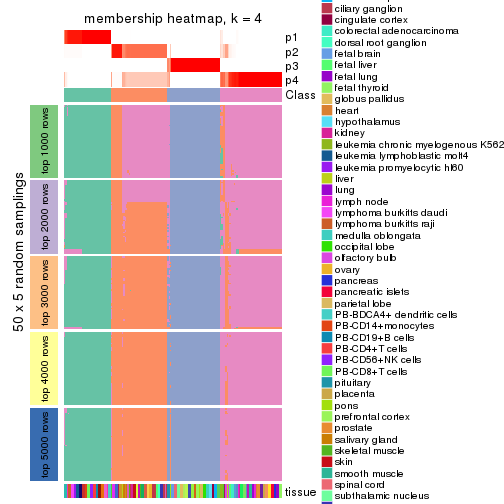</p>

</div>
<div id='tab-CV-pam-membership-heatmap-4'>
<pre><code class="r">membership_heatmap(res, k = 5)
</code></pre>

<p></p>

</div>
<div id='tab-CV-pam-membership-heatmap-5'>
<pre><code class="r">membership_heatmap(res, k = 6)
</code></pre>

<p></p>

</div>
</div>

As soon as we have had the classes for columns, we can look for signatures
which are significantly different between classes which can be candidate marks
for certain classes. Following are the heatmaps for signatures.


Signature heatmaps where rows are scaled:


<script>
$( function() {
	$( '#tabs-CV-pam-get-signatures' ).tabs();
} );
</script>
<div id='tabs-CV-pam-get-signatures'>
<ul>
<li><a href='#tab-CV-pam-get-signatures-1'>k = 2</a></li>
<li><a href='#tab-CV-pam-get-signatures-2'>k = 3</a></li>
<li><a href='#tab-CV-pam-get-signatures-3'>k = 4</a></li>
<li><a href='#tab-CV-pam-get-signatures-4'>k = 5</a></li>
<li><a href='#tab-CV-pam-get-signatures-5'>k = 6</a></li>
</ul>
<div id='tab-CV-pam-get-signatures-1'>
<pre><code class="r">get_signatures(res, k = 2)
</code></pre>

<p></p>

</div>
<div id='tab-CV-pam-get-signatures-2'>
<pre><code class="r">get_signatures(res, k = 3)
</code></pre>

<p></p>

</div>
<div id='tab-CV-pam-get-signatures-3'>
<pre><code class="r">get_signatures(res, k = 4)
</code></pre>

<p></p>

</div>
<div id='tab-CV-pam-get-signatures-4'>
<pre><code class="r">get_signatures(res, k = 5)
</code></pre>

<p></p>

</div>
<div id='tab-CV-pam-get-signatures-5'>
<pre><code class="r">get_signatures(res, k = 6)
</code></pre>

<p></p>

</div>
</div>


Signature heatmaps where rows are not scaled:


<script>
$( function() {
	$( '#tabs-CV-pam-get-signatures-no-scale' ).tabs();
} );
</script>
<div id='tabs-CV-pam-get-signatures-no-scale'>
<ul>
<li><a href='#tab-CV-pam-get-signatures-no-scale-1'>k = 2</a></li>
<li><a href='#tab-CV-pam-get-signatures-no-scale-2'>k = 3</a></li>
<li><a href='#tab-CV-pam-get-signatures-no-scale-3'>k = 4</a></li>
<li><a href='#tab-CV-pam-get-signatures-no-scale-4'>k = 5</a></li>
<li><a href='#tab-CV-pam-get-signatures-no-scale-5'>k = 6</a></li>
</ul>
<div id='tab-CV-pam-get-signatures-no-scale-1'>
<pre><code class="r">get_signatures(res, k = 2, scale_rows = FALSE)
</code></pre>

<p></p>

</div>
<div id='tab-CV-pam-get-signatures-no-scale-2'>
<pre><code class="r">get_signatures(res, k = 3, scale_rows = FALSE)
</code></pre>

<p></p>

</div>
<div id='tab-CV-pam-get-signatures-no-scale-3'>
<pre><code class="r">get_signatures(res, k = 4, scale_rows = FALSE)
</code></pre>

<p></p>

</div>
<div id='tab-CV-pam-get-signatures-no-scale-4'>
<pre><code class="r">get_signatures(res, k = 5, scale_rows = FALSE)
</code></pre>

<p></p>

</div>
<div id='tab-CV-pam-get-signatures-no-scale-5'>
<pre><code class="r">get_signatures(res, k = 6, scale_rows = FALSE)
</code></pre>

<p></p>

</div>
</div>


Compare the overlap of signatures from different k:

```r
compare_signatures(res)
```


`get_signature()` returns a data frame invisibly. TO get the list of signatures, the function
call should be assigned to a variable explicitly. In following code, if `plot` argument is set
to `FALSE`, no heatmap is plotted while only the differential analysis is performed.

```r
# code only for demonstration
tb = get_signature(res, k = ..., plot = FALSE)
```

An example of the output of `tb` is:

```
#>   which_row         fdr    mean_1    mean_2 scaled_mean_1 scaled_mean_2 km
#> 1        38 0.042760348  8.373488  9.131774    -0.5533452     0.5164555  1
#> 2        40 0.018707592  7.106213  8.469186    -0.6173731     0.5762149  1
#> 3        55 0.019134737 10.221463 11.207825    -0.6159697     0.5749050  1
#> 4        59 0.006059896  5.921854  7.869574    -0.6899429     0.6439467  1
#> 5        60 0.018055526  8.928898 10.211722    -0.6204761     0.5791110  1
#> 6        98 0.009384629 15.714769 14.887706     0.6635654    -0.6193277  2
...
```

The columns in `tb` are:

1. `which_row`: row indices corresponding to the input matrix.
2. `fdr`: FDR for the differential test. 
3. `mean_x`: The mean value in group x.
4. `scaled_mean_x`: The mean value in group x after rows are scaled.
5. `km`: Row groups if k-means clustering is applied to rows.


UMAP plot which shows how samples are separated.


<script>
$( function() {
	$( '#tabs-CV-pam-dimension-reduction' ).tabs();
} );
</script>
<div id='tabs-CV-pam-dimension-reduction'>
<ul>
<li><a href='#tab-CV-pam-dimension-reduction-1'>k = 2</a></li>
<li><a href='#tab-CV-pam-dimension-reduction-2'>k = 3</a></li>
<li><a href='#tab-CV-pam-dimension-reduction-3'>k = 4</a></li>
<li><a href='#tab-CV-pam-dimension-reduction-4'>k = 5</a></li>
<li><a href='#tab-CV-pam-dimension-reduction-5'>k = 6</a></li>
</ul>
<div id='tab-CV-pam-dimension-reduction-1'>
<pre><code class="r">dimension_reduction(res, k = 2, method = &quot;UMAP&quot;)
</code></pre>

<p></p>

</div>
<div id='tab-CV-pam-dimension-reduction-2'>
<pre><code class="r">dimension_reduction(res, k = 3, method = &quot;UMAP&quot;)
</code></pre>

<p></p>

</div>
<div id='tab-CV-pam-dimension-reduction-3'>
<pre><code class="r">dimension_reduction(res, k = 4, method = &quot;UMAP&quot;)
</code></pre>

<p></p>

</div>
<div id='tab-CV-pam-dimension-reduction-4'>
<pre><code class="r">dimension_reduction(res, k = 5, method = &quot;UMAP&quot;)
</code></pre>

<p></p>

</div>
<div id='tab-CV-pam-dimension-reduction-5'>
<pre><code class="r">dimension_reduction(res, k = 6, method = &quot;UMAP&quot;)
</code></pre>

<p></p>

</div>
</div>


Following heatmap shows how subgroups are split when increasing `k`:

```r
collect_classes(res)
```


Test correlation between subgroups and known annotations. If the known
annotation is numeric, one-way ANOVA test is applied, and if the known
annotation is discrete, chi-squared contingency table test is applied.

```r
test_to_known_factors(res)
```

```
#>          n tissue(p) k
#> CV:pam 148  7.31e-07 2
#> CV:pam 156  1.77e-12 3
#> CV:pam 152  6.13e-15 4
#> CV:pam 152  6.04e-19 5
#> CV:pam 155  6.42e-25 6
```


If matrix rows can be associated to genes, consider to use `functional_enrichment(res,
...)` to perform function enrichment for the signature genes. See [this vignette](http://bioconductor.org/packages/devel/bioc/vignettes/cola/inst/doc/functional_enrichment.html) for more detailed explanations.


 

---------------------------------------------------


### CV:mclust


The object with results only for a single top-value method and a single partition method 
can be extracted as:

```r
res = res_list["CV", "mclust"]
# you can also extract it by
# res = res_list["CV:mclust"]
```

A summary of `res` and all the functions that can be applied to it:

```r
res
```

```
#> A 'ConsensusPartition' object with k = 2, 3, 4, 5, 6.
#>   On a matrix with 21168 rows and 158 columns.
#>   Top rows (1000, 2000, 3000, 4000, 5000) are extracted by 'CV' method.
#>   Subgroups are detected by 'mclust' method.
#>   Performed in total 1250 partitions by row resampling.
#>   Best k for subgroups seems to be 2.
#> 
#> Following methods can be applied to this 'ConsensusPartition' object:
#>  [1] "cola_report"             "collect_classes"         "collect_plots"          
#>  [4] "collect_stats"           "colnames"                "compare_signatures"     
#>  [7] "consensus_heatmap"       "dimension_reduction"     "functional_enrichment"  
#> [10] "get_anno_col"            "get_anno"                "get_classes"            
#> [13] "get_consensus"           "get_matrix"              "get_membership"         
#> [16] "get_param"               "get_signatures"          "get_stats"              
#> [19] "is_best_k"               "is_stable_k"             "membership_heatmap"     
#> [22] "ncol"                    "nrow"                    "plot_ecdf"              
#> [25] "rownames"                "select_partition_number" "show"                   
#> [28] "suggest_best_k"          "test_to_known_factors"
```

`collect_plots()` function collects all the plots made from `res` for all `k` (number of partitions)
into one single page to provide an easy and fast comparison between different `k`.

```r
collect_plots(res)
```


The plots are:

- The first row: a plot of the ECDF (empirical cumulative distribution
  function) curves of the consensus matrix for each `k` and the heatmap of
  predicted classes for each `k`.
- The second row: heatmaps of the consensus matrix for each `k`.
- The third row: heatmaps of the membership matrix for each `k`.
- The fouth row: heatmaps of the signatures for each `k`.

All the plots in panels can be made by individual functions and they are
plotted later in this section.

`select_partition_number()` produces several plots showing different
statistics for choosing "optimized" `k`. There are following statistics:

- ECDF curves of the consensus matrix for each `k`;
- 1-PAC. [The PAC
  score](https://en.wikipedia.org/wiki/Consensus_clustering#Over-interpretation_potential_of_consensus_clustering)
  measures the proportion of the ambiguous subgrouping.
- Mean silhouette score.
- Concordance. The mean probability of fiting the consensus class ids in all
  partitions.
- Area increased. Denote $A_k$ as the area under the ECDF curve for current
  `k`, the area increased is defined as $A_k - A_{k-1}$.
- Rand index. The percent of pairs of samples that are both in a same cluster
  or both are not in a same cluster in the partition of k and k-1.
- Jaccard index. The ratio of pairs of samples are both in a same cluster in
  the partition of k and k-1 and the pairs of samples are both in a same
  cluster in the partition k or k-1.

The detailed explanations of these statistics can be found in [the _cola_
vignette](http://bioconductor.org/packages/devel/bioc/vignettes/cola/inst/doc/cola.html#toc_13).

Generally speaking, lower PAC score, higher mean silhouette score or higher
concordance corresponds to better partition. Rand index and Jaccard index
measure how similar the current partition is compared to partition with `k-1`.
If they are too similar, we won't accept `k` is better than `k-1`.

```r
select_partition_number(res)
```


The numeric values for all these statistics can be obtained by `get_stats()`.

```r
get_stats(res)
```

```
#>   k 1-PAC mean_silhouette concordance area_increased  Rand Jaccard
#> 2 2 0.833           0.879       0.952         0.4971 0.505   0.505
#> 3 3 0.661           0.782       0.892         0.2803 0.609   0.395
#> 4 4 0.772           0.792       0.880         0.1293 0.844   0.617
#> 5 5 0.704           0.693       0.828         0.0595 0.909   0.695
#> 6 6 0.774           0.727       0.843         0.0479 0.899   0.631
```

`suggest_best_k()` suggests the best $k$ based on these statistics. The rules are as follows:

- All $k$ with Jaccard index larger than 0.95 are removed because increasing
  $k$ does not provide enough extra information. If all $k$ are removed, it is
  marked as no subgroup is detected.
- For all $k$ with 1-PAC score larger than 0.9, the maximal $k$ is taken as
  the best $k$, and other $k$ are marked as optional $k$.
- If it does not fit the second rule. The $k$ with the maximal vote of the
  highest 1-PAC score, highest mean silhouette, and highest concordance is
  taken as the best $k$.

```r
suggest_best_k(res)
```

```
#> [1] 2
```


Following shows the table of the partitions (You need to click the **show/hide
code output** link to see it). The membership matrix (columns with name `p*`)
is inferred by
[`clue::cl_consensus()`](https://www.rdocumentation.org/link/cl_consensus?package=clue)
function with the `SE` method. Basically the value in the membership matrix
represents the probability to belong to a certain group. The finall class
label for an item is determined with the group with highest probability it
belongs to.

In `get_classes()` function, the entropy is calculated from the membership
matrix and the silhouette score is calculated from the consensus matrix.


<script>
$( function() {
	$( '#tabs-CV-mclust-get-classes' ).tabs();
} );
</script>
<div id='tabs-CV-mclust-get-classes'>
<ul>
<li><a href='#tab-CV-mclust-get-classes-1'>k = 2</a></li>
<li><a href='#tab-CV-mclust-get-classes-2'>k = 3</a></li>
<li><a href='#tab-CV-mclust-get-classes-3'>k = 4</a></li>
<li><a href='#tab-CV-mclust-get-classes-4'>k = 5</a></li>
<li><a href='#tab-CV-mclust-get-classes-5'>k = 6</a></li>
</ul>

<div id='tab-CV-mclust-get-classes-1'>
<p><a id='tab-CV-mclust-get-classes-1-a' style='color:#0366d6' href='#'>show/hide code output</a></p>
<pre><code class="r">cbind(get_classes(res, k = 2), get_membership(res, k = 2))
</code></pre>

<pre><code>#&gt;          class entropy silhouette    p1    p2
#&gt; GSM18927     2  0.0000     0.9355 0.000 1.000
#&gt; GSM18928     2  0.0000     0.9355 0.000 1.000
#&gt; GSM18915     2  0.0000     0.9355 0.000 1.000
#&gt; GSM18916     2  0.0000     0.9355 0.000 1.000
#&gt; GSM18939     2  0.0000     0.9355 0.000 1.000
#&gt; GSM18940     2  0.0000     0.9355 0.000 1.000
#&gt; GSM18933     2  0.0000     0.9355 0.000 1.000
#&gt; GSM18934     2  0.0000     0.9355 0.000 1.000
#&gt; GSM18925     2  0.0000     0.9355 0.000 1.000
#&gt; GSM18926     2  0.0000     0.9355 0.000 1.000
#&gt; GSM18931     2  0.0000     0.9355 0.000 1.000
#&gt; GSM18932     2  0.0000     0.9355 0.000 1.000
#&gt; GSM19019     2  0.0000     0.9355 0.000 1.000
#&gt; GSM19020     2  0.0000     0.9355 0.000 1.000
#&gt; GSM18923     2  0.0000     0.9355 0.000 1.000
#&gt; GSM18924     2  0.0000     0.9355 0.000 1.000
#&gt; GSM18941     2  0.0000     0.9355 0.000 1.000
#&gt; GSM18942     2  0.0000     0.9355 0.000 1.000
#&gt; GSM18929     2  0.0000     0.9355 0.000 1.000
#&gt; GSM18930     2  0.0000     0.9355 0.000 1.000
#&gt; GSM18911     2  0.0000     0.9355 0.000 1.000
#&gt; GSM18912     2  0.0000     0.9355 0.000 1.000
#&gt; GSM18935     2  0.0000     0.9355 0.000 1.000
#&gt; GSM18936     2  0.0000     0.9355 0.000 1.000
#&gt; GSM19005     2  0.0000     0.9355 0.000 1.000
#&gt; GSM19006     2  0.0000     0.9355 0.000 1.000
#&gt; GSM18921     2  0.0000     0.9355 0.000 1.000
#&gt; GSM18922     2  0.0000     0.9355 0.000 1.000
#&gt; GSM18919     2  0.0000     0.9355 0.000 1.000
#&gt; GSM18920     2  0.0000     0.9355 0.000 1.000
#&gt; GSM18917     2  0.0000     0.9355 0.000 1.000
#&gt; GSM18918     2  0.0000     0.9355 0.000 1.000
#&gt; GSM18913     2  0.0000     0.9355 0.000 1.000
#&gt; GSM18914     2  0.0000     0.9355 0.000 1.000
#&gt; GSM18937     2  0.0000     0.9355 0.000 1.000
#&gt; GSM18938     2  0.0000     0.9355 0.000 1.000
#&gt; GSM18943     2  0.0000     0.9355 0.000 1.000
#&gt; GSM18944     2  0.0000     0.9355 0.000 1.000
#&gt; GSM19003     2  0.0000     0.9355 0.000 1.000
#&gt; GSM19004     2  0.0000     0.9355 0.000 1.000
#&gt; GSM19011     2  0.0000     0.9355 0.000 1.000
#&gt; GSM19012     2  0.0000     0.9355 0.000 1.000
#&gt; GSM19009     2  0.0000     0.9355 0.000 1.000
#&gt; GSM19010     2  0.0000     0.9355 0.000 1.000
#&gt; GSM18945     2  0.0000     0.9355 0.000 1.000
#&gt; GSM18946     2  0.0000     0.9355 0.000 1.000
#&gt; GSM18963     2  0.0376     0.9339 0.004 0.996
#&gt; GSM18964     2  0.0376     0.9339 0.004 0.996
#&gt; GSM18905     1  0.0000     0.9633 1.000 0.000
#&gt; GSM18906     1  0.0000     0.9633 1.000 0.000
#&gt; GSM18965     2  0.2043     0.9176 0.032 0.968
#&gt; GSM18966     2  0.2043     0.9176 0.032 0.968
#&gt; GSM18873     1  0.0000     0.9633 1.000 0.000
#&gt; GSM18874     1  0.0000     0.9633 1.000 0.000
#&gt; GSM18973     1  0.0000     0.9633 1.000 0.000
#&gt; GSM18974     1  0.0000     0.9633 1.000 0.000
#&gt; GSM18977     1  0.0000     0.9633 1.000 0.000
#&gt; GSM18978     2  0.1414     0.9256 0.020 0.980
#&gt; GSM18979     2  0.2423     0.9121 0.040 0.960
#&gt; GSM18980     2  0.0000     0.9355 0.000 1.000
#&gt; GSM18883     1  0.0000     0.9633 1.000 0.000
#&gt; GSM18884     1  0.0000     0.9633 1.000 0.000
#&gt; GSM18885     1  0.0000     0.9633 1.000 0.000
#&gt; GSM18886     1  0.0000     0.9633 1.000 0.000
#&gt; GSM18907     1  0.0000     0.9633 1.000 0.000
#&gt; GSM18908     1  0.0000     0.9633 1.000 0.000
#&gt; GSM18909     1  0.0000     0.9633 1.000 0.000
#&gt; GSM18910     1  0.0000     0.9633 1.000 0.000
#&gt; GSM18867     1  0.0000     0.9633 1.000 0.000
#&gt; GSM18868     1  0.0000     0.9633 1.000 0.000
#&gt; GSM18947     2  0.0000     0.9355 0.000 1.000
#&gt; GSM18948     2  0.0000     0.9355 0.000 1.000
#&gt; GSM18995     2  0.0000     0.9355 0.000 1.000
#&gt; GSM18996     2  0.0000     0.9355 0.000 1.000
#&gt; GSM18975     2  0.1414     0.9256 0.020 0.980
#&gt; GSM18976     2  0.0938     0.9301 0.012 0.988
#&gt; GSM18997     2  0.6712     0.7767 0.176 0.824
#&gt; GSM18998     2  0.8443     0.6334 0.272 0.728
#&gt; GSM18967     2  0.0672     0.9321 0.008 0.992
#&gt; GSM18968     2  0.0672     0.9321 0.008 0.992
#&gt; GSM18959     2  0.0938     0.9301 0.012 0.988
#&gt; GSM18960     2  0.1184     0.9278 0.016 0.984
#&gt; GSM19015     2  0.9754     0.3385 0.408 0.592
#&gt; GSM19016     2  0.9552     0.4172 0.376 0.624
#&gt; GSM18957     2  0.0672     0.9321 0.008 0.992
#&gt; GSM18958     2  0.1633     0.9230 0.024 0.976
#&gt; GSM18981     1  0.0000     0.9633 1.000 0.000
#&gt; GSM18982     1  0.0000     0.9633 1.000 0.000
#&gt; GSM18989     1  0.0000     0.9633 1.000 0.000
#&gt; GSM18990     1  0.0000     0.9633 1.000 0.000
#&gt; GSM18985     1  0.0000     0.9633 1.000 0.000
#&gt; GSM18986     2  0.9815     0.3167 0.420 0.580
#&gt; GSM18987     1  0.0000     0.9633 1.000 0.000
#&gt; GSM18988     1  0.0000     0.9633 1.000 0.000
#&gt; GSM18983     1  0.0000     0.9633 1.000 0.000
#&gt; GSM18984     1  0.0000     0.9633 1.000 0.000
#&gt; GSM18951     2  0.9522     0.4279 0.372 0.628
#&gt; GSM18952     2  0.2603     0.9097 0.044 0.956
#&gt; GSM19007     2  0.0938     0.9292 0.012 0.988
#&gt; GSM19008     2  0.7056     0.7477 0.192 0.808
#&gt; GSM18999     2  0.9795     0.3112 0.416 0.584
#&gt; GSM19000     1  0.9963     0.0910 0.536 0.464
#&gt; GSM18889     1  0.0000     0.9633 1.000 0.000
#&gt; GSM18890     1  0.0000     0.9633 1.000 0.000
#&gt; GSM18881     1  0.0000     0.9633 1.000 0.000
#&gt; GSM18882     1  0.0000     0.9633 1.000 0.000
#&gt; GSM18877     1  0.0000     0.9633 1.000 0.000
#&gt; GSM18878     1  0.0000     0.9633 1.000 0.000
#&gt; GSM18875     1  0.0000     0.9633 1.000 0.000
#&gt; GSM18876     1  0.0000     0.9633 1.000 0.000
#&gt; GSM18879     1  0.0000     0.9633 1.000 0.000
#&gt; GSM18880     1  0.0000     0.9633 1.000 0.000
#&gt; GSM18871     1  0.0000     0.9633 1.000 0.000
#&gt; GSM18872     1  0.0000     0.9633 1.000 0.000
#&gt; GSM18903     1  0.0000     0.9633 1.000 0.000
#&gt; GSM18904     1  0.0000     0.9633 1.000 0.000
#&gt; GSM18949     2  0.8144     0.6628 0.252 0.748
#&gt; GSM18950     2  0.8207     0.6562 0.256 0.744
#&gt; GSM18953     2  0.5408     0.8314 0.124 0.876
#&gt; GSM18954     1  0.9000     0.4973 0.684 0.316
#&gt; GSM19013     1  0.9963     0.0911 0.536 0.464
#&gt; GSM19014     1  0.9815     0.2390 0.580 0.420
#&gt; GSM18971     1  0.0376     0.9598 0.996 0.004
#&gt; GSM18972     1  0.0376     0.9598 0.996 0.004
#&gt; GSM18969     1  0.1843     0.9378 0.972 0.028
#&gt; GSM18970     1  0.0000     0.9633 1.000 0.000
#&gt; GSM18869     1  0.0000     0.9633 1.000 0.000
#&gt; GSM18870     1  0.0000     0.9633 1.000 0.000
#&gt; GSM19017     2  0.9983     0.1205 0.476 0.524
#&gt; GSM19018     2  0.9970     0.1491 0.468 0.532
#&gt; GSM18991     1  0.0376     0.9597 0.996 0.004
#&gt; GSM18992     1  0.4298     0.8694 0.912 0.088
#&gt; GSM19021     2  0.0000     0.9355 0.000 1.000
#&gt; GSM19022     2  0.0000     0.9355 0.000 1.000
#&gt; GSM19001     1  0.9988     0.0285 0.520 0.480
#&gt; GSM19002     2  0.9866     0.2650 0.432 0.568
#&gt; GSM18899     1  0.0000     0.9633 1.000 0.000
#&gt; GSM18900     1  0.0000     0.9633 1.000 0.000
#&gt; GSM18961     2  0.1414     0.9256 0.020 0.980
#&gt; GSM18962     2  0.0938     0.9301 0.012 0.988
#&gt; GSM18901     1  0.0000     0.9633 1.000 0.000
#&gt; GSM18902     1  0.0000     0.9633 1.000 0.000
#&gt; GSM18993     2  0.6438     0.7869 0.164 0.836
#&gt; GSM18994     2  0.6623     0.7767 0.172 0.828
#&gt; GSM18865     1  0.0000     0.9633 1.000 0.000
#&gt; GSM18866     1  0.0000     0.9633 1.000 0.000
#&gt; GSM18897     1  0.0000     0.9633 1.000 0.000
#&gt; GSM18898     1  0.0000     0.9633 1.000 0.000
#&gt; GSM18887     1  0.0000     0.9633 1.000 0.000
#&gt; GSM18888     1  0.0000     0.9633 1.000 0.000
#&gt; GSM18893     1  0.0000     0.9633 1.000 0.000
#&gt; GSM18894     1  0.0000     0.9633 1.000 0.000
#&gt; GSM18895     1  0.0000     0.9633 1.000 0.000
#&gt; GSM18896     1  0.0000     0.9633 1.000 0.000
#&gt; GSM18891     1  0.0000     0.9633 1.000 0.000
#&gt; GSM18892     1  0.0000     0.9633 1.000 0.000
#&gt; GSM18955     2  0.0000     0.9355 0.000 1.000
#&gt; GSM18956     2  0.0000     0.9355 0.000 1.000
</code></pre>

<script>
$('#tab-CV-mclust-get-classes-1-a').parent().next().next().hide();
$('#tab-CV-mclust-get-classes-1-a').click(function(){
  $('#tab-CV-mclust-get-classes-1-a').parent().next().next().toggle();
  return(false);
});
</script>
</div>

<div id='tab-CV-mclust-get-classes-2'>
<p><a id='tab-CV-mclust-get-classes-2-a' style='color:#0366d6' href='#'>show/hide code output</a></p>
<pre><code class="r">cbind(get_classes(res, k = 3), get_membership(res, k = 3))
</code></pre>

<pre><code>#&gt;          class entropy silhouette    p1    p2    p3
#&gt; GSM18927     3  0.0000      0.987 0.000 0.000 1.000
#&gt; GSM18928     3  0.0000      0.987 0.000 0.000 1.000
#&gt; GSM18915     3  0.0000      0.987 0.000 0.000 1.000
#&gt; GSM18916     3  0.0000      0.987 0.000 0.000 1.000
#&gt; GSM18939     3  0.0000      0.987 0.000 0.000 1.000
#&gt; GSM18940     3  0.0000      0.987 0.000 0.000 1.000
#&gt; GSM18933     3  0.0000      0.987 0.000 0.000 1.000
#&gt; GSM18934     3  0.0000      0.987 0.000 0.000 1.000
#&gt; GSM18925     3  0.0000      0.987 0.000 0.000 1.000
#&gt; GSM18926     3  0.0000      0.987 0.000 0.000 1.000
#&gt; GSM18931     3  0.0000      0.987 0.000 0.000 1.000
#&gt; GSM18932     3  0.0000      0.987 0.000 0.000 1.000
#&gt; GSM19019     2  0.6235      0.201 0.000 0.564 0.436
#&gt; GSM19020     2  0.6235      0.201 0.000 0.564 0.436
#&gt; GSM18923     3  0.0000      0.987 0.000 0.000 1.000
#&gt; GSM18924     3  0.0000      0.987 0.000 0.000 1.000
#&gt; GSM18941     3  0.0000      0.987 0.000 0.000 1.000
#&gt; GSM18942     3  0.0592      0.975 0.000 0.012 0.988
#&gt; GSM18929     3  0.0000      0.987 0.000 0.000 1.000
#&gt; GSM18930     3  0.0000      0.987 0.000 0.000 1.000
#&gt; GSM18911     3  0.0000      0.987 0.000 0.000 1.000
#&gt; GSM18912     3  0.0000      0.987 0.000 0.000 1.000
#&gt; GSM18935     3  0.0000      0.987 0.000 0.000 1.000
#&gt; GSM18936     3  0.0000      0.987 0.000 0.000 1.000
#&gt; GSM19005     2  0.5497      0.510 0.000 0.708 0.292
#&gt; GSM19006     2  0.5431      0.523 0.000 0.716 0.284
#&gt; GSM18921     3  0.0000      0.987 0.000 0.000 1.000
#&gt; GSM18922     3  0.0000      0.987 0.000 0.000 1.000
#&gt; GSM18919     3  0.0000      0.987 0.000 0.000 1.000
#&gt; GSM18920     3  0.0000      0.987 0.000 0.000 1.000
#&gt; GSM18917     3  0.0000      0.987 0.000 0.000 1.000
#&gt; GSM18918     3  0.0000      0.987 0.000 0.000 1.000
#&gt; GSM18913     3  0.0000      0.987 0.000 0.000 1.000
#&gt; GSM18914     3  0.0000      0.987 0.000 0.000 1.000
#&gt; GSM18937     3  0.0000      0.987 0.000 0.000 1.000
#&gt; GSM18938     3  0.0000      0.987 0.000 0.000 1.000
#&gt; GSM18943     3  0.4654      0.742 0.000 0.208 0.792
#&gt; GSM18944     3  0.4654      0.742 0.000 0.208 0.792
#&gt; GSM19003     2  0.5016      0.584 0.000 0.760 0.240
#&gt; GSM19004     2  0.5497      0.510 0.000 0.708 0.292
#&gt; GSM19011     2  0.5497      0.510 0.000 0.708 0.292
#&gt; GSM19012     2  0.5497      0.510 0.000 0.708 0.292
#&gt; GSM19009     2  0.5560      0.496 0.000 0.700 0.300
#&gt; GSM19010     2  0.5529      0.503 0.000 0.704 0.296
#&gt; GSM18945     3  0.0000      0.987 0.000 0.000 1.000
#&gt; GSM18946     3  0.0000      0.987 0.000 0.000 1.000
#&gt; GSM18963     2  0.0000      0.786 0.000 1.000 0.000
#&gt; GSM18964     2  0.0000      0.786 0.000 1.000 0.000
#&gt; GSM18905     2  0.5706      0.588 0.320 0.680 0.000
#&gt; GSM18906     2  0.5760      0.579 0.328 0.672 0.000
#&gt; GSM18965     2  0.3116      0.754 0.108 0.892 0.000
#&gt; GSM18966     2  0.2711      0.762 0.088 0.912 0.000
#&gt; GSM18873     1  0.0000      0.981 1.000 0.000 0.000
#&gt; GSM18874     1  0.0000      0.981 1.000 0.000 0.000
#&gt; GSM18973     2  0.6286      0.353 0.464 0.536 0.000
#&gt; GSM18974     2  0.6286      0.353 0.464 0.536 0.000
#&gt; GSM18977     2  0.5760      0.579 0.328 0.672 0.000
#&gt; GSM18978     2  0.0000      0.786 0.000 1.000 0.000
#&gt; GSM18979     2  0.0000      0.786 0.000 1.000 0.000
#&gt; GSM18980     2  0.5295      0.688 0.036 0.808 0.156
#&gt; GSM18883     1  0.0000      0.981 1.000 0.000 0.000
#&gt; GSM18884     1  0.0000      0.981 1.000 0.000 0.000
#&gt; GSM18885     1  0.0000      0.981 1.000 0.000 0.000
#&gt; GSM18886     1  0.0000      0.981 1.000 0.000 0.000
#&gt; GSM18907     1  0.0000      0.981 1.000 0.000 0.000
#&gt; GSM18908     1  0.0000      0.981 1.000 0.000 0.000
#&gt; GSM18909     2  0.6286      0.353 0.464 0.536 0.000
#&gt; GSM18910     2  0.6286      0.353 0.464 0.536 0.000
#&gt; GSM18867     1  0.0000      0.981 1.000 0.000 0.000
#&gt; GSM18868     1  0.0000      0.981 1.000 0.000 0.000
#&gt; GSM18947     2  0.0237      0.785 0.000 0.996 0.004
#&gt; GSM18948     2  0.0592      0.783 0.000 0.988 0.012
#&gt; GSM18995     2  0.0000      0.786 0.000 1.000 0.000
#&gt; GSM18996     2  0.0000      0.786 0.000 1.000 0.000
#&gt; GSM18975     2  0.0000      0.786 0.000 1.000 0.000
#&gt; GSM18976     2  0.0000      0.786 0.000 1.000 0.000
#&gt; GSM18997     2  0.0237      0.785 0.000 0.996 0.004
#&gt; GSM18998     2  0.0424      0.784 0.000 0.992 0.008
#&gt; GSM18967     2  0.0237      0.786 0.004 0.996 0.000
#&gt; GSM18968     2  0.0000      0.786 0.000 1.000 0.000
#&gt; GSM18959     2  0.0000      0.786 0.000 1.000 0.000
#&gt; GSM18960     2  0.0000      0.786 0.000 1.000 0.000
#&gt; GSM19015     2  0.0000      0.786 0.000 1.000 0.000
#&gt; GSM19016     2  0.0000      0.786 0.000 1.000 0.000
#&gt; GSM18957     2  0.0000      0.786 0.000 1.000 0.000
#&gt; GSM18958     2  0.0000      0.786 0.000 1.000 0.000
#&gt; GSM18981     2  0.6192      0.464 0.420 0.580 0.000
#&gt; GSM18982     2  0.6192      0.464 0.420 0.580 0.000
#&gt; GSM18989     2  0.6192      0.464 0.420 0.580 0.000
#&gt; GSM18990     2  0.6192      0.464 0.420 0.580 0.000
#&gt; GSM18985     2  0.6204      0.456 0.424 0.576 0.000
#&gt; GSM18986     2  0.1643      0.778 0.044 0.956 0.000
#&gt; GSM18987     2  0.6192      0.464 0.420 0.580 0.000
#&gt; GSM18988     2  0.6192      0.464 0.420 0.580 0.000
#&gt; GSM18983     2  0.6192      0.464 0.420 0.580 0.000
#&gt; GSM18984     2  0.6192      0.464 0.420 0.580 0.000
#&gt; GSM18951     2  0.0000      0.786 0.000 1.000 0.000
#&gt; GSM18952     2  0.0237      0.786 0.004 0.996 0.000
#&gt; GSM19007     2  0.2066      0.762 0.000 0.940 0.060
#&gt; GSM19008     2  0.0592      0.783 0.000 0.988 0.012
#&gt; GSM18999     2  0.0000      0.786 0.000 1.000 0.000
#&gt; GSM19000     2  0.0000      0.786 0.000 1.000 0.000
#&gt; GSM18889     1  0.0000      0.981 1.000 0.000 0.000
#&gt; GSM18890     1  0.0000      0.981 1.000 0.000 0.000
#&gt; GSM18881     1  0.0000      0.981 1.000 0.000 0.000
#&gt; GSM18882     1  0.0000      0.981 1.000 0.000 0.000
#&gt; GSM18877     1  0.0000      0.981 1.000 0.000 0.000
#&gt; GSM18878     1  0.0000      0.981 1.000 0.000 0.000
#&gt; GSM18875     1  0.0000      0.981 1.000 0.000 0.000
#&gt; GSM18876     1  0.0000      0.981 1.000 0.000 0.000
#&gt; GSM18879     1  0.0000      0.981 1.000 0.000 0.000
#&gt; GSM18880     1  0.0000      0.981 1.000 0.000 0.000
#&gt; GSM18871     1  0.0000      0.981 1.000 0.000 0.000
#&gt; GSM18872     1  0.0000      0.981 1.000 0.000 0.000
#&gt; GSM18903     2  0.6286      0.353 0.464 0.536 0.000
#&gt; GSM18904     2  0.6286      0.353 0.464 0.536 0.000
#&gt; GSM18949     2  0.3879      0.731 0.152 0.848 0.000
#&gt; GSM18950     2  0.3879      0.731 0.152 0.848 0.000
#&gt; GSM18953     2  0.0000      0.786 0.000 1.000 0.000
#&gt; GSM18954     2  0.1031      0.782 0.024 0.976 0.000
#&gt; GSM19013     2  0.1753      0.776 0.048 0.952 0.000
#&gt; GSM19014     2  0.2165      0.771 0.064 0.936 0.000
#&gt; GSM18971     2  0.5216      0.651 0.260 0.740 0.000
#&gt; GSM18972     2  0.5178      0.654 0.256 0.744 0.000
#&gt; GSM18969     2  0.4931      0.673 0.232 0.768 0.000
#&gt; GSM18970     2  0.5465      0.624 0.288 0.712 0.000
#&gt; GSM18869     1  0.0000      0.981 1.000 0.000 0.000
#&gt; GSM18870     1  0.0000      0.981 1.000 0.000 0.000
#&gt; GSM19017     2  0.0000      0.786 0.000 1.000 0.000
#&gt; GSM19018     2  0.0000      0.786 0.000 1.000 0.000
#&gt; GSM18991     2  0.5254      0.649 0.264 0.736 0.000
#&gt; GSM18992     2  0.4399      0.710 0.188 0.812 0.000
#&gt; GSM19021     2  0.6244      0.190 0.000 0.560 0.440
#&gt; GSM19022     2  0.6244      0.190 0.000 0.560 0.440
#&gt; GSM19001     2  0.0000      0.786 0.000 1.000 0.000
#&gt; GSM19002     2  0.0000      0.786 0.000 1.000 0.000
#&gt; GSM18899     2  0.6291      0.343 0.468 0.532 0.000
#&gt; GSM18900     2  0.6291      0.343 0.468 0.532 0.000
#&gt; GSM18961     2  0.0000      0.786 0.000 1.000 0.000
#&gt; GSM18962     2  0.0000      0.786 0.000 1.000 0.000
#&gt; GSM18901     2  0.6291      0.343 0.468 0.532 0.000
#&gt; GSM18902     2  0.6291      0.343 0.468 0.532 0.000
#&gt; GSM18993     2  0.3619      0.740 0.136 0.864 0.000
#&gt; GSM18994     2  0.3686      0.738 0.140 0.860 0.000
#&gt; GSM18865     1  0.4974      0.557 0.764 0.236 0.000
#&gt; GSM18866     1  0.4974      0.557 0.764 0.236 0.000
#&gt; GSM18897     1  0.0000      0.981 1.000 0.000 0.000
#&gt; GSM18898     1  0.0000      0.981 1.000 0.000 0.000
#&gt; GSM18887     1  0.0000      0.981 1.000 0.000 0.000
#&gt; GSM18888     1  0.0000      0.981 1.000 0.000 0.000
#&gt; GSM18893     1  0.0000      0.981 1.000 0.000 0.000
#&gt; GSM18894     1  0.0000      0.981 1.000 0.000 0.000
#&gt; GSM18895     1  0.0000      0.981 1.000 0.000 0.000
#&gt; GSM18896     1  0.0000      0.981 1.000 0.000 0.000
#&gt; GSM18891     1  0.0000      0.981 1.000 0.000 0.000
#&gt; GSM18892     1  0.0000      0.981 1.000 0.000 0.000
#&gt; GSM18955     2  0.0424      0.784 0.000 0.992 0.008
#&gt; GSM18956     2  0.0237      0.785 0.000 0.996 0.004
</code></pre>

<script>
$('#tab-CV-mclust-get-classes-2-a').parent().next().next().hide();
$('#tab-CV-mclust-get-classes-2-a').click(function(){
  $('#tab-CV-mclust-get-classes-2-a').parent().next().next().toggle();
  return(false);
});
</script>
</div>

<div id='tab-CV-mclust-get-classes-3'>
<p><a id='tab-CV-mclust-get-classes-3-a' style='color:#0366d6' href='#'>show/hide code output</a></p>
<pre><code class="r">cbind(get_classes(res, k = 4), get_membership(res, k = 4))
</code></pre>

<pre><code>#&gt;          class entropy silhouette    p1    p2    p3    p4
#&gt; GSM18927     3  0.0000     0.9566 0.000 0.000 1.000 0.000
#&gt; GSM18928     3  0.0000     0.9566 0.000 0.000 1.000 0.000
#&gt; GSM18915     3  0.0000     0.9566 0.000 0.000 1.000 0.000
#&gt; GSM18916     3  0.0000     0.9566 0.000 0.000 1.000 0.000
#&gt; GSM18939     3  0.0000     0.9566 0.000 0.000 1.000 0.000
#&gt; GSM18940     3  0.0000     0.9566 0.000 0.000 1.000 0.000
#&gt; GSM18933     3  0.0000     0.9566 0.000 0.000 1.000 0.000
#&gt; GSM18934     3  0.0000     0.9566 0.000 0.000 1.000 0.000
#&gt; GSM18925     3  0.0000     0.9566 0.000 0.000 1.000 0.000
#&gt; GSM18926     3  0.0000     0.9566 0.000 0.000 1.000 0.000
#&gt; GSM18931     3  0.0000     0.9566 0.000 0.000 1.000 0.000
#&gt; GSM18932     3  0.0000     0.9566 0.000 0.000 1.000 0.000
#&gt; GSM19019     4  0.7221    -0.2365 0.000 0.140 0.424 0.436
#&gt; GSM19020     4  0.7221    -0.2365 0.000 0.140 0.424 0.436
#&gt; GSM18923     3  0.0000     0.9566 0.000 0.000 1.000 0.000
#&gt; GSM18924     3  0.0000     0.9566 0.000 0.000 1.000 0.000
#&gt; GSM18941     3  0.0000     0.9566 0.000 0.000 1.000 0.000
#&gt; GSM18942     3  0.0188     0.9523 0.000 0.004 0.996 0.000
#&gt; GSM18929     3  0.0000     0.9566 0.000 0.000 1.000 0.000
#&gt; GSM18930     3  0.0000     0.9566 0.000 0.000 1.000 0.000
#&gt; GSM18911     3  0.0000     0.9566 0.000 0.000 1.000 0.000
#&gt; GSM18912     3  0.0000     0.9566 0.000 0.000 1.000 0.000
#&gt; GSM18935     3  0.0000     0.9566 0.000 0.000 1.000 0.000
#&gt; GSM18936     3  0.0000     0.9566 0.000 0.000 1.000 0.000
#&gt; GSM19005     2  0.4220     0.5737 0.000 0.748 0.248 0.004
#&gt; GSM19006     2  0.4220     0.5737 0.000 0.748 0.248 0.004
#&gt; GSM18921     3  0.0000     0.9566 0.000 0.000 1.000 0.000
#&gt; GSM18922     3  0.0000     0.9566 0.000 0.000 1.000 0.000
#&gt; GSM18919     3  0.0000     0.9566 0.000 0.000 1.000 0.000
#&gt; GSM18920     3  0.0000     0.9566 0.000 0.000 1.000 0.000
#&gt; GSM18917     3  0.0000     0.9566 0.000 0.000 1.000 0.000
#&gt; GSM18918     3  0.0000     0.9566 0.000 0.000 1.000 0.000
#&gt; GSM18913     3  0.0000     0.9566 0.000 0.000 1.000 0.000
#&gt; GSM18914     3  0.0000     0.9566 0.000 0.000 1.000 0.000
#&gt; GSM18937     3  0.0000     0.9566 0.000 0.000 1.000 0.000
#&gt; GSM18938     3  0.0000     0.9566 0.000 0.000 1.000 0.000
#&gt; GSM18943     3  0.5334     0.6297 0.000 0.036 0.680 0.284
#&gt; GSM18944     3  0.5334     0.6297 0.000 0.036 0.680 0.284
#&gt; GSM19003     2  0.4220     0.5737 0.000 0.748 0.248 0.004
#&gt; GSM19004     2  0.4220     0.5737 0.000 0.748 0.248 0.004
#&gt; GSM19011     2  0.4188     0.5797 0.000 0.752 0.244 0.004
#&gt; GSM19012     2  0.4220     0.5737 0.000 0.748 0.248 0.004
#&gt; GSM19009     2  0.4360     0.5683 0.000 0.744 0.248 0.008
#&gt; GSM19010     2  0.4220     0.5737 0.000 0.748 0.248 0.004
#&gt; GSM18945     3  0.0000     0.9566 0.000 0.000 1.000 0.000
#&gt; GSM18946     3  0.0000     0.9566 0.000 0.000 1.000 0.000
#&gt; GSM18963     2  0.0188     0.8846 0.000 0.996 0.000 0.004
#&gt; GSM18964     2  0.0817     0.8859 0.000 0.976 0.000 0.024
#&gt; GSM18905     4  0.5768     0.4455 0.028 0.456 0.000 0.516
#&gt; GSM18906     4  0.5570     0.4693 0.020 0.440 0.000 0.540
#&gt; GSM18965     2  0.1211     0.8848 0.000 0.960 0.000 0.040
#&gt; GSM18966     2  0.1302     0.8829 0.000 0.956 0.000 0.044
#&gt; GSM18873     1  0.1022     0.9544 0.968 0.000 0.000 0.032
#&gt; GSM18874     1  0.1022     0.9544 0.968 0.000 0.000 0.032
#&gt; GSM18973     4  0.1520     0.5548 0.024 0.020 0.000 0.956
#&gt; GSM18974     4  0.1520     0.5548 0.024 0.020 0.000 0.956
#&gt; GSM18977     4  0.5132     0.4151 0.004 0.448 0.000 0.548
#&gt; GSM18978     2  0.1022     0.8865 0.000 0.968 0.000 0.032
#&gt; GSM18979     2  0.1118     0.8858 0.000 0.964 0.000 0.036
#&gt; GSM18980     2  0.6009    -0.0132 0.000 0.492 0.040 0.468
#&gt; GSM18883     1  0.1792     0.9421 0.932 0.000 0.000 0.068
#&gt; GSM18884     1  0.1716     0.9439 0.936 0.000 0.000 0.064
#&gt; GSM18885     1  0.1022     0.9559 0.968 0.000 0.000 0.032
#&gt; GSM18886     1  0.0817     0.9543 0.976 0.000 0.000 0.024
#&gt; GSM18907     1  0.1792     0.9424 0.932 0.000 0.000 0.068
#&gt; GSM18908     1  0.1792     0.9424 0.932 0.000 0.000 0.068
#&gt; GSM18909     4  0.5968     0.4569 0.252 0.084 0.000 0.664
#&gt; GSM18910     4  0.5968     0.4569 0.252 0.084 0.000 0.664
#&gt; GSM18867     1  0.1474     0.9546 0.948 0.000 0.000 0.052
#&gt; GSM18868     1  0.1474     0.9546 0.948 0.000 0.000 0.052
#&gt; GSM18947     2  0.0707     0.8858 0.000 0.980 0.000 0.020
#&gt; GSM18948     2  0.0817     0.8859 0.000 0.976 0.000 0.024
#&gt; GSM18995     2  0.0188     0.8833 0.000 0.996 0.000 0.004
#&gt; GSM18996     2  0.0000     0.8836 0.000 1.000 0.000 0.000
#&gt; GSM18975     2  0.1022     0.8864 0.000 0.968 0.000 0.032
#&gt; GSM18976     2  0.0817     0.8859 0.000 0.976 0.000 0.024
#&gt; GSM18997     2  0.0188     0.8841 0.000 0.996 0.000 0.004
#&gt; GSM18998     2  0.0188     0.8841 0.000 0.996 0.000 0.004
#&gt; GSM18967     2  0.1118     0.8858 0.000 0.964 0.000 0.036
#&gt; GSM18968     2  0.1118     0.8858 0.000 0.964 0.000 0.036
#&gt; GSM18959     2  0.1211     0.8849 0.000 0.960 0.000 0.040
#&gt; GSM18960     2  0.1211     0.8849 0.000 0.960 0.000 0.040
#&gt; GSM19015     2  0.0817     0.8786 0.000 0.976 0.000 0.024
#&gt; GSM19016     2  0.0000     0.8836 0.000 1.000 0.000 0.000
#&gt; GSM18957     2  0.1211     0.8849 0.000 0.960 0.000 0.040
#&gt; GSM18958     2  0.1118     0.8858 0.000 0.964 0.000 0.036
#&gt; GSM18981     4  0.7179     0.5223 0.136 0.408 0.000 0.456
#&gt; GSM18982     4  0.7179     0.5223 0.136 0.408 0.000 0.456
#&gt; GSM18989     4  0.7179     0.5223 0.136 0.408 0.000 0.456
#&gt; GSM18990     4  0.7609     0.5012 0.200 0.396 0.000 0.404
#&gt; GSM18985     4  0.7609     0.5012 0.200 0.396 0.000 0.404
#&gt; GSM18986     2  0.1209     0.8749 0.004 0.964 0.000 0.032
#&gt; GSM18987     4  0.7143     0.5221 0.132 0.408 0.000 0.460
#&gt; GSM18988     4  0.7179     0.5223 0.136 0.408 0.000 0.456
#&gt; GSM18983     4  0.6949     0.5166 0.112 0.408 0.000 0.480
#&gt; GSM18984     4  0.7179     0.5223 0.136 0.408 0.000 0.456
#&gt; GSM18951     2  0.0336     0.8850 0.000 0.992 0.000 0.008
#&gt; GSM18952     2  0.1022     0.8865 0.000 0.968 0.000 0.032
#&gt; GSM19007     2  0.0188     0.8830 0.000 0.996 0.004 0.000
#&gt; GSM19008     2  0.0188     0.8830 0.000 0.996 0.004 0.000
#&gt; GSM18999     2  0.1209     0.8714 0.004 0.964 0.000 0.032
#&gt; GSM19000     2  0.2053     0.8294 0.004 0.924 0.000 0.072
#&gt; GSM18889     1  0.1118     0.9528 0.964 0.000 0.000 0.036
#&gt; GSM18890     1  0.1118     0.9528 0.964 0.000 0.000 0.036
#&gt; GSM18881     1  0.1022     0.9544 0.968 0.000 0.000 0.032
#&gt; GSM18882     1  0.1022     0.9544 0.968 0.000 0.000 0.032
#&gt; GSM18877     1  0.1022     0.9544 0.968 0.000 0.000 0.032
#&gt; GSM18878     1  0.1022     0.9544 0.968 0.000 0.000 0.032
#&gt; GSM18875     1  0.1022     0.9544 0.968 0.000 0.000 0.032
#&gt; GSM18876     1  0.1022     0.9544 0.968 0.000 0.000 0.032
#&gt; GSM18879     1  0.1022     0.9544 0.968 0.000 0.000 0.032
#&gt; GSM18880     1  0.1022     0.9544 0.968 0.000 0.000 0.032
#&gt; GSM18871     1  0.1022     0.9544 0.968 0.000 0.000 0.032
#&gt; GSM18872     1  0.1022     0.9544 0.968 0.000 0.000 0.032
#&gt; GSM18903     4  0.1510     0.5513 0.028 0.016 0.000 0.956
#&gt; GSM18904     4  0.1510     0.5513 0.028 0.016 0.000 0.956
#&gt; GSM18949     2  0.1576     0.8786 0.004 0.948 0.000 0.048
#&gt; GSM18950     2  0.1489     0.8804 0.004 0.952 0.000 0.044
#&gt; GSM18953     2  0.0921     0.8832 0.000 0.972 0.000 0.028
#&gt; GSM18954     2  0.2714     0.7907 0.004 0.884 0.000 0.112
#&gt; GSM19013     2  0.1305     0.8694 0.004 0.960 0.000 0.036
#&gt; GSM19014     2  0.1305     0.8678 0.004 0.960 0.000 0.036
#&gt; GSM18971     4  0.4933     0.4500 0.000 0.432 0.000 0.568
#&gt; GSM18972     4  0.5119     0.4397 0.004 0.440 0.000 0.556
#&gt; GSM18969     4  0.4933     0.4544 0.000 0.432 0.000 0.568
#&gt; GSM18970     4  0.5688     0.4275 0.024 0.464 0.000 0.512
#&gt; GSM18869     1  0.1022     0.9544 0.968 0.000 0.000 0.032
#&gt; GSM18870     1  0.1022     0.9544 0.968 0.000 0.000 0.032
#&gt; GSM19017     2  0.1211     0.8707 0.000 0.960 0.000 0.040
#&gt; GSM19018     2  0.0592     0.8819 0.000 0.984 0.000 0.016
#&gt; GSM18991     2  0.4482     0.4686 0.008 0.728 0.000 0.264
#&gt; GSM18992     2  0.3545     0.7036 0.008 0.828 0.000 0.164
#&gt; GSM19021     3  0.6705     0.2985 0.000 0.088 0.472 0.440
#&gt; GSM19022     3  0.6705     0.2985 0.000 0.088 0.472 0.440
#&gt; GSM19001     2  0.1474     0.8563 0.000 0.948 0.000 0.052
#&gt; GSM19002     2  0.0707     0.8808 0.000 0.980 0.000 0.020
#&gt; GSM18899     4  0.1510     0.5513 0.028 0.016 0.000 0.956
#&gt; GSM18900     4  0.1510     0.5513 0.028 0.016 0.000 0.956
#&gt; GSM18961     2  0.1118     0.8858 0.000 0.964 0.000 0.036
#&gt; GSM18962     2  0.1211     0.8849 0.000 0.960 0.000 0.040
#&gt; GSM18901     4  0.5279     0.4240 0.252 0.044 0.000 0.704
#&gt; GSM18902     4  0.5279     0.4240 0.252 0.044 0.000 0.704
#&gt; GSM18993     2  0.1489     0.8804 0.004 0.952 0.000 0.044
#&gt; GSM18994     2  0.1489     0.8804 0.004 0.952 0.000 0.044
#&gt; GSM18865     4  0.4188     0.3660 0.244 0.004 0.000 0.752
#&gt; GSM18866     4  0.4188     0.3660 0.244 0.004 0.000 0.752
#&gt; GSM18897     1  0.1867     0.9405 0.928 0.000 0.000 0.072
#&gt; GSM18898     1  0.2149     0.9259 0.912 0.000 0.000 0.088
#&gt; GSM18887     1  0.1302     0.9515 0.956 0.000 0.000 0.044
#&gt; GSM18888     1  0.1302     0.9515 0.956 0.000 0.000 0.044
#&gt; GSM18893     1  0.1792     0.9424 0.932 0.000 0.000 0.068
#&gt; GSM18894     1  0.1792     0.9424 0.932 0.000 0.000 0.068
#&gt; GSM18895     1  0.1474     0.9495 0.948 0.000 0.000 0.052
#&gt; GSM18896     1  0.1716     0.9446 0.936 0.000 0.000 0.064
#&gt; GSM18891     1  0.1474     0.9495 0.948 0.000 0.000 0.052
#&gt; GSM18892     1  0.1389     0.9505 0.952 0.000 0.000 0.048
#&gt; GSM18955     2  0.0000     0.8836 0.000 1.000 0.000 0.000
#&gt; GSM18956     2  0.0707     0.8858 0.000 0.980 0.000 0.020
</code></pre>

<script>
$('#tab-CV-mclust-get-classes-3-a').parent().next().next().hide();
$('#tab-CV-mclust-get-classes-3-a').click(function(){
  $('#tab-CV-mclust-get-classes-3-a').parent().next().next().toggle();
  return(false);
});
</script>
</div>

<div id='tab-CV-mclust-get-classes-4'>
<p><a id='tab-CV-mclust-get-classes-4-a' style='color:#0366d6' href='#'>show/hide code output</a></p>
<pre><code class="r">cbind(get_classes(res, k = 5), get_membership(res, k = 5))
</code></pre>

<pre><code>#&gt;          class entropy silhouette    p1    p2    p3    p4    p5
#&gt; GSM18927     3  0.0000     0.9694 0.000 0.000 1.000 0.000 0.000
#&gt; GSM18928     3  0.0000     0.9694 0.000 0.000 1.000 0.000 0.000
#&gt; GSM18915     3  0.0000     0.9694 0.000 0.000 1.000 0.000 0.000
#&gt; GSM18916     3  0.0000     0.9694 0.000 0.000 1.000 0.000 0.000
#&gt; GSM18939     3  0.0000     0.9694 0.000 0.000 1.000 0.000 0.000
#&gt; GSM18940     3  0.0000     0.9694 0.000 0.000 1.000 0.000 0.000
#&gt; GSM18933     3  0.0000     0.9694 0.000 0.000 1.000 0.000 0.000
#&gt; GSM18934     3  0.0000     0.9694 0.000 0.000 1.000 0.000 0.000
#&gt; GSM18925     3  0.0000     0.9694 0.000 0.000 1.000 0.000 0.000
#&gt; GSM18926     3  0.0000     0.9694 0.000 0.000 1.000 0.000 0.000
#&gt; GSM18931     3  0.0000     0.9694 0.000 0.000 1.000 0.000 0.000
#&gt; GSM18932     3  0.0000     0.9694 0.000 0.000 1.000 0.000 0.000
#&gt; GSM19019     4  0.5145     0.4768 0.000 0.332 0.056 0.612 0.000
#&gt; GSM19020     4  0.5145     0.4768 0.000 0.332 0.056 0.612 0.000
#&gt; GSM18923     3  0.0000     0.9694 0.000 0.000 1.000 0.000 0.000
#&gt; GSM18924     3  0.0000     0.9694 0.000 0.000 1.000 0.000 0.000
#&gt; GSM18941     3  0.0000     0.9694 0.000 0.000 1.000 0.000 0.000
#&gt; GSM18942     3  0.0162     0.9661 0.000 0.000 0.996 0.004 0.000
#&gt; GSM18929     3  0.0000     0.9694 0.000 0.000 1.000 0.000 0.000
#&gt; GSM18930     3  0.0000     0.9694 0.000 0.000 1.000 0.000 0.000
#&gt; GSM18911     3  0.0000     0.9694 0.000 0.000 1.000 0.000 0.000
#&gt; GSM18912     3  0.0000     0.9694 0.000 0.000 1.000 0.000 0.000
#&gt; GSM18935     3  0.0000     0.9694 0.000 0.000 1.000 0.000 0.000
#&gt; GSM18936     3  0.0000     0.9694 0.000 0.000 1.000 0.000 0.000
#&gt; GSM19005     2  0.2932     0.6686 0.000 0.864 0.000 0.032 0.104
#&gt; GSM19006     2  0.2984     0.6661 0.000 0.860 0.000 0.032 0.108
#&gt; GSM18921     3  0.0000     0.9694 0.000 0.000 1.000 0.000 0.000
#&gt; GSM18922     3  0.0000     0.9694 0.000 0.000 1.000 0.000 0.000
#&gt; GSM18919     3  0.0000     0.9694 0.000 0.000 1.000 0.000 0.000
#&gt; GSM18920     3  0.0000     0.9694 0.000 0.000 1.000 0.000 0.000
#&gt; GSM18917     3  0.0000     0.9694 0.000 0.000 1.000 0.000 0.000
#&gt; GSM18918     3  0.0000     0.9694 0.000 0.000 1.000 0.000 0.000
#&gt; GSM18913     3  0.0000     0.9694 0.000 0.000 1.000 0.000 0.000
#&gt; GSM18914     3  0.0000     0.9694 0.000 0.000 1.000 0.000 0.000
#&gt; GSM18937     3  0.0000     0.9694 0.000 0.000 1.000 0.000 0.000
#&gt; GSM18938     3  0.0000     0.9694 0.000 0.000 1.000 0.000 0.000
#&gt; GSM18943     3  0.6406     0.0973 0.000 0.188 0.484 0.328 0.000
#&gt; GSM18944     3  0.6406     0.0973 0.000 0.188 0.484 0.328 0.000
#&gt; GSM19003     2  0.1579     0.7253 0.000 0.944 0.000 0.032 0.024
#&gt; GSM19004     2  0.2932     0.6686 0.000 0.864 0.000 0.032 0.104
#&gt; GSM19011     2  0.2932     0.6686 0.000 0.864 0.000 0.032 0.104
#&gt; GSM19012     2  0.2932     0.6686 0.000 0.864 0.000 0.032 0.104
#&gt; GSM19009     2  0.3237     0.6609 0.000 0.848 0.000 0.048 0.104
#&gt; GSM19010     2  0.2932     0.6686 0.000 0.864 0.000 0.032 0.104
#&gt; GSM18945     3  0.0000     0.9694 0.000 0.000 1.000 0.000 0.000
#&gt; GSM18946     3  0.0000     0.9694 0.000 0.000 1.000 0.000 0.000
#&gt; GSM18963     2  0.1357     0.7451 0.000 0.948 0.000 0.048 0.004
#&gt; GSM18964     2  0.1732     0.7447 0.000 0.920 0.000 0.080 0.000
#&gt; GSM18905     2  0.5670     0.4070 0.000 0.528 0.000 0.388 0.084
#&gt; GSM18906     2  0.5641     0.3091 0.000 0.488 0.000 0.436 0.076
#&gt; GSM18965     2  0.4151     0.6526 0.000 0.652 0.000 0.344 0.004
#&gt; GSM18966     2  0.4151     0.6526 0.000 0.652 0.000 0.344 0.004
#&gt; GSM18873     1  0.0000     0.8918 1.000 0.000 0.000 0.000 0.000
#&gt; GSM18874     1  0.0000     0.8918 1.000 0.000 0.000 0.000 0.000
#&gt; GSM18973     4  0.3056     0.6154 0.020 0.008 0.000 0.860 0.112
#&gt; GSM18974     4  0.3269     0.6176 0.020 0.016 0.000 0.852 0.112
#&gt; GSM18977     2  0.5759     0.3243 0.008 0.476 0.000 0.452 0.064
#&gt; GSM18978     2  0.3684     0.6829 0.000 0.720 0.000 0.280 0.000
#&gt; GSM18979     2  0.3906     0.6796 0.000 0.704 0.000 0.292 0.004
#&gt; GSM18980     4  0.5037     0.4704 0.000 0.336 0.048 0.616 0.000
#&gt; GSM18883     5  0.5880     0.2003 0.416 0.000 0.000 0.100 0.484
#&gt; GSM18884     5  0.5182     0.5613 0.208 0.000 0.000 0.112 0.680
#&gt; GSM18885     1  0.3242     0.6433 0.784 0.000 0.000 0.000 0.216
#&gt; GSM18886     1  0.3774     0.4924 0.704 0.000 0.000 0.000 0.296
#&gt; GSM18907     5  0.3010     0.6572 0.172 0.000 0.000 0.004 0.824
#&gt; GSM18908     5  0.3010     0.6572 0.172 0.000 0.000 0.004 0.824
#&gt; GSM18909     4  0.6961     0.4522 0.104 0.100 0.000 0.572 0.224
#&gt; GSM18910     4  0.7004     0.4490 0.104 0.104 0.000 0.568 0.224
#&gt; GSM18867     1  0.1168     0.8595 0.960 0.000 0.000 0.008 0.032
#&gt; GSM18868     1  0.2144     0.8196 0.912 0.000 0.000 0.020 0.068
#&gt; GSM18947     2  0.1270     0.7359 0.000 0.948 0.000 0.052 0.000
#&gt; GSM18948     2  0.1478     0.7316 0.000 0.936 0.000 0.064 0.000
#&gt; GSM18995     2  0.1041     0.7379 0.000 0.964 0.000 0.032 0.004
#&gt; GSM18996     2  0.0566     0.7393 0.000 0.984 0.000 0.012 0.004
#&gt; GSM18975     2  0.3521     0.7112 0.000 0.764 0.000 0.232 0.004
#&gt; GSM18976     2  0.2852     0.7289 0.000 0.828 0.000 0.172 0.000
#&gt; GSM18997     2  0.1106     0.7396 0.000 0.964 0.000 0.024 0.012
#&gt; GSM18998     2  0.1195     0.7388 0.000 0.960 0.000 0.028 0.012
#&gt; GSM18967     2  0.4135     0.6558 0.000 0.656 0.000 0.340 0.004
#&gt; GSM18968     2  0.4135     0.6558 0.000 0.656 0.000 0.340 0.004
#&gt; GSM18959     2  0.3983     0.6536 0.000 0.660 0.000 0.340 0.000
#&gt; GSM18960     2  0.3966     0.6573 0.000 0.664 0.000 0.336 0.000
#&gt; GSM19015     2  0.1281     0.7382 0.000 0.956 0.000 0.032 0.012
#&gt; GSM19016     2  0.1106     0.7395 0.000 0.964 0.000 0.024 0.012
#&gt; GSM18957     2  0.3949     0.6606 0.000 0.668 0.000 0.332 0.000
#&gt; GSM18958     2  0.3966     0.6573 0.000 0.664 0.000 0.336 0.000
#&gt; GSM18981     5  0.4761     0.4278 0.000 0.356 0.000 0.028 0.616
#&gt; GSM18982     5  0.4761     0.4278 0.000 0.356 0.000 0.028 0.616
#&gt; GSM18989     5  0.4326     0.5104 0.000 0.264 0.000 0.028 0.708
#&gt; GSM18990     5  0.4157     0.5143 0.000 0.264 0.000 0.020 0.716
#&gt; GSM18985     5  0.4157     0.5143 0.000 0.264 0.000 0.020 0.716
#&gt; GSM18986     2  0.2818     0.7334 0.000 0.856 0.000 0.132 0.012
#&gt; GSM18987     5  0.4404     0.5069 0.000 0.264 0.000 0.032 0.704
#&gt; GSM18988     5  0.4326     0.5104 0.000 0.264 0.000 0.028 0.708
#&gt; GSM18983     5  0.4616     0.4857 0.000 0.288 0.000 0.036 0.676
#&gt; GSM18984     5  0.4326     0.5104 0.000 0.264 0.000 0.028 0.708
#&gt; GSM18951     2  0.1331     0.7457 0.000 0.952 0.000 0.040 0.008
#&gt; GSM18952     2  0.3790     0.6842 0.000 0.724 0.000 0.272 0.004
#&gt; GSM19007     2  0.1281     0.7290 0.000 0.956 0.000 0.012 0.032
#&gt; GSM19008     2  0.1942     0.7148 0.000 0.920 0.000 0.012 0.068
#&gt; GSM18999     2  0.1597     0.7338 0.000 0.940 0.000 0.048 0.012
#&gt; GSM19000     2  0.1774     0.7318 0.000 0.932 0.000 0.052 0.016
#&gt; GSM18889     1  0.4305    -0.0716 0.512 0.000 0.000 0.000 0.488
#&gt; GSM18890     1  0.4304    -0.0577 0.516 0.000 0.000 0.000 0.484
#&gt; GSM18881     1  0.0000     0.8918 1.000 0.000 0.000 0.000 0.000
#&gt; GSM18882     1  0.0000     0.8918 1.000 0.000 0.000 0.000 0.000
#&gt; GSM18877     1  0.0000     0.8918 1.000 0.000 0.000 0.000 0.000
#&gt; GSM18878     1  0.0000     0.8918 1.000 0.000 0.000 0.000 0.000
#&gt; GSM18875     1  0.0000     0.8918 1.000 0.000 0.000 0.000 0.000
#&gt; GSM18876     1  0.0000     0.8918 1.000 0.000 0.000 0.000 0.000
#&gt; GSM18879     1  0.0000     0.8918 1.000 0.000 0.000 0.000 0.000
#&gt; GSM18880     1  0.0000     0.8918 1.000 0.000 0.000 0.000 0.000
#&gt; GSM18871     1  0.0000     0.8918 1.000 0.000 0.000 0.000 0.000
#&gt; GSM18872     1  0.0000     0.8918 1.000 0.000 0.000 0.000 0.000
#&gt; GSM18903     4  0.2647     0.6286 0.024 0.008 0.000 0.892 0.076
#&gt; GSM18904     4  0.2647     0.6286 0.024 0.008 0.000 0.892 0.076
#&gt; GSM18949     2  0.4166     0.6489 0.000 0.648 0.000 0.348 0.004
#&gt; GSM18950     2  0.4166     0.6489 0.000 0.648 0.000 0.348 0.004
#&gt; GSM18953     2  0.3132     0.7311 0.000 0.820 0.000 0.172 0.008
#&gt; GSM18954     2  0.4786     0.6292 0.000 0.652 0.000 0.308 0.040
#&gt; GSM19013     2  0.3888     0.6309 0.000 0.804 0.000 0.076 0.120
#&gt; GSM19014     2  0.3875     0.6324 0.000 0.804 0.000 0.072 0.124
#&gt; GSM18971     4  0.5975    -0.1389 0.008 0.424 0.000 0.484 0.084
#&gt; GSM18972     4  0.5988    -0.2424 0.008 0.452 0.000 0.456 0.084
#&gt; GSM18969     2  0.5813     0.3145 0.008 0.516 0.000 0.404 0.072
#&gt; GSM18970     2  0.5627     0.4269 0.000 0.548 0.000 0.368 0.084
#&gt; GSM18869     1  0.0000     0.8918 1.000 0.000 0.000 0.000 0.000
#&gt; GSM18870     1  0.0000     0.8918 1.000 0.000 0.000 0.000 0.000
#&gt; GSM19017     2  0.1364     0.7385 0.000 0.952 0.000 0.036 0.012
#&gt; GSM19018     2  0.1364     0.7391 0.000 0.952 0.000 0.036 0.012
#&gt; GSM18991     2  0.5107     0.5620 0.000 0.596 0.000 0.356 0.048
#&gt; GSM18992     2  0.4763     0.6210 0.000 0.632 0.000 0.336 0.032
#&gt; GSM19021     4  0.5578     0.4858 0.000 0.272 0.112 0.616 0.000
#&gt; GSM19022     4  0.5578     0.4858 0.000 0.272 0.112 0.616 0.000
#&gt; GSM19001     2  0.1364     0.7374 0.000 0.952 0.000 0.036 0.012
#&gt; GSM19002     2  0.1106     0.7396 0.000 0.964 0.000 0.024 0.012
#&gt; GSM18899     4  0.2647     0.6286 0.024 0.008 0.000 0.892 0.076
#&gt; GSM18900     4  0.2647     0.6286 0.024 0.008 0.000 0.892 0.076
#&gt; GSM18961     2  0.3983     0.6536 0.000 0.660 0.000 0.340 0.000
#&gt; GSM18962     2  0.3983     0.6536 0.000 0.660 0.000 0.340 0.000
#&gt; GSM18901     4  0.5977     0.4897 0.104 0.032 0.000 0.644 0.220
#&gt; GSM18902     4  0.6024     0.4929 0.104 0.036 0.000 0.644 0.216
#&gt; GSM18993     2  0.4135     0.6558 0.000 0.656 0.000 0.340 0.004
#&gt; GSM18994     2  0.4118     0.6590 0.000 0.660 0.000 0.336 0.004
#&gt; GSM18865     4  0.4645     0.3196 0.008 0.008 0.000 0.608 0.376
#&gt; GSM18866     4  0.4804     0.3240 0.016 0.008 0.000 0.612 0.364
#&gt; GSM18897     5  0.3055     0.6554 0.144 0.000 0.000 0.016 0.840
#&gt; GSM18898     5  0.3011     0.6550 0.140 0.000 0.000 0.016 0.844
#&gt; GSM18887     5  0.2891     0.6556 0.176 0.000 0.000 0.000 0.824
#&gt; GSM18888     5  0.2891     0.6546 0.176 0.000 0.000 0.000 0.824
#&gt; GSM18893     5  0.2891     0.6556 0.176 0.000 0.000 0.000 0.824
#&gt; GSM18894     5  0.2891     0.6556 0.176 0.000 0.000 0.000 0.824
#&gt; GSM18895     5  0.2891     0.6556 0.176 0.000 0.000 0.000 0.824
#&gt; GSM18896     5  0.2891     0.6556 0.176 0.000 0.000 0.000 0.824
#&gt; GSM18891     5  0.3086     0.6523 0.180 0.000 0.000 0.004 0.816
#&gt; GSM18892     5  0.3048     0.6547 0.176 0.000 0.000 0.004 0.820
#&gt; GSM18955     2  0.0404     0.7378 0.000 0.988 0.000 0.012 0.000
#&gt; GSM18956     2  0.1478     0.7316 0.000 0.936 0.000 0.064 0.000
</code></pre>

<script>
$('#tab-CV-mclust-get-classes-4-a').parent().next().next().hide();
$('#tab-CV-mclust-get-classes-4-a').click(function(){
  $('#tab-CV-mclust-get-classes-4-a').parent().next().next().toggle();
  return(false);
});
</script>
</div>

<div id='tab-CV-mclust-get-classes-5'>
<p><a id='tab-CV-mclust-get-classes-5-a' style='color:#0366d6' href='#'>show/hide code output</a></p>
<pre><code class="r">cbind(get_classes(res, k = 6), get_membership(res, k = 6))
</code></pre>

<pre><code>#&gt;          class entropy silhouette    p1    p2    p3    p4    p5    p6
#&gt; GSM18927     3  0.0000     0.9758 0.000 0.000 1.000 0.000 0.000 0.000
#&gt; GSM18928     3  0.0000     0.9758 0.000 0.000 1.000 0.000 0.000 0.000
#&gt; GSM18915     3  0.0000     0.9758 0.000 0.000 1.000 0.000 0.000 0.000
#&gt; GSM18916     3  0.0000     0.9758 0.000 0.000 1.000 0.000 0.000 0.000
#&gt; GSM18939     3  0.0363     0.9738 0.000 0.000 0.988 0.000 0.012 0.000
#&gt; GSM18940     3  0.0363     0.9738 0.000 0.000 0.988 0.000 0.012 0.000
#&gt; GSM18933     3  0.0000     0.9758 0.000 0.000 1.000 0.000 0.000 0.000
#&gt; GSM18934     3  0.0000     0.9758 0.000 0.000 1.000 0.000 0.000 0.000
#&gt; GSM18925     3  0.0363     0.9738 0.000 0.000 0.988 0.000 0.012 0.000
#&gt; GSM18926     3  0.0363     0.9738 0.000 0.000 0.988 0.000 0.012 0.000
#&gt; GSM18931     3  0.0000     0.9758 0.000 0.000 1.000 0.000 0.000 0.000
#&gt; GSM18932     3  0.0000     0.9758 0.000 0.000 1.000 0.000 0.000 0.000
#&gt; GSM19019     2  0.5133     0.3098 0.000 0.552 0.048 0.380 0.000 0.020
#&gt; GSM19020     2  0.5141     0.3027 0.000 0.548 0.048 0.384 0.000 0.020
#&gt; GSM18923     3  0.0363     0.9738 0.000 0.000 0.988 0.000 0.012 0.000
#&gt; GSM18924     3  0.0260     0.9745 0.000 0.000 0.992 0.000 0.008 0.000
#&gt; GSM18941     3  0.0363     0.9738 0.000 0.000 0.988 0.000 0.012 0.000
#&gt; GSM18942     3  0.0363     0.9738 0.000 0.000 0.988 0.000 0.012 0.000
#&gt; GSM18929     3  0.0000     0.9758 0.000 0.000 1.000 0.000 0.000 0.000
#&gt; GSM18930     3  0.0000     0.9758 0.000 0.000 1.000 0.000 0.000 0.000
#&gt; GSM18911     3  0.0363     0.9738 0.000 0.000 0.988 0.000 0.012 0.000
#&gt; GSM18912     3  0.0363     0.9738 0.000 0.000 0.988 0.000 0.012 0.000
#&gt; GSM18935     3  0.0000     0.9758 0.000 0.000 1.000 0.000 0.000 0.000
#&gt; GSM18936     3  0.0000     0.9758 0.000 0.000 1.000 0.000 0.000 0.000
#&gt; GSM19005     2  0.3905     0.5688 0.000 0.668 0.000 0.016 0.316 0.000
#&gt; GSM19006     2  0.3905     0.5688 0.000 0.668 0.000 0.016 0.316 0.000
#&gt; GSM18921     3  0.0000     0.9758 0.000 0.000 1.000 0.000 0.000 0.000
#&gt; GSM18922     3  0.0000     0.9758 0.000 0.000 1.000 0.000 0.000 0.000
#&gt; GSM18919     3  0.0000     0.9758 0.000 0.000 1.000 0.000 0.000 0.000
#&gt; GSM18920     3  0.0000     0.9758 0.000 0.000 1.000 0.000 0.000 0.000
#&gt; GSM18917     3  0.0000     0.9758 0.000 0.000 1.000 0.000 0.000 0.000
#&gt; GSM18918     3  0.0000     0.9758 0.000 0.000 1.000 0.000 0.000 0.000
#&gt; GSM18913     3  0.0363     0.9738 0.000 0.000 0.988 0.000 0.012 0.000
#&gt; GSM18914     3  0.0363     0.9738 0.000 0.000 0.988 0.000 0.012 0.000
#&gt; GSM18937     3  0.0363     0.9738 0.000 0.000 0.988 0.000 0.012 0.000
#&gt; GSM18938     3  0.0363     0.9738 0.000 0.000 0.988 0.000 0.012 0.000
#&gt; GSM18943     3  0.4865     0.5590 0.000 0.096 0.652 0.248 0.000 0.004
#&gt; GSM18944     3  0.4865     0.5590 0.000 0.096 0.652 0.248 0.000 0.004
#&gt; GSM19003     2  0.3037     0.6799 0.000 0.808 0.000 0.016 0.176 0.000
#&gt; GSM19004     2  0.3871     0.5784 0.000 0.676 0.000 0.016 0.308 0.000
#&gt; GSM19011     2  0.3905     0.5688 0.000 0.668 0.000 0.016 0.316 0.000
#&gt; GSM19012     2  0.3905     0.5688 0.000 0.668 0.000 0.016 0.316 0.000
#&gt; GSM19009     2  0.3879     0.5915 0.000 0.688 0.000 0.020 0.292 0.000
#&gt; GSM19010     2  0.3888     0.5737 0.000 0.672 0.000 0.016 0.312 0.000
#&gt; GSM18945     3  0.0000     0.9758 0.000 0.000 1.000 0.000 0.000 0.000
#&gt; GSM18946     3  0.0000     0.9758 0.000 0.000 1.000 0.000 0.000 0.000
#&gt; GSM18963     2  0.0458     0.7214 0.000 0.984 0.000 0.016 0.000 0.000
#&gt; GSM18964     2  0.0790     0.7190 0.000 0.968 0.000 0.032 0.000 0.000
#&gt; GSM18905     4  0.6525     0.4411 0.000 0.400 0.000 0.412 0.120 0.068
#&gt; GSM18906     4  0.6624     0.4678 0.000 0.384 0.000 0.420 0.104 0.092
#&gt; GSM18965     4  0.3986     0.3940 0.000 0.464 0.000 0.532 0.000 0.004
#&gt; GSM18966     4  0.3986     0.3940 0.000 0.464 0.000 0.532 0.000 0.004
#&gt; GSM18873     1  0.0000     0.9626 1.000 0.000 0.000 0.000 0.000 0.000
#&gt; GSM18874     1  0.0000     0.9626 1.000 0.000 0.000 0.000 0.000 0.000
#&gt; GSM18973     4  0.3940     0.3113 0.028 0.008 0.000 0.768 0.012 0.184
#&gt; GSM18974     4  0.3972     0.3091 0.028 0.008 0.000 0.764 0.012 0.188
#&gt; GSM18977     4  0.5505     0.5235 0.000 0.344 0.000 0.556 0.068 0.032
#&gt; GSM18978     2  0.2920     0.5774 0.000 0.820 0.000 0.168 0.008 0.004
#&gt; GSM18979     2  0.2845     0.5748 0.000 0.820 0.000 0.172 0.004 0.004
#&gt; GSM18980     2  0.5142     0.2550 0.000 0.520 0.004 0.420 0.016 0.040
#&gt; GSM18883     6  0.5003     0.4466 0.320 0.000 0.000 0.092 0.000 0.588
#&gt; GSM18884     6  0.2258     0.8665 0.044 0.000 0.000 0.060 0.000 0.896
#&gt; GSM18885     1  0.1765     0.8938 0.904 0.000 0.000 0.000 0.000 0.096
#&gt; GSM18886     1  0.2048     0.8711 0.880 0.000 0.000 0.000 0.000 0.120
#&gt; GSM18907     6  0.0603     0.9135 0.016 0.000 0.000 0.004 0.000 0.980
#&gt; GSM18908     6  0.0692     0.9152 0.020 0.000 0.000 0.004 0.000 0.976
#&gt; GSM18909     4  0.4459     0.3296 0.020 0.008 0.000 0.668 0.012 0.292
#&gt; GSM18910     4  0.4459     0.3296 0.020 0.008 0.000 0.668 0.012 0.292
#&gt; GSM18867     1  0.0363     0.9551 0.988 0.000 0.000 0.000 0.000 0.012
#&gt; GSM18868     1  0.2218     0.8636 0.884 0.000 0.000 0.012 0.000 0.104
#&gt; GSM18947     2  0.1075     0.7147 0.000 0.952 0.000 0.048 0.000 0.000
#&gt; GSM18948     2  0.1204     0.7122 0.000 0.944 0.000 0.056 0.000 0.000
#&gt; GSM18995     2  0.1088     0.7286 0.000 0.960 0.000 0.016 0.024 0.000
#&gt; GSM18996     2  0.0820     0.7263 0.000 0.972 0.000 0.012 0.016 0.000
#&gt; GSM18975     2  0.1910     0.6863 0.000 0.892 0.000 0.108 0.000 0.000
#&gt; GSM18976     2  0.1663     0.6999 0.000 0.912 0.000 0.088 0.000 0.000
#&gt; GSM18997     2  0.1176     0.7253 0.000 0.956 0.000 0.024 0.020 0.000
#&gt; GSM18998     2  0.1261     0.7249 0.000 0.952 0.000 0.024 0.024 0.000
#&gt; GSM18967     4  0.3991     0.3763 0.000 0.472 0.000 0.524 0.000 0.004
#&gt; GSM18968     4  0.3986     0.3940 0.000 0.464 0.000 0.532 0.000 0.004
#&gt; GSM18959     2  0.3136     0.5561 0.000 0.768 0.000 0.228 0.000 0.004
#&gt; GSM18960     2  0.3136     0.5561 0.000 0.768 0.000 0.228 0.000 0.004
#&gt; GSM19015     2  0.1261     0.7242 0.000 0.952 0.000 0.024 0.024 0.000
#&gt; GSM19016     2  0.1088     0.7252 0.000 0.960 0.000 0.016 0.024 0.000
#&gt; GSM18957     2  0.3109     0.5624 0.000 0.772 0.000 0.224 0.000 0.004
#&gt; GSM18958     2  0.3276     0.5509 0.000 0.764 0.000 0.228 0.004 0.004
#&gt; GSM18981     5  0.2378     0.7717 0.000 0.152 0.000 0.000 0.848 0.000
#&gt; GSM18982     5  0.2378     0.7717 0.000 0.152 0.000 0.000 0.848 0.000
#&gt; GSM18989     5  0.0363     0.9335 0.000 0.012 0.000 0.000 0.988 0.000
#&gt; GSM18990     5  0.0363     0.9335 0.000 0.012 0.000 0.000 0.988 0.000
#&gt; GSM18985     5  0.0363     0.9335 0.000 0.012 0.000 0.000 0.988 0.000
#&gt; GSM18986     2  0.2555     0.6893 0.000 0.888 0.000 0.064 0.032 0.016
#&gt; GSM18987     5  0.0363     0.9335 0.000 0.012 0.000 0.000 0.988 0.000
#&gt; GSM18988     5  0.0363     0.9335 0.000 0.012 0.000 0.000 0.988 0.000
#&gt; GSM18983     5  0.0713     0.9267 0.000 0.028 0.000 0.000 0.972 0.000
#&gt; GSM18984     5  0.0790     0.9231 0.000 0.032 0.000 0.000 0.968 0.000
#&gt; GSM18951     2  0.1984     0.7129 0.000 0.912 0.000 0.032 0.056 0.000
#&gt; GSM18952     2  0.3018     0.5781 0.000 0.816 0.000 0.168 0.012 0.004
#&gt; GSM19007     2  0.3201     0.6656 0.000 0.780 0.000 0.012 0.208 0.000
#&gt; GSM19008     2  0.3490     0.6263 0.000 0.724 0.000 0.008 0.268 0.000
#&gt; GSM18999     2  0.2740     0.6969 0.000 0.852 0.000 0.028 0.120 0.000
#&gt; GSM19000     2  0.3163     0.6755 0.000 0.820 0.000 0.040 0.140 0.000
#&gt; GSM18889     1  0.2378     0.8356 0.848 0.000 0.000 0.000 0.000 0.152
#&gt; GSM18890     1  0.2340     0.8405 0.852 0.000 0.000 0.000 0.000 0.148
#&gt; GSM18881     1  0.0000     0.9626 1.000 0.000 0.000 0.000 0.000 0.000
#&gt; GSM18882     1  0.0000     0.9626 1.000 0.000 0.000 0.000 0.000 0.000
#&gt; GSM18877     1  0.0000     0.9626 1.000 0.000 0.000 0.000 0.000 0.000
#&gt; GSM18878     1  0.0000     0.9626 1.000 0.000 0.000 0.000 0.000 0.000
#&gt; GSM18875     1  0.0000     0.9626 1.000 0.000 0.000 0.000 0.000 0.000
#&gt; GSM18876     1  0.0000     0.9626 1.000 0.000 0.000 0.000 0.000 0.000
#&gt; GSM18879     1  0.0000     0.9626 1.000 0.000 0.000 0.000 0.000 0.000
#&gt; GSM18880     1  0.0000     0.9626 1.000 0.000 0.000 0.000 0.000 0.000
#&gt; GSM18871     1  0.0000     0.9626 1.000 0.000 0.000 0.000 0.000 0.000
#&gt; GSM18872     1  0.0000     0.9626 1.000 0.000 0.000 0.000 0.000 0.000
#&gt; GSM18903     4  0.2535     0.4521 0.048 0.008 0.000 0.892 0.004 0.048
#&gt; GSM18904     4  0.2535     0.4521 0.048 0.008 0.000 0.892 0.004 0.048
#&gt; GSM18949     4  0.4217     0.3930 0.000 0.464 0.000 0.524 0.008 0.004
#&gt; GSM18950     4  0.4222     0.3755 0.000 0.472 0.000 0.516 0.008 0.004
#&gt; GSM18953     2  0.2118     0.6736 0.000 0.888 0.000 0.104 0.008 0.000
#&gt; GSM18954     2  0.4749     0.0399 0.000 0.612 0.000 0.332 0.048 0.008
#&gt; GSM19013     2  0.4157     0.3629 0.000 0.544 0.000 0.012 0.444 0.000
#&gt; GSM19014     2  0.4076     0.3502 0.000 0.540 0.000 0.008 0.452 0.000
#&gt; GSM18971     4  0.5958     0.5132 0.024 0.356 0.000 0.532 0.048 0.040
#&gt; GSM18972     4  0.6004     0.5050 0.024 0.380 0.000 0.508 0.048 0.040
#&gt; GSM18969     4  0.6180     0.4891 0.024 0.392 0.000 0.484 0.052 0.048
#&gt; GSM18970     4  0.6415     0.4236 0.000 0.412 0.000 0.412 0.116 0.060
#&gt; GSM18869     1  0.0000     0.9626 1.000 0.000 0.000 0.000 0.000 0.000
#&gt; GSM18870     1  0.0000     0.9626 1.000 0.000 0.000 0.000 0.000 0.000
#&gt; GSM19017     2  0.1421     0.7209 0.000 0.944 0.000 0.028 0.028 0.000
#&gt; GSM19018     2  0.1341     0.7215 0.000 0.948 0.000 0.024 0.028 0.000
#&gt; GSM18991     4  0.5373     0.4820 0.000 0.368 0.000 0.540 0.076 0.016
#&gt; GSM18992     4  0.5503     0.3527 0.000 0.444 0.000 0.460 0.080 0.016
#&gt; GSM19021     4  0.6506     0.0269 0.000 0.328 0.272 0.380 0.000 0.020
#&gt; GSM19022     4  0.6506     0.0269 0.000 0.328 0.272 0.380 0.000 0.020
#&gt; GSM19001     2  0.2333     0.7020 0.000 0.884 0.000 0.024 0.092 0.000
#&gt; GSM19002     2  0.2301     0.7037 0.000 0.884 0.000 0.020 0.096 0.000
#&gt; GSM18899     4  0.2535     0.4521 0.048 0.008 0.000 0.892 0.004 0.048
#&gt; GSM18900     4  0.2535     0.4521 0.048 0.008 0.000 0.892 0.004 0.048
#&gt; GSM18961     2  0.3136     0.5535 0.000 0.768 0.000 0.228 0.004 0.000
#&gt; GSM18962     2  0.3109     0.5624 0.000 0.772 0.000 0.224 0.000 0.004
#&gt; GSM18901     4  0.4322     0.3491 0.024 0.008 0.000 0.692 0.008 0.268
#&gt; GSM18902     4  0.4340     0.3529 0.020 0.012 0.000 0.692 0.008 0.268
#&gt; GSM18993     4  0.3989     0.3908 0.000 0.468 0.000 0.528 0.004 0.000
#&gt; GSM18994     4  0.3989     0.3908 0.000 0.468 0.000 0.528 0.004 0.000
#&gt; GSM18865     6  0.3819     0.6487 0.012 0.000 0.000 0.316 0.000 0.672
#&gt; GSM18866     6  0.4078     0.6338 0.024 0.000 0.000 0.320 0.000 0.656
#&gt; GSM18897     6  0.0993     0.9061 0.012 0.000 0.000 0.024 0.000 0.964
#&gt; GSM18898     6  0.0993     0.9061 0.012 0.000 0.000 0.024 0.000 0.964
#&gt; GSM18887     6  0.0632     0.9141 0.024 0.000 0.000 0.000 0.000 0.976
#&gt; GSM18888     6  0.0632     0.9141 0.024 0.000 0.000 0.000 0.000 0.976
#&gt; GSM18893     6  0.0547     0.9157 0.020 0.000 0.000 0.000 0.000 0.980
#&gt; GSM18894     6  0.0547     0.9157 0.020 0.000 0.000 0.000 0.000 0.980
#&gt; GSM18895     6  0.0547     0.9157 0.020 0.000 0.000 0.000 0.000 0.980
#&gt; GSM18896     6  0.0547     0.9157 0.020 0.000 0.000 0.000 0.000 0.980
#&gt; GSM18891     6  0.0547     0.9157 0.020 0.000 0.000 0.000 0.000 0.980
#&gt; GSM18892     6  0.0547     0.9157 0.020 0.000 0.000 0.000 0.000 0.980
#&gt; GSM18955     2  0.0405     0.7247 0.000 0.988 0.000 0.008 0.004 0.000
#&gt; GSM18956     2  0.1141     0.7132 0.000 0.948 0.000 0.052 0.000 0.000
</code></pre>

<script>
$('#tab-CV-mclust-get-classes-5-a').parent().next().next().hide();
$('#tab-CV-mclust-get-classes-5-a').click(function(){
  $('#tab-CV-mclust-get-classes-5-a').parent().next().next().toggle();
  return(false);
});
</script>
</div>
</div>

Heatmaps for the consensus matrix. It visualizes the probability of two
samples to be in a same group.


<script>
$( function() {
	$( '#tabs-CV-mclust-consensus-heatmap' ).tabs();
} );
</script>
<div id='tabs-CV-mclust-consensus-heatmap'>
<ul>
<li><a href='#tab-CV-mclust-consensus-heatmap-1'>k = 2</a></li>
<li><a href='#tab-CV-mclust-consensus-heatmap-2'>k = 3</a></li>
<li><a href='#tab-CV-mclust-consensus-heatmap-3'>k = 4</a></li>
<li><a href='#tab-CV-mclust-consensus-heatmap-4'>k = 5</a></li>
<li><a href='#tab-CV-mclust-consensus-heatmap-5'>k = 6</a></li>
</ul>
<div id='tab-CV-mclust-consensus-heatmap-1'>
<pre><code class="r">consensus_heatmap(res, k = 2)
</code></pre>

<p></p>

</div>
<div id='tab-CV-mclust-consensus-heatmap-2'>
<pre><code class="r">consensus_heatmap(res, k = 3)
</code></pre>

<p></p>

</div>
<div id='tab-CV-mclust-consensus-heatmap-3'>
<pre><code class="r">consensus_heatmap(res, k = 4)
</code></pre>

<p></p>

</div>
<div id='tab-CV-mclust-consensus-heatmap-4'>
<pre><code class="r">consensus_heatmap(res, k = 5)
</code></pre>

<p></p>

</div>
<div id='tab-CV-mclust-consensus-heatmap-5'>
<pre><code class="r">consensus_heatmap(res, k = 6)
</code></pre>

<p></p>

</div>
</div>

Heatmaps for the membership of samples in all partitions to see how consistent they are:


<script>
$( function() {
	$( '#tabs-CV-mclust-membership-heatmap' ).tabs();
} );
</script>
<div id='tabs-CV-mclust-membership-heatmap'>
<ul>
<li><a href='#tab-CV-mclust-membership-heatmap-1'>k = 2</a></li>
<li><a href='#tab-CV-mclust-membership-heatmap-2'>k = 3</a></li>
<li><a href='#tab-CV-mclust-membership-heatmap-3'>k = 4</a></li>
<li><a href='#tab-CV-mclust-membership-heatmap-4'>k = 5</a></li>
<li><a href='#tab-CV-mclust-membership-heatmap-5'>k = 6</a></li>
</ul>
<div id='tab-CV-mclust-membership-heatmap-1'>
<pre><code class="r">membership_heatmap(res, k = 2)
</code></pre>

<p></p>

</div>
<div id='tab-CV-mclust-membership-heatmap-2'>
<pre><code class="r">membership_heatmap(res, k = 3)
</code></pre>

<p></p>

</div>
<div id='tab-CV-mclust-membership-heatmap-3'>
<pre><code class="r">membership_heatmap(res, k = 4)
</code></pre>

<p></p>

</div>
<div id='tab-CV-mclust-membership-heatmap-4'>
<pre><code class="r">membership_heatmap(res, k = 5)
</code></pre>

<p></p>

</div>
<div id='tab-CV-mclust-membership-heatmap-5'>
<pre><code class="r">membership_heatmap(res, k = 6)
</code></pre>

<p></p>

</div>
</div>

As soon as we have had the classes for columns, we can look for signatures
which are significantly different between classes which can be candidate marks
for certain classes. Following are the heatmaps for signatures.


Signature heatmaps where rows are scaled:


<script>
$( function() {
	$( '#tabs-CV-mclust-get-signatures' ).tabs();
} );
</script>
<div id='tabs-CV-mclust-get-signatures'>
<ul>
<li><a href='#tab-CV-mclust-get-signatures-1'>k = 2</a></li>
<li><a href='#tab-CV-mclust-get-signatures-2'>k = 3</a></li>
<li><a href='#tab-CV-mclust-get-signatures-3'>k = 4</a></li>
<li><a href='#tab-CV-mclust-get-signatures-4'>k = 5</a></li>
<li><a href='#tab-CV-mclust-get-signatures-5'>k = 6</a></li>
</ul>
<div id='tab-CV-mclust-get-signatures-1'>
<pre><code class="r">get_signatures(res, k = 2)
</code></pre>

<p></p>

</div>
<div id='tab-CV-mclust-get-signatures-2'>
<pre><code class="r">get_signatures(res, k = 3)
</code></pre>

<p></p>

</div>
<div id='tab-CV-mclust-get-signatures-3'>
<pre><code class="r">get_signatures(res, k = 4)
</code></pre>

<p></p>

</div>
<div id='tab-CV-mclust-get-signatures-4'>
<pre><code class="r">get_signatures(res, k = 5)
</code></pre>

<p></p>

</div>
<div id='tab-CV-mclust-get-signatures-5'>
<pre><code class="r">get_signatures(res, k = 6)
</code></pre>

<p></p>

</div>
</div>


Signature heatmaps where rows are not scaled:


<script>
$( function() {
	$( '#tabs-CV-mclust-get-signatures-no-scale' ).tabs();
} );
</script>
<div id='tabs-CV-mclust-get-signatures-no-scale'>
<ul>
<li><a href='#tab-CV-mclust-get-signatures-no-scale-1'>k = 2</a></li>
<li><a href='#tab-CV-mclust-get-signatures-no-scale-2'>k = 3</a></li>
<li><a href='#tab-CV-mclust-get-signatures-no-scale-3'>k = 4</a></li>
<li><a href='#tab-CV-mclust-get-signatures-no-scale-4'>k = 5</a></li>
<li><a href='#tab-CV-mclust-get-signatures-no-scale-5'>k = 6</a></li>
</ul>
<div id='tab-CV-mclust-get-signatures-no-scale-1'>
<pre><code class="r">get_signatures(res, k = 2, scale_rows = FALSE)
</code></pre>

<p></p>

</div>
<div id='tab-CV-mclust-get-signatures-no-scale-2'>
<pre><code class="r">get_signatures(res, k = 3, scale_rows = FALSE)
</code></pre>

<p></p>

</div>
<div id='tab-CV-mclust-get-signatures-no-scale-3'>
<pre><code class="r">get_signatures(res, k = 4, scale_rows = FALSE)
</code></pre>

<p></p>

</div>
<div id='tab-CV-mclust-get-signatures-no-scale-4'>
<pre><code class="r">get_signatures(res, k = 5, scale_rows = FALSE)
</code></pre>

<p></p>

</div>
<div id='tab-CV-mclust-get-signatures-no-scale-5'>
<pre><code class="r">get_signatures(res, k = 6, scale_rows = FALSE)
</code></pre>

<p></p>

</div>
</div>


Compare the overlap of signatures from different k:

```r
compare_signatures(res)
```


`get_signature()` returns a data frame invisibly. TO get the list of signatures, the function
call should be assigned to a variable explicitly. In following code, if `plot` argument is set
to `FALSE`, no heatmap is plotted while only the differential analysis is performed.

```r
# code only for demonstration
tb = get_signature(res, k = ..., plot = FALSE)
```

An example of the output of `tb` is:

```
#>   which_row         fdr    mean_1    mean_2 scaled_mean_1 scaled_mean_2 km
#> 1        38 0.042760348  8.373488  9.131774    -0.5533452     0.5164555  1
#> 2        40 0.018707592  7.106213  8.469186    -0.6173731     0.5762149  1
#> 3        55 0.019134737 10.221463 11.207825    -0.6159697     0.5749050  1
#> 4        59 0.006059896  5.921854  7.869574    -0.6899429     0.6439467  1
#> 5        60 0.018055526  8.928898 10.211722    -0.6204761     0.5791110  1
#> 6        98 0.009384629 15.714769 14.887706     0.6635654    -0.6193277  2
...
```

The columns in `tb` are:

1. `which_row`: row indices corresponding to the input matrix.
2. `fdr`: FDR for the differential test. 
3. `mean_x`: The mean value in group x.
4. `scaled_mean_x`: The mean value in group x after rows are scaled.
5. `km`: Row groups if k-means clustering is applied to rows.


UMAP plot which shows how samples are separated.


<script>
$( function() {
	$( '#tabs-CV-mclust-dimension-reduction' ).tabs();
} );
</script>
<div id='tabs-CV-mclust-dimension-reduction'>
<ul>
<li><a href='#tab-CV-mclust-dimension-reduction-1'>k = 2</a></li>
<li><a href='#tab-CV-mclust-dimension-reduction-2'>k = 3</a></li>
<li><a href='#tab-CV-mclust-dimension-reduction-3'>k = 4</a></li>
<li><a href='#tab-CV-mclust-dimension-reduction-4'>k = 5</a></li>
<li><a href='#tab-CV-mclust-dimension-reduction-5'>k = 6</a></li>
</ul>
<div id='tab-CV-mclust-dimension-reduction-1'>
<pre><code class="r">dimension_reduction(res, k = 2, method = &quot;UMAP&quot;)
</code></pre>

<p></p>

</div>
<div id='tab-CV-mclust-dimension-reduction-2'>
<pre><code class="r">dimension_reduction(res, k = 3, method = &quot;UMAP&quot;)
</code></pre>

<p></p>

</div>
<div id='tab-CV-mclust-dimension-reduction-3'>
<pre><code class="r">dimension_reduction(res, k = 4, method = &quot;UMAP&quot;)
</code></pre>

<p></p>

</div>
<div id='tab-CV-mclust-dimension-reduction-4'>
<pre><code class="r">dimension_reduction(res, k = 5, method = &quot;UMAP&quot;)
</code></pre>

<p></p>

</div>
<div id='tab-CV-mclust-dimension-reduction-5'>
<pre><code class="r">dimension_reduction(res, k = 6, method = &quot;UMAP&quot;)
</code></pre>

<p></p>

</div>
</div>


Following heatmap shows how subgroups are split when increasing `k`:

```r
collect_classes(res)
```


Test correlation between subgroups and known annotations. If the known
annotation is numeric, one-way ANOVA test is applied, and if the known
annotation is discrete, chi-squared contingency table test is applied.

```r
test_to_known_factors(res)
```

```
#>             n tissue(p) k
#> CV:mclust 145  1.89e-06 2
#> CV:mclust 134  5.58e-11 3
#> CV:mclust 139  3.68e-15 4
#> CV:mclust 131  3.01e-18 5
#> CV:mclust 125  2.12e-19 6
```


If matrix rows can be associated to genes, consider to use `functional_enrichment(res,
...)` to perform function enrichment for the signature genes. See [this vignette](http://bioconductor.org/packages/devel/bioc/vignettes/cola/inst/doc/functional_enrichment.html) for more detailed explanations.


 

---------------------------------------------------


### CV:NMF**


The object with results only for a single top-value method and a single partition method 
can be extracted as:

```r
res = res_list["CV", "NMF"]
# you can also extract it by
# res = res_list["CV:NMF"]
```

A summary of `res` and all the functions that can be applied to it:

```r
res
```

```
#> A 'ConsensusPartition' object with k = 2, 3, 4, 5, 6.
#>   On a matrix with 21168 rows and 158 columns.
#>   Top rows (1000, 2000, 3000, 4000, 5000) are extracted by 'CV' method.
#>   Subgroups are detected by 'NMF' method.
#>   Performed in total 1250 partitions by row resampling.
#>   Best k for subgroups seems to be 3.
#> 
#> Following methods can be applied to this 'ConsensusPartition' object:
#>  [1] "cola_report"             "collect_classes"         "collect_plots"          
#>  [4] "collect_stats"           "colnames"                "compare_signatures"     
#>  [7] "consensus_heatmap"       "dimension_reduction"     "functional_enrichment"  
#> [10] "get_anno_col"            "get_anno"                "get_classes"            
#> [13] "get_consensus"           "get_matrix"              "get_membership"         
#> [16] "get_param"               "get_signatures"          "get_stats"              
#> [19] "is_best_k"               "is_stable_k"             "membership_heatmap"     
#> [22] "ncol"                    "nrow"                    "plot_ecdf"              
#> [25] "rownames"                "select_partition_number" "show"                   
#> [28] "suggest_best_k"          "test_to_known_factors"
```

`collect_plots()` function collects all the plots made from `res` for all `k` (number of partitions)
into one single page to provide an easy and fast comparison between different `k`.

```r
collect_plots(res)
```


The plots are:

- The first row: a plot of the ECDF (empirical cumulative distribution
  function) curves of the consensus matrix for each `k` and the heatmap of
  predicted classes for each `k`.
- The second row: heatmaps of the consensus matrix for each `k`.
- The third row: heatmaps of the membership matrix for each `k`.
- The fouth row: heatmaps of the signatures for each `k`.

All the plots in panels can be made by individual functions and they are
plotted later in this section.

`select_partition_number()` produces several plots showing different
statistics for choosing "optimized" `k`. There are following statistics:

- ECDF curves of the consensus matrix for each `k`;
- 1-PAC. [The PAC
  score](https://en.wikipedia.org/wiki/Consensus_clustering#Over-interpretation_potential_of_consensus_clustering)
  measures the proportion of the ambiguous subgrouping.
- Mean silhouette score.
- Concordance. The mean probability of fiting the consensus class ids in all
  partitions.
- Area increased. Denote $A_k$ as the area under the ECDF curve for current
  `k`, the area increased is defined as $A_k - A_{k-1}$.
- Rand index. The percent of pairs of samples that are both in a same cluster
  or both are not in a same cluster in the partition of k and k-1.
- Jaccard index. The ratio of pairs of samples are both in a same cluster in
  the partition of k and k-1 and the pairs of samples are both in a same
  cluster in the partition k or k-1.

The detailed explanations of these statistics can be found in [the _cola_
vignette](http://bioconductor.org/packages/devel/bioc/vignettes/cola/inst/doc/cola.html#toc_13).

Generally speaking, lower PAC score, higher mean silhouette score or higher
concordance corresponds to better partition. Rand index and Jaccard index
measure how similar the current partition is compared to partition with `k-1`.
If they are too similar, we won't accept `k` is better than `k-1`.

```r
select_partition_number(res)
```


The numeric values for all these statistics can be obtained by `get_stats()`.

```r
get_stats(res)
```

```
#>   k 1-PAC mean_silhouette concordance area_increased  Rand Jaccard
#> 2 2 0.818           0.908       0.958         0.4695 0.536   0.536
#> 3 3 1.000           0.978       0.991         0.3651 0.710   0.510
#> 4 4 0.787           0.785       0.888         0.1595 0.877   0.663
#> 5 5 0.843           0.834       0.909         0.0724 0.891   0.608
#> 6 6 0.835           0.763       0.845         0.0316 0.966   0.835
```

`suggest_best_k()` suggests the best $k$ based on these statistics. The rules are as follows:

- All $k$ with Jaccard index larger than 0.95 are removed because increasing
  $k$ does not provide enough extra information. If all $k$ are removed, it is
  marked as no subgroup is detected.
- For all $k$ with 1-PAC score larger than 0.9, the maximal $k$ is taken as
  the best $k$, and other $k$ are marked as optional $k$.
- If it does not fit the second rule. The $k$ with the maximal vote of the
  highest 1-PAC score, highest mean silhouette, and highest concordance is
  taken as the best $k$.

```r
suggest_best_k(res)
```

```
#> [1] 3
```


Following shows the table of the partitions (You need to click the **show/hide
code output** link to see it). The membership matrix (columns with name `p*`)
is inferred by
[`clue::cl_consensus()`](https://www.rdocumentation.org/link/cl_consensus?package=clue)
function with the `SE` method. Basically the value in the membership matrix
represents the probability to belong to a certain group. The finall class
label for an item is determined with the group with highest probability it
belongs to.

In `get_classes()` function, the entropy is calculated from the membership
matrix and the silhouette score is calculated from the consensus matrix.


<script>
$( function() {
	$( '#tabs-CV-NMF-get-classes' ).tabs();
} );
</script>
<div id='tabs-CV-NMF-get-classes'>
<ul>
<li><a href='#tab-CV-NMF-get-classes-1'>k = 2</a></li>
<li><a href='#tab-CV-NMF-get-classes-2'>k = 3</a></li>
<li><a href='#tab-CV-NMF-get-classes-3'>k = 4</a></li>
<li><a href='#tab-CV-NMF-get-classes-4'>k = 5</a></li>
<li><a href='#tab-CV-NMF-get-classes-5'>k = 6</a></li>
</ul>

<div id='tab-CV-NMF-get-classes-1'>
<p><a id='tab-CV-NMF-get-classes-1-a' style='color:#0366d6' href='#'>show/hide code output</a></p>
<pre><code class="r">cbind(get_classes(res, k = 2), get_membership(res, k = 2))
</code></pre>

<pre><code>#&gt;          class entropy silhouette    p1    p2
#&gt; GSM18927     2  0.0000      0.947 0.000 1.000
#&gt; GSM18928     2  0.0000      0.947 0.000 1.000
#&gt; GSM18915     2  0.0000      0.947 0.000 1.000
#&gt; GSM18916     2  0.0000      0.947 0.000 1.000
#&gt; GSM18939     2  0.0000      0.947 0.000 1.000
#&gt; GSM18940     2  0.0000      0.947 0.000 1.000
#&gt; GSM18933     2  0.0000      0.947 0.000 1.000
#&gt; GSM18934     2  0.0000      0.947 0.000 1.000
#&gt; GSM18925     2  0.0000      0.947 0.000 1.000
#&gt; GSM18926     2  0.0000      0.947 0.000 1.000
#&gt; GSM18931     2  0.0000      0.947 0.000 1.000
#&gt; GSM18932     2  0.0000      0.947 0.000 1.000
#&gt; GSM19019     2  0.0000      0.947 0.000 1.000
#&gt; GSM19020     2  0.0000      0.947 0.000 1.000
#&gt; GSM18923     2  0.0000      0.947 0.000 1.000
#&gt; GSM18924     2  0.0000      0.947 0.000 1.000
#&gt; GSM18941     2  0.0000      0.947 0.000 1.000
#&gt; GSM18942     2  0.0000      0.947 0.000 1.000
#&gt; GSM18929     2  0.0000      0.947 0.000 1.000
#&gt; GSM18930     2  0.0000      0.947 0.000 1.000
#&gt; GSM18911     2  0.0000      0.947 0.000 1.000
#&gt; GSM18912     2  0.0000      0.947 0.000 1.000
#&gt; GSM18935     2  0.0000      0.947 0.000 1.000
#&gt; GSM18936     2  0.0000      0.947 0.000 1.000
#&gt; GSM19005     2  0.0000      0.947 0.000 1.000
#&gt; GSM19006     2  0.0000      0.947 0.000 1.000
#&gt; GSM18921     2  0.0000      0.947 0.000 1.000
#&gt; GSM18922     2  0.0000      0.947 0.000 1.000
#&gt; GSM18919     2  0.0000      0.947 0.000 1.000
#&gt; GSM18920     2  0.0000      0.947 0.000 1.000
#&gt; GSM18917     2  0.0000      0.947 0.000 1.000
#&gt; GSM18918     2  0.0000      0.947 0.000 1.000
#&gt; GSM18913     2  0.0000      0.947 0.000 1.000
#&gt; GSM18914     2  0.0000      0.947 0.000 1.000
#&gt; GSM18937     2  0.0000      0.947 0.000 1.000
#&gt; GSM18938     2  0.0000      0.947 0.000 1.000
#&gt; GSM18943     2  0.0000      0.947 0.000 1.000
#&gt; GSM18944     2  0.0000      0.947 0.000 1.000
#&gt; GSM19003     2  0.0000      0.947 0.000 1.000
#&gt; GSM19004     2  0.0000      0.947 0.000 1.000
#&gt; GSM19011     2  0.0000      0.947 0.000 1.000
#&gt; GSM19012     2  0.0000      0.947 0.000 1.000
#&gt; GSM19009     2  0.0000      0.947 0.000 1.000
#&gt; GSM19010     2  0.0000      0.947 0.000 1.000
#&gt; GSM18945     2  0.0000      0.947 0.000 1.000
#&gt; GSM18946     2  0.0000      0.947 0.000 1.000
#&gt; GSM18963     2  0.1184      0.941 0.016 0.984
#&gt; GSM18964     2  0.1184      0.941 0.016 0.984
#&gt; GSM18905     2  0.8955      0.607 0.312 0.688
#&gt; GSM18906     1  0.1843      0.942 0.972 0.028
#&gt; GSM18965     1  0.9209      0.447 0.664 0.336
#&gt; GSM18966     1  0.9393      0.396 0.644 0.356
#&gt; GSM18873     1  0.0000      0.969 1.000 0.000
#&gt; GSM18874     1  0.0000      0.969 1.000 0.000
#&gt; GSM18973     1  0.0000      0.969 1.000 0.000
#&gt; GSM18974     1  0.0000      0.969 1.000 0.000
#&gt; GSM18977     1  0.0376      0.966 0.996 0.004
#&gt; GSM18978     2  0.7376      0.767 0.208 0.792
#&gt; GSM18979     2  0.8327      0.688 0.264 0.736
#&gt; GSM18980     2  0.0672      0.944 0.008 0.992
#&gt; GSM18883     1  0.0000      0.969 1.000 0.000
#&gt; GSM18884     1  0.0000      0.969 1.000 0.000
#&gt; GSM18885     1  0.0000      0.969 1.000 0.000
#&gt; GSM18886     1  0.0000      0.969 1.000 0.000
#&gt; GSM18907     1  0.0000      0.969 1.000 0.000
#&gt; GSM18908     1  0.0000      0.969 1.000 0.000
#&gt; GSM18909     1  0.0000      0.969 1.000 0.000
#&gt; GSM18910     1  0.0000      0.969 1.000 0.000
#&gt; GSM18867     1  0.0000      0.969 1.000 0.000
#&gt; GSM18868     1  0.0000      0.969 1.000 0.000
#&gt; GSM18947     2  0.0000      0.947 0.000 1.000
#&gt; GSM18948     2  0.0938      0.943 0.012 0.988
#&gt; GSM18995     2  0.0000      0.947 0.000 1.000
#&gt; GSM18996     2  0.0000      0.947 0.000 1.000
#&gt; GSM18975     2  0.1414      0.939 0.020 0.980
#&gt; GSM18976     2  0.0938      0.943 0.012 0.988
#&gt; GSM18997     2  0.0672      0.945 0.008 0.992
#&gt; GSM18998     2  0.0672      0.945 0.008 0.992
#&gt; GSM18967     1  0.9686      0.282 0.604 0.396
#&gt; GSM18968     2  0.9491      0.493 0.368 0.632
#&gt; GSM18959     2  0.2043      0.932 0.032 0.968
#&gt; GSM18960     2  0.4161      0.896 0.084 0.916
#&gt; GSM19015     2  0.0376      0.946 0.004 0.996
#&gt; GSM19016     2  0.0672      0.945 0.008 0.992
#&gt; GSM18957     2  0.4562      0.887 0.096 0.904
#&gt; GSM18958     2  0.9393      0.520 0.356 0.644
#&gt; GSM18981     2  0.2043      0.932 0.032 0.968
#&gt; GSM18982     2  0.4939      0.877 0.108 0.892
#&gt; GSM18989     2  0.1184      0.941 0.016 0.984
#&gt; GSM18990     2  0.5294      0.866 0.120 0.880
#&gt; GSM18985     2  0.4431      0.891 0.092 0.908
#&gt; GSM18986     2  0.0000      0.947 0.000 1.000
#&gt; GSM18987     2  0.4562      0.887 0.096 0.904
#&gt; GSM18988     2  0.5408      0.862 0.124 0.876
#&gt; GSM18983     2  0.4815      0.880 0.104 0.896
#&gt; GSM18984     2  0.0672      0.945 0.008 0.992
#&gt; GSM18951     2  0.5408      0.862 0.124 0.876
#&gt; GSM18952     2  0.8327      0.688 0.264 0.736
#&gt; GSM19007     2  0.0000      0.947 0.000 1.000
#&gt; GSM19008     2  0.0000      0.947 0.000 1.000
#&gt; GSM18999     2  0.0000      0.947 0.000 1.000
#&gt; GSM19000     2  0.0000      0.947 0.000 1.000
#&gt; GSM18889     1  0.0000      0.969 1.000 0.000
#&gt; GSM18890     1  0.0000      0.969 1.000 0.000
#&gt; GSM18881     1  0.0000      0.969 1.000 0.000
#&gt; GSM18882     1  0.0000      0.969 1.000 0.000
#&gt; GSM18877     1  0.0000      0.969 1.000 0.000
#&gt; GSM18878     1  0.0000      0.969 1.000 0.000
#&gt; GSM18875     1  0.0000      0.969 1.000 0.000
#&gt; GSM18876     1  0.0000      0.969 1.000 0.000
#&gt; GSM18879     1  0.0000      0.969 1.000 0.000
#&gt; GSM18880     1  0.0000      0.969 1.000 0.000
#&gt; GSM18871     1  0.0000      0.969 1.000 0.000
#&gt; GSM18872     1  0.0000      0.969 1.000 0.000
#&gt; GSM18903     1  0.0000      0.969 1.000 0.000
#&gt; GSM18904     1  0.0000      0.969 1.000 0.000
#&gt; GSM18949     1  0.0672      0.962 0.992 0.008
#&gt; GSM18950     1  0.0672      0.962 0.992 0.008
#&gt; GSM18953     2  0.5737      0.850 0.136 0.864
#&gt; GSM18954     2  0.7299      0.772 0.204 0.796
#&gt; GSM19013     2  0.0000      0.947 0.000 1.000
#&gt; GSM19014     2  0.0000      0.947 0.000 1.000
#&gt; GSM18971     1  0.0000      0.969 1.000 0.000
#&gt; GSM18972     1  0.0000      0.969 1.000 0.000
#&gt; GSM18969     1  0.0000      0.969 1.000 0.000
#&gt; GSM18970     2  0.9427      0.511 0.360 0.640
#&gt; GSM18869     1  0.0000      0.969 1.000 0.000
#&gt; GSM18870     1  0.0000      0.969 1.000 0.000
#&gt; GSM19017     2  0.2236      0.930 0.036 0.964
#&gt; GSM19018     2  0.1414      0.939 0.020 0.980
#&gt; GSM18991     1  0.9795      0.217 0.584 0.416
#&gt; GSM18992     2  0.9460      0.501 0.364 0.636
#&gt; GSM19021     2  0.0000      0.947 0.000 1.000
#&gt; GSM19022     2  0.0000      0.947 0.000 1.000
#&gt; GSM19001     2  0.1414      0.939 0.020 0.980
#&gt; GSM19002     2  0.0672      0.945 0.008 0.992
#&gt; GSM18899     1  0.0000      0.969 1.000 0.000
#&gt; GSM18900     1  0.0000      0.969 1.000 0.000
#&gt; GSM18961     2  0.8861      0.623 0.304 0.696
#&gt; GSM18962     2  0.5294      0.866 0.120 0.880
#&gt; GSM18901     1  0.0000      0.969 1.000 0.000
#&gt; GSM18902     1  0.0000      0.969 1.000 0.000
#&gt; GSM18993     2  0.8081      0.712 0.248 0.752
#&gt; GSM18994     2  0.9491      0.492 0.368 0.632
#&gt; GSM18865     1  0.0000      0.969 1.000 0.000
#&gt; GSM18866     1  0.0000      0.969 1.000 0.000
#&gt; GSM18897     1  0.0000      0.969 1.000 0.000
#&gt; GSM18898     1  0.0000      0.969 1.000 0.000
#&gt; GSM18887     1  0.0000      0.969 1.000 0.000
#&gt; GSM18888     1  0.0000      0.969 1.000 0.000
#&gt; GSM18893     1  0.0000      0.969 1.000 0.000
#&gt; GSM18894     1  0.0000      0.969 1.000 0.000
#&gt; GSM18895     1  0.0000      0.969 1.000 0.000
#&gt; GSM18896     1  0.0000      0.969 1.000 0.000
#&gt; GSM18891     1  0.0000      0.969 1.000 0.000
#&gt; GSM18892     1  0.0000      0.969 1.000 0.000
#&gt; GSM18955     2  0.0000      0.947 0.000 1.000
#&gt; GSM18956     2  0.0000      0.947 0.000 1.000
</code></pre>

<script>
$('#tab-CV-NMF-get-classes-1-a').parent().next().next().hide();
$('#tab-CV-NMF-get-classes-1-a').click(function(){
  $('#tab-CV-NMF-get-classes-1-a').parent().next().next().toggle();
  return(false);
});
</script>
</div>

<div id='tab-CV-NMF-get-classes-2'>
<p><a id='tab-CV-NMF-get-classes-2-a' style='color:#0366d6' href='#'>show/hide code output</a></p>
<pre><code class="r">cbind(get_classes(res, k = 3), get_membership(res, k = 3))
</code></pre>

<pre><code>#&gt;          class entropy silhouette    p1    p2    p3
#&gt; GSM18927     3  0.0000      0.998 0.000 0.000 1.000
#&gt; GSM18928     3  0.0000      0.998 0.000 0.000 1.000
#&gt; GSM18915     3  0.0000      0.998 0.000 0.000 1.000
#&gt; GSM18916     3  0.0000      0.998 0.000 0.000 1.000
#&gt; GSM18939     3  0.0000      0.998 0.000 0.000 1.000
#&gt; GSM18940     3  0.0000      0.998 0.000 0.000 1.000
#&gt; GSM18933     3  0.0000      0.998 0.000 0.000 1.000
#&gt; GSM18934     3  0.0000      0.998 0.000 0.000 1.000
#&gt; GSM18925     3  0.0000      0.998 0.000 0.000 1.000
#&gt; GSM18926     3  0.0000      0.998 0.000 0.000 1.000
#&gt; GSM18931     3  0.0000      0.998 0.000 0.000 1.000
#&gt; GSM18932     3  0.0000      0.998 0.000 0.000 1.000
#&gt; GSM19019     2  0.3879      0.824 0.000 0.848 0.152
#&gt; GSM19020     2  0.3116      0.882 0.000 0.892 0.108
#&gt; GSM18923     3  0.0000      0.998 0.000 0.000 1.000
#&gt; GSM18924     3  0.0000      0.998 0.000 0.000 1.000
#&gt; GSM18941     3  0.0000      0.998 0.000 0.000 1.000
#&gt; GSM18942     3  0.0000      0.998 0.000 0.000 1.000
#&gt; GSM18929     3  0.0000      0.998 0.000 0.000 1.000
#&gt; GSM18930     3  0.0000      0.998 0.000 0.000 1.000
#&gt; GSM18911     3  0.0000      0.998 0.000 0.000 1.000
#&gt; GSM18912     3  0.0000      0.998 0.000 0.000 1.000
#&gt; GSM18935     3  0.0000      0.998 0.000 0.000 1.000
#&gt; GSM18936     3  0.0000      0.998 0.000 0.000 1.000
#&gt; GSM19005     2  0.0000      0.995 0.000 1.000 0.000
#&gt; GSM19006     2  0.0000      0.995 0.000 1.000 0.000
#&gt; GSM18921     3  0.0000      0.998 0.000 0.000 1.000
#&gt; GSM18922     3  0.0000      0.998 0.000 0.000 1.000
#&gt; GSM18919     3  0.0000      0.998 0.000 0.000 1.000
#&gt; GSM18920     3  0.0000      0.998 0.000 0.000 1.000
#&gt; GSM18917     3  0.0000      0.998 0.000 0.000 1.000
#&gt; GSM18918     3  0.0000      0.998 0.000 0.000 1.000
#&gt; GSM18913     3  0.0000      0.998 0.000 0.000 1.000
#&gt; GSM18914     3  0.0000      0.998 0.000 0.000 1.000
#&gt; GSM18937     3  0.0000      0.998 0.000 0.000 1.000
#&gt; GSM18938     3  0.0000      0.998 0.000 0.000 1.000
#&gt; GSM18943     3  0.0000      0.998 0.000 0.000 1.000
#&gt; GSM18944     3  0.0000      0.998 0.000 0.000 1.000
#&gt; GSM19003     2  0.0000      0.995 0.000 1.000 0.000
#&gt; GSM19004     2  0.0000      0.995 0.000 1.000 0.000
#&gt; GSM19011     2  0.0892      0.977 0.000 0.980 0.020
#&gt; GSM19012     2  0.0237      0.991 0.000 0.996 0.004
#&gt; GSM19009     2  0.2066      0.937 0.000 0.940 0.060
#&gt; GSM19010     2  0.0000      0.995 0.000 1.000 0.000
#&gt; GSM18945     3  0.0000      0.998 0.000 0.000 1.000
#&gt; GSM18946     3  0.0000      0.998 0.000 0.000 1.000
#&gt; GSM18963     2  0.0000      0.995 0.000 1.000 0.000
#&gt; GSM18964     2  0.0000      0.995 0.000 1.000 0.000
#&gt; GSM18905     2  0.0000      0.995 0.000 1.000 0.000
#&gt; GSM18906     2  0.0000      0.995 0.000 1.000 0.000
#&gt; GSM18965     2  0.0000      0.995 0.000 1.000 0.000
#&gt; GSM18966     2  0.0000      0.995 0.000 1.000 0.000
#&gt; GSM18873     1  0.0000      0.973 1.000 0.000 0.000
#&gt; GSM18874     1  0.0000      0.973 1.000 0.000 0.000
#&gt; GSM18973     1  0.5216      0.662 0.740 0.260 0.000
#&gt; GSM18974     1  0.6180      0.317 0.584 0.416 0.000
#&gt; GSM18977     2  0.0000      0.995 0.000 1.000 0.000
#&gt; GSM18978     2  0.0000      0.995 0.000 1.000 0.000
#&gt; GSM18979     2  0.0000      0.995 0.000 1.000 0.000
#&gt; GSM18980     2  0.0000      0.995 0.000 1.000 0.000
#&gt; GSM18883     1  0.0000      0.973 1.000 0.000 0.000
#&gt; GSM18884     1  0.0000      0.973 1.000 0.000 0.000
#&gt; GSM18885     1  0.0000      0.973 1.000 0.000 0.000
#&gt; GSM18886     1  0.0000      0.973 1.000 0.000 0.000
#&gt; GSM18907     1  0.0000      0.973 1.000 0.000 0.000
#&gt; GSM18908     1  0.0000      0.973 1.000 0.000 0.000
#&gt; GSM18909     1  0.2261      0.909 0.932 0.068 0.000
#&gt; GSM18910     1  0.3551      0.836 0.868 0.132 0.000
#&gt; GSM18867     1  0.0000      0.973 1.000 0.000 0.000
#&gt; GSM18868     1  0.0000      0.973 1.000 0.000 0.000
#&gt; GSM18947     2  0.0000      0.995 0.000 1.000 0.000
#&gt; GSM18948     2  0.0000      0.995 0.000 1.000 0.000
#&gt; GSM18995     2  0.0000      0.995 0.000 1.000 0.000
#&gt; GSM18996     2  0.0000      0.995 0.000 1.000 0.000
#&gt; GSM18975     2  0.0000      0.995 0.000 1.000 0.000
#&gt; GSM18976     2  0.0000      0.995 0.000 1.000 0.000
#&gt; GSM18997     2  0.0000      0.995 0.000 1.000 0.000
#&gt; GSM18998     2  0.0000      0.995 0.000 1.000 0.000
#&gt; GSM18967     2  0.0000      0.995 0.000 1.000 0.000
#&gt; GSM18968     2  0.0000      0.995 0.000 1.000 0.000
#&gt; GSM18959     2  0.0000      0.995 0.000 1.000 0.000
#&gt; GSM18960     2  0.0000      0.995 0.000 1.000 0.000
#&gt; GSM19015     2  0.0000      0.995 0.000 1.000 0.000
#&gt; GSM19016     2  0.0000      0.995 0.000 1.000 0.000
#&gt; GSM18957     2  0.0000      0.995 0.000 1.000 0.000
#&gt; GSM18958     2  0.0000      0.995 0.000 1.000 0.000
#&gt; GSM18981     2  0.0000      0.995 0.000 1.000 0.000
#&gt; GSM18982     2  0.0000      0.995 0.000 1.000 0.000
#&gt; GSM18989     2  0.0000      0.995 0.000 1.000 0.000
#&gt; GSM18990     2  0.0000      0.995 0.000 1.000 0.000
#&gt; GSM18985     2  0.0000      0.995 0.000 1.000 0.000
#&gt; GSM18986     2  0.0000      0.995 0.000 1.000 0.000
#&gt; GSM18987     2  0.0000      0.995 0.000 1.000 0.000
#&gt; GSM18988     2  0.0000      0.995 0.000 1.000 0.000
#&gt; GSM18983     2  0.0000      0.995 0.000 1.000 0.000
#&gt; GSM18984     2  0.0000      0.995 0.000 1.000 0.000
#&gt; GSM18951     2  0.0000      0.995 0.000 1.000 0.000
#&gt; GSM18952     2  0.0000      0.995 0.000 1.000 0.000
#&gt; GSM19007     2  0.0000      0.995 0.000 1.000 0.000
#&gt; GSM19008     2  0.0000      0.995 0.000 1.000 0.000
#&gt; GSM18999     2  0.0000      0.995 0.000 1.000 0.000
#&gt; GSM19000     2  0.0000      0.995 0.000 1.000 0.000
#&gt; GSM18889     1  0.0000      0.973 1.000 0.000 0.000
#&gt; GSM18890     1  0.0000      0.973 1.000 0.000 0.000
#&gt; GSM18881     1  0.0000      0.973 1.000 0.000 0.000
#&gt; GSM18882     1  0.0000      0.973 1.000 0.000 0.000
#&gt; GSM18877     1  0.0000      0.973 1.000 0.000 0.000
#&gt; GSM18878     1  0.0000      0.973 1.000 0.000 0.000
#&gt; GSM18875     1  0.0000      0.973 1.000 0.000 0.000
#&gt; GSM18876     1  0.0000      0.973 1.000 0.000 0.000
#&gt; GSM18879     1  0.0000      0.973 1.000 0.000 0.000
#&gt; GSM18880     1  0.0000      0.973 1.000 0.000 0.000
#&gt; GSM18871     1  0.0000      0.973 1.000 0.000 0.000
#&gt; GSM18872     1  0.0000      0.973 1.000 0.000 0.000
#&gt; GSM18903     1  0.1529      0.937 0.960 0.040 0.000
#&gt; GSM18904     1  0.2448      0.901 0.924 0.076 0.000
#&gt; GSM18949     2  0.0000      0.995 0.000 1.000 0.000
#&gt; GSM18950     2  0.0000      0.995 0.000 1.000 0.000
#&gt; GSM18953     2  0.0000      0.995 0.000 1.000 0.000
#&gt; GSM18954     2  0.0000      0.995 0.000 1.000 0.000
#&gt; GSM19013     2  0.0000      0.995 0.000 1.000 0.000
#&gt; GSM19014     2  0.0000      0.995 0.000 1.000 0.000
#&gt; GSM18971     2  0.0747      0.980 0.016 0.984 0.000
#&gt; GSM18972     2  0.0892      0.976 0.020 0.980 0.000
#&gt; GSM18969     2  0.0424      0.988 0.008 0.992 0.000
#&gt; GSM18970     2  0.0000      0.995 0.000 1.000 0.000
#&gt; GSM18869     1  0.0000      0.973 1.000 0.000 0.000
#&gt; GSM18870     1  0.0000      0.973 1.000 0.000 0.000
#&gt; GSM19017     2  0.0000      0.995 0.000 1.000 0.000
#&gt; GSM19018     2  0.0000      0.995 0.000 1.000 0.000
#&gt; GSM18991     2  0.0000      0.995 0.000 1.000 0.000
#&gt; GSM18992     2  0.0000      0.995 0.000 1.000 0.000
#&gt; GSM19021     3  0.1529      0.953 0.000 0.040 0.960
#&gt; GSM19022     3  0.0747      0.981 0.000 0.016 0.984
#&gt; GSM19001     2  0.0000      0.995 0.000 1.000 0.000
#&gt; GSM19002     2  0.0000      0.995 0.000 1.000 0.000
#&gt; GSM18899     1  0.0237      0.970 0.996 0.004 0.000
#&gt; GSM18900     1  0.0237      0.970 0.996 0.004 0.000
#&gt; GSM18961     2  0.0000      0.995 0.000 1.000 0.000
#&gt; GSM18962     2  0.0000      0.995 0.000 1.000 0.000
#&gt; GSM18901     1  0.0000      0.973 1.000 0.000 0.000
#&gt; GSM18902     1  0.0892      0.956 0.980 0.020 0.000
#&gt; GSM18993     2  0.0000      0.995 0.000 1.000 0.000
#&gt; GSM18994     2  0.0000      0.995 0.000 1.000 0.000
#&gt; GSM18865     1  0.0000      0.973 1.000 0.000 0.000
#&gt; GSM18866     1  0.0000      0.973 1.000 0.000 0.000
#&gt; GSM18897     1  0.0000      0.973 1.000 0.000 0.000
#&gt; GSM18898     1  0.0000      0.973 1.000 0.000 0.000
#&gt; GSM18887     1  0.0000      0.973 1.000 0.000 0.000
#&gt; GSM18888     1  0.0000      0.973 1.000 0.000 0.000
#&gt; GSM18893     1  0.0000      0.973 1.000 0.000 0.000
#&gt; GSM18894     1  0.0000      0.973 1.000 0.000 0.000
#&gt; GSM18895     1  0.0000      0.973 1.000 0.000 0.000
#&gt; GSM18896     1  0.0000      0.973 1.000 0.000 0.000
#&gt; GSM18891     1  0.0000      0.973 1.000 0.000 0.000
#&gt; GSM18892     1  0.0000      0.973 1.000 0.000 0.000
#&gt; GSM18955     2  0.0000      0.995 0.000 1.000 0.000
#&gt; GSM18956     2  0.0000      0.995 0.000 1.000 0.000
</code></pre>

<script>
$('#tab-CV-NMF-get-classes-2-a').parent().next().next().hide();
$('#tab-CV-NMF-get-classes-2-a').click(function(){
  $('#tab-CV-NMF-get-classes-2-a').parent().next().next().toggle();
  return(false);
});
</script>
</div>

<div id='tab-CV-NMF-get-classes-3'>
<p><a id='tab-CV-NMF-get-classes-3-a' style='color:#0366d6' href='#'>show/hide code output</a></p>
<pre><code class="r">cbind(get_classes(res, k = 4), get_membership(res, k = 4))
</code></pre>

<pre><code>#&gt;          class entropy silhouette    p1    p2    p3    p4
#&gt; GSM18927     3  0.0000     0.9965 0.000 0.000 1.000 0.000
#&gt; GSM18928     3  0.0000     0.9965 0.000 0.000 1.000 0.000
#&gt; GSM18915     3  0.0000     0.9965 0.000 0.000 1.000 0.000
#&gt; GSM18916     3  0.0000     0.9965 0.000 0.000 1.000 0.000
#&gt; GSM18939     3  0.0000     0.9965 0.000 0.000 1.000 0.000
#&gt; GSM18940     3  0.0000     0.9965 0.000 0.000 1.000 0.000
#&gt; GSM18933     3  0.0000     0.9965 0.000 0.000 1.000 0.000
#&gt; GSM18934     3  0.0000     0.9965 0.000 0.000 1.000 0.000
#&gt; GSM18925     3  0.0000     0.9965 0.000 0.000 1.000 0.000
#&gt; GSM18926     3  0.0000     0.9965 0.000 0.000 1.000 0.000
#&gt; GSM18931     3  0.0000     0.9965 0.000 0.000 1.000 0.000
#&gt; GSM18932     3  0.0000     0.9965 0.000 0.000 1.000 0.000
#&gt; GSM19019     4  0.1489     0.7938 0.000 0.004 0.044 0.952
#&gt; GSM19020     4  0.3521     0.7309 0.000 0.052 0.084 0.864
#&gt; GSM18923     3  0.0000     0.9965 0.000 0.000 1.000 0.000
#&gt; GSM18924     3  0.0000     0.9965 0.000 0.000 1.000 0.000
#&gt; GSM18941     3  0.0469     0.9868 0.000 0.012 0.988 0.000
#&gt; GSM18942     3  0.0921     0.9712 0.000 0.028 0.972 0.000
#&gt; GSM18929     3  0.0000     0.9965 0.000 0.000 1.000 0.000
#&gt; GSM18930     3  0.0000     0.9965 0.000 0.000 1.000 0.000
#&gt; GSM18911     3  0.0188     0.9938 0.000 0.004 0.996 0.000
#&gt; GSM18912     3  0.0188     0.9938 0.000 0.004 0.996 0.000
#&gt; GSM18935     3  0.0000     0.9965 0.000 0.000 1.000 0.000
#&gt; GSM18936     3  0.0000     0.9965 0.000 0.000 1.000 0.000
#&gt; GSM19005     2  0.4406     0.7292 0.000 0.700 0.000 0.300
#&gt; GSM19006     2  0.4164     0.7371 0.000 0.736 0.000 0.264
#&gt; GSM18921     3  0.0000     0.9965 0.000 0.000 1.000 0.000
#&gt; GSM18922     3  0.0000     0.9965 0.000 0.000 1.000 0.000
#&gt; GSM18919     3  0.0000     0.9965 0.000 0.000 1.000 0.000
#&gt; GSM18920     3  0.0000     0.9965 0.000 0.000 1.000 0.000
#&gt; GSM18917     3  0.0000     0.9965 0.000 0.000 1.000 0.000
#&gt; GSM18918     3  0.0000     0.9965 0.000 0.000 1.000 0.000
#&gt; GSM18913     3  0.0000     0.9965 0.000 0.000 1.000 0.000
#&gt; GSM18914     3  0.0000     0.9965 0.000 0.000 1.000 0.000
#&gt; GSM18937     3  0.0000     0.9965 0.000 0.000 1.000 0.000
#&gt; GSM18938     3  0.0188     0.9938 0.000 0.004 0.996 0.000
#&gt; GSM18943     3  0.0000     0.9965 0.000 0.000 1.000 0.000
#&gt; GSM18944     3  0.0000     0.9965 0.000 0.000 1.000 0.000
#&gt; GSM19003     2  0.4866     0.6290 0.000 0.596 0.000 0.404
#&gt; GSM19004     2  0.4477     0.7256 0.000 0.688 0.000 0.312
#&gt; GSM19011     2  0.5030     0.7247 0.000 0.752 0.060 0.188
#&gt; GSM19012     2  0.5279     0.7305 0.000 0.704 0.044 0.252
#&gt; GSM19009     2  0.6178     0.6895 0.000 0.660 0.112 0.228
#&gt; GSM19010     2  0.4741     0.7149 0.000 0.668 0.004 0.328
#&gt; GSM18945     3  0.0000     0.9965 0.000 0.000 1.000 0.000
#&gt; GSM18946     3  0.0000     0.9965 0.000 0.000 1.000 0.000
#&gt; GSM18963     4  0.2704     0.7125 0.000 0.124 0.000 0.876
#&gt; GSM18964     4  0.0469     0.8284 0.000 0.012 0.000 0.988
#&gt; GSM18905     2  0.4624     0.5644 0.000 0.660 0.000 0.340
#&gt; GSM18906     4  0.4961     0.1678 0.000 0.448 0.000 0.552
#&gt; GSM18965     4  0.0000     0.8317 0.000 0.000 0.000 1.000
#&gt; GSM18966     4  0.0000     0.8317 0.000 0.000 0.000 1.000
#&gt; GSM18873     1  0.0000     0.9069 1.000 0.000 0.000 0.000
#&gt; GSM18874     1  0.0000     0.9069 1.000 0.000 0.000 0.000
#&gt; GSM18973     4  0.6879     0.3514 0.188 0.216 0.000 0.596
#&gt; GSM18974     4  0.5964     0.4700 0.108 0.208 0.000 0.684
#&gt; GSM18977     4  0.0188     0.8313 0.000 0.004 0.000 0.996
#&gt; GSM18978     4  0.0707     0.8234 0.000 0.020 0.000 0.980
#&gt; GSM18979     4  0.0336     0.8303 0.000 0.008 0.000 0.992
#&gt; GSM18980     4  0.0336     0.8263 0.000 0.008 0.000 0.992
#&gt; GSM18883     1  0.1637     0.8961 0.940 0.060 0.000 0.000
#&gt; GSM18884     1  0.3219     0.8526 0.836 0.164 0.000 0.000
#&gt; GSM18885     1  0.0000     0.9069 1.000 0.000 0.000 0.000
#&gt; GSM18886     1  0.0188     0.9065 0.996 0.004 0.000 0.000
#&gt; GSM18907     1  0.4605     0.7131 0.664 0.336 0.000 0.000
#&gt; GSM18908     1  0.4477     0.7383 0.688 0.312 0.000 0.000
#&gt; GSM18909     1  0.2345     0.8593 0.900 0.100 0.000 0.000
#&gt; GSM18910     1  0.3257     0.8069 0.844 0.152 0.000 0.004
#&gt; GSM18867     1  0.0000     0.9069 1.000 0.000 0.000 0.000
#&gt; GSM18868     1  0.0000     0.9069 1.000 0.000 0.000 0.000
#&gt; GSM18947     4  0.0707     0.8234 0.000 0.020 0.000 0.980
#&gt; GSM18948     4  0.0336     0.8303 0.000 0.008 0.000 0.992
#&gt; GSM18995     4  0.4981    -0.3327 0.000 0.464 0.000 0.536
#&gt; GSM18996     4  0.5000    -0.4323 0.000 0.496 0.000 0.504
#&gt; GSM18975     4  0.0188     0.8313 0.000 0.004 0.000 0.996
#&gt; GSM18976     4  0.0000     0.8317 0.000 0.000 0.000 1.000
#&gt; GSM18997     4  0.4877    -0.1223 0.000 0.408 0.000 0.592
#&gt; GSM18998     2  0.5000     0.4258 0.000 0.504 0.000 0.496
#&gt; GSM18967     4  0.0000     0.8317 0.000 0.000 0.000 1.000
#&gt; GSM18968     4  0.0000     0.8317 0.000 0.000 0.000 1.000
#&gt; GSM18959     4  0.0000     0.8317 0.000 0.000 0.000 1.000
#&gt; GSM18960     4  0.0000     0.8317 0.000 0.000 0.000 1.000
#&gt; GSM19015     2  0.4925     0.5903 0.000 0.572 0.000 0.428
#&gt; GSM19016     2  0.4941     0.5754 0.000 0.564 0.000 0.436
#&gt; GSM18957     4  0.0000     0.8317 0.000 0.000 0.000 1.000
#&gt; GSM18958     4  0.0000     0.8317 0.000 0.000 0.000 1.000
#&gt; GSM18981     2  0.0592     0.6745 0.000 0.984 0.000 0.016
#&gt; GSM18982     2  0.0707     0.6729 0.000 0.980 0.000 0.020
#&gt; GSM18989     2  0.0336     0.6730 0.000 0.992 0.000 0.008
#&gt; GSM18990     2  0.0188     0.6700 0.000 0.996 0.000 0.004
#&gt; GSM18985     2  0.0188     0.6700 0.000 0.996 0.000 0.004
#&gt; GSM18986     2  0.4776     0.4477 0.000 0.624 0.000 0.376
#&gt; GSM18987     2  0.0336     0.6730 0.000 0.992 0.000 0.008
#&gt; GSM18988     2  0.0336     0.6730 0.000 0.992 0.000 0.008
#&gt; GSM18983     2  0.0469     0.6751 0.000 0.988 0.000 0.012
#&gt; GSM18984     2  0.0336     0.6730 0.000 0.992 0.000 0.008
#&gt; GSM18951     4  0.4916    -0.1833 0.000 0.424 0.000 0.576
#&gt; GSM18952     4  0.0469     0.8284 0.000 0.012 0.000 0.988
#&gt; GSM19007     2  0.4477     0.7254 0.000 0.688 0.000 0.312
#&gt; GSM19008     2  0.4477     0.7256 0.000 0.688 0.000 0.312
#&gt; GSM18999     2  0.4605     0.7096 0.000 0.664 0.000 0.336
#&gt; GSM19000     2  0.4713     0.6872 0.000 0.640 0.000 0.360
#&gt; GSM18889     1  0.0469     0.9057 0.988 0.012 0.000 0.000
#&gt; GSM18890     1  0.0707     0.9045 0.980 0.020 0.000 0.000
#&gt; GSM18881     1  0.0000     0.9069 1.000 0.000 0.000 0.000
#&gt; GSM18882     1  0.0000     0.9069 1.000 0.000 0.000 0.000
#&gt; GSM18877     1  0.0000     0.9069 1.000 0.000 0.000 0.000
#&gt; GSM18878     1  0.0000     0.9069 1.000 0.000 0.000 0.000
#&gt; GSM18875     1  0.0000     0.9069 1.000 0.000 0.000 0.000
#&gt; GSM18876     1  0.0000     0.9069 1.000 0.000 0.000 0.000
#&gt; GSM18879     1  0.0000     0.9069 1.000 0.000 0.000 0.000
#&gt; GSM18880     1  0.0000     0.9069 1.000 0.000 0.000 0.000
#&gt; GSM18871     1  0.0000     0.9069 1.000 0.000 0.000 0.000
#&gt; GSM18872     1  0.0000     0.9069 1.000 0.000 0.000 0.000
#&gt; GSM18903     1  0.4746     0.4445 0.632 0.000 0.000 0.368
#&gt; GSM18904     1  0.4790     0.4133 0.620 0.000 0.000 0.380
#&gt; GSM18949     4  0.0000     0.8317 0.000 0.000 0.000 1.000
#&gt; GSM18950     4  0.0000     0.8317 0.000 0.000 0.000 1.000
#&gt; GSM18953     4  0.1940     0.7718 0.000 0.076 0.000 0.924
#&gt; GSM18954     4  0.2530     0.7286 0.000 0.112 0.000 0.888
#&gt; GSM19013     2  0.3569     0.7348 0.000 0.804 0.000 0.196
#&gt; GSM19014     2  0.3219     0.7278 0.000 0.836 0.000 0.164
#&gt; GSM18971     4  0.1716     0.7800 0.000 0.064 0.000 0.936
#&gt; GSM18972     4  0.1940     0.7679 0.000 0.076 0.000 0.924
#&gt; GSM18969     4  0.3873     0.5744 0.000 0.228 0.000 0.772
#&gt; GSM18970     2  0.4624     0.5577 0.000 0.660 0.000 0.340
#&gt; GSM18869     1  0.0000     0.9069 1.000 0.000 0.000 0.000
#&gt; GSM18870     1  0.0000     0.9069 1.000 0.000 0.000 0.000
#&gt; GSM19017     2  0.4977     0.5228 0.000 0.540 0.000 0.460
#&gt; GSM19018     2  0.4955     0.5596 0.000 0.556 0.000 0.444
#&gt; GSM18991     4  0.4624     0.1787 0.000 0.340 0.000 0.660
#&gt; GSM18992     4  0.4790     0.0102 0.000 0.380 0.000 0.620
#&gt; GSM19021     3  0.1716     0.9315 0.000 0.000 0.936 0.064
#&gt; GSM19022     3  0.0469     0.9864 0.000 0.000 0.988 0.012
#&gt; GSM19001     2  0.4679     0.6956 0.000 0.648 0.000 0.352
#&gt; GSM19002     2  0.4661     0.6994 0.000 0.652 0.000 0.348
#&gt; GSM18899     1  0.2401     0.8521 0.904 0.004 0.000 0.092
#&gt; GSM18900     1  0.2466     0.8486 0.900 0.004 0.000 0.096
#&gt; GSM18961     4  0.0188     0.8290 0.000 0.004 0.000 0.996
#&gt; GSM18962     4  0.0000     0.8317 0.000 0.000 0.000 1.000
#&gt; GSM18901     1  0.0188     0.9063 0.996 0.004 0.000 0.000
#&gt; GSM18902     1  0.0000     0.9069 1.000 0.000 0.000 0.000
#&gt; GSM18993     4  0.0336     0.8303 0.000 0.008 0.000 0.992
#&gt; GSM18994     4  0.0336     0.8303 0.000 0.008 0.000 0.992
#&gt; GSM18865     1  0.5182     0.7341 0.684 0.288 0.000 0.028
#&gt; GSM18866     1  0.6248     0.6900 0.640 0.260 0.000 0.100
#&gt; GSM18897     1  0.4624     0.7080 0.660 0.340 0.000 0.000
#&gt; GSM18898     1  0.4585     0.7125 0.668 0.332 0.000 0.000
#&gt; GSM18887     1  0.3311     0.8473 0.828 0.172 0.000 0.000
#&gt; GSM18888     1  0.3356     0.8446 0.824 0.176 0.000 0.000
#&gt; GSM18893     1  0.2868     0.8690 0.864 0.136 0.000 0.000
#&gt; GSM18894     1  0.2868     0.8685 0.864 0.136 0.000 0.000
#&gt; GSM18895     1  0.2081     0.8895 0.916 0.084 0.000 0.000
#&gt; GSM18896     1  0.2530     0.8805 0.888 0.112 0.000 0.000
#&gt; GSM18891     1  0.1716     0.8956 0.936 0.064 0.000 0.000
#&gt; GSM18892     1  0.1637     0.8965 0.940 0.060 0.000 0.000
#&gt; GSM18955     4  0.2921     0.6871 0.000 0.140 0.000 0.860
#&gt; GSM18956     4  0.0000     0.8317 0.000 0.000 0.000 1.000
</code></pre>

<script>
$('#tab-CV-NMF-get-classes-3-a').parent().next().next().hide();
$('#tab-CV-NMF-get-classes-3-a').click(function(){
  $('#tab-CV-NMF-get-classes-3-a').parent().next().next().toggle();
  return(false);
});
</script>
</div>

<div id='tab-CV-NMF-get-classes-4'>
<p><a id='tab-CV-NMF-get-classes-4-a' style='color:#0366d6' href='#'>show/hide code output</a></p>
<pre><code class="r">cbind(get_classes(res, k = 5), get_membership(res, k = 5))
</code></pre>

<pre><code>#&gt;          class entropy silhouette    p1    p2    p3    p4    p5
#&gt; GSM18927     3  0.0000     0.9951 0.000 0.000 1.000 0.000 0.000
#&gt; GSM18928     3  0.0000     0.9951 0.000 0.000 1.000 0.000 0.000
#&gt; GSM18915     3  0.0000     0.9951 0.000 0.000 1.000 0.000 0.000
#&gt; GSM18916     3  0.0000     0.9951 0.000 0.000 1.000 0.000 0.000
#&gt; GSM18939     3  0.0000     0.9951 0.000 0.000 1.000 0.000 0.000
#&gt; GSM18940     3  0.0000     0.9951 0.000 0.000 1.000 0.000 0.000
#&gt; GSM18933     3  0.0000     0.9951 0.000 0.000 1.000 0.000 0.000
#&gt; GSM18934     3  0.0000     0.9951 0.000 0.000 1.000 0.000 0.000
#&gt; GSM18925     3  0.0000     0.9951 0.000 0.000 1.000 0.000 0.000
#&gt; GSM18926     3  0.0000     0.9951 0.000 0.000 1.000 0.000 0.000
#&gt; GSM18931     3  0.0000     0.9951 0.000 0.000 1.000 0.000 0.000
#&gt; GSM18932     3  0.0000     0.9951 0.000 0.000 1.000 0.000 0.000
#&gt; GSM19019     4  0.3575     0.8478 0.000 0.120 0.056 0.824 0.000
#&gt; GSM19020     4  0.5648     0.2052 0.000 0.448 0.076 0.476 0.000
#&gt; GSM18923     3  0.0000     0.9951 0.000 0.000 1.000 0.000 0.000
#&gt; GSM18924     3  0.0000     0.9951 0.000 0.000 1.000 0.000 0.000
#&gt; GSM18941     3  0.0510     0.9820 0.000 0.016 0.984 0.000 0.000
#&gt; GSM18942     3  0.1121     0.9534 0.000 0.044 0.956 0.000 0.000
#&gt; GSM18929     3  0.0000     0.9951 0.000 0.000 1.000 0.000 0.000
#&gt; GSM18930     3  0.0000     0.9951 0.000 0.000 1.000 0.000 0.000
#&gt; GSM18911     3  0.0000     0.9951 0.000 0.000 1.000 0.000 0.000
#&gt; GSM18912     3  0.0404     0.9857 0.000 0.012 0.988 0.000 0.000
#&gt; GSM18935     3  0.0000     0.9951 0.000 0.000 1.000 0.000 0.000
#&gt; GSM18936     3  0.0000     0.9951 0.000 0.000 1.000 0.000 0.000
#&gt; GSM19005     2  0.0162     0.9120 0.000 0.996 0.000 0.000 0.004
#&gt; GSM19006     2  0.0404     0.9066 0.000 0.988 0.000 0.000 0.012
#&gt; GSM18921     3  0.0000     0.9951 0.000 0.000 1.000 0.000 0.000
#&gt; GSM18922     3  0.0000     0.9951 0.000 0.000 1.000 0.000 0.000
#&gt; GSM18919     3  0.0000     0.9951 0.000 0.000 1.000 0.000 0.000
#&gt; GSM18920     3  0.0000     0.9951 0.000 0.000 1.000 0.000 0.000
#&gt; GSM18917     3  0.0000     0.9951 0.000 0.000 1.000 0.000 0.000
#&gt; GSM18918     3  0.0000     0.9951 0.000 0.000 1.000 0.000 0.000
#&gt; GSM18913     3  0.0162     0.9923 0.000 0.004 0.996 0.000 0.000
#&gt; GSM18914     3  0.0000     0.9951 0.000 0.000 1.000 0.000 0.000
#&gt; GSM18937     3  0.0000     0.9951 0.000 0.000 1.000 0.000 0.000
#&gt; GSM18938     3  0.0162     0.9923 0.000 0.004 0.996 0.000 0.000
#&gt; GSM18943     3  0.0000     0.9951 0.000 0.000 1.000 0.000 0.000
#&gt; GSM18944     3  0.0000     0.9951 0.000 0.000 1.000 0.000 0.000
#&gt; GSM19003     2  0.0703     0.9184 0.000 0.976 0.000 0.024 0.000
#&gt; GSM19004     2  0.0162     0.9120 0.000 0.996 0.000 0.000 0.004
#&gt; GSM19011     2  0.0898     0.8958 0.000 0.972 0.008 0.000 0.020
#&gt; GSM19012     2  0.0324     0.9104 0.000 0.992 0.004 0.000 0.004
#&gt; GSM19009     2  0.0912     0.9145 0.000 0.972 0.012 0.016 0.000
#&gt; GSM19010     2  0.0451     0.9155 0.000 0.988 0.004 0.008 0.000
#&gt; GSM18945     3  0.0000     0.9951 0.000 0.000 1.000 0.000 0.000
#&gt; GSM18946     3  0.0000     0.9951 0.000 0.000 1.000 0.000 0.000
#&gt; GSM18963     4  0.3039     0.8135 0.000 0.192 0.000 0.808 0.000
#&gt; GSM18964     4  0.1282     0.8885 0.000 0.044 0.000 0.952 0.004
#&gt; GSM18905     5  0.5137     0.5937 0.000 0.208 0.000 0.108 0.684
#&gt; GSM18906     5  0.2230     0.7427 0.000 0.000 0.000 0.116 0.884
#&gt; GSM18965     4  0.0963     0.8869 0.000 0.036 0.000 0.964 0.000
#&gt; GSM18966     4  0.0609     0.8782 0.000 0.020 0.000 0.980 0.000
#&gt; GSM18873     1  0.0290     0.9238 0.992 0.000 0.000 0.000 0.008
#&gt; GSM18874     1  0.0162     0.9235 0.996 0.000 0.000 0.000 0.004
#&gt; GSM18973     5  0.3305     0.6843 0.000 0.000 0.000 0.224 0.776
#&gt; GSM18974     5  0.3305     0.6848 0.000 0.000 0.000 0.224 0.776
#&gt; GSM18977     4  0.1211     0.8705 0.000 0.024 0.000 0.960 0.016
#&gt; GSM18978     4  0.2605     0.8602 0.000 0.148 0.000 0.852 0.000
#&gt; GSM18979     4  0.2179     0.8805 0.000 0.112 0.000 0.888 0.000
#&gt; GSM18980     4  0.0794     0.8403 0.000 0.000 0.000 0.972 0.028
#&gt; GSM18883     1  0.4135     0.5148 0.656 0.000 0.000 0.004 0.340
#&gt; GSM18884     5  0.4434     0.0779 0.460 0.000 0.000 0.004 0.536
#&gt; GSM18885     1  0.1357     0.9036 0.948 0.000 0.000 0.004 0.048
#&gt; GSM18886     1  0.1831     0.8830 0.920 0.000 0.000 0.004 0.076
#&gt; GSM18907     5  0.2017     0.7446 0.080 0.008 0.000 0.000 0.912
#&gt; GSM18908     5  0.2017     0.7443 0.080 0.008 0.000 0.000 0.912
#&gt; GSM18909     1  0.1544     0.8725 0.932 0.068 0.000 0.000 0.000
#&gt; GSM18910     1  0.2471     0.7918 0.864 0.136 0.000 0.000 0.000
#&gt; GSM18867     1  0.0000     0.9224 1.000 0.000 0.000 0.000 0.000
#&gt; GSM18868     1  0.0162     0.9212 0.996 0.004 0.000 0.000 0.000
#&gt; GSM18947     4  0.2516     0.8662 0.000 0.140 0.000 0.860 0.000
#&gt; GSM18948     4  0.2329     0.8761 0.000 0.124 0.000 0.876 0.000
#&gt; GSM18995     2  0.2011     0.8885 0.000 0.908 0.000 0.088 0.004
#&gt; GSM18996     2  0.1544     0.9035 0.000 0.932 0.000 0.068 0.000
#&gt; GSM18975     4  0.1195     0.8766 0.000 0.028 0.000 0.960 0.012
#&gt; GSM18976     4  0.0912     0.8674 0.000 0.016 0.000 0.972 0.012
#&gt; GSM18997     2  0.2471     0.8328 0.000 0.864 0.000 0.136 0.000
#&gt; GSM18998     2  0.1478     0.9058 0.000 0.936 0.000 0.064 0.000
#&gt; GSM18967     4  0.0880     0.8849 0.000 0.032 0.000 0.968 0.000
#&gt; GSM18968     4  0.1043     0.8881 0.000 0.040 0.000 0.960 0.000
#&gt; GSM18959     4  0.1043     0.8882 0.000 0.040 0.000 0.960 0.000
#&gt; GSM18960     4  0.1043     0.8882 0.000 0.040 0.000 0.960 0.000
#&gt; GSM19015     2  0.1043     0.9155 0.000 0.960 0.000 0.040 0.000
#&gt; GSM19016     2  0.0963     0.9166 0.000 0.964 0.000 0.036 0.000
#&gt; GSM18957     4  0.1410     0.8899 0.000 0.060 0.000 0.940 0.000
#&gt; GSM18958     4  0.1121     0.8889 0.000 0.044 0.000 0.956 0.000
#&gt; GSM18981     5  0.2648     0.7142 0.000 0.152 0.000 0.000 0.848
#&gt; GSM18982     5  0.2377     0.7282 0.000 0.128 0.000 0.000 0.872
#&gt; GSM18989     5  0.4291     0.1568 0.000 0.464 0.000 0.000 0.536
#&gt; GSM18990     5  0.2648     0.7153 0.000 0.152 0.000 0.000 0.848
#&gt; GSM18985     5  0.2516     0.7221 0.000 0.140 0.000 0.000 0.860
#&gt; GSM18986     5  0.5848     0.4564 0.000 0.296 0.000 0.128 0.576
#&gt; GSM18987     5  0.3796     0.5490 0.000 0.300 0.000 0.000 0.700
#&gt; GSM18988     5  0.3684     0.5794 0.000 0.280 0.000 0.000 0.720
#&gt; GSM18983     2  0.4268     0.1177 0.000 0.556 0.000 0.000 0.444
#&gt; GSM18984     2  0.4283     0.0725 0.000 0.544 0.000 0.000 0.456
#&gt; GSM18951     2  0.1571     0.9067 0.004 0.936 0.000 0.060 0.000
#&gt; GSM18952     4  0.3242     0.8362 0.012 0.172 0.000 0.816 0.000
#&gt; GSM19007     2  0.0324     0.9140 0.000 0.992 0.000 0.004 0.004
#&gt; GSM19008     2  0.0324     0.9140 0.000 0.992 0.000 0.004 0.004
#&gt; GSM18999     2  0.0609     0.9181 0.000 0.980 0.000 0.020 0.000
#&gt; GSM19000     2  0.0703     0.9184 0.000 0.976 0.000 0.024 0.000
#&gt; GSM18889     1  0.3210     0.7420 0.788 0.000 0.000 0.000 0.212
#&gt; GSM18890     1  0.3242     0.7355 0.784 0.000 0.000 0.000 0.216
#&gt; GSM18881     1  0.0290     0.9239 0.992 0.000 0.000 0.000 0.008
#&gt; GSM18882     1  0.0290     0.9239 0.992 0.000 0.000 0.000 0.008
#&gt; GSM18877     1  0.0404     0.9234 0.988 0.000 0.000 0.000 0.012
#&gt; GSM18878     1  0.0404     0.9234 0.988 0.000 0.000 0.000 0.012
#&gt; GSM18875     1  0.0290     0.9238 0.992 0.000 0.000 0.000 0.008
#&gt; GSM18876     1  0.0162     0.9235 0.996 0.000 0.000 0.000 0.004
#&gt; GSM18879     1  0.0510     0.9223 0.984 0.000 0.000 0.000 0.016
#&gt; GSM18880     1  0.0510     0.9223 0.984 0.000 0.000 0.000 0.016
#&gt; GSM18871     1  0.0162     0.9235 0.996 0.000 0.000 0.000 0.004
#&gt; GSM18872     1  0.0162     0.9235 0.996 0.000 0.000 0.000 0.004
#&gt; GSM18903     1  0.1626     0.8734 0.940 0.044 0.000 0.016 0.000
#&gt; GSM18904     1  0.1469     0.8823 0.948 0.036 0.000 0.016 0.000
#&gt; GSM18949     4  0.1671     0.8891 0.000 0.076 0.000 0.924 0.000
#&gt; GSM18950     4  0.1671     0.8891 0.000 0.076 0.000 0.924 0.000
#&gt; GSM18953     4  0.3039     0.8211 0.000 0.192 0.000 0.808 0.000
#&gt; GSM18954     4  0.4074     0.5508 0.000 0.364 0.000 0.636 0.000
#&gt; GSM19013     2  0.0880     0.8910 0.000 0.968 0.000 0.000 0.032
#&gt; GSM19014     2  0.1270     0.8722 0.000 0.948 0.000 0.000 0.052
#&gt; GSM18971     4  0.3143     0.6331 0.000 0.000 0.000 0.796 0.204
#&gt; GSM18972     4  0.2891     0.6779 0.000 0.000 0.000 0.824 0.176
#&gt; GSM18969     5  0.4262     0.3308 0.000 0.000 0.000 0.440 0.560
#&gt; GSM18970     5  0.3953     0.7066 0.000 0.048 0.000 0.168 0.784
#&gt; GSM18869     1  0.0290     0.9239 0.992 0.000 0.000 0.000 0.008
#&gt; GSM18870     1  0.0566     0.9228 0.984 0.000 0.000 0.004 0.012
#&gt; GSM19017     2  0.1608     0.9006 0.000 0.928 0.000 0.072 0.000
#&gt; GSM19018     2  0.1571     0.9089 0.000 0.936 0.000 0.060 0.004
#&gt; GSM18991     2  0.2563     0.8438 0.008 0.872 0.000 0.120 0.000
#&gt; GSM18992     2  0.2304     0.8696 0.008 0.892 0.000 0.100 0.000
#&gt; GSM19021     3  0.1851     0.9002 0.000 0.000 0.912 0.088 0.000
#&gt; GSM19022     3  0.0162     0.9918 0.000 0.000 0.996 0.004 0.000
#&gt; GSM19001     2  0.0703     0.9184 0.000 0.976 0.000 0.024 0.000
#&gt; GSM19002     2  0.0703     0.9184 0.000 0.976 0.000 0.024 0.000
#&gt; GSM18899     1  0.0671     0.9169 0.980 0.000 0.000 0.016 0.004
#&gt; GSM18900     1  0.0833     0.9149 0.976 0.004 0.000 0.016 0.004
#&gt; GSM18961     4  0.0794     0.8832 0.000 0.028 0.000 0.972 0.000
#&gt; GSM18962     4  0.1197     0.8896 0.000 0.048 0.000 0.952 0.000
#&gt; GSM18901     1  0.0162     0.9212 0.996 0.004 0.000 0.000 0.000
#&gt; GSM18902     1  0.0162     0.9212 0.996 0.004 0.000 0.000 0.000
#&gt; GSM18993     4  0.2424     0.8711 0.000 0.132 0.000 0.868 0.000
#&gt; GSM18994     4  0.2329     0.8759 0.000 0.124 0.000 0.876 0.000
#&gt; GSM18865     5  0.1952     0.7549 0.004 0.000 0.000 0.084 0.912
#&gt; GSM18866     5  0.2411     0.7501 0.008 0.000 0.000 0.108 0.884
#&gt; GSM18897     5  0.0000     0.7583 0.000 0.000 0.000 0.000 1.000
#&gt; GSM18898     5  0.0451     0.7587 0.000 0.008 0.000 0.004 0.988
#&gt; GSM18887     5  0.2629     0.7109 0.136 0.000 0.000 0.004 0.860
#&gt; GSM18888     5  0.2516     0.7088 0.140 0.000 0.000 0.000 0.860
#&gt; GSM18893     5  0.3684     0.5490 0.280 0.000 0.000 0.000 0.720
#&gt; GSM18894     5  0.3480     0.5965 0.248 0.000 0.000 0.000 0.752
#&gt; GSM18895     5  0.4235     0.2249 0.424 0.000 0.000 0.000 0.576
#&gt; GSM18896     5  0.3999     0.4312 0.344 0.000 0.000 0.000 0.656
#&gt; GSM18891     1  0.3983     0.5017 0.660 0.000 0.000 0.000 0.340
#&gt; GSM18892     1  0.3876     0.5521 0.684 0.000 0.000 0.000 0.316
#&gt; GSM18955     4  0.4291     0.2932 0.000 0.464 0.000 0.536 0.000
#&gt; GSM18956     4  0.1671     0.8891 0.000 0.076 0.000 0.924 0.000
</code></pre>

<script>
$('#tab-CV-NMF-get-classes-4-a').parent().next().next().hide();
$('#tab-CV-NMF-get-classes-4-a').click(function(){
  $('#tab-CV-NMF-get-classes-4-a').parent().next().next().toggle();
  return(false);
});
</script>
</div>

<div id='tab-CV-NMF-get-classes-5'>
<p><a id='tab-CV-NMF-get-classes-5-a' style='color:#0366d6' href='#'>show/hide code output</a></p>
<pre><code class="r">cbind(get_classes(res, k = 6), get_membership(res, k = 6))
</code></pre>

<pre><code>#&gt;          class entropy silhouette    p1    p2    p3    p4    p5    p6
#&gt; GSM18927     3  0.0146     0.9894 0.000 0.000 0.996 0.004 0.000 0.000
#&gt; GSM18928     3  0.0000     0.9920 0.000 0.000 1.000 0.000 0.000 0.000
#&gt; GSM18915     3  0.0000     0.9920 0.000 0.000 1.000 0.000 0.000 0.000
#&gt; GSM18916     3  0.0000     0.9920 0.000 0.000 1.000 0.000 0.000 0.000
#&gt; GSM18939     3  0.0000     0.9920 0.000 0.000 1.000 0.000 0.000 0.000
#&gt; GSM18940     3  0.0000     0.9920 0.000 0.000 1.000 0.000 0.000 0.000
#&gt; GSM18933     3  0.0146     0.9894 0.000 0.000 0.996 0.004 0.000 0.000
#&gt; GSM18934     3  0.0000     0.9920 0.000 0.000 1.000 0.000 0.000 0.000
#&gt; GSM18925     3  0.0000     0.9920 0.000 0.000 1.000 0.000 0.000 0.000
#&gt; GSM18926     3  0.0000     0.9920 0.000 0.000 1.000 0.000 0.000 0.000
#&gt; GSM18931     3  0.0000     0.9920 0.000 0.000 1.000 0.000 0.000 0.000
#&gt; GSM18932     3  0.0000     0.9920 0.000 0.000 1.000 0.000 0.000 0.000
#&gt; GSM19019     4  0.5488     0.6511 0.000 0.148 0.056 0.664 0.132 0.000
#&gt; GSM19020     2  0.5997     0.0443 0.000 0.484 0.052 0.384 0.080 0.000
#&gt; GSM18923     3  0.0000     0.9920 0.000 0.000 1.000 0.000 0.000 0.000
#&gt; GSM18924     3  0.0000     0.9920 0.000 0.000 1.000 0.000 0.000 0.000
#&gt; GSM18941     3  0.0458     0.9775 0.000 0.016 0.984 0.000 0.000 0.000
#&gt; GSM18942     3  0.1075     0.9424 0.000 0.048 0.952 0.000 0.000 0.000
#&gt; GSM18929     3  0.0000     0.9920 0.000 0.000 1.000 0.000 0.000 0.000
#&gt; GSM18930     3  0.0000     0.9920 0.000 0.000 1.000 0.000 0.000 0.000
#&gt; GSM18911     3  0.0000     0.9920 0.000 0.000 1.000 0.000 0.000 0.000
#&gt; GSM18912     3  0.0146     0.9887 0.000 0.004 0.996 0.000 0.000 0.000
#&gt; GSM18935     3  0.0000     0.9920 0.000 0.000 1.000 0.000 0.000 0.000
#&gt; GSM18936     3  0.0000     0.9920 0.000 0.000 1.000 0.000 0.000 0.000
#&gt; GSM19005     2  0.0146     0.9041 0.000 0.996 0.000 0.000 0.004 0.000
#&gt; GSM19006     2  0.0146     0.9041 0.000 0.996 0.000 0.000 0.004 0.000
#&gt; GSM18921     3  0.0000     0.9920 0.000 0.000 1.000 0.000 0.000 0.000
#&gt; GSM18922     3  0.0146     0.9894 0.000 0.000 0.996 0.004 0.000 0.000
#&gt; GSM18919     3  0.0000     0.9920 0.000 0.000 1.000 0.000 0.000 0.000
#&gt; GSM18920     3  0.0000     0.9920 0.000 0.000 1.000 0.000 0.000 0.000
#&gt; GSM18917     3  0.0000     0.9920 0.000 0.000 1.000 0.000 0.000 0.000
#&gt; GSM18918     3  0.0000     0.9920 0.000 0.000 1.000 0.000 0.000 0.000
#&gt; GSM18913     3  0.0000     0.9920 0.000 0.000 1.000 0.000 0.000 0.000
#&gt; GSM18914     3  0.0000     0.9920 0.000 0.000 1.000 0.000 0.000 0.000
#&gt; GSM18937     3  0.0000     0.9920 0.000 0.000 1.000 0.000 0.000 0.000
#&gt; GSM18938     3  0.0000     0.9920 0.000 0.000 1.000 0.000 0.000 0.000
#&gt; GSM18943     3  0.0000     0.9920 0.000 0.000 1.000 0.000 0.000 0.000
#&gt; GSM18944     3  0.0000     0.9920 0.000 0.000 1.000 0.000 0.000 0.000
#&gt; GSM19003     2  0.0603     0.9091 0.000 0.980 0.000 0.016 0.004 0.000
#&gt; GSM19004     2  0.0291     0.9066 0.000 0.992 0.000 0.004 0.004 0.000
#&gt; GSM19011     2  0.0692     0.8926 0.000 0.976 0.004 0.000 0.020 0.000
#&gt; GSM19012     2  0.0436     0.9044 0.000 0.988 0.004 0.004 0.004 0.000
#&gt; GSM19009     2  0.0551     0.9086 0.000 0.984 0.004 0.008 0.004 0.000
#&gt; GSM19010     2  0.0260     0.9088 0.000 0.992 0.000 0.008 0.000 0.000
#&gt; GSM18945     3  0.0000     0.9920 0.000 0.000 1.000 0.000 0.000 0.000
#&gt; GSM18946     3  0.0000     0.9920 0.000 0.000 1.000 0.000 0.000 0.000
#&gt; GSM18963     4  0.5228     0.6850 0.000 0.144 0.000 0.676 0.148 0.032
#&gt; GSM18964     4  0.4086     0.7305 0.000 0.024 0.000 0.756 0.184 0.036
#&gt; GSM18905     6  0.5676     0.2780 0.000 0.108 0.000 0.076 0.168 0.648
#&gt; GSM18906     6  0.3492     0.5118 0.004 0.020 0.000 0.040 0.108 0.828
#&gt; GSM18965     4  0.2963     0.7661 0.000 0.012 0.000 0.856 0.096 0.036
#&gt; GSM18966     4  0.3195     0.7598 0.000 0.012 0.000 0.836 0.116 0.036
#&gt; GSM18873     1  0.0146     0.8096 0.996 0.000 0.000 0.000 0.004 0.000
#&gt; GSM18874     1  0.0146     0.8093 0.996 0.000 0.000 0.000 0.004 0.000
#&gt; GSM18973     6  0.4838     0.4711 0.004 0.000 0.000 0.168 0.148 0.680
#&gt; GSM18974     6  0.4739     0.4779 0.004 0.000 0.000 0.160 0.144 0.692
#&gt; GSM18977     4  0.3523     0.7599 0.000 0.016 0.000 0.812 0.132 0.040
#&gt; GSM18978     4  0.2740     0.7701 0.000 0.060 0.000 0.864 0.076 0.000
#&gt; GSM18979     4  0.1984     0.7742 0.000 0.032 0.000 0.912 0.056 0.000
#&gt; GSM18980     4  0.4121     0.7083 0.000 0.004 0.000 0.736 0.200 0.060
#&gt; GSM18883     6  0.4325     0.2947 0.456 0.000 0.000 0.000 0.020 0.524
#&gt; GSM18884     6  0.4266     0.5122 0.356 0.004 0.000 0.000 0.020 0.620
#&gt; GSM18885     1  0.2593     0.6612 0.844 0.000 0.000 0.000 0.008 0.148
#&gt; GSM18886     1  0.3217     0.5396 0.768 0.000 0.000 0.000 0.008 0.224
#&gt; GSM18907     6  0.2226     0.6218 0.060 0.008 0.000 0.000 0.028 0.904
#&gt; GSM18908     6  0.2152     0.6277 0.068 0.004 0.000 0.000 0.024 0.904
#&gt; GSM18909     1  0.7558     0.3139 0.400 0.164 0.000 0.148 0.276 0.012
#&gt; GSM18910     1  0.7492     0.2626 0.372 0.224 0.000 0.128 0.272 0.004
#&gt; GSM18867     1  0.0260     0.8094 0.992 0.000 0.000 0.000 0.008 0.000
#&gt; GSM18868     1  0.0363     0.8093 0.988 0.000 0.000 0.000 0.012 0.000
#&gt; GSM18947     4  0.3387     0.7306 0.000 0.040 0.000 0.796 0.164 0.000
#&gt; GSM18948     4  0.3210     0.7384 0.000 0.036 0.000 0.812 0.152 0.000
#&gt; GSM18995     2  0.1950     0.8730 0.000 0.912 0.000 0.064 0.024 0.000
#&gt; GSM18996     2  0.1225     0.9005 0.000 0.952 0.000 0.036 0.012 0.000
#&gt; GSM18975     4  0.4208     0.7226 0.000 0.024 0.000 0.740 0.200 0.036
#&gt; GSM18976     4  0.4208     0.7207 0.000 0.024 0.000 0.740 0.200 0.036
#&gt; GSM18997     2  0.2795     0.8147 0.000 0.856 0.000 0.100 0.044 0.000
#&gt; GSM18998     2  0.1908     0.8743 0.000 0.916 0.000 0.056 0.028 0.000
#&gt; GSM18967     4  0.3004     0.7679 0.000 0.012 0.000 0.848 0.112 0.028
#&gt; GSM18968     4  0.3004     0.7637 0.000 0.012 0.000 0.848 0.112 0.028
#&gt; GSM18959     4  0.4282     0.7217 0.000 0.028 0.000 0.736 0.200 0.036
#&gt; GSM18960     4  0.3905     0.7286 0.000 0.016 0.000 0.756 0.200 0.028
#&gt; GSM19015     2  0.0891     0.9065 0.000 0.968 0.000 0.024 0.008 0.000
#&gt; GSM19016     2  0.0777     0.9073 0.000 0.972 0.000 0.024 0.004 0.000
#&gt; GSM18957     4  0.1528     0.7757 0.000 0.016 0.000 0.936 0.048 0.000
#&gt; GSM18958     4  0.2357     0.7585 0.000 0.012 0.000 0.872 0.116 0.000
#&gt; GSM18981     5  0.4936     0.7913 0.000 0.064 0.000 0.000 0.500 0.436
#&gt; GSM18982     5  0.4892     0.7870 0.000 0.060 0.000 0.000 0.500 0.440
#&gt; GSM18989     5  0.5767     0.7774 0.000 0.204 0.000 0.000 0.496 0.300
#&gt; GSM18990     5  0.4899     0.7813 0.000 0.060 0.000 0.000 0.488 0.452
#&gt; GSM18985     5  0.4853     0.7757 0.000 0.056 0.000 0.000 0.488 0.456
#&gt; GSM18986     5  0.6287     0.5695 0.000 0.148 0.000 0.152 0.588 0.112
#&gt; GSM18987     5  0.5391     0.8120 0.000 0.116 0.000 0.000 0.492 0.392
#&gt; GSM18988     5  0.5372     0.8109 0.000 0.112 0.000 0.000 0.484 0.404
#&gt; GSM18983     5  0.5809     0.7238 0.000 0.272 0.000 0.000 0.496 0.232
#&gt; GSM18984     5  0.5829     0.7294 0.000 0.268 0.000 0.000 0.492 0.240
#&gt; GSM18951     2  0.5902     0.2370 0.000 0.472 0.000 0.268 0.260 0.000
#&gt; GSM18952     4  0.4226     0.6569 0.004 0.040 0.000 0.692 0.264 0.000
#&gt; GSM19007     2  0.0291     0.9066 0.000 0.992 0.000 0.004 0.004 0.000
#&gt; GSM19008     2  0.0405     0.9068 0.000 0.988 0.000 0.004 0.008 0.000
#&gt; GSM18999     2  0.0363     0.9092 0.000 0.988 0.000 0.012 0.000 0.000
#&gt; GSM19000     2  0.0458     0.9093 0.000 0.984 0.000 0.016 0.000 0.000
#&gt; GSM18889     1  0.4097    -0.2020 0.504 0.000 0.000 0.000 0.008 0.488
#&gt; GSM18890     1  0.4264    -0.2256 0.492 0.000 0.000 0.000 0.016 0.492
#&gt; GSM18881     1  0.0935     0.8009 0.964 0.000 0.000 0.000 0.032 0.004
#&gt; GSM18882     1  0.0713     0.8038 0.972 0.000 0.000 0.000 0.028 0.000
#&gt; GSM18877     1  0.0291     0.8095 0.992 0.000 0.000 0.000 0.004 0.004
#&gt; GSM18878     1  0.0291     0.8095 0.992 0.000 0.000 0.000 0.004 0.004
#&gt; GSM18875     1  0.0000     0.8097 1.000 0.000 0.000 0.000 0.000 0.000
#&gt; GSM18876     1  0.0000     0.8097 1.000 0.000 0.000 0.000 0.000 0.000
#&gt; GSM18879     1  0.0291     0.8095 0.992 0.000 0.000 0.000 0.004 0.004
#&gt; GSM18880     1  0.0291     0.8095 0.992 0.000 0.000 0.000 0.004 0.004
#&gt; GSM18871     1  0.0146     0.8093 0.996 0.000 0.000 0.000 0.004 0.000
#&gt; GSM18872     1  0.0146     0.8093 0.996 0.000 0.000 0.000 0.004 0.000
#&gt; GSM18903     1  0.3612     0.7140 0.804 0.004 0.000 0.092 0.100 0.000
#&gt; GSM18904     1  0.4018     0.6853 0.768 0.004 0.000 0.116 0.112 0.000
#&gt; GSM18949     4  0.2946     0.7338 0.000 0.012 0.000 0.812 0.176 0.000
#&gt; GSM18950     4  0.2841     0.7397 0.000 0.012 0.000 0.824 0.164 0.000
#&gt; GSM18953     4  0.4641     0.6334 0.000 0.092 0.000 0.668 0.240 0.000
#&gt; GSM18954     4  0.5461     0.5130 0.000 0.184 0.000 0.568 0.248 0.000
#&gt; GSM19013     2  0.0865     0.8890 0.000 0.964 0.000 0.000 0.036 0.000
#&gt; GSM19014     2  0.0790     0.8910 0.000 0.968 0.000 0.000 0.032 0.000
#&gt; GSM18971     4  0.5608     0.4188 0.000 0.000 0.000 0.540 0.200 0.260
#&gt; GSM18972     4  0.5532     0.5088 0.004 0.000 0.000 0.580 0.204 0.212
#&gt; GSM18969     6  0.5763     0.1720 0.000 0.000 0.000 0.332 0.188 0.480
#&gt; GSM18970     6  0.5788     0.4125 0.000 0.052 0.000 0.152 0.172 0.624
#&gt; GSM18869     1  0.0405     0.8068 0.988 0.000 0.000 0.000 0.004 0.008
#&gt; GSM18870     1  0.0405     0.8068 0.988 0.000 0.000 0.000 0.004 0.008
#&gt; GSM19017     2  0.1257     0.9027 0.000 0.952 0.000 0.028 0.020 0.000
#&gt; GSM19018     2  0.1092     0.9054 0.000 0.960 0.000 0.020 0.020 0.000
#&gt; GSM18991     2  0.3834     0.7404 0.004 0.780 0.000 0.140 0.076 0.000
#&gt; GSM18992     2  0.3108     0.7944 0.000 0.828 0.000 0.128 0.044 0.000
#&gt; GSM19021     3  0.3041     0.8002 0.000 0.000 0.832 0.128 0.040 0.000
#&gt; GSM19022     3  0.0909     0.9660 0.000 0.000 0.968 0.012 0.020 0.000
#&gt; GSM19001     2  0.0508     0.9098 0.000 0.984 0.000 0.012 0.004 0.000
#&gt; GSM19002     2  0.0622     0.9094 0.000 0.980 0.000 0.012 0.008 0.000
#&gt; GSM18899     1  0.6012     0.4418 0.524 0.004 0.000 0.236 0.228 0.008
#&gt; GSM18900     1  0.6011     0.4389 0.524 0.004 0.000 0.240 0.224 0.008
#&gt; GSM18961     4  0.1082     0.7773 0.000 0.004 0.000 0.956 0.040 0.000
#&gt; GSM18962     4  0.0806     0.7788 0.000 0.020 0.000 0.972 0.008 0.000
#&gt; GSM18901     1  0.2965     0.7541 0.856 0.012 0.000 0.016 0.108 0.008
#&gt; GSM18902     1  0.3236     0.7344 0.824 0.012 0.000 0.016 0.144 0.004
#&gt; GSM18993     4  0.2384     0.7689 0.000 0.032 0.000 0.884 0.084 0.000
#&gt; GSM18994     4  0.2537     0.7656 0.000 0.032 0.000 0.872 0.096 0.000
#&gt; GSM18865     6  0.1477     0.6009 0.004 0.000 0.000 0.008 0.048 0.940
#&gt; GSM18866     6  0.1511     0.6011 0.004 0.000 0.000 0.012 0.044 0.940
#&gt; GSM18897     6  0.1003     0.5850 0.016 0.000 0.000 0.000 0.020 0.964
#&gt; GSM18898     6  0.0909     0.5825 0.012 0.000 0.000 0.000 0.020 0.968
#&gt; GSM18887     6  0.1908     0.6499 0.096 0.000 0.000 0.000 0.004 0.900
#&gt; GSM18888     6  0.2006     0.6527 0.104 0.000 0.000 0.000 0.004 0.892
#&gt; GSM18893     6  0.3682     0.6537 0.200 0.004 0.000 0.000 0.032 0.764
#&gt; GSM18894     6  0.3459     0.6567 0.172 0.004 0.000 0.000 0.032 0.792
#&gt; GSM18895     6  0.4176     0.6343 0.244 0.004 0.000 0.000 0.044 0.708
#&gt; GSM18896     6  0.3987     0.6439 0.224 0.004 0.000 0.000 0.040 0.732
#&gt; GSM18891     6  0.5177     0.5576 0.292 0.008 0.000 0.000 0.096 0.604
#&gt; GSM18892     6  0.5280     0.5020 0.316 0.004 0.000 0.000 0.108 0.572
#&gt; GSM18955     4  0.5589     0.4673 0.000 0.236 0.000 0.548 0.216 0.000
#&gt; GSM18956     4  0.3200     0.7208 0.000 0.016 0.000 0.788 0.196 0.000
</code></pre>

<script>
$('#tab-CV-NMF-get-classes-5-a').parent().next().next().hide();
$('#tab-CV-NMF-get-classes-5-a').click(function(){
  $('#tab-CV-NMF-get-classes-5-a').parent().next().next().toggle();
  return(false);
});
</script>
</div>
</div>

Heatmaps for the consensus matrix. It visualizes the probability of two
samples to be in a same group.


<script>
$( function() {
	$( '#tabs-CV-NMF-consensus-heatmap' ).tabs();
} );
</script>
<div id='tabs-CV-NMF-consensus-heatmap'>
<ul>
<li><a href='#tab-CV-NMF-consensus-heatmap-1'>k = 2</a></li>
<li><a href='#tab-CV-NMF-consensus-heatmap-2'>k = 3</a></li>
<li><a href='#tab-CV-NMF-consensus-heatmap-3'>k = 4</a></li>
<li><a href='#tab-CV-NMF-consensus-heatmap-4'>k = 5</a></li>
<li><a href='#tab-CV-NMF-consensus-heatmap-5'>k = 6</a></li>
</ul>
<div id='tab-CV-NMF-consensus-heatmap-1'>
<pre><code class="r">consensus_heatmap(res, k = 2)
</code></pre>

<p></p>

</div>
<div id='tab-CV-NMF-consensus-heatmap-2'>
<pre><code class="r">consensus_heatmap(res, k = 3)
</code></pre>

<p></p>

</div>
<div id='tab-CV-NMF-consensus-heatmap-3'>
<pre><code class="r">consensus_heatmap(res, k = 4)
</code></pre>

<p></p>

</div>
<div id='tab-CV-NMF-consensus-heatmap-4'>
<pre><code class="r">consensus_heatmap(res, k = 5)
</code></pre>

<p></p>

</div>
<div id='tab-CV-NMF-consensus-heatmap-5'>
<pre><code class="r">consensus_heatmap(res, k = 6)
</code></pre>

<p></p>

</div>
</div>

Heatmaps for the membership of samples in all partitions to see how consistent they are:


<script>
$( function() {
	$( '#tabs-CV-NMF-membership-heatmap' ).tabs();
} );
</script>
<div id='tabs-CV-NMF-membership-heatmap'>
<ul>
<li><a href='#tab-CV-NMF-membership-heatmap-1'>k = 2</a></li>
<li><a href='#tab-CV-NMF-membership-heatmap-2'>k = 3</a></li>
<li><a href='#tab-CV-NMF-membership-heatmap-3'>k = 4</a></li>
<li><a href='#tab-CV-NMF-membership-heatmap-4'>k = 5</a></li>
<li><a href='#tab-CV-NMF-membership-heatmap-5'>k = 6</a></li>
</ul>
<div id='tab-CV-NMF-membership-heatmap-1'>
<pre><code class="r">membership_heatmap(res, k = 2)
</code></pre>

<p></p>

</div>
<div id='tab-CV-NMF-membership-heatmap-2'>
<pre><code class="r">membership_heatmap(res, k = 3)
</code></pre>

<p></p>

</div>
<div id='tab-CV-NMF-membership-heatmap-3'>
<pre><code class="r">membership_heatmap(res, k = 4)
</code></pre>

<p></p>

</div>
<div id='tab-CV-NMF-membership-heatmap-4'>
<pre><code class="r">membership_heatmap(res, k = 5)
</code></pre>

<p></p>

</div>
<div id='tab-CV-NMF-membership-heatmap-5'>
<pre><code class="r">membership_heatmap(res, k = 6)
</code></pre>

<p></p>

</div>
</div>

As soon as we have had the classes for columns, we can look for signatures
which are significantly different between classes which can be candidate marks
for certain classes. Following are the heatmaps for signatures.


Signature heatmaps where rows are scaled:


<script>
$( function() {
	$( '#tabs-CV-NMF-get-signatures' ).tabs();
} );
</script>
<div id='tabs-CV-NMF-get-signatures'>
<ul>
<li><a href='#tab-CV-NMF-get-signatures-1'>k = 2</a></li>
<li><a href='#tab-CV-NMF-get-signatures-2'>k = 3</a></li>
<li><a href='#tab-CV-NMF-get-signatures-3'>k = 4</a></li>
<li><a href='#tab-CV-NMF-get-signatures-4'>k = 5</a></li>
<li><a href='#tab-CV-NMF-get-signatures-5'>k = 6</a></li>
</ul>
<div id='tab-CV-NMF-get-signatures-1'>
<pre><code class="r">get_signatures(res, k = 2)
</code></pre>

<p></p>

</div>
<div id='tab-CV-NMF-get-signatures-2'>
<pre><code class="r">get_signatures(res, k = 3)
</code></pre>

<pre><code>#&gt; Error in mat[ceiling(1:nr/h_ratio), ceiling(1:nc/w_ratio), drop = FALSE]: subscript out of bounds
</code></pre>

<p></p>

</div>
<div id='tab-CV-NMF-get-signatures-3'>
<pre><code class="r">get_signatures(res, k = 4)
</code></pre>

<p></p>

</div>
<div id='tab-CV-NMF-get-signatures-4'>
<pre><code class="r">get_signatures(res, k = 5)
</code></pre>

<p></p>

</div>
<div id='tab-CV-NMF-get-signatures-5'>
<pre><code class="r">get_signatures(res, k = 6)
</code></pre>

<p></p>

</div>
</div>


Signature heatmaps where rows are not scaled:


<script>
$( function() {
	$( '#tabs-CV-NMF-get-signatures-no-scale' ).tabs();
} );
</script>
<div id='tabs-CV-NMF-get-signatures-no-scale'>
<ul>
<li><a href='#tab-CV-NMF-get-signatures-no-scale-1'>k = 2</a></li>
<li><a href='#tab-CV-NMF-get-signatures-no-scale-2'>k = 3</a></li>
<li><a href='#tab-CV-NMF-get-signatures-no-scale-3'>k = 4</a></li>
<li><a href='#tab-CV-NMF-get-signatures-no-scale-4'>k = 5</a></li>
<li><a href='#tab-CV-NMF-get-signatures-no-scale-5'>k = 6</a></li>
</ul>
<div id='tab-CV-NMF-get-signatures-no-scale-1'>
<pre><code class="r">get_signatures(res, k = 2, scale_rows = FALSE)
</code></pre>

<p></p>

</div>
<div id='tab-CV-NMF-get-signatures-no-scale-2'>
<pre><code class="r">get_signatures(res, k = 3, scale_rows = FALSE)
</code></pre>

<pre><code>#&gt; Error in mat[ceiling(1:nr/h_ratio), ceiling(1:nc/w_ratio), drop = FALSE]: subscript out of bounds
</code></pre>

<p></p>

</div>
<div id='tab-CV-NMF-get-signatures-no-scale-3'>
<pre><code class="r">get_signatures(res, k = 4, scale_rows = FALSE)
</code></pre>

<p></p>

</div>
<div id='tab-CV-NMF-get-signatures-no-scale-4'>
<pre><code class="r">get_signatures(res, k = 5, scale_rows = FALSE)
</code></pre>

<p></p>

</div>
<div id='tab-CV-NMF-get-signatures-no-scale-5'>
<pre><code class="r">get_signatures(res, k = 6, scale_rows = FALSE)
</code></pre>

<p></p>

</div>
</div>


Compare the overlap of signatures from different k:

```r
compare_signatures(res)
```


`get_signature()` returns a data frame invisibly. TO get the list of signatures, the function
call should be assigned to a variable explicitly. In following code, if `plot` argument is set
to `FALSE`, no heatmap is plotted while only the differential analysis is performed.

```r
# code only for demonstration
tb = get_signature(res, k = ..., plot = FALSE)
```

An example of the output of `tb` is:

```
#>   which_row         fdr    mean_1    mean_2 scaled_mean_1 scaled_mean_2 km
#> 1        38 0.042760348  8.373488  9.131774    -0.5533452     0.5164555  1
#> 2        40 0.018707592  7.106213  8.469186    -0.6173731     0.5762149  1
#> 3        55 0.019134737 10.221463 11.207825    -0.6159697     0.5749050  1
#> 4        59 0.006059896  5.921854  7.869574    -0.6899429     0.6439467  1
#> 5        60 0.018055526  8.928898 10.211722    -0.6204761     0.5791110  1
#> 6        98 0.009384629 15.714769 14.887706     0.6635654    -0.6193277  2
...
```

The columns in `tb` are:

1. `which_row`: row indices corresponding to the input matrix.
2. `fdr`: FDR for the differential test. 
3. `mean_x`: The mean value in group x.
4. `scaled_mean_x`: The mean value in group x after rows are scaled.
5. `km`: Row groups if k-means clustering is applied to rows.


UMAP plot which shows how samples are separated.


<script>
$( function() {
	$( '#tabs-CV-NMF-dimension-reduction' ).tabs();
} );
</script>
<div id='tabs-CV-NMF-dimension-reduction'>
<ul>
<li><a href='#tab-CV-NMF-dimension-reduction-1'>k = 2</a></li>
<li><a href='#tab-CV-NMF-dimension-reduction-2'>k = 3</a></li>
<li><a href='#tab-CV-NMF-dimension-reduction-3'>k = 4</a></li>
<li><a href='#tab-CV-NMF-dimension-reduction-4'>k = 5</a></li>
<li><a href='#tab-CV-NMF-dimension-reduction-5'>k = 6</a></li>
</ul>
<div id='tab-CV-NMF-dimension-reduction-1'>
<pre><code class="r">dimension_reduction(res, k = 2, method = &quot;UMAP&quot;)
</code></pre>

<p>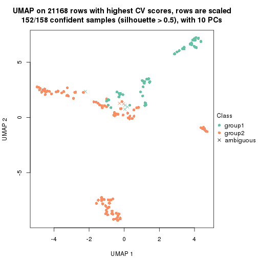</p>

</div>
<div id='tab-CV-NMF-dimension-reduction-2'>
<pre><code class="r">dimension_reduction(res, k = 3, method = &quot;UMAP&quot;)
</code></pre>

<p></p>

</div>
<div id='tab-CV-NMF-dimension-reduction-3'>
<pre><code class="r">dimension_reduction(res, k = 4, method = &quot;UMAP&quot;)
</code></pre>

<p></p>

</div>
<div id='tab-CV-NMF-dimension-reduction-4'>
<pre><code class="r">dimension_reduction(res, k = 5, method = &quot;UMAP&quot;)
</code></pre>

<p></p>

</div>
<div id='tab-CV-NMF-dimension-reduction-5'>
<pre><code class="r">dimension_reduction(res, k = 6, method = &quot;UMAP&quot;)
</code></pre>

<p></p>

</div>
</div>


Following heatmap shows how subgroups are split when increasing `k`:

```r
collect_classes(res)
```


Test correlation between subgroups and known annotations. If the known
annotation is numeric, one-way ANOVA test is applied, and if the known
annotation is discrete, chi-squared contingency table test is applied.

```r
test_to_known_factors(res)
```

```
#>          n tissue(p) k
#> CV:NMF 152  2.90e-06 2
#> CV:NMF 157  1.06e-12 3
#> CV:NMF 145  6.30e-16 4
#> CV:NMF 148  3.40e-20 5
#> CV:NMF 142  2.04e-24 6
```


If matrix rows can be associated to genes, consider to use `functional_enrichment(res,
...)` to perform function enrichment for the signature genes. See [this vignette](http://bioconductor.org/packages/devel/bioc/vignettes/cola/inst/doc/functional_enrichment.html) for more detailed explanations.


 

---------------------------------------------------


### MAD:hclust


The object with results only for a single top-value method and a single partition method 
can be extracted as:

```r
res = res_list["MAD", "hclust"]
# you can also extract it by
# res = res_list["MAD:hclust"]
```

A summary of `res` and all the functions that can be applied to it:

```r
res
```

```
#> A 'ConsensusPartition' object with k = 2, 3, 4, 5, 6.
#>   On a matrix with 21168 rows and 158 columns.
#>   Top rows (1000, 2000, 3000, 4000, 5000) are extracted by 'MAD' method.
#>   Subgroups are detected by 'hclust' method.
#>   Performed in total 1250 partitions by row resampling.
#>   Best k for subgroups seems to be 3.
#> 
#> Following methods can be applied to this 'ConsensusPartition' object:
#>  [1] "cola_report"             "collect_classes"         "collect_plots"          
#>  [4] "collect_stats"           "colnames"                "compare_signatures"     
#>  [7] "consensus_heatmap"       "dimension_reduction"     "functional_enrichment"  
#> [10] "get_anno_col"            "get_anno"                "get_classes"            
#> [13] "get_consensus"           "get_matrix"              "get_membership"         
#> [16] "get_param"               "get_signatures"          "get_stats"              
#> [19] "is_best_k"               "is_stable_k"             "membership_heatmap"     
#> [22] "ncol"                    "nrow"                    "plot_ecdf"              
#> [25] "rownames"                "select_partition_number" "show"                   
#> [28] "suggest_best_k"          "test_to_known_factors"
```

`collect_plots()` function collects all the plots made from `res` for all `k` (number of partitions)
into one single page to provide an easy and fast comparison between different `k`.

```r
collect_plots(res)
```


The plots are:

- The first row: a plot of the ECDF (empirical cumulative distribution
  function) curves of the consensus matrix for each `k` and the heatmap of
  predicted classes for each `k`.
- The second row: heatmaps of the consensus matrix for each `k`.
- The third row: heatmaps of the membership matrix for each `k`.
- The fouth row: heatmaps of the signatures for each `k`.

All the plots in panels can be made by individual functions and they are
plotted later in this section.

`select_partition_number()` produces several plots showing different
statistics for choosing "optimized" `k`. There are following statistics:

- ECDF curves of the consensus matrix for each `k`;
- 1-PAC. [The PAC
  score](https://en.wikipedia.org/wiki/Consensus_clustering#Over-interpretation_potential_of_consensus_clustering)
  measures the proportion of the ambiguous subgrouping.
- Mean silhouette score.
- Concordance. The mean probability of fiting the consensus class ids in all
  partitions.
- Area increased. Denote $A_k$ as the area under the ECDF curve for current
  `k`, the area increased is defined as $A_k - A_{k-1}$.
- Rand index. The percent of pairs of samples that are both in a same cluster
  or both are not in a same cluster in the partition of k and k-1.
- Jaccard index. The ratio of pairs of samples are both in a same cluster in
  the partition of k and k-1 and the pairs of samples are both in a same
  cluster in the partition k or k-1.

The detailed explanations of these statistics can be found in [the _cola_
vignette](http://bioconductor.org/packages/devel/bioc/vignettes/cola/inst/doc/cola.html#toc_13).

Generally speaking, lower PAC score, higher mean silhouette score or higher
concordance corresponds to better partition. Rand index and Jaccard index
measure how similar the current partition is compared to partition with `k-1`.
If they are too similar, we won't accept `k` is better than `k-1`.

```r
select_partition_number(res)
```


The numeric values for all these statistics can be obtained by `get_stats()`.

```r
get_stats(res)
```

```
#>   k 1-PAC mean_silhouette concordance area_increased  Rand Jaccard
#> 2 2 0.853           0.939       0.965         0.3699 0.660   0.660
#> 3 3 0.582           0.887       0.902         0.6580 0.737   0.601
#> 4 4 0.756           0.773       0.876         0.1770 0.869   0.670
#> 5 5 0.718           0.745       0.818         0.0668 0.967   0.882
#> 6 6 0.766           0.629       0.787         0.0424 0.947   0.791
```

`suggest_best_k()` suggests the best $k$ based on these statistics. The rules are as follows:

- All $k$ with Jaccard index larger than 0.95 are removed because increasing
  $k$ does not provide enough extra information. If all $k$ are removed, it is
  marked as no subgroup is detected.
- For all $k$ with 1-PAC score larger than 0.9, the maximal $k$ is taken as
  the best $k$, and other $k$ are marked as optional $k$.
- If it does not fit the second rule. The $k$ with the maximal vote of the
  highest 1-PAC score, highest mean silhouette, and highest concordance is
  taken as the best $k$.

```r
suggest_best_k(res)
```

```
#> [1] 3
```


Following shows the table of the partitions (You need to click the **show/hide
code output** link to see it). The membership matrix (columns with name `p*`)
is inferred by
[`clue::cl_consensus()`](https://www.rdocumentation.org/link/cl_consensus?package=clue)
function with the `SE` method. Basically the value in the membership matrix
represents the probability to belong to a certain group. The finall class
label for an item is determined with the group with highest probability it
belongs to.

In `get_classes()` function, the entropy is calculated from the membership
matrix and the silhouette score is calculated from the consensus matrix.


<script>
$( function() {
	$( '#tabs-MAD-hclust-get-classes' ).tabs();
} );
</script>
<div id='tabs-MAD-hclust-get-classes'>
<ul>
<li><a href='#tab-MAD-hclust-get-classes-1'>k = 2</a></li>
<li><a href='#tab-MAD-hclust-get-classes-2'>k = 3</a></li>
<li><a href='#tab-MAD-hclust-get-classes-3'>k = 4</a></li>
<li><a href='#tab-MAD-hclust-get-classes-4'>k = 5</a></li>
<li><a href='#tab-MAD-hclust-get-classes-5'>k = 6</a></li>
</ul>

<div id='tab-MAD-hclust-get-classes-1'>
<p><a id='tab-MAD-hclust-get-classes-1-a' style='color:#0366d6' href='#'>show/hide code output</a></p>
<pre><code class="r">cbind(get_classes(res, k = 2), get_membership(res, k = 2))
</code></pre>

<pre><code>#&gt;          class entropy silhouette    p1    p2
#&gt; GSM18927     2  0.0000      0.956 0.000 1.000
#&gt; GSM18928     2  0.0000      0.956 0.000 1.000
#&gt; GSM18915     2  0.0000      0.956 0.000 1.000
#&gt; GSM18916     2  0.0000      0.956 0.000 1.000
#&gt; GSM18939     2  0.0000      0.956 0.000 1.000
#&gt; GSM18940     2  0.0000      0.956 0.000 1.000
#&gt; GSM18933     2  0.0000      0.956 0.000 1.000
#&gt; GSM18934     2  0.0000      0.956 0.000 1.000
#&gt; GSM18925     2  0.0000      0.956 0.000 1.000
#&gt; GSM18926     2  0.0000      0.956 0.000 1.000
#&gt; GSM18931     2  0.0000      0.956 0.000 1.000
#&gt; GSM18932     2  0.0000      0.956 0.000 1.000
#&gt; GSM19019     2  0.0376      0.955 0.004 0.996
#&gt; GSM19020     2  0.0376      0.955 0.004 0.996
#&gt; GSM18923     2  0.0000      0.956 0.000 1.000
#&gt; GSM18924     2  0.0000      0.956 0.000 1.000
#&gt; GSM18941     2  0.0000      0.956 0.000 1.000
#&gt; GSM18942     2  0.0000      0.956 0.000 1.000
#&gt; GSM18929     2  0.0000      0.956 0.000 1.000
#&gt; GSM18930     2  0.0000      0.956 0.000 1.000
#&gt; GSM18911     2  0.0000      0.956 0.000 1.000
#&gt; GSM18912     2  0.0000      0.956 0.000 1.000
#&gt; GSM18935     2  0.0000      0.956 0.000 1.000
#&gt; GSM18936     2  0.0000      0.956 0.000 1.000
#&gt; GSM19005     2  0.0000      0.956 0.000 1.000
#&gt; GSM19006     2  0.0000      0.956 0.000 1.000
#&gt; GSM18921     2  0.0000      0.956 0.000 1.000
#&gt; GSM18922     2  0.0000      0.956 0.000 1.000
#&gt; GSM18919     2  0.0000      0.956 0.000 1.000
#&gt; GSM18920     2  0.0000      0.956 0.000 1.000
#&gt; GSM18917     2  0.0000      0.956 0.000 1.000
#&gt; GSM18918     2  0.0000      0.956 0.000 1.000
#&gt; GSM18913     2  0.0000      0.956 0.000 1.000
#&gt; GSM18914     2  0.0000      0.956 0.000 1.000
#&gt; GSM18937     2  0.0000      0.956 0.000 1.000
#&gt; GSM18938     2  0.0000      0.956 0.000 1.000
#&gt; GSM18943     2  0.0376      0.955 0.004 0.996
#&gt; GSM18944     2  0.0376      0.955 0.004 0.996
#&gt; GSM19003     2  0.0000      0.956 0.000 1.000
#&gt; GSM19004     2  0.0000      0.956 0.000 1.000
#&gt; GSM19011     2  0.0000      0.956 0.000 1.000
#&gt; GSM19012     2  0.0000      0.956 0.000 1.000
#&gt; GSM19009     2  0.0000      0.956 0.000 1.000
#&gt; GSM19010     2  0.0000      0.956 0.000 1.000
#&gt; GSM18945     2  0.0000      0.956 0.000 1.000
#&gt; GSM18946     2  0.0000      0.956 0.000 1.000
#&gt; GSM18963     2  0.3733      0.927 0.072 0.928
#&gt; GSM18964     2  0.3733      0.927 0.072 0.928
#&gt; GSM18905     2  0.0376      0.955 0.004 0.996
#&gt; GSM18906     2  0.0376      0.955 0.004 0.996
#&gt; GSM18965     2  0.3733      0.927 0.072 0.928
#&gt; GSM18966     2  0.3733      0.927 0.072 0.928
#&gt; GSM18873     1  0.0000      0.999 1.000 0.000
#&gt; GSM18874     1  0.0000      0.999 1.000 0.000
#&gt; GSM18973     2  0.6887      0.822 0.184 0.816
#&gt; GSM18974     2  0.6887      0.822 0.184 0.816
#&gt; GSM18977     2  0.3584      0.930 0.068 0.932
#&gt; GSM18978     2  0.3584      0.930 0.068 0.932
#&gt; GSM18979     2  0.3584      0.930 0.068 0.932
#&gt; GSM18980     2  0.3584      0.930 0.068 0.932
#&gt; GSM18883     1  0.0000      0.999 1.000 0.000
#&gt; GSM18884     1  0.0000      0.999 1.000 0.000
#&gt; GSM18885     1  0.0000      0.999 1.000 0.000
#&gt; GSM18886     1  0.0000      0.999 1.000 0.000
#&gt; GSM18907     1  0.0000      0.999 1.000 0.000
#&gt; GSM18908     1  0.0000      0.999 1.000 0.000
#&gt; GSM18909     2  0.8386      0.678 0.268 0.732
#&gt; GSM18910     2  0.8386      0.678 0.268 0.732
#&gt; GSM18867     1  0.0000      0.999 1.000 0.000
#&gt; GSM18868     1  0.0000      0.999 1.000 0.000
#&gt; GSM18947     2  0.1414      0.951 0.020 0.980
#&gt; GSM18948     2  0.1414      0.951 0.020 0.980
#&gt; GSM18995     2  0.1414      0.951 0.020 0.980
#&gt; GSM18996     2  0.1414      0.951 0.020 0.980
#&gt; GSM18975     2  0.3733      0.927 0.072 0.928
#&gt; GSM18976     2  0.3733      0.927 0.072 0.928
#&gt; GSM18997     2  0.0000      0.956 0.000 1.000
#&gt; GSM18998     2  0.0000      0.956 0.000 1.000
#&gt; GSM18967     2  0.3733      0.927 0.072 0.928
#&gt; GSM18968     2  0.3733      0.927 0.072 0.928
#&gt; GSM18959     2  0.3733      0.927 0.072 0.928
#&gt; GSM18960     2  0.3733      0.927 0.072 0.928
#&gt; GSM19015     2  0.0000      0.956 0.000 1.000
#&gt; GSM19016     2  0.0000      0.956 0.000 1.000
#&gt; GSM18957     2  0.3733      0.927 0.072 0.928
#&gt; GSM18958     2  0.3733      0.927 0.072 0.928
#&gt; GSM18981     2  0.0938      0.954 0.012 0.988
#&gt; GSM18982     2  0.0938      0.954 0.012 0.988
#&gt; GSM18989     2  0.0938      0.954 0.012 0.988
#&gt; GSM18990     2  0.0938      0.954 0.012 0.988
#&gt; GSM18985     2  0.0938      0.954 0.012 0.988
#&gt; GSM18986     2  0.3431      0.932 0.064 0.936
#&gt; GSM18987     2  0.0938      0.954 0.012 0.988
#&gt; GSM18988     2  0.0938      0.954 0.012 0.988
#&gt; GSM18983     2  0.0938      0.954 0.012 0.988
#&gt; GSM18984     2  0.0938      0.954 0.012 0.988
#&gt; GSM18951     2  0.0000      0.956 0.000 1.000
#&gt; GSM18952     2  0.0000      0.956 0.000 1.000
#&gt; GSM19007     2  0.0000      0.956 0.000 1.000
#&gt; GSM19008     2  0.0000      0.956 0.000 1.000
#&gt; GSM18999     2  0.0000      0.956 0.000 1.000
#&gt; GSM19000     2  0.0000      0.956 0.000 1.000
#&gt; GSM18889     1  0.0000      0.999 1.000 0.000
#&gt; GSM18890     1  0.0000      0.999 1.000 0.000
#&gt; GSM18881     1  0.0000      0.999 1.000 0.000
#&gt; GSM18882     1  0.0000      0.999 1.000 0.000
#&gt; GSM18877     1  0.0000      0.999 1.000 0.000
#&gt; GSM18878     1  0.0000      0.999 1.000 0.000
#&gt; GSM18875     1  0.0000      0.999 1.000 0.000
#&gt; GSM18876     1  0.0000      0.999 1.000 0.000
#&gt; GSM18879     1  0.0000      0.999 1.000 0.000
#&gt; GSM18880     1  0.0000      0.999 1.000 0.000
#&gt; GSM18871     1  0.0000      0.999 1.000 0.000
#&gt; GSM18872     1  0.0000      0.999 1.000 0.000
#&gt; GSM18903     2  0.8386      0.678 0.268 0.732
#&gt; GSM18904     2  0.8386      0.678 0.268 0.732
#&gt; GSM18949     2  0.3733      0.927 0.072 0.928
#&gt; GSM18950     2  0.3733      0.927 0.072 0.928
#&gt; GSM18953     2  0.0000      0.956 0.000 1.000
#&gt; GSM18954     2  0.0000      0.956 0.000 1.000
#&gt; GSM19013     2  0.0000      0.956 0.000 1.000
#&gt; GSM19014     2  0.0000      0.956 0.000 1.000
#&gt; GSM18971     2  0.4939      0.901 0.108 0.892
#&gt; GSM18972     2  0.4939      0.901 0.108 0.892
#&gt; GSM18969     2  0.4939      0.901 0.108 0.892
#&gt; GSM18970     2  0.4562      0.910 0.096 0.904
#&gt; GSM18869     1  0.0000      0.999 1.000 0.000
#&gt; GSM18870     1  0.0000      0.999 1.000 0.000
#&gt; GSM19017     2  0.0000      0.956 0.000 1.000
#&gt; GSM19018     2  0.0000      0.956 0.000 1.000
#&gt; GSM18991     2  0.0672      0.954 0.008 0.992
#&gt; GSM18992     2  0.0672      0.954 0.008 0.992
#&gt; GSM19021     2  0.3584      0.930 0.068 0.932
#&gt; GSM19022     2  0.3584      0.930 0.068 0.932
#&gt; GSM19001     2  0.0000      0.956 0.000 1.000
#&gt; GSM19002     2  0.0000      0.956 0.000 1.000
#&gt; GSM18899     2  0.8386      0.678 0.268 0.732
#&gt; GSM18900     2  0.8386      0.678 0.268 0.732
#&gt; GSM18961     2  0.3733      0.927 0.072 0.928
#&gt; GSM18962     2  0.3733      0.927 0.072 0.928
#&gt; GSM18901     2  0.8386      0.678 0.268 0.732
#&gt; GSM18902     2  0.8386      0.678 0.268 0.732
#&gt; GSM18993     2  0.3114      0.935 0.056 0.944
#&gt; GSM18994     2  0.3114      0.935 0.056 0.944
#&gt; GSM18865     2  0.8955      0.628 0.312 0.688
#&gt; GSM18866     2  0.8955      0.628 0.312 0.688
#&gt; GSM18897     1  0.0672      0.991 0.992 0.008
#&gt; GSM18898     1  0.0672      0.991 0.992 0.008
#&gt; GSM18887     1  0.0000      0.999 1.000 0.000
#&gt; GSM18888     1  0.0000      0.999 1.000 0.000
#&gt; GSM18893     1  0.0000      0.999 1.000 0.000
#&gt; GSM18894     1  0.0000      0.999 1.000 0.000
#&gt; GSM18895     1  0.0000      0.999 1.000 0.000
#&gt; GSM18896     1  0.0000      0.999 1.000 0.000
#&gt; GSM18891     1  0.0000      0.999 1.000 0.000
#&gt; GSM18892     1  0.0000      0.999 1.000 0.000
#&gt; GSM18955     2  0.0376      0.955 0.004 0.996
#&gt; GSM18956     2  0.0376      0.955 0.004 0.996
</code></pre>

<script>
$('#tab-MAD-hclust-get-classes-1-a').parent().next().next().hide();
$('#tab-MAD-hclust-get-classes-1-a').click(function(){
  $('#tab-MAD-hclust-get-classes-1-a').parent().next().next().toggle();
  return(false);
});
</script>
</div>

<div id='tab-MAD-hclust-get-classes-2'>
<p><a id='tab-MAD-hclust-get-classes-2-a' style='color:#0366d6' href='#'>show/hide code output</a></p>
<pre><code class="r">cbind(get_classes(res, k = 3), get_membership(res, k = 3))
</code></pre>

<pre><code>#&gt;          class entropy silhouette    p1    p2    p3
#&gt; GSM18927     3  0.0237      0.993 0.000 0.004 0.996
#&gt; GSM18928     3  0.0237      0.993 0.000 0.004 0.996
#&gt; GSM18915     3  0.0237      0.993 0.000 0.004 0.996
#&gt; GSM18916     3  0.0237      0.993 0.000 0.004 0.996
#&gt; GSM18939     3  0.0237      0.993 0.000 0.004 0.996
#&gt; GSM18940     3  0.0237      0.993 0.000 0.004 0.996
#&gt; GSM18933     3  0.0237      0.993 0.000 0.004 0.996
#&gt; GSM18934     3  0.0237      0.993 0.000 0.004 0.996
#&gt; GSM18925     3  0.0237      0.993 0.000 0.004 0.996
#&gt; GSM18926     3  0.0237      0.993 0.000 0.004 0.996
#&gt; GSM18931     3  0.0237      0.993 0.000 0.004 0.996
#&gt; GSM18932     3  0.0237      0.993 0.000 0.004 0.996
#&gt; GSM19019     3  0.2261      0.924 0.000 0.068 0.932
#&gt; GSM19020     3  0.2261      0.924 0.000 0.068 0.932
#&gt; GSM18923     3  0.0237      0.993 0.000 0.004 0.996
#&gt; GSM18924     3  0.0237      0.993 0.000 0.004 0.996
#&gt; GSM18941     3  0.0237      0.993 0.000 0.004 0.996
#&gt; GSM18942     3  0.0237      0.993 0.000 0.004 0.996
#&gt; GSM18929     3  0.0237      0.993 0.000 0.004 0.996
#&gt; GSM18930     3  0.0237      0.993 0.000 0.004 0.996
#&gt; GSM18911     3  0.0237      0.993 0.000 0.004 0.996
#&gt; GSM18912     3  0.0237      0.993 0.000 0.004 0.996
#&gt; GSM18935     3  0.0237      0.993 0.000 0.004 0.996
#&gt; GSM18936     3  0.0237      0.993 0.000 0.004 0.996
#&gt; GSM19005     2  0.5465      0.789 0.000 0.712 0.288
#&gt; GSM19006     2  0.5465      0.789 0.000 0.712 0.288
#&gt; GSM18921     3  0.0237      0.993 0.000 0.004 0.996
#&gt; GSM18922     3  0.0237      0.993 0.000 0.004 0.996
#&gt; GSM18919     3  0.0237      0.993 0.000 0.004 0.996
#&gt; GSM18920     3  0.0237      0.993 0.000 0.004 0.996
#&gt; GSM18917     3  0.0237      0.993 0.000 0.004 0.996
#&gt; GSM18918     3  0.0237      0.993 0.000 0.004 0.996
#&gt; GSM18913     3  0.0237      0.993 0.000 0.004 0.996
#&gt; GSM18914     3  0.0237      0.993 0.000 0.004 0.996
#&gt; GSM18937     3  0.0237      0.993 0.000 0.004 0.996
#&gt; GSM18938     3  0.0237      0.993 0.000 0.004 0.996
#&gt; GSM18943     3  0.1643      0.954 0.000 0.044 0.956
#&gt; GSM18944     3  0.1643      0.954 0.000 0.044 0.956
#&gt; GSM19003     2  0.5465      0.789 0.000 0.712 0.288
#&gt; GSM19004     2  0.5465      0.789 0.000 0.712 0.288
#&gt; GSM19011     2  0.5465      0.789 0.000 0.712 0.288
#&gt; GSM19012     2  0.5465      0.789 0.000 0.712 0.288
#&gt; GSM19009     2  0.5465      0.789 0.000 0.712 0.288
#&gt; GSM19010     2  0.5465      0.789 0.000 0.712 0.288
#&gt; GSM18945     3  0.0237      0.993 0.000 0.004 0.996
#&gt; GSM18946     3  0.0237      0.993 0.000 0.004 0.996
#&gt; GSM18963     2  0.1647      0.837 0.004 0.960 0.036
#&gt; GSM18964     2  0.1647      0.837 0.004 0.960 0.036
#&gt; GSM18905     2  0.4346      0.835 0.000 0.816 0.184
#&gt; GSM18906     2  0.4346      0.835 0.000 0.816 0.184
#&gt; GSM18965     2  0.1647      0.837 0.004 0.960 0.036
#&gt; GSM18966     2  0.1647      0.837 0.004 0.960 0.036
#&gt; GSM18873     1  0.0000      0.999 1.000 0.000 0.000
#&gt; GSM18874     1  0.0000      0.999 1.000 0.000 0.000
#&gt; GSM18973     2  0.3425      0.754 0.112 0.884 0.004
#&gt; GSM18974     2  0.3425      0.754 0.112 0.884 0.004
#&gt; GSM18977     2  0.1525      0.836 0.004 0.964 0.032
#&gt; GSM18978     2  0.1525      0.836 0.004 0.964 0.032
#&gt; GSM18979     2  0.1525      0.836 0.004 0.964 0.032
#&gt; GSM18980     2  0.1525      0.835 0.004 0.964 0.032
#&gt; GSM18883     1  0.0000      0.999 1.000 0.000 0.000
#&gt; GSM18884     1  0.0000      0.999 1.000 0.000 0.000
#&gt; GSM18885     1  0.0000      0.999 1.000 0.000 0.000
#&gt; GSM18886     1  0.0000      0.999 1.000 0.000 0.000
#&gt; GSM18907     1  0.0000      0.999 1.000 0.000 0.000
#&gt; GSM18908     1  0.0000      0.999 1.000 0.000 0.000
#&gt; GSM18909     2  0.8111      0.666 0.264 0.624 0.112
#&gt; GSM18910     2  0.8111      0.666 0.264 0.624 0.112
#&gt; GSM18867     1  0.0000      0.999 1.000 0.000 0.000
#&gt; GSM18868     1  0.0000      0.999 1.000 0.000 0.000
#&gt; GSM18947     2  0.4178      0.839 0.000 0.828 0.172
#&gt; GSM18948     2  0.4178      0.839 0.000 0.828 0.172
#&gt; GSM18995     2  0.4399      0.834 0.000 0.812 0.188
#&gt; GSM18996     2  0.4399      0.834 0.000 0.812 0.188
#&gt; GSM18975     2  0.1647      0.837 0.004 0.960 0.036
#&gt; GSM18976     2  0.1647      0.837 0.004 0.960 0.036
#&gt; GSM18997     2  0.5431      0.792 0.000 0.716 0.284
#&gt; GSM18998     2  0.5431      0.792 0.000 0.716 0.284
#&gt; GSM18967     2  0.1647      0.837 0.004 0.960 0.036
#&gt; GSM18968     2  0.1647      0.837 0.004 0.960 0.036
#&gt; GSM18959     2  0.1647      0.837 0.004 0.960 0.036
#&gt; GSM18960     2  0.1647      0.837 0.004 0.960 0.036
#&gt; GSM19015     2  0.5465      0.789 0.000 0.712 0.288
#&gt; GSM19016     2  0.5465      0.789 0.000 0.712 0.288
#&gt; GSM18957     2  0.1647      0.837 0.004 0.960 0.036
#&gt; GSM18958     2  0.1647      0.837 0.004 0.960 0.036
#&gt; GSM18981     2  0.2959      0.844 0.000 0.900 0.100
#&gt; GSM18982     2  0.2959      0.844 0.000 0.900 0.100
#&gt; GSM18989     2  0.2959      0.844 0.000 0.900 0.100
#&gt; GSM18990     2  0.2959      0.844 0.000 0.900 0.100
#&gt; GSM18985     2  0.2959      0.844 0.000 0.900 0.100
#&gt; GSM18986     2  0.1529      0.839 0.000 0.960 0.040
#&gt; GSM18987     2  0.2959      0.844 0.000 0.900 0.100
#&gt; GSM18988     2  0.2959      0.844 0.000 0.900 0.100
#&gt; GSM18983     2  0.2959      0.844 0.000 0.900 0.100
#&gt; GSM18984     2  0.2959      0.844 0.000 0.900 0.100
#&gt; GSM18951     2  0.5465      0.789 0.000 0.712 0.288
#&gt; GSM18952     2  0.5465      0.789 0.000 0.712 0.288
#&gt; GSM19007     2  0.5465      0.789 0.000 0.712 0.288
#&gt; GSM19008     2  0.5465      0.789 0.000 0.712 0.288
#&gt; GSM18999     2  0.5465      0.789 0.000 0.712 0.288
#&gt; GSM19000     2  0.5465      0.789 0.000 0.712 0.288
#&gt; GSM18889     1  0.0000      0.999 1.000 0.000 0.000
#&gt; GSM18890     1  0.0000      0.999 1.000 0.000 0.000
#&gt; GSM18881     1  0.0000      0.999 1.000 0.000 0.000
#&gt; GSM18882     1  0.0000      0.999 1.000 0.000 0.000
#&gt; GSM18877     1  0.0000      0.999 1.000 0.000 0.000
#&gt; GSM18878     1  0.0000      0.999 1.000 0.000 0.000
#&gt; GSM18875     1  0.0000      0.999 1.000 0.000 0.000
#&gt; GSM18876     1  0.0000      0.999 1.000 0.000 0.000
#&gt; GSM18879     1  0.0000      0.999 1.000 0.000 0.000
#&gt; GSM18880     1  0.0000      0.999 1.000 0.000 0.000
#&gt; GSM18871     1  0.0000      0.999 1.000 0.000 0.000
#&gt; GSM18872     1  0.0000      0.999 1.000 0.000 0.000
#&gt; GSM18903     2  0.8111      0.666 0.264 0.624 0.112
#&gt; GSM18904     2  0.8111      0.666 0.264 0.624 0.112
#&gt; GSM18949     2  0.1647      0.837 0.004 0.960 0.036
#&gt; GSM18950     2  0.1647      0.837 0.004 0.960 0.036
#&gt; GSM18953     2  0.5431      0.791 0.000 0.716 0.284
#&gt; GSM18954     2  0.5431      0.791 0.000 0.716 0.284
#&gt; GSM19013     2  0.5465      0.789 0.000 0.712 0.288
#&gt; GSM19014     2  0.5465      0.789 0.000 0.712 0.288
#&gt; GSM18971     2  0.1647      0.806 0.036 0.960 0.004
#&gt; GSM18972     2  0.1647      0.806 0.036 0.960 0.004
#&gt; GSM18969     2  0.1647      0.806 0.036 0.960 0.004
#&gt; GSM18970     2  0.2313      0.820 0.032 0.944 0.024
#&gt; GSM18869     1  0.0000      0.999 1.000 0.000 0.000
#&gt; GSM18870     1  0.0000      0.999 1.000 0.000 0.000
#&gt; GSM19017     2  0.5465      0.789 0.000 0.712 0.288
#&gt; GSM19018     2  0.5465      0.789 0.000 0.712 0.288
#&gt; GSM18991     2  0.4235      0.839 0.000 0.824 0.176
#&gt; GSM18992     2  0.4235      0.839 0.000 0.824 0.176
#&gt; GSM19021     2  0.1989      0.832 0.004 0.948 0.048
#&gt; GSM19022     2  0.1989      0.832 0.004 0.948 0.048
#&gt; GSM19001     2  0.5465      0.789 0.000 0.712 0.288
#&gt; GSM19002     2  0.5465      0.789 0.000 0.712 0.288
#&gt; GSM18899     2  0.8111      0.666 0.264 0.624 0.112
#&gt; GSM18900     2  0.8111      0.666 0.264 0.624 0.112
#&gt; GSM18961     2  0.1647      0.837 0.004 0.960 0.036
#&gt; GSM18962     2  0.1647      0.837 0.004 0.960 0.036
#&gt; GSM18901     2  0.8111      0.666 0.264 0.624 0.112
#&gt; GSM18902     2  0.8111      0.666 0.264 0.624 0.112
#&gt; GSM18993     2  0.2066      0.842 0.000 0.940 0.060
#&gt; GSM18994     2  0.2066      0.842 0.000 0.940 0.060
#&gt; GSM18865     2  0.5244      0.579 0.240 0.756 0.004
#&gt; GSM18866     2  0.5244      0.579 0.240 0.756 0.004
#&gt; GSM18897     1  0.0424      0.990 0.992 0.008 0.000
#&gt; GSM18898     1  0.0424      0.990 0.992 0.008 0.000
#&gt; GSM18887     1  0.0000      0.999 1.000 0.000 0.000
#&gt; GSM18888     1  0.0000      0.999 1.000 0.000 0.000
#&gt; GSM18893     1  0.0000      0.999 1.000 0.000 0.000
#&gt; GSM18894     1  0.0000      0.999 1.000 0.000 0.000
#&gt; GSM18895     1  0.0000      0.999 1.000 0.000 0.000
#&gt; GSM18896     1  0.0000      0.999 1.000 0.000 0.000
#&gt; GSM18891     1  0.0000      0.999 1.000 0.000 0.000
#&gt; GSM18892     1  0.0000      0.999 1.000 0.000 0.000
#&gt; GSM18955     2  0.4346      0.836 0.000 0.816 0.184
#&gt; GSM18956     2  0.4346      0.836 0.000 0.816 0.184
</code></pre>

<script>
$('#tab-MAD-hclust-get-classes-2-a').parent().next().next().hide();
$('#tab-MAD-hclust-get-classes-2-a').click(function(){
  $('#tab-MAD-hclust-get-classes-2-a').parent().next().next().toggle();
  return(false);
});
</script>
</div>

<div id='tab-MAD-hclust-get-classes-3'>
<p><a id='tab-MAD-hclust-get-classes-3-a' style='color:#0366d6' href='#'>show/hide code output</a></p>
<pre><code class="r">cbind(get_classes(res, k = 4), get_membership(res, k = 4))
</code></pre>

<pre><code>#&gt;          class entropy silhouette    p1    p2    p3    p4
#&gt; GSM18927     3  0.0000    0.99382 0.000 0.000 1.000 0.000
#&gt; GSM18928     3  0.0000    0.99382 0.000 0.000 1.000 0.000
#&gt; GSM18915     3  0.0000    0.99382 0.000 0.000 1.000 0.000
#&gt; GSM18916     3  0.0000    0.99382 0.000 0.000 1.000 0.000
#&gt; GSM18939     3  0.0000    0.99382 0.000 0.000 1.000 0.000
#&gt; GSM18940     3  0.0000    0.99382 0.000 0.000 1.000 0.000
#&gt; GSM18933     3  0.0000    0.99382 0.000 0.000 1.000 0.000
#&gt; GSM18934     3  0.0000    0.99382 0.000 0.000 1.000 0.000
#&gt; GSM18925     3  0.0000    0.99382 0.000 0.000 1.000 0.000
#&gt; GSM18926     3  0.0000    0.99382 0.000 0.000 1.000 0.000
#&gt; GSM18931     3  0.0000    0.99382 0.000 0.000 1.000 0.000
#&gt; GSM18932     3  0.0000    0.99382 0.000 0.000 1.000 0.000
#&gt; GSM19019     3  0.2032    0.92966 0.000 0.036 0.936 0.028
#&gt; GSM19020     3  0.2032    0.92966 0.000 0.036 0.936 0.028
#&gt; GSM18923     3  0.0000    0.99382 0.000 0.000 1.000 0.000
#&gt; GSM18924     3  0.0000    0.99382 0.000 0.000 1.000 0.000
#&gt; GSM18941     3  0.0000    0.99382 0.000 0.000 1.000 0.000
#&gt; GSM18942     3  0.0000    0.99382 0.000 0.000 1.000 0.000
#&gt; GSM18929     3  0.0000    0.99382 0.000 0.000 1.000 0.000
#&gt; GSM18930     3  0.0000    0.99382 0.000 0.000 1.000 0.000
#&gt; GSM18911     3  0.0000    0.99382 0.000 0.000 1.000 0.000
#&gt; GSM18912     3  0.0000    0.99382 0.000 0.000 1.000 0.000
#&gt; GSM18935     3  0.0000    0.99382 0.000 0.000 1.000 0.000
#&gt; GSM18936     3  0.0000    0.99382 0.000 0.000 1.000 0.000
#&gt; GSM19005     2  0.0000    0.73039 0.000 1.000 0.000 0.000
#&gt; GSM19006     2  0.0000    0.73039 0.000 1.000 0.000 0.000
#&gt; GSM18921     3  0.0000    0.99382 0.000 0.000 1.000 0.000
#&gt; GSM18922     3  0.0000    0.99382 0.000 0.000 1.000 0.000
#&gt; GSM18919     3  0.0000    0.99382 0.000 0.000 1.000 0.000
#&gt; GSM18920     3  0.0000    0.99382 0.000 0.000 1.000 0.000
#&gt; GSM18917     3  0.0000    0.99382 0.000 0.000 1.000 0.000
#&gt; GSM18918     3  0.0000    0.99382 0.000 0.000 1.000 0.000
#&gt; GSM18913     3  0.0000    0.99382 0.000 0.000 1.000 0.000
#&gt; GSM18914     3  0.0000    0.99382 0.000 0.000 1.000 0.000
#&gt; GSM18937     3  0.0000    0.99382 0.000 0.000 1.000 0.000
#&gt; GSM18938     3  0.0000    0.99382 0.000 0.000 1.000 0.000
#&gt; GSM18943     3  0.1411    0.95636 0.000 0.020 0.960 0.020
#&gt; GSM18944     3  0.1411    0.95636 0.000 0.020 0.960 0.020
#&gt; GSM19003     2  0.0000    0.73039 0.000 1.000 0.000 0.000
#&gt; GSM19004     2  0.0000    0.73039 0.000 1.000 0.000 0.000
#&gt; GSM19011     2  0.0000    0.73039 0.000 1.000 0.000 0.000
#&gt; GSM19012     2  0.0000    0.73039 0.000 1.000 0.000 0.000
#&gt; GSM19009     2  0.0000    0.73039 0.000 1.000 0.000 0.000
#&gt; GSM19010     2  0.0000    0.73039 0.000 1.000 0.000 0.000
#&gt; GSM18945     3  0.0000    0.99382 0.000 0.000 1.000 0.000
#&gt; GSM18946     3  0.0000    0.99382 0.000 0.000 1.000 0.000
#&gt; GSM18963     4  0.4790    0.70786 0.000 0.380 0.000 0.620
#&gt; GSM18964     4  0.4790    0.70786 0.000 0.380 0.000 0.620
#&gt; GSM18905     2  0.3975    0.62243 0.000 0.760 0.000 0.240
#&gt; GSM18906     2  0.3975    0.62243 0.000 0.760 0.000 0.240
#&gt; GSM18965     4  0.4843    0.70070 0.000 0.396 0.000 0.604
#&gt; GSM18966     4  0.4843    0.70070 0.000 0.396 0.000 0.604
#&gt; GSM18873     1  0.0000    0.99958 1.000 0.000 0.000 0.000
#&gt; GSM18874     1  0.0000    0.99958 1.000 0.000 0.000 0.000
#&gt; GSM18973     4  0.1940    0.55618 0.076 0.000 0.000 0.924
#&gt; GSM18974     4  0.1940    0.55618 0.076 0.000 0.000 0.924
#&gt; GSM18977     2  0.4961   -0.00546 0.000 0.552 0.000 0.448
#&gt; GSM18978     2  0.4961   -0.00546 0.000 0.552 0.000 0.448
#&gt; GSM18979     2  0.4961   -0.00546 0.000 0.552 0.000 0.448
#&gt; GSM18980     4  0.4889    0.57484 0.000 0.360 0.004 0.636
#&gt; GSM18883     1  0.0000    0.99958 1.000 0.000 0.000 0.000
#&gt; GSM18884     1  0.0000    0.99958 1.000 0.000 0.000 0.000
#&gt; GSM18885     1  0.0000    0.99958 1.000 0.000 0.000 0.000
#&gt; GSM18886     1  0.0000    0.99958 1.000 0.000 0.000 0.000
#&gt; GSM18907     1  0.0000    0.99958 1.000 0.000 0.000 0.000
#&gt; GSM18908     1  0.0000    0.99958 1.000 0.000 0.000 0.000
#&gt; GSM18909     2  0.6661    0.44758 0.264 0.604 0.000 0.132
#&gt; GSM18910     2  0.6661    0.44758 0.264 0.604 0.000 0.132
#&gt; GSM18867     1  0.0000    0.99958 1.000 0.000 0.000 0.000
#&gt; GSM18868     1  0.0000    0.99958 1.000 0.000 0.000 0.000
#&gt; GSM18947     2  0.3942    0.56441 0.000 0.764 0.000 0.236
#&gt; GSM18948     2  0.3942    0.56441 0.000 0.764 0.000 0.236
#&gt; GSM18995     2  0.3801    0.58396 0.000 0.780 0.000 0.220
#&gt; GSM18996     2  0.3801    0.58396 0.000 0.780 0.000 0.220
#&gt; GSM18975     4  0.4454    0.69388 0.000 0.308 0.000 0.692
#&gt; GSM18976     4  0.4454    0.69388 0.000 0.308 0.000 0.692
#&gt; GSM18997     2  0.0188    0.72925 0.000 0.996 0.000 0.004
#&gt; GSM18998     2  0.0188    0.72925 0.000 0.996 0.000 0.004
#&gt; GSM18967     4  0.4866    0.69525 0.000 0.404 0.000 0.596
#&gt; GSM18968     4  0.4866    0.69525 0.000 0.404 0.000 0.596
#&gt; GSM18959     4  0.4776    0.70880 0.000 0.376 0.000 0.624
#&gt; GSM18960     4  0.4776    0.70880 0.000 0.376 0.000 0.624
#&gt; GSM19015     2  0.0000    0.73039 0.000 1.000 0.000 0.000
#&gt; GSM19016     2  0.0000    0.73039 0.000 1.000 0.000 0.000
#&gt; GSM18957     4  0.4866    0.69525 0.000 0.404 0.000 0.596
#&gt; GSM18958     4  0.4866    0.69525 0.000 0.404 0.000 0.596
#&gt; GSM18981     2  0.4817    0.45280 0.000 0.612 0.000 0.388
#&gt; GSM18982     2  0.4817    0.45280 0.000 0.612 0.000 0.388
#&gt; GSM18989     2  0.4817    0.45280 0.000 0.612 0.000 0.388
#&gt; GSM18990     2  0.4817    0.45280 0.000 0.612 0.000 0.388
#&gt; GSM18985     2  0.4817    0.45280 0.000 0.612 0.000 0.388
#&gt; GSM18986     4  0.4830    0.68065 0.000 0.392 0.000 0.608
#&gt; GSM18987     2  0.4817    0.45280 0.000 0.612 0.000 0.388
#&gt; GSM18988     2  0.4817    0.45280 0.000 0.612 0.000 0.388
#&gt; GSM18983     2  0.4817    0.45280 0.000 0.612 0.000 0.388
#&gt; GSM18984     2  0.4817    0.45280 0.000 0.612 0.000 0.388
#&gt; GSM18951     2  0.0000    0.73039 0.000 1.000 0.000 0.000
#&gt; GSM18952     2  0.0000    0.73039 0.000 1.000 0.000 0.000
#&gt; GSM19007     2  0.0000    0.73039 0.000 1.000 0.000 0.000
#&gt; GSM19008     2  0.0000    0.73039 0.000 1.000 0.000 0.000
#&gt; GSM18999     2  0.0000    0.73039 0.000 1.000 0.000 0.000
#&gt; GSM19000     2  0.0000    0.73039 0.000 1.000 0.000 0.000
#&gt; GSM18889     1  0.0000    0.99958 1.000 0.000 0.000 0.000
#&gt; GSM18890     1  0.0000    0.99958 1.000 0.000 0.000 0.000
#&gt; GSM18881     1  0.0000    0.99958 1.000 0.000 0.000 0.000
#&gt; GSM18882     1  0.0000    0.99958 1.000 0.000 0.000 0.000
#&gt; GSM18877     1  0.0000    0.99958 1.000 0.000 0.000 0.000
#&gt; GSM18878     1  0.0000    0.99958 1.000 0.000 0.000 0.000
#&gt; GSM18875     1  0.0000    0.99958 1.000 0.000 0.000 0.000
#&gt; GSM18876     1  0.0000    0.99958 1.000 0.000 0.000 0.000
#&gt; GSM18879     1  0.0000    0.99958 1.000 0.000 0.000 0.000
#&gt; GSM18880     1  0.0000    0.99958 1.000 0.000 0.000 0.000
#&gt; GSM18871     1  0.0000    0.99958 1.000 0.000 0.000 0.000
#&gt; GSM18872     1  0.0000    0.99958 1.000 0.000 0.000 0.000
#&gt; GSM18903     2  0.6661    0.44758 0.264 0.604 0.000 0.132
#&gt; GSM18904     2  0.6661    0.44758 0.264 0.604 0.000 0.132
#&gt; GSM18949     4  0.4866    0.69525 0.000 0.404 0.000 0.596
#&gt; GSM18950     4  0.4866    0.69525 0.000 0.404 0.000 0.596
#&gt; GSM18953     2  0.0188    0.72813 0.000 0.996 0.000 0.004
#&gt; GSM18954     2  0.0188    0.72813 0.000 0.996 0.000 0.004
#&gt; GSM19013     2  0.0000    0.73039 0.000 1.000 0.000 0.000
#&gt; GSM19014     2  0.0000    0.73039 0.000 1.000 0.000 0.000
#&gt; GSM18971     4  0.0336    0.58030 0.000 0.008 0.000 0.992
#&gt; GSM18972     4  0.0336    0.58030 0.000 0.008 0.000 0.992
#&gt; GSM18969     4  0.0336    0.58030 0.000 0.008 0.000 0.992
#&gt; GSM18970     4  0.1211    0.57560 0.000 0.040 0.000 0.960
#&gt; GSM18869     1  0.0000    0.99958 1.000 0.000 0.000 0.000
#&gt; GSM18870     1  0.0000    0.99958 1.000 0.000 0.000 0.000
#&gt; GSM19017     2  0.0000    0.73039 0.000 1.000 0.000 0.000
#&gt; GSM19018     2  0.0000    0.73039 0.000 1.000 0.000 0.000
#&gt; GSM18991     2  0.3726    0.61484 0.000 0.788 0.000 0.212
#&gt; GSM18992     2  0.3726    0.61484 0.000 0.788 0.000 0.212
#&gt; GSM19021     4  0.5355    0.56772 0.000 0.360 0.020 0.620
#&gt; GSM19022     4  0.5355    0.56772 0.000 0.360 0.020 0.620
#&gt; GSM19001     2  0.0000    0.73039 0.000 1.000 0.000 0.000
#&gt; GSM19002     2  0.0000    0.73039 0.000 1.000 0.000 0.000
#&gt; GSM18899     2  0.6661    0.44758 0.264 0.604 0.000 0.132
#&gt; GSM18900     2  0.6661    0.44758 0.264 0.604 0.000 0.132
#&gt; GSM18961     4  0.4866    0.69525 0.000 0.404 0.000 0.596
#&gt; GSM18962     4  0.4866    0.69525 0.000 0.404 0.000 0.596
#&gt; GSM18901     2  0.6661    0.44758 0.264 0.604 0.000 0.132
#&gt; GSM18902     2  0.6661    0.44758 0.264 0.604 0.000 0.132
#&gt; GSM18993     2  0.4933   -0.02276 0.000 0.568 0.000 0.432
#&gt; GSM18994     2  0.4933   -0.02276 0.000 0.568 0.000 0.432
#&gt; GSM18865     4  0.3649    0.48909 0.204 0.000 0.000 0.796
#&gt; GSM18866     4  0.3649    0.48909 0.204 0.000 0.000 0.796
#&gt; GSM18897     1  0.0336    0.99325 0.992 0.000 0.000 0.008
#&gt; GSM18898     1  0.0336    0.99325 0.992 0.000 0.000 0.008
#&gt; GSM18887     1  0.0000    0.99958 1.000 0.000 0.000 0.000
#&gt; GSM18888     1  0.0000    0.99958 1.000 0.000 0.000 0.000
#&gt; GSM18893     1  0.0000    0.99958 1.000 0.000 0.000 0.000
#&gt; GSM18894     1  0.0000    0.99958 1.000 0.000 0.000 0.000
#&gt; GSM18895     1  0.0000    0.99958 1.000 0.000 0.000 0.000
#&gt; GSM18896     1  0.0000    0.99958 1.000 0.000 0.000 0.000
#&gt; GSM18891     1  0.0000    0.99958 1.000 0.000 0.000 0.000
#&gt; GSM18892     1  0.0000    0.99958 1.000 0.000 0.000 0.000
#&gt; GSM18955     2  0.2973    0.66897 0.000 0.856 0.000 0.144
#&gt; GSM18956     2  0.2973    0.66897 0.000 0.856 0.000 0.144
</code></pre>

<script>
$('#tab-MAD-hclust-get-classes-3-a').parent().next().next().hide();
$('#tab-MAD-hclust-get-classes-3-a').click(function(){
  $('#tab-MAD-hclust-get-classes-3-a').parent().next().next().toggle();
  return(false);
});
</script>
</div>

<div id='tab-MAD-hclust-get-classes-4'>
<p><a id='tab-MAD-hclust-get-classes-4-a' style='color:#0366d6' href='#'>show/hide code output</a></p>
<pre><code class="r">cbind(get_classes(res, k = 5), get_membership(res, k = 5))
</code></pre>

<pre><code>#&gt;          class entropy silhouette    p1    p2    p3    p4 p5
#&gt; GSM18927     3  0.0000      0.994 0.000 0.000 1.000 0.000 NA
#&gt; GSM18928     3  0.0000      0.994 0.000 0.000 1.000 0.000 NA
#&gt; GSM18915     3  0.0000      0.994 0.000 0.000 1.000 0.000 NA
#&gt; GSM18916     3  0.0000      0.994 0.000 0.000 1.000 0.000 NA
#&gt; GSM18939     3  0.0000      0.994 0.000 0.000 1.000 0.000 NA
#&gt; GSM18940     3  0.0000      0.994 0.000 0.000 1.000 0.000 NA
#&gt; GSM18933     3  0.0000      0.994 0.000 0.000 1.000 0.000 NA
#&gt; GSM18934     3  0.0000      0.994 0.000 0.000 1.000 0.000 NA
#&gt; GSM18925     3  0.0000      0.994 0.000 0.000 1.000 0.000 NA
#&gt; GSM18926     3  0.0000      0.994 0.000 0.000 1.000 0.000 NA
#&gt; GSM18931     3  0.0000      0.994 0.000 0.000 1.000 0.000 NA
#&gt; GSM18932     3  0.0000      0.994 0.000 0.000 1.000 0.000 NA
#&gt; GSM19019     3  0.1628      0.936 0.000 0.008 0.936 0.056 NA
#&gt; GSM19020     3  0.1628      0.936 0.000 0.008 0.936 0.056 NA
#&gt; GSM18923     3  0.0000      0.994 0.000 0.000 1.000 0.000 NA
#&gt; GSM18924     3  0.0000      0.994 0.000 0.000 1.000 0.000 NA
#&gt; GSM18941     3  0.0000      0.994 0.000 0.000 1.000 0.000 NA
#&gt; GSM18942     3  0.0000      0.994 0.000 0.000 1.000 0.000 NA
#&gt; GSM18929     3  0.0000      0.994 0.000 0.000 1.000 0.000 NA
#&gt; GSM18930     3  0.0000      0.994 0.000 0.000 1.000 0.000 NA
#&gt; GSM18911     3  0.0000      0.994 0.000 0.000 1.000 0.000 NA
#&gt; GSM18912     3  0.0000      0.994 0.000 0.000 1.000 0.000 NA
#&gt; GSM18935     3  0.0000      0.994 0.000 0.000 1.000 0.000 NA
#&gt; GSM18936     3  0.0000      0.994 0.000 0.000 1.000 0.000 NA
#&gt; GSM19005     2  0.0000      0.681 0.000 1.000 0.000 0.000 NA
#&gt; GSM19006     2  0.0000      0.681 0.000 1.000 0.000 0.000 NA
#&gt; GSM18921     3  0.0000      0.994 0.000 0.000 1.000 0.000 NA
#&gt; GSM18922     3  0.0000      0.994 0.000 0.000 1.000 0.000 NA
#&gt; GSM18919     3  0.0000      0.994 0.000 0.000 1.000 0.000 NA
#&gt; GSM18920     3  0.0000      0.994 0.000 0.000 1.000 0.000 NA
#&gt; GSM18917     3  0.0000      0.994 0.000 0.000 1.000 0.000 NA
#&gt; GSM18918     3  0.0000      0.994 0.000 0.000 1.000 0.000 NA
#&gt; GSM18913     3  0.0000      0.994 0.000 0.000 1.000 0.000 NA
#&gt; GSM18914     3  0.0000      0.994 0.000 0.000 1.000 0.000 NA
#&gt; GSM18937     3  0.0000      0.994 0.000 0.000 1.000 0.000 NA
#&gt; GSM18938     3  0.0000      0.994 0.000 0.000 1.000 0.000 NA
#&gt; GSM18943     3  0.1124      0.960 0.000 0.004 0.960 0.036 NA
#&gt; GSM18944     3  0.1124      0.960 0.000 0.004 0.960 0.036 NA
#&gt; GSM19003     2  0.0000      0.681 0.000 1.000 0.000 0.000 NA
#&gt; GSM19004     2  0.0000      0.681 0.000 1.000 0.000 0.000 NA
#&gt; GSM19011     2  0.0000      0.681 0.000 1.000 0.000 0.000 NA
#&gt; GSM19012     2  0.0000      0.681 0.000 1.000 0.000 0.000 NA
#&gt; GSM19009     2  0.0000      0.681 0.000 1.000 0.000 0.000 NA
#&gt; GSM19010     2  0.0000      0.681 0.000 1.000 0.000 0.000 NA
#&gt; GSM18945     3  0.0000      0.994 0.000 0.000 1.000 0.000 NA
#&gt; GSM18946     3  0.0000      0.994 0.000 0.000 1.000 0.000 NA
#&gt; GSM18963     4  0.2921      0.735 0.000 0.124 0.000 0.856 NA
#&gt; GSM18964     4  0.2921      0.735 0.000 0.124 0.000 0.856 NA
#&gt; GSM18905     2  0.6001      0.533 0.000 0.580 0.000 0.176 NA
#&gt; GSM18906     2  0.6001      0.533 0.000 0.580 0.000 0.176 NA
#&gt; GSM18965     4  0.2358      0.738 0.000 0.104 0.000 0.888 NA
#&gt; GSM18966     4  0.2358      0.738 0.000 0.104 0.000 0.888 NA
#&gt; GSM18873     1  0.0000      0.954 1.000 0.000 0.000 0.000 NA
#&gt; GSM18874     1  0.0000      0.954 1.000 0.000 0.000 0.000 NA
#&gt; GSM18973     4  0.5359      0.540 0.056 0.000 0.000 0.532 NA
#&gt; GSM18974     4  0.5359      0.540 0.056 0.000 0.000 0.532 NA
#&gt; GSM18977     4  0.5935      0.338 0.000 0.268 0.000 0.580 NA
#&gt; GSM18978     4  0.5935      0.338 0.000 0.268 0.000 0.580 NA
#&gt; GSM18979     4  0.5935      0.338 0.000 0.268 0.000 0.580 NA
#&gt; GSM18980     4  0.5322      0.587 0.000 0.184 0.004 0.684 NA
#&gt; GSM18883     1  0.3109      0.877 0.800 0.000 0.000 0.000 NA
#&gt; GSM18884     1  0.3109      0.877 0.800 0.000 0.000 0.000 NA
#&gt; GSM18885     1  0.2127      0.923 0.892 0.000 0.000 0.000 NA
#&gt; GSM18886     1  0.2127      0.923 0.892 0.000 0.000 0.000 NA
#&gt; GSM18907     1  0.3143      0.876 0.796 0.000 0.000 0.000 NA
#&gt; GSM18908     1  0.3143      0.876 0.796 0.000 0.000 0.000 NA
#&gt; GSM18909     2  0.8397      0.335 0.252 0.360 0.000 0.192 NA
#&gt; GSM18910     2  0.8397      0.335 0.252 0.360 0.000 0.192 NA
#&gt; GSM18867     1  0.0000      0.954 1.000 0.000 0.000 0.000 NA
#&gt; GSM18868     1  0.0000      0.954 1.000 0.000 0.000 0.000 NA
#&gt; GSM18947     2  0.5117      0.471 0.000 0.652 0.000 0.276 NA
#&gt; GSM18948     2  0.5117      0.471 0.000 0.652 0.000 0.276 NA
#&gt; GSM18995     2  0.4865      0.499 0.000 0.684 0.000 0.252 NA
#&gt; GSM18996     2  0.4865      0.499 0.000 0.684 0.000 0.252 NA
#&gt; GSM18975     4  0.4410      0.721 0.000 0.112 0.000 0.764 NA
#&gt; GSM18976     4  0.4410      0.721 0.000 0.112 0.000 0.764 NA
#&gt; GSM18997     2  0.0162      0.680 0.000 0.996 0.000 0.004 NA
#&gt; GSM18998     2  0.0162      0.680 0.000 0.996 0.000 0.004 NA
#&gt; GSM18967     4  0.2074      0.738 0.000 0.104 0.000 0.896 NA
#&gt; GSM18968     4  0.2074      0.738 0.000 0.104 0.000 0.896 NA
#&gt; GSM18959     4  0.3106      0.731 0.000 0.132 0.000 0.844 NA
#&gt; GSM18960     4  0.3106      0.731 0.000 0.132 0.000 0.844 NA
#&gt; GSM19015     2  0.0000      0.681 0.000 1.000 0.000 0.000 NA
#&gt; GSM19016     2  0.0000      0.681 0.000 1.000 0.000 0.000 NA
#&gt; GSM18957     4  0.2074      0.738 0.000 0.104 0.000 0.896 NA
#&gt; GSM18958     4  0.2074      0.738 0.000 0.104 0.000 0.896 NA
#&gt; GSM18981     2  0.6053      0.483 0.000 0.576 0.000 0.228 NA
#&gt; GSM18982     2  0.6053      0.483 0.000 0.576 0.000 0.228 NA
#&gt; GSM18989     2  0.6053      0.483 0.000 0.576 0.000 0.228 NA
#&gt; GSM18990     2  0.6053      0.483 0.000 0.576 0.000 0.228 NA
#&gt; GSM18985     2  0.6053      0.483 0.000 0.576 0.000 0.228 NA
#&gt; GSM18986     4  0.3772      0.708 0.000 0.172 0.000 0.792 NA
#&gt; GSM18987     2  0.6053      0.483 0.000 0.576 0.000 0.228 NA
#&gt; GSM18988     2  0.6053      0.483 0.000 0.576 0.000 0.228 NA
#&gt; GSM18983     2  0.6053      0.483 0.000 0.576 0.000 0.228 NA
#&gt; GSM18984     2  0.6053      0.483 0.000 0.576 0.000 0.228 NA
#&gt; GSM18951     2  0.6486      0.372 0.000 0.492 0.000 0.236 NA
#&gt; GSM18952     2  0.6486      0.372 0.000 0.492 0.000 0.236 NA
#&gt; GSM19007     2  0.0000      0.681 0.000 1.000 0.000 0.000 NA
#&gt; GSM19008     2  0.0000      0.681 0.000 1.000 0.000 0.000 NA
#&gt; GSM18999     2  0.0000      0.681 0.000 1.000 0.000 0.000 NA
#&gt; GSM19000     2  0.0000      0.681 0.000 1.000 0.000 0.000 NA
#&gt; GSM18889     1  0.0000      0.954 1.000 0.000 0.000 0.000 NA
#&gt; GSM18890     1  0.0000      0.954 1.000 0.000 0.000 0.000 NA
#&gt; GSM18881     1  0.0000      0.954 1.000 0.000 0.000 0.000 NA
#&gt; GSM18882     1  0.0000      0.954 1.000 0.000 0.000 0.000 NA
#&gt; GSM18877     1  0.0000      0.954 1.000 0.000 0.000 0.000 NA
#&gt; GSM18878     1  0.0000      0.954 1.000 0.000 0.000 0.000 NA
#&gt; GSM18875     1  0.0000      0.954 1.000 0.000 0.000 0.000 NA
#&gt; GSM18876     1  0.0000      0.954 1.000 0.000 0.000 0.000 NA
#&gt; GSM18879     1  0.0000      0.954 1.000 0.000 0.000 0.000 NA
#&gt; GSM18880     1  0.0000      0.954 1.000 0.000 0.000 0.000 NA
#&gt; GSM18871     1  0.0000      0.954 1.000 0.000 0.000 0.000 NA
#&gt; GSM18872     1  0.0000      0.954 1.000 0.000 0.000 0.000 NA
#&gt; GSM18903     2  0.8397      0.335 0.252 0.360 0.000 0.192 NA
#&gt; GSM18904     2  0.8397      0.335 0.252 0.360 0.000 0.192 NA
#&gt; GSM18949     4  0.2074      0.738 0.000 0.104 0.000 0.896 NA
#&gt; GSM18950     4  0.2074      0.738 0.000 0.104 0.000 0.896 NA
#&gt; GSM18953     2  0.6465      0.373 0.000 0.492 0.000 0.220 NA
#&gt; GSM18954     2  0.6465      0.373 0.000 0.492 0.000 0.220 NA
#&gt; GSM19013     2  0.0000      0.681 0.000 1.000 0.000 0.000 NA
#&gt; GSM19014     2  0.0000      0.681 0.000 1.000 0.000 0.000 NA
#&gt; GSM18971     4  0.4262      0.564 0.000 0.000 0.000 0.560 NA
#&gt; GSM18972     4  0.4262      0.564 0.000 0.000 0.000 0.560 NA
#&gt; GSM18969     4  0.4262      0.564 0.000 0.000 0.000 0.560 NA
#&gt; GSM18970     4  0.4815      0.544 0.000 0.020 0.000 0.524 NA
#&gt; GSM18869     1  0.0000      0.954 1.000 0.000 0.000 0.000 NA
#&gt; GSM18870     1  0.0000      0.954 1.000 0.000 0.000 0.000 NA
#&gt; GSM19017     2  0.0000      0.681 0.000 1.000 0.000 0.000 NA
#&gt; GSM19018     2  0.0000      0.681 0.000 1.000 0.000 0.000 NA
#&gt; GSM18991     2  0.6372      0.357 0.000 0.492 0.000 0.324 NA
#&gt; GSM18992     2  0.6372      0.357 0.000 0.492 0.000 0.324 NA
#&gt; GSM19021     4  0.5647      0.582 0.000 0.184 0.020 0.676 NA
#&gt; GSM19022     4  0.5647      0.582 0.000 0.184 0.020 0.676 NA
#&gt; GSM19001     2  0.0162      0.680 0.000 0.996 0.000 0.000 NA
#&gt; GSM19002     2  0.0162      0.680 0.000 0.996 0.000 0.000 NA
#&gt; GSM18899     2  0.8397      0.335 0.252 0.360 0.000 0.192 NA
#&gt; GSM18900     2  0.8397      0.335 0.252 0.360 0.000 0.192 NA
#&gt; GSM18961     4  0.2074      0.738 0.000 0.104 0.000 0.896 NA
#&gt; GSM18962     4  0.2074      0.738 0.000 0.104 0.000 0.896 NA
#&gt; GSM18901     2  0.8397      0.335 0.252 0.360 0.000 0.192 NA
#&gt; GSM18902     2  0.8397      0.335 0.252 0.360 0.000 0.192 NA
#&gt; GSM18993     4  0.5516      0.473 0.000 0.232 0.000 0.640 NA
#&gt; GSM18994     4  0.5516      0.473 0.000 0.232 0.000 0.640 NA
#&gt; GSM18865     4  0.6285      0.474 0.152 0.000 0.000 0.456 NA
#&gt; GSM18866     4  0.6285      0.474 0.152 0.000 0.000 0.456 NA
#&gt; GSM18897     1  0.2471      0.924 0.864 0.000 0.000 0.000 NA
#&gt; GSM18898     1  0.2471      0.924 0.864 0.000 0.000 0.000 NA
#&gt; GSM18887     1  0.2230      0.931 0.884 0.000 0.000 0.000 NA
#&gt; GSM18888     1  0.2230      0.931 0.884 0.000 0.000 0.000 NA
#&gt; GSM18893     1  0.1851      0.939 0.912 0.000 0.000 0.000 NA
#&gt; GSM18894     1  0.1851      0.939 0.912 0.000 0.000 0.000 NA
#&gt; GSM18895     1  0.1851      0.939 0.912 0.000 0.000 0.000 NA
#&gt; GSM18896     1  0.1851      0.939 0.912 0.000 0.000 0.000 NA
#&gt; GSM18891     1  0.1608      0.942 0.928 0.000 0.000 0.000 NA
#&gt; GSM18892     1  0.1608      0.942 0.928 0.000 0.000 0.000 NA
#&gt; GSM18955     2  0.6638      0.300 0.000 0.440 0.000 0.320 NA
#&gt; GSM18956     2  0.6638      0.300 0.000 0.440 0.000 0.320 NA
</code></pre>

<script>
$('#tab-MAD-hclust-get-classes-4-a').parent().next().next().hide();
$('#tab-MAD-hclust-get-classes-4-a').click(function(){
  $('#tab-MAD-hclust-get-classes-4-a').parent().next().next().toggle();
  return(false);
});
</script>
</div>

<div id='tab-MAD-hclust-get-classes-5'>
<p><a id='tab-MAD-hclust-get-classes-5-a' style='color:#0366d6' href='#'>show/hide code output</a></p>
<pre><code class="r">cbind(get_classes(res, k = 6), get_membership(res, k = 6))
</code></pre>

<pre><code>#&gt;          class entropy silhouette    p1    p2    p3    p4    p5    p6
#&gt; GSM18927     3  0.0000     0.9940 0.000 0.000 1.000 0.000 0.000 0.000
#&gt; GSM18928     3  0.0000     0.9940 0.000 0.000 1.000 0.000 0.000 0.000
#&gt; GSM18915     3  0.0000     0.9940 0.000 0.000 1.000 0.000 0.000 0.000
#&gt; GSM18916     3  0.0000     0.9940 0.000 0.000 1.000 0.000 0.000 0.000
#&gt; GSM18939     3  0.0000     0.9940 0.000 0.000 1.000 0.000 0.000 0.000
#&gt; GSM18940     3  0.0000     0.9940 0.000 0.000 1.000 0.000 0.000 0.000
#&gt; GSM18933     3  0.0000     0.9940 0.000 0.000 1.000 0.000 0.000 0.000
#&gt; GSM18934     3  0.0000     0.9940 0.000 0.000 1.000 0.000 0.000 0.000
#&gt; GSM18925     3  0.0000     0.9940 0.000 0.000 1.000 0.000 0.000 0.000
#&gt; GSM18926     3  0.0000     0.9940 0.000 0.000 1.000 0.000 0.000 0.000
#&gt; GSM18931     3  0.0000     0.9940 0.000 0.000 1.000 0.000 0.000 0.000
#&gt; GSM18932     3  0.0000     0.9940 0.000 0.000 1.000 0.000 0.000 0.000
#&gt; GSM19019     3  0.1493     0.9329 0.000 0.004 0.936 0.056 0.000 0.004
#&gt; GSM19020     3  0.1493     0.9329 0.000 0.004 0.936 0.056 0.000 0.004
#&gt; GSM18923     3  0.0000     0.9940 0.000 0.000 1.000 0.000 0.000 0.000
#&gt; GSM18924     3  0.0000     0.9940 0.000 0.000 1.000 0.000 0.000 0.000
#&gt; GSM18941     3  0.0000     0.9940 0.000 0.000 1.000 0.000 0.000 0.000
#&gt; GSM18942     3  0.0000     0.9940 0.000 0.000 1.000 0.000 0.000 0.000
#&gt; GSM18929     3  0.0000     0.9940 0.000 0.000 1.000 0.000 0.000 0.000
#&gt; GSM18930     3  0.0000     0.9940 0.000 0.000 1.000 0.000 0.000 0.000
#&gt; GSM18911     3  0.0000     0.9940 0.000 0.000 1.000 0.000 0.000 0.000
#&gt; GSM18912     3  0.0000     0.9940 0.000 0.000 1.000 0.000 0.000 0.000
#&gt; GSM18935     3  0.0000     0.9940 0.000 0.000 1.000 0.000 0.000 0.000
#&gt; GSM18936     3  0.0000     0.9940 0.000 0.000 1.000 0.000 0.000 0.000
#&gt; GSM19005     2  0.0000     0.7694 0.000 1.000 0.000 0.000 0.000 0.000
#&gt; GSM19006     2  0.0000     0.7694 0.000 1.000 0.000 0.000 0.000 0.000
#&gt; GSM18921     3  0.0000     0.9940 0.000 0.000 1.000 0.000 0.000 0.000
#&gt; GSM18922     3  0.0000     0.9940 0.000 0.000 1.000 0.000 0.000 0.000
#&gt; GSM18919     3  0.0000     0.9940 0.000 0.000 1.000 0.000 0.000 0.000
#&gt; GSM18920     3  0.0000     0.9940 0.000 0.000 1.000 0.000 0.000 0.000
#&gt; GSM18917     3  0.0000     0.9940 0.000 0.000 1.000 0.000 0.000 0.000
#&gt; GSM18918     3  0.0000     0.9940 0.000 0.000 1.000 0.000 0.000 0.000
#&gt; GSM18913     3  0.0000     0.9940 0.000 0.000 1.000 0.000 0.000 0.000
#&gt; GSM18914     3  0.0000     0.9940 0.000 0.000 1.000 0.000 0.000 0.000
#&gt; GSM18937     3  0.0000     0.9940 0.000 0.000 1.000 0.000 0.000 0.000
#&gt; GSM18938     3  0.0000     0.9940 0.000 0.000 1.000 0.000 0.000 0.000
#&gt; GSM18943     3  0.1010     0.9577 0.000 0.000 0.960 0.036 0.000 0.004
#&gt; GSM18944     3  0.1010     0.9577 0.000 0.000 0.960 0.036 0.000 0.004
#&gt; GSM19003     2  0.0000     0.7694 0.000 1.000 0.000 0.000 0.000 0.000
#&gt; GSM19004     2  0.0000     0.7694 0.000 1.000 0.000 0.000 0.000 0.000
#&gt; GSM19011     2  0.0000     0.7694 0.000 1.000 0.000 0.000 0.000 0.000
#&gt; GSM19012     2  0.0000     0.7694 0.000 1.000 0.000 0.000 0.000 0.000
#&gt; GSM19009     2  0.0000     0.7694 0.000 1.000 0.000 0.000 0.000 0.000
#&gt; GSM19010     2  0.0000     0.7694 0.000 1.000 0.000 0.000 0.000 0.000
#&gt; GSM18945     3  0.0000     0.9940 0.000 0.000 1.000 0.000 0.000 0.000
#&gt; GSM18946     3  0.0000     0.9940 0.000 0.000 1.000 0.000 0.000 0.000
#&gt; GSM18963     4  0.1391     0.5474 0.000 0.040 0.000 0.944 0.000 0.016
#&gt; GSM18964     4  0.1391     0.5474 0.000 0.040 0.000 0.944 0.000 0.016
#&gt; GSM18905     6  0.6028     0.0949 0.000 0.412 0.000 0.104 0.036 0.448
#&gt; GSM18906     6  0.6028     0.0949 0.000 0.412 0.000 0.104 0.036 0.448
#&gt; GSM18965     4  0.0891     0.5586 0.000 0.024 0.000 0.968 0.000 0.008
#&gt; GSM18966     4  0.0891     0.5586 0.000 0.024 0.000 0.968 0.000 0.008
#&gt; GSM18873     1  0.3607     0.7996 0.652 0.000 0.000 0.000 0.348 0.000
#&gt; GSM18874     1  0.3607     0.7996 0.652 0.000 0.000 0.000 0.348 0.000
#&gt; GSM18973     4  0.6774    -0.8034 0.056 0.000 0.000 0.380 0.372 0.192
#&gt; GSM18974     4  0.6774    -0.8034 0.056 0.000 0.000 0.380 0.372 0.192
#&gt; GSM18977     4  0.5490     0.0989 0.000 0.128 0.000 0.540 0.004 0.328
#&gt; GSM18978     4  0.5490     0.0989 0.000 0.128 0.000 0.540 0.004 0.328
#&gt; GSM18979     4  0.5490     0.0989 0.000 0.128 0.000 0.540 0.004 0.328
#&gt; GSM18980     4  0.5154     0.2910 0.000 0.088 0.004 0.652 0.016 0.240
#&gt; GSM18883     1  0.4094     0.5946 0.740 0.000 0.000 0.000 0.180 0.080
#&gt; GSM18884     1  0.4094     0.5946 0.740 0.000 0.000 0.000 0.180 0.080
#&gt; GSM18885     1  0.4195     0.7242 0.724 0.000 0.000 0.000 0.200 0.076
#&gt; GSM18886     1  0.4195     0.7242 0.724 0.000 0.000 0.000 0.200 0.076
#&gt; GSM18907     1  0.4030     0.5896 0.748 0.000 0.000 0.000 0.172 0.080
#&gt; GSM18908     1  0.4030     0.5896 0.748 0.000 0.000 0.000 0.172 0.080
#&gt; GSM18909     6  0.7444     0.6538 0.236 0.164 0.000 0.116 0.024 0.460
#&gt; GSM18910     6  0.7444     0.6538 0.236 0.164 0.000 0.116 0.024 0.460
#&gt; GSM18867     1  0.3607     0.7996 0.652 0.000 0.000 0.000 0.348 0.000
#&gt; GSM18868     1  0.3607     0.7996 0.652 0.000 0.000 0.000 0.348 0.000
#&gt; GSM18947     2  0.5317     0.3214 0.000 0.600 0.000 0.256 0.004 0.140
#&gt; GSM18948     2  0.5317     0.3214 0.000 0.600 0.000 0.256 0.004 0.140
#&gt; GSM18995     2  0.5039     0.3891 0.000 0.640 0.000 0.236 0.004 0.120
#&gt; GSM18996     2  0.5039     0.3891 0.000 0.640 0.000 0.236 0.004 0.120
#&gt; GSM18975     4  0.3544     0.4300 0.000 0.028 0.000 0.828 0.068 0.076
#&gt; GSM18976     4  0.3544     0.4300 0.000 0.028 0.000 0.828 0.068 0.076
#&gt; GSM18997     2  0.0146     0.7673 0.000 0.996 0.000 0.004 0.000 0.000
#&gt; GSM18998     2  0.0146     0.7673 0.000 0.996 0.000 0.004 0.000 0.000
#&gt; GSM18967     4  0.1088     0.5620 0.000 0.024 0.000 0.960 0.000 0.016
#&gt; GSM18968     4  0.1088     0.5620 0.000 0.024 0.000 0.960 0.000 0.016
#&gt; GSM18959     4  0.1461     0.5404 0.000 0.044 0.000 0.940 0.000 0.016
#&gt; GSM18960     4  0.1461     0.5404 0.000 0.044 0.000 0.940 0.000 0.016
#&gt; GSM19015     2  0.0000     0.7694 0.000 1.000 0.000 0.000 0.000 0.000
#&gt; GSM19016     2  0.0000     0.7694 0.000 1.000 0.000 0.000 0.000 0.000
#&gt; GSM18957     4  0.1088     0.5620 0.000 0.024 0.000 0.960 0.000 0.016
#&gt; GSM18958     4  0.1088     0.5620 0.000 0.024 0.000 0.960 0.000 0.016
#&gt; GSM18981     2  0.6263     0.3841 0.000 0.524 0.000 0.092 0.080 0.304
#&gt; GSM18982     2  0.6263     0.3841 0.000 0.524 0.000 0.092 0.080 0.304
#&gt; GSM18989     2  0.6263     0.3841 0.000 0.524 0.000 0.092 0.080 0.304
#&gt; GSM18990     2  0.6263     0.3841 0.000 0.524 0.000 0.092 0.080 0.304
#&gt; GSM18985     2  0.6263     0.3841 0.000 0.524 0.000 0.092 0.080 0.304
#&gt; GSM18986     4  0.2579     0.5007 0.000 0.088 0.000 0.876 0.004 0.032
#&gt; GSM18987     2  0.6263     0.3841 0.000 0.524 0.000 0.092 0.080 0.304
#&gt; GSM18988     2  0.6263     0.3841 0.000 0.524 0.000 0.092 0.080 0.304
#&gt; GSM18983     2  0.6263     0.3841 0.000 0.524 0.000 0.092 0.080 0.304
#&gt; GSM18984     2  0.6263     0.3841 0.000 0.524 0.000 0.092 0.080 0.304
#&gt; GSM18951     6  0.6794     0.4852 0.000 0.192 0.000 0.260 0.076 0.472
#&gt; GSM18952     6  0.6794     0.4852 0.000 0.192 0.000 0.260 0.076 0.472
#&gt; GSM19007     2  0.0000     0.7694 0.000 1.000 0.000 0.000 0.000 0.000
#&gt; GSM19008     2  0.0000     0.7694 0.000 1.000 0.000 0.000 0.000 0.000
#&gt; GSM18999     2  0.0000     0.7694 0.000 1.000 0.000 0.000 0.000 0.000
#&gt; GSM19000     2  0.0000     0.7694 0.000 1.000 0.000 0.000 0.000 0.000
#&gt; GSM18889     1  0.3592     0.7994 0.656 0.000 0.000 0.000 0.344 0.000
#&gt; GSM18890     1  0.3592     0.7994 0.656 0.000 0.000 0.000 0.344 0.000
#&gt; GSM18881     1  0.3607     0.7996 0.652 0.000 0.000 0.000 0.348 0.000
#&gt; GSM18882     1  0.3607     0.7996 0.652 0.000 0.000 0.000 0.348 0.000
#&gt; GSM18877     1  0.3607     0.7996 0.652 0.000 0.000 0.000 0.348 0.000
#&gt; GSM18878     1  0.3607     0.7996 0.652 0.000 0.000 0.000 0.348 0.000
#&gt; GSM18875     1  0.3607     0.7996 0.652 0.000 0.000 0.000 0.348 0.000
#&gt; GSM18876     1  0.3607     0.7996 0.652 0.000 0.000 0.000 0.348 0.000
#&gt; GSM18879     1  0.3607     0.7996 0.652 0.000 0.000 0.000 0.348 0.000
#&gt; GSM18880     1  0.3607     0.7996 0.652 0.000 0.000 0.000 0.348 0.000
#&gt; GSM18871     1  0.3607     0.7996 0.652 0.000 0.000 0.000 0.348 0.000
#&gt; GSM18872     1  0.3607     0.7996 0.652 0.000 0.000 0.000 0.348 0.000
#&gt; GSM18903     6  0.7444     0.6538 0.236 0.164 0.000 0.116 0.024 0.460
#&gt; GSM18904     6  0.7444     0.6538 0.236 0.164 0.000 0.116 0.024 0.460
#&gt; GSM18949     4  0.1088     0.5620 0.000 0.024 0.000 0.960 0.000 0.016
#&gt; GSM18950     4  0.1088     0.5620 0.000 0.024 0.000 0.960 0.000 0.016
#&gt; GSM18953     6  0.6862     0.4816 0.000 0.192 0.000 0.236 0.092 0.480
#&gt; GSM18954     6  0.6862     0.4816 0.000 0.192 0.000 0.236 0.092 0.480
#&gt; GSM19013     2  0.0000     0.7694 0.000 1.000 0.000 0.000 0.000 0.000
#&gt; GSM19014     2  0.0000     0.7694 0.000 1.000 0.000 0.000 0.000 0.000
#&gt; GSM18971     4  0.5967    -0.8563 0.000 0.000 0.000 0.404 0.372 0.224
#&gt; GSM18972     4  0.5967    -0.8563 0.000 0.000 0.000 0.404 0.372 0.224
#&gt; GSM18969     4  0.5967    -0.8563 0.000 0.000 0.000 0.404 0.372 0.224
#&gt; GSM18970     5  0.6203     0.0000 0.000 0.004 0.000 0.348 0.376 0.272
#&gt; GSM18869     1  0.3607     0.7996 0.652 0.000 0.000 0.000 0.348 0.000
#&gt; GSM18870     1  0.3607     0.7996 0.652 0.000 0.000 0.000 0.348 0.000
#&gt; GSM19017     2  0.0000     0.7694 0.000 1.000 0.000 0.000 0.000 0.000
#&gt; GSM19018     2  0.0000     0.7694 0.000 1.000 0.000 0.000 0.000 0.000
#&gt; GSM18991     6  0.6165     0.4386 0.000 0.332 0.000 0.260 0.004 0.404
#&gt; GSM18992     6  0.6165     0.4386 0.000 0.332 0.000 0.260 0.004 0.404
#&gt; GSM19021     4  0.5496     0.2838 0.000 0.088 0.020 0.640 0.016 0.236
#&gt; GSM19022     4  0.5496     0.2838 0.000 0.088 0.020 0.640 0.016 0.236
#&gt; GSM19001     2  0.0260     0.7621 0.000 0.992 0.000 0.000 0.000 0.008
#&gt; GSM19002     2  0.0260     0.7621 0.000 0.992 0.000 0.000 0.000 0.008
#&gt; GSM18899     6  0.7444     0.6538 0.236 0.164 0.000 0.116 0.024 0.460
#&gt; GSM18900     6  0.7444     0.6538 0.236 0.164 0.000 0.116 0.024 0.460
#&gt; GSM18961     4  0.1088     0.5620 0.000 0.024 0.000 0.960 0.000 0.016
#&gt; GSM18962     4  0.1088     0.5620 0.000 0.024 0.000 0.960 0.000 0.016
#&gt; GSM18901     6  0.7444     0.6538 0.236 0.164 0.000 0.116 0.024 0.460
#&gt; GSM18902     6  0.7444     0.6538 0.236 0.164 0.000 0.116 0.024 0.460
#&gt; GSM18993     4  0.5089     0.3011 0.000 0.112 0.000 0.624 0.004 0.260
#&gt; GSM18994     4  0.5089     0.3011 0.000 0.112 0.000 0.624 0.004 0.260
#&gt; GSM18865     4  0.7456    -0.6319 0.184 0.000 0.000 0.328 0.328 0.160
#&gt; GSM18866     4  0.7456    -0.6319 0.184 0.000 0.000 0.328 0.328 0.160
#&gt; GSM18897     1  0.2527     0.6809 0.876 0.000 0.000 0.000 0.040 0.084
#&gt; GSM18898     1  0.2527     0.6809 0.876 0.000 0.000 0.000 0.040 0.084
#&gt; GSM18887     1  0.1970     0.7006 0.912 0.000 0.000 0.000 0.028 0.060
#&gt; GSM18888     1  0.1970     0.7006 0.912 0.000 0.000 0.000 0.028 0.060
#&gt; GSM18893     1  0.0146     0.7344 0.996 0.000 0.000 0.000 0.000 0.004
#&gt; GSM18894     1  0.0146     0.7344 0.996 0.000 0.000 0.000 0.000 0.004
#&gt; GSM18895     1  0.0146     0.7344 0.996 0.000 0.000 0.000 0.000 0.004
#&gt; GSM18896     1  0.0146     0.7344 0.996 0.000 0.000 0.000 0.000 0.004
#&gt; GSM18891     1  0.1010     0.7433 0.960 0.000 0.000 0.000 0.036 0.004
#&gt; GSM18892     1  0.1010     0.7433 0.960 0.000 0.000 0.000 0.036 0.004
#&gt; GSM18955     6  0.6519     0.4762 0.000 0.184 0.000 0.288 0.048 0.480
#&gt; GSM18956     6  0.6519     0.4762 0.000 0.184 0.000 0.288 0.048 0.480
</code></pre>

<script>
$('#tab-MAD-hclust-get-classes-5-a').parent().next().next().hide();
$('#tab-MAD-hclust-get-classes-5-a').click(function(){
  $('#tab-MAD-hclust-get-classes-5-a').parent().next().next().toggle();
  return(false);
});
</script>
</div>
</div>

Heatmaps for the consensus matrix. It visualizes the probability of two
samples to be in a same group.


<script>
$( function() {
	$( '#tabs-MAD-hclust-consensus-heatmap' ).tabs();
} );
</script>
<div id='tabs-MAD-hclust-consensus-heatmap'>
<ul>
<li><a href='#tab-MAD-hclust-consensus-heatmap-1'>k = 2</a></li>
<li><a href='#tab-MAD-hclust-consensus-heatmap-2'>k = 3</a></li>
<li><a href='#tab-MAD-hclust-consensus-heatmap-3'>k = 4</a></li>
<li><a href='#tab-MAD-hclust-consensus-heatmap-4'>k = 5</a></li>
<li><a href='#tab-MAD-hclust-consensus-heatmap-5'>k = 6</a></li>
</ul>
<div id='tab-MAD-hclust-consensus-heatmap-1'>
<pre><code class="r">consensus_heatmap(res, k = 2)
</code></pre>

<p></p>

</div>
<div id='tab-MAD-hclust-consensus-heatmap-2'>
<pre><code class="r">consensus_heatmap(res, k = 3)
</code></pre>

<p></p>

</div>
<div id='tab-MAD-hclust-consensus-heatmap-3'>
<pre><code class="r">consensus_heatmap(res, k = 4)
</code></pre>

<p></p>

</div>
<div id='tab-MAD-hclust-consensus-heatmap-4'>
<pre><code class="r">consensus_heatmap(res, k = 5)
</code></pre>

<p></p>

</div>
<div id='tab-MAD-hclust-consensus-heatmap-5'>
<pre><code class="r">consensus_heatmap(res, k = 6)
</code></pre>

<p></p>

</div>
</div>

Heatmaps for the membership of samples in all partitions to see how consistent they are:


<script>
$( function() {
	$( '#tabs-MAD-hclust-membership-heatmap' ).tabs();
} );
</script>
<div id='tabs-MAD-hclust-membership-heatmap'>
<ul>
<li><a href='#tab-MAD-hclust-membership-heatmap-1'>k = 2</a></li>
<li><a href='#tab-MAD-hclust-membership-heatmap-2'>k = 3</a></li>
<li><a href='#tab-MAD-hclust-membership-heatmap-3'>k = 4</a></li>
<li><a href='#tab-MAD-hclust-membership-heatmap-4'>k = 5</a></li>
<li><a href='#tab-MAD-hclust-membership-heatmap-5'>k = 6</a></li>
</ul>
<div id='tab-MAD-hclust-membership-heatmap-1'>
<pre><code class="r">membership_heatmap(res, k = 2)
</code></pre>

<p></p>

</div>
<div id='tab-MAD-hclust-membership-heatmap-2'>
<pre><code class="r">membership_heatmap(res, k = 3)
</code></pre>

<p></p>

</div>
<div id='tab-MAD-hclust-membership-heatmap-3'>
<pre><code class="r">membership_heatmap(res, k = 4)
</code></pre>

<p></p>

</div>
<div id='tab-MAD-hclust-membership-heatmap-4'>
<pre><code class="r">membership_heatmap(res, k = 5)
</code></pre>

<p></p>

</div>
<div id='tab-MAD-hclust-membership-heatmap-5'>
<pre><code class="r">membership_heatmap(res, k = 6)
</code></pre>

<p></p>

</div>
</div>

As soon as we have had the classes for columns, we can look for signatures
which are significantly different between classes which can be candidate marks
for certain classes. Following are the heatmaps for signatures.


Signature heatmaps where rows are scaled:


<script>
$( function() {
	$( '#tabs-MAD-hclust-get-signatures' ).tabs();
} );
</script>
<div id='tabs-MAD-hclust-get-signatures'>
<ul>
<li><a href='#tab-MAD-hclust-get-signatures-1'>k = 2</a></li>
<li><a href='#tab-MAD-hclust-get-signatures-2'>k = 3</a></li>
<li><a href='#tab-MAD-hclust-get-signatures-3'>k = 4</a></li>
<li><a href='#tab-MAD-hclust-get-signatures-4'>k = 5</a></li>
<li><a href='#tab-MAD-hclust-get-signatures-5'>k = 6</a></li>
</ul>
<div id='tab-MAD-hclust-get-signatures-1'>
<pre><code class="r">get_signatures(res, k = 2)
</code></pre>

<p></p>

</div>
<div id='tab-MAD-hclust-get-signatures-2'>
<pre><code class="r">get_signatures(res, k = 3)
</code></pre>

<p></p>

</div>
<div id='tab-MAD-hclust-get-signatures-3'>
<pre><code class="r">get_signatures(res, k = 4)
</code></pre>

<p></p>

</div>
<div id='tab-MAD-hclust-get-signatures-4'>
<pre><code class="r">get_signatures(res, k = 5)
</code></pre>

<p></p>

</div>
<div id='tab-MAD-hclust-get-signatures-5'>
<pre><code class="r">get_signatures(res, k = 6)
</code></pre>

<p></p>

</div>
</div>


Signature heatmaps where rows are not scaled:


<script>
$( function() {
	$( '#tabs-MAD-hclust-get-signatures-no-scale' ).tabs();
} );
</script>
<div id='tabs-MAD-hclust-get-signatures-no-scale'>
<ul>
<li><a href='#tab-MAD-hclust-get-signatures-no-scale-1'>k = 2</a></li>
<li><a href='#tab-MAD-hclust-get-signatures-no-scale-2'>k = 3</a></li>
<li><a href='#tab-MAD-hclust-get-signatures-no-scale-3'>k = 4</a></li>
<li><a href='#tab-MAD-hclust-get-signatures-no-scale-4'>k = 5</a></li>
<li><a href='#tab-MAD-hclust-get-signatures-no-scale-5'>k = 6</a></li>
</ul>
<div id='tab-MAD-hclust-get-signatures-no-scale-1'>
<pre><code class="r">get_signatures(res, k = 2, scale_rows = FALSE)
</code></pre>

<p></p>

</div>
<div id='tab-MAD-hclust-get-signatures-no-scale-2'>
<pre><code class="r">get_signatures(res, k = 3, scale_rows = FALSE)
</code></pre>

<p></p>

</div>
<div id='tab-MAD-hclust-get-signatures-no-scale-3'>
<pre><code class="r">get_signatures(res, k = 4, scale_rows = FALSE)
</code></pre>

<p></p>

</div>
<div id='tab-MAD-hclust-get-signatures-no-scale-4'>
<pre><code class="r">get_signatures(res, k = 5, scale_rows = FALSE)
</code></pre>

<p></p>

</div>
<div id='tab-MAD-hclust-get-signatures-no-scale-5'>
<pre><code class="r">get_signatures(res, k = 6, scale_rows = FALSE)
</code></pre>

<p></p>

</div>
</div>


Compare the overlap of signatures from different k:

```r
compare_signatures(res)
```


`get_signature()` returns a data frame invisibly. TO get the list of signatures, the function
call should be assigned to a variable explicitly. In following code, if `plot` argument is set
to `FALSE`, no heatmap is plotted while only the differential analysis is performed.

```r
# code only for demonstration
tb = get_signature(res, k = ..., plot = FALSE)
```

An example of the output of `tb` is:

```
#>   which_row         fdr    mean_1    mean_2 scaled_mean_1 scaled_mean_2 km
#> 1        38 0.042760348  8.373488  9.131774    -0.5533452     0.5164555  1
#> 2        40 0.018707592  7.106213  8.469186    -0.6173731     0.5762149  1
#> 3        55 0.019134737 10.221463 11.207825    -0.6159697     0.5749050  1
#> 4        59 0.006059896  5.921854  7.869574    -0.6899429     0.6439467  1
#> 5        60 0.018055526  8.928898 10.211722    -0.6204761     0.5791110  1
#> 6        98 0.009384629 15.714769 14.887706     0.6635654    -0.6193277  2
...
```

The columns in `tb` are:

1. `which_row`: row indices corresponding to the input matrix.
2. `fdr`: FDR for the differential test. 
3. `mean_x`: The mean value in group x.
4. `scaled_mean_x`: The mean value in group x after rows are scaled.
5. `km`: Row groups if k-means clustering is applied to rows.


UMAP plot which shows how samples are separated.


<script>
$( function() {
	$( '#tabs-MAD-hclust-dimension-reduction' ).tabs();
} );
</script>
<div id='tabs-MAD-hclust-dimension-reduction'>
<ul>
<li><a href='#tab-MAD-hclust-dimension-reduction-1'>k = 2</a></li>
<li><a href='#tab-MAD-hclust-dimension-reduction-2'>k = 3</a></li>
<li><a href='#tab-MAD-hclust-dimension-reduction-3'>k = 4</a></li>
<li><a href='#tab-MAD-hclust-dimension-reduction-4'>k = 5</a></li>
<li><a href='#tab-MAD-hclust-dimension-reduction-5'>k = 6</a></li>
</ul>
<div id='tab-MAD-hclust-dimension-reduction-1'>
<pre><code class="r">dimension_reduction(res, k = 2, method = &quot;UMAP&quot;)
</code></pre>

<p></p>

</div>
<div id='tab-MAD-hclust-dimension-reduction-2'>
<pre><code class="r">dimension_reduction(res, k = 3, method = &quot;UMAP&quot;)
</code></pre>

<p>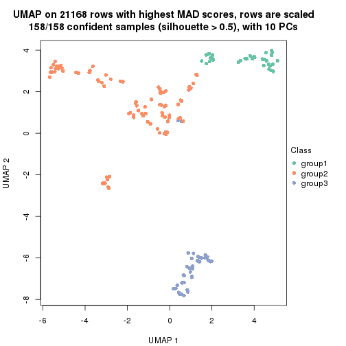</p>

</div>
<div id='tab-MAD-hclust-dimension-reduction-3'>
<pre><code class="r">dimension_reduction(res, k = 4, method = &quot;UMAP&quot;)
</code></pre>

<p></p>

</div>
<div id='tab-MAD-hclust-dimension-reduction-4'>
<pre><code class="r">dimension_reduction(res, k = 5, method = &quot;UMAP&quot;)
</code></pre>

<p></p>

</div>
<div id='tab-MAD-hclust-dimension-reduction-5'>
<pre><code class="r">dimension_reduction(res, k = 6, method = &quot;UMAP&quot;)
</code></pre>

<p></p>

</div>
</div>


Following heatmap shows how subgroups are split when increasing `k`:

```r
collect_classes(res)
```

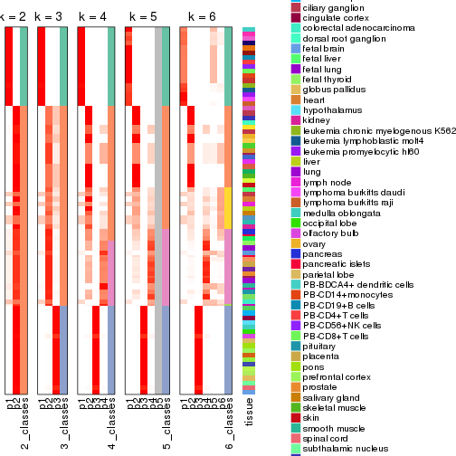


Test correlation between subgroups and known annotations. If the known
annotation is numeric, one-way ANOVA test is applied, and if the known
annotation is discrete, chi-squared contingency table test is applied.

```r
test_to_known_factors(res)
```

```
#>              n tissue(p) k
#> MAD:hclust 158  2.28e-07 2
#> MAD:hclust 158  6.33e-13 3
#> MAD:hclust 134  1.58e-15 4
#> MAD:hclust 122  2.61e-14 5
#> MAD:hclust 117  4.56e-18 6
```


If matrix rows can be associated to genes, consider to use `functional_enrichment(res,
...)` to perform function enrichment for the signature genes. See [this vignette](http://bioconductor.org/packages/devel/bioc/vignettes/cola/inst/doc/functional_enrichment.html) for more detailed explanations.


 

---------------------------------------------------


### MAD:kmeans**


The object with results only for a single top-value method and a single partition method 
can be extracted as:

```r
res = res_list["MAD", "kmeans"]
# you can also extract it by
# res = res_list["MAD:kmeans"]
```

A summary of `res` and all the functions that can be applied to it:

```r
res
```

```
#> A 'ConsensusPartition' object with k = 2, 3, 4, 5, 6.
#>   On a matrix with 21168 rows and 158 columns.
#>   Top rows (1000, 2000, 3000, 4000, 5000) are extracted by 'MAD' method.
#>   Subgroups are detected by 'kmeans' method.
#>   Performed in total 1250 partitions by row resampling.
#>   Best k for subgroups seems to be 3.
#> 
#> Following methods can be applied to this 'ConsensusPartition' object:
#>  [1] "cola_report"             "collect_classes"         "collect_plots"          
#>  [4] "collect_stats"           "colnames"                "compare_signatures"     
#>  [7] "consensus_heatmap"       "dimension_reduction"     "functional_enrichment"  
#> [10] "get_anno_col"            "get_anno"                "get_classes"            
#> [13] "get_consensus"           "get_matrix"              "get_membership"         
#> [16] "get_param"               "get_signatures"          "get_stats"              
#> [19] "is_best_k"               "is_stable_k"             "membership_heatmap"     
#> [22] "ncol"                    "nrow"                    "plot_ecdf"              
#> [25] "rownames"                "select_partition_number" "show"                   
#> [28] "suggest_best_k"          "test_to_known_factors"
```

`collect_plots()` function collects all the plots made from `res` for all `k` (number of partitions)
into one single page to provide an easy and fast comparison between different `k`.

```r
collect_plots(res)
```


The plots are:

- The first row: a plot of the ECDF (empirical cumulative distribution
  function) curves of the consensus matrix for each `k` and the heatmap of
  predicted classes for each `k`.
- The second row: heatmaps of the consensus matrix for each `k`.
- The third row: heatmaps of the membership matrix for each `k`.
- The fouth row: heatmaps of the signatures for each `k`.

All the plots in panels can be made by individual functions and they are
plotted later in this section.

`select_partition_number()` produces several plots showing different
statistics for choosing "optimized" `k`. There are following statistics:

- ECDF curves of the consensus matrix for each `k`;
- 1-PAC. [The PAC
  score](https://en.wikipedia.org/wiki/Consensus_clustering#Over-interpretation_potential_of_consensus_clustering)
  measures the proportion of the ambiguous subgrouping.
- Mean silhouette score.
- Concordance. The mean probability of fiting the consensus class ids in all
  partitions.
- Area increased. Denote $A_k$ as the area under the ECDF curve for current
  `k`, the area increased is defined as $A_k - A_{k-1}$.
- Rand index. The percent of pairs of samples that are both in a same cluster
  or both are not in a same cluster in the partition of k and k-1.
- Jaccard index. The ratio of pairs of samples are both in a same cluster in
  the partition of k and k-1 and the pairs of samples are both in a same
  cluster in the partition k or k-1.

The detailed explanations of these statistics can be found in [the _cola_
vignette](http://bioconductor.org/packages/devel/bioc/vignettes/cola/inst/doc/cola.html#toc_13).

Generally speaking, lower PAC score, higher mean silhouette score or higher
concordance corresponds to better partition. Rand index and Jaccard index
measure how similar the current partition is compared to partition with `k-1`.
If they are too similar, we won't accept `k` is better than `k-1`.

```r
select_partition_number(res)
```


The numeric values for all these statistics can be obtained by `get_stats()`.

```r
get_stats(res)
```

```
#>   k 1-PAC mean_silhouette concordance area_increased  Rand Jaccard
#> 2 2 0.427           0.744       0.795         0.4189 0.585   0.585
#> 3 3 0.980           0.947       0.967         0.4683 0.741   0.575
#> 4 4 0.750           0.751       0.810         0.1633 0.823   0.565
#> 5 5 0.735           0.716       0.833         0.0756 0.959   0.849
#> 6 6 0.784           0.699       0.791         0.0422 0.965   0.856
```

`suggest_best_k()` suggests the best $k$ based on these statistics. The rules are as follows:

- All $k$ with Jaccard index larger than 0.95 are removed because increasing
  $k$ does not provide enough extra information. If all $k$ are removed, it is
  marked as no subgroup is detected.
- For all $k$ with 1-PAC score larger than 0.9, the maximal $k$ is taken as
  the best $k$, and other $k$ are marked as optional $k$.
- If it does not fit the second rule. The $k$ with the maximal vote of the
  highest 1-PAC score, highest mean silhouette, and highest concordance is
  taken as the best $k$.

```r
suggest_best_k(res)
```

```
#> [1] 3
```


Following shows the table of the partitions (You need to click the **show/hide
code output** link to see it). The membership matrix (columns with name `p*`)
is inferred by
[`clue::cl_consensus()`](https://www.rdocumentation.org/link/cl_consensus?package=clue)
function with the `SE` method. Basically the value in the membership matrix
represents the probability to belong to a certain group. The finall class
label for an item is determined with the group with highest probability it
belongs to.

In `get_classes()` function, the entropy is calculated from the membership
matrix and the silhouette score is calculated from the consensus matrix.


<script>
$( function() {
	$( '#tabs-MAD-kmeans-get-classes' ).tabs();
} );
</script>
<div id='tabs-MAD-kmeans-get-classes'>
<ul>
<li><a href='#tab-MAD-kmeans-get-classes-1'>k = 2</a></li>
<li><a href='#tab-MAD-kmeans-get-classes-2'>k = 3</a></li>
<li><a href='#tab-MAD-kmeans-get-classes-3'>k = 4</a></li>
<li><a href='#tab-MAD-kmeans-get-classes-4'>k = 5</a></li>
<li><a href='#tab-MAD-kmeans-get-classes-5'>k = 6</a></li>
</ul>

<div id='tab-MAD-kmeans-get-classes-1'>
<p><a id='tab-MAD-kmeans-get-classes-1-a' style='color:#0366d6' href='#'>show/hide code output</a></p>
<pre><code class="r">cbind(get_classes(res, k = 2), get_membership(res, k = 2))
</code></pre>

<pre><code>#&gt;          class entropy silhouette    p1    p2
#&gt; GSM18927     2  0.9795      0.641 0.416 0.584
#&gt; GSM18928     2  0.9795      0.641 0.416 0.584
#&gt; GSM18915     2  0.9795      0.641 0.416 0.584
#&gt; GSM18916     2  0.9795      0.641 0.416 0.584
#&gt; GSM18939     2  0.9795      0.641 0.416 0.584
#&gt; GSM18940     2  0.9795      0.641 0.416 0.584
#&gt; GSM18933     2  0.9795      0.641 0.416 0.584
#&gt; GSM18934     2  0.9795      0.641 0.416 0.584
#&gt; GSM18925     2  0.9795      0.641 0.416 0.584
#&gt; GSM18926     2  0.9795      0.641 0.416 0.584
#&gt; GSM18931     2  0.9795      0.641 0.416 0.584
#&gt; GSM18932     2  0.9795      0.641 0.416 0.584
#&gt; GSM19019     2  0.6048      0.711 0.148 0.852
#&gt; GSM19020     2  0.6048      0.711 0.148 0.852
#&gt; GSM18923     2  0.9795      0.641 0.416 0.584
#&gt; GSM18924     2  0.9795      0.641 0.416 0.584
#&gt; GSM18941     2  0.9795      0.641 0.416 0.584
#&gt; GSM18942     2  0.9795      0.641 0.416 0.584
#&gt; GSM18929     2  0.9795      0.641 0.416 0.584
#&gt; GSM18930     2  0.9795      0.641 0.416 0.584
#&gt; GSM18911     2  0.9795      0.641 0.416 0.584
#&gt; GSM18912     2  0.9795      0.641 0.416 0.584
#&gt; GSM18935     2  0.9795      0.641 0.416 0.584
#&gt; GSM18936     2  0.9795      0.641 0.416 0.584
#&gt; GSM19005     2  0.6048      0.711 0.148 0.852
#&gt; GSM19006     2  0.6048      0.711 0.148 0.852
#&gt; GSM18921     2  0.9795      0.641 0.416 0.584
#&gt; GSM18922     2  0.9795      0.641 0.416 0.584
#&gt; GSM18919     2  0.9795      0.641 0.416 0.584
#&gt; GSM18920     2  0.9795      0.641 0.416 0.584
#&gt; GSM18917     2  0.9795      0.641 0.416 0.584
#&gt; GSM18918     2  0.9795      0.641 0.416 0.584
#&gt; GSM18913     2  0.9795      0.641 0.416 0.584
#&gt; GSM18914     2  0.9795      0.641 0.416 0.584
#&gt; GSM18937     2  0.9795      0.641 0.416 0.584
#&gt; GSM18938     2  0.9795      0.641 0.416 0.584
#&gt; GSM18943     2  0.9795      0.641 0.416 0.584
#&gt; GSM18944     2  0.9795      0.641 0.416 0.584
#&gt; GSM19003     2  0.6048      0.711 0.148 0.852
#&gt; GSM19004     2  0.6048      0.711 0.148 0.852
#&gt; GSM19011     2  0.6048      0.711 0.148 0.852
#&gt; GSM19012     2  0.6048      0.711 0.148 0.852
#&gt; GSM19009     2  0.6048      0.711 0.148 0.852
#&gt; GSM19010     2  0.6048      0.711 0.148 0.852
#&gt; GSM18945     2  0.9795      0.641 0.416 0.584
#&gt; GSM18946     2  0.9795      0.641 0.416 0.584
#&gt; GSM18963     2  0.3114      0.669 0.056 0.944
#&gt; GSM18964     2  0.3274      0.665 0.060 0.940
#&gt; GSM18905     2  0.3274      0.665 0.060 0.940
#&gt; GSM18906     2  0.3274      0.665 0.060 0.940
#&gt; GSM18965     2  0.3274      0.665 0.060 0.940
#&gt; GSM18966     2  0.3274      0.665 0.060 0.940
#&gt; GSM18873     1  0.9491      0.982 0.632 0.368
#&gt; GSM18874     1  0.9491      0.982 0.632 0.368
#&gt; GSM18973     1  0.9795      0.937 0.584 0.416
#&gt; GSM18974     1  0.9795      0.937 0.584 0.416
#&gt; GSM18977     2  0.3274      0.665 0.060 0.940
#&gt; GSM18978     2  0.3274      0.665 0.060 0.940
#&gt; GSM18979     2  0.3274      0.665 0.060 0.940
#&gt; GSM18980     2  0.3274      0.665 0.060 0.940
#&gt; GSM18883     1  0.9491      0.982 0.632 0.368
#&gt; GSM18884     1  0.9491      0.982 0.632 0.368
#&gt; GSM18885     1  0.9491      0.982 0.632 0.368
#&gt; GSM18886     1  0.9491      0.982 0.632 0.368
#&gt; GSM18907     1  0.9491      0.982 0.632 0.368
#&gt; GSM18908     1  0.9491      0.982 0.632 0.368
#&gt; GSM18909     1  0.9795      0.937 0.584 0.416
#&gt; GSM18910     1  0.9795      0.937 0.584 0.416
#&gt; GSM18867     1  0.9491      0.982 0.632 0.368
#&gt; GSM18868     1  0.9491      0.982 0.632 0.368
#&gt; GSM18947     2  0.0000      0.706 0.000 1.000
#&gt; GSM18948     2  0.0000      0.706 0.000 1.000
#&gt; GSM18995     2  0.0672      0.709 0.008 0.992
#&gt; GSM18996     2  0.0672      0.709 0.008 0.992
#&gt; GSM18975     2  0.3274      0.665 0.060 0.940
#&gt; GSM18976     2  0.3274      0.665 0.060 0.940
#&gt; GSM18997     2  0.0000      0.706 0.000 1.000
#&gt; GSM18998     2  0.0000      0.706 0.000 1.000
#&gt; GSM18967     2  0.3274      0.665 0.060 0.940
#&gt; GSM18968     2  0.3274      0.665 0.060 0.940
#&gt; GSM18959     2  0.2948      0.672 0.052 0.948
#&gt; GSM18960     2  0.3274      0.665 0.060 0.940
#&gt; GSM19015     2  0.0672      0.709 0.008 0.992
#&gt; GSM19016     2  0.0672      0.709 0.008 0.992
#&gt; GSM18957     2  0.3274      0.665 0.060 0.940
#&gt; GSM18958     2  0.3274      0.665 0.060 0.940
#&gt; GSM18981     2  0.2236      0.685 0.036 0.964
#&gt; GSM18982     2  0.2236      0.685 0.036 0.964
#&gt; GSM18989     2  0.0000      0.706 0.000 1.000
#&gt; GSM18990     2  0.2236      0.685 0.036 0.964
#&gt; GSM18985     2  0.2236      0.685 0.036 0.964
#&gt; GSM18986     2  0.2236      0.685 0.036 0.964
#&gt; GSM18987     2  0.2236      0.685 0.036 0.964
#&gt; GSM18988     2  0.2236      0.685 0.036 0.964
#&gt; GSM18983     2  0.0000      0.706 0.000 1.000
#&gt; GSM18984     2  0.0000      0.706 0.000 1.000
#&gt; GSM18951     2  0.0000      0.706 0.000 1.000
#&gt; GSM18952     2  0.3274      0.665 0.060 0.940
#&gt; GSM19007     2  0.4298      0.715 0.088 0.912
#&gt; GSM19008     2  0.4298      0.715 0.088 0.912
#&gt; GSM18999     2  0.2948      0.715 0.052 0.948
#&gt; GSM19000     2  0.2948      0.715 0.052 0.948
#&gt; GSM18889     1  0.9491      0.982 0.632 0.368
#&gt; GSM18890     1  0.9491      0.982 0.632 0.368
#&gt; GSM18881     1  0.9491      0.982 0.632 0.368
#&gt; GSM18882     1  0.9491      0.982 0.632 0.368
#&gt; GSM18877     1  0.9491      0.982 0.632 0.368
#&gt; GSM18878     1  0.9491      0.982 0.632 0.368
#&gt; GSM18875     1  0.9491      0.982 0.632 0.368
#&gt; GSM18876     1  0.9491      0.982 0.632 0.368
#&gt; GSM18879     1  0.9491      0.982 0.632 0.368
#&gt; GSM18880     1  0.9491      0.982 0.632 0.368
#&gt; GSM18871     1  0.9491      0.982 0.632 0.368
#&gt; GSM18872     1  0.9491      0.982 0.632 0.368
#&gt; GSM18903     1  0.9795      0.937 0.584 0.416
#&gt; GSM18904     1  0.9795      0.937 0.584 0.416
#&gt; GSM18949     2  0.3274      0.665 0.060 0.940
#&gt; GSM18950     2  0.3274      0.665 0.060 0.940
#&gt; GSM18953     2  0.3274      0.665 0.060 0.940
#&gt; GSM18954     2  0.3274      0.665 0.060 0.940
#&gt; GSM19013     2  0.2948      0.715 0.052 0.948
#&gt; GSM19014     2  0.2948      0.715 0.052 0.948
#&gt; GSM18971     2  0.8861     -0.155 0.304 0.696
#&gt; GSM18972     2  0.8861     -0.155 0.304 0.696
#&gt; GSM18969     2  0.9044     -0.229 0.320 0.680
#&gt; GSM18970     2  0.3274      0.665 0.060 0.940
#&gt; GSM18869     1  0.9491      0.982 0.632 0.368
#&gt; GSM18870     1  0.9491      0.982 0.632 0.368
#&gt; GSM19017     2  0.0672      0.709 0.008 0.992
#&gt; GSM19018     2  0.0672      0.709 0.008 0.992
#&gt; GSM18991     2  0.3274      0.665 0.060 0.940
#&gt; GSM18992     2  0.2948      0.672 0.052 0.948
#&gt; GSM19021     2  0.6048      0.711 0.148 0.852
#&gt; GSM19022     2  0.6048      0.711 0.148 0.852
#&gt; GSM19001     2  0.0938      0.710 0.012 0.988
#&gt; GSM19002     2  0.0938      0.710 0.012 0.988
#&gt; GSM18899     1  0.9795      0.937 0.584 0.416
#&gt; GSM18900     1  0.9795      0.937 0.584 0.416
#&gt; GSM18961     2  0.3274      0.665 0.060 0.940
#&gt; GSM18962     2  0.3274      0.665 0.060 0.940
#&gt; GSM18901     1  0.9795      0.937 0.584 0.416
#&gt; GSM18902     1  0.9795      0.937 0.584 0.416
#&gt; GSM18993     2  0.3274      0.665 0.060 0.940
#&gt; GSM18994     2  0.3274      0.665 0.060 0.940
#&gt; GSM18865     1  0.9580      0.972 0.620 0.380
#&gt; GSM18866     1  0.9580      0.972 0.620 0.380
#&gt; GSM18897     1  0.9491      0.982 0.632 0.368
#&gt; GSM18898     1  0.9491      0.982 0.632 0.368
#&gt; GSM18887     1  0.9491      0.982 0.632 0.368
#&gt; GSM18888     1  0.9491      0.982 0.632 0.368
#&gt; GSM18893     1  0.9491      0.982 0.632 0.368
#&gt; GSM18894     1  0.9491      0.982 0.632 0.368
#&gt; GSM18895     1  0.9491      0.982 0.632 0.368
#&gt; GSM18896     1  0.9491      0.982 0.632 0.368
#&gt; GSM18891     1  0.9491      0.982 0.632 0.368
#&gt; GSM18892     1  0.9491      0.982 0.632 0.368
#&gt; GSM18955     2  0.0672      0.709 0.008 0.992
#&gt; GSM18956     2  0.0376      0.704 0.004 0.996
</code></pre>

<script>
$('#tab-MAD-kmeans-get-classes-1-a').parent().next().next().hide();
$('#tab-MAD-kmeans-get-classes-1-a').click(function(){
  $('#tab-MAD-kmeans-get-classes-1-a').parent().next().next().toggle();
  return(false);
});
</script>
</div>

<div id='tab-MAD-kmeans-get-classes-2'>
<p><a id='tab-MAD-kmeans-get-classes-2-a' style='color:#0366d6' href='#'>show/hide code output</a></p>
<pre><code class="r">cbind(get_classes(res, k = 3), get_membership(res, k = 3))
</code></pre>

<pre><code>#&gt;          class entropy silhouette    p1    p2    p3
#&gt; GSM18927     3  0.1525      1.000 0.004 0.032 0.964
#&gt; GSM18928     3  0.1525      1.000 0.004 0.032 0.964
#&gt; GSM18915     3  0.1525      1.000 0.004 0.032 0.964
#&gt; GSM18916     3  0.1525      1.000 0.004 0.032 0.964
#&gt; GSM18939     3  0.1525      1.000 0.004 0.032 0.964
#&gt; GSM18940     3  0.1525      1.000 0.004 0.032 0.964
#&gt; GSM18933     3  0.1525      1.000 0.004 0.032 0.964
#&gt; GSM18934     3  0.1525      1.000 0.004 0.032 0.964
#&gt; GSM18925     3  0.1525      1.000 0.004 0.032 0.964
#&gt; GSM18926     3  0.1525      1.000 0.004 0.032 0.964
#&gt; GSM18931     3  0.1525      1.000 0.004 0.032 0.964
#&gt; GSM18932     3  0.1525      1.000 0.004 0.032 0.964
#&gt; GSM19019     2  0.0237      0.985 0.000 0.996 0.004
#&gt; GSM19020     2  0.0237      0.985 0.000 0.996 0.004
#&gt; GSM18923     3  0.1525      1.000 0.004 0.032 0.964
#&gt; GSM18924     3  0.1525      1.000 0.004 0.032 0.964
#&gt; GSM18941     3  0.1289      0.995 0.000 0.032 0.968
#&gt; GSM18942     3  0.1289      0.995 0.000 0.032 0.968
#&gt; GSM18929     3  0.1525      1.000 0.004 0.032 0.964
#&gt; GSM18930     3  0.1525      1.000 0.004 0.032 0.964
#&gt; GSM18911     3  0.1525      1.000 0.004 0.032 0.964
#&gt; GSM18912     3  0.1289      0.995 0.000 0.032 0.968
#&gt; GSM18935     3  0.1525      1.000 0.004 0.032 0.964
#&gt; GSM18936     3  0.1525      1.000 0.004 0.032 0.964
#&gt; GSM19005     2  0.0237      0.985 0.000 0.996 0.004
#&gt; GSM19006     2  0.0237      0.985 0.000 0.996 0.004
#&gt; GSM18921     3  0.1525      1.000 0.004 0.032 0.964
#&gt; GSM18922     3  0.1525      1.000 0.004 0.032 0.964
#&gt; GSM18919     3  0.1525      1.000 0.004 0.032 0.964
#&gt; GSM18920     3  0.1525      1.000 0.004 0.032 0.964
#&gt; GSM18917     3  0.1525      1.000 0.004 0.032 0.964
#&gt; GSM18918     3  0.1525      1.000 0.004 0.032 0.964
#&gt; GSM18913     3  0.1525      1.000 0.004 0.032 0.964
#&gt; GSM18914     3  0.1525      1.000 0.004 0.032 0.964
#&gt; GSM18937     3  0.1525      1.000 0.004 0.032 0.964
#&gt; GSM18938     3  0.1525      1.000 0.004 0.032 0.964
#&gt; GSM18943     3  0.1525      1.000 0.004 0.032 0.964
#&gt; GSM18944     3  0.1525      1.000 0.004 0.032 0.964
#&gt; GSM19003     2  0.0237      0.985 0.000 0.996 0.004
#&gt; GSM19004     2  0.0237      0.985 0.000 0.996 0.004
#&gt; GSM19011     2  0.0237      0.985 0.000 0.996 0.004
#&gt; GSM19012     2  0.0237      0.985 0.000 0.996 0.004
#&gt; GSM19009     2  0.0237      0.985 0.000 0.996 0.004
#&gt; GSM19010     2  0.0237      0.985 0.000 0.996 0.004
#&gt; GSM18945     3  0.1525      1.000 0.004 0.032 0.964
#&gt; GSM18946     3  0.1525      1.000 0.004 0.032 0.964
#&gt; GSM18963     2  0.0000      0.985 0.000 1.000 0.000
#&gt; GSM18964     2  0.0000      0.985 0.000 1.000 0.000
#&gt; GSM18905     2  0.0892      0.969 0.020 0.980 0.000
#&gt; GSM18906     2  0.0892      0.969 0.020 0.980 0.000
#&gt; GSM18965     2  0.0000      0.985 0.000 1.000 0.000
#&gt; GSM18966     2  0.0000      0.985 0.000 1.000 0.000
#&gt; GSM18873     1  0.0892      0.920 0.980 0.000 0.020
#&gt; GSM18874     1  0.0892      0.920 0.980 0.000 0.020
#&gt; GSM18973     1  0.6264      0.450 0.616 0.380 0.004
#&gt; GSM18974     1  0.6264      0.450 0.616 0.380 0.004
#&gt; GSM18977     2  0.1129      0.965 0.020 0.976 0.004
#&gt; GSM18978     2  0.0000      0.985 0.000 1.000 0.000
#&gt; GSM18979     2  0.0000      0.985 0.000 1.000 0.000
#&gt; GSM18980     2  0.0000      0.985 0.000 1.000 0.000
#&gt; GSM18883     1  0.0424      0.918 0.992 0.000 0.008
#&gt; GSM18884     1  0.0424      0.918 0.992 0.000 0.008
#&gt; GSM18885     1  0.1031      0.919 0.976 0.000 0.024
#&gt; GSM18886     1  0.1031      0.919 0.976 0.000 0.024
#&gt; GSM18907     1  0.0424      0.918 0.992 0.000 0.008
#&gt; GSM18908     1  0.0424      0.918 0.992 0.000 0.008
#&gt; GSM18909     2  0.5968      0.382 0.364 0.636 0.000
#&gt; GSM18910     2  0.5905      0.415 0.352 0.648 0.000
#&gt; GSM18867     1  0.0892      0.920 0.980 0.000 0.020
#&gt; GSM18868     1  0.0892      0.920 0.980 0.000 0.020
#&gt; GSM18947     2  0.0000      0.985 0.000 1.000 0.000
#&gt; GSM18948     2  0.0000      0.985 0.000 1.000 0.000
#&gt; GSM18995     2  0.0237      0.985 0.000 0.996 0.004
#&gt; GSM18996     2  0.0237      0.985 0.000 0.996 0.004
#&gt; GSM18975     2  0.0000      0.985 0.000 1.000 0.000
#&gt; GSM18976     2  0.0000      0.985 0.000 1.000 0.000
#&gt; GSM18997     2  0.0237      0.985 0.000 0.996 0.004
#&gt; GSM18998     2  0.0237      0.985 0.000 0.996 0.004
#&gt; GSM18967     2  0.0000      0.985 0.000 1.000 0.000
#&gt; GSM18968     2  0.0000      0.985 0.000 1.000 0.000
#&gt; GSM18959     2  0.0000      0.985 0.000 1.000 0.000
#&gt; GSM18960     2  0.0000      0.985 0.000 1.000 0.000
#&gt; GSM19015     2  0.0237      0.985 0.000 0.996 0.004
#&gt; GSM19016     2  0.0237      0.985 0.000 0.996 0.004
#&gt; GSM18957     2  0.0000      0.985 0.000 1.000 0.000
#&gt; GSM18958     2  0.0000      0.985 0.000 1.000 0.000
#&gt; GSM18981     2  0.0237      0.983 0.000 0.996 0.004
#&gt; GSM18982     2  0.0237      0.983 0.000 0.996 0.004
#&gt; GSM18989     2  0.0424      0.983 0.000 0.992 0.008
#&gt; GSM18990     2  0.0424      0.983 0.000 0.992 0.008
#&gt; GSM18985     2  0.0424      0.983 0.000 0.992 0.008
#&gt; GSM18986     2  0.0237      0.983 0.000 0.996 0.004
#&gt; GSM18987     2  0.0424      0.983 0.000 0.992 0.008
#&gt; GSM18988     2  0.0424      0.983 0.000 0.992 0.008
#&gt; GSM18983     2  0.0424      0.983 0.000 0.992 0.008
#&gt; GSM18984     2  0.0424      0.983 0.000 0.992 0.008
#&gt; GSM18951     2  0.0000      0.985 0.000 1.000 0.000
#&gt; GSM18952     2  0.0000      0.985 0.000 1.000 0.000
#&gt; GSM19007     2  0.0237      0.985 0.000 0.996 0.004
#&gt; GSM19008     2  0.0237      0.985 0.000 0.996 0.004
#&gt; GSM18999     2  0.0237      0.985 0.000 0.996 0.004
#&gt; GSM19000     2  0.0237      0.985 0.000 0.996 0.004
#&gt; GSM18889     1  0.1031      0.920 0.976 0.000 0.024
#&gt; GSM18890     1  0.1031      0.920 0.976 0.000 0.024
#&gt; GSM18881     1  0.0892      0.920 0.980 0.000 0.020
#&gt; GSM18882     1  0.0892      0.920 0.980 0.000 0.020
#&gt; GSM18877     1  0.0892      0.920 0.980 0.000 0.020
#&gt; GSM18878     1  0.0892      0.920 0.980 0.000 0.020
#&gt; GSM18875     1  0.0892      0.920 0.980 0.000 0.020
#&gt; GSM18876     1  0.0892      0.920 0.980 0.000 0.020
#&gt; GSM18879     1  0.0892      0.920 0.980 0.000 0.020
#&gt; GSM18880     1  0.0892      0.920 0.980 0.000 0.020
#&gt; GSM18871     1  0.0892      0.920 0.980 0.000 0.020
#&gt; GSM18872     1  0.0892      0.920 0.980 0.000 0.020
#&gt; GSM18903     2  0.1643      0.946 0.044 0.956 0.000
#&gt; GSM18904     2  0.1643      0.946 0.044 0.956 0.000
#&gt; GSM18949     2  0.0000      0.985 0.000 1.000 0.000
#&gt; GSM18950     2  0.0000      0.985 0.000 1.000 0.000
#&gt; GSM18953     2  0.0000      0.985 0.000 1.000 0.000
#&gt; GSM18954     2  0.0000      0.985 0.000 1.000 0.000
#&gt; GSM19013     2  0.0237      0.985 0.000 0.996 0.004
#&gt; GSM19014     2  0.0237      0.985 0.000 0.996 0.004
#&gt; GSM18971     2  0.1129      0.965 0.020 0.976 0.004
#&gt; GSM18972     2  0.1129      0.965 0.020 0.976 0.004
#&gt; GSM18969     2  0.1129      0.965 0.020 0.976 0.004
#&gt; GSM18970     2  0.0892      0.969 0.020 0.980 0.000
#&gt; GSM18869     1  0.0892      0.920 0.980 0.000 0.020
#&gt; GSM18870     1  0.0892      0.920 0.980 0.000 0.020
#&gt; GSM19017     2  0.0237      0.985 0.000 0.996 0.004
#&gt; GSM19018     2  0.0237      0.985 0.000 0.996 0.004
#&gt; GSM18991     2  0.0237      0.985 0.000 0.996 0.004
#&gt; GSM18992     2  0.0237      0.985 0.000 0.996 0.004
#&gt; GSM19021     2  0.0000      0.985 0.000 1.000 0.000
#&gt; GSM19022     2  0.0000      0.985 0.000 1.000 0.000
#&gt; GSM19001     2  0.0237      0.985 0.000 0.996 0.004
#&gt; GSM19002     2  0.0237      0.985 0.000 0.996 0.004
#&gt; GSM18899     1  0.5016      0.713 0.760 0.240 0.000
#&gt; GSM18900     1  0.5138      0.696 0.748 0.252 0.000
#&gt; GSM18961     2  0.0000      0.985 0.000 1.000 0.000
#&gt; GSM18962     2  0.0000      0.985 0.000 1.000 0.000
#&gt; GSM18901     1  0.4654      0.743 0.792 0.208 0.000
#&gt; GSM18902     1  0.5397      0.651 0.720 0.280 0.000
#&gt; GSM18993     2  0.0000      0.985 0.000 1.000 0.000
#&gt; GSM18994     2  0.0000      0.985 0.000 1.000 0.000
#&gt; GSM18865     1  0.5956      0.571 0.672 0.324 0.004
#&gt; GSM18866     1  0.5443      0.682 0.736 0.260 0.004
#&gt; GSM18897     1  0.0237      0.919 0.996 0.000 0.004
#&gt; GSM18898     1  0.0237      0.919 0.996 0.000 0.004
#&gt; GSM18887     1  0.0237      0.919 0.996 0.000 0.004
#&gt; GSM18888     1  0.0237      0.919 0.996 0.000 0.004
#&gt; GSM18893     1  0.0237      0.919 0.996 0.000 0.004
#&gt; GSM18894     1  0.0237      0.919 0.996 0.000 0.004
#&gt; GSM18895     1  0.0237      0.919 0.996 0.000 0.004
#&gt; GSM18896     1  0.0237      0.919 0.996 0.000 0.004
#&gt; GSM18891     1  0.0237      0.919 0.996 0.000 0.004
#&gt; GSM18892     1  0.0237      0.919 0.996 0.000 0.004
#&gt; GSM18955     2  0.0000      0.985 0.000 1.000 0.000
#&gt; GSM18956     2  0.0000      0.985 0.000 1.000 0.000
</code></pre>

<script>
$('#tab-MAD-kmeans-get-classes-2-a').parent().next().next().hide();
$('#tab-MAD-kmeans-get-classes-2-a').click(function(){
  $('#tab-MAD-kmeans-get-classes-2-a').parent().next().next().toggle();
  return(false);
});
</script>
</div>

<div id='tab-MAD-kmeans-get-classes-3'>
<p><a id='tab-MAD-kmeans-get-classes-3-a' style='color:#0366d6' href='#'>show/hide code output</a></p>
<pre><code class="r">cbind(get_classes(res, k = 4), get_membership(res, k = 4))
</code></pre>

<pre><code>#&gt;          class entropy silhouette    p1    p2    p3    p4
#&gt; GSM18927     3  0.1305     0.9834 0.000 0.036 0.960 0.004
#&gt; GSM18928     3  0.1305     0.9834 0.000 0.036 0.960 0.004
#&gt; GSM18915     3  0.0188     0.9834 0.000 0.000 0.996 0.004
#&gt; GSM18916     3  0.0524     0.9828 0.000 0.008 0.988 0.004
#&gt; GSM18939     3  0.0524     0.9828 0.000 0.008 0.988 0.004
#&gt; GSM18940     3  0.0524     0.9828 0.000 0.008 0.988 0.004
#&gt; GSM18933     3  0.1305     0.9834 0.000 0.036 0.960 0.004
#&gt; GSM18934     3  0.1305     0.9834 0.000 0.036 0.960 0.004
#&gt; GSM18925     3  0.0524     0.9828 0.000 0.008 0.988 0.004
#&gt; GSM18926     3  0.0524     0.9828 0.000 0.008 0.988 0.004
#&gt; GSM18931     3  0.1305     0.9834 0.000 0.036 0.960 0.004
#&gt; GSM18932     3  0.1305     0.9834 0.000 0.036 0.960 0.004
#&gt; GSM19019     4  0.4454    -0.2746 0.000 0.308 0.000 0.692
#&gt; GSM19020     4  0.4972    -0.7885 0.000 0.456 0.000 0.544
#&gt; GSM18923     3  0.0524     0.9828 0.000 0.008 0.988 0.004
#&gt; GSM18924     3  0.0524     0.9828 0.000 0.008 0.988 0.004
#&gt; GSM18941     3  0.0524     0.9828 0.000 0.008 0.988 0.004
#&gt; GSM18942     3  0.0524     0.9828 0.000 0.008 0.988 0.004
#&gt; GSM18929     3  0.1305     0.9834 0.000 0.036 0.960 0.004
#&gt; GSM18930     3  0.1305     0.9834 0.000 0.036 0.960 0.004
#&gt; GSM18911     3  0.0524     0.9828 0.000 0.008 0.988 0.004
#&gt; GSM18912     3  0.0524     0.9828 0.000 0.008 0.988 0.004
#&gt; GSM18935     3  0.1305     0.9834 0.000 0.036 0.960 0.004
#&gt; GSM18936     3  0.1305     0.9834 0.000 0.036 0.960 0.004
#&gt; GSM19005     2  0.4985     0.9387 0.000 0.532 0.000 0.468
#&gt; GSM19006     2  0.4985     0.9387 0.000 0.532 0.000 0.468
#&gt; GSM18921     3  0.1305     0.9834 0.000 0.036 0.960 0.004
#&gt; GSM18922     3  0.1305     0.9834 0.000 0.036 0.960 0.004
#&gt; GSM18919     3  0.1305     0.9834 0.000 0.036 0.960 0.004
#&gt; GSM18920     3  0.1305     0.9834 0.000 0.036 0.960 0.004
#&gt; GSM18917     3  0.0188     0.9834 0.000 0.000 0.996 0.004
#&gt; GSM18918     3  0.0188     0.9834 0.000 0.000 0.996 0.004
#&gt; GSM18913     3  0.0524     0.9828 0.000 0.008 0.988 0.004
#&gt; GSM18914     3  0.0524     0.9828 0.000 0.008 0.988 0.004
#&gt; GSM18937     3  0.0524     0.9828 0.000 0.008 0.988 0.004
#&gt; GSM18938     3  0.0524     0.9828 0.000 0.008 0.988 0.004
#&gt; GSM18943     3  0.1305     0.9834 0.000 0.036 0.960 0.004
#&gt; GSM18944     3  0.1305     0.9834 0.000 0.036 0.960 0.004
#&gt; GSM19003     2  0.4985     0.9387 0.000 0.532 0.000 0.468
#&gt; GSM19004     2  0.4985     0.9387 0.000 0.532 0.000 0.468
#&gt; GSM19011     2  0.4985     0.9387 0.000 0.532 0.000 0.468
#&gt; GSM19012     2  0.4985     0.9387 0.000 0.532 0.000 0.468
#&gt; GSM19009     2  0.4985     0.9387 0.000 0.532 0.000 0.468
#&gt; GSM19010     2  0.4985     0.9387 0.000 0.532 0.000 0.468
#&gt; GSM18945     3  0.1209     0.9836 0.000 0.032 0.964 0.004
#&gt; GSM18946     3  0.1209     0.9836 0.000 0.032 0.964 0.004
#&gt; GSM18963     4  0.0188     0.6813 0.000 0.004 0.000 0.996
#&gt; GSM18964     4  0.0188     0.6813 0.000 0.004 0.000 0.996
#&gt; GSM18905     4  0.3528     0.4235 0.000 0.192 0.000 0.808
#&gt; GSM18906     4  0.2011     0.6571 0.000 0.080 0.000 0.920
#&gt; GSM18965     4  0.0188     0.6852 0.000 0.004 0.000 0.996
#&gt; GSM18966     4  0.0188     0.6852 0.000 0.004 0.000 0.996
#&gt; GSM18873     1  0.0000     0.8972 1.000 0.000 0.000 0.000
#&gt; GSM18874     1  0.0000     0.8972 1.000 0.000 0.000 0.000
#&gt; GSM18973     4  0.6564     0.3618 0.084 0.380 0.000 0.536
#&gt; GSM18974     4  0.6564     0.3618 0.084 0.380 0.000 0.536
#&gt; GSM18977     4  0.1637     0.6708 0.000 0.060 0.000 0.940
#&gt; GSM18978     4  0.0188     0.6813 0.000 0.004 0.000 0.996
#&gt; GSM18979     4  0.0000     0.6835 0.000 0.000 0.000 1.000
#&gt; GSM18980     4  0.1792     0.6665 0.000 0.068 0.000 0.932
#&gt; GSM18883     1  0.3873     0.8589 0.772 0.228 0.000 0.000
#&gt; GSM18884     1  0.4193     0.8495 0.732 0.268 0.000 0.000
#&gt; GSM18885     1  0.0000     0.8972 1.000 0.000 0.000 0.000
#&gt; GSM18886     1  0.0000     0.8972 1.000 0.000 0.000 0.000
#&gt; GSM18907     1  0.4304     0.8453 0.716 0.284 0.000 0.000
#&gt; GSM18908     1  0.4304     0.8453 0.716 0.284 0.000 0.000
#&gt; GSM18909     4  0.7028     0.4051 0.172 0.260 0.000 0.568
#&gt; GSM18910     4  0.7028     0.4051 0.172 0.260 0.000 0.568
#&gt; GSM18867     1  0.0000     0.8972 1.000 0.000 0.000 0.000
#&gt; GSM18868     1  0.0000     0.8972 1.000 0.000 0.000 0.000
#&gt; GSM18947     4  0.0188     0.6813 0.000 0.004 0.000 0.996
#&gt; GSM18948     4  0.0188     0.6813 0.000 0.004 0.000 0.996
#&gt; GSM18995     2  0.4985     0.9387 0.000 0.532 0.000 0.468
#&gt; GSM18996     2  0.4985     0.9387 0.000 0.532 0.000 0.468
#&gt; GSM18975     4  0.0921     0.6798 0.000 0.028 0.000 0.972
#&gt; GSM18976     4  0.0921     0.6798 0.000 0.028 0.000 0.972
#&gt; GSM18997     2  0.4985     0.9387 0.000 0.532 0.000 0.468
#&gt; GSM18998     2  0.4985     0.9387 0.000 0.532 0.000 0.468
#&gt; GSM18967     4  0.0336     0.6853 0.000 0.008 0.000 0.992
#&gt; GSM18968     4  0.0336     0.6853 0.000 0.008 0.000 0.992
#&gt; GSM18959     4  0.0188     0.6813 0.000 0.004 0.000 0.996
#&gt; GSM18960     4  0.0188     0.6813 0.000 0.004 0.000 0.996
#&gt; GSM19015     2  0.4985     0.9387 0.000 0.532 0.000 0.468
#&gt; GSM19016     2  0.4985     0.9387 0.000 0.532 0.000 0.468
#&gt; GSM18957     4  0.0188     0.6852 0.000 0.004 0.000 0.996
#&gt; GSM18958     4  0.0188     0.6852 0.000 0.004 0.000 0.996
#&gt; GSM18981     4  0.4996    -0.4149 0.000 0.484 0.000 0.516
#&gt; GSM18982     4  0.4994    -0.4007 0.000 0.480 0.000 0.520
#&gt; GSM18989     2  0.4697     0.7869 0.000 0.644 0.000 0.356
#&gt; GSM18990     2  0.4661     0.7753 0.000 0.652 0.000 0.348
#&gt; GSM18985     2  0.4661     0.7753 0.000 0.652 0.000 0.348
#&gt; GSM18986     4  0.4925    -0.5031 0.000 0.428 0.000 0.572
#&gt; GSM18987     2  0.4661     0.7753 0.000 0.652 0.000 0.348
#&gt; GSM18988     2  0.4661     0.7753 0.000 0.652 0.000 0.348
#&gt; GSM18983     2  0.4713     0.7918 0.000 0.640 0.000 0.360
#&gt; GSM18984     2  0.4697     0.7869 0.000 0.644 0.000 0.356
#&gt; GSM18951     4  0.4008     0.0522 0.000 0.244 0.000 0.756
#&gt; GSM18952     4  0.0188     0.6813 0.000 0.004 0.000 0.996
#&gt; GSM19007     2  0.4985     0.9387 0.000 0.532 0.000 0.468
#&gt; GSM19008     2  0.4985     0.9387 0.000 0.532 0.000 0.468
#&gt; GSM18999     2  0.4985     0.9387 0.000 0.532 0.000 0.468
#&gt; GSM19000     2  0.4985     0.9387 0.000 0.532 0.000 0.468
#&gt; GSM18889     1  0.1302     0.8927 0.956 0.044 0.000 0.000
#&gt; GSM18890     1  0.1302     0.8927 0.956 0.044 0.000 0.000
#&gt; GSM18881     1  0.0000     0.8972 1.000 0.000 0.000 0.000
#&gt; GSM18882     1  0.0000     0.8972 1.000 0.000 0.000 0.000
#&gt; GSM18877     1  0.0188     0.8969 0.996 0.000 0.004 0.000
#&gt; GSM18878     1  0.0188     0.8969 0.996 0.000 0.004 0.000
#&gt; GSM18875     1  0.0188     0.8969 0.996 0.000 0.004 0.000
#&gt; GSM18876     1  0.0188     0.8969 0.996 0.000 0.004 0.000
#&gt; GSM18879     1  0.0188     0.8969 0.996 0.000 0.004 0.000
#&gt; GSM18880     1  0.0188     0.8969 0.996 0.000 0.004 0.000
#&gt; GSM18871     1  0.0000     0.8972 1.000 0.000 0.000 0.000
#&gt; GSM18872     1  0.0000     0.8972 1.000 0.000 0.000 0.000
#&gt; GSM18903     4  0.1635     0.6711 0.008 0.044 0.000 0.948
#&gt; GSM18904     4  0.1635     0.6711 0.008 0.044 0.000 0.948
#&gt; GSM18949     4  0.0188     0.6852 0.000 0.004 0.000 0.996
#&gt; GSM18950     4  0.0188     0.6852 0.000 0.004 0.000 0.996
#&gt; GSM18953     4  0.0469     0.6798 0.000 0.012 0.000 0.988
#&gt; GSM18954     4  0.0336     0.6825 0.000 0.008 0.000 0.992
#&gt; GSM19013     2  0.4985     0.9387 0.000 0.532 0.000 0.468
#&gt; GSM19014     2  0.4985     0.9387 0.000 0.532 0.000 0.468
#&gt; GSM18971     4  0.3610     0.5907 0.000 0.200 0.000 0.800
#&gt; GSM18972     4  0.3610     0.5907 0.000 0.200 0.000 0.800
#&gt; GSM18969     4  0.3649     0.5881 0.000 0.204 0.000 0.796
#&gt; GSM18970     4  0.3024     0.6218 0.000 0.148 0.000 0.852
#&gt; GSM18869     1  0.0000     0.8972 1.000 0.000 0.000 0.000
#&gt; GSM18870     1  0.0000     0.8972 1.000 0.000 0.000 0.000
#&gt; GSM19017     2  0.4985     0.9387 0.000 0.532 0.000 0.468
#&gt; GSM19018     2  0.4985     0.9387 0.000 0.532 0.000 0.468
#&gt; GSM18991     4  0.5000    -0.8912 0.000 0.500 0.000 0.500
#&gt; GSM18992     2  0.4996     0.9149 0.000 0.516 0.000 0.484
#&gt; GSM19021     4  0.3873     0.1387 0.000 0.228 0.000 0.772
#&gt; GSM19022     4  0.3907     0.1198 0.000 0.232 0.000 0.768
#&gt; GSM19001     2  0.4985     0.9387 0.000 0.532 0.000 0.468
#&gt; GSM19002     2  0.4985     0.9387 0.000 0.532 0.000 0.468
#&gt; GSM18899     4  0.6592     0.4421 0.128 0.260 0.000 0.612
#&gt; GSM18900     4  0.6592     0.4421 0.128 0.260 0.000 0.612
#&gt; GSM18961     4  0.0188     0.6852 0.000 0.004 0.000 0.996
#&gt; GSM18962     4  0.0188     0.6852 0.000 0.004 0.000 0.996
#&gt; GSM18901     4  0.7576     0.1964 0.256 0.260 0.000 0.484
#&gt; GSM18902     4  0.7407     0.2771 0.224 0.260 0.000 0.516
#&gt; GSM18993     4  0.0188     0.6813 0.000 0.004 0.000 0.996
#&gt; GSM18994     4  0.0188     0.6813 0.000 0.004 0.000 0.996
#&gt; GSM18865     4  0.7403     0.2033 0.168 0.380 0.000 0.452
#&gt; GSM18866     4  0.7403     0.2033 0.168 0.380 0.000 0.452
#&gt; GSM18897     1  0.4950     0.7854 0.620 0.376 0.000 0.004
#&gt; GSM18898     1  0.4950     0.7854 0.620 0.376 0.000 0.004
#&gt; GSM18887     1  0.4509     0.8423 0.708 0.288 0.000 0.004
#&gt; GSM18888     1  0.4509     0.8423 0.708 0.288 0.000 0.004
#&gt; GSM18893     1  0.4509     0.8423 0.708 0.288 0.000 0.004
#&gt; GSM18894     1  0.4509     0.8423 0.708 0.288 0.000 0.004
#&gt; GSM18895     1  0.4509     0.8423 0.708 0.288 0.000 0.004
#&gt; GSM18896     1  0.4509     0.8423 0.708 0.288 0.000 0.004
#&gt; GSM18891     1  0.4509     0.8423 0.708 0.288 0.000 0.004
#&gt; GSM18892     1  0.4509     0.8423 0.708 0.288 0.000 0.004
#&gt; GSM18955     4  0.2921     0.4336 0.000 0.140 0.000 0.860
#&gt; GSM18956     4  0.0188     0.6813 0.000 0.004 0.000 0.996
</code></pre>

<script>
$('#tab-MAD-kmeans-get-classes-3-a').parent().next().next().hide();
$('#tab-MAD-kmeans-get-classes-3-a').click(function(){
  $('#tab-MAD-kmeans-get-classes-3-a').parent().next().next().toggle();
  return(false);
});
</script>
</div>

<div id='tab-MAD-kmeans-get-classes-4'>
<p><a id='tab-MAD-kmeans-get-classes-4-a' style='color:#0366d6' href='#'>show/hide code output</a></p>
<pre><code class="r">cbind(get_classes(res, k = 5), get_membership(res, k = 5))
</code></pre>

<pre><code>#&gt;          class entropy silhouette    p1    p2    p3    p4    p5
#&gt; GSM18927     3  0.0000     0.9377 0.000 0.000 1.000 0.000 0.000
#&gt; GSM18928     3  0.0000     0.9377 0.000 0.000 1.000 0.000 0.000
#&gt; GSM18915     3  0.2293     0.9356 0.000 0.016 0.900 0.000 0.084
#&gt; GSM18916     3  0.3106     0.9262 0.000 0.024 0.844 0.000 0.132
#&gt; GSM18939     3  0.2873     0.9311 0.000 0.016 0.856 0.000 0.128
#&gt; GSM18940     3  0.2873     0.9311 0.000 0.016 0.856 0.000 0.128
#&gt; GSM18933     3  0.0162     0.9368 0.000 0.000 0.996 0.000 0.004
#&gt; GSM18934     3  0.0162     0.9368 0.000 0.000 0.996 0.000 0.004
#&gt; GSM18925     3  0.2873     0.9311 0.000 0.016 0.856 0.000 0.128
#&gt; GSM18926     3  0.2873     0.9311 0.000 0.016 0.856 0.000 0.128
#&gt; GSM18931     3  0.0000     0.9377 0.000 0.000 1.000 0.000 0.000
#&gt; GSM18932     3  0.0000     0.9377 0.000 0.000 1.000 0.000 0.000
#&gt; GSM19019     4  0.5068     0.0866 0.000 0.388 0.000 0.572 0.040
#&gt; GSM19020     2  0.5077     0.4242 0.000 0.536 0.000 0.428 0.036
#&gt; GSM18923     3  0.2873     0.9311 0.000 0.016 0.856 0.000 0.128
#&gt; GSM18924     3  0.2873     0.9311 0.000 0.016 0.856 0.000 0.128
#&gt; GSM18941     3  0.2921     0.9310 0.000 0.020 0.856 0.000 0.124
#&gt; GSM18942     3  0.2921     0.9310 0.000 0.020 0.856 0.000 0.124
#&gt; GSM18929     3  0.0000     0.9377 0.000 0.000 1.000 0.000 0.000
#&gt; GSM18930     3  0.0000     0.9377 0.000 0.000 1.000 0.000 0.000
#&gt; GSM18911     3  0.2921     0.9310 0.000 0.020 0.856 0.000 0.124
#&gt; GSM18912     3  0.2921     0.9310 0.000 0.020 0.856 0.000 0.124
#&gt; GSM18935     3  0.0162     0.9368 0.000 0.000 0.996 0.000 0.004
#&gt; GSM18936     3  0.0162     0.9368 0.000 0.000 0.996 0.000 0.004
#&gt; GSM19005     2  0.3010     0.8595 0.000 0.824 0.000 0.172 0.004
#&gt; GSM19006     2  0.3010     0.8595 0.000 0.824 0.000 0.172 0.004
#&gt; GSM18921     3  0.0000     0.9377 0.000 0.000 1.000 0.000 0.000
#&gt; GSM18922     3  0.0000     0.9377 0.000 0.000 1.000 0.000 0.000
#&gt; GSM18919     3  0.0162     0.9368 0.000 0.000 0.996 0.000 0.004
#&gt; GSM18920     3  0.0162     0.9368 0.000 0.000 0.996 0.000 0.004
#&gt; GSM18917     3  0.2293     0.9356 0.000 0.016 0.900 0.000 0.084
#&gt; GSM18918     3  0.2293     0.9356 0.000 0.016 0.900 0.000 0.084
#&gt; GSM18913     3  0.2873     0.9311 0.000 0.016 0.856 0.000 0.128
#&gt; GSM18914     3  0.2873     0.9311 0.000 0.016 0.856 0.000 0.128
#&gt; GSM18937     3  0.2873     0.9311 0.000 0.016 0.856 0.000 0.128
#&gt; GSM18938     3  0.2873     0.9311 0.000 0.016 0.856 0.000 0.128
#&gt; GSM18943     3  0.1041     0.9214 0.000 0.004 0.964 0.000 0.032
#&gt; GSM18944     3  0.1041     0.9214 0.000 0.004 0.964 0.000 0.032
#&gt; GSM19003     2  0.3010     0.8595 0.000 0.824 0.000 0.172 0.004
#&gt; GSM19004     2  0.3010     0.8595 0.000 0.824 0.000 0.172 0.004
#&gt; GSM19011     2  0.3010     0.8595 0.000 0.824 0.000 0.172 0.004
#&gt; GSM19012     2  0.3010     0.8595 0.000 0.824 0.000 0.172 0.004
#&gt; GSM19009     2  0.3010     0.8595 0.000 0.824 0.000 0.172 0.004
#&gt; GSM19010     2  0.3010     0.8595 0.000 0.824 0.000 0.172 0.004
#&gt; GSM18945     3  0.0807     0.9363 0.000 0.012 0.976 0.000 0.012
#&gt; GSM18946     3  0.0807     0.9363 0.000 0.012 0.976 0.000 0.012
#&gt; GSM18963     4  0.1041     0.7260 0.000 0.004 0.000 0.964 0.032
#&gt; GSM18964     4  0.1041     0.7260 0.000 0.004 0.000 0.964 0.032
#&gt; GSM18905     4  0.5233     0.4315 0.000 0.192 0.000 0.680 0.128
#&gt; GSM18906     4  0.3639     0.5981 0.000 0.044 0.000 0.812 0.144
#&gt; GSM18965     4  0.0955     0.7272 0.000 0.004 0.000 0.968 0.028
#&gt; GSM18966     4  0.0955     0.7272 0.000 0.004 0.000 0.968 0.028
#&gt; GSM18873     1  0.0000     0.8255 1.000 0.000 0.000 0.000 0.000
#&gt; GSM18874     1  0.0000     0.8255 1.000 0.000 0.000 0.000 0.000
#&gt; GSM18973     4  0.5986    -0.5319 0.032 0.048 0.000 0.516 0.404
#&gt; GSM18974     4  0.5986    -0.5319 0.032 0.048 0.000 0.516 0.404
#&gt; GSM18977     4  0.1251     0.7071 0.000 0.008 0.000 0.956 0.036
#&gt; GSM18978     4  0.0324     0.7253 0.000 0.004 0.000 0.992 0.004
#&gt; GSM18979     4  0.0324     0.7253 0.000 0.004 0.000 0.992 0.004
#&gt; GSM18980     4  0.2104     0.7022 0.000 0.024 0.000 0.916 0.060
#&gt; GSM18883     1  0.4680     0.7308 0.688 0.036 0.000 0.004 0.272
#&gt; GSM18884     1  0.4789     0.7203 0.668 0.036 0.000 0.004 0.292
#&gt; GSM18885     1  0.0404     0.8257 0.988 0.012 0.000 0.000 0.000
#&gt; GSM18886     1  0.0404     0.8257 0.988 0.012 0.000 0.000 0.000
#&gt; GSM18907     1  0.4867     0.7112 0.652 0.036 0.000 0.004 0.308
#&gt; GSM18908     1  0.4867     0.7112 0.652 0.036 0.000 0.004 0.308
#&gt; GSM18909     4  0.6685    -0.2846 0.128 0.036 0.000 0.540 0.296
#&gt; GSM18910     4  0.6685    -0.2846 0.128 0.036 0.000 0.540 0.296
#&gt; GSM18867     1  0.0693     0.8232 0.980 0.012 0.000 0.000 0.008
#&gt; GSM18868     1  0.0807     0.8212 0.976 0.012 0.000 0.000 0.012
#&gt; GSM18947     4  0.1764     0.7051 0.000 0.008 0.000 0.928 0.064
#&gt; GSM18948     4  0.1764     0.7051 0.000 0.008 0.000 0.928 0.064
#&gt; GSM18995     2  0.3381     0.8508 0.000 0.808 0.000 0.176 0.016
#&gt; GSM18996     2  0.2891     0.8574 0.000 0.824 0.000 0.176 0.000
#&gt; GSM18975     4  0.2825     0.6431 0.000 0.016 0.000 0.860 0.124
#&gt; GSM18976     4  0.2825     0.6431 0.000 0.016 0.000 0.860 0.124
#&gt; GSM18997     2  0.2852     0.8592 0.000 0.828 0.000 0.172 0.000
#&gt; GSM18998     2  0.2852     0.8592 0.000 0.828 0.000 0.172 0.000
#&gt; GSM18967     4  0.1041     0.7276 0.000 0.004 0.000 0.964 0.032
#&gt; GSM18968     4  0.1041     0.7276 0.000 0.004 0.000 0.964 0.032
#&gt; GSM18959     4  0.1041     0.7260 0.000 0.004 0.000 0.964 0.032
#&gt; GSM18960     4  0.1041     0.7260 0.000 0.004 0.000 0.964 0.032
#&gt; GSM19015     2  0.2852     0.8592 0.000 0.828 0.000 0.172 0.000
#&gt; GSM19016     2  0.2852     0.8592 0.000 0.828 0.000 0.172 0.000
#&gt; GSM18957     4  0.0955     0.7272 0.000 0.004 0.000 0.968 0.028
#&gt; GSM18958     4  0.1041     0.7276 0.000 0.004 0.000 0.964 0.032
#&gt; GSM18981     2  0.6360     0.4124 0.000 0.476 0.000 0.172 0.352
#&gt; GSM18982     2  0.6385     0.4034 0.000 0.472 0.000 0.176 0.352
#&gt; GSM18989     2  0.5440     0.6157 0.000 0.612 0.000 0.088 0.300
#&gt; GSM18990     2  0.5470     0.5796 0.000 0.588 0.000 0.080 0.332
#&gt; GSM18985     2  0.5470     0.5796 0.000 0.588 0.000 0.080 0.332
#&gt; GSM18986     2  0.6599     0.4266 0.000 0.464 0.000 0.264 0.272
#&gt; GSM18987     2  0.5475     0.6083 0.000 0.604 0.000 0.088 0.308
#&gt; GSM18988     2  0.5475     0.6083 0.000 0.604 0.000 0.088 0.308
#&gt; GSM18983     2  0.5470     0.6200 0.000 0.612 0.000 0.092 0.296
#&gt; GSM18984     2  0.5440     0.6157 0.000 0.612 0.000 0.088 0.300
#&gt; GSM18951     4  0.5325     0.2998 0.000 0.308 0.000 0.616 0.076
#&gt; GSM18952     4  0.1740     0.7073 0.000 0.012 0.000 0.932 0.056
#&gt; GSM19007     2  0.3010     0.8595 0.000 0.824 0.000 0.172 0.004
#&gt; GSM19008     2  0.3010     0.8595 0.000 0.824 0.000 0.172 0.004
#&gt; GSM18999     2  0.3010     0.8595 0.000 0.824 0.000 0.172 0.004
#&gt; GSM19000     2  0.3010     0.8595 0.000 0.824 0.000 0.172 0.004
#&gt; GSM18889     1  0.1608     0.8145 0.928 0.000 0.000 0.000 0.072
#&gt; GSM18890     1  0.1608     0.8145 0.928 0.000 0.000 0.000 0.072
#&gt; GSM18881     1  0.0000     0.8255 1.000 0.000 0.000 0.000 0.000
#&gt; GSM18882     1  0.0000     0.8255 1.000 0.000 0.000 0.000 0.000
#&gt; GSM18877     1  0.0162     0.8255 0.996 0.004 0.000 0.000 0.000
#&gt; GSM18878     1  0.0162     0.8255 0.996 0.004 0.000 0.000 0.000
#&gt; GSM18875     1  0.0162     0.8255 0.996 0.004 0.000 0.000 0.000
#&gt; GSM18876     1  0.0162     0.8255 0.996 0.004 0.000 0.000 0.000
#&gt; GSM18879     1  0.0162     0.8255 0.996 0.004 0.000 0.000 0.000
#&gt; GSM18880     1  0.0162     0.8255 0.996 0.004 0.000 0.000 0.000
#&gt; GSM18871     1  0.0693     0.8232 0.980 0.012 0.000 0.000 0.008
#&gt; GSM18872     1  0.0693     0.8232 0.980 0.012 0.000 0.000 0.008
#&gt; GSM18903     4  0.1913     0.6745 0.008 0.016 0.000 0.932 0.044
#&gt; GSM18904     4  0.1913     0.6745 0.008 0.016 0.000 0.932 0.044
#&gt; GSM18949     4  0.0671     0.7271 0.000 0.004 0.000 0.980 0.016
#&gt; GSM18950     4  0.0671     0.7271 0.000 0.004 0.000 0.980 0.016
#&gt; GSM18953     4  0.2423     0.6848 0.000 0.024 0.000 0.896 0.080
#&gt; GSM18954     4  0.2423     0.6848 0.000 0.024 0.000 0.896 0.080
#&gt; GSM19013     2  0.2813     0.8575 0.000 0.832 0.000 0.168 0.000
#&gt; GSM19014     2  0.2813     0.8575 0.000 0.832 0.000 0.168 0.000
#&gt; GSM18971     4  0.4589     0.3142 0.000 0.048 0.000 0.704 0.248
#&gt; GSM18972     4  0.4589     0.3142 0.000 0.048 0.000 0.704 0.248
#&gt; GSM18969     4  0.4615     0.3041 0.000 0.048 0.000 0.700 0.252
#&gt; GSM18970     4  0.5973     0.1530 0.000 0.164 0.000 0.580 0.256
#&gt; GSM18869     1  0.0693     0.8232 0.980 0.012 0.000 0.000 0.008
#&gt; GSM18870     1  0.0693     0.8232 0.980 0.012 0.000 0.000 0.008
#&gt; GSM19017     2  0.2852     0.8592 0.000 0.828 0.000 0.172 0.000
#&gt; GSM19018     2  0.2852     0.8592 0.000 0.828 0.000 0.172 0.000
#&gt; GSM18991     2  0.3990     0.7251 0.000 0.688 0.000 0.308 0.004
#&gt; GSM18992     2  0.3906     0.7455 0.000 0.704 0.000 0.292 0.004
#&gt; GSM19021     4  0.5013     0.4201 0.000 0.240 0.000 0.680 0.080
#&gt; GSM19022     4  0.5013     0.4201 0.000 0.240 0.000 0.680 0.080
#&gt; GSM19001     2  0.3010     0.8595 0.000 0.824 0.000 0.172 0.004
#&gt; GSM19002     2  0.3010     0.8595 0.000 0.824 0.000 0.172 0.004
#&gt; GSM18899     4  0.4437     0.3707 0.068 0.016 0.000 0.780 0.136
#&gt; GSM18900     4  0.4437     0.3707 0.068 0.016 0.000 0.780 0.136
#&gt; GSM18961     4  0.0955     0.7272 0.000 0.004 0.000 0.968 0.028
#&gt; GSM18962     4  0.0955     0.7272 0.000 0.004 0.000 0.968 0.028
#&gt; GSM18901     4  0.6498    -0.3903 0.188 0.016 0.000 0.560 0.236
#&gt; GSM18902     4  0.6290    -0.3272 0.160 0.016 0.000 0.588 0.236
#&gt; GSM18993     4  0.0162     0.7255 0.000 0.004 0.000 0.996 0.000
#&gt; GSM18994     4  0.0162     0.7255 0.000 0.004 0.000 0.996 0.000
#&gt; GSM18865     5  0.6357     0.9692 0.072 0.040 0.000 0.360 0.528
#&gt; GSM18866     5  0.6470     0.9699 0.084 0.040 0.000 0.348 0.528
#&gt; GSM18897     1  0.4583     0.5236 0.528 0.004 0.000 0.004 0.464
#&gt; GSM18898     1  0.4583     0.5236 0.528 0.004 0.000 0.004 0.464
#&gt; GSM18887     1  0.4015     0.7061 0.652 0.000 0.000 0.000 0.348
#&gt; GSM18888     1  0.4015     0.7061 0.652 0.000 0.000 0.000 0.348
#&gt; GSM18893     1  0.3999     0.7098 0.656 0.000 0.000 0.000 0.344
#&gt; GSM18894     1  0.3999     0.7098 0.656 0.000 0.000 0.000 0.344
#&gt; GSM18895     1  0.3999     0.7098 0.656 0.000 0.000 0.000 0.344
#&gt; GSM18896     1  0.3999     0.7098 0.656 0.000 0.000 0.000 0.344
#&gt; GSM18891     1  0.3999     0.7098 0.656 0.000 0.000 0.000 0.344
#&gt; GSM18892     1  0.3999     0.7098 0.656 0.000 0.000 0.000 0.344
#&gt; GSM18955     4  0.4069     0.5661 0.000 0.136 0.000 0.788 0.076
#&gt; GSM18956     4  0.1764     0.7051 0.000 0.008 0.000 0.928 0.064
</code></pre>

<script>
$('#tab-MAD-kmeans-get-classes-4-a').parent().next().next().hide();
$('#tab-MAD-kmeans-get-classes-4-a').click(function(){
  $('#tab-MAD-kmeans-get-classes-4-a').parent().next().next().toggle();
  return(false);
});
</script>
</div>

<div id='tab-MAD-kmeans-get-classes-5'>
<p><a id='tab-MAD-kmeans-get-classes-5-a' style='color:#0366d6' href='#'>show/hide code output</a></p>
<pre><code class="r">cbind(get_classes(res, k = 6), get_membership(res, k = 6))
</code></pre>

<pre><code>#&gt;          class entropy silhouette    p1    p2    p3    p4    p5    p6
#&gt; GSM18927     3  0.0146     0.8952 0.000 0.000 0.996 0.000 0.000 0.004
#&gt; GSM18928     3  0.0146     0.8952 0.000 0.000 0.996 0.000 0.000 0.004
#&gt; GSM18915     3  0.3196     0.8876 0.000 0.004 0.836 0.000 0.096 0.064
#&gt; GSM18916     3  0.4151     0.8710 0.000 0.004 0.748 0.000 0.164 0.084
#&gt; GSM18939     3  0.3717     0.8843 0.000 0.000 0.776 0.000 0.160 0.064
#&gt; GSM18940     3  0.3717     0.8843 0.000 0.000 0.776 0.000 0.160 0.064
#&gt; GSM18933     3  0.0603     0.8910 0.000 0.000 0.980 0.000 0.004 0.016
#&gt; GSM18934     3  0.0508     0.8923 0.000 0.000 0.984 0.000 0.004 0.012
#&gt; GSM18925     3  0.3717     0.8843 0.000 0.000 0.776 0.000 0.160 0.064
#&gt; GSM18926     3  0.3717     0.8843 0.000 0.000 0.776 0.000 0.160 0.064
#&gt; GSM18931     3  0.0146     0.8952 0.000 0.000 0.996 0.000 0.000 0.004
#&gt; GSM18932     3  0.0146     0.8952 0.000 0.000 0.996 0.000 0.000 0.004
#&gt; GSM19019     4  0.5133     0.3145 0.000 0.368 0.000 0.564 0.028 0.040
#&gt; GSM19020     2  0.5203     0.0970 0.000 0.528 0.000 0.404 0.028 0.040
#&gt; GSM18923     3  0.3717     0.8843 0.000 0.000 0.776 0.000 0.160 0.064
#&gt; GSM18924     3  0.3717     0.8843 0.000 0.000 0.776 0.000 0.160 0.064
#&gt; GSM18941     3  0.3717     0.8843 0.000 0.000 0.776 0.000 0.160 0.064
#&gt; GSM18942     3  0.3717     0.8843 0.000 0.000 0.776 0.000 0.160 0.064
#&gt; GSM18929     3  0.0146     0.8952 0.000 0.000 0.996 0.000 0.000 0.004
#&gt; GSM18930     3  0.0146     0.8952 0.000 0.000 0.996 0.000 0.000 0.004
#&gt; GSM18911     3  0.3717     0.8843 0.000 0.000 0.776 0.000 0.160 0.064
#&gt; GSM18912     3  0.3717     0.8843 0.000 0.000 0.776 0.000 0.160 0.064
#&gt; GSM18935     3  0.0508     0.8923 0.000 0.000 0.984 0.000 0.004 0.012
#&gt; GSM18936     3  0.0508     0.8923 0.000 0.000 0.984 0.000 0.004 0.012
#&gt; GSM19005     2  0.0790     0.9074 0.000 0.968 0.000 0.032 0.000 0.000
#&gt; GSM19006     2  0.0790     0.9074 0.000 0.968 0.000 0.032 0.000 0.000
#&gt; GSM18921     3  0.0291     0.8947 0.000 0.000 0.992 0.000 0.004 0.004
#&gt; GSM18922     3  0.0291     0.8947 0.000 0.000 0.992 0.000 0.004 0.004
#&gt; GSM18919     3  0.0260     0.8943 0.000 0.000 0.992 0.000 0.000 0.008
#&gt; GSM18920     3  0.0260     0.8943 0.000 0.000 0.992 0.000 0.000 0.008
#&gt; GSM18917     3  0.3196     0.8876 0.000 0.004 0.836 0.000 0.096 0.064
#&gt; GSM18918     3  0.3196     0.8876 0.000 0.004 0.836 0.000 0.096 0.064
#&gt; GSM18913     3  0.3717     0.8843 0.000 0.000 0.776 0.000 0.160 0.064
#&gt; GSM18914     3  0.3717     0.8843 0.000 0.000 0.776 0.000 0.160 0.064
#&gt; GSM18937     3  0.3717     0.8843 0.000 0.000 0.776 0.000 0.160 0.064
#&gt; GSM18938     3  0.3717     0.8843 0.000 0.000 0.776 0.000 0.160 0.064
#&gt; GSM18943     3  0.1572     0.8696 0.000 0.000 0.936 0.000 0.028 0.036
#&gt; GSM18944     3  0.1572     0.8696 0.000 0.000 0.936 0.000 0.028 0.036
#&gt; GSM19003     2  0.0790     0.9074 0.000 0.968 0.000 0.032 0.000 0.000
#&gt; GSM19004     2  0.0790     0.9074 0.000 0.968 0.000 0.032 0.000 0.000
#&gt; GSM19011     2  0.0790     0.9074 0.000 0.968 0.000 0.032 0.000 0.000
#&gt; GSM19012     2  0.0790     0.9074 0.000 0.968 0.000 0.032 0.000 0.000
#&gt; GSM19009     2  0.0790     0.9074 0.000 0.968 0.000 0.032 0.000 0.000
#&gt; GSM19010     2  0.0790     0.9074 0.000 0.968 0.000 0.032 0.000 0.000
#&gt; GSM18945     3  0.1749     0.8855 0.000 0.008 0.932 0.000 0.024 0.036
#&gt; GSM18946     3  0.1749     0.8855 0.000 0.008 0.932 0.000 0.024 0.036
#&gt; GSM18963     4  0.1605     0.7286 0.000 0.044 0.000 0.936 0.004 0.016
#&gt; GSM18964     4  0.1605     0.7286 0.000 0.044 0.000 0.936 0.004 0.016
#&gt; GSM18905     4  0.6705     0.4003 0.000 0.128 0.000 0.532 0.172 0.168
#&gt; GSM18906     4  0.5597     0.5141 0.000 0.028 0.000 0.624 0.176 0.172
#&gt; GSM18965     4  0.1511     0.7290 0.000 0.044 0.000 0.940 0.004 0.012
#&gt; GSM18966     4  0.1511     0.7290 0.000 0.044 0.000 0.940 0.004 0.012
#&gt; GSM18873     1  0.0260     0.7488 0.992 0.000 0.000 0.000 0.008 0.000
#&gt; GSM18874     1  0.0260     0.7488 0.992 0.000 0.000 0.000 0.008 0.000
#&gt; GSM18973     4  0.6024    -0.0426 0.008 0.000 0.000 0.488 0.220 0.284
#&gt; GSM18974     4  0.6024    -0.0426 0.008 0.000 0.000 0.488 0.220 0.284
#&gt; GSM18977     4  0.2763     0.7178 0.000 0.024 0.000 0.876 0.028 0.072
#&gt; GSM18978     4  0.2732     0.7220 0.000 0.044 0.000 0.880 0.020 0.056
#&gt; GSM18979     4  0.2670     0.7227 0.000 0.044 0.000 0.884 0.020 0.052
#&gt; GSM18980     4  0.2670     0.7078 0.000 0.020 0.000 0.884 0.044 0.052
#&gt; GSM18883     1  0.5238     0.4920 0.536 0.008 0.000 0.012 0.048 0.396
#&gt; GSM18884     1  0.5251     0.4832 0.528 0.008 0.000 0.012 0.048 0.404
#&gt; GSM18885     1  0.1232     0.7454 0.956 0.004 0.000 0.000 0.024 0.016
#&gt; GSM18886     1  0.1232     0.7454 0.956 0.004 0.000 0.000 0.024 0.016
#&gt; GSM18907     1  0.5335     0.4483 0.496 0.008 0.000 0.012 0.052 0.432
#&gt; GSM18908     1  0.5335     0.4483 0.496 0.008 0.000 0.012 0.052 0.432
#&gt; GSM18909     6  0.6679     0.1744 0.092 0.008 0.000 0.388 0.084 0.428
#&gt; GSM18910     6  0.6679     0.1744 0.092 0.008 0.000 0.388 0.084 0.428
#&gt; GSM18867     1  0.0603     0.7470 0.980 0.000 0.000 0.000 0.016 0.004
#&gt; GSM18868     1  0.0717     0.7450 0.976 0.000 0.000 0.000 0.016 0.008
#&gt; GSM18947     4  0.4311     0.6801 0.000 0.048 0.000 0.764 0.048 0.140
#&gt; GSM18948     4  0.4311     0.6801 0.000 0.048 0.000 0.764 0.048 0.140
#&gt; GSM18995     2  0.3110     0.8087 0.000 0.860 0.000 0.044 0.040 0.056
#&gt; GSM18996     2  0.2831     0.8328 0.000 0.876 0.000 0.032 0.036 0.056
#&gt; GSM18975     4  0.4270     0.6029 0.000 0.032 0.000 0.772 0.096 0.100
#&gt; GSM18976     4  0.4270     0.6029 0.000 0.032 0.000 0.772 0.096 0.100
#&gt; GSM18997     2  0.1605     0.8994 0.000 0.940 0.000 0.032 0.012 0.016
#&gt; GSM18998     2  0.1605     0.8994 0.000 0.940 0.000 0.032 0.012 0.016
#&gt; GSM18967     4  0.1718     0.7290 0.000 0.044 0.000 0.932 0.008 0.016
#&gt; GSM18968     4  0.1718     0.7290 0.000 0.044 0.000 0.932 0.008 0.016
#&gt; GSM18959     4  0.1511     0.7285 0.000 0.044 0.000 0.940 0.004 0.012
#&gt; GSM18960     4  0.1511     0.7285 0.000 0.044 0.000 0.940 0.004 0.012
#&gt; GSM19015     2  0.1787     0.8966 0.000 0.932 0.000 0.032 0.020 0.016
#&gt; GSM19016     2  0.1787     0.8966 0.000 0.932 0.000 0.032 0.020 0.016
#&gt; GSM18957     4  0.1265     0.7310 0.000 0.044 0.000 0.948 0.008 0.000
#&gt; GSM18958     4  0.1367     0.7312 0.000 0.044 0.000 0.944 0.012 0.000
#&gt; GSM18981     5  0.6401     0.7986 0.000 0.300 0.000 0.124 0.508 0.068
#&gt; GSM18982     5  0.6401     0.7986 0.000 0.300 0.000 0.124 0.508 0.068
#&gt; GSM18989     5  0.5274     0.8888 0.000 0.428 0.000 0.048 0.500 0.024
#&gt; GSM18990     5  0.5505     0.8905 0.000 0.412 0.000 0.048 0.500 0.040
#&gt; GSM18985     5  0.5505     0.8905 0.000 0.412 0.000 0.048 0.500 0.040
#&gt; GSM18986     5  0.5965     0.7114 0.000 0.312 0.000 0.212 0.472 0.004
#&gt; GSM18987     5  0.5337     0.8920 0.000 0.424 0.000 0.048 0.500 0.028
#&gt; GSM18988     5  0.5337     0.8920 0.000 0.424 0.000 0.048 0.500 0.028
#&gt; GSM18983     5  0.5274     0.8888 0.000 0.428 0.000 0.048 0.500 0.024
#&gt; GSM18984     5  0.5225     0.8817 0.000 0.432 0.000 0.044 0.500 0.024
#&gt; GSM18951     4  0.6556     0.3501 0.000 0.300 0.000 0.484 0.064 0.152
#&gt; GSM18952     4  0.4296     0.6778 0.000 0.044 0.000 0.760 0.044 0.152
#&gt; GSM19007     2  0.0790     0.9074 0.000 0.968 0.000 0.032 0.000 0.000
#&gt; GSM19008     2  0.0790     0.9074 0.000 0.968 0.000 0.032 0.000 0.000
#&gt; GSM18999     2  0.0790     0.9074 0.000 0.968 0.000 0.032 0.000 0.000
#&gt; GSM19000     2  0.0790     0.9074 0.000 0.968 0.000 0.032 0.000 0.000
#&gt; GSM18889     1  0.3263     0.6839 0.800 0.004 0.000 0.000 0.020 0.176
#&gt; GSM18890     1  0.3263     0.6839 0.800 0.004 0.000 0.000 0.020 0.176
#&gt; GSM18881     1  0.0405     0.7490 0.988 0.004 0.000 0.000 0.008 0.000
#&gt; GSM18882     1  0.0405     0.7490 0.988 0.004 0.000 0.000 0.008 0.000
#&gt; GSM18877     1  0.0870     0.7484 0.972 0.012 0.000 0.000 0.012 0.004
#&gt; GSM18878     1  0.0870     0.7484 0.972 0.012 0.000 0.000 0.012 0.004
#&gt; GSM18875     1  0.0520     0.7485 0.984 0.008 0.000 0.000 0.008 0.000
#&gt; GSM18876     1  0.0520     0.7485 0.984 0.008 0.000 0.000 0.008 0.000
#&gt; GSM18879     1  0.0870     0.7484 0.972 0.012 0.000 0.000 0.012 0.004
#&gt; GSM18880     1  0.0870     0.7484 0.972 0.012 0.000 0.000 0.012 0.004
#&gt; GSM18871     1  0.0603     0.7470 0.980 0.000 0.000 0.000 0.016 0.004
#&gt; GSM18872     1  0.0603     0.7470 0.980 0.000 0.000 0.000 0.016 0.004
#&gt; GSM18903     4  0.3763     0.6527 0.012 0.016 0.000 0.808 0.036 0.128
#&gt; GSM18904     4  0.3763     0.6527 0.012 0.016 0.000 0.808 0.036 0.128
#&gt; GSM18949     4  0.2084     0.7311 0.000 0.044 0.000 0.916 0.016 0.024
#&gt; GSM18950     4  0.2084     0.7311 0.000 0.044 0.000 0.916 0.016 0.024
#&gt; GSM18953     4  0.4577     0.6676 0.000 0.052 0.000 0.740 0.052 0.156
#&gt; GSM18954     4  0.4577     0.6676 0.000 0.052 0.000 0.740 0.052 0.156
#&gt; GSM19013     2  0.1787     0.8967 0.000 0.932 0.000 0.032 0.020 0.016
#&gt; GSM19014     2  0.1787     0.8967 0.000 0.932 0.000 0.032 0.020 0.016
#&gt; GSM18971     4  0.5497     0.3031 0.000 0.008 0.000 0.596 0.224 0.172
#&gt; GSM18972     4  0.5497     0.3031 0.000 0.008 0.000 0.596 0.224 0.172
#&gt; GSM18969     4  0.5497     0.3031 0.000 0.008 0.000 0.596 0.224 0.172
#&gt; GSM18970     4  0.6763     0.1698 0.000 0.080 0.000 0.480 0.264 0.176
#&gt; GSM18869     1  0.0603     0.7470 0.980 0.000 0.000 0.000 0.016 0.004
#&gt; GSM18870     1  0.0603     0.7470 0.980 0.000 0.000 0.000 0.016 0.004
#&gt; GSM19017     2  0.1787     0.8967 0.000 0.932 0.000 0.032 0.020 0.016
#&gt; GSM19018     2  0.1787     0.8967 0.000 0.932 0.000 0.032 0.020 0.016
#&gt; GSM18991     2  0.4830     0.4926 0.000 0.708 0.000 0.180 0.032 0.080
#&gt; GSM18992     2  0.4453     0.5881 0.000 0.752 0.000 0.136 0.032 0.080
#&gt; GSM19021     4  0.6014     0.5143 0.000 0.196 0.008 0.620 0.068 0.108
#&gt; GSM19022     4  0.6014     0.5143 0.000 0.196 0.008 0.620 0.068 0.108
#&gt; GSM19001     2  0.0790     0.9074 0.000 0.968 0.000 0.032 0.000 0.000
#&gt; GSM19002     2  0.0790     0.9074 0.000 0.968 0.000 0.032 0.000 0.000
#&gt; GSM18899     4  0.4166     0.5169 0.020 0.000 0.000 0.744 0.040 0.196
#&gt; GSM18900     4  0.4166     0.5169 0.020 0.000 0.000 0.744 0.040 0.196
#&gt; GSM18961     4  0.1265     0.7310 0.000 0.044 0.000 0.948 0.008 0.000
#&gt; GSM18962     4  0.1265     0.7310 0.000 0.044 0.000 0.948 0.008 0.000
#&gt; GSM18901     4  0.6448    -0.2308 0.116 0.000 0.000 0.468 0.068 0.348
#&gt; GSM18902     4  0.6384    -0.2095 0.108 0.000 0.000 0.476 0.068 0.348
#&gt; GSM18993     4  0.2519     0.7245 0.000 0.044 0.000 0.892 0.016 0.048
#&gt; GSM18994     4  0.2519     0.7245 0.000 0.044 0.000 0.892 0.016 0.048
#&gt; GSM18865     6  0.6463     0.3993 0.036 0.000 0.000 0.324 0.188 0.452
#&gt; GSM18866     6  0.6510     0.4069 0.040 0.000 0.000 0.320 0.188 0.452
#&gt; GSM18897     6  0.5357    -0.0780 0.320 0.000 0.000 0.008 0.104 0.568
#&gt; GSM18898     6  0.5357    -0.0780 0.320 0.000 0.000 0.008 0.104 0.568
#&gt; GSM18887     1  0.4465     0.4504 0.504 0.000 0.000 0.004 0.020 0.472
#&gt; GSM18888     1  0.4465     0.4504 0.504 0.000 0.000 0.004 0.020 0.472
#&gt; GSM18893     1  0.4217     0.4744 0.524 0.000 0.000 0.008 0.004 0.464
#&gt; GSM18894     1  0.4217     0.4744 0.524 0.000 0.000 0.008 0.004 0.464
#&gt; GSM18895     1  0.4217     0.4744 0.524 0.000 0.000 0.008 0.004 0.464
#&gt; GSM18896     1  0.4217     0.4744 0.524 0.000 0.000 0.008 0.004 0.464
#&gt; GSM18891     1  0.4217     0.4744 0.524 0.000 0.000 0.008 0.004 0.464
#&gt; GSM18892     1  0.4217     0.4744 0.524 0.000 0.000 0.008 0.004 0.464
#&gt; GSM18955     4  0.5613     0.5828 0.000 0.144 0.000 0.652 0.060 0.144
#&gt; GSM18956     4  0.4286     0.6780 0.000 0.044 0.000 0.764 0.048 0.144
</code></pre>

<script>
$('#tab-MAD-kmeans-get-classes-5-a').parent().next().next().hide();
$('#tab-MAD-kmeans-get-classes-5-a').click(function(){
  $('#tab-MAD-kmeans-get-classes-5-a').parent().next().next().toggle();
  return(false);
});
</script>
</div>
</div>

Heatmaps for the consensus matrix. It visualizes the probability of two
samples to be in a same group.


<script>
$( function() {
	$( '#tabs-MAD-kmeans-consensus-heatmap' ).tabs();
} );
</script>
<div id='tabs-MAD-kmeans-consensus-heatmap'>
<ul>
<li><a href='#tab-MAD-kmeans-consensus-heatmap-1'>k = 2</a></li>
<li><a href='#tab-MAD-kmeans-consensus-heatmap-2'>k = 3</a></li>
<li><a href='#tab-MAD-kmeans-consensus-heatmap-3'>k = 4</a></li>
<li><a href='#tab-MAD-kmeans-consensus-heatmap-4'>k = 5</a></li>
<li><a href='#tab-MAD-kmeans-consensus-heatmap-5'>k = 6</a></li>
</ul>
<div id='tab-MAD-kmeans-consensus-heatmap-1'>
<pre><code class="r">consensus_heatmap(res, k = 2)
</code></pre>

<p></p>

</div>
<div id='tab-MAD-kmeans-consensus-heatmap-2'>
<pre><code class="r">consensus_heatmap(res, k = 3)
</code></pre>

<p></p>

</div>
<div id='tab-MAD-kmeans-consensus-heatmap-3'>
<pre><code class="r">consensus_heatmap(res, k = 4)
</code></pre>

<p></p>

</div>
<div id='tab-MAD-kmeans-consensus-heatmap-4'>
<pre><code class="r">consensus_heatmap(res, k = 5)
</code></pre>

<p></p>

</div>
<div id='tab-MAD-kmeans-consensus-heatmap-5'>
<pre><code class="r">consensus_heatmap(res, k = 6)
</code></pre>

<p></p>

</div>
</div>

Heatmaps for the membership of samples in all partitions to see how consistent they are:


<script>
$( function() {
	$( '#tabs-MAD-kmeans-membership-heatmap' ).tabs();
} );
</script>
<div id='tabs-MAD-kmeans-membership-heatmap'>
<ul>
<li><a href='#tab-MAD-kmeans-membership-heatmap-1'>k = 2</a></li>
<li><a href='#tab-MAD-kmeans-membership-heatmap-2'>k = 3</a></li>
<li><a href='#tab-MAD-kmeans-membership-heatmap-3'>k = 4</a></li>
<li><a href='#tab-MAD-kmeans-membership-heatmap-4'>k = 5</a></li>
<li><a href='#tab-MAD-kmeans-membership-heatmap-5'>k = 6</a></li>
</ul>
<div id='tab-MAD-kmeans-membership-heatmap-1'>
<pre><code class="r">membership_heatmap(res, k = 2)
</code></pre>

<p></p>

</div>
<div id='tab-MAD-kmeans-membership-heatmap-2'>
<pre><code class="r">membership_heatmap(res, k = 3)
</code></pre>

<p></p>

</div>
<div id='tab-MAD-kmeans-membership-heatmap-3'>
<pre><code class="r">membership_heatmap(res, k = 4)
</code></pre>

<p></p>

</div>
<div id='tab-MAD-kmeans-membership-heatmap-4'>
<pre><code class="r">membership_heatmap(res, k = 5)
</code></pre>

<p></p>

</div>
<div id='tab-MAD-kmeans-membership-heatmap-5'>
<pre><code class="r">membership_heatmap(res, k = 6)
</code></pre>

<p></p>

</div>
</div>

As soon as we have had the classes for columns, we can look for signatures
which are significantly different between classes which can be candidate marks
for certain classes. Following are the heatmaps for signatures.


Signature heatmaps where rows are scaled:


<script>
$( function() {
	$( '#tabs-MAD-kmeans-get-signatures' ).tabs();
} );
</script>
<div id='tabs-MAD-kmeans-get-signatures'>
<ul>
<li><a href='#tab-MAD-kmeans-get-signatures-1'>k = 2</a></li>
<li><a href='#tab-MAD-kmeans-get-signatures-2'>k = 3</a></li>
<li><a href='#tab-MAD-kmeans-get-signatures-3'>k = 4</a></li>
<li><a href='#tab-MAD-kmeans-get-signatures-4'>k = 5</a></li>
<li><a href='#tab-MAD-kmeans-get-signatures-5'>k = 6</a></li>
</ul>
<div id='tab-MAD-kmeans-get-signatures-1'>
<pre><code class="r">get_signatures(res, k = 2)
</code></pre>

<p></p>

</div>
<div id='tab-MAD-kmeans-get-signatures-2'>
<pre><code class="r">get_signatures(res, k = 3)
</code></pre>

<p></p>

</div>
<div id='tab-MAD-kmeans-get-signatures-3'>
<pre><code class="r">get_signatures(res, k = 4)
</code></pre>

<p></p>

</div>
<div id='tab-MAD-kmeans-get-signatures-4'>
<pre><code class="r">get_signatures(res, k = 5)
</code></pre>

<p></p>

</div>
<div id='tab-MAD-kmeans-get-signatures-5'>
<pre><code class="r">get_signatures(res, k = 6)
</code></pre>

<p></p>

</div>
</div>


Signature heatmaps where rows are not scaled:


<script>
$( function() {
	$( '#tabs-MAD-kmeans-get-signatures-no-scale' ).tabs();
} );
</script>
<div id='tabs-MAD-kmeans-get-signatures-no-scale'>
<ul>
<li><a href='#tab-MAD-kmeans-get-signatures-no-scale-1'>k = 2</a></li>
<li><a href='#tab-MAD-kmeans-get-signatures-no-scale-2'>k = 3</a></li>
<li><a href='#tab-MAD-kmeans-get-signatures-no-scale-3'>k = 4</a></li>
<li><a href='#tab-MAD-kmeans-get-signatures-no-scale-4'>k = 5</a></li>
<li><a href='#tab-MAD-kmeans-get-signatures-no-scale-5'>k = 6</a></li>
</ul>
<div id='tab-MAD-kmeans-get-signatures-no-scale-1'>
<pre><code class="r">get_signatures(res, k = 2, scale_rows = FALSE)
</code></pre>

<p></p>

</div>
<div id='tab-MAD-kmeans-get-signatures-no-scale-2'>
<pre><code class="r">get_signatures(res, k = 3, scale_rows = FALSE)
</code></pre>

<p></p>

</div>
<div id='tab-MAD-kmeans-get-signatures-no-scale-3'>
<pre><code class="r">get_signatures(res, k = 4, scale_rows = FALSE)
</code></pre>

<p></p>

</div>
<div id='tab-MAD-kmeans-get-signatures-no-scale-4'>
<pre><code class="r">get_signatures(res, k = 5, scale_rows = FALSE)
</code></pre>

<p></p>

</div>
<div id='tab-MAD-kmeans-get-signatures-no-scale-5'>
<pre><code class="r">get_signatures(res, k = 6, scale_rows = FALSE)
</code></pre>

<p></p>

</div>
</div>


Compare the overlap of signatures from different k:

```r
compare_signatures(res)
```


`get_signature()` returns a data frame invisibly. TO get the list of signatures, the function
call should be assigned to a variable explicitly. In following code, if `plot` argument is set
to `FALSE`, no heatmap is plotted while only the differential analysis is performed.

```r
# code only for demonstration
tb = get_signature(res, k = ..., plot = FALSE)
```

An example of the output of `tb` is:

```
#>   which_row         fdr    mean_1    mean_2 scaled_mean_1 scaled_mean_2 km
#> 1        38 0.042760348  8.373488  9.131774    -0.5533452     0.5164555  1
#> 2        40 0.018707592  7.106213  8.469186    -0.6173731     0.5762149  1
#> 3        55 0.019134737 10.221463 11.207825    -0.6159697     0.5749050  1
#> 4        59 0.006059896  5.921854  7.869574    -0.6899429     0.6439467  1
#> 5        60 0.018055526  8.928898 10.211722    -0.6204761     0.5791110  1
#> 6        98 0.009384629 15.714769 14.887706     0.6635654    -0.6193277  2
...
```

The columns in `tb` are:

1. `which_row`: row indices corresponding to the input matrix.
2. `fdr`: FDR for the differential test. 
3. `mean_x`: The mean value in group x.
4. `scaled_mean_x`: The mean value in group x after rows are scaled.
5. `km`: Row groups if k-means clustering is applied to rows.


UMAP plot which shows how samples are separated.


<script>
$( function() {
	$( '#tabs-MAD-kmeans-dimension-reduction' ).tabs();
} );
</script>
<div id='tabs-MAD-kmeans-dimension-reduction'>
<ul>
<li><a href='#tab-MAD-kmeans-dimension-reduction-1'>k = 2</a></li>
<li><a href='#tab-MAD-kmeans-dimension-reduction-2'>k = 3</a></li>
<li><a href='#tab-MAD-kmeans-dimension-reduction-3'>k = 4</a></li>
<li><a href='#tab-MAD-kmeans-dimension-reduction-4'>k = 5</a></li>
<li><a href='#tab-MAD-kmeans-dimension-reduction-5'>k = 6</a></li>
</ul>
<div id='tab-MAD-kmeans-dimension-reduction-1'>
<pre><code class="r">dimension_reduction(res, k = 2, method = &quot;UMAP&quot;)
</code></pre>

<p></p>

</div>
<div id='tab-MAD-kmeans-dimension-reduction-2'>
<pre><code class="r">dimension_reduction(res, k = 3, method = &quot;UMAP&quot;)
</code></pre>

<p></p>

</div>
<div id='tab-MAD-kmeans-dimension-reduction-3'>
<pre><code class="r">dimension_reduction(res, k = 4, method = &quot;UMAP&quot;)
</code></pre>

<p></p>

</div>
<div id='tab-MAD-kmeans-dimension-reduction-4'>
<pre><code class="r">dimension_reduction(res, k = 5, method = &quot;UMAP&quot;)
</code></pre>

<p></p>

</div>
<div id='tab-MAD-kmeans-dimension-reduction-5'>
<pre><code class="r">dimension_reduction(res, k = 6, method = &quot;UMAP&quot;)
</code></pre>

<p></p>

</div>
</div>


Following heatmap shows how subgroups are split when increasing `k`:

```r
collect_classes(res)
```


Test correlation between subgroups and known annotations. If the known
annotation is numeric, one-way ANOVA test is applied, and if the known
annotation is discrete, chi-squared contingency table test is applied.

```r
test_to_known_factors(res)
```

```
#>              n tissue(p) k
#> MAD:kmeans 155  3.48e-07 2
#> MAD:kmeans 154  1.18e-12 3
#> MAD:kmeans 137  3.75e-15 4
#> MAD:kmeans 137  3.74e-20 5
#> MAD:kmeans 127  8.35e-19 6
```


If matrix rows can be associated to genes, consider to use `functional_enrichment(res,
...)` to perform function enrichment for the signature genes. See [this vignette](http://bioconductor.org/packages/devel/bioc/vignettes/cola/inst/doc/functional_enrichment.html) for more detailed explanations.


 

---------------------------------------------------


### MAD:skmeans**


The object with results only for a single top-value method and a single partition method 
can be extracted as:

```r
res = res_list["MAD", "skmeans"]
# you can also extract it by
# res = res_list["MAD:skmeans"]
```

A summary of `res` and all the functions that can be applied to it:

```r
res
```

```
#> A 'ConsensusPartition' object with k = 2, 3, 4, 5, 6.
#>   On a matrix with 21168 rows and 158 columns.
#>   Top rows (1000, 2000, 3000, 4000, 5000) are extracted by 'MAD' method.
#>   Subgroups are detected by 'skmeans' method.
#>   Performed in total 1250 partitions by row resampling.
#>   Best k for subgroups seems to be 5.
#> 
#> Following methods can be applied to this 'ConsensusPartition' object:
#>  [1] "cola_report"             "collect_classes"         "collect_plots"          
#>  [4] "collect_stats"           "colnames"                "compare_signatures"     
#>  [7] "consensus_heatmap"       "dimension_reduction"     "functional_enrichment"  
#> [10] "get_anno_col"            "get_anno"                "get_classes"            
#> [13] "get_consensus"           "get_matrix"              "get_membership"         
#> [16] "get_param"               "get_signatures"          "get_stats"              
#> [19] "is_best_k"               "is_stable_k"             "membership_heatmap"     
#> [22] "ncol"                    "nrow"                    "plot_ecdf"              
#> [25] "rownames"                "select_partition_number" "show"                   
#> [28] "suggest_best_k"          "test_to_known_factors"
```

`collect_plots()` function collects all the plots made from `res` for all `k` (number of partitions)
into one single page to provide an easy and fast comparison between different `k`.

```r
collect_plots(res)
```


The plots are:

- The first row: a plot of the ECDF (empirical cumulative distribution
  function) curves of the consensus matrix for each `k` and the heatmap of
  predicted classes for each `k`.
- The second row: heatmaps of the consensus matrix for each `k`.
- The third row: heatmaps of the membership matrix for each `k`.
- The fouth row: heatmaps of the signatures for each `k`.

All the plots in panels can be made by individual functions and they are
plotted later in this section.

`select_partition_number()` produces several plots showing different
statistics for choosing "optimized" `k`. There are following statistics:

- ECDF curves of the consensus matrix for each `k`;
- 1-PAC. [The PAC
  score](https://en.wikipedia.org/wiki/Consensus_clustering#Over-interpretation_potential_of_consensus_clustering)
  measures the proportion of the ambiguous subgrouping.
- Mean silhouette score.
- Concordance. The mean probability of fiting the consensus class ids in all
  partitions.
- Area increased. Denote $A_k$ as the area under the ECDF curve for current
  `k`, the area increased is defined as $A_k - A_{k-1}$.
- Rand index. The percent of pairs of samples that are both in a same cluster
  or both are not in a same cluster in the partition of k and k-1.
- Jaccard index. The ratio of pairs of samples are both in a same cluster in
  the partition of k and k-1 and the pairs of samples are both in a same
  cluster in the partition k or k-1.

The detailed explanations of these statistics can be found in [the _cola_
vignette](http://bioconductor.org/packages/devel/bioc/vignettes/cola/inst/doc/cola.html#toc_13).

Generally speaking, lower PAC score, higher mean silhouette score or higher
concordance corresponds to better partition. Rand index and Jaccard index
measure how similar the current partition is compared to partition with `k-1`.
If they are too similar, we won't accept `k` is better than `k-1`.

```r
select_partition_number(res)
```


The numeric values for all these statistics can be obtained by `get_stats()`.

```r
get_stats(res)
```

```
#>   k 1-PAC mean_silhouette concordance area_increased  Rand Jaccard
#> 2 2 1.000           0.991       0.996         0.5035 0.497   0.497
#> 3 3 1.000           0.989       0.995         0.2893 0.657   0.424
#> 4 4 0.988           0.948       0.977         0.1602 0.859   0.618
#> 5 5 0.961           0.913       0.959         0.0382 0.959   0.840
#> 6 6 0.897           0.810       0.902         0.0374 0.976   0.894
```

`suggest_best_k()` suggests the best $k$ based on these statistics. The rules are as follows:

- All $k$ with Jaccard index larger than 0.95 are removed because increasing
  $k$ does not provide enough extra information. If all $k$ are removed, it is
  marked as no subgroup is detected.
- For all $k$ with 1-PAC score larger than 0.9, the maximal $k$ is taken as
  the best $k$, and other $k$ are marked as optional $k$.
- If it does not fit the second rule. The $k$ with the maximal vote of the
  highest 1-PAC score, highest mean silhouette, and highest concordance is
  taken as the best $k$.

```r
suggest_best_k(res)
```

```
#> [1] 5
#> attr(,"optional")
#> [1] 2 3 4
```

There is also optional best $k$ = 2 3 4 that is worth to check.

Following shows the table of the partitions (You need to click the **show/hide
code output** link to see it). The membership matrix (columns with name `p*`)
is inferred by
[`clue::cl_consensus()`](https://www.rdocumentation.org/link/cl_consensus?package=clue)
function with the `SE` method. Basically the value in the membership matrix
represents the probability to belong to a certain group. The finall class
label for an item is determined with the group with highest probability it
belongs to.

In `get_classes()` function, the entropy is calculated from the membership
matrix and the silhouette score is calculated from the consensus matrix.


<script>
$( function() {
	$( '#tabs-MAD-skmeans-get-classes' ).tabs();
} );
</script>
<div id='tabs-MAD-skmeans-get-classes'>
<ul>
<li><a href='#tab-MAD-skmeans-get-classes-1'>k = 2</a></li>
<li><a href='#tab-MAD-skmeans-get-classes-2'>k = 3</a></li>
<li><a href='#tab-MAD-skmeans-get-classes-3'>k = 4</a></li>
<li><a href='#tab-MAD-skmeans-get-classes-4'>k = 5</a></li>
<li><a href='#tab-MAD-skmeans-get-classes-5'>k = 6</a></li>
</ul>

<div id='tab-MAD-skmeans-get-classes-1'>
<p><a id='tab-MAD-skmeans-get-classes-1-a' style='color:#0366d6' href='#'>show/hide code output</a></p>
<pre><code class="r">cbind(get_classes(res, k = 2), get_membership(res, k = 2))
</code></pre>

<pre><code>#&gt;          class entropy silhouette    p1    p2
#&gt; GSM18927     2  0.0000      0.994 0.000 1.000
#&gt; GSM18928     2  0.0000      0.994 0.000 1.000
#&gt; GSM18915     2  0.0000      0.994 0.000 1.000
#&gt; GSM18916     2  0.0000      0.994 0.000 1.000
#&gt; GSM18939     2  0.0000      0.994 0.000 1.000
#&gt; GSM18940     2  0.0000      0.994 0.000 1.000
#&gt; GSM18933     2  0.0000      0.994 0.000 1.000
#&gt; GSM18934     2  0.0000      0.994 0.000 1.000
#&gt; GSM18925     2  0.0000      0.994 0.000 1.000
#&gt; GSM18926     2  0.0000      0.994 0.000 1.000
#&gt; GSM18931     2  0.0000      0.994 0.000 1.000
#&gt; GSM18932     2  0.0000      0.994 0.000 1.000
#&gt; GSM19019     2  0.0000      0.994 0.000 1.000
#&gt; GSM19020     2  0.0000      0.994 0.000 1.000
#&gt; GSM18923     2  0.0000      0.994 0.000 1.000
#&gt; GSM18924     2  0.0000      0.994 0.000 1.000
#&gt; GSM18941     2  0.0000      0.994 0.000 1.000
#&gt; GSM18942     2  0.0000      0.994 0.000 1.000
#&gt; GSM18929     2  0.0000      0.994 0.000 1.000
#&gt; GSM18930     2  0.0000      0.994 0.000 1.000
#&gt; GSM18911     2  0.0000      0.994 0.000 1.000
#&gt; GSM18912     2  0.0000      0.994 0.000 1.000
#&gt; GSM18935     2  0.0000      0.994 0.000 1.000
#&gt; GSM18936     2  0.0000      0.994 0.000 1.000
#&gt; GSM19005     2  0.0000      0.994 0.000 1.000
#&gt; GSM19006     2  0.0000      0.994 0.000 1.000
#&gt; GSM18921     2  0.0000      0.994 0.000 1.000
#&gt; GSM18922     2  0.0000      0.994 0.000 1.000
#&gt; GSM18919     2  0.0000      0.994 0.000 1.000
#&gt; GSM18920     2  0.0000      0.994 0.000 1.000
#&gt; GSM18917     2  0.0000      0.994 0.000 1.000
#&gt; GSM18918     2  0.0000      0.994 0.000 1.000
#&gt; GSM18913     2  0.0000      0.994 0.000 1.000
#&gt; GSM18914     2  0.0000      0.994 0.000 1.000
#&gt; GSM18937     2  0.0000      0.994 0.000 1.000
#&gt; GSM18938     2  0.0000      0.994 0.000 1.000
#&gt; GSM18943     2  0.0000      0.994 0.000 1.000
#&gt; GSM18944     2  0.0000      0.994 0.000 1.000
#&gt; GSM19003     2  0.0000      0.994 0.000 1.000
#&gt; GSM19004     2  0.0000      0.994 0.000 1.000
#&gt; GSM19011     2  0.0000      0.994 0.000 1.000
#&gt; GSM19012     2  0.0000      0.994 0.000 1.000
#&gt; GSM19009     2  0.0000      0.994 0.000 1.000
#&gt; GSM19010     2  0.0000      0.994 0.000 1.000
#&gt; GSM18945     2  0.0000      0.994 0.000 1.000
#&gt; GSM18946     2  0.0000      0.994 0.000 1.000
#&gt; GSM18963     1  0.0000      0.997 1.000 0.000
#&gt; GSM18964     1  0.0000      0.997 1.000 0.000
#&gt; GSM18905     1  0.0000      0.997 1.000 0.000
#&gt; GSM18906     1  0.0000      0.997 1.000 0.000
#&gt; GSM18965     1  0.0000      0.997 1.000 0.000
#&gt; GSM18966     1  0.0000      0.997 1.000 0.000
#&gt; GSM18873     1  0.0000      0.997 1.000 0.000
#&gt; GSM18874     1  0.0000      0.997 1.000 0.000
#&gt; GSM18973     1  0.0000      0.997 1.000 0.000
#&gt; GSM18974     1  0.0000      0.997 1.000 0.000
#&gt; GSM18977     1  0.0000      0.997 1.000 0.000
#&gt; GSM18978     1  0.0000      0.997 1.000 0.000
#&gt; GSM18979     1  0.0000      0.997 1.000 0.000
#&gt; GSM18980     1  0.0000      0.997 1.000 0.000
#&gt; GSM18883     1  0.0000      0.997 1.000 0.000
#&gt; GSM18884     1  0.0000      0.997 1.000 0.000
#&gt; GSM18885     1  0.0000      0.997 1.000 0.000
#&gt; GSM18886     1  0.0000      0.997 1.000 0.000
#&gt; GSM18907     1  0.0000      0.997 1.000 0.000
#&gt; GSM18908     1  0.0000      0.997 1.000 0.000
#&gt; GSM18909     1  0.0000      0.997 1.000 0.000
#&gt; GSM18910     1  0.0000      0.997 1.000 0.000
#&gt; GSM18867     1  0.0000      0.997 1.000 0.000
#&gt; GSM18868     1  0.0000      0.997 1.000 0.000
#&gt; GSM18947     2  0.0000      0.994 0.000 1.000
#&gt; GSM18948     2  0.0000      0.994 0.000 1.000
#&gt; GSM18995     2  0.0000      0.994 0.000 1.000
#&gt; GSM18996     2  0.0000      0.994 0.000 1.000
#&gt; GSM18975     1  0.0000      0.997 1.000 0.000
#&gt; GSM18976     1  0.0000      0.997 1.000 0.000
#&gt; GSM18997     2  0.0000      0.994 0.000 1.000
#&gt; GSM18998     2  0.0000      0.994 0.000 1.000
#&gt; GSM18967     1  0.0000      0.997 1.000 0.000
#&gt; GSM18968     1  0.0000      0.997 1.000 0.000
#&gt; GSM18959     1  0.2043      0.966 0.968 0.032
#&gt; GSM18960     1  0.0000      0.997 1.000 0.000
#&gt; GSM19015     2  0.0000      0.994 0.000 1.000
#&gt; GSM19016     2  0.0000      0.994 0.000 1.000
#&gt; GSM18957     1  0.0000      0.997 1.000 0.000
#&gt; GSM18958     1  0.0000      0.997 1.000 0.000
#&gt; GSM18981     2  0.3879      0.922 0.076 0.924
#&gt; GSM18982     2  0.5408      0.865 0.124 0.876
#&gt; GSM18989     2  0.0000      0.994 0.000 1.000
#&gt; GSM18990     2  0.3879      0.922 0.076 0.924
#&gt; GSM18985     2  0.3879      0.922 0.076 0.924
#&gt; GSM18986     2  0.0000      0.994 0.000 1.000
#&gt; GSM18987     2  0.2948      0.947 0.052 0.948
#&gt; GSM18988     2  0.2603      0.954 0.044 0.956
#&gt; GSM18983     2  0.0000      0.994 0.000 1.000
#&gt; GSM18984     2  0.0000      0.994 0.000 1.000
#&gt; GSM18951     2  0.0000      0.994 0.000 1.000
#&gt; GSM18952     1  0.0000      0.997 1.000 0.000
#&gt; GSM19007     2  0.0000      0.994 0.000 1.000
#&gt; GSM19008     2  0.0000      0.994 0.000 1.000
#&gt; GSM18999     2  0.0000      0.994 0.000 1.000
#&gt; GSM19000     2  0.0000      0.994 0.000 1.000
#&gt; GSM18889     1  0.0000      0.997 1.000 0.000
#&gt; GSM18890     1  0.0000      0.997 1.000 0.000
#&gt; GSM18881     1  0.0000      0.997 1.000 0.000
#&gt; GSM18882     1  0.0000      0.997 1.000 0.000
#&gt; GSM18877     1  0.0000      0.997 1.000 0.000
#&gt; GSM18878     1  0.0000      0.997 1.000 0.000
#&gt; GSM18875     1  0.0000      0.997 1.000 0.000
#&gt; GSM18876     1  0.0000      0.997 1.000 0.000
#&gt; GSM18879     1  0.0000      0.997 1.000 0.000
#&gt; GSM18880     1  0.0000      0.997 1.000 0.000
#&gt; GSM18871     1  0.0000      0.997 1.000 0.000
#&gt; GSM18872     1  0.0000      0.997 1.000 0.000
#&gt; GSM18903     1  0.0000      0.997 1.000 0.000
#&gt; GSM18904     1  0.0000      0.997 1.000 0.000
#&gt; GSM18949     1  0.0000      0.997 1.000 0.000
#&gt; GSM18950     1  0.0000      0.997 1.000 0.000
#&gt; GSM18953     1  0.1843      0.970 0.972 0.028
#&gt; GSM18954     1  0.0672      0.990 0.992 0.008
#&gt; GSM19013     2  0.0000      0.994 0.000 1.000
#&gt; GSM19014     2  0.0000      0.994 0.000 1.000
#&gt; GSM18971     1  0.0000      0.997 1.000 0.000
#&gt; GSM18972     1  0.0000      0.997 1.000 0.000
#&gt; GSM18969     1  0.0000      0.997 1.000 0.000
#&gt; GSM18970     1  0.0000      0.997 1.000 0.000
#&gt; GSM18869     1  0.0000      0.997 1.000 0.000
#&gt; GSM18870     1  0.0000      0.997 1.000 0.000
#&gt; GSM19017     2  0.0000      0.994 0.000 1.000
#&gt; GSM19018     2  0.0000      0.994 0.000 1.000
#&gt; GSM18991     1  0.0000      0.997 1.000 0.000
#&gt; GSM18992     1  0.5842      0.836 0.860 0.140
#&gt; GSM19021     2  0.0000      0.994 0.000 1.000
#&gt; GSM19022     2  0.0000      0.994 0.000 1.000
#&gt; GSM19001     2  0.0000      0.994 0.000 1.000
#&gt; GSM19002     2  0.0000      0.994 0.000 1.000
#&gt; GSM18899     1  0.0000      0.997 1.000 0.000
#&gt; GSM18900     1  0.0000      0.997 1.000 0.000
#&gt; GSM18961     1  0.0000      0.997 1.000 0.000
#&gt; GSM18962     1  0.0000      0.997 1.000 0.000
#&gt; GSM18901     1  0.0000      0.997 1.000 0.000
#&gt; GSM18902     1  0.0000      0.997 1.000 0.000
#&gt; GSM18993     1  0.0000      0.997 1.000 0.000
#&gt; GSM18994     1  0.0000      0.997 1.000 0.000
#&gt; GSM18865     1  0.0000      0.997 1.000 0.000
#&gt; GSM18866     1  0.0000      0.997 1.000 0.000
#&gt; GSM18897     1  0.0000      0.997 1.000 0.000
#&gt; GSM18898     1  0.0000      0.997 1.000 0.000
#&gt; GSM18887     1  0.0000      0.997 1.000 0.000
#&gt; GSM18888     1  0.0000      0.997 1.000 0.000
#&gt; GSM18893     1  0.0000      0.997 1.000 0.000
#&gt; GSM18894     1  0.0000      0.997 1.000 0.000
#&gt; GSM18895     1  0.0000      0.997 1.000 0.000
#&gt; GSM18896     1  0.0000      0.997 1.000 0.000
#&gt; GSM18891     1  0.0000      0.997 1.000 0.000
#&gt; GSM18892     1  0.0000      0.997 1.000 0.000
#&gt; GSM18955     2  0.0000      0.994 0.000 1.000
#&gt; GSM18956     2  0.1414      0.977 0.020 0.980
</code></pre>

<script>
$('#tab-MAD-skmeans-get-classes-1-a').parent().next().next().hide();
$('#tab-MAD-skmeans-get-classes-1-a').click(function(){
  $('#tab-MAD-skmeans-get-classes-1-a').parent().next().next().toggle();
  return(false);
});
</script>
</div>

<div id='tab-MAD-skmeans-get-classes-2'>
<p><a id='tab-MAD-skmeans-get-classes-2-a' style='color:#0366d6' href='#'>show/hide code output</a></p>
<pre><code class="r">cbind(get_classes(res, k = 3), get_membership(res, k = 3))
</code></pre>

<pre><code>#&gt;          class entropy silhouette    p1    p2    p3
#&gt; GSM18927     3  0.0000      1.000 0.000 0.000 1.000
#&gt; GSM18928     3  0.0000      1.000 0.000 0.000 1.000
#&gt; GSM18915     3  0.0000      1.000 0.000 0.000 1.000
#&gt; GSM18916     3  0.0000      1.000 0.000 0.000 1.000
#&gt; GSM18939     3  0.0000      1.000 0.000 0.000 1.000
#&gt; GSM18940     3  0.0000      1.000 0.000 0.000 1.000
#&gt; GSM18933     3  0.0000      1.000 0.000 0.000 1.000
#&gt; GSM18934     3  0.0000      1.000 0.000 0.000 1.000
#&gt; GSM18925     3  0.0000      1.000 0.000 0.000 1.000
#&gt; GSM18926     3  0.0000      1.000 0.000 0.000 1.000
#&gt; GSM18931     3  0.0000      1.000 0.000 0.000 1.000
#&gt; GSM18932     3  0.0000      1.000 0.000 0.000 1.000
#&gt; GSM19019     2  0.3340      0.865 0.000 0.880 0.120
#&gt; GSM19020     2  0.3267      0.869 0.000 0.884 0.116
#&gt; GSM18923     3  0.0000      1.000 0.000 0.000 1.000
#&gt; GSM18924     3  0.0000      1.000 0.000 0.000 1.000
#&gt; GSM18941     3  0.0000      1.000 0.000 0.000 1.000
#&gt; GSM18942     3  0.0000      1.000 0.000 0.000 1.000
#&gt; GSM18929     3  0.0000      1.000 0.000 0.000 1.000
#&gt; GSM18930     3  0.0000      1.000 0.000 0.000 1.000
#&gt; GSM18911     3  0.0000      1.000 0.000 0.000 1.000
#&gt; GSM18912     3  0.0000      1.000 0.000 0.000 1.000
#&gt; GSM18935     3  0.0000      1.000 0.000 0.000 1.000
#&gt; GSM18936     3  0.0000      1.000 0.000 0.000 1.000
#&gt; GSM19005     2  0.0000      0.993 0.000 1.000 0.000
#&gt; GSM19006     2  0.0000      0.993 0.000 1.000 0.000
#&gt; GSM18921     3  0.0000      1.000 0.000 0.000 1.000
#&gt; GSM18922     3  0.0000      1.000 0.000 0.000 1.000
#&gt; GSM18919     3  0.0000      1.000 0.000 0.000 1.000
#&gt; GSM18920     3  0.0000      1.000 0.000 0.000 1.000
#&gt; GSM18917     3  0.0000      1.000 0.000 0.000 1.000
#&gt; GSM18918     3  0.0000      1.000 0.000 0.000 1.000
#&gt; GSM18913     3  0.0000      1.000 0.000 0.000 1.000
#&gt; GSM18914     3  0.0000      1.000 0.000 0.000 1.000
#&gt; GSM18937     3  0.0000      1.000 0.000 0.000 1.000
#&gt; GSM18938     3  0.0000      1.000 0.000 0.000 1.000
#&gt; GSM18943     3  0.0000      1.000 0.000 0.000 1.000
#&gt; GSM18944     3  0.0000      1.000 0.000 0.000 1.000
#&gt; GSM19003     2  0.0000      0.993 0.000 1.000 0.000
#&gt; GSM19004     2  0.0000      0.993 0.000 1.000 0.000
#&gt; GSM19011     2  0.0000      0.993 0.000 1.000 0.000
#&gt; GSM19012     2  0.0000      0.993 0.000 1.000 0.000
#&gt; GSM19009     2  0.0000      0.993 0.000 1.000 0.000
#&gt; GSM19010     2  0.0000      0.993 0.000 1.000 0.000
#&gt; GSM18945     3  0.0000      1.000 0.000 0.000 1.000
#&gt; GSM18946     3  0.0000      1.000 0.000 0.000 1.000
#&gt; GSM18963     2  0.0000      0.993 0.000 1.000 0.000
#&gt; GSM18964     2  0.0000      0.993 0.000 1.000 0.000
#&gt; GSM18905     2  0.0000      0.993 0.000 1.000 0.000
#&gt; GSM18906     2  0.0000      0.993 0.000 1.000 0.000
#&gt; GSM18965     2  0.0000      0.993 0.000 1.000 0.000
#&gt; GSM18966     2  0.0000      0.993 0.000 1.000 0.000
#&gt; GSM18873     1  0.0000      0.994 1.000 0.000 0.000
#&gt; GSM18874     1  0.0000      0.994 1.000 0.000 0.000
#&gt; GSM18973     1  0.0000      0.994 1.000 0.000 0.000
#&gt; GSM18974     1  0.0000      0.994 1.000 0.000 0.000
#&gt; GSM18977     2  0.0237      0.989 0.004 0.996 0.000
#&gt; GSM18978     2  0.0000      0.993 0.000 1.000 0.000
#&gt; GSM18979     2  0.0000      0.993 0.000 1.000 0.000
#&gt; GSM18980     2  0.6935      0.685 0.176 0.728 0.096
#&gt; GSM18883     1  0.0000      0.994 1.000 0.000 0.000
#&gt; GSM18884     1  0.0000      0.994 1.000 0.000 0.000
#&gt; GSM18885     1  0.0000      0.994 1.000 0.000 0.000
#&gt; GSM18886     1  0.0000      0.994 1.000 0.000 0.000
#&gt; GSM18907     1  0.0000      0.994 1.000 0.000 0.000
#&gt; GSM18908     1  0.0000      0.994 1.000 0.000 0.000
#&gt; GSM18909     1  0.0000      0.994 1.000 0.000 0.000
#&gt; GSM18910     1  0.0000      0.994 1.000 0.000 0.000
#&gt; GSM18867     1  0.0000      0.994 1.000 0.000 0.000
#&gt; GSM18868     1  0.0000      0.994 1.000 0.000 0.000
#&gt; GSM18947     2  0.0000      0.993 0.000 1.000 0.000
#&gt; GSM18948     2  0.0000      0.993 0.000 1.000 0.000
#&gt; GSM18995     2  0.0000      0.993 0.000 1.000 0.000
#&gt; GSM18996     2  0.0000      0.993 0.000 1.000 0.000
#&gt; GSM18975     2  0.0000      0.993 0.000 1.000 0.000
#&gt; GSM18976     2  0.0000      0.993 0.000 1.000 0.000
#&gt; GSM18997     2  0.0000      0.993 0.000 1.000 0.000
#&gt; GSM18998     2  0.0000      0.993 0.000 1.000 0.000
#&gt; GSM18967     2  0.0000      0.993 0.000 1.000 0.000
#&gt; GSM18968     2  0.0000      0.993 0.000 1.000 0.000
#&gt; GSM18959     2  0.0000      0.993 0.000 1.000 0.000
#&gt; GSM18960     2  0.0000      0.993 0.000 1.000 0.000
#&gt; GSM19015     2  0.0000      0.993 0.000 1.000 0.000
#&gt; GSM19016     2  0.0000      0.993 0.000 1.000 0.000
#&gt; GSM18957     2  0.0000      0.993 0.000 1.000 0.000
#&gt; GSM18958     2  0.0000      0.993 0.000 1.000 0.000
#&gt; GSM18981     2  0.0000      0.993 0.000 1.000 0.000
#&gt; GSM18982     2  0.0000      0.993 0.000 1.000 0.000
#&gt; GSM18989     2  0.0000      0.993 0.000 1.000 0.000
#&gt; GSM18990     2  0.0237      0.989 0.004 0.996 0.000
#&gt; GSM18985     2  0.0424      0.985 0.008 0.992 0.000
#&gt; GSM18986     2  0.0000      0.993 0.000 1.000 0.000
#&gt; GSM18987     2  0.0000      0.993 0.000 1.000 0.000
#&gt; GSM18988     2  0.0000      0.993 0.000 1.000 0.000
#&gt; GSM18983     2  0.0000      0.993 0.000 1.000 0.000
#&gt; GSM18984     2  0.0000      0.993 0.000 1.000 0.000
#&gt; GSM18951     2  0.0000      0.993 0.000 1.000 0.000
#&gt; GSM18952     2  0.0000      0.993 0.000 1.000 0.000
#&gt; GSM19007     2  0.0000      0.993 0.000 1.000 0.000
#&gt; GSM19008     2  0.0000      0.993 0.000 1.000 0.000
#&gt; GSM18999     2  0.0000      0.993 0.000 1.000 0.000
#&gt; GSM19000     2  0.0000      0.993 0.000 1.000 0.000
#&gt; GSM18889     1  0.0000      0.994 1.000 0.000 0.000
#&gt; GSM18890     1  0.0000      0.994 1.000 0.000 0.000
#&gt; GSM18881     1  0.0000      0.994 1.000 0.000 0.000
#&gt; GSM18882     1  0.0000      0.994 1.000 0.000 0.000
#&gt; GSM18877     1  0.0000      0.994 1.000 0.000 0.000
#&gt; GSM18878     1  0.0000      0.994 1.000 0.000 0.000
#&gt; GSM18875     1  0.0000      0.994 1.000 0.000 0.000
#&gt; GSM18876     1  0.0000      0.994 1.000 0.000 0.000
#&gt; GSM18879     1  0.0000      0.994 1.000 0.000 0.000
#&gt; GSM18880     1  0.0000      0.994 1.000 0.000 0.000
#&gt; GSM18871     1  0.0000      0.994 1.000 0.000 0.000
#&gt; GSM18872     1  0.0000      0.994 1.000 0.000 0.000
#&gt; GSM18903     1  0.0000      0.994 1.000 0.000 0.000
#&gt; GSM18904     1  0.0000      0.994 1.000 0.000 0.000
#&gt; GSM18949     2  0.0000      0.993 0.000 1.000 0.000
#&gt; GSM18950     2  0.0000      0.993 0.000 1.000 0.000
#&gt; GSM18953     2  0.0000      0.993 0.000 1.000 0.000
#&gt; GSM18954     2  0.0000      0.993 0.000 1.000 0.000
#&gt; GSM19013     2  0.0000      0.993 0.000 1.000 0.000
#&gt; GSM19014     2  0.0000      0.993 0.000 1.000 0.000
#&gt; GSM18971     1  0.2625      0.902 0.916 0.084 0.000
#&gt; GSM18972     1  0.2625      0.902 0.916 0.084 0.000
#&gt; GSM18969     1  0.2625      0.902 0.916 0.084 0.000
#&gt; GSM18970     2  0.0000      0.993 0.000 1.000 0.000
#&gt; GSM18869     1  0.0000      0.994 1.000 0.000 0.000
#&gt; GSM18870     1  0.0000      0.994 1.000 0.000 0.000
#&gt; GSM19017     2  0.0000      0.993 0.000 1.000 0.000
#&gt; GSM19018     2  0.0000      0.993 0.000 1.000 0.000
#&gt; GSM18991     2  0.0000      0.993 0.000 1.000 0.000
#&gt; GSM18992     2  0.0000      0.993 0.000 1.000 0.000
#&gt; GSM19021     3  0.0000      1.000 0.000 0.000 1.000
#&gt; GSM19022     3  0.0000      1.000 0.000 0.000 1.000
#&gt; GSM19001     2  0.0000      0.993 0.000 1.000 0.000
#&gt; GSM19002     2  0.0000      0.993 0.000 1.000 0.000
#&gt; GSM18899     1  0.0000      0.994 1.000 0.000 0.000
#&gt; GSM18900     1  0.0000      0.994 1.000 0.000 0.000
#&gt; GSM18961     2  0.0000      0.993 0.000 1.000 0.000
#&gt; GSM18962     2  0.0000      0.993 0.000 1.000 0.000
#&gt; GSM18901     1  0.0000      0.994 1.000 0.000 0.000
#&gt; GSM18902     1  0.0000      0.994 1.000 0.000 0.000
#&gt; GSM18993     2  0.0000      0.993 0.000 1.000 0.000
#&gt; GSM18994     2  0.0000      0.993 0.000 1.000 0.000
#&gt; GSM18865     1  0.0000      0.994 1.000 0.000 0.000
#&gt; GSM18866     1  0.0000      0.994 1.000 0.000 0.000
#&gt; GSM18897     1  0.0000      0.994 1.000 0.000 0.000
#&gt; GSM18898     1  0.0000      0.994 1.000 0.000 0.000
#&gt; GSM18887     1  0.0000      0.994 1.000 0.000 0.000
#&gt; GSM18888     1  0.0000      0.994 1.000 0.000 0.000
#&gt; GSM18893     1  0.0000      0.994 1.000 0.000 0.000
#&gt; GSM18894     1  0.0000      0.994 1.000 0.000 0.000
#&gt; GSM18895     1  0.0000      0.994 1.000 0.000 0.000
#&gt; GSM18896     1  0.0000      0.994 1.000 0.000 0.000
#&gt; GSM18891     1  0.0000      0.994 1.000 0.000 0.000
#&gt; GSM18892     1  0.0000      0.994 1.000 0.000 0.000
#&gt; GSM18955     2  0.0000      0.993 0.000 1.000 0.000
#&gt; GSM18956     2  0.0000      0.993 0.000 1.000 0.000
</code></pre>

<script>
$('#tab-MAD-skmeans-get-classes-2-a').parent().next().next().hide();
$('#tab-MAD-skmeans-get-classes-2-a').click(function(){
  $('#tab-MAD-skmeans-get-classes-2-a').parent().next().next().toggle();
  return(false);
});
</script>
</div>

<div id='tab-MAD-skmeans-get-classes-3'>
<p><a id='tab-MAD-skmeans-get-classes-3-a' style='color:#0366d6' href='#'>show/hide code output</a></p>
<pre><code class="r">cbind(get_classes(res, k = 4), get_membership(res, k = 4))
</code></pre>

<pre><code>#&gt;          class entropy silhouette    p1    p2    p3    p4
#&gt; GSM18927     3  0.0000      0.983 0.000 0.000 1.000 0.000
#&gt; GSM18928     3  0.0000      0.983 0.000 0.000 1.000 0.000
#&gt; GSM18915     3  0.0000      0.983 0.000 0.000 1.000 0.000
#&gt; GSM18916     3  0.0000      0.983 0.000 0.000 1.000 0.000
#&gt; GSM18939     3  0.0000      0.983 0.000 0.000 1.000 0.000
#&gt; GSM18940     3  0.0000      0.983 0.000 0.000 1.000 0.000
#&gt; GSM18933     3  0.0000      0.983 0.000 0.000 1.000 0.000
#&gt; GSM18934     3  0.0000      0.983 0.000 0.000 1.000 0.000
#&gt; GSM18925     3  0.0000      0.983 0.000 0.000 1.000 0.000
#&gt; GSM18926     3  0.0000      0.983 0.000 0.000 1.000 0.000
#&gt; GSM18931     3  0.0000      0.983 0.000 0.000 1.000 0.000
#&gt; GSM18932     3  0.0000      0.983 0.000 0.000 1.000 0.000
#&gt; GSM19019     3  0.5955      0.454 0.000 0.056 0.616 0.328
#&gt; GSM19020     3  0.6031      0.609 0.000 0.108 0.676 0.216
#&gt; GSM18923     3  0.0000      0.983 0.000 0.000 1.000 0.000
#&gt; GSM18924     3  0.0000      0.983 0.000 0.000 1.000 0.000
#&gt; GSM18941     3  0.0000      0.983 0.000 0.000 1.000 0.000
#&gt; GSM18942     3  0.0000      0.983 0.000 0.000 1.000 0.000
#&gt; GSM18929     3  0.0000      0.983 0.000 0.000 1.000 0.000
#&gt; GSM18930     3  0.0000      0.983 0.000 0.000 1.000 0.000
#&gt; GSM18911     3  0.0000      0.983 0.000 0.000 1.000 0.000
#&gt; GSM18912     3  0.0000      0.983 0.000 0.000 1.000 0.000
#&gt; GSM18935     3  0.0000      0.983 0.000 0.000 1.000 0.000
#&gt; GSM18936     3  0.0000      0.983 0.000 0.000 1.000 0.000
#&gt; GSM19005     2  0.0336      0.976 0.000 0.992 0.000 0.008
#&gt; GSM19006     2  0.0336      0.976 0.000 0.992 0.000 0.008
#&gt; GSM18921     3  0.0000      0.983 0.000 0.000 1.000 0.000
#&gt; GSM18922     3  0.0000      0.983 0.000 0.000 1.000 0.000
#&gt; GSM18919     3  0.0000      0.983 0.000 0.000 1.000 0.000
#&gt; GSM18920     3  0.0000      0.983 0.000 0.000 1.000 0.000
#&gt; GSM18917     3  0.0000      0.983 0.000 0.000 1.000 0.000
#&gt; GSM18918     3  0.0000      0.983 0.000 0.000 1.000 0.000
#&gt; GSM18913     3  0.0000      0.983 0.000 0.000 1.000 0.000
#&gt; GSM18914     3  0.0000      0.983 0.000 0.000 1.000 0.000
#&gt; GSM18937     3  0.0000      0.983 0.000 0.000 1.000 0.000
#&gt; GSM18938     3  0.0000      0.983 0.000 0.000 1.000 0.000
#&gt; GSM18943     3  0.0000      0.983 0.000 0.000 1.000 0.000
#&gt; GSM18944     3  0.0000      0.983 0.000 0.000 1.000 0.000
#&gt; GSM19003     2  0.0336      0.976 0.000 0.992 0.000 0.008
#&gt; GSM19004     2  0.0336      0.976 0.000 0.992 0.000 0.008
#&gt; GSM19011     2  0.0336      0.976 0.000 0.992 0.000 0.008
#&gt; GSM19012     2  0.0336      0.976 0.000 0.992 0.000 0.008
#&gt; GSM19009     2  0.0336      0.976 0.000 0.992 0.000 0.008
#&gt; GSM19010     2  0.0336      0.976 0.000 0.992 0.000 0.008
#&gt; GSM18945     3  0.0000      0.983 0.000 0.000 1.000 0.000
#&gt; GSM18946     3  0.0000      0.983 0.000 0.000 1.000 0.000
#&gt; GSM18963     4  0.0000      0.963 0.000 0.000 0.000 1.000
#&gt; GSM18964     4  0.0000      0.963 0.000 0.000 0.000 1.000
#&gt; GSM18905     2  0.4713      0.434 0.000 0.640 0.000 0.360
#&gt; GSM18906     4  0.1557      0.919 0.000 0.056 0.000 0.944
#&gt; GSM18965     4  0.0000      0.963 0.000 0.000 0.000 1.000
#&gt; GSM18966     4  0.0000      0.963 0.000 0.000 0.000 1.000
#&gt; GSM18873     1  0.0000      0.983 1.000 0.000 0.000 0.000
#&gt; GSM18874     1  0.0000      0.983 1.000 0.000 0.000 0.000
#&gt; GSM18973     4  0.5158      0.131 0.472 0.004 0.000 0.524
#&gt; GSM18974     4  0.5155      0.145 0.468 0.004 0.000 0.528
#&gt; GSM18977     4  0.0188      0.961 0.000 0.004 0.000 0.996
#&gt; GSM18978     4  0.0000      0.963 0.000 0.000 0.000 1.000
#&gt; GSM18979     4  0.0000      0.963 0.000 0.000 0.000 1.000
#&gt; GSM18980     4  0.0336      0.958 0.000 0.008 0.000 0.992
#&gt; GSM18883     1  0.0000      0.983 1.000 0.000 0.000 0.000
#&gt; GSM18884     1  0.0000      0.983 1.000 0.000 0.000 0.000
#&gt; GSM18885     1  0.0000      0.983 1.000 0.000 0.000 0.000
#&gt; GSM18886     1  0.0000      0.983 1.000 0.000 0.000 0.000
#&gt; GSM18907     1  0.0000      0.983 1.000 0.000 0.000 0.000
#&gt; GSM18908     1  0.0000      0.983 1.000 0.000 0.000 0.000
#&gt; GSM18909     1  0.0000      0.983 1.000 0.000 0.000 0.000
#&gt; GSM18910     1  0.0000      0.983 1.000 0.000 0.000 0.000
#&gt; GSM18867     1  0.0000      0.983 1.000 0.000 0.000 0.000
#&gt; GSM18868     1  0.0000      0.983 1.000 0.000 0.000 0.000
#&gt; GSM18947     4  0.0000      0.963 0.000 0.000 0.000 1.000
#&gt; GSM18948     4  0.0000      0.963 0.000 0.000 0.000 1.000
#&gt; GSM18995     2  0.0336      0.976 0.000 0.992 0.000 0.008
#&gt; GSM18996     2  0.0336      0.976 0.000 0.992 0.000 0.008
#&gt; GSM18975     4  0.0000      0.963 0.000 0.000 0.000 1.000
#&gt; GSM18976     4  0.0000      0.963 0.000 0.000 0.000 1.000
#&gt; GSM18997     2  0.0336      0.976 0.000 0.992 0.000 0.008
#&gt; GSM18998     2  0.0336      0.976 0.000 0.992 0.000 0.008
#&gt; GSM18967     4  0.0000      0.963 0.000 0.000 0.000 1.000
#&gt; GSM18968     4  0.0000      0.963 0.000 0.000 0.000 1.000
#&gt; GSM18959     4  0.0000      0.963 0.000 0.000 0.000 1.000
#&gt; GSM18960     4  0.0000      0.963 0.000 0.000 0.000 1.000
#&gt; GSM19015     2  0.0336      0.976 0.000 0.992 0.000 0.008
#&gt; GSM19016     2  0.0336      0.976 0.000 0.992 0.000 0.008
#&gt; GSM18957     4  0.0000      0.963 0.000 0.000 0.000 1.000
#&gt; GSM18958     4  0.0000      0.963 0.000 0.000 0.000 1.000
#&gt; GSM18981     2  0.0000      0.973 0.000 1.000 0.000 0.000
#&gt; GSM18982     2  0.0000      0.973 0.000 1.000 0.000 0.000
#&gt; GSM18989     2  0.0000      0.973 0.000 1.000 0.000 0.000
#&gt; GSM18990     2  0.0000      0.973 0.000 1.000 0.000 0.000
#&gt; GSM18985     2  0.0000      0.973 0.000 1.000 0.000 0.000
#&gt; GSM18986     2  0.0817      0.958 0.000 0.976 0.000 0.024
#&gt; GSM18987     2  0.0000      0.973 0.000 1.000 0.000 0.000
#&gt; GSM18988     2  0.0000      0.973 0.000 1.000 0.000 0.000
#&gt; GSM18983     2  0.0000      0.973 0.000 1.000 0.000 0.000
#&gt; GSM18984     2  0.0000      0.973 0.000 1.000 0.000 0.000
#&gt; GSM18951     2  0.1637      0.935 0.000 0.940 0.000 0.060
#&gt; GSM18952     4  0.0000      0.963 0.000 0.000 0.000 1.000
#&gt; GSM19007     2  0.0336      0.976 0.000 0.992 0.000 0.008
#&gt; GSM19008     2  0.0336      0.976 0.000 0.992 0.000 0.008
#&gt; GSM18999     2  0.0336      0.976 0.000 0.992 0.000 0.008
#&gt; GSM19000     2  0.0336      0.976 0.000 0.992 0.000 0.008
#&gt; GSM18889     1  0.0000      0.983 1.000 0.000 0.000 0.000
#&gt; GSM18890     1  0.0000      0.983 1.000 0.000 0.000 0.000
#&gt; GSM18881     1  0.0000      0.983 1.000 0.000 0.000 0.000
#&gt; GSM18882     1  0.0000      0.983 1.000 0.000 0.000 0.000
#&gt; GSM18877     1  0.0000      0.983 1.000 0.000 0.000 0.000
#&gt; GSM18878     1  0.0000      0.983 1.000 0.000 0.000 0.000
#&gt; GSM18875     1  0.0000      0.983 1.000 0.000 0.000 0.000
#&gt; GSM18876     1  0.0000      0.983 1.000 0.000 0.000 0.000
#&gt; GSM18879     1  0.0000      0.983 1.000 0.000 0.000 0.000
#&gt; GSM18880     1  0.0000      0.983 1.000 0.000 0.000 0.000
#&gt; GSM18871     1  0.0000      0.983 1.000 0.000 0.000 0.000
#&gt; GSM18872     1  0.0000      0.983 1.000 0.000 0.000 0.000
#&gt; GSM18903     1  0.4072      0.666 0.748 0.000 0.000 0.252
#&gt; GSM18904     1  0.4164      0.645 0.736 0.000 0.000 0.264
#&gt; GSM18949     4  0.0000      0.963 0.000 0.000 0.000 1.000
#&gt; GSM18950     4  0.0000      0.963 0.000 0.000 0.000 1.000
#&gt; GSM18953     4  0.0592      0.950 0.000 0.016 0.000 0.984
#&gt; GSM18954     4  0.0000      0.963 0.000 0.000 0.000 1.000
#&gt; GSM19013     2  0.0336      0.976 0.000 0.992 0.000 0.008
#&gt; GSM19014     2  0.0336      0.976 0.000 0.992 0.000 0.008
#&gt; GSM18971     4  0.0336      0.958 0.000 0.008 0.000 0.992
#&gt; GSM18972     4  0.0336      0.958 0.000 0.008 0.000 0.992
#&gt; GSM18969     4  0.0336      0.958 0.000 0.008 0.000 0.992
#&gt; GSM18970     2  0.3266      0.797 0.000 0.832 0.000 0.168
#&gt; GSM18869     1  0.0000      0.983 1.000 0.000 0.000 0.000
#&gt; GSM18870     1  0.0000      0.983 1.000 0.000 0.000 0.000
#&gt; GSM19017     2  0.0336      0.976 0.000 0.992 0.000 0.008
#&gt; GSM19018     2  0.0336      0.976 0.000 0.992 0.000 0.008
#&gt; GSM18991     2  0.2530      0.880 0.000 0.888 0.000 0.112
#&gt; GSM18992     2  0.2281      0.897 0.000 0.904 0.000 0.096
#&gt; GSM19021     3  0.0000      0.983 0.000 0.000 1.000 0.000
#&gt; GSM19022     3  0.0000      0.983 0.000 0.000 1.000 0.000
#&gt; GSM19001     2  0.0336      0.976 0.000 0.992 0.000 0.008
#&gt; GSM19002     2  0.0336      0.976 0.000 0.992 0.000 0.008
#&gt; GSM18899     1  0.2081      0.902 0.916 0.000 0.000 0.084
#&gt; GSM18900     1  0.2081      0.902 0.916 0.000 0.000 0.084
#&gt; GSM18961     4  0.0000      0.963 0.000 0.000 0.000 1.000
#&gt; GSM18962     4  0.0000      0.963 0.000 0.000 0.000 1.000
#&gt; GSM18901     1  0.0000      0.983 1.000 0.000 0.000 0.000
#&gt; GSM18902     1  0.0000      0.983 1.000 0.000 0.000 0.000
#&gt; GSM18993     4  0.0000      0.963 0.000 0.000 0.000 1.000
#&gt; GSM18994     4  0.0000      0.963 0.000 0.000 0.000 1.000
#&gt; GSM18865     1  0.0188      0.980 0.996 0.004 0.000 0.000
#&gt; GSM18866     1  0.0524      0.974 0.988 0.004 0.000 0.008
#&gt; GSM18897     1  0.0000      0.983 1.000 0.000 0.000 0.000
#&gt; GSM18898     1  0.0000      0.983 1.000 0.000 0.000 0.000
#&gt; GSM18887     1  0.0000      0.983 1.000 0.000 0.000 0.000
#&gt; GSM18888     1  0.0000      0.983 1.000 0.000 0.000 0.000
#&gt; GSM18893     1  0.0000      0.983 1.000 0.000 0.000 0.000
#&gt; GSM18894     1  0.0000      0.983 1.000 0.000 0.000 0.000
#&gt; GSM18895     1  0.0000      0.983 1.000 0.000 0.000 0.000
#&gt; GSM18896     1  0.0000      0.983 1.000 0.000 0.000 0.000
#&gt; GSM18891     1  0.0000      0.983 1.000 0.000 0.000 0.000
#&gt; GSM18892     1  0.0000      0.983 1.000 0.000 0.000 0.000
#&gt; GSM18955     4  0.2868      0.816 0.000 0.136 0.000 0.864
#&gt; GSM18956     4  0.0000      0.963 0.000 0.000 0.000 1.000
</code></pre>

<script>
$('#tab-MAD-skmeans-get-classes-3-a').parent().next().next().hide();
$('#tab-MAD-skmeans-get-classes-3-a').click(function(){
  $('#tab-MAD-skmeans-get-classes-3-a').parent().next().next().toggle();
  return(false);
});
</script>
</div>

<div id='tab-MAD-skmeans-get-classes-4'>
<p><a id='tab-MAD-skmeans-get-classes-4-a' style='color:#0366d6' href='#'>show/hide code output</a></p>
<pre><code class="r">cbind(get_classes(res, k = 5), get_membership(res, k = 5))
</code></pre>

<pre><code>#&gt;          class entropy silhouette    p1    p2    p3    p4    p5
#&gt; GSM18927     3  0.0000     1.0000 0.000 0.000 1.000 0.000 0.000
#&gt; GSM18928     3  0.0000     1.0000 0.000 0.000 1.000 0.000 0.000
#&gt; GSM18915     3  0.0000     1.0000 0.000 0.000 1.000 0.000 0.000
#&gt; GSM18916     3  0.0000     1.0000 0.000 0.000 1.000 0.000 0.000
#&gt; GSM18939     3  0.0000     1.0000 0.000 0.000 1.000 0.000 0.000
#&gt; GSM18940     3  0.0000     1.0000 0.000 0.000 1.000 0.000 0.000
#&gt; GSM18933     3  0.0000     1.0000 0.000 0.000 1.000 0.000 0.000
#&gt; GSM18934     3  0.0000     1.0000 0.000 0.000 1.000 0.000 0.000
#&gt; GSM18925     3  0.0000     1.0000 0.000 0.000 1.000 0.000 0.000
#&gt; GSM18926     3  0.0000     1.0000 0.000 0.000 1.000 0.000 0.000
#&gt; GSM18931     3  0.0000     1.0000 0.000 0.000 1.000 0.000 0.000
#&gt; GSM18932     3  0.0000     1.0000 0.000 0.000 1.000 0.000 0.000
#&gt; GSM19019     2  0.3608     0.7645 0.000 0.824 0.064 0.112 0.000
#&gt; GSM19020     2  0.1992     0.8764 0.000 0.924 0.032 0.044 0.000
#&gt; GSM18923     3  0.0000     1.0000 0.000 0.000 1.000 0.000 0.000
#&gt; GSM18924     3  0.0000     1.0000 0.000 0.000 1.000 0.000 0.000
#&gt; GSM18941     3  0.0000     1.0000 0.000 0.000 1.000 0.000 0.000
#&gt; GSM18942     3  0.0000     1.0000 0.000 0.000 1.000 0.000 0.000
#&gt; GSM18929     3  0.0000     1.0000 0.000 0.000 1.000 0.000 0.000
#&gt; GSM18930     3  0.0000     1.0000 0.000 0.000 1.000 0.000 0.000
#&gt; GSM18911     3  0.0000     1.0000 0.000 0.000 1.000 0.000 0.000
#&gt; GSM18912     3  0.0000     1.0000 0.000 0.000 1.000 0.000 0.000
#&gt; GSM18935     3  0.0000     1.0000 0.000 0.000 1.000 0.000 0.000
#&gt; GSM18936     3  0.0000     1.0000 0.000 0.000 1.000 0.000 0.000
#&gt; GSM19005     2  0.0000     0.9436 0.000 1.000 0.000 0.000 0.000
#&gt; GSM19006     2  0.0000     0.9436 0.000 1.000 0.000 0.000 0.000
#&gt; GSM18921     3  0.0000     1.0000 0.000 0.000 1.000 0.000 0.000
#&gt; GSM18922     3  0.0000     1.0000 0.000 0.000 1.000 0.000 0.000
#&gt; GSM18919     3  0.0000     1.0000 0.000 0.000 1.000 0.000 0.000
#&gt; GSM18920     3  0.0000     1.0000 0.000 0.000 1.000 0.000 0.000
#&gt; GSM18917     3  0.0000     1.0000 0.000 0.000 1.000 0.000 0.000
#&gt; GSM18918     3  0.0000     1.0000 0.000 0.000 1.000 0.000 0.000
#&gt; GSM18913     3  0.0000     1.0000 0.000 0.000 1.000 0.000 0.000
#&gt; GSM18914     3  0.0000     1.0000 0.000 0.000 1.000 0.000 0.000
#&gt; GSM18937     3  0.0000     1.0000 0.000 0.000 1.000 0.000 0.000
#&gt; GSM18938     3  0.0000     1.0000 0.000 0.000 1.000 0.000 0.000
#&gt; GSM18943     3  0.0000     1.0000 0.000 0.000 1.000 0.000 0.000
#&gt; GSM18944     3  0.0000     1.0000 0.000 0.000 1.000 0.000 0.000
#&gt; GSM19003     2  0.0000     0.9436 0.000 1.000 0.000 0.000 0.000
#&gt; GSM19004     2  0.0000     0.9436 0.000 1.000 0.000 0.000 0.000
#&gt; GSM19011     2  0.0000     0.9436 0.000 1.000 0.000 0.000 0.000
#&gt; GSM19012     2  0.0000     0.9436 0.000 1.000 0.000 0.000 0.000
#&gt; GSM19009     2  0.0000     0.9436 0.000 1.000 0.000 0.000 0.000
#&gt; GSM19010     2  0.0000     0.9436 0.000 1.000 0.000 0.000 0.000
#&gt; GSM18945     3  0.0000     1.0000 0.000 0.000 1.000 0.000 0.000
#&gt; GSM18946     3  0.0000     1.0000 0.000 0.000 1.000 0.000 0.000
#&gt; GSM18963     4  0.0162     0.9189 0.000 0.000 0.000 0.996 0.004
#&gt; GSM18964     4  0.0162     0.9189 0.000 0.000 0.000 0.996 0.004
#&gt; GSM18905     5  0.6589     0.2384 0.000 0.224 0.000 0.328 0.448
#&gt; GSM18906     4  0.4291     0.2087 0.000 0.000 0.000 0.536 0.464
#&gt; GSM18965     4  0.0290     0.9182 0.000 0.000 0.000 0.992 0.008
#&gt; GSM18966     4  0.0290     0.9182 0.000 0.000 0.000 0.992 0.008
#&gt; GSM18873     1  0.0000     0.9619 1.000 0.000 0.000 0.000 0.000
#&gt; GSM18874     1  0.0000     0.9619 1.000 0.000 0.000 0.000 0.000
#&gt; GSM18973     4  0.6285     0.1825 0.392 0.000 0.000 0.456 0.152
#&gt; GSM18974     4  0.6285     0.1825 0.392 0.000 0.000 0.456 0.152
#&gt; GSM18977     4  0.0794     0.9097 0.000 0.000 0.000 0.972 0.028
#&gt; GSM18978     4  0.0162     0.9186 0.000 0.000 0.000 0.996 0.004
#&gt; GSM18979     4  0.0162     0.9186 0.000 0.000 0.000 0.996 0.004
#&gt; GSM18980     4  0.1341     0.8909 0.000 0.000 0.000 0.944 0.056
#&gt; GSM18883     1  0.0162     0.9614 0.996 0.000 0.000 0.000 0.004
#&gt; GSM18884     1  0.0162     0.9614 0.996 0.000 0.000 0.000 0.004
#&gt; GSM18885     1  0.0000     0.9619 1.000 0.000 0.000 0.000 0.000
#&gt; GSM18886     1  0.0000     0.9619 1.000 0.000 0.000 0.000 0.000
#&gt; GSM18907     1  0.0703     0.9563 0.976 0.000 0.000 0.000 0.024
#&gt; GSM18908     1  0.0609     0.9575 0.980 0.000 0.000 0.000 0.020
#&gt; GSM18909     1  0.0703     0.9540 0.976 0.000 0.000 0.000 0.024
#&gt; GSM18910     1  0.0703     0.9540 0.976 0.000 0.000 0.000 0.024
#&gt; GSM18867     1  0.0000     0.9619 1.000 0.000 0.000 0.000 0.000
#&gt; GSM18868     1  0.0000     0.9619 1.000 0.000 0.000 0.000 0.000
#&gt; GSM18947     4  0.0794     0.9088 0.000 0.000 0.000 0.972 0.028
#&gt; GSM18948     4  0.0703     0.9108 0.000 0.000 0.000 0.976 0.024
#&gt; GSM18995     2  0.0290     0.9382 0.000 0.992 0.000 0.000 0.008
#&gt; GSM18996     2  0.0162     0.9409 0.000 0.996 0.000 0.000 0.004
#&gt; GSM18975     4  0.0609     0.9139 0.000 0.000 0.000 0.980 0.020
#&gt; GSM18976     4  0.0703     0.9120 0.000 0.000 0.000 0.976 0.024
#&gt; GSM18997     2  0.0000     0.9436 0.000 1.000 0.000 0.000 0.000
#&gt; GSM18998     2  0.0000     0.9436 0.000 1.000 0.000 0.000 0.000
#&gt; GSM18967     4  0.0290     0.9182 0.000 0.000 0.000 0.992 0.008
#&gt; GSM18968     4  0.0290     0.9182 0.000 0.000 0.000 0.992 0.008
#&gt; GSM18959     4  0.0000     0.9192 0.000 0.000 0.000 1.000 0.000
#&gt; GSM18960     4  0.0000     0.9192 0.000 0.000 0.000 1.000 0.000
#&gt; GSM19015     2  0.0000     0.9436 0.000 1.000 0.000 0.000 0.000
#&gt; GSM19016     2  0.0000     0.9436 0.000 1.000 0.000 0.000 0.000
#&gt; GSM18957     4  0.0000     0.9192 0.000 0.000 0.000 1.000 0.000
#&gt; GSM18958     4  0.0000     0.9192 0.000 0.000 0.000 1.000 0.000
#&gt; GSM18981     5  0.0794     0.9273 0.000 0.028 0.000 0.000 0.972
#&gt; GSM18982     5  0.0794     0.9273 0.000 0.028 0.000 0.000 0.972
#&gt; GSM18989     5  0.1410     0.9347 0.000 0.060 0.000 0.000 0.940
#&gt; GSM18990     5  0.1121     0.9347 0.000 0.044 0.000 0.000 0.956
#&gt; GSM18985     5  0.1121     0.9347 0.000 0.044 0.000 0.000 0.956
#&gt; GSM18986     5  0.1818     0.9253 0.000 0.044 0.000 0.024 0.932
#&gt; GSM18987     5  0.1341     0.9359 0.000 0.056 0.000 0.000 0.944
#&gt; GSM18988     5  0.1341     0.9359 0.000 0.056 0.000 0.000 0.944
#&gt; GSM18983     5  0.1410     0.9347 0.000 0.060 0.000 0.000 0.940
#&gt; GSM18984     5  0.1410     0.9347 0.000 0.060 0.000 0.000 0.940
#&gt; GSM18951     2  0.2795     0.8172 0.000 0.872 0.000 0.100 0.028
#&gt; GSM18952     4  0.0794     0.9088 0.000 0.000 0.000 0.972 0.028
#&gt; GSM19007     2  0.0000     0.9436 0.000 1.000 0.000 0.000 0.000
#&gt; GSM19008     2  0.0000     0.9436 0.000 1.000 0.000 0.000 0.000
#&gt; GSM18999     2  0.0000     0.9436 0.000 1.000 0.000 0.000 0.000
#&gt; GSM19000     2  0.0000     0.9436 0.000 1.000 0.000 0.000 0.000
#&gt; GSM18889     1  0.0162     0.9614 0.996 0.000 0.000 0.000 0.004
#&gt; GSM18890     1  0.0162     0.9614 0.996 0.000 0.000 0.000 0.004
#&gt; GSM18881     1  0.0000     0.9619 1.000 0.000 0.000 0.000 0.000
#&gt; GSM18882     1  0.0000     0.9619 1.000 0.000 0.000 0.000 0.000
#&gt; GSM18877     1  0.0000     0.9619 1.000 0.000 0.000 0.000 0.000
#&gt; GSM18878     1  0.0000     0.9619 1.000 0.000 0.000 0.000 0.000
#&gt; GSM18875     1  0.0000     0.9619 1.000 0.000 0.000 0.000 0.000
#&gt; GSM18876     1  0.0000     0.9619 1.000 0.000 0.000 0.000 0.000
#&gt; GSM18879     1  0.0000     0.9619 1.000 0.000 0.000 0.000 0.000
#&gt; GSM18880     1  0.0000     0.9619 1.000 0.000 0.000 0.000 0.000
#&gt; GSM18871     1  0.0000     0.9619 1.000 0.000 0.000 0.000 0.000
#&gt; GSM18872     1  0.0000     0.9619 1.000 0.000 0.000 0.000 0.000
#&gt; GSM18903     1  0.3774     0.5820 0.704 0.000 0.000 0.296 0.000
#&gt; GSM18904     1  0.3857     0.5510 0.688 0.000 0.000 0.312 0.000
#&gt; GSM18949     4  0.0000     0.9192 0.000 0.000 0.000 1.000 0.000
#&gt; GSM18950     4  0.0000     0.9192 0.000 0.000 0.000 1.000 0.000
#&gt; GSM18953     4  0.1300     0.8981 0.000 0.016 0.000 0.956 0.028
#&gt; GSM18954     4  0.1300     0.8981 0.000 0.016 0.000 0.956 0.028
#&gt; GSM19013     2  0.0000     0.9436 0.000 1.000 0.000 0.000 0.000
#&gt; GSM19014     2  0.0000     0.9436 0.000 1.000 0.000 0.000 0.000
#&gt; GSM18971     4  0.2732     0.7924 0.000 0.000 0.000 0.840 0.160
#&gt; GSM18972     4  0.2732     0.7924 0.000 0.000 0.000 0.840 0.160
#&gt; GSM18969     4  0.2732     0.7924 0.000 0.000 0.000 0.840 0.160
#&gt; GSM18970     2  0.6633     0.0394 0.000 0.448 0.000 0.304 0.248
#&gt; GSM18869     1  0.0000     0.9619 1.000 0.000 0.000 0.000 0.000
#&gt; GSM18870     1  0.0000     0.9619 1.000 0.000 0.000 0.000 0.000
#&gt; GSM19017     2  0.0000     0.9436 0.000 1.000 0.000 0.000 0.000
#&gt; GSM19018     2  0.0000     0.9436 0.000 1.000 0.000 0.000 0.000
#&gt; GSM18991     2  0.0404     0.9343 0.000 0.988 0.000 0.012 0.000
#&gt; GSM18992     2  0.0290     0.9378 0.000 0.992 0.000 0.008 0.000
#&gt; GSM19021     3  0.0000     1.0000 0.000 0.000 1.000 0.000 0.000
#&gt; GSM19022     3  0.0000     1.0000 0.000 0.000 1.000 0.000 0.000
#&gt; GSM19001     2  0.0000     0.9436 0.000 1.000 0.000 0.000 0.000
#&gt; GSM19002     2  0.0000     0.9436 0.000 1.000 0.000 0.000 0.000
#&gt; GSM18899     1  0.2230     0.8461 0.884 0.000 0.000 0.116 0.000
#&gt; GSM18900     1  0.2230     0.8461 0.884 0.000 0.000 0.116 0.000
#&gt; GSM18961     4  0.0000     0.9192 0.000 0.000 0.000 1.000 0.000
#&gt; GSM18962     4  0.0000     0.9192 0.000 0.000 0.000 1.000 0.000
#&gt; GSM18901     1  0.0000     0.9619 1.000 0.000 0.000 0.000 0.000
#&gt; GSM18902     1  0.0000     0.9619 1.000 0.000 0.000 0.000 0.000
#&gt; GSM18993     4  0.0162     0.9186 0.000 0.000 0.000 0.996 0.004
#&gt; GSM18994     4  0.0162     0.9186 0.000 0.000 0.000 0.996 0.004
#&gt; GSM18865     1  0.2723     0.8548 0.864 0.000 0.000 0.012 0.124
#&gt; GSM18866     1  0.2674     0.8595 0.868 0.000 0.000 0.012 0.120
#&gt; GSM18897     1  0.1197     0.9405 0.952 0.000 0.000 0.000 0.048
#&gt; GSM18898     1  0.1270     0.9372 0.948 0.000 0.000 0.000 0.052
#&gt; GSM18887     1  0.0703     0.9563 0.976 0.000 0.000 0.000 0.024
#&gt; GSM18888     1  0.0703     0.9563 0.976 0.000 0.000 0.000 0.024
#&gt; GSM18893     1  0.0703     0.9563 0.976 0.000 0.000 0.000 0.024
#&gt; GSM18894     1  0.0703     0.9563 0.976 0.000 0.000 0.000 0.024
#&gt; GSM18895     1  0.0703     0.9563 0.976 0.000 0.000 0.000 0.024
#&gt; GSM18896     1  0.0703     0.9563 0.976 0.000 0.000 0.000 0.024
#&gt; GSM18891     1  0.0703     0.9563 0.976 0.000 0.000 0.000 0.024
#&gt; GSM18892     1  0.0703     0.9563 0.976 0.000 0.000 0.000 0.024
#&gt; GSM18955     2  0.4953     0.1978 0.000 0.532 0.000 0.440 0.028
#&gt; GSM18956     4  0.0794     0.9088 0.000 0.000 0.000 0.972 0.028
</code></pre>

<script>
$('#tab-MAD-skmeans-get-classes-4-a').parent().next().next().hide();
$('#tab-MAD-skmeans-get-classes-4-a').click(function(){
  $('#tab-MAD-skmeans-get-classes-4-a').parent().next().next().toggle();
  return(false);
});
</script>
</div>

<div id='tab-MAD-skmeans-get-classes-5'>
<p><a id='tab-MAD-skmeans-get-classes-5-a' style='color:#0366d6' href='#'>show/hide code output</a></p>
<pre><code class="r">cbind(get_classes(res, k = 6), get_membership(res, k = 6))
</code></pre>

<pre><code>#&gt;          class entropy silhouette    p1    p2    p3    p4    p5    p6
#&gt; GSM18927     3  0.0000      0.994 0.000 0.000 1.000 0.000 0.000 0.000
#&gt; GSM18928     3  0.0000      0.994 0.000 0.000 1.000 0.000 0.000 0.000
#&gt; GSM18915     3  0.0363      0.993 0.000 0.000 0.988 0.000 0.000 0.012
#&gt; GSM18916     3  0.0363      0.993 0.000 0.000 0.988 0.000 0.000 0.012
#&gt; GSM18939     3  0.0363      0.993 0.000 0.000 0.988 0.000 0.000 0.012
#&gt; GSM18940     3  0.0363      0.993 0.000 0.000 0.988 0.000 0.000 0.012
#&gt; GSM18933     3  0.0000      0.994 0.000 0.000 1.000 0.000 0.000 0.000
#&gt; GSM18934     3  0.0000      0.994 0.000 0.000 1.000 0.000 0.000 0.000
#&gt; GSM18925     3  0.0363      0.993 0.000 0.000 0.988 0.000 0.000 0.012
#&gt; GSM18926     3  0.0363      0.993 0.000 0.000 0.988 0.000 0.000 0.012
#&gt; GSM18931     3  0.0000      0.994 0.000 0.000 1.000 0.000 0.000 0.000
#&gt; GSM18932     3  0.0000      0.994 0.000 0.000 1.000 0.000 0.000 0.000
#&gt; GSM19019     2  0.3952      0.696 0.000 0.772 0.048 0.164 0.000 0.016
#&gt; GSM19020     2  0.2137      0.886 0.000 0.912 0.028 0.048 0.000 0.012
#&gt; GSM18923     3  0.0363      0.993 0.000 0.000 0.988 0.000 0.000 0.012
#&gt; GSM18924     3  0.0363      0.993 0.000 0.000 0.988 0.000 0.000 0.012
#&gt; GSM18941     3  0.0363      0.993 0.000 0.000 0.988 0.000 0.000 0.012
#&gt; GSM18942     3  0.0363      0.993 0.000 0.000 0.988 0.000 0.000 0.012
#&gt; GSM18929     3  0.0000      0.994 0.000 0.000 1.000 0.000 0.000 0.000
#&gt; GSM18930     3  0.0000      0.994 0.000 0.000 1.000 0.000 0.000 0.000
#&gt; GSM18911     3  0.0363      0.993 0.000 0.000 0.988 0.000 0.000 0.012
#&gt; GSM18912     3  0.0363      0.993 0.000 0.000 0.988 0.000 0.000 0.012
#&gt; GSM18935     3  0.0000      0.994 0.000 0.000 1.000 0.000 0.000 0.000
#&gt; GSM18936     3  0.0000      0.994 0.000 0.000 1.000 0.000 0.000 0.000
#&gt; GSM19005     2  0.0000      0.959 0.000 1.000 0.000 0.000 0.000 0.000
#&gt; GSM19006     2  0.0000      0.959 0.000 1.000 0.000 0.000 0.000 0.000
#&gt; GSM18921     3  0.0000      0.994 0.000 0.000 1.000 0.000 0.000 0.000
#&gt; GSM18922     3  0.0000      0.994 0.000 0.000 1.000 0.000 0.000 0.000
#&gt; GSM18919     3  0.0000      0.994 0.000 0.000 1.000 0.000 0.000 0.000
#&gt; GSM18920     3  0.0000      0.994 0.000 0.000 1.000 0.000 0.000 0.000
#&gt; GSM18917     3  0.0363      0.993 0.000 0.000 0.988 0.000 0.000 0.012
#&gt; GSM18918     3  0.0363      0.993 0.000 0.000 0.988 0.000 0.000 0.012
#&gt; GSM18913     3  0.0363      0.993 0.000 0.000 0.988 0.000 0.000 0.012
#&gt; GSM18914     3  0.0363      0.993 0.000 0.000 0.988 0.000 0.000 0.012
#&gt; GSM18937     3  0.0363      0.993 0.000 0.000 0.988 0.000 0.000 0.012
#&gt; GSM18938     3  0.0363      0.993 0.000 0.000 0.988 0.000 0.000 0.012
#&gt; GSM18943     3  0.0146      0.992 0.000 0.000 0.996 0.000 0.000 0.004
#&gt; GSM18944     3  0.0146      0.992 0.000 0.000 0.996 0.000 0.000 0.004
#&gt; GSM19003     2  0.0000      0.959 0.000 1.000 0.000 0.000 0.000 0.000
#&gt; GSM19004     2  0.0000      0.959 0.000 1.000 0.000 0.000 0.000 0.000
#&gt; GSM19011     2  0.0000      0.959 0.000 1.000 0.000 0.000 0.000 0.000
#&gt; GSM19012     2  0.0000      0.959 0.000 1.000 0.000 0.000 0.000 0.000
#&gt; GSM19009     2  0.0000      0.959 0.000 1.000 0.000 0.000 0.000 0.000
#&gt; GSM19010     2  0.0000      0.959 0.000 1.000 0.000 0.000 0.000 0.000
#&gt; GSM18945     3  0.0000      0.994 0.000 0.000 1.000 0.000 0.000 0.000
#&gt; GSM18946     3  0.0000      0.994 0.000 0.000 1.000 0.000 0.000 0.000
#&gt; GSM18963     4  0.0547      0.786 0.000 0.000 0.000 0.980 0.000 0.020
#&gt; GSM18964     4  0.0458      0.786 0.000 0.000 0.000 0.984 0.000 0.016
#&gt; GSM18905     6  0.6487      0.273 0.000 0.072 0.000 0.160 0.240 0.528
#&gt; GSM18906     6  0.5325      0.338 0.000 0.000 0.000 0.192 0.212 0.596
#&gt; GSM18965     4  0.0713      0.783 0.000 0.000 0.000 0.972 0.000 0.028
#&gt; GSM18966     4  0.0713      0.783 0.000 0.000 0.000 0.972 0.000 0.028
#&gt; GSM18873     1  0.0000      0.821 1.000 0.000 0.000 0.000 0.000 0.000
#&gt; GSM18874     1  0.0000      0.821 1.000 0.000 0.000 0.000 0.000 0.000
#&gt; GSM18973     6  0.5060      0.558 0.084 0.000 0.000 0.228 0.024 0.664
#&gt; GSM18974     6  0.5060      0.558 0.084 0.000 0.000 0.228 0.024 0.664
#&gt; GSM18977     4  0.3563      0.488 0.000 0.000 0.000 0.664 0.000 0.336
#&gt; GSM18978     4  0.1556      0.759 0.000 0.000 0.000 0.920 0.000 0.080
#&gt; GSM18979     4  0.1267      0.769 0.000 0.000 0.000 0.940 0.000 0.060
#&gt; GSM18980     4  0.3899      0.337 0.000 0.000 0.000 0.592 0.004 0.404
#&gt; GSM18883     1  0.1663      0.799 0.912 0.000 0.000 0.000 0.000 0.088
#&gt; GSM18884     1  0.1765      0.796 0.904 0.000 0.000 0.000 0.000 0.096
#&gt; GSM18885     1  0.0000      0.821 1.000 0.000 0.000 0.000 0.000 0.000
#&gt; GSM18886     1  0.0000      0.821 1.000 0.000 0.000 0.000 0.000 0.000
#&gt; GSM18907     1  0.3778      0.668 0.696 0.000 0.000 0.000 0.016 0.288
#&gt; GSM18908     1  0.3778      0.668 0.696 0.000 0.000 0.000 0.016 0.288
#&gt; GSM18909     1  0.3634      0.610 0.696 0.000 0.000 0.000 0.008 0.296
#&gt; GSM18910     1  0.3653      0.604 0.692 0.000 0.000 0.000 0.008 0.300
#&gt; GSM18867     1  0.0000      0.821 1.000 0.000 0.000 0.000 0.000 0.000
#&gt; GSM18868     1  0.0146      0.819 0.996 0.000 0.000 0.000 0.000 0.004
#&gt; GSM18947     4  0.3271      0.641 0.000 0.000 0.000 0.760 0.008 0.232
#&gt; GSM18948     4  0.3245      0.645 0.000 0.000 0.000 0.764 0.008 0.228
#&gt; GSM18995     2  0.1663      0.890 0.000 0.912 0.000 0.000 0.000 0.088
#&gt; GSM18996     2  0.1267      0.916 0.000 0.940 0.000 0.000 0.000 0.060
#&gt; GSM18975     4  0.3515      0.469 0.000 0.000 0.000 0.676 0.000 0.324
#&gt; GSM18976     4  0.3515      0.469 0.000 0.000 0.000 0.676 0.000 0.324
#&gt; GSM18997     2  0.0146      0.958 0.000 0.996 0.000 0.000 0.000 0.004
#&gt; GSM18998     2  0.0000      0.959 0.000 1.000 0.000 0.000 0.000 0.000
#&gt; GSM18967     4  0.0790      0.782 0.000 0.000 0.000 0.968 0.000 0.032
#&gt; GSM18968     4  0.0790      0.782 0.000 0.000 0.000 0.968 0.000 0.032
#&gt; GSM18959     4  0.0632      0.784 0.000 0.000 0.000 0.976 0.000 0.024
#&gt; GSM18960     4  0.0458      0.786 0.000 0.000 0.000 0.984 0.000 0.016
#&gt; GSM19015     2  0.0146      0.958 0.000 0.996 0.000 0.000 0.000 0.004
#&gt; GSM19016     2  0.0146      0.958 0.000 0.996 0.000 0.000 0.000 0.004
#&gt; GSM18957     4  0.0000      0.787 0.000 0.000 0.000 1.000 0.000 0.000
#&gt; GSM18958     4  0.0000      0.787 0.000 0.000 0.000 1.000 0.000 0.000
#&gt; GSM18981     5  0.0146      0.988 0.000 0.004 0.000 0.000 0.996 0.000
#&gt; GSM18982     5  0.0146      0.988 0.000 0.004 0.000 0.000 0.996 0.000
#&gt; GSM18989     5  0.0458      0.985 0.000 0.016 0.000 0.000 0.984 0.000
#&gt; GSM18990     5  0.0291      0.987 0.000 0.004 0.000 0.000 0.992 0.004
#&gt; GSM18985     5  0.0291      0.987 0.000 0.004 0.000 0.000 0.992 0.004
#&gt; GSM18986     5  0.0881      0.971 0.000 0.008 0.000 0.012 0.972 0.008
#&gt; GSM18987     5  0.0260      0.989 0.000 0.008 0.000 0.000 0.992 0.000
#&gt; GSM18988     5  0.0260      0.989 0.000 0.008 0.000 0.000 0.992 0.000
#&gt; GSM18983     5  0.0458      0.985 0.000 0.016 0.000 0.000 0.984 0.000
#&gt; GSM18984     5  0.0458      0.985 0.000 0.016 0.000 0.000 0.984 0.000
#&gt; GSM18951     2  0.5779      0.258 0.000 0.532 0.000 0.240 0.004 0.224
#&gt; GSM18952     4  0.3217      0.647 0.000 0.000 0.000 0.768 0.008 0.224
#&gt; GSM19007     2  0.0000      0.959 0.000 1.000 0.000 0.000 0.000 0.000
#&gt; GSM19008     2  0.0000      0.959 0.000 1.000 0.000 0.000 0.000 0.000
#&gt; GSM18999     2  0.0000      0.959 0.000 1.000 0.000 0.000 0.000 0.000
#&gt; GSM19000     2  0.0000      0.959 0.000 1.000 0.000 0.000 0.000 0.000
#&gt; GSM18889     1  0.1957      0.787 0.888 0.000 0.000 0.000 0.000 0.112
#&gt; GSM18890     1  0.1957      0.787 0.888 0.000 0.000 0.000 0.000 0.112
#&gt; GSM18881     1  0.0000      0.821 1.000 0.000 0.000 0.000 0.000 0.000
#&gt; GSM18882     1  0.0000      0.821 1.000 0.000 0.000 0.000 0.000 0.000
#&gt; GSM18877     1  0.0000      0.821 1.000 0.000 0.000 0.000 0.000 0.000
#&gt; GSM18878     1  0.0000      0.821 1.000 0.000 0.000 0.000 0.000 0.000
#&gt; GSM18875     1  0.0000      0.821 1.000 0.000 0.000 0.000 0.000 0.000
#&gt; GSM18876     1  0.0000      0.821 1.000 0.000 0.000 0.000 0.000 0.000
#&gt; GSM18879     1  0.0000      0.821 1.000 0.000 0.000 0.000 0.000 0.000
#&gt; GSM18880     1  0.0000      0.821 1.000 0.000 0.000 0.000 0.000 0.000
#&gt; GSM18871     1  0.0000      0.821 1.000 0.000 0.000 0.000 0.000 0.000
#&gt; GSM18872     1  0.0000      0.821 1.000 0.000 0.000 0.000 0.000 0.000
#&gt; GSM18903     1  0.3904      0.514 0.732 0.000 0.000 0.232 0.004 0.032
#&gt; GSM18904     1  0.4003      0.483 0.716 0.000 0.000 0.248 0.004 0.032
#&gt; GSM18949     4  0.0146      0.787 0.000 0.000 0.000 0.996 0.000 0.004
#&gt; GSM18950     4  0.0146      0.787 0.000 0.000 0.000 0.996 0.000 0.004
#&gt; GSM18953     4  0.3826      0.620 0.000 0.016 0.000 0.736 0.012 0.236
#&gt; GSM18954     4  0.3826      0.620 0.000 0.016 0.000 0.736 0.012 0.236
#&gt; GSM19013     2  0.0146      0.958 0.000 0.996 0.000 0.000 0.000 0.004
#&gt; GSM19014     2  0.0146      0.958 0.000 0.996 0.000 0.000 0.000 0.004
#&gt; GSM18971     4  0.4393      0.128 0.000 0.000 0.000 0.524 0.024 0.452
#&gt; GSM18972     4  0.4393      0.128 0.000 0.000 0.000 0.524 0.024 0.452
#&gt; GSM18969     4  0.4393      0.128 0.000 0.000 0.000 0.524 0.024 0.452
#&gt; GSM18970     6  0.6486      0.381 0.000 0.244 0.000 0.164 0.068 0.524
#&gt; GSM18869     1  0.0000      0.821 1.000 0.000 0.000 0.000 0.000 0.000
#&gt; GSM18870     1  0.0000      0.821 1.000 0.000 0.000 0.000 0.000 0.000
#&gt; GSM19017     2  0.0000      0.959 0.000 1.000 0.000 0.000 0.000 0.000
#&gt; GSM19018     2  0.0000      0.959 0.000 1.000 0.000 0.000 0.000 0.000
#&gt; GSM18991     2  0.1552      0.916 0.000 0.940 0.000 0.020 0.004 0.036
#&gt; GSM18992     2  0.1003      0.936 0.000 0.964 0.000 0.004 0.004 0.028
#&gt; GSM19021     3  0.0458      0.983 0.000 0.000 0.984 0.000 0.000 0.016
#&gt; GSM19022     3  0.0458      0.983 0.000 0.000 0.984 0.000 0.000 0.016
#&gt; GSM19001     2  0.0000      0.959 0.000 1.000 0.000 0.000 0.000 0.000
#&gt; GSM19002     2  0.0000      0.959 0.000 1.000 0.000 0.000 0.000 0.000
#&gt; GSM18899     1  0.3249      0.684 0.824 0.000 0.000 0.128 0.004 0.044
#&gt; GSM18900     1  0.3207      0.689 0.828 0.000 0.000 0.124 0.004 0.044
#&gt; GSM18961     4  0.0000      0.787 0.000 0.000 0.000 1.000 0.000 0.000
#&gt; GSM18962     4  0.0000      0.787 0.000 0.000 0.000 1.000 0.000 0.000
#&gt; GSM18901     1  0.1285      0.804 0.944 0.000 0.000 0.000 0.004 0.052
#&gt; GSM18902     1  0.1285      0.804 0.944 0.000 0.000 0.000 0.004 0.052
#&gt; GSM18993     4  0.0547      0.784 0.000 0.000 0.000 0.980 0.000 0.020
#&gt; GSM18994     4  0.0547      0.784 0.000 0.000 0.000 0.980 0.000 0.020
#&gt; GSM18865     6  0.4509      0.435 0.260 0.000 0.000 0.036 0.020 0.684
#&gt; GSM18866     6  0.4629      0.441 0.256 0.000 0.000 0.040 0.024 0.680
#&gt; GSM18897     1  0.4219      0.529 0.592 0.000 0.000 0.000 0.020 0.388
#&gt; GSM18898     1  0.4246      0.506 0.580 0.000 0.000 0.000 0.020 0.400
#&gt; GSM18887     1  0.3938      0.635 0.660 0.000 0.000 0.000 0.016 0.324
#&gt; GSM18888     1  0.3938      0.635 0.660 0.000 0.000 0.000 0.016 0.324
#&gt; GSM18893     1  0.3953      0.633 0.656 0.000 0.000 0.000 0.016 0.328
#&gt; GSM18894     1  0.3953      0.633 0.656 0.000 0.000 0.000 0.016 0.328
#&gt; GSM18895     1  0.3953      0.633 0.656 0.000 0.000 0.000 0.016 0.328
#&gt; GSM18896     1  0.3953      0.633 0.656 0.000 0.000 0.000 0.016 0.328
#&gt; GSM18891     1  0.3953      0.633 0.656 0.000 0.000 0.000 0.016 0.328
#&gt; GSM18892     1  0.3953      0.633 0.656 0.000 0.000 0.000 0.016 0.328
#&gt; GSM18955     4  0.5951      0.259 0.000 0.244 0.000 0.512 0.008 0.236
#&gt; GSM18956     4  0.3298      0.637 0.000 0.000 0.000 0.756 0.008 0.236
</code></pre>

<script>
$('#tab-MAD-skmeans-get-classes-5-a').parent().next().next().hide();
$('#tab-MAD-skmeans-get-classes-5-a').click(function(){
  $('#tab-MAD-skmeans-get-classes-5-a').parent().next().next().toggle();
  return(false);
});
</script>
</div>
</div>

Heatmaps for the consensus matrix. It visualizes the probability of two
samples to be in a same group.


<script>
$( function() {
	$( '#tabs-MAD-skmeans-consensus-heatmap' ).tabs();
} );
</script>
<div id='tabs-MAD-skmeans-consensus-heatmap'>
<ul>
<li><a href='#tab-MAD-skmeans-consensus-heatmap-1'>k = 2</a></li>
<li><a href='#tab-MAD-skmeans-consensus-heatmap-2'>k = 3</a></li>
<li><a href='#tab-MAD-skmeans-consensus-heatmap-3'>k = 4</a></li>
<li><a href='#tab-MAD-skmeans-consensus-heatmap-4'>k = 5</a></li>
<li><a href='#tab-MAD-skmeans-consensus-heatmap-5'>k = 6</a></li>
</ul>
<div id='tab-MAD-skmeans-consensus-heatmap-1'>
<pre><code class="r">consensus_heatmap(res, k = 2)
</code></pre>

<p></p>

</div>
<div id='tab-MAD-skmeans-consensus-heatmap-2'>
<pre><code class="r">consensus_heatmap(res, k = 3)
</code></pre>

<p></p>

</div>
<div id='tab-MAD-skmeans-consensus-heatmap-3'>
<pre><code class="r">consensus_heatmap(res, k = 4)
</code></pre>

<p></p>

</div>
<div id='tab-MAD-skmeans-consensus-heatmap-4'>
<pre><code class="r">consensus_heatmap(res, k = 5)
</code></pre>

<p></p>

</div>
<div id='tab-MAD-skmeans-consensus-heatmap-5'>
<pre><code class="r">consensus_heatmap(res, k = 6)
</code></pre>

<p></p>

</div>
</div>

Heatmaps for the membership of samples in all partitions to see how consistent they are:


<script>
$( function() {
	$( '#tabs-MAD-skmeans-membership-heatmap' ).tabs();
} );
</script>
<div id='tabs-MAD-skmeans-membership-heatmap'>
<ul>
<li><a href='#tab-MAD-skmeans-membership-heatmap-1'>k = 2</a></li>
<li><a href='#tab-MAD-skmeans-membership-heatmap-2'>k = 3</a></li>
<li><a href='#tab-MAD-skmeans-membership-heatmap-3'>k = 4</a></li>
<li><a href='#tab-MAD-skmeans-membership-heatmap-4'>k = 5</a></li>
<li><a href='#tab-MAD-skmeans-membership-heatmap-5'>k = 6</a></li>
</ul>
<div id='tab-MAD-skmeans-membership-heatmap-1'>
<pre><code class="r">membership_heatmap(res, k = 2)
</code></pre>

<p></p>

</div>
<div id='tab-MAD-skmeans-membership-heatmap-2'>
<pre><code class="r">membership_heatmap(res, k = 3)
</code></pre>

<p></p>

</div>
<div id='tab-MAD-skmeans-membership-heatmap-3'>
<pre><code class="r">membership_heatmap(res, k = 4)
</code></pre>

<p></p>

</div>
<div id='tab-MAD-skmeans-membership-heatmap-4'>
<pre><code class="r">membership_heatmap(res, k = 5)
</code></pre>

<p></p>

</div>
<div id='tab-MAD-skmeans-membership-heatmap-5'>
<pre><code class="r">membership_heatmap(res, k = 6)
</code></pre>

<p></p>

</div>
</div>

As soon as we have had the classes for columns, we can look for signatures
which are significantly different between classes which can be candidate marks
for certain classes. Following are the heatmaps for signatures.


Signature heatmaps where rows are scaled:


<script>
$( function() {
	$( '#tabs-MAD-skmeans-get-signatures' ).tabs();
} );
</script>
<div id='tabs-MAD-skmeans-get-signatures'>
<ul>
<li><a href='#tab-MAD-skmeans-get-signatures-1'>k = 2</a></li>
<li><a href='#tab-MAD-skmeans-get-signatures-2'>k = 3</a></li>
<li><a href='#tab-MAD-skmeans-get-signatures-3'>k = 4</a></li>
<li><a href='#tab-MAD-skmeans-get-signatures-4'>k = 5</a></li>
<li><a href='#tab-MAD-skmeans-get-signatures-5'>k = 6</a></li>
</ul>
<div id='tab-MAD-skmeans-get-signatures-1'>
<pre><code class="r">get_signatures(res, k = 2)
</code></pre>

<p></p>

</div>
<div id='tab-MAD-skmeans-get-signatures-2'>
<pre><code class="r">get_signatures(res, k = 3)
</code></pre>

<p></p>

</div>
<div id='tab-MAD-skmeans-get-signatures-3'>
<pre><code class="r">get_signatures(res, k = 4)
</code></pre>

<p></p>

</div>
<div id='tab-MAD-skmeans-get-signatures-4'>
<pre><code class="r">get_signatures(res, k = 5)
</code></pre>

<p></p>

</div>
<div id='tab-MAD-skmeans-get-signatures-5'>
<pre><code class="r">get_signatures(res, k = 6)
</code></pre>

<p></p>

</div>
</div>


Signature heatmaps where rows are not scaled:


<script>
$( function() {
	$( '#tabs-MAD-skmeans-get-signatures-no-scale' ).tabs();
} );
</script>
<div id='tabs-MAD-skmeans-get-signatures-no-scale'>
<ul>
<li><a href='#tab-MAD-skmeans-get-signatures-no-scale-1'>k = 2</a></li>
<li><a href='#tab-MAD-skmeans-get-signatures-no-scale-2'>k = 3</a></li>
<li><a href='#tab-MAD-skmeans-get-signatures-no-scale-3'>k = 4</a></li>
<li><a href='#tab-MAD-skmeans-get-signatures-no-scale-4'>k = 5</a></li>
<li><a href='#tab-MAD-skmeans-get-signatures-no-scale-5'>k = 6</a></li>
</ul>
<div id='tab-MAD-skmeans-get-signatures-no-scale-1'>
<pre><code class="r">get_signatures(res, k = 2, scale_rows = FALSE)
</code></pre>

<p></p>

</div>
<div id='tab-MAD-skmeans-get-signatures-no-scale-2'>
<pre><code class="r">get_signatures(res, k = 3, scale_rows = FALSE)
</code></pre>

<p></p>

</div>
<div id='tab-MAD-skmeans-get-signatures-no-scale-3'>
<pre><code class="r">get_signatures(res, k = 4, scale_rows = FALSE)
</code></pre>

<p></p>

</div>
<div id='tab-MAD-skmeans-get-signatures-no-scale-4'>
<pre><code class="r">get_signatures(res, k = 5, scale_rows = FALSE)
</code></pre>

<p></p>

</div>
<div id='tab-MAD-skmeans-get-signatures-no-scale-5'>
<pre><code class="r">get_signatures(res, k = 6, scale_rows = FALSE)
</code></pre>

<p></p>

</div>
</div>


Compare the overlap of signatures from different k:

```r
compare_signatures(res)
```


`get_signature()` returns a data frame invisibly. TO get the list of signatures, the function
call should be assigned to a variable explicitly. In following code, if `plot` argument is set
to `FALSE`, no heatmap is plotted while only the differential analysis is performed.

```r
# code only for demonstration
tb = get_signature(res, k = ..., plot = FALSE)
```

An example of the output of `tb` is:

```
#>   which_row         fdr    mean_1    mean_2 scaled_mean_1 scaled_mean_2 km
#> 1        38 0.042760348  8.373488  9.131774    -0.5533452     0.5164555  1
#> 2        40 0.018707592  7.106213  8.469186    -0.6173731     0.5762149  1
#> 3        55 0.019134737 10.221463 11.207825    -0.6159697     0.5749050  1
#> 4        59 0.006059896  5.921854  7.869574    -0.6899429     0.6439467  1
#> 5        60 0.018055526  8.928898 10.211722    -0.6204761     0.5791110  1
#> 6        98 0.009384629 15.714769 14.887706     0.6635654    -0.6193277  2
...
```

The columns in `tb` are:

1. `which_row`: row indices corresponding to the input matrix.
2. `fdr`: FDR for the differential test. 
3. `mean_x`: The mean value in group x.
4. `scaled_mean_x`: The mean value in group x after rows are scaled.
5. `km`: Row groups if k-means clustering is applied to rows.


UMAP plot which shows how samples are separated.


<script>
$( function() {
	$( '#tabs-MAD-skmeans-dimension-reduction' ).tabs();
} );
</script>
<div id='tabs-MAD-skmeans-dimension-reduction'>
<ul>
<li><a href='#tab-MAD-skmeans-dimension-reduction-1'>k = 2</a></li>
<li><a href='#tab-MAD-skmeans-dimension-reduction-2'>k = 3</a></li>
<li><a href='#tab-MAD-skmeans-dimension-reduction-3'>k = 4</a></li>
<li><a href='#tab-MAD-skmeans-dimension-reduction-4'>k = 5</a></li>
<li><a href='#tab-MAD-skmeans-dimension-reduction-5'>k = 6</a></li>
</ul>
<div id='tab-MAD-skmeans-dimension-reduction-1'>
<pre><code class="r">dimension_reduction(res, k = 2, method = &quot;UMAP&quot;)
</code></pre>

<p></p>

</div>
<div id='tab-MAD-skmeans-dimension-reduction-2'>
<pre><code class="r">dimension_reduction(res, k = 3, method = &quot;UMAP&quot;)
</code></pre>

<p></p>

</div>
<div id='tab-MAD-skmeans-dimension-reduction-3'>
<pre><code class="r">dimension_reduction(res, k = 4, method = &quot;UMAP&quot;)
</code></pre>

<p></p>

</div>
<div id='tab-MAD-skmeans-dimension-reduction-4'>
<pre><code class="r">dimension_reduction(res, k = 5, method = &quot;UMAP&quot;)
</code></pre>

<p></p>

</div>
<div id='tab-MAD-skmeans-dimension-reduction-5'>
<pre><code class="r">dimension_reduction(res, k = 6, method = &quot;UMAP&quot;)
</code></pre>

<p></p>

</div>
</div>


Following heatmap shows how subgroups are split when increasing `k`:

```r
collect_classes(res)
```


Test correlation between subgroups and known annotations. If the known
annotation is numeric, one-way ANOVA test is applied, and if the known
annotation is discrete, chi-squared contingency table test is applied.

```r
test_to_known_factors(res)
```

```
#>               n tissue(p) k
#> MAD:skmeans 158  3.86e-07 2
#> MAD:skmeans 158  1.28e-12 3
#> MAD:skmeans 154  1.33e-16 4
#> MAD:skmeans 152  6.36e-22 5
#> MAD:skmeans 143  5.95e-25 6
```


If matrix rows can be associated to genes, consider to use `functional_enrichment(res,
...)` to perform function enrichment for the signature genes. See [this vignette](http://bioconductor.org/packages/devel/bioc/vignettes/cola/inst/doc/functional_enrichment.html) for more detailed explanations.


 

---------------------------------------------------


### MAD:pam**


The object with results only for a single top-value method and a single partition method 
can be extracted as:

```r
res = res_list["MAD", "pam"]
# you can also extract it by
# res = res_list["MAD:pam"]
```

A summary of `res` and all the functions that can be applied to it:

```r
res
```

```
#> A 'ConsensusPartition' object with k = 2, 3, 4, 5, 6.
#>   On a matrix with 21168 rows and 158 columns.
#>   Top rows (1000, 2000, 3000, 4000, 5000) are extracted by 'MAD' method.
#>   Subgroups are detected by 'pam' method.
#>   Performed in total 1250 partitions by row resampling.
#>   Best k for subgroups seems to be 6.
#> 
#> Following methods can be applied to this 'ConsensusPartition' object:
#>  [1] "cola_report"             "collect_classes"         "collect_plots"          
#>  [4] "collect_stats"           "colnames"                "compare_signatures"     
#>  [7] "consensus_heatmap"       "dimension_reduction"     "functional_enrichment"  
#> [10] "get_anno_col"            "get_anno"                "get_classes"            
#> [13] "get_consensus"           "get_matrix"              "get_membership"         
#> [16] "get_param"               "get_signatures"          "get_stats"              
#> [19] "is_best_k"               "is_stable_k"             "membership_heatmap"     
#> [22] "ncol"                    "nrow"                    "plot_ecdf"              
#> [25] "rownames"                "select_partition_number" "show"                   
#> [28] "suggest_best_k"          "test_to_known_factors"
```

`collect_plots()` function collects all the plots made from `res` for all `k` (number of partitions)
into one single page to provide an easy and fast comparison between different `k`.

```r
collect_plots(res)
```


The plots are:

- The first row: a plot of the ECDF (empirical cumulative distribution
  function) curves of the consensus matrix for each `k` and the heatmap of
  predicted classes for each `k`.
- The second row: heatmaps of the consensus matrix for each `k`.
- The third row: heatmaps of the membership matrix for each `k`.
- The fouth row: heatmaps of the signatures for each `k`.

All the plots in panels can be made by individual functions and they are
plotted later in this section.

`select_partition_number()` produces several plots showing different
statistics for choosing "optimized" `k`. There are following statistics:

- ECDF curves of the consensus matrix for each `k`;
- 1-PAC. [The PAC
  score](https://en.wikipedia.org/wiki/Consensus_clustering#Over-interpretation_potential_of_consensus_clustering)
  measures the proportion of the ambiguous subgrouping.
- Mean silhouette score.
- Concordance. The mean probability of fiting the consensus class ids in all
  partitions.
- Area increased. Denote $A_k$ as the area under the ECDF curve for current
  `k`, the area increased is defined as $A_k - A_{k-1}$.
- Rand index. The percent of pairs of samples that are both in a same cluster
  or both are not in a same cluster in the partition of k and k-1.
- Jaccard index. The ratio of pairs of samples are both in a same cluster in
  the partition of k and k-1 and the pairs of samples are both in a same
  cluster in the partition k or k-1.

The detailed explanations of these statistics can be found in [the _cola_
vignette](http://bioconductor.org/packages/devel/bioc/vignettes/cola/inst/doc/cola.html#toc_13).

Generally speaking, lower PAC score, higher mean silhouette score or higher
concordance corresponds to better partition. Rand index and Jaccard index
measure how similar the current partition is compared to partition with `k-1`.
If they are too similar, we won't accept `k` is better than `k-1`.

```r
select_partition_number(res)
```


The numeric values for all these statistics can be obtained by `get_stats()`.

```r
get_stats(res)
```

```
#>   k 1-PAC mean_silhouette concordance area_increased  Rand Jaccard
#> 2 2 0.906           0.891       0.939         0.4331 0.560   0.560
#> 3 3 0.709           0.789       0.840         0.4316 0.682   0.499
#> 4 4 0.863           0.915       0.953         0.2078 0.830   0.581
#> 5 5 0.905           0.890       0.920         0.0459 0.960   0.841
#> 6 6 0.975           0.935       0.972         0.0348 0.972   0.870
```

`suggest_best_k()` suggests the best $k$ based on these statistics. The rules are as follows:

- All $k$ with Jaccard index larger than 0.95 are removed because increasing
  $k$ does not provide enough extra information. If all $k$ are removed, it is
  marked as no subgroup is detected.
- For all $k$ with 1-PAC score larger than 0.9, the maximal $k$ is taken as
  the best $k$, and other $k$ are marked as optional $k$.
- If it does not fit the second rule. The $k$ with the maximal vote of the
  highest 1-PAC score, highest mean silhouette, and highest concordance is
  taken as the best $k$.

```r
suggest_best_k(res)
```

```
#> [1] 6
#> attr(,"optional")
#> [1] 2 5
```

There is also optional best $k$ = 2 5 that is worth to check.

Following shows the table of the partitions (You need to click the **show/hide
code output** link to see it). The membership matrix (columns with name `p*`)
is inferred by
[`clue::cl_consensus()`](https://www.rdocumentation.org/link/cl_consensus?package=clue)
function with the `SE` method. Basically the value in the membership matrix
represents the probability to belong to a certain group. The finall class
label for an item is determined with the group with highest probability it
belongs to.

In `get_classes()` function, the entropy is calculated from the membership
matrix and the silhouette score is calculated from the consensus matrix.


<script>
$( function() {
	$( '#tabs-MAD-pam-get-classes' ).tabs();
} );
</script>
<div id='tabs-MAD-pam-get-classes'>
<ul>
<li><a href='#tab-MAD-pam-get-classes-1'>k = 2</a></li>
<li><a href='#tab-MAD-pam-get-classes-2'>k = 3</a></li>
<li><a href='#tab-MAD-pam-get-classes-3'>k = 4</a></li>
<li><a href='#tab-MAD-pam-get-classes-4'>k = 5</a></li>
<li><a href='#tab-MAD-pam-get-classes-5'>k = 6</a></li>
</ul>

<div id='tab-MAD-pam-get-classes-1'>
<p><a id='tab-MAD-pam-get-classes-1-a' style='color:#0366d6' href='#'>show/hide code output</a></p>
<pre><code class="r">cbind(get_classes(res, k = 2), get_membership(res, k = 2))
</code></pre>

<pre><code>#&gt;          class entropy silhouette    p1    p2
#&gt; GSM18927     2  0.0000     0.9454 0.000 1.000
#&gt; GSM18928     2  0.0000     0.9454 0.000 1.000
#&gt; GSM18915     2  0.0000     0.9454 0.000 1.000
#&gt; GSM18916     2  0.0000     0.9454 0.000 1.000
#&gt; GSM18939     2  0.0000     0.9454 0.000 1.000
#&gt; GSM18940     2  0.0000     0.9454 0.000 1.000
#&gt; GSM18933     2  0.0000     0.9454 0.000 1.000
#&gt; GSM18934     2  0.0000     0.9454 0.000 1.000
#&gt; GSM18925     2  0.0000     0.9454 0.000 1.000
#&gt; GSM18926     2  0.0000     0.9454 0.000 1.000
#&gt; GSM18931     2  0.0000     0.9454 0.000 1.000
#&gt; GSM18932     2  0.0000     0.9454 0.000 1.000
#&gt; GSM19019     2  0.1633     0.9252 0.024 0.976
#&gt; GSM19020     2  0.3114     0.8952 0.056 0.944
#&gt; GSM18923     2  0.0000     0.9454 0.000 1.000
#&gt; GSM18924     2  0.0000     0.9454 0.000 1.000
#&gt; GSM18941     2  0.0000     0.9454 0.000 1.000
#&gt; GSM18942     2  0.0000     0.9454 0.000 1.000
#&gt; GSM18929     2  0.0000     0.9454 0.000 1.000
#&gt; GSM18930     2  0.0000     0.9454 0.000 1.000
#&gt; GSM18911     2  0.0000     0.9454 0.000 1.000
#&gt; GSM18912     2  0.0000     0.9454 0.000 1.000
#&gt; GSM18935     2  0.0000     0.9454 0.000 1.000
#&gt; GSM18936     2  0.0000     0.9454 0.000 1.000
#&gt; GSM19005     2  0.9170     0.4549 0.332 0.668
#&gt; GSM19006     2  0.7602     0.6791 0.220 0.780
#&gt; GSM18921     2  0.0000     0.9454 0.000 1.000
#&gt; GSM18922     2  0.0000     0.9454 0.000 1.000
#&gt; GSM18919     2  0.0000     0.9454 0.000 1.000
#&gt; GSM18920     2  0.0000     0.9454 0.000 1.000
#&gt; GSM18917     2  0.0000     0.9454 0.000 1.000
#&gt; GSM18918     2  0.0000     0.9454 0.000 1.000
#&gt; GSM18913     2  0.0000     0.9454 0.000 1.000
#&gt; GSM18914     2  0.0000     0.9454 0.000 1.000
#&gt; GSM18937     2  0.0000     0.9454 0.000 1.000
#&gt; GSM18938     2  0.0000     0.9454 0.000 1.000
#&gt; GSM18943     2  0.0000     0.9454 0.000 1.000
#&gt; GSM18944     2  0.0000     0.9454 0.000 1.000
#&gt; GSM19003     2  0.8813     0.5286 0.300 0.700
#&gt; GSM19004     2  0.0376     0.9422 0.004 0.996
#&gt; GSM19011     2  0.0000     0.9454 0.000 1.000
#&gt; GSM19012     2  0.0000     0.9454 0.000 1.000
#&gt; GSM19009     2  0.0000     0.9454 0.000 1.000
#&gt; GSM19010     2  0.2236     0.9144 0.036 0.964
#&gt; GSM18945     2  0.0000     0.9454 0.000 1.000
#&gt; GSM18946     2  0.0000     0.9454 0.000 1.000
#&gt; GSM18963     1  0.4298     0.9362 0.912 0.088
#&gt; GSM18964     1  0.4298     0.9362 0.912 0.088
#&gt; GSM18905     1  0.4298     0.9362 0.912 0.088
#&gt; GSM18906     1  0.4298     0.9362 0.912 0.088
#&gt; GSM18965     1  0.4298     0.9362 0.912 0.088
#&gt; GSM18966     1  0.4298     0.9362 0.912 0.088
#&gt; GSM18873     1  0.0000     0.9258 1.000 0.000
#&gt; GSM18874     1  0.0000     0.9258 1.000 0.000
#&gt; GSM18973     1  0.0000     0.9258 1.000 0.000
#&gt; GSM18974     1  0.0938     0.9277 0.988 0.012
#&gt; GSM18977     1  0.4298     0.9362 0.912 0.088
#&gt; GSM18978     1  0.4298     0.9362 0.912 0.088
#&gt; GSM18979     1  0.4298     0.9362 0.912 0.088
#&gt; GSM18980     1  0.5178     0.9154 0.884 0.116
#&gt; GSM18883     1  0.0000     0.9258 1.000 0.000
#&gt; GSM18884     1  0.0000     0.9258 1.000 0.000
#&gt; GSM18885     1  0.0000     0.9258 1.000 0.000
#&gt; GSM18886     1  0.0000     0.9258 1.000 0.000
#&gt; GSM18907     1  0.0000     0.9258 1.000 0.000
#&gt; GSM18908     1  0.0000     0.9258 1.000 0.000
#&gt; GSM18909     1  0.0000     0.9258 1.000 0.000
#&gt; GSM18910     1  0.0000     0.9258 1.000 0.000
#&gt; GSM18867     1  0.0000     0.9258 1.000 0.000
#&gt; GSM18868     1  0.0000     0.9258 1.000 0.000
#&gt; GSM18947     1  0.4298     0.9362 0.912 0.088
#&gt; GSM18948     1  0.4298     0.9362 0.912 0.088
#&gt; GSM18995     1  0.4431     0.9336 0.908 0.092
#&gt; GSM18996     1  0.5737     0.8940 0.864 0.136
#&gt; GSM18975     1  0.4298     0.9362 0.912 0.088
#&gt; GSM18976     1  0.4298     0.9362 0.912 0.088
#&gt; GSM18997     1  0.4298     0.9362 0.912 0.088
#&gt; GSM18998     1  0.4298     0.9362 0.912 0.088
#&gt; GSM18967     1  0.4298     0.9362 0.912 0.088
#&gt; GSM18968     1  0.4298     0.9362 0.912 0.088
#&gt; GSM18959     1  0.4298     0.9362 0.912 0.088
#&gt; GSM18960     1  0.4298     0.9362 0.912 0.088
#&gt; GSM19015     1  0.4562     0.9308 0.904 0.096
#&gt; GSM19016     1  0.4815     0.9244 0.896 0.104
#&gt; GSM18957     1  0.4298     0.9362 0.912 0.088
#&gt; GSM18958     1  0.4298     0.9362 0.912 0.088
#&gt; GSM18981     1  0.4298     0.9362 0.912 0.088
#&gt; GSM18982     1  0.4298     0.9362 0.912 0.088
#&gt; GSM18989     1  0.4690     0.9277 0.900 0.100
#&gt; GSM18990     1  0.4298     0.9362 0.912 0.088
#&gt; GSM18985     1  0.4298     0.9362 0.912 0.088
#&gt; GSM18986     1  0.4298     0.9362 0.912 0.088
#&gt; GSM18987     1  0.4298     0.9362 0.912 0.088
#&gt; GSM18988     1  0.4298     0.9362 0.912 0.088
#&gt; GSM18983     1  0.4431     0.9336 0.908 0.092
#&gt; GSM18984     1  0.6801     0.8426 0.820 0.180
#&gt; GSM18951     1  0.4298     0.9362 0.912 0.088
#&gt; GSM18952     1  0.4298     0.9362 0.912 0.088
#&gt; GSM19007     2  0.9988    -0.0297 0.480 0.520
#&gt; GSM19008     2  0.9996    -0.0630 0.488 0.512
#&gt; GSM18999     1  0.9993     0.1486 0.516 0.484
#&gt; GSM19000     1  0.9993     0.1486 0.516 0.484
#&gt; GSM18889     1  0.0000     0.9258 1.000 0.000
#&gt; GSM18890     1  0.0000     0.9258 1.000 0.000
#&gt; GSM18881     1  0.0000     0.9258 1.000 0.000
#&gt; GSM18882     1  0.0000     0.9258 1.000 0.000
#&gt; GSM18877     1  0.0000     0.9258 1.000 0.000
#&gt; GSM18878     1  0.0000     0.9258 1.000 0.000
#&gt; GSM18875     1  0.0000     0.9258 1.000 0.000
#&gt; GSM18876     1  0.0000     0.9258 1.000 0.000
#&gt; GSM18879     1  0.0000     0.9258 1.000 0.000
#&gt; GSM18880     1  0.0000     0.9258 1.000 0.000
#&gt; GSM18871     1  0.0000     0.9258 1.000 0.000
#&gt; GSM18872     1  0.0000     0.9258 1.000 0.000
#&gt; GSM18903     1  0.0000     0.9258 1.000 0.000
#&gt; GSM18904     1  0.0000     0.9258 1.000 0.000
#&gt; GSM18949     1  0.4298     0.9362 0.912 0.088
#&gt; GSM18950     1  0.4298     0.9362 0.912 0.088
#&gt; GSM18953     1  0.4298     0.9362 0.912 0.088
#&gt; GSM18954     1  0.4298     0.9362 0.912 0.088
#&gt; GSM19013     2  0.9983    -0.0131 0.476 0.524
#&gt; GSM19014     1  1.0000     0.1019 0.504 0.496
#&gt; GSM18971     1  0.4298     0.9362 0.912 0.088
#&gt; GSM18972     1  0.4298     0.9362 0.912 0.088
#&gt; GSM18969     1  0.4298     0.9362 0.912 0.088
#&gt; GSM18970     1  0.4298     0.9362 0.912 0.088
#&gt; GSM18869     1  0.0000     0.9258 1.000 0.000
#&gt; GSM18870     1  0.0000     0.9258 1.000 0.000
#&gt; GSM19017     1  0.4298     0.9362 0.912 0.088
#&gt; GSM19018     1  0.4298     0.9362 0.912 0.088
#&gt; GSM18991     1  0.4298     0.9362 0.912 0.088
#&gt; GSM18992     1  0.4298     0.9362 0.912 0.088
#&gt; GSM19021     2  0.0000     0.9454 0.000 1.000
#&gt; GSM19022     2  0.0000     0.9454 0.000 1.000
#&gt; GSM19001     1  0.8327     0.7157 0.736 0.264
#&gt; GSM19002     1  0.7453     0.7988 0.788 0.212
#&gt; GSM18899     1  0.0000     0.9258 1.000 0.000
#&gt; GSM18900     1  0.0000     0.9258 1.000 0.000
#&gt; GSM18961     1  0.4298     0.9362 0.912 0.088
#&gt; GSM18962     1  0.4298     0.9362 0.912 0.088
#&gt; GSM18901     1  0.0000     0.9258 1.000 0.000
#&gt; GSM18902     1  0.0000     0.9258 1.000 0.000
#&gt; GSM18993     1  0.4298     0.9362 0.912 0.088
#&gt; GSM18994     1  0.4298     0.9362 0.912 0.088
#&gt; GSM18865     1  0.3114     0.9333 0.944 0.056
#&gt; GSM18866     1  0.0376     0.9265 0.996 0.004
#&gt; GSM18897     1  0.0000     0.9258 1.000 0.000
#&gt; GSM18898     1  0.0376     0.9265 0.996 0.004
#&gt; GSM18887     1  0.0000     0.9258 1.000 0.000
#&gt; GSM18888     1  0.0000     0.9258 1.000 0.000
#&gt; GSM18893     1  0.0000     0.9258 1.000 0.000
#&gt; GSM18894     1  0.0000     0.9258 1.000 0.000
#&gt; GSM18895     1  0.0000     0.9258 1.000 0.000
#&gt; GSM18896     1  0.0000     0.9258 1.000 0.000
#&gt; GSM18891     1  0.0000     0.9258 1.000 0.000
#&gt; GSM18892     1  0.0000     0.9258 1.000 0.000
#&gt; GSM18955     1  0.4298     0.9362 0.912 0.088
#&gt; GSM18956     1  0.4298     0.9362 0.912 0.088
</code></pre>

<script>
$('#tab-MAD-pam-get-classes-1-a').parent().next().next().hide();
$('#tab-MAD-pam-get-classes-1-a').click(function(){
  $('#tab-MAD-pam-get-classes-1-a').parent().next().next().toggle();
  return(false);
});
</script>
</div>

<div id='tab-MAD-pam-get-classes-2'>
<p><a id='tab-MAD-pam-get-classes-2-a' style='color:#0366d6' href='#'>show/hide code output</a></p>
<pre><code class="r">cbind(get_classes(res, k = 3), get_membership(res, k = 3))
</code></pre>

<pre><code>#&gt;          class entropy silhouette    p1    p2    p3
#&gt; GSM18927     3  0.0000     0.9772 0.000 0.000 1.000
#&gt; GSM18928     3  0.0000     0.9772 0.000 0.000 1.000
#&gt; GSM18915     3  0.0000     0.9772 0.000 0.000 1.000
#&gt; GSM18916     3  0.0000     0.9772 0.000 0.000 1.000
#&gt; GSM18939     3  0.0000     0.9772 0.000 0.000 1.000
#&gt; GSM18940     3  0.0000     0.9772 0.000 0.000 1.000
#&gt; GSM18933     3  0.0000     0.9772 0.000 0.000 1.000
#&gt; GSM18934     3  0.0000     0.9772 0.000 0.000 1.000
#&gt; GSM18925     3  0.0000     0.9772 0.000 0.000 1.000
#&gt; GSM18926     3  0.0000     0.9772 0.000 0.000 1.000
#&gt; GSM18931     3  0.0000     0.9772 0.000 0.000 1.000
#&gt; GSM18932     3  0.0000     0.9772 0.000 0.000 1.000
#&gt; GSM19019     2  0.8528     0.6544 0.240 0.604 0.156
#&gt; GSM19020     2  0.6952     0.7099 0.376 0.600 0.024
#&gt; GSM18923     3  0.0000     0.9772 0.000 0.000 1.000
#&gt; GSM18924     3  0.0000     0.9772 0.000 0.000 1.000
#&gt; GSM18941     3  0.0000     0.9772 0.000 0.000 1.000
#&gt; GSM18942     3  0.5254     0.7081 0.264 0.000 0.736
#&gt; GSM18929     3  0.0000     0.9772 0.000 0.000 1.000
#&gt; GSM18930     3  0.0000     0.9772 0.000 0.000 1.000
#&gt; GSM18911     3  0.0000     0.9772 0.000 0.000 1.000
#&gt; GSM18912     3  0.0000     0.9772 0.000 0.000 1.000
#&gt; GSM18935     3  0.0000     0.9772 0.000 0.000 1.000
#&gt; GSM18936     3  0.0000     0.9772 0.000 0.000 1.000
#&gt; GSM19005     2  0.7222     0.7042 0.388 0.580 0.032
#&gt; GSM19006     2  0.7222     0.7042 0.388 0.580 0.032
#&gt; GSM18921     3  0.0000     0.9772 0.000 0.000 1.000
#&gt; GSM18922     3  0.0000     0.9772 0.000 0.000 1.000
#&gt; GSM18919     3  0.0000     0.9772 0.000 0.000 1.000
#&gt; GSM18920     3  0.0000     0.9772 0.000 0.000 1.000
#&gt; GSM18917     3  0.0000     0.9772 0.000 0.000 1.000
#&gt; GSM18918     3  0.0000     0.9772 0.000 0.000 1.000
#&gt; GSM18913     3  0.0000     0.9772 0.000 0.000 1.000
#&gt; GSM18914     3  0.0000     0.9772 0.000 0.000 1.000
#&gt; GSM18937     3  0.0000     0.9772 0.000 0.000 1.000
#&gt; GSM18938     3  0.0000     0.9772 0.000 0.000 1.000
#&gt; GSM18943     3  0.0000     0.9772 0.000 0.000 1.000
#&gt; GSM18944     3  0.0000     0.9772 0.000 0.000 1.000
#&gt; GSM19003     2  0.7114     0.7060 0.388 0.584 0.028
#&gt; GSM19004     2  0.7222     0.7042 0.388 0.580 0.032
#&gt; GSM19011     2  0.7325     0.7016 0.388 0.576 0.036
#&gt; GSM19012     2  0.7325     0.7016 0.388 0.576 0.036
#&gt; GSM19009     2  0.7222     0.7042 0.388 0.580 0.032
#&gt; GSM19010     2  0.7222     0.7042 0.388 0.580 0.032
#&gt; GSM18945     3  0.0000     0.9772 0.000 0.000 1.000
#&gt; GSM18946     3  0.0000     0.9772 0.000 0.000 1.000
#&gt; GSM18963     2  0.0424     0.6613 0.008 0.992 0.000
#&gt; GSM18964     2  0.0000     0.6573 0.000 1.000 0.000
#&gt; GSM18905     2  0.6079     0.7147 0.388 0.612 0.000
#&gt; GSM18906     2  0.0000     0.6573 0.000 1.000 0.000
#&gt; GSM18965     2  0.0000     0.6573 0.000 1.000 0.000
#&gt; GSM18966     2  0.0000     0.6573 0.000 1.000 0.000
#&gt; GSM18873     1  0.6079     0.9950 0.612 0.388 0.000
#&gt; GSM18874     1  0.6079     0.9950 0.612 0.388 0.000
#&gt; GSM18973     2  0.4555     0.1881 0.200 0.800 0.000
#&gt; GSM18974     2  0.4121     0.2996 0.168 0.832 0.000
#&gt; GSM18977     2  0.0000     0.6573 0.000 1.000 0.000
#&gt; GSM18978     2  0.0000     0.6573 0.000 1.000 0.000
#&gt; GSM18979     2  0.0000     0.6573 0.000 1.000 0.000
#&gt; GSM18980     2  0.2945     0.6452 0.004 0.908 0.088
#&gt; GSM18883     1  0.6079     0.9950 0.612 0.388 0.000
#&gt; GSM18884     1  0.6079     0.9950 0.612 0.388 0.000
#&gt; GSM18885     1  0.6079     0.9950 0.612 0.388 0.000
#&gt; GSM18886     1  0.6079     0.9950 0.612 0.388 0.000
#&gt; GSM18907     1  0.6079     0.9950 0.612 0.388 0.000
#&gt; GSM18908     1  0.6079     0.9950 0.612 0.388 0.000
#&gt; GSM18909     2  0.1529     0.6090 0.040 0.960 0.000
#&gt; GSM18910     2  0.0892     0.6361 0.020 0.980 0.000
#&gt; GSM18867     1  0.6079     0.9950 0.612 0.388 0.000
#&gt; GSM18868     1  0.6079     0.9950 0.612 0.388 0.000
#&gt; GSM18947     2  0.0424     0.6612 0.008 0.992 0.000
#&gt; GSM18948     2  0.0000     0.6573 0.000 1.000 0.000
#&gt; GSM18995     2  0.6079     0.7147 0.388 0.612 0.000
#&gt; GSM18996     2  0.6079     0.7147 0.388 0.612 0.000
#&gt; GSM18975     2  0.0592     0.6626 0.012 0.988 0.000
#&gt; GSM18976     2  0.0424     0.6612 0.008 0.992 0.000
#&gt; GSM18997     2  0.6079     0.7147 0.388 0.612 0.000
#&gt; GSM18998     2  0.6079     0.7147 0.388 0.612 0.000
#&gt; GSM18967     2  0.0000     0.6573 0.000 1.000 0.000
#&gt; GSM18968     2  0.0000     0.6573 0.000 1.000 0.000
#&gt; GSM18959     2  0.0592     0.6625 0.012 0.988 0.000
#&gt; GSM18960     2  0.0000     0.6573 0.000 1.000 0.000
#&gt; GSM19015     2  0.6079     0.7147 0.388 0.612 0.000
#&gt; GSM19016     2  0.6079     0.7147 0.388 0.612 0.000
#&gt; GSM18957     2  0.0000     0.6573 0.000 1.000 0.000
#&gt; GSM18958     2  0.0000     0.6573 0.000 1.000 0.000
#&gt; GSM18981     2  0.0237     0.6592 0.004 0.996 0.000
#&gt; GSM18982     2  0.0237     0.6592 0.004 0.996 0.000
#&gt; GSM18989     2  0.6753     0.7104 0.388 0.596 0.016
#&gt; GSM18990     2  0.5835     0.7159 0.340 0.660 0.000
#&gt; GSM18985     2  0.7365     0.5004 0.112 0.700 0.188
#&gt; GSM18986     2  0.5650     0.7134 0.312 0.688 0.000
#&gt; GSM18987     2  0.6079     0.7147 0.388 0.612 0.000
#&gt; GSM18988     2  0.6079     0.7147 0.388 0.612 0.000
#&gt; GSM18983     2  0.6079     0.7147 0.388 0.612 0.000
#&gt; GSM18984     2  0.7001     0.7076 0.388 0.588 0.024
#&gt; GSM18951     2  0.5968     0.7167 0.364 0.636 0.000
#&gt; GSM18952     2  0.0000     0.6573 0.000 1.000 0.000
#&gt; GSM19007     2  0.7222     0.7042 0.388 0.580 0.032
#&gt; GSM19008     2  0.7222     0.7042 0.388 0.580 0.032
#&gt; GSM18999     2  0.7001     0.7076 0.388 0.588 0.024
#&gt; GSM19000     2  0.7114     0.7060 0.388 0.584 0.028
#&gt; GSM18889     1  0.6079     0.9950 0.612 0.388 0.000
#&gt; GSM18890     1  0.6079     0.9950 0.612 0.388 0.000
#&gt; GSM18881     1  0.6079     0.9950 0.612 0.388 0.000
#&gt; GSM18882     1  0.6079     0.9950 0.612 0.388 0.000
#&gt; GSM18877     1  0.6079     0.9950 0.612 0.388 0.000
#&gt; GSM18878     1  0.6079     0.9950 0.612 0.388 0.000
#&gt; GSM18875     1  0.6079     0.9950 0.612 0.388 0.000
#&gt; GSM18876     1  0.6079     0.9950 0.612 0.388 0.000
#&gt; GSM18879     1  0.6079     0.9950 0.612 0.388 0.000
#&gt; GSM18880     1  0.6079     0.9950 0.612 0.388 0.000
#&gt; GSM18871     1  0.6079     0.9950 0.612 0.388 0.000
#&gt; GSM18872     1  0.6079     0.9950 0.612 0.388 0.000
#&gt; GSM18903     2  0.1289     0.6129 0.032 0.968 0.000
#&gt; GSM18904     2  0.0424     0.6475 0.008 0.992 0.000
#&gt; GSM18949     2  0.0000     0.6573 0.000 1.000 0.000
#&gt; GSM18950     2  0.0000     0.6573 0.000 1.000 0.000
#&gt; GSM18953     2  0.3551     0.6870 0.132 0.868 0.000
#&gt; GSM18954     2  0.0424     0.6614 0.008 0.992 0.000
#&gt; GSM19013     2  0.7222     0.7042 0.388 0.580 0.032
#&gt; GSM19014     2  0.7222     0.7042 0.388 0.580 0.032
#&gt; GSM18971     2  0.0000     0.6573 0.000 1.000 0.000
#&gt; GSM18972     2  0.0000     0.6573 0.000 1.000 0.000
#&gt; GSM18969     2  0.0000     0.6573 0.000 1.000 0.000
#&gt; GSM18970     2  0.6062     0.7153 0.384 0.616 0.000
#&gt; GSM18869     1  0.6079     0.9950 0.612 0.388 0.000
#&gt; GSM18870     1  0.6079     0.9950 0.612 0.388 0.000
#&gt; GSM19017     2  0.6079     0.7147 0.388 0.612 0.000
#&gt; GSM19018     2  0.6079     0.7147 0.388 0.612 0.000
#&gt; GSM18991     2  0.5948     0.7167 0.360 0.640 0.000
#&gt; GSM18992     2  0.6079     0.7147 0.388 0.612 0.000
#&gt; GSM19021     3  0.4452     0.7408 0.000 0.192 0.808
#&gt; GSM19022     3  0.5591     0.5174 0.000 0.304 0.696
#&gt; GSM19001     2  0.6298     0.7138 0.388 0.608 0.004
#&gt; GSM19002     2  0.6617     0.7116 0.388 0.600 0.012
#&gt; GSM18899     2  0.4346     0.2550 0.184 0.816 0.000
#&gt; GSM18900     2  0.2796     0.5049 0.092 0.908 0.000
#&gt; GSM18961     2  0.0000     0.6573 0.000 1.000 0.000
#&gt; GSM18962     2  0.0000     0.6573 0.000 1.000 0.000
#&gt; GSM18901     2  0.6062    -0.5208 0.384 0.616 0.000
#&gt; GSM18902     2  0.5178    -0.0303 0.256 0.744 0.000
#&gt; GSM18993     2  0.0000     0.6573 0.000 1.000 0.000
#&gt; GSM18994     2  0.0000     0.6573 0.000 1.000 0.000
#&gt; GSM18865     2  0.4654     0.1572 0.208 0.792 0.000
#&gt; GSM18866     1  0.6280     0.8914 0.540 0.460 0.000
#&gt; GSM18897     1  0.6126     0.9799 0.600 0.400 0.000
#&gt; GSM18898     1  0.6204     0.9479 0.576 0.424 0.000
#&gt; GSM18887     1  0.6079     0.9950 0.612 0.388 0.000
#&gt; GSM18888     1  0.6079     0.9950 0.612 0.388 0.000
#&gt; GSM18893     1  0.6079     0.9950 0.612 0.388 0.000
#&gt; GSM18894     1  0.6079     0.9950 0.612 0.388 0.000
#&gt; GSM18895     1  0.6079     0.9950 0.612 0.388 0.000
#&gt; GSM18896     1  0.6079     0.9950 0.612 0.388 0.000
#&gt; GSM18891     1  0.6079     0.9950 0.612 0.388 0.000
#&gt; GSM18892     1  0.6079     0.9950 0.612 0.388 0.000
#&gt; GSM18955     2  0.6079     0.7147 0.388 0.612 0.000
#&gt; GSM18956     2  0.0000     0.6573 0.000 1.000 0.000
</code></pre>

<script>
$('#tab-MAD-pam-get-classes-2-a').parent().next().next().hide();
$('#tab-MAD-pam-get-classes-2-a').click(function(){
  $('#tab-MAD-pam-get-classes-2-a').parent().next().next().toggle();
  return(false);
});
</script>
</div>

<div id='tab-MAD-pam-get-classes-3'>
<p><a id='tab-MAD-pam-get-classes-3-a' style='color:#0366d6' href='#'>show/hide code output</a></p>
<pre><code class="r">cbind(get_classes(res, k = 4), get_membership(res, k = 4))
</code></pre>

<pre><code>#&gt;          class entropy silhouette    p1    p2    p3    p4
#&gt; GSM18927     3  0.0000     0.9746 0.000 0.000 1.000 0.000
#&gt; GSM18928     3  0.0000     0.9746 0.000 0.000 1.000 0.000
#&gt; GSM18915     3  0.0000     0.9746 0.000 0.000 1.000 0.000
#&gt; GSM18916     3  0.0000     0.9746 0.000 0.000 1.000 0.000
#&gt; GSM18939     3  0.0000     0.9746 0.000 0.000 1.000 0.000
#&gt; GSM18940     3  0.0000     0.9746 0.000 0.000 1.000 0.000
#&gt; GSM18933     3  0.0000     0.9746 0.000 0.000 1.000 0.000
#&gt; GSM18934     3  0.0000     0.9746 0.000 0.000 1.000 0.000
#&gt; GSM18925     3  0.0000     0.9746 0.000 0.000 1.000 0.000
#&gt; GSM18926     3  0.0000     0.9746 0.000 0.000 1.000 0.000
#&gt; GSM18931     3  0.0000     0.9746 0.000 0.000 1.000 0.000
#&gt; GSM18932     3  0.0000     0.9746 0.000 0.000 1.000 0.000
#&gt; GSM19019     4  0.0336     0.9545 0.000 0.008 0.000 0.992
#&gt; GSM19020     2  0.5229     0.4535 0.000 0.564 0.008 0.428
#&gt; GSM18923     3  0.0000     0.9746 0.000 0.000 1.000 0.000
#&gt; GSM18924     3  0.0000     0.9746 0.000 0.000 1.000 0.000
#&gt; GSM18941     3  0.0000     0.9746 0.000 0.000 1.000 0.000
#&gt; GSM18942     3  0.5000    -0.0436 0.000 0.496 0.504 0.000
#&gt; GSM18929     3  0.0000     0.9746 0.000 0.000 1.000 0.000
#&gt; GSM18930     3  0.0000     0.9746 0.000 0.000 1.000 0.000
#&gt; GSM18911     3  0.0000     0.9746 0.000 0.000 1.000 0.000
#&gt; GSM18912     3  0.0000     0.9746 0.000 0.000 1.000 0.000
#&gt; GSM18935     3  0.0000     0.9746 0.000 0.000 1.000 0.000
#&gt; GSM18936     3  0.0000     0.9746 0.000 0.000 1.000 0.000
#&gt; GSM19005     2  0.0000     0.8873 0.000 1.000 0.000 0.000
#&gt; GSM19006     2  0.0000     0.8873 0.000 1.000 0.000 0.000
#&gt; GSM18921     3  0.0000     0.9746 0.000 0.000 1.000 0.000
#&gt; GSM18922     3  0.0000     0.9746 0.000 0.000 1.000 0.000
#&gt; GSM18919     3  0.0000     0.9746 0.000 0.000 1.000 0.000
#&gt; GSM18920     3  0.0000     0.9746 0.000 0.000 1.000 0.000
#&gt; GSM18917     3  0.0000     0.9746 0.000 0.000 1.000 0.000
#&gt; GSM18918     3  0.0000     0.9746 0.000 0.000 1.000 0.000
#&gt; GSM18913     3  0.0000     0.9746 0.000 0.000 1.000 0.000
#&gt; GSM18914     3  0.0000     0.9746 0.000 0.000 1.000 0.000
#&gt; GSM18937     3  0.0000     0.9746 0.000 0.000 1.000 0.000
#&gt; GSM18938     3  0.0000     0.9746 0.000 0.000 1.000 0.000
#&gt; GSM18943     3  0.0000     0.9746 0.000 0.000 1.000 0.000
#&gt; GSM18944     3  0.0000     0.9746 0.000 0.000 1.000 0.000
#&gt; GSM19003     2  0.2921     0.8768 0.000 0.860 0.000 0.140
#&gt; GSM19004     2  0.2589     0.8842 0.000 0.884 0.000 0.116
#&gt; GSM19011     2  0.0000     0.8873 0.000 1.000 0.000 0.000
#&gt; GSM19012     2  0.0000     0.8873 0.000 1.000 0.000 0.000
#&gt; GSM19009     2  0.1792     0.8908 0.000 0.932 0.000 0.068
#&gt; GSM19010     2  0.0592     0.8903 0.000 0.984 0.000 0.016
#&gt; GSM18945     3  0.0000     0.9746 0.000 0.000 1.000 0.000
#&gt; GSM18946     3  0.0000     0.9746 0.000 0.000 1.000 0.000
#&gt; GSM18963     4  0.0188     0.9573 0.000 0.004 0.000 0.996
#&gt; GSM18964     4  0.0188     0.9573 0.000 0.004 0.000 0.996
#&gt; GSM18905     2  0.3024     0.8097 0.000 0.852 0.000 0.148
#&gt; GSM18906     4  0.3024     0.8230 0.000 0.148 0.000 0.852
#&gt; GSM18965     4  0.0000     0.9585 0.000 0.000 0.000 1.000
#&gt; GSM18966     4  0.0000     0.9585 0.000 0.000 0.000 1.000
#&gt; GSM18873     1  0.0000     0.9839 1.000 0.000 0.000 0.000
#&gt; GSM18874     1  0.0000     0.9839 1.000 0.000 0.000 0.000
#&gt; GSM18973     4  0.0336     0.9538 0.000 0.008 0.000 0.992
#&gt; GSM18974     4  0.0000     0.9585 0.000 0.000 0.000 1.000
#&gt; GSM18977     4  0.0000     0.9585 0.000 0.000 0.000 1.000
#&gt; GSM18978     4  0.0188     0.9573 0.000 0.004 0.000 0.996
#&gt; GSM18979     4  0.0188     0.9573 0.000 0.004 0.000 0.996
#&gt; GSM18980     4  0.0188     0.9573 0.000 0.004 0.000 0.996
#&gt; GSM18883     1  0.0336     0.9774 0.992 0.000 0.000 0.008
#&gt; GSM18884     1  0.0336     0.9774 0.992 0.000 0.000 0.008
#&gt; GSM18885     1  0.0000     0.9839 1.000 0.000 0.000 0.000
#&gt; GSM18886     1  0.0000     0.9839 1.000 0.000 0.000 0.000
#&gt; GSM18907     1  0.0000     0.9839 1.000 0.000 0.000 0.000
#&gt; GSM18908     1  0.0000     0.9839 1.000 0.000 0.000 0.000
#&gt; GSM18909     2  0.7344     0.5544 0.224 0.528 0.000 0.248
#&gt; GSM18910     2  0.5619     0.7151 0.056 0.676 0.000 0.268
#&gt; GSM18867     1  0.0000     0.9839 1.000 0.000 0.000 0.000
#&gt; GSM18868     1  0.0000     0.9839 1.000 0.000 0.000 0.000
#&gt; GSM18947     4  0.0188     0.9573 0.000 0.004 0.000 0.996
#&gt; GSM18948     4  0.0188     0.9573 0.000 0.004 0.000 0.996
#&gt; GSM18995     2  0.0000     0.8873 0.000 1.000 0.000 0.000
#&gt; GSM18996     2  0.0188     0.8883 0.000 0.996 0.000 0.004
#&gt; GSM18975     4  0.0188     0.9573 0.000 0.004 0.000 0.996
#&gt; GSM18976     4  0.0188     0.9573 0.000 0.004 0.000 0.996
#&gt; GSM18997     2  0.2921     0.8768 0.000 0.860 0.000 0.140
#&gt; GSM18998     2  0.2814     0.8807 0.000 0.868 0.000 0.132
#&gt; GSM18967     4  0.0000     0.9585 0.000 0.000 0.000 1.000
#&gt; GSM18968     4  0.0000     0.9585 0.000 0.000 0.000 1.000
#&gt; GSM18959     4  0.0336     0.9545 0.000 0.008 0.000 0.992
#&gt; GSM18960     4  0.0188     0.9573 0.000 0.004 0.000 0.996
#&gt; GSM19015     2  0.2760     0.8811 0.000 0.872 0.000 0.128
#&gt; GSM19016     2  0.1792     0.8908 0.000 0.932 0.000 0.068
#&gt; GSM18957     4  0.0000     0.9585 0.000 0.000 0.000 1.000
#&gt; GSM18958     4  0.0000     0.9585 0.000 0.000 0.000 1.000
#&gt; GSM18981     4  0.4356     0.6405 0.000 0.292 0.000 0.708
#&gt; GSM18982     4  0.3528     0.7808 0.000 0.192 0.000 0.808
#&gt; GSM18989     2  0.0000     0.8873 0.000 1.000 0.000 0.000
#&gt; GSM18990     2  0.0188     0.8871 0.000 0.996 0.000 0.004
#&gt; GSM18985     2  0.4713     0.3919 0.000 0.640 0.000 0.360
#&gt; GSM18986     4  0.3569     0.7785 0.000 0.196 0.000 0.804
#&gt; GSM18987     2  0.0000     0.8873 0.000 1.000 0.000 0.000
#&gt; GSM18988     2  0.0000     0.8873 0.000 1.000 0.000 0.000
#&gt; GSM18983     2  0.0000     0.8873 0.000 1.000 0.000 0.000
#&gt; GSM18984     2  0.0000     0.8873 0.000 1.000 0.000 0.000
#&gt; GSM18951     2  0.3356     0.8535 0.000 0.824 0.000 0.176
#&gt; GSM18952     4  0.0000     0.9585 0.000 0.000 0.000 1.000
#&gt; GSM19007     2  0.0707     0.8907 0.000 0.980 0.000 0.020
#&gt; GSM19008     2  0.0707     0.8907 0.000 0.980 0.000 0.020
#&gt; GSM18999     2  0.2921     0.8768 0.000 0.860 0.000 0.140
#&gt; GSM19000     2  0.2921     0.8768 0.000 0.860 0.000 0.140
#&gt; GSM18889     1  0.0000     0.9839 1.000 0.000 0.000 0.000
#&gt; GSM18890     1  0.0000     0.9839 1.000 0.000 0.000 0.000
#&gt; GSM18881     1  0.0000     0.9839 1.000 0.000 0.000 0.000
#&gt; GSM18882     1  0.0000     0.9839 1.000 0.000 0.000 0.000
#&gt; GSM18877     1  0.0000     0.9839 1.000 0.000 0.000 0.000
#&gt; GSM18878     1  0.0000     0.9839 1.000 0.000 0.000 0.000
#&gt; GSM18875     1  0.0000     0.9839 1.000 0.000 0.000 0.000
#&gt; GSM18876     1  0.0000     0.9839 1.000 0.000 0.000 0.000
#&gt; GSM18879     1  0.0000     0.9839 1.000 0.000 0.000 0.000
#&gt; GSM18880     1  0.0000     0.9839 1.000 0.000 0.000 0.000
#&gt; GSM18871     1  0.0000     0.9839 1.000 0.000 0.000 0.000
#&gt; GSM18872     1  0.0000     0.9839 1.000 0.000 0.000 0.000
#&gt; GSM18903     4  0.0000     0.9585 0.000 0.000 0.000 1.000
#&gt; GSM18904     4  0.0000     0.9585 0.000 0.000 0.000 1.000
#&gt; GSM18949     4  0.0000     0.9585 0.000 0.000 0.000 1.000
#&gt; GSM18950     4  0.0000     0.9585 0.000 0.000 0.000 1.000
#&gt; GSM18953     4  0.0817     0.9398 0.000 0.024 0.000 0.976
#&gt; GSM18954     4  0.0000     0.9585 0.000 0.000 0.000 1.000
#&gt; GSM19013     2  0.0000     0.8873 0.000 1.000 0.000 0.000
#&gt; GSM19014     2  0.0000     0.8873 0.000 1.000 0.000 0.000
#&gt; GSM18971     4  0.0000     0.9585 0.000 0.000 0.000 1.000
#&gt; GSM18972     4  0.0000     0.9585 0.000 0.000 0.000 1.000
#&gt; GSM18969     4  0.0921     0.9391 0.000 0.028 0.000 0.972
#&gt; GSM18970     2  0.2921     0.8175 0.000 0.860 0.000 0.140
#&gt; GSM18869     1  0.0000     0.9839 1.000 0.000 0.000 0.000
#&gt; GSM18870     1  0.0000     0.9839 1.000 0.000 0.000 0.000
#&gt; GSM19017     2  0.2921     0.8768 0.000 0.860 0.000 0.140
#&gt; GSM19018     2  0.2868     0.8784 0.000 0.864 0.000 0.136
#&gt; GSM18991     2  0.3907     0.7989 0.000 0.768 0.000 0.232
#&gt; GSM18992     2  0.3266     0.8578 0.000 0.832 0.000 0.168
#&gt; GSM19021     3  0.4483     0.5832 0.000 0.004 0.712 0.284
#&gt; GSM19022     3  0.2149     0.8807 0.000 0.000 0.912 0.088
#&gt; GSM19001     2  0.2921     0.8768 0.000 0.860 0.000 0.140
#&gt; GSM19002     2  0.2921     0.8768 0.000 0.860 0.000 0.140
#&gt; GSM18899     4  0.0000     0.9585 0.000 0.000 0.000 1.000
#&gt; GSM18900     4  0.0000     0.9585 0.000 0.000 0.000 1.000
#&gt; GSM18961     4  0.0000     0.9585 0.000 0.000 0.000 1.000
#&gt; GSM18962     4  0.0000     0.9585 0.000 0.000 0.000 1.000
#&gt; GSM18901     1  0.2814     0.8334 0.868 0.000 0.000 0.132
#&gt; GSM18902     1  0.3764     0.7244 0.784 0.000 0.000 0.216
#&gt; GSM18993     4  0.0000     0.9585 0.000 0.000 0.000 1.000
#&gt; GSM18994     4  0.0000     0.9585 0.000 0.000 0.000 1.000
#&gt; GSM18865     4  0.4301     0.8042 0.064 0.120 0.000 0.816
#&gt; GSM18866     4  0.3725     0.7693 0.180 0.008 0.000 0.812
#&gt; GSM18897     1  0.2831     0.8565 0.876 0.004 0.000 0.120
#&gt; GSM18898     4  0.5386     0.4678 0.344 0.024 0.000 0.632
#&gt; GSM18887     1  0.0000     0.9839 1.000 0.000 0.000 0.000
#&gt; GSM18888     1  0.0000     0.9839 1.000 0.000 0.000 0.000
#&gt; GSM18893     1  0.0000     0.9839 1.000 0.000 0.000 0.000
#&gt; GSM18894     1  0.0000     0.9839 1.000 0.000 0.000 0.000
#&gt; GSM18895     1  0.0000     0.9839 1.000 0.000 0.000 0.000
#&gt; GSM18896     1  0.0000     0.9839 1.000 0.000 0.000 0.000
#&gt; GSM18891     1  0.0000     0.9839 1.000 0.000 0.000 0.000
#&gt; GSM18892     1  0.0000     0.9839 1.000 0.000 0.000 0.000
#&gt; GSM18955     2  0.3266     0.8594 0.000 0.832 0.000 0.168
#&gt; GSM18956     4  0.0000     0.9585 0.000 0.000 0.000 1.000
</code></pre>

<script>
$('#tab-MAD-pam-get-classes-3-a').parent().next().next().hide();
$('#tab-MAD-pam-get-classes-3-a').click(function(){
  $('#tab-MAD-pam-get-classes-3-a').parent().next().next().toggle();
  return(false);
});
</script>
</div>

<div id='tab-MAD-pam-get-classes-4'>
<p><a id='tab-MAD-pam-get-classes-4-a' style='color:#0366d6' href='#'>show/hide code output</a></p>
<pre><code class="r">cbind(get_classes(res, k = 5), get_membership(res, k = 5))
</code></pre>

<pre><code>#&gt;          class entropy silhouette    p1    p2    p3    p4    p5
#&gt; GSM18927     3  0.0000     0.9723 0.000 0.000 1.000 0.000 0.000
#&gt; GSM18928     3  0.0000     0.9723 0.000 0.000 1.000 0.000 0.000
#&gt; GSM18915     3  0.0000     0.9723 0.000 0.000 1.000 0.000 0.000
#&gt; GSM18916     3  0.0000     0.9723 0.000 0.000 1.000 0.000 0.000
#&gt; GSM18939     3  0.0000     0.9723 0.000 0.000 1.000 0.000 0.000
#&gt; GSM18940     3  0.0000     0.9723 0.000 0.000 1.000 0.000 0.000
#&gt; GSM18933     3  0.0000     0.9723 0.000 0.000 1.000 0.000 0.000
#&gt; GSM18934     3  0.0000     0.9723 0.000 0.000 1.000 0.000 0.000
#&gt; GSM18925     3  0.0000     0.9723 0.000 0.000 1.000 0.000 0.000
#&gt; GSM18926     3  0.0000     0.9723 0.000 0.000 1.000 0.000 0.000
#&gt; GSM18931     3  0.0000     0.9723 0.000 0.000 1.000 0.000 0.000
#&gt; GSM18932     3  0.0000     0.9723 0.000 0.000 1.000 0.000 0.000
#&gt; GSM19019     4  0.2230     0.8515 0.000 0.116 0.000 0.884 0.000
#&gt; GSM19020     2  0.4088     0.5760 0.000 0.688 0.008 0.304 0.000
#&gt; GSM18923     3  0.0000     0.9723 0.000 0.000 1.000 0.000 0.000
#&gt; GSM18924     3  0.0000     0.9723 0.000 0.000 1.000 0.000 0.000
#&gt; GSM18941     3  0.0000     0.9723 0.000 0.000 1.000 0.000 0.000
#&gt; GSM18942     3  0.4307    -0.0557 0.000 0.496 0.504 0.000 0.000
#&gt; GSM18929     3  0.0000     0.9723 0.000 0.000 1.000 0.000 0.000
#&gt; GSM18930     3  0.0000     0.9723 0.000 0.000 1.000 0.000 0.000
#&gt; GSM18911     3  0.0000     0.9723 0.000 0.000 1.000 0.000 0.000
#&gt; GSM18912     3  0.0000     0.9723 0.000 0.000 1.000 0.000 0.000
#&gt; GSM18935     3  0.0000     0.9723 0.000 0.000 1.000 0.000 0.000
#&gt; GSM18936     3  0.0000     0.9723 0.000 0.000 1.000 0.000 0.000
#&gt; GSM19005     2  0.0000     0.8965 0.000 1.000 0.000 0.000 0.000
#&gt; GSM19006     2  0.0000     0.8965 0.000 1.000 0.000 0.000 0.000
#&gt; GSM18921     3  0.0000     0.9723 0.000 0.000 1.000 0.000 0.000
#&gt; GSM18922     3  0.0000     0.9723 0.000 0.000 1.000 0.000 0.000
#&gt; GSM18919     3  0.0000     0.9723 0.000 0.000 1.000 0.000 0.000
#&gt; GSM18920     3  0.0000     0.9723 0.000 0.000 1.000 0.000 0.000
#&gt; GSM18917     3  0.0000     0.9723 0.000 0.000 1.000 0.000 0.000
#&gt; GSM18918     3  0.0000     0.9723 0.000 0.000 1.000 0.000 0.000
#&gt; GSM18913     3  0.0000     0.9723 0.000 0.000 1.000 0.000 0.000
#&gt; GSM18914     3  0.0000     0.9723 0.000 0.000 1.000 0.000 0.000
#&gt; GSM18937     3  0.0000     0.9723 0.000 0.000 1.000 0.000 0.000
#&gt; GSM18938     3  0.0000     0.9723 0.000 0.000 1.000 0.000 0.000
#&gt; GSM18943     3  0.0000     0.9723 0.000 0.000 1.000 0.000 0.000
#&gt; GSM18944     3  0.0000     0.9723 0.000 0.000 1.000 0.000 0.000
#&gt; GSM19003     2  0.0162     0.8966 0.000 0.996 0.000 0.004 0.000
#&gt; GSM19004     2  0.0162     0.8966 0.000 0.996 0.000 0.004 0.000
#&gt; GSM19011     2  0.0000     0.8965 0.000 1.000 0.000 0.000 0.000
#&gt; GSM19012     2  0.0000     0.8965 0.000 1.000 0.000 0.000 0.000
#&gt; GSM19009     2  0.0000     0.8965 0.000 1.000 0.000 0.000 0.000
#&gt; GSM19010     2  0.0000     0.8965 0.000 1.000 0.000 0.000 0.000
#&gt; GSM18945     3  0.0000     0.9723 0.000 0.000 1.000 0.000 0.000
#&gt; GSM18946     3  0.0000     0.9723 0.000 0.000 1.000 0.000 0.000
#&gt; GSM18963     4  0.0000     0.9531 0.000 0.000 0.000 1.000 0.000
#&gt; GSM18964     4  0.0000     0.9531 0.000 0.000 0.000 1.000 0.000
#&gt; GSM18905     2  0.5430     0.6890 0.000 0.660 0.000 0.148 0.192
#&gt; GSM18906     4  0.2629     0.8454 0.000 0.004 0.000 0.860 0.136
#&gt; GSM18965     4  0.0000     0.9531 0.000 0.000 0.000 1.000 0.000
#&gt; GSM18966     4  0.0000     0.9531 0.000 0.000 0.000 1.000 0.000
#&gt; GSM18873     1  0.0000     0.9989 1.000 0.000 0.000 0.000 0.000
#&gt; GSM18874     1  0.0000     0.9989 1.000 0.000 0.000 0.000 0.000
#&gt; GSM18973     4  0.0290     0.9480 0.000 0.000 0.000 0.992 0.008
#&gt; GSM18974     4  0.0000     0.9531 0.000 0.000 0.000 1.000 0.000
#&gt; GSM18977     4  0.0000     0.9531 0.000 0.000 0.000 1.000 0.000
#&gt; GSM18978     4  0.0000     0.9531 0.000 0.000 0.000 1.000 0.000
#&gt; GSM18979     4  0.0000     0.9531 0.000 0.000 0.000 1.000 0.000
#&gt; GSM18980     4  0.0000     0.9531 0.000 0.000 0.000 1.000 0.000
#&gt; GSM18883     1  0.0000     0.9989 1.000 0.000 0.000 0.000 0.000
#&gt; GSM18884     1  0.0000     0.9989 1.000 0.000 0.000 0.000 0.000
#&gt; GSM18885     1  0.0000     0.9989 1.000 0.000 0.000 0.000 0.000
#&gt; GSM18886     1  0.0000     0.9989 1.000 0.000 0.000 0.000 0.000
#&gt; GSM18907     5  0.4015     0.8250 0.348 0.000 0.000 0.000 0.652
#&gt; GSM18908     5  0.4015     0.8250 0.348 0.000 0.000 0.000 0.652
#&gt; GSM18909     5  0.6267     0.7164 0.184 0.088 0.000 0.080 0.648
#&gt; GSM18910     5  0.5497     0.6170 0.060 0.136 0.000 0.084 0.720
#&gt; GSM18867     1  0.0000     0.9989 1.000 0.000 0.000 0.000 0.000
#&gt; GSM18868     1  0.0000     0.9989 1.000 0.000 0.000 0.000 0.000
#&gt; GSM18947     4  0.1121     0.9179 0.000 0.044 0.000 0.956 0.000
#&gt; GSM18948     4  0.0000     0.9531 0.000 0.000 0.000 1.000 0.000
#&gt; GSM18995     2  0.3003     0.8130 0.000 0.812 0.000 0.000 0.188
#&gt; GSM18996     2  0.0510     0.8942 0.000 0.984 0.000 0.000 0.016
#&gt; GSM18975     4  0.0162     0.9505 0.000 0.004 0.000 0.996 0.000
#&gt; GSM18976     4  0.0000     0.9531 0.000 0.000 0.000 1.000 0.000
#&gt; GSM18997     2  0.0510     0.8935 0.000 0.984 0.000 0.016 0.000
#&gt; GSM18998     2  0.0404     0.8950 0.000 0.988 0.000 0.012 0.000
#&gt; GSM18967     4  0.0000     0.9531 0.000 0.000 0.000 1.000 0.000
#&gt; GSM18968     4  0.0000     0.9531 0.000 0.000 0.000 1.000 0.000
#&gt; GSM18959     4  0.0000     0.9531 0.000 0.000 0.000 1.000 0.000
#&gt; GSM18960     4  0.0000     0.9531 0.000 0.000 0.000 1.000 0.000
#&gt; GSM19015     2  0.0162     0.8966 0.000 0.996 0.000 0.004 0.000
#&gt; GSM19016     2  0.0000     0.8965 0.000 1.000 0.000 0.000 0.000
#&gt; GSM18957     4  0.0000     0.9531 0.000 0.000 0.000 1.000 0.000
#&gt; GSM18958     4  0.0000     0.9531 0.000 0.000 0.000 1.000 0.000
#&gt; GSM18981     4  0.5370     0.5139 0.000 0.068 0.000 0.584 0.348
#&gt; GSM18982     4  0.4283     0.6018 0.000 0.008 0.000 0.644 0.348
#&gt; GSM18989     2  0.4015     0.7025 0.000 0.652 0.000 0.000 0.348
#&gt; GSM18990     2  0.4074     0.6862 0.000 0.636 0.000 0.000 0.364
#&gt; GSM18985     5  0.6418    -0.2662 0.000 0.344 0.000 0.184 0.472
#&gt; GSM18986     4  0.4283     0.6018 0.000 0.008 0.000 0.644 0.348
#&gt; GSM18987     2  0.4015     0.7025 0.000 0.652 0.000 0.000 0.348
#&gt; GSM18988     2  0.4015     0.7025 0.000 0.652 0.000 0.000 0.348
#&gt; GSM18983     2  0.4015     0.7025 0.000 0.652 0.000 0.000 0.348
#&gt; GSM18984     2  0.4015     0.7025 0.000 0.652 0.000 0.000 0.348
#&gt; GSM18951     2  0.2136     0.8474 0.000 0.904 0.000 0.088 0.008
#&gt; GSM18952     4  0.0162     0.9504 0.000 0.004 0.000 0.996 0.000
#&gt; GSM19007     2  0.0000     0.8965 0.000 1.000 0.000 0.000 0.000
#&gt; GSM19008     2  0.0000     0.8965 0.000 1.000 0.000 0.000 0.000
#&gt; GSM18999     2  0.0162     0.8966 0.000 0.996 0.000 0.004 0.000
#&gt; GSM19000     2  0.0162     0.8966 0.000 0.996 0.000 0.004 0.000
#&gt; GSM18889     1  0.0290     0.9890 0.992 0.000 0.000 0.000 0.008
#&gt; GSM18890     1  0.0290     0.9890 0.992 0.000 0.000 0.000 0.008
#&gt; GSM18881     1  0.0000     0.9989 1.000 0.000 0.000 0.000 0.000
#&gt; GSM18882     1  0.0000     0.9989 1.000 0.000 0.000 0.000 0.000
#&gt; GSM18877     1  0.0000     0.9989 1.000 0.000 0.000 0.000 0.000
#&gt; GSM18878     1  0.0000     0.9989 1.000 0.000 0.000 0.000 0.000
#&gt; GSM18875     1  0.0000     0.9989 1.000 0.000 0.000 0.000 0.000
#&gt; GSM18876     1  0.0000     0.9989 1.000 0.000 0.000 0.000 0.000
#&gt; GSM18879     1  0.0000     0.9989 1.000 0.000 0.000 0.000 0.000
#&gt; GSM18880     1  0.0000     0.9989 1.000 0.000 0.000 0.000 0.000
#&gt; GSM18871     1  0.0000     0.9989 1.000 0.000 0.000 0.000 0.000
#&gt; GSM18872     1  0.0000     0.9989 1.000 0.000 0.000 0.000 0.000
#&gt; GSM18903     4  0.0000     0.9531 0.000 0.000 0.000 1.000 0.000
#&gt; GSM18904     4  0.0000     0.9531 0.000 0.000 0.000 1.000 0.000
#&gt; GSM18949     4  0.0000     0.9531 0.000 0.000 0.000 1.000 0.000
#&gt; GSM18950     4  0.0000     0.9531 0.000 0.000 0.000 1.000 0.000
#&gt; GSM18953     4  0.2172     0.8879 0.000 0.016 0.000 0.908 0.076
#&gt; GSM18954     4  0.0000     0.9531 0.000 0.000 0.000 1.000 0.000
#&gt; GSM19013     2  0.1792     0.8679 0.000 0.916 0.000 0.000 0.084
#&gt; GSM19014     2  0.1043     0.8867 0.000 0.960 0.000 0.000 0.040
#&gt; GSM18971     4  0.0000     0.9531 0.000 0.000 0.000 1.000 0.000
#&gt; GSM18972     4  0.0000     0.9531 0.000 0.000 0.000 1.000 0.000
#&gt; GSM18969     4  0.0162     0.9508 0.000 0.000 0.000 0.996 0.004
#&gt; GSM18970     2  0.5378     0.6902 0.000 0.668 0.000 0.160 0.172
#&gt; GSM18869     1  0.0000     0.9989 1.000 0.000 0.000 0.000 0.000
#&gt; GSM18870     1  0.0000     0.9989 1.000 0.000 0.000 0.000 0.000
#&gt; GSM19017     2  0.0703     0.8901 0.000 0.976 0.000 0.024 0.000
#&gt; GSM19018     2  0.0290     0.8959 0.000 0.992 0.000 0.008 0.000
#&gt; GSM18991     2  0.2471     0.8080 0.000 0.864 0.000 0.136 0.000
#&gt; GSM18992     2  0.0963     0.8844 0.000 0.964 0.000 0.036 0.000
#&gt; GSM19021     3  0.4059     0.5601 0.000 0.004 0.700 0.292 0.004
#&gt; GSM19022     3  0.1740     0.9006 0.000 0.012 0.932 0.056 0.000
#&gt; GSM19001     2  0.0162     0.8966 0.000 0.996 0.000 0.004 0.000
#&gt; GSM19002     2  0.0162     0.8966 0.000 0.996 0.000 0.004 0.000
#&gt; GSM18899     4  0.0000     0.9531 0.000 0.000 0.000 1.000 0.000
#&gt; GSM18900     4  0.0000     0.9531 0.000 0.000 0.000 1.000 0.000
#&gt; GSM18961     4  0.0000     0.9531 0.000 0.000 0.000 1.000 0.000
#&gt; GSM18962     4  0.0000     0.9531 0.000 0.000 0.000 1.000 0.000
#&gt; GSM18901     5  0.4638     0.8083 0.324 0.000 0.000 0.028 0.648
#&gt; GSM18902     5  0.5477     0.7145 0.220 0.000 0.000 0.132 0.648
#&gt; GSM18993     4  0.0000     0.9531 0.000 0.000 0.000 1.000 0.000
#&gt; GSM18994     4  0.0000     0.9531 0.000 0.000 0.000 1.000 0.000
#&gt; GSM18865     4  0.4096     0.7465 0.052 0.000 0.000 0.772 0.176
#&gt; GSM18866     4  0.4864     0.6049 0.164 0.000 0.000 0.720 0.116
#&gt; GSM18897     5  0.3789     0.7606 0.224 0.000 0.000 0.016 0.760
#&gt; GSM18898     5  0.3954     0.7403 0.192 0.000 0.000 0.036 0.772
#&gt; GSM18887     5  0.4015     0.8250 0.348 0.000 0.000 0.000 0.652
#&gt; GSM18888     5  0.4015     0.8250 0.348 0.000 0.000 0.000 0.652
#&gt; GSM18893     5  0.4015     0.8250 0.348 0.000 0.000 0.000 0.652
#&gt; GSM18894     5  0.4015     0.8250 0.348 0.000 0.000 0.000 0.652
#&gt; GSM18895     5  0.4015     0.8250 0.348 0.000 0.000 0.000 0.652
#&gt; GSM18896     5  0.4015     0.8250 0.348 0.000 0.000 0.000 0.652
#&gt; GSM18891     5  0.4015     0.8250 0.348 0.000 0.000 0.000 0.652
#&gt; GSM18892     5  0.4015     0.8250 0.348 0.000 0.000 0.000 0.652
#&gt; GSM18955     2  0.1410     0.8704 0.000 0.940 0.000 0.060 0.000
#&gt; GSM18956     4  0.0000     0.9531 0.000 0.000 0.000 1.000 0.000
</code></pre>

<script>
$('#tab-MAD-pam-get-classes-4-a').parent().next().next().hide();
$('#tab-MAD-pam-get-classes-4-a').click(function(){
  $('#tab-MAD-pam-get-classes-4-a').parent().next().next().toggle();
  return(false);
});
</script>
</div>

<div id='tab-MAD-pam-get-classes-5'>
<p><a id='tab-MAD-pam-get-classes-5-a' style='color:#0366d6' href='#'>show/hide code output</a></p>
<pre><code class="r">cbind(get_classes(res, k = 6), get_membership(res, k = 6))
</code></pre>

<pre><code>#&gt;          class entropy silhouette    p1    p2    p3    p4    p5    p6
#&gt; GSM18927     3  0.0000     0.9712 0.000 0.000 1.000 0.000 0.000 0.000
#&gt; GSM18928     3  0.0000     0.9712 0.000 0.000 1.000 0.000 0.000 0.000
#&gt; GSM18915     3  0.0000     0.9712 0.000 0.000 1.000 0.000 0.000 0.000
#&gt; GSM18916     3  0.0000     0.9712 0.000 0.000 1.000 0.000 0.000 0.000
#&gt; GSM18939     3  0.0000     0.9712 0.000 0.000 1.000 0.000 0.000 0.000
#&gt; GSM18940     3  0.0000     0.9712 0.000 0.000 1.000 0.000 0.000 0.000
#&gt; GSM18933     3  0.0000     0.9712 0.000 0.000 1.000 0.000 0.000 0.000
#&gt; GSM18934     3  0.0000     0.9712 0.000 0.000 1.000 0.000 0.000 0.000
#&gt; GSM18925     3  0.0000     0.9712 0.000 0.000 1.000 0.000 0.000 0.000
#&gt; GSM18926     3  0.0000     0.9712 0.000 0.000 1.000 0.000 0.000 0.000
#&gt; GSM18931     3  0.0000     0.9712 0.000 0.000 1.000 0.000 0.000 0.000
#&gt; GSM18932     3  0.0000     0.9712 0.000 0.000 1.000 0.000 0.000 0.000
#&gt; GSM19019     4  0.2219     0.8298 0.000 0.136 0.000 0.864 0.000 0.000
#&gt; GSM19020     2  0.3690     0.5483 0.000 0.684 0.008 0.308 0.000 0.000
#&gt; GSM18923     3  0.0000     0.9712 0.000 0.000 1.000 0.000 0.000 0.000
#&gt; GSM18924     3  0.0000     0.9712 0.000 0.000 1.000 0.000 0.000 0.000
#&gt; GSM18941     3  0.0000     0.9712 0.000 0.000 1.000 0.000 0.000 0.000
#&gt; GSM18942     3  0.3868    -0.0295 0.000 0.496 0.504 0.000 0.000 0.000
#&gt; GSM18929     3  0.0000     0.9712 0.000 0.000 1.000 0.000 0.000 0.000
#&gt; GSM18930     3  0.0000     0.9712 0.000 0.000 1.000 0.000 0.000 0.000
#&gt; GSM18911     3  0.0000     0.9712 0.000 0.000 1.000 0.000 0.000 0.000
#&gt; GSM18912     3  0.0000     0.9712 0.000 0.000 1.000 0.000 0.000 0.000
#&gt; GSM18935     3  0.0000     0.9712 0.000 0.000 1.000 0.000 0.000 0.000
#&gt; GSM18936     3  0.0000     0.9712 0.000 0.000 1.000 0.000 0.000 0.000
#&gt; GSM19005     2  0.0000     0.9324 0.000 1.000 0.000 0.000 0.000 0.000
#&gt; GSM19006     2  0.0000     0.9324 0.000 1.000 0.000 0.000 0.000 0.000
#&gt; GSM18921     3  0.0000     0.9712 0.000 0.000 1.000 0.000 0.000 0.000
#&gt; GSM18922     3  0.0000     0.9712 0.000 0.000 1.000 0.000 0.000 0.000
#&gt; GSM18919     3  0.0000     0.9712 0.000 0.000 1.000 0.000 0.000 0.000
#&gt; GSM18920     3  0.0000     0.9712 0.000 0.000 1.000 0.000 0.000 0.000
#&gt; GSM18917     3  0.0000     0.9712 0.000 0.000 1.000 0.000 0.000 0.000
#&gt; GSM18918     3  0.0000     0.9712 0.000 0.000 1.000 0.000 0.000 0.000
#&gt; GSM18913     3  0.0000     0.9712 0.000 0.000 1.000 0.000 0.000 0.000
#&gt; GSM18914     3  0.0000     0.9712 0.000 0.000 1.000 0.000 0.000 0.000
#&gt; GSM18937     3  0.0000     0.9712 0.000 0.000 1.000 0.000 0.000 0.000
#&gt; GSM18938     3  0.0000     0.9712 0.000 0.000 1.000 0.000 0.000 0.000
#&gt; GSM18943     3  0.0000     0.9712 0.000 0.000 1.000 0.000 0.000 0.000
#&gt; GSM18944     3  0.0000     0.9712 0.000 0.000 1.000 0.000 0.000 0.000
#&gt; GSM19003     2  0.0000     0.9324 0.000 1.000 0.000 0.000 0.000 0.000
#&gt; GSM19004     2  0.0000     0.9324 0.000 1.000 0.000 0.000 0.000 0.000
#&gt; GSM19011     2  0.0000     0.9324 0.000 1.000 0.000 0.000 0.000 0.000
#&gt; GSM19012     2  0.0000     0.9324 0.000 1.000 0.000 0.000 0.000 0.000
#&gt; GSM19009     2  0.0000     0.9324 0.000 1.000 0.000 0.000 0.000 0.000
#&gt; GSM19010     2  0.0000     0.9324 0.000 1.000 0.000 0.000 0.000 0.000
#&gt; GSM18945     3  0.0000     0.9712 0.000 0.000 1.000 0.000 0.000 0.000
#&gt; GSM18946     3  0.0000     0.9712 0.000 0.000 1.000 0.000 0.000 0.000
#&gt; GSM18963     4  0.0000     0.9665 0.000 0.000 0.000 1.000 0.000 0.000
#&gt; GSM18964     4  0.0000     0.9665 0.000 0.000 0.000 1.000 0.000 0.000
#&gt; GSM18905     2  0.5296     0.4883 0.000 0.596 0.000 0.168 0.236 0.000
#&gt; GSM18906     4  0.3475     0.7654 0.000 0.000 0.000 0.800 0.140 0.060
#&gt; GSM18965     4  0.0000     0.9665 0.000 0.000 0.000 1.000 0.000 0.000
#&gt; GSM18966     4  0.0000     0.9665 0.000 0.000 0.000 1.000 0.000 0.000
#&gt; GSM18873     1  0.0000     0.9855 1.000 0.000 0.000 0.000 0.000 0.000
#&gt; GSM18874     1  0.0000     0.9855 1.000 0.000 0.000 0.000 0.000 0.000
#&gt; GSM18973     4  0.0865     0.9384 0.000 0.000 0.000 0.964 0.000 0.036
#&gt; GSM18974     4  0.0547     0.9515 0.000 0.000 0.000 0.980 0.000 0.020
#&gt; GSM18977     4  0.0000     0.9665 0.000 0.000 0.000 1.000 0.000 0.000
#&gt; GSM18978     4  0.0000     0.9665 0.000 0.000 0.000 1.000 0.000 0.000
#&gt; GSM18979     4  0.0000     0.9665 0.000 0.000 0.000 1.000 0.000 0.000
#&gt; GSM18980     4  0.0000     0.9665 0.000 0.000 0.000 1.000 0.000 0.000
#&gt; GSM18883     1  0.0000     0.9855 1.000 0.000 0.000 0.000 0.000 0.000
#&gt; GSM18884     1  0.0260     0.9788 0.992 0.000 0.000 0.000 0.000 0.008
#&gt; GSM18885     1  0.0000     0.9855 1.000 0.000 0.000 0.000 0.000 0.000
#&gt; GSM18886     1  0.0000     0.9855 1.000 0.000 0.000 0.000 0.000 0.000
#&gt; GSM18907     6  0.0000     0.9905 0.000 0.000 0.000 0.000 0.000 1.000
#&gt; GSM18908     6  0.0000     0.9905 0.000 0.000 0.000 0.000 0.000 1.000
#&gt; GSM18909     6  0.0777     0.9664 0.000 0.004 0.000 0.024 0.000 0.972
#&gt; GSM18910     6  0.0951     0.9665 0.000 0.008 0.000 0.020 0.004 0.968
#&gt; GSM18867     1  0.0000     0.9855 1.000 0.000 0.000 0.000 0.000 0.000
#&gt; GSM18868     1  0.0000     0.9855 1.000 0.000 0.000 0.000 0.000 0.000
#&gt; GSM18947     4  0.0937     0.9318 0.000 0.040 0.000 0.960 0.000 0.000
#&gt; GSM18948     4  0.0000     0.9665 0.000 0.000 0.000 1.000 0.000 0.000
#&gt; GSM18995     2  0.3050     0.7067 0.000 0.764 0.000 0.000 0.236 0.000
#&gt; GSM18996     2  0.0458     0.9259 0.000 0.984 0.000 0.000 0.016 0.000
#&gt; GSM18975     4  0.0146     0.9637 0.000 0.004 0.000 0.996 0.000 0.000
#&gt; GSM18976     4  0.0000     0.9665 0.000 0.000 0.000 1.000 0.000 0.000
#&gt; GSM18997     2  0.0260     0.9297 0.000 0.992 0.000 0.008 0.000 0.000
#&gt; GSM18998     2  0.0260     0.9297 0.000 0.992 0.000 0.008 0.000 0.000
#&gt; GSM18967     4  0.0000     0.9665 0.000 0.000 0.000 1.000 0.000 0.000
#&gt; GSM18968     4  0.0000     0.9665 0.000 0.000 0.000 1.000 0.000 0.000
#&gt; GSM18959     4  0.0000     0.9665 0.000 0.000 0.000 1.000 0.000 0.000
#&gt; GSM18960     4  0.0000     0.9665 0.000 0.000 0.000 1.000 0.000 0.000
#&gt; GSM19015     2  0.0000     0.9324 0.000 1.000 0.000 0.000 0.000 0.000
#&gt; GSM19016     2  0.0000     0.9324 0.000 1.000 0.000 0.000 0.000 0.000
#&gt; GSM18957     4  0.0000     0.9665 0.000 0.000 0.000 1.000 0.000 0.000
#&gt; GSM18958     4  0.0000     0.9665 0.000 0.000 0.000 1.000 0.000 0.000
#&gt; GSM18981     5  0.0000     1.0000 0.000 0.000 0.000 0.000 1.000 0.000
#&gt; GSM18982     5  0.0000     1.0000 0.000 0.000 0.000 0.000 1.000 0.000
#&gt; GSM18989     5  0.0000     1.0000 0.000 0.000 0.000 0.000 1.000 0.000
#&gt; GSM18990     5  0.0000     1.0000 0.000 0.000 0.000 0.000 1.000 0.000
#&gt; GSM18985     5  0.0000     1.0000 0.000 0.000 0.000 0.000 1.000 0.000
#&gt; GSM18986     5  0.0000     1.0000 0.000 0.000 0.000 0.000 1.000 0.000
#&gt; GSM18987     5  0.0000     1.0000 0.000 0.000 0.000 0.000 1.000 0.000
#&gt; GSM18988     5  0.0000     1.0000 0.000 0.000 0.000 0.000 1.000 0.000
#&gt; GSM18983     5  0.0000     1.0000 0.000 0.000 0.000 0.000 1.000 0.000
#&gt; GSM18984     5  0.0000     1.0000 0.000 0.000 0.000 0.000 1.000 0.000
#&gt; GSM18951     2  0.1757     0.8755 0.000 0.916 0.000 0.076 0.008 0.000
#&gt; GSM18952     4  0.0146     0.9635 0.000 0.004 0.000 0.996 0.000 0.000
#&gt; GSM19007     2  0.0000     0.9324 0.000 1.000 0.000 0.000 0.000 0.000
#&gt; GSM19008     2  0.0000     0.9324 0.000 1.000 0.000 0.000 0.000 0.000
#&gt; GSM18999     2  0.0000     0.9324 0.000 1.000 0.000 0.000 0.000 0.000
#&gt; GSM19000     2  0.0000     0.9324 0.000 1.000 0.000 0.000 0.000 0.000
#&gt; GSM18889     1  0.2135     0.8561 0.872 0.000 0.000 0.000 0.000 0.128
#&gt; GSM18890     1  0.2260     0.8417 0.860 0.000 0.000 0.000 0.000 0.140
#&gt; GSM18881     1  0.0000     0.9855 1.000 0.000 0.000 0.000 0.000 0.000
#&gt; GSM18882     1  0.0000     0.9855 1.000 0.000 0.000 0.000 0.000 0.000
#&gt; GSM18877     1  0.0000     0.9855 1.000 0.000 0.000 0.000 0.000 0.000
#&gt; GSM18878     1  0.0000     0.9855 1.000 0.000 0.000 0.000 0.000 0.000
#&gt; GSM18875     1  0.0000     0.9855 1.000 0.000 0.000 0.000 0.000 0.000
#&gt; GSM18876     1  0.0000     0.9855 1.000 0.000 0.000 0.000 0.000 0.000
#&gt; GSM18879     1  0.0000     0.9855 1.000 0.000 0.000 0.000 0.000 0.000
#&gt; GSM18880     1  0.0000     0.9855 1.000 0.000 0.000 0.000 0.000 0.000
#&gt; GSM18871     1  0.0000     0.9855 1.000 0.000 0.000 0.000 0.000 0.000
#&gt; GSM18872     1  0.0000     0.9855 1.000 0.000 0.000 0.000 0.000 0.000
#&gt; GSM18903     4  0.0000     0.9665 0.000 0.000 0.000 1.000 0.000 0.000
#&gt; GSM18904     4  0.0000     0.9665 0.000 0.000 0.000 1.000 0.000 0.000
#&gt; GSM18949     4  0.0000     0.9665 0.000 0.000 0.000 1.000 0.000 0.000
#&gt; GSM18950     4  0.0000     0.9665 0.000 0.000 0.000 1.000 0.000 0.000
#&gt; GSM18953     4  0.2019     0.8796 0.000 0.012 0.000 0.900 0.088 0.000
#&gt; GSM18954     4  0.0000     0.9665 0.000 0.000 0.000 1.000 0.000 0.000
#&gt; GSM19013     2  0.1663     0.8731 0.000 0.912 0.000 0.000 0.088 0.000
#&gt; GSM19014     2  0.0937     0.9115 0.000 0.960 0.000 0.000 0.040 0.000
#&gt; GSM18971     4  0.0000     0.9665 0.000 0.000 0.000 1.000 0.000 0.000
#&gt; GSM18972     4  0.0000     0.9665 0.000 0.000 0.000 1.000 0.000 0.000
#&gt; GSM18969     4  0.0363     0.9582 0.000 0.000 0.000 0.988 0.012 0.000
#&gt; GSM18970     2  0.5292     0.4968 0.000 0.600 0.000 0.180 0.220 0.000
#&gt; GSM18869     1  0.0000     0.9855 1.000 0.000 0.000 0.000 0.000 0.000
#&gt; GSM18870     1  0.0000     0.9855 1.000 0.000 0.000 0.000 0.000 0.000
#&gt; GSM19017     2  0.0632     0.9209 0.000 0.976 0.000 0.024 0.000 0.000
#&gt; GSM19018     2  0.0363     0.9279 0.000 0.988 0.000 0.012 0.000 0.000
#&gt; GSM18991     2  0.2092     0.8276 0.000 0.876 0.000 0.124 0.000 0.000
#&gt; GSM18992     2  0.0790     0.9160 0.000 0.968 0.000 0.032 0.000 0.000
#&gt; GSM19021     3  0.3753     0.5352 0.000 0.008 0.696 0.292 0.004 0.000
#&gt; GSM19022     3  0.1719     0.8880 0.000 0.016 0.924 0.060 0.000 0.000
#&gt; GSM19001     2  0.0000     0.9324 0.000 1.000 0.000 0.000 0.000 0.000
#&gt; GSM19002     2  0.0000     0.9324 0.000 1.000 0.000 0.000 0.000 0.000
#&gt; GSM18899     4  0.0000     0.9665 0.000 0.000 0.000 1.000 0.000 0.000
#&gt; GSM18900     4  0.0000     0.9665 0.000 0.000 0.000 1.000 0.000 0.000
#&gt; GSM18961     4  0.0000     0.9665 0.000 0.000 0.000 1.000 0.000 0.000
#&gt; GSM18962     4  0.0000     0.9665 0.000 0.000 0.000 1.000 0.000 0.000
#&gt; GSM18901     6  0.0458     0.9770 0.000 0.000 0.000 0.016 0.000 0.984
#&gt; GSM18902     6  0.0713     0.9643 0.000 0.000 0.000 0.028 0.000 0.972
#&gt; GSM18993     4  0.0000     0.9665 0.000 0.000 0.000 1.000 0.000 0.000
#&gt; GSM18994     4  0.0000     0.9665 0.000 0.000 0.000 1.000 0.000 0.000
#&gt; GSM18865     4  0.3647     0.4687 0.000 0.000 0.000 0.640 0.000 0.360
#&gt; GSM18866     4  0.3672     0.4510 0.000 0.000 0.000 0.632 0.000 0.368
#&gt; GSM18897     6  0.0000     0.9905 0.000 0.000 0.000 0.000 0.000 1.000
#&gt; GSM18898     6  0.0000     0.9905 0.000 0.000 0.000 0.000 0.000 1.000
#&gt; GSM18887     6  0.0000     0.9905 0.000 0.000 0.000 0.000 0.000 1.000
#&gt; GSM18888     6  0.0000     0.9905 0.000 0.000 0.000 0.000 0.000 1.000
#&gt; GSM18893     6  0.0000     0.9905 0.000 0.000 0.000 0.000 0.000 1.000
#&gt; GSM18894     6  0.0000     0.9905 0.000 0.000 0.000 0.000 0.000 1.000
#&gt; GSM18895     6  0.0000     0.9905 0.000 0.000 0.000 0.000 0.000 1.000
#&gt; GSM18896     6  0.0000     0.9905 0.000 0.000 0.000 0.000 0.000 1.000
#&gt; GSM18891     6  0.0000     0.9905 0.000 0.000 0.000 0.000 0.000 1.000
#&gt; GSM18892     6  0.0000     0.9905 0.000 0.000 0.000 0.000 0.000 1.000
#&gt; GSM18955     2  0.1141     0.9012 0.000 0.948 0.000 0.052 0.000 0.000
#&gt; GSM18956     4  0.0000     0.9665 0.000 0.000 0.000 1.000 0.000 0.000
</code></pre>

<script>
$('#tab-MAD-pam-get-classes-5-a').parent().next().next().hide();
$('#tab-MAD-pam-get-classes-5-a').click(function(){
  $('#tab-MAD-pam-get-classes-5-a').parent().next().next().toggle();
  return(false);
});
</script>
</div>
</div>

Heatmaps for the consensus matrix. It visualizes the probability of two
samples to be in a same group.


<script>
$( function() {
	$( '#tabs-MAD-pam-consensus-heatmap' ).tabs();
} );
</script>
<div id='tabs-MAD-pam-consensus-heatmap'>
<ul>
<li><a href='#tab-MAD-pam-consensus-heatmap-1'>k = 2</a></li>
<li><a href='#tab-MAD-pam-consensus-heatmap-2'>k = 3</a></li>
<li><a href='#tab-MAD-pam-consensus-heatmap-3'>k = 4</a></li>
<li><a href='#tab-MAD-pam-consensus-heatmap-4'>k = 5</a></li>
<li><a href='#tab-MAD-pam-consensus-heatmap-5'>k = 6</a></li>
</ul>
<div id='tab-MAD-pam-consensus-heatmap-1'>
<pre><code class="r">consensus_heatmap(res, k = 2)
</code></pre>

<p></p>

</div>
<div id='tab-MAD-pam-consensus-heatmap-2'>
<pre><code class="r">consensus_heatmap(res, k = 3)
</code></pre>

<p></p>

</div>
<div id='tab-MAD-pam-consensus-heatmap-3'>
<pre><code class="r">consensus_heatmap(res, k = 4)
</code></pre>

<p></p>

</div>
<div id='tab-MAD-pam-consensus-heatmap-4'>
<pre><code class="r">consensus_heatmap(res, k = 5)
</code></pre>

<p></p>

</div>
<div id='tab-MAD-pam-consensus-heatmap-5'>
<pre><code class="r">consensus_heatmap(res, k = 6)
</code></pre>

<p></p>

</div>
</div>

Heatmaps for the membership of samples in all partitions to see how consistent they are:


<script>
$( function() {
	$( '#tabs-MAD-pam-membership-heatmap' ).tabs();
} );
</script>
<div id='tabs-MAD-pam-membership-heatmap'>
<ul>
<li><a href='#tab-MAD-pam-membership-heatmap-1'>k = 2</a></li>
<li><a href='#tab-MAD-pam-membership-heatmap-2'>k = 3</a></li>
<li><a href='#tab-MAD-pam-membership-heatmap-3'>k = 4</a></li>
<li><a href='#tab-MAD-pam-membership-heatmap-4'>k = 5</a></li>
<li><a href='#tab-MAD-pam-membership-heatmap-5'>k = 6</a></li>
</ul>
<div id='tab-MAD-pam-membership-heatmap-1'>
<pre><code class="r">membership_heatmap(res, k = 2)
</code></pre>

<p></p>

</div>
<div id='tab-MAD-pam-membership-heatmap-2'>
<pre><code class="r">membership_heatmap(res, k = 3)
</code></pre>

<p></p>

</div>
<div id='tab-MAD-pam-membership-heatmap-3'>
<pre><code class="r">membership_heatmap(res, k = 4)
</code></pre>

<p></p>

</div>
<div id='tab-MAD-pam-membership-heatmap-4'>
<pre><code class="r">membership_heatmap(res, k = 5)
</code></pre>

<p></p>

</div>
<div id='tab-MAD-pam-membership-heatmap-5'>
<pre><code class="r">membership_heatmap(res, k = 6)
</code></pre>

<p></p>

</div>
</div>

As soon as we have had the classes for columns, we can look for signatures
which are significantly different between classes which can be candidate marks
for certain classes. Following are the heatmaps for signatures.


Signature heatmaps where rows are scaled:


<script>
$( function() {
	$( '#tabs-MAD-pam-get-signatures' ).tabs();
} );
</script>
<div id='tabs-MAD-pam-get-signatures'>
<ul>
<li><a href='#tab-MAD-pam-get-signatures-1'>k = 2</a></li>
<li><a href='#tab-MAD-pam-get-signatures-2'>k = 3</a></li>
<li><a href='#tab-MAD-pam-get-signatures-3'>k = 4</a></li>
<li><a href='#tab-MAD-pam-get-signatures-4'>k = 5</a></li>
<li><a href='#tab-MAD-pam-get-signatures-5'>k = 6</a></li>
</ul>
<div id='tab-MAD-pam-get-signatures-1'>
<pre><code class="r">get_signatures(res, k = 2)
</code></pre>

<p></p>

</div>
<div id='tab-MAD-pam-get-signatures-2'>
<pre><code class="r">get_signatures(res, k = 3)
</code></pre>

<p></p>

</div>
<div id='tab-MAD-pam-get-signatures-3'>
<pre><code class="r">get_signatures(res, k = 4)
</code></pre>

<p></p>

</div>
<div id='tab-MAD-pam-get-signatures-4'>
<pre><code class="r">get_signatures(res, k = 5)
</code></pre>

<p></p>

</div>
<div id='tab-MAD-pam-get-signatures-5'>
<pre><code class="r">get_signatures(res, k = 6)
</code></pre>

<p></p>

</div>
</div>


Signature heatmaps where rows are not scaled:


<script>
$( function() {
	$( '#tabs-MAD-pam-get-signatures-no-scale' ).tabs();
} );
</script>
<div id='tabs-MAD-pam-get-signatures-no-scale'>
<ul>
<li><a href='#tab-MAD-pam-get-signatures-no-scale-1'>k = 2</a></li>
<li><a href='#tab-MAD-pam-get-signatures-no-scale-2'>k = 3</a></li>
<li><a href='#tab-MAD-pam-get-signatures-no-scale-3'>k = 4</a></li>
<li><a href='#tab-MAD-pam-get-signatures-no-scale-4'>k = 5</a></li>
<li><a href='#tab-MAD-pam-get-signatures-no-scale-5'>k = 6</a></li>
</ul>
<div id='tab-MAD-pam-get-signatures-no-scale-1'>
<pre><code class="r">get_signatures(res, k = 2, scale_rows = FALSE)
</code></pre>

<p></p>

</div>
<div id='tab-MAD-pam-get-signatures-no-scale-2'>
<pre><code class="r">get_signatures(res, k = 3, scale_rows = FALSE)
</code></pre>

<p></p>

</div>
<div id='tab-MAD-pam-get-signatures-no-scale-3'>
<pre><code class="r">get_signatures(res, k = 4, scale_rows = FALSE)
</code></pre>

<p></p>

</div>
<div id='tab-MAD-pam-get-signatures-no-scale-4'>
<pre><code class="r">get_signatures(res, k = 5, scale_rows = FALSE)
</code></pre>

<p></p>

</div>
<div id='tab-MAD-pam-get-signatures-no-scale-5'>
<pre><code class="r">get_signatures(res, k = 6, scale_rows = FALSE)
</code></pre>

<p></p>

</div>
</div>


Compare the overlap of signatures from different k:

```r
compare_signatures(res)
```


`get_signature()` returns a data frame invisibly. TO get the list of signatures, the function
call should be assigned to a variable explicitly. In following code, if `plot` argument is set
to `FALSE`, no heatmap is plotted while only the differential analysis is performed.

```r
# code only for demonstration
tb = get_signature(res, k = ..., plot = FALSE)
```

An example of the output of `tb` is:

```
#>   which_row         fdr    mean_1    mean_2 scaled_mean_1 scaled_mean_2 km
#> 1        38 0.042760348  8.373488  9.131774    -0.5533452     0.5164555  1
#> 2        40 0.018707592  7.106213  8.469186    -0.6173731     0.5762149  1
#> 3        55 0.019134737 10.221463 11.207825    -0.6159697     0.5749050  1
#> 4        59 0.006059896  5.921854  7.869574    -0.6899429     0.6439467  1
#> 5        60 0.018055526  8.928898 10.211722    -0.6204761     0.5791110  1
#> 6        98 0.009384629 15.714769 14.887706     0.6635654    -0.6193277  2
...
```

The columns in `tb` are:

1. `which_row`: row indices corresponding to the input matrix.
2. `fdr`: FDR for the differential test. 
3. `mean_x`: The mean value in group x.
4. `scaled_mean_x`: The mean value in group x after rows are scaled.
5. `km`: Row groups if k-means clustering is applied to rows.


UMAP plot which shows how samples are separated.


<script>
$( function() {
	$( '#tabs-MAD-pam-dimension-reduction' ).tabs();
} );
</script>
<div id='tabs-MAD-pam-dimension-reduction'>
<ul>
<li><a href='#tab-MAD-pam-dimension-reduction-1'>k = 2</a></li>
<li><a href='#tab-MAD-pam-dimension-reduction-2'>k = 3</a></li>
<li><a href='#tab-MAD-pam-dimension-reduction-3'>k = 4</a></li>
<li><a href='#tab-MAD-pam-dimension-reduction-4'>k = 5</a></li>
<li><a href='#tab-MAD-pam-dimension-reduction-5'>k = 6</a></li>
</ul>
<div id='tab-MAD-pam-dimension-reduction-1'>
<pre><code class="r">dimension_reduction(res, k = 2, method = &quot;UMAP&quot;)
</code></pre>

<p></p>

</div>
<div id='tab-MAD-pam-dimension-reduction-2'>
<pre><code class="r">dimension_reduction(res, k = 3, method = &quot;UMAP&quot;)
</code></pre>

<p></p>

</div>
<div id='tab-MAD-pam-dimension-reduction-3'>
<pre><code class="r">dimension_reduction(res, k = 4, method = &quot;UMAP&quot;)
</code></pre>

<p></p>

</div>
<div id='tab-MAD-pam-dimension-reduction-4'>
<pre><code class="r">dimension_reduction(res, k = 5, method = &quot;UMAP&quot;)
</code></pre>

<p></p>

</div>
<div id='tab-MAD-pam-dimension-reduction-5'>
<pre><code class="r">dimension_reduction(res, k = 6, method = &quot;UMAP&quot;)
</code></pre>

<p></p>

</div>
</div>


Following heatmap shows how subgroups are split when increasing `k`:

```r
collect_classes(res)
```


Test correlation between subgroups and known annotations. If the known
annotation is numeric, one-way ANOVA test is applied, and if the known
annotation is discrete, chi-squared contingency table test is applied.

```r
test_to_known_factors(res)
```

```
#>           n tissue(p) k
#> MAD:pam 151  4.79e-07 2
#> MAD:pam 152  3.32e-12 3
#> MAD:pam 154  1.76e-15 4
#> MAD:pam 156  6.46e-21 5
#> MAD:pam 153  6.88e-26 6
```


If matrix rows can be associated to genes, consider to use `functional_enrichment(res,
...)` to perform function enrichment for the signature genes. See [this vignette](http://bioconductor.org/packages/devel/bioc/vignettes/cola/inst/doc/functional_enrichment.html) for more detailed explanations.


 

---------------------------------------------------


### MAD:mclust


The object with results only for a single top-value method and a single partition method 
can be extracted as:

```r
res = res_list["MAD", "mclust"]
# you can also extract it by
# res = res_list["MAD:mclust"]
```

A summary of `res` and all the functions that can be applied to it:

```r
res
```

```
#> A 'ConsensusPartition' object with k = 2, 3, 4, 5, 6.
#>   On a matrix with 21168 rows and 158 columns.
#>   Top rows (1000, 2000, 3000, 4000, 5000) are extracted by 'MAD' method.
#>   Subgroups are detected by 'mclust' method.
#>   Performed in total 1250 partitions by row resampling.
#>   Best k for subgroups seems to be 3.
#> 
#> Following methods can be applied to this 'ConsensusPartition' object:
#>  [1] "cola_report"             "collect_classes"         "collect_plots"          
#>  [4] "collect_stats"           "colnames"                "compare_signatures"     
#>  [7] "consensus_heatmap"       "dimension_reduction"     "functional_enrichment"  
#> [10] "get_anno_col"            "get_anno"                "get_classes"            
#> [13] "get_consensus"           "get_matrix"              "get_membership"         
#> [16] "get_param"               "get_signatures"          "get_stats"              
#> [19] "is_best_k"               "is_stable_k"             "membership_heatmap"     
#> [22] "ncol"                    "nrow"                    "plot_ecdf"              
#> [25] "rownames"                "select_partition_number" "show"                   
#> [28] "suggest_best_k"          "test_to_known_factors"
```

`collect_plots()` function collects all the plots made from `res` for all `k` (number of partitions)
into one single page to provide an easy and fast comparison between different `k`.

```r
collect_plots(res)
```


The plots are:

- The first row: a plot of the ECDF (empirical cumulative distribution
  function) curves of the consensus matrix for each `k` and the heatmap of
  predicted classes for each `k`.
- The second row: heatmaps of the consensus matrix for each `k`.
- The third row: heatmaps of the membership matrix for each `k`.
- The fouth row: heatmaps of the signatures for each `k`.

All the plots in panels can be made by individual functions and they are
plotted later in this section.

`select_partition_number()` produces several plots showing different
statistics for choosing "optimized" `k`. There are following statistics:

- ECDF curves of the consensus matrix for each `k`;
- 1-PAC. [The PAC
  score](https://en.wikipedia.org/wiki/Consensus_clustering#Over-interpretation_potential_of_consensus_clustering)
  measures the proportion of the ambiguous subgrouping.
- Mean silhouette score.
- Concordance. The mean probability of fiting the consensus class ids in all
  partitions.
- Area increased. Denote $A_k$ as the area under the ECDF curve for current
  `k`, the area increased is defined as $A_k - A_{k-1}$.
- Rand index. The percent of pairs of samples that are both in a same cluster
  or both are not in a same cluster in the partition of k and k-1.
- Jaccard index. The ratio of pairs of samples are both in a same cluster in
  the partition of k and k-1 and the pairs of samples are both in a same
  cluster in the partition k or k-1.

The detailed explanations of these statistics can be found in [the _cola_
vignette](http://bioconductor.org/packages/devel/bioc/vignettes/cola/inst/doc/cola.html#toc_13).

Generally speaking, lower PAC score, higher mean silhouette score or higher
concordance corresponds to better partition. Rand index and Jaccard index
measure how similar the current partition is compared to partition with `k-1`.
If they are too similar, we won't accept `k` is better than `k-1`.

```r
select_partition_number(res)
```


The numeric values for all these statistics can be obtained by `get_stats()`.

```r
get_stats(res)
```

```
#>   k 1-PAC mean_silhouette concordance area_increased  Rand Jaccard
#> 2 2 0.494           0.730       0.877         0.4608 0.501   0.501
#> 3 3 0.875           0.879       0.944         0.3367 0.635   0.405
#> 4 4 0.745           0.875       0.894         0.1592 0.802   0.526
#> 5 5 0.714           0.692       0.771         0.0507 0.903   0.676
#> 6 6 0.661           0.532       0.729         0.0480 0.848   0.496
```

`suggest_best_k()` suggests the best $k$ based on these statistics. The rules are as follows:

- All $k$ with Jaccard index larger than 0.95 are removed because increasing
  $k$ does not provide enough extra information. If all $k$ are removed, it is
  marked as no subgroup is detected.
- For all $k$ with 1-PAC score larger than 0.9, the maximal $k$ is taken as
  the best $k$, and other $k$ are marked as optional $k$.
- If it does not fit the second rule. The $k$ with the maximal vote of the
  highest 1-PAC score, highest mean silhouette, and highest concordance is
  taken as the best $k$.

```r
suggest_best_k(res)
```

```
#> [1] 3
```


Following shows the table of the partitions (You need to click the **show/hide
code output** link to see it). The membership matrix (columns with name `p*`)
is inferred by
[`clue::cl_consensus()`](https://www.rdocumentation.org/link/cl_consensus?package=clue)
function with the `SE` method. Basically the value in the membership matrix
represents the probability to belong to a certain group. The finall class
label for an item is determined with the group with highest probability it
belongs to.

In `get_classes()` function, the entropy is calculated from the membership
matrix and the silhouette score is calculated from the consensus matrix.


<script>
$( function() {
	$( '#tabs-MAD-mclust-get-classes' ).tabs();
} );
</script>
<div id='tabs-MAD-mclust-get-classes'>
<ul>
<li><a href='#tab-MAD-mclust-get-classes-1'>k = 2</a></li>
<li><a href='#tab-MAD-mclust-get-classes-2'>k = 3</a></li>
<li><a href='#tab-MAD-mclust-get-classes-3'>k = 4</a></li>
<li><a href='#tab-MAD-mclust-get-classes-4'>k = 5</a></li>
<li><a href='#tab-MAD-mclust-get-classes-5'>k = 6</a></li>
</ul>

<div id='tab-MAD-mclust-get-classes-1'>
<p><a id='tab-MAD-mclust-get-classes-1-a' style='color:#0366d6' href='#'>show/hide code output</a></p>
<pre><code class="r">cbind(get_classes(res, k = 2), get_membership(res, k = 2))
</code></pre>

<pre><code>#&gt;          class entropy silhouette    p1    p2
#&gt; GSM18927     2   0.000      0.772 0.000 1.000
#&gt; GSM18928     2   0.000      0.772 0.000 1.000
#&gt; GSM18915     2   0.000      0.772 0.000 1.000
#&gt; GSM18916     2   0.000      0.772 0.000 1.000
#&gt; GSM18939     2   0.000      0.772 0.000 1.000
#&gt; GSM18940     2   0.000      0.772 0.000 1.000
#&gt; GSM18933     2   0.000      0.772 0.000 1.000
#&gt; GSM18934     2   0.000      0.772 0.000 1.000
#&gt; GSM18925     2   0.000      0.772 0.000 1.000
#&gt; GSM18926     2   0.000      0.772 0.000 1.000
#&gt; GSM18931     2   0.000      0.772 0.000 1.000
#&gt; GSM18932     2   0.000      0.772 0.000 1.000
#&gt; GSM19019     2   0.781      0.693 0.232 0.768
#&gt; GSM19020     2   0.781      0.693 0.232 0.768
#&gt; GSM18923     2   0.000      0.772 0.000 1.000
#&gt; GSM18924     2   0.000      0.772 0.000 1.000
#&gt; GSM18941     2   0.000      0.772 0.000 1.000
#&gt; GSM18942     2   0.000      0.772 0.000 1.000
#&gt; GSM18929     2   0.000      0.772 0.000 1.000
#&gt; GSM18930     2   0.000      0.772 0.000 1.000
#&gt; GSM18911     2   0.000      0.772 0.000 1.000
#&gt; GSM18912     2   0.000      0.772 0.000 1.000
#&gt; GSM18935     2   0.000      0.772 0.000 1.000
#&gt; GSM18936     2   0.000      0.772 0.000 1.000
#&gt; GSM19005     2   0.844      0.665 0.272 0.728
#&gt; GSM19006     2   0.839      0.669 0.268 0.732
#&gt; GSM18921     2   0.000      0.772 0.000 1.000
#&gt; GSM18922     2   0.000      0.772 0.000 1.000
#&gt; GSM18919     2   0.000      0.772 0.000 1.000
#&gt; GSM18920     2   0.000      0.772 0.000 1.000
#&gt; GSM18917     2   0.000      0.772 0.000 1.000
#&gt; GSM18918     2   0.000      0.772 0.000 1.000
#&gt; GSM18913     2   0.000      0.772 0.000 1.000
#&gt; GSM18914     2   0.000      0.772 0.000 1.000
#&gt; GSM18937     2   0.000      0.772 0.000 1.000
#&gt; GSM18938     2   0.000      0.772 0.000 1.000
#&gt; GSM18943     2   0.000      0.772 0.000 1.000
#&gt; GSM18944     2   0.000      0.772 0.000 1.000
#&gt; GSM19003     2   0.955      0.528 0.376 0.624
#&gt; GSM19004     2   0.827      0.676 0.260 0.740
#&gt; GSM19011     2   0.827      0.676 0.260 0.740
#&gt; GSM19012     2   0.827      0.676 0.260 0.740
#&gt; GSM19009     2   0.827      0.676 0.260 0.740
#&gt; GSM19010     2   0.827      0.676 0.260 0.740
#&gt; GSM18945     2   0.000      0.772 0.000 1.000
#&gt; GSM18946     2   0.000      0.772 0.000 1.000
#&gt; GSM18963     2   1.000      0.362 0.492 0.508
#&gt; GSM18964     1   1.000     -0.343 0.504 0.496
#&gt; GSM18905     1   0.000      0.913 1.000 0.000
#&gt; GSM18906     1   0.000      0.913 1.000 0.000
#&gt; GSM18965     2   0.997      0.427 0.468 0.532
#&gt; GSM18966     2   0.997      0.427 0.468 0.532
#&gt; GSM18873     1   0.000      0.913 1.000 0.000
#&gt; GSM18874     1   0.000      0.913 1.000 0.000
#&gt; GSM18973     1   0.000      0.913 1.000 0.000
#&gt; GSM18974     1   0.000      0.913 1.000 0.000
#&gt; GSM18977     1   0.000      0.913 1.000 0.000
#&gt; GSM18978     1   0.402      0.829 0.920 0.080
#&gt; GSM18979     1   0.595      0.741 0.856 0.144
#&gt; GSM18980     1   0.987     -0.112 0.568 0.432
#&gt; GSM18883     1   0.000      0.913 1.000 0.000
#&gt; GSM18884     1   0.000      0.913 1.000 0.000
#&gt; GSM18885     1   0.000      0.913 1.000 0.000
#&gt; GSM18886     1   0.000      0.913 1.000 0.000
#&gt; GSM18907     1   0.000      0.913 1.000 0.000
#&gt; GSM18908     1   0.000      0.913 1.000 0.000
#&gt; GSM18909     1   0.000      0.913 1.000 0.000
#&gt; GSM18910     1   0.000      0.913 1.000 0.000
#&gt; GSM18867     1   0.000      0.913 1.000 0.000
#&gt; GSM18868     1   0.000      0.913 1.000 0.000
#&gt; GSM18947     2   0.973      0.526 0.404 0.596
#&gt; GSM18948     2   0.971      0.531 0.400 0.600
#&gt; GSM18995     1   0.958      0.124 0.620 0.380
#&gt; GSM18996     1   0.999     -0.272 0.516 0.484
#&gt; GSM18975     2   0.996      0.435 0.464 0.536
#&gt; GSM18976     2   0.996      0.435 0.464 0.536
#&gt; GSM18997     2   0.998      0.300 0.472 0.528
#&gt; GSM18998     2   0.971      0.484 0.400 0.600
#&gt; GSM18967     2   0.997      0.427 0.468 0.532
#&gt; GSM18968     2   0.996      0.435 0.464 0.536
#&gt; GSM18959     2   0.996      0.435 0.464 0.536
#&gt; GSM18960     2   0.996      0.435 0.464 0.536
#&gt; GSM19015     1   0.932      0.366 0.652 0.348
#&gt; GSM19016     1   0.895      0.464 0.688 0.312
#&gt; GSM18957     2   0.996      0.435 0.464 0.536
#&gt; GSM18958     2   0.996      0.435 0.464 0.536
#&gt; GSM18981     1   0.000      0.913 1.000 0.000
#&gt; GSM18982     1   0.000      0.913 1.000 0.000
#&gt; GSM18989     1   0.000      0.913 1.000 0.000
#&gt; GSM18990     1   0.000      0.913 1.000 0.000
#&gt; GSM18985     1   0.000      0.913 1.000 0.000
#&gt; GSM18986     1   0.995     -0.224 0.540 0.460
#&gt; GSM18987     1   0.000      0.913 1.000 0.000
#&gt; GSM18988     1   0.000      0.913 1.000 0.000
#&gt; GSM18983     1   0.000      0.913 1.000 0.000
#&gt; GSM18984     1   0.000      0.913 1.000 0.000
#&gt; GSM18951     1   0.482      0.798 0.896 0.104
#&gt; GSM18952     2   0.998      0.416 0.472 0.528
#&gt; GSM19007     1   0.814      0.593 0.748 0.252
#&gt; GSM19008     1   0.775      0.630 0.772 0.228
#&gt; GSM18999     1   0.760      0.646 0.780 0.220
#&gt; GSM19000     1   0.680      0.700 0.820 0.180
#&gt; GSM18889     1   0.000      0.913 1.000 0.000
#&gt; GSM18890     1   0.000      0.913 1.000 0.000
#&gt; GSM18881     1   0.000      0.913 1.000 0.000
#&gt; GSM18882     1   0.000      0.913 1.000 0.000
#&gt; GSM18877     1   0.000      0.913 1.000 0.000
#&gt; GSM18878     1   0.000      0.913 1.000 0.000
#&gt; GSM18875     1   0.000      0.913 1.000 0.000
#&gt; GSM18876     1   0.000      0.913 1.000 0.000
#&gt; GSM18879     1   0.000      0.913 1.000 0.000
#&gt; GSM18880     1   0.000      0.913 1.000 0.000
#&gt; GSM18871     1   0.000      0.913 1.000 0.000
#&gt; GSM18872     1   0.000      0.913 1.000 0.000
#&gt; GSM18903     1   0.000      0.913 1.000 0.000
#&gt; GSM18904     1   0.000      0.913 1.000 0.000
#&gt; GSM18949     2   0.996      0.435 0.464 0.536
#&gt; GSM18950     2   0.997      0.427 0.468 0.532
#&gt; GSM18953     1   0.925      0.271 0.660 0.340
#&gt; GSM18954     1   0.000      0.913 1.000 0.000
#&gt; GSM19013     1   0.482      0.804 0.896 0.104
#&gt; GSM19014     1   0.278      0.867 0.952 0.048
#&gt; GSM18971     1   0.000      0.913 1.000 0.000
#&gt; GSM18972     1   0.000      0.913 1.000 0.000
#&gt; GSM18969     1   0.000      0.913 1.000 0.000
#&gt; GSM18970     1   0.000      0.913 1.000 0.000
#&gt; GSM18869     1   0.000      0.913 1.000 0.000
#&gt; GSM18870     1   0.000      0.913 1.000 0.000
#&gt; GSM19017     1   0.745      0.665 0.788 0.212
#&gt; GSM19018     1   0.552      0.776 0.872 0.128
#&gt; GSM18991     1   0.000      0.913 1.000 0.000
#&gt; GSM18992     1   0.000      0.913 1.000 0.000
#&gt; GSM19021     2   0.775      0.695 0.228 0.772
#&gt; GSM19022     2   0.775      0.695 0.228 0.772
#&gt; GSM19001     1   0.932      0.372 0.652 0.348
#&gt; GSM19002     1   0.814      0.594 0.748 0.252
#&gt; GSM18899     1   0.000      0.913 1.000 0.000
#&gt; GSM18900     1   0.000      0.913 1.000 0.000
#&gt; GSM18961     2   0.996      0.435 0.464 0.536
#&gt; GSM18962     2   0.996      0.435 0.464 0.536
#&gt; GSM18901     1   0.000      0.913 1.000 0.000
#&gt; GSM18902     1   0.000      0.913 1.000 0.000
#&gt; GSM18993     2   0.998      0.406 0.476 0.524
#&gt; GSM18994     2   0.996      0.435 0.464 0.536
#&gt; GSM18865     1   0.000      0.913 1.000 0.000
#&gt; GSM18866     1   0.000      0.913 1.000 0.000
#&gt; GSM18897     1   0.000      0.913 1.000 0.000
#&gt; GSM18898     1   0.000      0.913 1.000 0.000
#&gt; GSM18887     1   0.000      0.913 1.000 0.000
#&gt; GSM18888     1   0.000      0.913 1.000 0.000
#&gt; GSM18893     1   0.000      0.913 1.000 0.000
#&gt; GSM18894     1   0.000      0.913 1.000 0.000
#&gt; GSM18895     1   0.000      0.913 1.000 0.000
#&gt; GSM18896     1   0.000      0.913 1.000 0.000
#&gt; GSM18891     1   0.000      0.913 1.000 0.000
#&gt; GSM18892     1   0.000      0.913 1.000 0.000
#&gt; GSM18955     2   0.871      0.648 0.292 0.708
#&gt; GSM18956     2   0.861      0.654 0.284 0.716
</code></pre>

<script>
$('#tab-MAD-mclust-get-classes-1-a').parent().next().next().hide();
$('#tab-MAD-mclust-get-classes-1-a').click(function(){
  $('#tab-MAD-mclust-get-classes-1-a').parent().next().next().toggle();
  return(false);
});
</script>
</div>

<div id='tab-MAD-mclust-get-classes-2'>
<p><a id='tab-MAD-mclust-get-classes-2-a' style='color:#0366d6' href='#'>show/hide code output</a></p>
<pre><code class="r">cbind(get_classes(res, k = 3), get_membership(res, k = 3))
</code></pre>

<pre><code>#&gt;          class entropy silhouette    p1    p2    p3
#&gt; GSM18927     3  0.0000      1.000 0.000 0.000 1.000
#&gt; GSM18928     3  0.0000      1.000 0.000 0.000 1.000
#&gt; GSM18915     3  0.0000      1.000 0.000 0.000 1.000
#&gt; GSM18916     3  0.0000      1.000 0.000 0.000 1.000
#&gt; GSM18939     3  0.0000      1.000 0.000 0.000 1.000
#&gt; GSM18940     3  0.0000      1.000 0.000 0.000 1.000
#&gt; GSM18933     3  0.0000      1.000 0.000 0.000 1.000
#&gt; GSM18934     3  0.0000      1.000 0.000 0.000 1.000
#&gt; GSM18925     3  0.0000      1.000 0.000 0.000 1.000
#&gt; GSM18926     3  0.0000      1.000 0.000 0.000 1.000
#&gt; GSM18931     3  0.0000      1.000 0.000 0.000 1.000
#&gt; GSM18932     3  0.0000      1.000 0.000 0.000 1.000
#&gt; GSM19019     2  0.0237      0.967 0.000 0.996 0.004
#&gt; GSM19020     2  0.0237      0.967 0.000 0.996 0.004
#&gt; GSM18923     3  0.0000      1.000 0.000 0.000 1.000
#&gt; GSM18924     3  0.0000      1.000 0.000 0.000 1.000
#&gt; GSM18941     3  0.0000      1.000 0.000 0.000 1.000
#&gt; GSM18942     3  0.0000      1.000 0.000 0.000 1.000
#&gt; GSM18929     3  0.0000      1.000 0.000 0.000 1.000
#&gt; GSM18930     3  0.0000      1.000 0.000 0.000 1.000
#&gt; GSM18911     3  0.0000      1.000 0.000 0.000 1.000
#&gt; GSM18912     3  0.0000      1.000 0.000 0.000 1.000
#&gt; GSM18935     3  0.0000      1.000 0.000 0.000 1.000
#&gt; GSM18936     3  0.0000      1.000 0.000 0.000 1.000
#&gt; GSM19005     2  0.0237      0.971 0.004 0.996 0.000
#&gt; GSM19006     2  0.0237      0.971 0.004 0.996 0.000
#&gt; GSM18921     3  0.0000      1.000 0.000 0.000 1.000
#&gt; GSM18922     3  0.0000      1.000 0.000 0.000 1.000
#&gt; GSM18919     3  0.0000      1.000 0.000 0.000 1.000
#&gt; GSM18920     3  0.0000      1.000 0.000 0.000 1.000
#&gt; GSM18917     3  0.0000      1.000 0.000 0.000 1.000
#&gt; GSM18918     3  0.0000      1.000 0.000 0.000 1.000
#&gt; GSM18913     3  0.0000      1.000 0.000 0.000 1.000
#&gt; GSM18914     3  0.0000      1.000 0.000 0.000 1.000
#&gt; GSM18937     3  0.0000      1.000 0.000 0.000 1.000
#&gt; GSM18938     3  0.0000      1.000 0.000 0.000 1.000
#&gt; GSM18943     3  0.0237      0.996 0.000 0.004 0.996
#&gt; GSM18944     3  0.0237      0.996 0.000 0.004 0.996
#&gt; GSM19003     2  0.0237      0.971 0.004 0.996 0.000
#&gt; GSM19004     2  0.0237      0.971 0.004 0.996 0.000
#&gt; GSM19011     2  0.0237      0.971 0.004 0.996 0.000
#&gt; GSM19012     2  0.0237      0.971 0.004 0.996 0.000
#&gt; GSM19009     2  0.0237      0.971 0.004 0.996 0.000
#&gt; GSM19010     2  0.0237      0.971 0.004 0.996 0.000
#&gt; GSM18945     3  0.0000      1.000 0.000 0.000 1.000
#&gt; GSM18946     3  0.0000      1.000 0.000 0.000 1.000
#&gt; GSM18963     2  0.0237      0.971 0.004 0.996 0.000
#&gt; GSM18964     2  0.0000      0.970 0.000 1.000 0.000
#&gt; GSM18905     2  0.1289      0.955 0.032 0.968 0.000
#&gt; GSM18906     2  0.1529      0.947 0.040 0.960 0.000
#&gt; GSM18965     2  0.0000      0.970 0.000 1.000 0.000
#&gt; GSM18966     2  0.0000      0.970 0.000 1.000 0.000
#&gt; GSM18873     1  0.0000      0.809 1.000 0.000 0.000
#&gt; GSM18874     1  0.0000      0.809 1.000 0.000 0.000
#&gt; GSM18973     1  0.6286      0.364 0.536 0.464 0.000
#&gt; GSM18974     1  0.6286      0.364 0.536 0.464 0.000
#&gt; GSM18977     2  0.5905      0.312 0.352 0.648 0.000
#&gt; GSM18978     2  0.0237      0.971 0.004 0.996 0.000
#&gt; GSM18979     2  0.0000      0.970 0.000 1.000 0.000
#&gt; GSM18980     2  0.1289      0.955 0.032 0.968 0.000
#&gt; GSM18883     1  0.2066      0.822 0.940 0.060 0.000
#&gt; GSM18884     1  0.2066      0.822 0.940 0.060 0.000
#&gt; GSM18885     1  0.0000      0.809 1.000 0.000 0.000
#&gt; GSM18886     1  0.0000      0.809 1.000 0.000 0.000
#&gt; GSM18907     1  0.2066      0.822 0.940 0.060 0.000
#&gt; GSM18908     1  0.2066      0.822 0.940 0.060 0.000
#&gt; GSM18909     1  0.6286      0.364 0.536 0.464 0.000
#&gt; GSM18910     1  0.6286      0.364 0.536 0.464 0.000
#&gt; GSM18867     1  0.0592      0.813 0.988 0.012 0.000
#&gt; GSM18868     1  0.1860      0.820 0.948 0.052 0.000
#&gt; GSM18947     2  0.0000      0.970 0.000 1.000 0.000
#&gt; GSM18948     2  0.0000      0.970 0.000 1.000 0.000
#&gt; GSM18995     2  0.0237      0.971 0.004 0.996 0.000
#&gt; GSM18996     2  0.0237      0.971 0.004 0.996 0.000
#&gt; GSM18975     2  0.0000      0.970 0.000 1.000 0.000
#&gt; GSM18976     2  0.0000      0.970 0.000 1.000 0.000
#&gt; GSM18997     2  0.0237      0.971 0.004 0.996 0.000
#&gt; GSM18998     2  0.0237      0.971 0.004 0.996 0.000
#&gt; GSM18967     2  0.0000      0.970 0.000 1.000 0.000
#&gt; GSM18968     2  0.0000      0.970 0.000 1.000 0.000
#&gt; GSM18959     2  0.0000      0.970 0.000 1.000 0.000
#&gt; GSM18960     2  0.0000      0.970 0.000 1.000 0.000
#&gt; GSM19015     2  0.0237      0.971 0.004 0.996 0.000
#&gt; GSM19016     2  0.0237      0.971 0.004 0.996 0.000
#&gt; GSM18957     2  0.0000      0.970 0.000 1.000 0.000
#&gt; GSM18958     2  0.0000      0.970 0.000 1.000 0.000
#&gt; GSM18981     2  0.1289      0.955 0.032 0.968 0.000
#&gt; GSM18982     2  0.1289      0.955 0.032 0.968 0.000
#&gt; GSM18989     2  0.1289      0.955 0.032 0.968 0.000
#&gt; GSM18990     2  0.1289      0.955 0.032 0.968 0.000
#&gt; GSM18985     2  0.1289      0.955 0.032 0.968 0.000
#&gt; GSM18986     2  0.0237      0.971 0.004 0.996 0.000
#&gt; GSM18987     2  0.1289      0.955 0.032 0.968 0.000
#&gt; GSM18988     2  0.1289      0.955 0.032 0.968 0.000
#&gt; GSM18983     2  0.1289      0.955 0.032 0.968 0.000
#&gt; GSM18984     2  0.1289      0.955 0.032 0.968 0.000
#&gt; GSM18951     2  0.0237      0.971 0.004 0.996 0.000
#&gt; GSM18952     2  0.0000      0.970 0.000 1.000 0.000
#&gt; GSM19007     2  0.0237      0.971 0.004 0.996 0.000
#&gt; GSM19008     2  0.0237      0.971 0.004 0.996 0.000
#&gt; GSM18999     2  0.0237      0.971 0.004 0.996 0.000
#&gt; GSM19000     2  0.0237      0.971 0.004 0.996 0.000
#&gt; GSM18889     1  0.0424      0.812 0.992 0.008 0.000
#&gt; GSM18890     1  0.0424      0.812 0.992 0.008 0.000
#&gt; GSM18881     1  0.0000      0.809 1.000 0.000 0.000
#&gt; GSM18882     1  0.0000      0.809 1.000 0.000 0.000
#&gt; GSM18877     1  0.0000      0.809 1.000 0.000 0.000
#&gt; GSM18878     1  0.0000      0.809 1.000 0.000 0.000
#&gt; GSM18875     1  0.0000      0.809 1.000 0.000 0.000
#&gt; GSM18876     1  0.0000      0.809 1.000 0.000 0.000
#&gt; GSM18879     1  0.0000      0.809 1.000 0.000 0.000
#&gt; GSM18880     1  0.0000      0.809 1.000 0.000 0.000
#&gt; GSM18871     1  0.0000      0.809 1.000 0.000 0.000
#&gt; GSM18872     1  0.0000      0.809 1.000 0.000 0.000
#&gt; GSM18903     1  0.6286      0.364 0.536 0.464 0.000
#&gt; GSM18904     1  0.6286      0.364 0.536 0.464 0.000
#&gt; GSM18949     2  0.0000      0.970 0.000 1.000 0.000
#&gt; GSM18950     2  0.0000      0.970 0.000 1.000 0.000
#&gt; GSM18953     2  0.0237      0.971 0.004 0.996 0.000
#&gt; GSM18954     2  0.0747      0.964 0.016 0.984 0.000
#&gt; GSM19013     2  0.1289      0.955 0.032 0.968 0.000
#&gt; GSM19014     2  0.1289      0.955 0.032 0.968 0.000
#&gt; GSM18971     2  0.5529      0.480 0.296 0.704 0.000
#&gt; GSM18972     2  0.6045      0.213 0.380 0.620 0.000
#&gt; GSM18969     1  0.6286      0.364 0.536 0.464 0.000
#&gt; GSM18970     2  0.1289      0.955 0.032 0.968 0.000
#&gt; GSM18869     1  0.0000      0.809 1.000 0.000 0.000
#&gt; GSM18870     1  0.0000      0.809 1.000 0.000 0.000
#&gt; GSM19017     2  0.0237      0.971 0.004 0.996 0.000
#&gt; GSM19018     2  0.0237      0.971 0.004 0.996 0.000
#&gt; GSM18991     2  0.1289      0.955 0.032 0.968 0.000
#&gt; GSM18992     2  0.1289      0.955 0.032 0.968 0.000
#&gt; GSM19021     2  0.2165      0.907 0.000 0.936 0.064
#&gt; GSM19022     2  0.2165      0.907 0.000 0.936 0.064
#&gt; GSM19001     2  0.0237      0.971 0.004 0.996 0.000
#&gt; GSM19002     2  0.0237      0.971 0.004 0.996 0.000
#&gt; GSM18899     1  0.6286      0.364 0.536 0.464 0.000
#&gt; GSM18900     1  0.6286      0.364 0.536 0.464 0.000
#&gt; GSM18961     2  0.0000      0.970 0.000 1.000 0.000
#&gt; GSM18962     2  0.0000      0.970 0.000 1.000 0.000
#&gt; GSM18901     1  0.6286      0.364 0.536 0.464 0.000
#&gt; GSM18902     1  0.6286      0.364 0.536 0.464 0.000
#&gt; GSM18993     2  0.0000      0.970 0.000 1.000 0.000
#&gt; GSM18994     2  0.0000      0.970 0.000 1.000 0.000
#&gt; GSM18865     1  0.6286      0.364 0.536 0.464 0.000
#&gt; GSM18866     1  0.6286      0.364 0.536 0.464 0.000
#&gt; GSM18897     1  0.2066      0.822 0.940 0.060 0.000
#&gt; GSM18898     1  0.2066      0.822 0.940 0.060 0.000
#&gt; GSM18887     1  0.2066      0.822 0.940 0.060 0.000
#&gt; GSM18888     1  0.2066      0.822 0.940 0.060 0.000
#&gt; GSM18893     1  0.2066      0.822 0.940 0.060 0.000
#&gt; GSM18894     1  0.2066      0.822 0.940 0.060 0.000
#&gt; GSM18895     1  0.2066      0.822 0.940 0.060 0.000
#&gt; GSM18896     1  0.2066      0.822 0.940 0.060 0.000
#&gt; GSM18891     1  0.2066      0.822 0.940 0.060 0.000
#&gt; GSM18892     1  0.2066      0.822 0.940 0.060 0.000
#&gt; GSM18955     2  0.0237      0.971 0.004 0.996 0.000
#&gt; GSM18956     2  0.0000      0.970 0.000 1.000 0.000
</code></pre>

<script>
$('#tab-MAD-mclust-get-classes-2-a').parent().next().next().hide();
$('#tab-MAD-mclust-get-classes-2-a').click(function(){
  $('#tab-MAD-mclust-get-classes-2-a').parent().next().next().toggle();
  return(false);
});
</script>
</div>

<div id='tab-MAD-mclust-get-classes-3'>
<p><a id='tab-MAD-mclust-get-classes-3-a' style='color:#0366d6' href='#'>show/hide code output</a></p>
<pre><code class="r">cbind(get_classes(res, k = 4), get_membership(res, k = 4))
</code></pre>

<pre><code>#&gt;          class entropy silhouette    p1    p2    p3    p4
#&gt; GSM18927     3  0.0000      1.000 0.000 0.000 1.000 0.000
#&gt; GSM18928     3  0.0000      1.000 0.000 0.000 1.000 0.000
#&gt; GSM18915     3  0.0000      1.000 0.000 0.000 1.000 0.000
#&gt; GSM18916     3  0.0000      1.000 0.000 0.000 1.000 0.000
#&gt; GSM18939     3  0.0000      1.000 0.000 0.000 1.000 0.000
#&gt; GSM18940     3  0.0000      1.000 0.000 0.000 1.000 0.000
#&gt; GSM18933     3  0.0000      1.000 0.000 0.000 1.000 0.000
#&gt; GSM18934     3  0.0000      1.000 0.000 0.000 1.000 0.000
#&gt; GSM18925     3  0.0000      1.000 0.000 0.000 1.000 0.000
#&gt; GSM18926     3  0.0000      1.000 0.000 0.000 1.000 0.000
#&gt; GSM18931     3  0.0000      1.000 0.000 0.000 1.000 0.000
#&gt; GSM18932     3  0.0000      1.000 0.000 0.000 1.000 0.000
#&gt; GSM19019     4  0.2546      0.738 0.000 0.092 0.008 0.900
#&gt; GSM19020     4  0.2546      0.738 0.000 0.092 0.008 0.900
#&gt; GSM18923     3  0.0000      1.000 0.000 0.000 1.000 0.000
#&gt; GSM18924     3  0.0000      1.000 0.000 0.000 1.000 0.000
#&gt; GSM18941     3  0.0000      1.000 0.000 0.000 1.000 0.000
#&gt; GSM18942     3  0.0000      1.000 0.000 0.000 1.000 0.000
#&gt; GSM18929     3  0.0000      1.000 0.000 0.000 1.000 0.000
#&gt; GSM18930     3  0.0000      1.000 0.000 0.000 1.000 0.000
#&gt; GSM18911     3  0.0000      1.000 0.000 0.000 1.000 0.000
#&gt; GSM18912     3  0.0000      1.000 0.000 0.000 1.000 0.000
#&gt; GSM18935     3  0.0000      1.000 0.000 0.000 1.000 0.000
#&gt; GSM18936     3  0.0000      1.000 0.000 0.000 1.000 0.000
#&gt; GSM19005     2  0.2081      0.863 0.000 0.916 0.000 0.084
#&gt; GSM19006     2  0.2081      0.863 0.000 0.916 0.000 0.084
#&gt; GSM18921     3  0.0000      1.000 0.000 0.000 1.000 0.000
#&gt; GSM18922     3  0.0000      1.000 0.000 0.000 1.000 0.000
#&gt; GSM18919     3  0.0000      1.000 0.000 0.000 1.000 0.000
#&gt; GSM18920     3  0.0000      1.000 0.000 0.000 1.000 0.000
#&gt; GSM18917     3  0.0000      1.000 0.000 0.000 1.000 0.000
#&gt; GSM18918     3  0.0000      1.000 0.000 0.000 1.000 0.000
#&gt; GSM18913     3  0.0000      1.000 0.000 0.000 1.000 0.000
#&gt; GSM18914     3  0.0000      1.000 0.000 0.000 1.000 0.000
#&gt; GSM18937     3  0.0000      1.000 0.000 0.000 1.000 0.000
#&gt; GSM18938     3  0.0000      1.000 0.000 0.000 1.000 0.000
#&gt; GSM18943     4  0.4855      0.218 0.000 0.000 0.400 0.600
#&gt; GSM18944     4  0.4855      0.218 0.000 0.000 0.400 0.600
#&gt; GSM19003     2  0.2081      0.863 0.000 0.916 0.000 0.084
#&gt; GSM19004     2  0.2081      0.863 0.000 0.916 0.000 0.084
#&gt; GSM19011     2  0.2081      0.863 0.000 0.916 0.000 0.084
#&gt; GSM19012     2  0.2081      0.863 0.000 0.916 0.000 0.084
#&gt; GSM19009     2  0.2081      0.863 0.000 0.916 0.000 0.084
#&gt; GSM19010     2  0.2081      0.863 0.000 0.916 0.000 0.084
#&gt; GSM18945     3  0.0000      1.000 0.000 0.000 1.000 0.000
#&gt; GSM18946     3  0.0000      1.000 0.000 0.000 1.000 0.000
#&gt; GSM18963     2  0.3873      0.741 0.000 0.772 0.000 0.228
#&gt; GSM18964     4  0.4955      0.401 0.000 0.444 0.000 0.556
#&gt; GSM18905     2  0.0000      0.869 0.000 1.000 0.000 0.000
#&gt; GSM18906     2  0.1059      0.868 0.016 0.972 0.000 0.012
#&gt; GSM18965     4  0.3444      0.847 0.000 0.184 0.000 0.816
#&gt; GSM18966     4  0.3400      0.847 0.000 0.180 0.000 0.820
#&gt; GSM18873     1  0.0000      0.963 1.000 0.000 0.000 0.000
#&gt; GSM18874     1  0.0000      0.963 1.000 0.000 0.000 0.000
#&gt; GSM18973     2  0.5889      0.682 0.100 0.688 0.000 0.212
#&gt; GSM18974     2  0.5889      0.682 0.100 0.688 0.000 0.212
#&gt; GSM18977     2  0.3521      0.820 0.084 0.864 0.000 0.052
#&gt; GSM18978     2  0.3311      0.806 0.000 0.828 0.000 0.172
#&gt; GSM18979     2  0.4304      0.629 0.000 0.716 0.000 0.284
#&gt; GSM18980     2  0.4790      0.494 0.000 0.620 0.000 0.380
#&gt; GSM18883     1  0.2021      0.948 0.932 0.056 0.000 0.012
#&gt; GSM18884     1  0.1970      0.948 0.932 0.060 0.000 0.008
#&gt; GSM18885     1  0.0000      0.963 1.000 0.000 0.000 0.000
#&gt; GSM18886     1  0.0000      0.963 1.000 0.000 0.000 0.000
#&gt; GSM18907     1  0.1938      0.956 0.936 0.052 0.000 0.012
#&gt; GSM18908     1  0.1938      0.956 0.936 0.052 0.000 0.012
#&gt; GSM18909     2  0.5171      0.736 0.128 0.760 0.000 0.112
#&gt; GSM18910     2  0.5116      0.740 0.128 0.764 0.000 0.108
#&gt; GSM18867     1  0.0592      0.962 0.984 0.016 0.000 0.000
#&gt; GSM18868     1  0.1545      0.957 0.952 0.040 0.000 0.008
#&gt; GSM18947     4  0.4382      0.784 0.000 0.296 0.000 0.704
#&gt; GSM18948     4  0.4356      0.789 0.000 0.292 0.000 0.708
#&gt; GSM18995     2  0.1389      0.868 0.000 0.952 0.000 0.048
#&gt; GSM18996     2  0.2345      0.854 0.000 0.900 0.000 0.100
#&gt; GSM18975     4  0.4277      0.795 0.000 0.280 0.000 0.720
#&gt; GSM18976     4  0.4277      0.795 0.000 0.280 0.000 0.720
#&gt; GSM18997     2  0.2345      0.855 0.000 0.900 0.000 0.100
#&gt; GSM18998     2  0.2408      0.854 0.000 0.896 0.000 0.104
#&gt; GSM18967     4  0.3528      0.845 0.000 0.192 0.000 0.808
#&gt; GSM18968     4  0.3649      0.842 0.000 0.204 0.000 0.796
#&gt; GSM18959     4  0.3400      0.847 0.000 0.180 0.000 0.820
#&gt; GSM18960     4  0.3400      0.847 0.000 0.180 0.000 0.820
#&gt; GSM19015     2  0.2469      0.851 0.000 0.892 0.000 0.108
#&gt; GSM19016     2  0.2408      0.853 0.000 0.896 0.000 0.104
#&gt; GSM18957     4  0.3400      0.847 0.000 0.180 0.000 0.820
#&gt; GSM18958     4  0.3311      0.844 0.000 0.172 0.000 0.828
#&gt; GSM18981     2  0.0336      0.869 0.000 0.992 0.000 0.008
#&gt; GSM18982     2  0.0592      0.870 0.000 0.984 0.000 0.016
#&gt; GSM18989     2  0.0000      0.869 0.000 1.000 0.000 0.000
#&gt; GSM18990     2  0.0188      0.868 0.000 0.996 0.000 0.004
#&gt; GSM18985     2  0.0188      0.868 0.000 0.996 0.000 0.004
#&gt; GSM18986     2  0.3311      0.789 0.000 0.828 0.000 0.172
#&gt; GSM18987     2  0.0000      0.869 0.000 1.000 0.000 0.000
#&gt; GSM18988     2  0.0000      0.869 0.000 1.000 0.000 0.000
#&gt; GSM18983     2  0.0000      0.869 0.000 1.000 0.000 0.000
#&gt; GSM18984     2  0.0000      0.869 0.000 1.000 0.000 0.000
#&gt; GSM18951     2  0.2408      0.854 0.000 0.896 0.000 0.104
#&gt; GSM18952     4  0.4304      0.790 0.000 0.284 0.000 0.716
#&gt; GSM19007     2  0.2345      0.860 0.000 0.900 0.000 0.100
#&gt; GSM19008     2  0.2149      0.862 0.000 0.912 0.000 0.088
#&gt; GSM18999     2  0.1867      0.867 0.000 0.928 0.000 0.072
#&gt; GSM19000     2  0.1867      0.866 0.000 0.928 0.000 0.072
#&gt; GSM18889     1  0.0707      0.963 0.980 0.020 0.000 0.000
#&gt; GSM18890     1  0.0469      0.963 0.988 0.012 0.000 0.000
#&gt; GSM18881     1  0.0000      0.963 1.000 0.000 0.000 0.000
#&gt; GSM18882     1  0.0000      0.963 1.000 0.000 0.000 0.000
#&gt; GSM18877     1  0.0000      0.963 1.000 0.000 0.000 0.000
#&gt; GSM18878     1  0.0000      0.963 1.000 0.000 0.000 0.000
#&gt; GSM18875     1  0.0000      0.963 1.000 0.000 0.000 0.000
#&gt; GSM18876     1  0.0000      0.963 1.000 0.000 0.000 0.000
#&gt; GSM18879     1  0.0000      0.963 1.000 0.000 0.000 0.000
#&gt; GSM18880     1  0.0000      0.963 1.000 0.000 0.000 0.000
#&gt; GSM18871     1  0.0000      0.963 1.000 0.000 0.000 0.000
#&gt; GSM18872     1  0.0000      0.963 1.000 0.000 0.000 0.000
#&gt; GSM18903     2  0.4669      0.783 0.100 0.796 0.000 0.104
#&gt; GSM18904     2  0.4359      0.794 0.100 0.816 0.000 0.084
#&gt; GSM18949     4  0.3400      0.847 0.000 0.180 0.000 0.820
#&gt; GSM18950     4  0.3400      0.847 0.000 0.180 0.000 0.820
#&gt; GSM18953     2  0.2469      0.852 0.000 0.892 0.000 0.108
#&gt; GSM18954     2  0.2149      0.854 0.000 0.912 0.000 0.088
#&gt; GSM19013     2  0.1022      0.868 0.000 0.968 0.000 0.032
#&gt; GSM19014     2  0.0592      0.867 0.000 0.984 0.000 0.016
#&gt; GSM18971     2  0.3900      0.809 0.084 0.844 0.000 0.072
#&gt; GSM18972     2  0.3828      0.810 0.084 0.848 0.000 0.068
#&gt; GSM18969     2  0.4093      0.802 0.096 0.832 0.000 0.072
#&gt; GSM18970     2  0.0000      0.869 0.000 1.000 0.000 0.000
#&gt; GSM18869     1  0.0336      0.964 0.992 0.008 0.000 0.000
#&gt; GSM18870     1  0.0000      0.963 1.000 0.000 0.000 0.000
#&gt; GSM19017     2  0.2408      0.853 0.000 0.896 0.000 0.104
#&gt; GSM19018     2  0.2408      0.853 0.000 0.896 0.000 0.104
#&gt; GSM18991     2  0.0707      0.870 0.000 0.980 0.000 0.020
#&gt; GSM18992     2  0.0707      0.870 0.000 0.980 0.000 0.020
#&gt; GSM19021     4  0.3505      0.715 0.000 0.088 0.048 0.864
#&gt; GSM19022     4  0.3505      0.715 0.000 0.088 0.048 0.864
#&gt; GSM19001     2  0.2704      0.852 0.000 0.876 0.000 0.124
#&gt; GSM19002     2  0.2704      0.852 0.000 0.876 0.000 0.124
#&gt; GSM18899     2  0.5427      0.734 0.100 0.736 0.000 0.164
#&gt; GSM18900     2  0.5470      0.730 0.100 0.732 0.000 0.168
#&gt; GSM18961     4  0.4040      0.820 0.000 0.248 0.000 0.752
#&gt; GSM18962     4  0.3400      0.847 0.000 0.180 0.000 0.820
#&gt; GSM18901     2  0.5277      0.730 0.132 0.752 0.000 0.116
#&gt; GSM18902     2  0.5277      0.730 0.132 0.752 0.000 0.116
#&gt; GSM18993     4  0.4277      0.795 0.000 0.280 0.000 0.720
#&gt; GSM18994     4  0.4277      0.795 0.000 0.280 0.000 0.720
#&gt; GSM18865     2  0.5464      0.695 0.072 0.716 0.000 0.212
#&gt; GSM18866     2  0.5716      0.687 0.088 0.700 0.000 0.212
#&gt; GSM18897     1  0.2179      0.945 0.924 0.064 0.000 0.012
#&gt; GSM18898     1  0.3681      0.793 0.816 0.176 0.000 0.008
#&gt; GSM18887     1  0.1938      0.956 0.936 0.052 0.000 0.012
#&gt; GSM18888     1  0.1938      0.956 0.936 0.052 0.000 0.012
#&gt; GSM18893     1  0.1938      0.956 0.936 0.052 0.000 0.012
#&gt; GSM18894     1  0.1938      0.956 0.936 0.052 0.000 0.012
#&gt; GSM18895     1  0.1938      0.956 0.936 0.052 0.000 0.012
#&gt; GSM18896     1  0.1938      0.956 0.936 0.052 0.000 0.012
#&gt; GSM18891     1  0.1938      0.956 0.936 0.052 0.000 0.012
#&gt; GSM18892     1  0.1938      0.956 0.936 0.052 0.000 0.012
#&gt; GSM18955     2  0.2589      0.848 0.000 0.884 0.000 0.116
#&gt; GSM18956     4  0.4277      0.805 0.000 0.280 0.000 0.720
</code></pre>

<script>
$('#tab-MAD-mclust-get-classes-3-a').parent().next().next().hide();
$('#tab-MAD-mclust-get-classes-3-a').click(function(){
  $('#tab-MAD-mclust-get-classes-3-a').parent().next().next().toggle();
  return(false);
});
</script>
</div>

<div id='tab-MAD-mclust-get-classes-4'>
<p><a id='tab-MAD-mclust-get-classes-4-a' style='color:#0366d6' href='#'>show/hide code output</a></p>
<pre><code class="r">cbind(get_classes(res, k = 5), get_membership(res, k = 5))
</code></pre>

<pre><code>#&gt;          class entropy silhouette    p1    p2    p3    p4    p5
#&gt; GSM18927     3  0.0404      0.944 0.000 0.000 0.988 0.000 0.012
#&gt; GSM18928     3  0.0290      0.945 0.000 0.000 0.992 0.000 0.008
#&gt; GSM18915     3  0.0000      0.945 0.000 0.000 1.000 0.000 0.000
#&gt; GSM18916     3  0.0000      0.945 0.000 0.000 1.000 0.000 0.000
#&gt; GSM18939     3  0.2516      0.923 0.000 0.000 0.860 0.000 0.140
#&gt; GSM18940     3  0.2561      0.922 0.000 0.000 0.856 0.000 0.144
#&gt; GSM18933     3  0.0404      0.944 0.000 0.000 0.988 0.000 0.012
#&gt; GSM18934     3  0.0290      0.945 0.000 0.000 0.992 0.000 0.008
#&gt; GSM18925     3  0.2561      0.922 0.000 0.000 0.856 0.000 0.144
#&gt; GSM18926     3  0.2561      0.922 0.000 0.000 0.856 0.000 0.144
#&gt; GSM18931     3  0.0162      0.945 0.000 0.000 0.996 0.000 0.004
#&gt; GSM18932     3  0.0290      0.945 0.000 0.000 0.992 0.000 0.008
#&gt; GSM19019     4  0.1443      0.400 0.000 0.044 0.004 0.948 0.004
#&gt; GSM19020     4  0.1443      0.400 0.000 0.044 0.004 0.948 0.004
#&gt; GSM18923     3  0.2561      0.922 0.000 0.000 0.856 0.000 0.144
#&gt; GSM18924     3  0.2377      0.926 0.000 0.000 0.872 0.000 0.128
#&gt; GSM18941     3  0.2561      0.922 0.000 0.000 0.856 0.000 0.144
#&gt; GSM18942     3  0.2605      0.920 0.000 0.000 0.852 0.000 0.148
#&gt; GSM18929     3  0.0404      0.944 0.000 0.000 0.988 0.000 0.012
#&gt; GSM18930     3  0.0404      0.944 0.000 0.000 0.988 0.000 0.012
#&gt; GSM18911     3  0.2561      0.922 0.000 0.000 0.856 0.000 0.144
#&gt; GSM18912     3  0.2561      0.922 0.000 0.000 0.856 0.000 0.144
#&gt; GSM18935     3  0.0290      0.945 0.000 0.000 0.992 0.000 0.008
#&gt; GSM18936     3  0.0290      0.945 0.000 0.000 0.992 0.000 0.008
#&gt; GSM19005     2  0.2124      0.779 0.000 0.916 0.000 0.056 0.028
#&gt; GSM19006     2  0.2124      0.779 0.000 0.916 0.000 0.056 0.028
#&gt; GSM18921     3  0.0404      0.944 0.000 0.000 0.988 0.000 0.012
#&gt; GSM18922     3  0.0404      0.944 0.000 0.000 0.988 0.000 0.012
#&gt; GSM18919     3  0.0290      0.945 0.000 0.000 0.992 0.000 0.008
#&gt; GSM18920     3  0.0290      0.945 0.000 0.000 0.992 0.000 0.008
#&gt; GSM18917     3  0.0290      0.945 0.000 0.000 0.992 0.000 0.008
#&gt; GSM18918     3  0.0290      0.945 0.000 0.000 0.992 0.000 0.008
#&gt; GSM18913     3  0.2561      0.922 0.000 0.000 0.856 0.000 0.144
#&gt; GSM18914     3  0.2561      0.922 0.000 0.000 0.856 0.000 0.144
#&gt; GSM18937     3  0.2561      0.922 0.000 0.000 0.856 0.000 0.144
#&gt; GSM18938     3  0.2561      0.922 0.000 0.000 0.856 0.000 0.144
#&gt; GSM18943     4  0.4403     -0.195 0.000 0.000 0.436 0.560 0.004
#&gt; GSM18944     4  0.4403     -0.195 0.000 0.000 0.436 0.560 0.004
#&gt; GSM19003     2  0.1502      0.783 0.000 0.940 0.000 0.056 0.004
#&gt; GSM19004     2  0.2124      0.779 0.000 0.916 0.000 0.056 0.028
#&gt; GSM19011     2  0.2124      0.779 0.000 0.916 0.000 0.056 0.028
#&gt; GSM19012     2  0.2124      0.779 0.000 0.916 0.000 0.056 0.028
#&gt; GSM19009     2  0.2124      0.779 0.000 0.916 0.000 0.056 0.028
#&gt; GSM19010     2  0.2124      0.779 0.000 0.916 0.000 0.056 0.028
#&gt; GSM18945     3  0.0000      0.945 0.000 0.000 1.000 0.000 0.000
#&gt; GSM18946     3  0.0000      0.945 0.000 0.000 1.000 0.000 0.000
#&gt; GSM18963     2  0.3730      0.429 0.000 0.712 0.000 0.288 0.000
#&gt; GSM18964     2  0.4302     -0.293 0.000 0.520 0.000 0.480 0.000
#&gt; GSM18905     2  0.1918      0.783 0.000 0.928 0.000 0.036 0.036
#&gt; GSM18906     2  0.2540      0.762 0.000 0.888 0.000 0.024 0.088
#&gt; GSM18965     4  0.4182      0.545 0.000 0.400 0.000 0.600 0.000
#&gt; GSM18966     4  0.4182      0.547 0.000 0.400 0.000 0.600 0.000
#&gt; GSM18873     1  0.0000      0.992 1.000 0.000 0.000 0.000 0.000
#&gt; GSM18874     1  0.0000      0.992 1.000 0.000 0.000 0.000 0.000
#&gt; GSM18973     4  0.7625     -0.295 0.044 0.280 0.000 0.340 0.336
#&gt; GSM18974     4  0.7625     -0.295 0.044 0.280 0.000 0.340 0.336
#&gt; GSM18977     2  0.5340      0.563 0.044 0.700 0.000 0.048 0.208
#&gt; GSM18978     2  0.3790      0.469 0.000 0.724 0.000 0.272 0.004
#&gt; GSM18979     2  0.4030      0.231 0.000 0.648 0.000 0.352 0.000
#&gt; GSM18980     4  0.4088      0.216 0.000 0.304 0.000 0.688 0.008
#&gt; GSM18883     5  0.6742      0.566 0.352 0.028 0.000 0.132 0.488
#&gt; GSM18884     5  0.5936      0.738 0.200 0.028 0.000 0.120 0.652
#&gt; GSM18885     1  0.0000      0.992 1.000 0.000 0.000 0.000 0.000
#&gt; GSM18886     1  0.0000      0.992 1.000 0.000 0.000 0.000 0.000
#&gt; GSM18907     5  0.3266      0.789 0.200 0.004 0.000 0.000 0.796
#&gt; GSM18908     5  0.3266      0.789 0.200 0.004 0.000 0.000 0.796
#&gt; GSM18909     5  0.5912      0.429 0.008 0.360 0.000 0.088 0.544
#&gt; GSM18910     5  0.5965      0.381 0.008 0.384 0.000 0.088 0.520
#&gt; GSM18867     1  0.2011      0.912 0.928 0.020 0.000 0.008 0.044
#&gt; GSM18868     5  0.6626      0.491 0.400 0.044 0.000 0.084 0.472
#&gt; GSM18947     4  0.4242      0.516 0.000 0.428 0.000 0.572 0.000
#&gt; GSM18948     4  0.4227      0.528 0.000 0.420 0.000 0.580 0.000
#&gt; GSM18995     2  0.2270      0.780 0.000 0.904 0.000 0.076 0.020
#&gt; GSM18996     2  0.1792      0.767 0.000 0.916 0.000 0.084 0.000
#&gt; GSM18975     4  0.4242      0.516 0.000 0.428 0.000 0.572 0.000
#&gt; GSM18976     4  0.4235      0.523 0.000 0.424 0.000 0.576 0.000
#&gt; GSM18997     2  0.1043      0.791 0.000 0.960 0.000 0.040 0.000
#&gt; GSM18998     2  0.0609      0.796 0.000 0.980 0.000 0.020 0.000
#&gt; GSM18967     4  0.4201      0.538 0.000 0.408 0.000 0.592 0.000
#&gt; GSM18968     4  0.4210      0.534 0.000 0.412 0.000 0.588 0.000
#&gt; GSM18959     4  0.4161      0.551 0.000 0.392 0.000 0.608 0.000
#&gt; GSM18960     4  0.4150      0.552 0.000 0.388 0.000 0.612 0.000
#&gt; GSM19015     2  0.0510      0.796 0.000 0.984 0.000 0.016 0.000
#&gt; GSM19016     2  0.1197      0.788 0.000 0.952 0.000 0.048 0.000
#&gt; GSM18957     4  0.4150      0.552 0.000 0.388 0.000 0.612 0.000
#&gt; GSM18958     4  0.4114      0.550 0.000 0.376 0.000 0.624 0.000
#&gt; GSM18981     2  0.1992      0.784 0.000 0.924 0.000 0.044 0.032
#&gt; GSM18982     2  0.2067      0.784 0.000 0.920 0.000 0.048 0.032
#&gt; GSM18989     2  0.1997      0.783 0.000 0.924 0.000 0.040 0.036
#&gt; GSM18990     2  0.2074      0.784 0.000 0.920 0.000 0.044 0.036
#&gt; GSM18985     2  0.2074      0.784 0.000 0.920 0.000 0.044 0.036
#&gt; GSM18986     2  0.3752      0.432 0.000 0.708 0.000 0.292 0.000
#&gt; GSM18987     2  0.1997      0.783 0.000 0.924 0.000 0.040 0.036
#&gt; GSM18988     2  0.1997      0.783 0.000 0.924 0.000 0.040 0.036
#&gt; GSM18983     2  0.1915      0.783 0.000 0.928 0.000 0.040 0.032
#&gt; GSM18984     2  0.1997      0.783 0.000 0.924 0.000 0.040 0.036
#&gt; GSM18951     2  0.2351      0.770 0.000 0.896 0.000 0.088 0.016
#&gt; GSM18952     4  0.4249      0.508 0.000 0.432 0.000 0.568 0.000
#&gt; GSM19007     2  0.1981      0.782 0.000 0.924 0.000 0.048 0.028
#&gt; GSM19008     2  0.2054      0.780 0.000 0.920 0.000 0.052 0.028
#&gt; GSM18999     2  0.1331      0.795 0.000 0.952 0.000 0.008 0.040
#&gt; GSM19000     2  0.1408      0.795 0.000 0.948 0.000 0.008 0.044
#&gt; GSM18889     1  0.0451      0.979 0.988 0.004 0.000 0.000 0.008
#&gt; GSM18890     1  0.0451      0.979 0.988 0.004 0.000 0.000 0.008
#&gt; GSM18881     1  0.0000      0.992 1.000 0.000 0.000 0.000 0.000
#&gt; GSM18882     1  0.0000      0.992 1.000 0.000 0.000 0.000 0.000
#&gt; GSM18877     1  0.0000      0.992 1.000 0.000 0.000 0.000 0.000
#&gt; GSM18878     1  0.0000      0.992 1.000 0.000 0.000 0.000 0.000
#&gt; GSM18875     1  0.0000      0.992 1.000 0.000 0.000 0.000 0.000
#&gt; GSM18876     1  0.0000      0.992 1.000 0.000 0.000 0.000 0.000
#&gt; GSM18879     1  0.0000      0.992 1.000 0.000 0.000 0.000 0.000
#&gt; GSM18880     1  0.0000      0.992 1.000 0.000 0.000 0.000 0.000
#&gt; GSM18871     1  0.0000      0.992 1.000 0.000 0.000 0.000 0.000
#&gt; GSM18872     1  0.0000      0.992 1.000 0.000 0.000 0.000 0.000
#&gt; GSM18903     2  0.7630     -0.215 0.044 0.352 0.000 0.308 0.296
#&gt; GSM18904     2  0.7612     -0.177 0.044 0.368 0.000 0.296 0.292
#&gt; GSM18949     4  0.4150      0.552 0.000 0.388 0.000 0.612 0.000
#&gt; GSM18950     4  0.4150      0.552 0.000 0.388 0.000 0.612 0.000
#&gt; GSM18953     2  0.3687      0.657 0.000 0.792 0.000 0.180 0.028
#&gt; GSM18954     2  0.3612      0.673 0.000 0.800 0.000 0.172 0.028
#&gt; GSM19013     2  0.2359      0.777 0.000 0.904 0.000 0.036 0.060
#&gt; GSM19014     2  0.2291      0.777 0.000 0.908 0.000 0.036 0.056
#&gt; GSM18971     2  0.5924      0.465 0.044 0.648 0.000 0.076 0.232
#&gt; GSM18972     2  0.5757      0.483 0.044 0.660 0.000 0.064 0.232
#&gt; GSM18969     2  0.6182      0.410 0.044 0.608 0.000 0.080 0.268
#&gt; GSM18970     2  0.2012      0.778 0.000 0.920 0.000 0.020 0.060
#&gt; GSM18869     1  0.0510      0.978 0.984 0.000 0.000 0.000 0.016
#&gt; GSM18870     1  0.0000      0.992 1.000 0.000 0.000 0.000 0.000
#&gt; GSM19017     2  0.0290      0.797 0.000 0.992 0.000 0.008 0.000
#&gt; GSM19018     2  0.0693      0.798 0.000 0.980 0.000 0.008 0.012
#&gt; GSM18991     2  0.2139      0.780 0.000 0.916 0.000 0.032 0.052
#&gt; GSM18992     2  0.2067      0.782 0.000 0.920 0.000 0.032 0.048
#&gt; GSM19021     4  0.1412      0.392 0.000 0.036 0.008 0.952 0.004
#&gt; GSM19022     4  0.1412      0.392 0.000 0.036 0.008 0.952 0.004
#&gt; GSM19001     2  0.0898      0.792 0.000 0.972 0.000 0.008 0.020
#&gt; GSM19002     2  0.0898      0.792 0.000 0.972 0.000 0.008 0.020
#&gt; GSM18899     4  0.7626     -0.260 0.044 0.292 0.000 0.356 0.308
#&gt; GSM18900     4  0.7673     -0.259 0.048 0.292 0.000 0.356 0.304
#&gt; GSM18961     4  0.4150      0.552 0.000 0.388 0.000 0.612 0.000
#&gt; GSM18962     4  0.4161      0.551 0.000 0.392 0.000 0.608 0.000
#&gt; GSM18901     5  0.5752      0.522 0.008 0.280 0.000 0.100 0.612
#&gt; GSM18902     5  0.5772      0.519 0.008 0.284 0.000 0.100 0.608
#&gt; GSM18993     4  0.4227      0.524 0.000 0.420 0.000 0.580 0.000
#&gt; GSM18994     4  0.4227      0.524 0.000 0.420 0.000 0.580 0.000
#&gt; GSM18865     4  0.7673     -0.294 0.048 0.280 0.000 0.344 0.328
#&gt; GSM18866     4  0.7674     -0.299 0.048 0.280 0.000 0.336 0.336
#&gt; GSM18897     5  0.4475      0.773 0.180 0.056 0.000 0.008 0.756
#&gt; GSM18898     5  0.4662      0.722 0.096 0.140 0.000 0.008 0.756
#&gt; GSM18887     5  0.3231      0.789 0.196 0.004 0.000 0.000 0.800
#&gt; GSM18888     5  0.3231      0.789 0.196 0.004 0.000 0.000 0.800
#&gt; GSM18893     5  0.3266      0.789 0.200 0.004 0.000 0.000 0.796
#&gt; GSM18894     5  0.3300      0.785 0.204 0.004 0.000 0.000 0.792
#&gt; GSM18895     5  0.3231      0.789 0.196 0.004 0.000 0.000 0.800
#&gt; GSM18896     5  0.3266      0.789 0.200 0.004 0.000 0.000 0.796
#&gt; GSM18891     5  0.3266      0.789 0.200 0.004 0.000 0.000 0.796
#&gt; GSM18892     5  0.3422      0.788 0.200 0.004 0.000 0.004 0.792
#&gt; GSM18955     2  0.3177      0.599 0.000 0.792 0.000 0.208 0.000
#&gt; GSM18956     4  0.4227      0.528 0.000 0.420 0.000 0.580 0.000
</code></pre>

<script>
$('#tab-MAD-mclust-get-classes-4-a').parent().next().next().hide();
$('#tab-MAD-mclust-get-classes-4-a').click(function(){
  $('#tab-MAD-mclust-get-classes-4-a').parent().next().next().toggle();
  return(false);
});
</script>
</div>

<div id='tab-MAD-mclust-get-classes-5'>
<p><a id='tab-MAD-mclust-get-classes-5-a' style='color:#0366d6' href='#'>show/hide code output</a></p>
<pre><code class="r">cbind(get_classes(res, k = 6), get_membership(res, k = 6))
</code></pre>

<pre><code>#&gt;          class entropy silhouette    p1    p2    p3    p4    p5    p6
#&gt; GSM18927     3  0.0865     0.7843 0.000 0.036 0.964 0.000 0.000 0.000
#&gt; GSM18928     3  0.0713     0.7876 0.000 0.028 0.972 0.000 0.000 0.000
#&gt; GSM18915     3  0.2340     0.8059 0.000 0.148 0.852 0.000 0.000 0.000
#&gt; GSM18916     3  0.2416     0.8054 0.000 0.156 0.844 0.000 0.000 0.000
#&gt; GSM18939     3  0.3765     0.7556 0.000 0.404 0.596 0.000 0.000 0.000
#&gt; GSM18940     3  0.3607     0.7663 0.000 0.348 0.652 0.000 0.000 0.000
#&gt; GSM18933     3  0.0790     0.7855 0.000 0.032 0.968 0.000 0.000 0.000
#&gt; GSM18934     3  0.0713     0.7873 0.000 0.028 0.972 0.000 0.000 0.000
#&gt; GSM18925     3  0.3756     0.7526 0.000 0.400 0.600 0.000 0.000 0.000
#&gt; GSM18926     3  0.3756     0.7526 0.000 0.400 0.600 0.000 0.000 0.000
#&gt; GSM18931     3  0.0260     0.7999 0.000 0.008 0.992 0.000 0.000 0.000
#&gt; GSM18932     3  0.0458     0.7979 0.000 0.016 0.984 0.000 0.000 0.000
#&gt; GSM19019     2  0.6343     0.8606 0.000 0.472 0.000 0.072 0.360 0.096
#&gt; GSM19020     2  0.6343     0.8606 0.000 0.472 0.000 0.072 0.360 0.096
#&gt; GSM18923     3  0.3747     0.7531 0.000 0.396 0.604 0.000 0.000 0.000
#&gt; GSM18924     3  0.3547     0.7733 0.000 0.332 0.668 0.000 0.000 0.000
#&gt; GSM18941     3  0.3828     0.7423 0.000 0.440 0.560 0.000 0.000 0.000
#&gt; GSM18942     3  0.3828     0.7423 0.000 0.440 0.560 0.000 0.000 0.000
#&gt; GSM18929     3  0.0790     0.7855 0.000 0.032 0.968 0.000 0.000 0.000
#&gt; GSM18930     3  0.0363     0.7946 0.000 0.012 0.988 0.000 0.000 0.000
#&gt; GSM18911     3  0.3817     0.7466 0.000 0.432 0.568 0.000 0.000 0.000
#&gt; GSM18912     3  0.3823     0.7445 0.000 0.436 0.564 0.000 0.000 0.000
#&gt; GSM18935     3  0.0458     0.8015 0.000 0.016 0.984 0.000 0.000 0.000
#&gt; GSM18936     3  0.0458     0.7925 0.000 0.016 0.984 0.000 0.000 0.000
#&gt; GSM19005     5  0.3868     0.7161 0.000 0.000 0.000 0.496 0.504 0.000
#&gt; GSM19006     5  0.3868     0.7161 0.000 0.000 0.000 0.496 0.504 0.000
#&gt; GSM18921     3  0.0865     0.7843 0.000 0.036 0.964 0.000 0.000 0.000
#&gt; GSM18922     3  0.0790     0.7855 0.000 0.032 0.968 0.000 0.000 0.000
#&gt; GSM18919     3  0.0458     0.8015 0.000 0.016 0.984 0.000 0.000 0.000
#&gt; GSM18920     3  0.0000     0.7975 0.000 0.000 1.000 0.000 0.000 0.000
#&gt; GSM18917     3  0.2003     0.8090 0.000 0.116 0.884 0.000 0.000 0.000
#&gt; GSM18918     3  0.2378     0.8076 0.000 0.152 0.848 0.000 0.000 0.000
#&gt; GSM18913     3  0.3823     0.7445 0.000 0.436 0.564 0.000 0.000 0.000
#&gt; GSM18914     3  0.3828     0.7423 0.000 0.440 0.560 0.000 0.000 0.000
#&gt; GSM18937     3  0.3828     0.7423 0.000 0.440 0.560 0.000 0.000 0.000
#&gt; GSM18938     3  0.3828     0.7423 0.000 0.440 0.560 0.000 0.000 0.000
#&gt; GSM18943     2  0.6537     0.7979 0.000 0.496 0.100 0.008 0.324 0.072
#&gt; GSM18944     2  0.6537     0.7979 0.000 0.496 0.100 0.008 0.324 0.072
#&gt; GSM19003     4  0.3789    -0.6633 0.000 0.000 0.000 0.584 0.416 0.000
#&gt; GSM19004     4  0.3868    -0.7411 0.000 0.000 0.000 0.504 0.496 0.000
#&gt; GSM19011     5  0.3868     0.7161 0.000 0.000 0.000 0.496 0.504 0.000
#&gt; GSM19012     5  0.3868     0.7161 0.000 0.000 0.000 0.496 0.504 0.000
#&gt; GSM19009     4  0.3868    -0.7404 0.000 0.000 0.000 0.508 0.492 0.000
#&gt; GSM19010     5  0.3869     0.7172 0.000 0.000 0.000 0.500 0.500 0.000
#&gt; GSM18945     3  0.2340     0.8036 0.000 0.148 0.852 0.000 0.000 0.000
#&gt; GSM18946     3  0.2340     0.8036 0.000 0.148 0.852 0.000 0.000 0.000
#&gt; GSM18963     4  0.1434     0.4791 0.000 0.020 0.000 0.948 0.024 0.008
#&gt; GSM18964     4  0.4192     0.5412 0.000 0.028 0.000 0.776 0.108 0.088
#&gt; GSM18905     4  0.4881    -0.7262 0.000 0.004 0.000 0.496 0.452 0.048
#&gt; GSM18906     4  0.6008    -0.5317 0.000 0.016 0.000 0.500 0.316 0.168
#&gt; GSM18965     4  0.4672     0.5367 0.000 0.016 0.000 0.720 0.128 0.136
#&gt; GSM18966     4  0.4557     0.5398 0.000 0.016 0.000 0.732 0.128 0.124
#&gt; GSM18873     1  0.0000     0.9470 1.000 0.000 0.000 0.000 0.000 0.000
#&gt; GSM18874     1  0.0000     0.9470 1.000 0.000 0.000 0.000 0.000 0.000
#&gt; GSM18973     6  0.8118     0.3492 0.120 0.068 0.000 0.212 0.200 0.400
#&gt; GSM18974     6  0.8090     0.3510 0.116 0.068 0.000 0.212 0.200 0.404
#&gt; GSM18977     4  0.7115    -0.1419 0.064 0.104 0.000 0.472 0.048 0.312
#&gt; GSM18978     4  0.2125     0.4489 0.000 0.028 0.000 0.916 0.028 0.028
#&gt; GSM18979     4  0.3254     0.5205 0.000 0.028 0.000 0.848 0.072 0.052
#&gt; GSM18980     2  0.7059     0.5489 0.000 0.364 0.000 0.300 0.268 0.068
#&gt; GSM18883     1  0.5708     0.2472 0.596 0.016 0.000 0.028 0.072 0.288
#&gt; GSM18884     6  0.5104     0.5644 0.224 0.016 0.000 0.024 0.056 0.680
#&gt; GSM18885     1  0.0000     0.9470 1.000 0.000 0.000 0.000 0.000 0.000
#&gt; GSM18886     1  0.0000     0.9470 1.000 0.000 0.000 0.000 0.000 0.000
#&gt; GSM18907     6  0.2941     0.5650 0.220 0.000 0.000 0.000 0.000 0.780
#&gt; GSM18908     6  0.2941     0.5650 0.220 0.000 0.000 0.000 0.000 0.780
#&gt; GSM18909     6  0.6062     0.3380 0.008 0.012 0.000 0.232 0.204 0.544
#&gt; GSM18910     6  0.6081     0.3192 0.008 0.012 0.000 0.236 0.204 0.540
#&gt; GSM18867     1  0.1767     0.8841 0.932 0.000 0.000 0.020 0.012 0.036
#&gt; GSM18868     1  0.5845     0.3021 0.608 0.008 0.000 0.064 0.068 0.252
#&gt; GSM18947     4  0.4353     0.5337 0.000 0.036 0.000 0.764 0.124 0.076
#&gt; GSM18948     4  0.4368     0.5331 0.000 0.028 0.000 0.756 0.140 0.076
#&gt; GSM18995     4  0.2755     0.2513 0.000 0.004 0.000 0.844 0.140 0.012
#&gt; GSM18996     4  0.1204     0.4051 0.000 0.000 0.000 0.944 0.056 0.000
#&gt; GSM18975     4  0.4473     0.5392 0.000 0.032 0.000 0.752 0.128 0.088
#&gt; GSM18976     4  0.4409     0.5409 0.000 0.028 0.000 0.756 0.124 0.092
#&gt; GSM18997     4  0.1806     0.3779 0.000 0.000 0.000 0.908 0.088 0.004
#&gt; GSM18998     4  0.1663     0.3811 0.000 0.000 0.000 0.912 0.088 0.000
#&gt; GSM18967     4  0.4263     0.5418 0.000 0.004 0.000 0.744 0.120 0.132
#&gt; GSM18968     4  0.4251     0.5430 0.000 0.008 0.000 0.752 0.116 0.124
#&gt; GSM18959     4  0.4507     0.5385 0.000 0.012 0.000 0.732 0.132 0.124
#&gt; GSM18960     4  0.4507     0.5385 0.000 0.012 0.000 0.732 0.132 0.124
#&gt; GSM19015     4  0.1858     0.3768 0.000 0.004 0.000 0.904 0.092 0.000
#&gt; GSM19016     4  0.1444     0.3952 0.000 0.000 0.000 0.928 0.072 0.000
#&gt; GSM18957     4  0.4507     0.5385 0.000 0.012 0.000 0.732 0.132 0.124
#&gt; GSM18958     4  0.4545     0.5377 0.000 0.012 0.000 0.728 0.136 0.124
#&gt; GSM18981     4  0.4699    -0.7480 0.000 0.008 0.000 0.496 0.468 0.028
#&gt; GSM18982     4  0.4863    -0.7421 0.000 0.016 0.000 0.496 0.460 0.028
#&gt; GSM18989     5  0.4381     0.8339 0.000 0.000 0.000 0.440 0.536 0.024
#&gt; GSM18990     5  0.4381     0.8339 0.000 0.000 0.000 0.440 0.536 0.024
#&gt; GSM18985     5  0.4613     0.8289 0.000 0.008 0.000 0.440 0.528 0.024
#&gt; GSM18986     4  0.1707     0.4628 0.000 0.056 0.000 0.928 0.012 0.004
#&gt; GSM18987     5  0.4381     0.8339 0.000 0.000 0.000 0.440 0.536 0.024
#&gt; GSM18988     5  0.4381     0.8339 0.000 0.000 0.000 0.440 0.536 0.024
#&gt; GSM18983     5  0.4389     0.8243 0.000 0.000 0.000 0.448 0.528 0.024
#&gt; GSM18984     5  0.4310     0.8346 0.000 0.000 0.000 0.440 0.540 0.020
#&gt; GSM18951     4  0.2009     0.3691 0.000 0.004 0.000 0.904 0.084 0.008
#&gt; GSM18952     4  0.4263     0.5364 0.000 0.028 0.000 0.768 0.124 0.080
#&gt; GSM19007     4  0.3695    -0.3123 0.000 0.000 0.000 0.624 0.376 0.000
#&gt; GSM19008     4  0.3607    -0.2033 0.000 0.000 0.000 0.652 0.348 0.000
#&gt; GSM18999     4  0.3650     0.0444 0.000 0.000 0.000 0.708 0.280 0.012
#&gt; GSM19000     4  0.3674     0.0735 0.000 0.000 0.000 0.716 0.268 0.016
#&gt; GSM18889     1  0.0146     0.9438 0.996 0.000 0.000 0.000 0.000 0.004
#&gt; GSM18890     1  0.0146     0.9438 0.996 0.000 0.000 0.000 0.000 0.004
#&gt; GSM18881     1  0.0000     0.9470 1.000 0.000 0.000 0.000 0.000 0.000
#&gt; GSM18882     1  0.0000     0.9470 1.000 0.000 0.000 0.000 0.000 0.000
#&gt; GSM18877     1  0.0000     0.9470 1.000 0.000 0.000 0.000 0.000 0.000
#&gt; GSM18878     1  0.0000     0.9470 1.000 0.000 0.000 0.000 0.000 0.000
#&gt; GSM18875     1  0.0000     0.9470 1.000 0.000 0.000 0.000 0.000 0.000
#&gt; GSM18876     1  0.0000     0.9470 1.000 0.000 0.000 0.000 0.000 0.000
#&gt; GSM18879     1  0.0000     0.9470 1.000 0.000 0.000 0.000 0.000 0.000
#&gt; GSM18880     1  0.0000     0.9470 1.000 0.000 0.000 0.000 0.000 0.000
#&gt; GSM18871     1  0.0000     0.9470 1.000 0.000 0.000 0.000 0.000 0.000
#&gt; GSM18872     1  0.0000     0.9470 1.000 0.000 0.000 0.000 0.000 0.000
#&gt; GSM18903     6  0.8191     0.3246 0.120 0.072 0.000 0.252 0.180 0.376
#&gt; GSM18904     6  0.8183     0.3235 0.120 0.072 0.000 0.256 0.176 0.376
#&gt; GSM18949     4  0.4709     0.5352 0.000 0.016 0.000 0.716 0.128 0.140
#&gt; GSM18950     4  0.4710     0.5347 0.000 0.016 0.000 0.716 0.132 0.136
#&gt; GSM18953     4  0.2803     0.3900 0.000 0.028 0.000 0.876 0.064 0.032
#&gt; GSM18954     4  0.3580     0.3210 0.000 0.048 0.000 0.828 0.080 0.044
#&gt; GSM19013     5  0.4150     0.8165 0.000 0.000 0.000 0.392 0.592 0.016
#&gt; GSM19014     5  0.4150     0.8165 0.000 0.000 0.000 0.392 0.592 0.016
#&gt; GSM18971     4  0.6929    -0.0766 0.116 0.036 0.000 0.452 0.048 0.348
#&gt; GSM18972     4  0.6984    -0.0788 0.116 0.040 0.000 0.448 0.048 0.348
#&gt; GSM18969     4  0.7158    -0.1795 0.116 0.048 0.000 0.412 0.052 0.372
#&gt; GSM18970     4  0.6162    -0.5412 0.000 0.032 0.000 0.500 0.320 0.148
#&gt; GSM18869     1  0.0777     0.9234 0.972 0.000 0.000 0.000 0.004 0.024
#&gt; GSM18870     1  0.0000     0.9470 1.000 0.000 0.000 0.000 0.000 0.000
#&gt; GSM19017     4  0.2261     0.3564 0.000 0.008 0.000 0.884 0.104 0.004
#&gt; GSM19018     4  0.2355     0.3417 0.000 0.008 0.000 0.876 0.112 0.004
#&gt; GSM18991     4  0.6212    -0.5160 0.000 0.044 0.000 0.520 0.296 0.140
#&gt; GSM18992     4  0.5885    -0.5437 0.000 0.036 0.000 0.536 0.324 0.104
#&gt; GSM19021     2  0.6199     0.8656 0.000 0.488 0.004 0.048 0.364 0.096
#&gt; GSM19022     2  0.6199     0.8656 0.000 0.488 0.004 0.048 0.364 0.096
#&gt; GSM19001     4  0.2854     0.3054 0.000 0.000 0.000 0.792 0.208 0.000
#&gt; GSM19002     4  0.2854     0.3054 0.000 0.000 0.000 0.792 0.208 0.000
#&gt; GSM18899     6  0.8423     0.3030 0.164 0.072 0.000 0.228 0.196 0.340
#&gt; GSM18900     6  0.8351     0.3171 0.148 0.072 0.000 0.228 0.196 0.356
#&gt; GSM18961     4  0.4507     0.5385 0.000 0.012 0.000 0.732 0.132 0.124
#&gt; GSM18962     4  0.4411     0.5391 0.000 0.008 0.000 0.736 0.132 0.124
#&gt; GSM18901     6  0.5560     0.4892 0.016 0.020 0.000 0.232 0.096 0.636
#&gt; GSM18902     6  0.5641     0.4776 0.016 0.016 0.000 0.232 0.112 0.624
#&gt; GSM18993     4  0.4455     0.5411 0.000 0.028 0.000 0.752 0.124 0.096
#&gt; GSM18994     4  0.4385     0.5414 0.000 0.024 0.000 0.756 0.120 0.100
#&gt; GSM18865     6  0.7788     0.3721 0.080 0.064 0.000 0.212 0.208 0.436
#&gt; GSM18866     6  0.8184     0.3520 0.128 0.068 0.000 0.212 0.204 0.388
#&gt; GSM18897     6  0.4589     0.5924 0.176 0.000 0.000 0.088 0.016 0.720
#&gt; GSM18898     6  0.4670     0.5790 0.124 0.000 0.000 0.140 0.016 0.720
#&gt; GSM18887     6  0.3076     0.5419 0.240 0.000 0.000 0.000 0.000 0.760
#&gt; GSM18888     6  0.3076     0.5419 0.240 0.000 0.000 0.000 0.000 0.760
#&gt; GSM18893     6  0.2941     0.5650 0.220 0.000 0.000 0.000 0.000 0.780
#&gt; GSM18894     6  0.2969     0.5617 0.224 0.000 0.000 0.000 0.000 0.776
#&gt; GSM18895     6  0.2941     0.5650 0.220 0.000 0.000 0.000 0.000 0.780
#&gt; GSM18896     6  0.2941     0.5650 0.220 0.000 0.000 0.000 0.000 0.780
#&gt; GSM18891     6  0.3081     0.5654 0.220 0.000 0.000 0.000 0.004 0.776
#&gt; GSM18892     6  0.3136     0.5575 0.228 0.000 0.000 0.000 0.004 0.768
#&gt; GSM18955     4  0.0837     0.4446 0.000 0.004 0.000 0.972 0.020 0.004
#&gt; GSM18956     4  0.4640     0.5297 0.000 0.044 0.000 0.740 0.140 0.076
</code></pre>

<script>
$('#tab-MAD-mclust-get-classes-5-a').parent().next().next().hide();
$('#tab-MAD-mclust-get-classes-5-a').click(function(){
  $('#tab-MAD-mclust-get-classes-5-a').parent().next().next().toggle();
  return(false);
});
</script>
</div>
</div>

Heatmaps for the consensus matrix. It visualizes the probability of two
samples to be in a same group.


<script>
$( function() {
	$( '#tabs-MAD-mclust-consensus-heatmap' ).tabs();
} );
</script>
<div id='tabs-MAD-mclust-consensus-heatmap'>
<ul>
<li><a href='#tab-MAD-mclust-consensus-heatmap-1'>k = 2</a></li>
<li><a href='#tab-MAD-mclust-consensus-heatmap-2'>k = 3</a></li>
<li><a href='#tab-MAD-mclust-consensus-heatmap-3'>k = 4</a></li>
<li><a href='#tab-MAD-mclust-consensus-heatmap-4'>k = 5</a></li>
<li><a href='#tab-MAD-mclust-consensus-heatmap-5'>k = 6</a></li>
</ul>
<div id='tab-MAD-mclust-consensus-heatmap-1'>
<pre><code class="r">consensus_heatmap(res, k = 2)
</code></pre>

<p></p>

</div>
<div id='tab-MAD-mclust-consensus-heatmap-2'>
<pre><code class="r">consensus_heatmap(res, k = 3)
</code></pre>

<p></p>

</div>
<div id='tab-MAD-mclust-consensus-heatmap-3'>
<pre><code class="r">consensus_heatmap(res, k = 4)
</code></pre>

<p></p>

</div>
<div id='tab-MAD-mclust-consensus-heatmap-4'>
<pre><code class="r">consensus_heatmap(res, k = 5)
</code></pre>

<p></p>

</div>
<div id='tab-MAD-mclust-consensus-heatmap-5'>
<pre><code class="r">consensus_heatmap(res, k = 6)
</code></pre>

<p></p>

</div>
</div>

Heatmaps for the membership of samples in all partitions to see how consistent they are:


<script>
$( function() {
	$( '#tabs-MAD-mclust-membership-heatmap' ).tabs();
} );
</script>
<div id='tabs-MAD-mclust-membership-heatmap'>
<ul>
<li><a href='#tab-MAD-mclust-membership-heatmap-1'>k = 2</a></li>
<li><a href='#tab-MAD-mclust-membership-heatmap-2'>k = 3</a></li>
<li><a href='#tab-MAD-mclust-membership-heatmap-3'>k = 4</a></li>
<li><a href='#tab-MAD-mclust-membership-heatmap-4'>k = 5</a></li>
<li><a href='#tab-MAD-mclust-membership-heatmap-5'>k = 6</a></li>
</ul>
<div id='tab-MAD-mclust-membership-heatmap-1'>
<pre><code class="r">membership_heatmap(res, k = 2)
</code></pre>

<p></p>

</div>
<div id='tab-MAD-mclust-membership-heatmap-2'>
<pre><code class="r">membership_heatmap(res, k = 3)
</code></pre>

<p></p>

</div>
<div id='tab-MAD-mclust-membership-heatmap-3'>
<pre><code class="r">membership_heatmap(res, k = 4)
</code></pre>

<p></p>

</div>
<div id='tab-MAD-mclust-membership-heatmap-4'>
<pre><code class="r">membership_heatmap(res, k = 5)
</code></pre>

<p></p>

</div>
<div id='tab-MAD-mclust-membership-heatmap-5'>
<pre><code class="r">membership_heatmap(res, k = 6)
</code></pre>

<p></p>

</div>
</div>

As soon as we have had the classes for columns, we can look for signatures
which are significantly different between classes which can be candidate marks
for certain classes. Following are the heatmaps for signatures.


Signature heatmaps where rows are scaled:


<script>
$( function() {
	$( '#tabs-MAD-mclust-get-signatures' ).tabs();
} );
</script>
<div id='tabs-MAD-mclust-get-signatures'>
<ul>
<li><a href='#tab-MAD-mclust-get-signatures-1'>k = 2</a></li>
<li><a href='#tab-MAD-mclust-get-signatures-2'>k = 3</a></li>
<li><a href='#tab-MAD-mclust-get-signatures-3'>k = 4</a></li>
<li><a href='#tab-MAD-mclust-get-signatures-4'>k = 5</a></li>
<li><a href='#tab-MAD-mclust-get-signatures-5'>k = 6</a></li>
</ul>
<div id='tab-MAD-mclust-get-signatures-1'>
<pre><code class="r">get_signatures(res, k = 2)
</code></pre>

<p>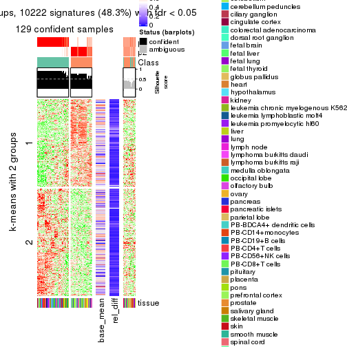</p>

</div>
<div id='tab-MAD-mclust-get-signatures-2'>
<pre><code class="r">get_signatures(res, k = 3)
</code></pre>

<p></p>

</div>
<div id='tab-MAD-mclust-get-signatures-3'>
<pre><code class="r">get_signatures(res, k = 4)
</code></pre>

<p></p>

</div>
<div id='tab-MAD-mclust-get-signatures-4'>
<pre><code class="r">get_signatures(res, k = 5)
</code></pre>

<p></p>

</div>
<div id='tab-MAD-mclust-get-signatures-5'>
<pre><code class="r">get_signatures(res, k = 6)
</code></pre>

<p></p>

</div>
</div>


Signature heatmaps where rows are not scaled:


<script>
$( function() {
	$( '#tabs-MAD-mclust-get-signatures-no-scale' ).tabs();
} );
</script>
<div id='tabs-MAD-mclust-get-signatures-no-scale'>
<ul>
<li><a href='#tab-MAD-mclust-get-signatures-no-scale-1'>k = 2</a></li>
<li><a href='#tab-MAD-mclust-get-signatures-no-scale-2'>k = 3</a></li>
<li><a href='#tab-MAD-mclust-get-signatures-no-scale-3'>k = 4</a></li>
<li><a href='#tab-MAD-mclust-get-signatures-no-scale-4'>k = 5</a></li>
<li><a href='#tab-MAD-mclust-get-signatures-no-scale-5'>k = 6</a></li>
</ul>
<div id='tab-MAD-mclust-get-signatures-no-scale-1'>
<pre><code class="r">get_signatures(res, k = 2, scale_rows = FALSE)
</code></pre>

<p></p>

</div>
<div id='tab-MAD-mclust-get-signatures-no-scale-2'>
<pre><code class="r">get_signatures(res, k = 3, scale_rows = FALSE)
</code></pre>

<p></p>

</div>
<div id='tab-MAD-mclust-get-signatures-no-scale-3'>
<pre><code class="r">get_signatures(res, k = 4, scale_rows = FALSE)
</code></pre>

<p></p>

</div>
<div id='tab-MAD-mclust-get-signatures-no-scale-4'>
<pre><code class="r">get_signatures(res, k = 5, scale_rows = FALSE)
</code></pre>

<p></p>

</div>
<div id='tab-MAD-mclust-get-signatures-no-scale-5'>
<pre><code class="r">get_signatures(res, k = 6, scale_rows = FALSE)
</code></pre>

<p></p>

</div>
</div>


Compare the overlap of signatures from different k:

```r
compare_signatures(res)
```


`get_signature()` returns a data frame invisibly. TO get the list of signatures, the function
call should be assigned to a variable explicitly. In following code, if `plot` argument is set
to `FALSE`, no heatmap is plotted while only the differential analysis is performed.

```r
# code only for demonstration
tb = get_signature(res, k = ..., plot = FALSE)
```

An example of the output of `tb` is:

```
#>   which_row         fdr    mean_1    mean_2 scaled_mean_1 scaled_mean_2 km
#> 1        38 0.042760348  8.373488  9.131774    -0.5533452     0.5164555  1
#> 2        40 0.018707592  7.106213  8.469186    -0.6173731     0.5762149  1
#> 3        55 0.019134737 10.221463 11.207825    -0.6159697     0.5749050  1
#> 4        59 0.006059896  5.921854  7.869574    -0.6899429     0.6439467  1
#> 5        60 0.018055526  8.928898 10.211722    -0.6204761     0.5791110  1
#> 6        98 0.009384629 15.714769 14.887706     0.6635654    -0.6193277  2
...
```

The columns in `tb` are:

1. `which_row`: row indices corresponding to the input matrix.
2. `fdr`: FDR for the differential test. 
3. `mean_x`: The mean value in group x.
4. `scaled_mean_x`: The mean value in group x after rows are scaled.
5. `km`: Row groups if k-means clustering is applied to rows.


UMAP plot which shows how samples are separated.


<script>
$( function() {
	$( '#tabs-MAD-mclust-dimension-reduction' ).tabs();
} );
</script>
<div id='tabs-MAD-mclust-dimension-reduction'>
<ul>
<li><a href='#tab-MAD-mclust-dimension-reduction-1'>k = 2</a></li>
<li><a href='#tab-MAD-mclust-dimension-reduction-2'>k = 3</a></li>
<li><a href='#tab-MAD-mclust-dimension-reduction-3'>k = 4</a></li>
<li><a href='#tab-MAD-mclust-dimension-reduction-4'>k = 5</a></li>
<li><a href='#tab-MAD-mclust-dimension-reduction-5'>k = 6</a></li>
</ul>
<div id='tab-MAD-mclust-dimension-reduction-1'>
<pre><code class="r">dimension_reduction(res, k = 2, method = &quot;UMAP&quot;)
</code></pre>

<p></p>

</div>
<div id='tab-MAD-mclust-dimension-reduction-2'>
<pre><code class="r">dimension_reduction(res, k = 3, method = &quot;UMAP&quot;)
</code></pre>

<p></p>

</div>
<div id='tab-MAD-mclust-dimension-reduction-3'>
<pre><code class="r">dimension_reduction(res, k = 4, method = &quot;UMAP&quot;)
</code></pre>

<p></p>

</div>
<div id='tab-MAD-mclust-dimension-reduction-4'>
<pre><code class="r">dimension_reduction(res, k = 5, method = &quot;UMAP&quot;)
</code></pre>

<p></p>

</div>
<div id='tab-MAD-mclust-dimension-reduction-5'>
<pre><code class="r">dimension_reduction(res, k = 6, method = &quot;UMAP&quot;)
</code></pre>

<p></p>

</div>
</div>


Following heatmap shows how subgroups are split when increasing `k`:

```r
collect_classes(res)
```


Test correlation between subgroups and known annotations. If the known
annotation is numeric, one-way ANOVA test is applied, and if the known
annotation is discrete, chi-squared contingency table test is applied.

```r
test_to_known_factors(res)
```

```
#>              n tissue(p) k
#> MAD:mclust 129  5.75e-06 2
#> MAD:mclust 142  1.59e-11 3
#> MAD:mclust 154  1.39e-16 4
#> MAD:mclust 132  3.88e-18 5
#> MAD:mclust 109  1.94e-17 6
```


If matrix rows can be associated to genes, consider to use `functional_enrichment(res,
...)` to perform function enrichment for the signature genes. See [this vignette](http://bioconductor.org/packages/devel/bioc/vignettes/cola/inst/doc/functional_enrichment.html) for more detailed explanations.


 

---------------------------------------------------


### MAD:NMF**


The object with results only for a single top-value method and a single partition method 
can be extracted as:

```r
res = res_list["MAD", "NMF"]
# you can also extract it by
# res = res_list["MAD:NMF"]
```

A summary of `res` and all the functions that can be applied to it:

```r
res
```

```
#> A 'ConsensusPartition' object with k = 2, 3, 4, 5, 6.
#>   On a matrix with 21168 rows and 158 columns.
#>   Top rows (1000, 2000, 3000, 4000, 5000) are extracted by 'MAD' method.
#>   Subgroups are detected by 'NMF' method.
#>   Performed in total 1250 partitions by row resampling.
#>   Best k for subgroups seems to be 3.
#> 
#> Following methods can be applied to this 'ConsensusPartition' object:
#>  [1] "cola_report"             "collect_classes"         "collect_plots"          
#>  [4] "collect_stats"           "colnames"                "compare_signatures"     
#>  [7] "consensus_heatmap"       "dimension_reduction"     "functional_enrichment"  
#> [10] "get_anno_col"            "get_anno"                "get_classes"            
#> [13] "get_consensus"           "get_matrix"              "get_membership"         
#> [16] "get_param"               "get_signatures"          "get_stats"              
#> [19] "is_best_k"               "is_stable_k"             "membership_heatmap"     
#> [22] "ncol"                    "nrow"                    "plot_ecdf"              
#> [25] "rownames"                "select_partition_number" "show"                   
#> [28] "suggest_best_k"          "test_to_known_factors"
```

`collect_plots()` function collects all the plots made from `res` for all `k` (number of partitions)
into one single page to provide an easy and fast comparison between different `k`.

```r
collect_plots(res)
```


The plots are:

- The first row: a plot of the ECDF (empirical cumulative distribution
  function) curves of the consensus matrix for each `k` and the heatmap of
  predicted classes for each `k`.
- The second row: heatmaps of the consensus matrix for each `k`.
- The third row: heatmaps of the membership matrix for each `k`.
- The fouth row: heatmaps of the signatures for each `k`.

All the plots in panels can be made by individual functions and they are
plotted later in this section.

`select_partition_number()` produces several plots showing different
statistics for choosing "optimized" `k`. There are following statistics:

- ECDF curves of the consensus matrix for each `k`;
- 1-PAC. [The PAC
  score](https://en.wikipedia.org/wiki/Consensus_clustering#Over-interpretation_potential_of_consensus_clustering)
  measures the proportion of the ambiguous subgrouping.
- Mean silhouette score.
- Concordance. The mean probability of fiting the consensus class ids in all
  partitions.
- Area increased. Denote $A_k$ as the area under the ECDF curve for current
  `k`, the area increased is defined as $A_k - A_{k-1}$.
- Rand index. The percent of pairs of samples that are both in a same cluster
  or both are not in a same cluster in the partition of k and k-1.
- Jaccard index. The ratio of pairs of samples are both in a same cluster in
  the partition of k and k-1 and the pairs of samples are both in a same
  cluster in the partition k or k-1.

The detailed explanations of these statistics can be found in [the _cola_
vignette](http://bioconductor.org/packages/devel/bioc/vignettes/cola/inst/doc/cola.html#toc_13).

Generally speaking, lower PAC score, higher mean silhouette score or higher
concordance corresponds to better partition. Rand index and Jaccard index
measure how similar the current partition is compared to partition with `k-1`.
If they are too similar, we won't accept `k` is better than `k-1`.

```r
select_partition_number(res)
```


The numeric values for all these statistics can be obtained by `get_stats()`.

```r
get_stats(res)
```

```
#>   k 1-PAC mean_silhouette concordance area_increased  Rand Jaccard
#> 2 2 0.947           0.947       0.978         0.4812 0.520   0.520
#> 3 3 0.990           0.956       0.982         0.3348 0.688   0.476
#> 4 4 0.777           0.829       0.881         0.1622 0.877   0.661
#> 5 5 0.839           0.829       0.911         0.0687 0.911   0.667
#> 6 6 0.824           0.729       0.833         0.0323 0.940   0.721
```

`suggest_best_k()` suggests the best $k$ based on these statistics. The rules are as follows:

- All $k$ with Jaccard index larger than 0.95 are removed because increasing
  $k$ does not provide enough extra information. If all $k$ are removed, it is
  marked as no subgroup is detected.
- For all $k$ with 1-PAC score larger than 0.9, the maximal $k$ is taken as
  the best $k$, and other $k$ are marked as optional $k$.
- If it does not fit the second rule. The $k$ with the maximal vote of the
  highest 1-PAC score, highest mean silhouette, and highest concordance is
  taken as the best $k$.

```r
suggest_best_k(res)
```

```
#> [1] 3
#> attr(,"optional")
#> [1] 2
```

There is also optional best $k$ = 2 that is worth to check.

Following shows the table of the partitions (You need to click the **show/hide
code output** link to see it). The membership matrix (columns with name `p*`)
is inferred by
[`clue::cl_consensus()`](https://www.rdocumentation.org/link/cl_consensus?package=clue)
function with the `SE` method. Basically the value in the membership matrix
represents the probability to belong to a certain group. The finall class
label for an item is determined with the group with highest probability it
belongs to.

In `get_classes()` function, the entropy is calculated from the membership
matrix and the silhouette score is calculated from the consensus matrix.


<script>
$( function() {
	$( '#tabs-MAD-NMF-get-classes' ).tabs();
} );
</script>
<div id='tabs-MAD-NMF-get-classes'>
<ul>
<li><a href='#tab-MAD-NMF-get-classes-1'>k = 2</a></li>
<li><a href='#tab-MAD-NMF-get-classes-2'>k = 3</a></li>
<li><a href='#tab-MAD-NMF-get-classes-3'>k = 4</a></li>
<li><a href='#tab-MAD-NMF-get-classes-4'>k = 5</a></li>
<li><a href='#tab-MAD-NMF-get-classes-5'>k = 6</a></li>
</ul>

<div id='tab-MAD-NMF-get-classes-1'>
<p><a id='tab-MAD-NMF-get-classes-1-a' style='color:#0366d6' href='#'>show/hide code output</a></p>
<pre><code class="r">cbind(get_classes(res, k = 2), get_membership(res, k = 2))
</code></pre>

<pre><code>#&gt;          class entropy silhouette    p1    p2
#&gt; GSM18927     2  0.0000      0.977 0.000 1.000
#&gt; GSM18928     2  0.0000      0.977 0.000 1.000
#&gt; GSM18915     2  0.0000      0.977 0.000 1.000
#&gt; GSM18916     2  0.0000      0.977 0.000 1.000
#&gt; GSM18939     2  0.0000      0.977 0.000 1.000
#&gt; GSM18940     2  0.0000      0.977 0.000 1.000
#&gt; GSM18933     2  0.0000      0.977 0.000 1.000
#&gt; GSM18934     2  0.0000      0.977 0.000 1.000
#&gt; GSM18925     2  0.0000      0.977 0.000 1.000
#&gt; GSM18926     2  0.0000      0.977 0.000 1.000
#&gt; GSM18931     2  0.0000      0.977 0.000 1.000
#&gt; GSM18932     2  0.0000      0.977 0.000 1.000
#&gt; GSM19019     2  0.0000      0.977 0.000 1.000
#&gt; GSM19020     2  0.0000      0.977 0.000 1.000
#&gt; GSM18923     2  0.0000      0.977 0.000 1.000
#&gt; GSM18924     2  0.0000      0.977 0.000 1.000
#&gt; GSM18941     2  0.0000      0.977 0.000 1.000
#&gt; GSM18942     2  0.0000      0.977 0.000 1.000
#&gt; GSM18929     2  0.0000      0.977 0.000 1.000
#&gt; GSM18930     2  0.0000      0.977 0.000 1.000
#&gt; GSM18911     2  0.0000      0.977 0.000 1.000
#&gt; GSM18912     2  0.0000      0.977 0.000 1.000
#&gt; GSM18935     2  0.0000      0.977 0.000 1.000
#&gt; GSM18936     2  0.0000      0.977 0.000 1.000
#&gt; GSM19005     2  0.0000      0.977 0.000 1.000
#&gt; GSM19006     2  0.0000      0.977 0.000 1.000
#&gt; GSM18921     2  0.0000      0.977 0.000 1.000
#&gt; GSM18922     2  0.0000      0.977 0.000 1.000
#&gt; GSM18919     2  0.0000      0.977 0.000 1.000
#&gt; GSM18920     2  0.0000      0.977 0.000 1.000
#&gt; GSM18917     2  0.0000      0.977 0.000 1.000
#&gt; GSM18918     2  0.0000      0.977 0.000 1.000
#&gt; GSM18913     2  0.0000      0.977 0.000 1.000
#&gt; GSM18914     2  0.0000      0.977 0.000 1.000
#&gt; GSM18937     2  0.0000      0.977 0.000 1.000
#&gt; GSM18938     2  0.0000      0.977 0.000 1.000
#&gt; GSM18943     2  0.0000      0.977 0.000 1.000
#&gt; GSM18944     2  0.0000      0.977 0.000 1.000
#&gt; GSM19003     2  0.0000      0.977 0.000 1.000
#&gt; GSM19004     2  0.0000      0.977 0.000 1.000
#&gt; GSM19011     2  0.0000      0.977 0.000 1.000
#&gt; GSM19012     2  0.0000      0.977 0.000 1.000
#&gt; GSM19009     2  0.0000      0.977 0.000 1.000
#&gt; GSM19010     2  0.0000      0.977 0.000 1.000
#&gt; GSM18945     2  0.0000      0.977 0.000 1.000
#&gt; GSM18946     2  0.0000      0.977 0.000 1.000
#&gt; GSM18963     2  0.0000      0.977 0.000 1.000
#&gt; GSM18964     2  0.2423      0.945 0.040 0.960
#&gt; GSM18905     2  0.0938      0.969 0.012 0.988
#&gt; GSM18906     1  0.0672      0.971 0.992 0.008
#&gt; GSM18965     1  0.0376      0.974 0.996 0.004
#&gt; GSM18966     1  0.0376      0.974 0.996 0.004
#&gt; GSM18873     1  0.0000      0.977 1.000 0.000
#&gt; GSM18874     1  0.0000      0.977 1.000 0.000
#&gt; GSM18973     1  0.0000      0.977 1.000 0.000
#&gt; GSM18974     1  0.0000      0.977 1.000 0.000
#&gt; GSM18977     1  0.0000      0.977 1.000 0.000
#&gt; GSM18978     2  0.5737      0.843 0.136 0.864
#&gt; GSM18979     1  0.9248      0.481 0.660 0.340
#&gt; GSM18980     2  0.9427      0.447 0.360 0.640
#&gt; GSM18883     1  0.0000      0.977 1.000 0.000
#&gt; GSM18884     1  0.0000      0.977 1.000 0.000
#&gt; GSM18885     1  0.0000      0.977 1.000 0.000
#&gt; GSM18886     1  0.0000      0.977 1.000 0.000
#&gt; GSM18907     1  0.0000      0.977 1.000 0.000
#&gt; GSM18908     1  0.0000      0.977 1.000 0.000
#&gt; GSM18909     1  0.0000      0.977 1.000 0.000
#&gt; GSM18910     1  0.0000      0.977 1.000 0.000
#&gt; GSM18867     1  0.0000      0.977 1.000 0.000
#&gt; GSM18868     1  0.0000      0.977 1.000 0.000
#&gt; GSM18947     2  0.0000      0.977 0.000 1.000
#&gt; GSM18948     2  0.0000      0.977 0.000 1.000
#&gt; GSM18995     2  0.0000      0.977 0.000 1.000
#&gt; GSM18996     2  0.0000      0.977 0.000 1.000
#&gt; GSM18975     2  0.0000      0.977 0.000 1.000
#&gt; GSM18976     2  0.0376      0.974 0.004 0.996
#&gt; GSM18997     2  0.0000      0.977 0.000 1.000
#&gt; GSM18998     2  0.0000      0.977 0.000 1.000
#&gt; GSM18967     1  0.1843      0.953 0.972 0.028
#&gt; GSM18968     1  0.5294      0.855 0.880 0.120
#&gt; GSM18959     2  0.0376      0.974 0.004 0.996
#&gt; GSM18960     2  0.0938      0.969 0.012 0.988
#&gt; GSM19015     2  0.0000      0.977 0.000 1.000
#&gt; GSM19016     2  0.0000      0.977 0.000 1.000
#&gt; GSM18957     2  0.2043      0.952 0.032 0.968
#&gt; GSM18958     1  0.2948      0.931 0.948 0.052
#&gt; GSM18981     2  0.0938      0.969 0.012 0.988
#&gt; GSM18982     2  0.5629      0.848 0.132 0.868
#&gt; GSM18989     2  0.0000      0.977 0.000 1.000
#&gt; GSM18990     2  0.6148      0.823 0.152 0.848
#&gt; GSM18985     2  0.9954      0.149 0.460 0.540
#&gt; GSM18986     2  0.0000      0.977 0.000 1.000
#&gt; GSM18987     2  0.0672      0.972 0.008 0.992
#&gt; GSM18988     2  0.0672      0.972 0.008 0.992
#&gt; GSM18983     2  0.0000      0.977 0.000 1.000
#&gt; GSM18984     2  0.0000      0.977 0.000 1.000
#&gt; GSM18951     2  0.0000      0.977 0.000 1.000
#&gt; GSM18952     2  0.1184      0.965 0.016 0.984
#&gt; GSM19007     2  0.0000      0.977 0.000 1.000
#&gt; GSM19008     2  0.0000      0.977 0.000 1.000
#&gt; GSM18999     2  0.0000      0.977 0.000 1.000
#&gt; GSM19000     2  0.0000      0.977 0.000 1.000
#&gt; GSM18889     1  0.0000      0.977 1.000 0.000
#&gt; GSM18890     1  0.0000      0.977 1.000 0.000
#&gt; GSM18881     1  0.0000      0.977 1.000 0.000
#&gt; GSM18882     1  0.0000      0.977 1.000 0.000
#&gt; GSM18877     1  0.0000      0.977 1.000 0.000
#&gt; GSM18878     1  0.0000      0.977 1.000 0.000
#&gt; GSM18875     1  0.0000      0.977 1.000 0.000
#&gt; GSM18876     1  0.0000      0.977 1.000 0.000
#&gt; GSM18879     1  0.0000      0.977 1.000 0.000
#&gt; GSM18880     1  0.0000      0.977 1.000 0.000
#&gt; GSM18871     1  0.0000      0.977 1.000 0.000
#&gt; GSM18872     1  0.0000      0.977 1.000 0.000
#&gt; GSM18903     1  0.0000      0.977 1.000 0.000
#&gt; GSM18904     1  0.0000      0.977 1.000 0.000
#&gt; GSM18949     1  0.0672      0.971 0.992 0.008
#&gt; GSM18950     1  0.0376      0.974 0.996 0.004
#&gt; GSM18953     2  0.0000      0.977 0.000 1.000
#&gt; GSM18954     2  0.5629      0.849 0.132 0.868
#&gt; GSM19013     2  0.0000      0.977 0.000 1.000
#&gt; GSM19014     2  0.0000      0.977 0.000 1.000
#&gt; GSM18971     1  0.0000      0.977 1.000 0.000
#&gt; GSM18972     1  0.0000      0.977 1.000 0.000
#&gt; GSM18969     1  0.0000      0.977 1.000 0.000
#&gt; GSM18970     1  0.9732      0.314 0.596 0.404
#&gt; GSM18869     1  0.0000      0.977 1.000 0.000
#&gt; GSM18870     1  0.0000      0.977 1.000 0.000
#&gt; GSM19017     2  0.0000      0.977 0.000 1.000
#&gt; GSM19018     2  0.0000      0.977 0.000 1.000
#&gt; GSM18991     1  0.9323      0.460 0.652 0.348
#&gt; GSM18992     2  0.7376      0.745 0.208 0.792
#&gt; GSM19021     2  0.0000      0.977 0.000 1.000
#&gt; GSM19022     2  0.0000      0.977 0.000 1.000
#&gt; GSM19001     2  0.0000      0.977 0.000 1.000
#&gt; GSM19002     2  0.0000      0.977 0.000 1.000
#&gt; GSM18899     1  0.0000      0.977 1.000 0.000
#&gt; GSM18900     1  0.0000      0.977 1.000 0.000
#&gt; GSM18961     1  0.3114      0.927 0.944 0.056
#&gt; GSM18962     2  0.3733      0.915 0.072 0.928
#&gt; GSM18901     1  0.0000      0.977 1.000 0.000
#&gt; GSM18902     1  0.0000      0.977 1.000 0.000
#&gt; GSM18993     2  0.2778      0.938 0.048 0.952
#&gt; GSM18994     2  0.8813      0.582 0.300 0.700
#&gt; GSM18865     1  0.0000      0.977 1.000 0.000
#&gt; GSM18866     1  0.0000      0.977 1.000 0.000
#&gt; GSM18897     1  0.0000      0.977 1.000 0.000
#&gt; GSM18898     1  0.0000      0.977 1.000 0.000
#&gt; GSM18887     1  0.0000      0.977 1.000 0.000
#&gt; GSM18888     1  0.0000      0.977 1.000 0.000
#&gt; GSM18893     1  0.0000      0.977 1.000 0.000
#&gt; GSM18894     1  0.0000      0.977 1.000 0.000
#&gt; GSM18895     1  0.0000      0.977 1.000 0.000
#&gt; GSM18896     1  0.0000      0.977 1.000 0.000
#&gt; GSM18891     1  0.0000      0.977 1.000 0.000
#&gt; GSM18892     1  0.0000      0.977 1.000 0.000
#&gt; GSM18955     2  0.0000      0.977 0.000 1.000
#&gt; GSM18956     2  0.0000      0.977 0.000 1.000
</code></pre>

<script>
$('#tab-MAD-NMF-get-classes-1-a').parent().next().next().hide();
$('#tab-MAD-NMF-get-classes-1-a').click(function(){
  $('#tab-MAD-NMF-get-classes-1-a').parent().next().next().toggle();
  return(false);
});
</script>
</div>

<div id='tab-MAD-NMF-get-classes-2'>
<p><a id='tab-MAD-NMF-get-classes-2-a' style='color:#0366d6' href='#'>show/hide code output</a></p>
<pre><code class="r">cbind(get_classes(res, k = 3), get_membership(res, k = 3))
</code></pre>

<pre><code>#&gt;          class entropy silhouette    p1    p2    p3
#&gt; GSM18927     3  0.0000      1.000 0.000 0.000 1.000
#&gt; GSM18928     3  0.0000      1.000 0.000 0.000 1.000
#&gt; GSM18915     3  0.0000      1.000 0.000 0.000 1.000
#&gt; GSM18916     3  0.0000      1.000 0.000 0.000 1.000
#&gt; GSM18939     3  0.0000      1.000 0.000 0.000 1.000
#&gt; GSM18940     3  0.0000      1.000 0.000 0.000 1.000
#&gt; GSM18933     3  0.0000      1.000 0.000 0.000 1.000
#&gt; GSM18934     3  0.0000      1.000 0.000 0.000 1.000
#&gt; GSM18925     3  0.0000      1.000 0.000 0.000 1.000
#&gt; GSM18926     3  0.0000      1.000 0.000 0.000 1.000
#&gt; GSM18931     3  0.0000      1.000 0.000 0.000 1.000
#&gt; GSM18932     3  0.0000      1.000 0.000 0.000 1.000
#&gt; GSM19019     2  0.1753      0.936 0.000 0.952 0.048
#&gt; GSM19020     2  0.1643      0.940 0.000 0.956 0.044
#&gt; GSM18923     3  0.0000      1.000 0.000 0.000 1.000
#&gt; GSM18924     3  0.0000      1.000 0.000 0.000 1.000
#&gt; GSM18941     3  0.0000      1.000 0.000 0.000 1.000
#&gt; GSM18942     3  0.0000      1.000 0.000 0.000 1.000
#&gt; GSM18929     3  0.0000      1.000 0.000 0.000 1.000
#&gt; GSM18930     3  0.0000      1.000 0.000 0.000 1.000
#&gt; GSM18911     3  0.0000      1.000 0.000 0.000 1.000
#&gt; GSM18912     3  0.0000      1.000 0.000 0.000 1.000
#&gt; GSM18935     3  0.0000      1.000 0.000 0.000 1.000
#&gt; GSM18936     3  0.0000      1.000 0.000 0.000 1.000
#&gt; GSM19005     2  0.0000      0.979 0.000 1.000 0.000
#&gt; GSM19006     2  0.0000      0.979 0.000 1.000 0.000
#&gt; GSM18921     3  0.0000      1.000 0.000 0.000 1.000
#&gt; GSM18922     3  0.0000      1.000 0.000 0.000 1.000
#&gt; GSM18919     3  0.0000      1.000 0.000 0.000 1.000
#&gt; GSM18920     3  0.0000      1.000 0.000 0.000 1.000
#&gt; GSM18917     3  0.0000      1.000 0.000 0.000 1.000
#&gt; GSM18918     3  0.0000      1.000 0.000 0.000 1.000
#&gt; GSM18913     3  0.0000      1.000 0.000 0.000 1.000
#&gt; GSM18914     3  0.0000      1.000 0.000 0.000 1.000
#&gt; GSM18937     3  0.0000      1.000 0.000 0.000 1.000
#&gt; GSM18938     3  0.0000      1.000 0.000 0.000 1.000
#&gt; GSM18943     3  0.0000      1.000 0.000 0.000 1.000
#&gt; GSM18944     3  0.0000      1.000 0.000 0.000 1.000
#&gt; GSM19003     2  0.0000      0.979 0.000 1.000 0.000
#&gt; GSM19004     2  0.0000      0.979 0.000 1.000 0.000
#&gt; GSM19011     2  0.0237      0.976 0.000 0.996 0.004
#&gt; GSM19012     2  0.0747      0.966 0.000 0.984 0.016
#&gt; GSM19009     2  0.0237      0.976 0.000 0.996 0.004
#&gt; GSM19010     2  0.0237      0.976 0.000 0.996 0.004
#&gt; GSM18945     3  0.0000      1.000 0.000 0.000 1.000
#&gt; GSM18946     3  0.0000      1.000 0.000 0.000 1.000
#&gt; GSM18963     2  0.0000      0.979 0.000 1.000 0.000
#&gt; GSM18964     2  0.0000      0.979 0.000 1.000 0.000
#&gt; GSM18905     2  0.0000      0.979 0.000 1.000 0.000
#&gt; GSM18906     2  0.0000      0.979 0.000 1.000 0.000
#&gt; GSM18965     2  0.0000      0.979 0.000 1.000 0.000
#&gt; GSM18966     2  0.0000      0.979 0.000 1.000 0.000
#&gt; GSM18873     1  0.0000      0.964 1.000 0.000 0.000
#&gt; GSM18874     1  0.0000      0.964 1.000 0.000 0.000
#&gt; GSM18973     1  0.0000      0.964 1.000 0.000 0.000
#&gt; GSM18974     1  0.0424      0.958 0.992 0.008 0.000
#&gt; GSM18977     2  0.0000      0.979 0.000 1.000 0.000
#&gt; GSM18978     2  0.0000      0.979 0.000 1.000 0.000
#&gt; GSM18979     2  0.0000      0.979 0.000 1.000 0.000
#&gt; GSM18980     2  0.5656      0.784 0.128 0.804 0.068
#&gt; GSM18883     1  0.0000      0.964 1.000 0.000 0.000
#&gt; GSM18884     1  0.0000      0.964 1.000 0.000 0.000
#&gt; GSM18885     1  0.0000      0.964 1.000 0.000 0.000
#&gt; GSM18886     1  0.0000      0.964 1.000 0.000 0.000
#&gt; GSM18907     1  0.0000      0.964 1.000 0.000 0.000
#&gt; GSM18908     1  0.0000      0.964 1.000 0.000 0.000
#&gt; GSM18909     1  0.4750      0.725 0.784 0.216 0.000
#&gt; GSM18910     1  0.5882      0.476 0.652 0.348 0.000
#&gt; GSM18867     1  0.0000      0.964 1.000 0.000 0.000
#&gt; GSM18868     1  0.0000      0.964 1.000 0.000 0.000
#&gt; GSM18947     2  0.0000      0.979 0.000 1.000 0.000
#&gt; GSM18948     2  0.0000      0.979 0.000 1.000 0.000
#&gt; GSM18995     2  0.0000      0.979 0.000 1.000 0.000
#&gt; GSM18996     2  0.0000      0.979 0.000 1.000 0.000
#&gt; GSM18975     2  0.0000      0.979 0.000 1.000 0.000
#&gt; GSM18976     2  0.0000      0.979 0.000 1.000 0.000
#&gt; GSM18997     2  0.0000      0.979 0.000 1.000 0.000
#&gt; GSM18998     2  0.0000      0.979 0.000 1.000 0.000
#&gt; GSM18967     2  0.0000      0.979 0.000 1.000 0.000
#&gt; GSM18968     2  0.0000      0.979 0.000 1.000 0.000
#&gt; GSM18959     2  0.0000      0.979 0.000 1.000 0.000
#&gt; GSM18960     2  0.0000      0.979 0.000 1.000 0.000
#&gt; GSM19015     2  0.0000      0.979 0.000 1.000 0.000
#&gt; GSM19016     2  0.0000      0.979 0.000 1.000 0.000
#&gt; GSM18957     2  0.0000      0.979 0.000 1.000 0.000
#&gt; GSM18958     2  0.0000      0.979 0.000 1.000 0.000
#&gt; GSM18981     2  0.0000      0.979 0.000 1.000 0.000
#&gt; GSM18982     2  0.0000      0.979 0.000 1.000 0.000
#&gt; GSM18989     2  0.0000      0.979 0.000 1.000 0.000
#&gt; GSM18990     2  0.1765      0.941 0.040 0.956 0.004
#&gt; GSM18985     2  0.4805      0.772 0.176 0.812 0.012
#&gt; GSM18986     2  0.0000      0.979 0.000 1.000 0.000
#&gt; GSM18987     2  0.0000      0.979 0.000 1.000 0.000
#&gt; GSM18988     2  0.0000      0.979 0.000 1.000 0.000
#&gt; GSM18983     2  0.0000      0.979 0.000 1.000 0.000
#&gt; GSM18984     2  0.0000      0.979 0.000 1.000 0.000
#&gt; GSM18951     2  0.0000      0.979 0.000 1.000 0.000
#&gt; GSM18952     2  0.0000      0.979 0.000 1.000 0.000
#&gt; GSM19007     2  0.0000      0.979 0.000 1.000 0.000
#&gt; GSM19008     2  0.0000      0.979 0.000 1.000 0.000
#&gt; GSM18999     2  0.0000      0.979 0.000 1.000 0.000
#&gt; GSM19000     2  0.0000      0.979 0.000 1.000 0.000
#&gt; GSM18889     1  0.0000      0.964 1.000 0.000 0.000
#&gt; GSM18890     1  0.0000      0.964 1.000 0.000 0.000
#&gt; GSM18881     1  0.0000      0.964 1.000 0.000 0.000
#&gt; GSM18882     1  0.0000      0.964 1.000 0.000 0.000
#&gt; GSM18877     1  0.0000      0.964 1.000 0.000 0.000
#&gt; GSM18878     1  0.0000      0.964 1.000 0.000 0.000
#&gt; GSM18875     1  0.0000      0.964 1.000 0.000 0.000
#&gt; GSM18876     1  0.0000      0.964 1.000 0.000 0.000
#&gt; GSM18879     1  0.0000      0.964 1.000 0.000 0.000
#&gt; GSM18880     1  0.0000      0.964 1.000 0.000 0.000
#&gt; GSM18871     1  0.0000      0.964 1.000 0.000 0.000
#&gt; GSM18872     1  0.0000      0.964 1.000 0.000 0.000
#&gt; GSM18903     1  0.5254      0.647 0.736 0.264 0.000
#&gt; GSM18904     1  0.6168      0.310 0.588 0.412 0.000
#&gt; GSM18949     2  0.0000      0.979 0.000 1.000 0.000
#&gt; GSM18950     2  0.0000      0.979 0.000 1.000 0.000
#&gt; GSM18953     2  0.0000      0.979 0.000 1.000 0.000
#&gt; GSM18954     2  0.0000      0.979 0.000 1.000 0.000
#&gt; GSM19013     2  0.0000      0.979 0.000 1.000 0.000
#&gt; GSM19014     2  0.0000      0.979 0.000 1.000 0.000
#&gt; GSM18971     2  0.6274      0.137 0.456 0.544 0.000
#&gt; GSM18972     2  0.5016      0.678 0.240 0.760 0.000
#&gt; GSM18969     2  0.5098      0.665 0.248 0.752 0.000
#&gt; GSM18970     2  0.0000      0.979 0.000 1.000 0.000
#&gt; GSM18869     1  0.0000      0.964 1.000 0.000 0.000
#&gt; GSM18870     1  0.0000      0.964 1.000 0.000 0.000
#&gt; GSM19017     2  0.0000      0.979 0.000 1.000 0.000
#&gt; GSM19018     2  0.0000      0.979 0.000 1.000 0.000
#&gt; GSM18991     2  0.0000      0.979 0.000 1.000 0.000
#&gt; GSM18992     2  0.0000      0.979 0.000 1.000 0.000
#&gt; GSM19021     3  0.0000      1.000 0.000 0.000 1.000
#&gt; GSM19022     3  0.0000      1.000 0.000 0.000 1.000
#&gt; GSM19001     2  0.0000      0.979 0.000 1.000 0.000
#&gt; GSM19002     2  0.0000      0.979 0.000 1.000 0.000
#&gt; GSM18899     1  0.0747      0.951 0.984 0.016 0.000
#&gt; GSM18900     1  0.1529      0.929 0.960 0.040 0.000
#&gt; GSM18961     2  0.0000      0.979 0.000 1.000 0.000
#&gt; GSM18962     2  0.0000      0.979 0.000 1.000 0.000
#&gt; GSM18901     1  0.0424      0.958 0.992 0.008 0.000
#&gt; GSM18902     1  0.1643      0.925 0.956 0.044 0.000
#&gt; GSM18993     2  0.0000      0.979 0.000 1.000 0.000
#&gt; GSM18994     2  0.0000      0.979 0.000 1.000 0.000
#&gt; GSM18865     1  0.0000      0.964 1.000 0.000 0.000
#&gt; GSM18866     1  0.0000      0.964 1.000 0.000 0.000
#&gt; GSM18897     1  0.0000      0.964 1.000 0.000 0.000
#&gt; GSM18898     1  0.0000      0.964 1.000 0.000 0.000
#&gt; GSM18887     1  0.0000      0.964 1.000 0.000 0.000
#&gt; GSM18888     1  0.0000      0.964 1.000 0.000 0.000
#&gt; GSM18893     1  0.0000      0.964 1.000 0.000 0.000
#&gt; GSM18894     1  0.0000      0.964 1.000 0.000 0.000
#&gt; GSM18895     1  0.0000      0.964 1.000 0.000 0.000
#&gt; GSM18896     1  0.0000      0.964 1.000 0.000 0.000
#&gt; GSM18891     1  0.0000      0.964 1.000 0.000 0.000
#&gt; GSM18892     1  0.0000      0.964 1.000 0.000 0.000
#&gt; GSM18955     2  0.0000      0.979 0.000 1.000 0.000
#&gt; GSM18956     2  0.0000      0.979 0.000 1.000 0.000
</code></pre>

<script>
$('#tab-MAD-NMF-get-classes-2-a').parent().next().next().hide();
$('#tab-MAD-NMF-get-classes-2-a').click(function(){
  $('#tab-MAD-NMF-get-classes-2-a').parent().next().next().toggle();
  return(false);
});
</script>
</div>

<div id='tab-MAD-NMF-get-classes-3'>
<p><a id='tab-MAD-NMF-get-classes-3-a' style='color:#0366d6' href='#'>show/hide code output</a></p>
<pre><code class="r">cbind(get_classes(res, k = 4), get_membership(res, k = 4))
</code></pre>

<pre><code>#&gt;          class entropy silhouette    p1    p2    p3    p4
#&gt; GSM18927     3  0.0000     0.9923 0.000 0.000 1.000 0.000
#&gt; GSM18928     3  0.0000     0.9923 0.000 0.000 1.000 0.000
#&gt; GSM18915     3  0.0000     0.9923 0.000 0.000 1.000 0.000
#&gt; GSM18916     3  0.0188     0.9913 0.000 0.004 0.996 0.000
#&gt; GSM18939     3  0.0336     0.9896 0.000 0.008 0.992 0.000
#&gt; GSM18940     3  0.0000     0.9923 0.000 0.000 1.000 0.000
#&gt; GSM18933     3  0.0000     0.9923 0.000 0.000 1.000 0.000
#&gt; GSM18934     3  0.0000     0.9923 0.000 0.000 1.000 0.000
#&gt; GSM18925     3  0.0188     0.9913 0.000 0.004 0.996 0.000
#&gt; GSM18926     3  0.0188     0.9913 0.000 0.004 0.996 0.000
#&gt; GSM18931     3  0.0000     0.9923 0.000 0.000 1.000 0.000
#&gt; GSM18932     3  0.0000     0.9923 0.000 0.000 1.000 0.000
#&gt; GSM19019     4  0.1557     0.8435 0.000 0.056 0.000 0.944
#&gt; GSM19020     4  0.4546     0.5871 0.000 0.256 0.012 0.732
#&gt; GSM18923     3  0.0336     0.9896 0.000 0.008 0.992 0.000
#&gt; GSM18924     3  0.0188     0.9913 0.000 0.004 0.996 0.000
#&gt; GSM18941     3  0.1474     0.9531 0.000 0.052 0.948 0.000
#&gt; GSM18942     3  0.2589     0.8825 0.000 0.116 0.884 0.000
#&gt; GSM18929     3  0.0000     0.9923 0.000 0.000 1.000 0.000
#&gt; GSM18930     3  0.0000     0.9923 0.000 0.000 1.000 0.000
#&gt; GSM18911     3  0.0469     0.9872 0.000 0.012 0.988 0.000
#&gt; GSM18912     3  0.1211     0.9643 0.000 0.040 0.960 0.000
#&gt; GSM18935     3  0.0000     0.9923 0.000 0.000 1.000 0.000
#&gt; GSM18936     3  0.0000     0.9923 0.000 0.000 1.000 0.000
#&gt; GSM19005     2  0.2760     0.8612 0.000 0.872 0.000 0.128
#&gt; GSM19006     2  0.2704     0.8599 0.000 0.876 0.000 0.124
#&gt; GSM18921     3  0.0000     0.9923 0.000 0.000 1.000 0.000
#&gt; GSM18922     3  0.0336     0.9879 0.000 0.000 0.992 0.008
#&gt; GSM18919     3  0.0000     0.9923 0.000 0.000 1.000 0.000
#&gt; GSM18920     3  0.0000     0.9923 0.000 0.000 1.000 0.000
#&gt; GSM18917     3  0.0000     0.9923 0.000 0.000 1.000 0.000
#&gt; GSM18918     3  0.0000     0.9923 0.000 0.000 1.000 0.000
#&gt; GSM18913     3  0.0469     0.9872 0.000 0.012 0.988 0.000
#&gt; GSM18914     3  0.0336     0.9896 0.000 0.008 0.992 0.000
#&gt; GSM18937     3  0.0188     0.9913 0.000 0.004 0.996 0.000
#&gt; GSM18938     3  0.0336     0.9896 0.000 0.008 0.992 0.000
#&gt; GSM18943     3  0.0000     0.9923 0.000 0.000 1.000 0.000
#&gt; GSM18944     3  0.0000     0.9923 0.000 0.000 1.000 0.000
#&gt; GSM19003     2  0.3356     0.8575 0.000 0.824 0.000 0.176
#&gt; GSM19004     2  0.2973     0.8646 0.000 0.856 0.000 0.144
#&gt; GSM19011     2  0.2647     0.8584 0.000 0.880 0.000 0.120
#&gt; GSM19012     2  0.2868     0.8633 0.000 0.864 0.000 0.136
#&gt; GSM19009     2  0.3123     0.8643 0.000 0.844 0.000 0.156
#&gt; GSM19010     2  0.3024     0.8647 0.000 0.852 0.000 0.148
#&gt; GSM18945     3  0.0000     0.9923 0.000 0.000 1.000 0.000
#&gt; GSM18946     3  0.0000     0.9923 0.000 0.000 1.000 0.000
#&gt; GSM18963     4  0.3610     0.6939 0.000 0.200 0.000 0.800
#&gt; GSM18964     4  0.1557     0.8447 0.000 0.056 0.000 0.944
#&gt; GSM18905     2  0.3942     0.8093 0.000 0.764 0.000 0.236
#&gt; GSM18906     4  0.4999     0.0497 0.000 0.492 0.000 0.508
#&gt; GSM18965     4  0.0336     0.8459 0.000 0.008 0.000 0.992
#&gt; GSM18966     4  0.0469     0.8447 0.000 0.012 0.000 0.988
#&gt; GSM18873     1  0.0000     0.8983 1.000 0.000 0.000 0.000
#&gt; GSM18874     1  0.0000     0.8983 1.000 0.000 0.000 0.000
#&gt; GSM18973     1  0.6845     0.2038 0.452 0.100 0.000 0.448
#&gt; GSM18974     4  0.6805    -0.0594 0.400 0.100 0.000 0.500
#&gt; GSM18977     4  0.1716     0.8420 0.000 0.064 0.000 0.936
#&gt; GSM18978     4  0.3123     0.7611 0.000 0.156 0.000 0.844
#&gt; GSM18979     4  0.2011     0.8338 0.000 0.080 0.000 0.920
#&gt; GSM18980     4  0.2910     0.7808 0.044 0.020 0.028 0.908
#&gt; GSM18883     1  0.1637     0.8939 0.940 0.060 0.000 0.000
#&gt; GSM18884     1  0.2760     0.8811 0.872 0.128 0.000 0.000
#&gt; GSM18885     1  0.0469     0.8987 0.988 0.012 0.000 0.000
#&gt; GSM18886     1  0.0592     0.8990 0.984 0.016 0.000 0.000
#&gt; GSM18907     1  0.3444     0.8522 0.816 0.184 0.000 0.000
#&gt; GSM18908     1  0.3123     0.8698 0.844 0.156 0.000 0.000
#&gt; GSM18909     1  0.4155     0.7083 0.756 0.240 0.000 0.004
#&gt; GSM18910     1  0.4950     0.4541 0.620 0.376 0.000 0.004
#&gt; GSM18867     1  0.0188     0.8975 0.996 0.000 0.000 0.004
#&gt; GSM18868     1  0.0188     0.8975 0.996 0.000 0.000 0.004
#&gt; GSM18947     4  0.2081     0.8324 0.000 0.084 0.000 0.916
#&gt; GSM18948     4  0.1867     0.8382 0.000 0.072 0.000 0.928
#&gt; GSM18995     2  0.4697     0.6672 0.000 0.644 0.000 0.356
#&gt; GSM18996     2  0.4679     0.6746 0.000 0.648 0.000 0.352
#&gt; GSM18975     4  0.1474     0.8460 0.000 0.052 0.000 0.948
#&gt; GSM18976     4  0.1022     0.8486 0.000 0.032 0.000 0.968
#&gt; GSM18997     2  0.4761     0.6342 0.000 0.628 0.000 0.372
#&gt; GSM18998     2  0.4304     0.7789 0.000 0.716 0.000 0.284
#&gt; GSM18967     4  0.0469     0.8475 0.000 0.012 0.000 0.988
#&gt; GSM18968     4  0.0707     0.8489 0.000 0.020 0.000 0.980
#&gt; GSM18959     4  0.1118     0.8486 0.000 0.036 0.000 0.964
#&gt; GSM18960     4  0.0592     0.8481 0.000 0.016 0.000 0.984
#&gt; GSM19015     2  0.4222     0.7934 0.000 0.728 0.000 0.272
#&gt; GSM19016     2  0.4072     0.8120 0.000 0.748 0.000 0.252
#&gt; GSM18957     4  0.0336     0.8458 0.000 0.008 0.000 0.992
#&gt; GSM18958     4  0.0188     0.8410 0.000 0.004 0.000 0.996
#&gt; GSM18981     2  0.2868     0.7918 0.000 0.864 0.000 0.136
#&gt; GSM18982     2  0.3975     0.6715 0.000 0.760 0.000 0.240
#&gt; GSM18989     2  0.1022     0.8010 0.000 0.968 0.000 0.032
#&gt; GSM18990     2  0.1510     0.7418 0.028 0.956 0.000 0.016
#&gt; GSM18985     2  0.2670     0.6903 0.072 0.904 0.000 0.024
#&gt; GSM18986     4  0.4746     0.2860 0.000 0.368 0.000 0.632
#&gt; GSM18987     2  0.0707     0.7948 0.000 0.980 0.000 0.020
#&gt; GSM18988     2  0.0592     0.7860 0.000 0.984 0.000 0.016
#&gt; GSM18983     2  0.1637     0.8257 0.000 0.940 0.000 0.060
#&gt; GSM18984     2  0.0921     0.8028 0.000 0.972 0.000 0.028
#&gt; GSM18951     4  0.4998    -0.2420 0.000 0.488 0.000 0.512
#&gt; GSM18952     4  0.1302     0.8478 0.000 0.044 0.000 0.956
#&gt; GSM19007     2  0.3024     0.8651 0.000 0.852 0.000 0.148
#&gt; GSM19008     2  0.2973     0.8648 0.000 0.856 0.000 0.144
#&gt; GSM18999     2  0.3172     0.8634 0.000 0.840 0.000 0.160
#&gt; GSM19000     2  0.3172     0.8634 0.000 0.840 0.000 0.160
#&gt; GSM18889     1  0.1211     0.8965 0.960 0.040 0.000 0.000
#&gt; GSM18890     1  0.1389     0.8955 0.952 0.048 0.000 0.000
#&gt; GSM18881     1  0.0000     0.8983 1.000 0.000 0.000 0.000
#&gt; GSM18882     1  0.0000     0.8983 1.000 0.000 0.000 0.000
#&gt; GSM18877     1  0.0188     0.8987 0.996 0.004 0.000 0.000
#&gt; GSM18878     1  0.0188     0.8987 0.996 0.004 0.000 0.000
#&gt; GSM18875     1  0.0000     0.8983 1.000 0.000 0.000 0.000
#&gt; GSM18876     1  0.0000     0.8983 1.000 0.000 0.000 0.000
#&gt; GSM18879     1  0.0188     0.8987 0.996 0.004 0.000 0.000
#&gt; GSM18880     1  0.0188     0.8987 0.996 0.004 0.000 0.000
#&gt; GSM18871     1  0.0188     0.8975 0.996 0.000 0.000 0.004
#&gt; GSM18872     1  0.0188     0.8975 0.996 0.000 0.000 0.004
#&gt; GSM18903     1  0.6139     0.2176 0.544 0.052 0.000 0.404
#&gt; GSM18904     4  0.6123     0.4369 0.336 0.064 0.000 0.600
#&gt; GSM18949     4  0.0336     0.8458 0.000 0.008 0.000 0.992
#&gt; GSM18950     4  0.0469     0.8470 0.000 0.012 0.000 0.988
#&gt; GSM18953     4  0.2647     0.7970 0.000 0.120 0.000 0.880
#&gt; GSM18954     4  0.3074     0.7590 0.000 0.152 0.000 0.848
#&gt; GSM19013     2  0.2469     0.8527 0.000 0.892 0.000 0.108
#&gt; GSM19014     2  0.2469     0.8524 0.000 0.892 0.000 0.108
#&gt; GSM18971     4  0.3051     0.7578 0.028 0.088 0.000 0.884
#&gt; GSM18972     4  0.2662     0.7721 0.016 0.084 0.000 0.900
#&gt; GSM18969     4  0.3108     0.7625 0.016 0.112 0.000 0.872
#&gt; GSM18970     2  0.4961     0.3662 0.000 0.552 0.000 0.448
#&gt; GSM18869     1  0.0188     0.8987 0.996 0.004 0.000 0.000
#&gt; GSM18870     1  0.0000     0.8983 1.000 0.000 0.000 0.000
#&gt; GSM19017     2  0.4222     0.7928 0.000 0.728 0.000 0.272
#&gt; GSM19018     2  0.3907     0.8272 0.000 0.768 0.000 0.232
#&gt; GSM18991     2  0.4331     0.7750 0.000 0.712 0.000 0.288
#&gt; GSM18992     2  0.4008     0.8194 0.000 0.756 0.000 0.244
#&gt; GSM19021     3  0.0707     0.9791 0.000 0.000 0.980 0.020
#&gt; GSM19022     3  0.0188     0.9903 0.000 0.000 0.996 0.004
#&gt; GSM19001     2  0.3074     0.8647 0.000 0.848 0.000 0.152
#&gt; GSM19002     2  0.3123     0.8642 0.000 0.844 0.000 0.156
#&gt; GSM18899     1  0.4543     0.5331 0.676 0.000 0.000 0.324
#&gt; GSM18900     1  0.4605     0.5102 0.664 0.000 0.000 0.336
#&gt; GSM18961     4  0.0564     0.8413 0.004 0.004 0.004 0.988
#&gt; GSM18962     4  0.0469     0.8472 0.000 0.012 0.000 0.988
#&gt; GSM18901     1  0.1022     0.8952 0.968 0.032 0.000 0.000
#&gt; GSM18902     1  0.0524     0.8982 0.988 0.008 0.000 0.004
#&gt; GSM18993     4  0.2216     0.8268 0.000 0.092 0.000 0.908
#&gt; GSM18994     4  0.2149     0.8296 0.000 0.088 0.000 0.912
#&gt; GSM18865     1  0.4483     0.8330 0.808 0.104 0.000 0.088
#&gt; GSM18866     1  0.6164     0.6599 0.656 0.104 0.000 0.240
#&gt; GSM18897     1  0.3052     0.8762 0.860 0.136 0.000 0.004
#&gt; GSM18898     1  0.2831     0.8799 0.876 0.120 0.000 0.004
#&gt; GSM18887     1  0.2814     0.8789 0.868 0.132 0.000 0.000
#&gt; GSM18888     1  0.2814     0.8789 0.868 0.132 0.000 0.000
#&gt; GSM18893     1  0.2973     0.8752 0.856 0.144 0.000 0.000
#&gt; GSM18894     1  0.2973     0.8751 0.856 0.144 0.000 0.000
#&gt; GSM18895     1  0.2868     0.8788 0.864 0.136 0.000 0.000
#&gt; GSM18896     1  0.2973     0.8760 0.856 0.144 0.000 0.000
#&gt; GSM18891     1  0.2647     0.8839 0.880 0.120 0.000 0.000
#&gt; GSM18892     1  0.2530     0.8860 0.888 0.112 0.000 0.000
#&gt; GSM18955     4  0.4431     0.4804 0.000 0.304 0.000 0.696
#&gt; GSM18956     4  0.0921     0.8495 0.000 0.028 0.000 0.972
</code></pre>

<script>
$('#tab-MAD-NMF-get-classes-3-a').parent().next().next().hide();
$('#tab-MAD-NMF-get-classes-3-a').click(function(){
  $('#tab-MAD-NMF-get-classes-3-a').parent().next().next().toggle();
  return(false);
});
</script>
</div>

<div id='tab-MAD-NMF-get-classes-4'>
<p><a id='tab-MAD-NMF-get-classes-4-a' style='color:#0366d6' href='#'>show/hide code output</a></p>
<pre><code class="r">cbind(get_classes(res, k = 5), get_membership(res, k = 5))
</code></pre>

<pre><code>#&gt;          class entropy silhouette    p1    p2    p3    p4    p5
#&gt; GSM18927     3  0.0162     0.9886 0.000 0.004 0.996 0.000 0.000
#&gt; GSM18928     3  0.0162     0.9886 0.000 0.004 0.996 0.000 0.000
#&gt; GSM18915     3  0.0290     0.9895 0.000 0.008 0.992 0.000 0.000
#&gt; GSM18916     3  0.0290     0.9895 0.000 0.008 0.992 0.000 0.000
#&gt; GSM18939     3  0.0404     0.9885 0.000 0.012 0.988 0.000 0.000
#&gt; GSM18940     3  0.0290     0.9895 0.000 0.008 0.992 0.000 0.000
#&gt; GSM18933     3  0.0162     0.9886 0.000 0.004 0.996 0.000 0.000
#&gt; GSM18934     3  0.0162     0.9886 0.000 0.004 0.996 0.000 0.000
#&gt; GSM18925     3  0.0404     0.9885 0.000 0.012 0.988 0.000 0.000
#&gt; GSM18926     3  0.0404     0.9885 0.000 0.012 0.988 0.000 0.000
#&gt; GSM18931     3  0.0162     0.9899 0.000 0.004 0.996 0.000 0.000
#&gt; GSM18932     3  0.0000     0.9895 0.000 0.000 1.000 0.000 0.000
#&gt; GSM19019     4  0.2536     0.8441 0.004 0.128 0.000 0.868 0.000
#&gt; GSM19020     4  0.4589     0.1494 0.004 0.472 0.004 0.520 0.000
#&gt; GSM18923     3  0.0404     0.9885 0.000 0.012 0.988 0.000 0.000
#&gt; GSM18924     3  0.0290     0.9895 0.000 0.008 0.992 0.000 0.000
#&gt; GSM18941     3  0.1341     0.9517 0.000 0.056 0.944 0.000 0.000
#&gt; GSM18942     3  0.2020     0.9037 0.000 0.100 0.900 0.000 0.000
#&gt; GSM18929     3  0.0162     0.9886 0.000 0.004 0.996 0.000 0.000
#&gt; GSM18930     3  0.0162     0.9886 0.000 0.004 0.996 0.000 0.000
#&gt; GSM18911     3  0.0404     0.9885 0.000 0.012 0.988 0.000 0.000
#&gt; GSM18912     3  0.1197     0.9593 0.000 0.048 0.952 0.000 0.000
#&gt; GSM18935     3  0.0162     0.9899 0.000 0.004 0.996 0.000 0.000
#&gt; GSM18936     3  0.0000     0.9895 0.000 0.000 1.000 0.000 0.000
#&gt; GSM19005     2  0.0451     0.8950 0.000 0.988 0.004 0.000 0.008
#&gt; GSM19006     2  0.0451     0.8950 0.000 0.988 0.004 0.000 0.008
#&gt; GSM18921     3  0.0162     0.9886 0.000 0.004 0.996 0.000 0.000
#&gt; GSM18922     3  0.0162     0.9886 0.000 0.004 0.996 0.000 0.000
#&gt; GSM18919     3  0.0162     0.9899 0.000 0.004 0.996 0.000 0.000
#&gt; GSM18920     3  0.0162     0.9899 0.000 0.004 0.996 0.000 0.000
#&gt; GSM18917     3  0.0162     0.9899 0.000 0.004 0.996 0.000 0.000
#&gt; GSM18918     3  0.0290     0.9895 0.000 0.008 0.992 0.000 0.000
#&gt; GSM18913     3  0.0404     0.9885 0.000 0.012 0.988 0.000 0.000
#&gt; GSM18914     3  0.0404     0.9885 0.000 0.012 0.988 0.000 0.000
#&gt; GSM18937     3  0.0404     0.9885 0.000 0.012 0.988 0.000 0.000
#&gt; GSM18938     3  0.0404     0.9885 0.000 0.012 0.988 0.000 0.000
#&gt; GSM18943     3  0.0162     0.9886 0.000 0.004 0.996 0.000 0.000
#&gt; GSM18944     3  0.0162     0.9886 0.000 0.004 0.996 0.000 0.000
#&gt; GSM19003     2  0.0703     0.9038 0.000 0.976 0.000 0.024 0.000
#&gt; GSM19004     2  0.0486     0.8987 0.000 0.988 0.004 0.004 0.004
#&gt; GSM19011     2  0.0451     0.8950 0.000 0.988 0.004 0.000 0.008
#&gt; GSM19012     2  0.0451     0.8950 0.000 0.988 0.004 0.000 0.008
#&gt; GSM19009     2  0.0854     0.9008 0.000 0.976 0.008 0.012 0.004
#&gt; GSM19010     2  0.0486     0.8987 0.000 0.988 0.004 0.004 0.004
#&gt; GSM18945     3  0.0162     0.9899 0.000 0.004 0.996 0.000 0.000
#&gt; GSM18946     3  0.0000     0.9895 0.000 0.000 1.000 0.000 0.000
#&gt; GSM18963     4  0.2648     0.8273 0.000 0.152 0.000 0.848 0.000
#&gt; GSM18964     4  0.1197     0.8791 0.000 0.048 0.000 0.952 0.000
#&gt; GSM18905     5  0.4815     0.0864 0.000 0.456 0.000 0.020 0.524
#&gt; GSM18906     5  0.1493     0.8084 0.000 0.028 0.000 0.024 0.948
#&gt; GSM18965     4  0.0404     0.8786 0.000 0.012 0.000 0.988 0.000
#&gt; GSM18966     4  0.0162     0.8756 0.000 0.004 0.000 0.996 0.000
#&gt; GSM18873     1  0.0290     0.9053 0.992 0.000 0.000 0.000 0.008
#&gt; GSM18874     1  0.0290     0.9053 0.992 0.000 0.000 0.000 0.008
#&gt; GSM18973     5  0.3010     0.7405 0.004 0.000 0.000 0.172 0.824
#&gt; GSM18974     5  0.3010     0.7403 0.004 0.000 0.000 0.172 0.824
#&gt; GSM18977     4  0.0771     0.8802 0.000 0.020 0.000 0.976 0.004
#&gt; GSM18978     4  0.3521     0.7315 0.004 0.232 0.000 0.764 0.000
#&gt; GSM18979     4  0.2719     0.8317 0.004 0.144 0.000 0.852 0.000
#&gt; GSM18980     4  0.2262     0.8130 0.004 0.004 0.012 0.912 0.068
#&gt; GSM18883     1  0.2605     0.8018 0.852 0.000 0.000 0.000 0.148
#&gt; GSM18884     1  0.2891     0.7711 0.824 0.000 0.000 0.000 0.176
#&gt; GSM18885     1  0.1043     0.8897 0.960 0.000 0.000 0.000 0.040
#&gt; GSM18886     1  0.1270     0.8822 0.948 0.000 0.000 0.000 0.052
#&gt; GSM18907     5  0.2719     0.7590 0.144 0.004 0.000 0.000 0.852
#&gt; GSM18908     5  0.3430     0.6889 0.220 0.004 0.000 0.000 0.776
#&gt; GSM18909     1  0.3550     0.6778 0.760 0.236 0.000 0.000 0.004
#&gt; GSM18910     1  0.4270     0.5086 0.656 0.336 0.000 0.004 0.004
#&gt; GSM18867     1  0.0000     0.9039 1.000 0.000 0.000 0.000 0.000
#&gt; GSM18868     1  0.0451     0.9007 0.988 0.008 0.000 0.000 0.004
#&gt; GSM18947     4  0.2074     0.8591 0.000 0.104 0.000 0.896 0.000
#&gt; GSM18948     4  0.2127     0.8570 0.000 0.108 0.000 0.892 0.000
#&gt; GSM18995     2  0.2648     0.8238 0.000 0.848 0.000 0.152 0.000
#&gt; GSM18996     2  0.2561     0.8327 0.000 0.856 0.000 0.144 0.000
#&gt; GSM18975     4  0.0693     0.8732 0.000 0.008 0.000 0.980 0.012
#&gt; GSM18976     4  0.0566     0.8706 0.000 0.004 0.000 0.984 0.012
#&gt; GSM18997     2  0.2929     0.7874 0.000 0.820 0.000 0.180 0.000
#&gt; GSM18998     2  0.2127     0.8685 0.000 0.892 0.000 0.108 0.000
#&gt; GSM18967     4  0.0162     0.8755 0.000 0.004 0.000 0.996 0.000
#&gt; GSM18968     4  0.0290     0.8772 0.000 0.008 0.000 0.992 0.000
#&gt; GSM18959     4  0.1768     0.8721 0.004 0.072 0.000 0.924 0.000
#&gt; GSM18960     4  0.0955     0.8811 0.004 0.028 0.000 0.968 0.000
#&gt; GSM19015     2  0.1792     0.8863 0.000 0.916 0.000 0.084 0.000
#&gt; GSM19016     2  0.1851     0.8839 0.000 0.912 0.000 0.088 0.000
#&gt; GSM18957     4  0.0290     0.8774 0.000 0.008 0.000 0.992 0.000
#&gt; GSM18958     4  0.0000     0.8732 0.000 0.000 0.000 1.000 0.000
#&gt; GSM18981     5  0.0566     0.8100 0.000 0.012 0.000 0.004 0.984
#&gt; GSM18982     5  0.0451     0.8097 0.000 0.008 0.000 0.004 0.988
#&gt; GSM18989     5  0.4150     0.3553 0.000 0.388 0.000 0.000 0.612
#&gt; GSM18990     5  0.1043     0.8078 0.000 0.040 0.000 0.000 0.960
#&gt; GSM18985     5  0.0880     0.8090 0.000 0.032 0.000 0.000 0.968
#&gt; GSM18986     4  0.6108     0.5144 0.000 0.208 0.000 0.568 0.224
#&gt; GSM18987     5  0.3109     0.6850 0.000 0.200 0.000 0.000 0.800
#&gt; GSM18988     5  0.2966     0.7036 0.000 0.184 0.000 0.000 0.816
#&gt; GSM18983     2  0.4273     0.1239 0.000 0.552 0.000 0.000 0.448
#&gt; GSM18984     2  0.4262     0.1434 0.000 0.560 0.000 0.000 0.440
#&gt; GSM18951     2  0.4118     0.4813 0.000 0.660 0.000 0.336 0.004
#&gt; GSM18952     4  0.1270     0.8784 0.000 0.052 0.000 0.948 0.000
#&gt; GSM19007     2  0.0671     0.9025 0.000 0.980 0.000 0.016 0.004
#&gt; GSM19008     2  0.0566     0.9014 0.000 0.984 0.000 0.012 0.004
#&gt; GSM18999     2  0.0955     0.9037 0.000 0.968 0.000 0.028 0.004
#&gt; GSM19000     2  0.0703     0.9035 0.000 0.976 0.000 0.024 0.000
#&gt; GSM18889     1  0.2966     0.7607 0.816 0.000 0.000 0.000 0.184
#&gt; GSM18890     1  0.3003     0.7552 0.812 0.000 0.000 0.000 0.188
#&gt; GSM18881     1  0.0290     0.9053 0.992 0.000 0.000 0.000 0.008
#&gt; GSM18882     1  0.0290     0.9053 0.992 0.000 0.000 0.000 0.008
#&gt; GSM18877     1  0.0290     0.9053 0.992 0.000 0.000 0.000 0.008
#&gt; GSM18878     1  0.0290     0.9053 0.992 0.000 0.000 0.000 0.008
#&gt; GSM18875     1  0.0162     0.9050 0.996 0.000 0.000 0.000 0.004
#&gt; GSM18876     1  0.0162     0.9050 0.996 0.000 0.000 0.000 0.004
#&gt; GSM18879     1  0.0290     0.9053 0.992 0.000 0.000 0.000 0.008
#&gt; GSM18880     1  0.0290     0.9053 0.992 0.000 0.000 0.000 0.008
#&gt; GSM18871     1  0.0162     0.9050 0.996 0.000 0.000 0.000 0.004
#&gt; GSM18872     1  0.0162     0.9050 0.996 0.000 0.000 0.000 0.004
#&gt; GSM18903     1  0.1461     0.8780 0.952 0.028 0.000 0.016 0.004
#&gt; GSM18904     1  0.2381     0.8365 0.908 0.036 0.000 0.052 0.004
#&gt; GSM18949     4  0.0671     0.8800 0.004 0.016 0.000 0.980 0.000
#&gt; GSM18950     4  0.0771     0.8807 0.004 0.020 0.000 0.976 0.000
#&gt; GSM18953     4  0.1851     0.8674 0.000 0.088 0.000 0.912 0.000
#&gt; GSM18954     4  0.2605     0.8297 0.000 0.148 0.000 0.852 0.000
#&gt; GSM19013     2  0.0451     0.8950 0.000 0.988 0.004 0.000 0.008
#&gt; GSM19014     2  0.0727     0.8949 0.000 0.980 0.004 0.004 0.012
#&gt; GSM18971     4  0.4210     0.2154 0.000 0.000 0.000 0.588 0.412
#&gt; GSM18972     4  0.3837     0.4817 0.000 0.000 0.000 0.692 0.308
#&gt; GSM18969     5  0.3999     0.4836 0.000 0.000 0.000 0.344 0.656
#&gt; GSM18970     5  0.3641     0.7560 0.000 0.060 0.000 0.120 0.820
#&gt; GSM18869     1  0.0451     0.9035 0.988 0.008 0.000 0.000 0.004
#&gt; GSM18870     1  0.0324     0.9046 0.992 0.004 0.000 0.000 0.004
#&gt; GSM19017     2  0.1851     0.8840 0.000 0.912 0.000 0.088 0.000
#&gt; GSM19018     2  0.1608     0.8920 0.000 0.928 0.000 0.072 0.000
#&gt; GSM18991     2  0.2124     0.8754 0.000 0.900 0.000 0.096 0.004
#&gt; GSM18992     2  0.1768     0.8902 0.000 0.924 0.000 0.072 0.004
#&gt; GSM19021     3  0.0324     0.9866 0.000 0.004 0.992 0.004 0.000
#&gt; GSM19022     3  0.0324     0.9866 0.000 0.004 0.992 0.004 0.000
#&gt; GSM19001     2  0.0794     0.9034 0.000 0.972 0.000 0.028 0.000
#&gt; GSM19002     2  0.0955     0.9037 0.000 0.968 0.000 0.028 0.004
#&gt; GSM18899     1  0.2848     0.7707 0.840 0.000 0.000 0.156 0.004
#&gt; GSM18900     1  0.3196     0.7247 0.804 0.000 0.000 0.192 0.004
#&gt; GSM18961     4  0.0486     0.8667 0.000 0.004 0.004 0.988 0.004
#&gt; GSM18962     4  0.0510     0.8802 0.000 0.016 0.000 0.984 0.000
#&gt; GSM18901     1  0.0451     0.9007 0.988 0.008 0.000 0.000 0.004
#&gt; GSM18902     1  0.0451     0.9007 0.988 0.008 0.000 0.000 0.004
#&gt; GSM18993     4  0.3167     0.8037 0.004 0.172 0.000 0.820 0.004
#&gt; GSM18994     4  0.3006     0.8193 0.004 0.156 0.000 0.836 0.004
#&gt; GSM18865     5  0.1557     0.8057 0.008 0.000 0.000 0.052 0.940
#&gt; GSM18866     5  0.2304     0.7915 0.008 0.000 0.000 0.100 0.892
#&gt; GSM18897     5  0.0671     0.8092 0.016 0.004 0.000 0.000 0.980
#&gt; GSM18898     5  0.0486     0.8095 0.004 0.004 0.000 0.004 0.988
#&gt; GSM18887     5  0.1792     0.7942 0.084 0.000 0.000 0.000 0.916
#&gt; GSM18888     5  0.1732     0.7958 0.080 0.000 0.000 0.000 0.920
#&gt; GSM18893     5  0.3398     0.6936 0.216 0.004 0.000 0.000 0.780
#&gt; GSM18894     5  0.2929     0.7312 0.180 0.000 0.000 0.000 0.820
#&gt; GSM18895     5  0.4166     0.4816 0.348 0.004 0.000 0.000 0.648
#&gt; GSM18896     5  0.4047     0.5386 0.320 0.004 0.000 0.000 0.676
#&gt; GSM18891     1  0.4451    -0.0652 0.504 0.004 0.000 0.000 0.492
#&gt; GSM18892     5  0.4437     0.1559 0.464 0.004 0.000 0.000 0.532
#&gt; GSM18955     4  0.3913     0.5769 0.000 0.324 0.000 0.676 0.000
#&gt; GSM18956     4  0.0609     0.8806 0.000 0.020 0.000 0.980 0.000
</code></pre>

<script>
$('#tab-MAD-NMF-get-classes-4-a').parent().next().next().hide();
$('#tab-MAD-NMF-get-classes-4-a').click(function(){
  $('#tab-MAD-NMF-get-classes-4-a').parent().next().next().toggle();
  return(false);
});
</script>
</div>

<div id='tab-MAD-NMF-get-classes-5'>
<p><a id='tab-MAD-NMF-get-classes-5-a' style='color:#0366d6' href='#'>show/hide code output</a></p>
<pre><code class="r">cbind(get_classes(res, k = 6), get_membership(res, k = 6))
</code></pre>

<pre><code>#&gt;          class entropy silhouette    p1    p2    p3    p4    p5    p6
#&gt; GSM18927     3  0.0000     0.9952 0.000 0.000 1.000 0.000 0.000 0.000
#&gt; GSM18928     3  0.0000     0.9952 0.000 0.000 1.000 0.000 0.000 0.000
#&gt; GSM18915     3  0.0146     0.9933 0.000 0.000 0.996 0.000 0.004 0.000
#&gt; GSM18916     3  0.0260     0.9910 0.000 0.000 0.992 0.000 0.008 0.000
#&gt; GSM18939     3  0.0000     0.9952 0.000 0.000 1.000 0.000 0.000 0.000
#&gt; GSM18940     3  0.0000     0.9952 0.000 0.000 1.000 0.000 0.000 0.000
#&gt; GSM18933     3  0.0000     0.9952 0.000 0.000 1.000 0.000 0.000 0.000
#&gt; GSM18934     3  0.0000     0.9952 0.000 0.000 1.000 0.000 0.000 0.000
#&gt; GSM18925     3  0.0000     0.9952 0.000 0.000 1.000 0.000 0.000 0.000
#&gt; GSM18926     3  0.0000     0.9952 0.000 0.000 1.000 0.000 0.000 0.000
#&gt; GSM18931     3  0.0000     0.9952 0.000 0.000 1.000 0.000 0.000 0.000
#&gt; GSM18932     3  0.0000     0.9952 0.000 0.000 1.000 0.000 0.000 0.000
#&gt; GSM19019     5  0.5596     0.4919 0.000 0.156 0.008 0.268 0.568 0.000
#&gt; GSM19020     2  0.5886     0.2436 0.004 0.524 0.008 0.160 0.304 0.000
#&gt; GSM18923     3  0.0000     0.9952 0.000 0.000 1.000 0.000 0.000 0.000
#&gt; GSM18924     3  0.0000     0.9952 0.000 0.000 1.000 0.000 0.000 0.000
#&gt; GSM18941     3  0.0909     0.9713 0.000 0.020 0.968 0.000 0.012 0.000
#&gt; GSM18942     3  0.1838     0.9164 0.000 0.068 0.916 0.000 0.016 0.000
#&gt; GSM18929     3  0.0000     0.9952 0.000 0.000 1.000 0.000 0.000 0.000
#&gt; GSM18930     3  0.0000     0.9952 0.000 0.000 1.000 0.000 0.000 0.000
#&gt; GSM18911     3  0.0405     0.9884 0.000 0.004 0.988 0.000 0.008 0.000
#&gt; GSM18912     3  0.0520     0.9853 0.000 0.008 0.984 0.000 0.008 0.000
#&gt; GSM18935     3  0.0000     0.9952 0.000 0.000 1.000 0.000 0.000 0.000
#&gt; GSM18936     3  0.0000     0.9952 0.000 0.000 1.000 0.000 0.000 0.000
#&gt; GSM19005     2  0.0622     0.8849 0.000 0.980 0.000 0.008 0.012 0.000
#&gt; GSM19006     2  0.0603     0.8821 0.000 0.980 0.000 0.004 0.016 0.000
#&gt; GSM18921     3  0.0000     0.9952 0.000 0.000 1.000 0.000 0.000 0.000
#&gt; GSM18922     3  0.0000     0.9952 0.000 0.000 1.000 0.000 0.000 0.000
#&gt; GSM18919     3  0.0000     0.9952 0.000 0.000 1.000 0.000 0.000 0.000
#&gt; GSM18920     3  0.0000     0.9952 0.000 0.000 1.000 0.000 0.000 0.000
#&gt; GSM18917     3  0.0146     0.9933 0.000 0.000 0.996 0.000 0.004 0.000
#&gt; GSM18918     3  0.0146     0.9933 0.000 0.000 0.996 0.000 0.004 0.000
#&gt; GSM18913     3  0.0146     0.9932 0.000 0.000 0.996 0.000 0.004 0.000
#&gt; GSM18914     3  0.0000     0.9952 0.000 0.000 1.000 0.000 0.000 0.000
#&gt; GSM18937     3  0.0000     0.9952 0.000 0.000 1.000 0.000 0.000 0.000
#&gt; GSM18938     3  0.0000     0.9952 0.000 0.000 1.000 0.000 0.000 0.000
#&gt; GSM18943     3  0.0000     0.9952 0.000 0.000 1.000 0.000 0.000 0.000
#&gt; GSM18944     3  0.0000     0.9952 0.000 0.000 1.000 0.000 0.000 0.000
#&gt; GSM19003     2  0.1261     0.8908 0.000 0.952 0.000 0.024 0.024 0.000
#&gt; GSM19004     2  0.0603     0.8903 0.000 0.980 0.000 0.016 0.004 0.000
#&gt; GSM19011     2  0.0935     0.8785 0.000 0.964 0.000 0.004 0.032 0.000
#&gt; GSM19012     2  0.0603     0.8855 0.000 0.980 0.000 0.004 0.016 0.000
#&gt; GSM19009     2  0.0717     0.8908 0.000 0.976 0.000 0.016 0.008 0.000
#&gt; GSM19010     2  0.0820     0.8899 0.000 0.972 0.000 0.016 0.012 0.000
#&gt; GSM18945     3  0.0000     0.9952 0.000 0.000 1.000 0.000 0.000 0.000
#&gt; GSM18946     3  0.0000     0.9952 0.000 0.000 1.000 0.000 0.000 0.000
#&gt; GSM18963     5  0.5044     0.5531 0.000 0.096 0.000 0.320 0.584 0.000
#&gt; GSM18964     5  0.4180     0.5825 0.000 0.024 0.000 0.348 0.628 0.000
#&gt; GSM18905     4  0.7148    -0.1267 0.000 0.208 0.000 0.360 0.092 0.340
#&gt; GSM18906     6  0.4035     0.6427 0.000 0.004 0.000 0.204 0.052 0.740
#&gt; GSM18965     5  0.3966     0.4141 0.000 0.004 0.000 0.444 0.552 0.000
#&gt; GSM18966     5  0.3817     0.4402 0.000 0.000 0.000 0.432 0.568 0.000
#&gt; GSM18873     1  0.0603     0.9162 0.980 0.000 0.000 0.000 0.004 0.016
#&gt; GSM18874     1  0.0508     0.9159 0.984 0.000 0.000 0.000 0.004 0.012
#&gt; GSM18973     6  0.4238     0.4668 0.000 0.000 0.000 0.028 0.344 0.628
#&gt; GSM18974     6  0.4306     0.4593 0.000 0.000 0.000 0.032 0.344 0.624
#&gt; GSM18977     4  0.3995    -0.2350 0.000 0.004 0.000 0.516 0.480 0.000
#&gt; GSM18978     4  0.4301     0.4366 0.000 0.064 0.000 0.696 0.240 0.000
#&gt; GSM18979     4  0.3964     0.4575 0.000 0.044 0.000 0.724 0.232 0.000
#&gt; GSM18980     5  0.3993     0.5869 0.000 0.000 0.000 0.300 0.676 0.024
#&gt; GSM18883     1  0.3373     0.7140 0.744 0.000 0.000 0.000 0.008 0.248
#&gt; GSM18884     1  0.3690     0.6153 0.684 0.000 0.000 0.000 0.008 0.308
#&gt; GSM18885     1  0.1265     0.9095 0.948 0.000 0.000 0.000 0.008 0.044
#&gt; GSM18886     1  0.1398     0.9062 0.940 0.000 0.000 0.000 0.008 0.052
#&gt; GSM18907     6  0.2063     0.7553 0.060 0.000 0.000 0.008 0.020 0.912
#&gt; GSM18908     6  0.2218     0.7461 0.104 0.000 0.000 0.000 0.012 0.884
#&gt; GSM18909     4  0.7591     0.2705 0.144 0.116 0.000 0.516 0.104 0.120
#&gt; GSM18910     4  0.7675     0.2723 0.176 0.160 0.000 0.488 0.100 0.076
#&gt; GSM18867     1  0.0291     0.9120 0.992 0.000 0.000 0.004 0.004 0.000
#&gt; GSM18868     1  0.0291     0.9120 0.992 0.000 0.000 0.004 0.004 0.000
#&gt; GSM18947     4  0.2537     0.5402 0.000 0.032 0.000 0.872 0.096 0.000
#&gt; GSM18948     4  0.2909     0.5292 0.000 0.028 0.000 0.836 0.136 0.000
#&gt; GSM18995     2  0.2647     0.8592 0.000 0.868 0.000 0.088 0.044 0.000
#&gt; GSM18996     2  0.2776     0.8532 0.000 0.860 0.000 0.088 0.052 0.000
#&gt; GSM18975     5  0.4002     0.6082 0.000 0.020 0.000 0.320 0.660 0.000
#&gt; GSM18976     5  0.4183     0.6220 0.000 0.036 0.000 0.268 0.692 0.004
#&gt; GSM18997     2  0.3068     0.8292 0.000 0.840 0.000 0.088 0.072 0.000
#&gt; GSM18998     2  0.2201     0.8741 0.000 0.900 0.000 0.048 0.052 0.000
#&gt; GSM18967     4  0.3737     0.1427 0.000 0.000 0.000 0.608 0.392 0.000
#&gt; GSM18968     4  0.3717     0.1529 0.000 0.000 0.000 0.616 0.384 0.000
#&gt; GSM18959     5  0.4620     0.5983 0.000 0.068 0.000 0.292 0.640 0.000
#&gt; GSM18960     5  0.4064     0.5690 0.000 0.016 0.000 0.360 0.624 0.000
#&gt; GSM19015     2  0.2046     0.8778 0.000 0.908 0.000 0.032 0.060 0.000
#&gt; GSM19016     2  0.1700     0.8846 0.000 0.928 0.000 0.024 0.048 0.000
#&gt; GSM18957     4  0.3668     0.2996 0.000 0.004 0.000 0.668 0.328 0.000
#&gt; GSM18958     4  0.3288     0.3903 0.000 0.000 0.000 0.724 0.276 0.000
#&gt; GSM18981     6  0.4123     0.6875 0.000 0.028 0.000 0.032 0.188 0.752
#&gt; GSM18982     6  0.4017     0.6900 0.000 0.024 0.000 0.032 0.184 0.760
#&gt; GSM18989     2  0.6114     0.0947 0.000 0.464 0.000 0.020 0.160 0.356
#&gt; GSM18990     6  0.4402     0.6654 0.000 0.068 0.000 0.016 0.184 0.732
#&gt; GSM18985     6  0.4298     0.6707 0.000 0.052 0.000 0.016 0.200 0.732
#&gt; GSM18986     5  0.5335     0.2961 0.000 0.272 0.000 0.052 0.624 0.052
#&gt; GSM18987     6  0.6098     0.3698 0.000 0.296 0.000 0.020 0.180 0.504
#&gt; GSM18988     6  0.5983     0.4175 0.000 0.276 0.000 0.020 0.172 0.532
#&gt; GSM18983     2  0.5669     0.4379 0.000 0.592 0.000 0.020 0.152 0.236
#&gt; GSM18984     2  0.5638     0.4459 0.000 0.596 0.000 0.020 0.148 0.236
#&gt; GSM18951     4  0.4717     0.4108 0.000 0.152 0.000 0.724 0.096 0.028
#&gt; GSM18952     4  0.1630     0.5280 0.000 0.020 0.000 0.940 0.024 0.016
#&gt; GSM19007     2  0.0260     0.8876 0.000 0.992 0.000 0.000 0.008 0.000
#&gt; GSM19008     2  0.0405     0.8868 0.000 0.988 0.000 0.004 0.008 0.000
#&gt; GSM18999     2  0.1334     0.8909 0.000 0.948 0.000 0.032 0.020 0.000
#&gt; GSM19000     2  0.1297     0.8890 0.000 0.948 0.000 0.040 0.012 0.000
#&gt; GSM18889     1  0.3746     0.6686 0.712 0.000 0.000 0.004 0.012 0.272
#&gt; GSM18890     1  0.3903     0.6129 0.680 0.000 0.000 0.004 0.012 0.304
#&gt; GSM18881     1  0.1320     0.9090 0.948 0.000 0.000 0.000 0.016 0.036
#&gt; GSM18882     1  0.1074     0.9126 0.960 0.000 0.000 0.000 0.012 0.028
#&gt; GSM18877     1  0.0632     0.9161 0.976 0.000 0.000 0.000 0.000 0.024
#&gt; GSM18878     1  0.0547     0.9163 0.980 0.000 0.000 0.000 0.000 0.020
#&gt; GSM18875     1  0.0520     0.9147 0.984 0.000 0.000 0.000 0.008 0.008
#&gt; GSM18876     1  0.0520     0.9147 0.984 0.000 0.000 0.000 0.008 0.008
#&gt; GSM18879     1  0.0632     0.9161 0.976 0.000 0.000 0.000 0.000 0.024
#&gt; GSM18880     1  0.0632     0.9161 0.976 0.000 0.000 0.000 0.000 0.024
#&gt; GSM18871     1  0.0458     0.9110 0.984 0.000 0.000 0.000 0.016 0.000
#&gt; GSM18872     1  0.0458     0.9110 0.984 0.000 0.000 0.000 0.016 0.000
#&gt; GSM18903     1  0.2307     0.8621 0.900 0.012 0.000 0.064 0.024 0.000
#&gt; GSM18904     1  0.3318     0.7879 0.824 0.020 0.000 0.132 0.024 0.000
#&gt; GSM18949     4  0.2473     0.5262 0.000 0.008 0.000 0.856 0.136 0.000
#&gt; GSM18950     4  0.2805     0.5110 0.000 0.012 0.000 0.828 0.160 0.000
#&gt; GSM18953     4  0.2556     0.5144 0.000 0.032 0.000 0.892 0.048 0.028
#&gt; GSM18954     4  0.3171     0.5006 0.004 0.032 0.000 0.860 0.060 0.044
#&gt; GSM19013     2  0.2231     0.8518 0.000 0.900 0.000 0.028 0.068 0.004
#&gt; GSM19014     2  0.2069     0.8543 0.000 0.908 0.000 0.020 0.068 0.004
#&gt; GSM18971     5  0.4843     0.4722 0.000 0.000 0.000 0.116 0.652 0.232
#&gt; GSM18972     5  0.4765     0.5032 0.000 0.000 0.000 0.132 0.672 0.196
#&gt; GSM18969     5  0.4808     0.0177 0.000 0.000 0.000 0.056 0.536 0.408
#&gt; GSM18970     6  0.5019     0.4396 0.000 0.028 0.000 0.036 0.348 0.588
#&gt; GSM18869     1  0.0603     0.9121 0.980 0.000 0.000 0.000 0.016 0.004
#&gt; GSM18870     1  0.0603     0.9121 0.980 0.000 0.000 0.000 0.016 0.004
#&gt; GSM19017     2  0.1572     0.8886 0.000 0.936 0.000 0.036 0.028 0.000
#&gt; GSM19018     2  0.1418     0.8887 0.000 0.944 0.000 0.032 0.024 0.000
#&gt; GSM18991     2  0.3108     0.8193 0.000 0.828 0.000 0.128 0.044 0.000
#&gt; GSM18992     2  0.2560     0.8580 0.000 0.872 0.000 0.092 0.036 0.000
#&gt; GSM19021     3  0.0508     0.9844 0.000 0.000 0.984 0.004 0.012 0.000
#&gt; GSM19022     3  0.0291     0.9902 0.000 0.000 0.992 0.004 0.004 0.000
#&gt; GSM19001     2  0.1088     0.8906 0.000 0.960 0.000 0.024 0.016 0.000
#&gt; GSM19002     2  0.1074     0.8903 0.000 0.960 0.000 0.028 0.012 0.000
#&gt; GSM18899     4  0.4993     0.3774 0.232 0.004 0.000 0.676 0.028 0.060
#&gt; GSM18900     4  0.4683     0.4028 0.196 0.004 0.000 0.716 0.024 0.060
#&gt; GSM18961     4  0.3717     0.1628 0.000 0.000 0.000 0.616 0.384 0.000
#&gt; GSM18962     4  0.3634     0.2401 0.000 0.000 0.000 0.644 0.356 0.000
#&gt; GSM18901     1  0.2957     0.8627 0.872 0.004 0.000 0.056 0.024 0.044
#&gt; GSM18902     1  0.3543     0.8330 0.832 0.008 0.000 0.096 0.024 0.040
#&gt; GSM18993     4  0.4233     0.4114 0.000 0.048 0.000 0.684 0.268 0.000
#&gt; GSM18994     4  0.4294     0.3894 0.000 0.048 0.000 0.672 0.280 0.000
#&gt; GSM18865     6  0.2162     0.7340 0.004 0.000 0.000 0.012 0.088 0.896
#&gt; GSM18866     6  0.2404     0.7233 0.000 0.000 0.000 0.016 0.112 0.872
#&gt; GSM18897     6  0.0291     0.7513 0.004 0.000 0.000 0.000 0.004 0.992
#&gt; GSM18898     6  0.0551     0.7514 0.004 0.000 0.000 0.004 0.008 0.984
#&gt; GSM18887     6  0.1219     0.7559 0.048 0.000 0.000 0.004 0.000 0.948
#&gt; GSM18888     6  0.1152     0.7559 0.044 0.000 0.000 0.004 0.000 0.952
#&gt; GSM18893     6  0.3509     0.7157 0.128 0.000 0.000 0.032 0.024 0.816
#&gt; GSM18894     6  0.2958     0.7353 0.108 0.000 0.000 0.028 0.012 0.852
#&gt; GSM18895     6  0.4644     0.6288 0.192 0.000 0.000 0.064 0.028 0.716
#&gt; GSM18896     6  0.4335     0.6567 0.176 0.000 0.000 0.056 0.024 0.744
#&gt; GSM18891     6  0.5495     0.4768 0.264 0.000 0.000 0.100 0.028 0.608
#&gt; GSM18892     6  0.5388     0.5409 0.228 0.000 0.000 0.108 0.028 0.636
#&gt; GSM18955     4  0.3265     0.4966 0.000 0.088 0.000 0.836 0.068 0.008
#&gt; GSM18956     4  0.1757     0.5367 0.000 0.008 0.000 0.916 0.076 0.000
</code></pre>

<script>
$('#tab-MAD-NMF-get-classes-5-a').parent().next().next().hide();
$('#tab-MAD-NMF-get-classes-5-a').click(function(){
  $('#tab-MAD-NMF-get-classes-5-a').parent().next().next().toggle();
  return(false);
});
</script>
</div>
</div>

Heatmaps for the consensus matrix. It visualizes the probability of two
samples to be in a same group.


<script>
$( function() {
	$( '#tabs-MAD-NMF-consensus-heatmap' ).tabs();
} );
</script>
<div id='tabs-MAD-NMF-consensus-heatmap'>
<ul>
<li><a href='#tab-MAD-NMF-consensus-heatmap-1'>k = 2</a></li>
<li><a href='#tab-MAD-NMF-consensus-heatmap-2'>k = 3</a></li>
<li><a href='#tab-MAD-NMF-consensus-heatmap-3'>k = 4</a></li>
<li><a href='#tab-MAD-NMF-consensus-heatmap-4'>k = 5</a></li>
<li><a href='#tab-MAD-NMF-consensus-heatmap-5'>k = 6</a></li>
</ul>
<div id='tab-MAD-NMF-consensus-heatmap-1'>
<pre><code class="r">consensus_heatmap(res, k = 2)
</code></pre>

<p></p>

</div>
<div id='tab-MAD-NMF-consensus-heatmap-2'>
<pre><code class="r">consensus_heatmap(res, k = 3)
</code></pre>

<p></p>

</div>
<div id='tab-MAD-NMF-consensus-heatmap-3'>
<pre><code class="r">consensus_heatmap(res, k = 4)
</code></pre>

<p></p>

</div>
<div id='tab-MAD-NMF-consensus-heatmap-4'>
<pre><code class="r">consensus_heatmap(res, k = 5)
</code></pre>

<p></p>

</div>
<div id='tab-MAD-NMF-consensus-heatmap-5'>
<pre><code class="r">consensus_heatmap(res, k = 6)
</code></pre>

<p></p>

</div>
</div>

Heatmaps for the membership of samples in all partitions to see how consistent they are:


<script>
$( function() {
	$( '#tabs-MAD-NMF-membership-heatmap' ).tabs();
} );
</script>
<div id='tabs-MAD-NMF-membership-heatmap'>
<ul>
<li><a href='#tab-MAD-NMF-membership-heatmap-1'>k = 2</a></li>
<li><a href='#tab-MAD-NMF-membership-heatmap-2'>k = 3</a></li>
<li><a href='#tab-MAD-NMF-membership-heatmap-3'>k = 4</a></li>
<li><a href='#tab-MAD-NMF-membership-heatmap-4'>k = 5</a></li>
<li><a href='#tab-MAD-NMF-membership-heatmap-5'>k = 6</a></li>
</ul>
<div id='tab-MAD-NMF-membership-heatmap-1'>
<pre><code class="r">membership_heatmap(res, k = 2)
</code></pre>

<p></p>

</div>
<div id='tab-MAD-NMF-membership-heatmap-2'>
<pre><code class="r">membership_heatmap(res, k = 3)
</code></pre>

<p></p>

</div>
<div id='tab-MAD-NMF-membership-heatmap-3'>
<pre><code class="r">membership_heatmap(res, k = 4)
</code></pre>

<p></p>

</div>
<div id='tab-MAD-NMF-membership-heatmap-4'>
<pre><code class="r">membership_heatmap(res, k = 5)
</code></pre>

<p></p>

</div>
<div id='tab-MAD-NMF-membership-heatmap-5'>
<pre><code class="r">membership_heatmap(res, k = 6)
</code></pre>

<p></p>

</div>
</div>

As soon as we have had the classes for columns, we can look for signatures
which are significantly different between classes which can be candidate marks
for certain classes. Following are the heatmaps for signatures.


Signature heatmaps where rows are scaled:


<script>
$( function() {
	$( '#tabs-MAD-NMF-get-signatures' ).tabs();
} );
</script>
<div id='tabs-MAD-NMF-get-signatures'>
<ul>
<li><a href='#tab-MAD-NMF-get-signatures-1'>k = 2</a></li>
<li><a href='#tab-MAD-NMF-get-signatures-2'>k = 3</a></li>
<li><a href='#tab-MAD-NMF-get-signatures-3'>k = 4</a></li>
<li><a href='#tab-MAD-NMF-get-signatures-4'>k = 5</a></li>
<li><a href='#tab-MAD-NMF-get-signatures-5'>k = 6</a></li>
</ul>
<div id='tab-MAD-NMF-get-signatures-1'>
<pre><code class="r">get_signatures(res, k = 2)
</code></pre>

<p></p>

</div>
<div id='tab-MAD-NMF-get-signatures-2'>
<pre><code class="r">get_signatures(res, k = 3)
</code></pre>

<p></p>

</div>
<div id='tab-MAD-NMF-get-signatures-3'>
<pre><code class="r">get_signatures(res, k = 4)
</code></pre>

<p></p>

</div>
<div id='tab-MAD-NMF-get-signatures-4'>
<pre><code class="r">get_signatures(res, k = 5)
</code></pre>

<p></p>

</div>
<div id='tab-MAD-NMF-get-signatures-5'>
<pre><code class="r">get_signatures(res, k = 6)
</code></pre>

<p></p>

</div>
</div>


Signature heatmaps where rows are not scaled:


<script>
$( function() {
	$( '#tabs-MAD-NMF-get-signatures-no-scale' ).tabs();
} );
</script>
<div id='tabs-MAD-NMF-get-signatures-no-scale'>
<ul>
<li><a href='#tab-MAD-NMF-get-signatures-no-scale-1'>k = 2</a></li>
<li><a href='#tab-MAD-NMF-get-signatures-no-scale-2'>k = 3</a></li>
<li><a href='#tab-MAD-NMF-get-signatures-no-scale-3'>k = 4</a></li>
<li><a href='#tab-MAD-NMF-get-signatures-no-scale-4'>k = 5</a></li>
<li><a href='#tab-MAD-NMF-get-signatures-no-scale-5'>k = 6</a></li>
</ul>
<div id='tab-MAD-NMF-get-signatures-no-scale-1'>
<pre><code class="r">get_signatures(res, k = 2, scale_rows = FALSE)
</code></pre>

<p></p>

</div>
<div id='tab-MAD-NMF-get-signatures-no-scale-2'>
<pre><code class="r">get_signatures(res, k = 3, scale_rows = FALSE)
</code></pre>

<p></p>

</div>
<div id='tab-MAD-NMF-get-signatures-no-scale-3'>
<pre><code class="r">get_signatures(res, k = 4, scale_rows = FALSE)
</code></pre>

<p></p>

</div>
<div id='tab-MAD-NMF-get-signatures-no-scale-4'>
<pre><code class="r">get_signatures(res, k = 5, scale_rows = FALSE)
</code></pre>

<p></p>

</div>
<div id='tab-MAD-NMF-get-signatures-no-scale-5'>
<pre><code class="r">get_signatures(res, k = 6, scale_rows = FALSE)
</code></pre>

<p></p>

</div>
</div>


Compare the overlap of signatures from different k:

```r
compare_signatures(res)
```


`get_signature()` returns a data frame invisibly. TO get the list of signatures, the function
call should be assigned to a variable explicitly. In following code, if `plot` argument is set
to `FALSE`, no heatmap is plotted while only the differential analysis is performed.

```r
# code only for demonstration
tb = get_signature(res, k = ..., plot = FALSE)
```

An example of the output of `tb` is:

```
#>   which_row         fdr    mean_1    mean_2 scaled_mean_1 scaled_mean_2 km
#> 1        38 0.042760348  8.373488  9.131774    -0.5533452     0.5164555  1
#> 2        40 0.018707592  7.106213  8.469186    -0.6173731     0.5762149  1
#> 3        55 0.019134737 10.221463 11.207825    -0.6159697     0.5749050  1
#> 4        59 0.006059896  5.921854  7.869574    -0.6899429     0.6439467  1
#> 5        60 0.018055526  8.928898 10.211722    -0.6204761     0.5791110  1
#> 6        98 0.009384629 15.714769 14.887706     0.6635654    -0.6193277  2
...
```

The columns in `tb` are:

1. `which_row`: row indices corresponding to the input matrix.
2. `fdr`: FDR for the differential test. 
3. `mean_x`: The mean value in group x.
4. `scaled_mean_x`: The mean value in group x after rows are scaled.
5. `km`: Row groups if k-means clustering is applied to rows.


UMAP plot which shows how samples are separated.


<script>
$( function() {
	$( '#tabs-MAD-NMF-dimension-reduction' ).tabs();
} );
</script>
<div id='tabs-MAD-NMF-dimension-reduction'>
<ul>
<li><a href='#tab-MAD-NMF-dimension-reduction-1'>k = 2</a></li>
<li><a href='#tab-MAD-NMF-dimension-reduction-2'>k = 3</a></li>
<li><a href='#tab-MAD-NMF-dimension-reduction-3'>k = 4</a></li>
<li><a href='#tab-MAD-NMF-dimension-reduction-4'>k = 5</a></li>
<li><a href='#tab-MAD-NMF-dimension-reduction-5'>k = 6</a></li>
</ul>
<div id='tab-MAD-NMF-dimension-reduction-1'>
<pre><code class="r">dimension_reduction(res, k = 2, method = &quot;UMAP&quot;)
</code></pre>

<p></p>

</div>
<div id='tab-MAD-NMF-dimension-reduction-2'>
<pre><code class="r">dimension_reduction(res, k = 3, method = &quot;UMAP&quot;)
</code></pre>

<p></p>

</div>
<div id='tab-MAD-NMF-dimension-reduction-3'>
<pre><code class="r">dimension_reduction(res, k = 4, method = &quot;UMAP&quot;)
</code></pre>

<p></p>

</div>
<div id='tab-MAD-NMF-dimension-reduction-4'>
<pre><code class="r">dimension_reduction(res, k = 5, method = &quot;UMAP&quot;)
</code></pre>

<p></p>

</div>
<div id='tab-MAD-NMF-dimension-reduction-5'>
<pre><code class="r">dimension_reduction(res, k = 6, method = &quot;UMAP&quot;)
</code></pre>

<p></p>

</div>
</div>


Following heatmap shows how subgroups are split when increasing `k`:

```r
collect_classes(res)
```


Test correlation between subgroups and known annotations. If the known
annotation is numeric, one-way ANOVA test is applied, and if the known
annotation is discrete, chi-squared contingency table test is applied.

```r
test_to_known_factors(res)
```

```
#>           n tissue(p) k
#> MAD:NMF 153  5.02e-06 2
#> MAD:NMF 155  2.96e-12 3
#> MAD:NMF 148  4.80e-16 4
#> MAD:NMF 146  7.51e-20 5
#> MAD:NMF 124  1.14e-20 6
```


If matrix rows can be associated to genes, consider to use `functional_enrichment(res,
...)` to perform function enrichment for the signature genes. See [this vignette](http://bioconductor.org/packages/devel/bioc/vignettes/cola/inst/doc/functional_enrichment.html) for more detailed explanations.


 

---------------------------------------------------


### ATC:hclust


The object with results only for a single top-value method and a single partition method 
can be extracted as:

```r
res = res_list["ATC", "hclust"]
# you can also extract it by
# res = res_list["ATC:hclust"]
```

A summary of `res` and all the functions that can be applied to it:

```r
res
```

```
#> A 'ConsensusPartition' object with k = 2, 3, 4, 5, 6.
#>   On a matrix with 21168 rows and 158 columns.
#>   Top rows (1000, 2000, 3000, 4000, 5000) are extracted by 'ATC' method.
#>   Subgroups are detected by 'hclust' method.
#>   Performed in total 1250 partitions by row resampling.
#>   Best k for subgroups seems to be 2.
#> 
#> Following methods can be applied to this 'ConsensusPartition' object:
#>  [1] "cola_report"             "collect_classes"         "collect_plots"          
#>  [4] "collect_stats"           "colnames"                "compare_signatures"     
#>  [7] "consensus_heatmap"       "dimension_reduction"     "functional_enrichment"  
#> [10] "get_anno_col"            "get_anno"                "get_classes"            
#> [13] "get_consensus"           "get_matrix"              "get_membership"         
#> [16] "get_param"               "get_signatures"          "get_stats"              
#> [19] "is_best_k"               "is_stable_k"             "membership_heatmap"     
#> [22] "ncol"                    "nrow"                    "plot_ecdf"              
#> [25] "rownames"                "select_partition_number" "show"                   
#> [28] "suggest_best_k"          "test_to_known_factors"
```

`collect_plots()` function collects all the plots made from `res` for all `k` (number of partitions)
into one single page to provide an easy and fast comparison between different `k`.

```r
collect_plots(res)
```


The plots are:

- The first row: a plot of the ECDF (empirical cumulative distribution
  function) curves of the consensus matrix for each `k` and the heatmap of
  predicted classes for each `k`.
- The second row: heatmaps of the consensus matrix for each `k`.
- The third row: heatmaps of the membership matrix for each `k`.
- The fouth row: heatmaps of the signatures for each `k`.

All the plots in panels can be made by individual functions and they are
plotted later in this section.

`select_partition_number()` produces several plots showing different
statistics for choosing "optimized" `k`. There are following statistics:

- ECDF curves of the consensus matrix for each `k`;
- 1-PAC. [The PAC
  score](https://en.wikipedia.org/wiki/Consensus_clustering#Over-interpretation_potential_of_consensus_clustering)
  measures the proportion of the ambiguous subgrouping.
- Mean silhouette score.
- Concordance. The mean probability of fiting the consensus class ids in all
  partitions.
- Area increased. Denote $A_k$ as the area under the ECDF curve for current
  `k`, the area increased is defined as $A_k - A_{k-1}$.
- Rand index. The percent of pairs of samples that are both in a same cluster
  or both are not in a same cluster in the partition of k and k-1.
- Jaccard index. The ratio of pairs of samples are both in a same cluster in
  the partition of k and k-1 and the pairs of samples are both in a same
  cluster in the partition k or k-1.

The detailed explanations of these statistics can be found in [the _cola_
vignette](http://bioconductor.org/packages/devel/bioc/vignettes/cola/inst/doc/cola.html#toc_13).

Generally speaking, lower PAC score, higher mean silhouette score or higher
concordance corresponds to better partition. Rand index and Jaccard index
measure how similar the current partition is compared to partition with `k-1`.
If they are too similar, we won't accept `k` is better than `k-1`.

```r
select_partition_number(res)
```


The numeric values for all these statistics can be obtained by `get_stats()`.

```r
get_stats(res)
```

```
#>   k 1-PAC mean_silhouette concordance area_increased  Rand Jaccard
#> 2 2 0.745           0.862       0.938         0.4493 0.551   0.551
#> 3 3 0.515           0.682       0.736         0.3842 0.779   0.599
#> 4 4 0.566           0.580       0.789         0.1514 0.775   0.468
#> 5 5 0.637           0.620       0.730         0.0655 0.811   0.465
#> 6 6 0.695           0.587       0.792         0.0540 0.874   0.547
```

`suggest_best_k()` suggests the best $k$ based on these statistics. The rules are as follows:

- All $k$ with Jaccard index larger than 0.95 are removed because increasing
  $k$ does not provide enough extra information. If all $k$ are removed, it is
  marked as no subgroup is detected.
- For all $k$ with 1-PAC score larger than 0.9, the maximal $k$ is taken as
  the best $k$, and other $k$ are marked as optional $k$.
- If it does not fit the second rule. The $k$ with the maximal vote of the
  highest 1-PAC score, highest mean silhouette, and highest concordance is
  taken as the best $k$.

```r
suggest_best_k(res)
```

```
#> [1] 2
```


Following shows the table of the partitions (You need to click the **show/hide
code output** link to see it). The membership matrix (columns with name `p*`)
is inferred by
[`clue::cl_consensus()`](https://www.rdocumentation.org/link/cl_consensus?package=clue)
function with the `SE` method. Basically the value in the membership matrix
represents the probability to belong to a certain group. The finall class
label for an item is determined with the group with highest probability it
belongs to.

In `get_classes()` function, the entropy is calculated from the membership
matrix and the silhouette score is calculated from the consensus matrix.


<script>
$( function() {
	$( '#tabs-ATC-hclust-get-classes' ).tabs();
} );
</script>
<div id='tabs-ATC-hclust-get-classes'>
<ul>
<li><a href='#tab-ATC-hclust-get-classes-1'>k = 2</a></li>
<li><a href='#tab-ATC-hclust-get-classes-2'>k = 3</a></li>
<li><a href='#tab-ATC-hclust-get-classes-3'>k = 4</a></li>
<li><a href='#tab-ATC-hclust-get-classes-4'>k = 5</a></li>
<li><a href='#tab-ATC-hclust-get-classes-5'>k = 6</a></li>
</ul>

<div id='tab-ATC-hclust-get-classes-1'>
<p><a id='tab-ATC-hclust-get-classes-1-a' style='color:#0366d6' href='#'>show/hide code output</a></p>
<pre><code class="r">cbind(get_classes(res, k = 2), get_membership(res, k = 2))
</code></pre>

<pre><code>#&gt;          class entropy silhouette    p1    p2
#&gt; GSM18927     2  0.1633      0.920 0.024 0.976
#&gt; GSM18928     2  0.1633      0.920 0.024 0.976
#&gt; GSM18915     2  0.0000      0.930 0.000 1.000
#&gt; GSM18916     2  0.0000      0.930 0.000 1.000
#&gt; GSM18939     2  0.0000      0.930 0.000 1.000
#&gt; GSM18940     2  0.1184      0.924 0.016 0.984
#&gt; GSM18933     2  0.1633      0.920 0.024 0.976
#&gt; GSM18934     2  0.1633      0.920 0.024 0.976
#&gt; GSM18925     2  0.0000      0.930 0.000 1.000
#&gt; GSM18926     2  0.0000      0.930 0.000 1.000
#&gt; GSM18931     2  0.1414      0.922 0.020 0.980
#&gt; GSM18932     2  0.1414      0.922 0.020 0.980
#&gt; GSM19019     2  0.7674      0.715 0.224 0.776
#&gt; GSM19020     2  0.7674      0.715 0.224 0.776
#&gt; GSM18923     2  0.0000      0.930 0.000 1.000
#&gt; GSM18924     2  0.0000      0.930 0.000 1.000
#&gt; GSM18941     2  0.0000      0.930 0.000 1.000
#&gt; GSM18942     2  0.0000      0.930 0.000 1.000
#&gt; GSM18929     2  0.1633      0.920 0.024 0.976
#&gt; GSM18930     2  0.1633      0.920 0.024 0.976
#&gt; GSM18911     2  0.0000      0.930 0.000 1.000
#&gt; GSM18912     2  0.0000      0.930 0.000 1.000
#&gt; GSM18935     2  0.1633      0.920 0.024 0.976
#&gt; GSM18936     2  0.1633      0.920 0.024 0.976
#&gt; GSM19005     2  0.0000      0.930 0.000 1.000
#&gt; GSM19006     2  0.0000      0.930 0.000 1.000
#&gt; GSM18921     2  0.1633      0.920 0.024 0.976
#&gt; GSM18922     2  0.1633      0.920 0.024 0.976
#&gt; GSM18919     2  0.1184      0.924 0.016 0.984
#&gt; GSM18920     2  0.1184      0.924 0.016 0.984
#&gt; GSM18917     2  0.0000      0.930 0.000 1.000
#&gt; GSM18918     2  0.0000      0.930 0.000 1.000
#&gt; GSM18913     2  0.0000      0.930 0.000 1.000
#&gt; GSM18914     2  0.0000      0.930 0.000 1.000
#&gt; GSM18937     2  0.0000      0.930 0.000 1.000
#&gt; GSM18938     2  0.0000      0.930 0.000 1.000
#&gt; GSM18943     2  0.1633      0.920 0.024 0.976
#&gt; GSM18944     2  0.1633      0.920 0.024 0.976
#&gt; GSM19003     2  0.0000      0.930 0.000 1.000
#&gt; GSM19004     2  0.0000      0.930 0.000 1.000
#&gt; GSM19011     2  0.0000      0.930 0.000 1.000
#&gt; GSM19012     2  0.0000      0.930 0.000 1.000
#&gt; GSM19009     2  0.0000      0.930 0.000 1.000
#&gt; GSM19010     2  0.0000      0.930 0.000 1.000
#&gt; GSM18945     2  0.1633      0.920 0.024 0.976
#&gt; GSM18946     2  0.1633      0.920 0.024 0.976
#&gt; GSM18963     2  0.9248      0.525 0.340 0.660
#&gt; GSM18964     2  0.9248      0.525 0.340 0.660
#&gt; GSM18905     2  0.0000      0.930 0.000 1.000
#&gt; GSM18906     2  0.0000      0.930 0.000 1.000
#&gt; GSM18965     2  0.9661      0.406 0.392 0.608
#&gt; GSM18966     2  0.9661      0.406 0.392 0.608
#&gt; GSM18873     1  0.0000      0.928 1.000 0.000
#&gt; GSM18874     1  0.0000      0.928 1.000 0.000
#&gt; GSM18973     1  0.3584      0.898 0.932 0.068
#&gt; GSM18974     1  0.3584      0.898 0.932 0.068
#&gt; GSM18977     2  0.9129      0.549 0.328 0.672
#&gt; GSM18978     2  0.8909      0.586 0.308 0.692
#&gt; GSM18979     2  0.8909      0.586 0.308 0.692
#&gt; GSM18980     2  0.9323      0.509 0.348 0.652
#&gt; GSM18883     1  0.0000      0.928 1.000 0.000
#&gt; GSM18884     1  0.0000      0.928 1.000 0.000
#&gt; GSM18885     1  0.0000      0.928 1.000 0.000
#&gt; GSM18886     1  0.0000      0.928 1.000 0.000
#&gt; GSM18907     1  0.0000      0.928 1.000 0.000
#&gt; GSM18908     1  0.0000      0.928 1.000 0.000
#&gt; GSM18909     2  0.0000      0.930 0.000 1.000
#&gt; GSM18910     2  0.0000      0.930 0.000 1.000
#&gt; GSM18867     1  0.0000      0.928 1.000 0.000
#&gt; GSM18868     1  0.0000      0.928 1.000 0.000
#&gt; GSM18947     2  0.0938      0.926 0.012 0.988
#&gt; GSM18948     2  0.0938      0.926 0.012 0.988
#&gt; GSM18995     2  0.0000      0.930 0.000 1.000
#&gt; GSM18996     2  0.0000      0.930 0.000 1.000
#&gt; GSM18975     2  0.7602      0.721 0.220 0.780
#&gt; GSM18976     2  0.7602      0.721 0.220 0.780
#&gt; GSM18997     2  0.0000      0.930 0.000 1.000
#&gt; GSM18998     2  0.0000      0.930 0.000 1.000
#&gt; GSM18967     1  0.9427      0.452 0.640 0.360
#&gt; GSM18968     1  0.9427      0.452 0.640 0.360
#&gt; GSM18959     2  0.9358      0.500 0.352 0.648
#&gt; GSM18960     2  0.9358      0.500 0.352 0.648
#&gt; GSM19015     2  0.0000      0.930 0.000 1.000
#&gt; GSM19016     2  0.0000      0.930 0.000 1.000
#&gt; GSM18957     1  0.9427      0.452 0.640 0.360
#&gt; GSM18958     1  0.9427      0.452 0.640 0.360
#&gt; GSM18981     2  0.0000      0.930 0.000 1.000
#&gt; GSM18982     2  0.0000      0.930 0.000 1.000
#&gt; GSM18989     2  0.0000      0.930 0.000 1.000
#&gt; GSM18990     2  0.0000      0.930 0.000 1.000
#&gt; GSM18985     2  0.0000      0.930 0.000 1.000
#&gt; GSM18986     2  0.8909      0.587 0.308 0.692
#&gt; GSM18987     2  0.0000      0.930 0.000 1.000
#&gt; GSM18988     2  0.0000      0.930 0.000 1.000
#&gt; GSM18983     2  0.0000      0.930 0.000 1.000
#&gt; GSM18984     2  0.0000      0.930 0.000 1.000
#&gt; GSM18951     2  0.0000      0.930 0.000 1.000
#&gt; GSM18952     2  0.0000      0.930 0.000 1.000
#&gt; GSM19007     2  0.0000      0.930 0.000 1.000
#&gt; GSM19008     2  0.0000      0.930 0.000 1.000
#&gt; GSM18999     2  0.0000      0.930 0.000 1.000
#&gt; GSM19000     2  0.0000      0.930 0.000 1.000
#&gt; GSM18889     1  0.0000      0.928 1.000 0.000
#&gt; GSM18890     1  0.0000      0.928 1.000 0.000
#&gt; GSM18881     1  0.0000      0.928 1.000 0.000
#&gt; GSM18882     1  0.0000      0.928 1.000 0.000
#&gt; GSM18877     1  0.0000      0.928 1.000 0.000
#&gt; GSM18878     1  0.0000      0.928 1.000 0.000
#&gt; GSM18875     1  0.0000      0.928 1.000 0.000
#&gt; GSM18876     1  0.0000      0.928 1.000 0.000
#&gt; GSM18879     1  0.0000      0.928 1.000 0.000
#&gt; GSM18880     1  0.0000      0.928 1.000 0.000
#&gt; GSM18871     1  0.0000      0.928 1.000 0.000
#&gt; GSM18872     1  0.0000      0.928 1.000 0.000
#&gt; GSM18903     1  0.5059      0.862 0.888 0.112
#&gt; GSM18904     1  0.5059      0.862 0.888 0.112
#&gt; GSM18949     1  0.9427      0.452 0.640 0.360
#&gt; GSM18950     1  0.9427      0.452 0.640 0.360
#&gt; GSM18953     2  0.0000      0.930 0.000 1.000
#&gt; GSM18954     2  0.0000      0.930 0.000 1.000
#&gt; GSM19013     2  0.0000      0.930 0.000 1.000
#&gt; GSM19014     2  0.0000      0.930 0.000 1.000
#&gt; GSM18971     1  0.3584      0.898 0.932 0.068
#&gt; GSM18972     1  0.3584      0.898 0.932 0.068
#&gt; GSM18969     1  0.3584      0.898 0.932 0.068
#&gt; GSM18970     2  0.0000      0.930 0.000 1.000
#&gt; GSM18869     1  0.0000      0.928 1.000 0.000
#&gt; GSM18870     1  0.0000      0.928 1.000 0.000
#&gt; GSM19017     2  0.0000      0.930 0.000 1.000
#&gt; GSM19018     2  0.0000      0.930 0.000 1.000
#&gt; GSM18991     2  0.0376      0.928 0.004 0.996
#&gt; GSM18992     2  0.0376      0.928 0.004 0.996
#&gt; GSM19021     2  0.8955      0.579 0.312 0.688
#&gt; GSM19022     2  0.8955      0.579 0.312 0.688
#&gt; GSM19001     2  0.0000      0.930 0.000 1.000
#&gt; GSM19002     2  0.0000      0.930 0.000 1.000
#&gt; GSM18899     1  0.4431      0.879 0.908 0.092
#&gt; GSM18900     1  0.4431      0.879 0.908 0.092
#&gt; GSM18961     2  0.9358      0.500 0.352 0.648
#&gt; GSM18962     2  0.9358      0.500 0.352 0.648
#&gt; GSM18901     1  0.5629      0.844 0.868 0.132
#&gt; GSM18902     1  0.5629      0.844 0.868 0.132
#&gt; GSM18993     2  0.2236      0.910 0.036 0.964
#&gt; GSM18994     2  0.2236      0.910 0.036 0.964
#&gt; GSM18865     1  0.2778      0.909 0.952 0.048
#&gt; GSM18866     1  0.2778      0.909 0.952 0.048
#&gt; GSM18897     1  0.0376      0.928 0.996 0.004
#&gt; GSM18898     1  0.0376      0.928 0.996 0.004
#&gt; GSM18887     1  0.0376      0.928 0.996 0.004
#&gt; GSM18888     1  0.0376      0.928 0.996 0.004
#&gt; GSM18893     1  0.0376      0.928 0.996 0.004
#&gt; GSM18894     1  0.0376      0.928 0.996 0.004
#&gt; GSM18895     1  0.0376      0.928 0.996 0.004
#&gt; GSM18896     1  0.0376      0.928 0.996 0.004
#&gt; GSM18891     1  0.0376      0.928 0.996 0.004
#&gt; GSM18892     1  0.0376      0.928 0.996 0.004
#&gt; GSM18955     2  0.0000      0.930 0.000 1.000
#&gt; GSM18956     2  0.0000      0.930 0.000 1.000
</code></pre>

<script>
$('#tab-ATC-hclust-get-classes-1-a').parent().next().next().hide();
$('#tab-ATC-hclust-get-classes-1-a').click(function(){
  $('#tab-ATC-hclust-get-classes-1-a').parent().next().next().toggle();
  return(false);
});
</script>
</div>

<div id='tab-ATC-hclust-get-classes-2'>
<p><a id='tab-ATC-hclust-get-classes-2-a' style='color:#0366d6' href='#'>show/hide code output</a></p>
<pre><code class="r">cbind(get_classes(res, k = 3), get_membership(res, k = 3))
</code></pre>

<pre><code>#&gt;          class entropy silhouette    p1    p2    p3
#&gt; GSM18927     3   0.588    0.67210 0.000 0.348 0.652
#&gt; GSM18928     3   0.588    0.67210 0.000 0.348 0.652
#&gt; GSM18915     2   0.450    0.76317 0.000 0.804 0.196
#&gt; GSM18916     2   0.450    0.76317 0.000 0.804 0.196
#&gt; GSM18939     2   0.450    0.76317 0.000 0.804 0.196
#&gt; GSM18940     3   0.613    0.60633 0.000 0.400 0.600
#&gt; GSM18933     3   0.588    0.67210 0.000 0.348 0.652
#&gt; GSM18934     3   0.601    0.65024 0.000 0.372 0.628
#&gt; GSM18925     2   0.450    0.76317 0.000 0.804 0.196
#&gt; GSM18926     2   0.450    0.76317 0.000 0.804 0.196
#&gt; GSM18931     3   0.597    0.65757 0.000 0.364 0.636
#&gt; GSM18932     3   0.597    0.65757 0.000 0.364 0.636
#&gt; GSM19019     3   0.754    0.63269 0.192 0.120 0.688
#&gt; GSM19020     3   0.754    0.63269 0.192 0.120 0.688
#&gt; GSM18923     2   0.450    0.76317 0.000 0.804 0.196
#&gt; GSM18924     2   0.450    0.76317 0.000 0.804 0.196
#&gt; GSM18941     2   0.450    0.76317 0.000 0.804 0.196
#&gt; GSM18942     2   0.450    0.76317 0.000 0.804 0.196
#&gt; GSM18929     3   0.588    0.67210 0.000 0.348 0.652
#&gt; GSM18930     3   0.588    0.67210 0.000 0.348 0.652
#&gt; GSM18911     2   0.450    0.76317 0.000 0.804 0.196
#&gt; GSM18912     2   0.450    0.76317 0.000 0.804 0.196
#&gt; GSM18935     3   0.603    0.64302 0.000 0.376 0.624
#&gt; GSM18936     3   0.588    0.67210 0.000 0.348 0.652
#&gt; GSM19005     2   0.000    0.80534 0.000 1.000 0.000
#&gt; GSM19006     2   0.000    0.80534 0.000 1.000 0.000
#&gt; GSM18921     3   0.588    0.67210 0.000 0.348 0.652
#&gt; GSM18922     3   0.588    0.67210 0.000 0.348 0.652
#&gt; GSM18919     3   0.622    0.53966 0.000 0.432 0.568
#&gt; GSM18920     3   0.622    0.53966 0.000 0.432 0.568
#&gt; GSM18917     2   0.450    0.76317 0.000 0.804 0.196
#&gt; GSM18918     2   0.450    0.76317 0.000 0.804 0.196
#&gt; GSM18913     2   0.450    0.76317 0.000 0.804 0.196
#&gt; GSM18914     2   0.450    0.76317 0.000 0.804 0.196
#&gt; GSM18937     2   0.450    0.76317 0.000 0.804 0.196
#&gt; GSM18938     2   0.450    0.76317 0.000 0.804 0.196
#&gt; GSM18943     3   0.588    0.67210 0.000 0.348 0.652
#&gt; GSM18944     3   0.588    0.67210 0.000 0.348 0.652
#&gt; GSM19003     2   0.000    0.80534 0.000 1.000 0.000
#&gt; GSM19004     2   0.000    0.80534 0.000 1.000 0.000
#&gt; GSM19011     2   0.000    0.80534 0.000 1.000 0.000
#&gt; GSM19012     2   0.000    0.80534 0.000 1.000 0.000
#&gt; GSM19009     2   0.000    0.80534 0.000 1.000 0.000
#&gt; GSM19010     2   0.000    0.80534 0.000 1.000 0.000
#&gt; GSM18945     3   0.588    0.67210 0.000 0.348 0.652
#&gt; GSM18946     3   0.588    0.67210 0.000 0.348 0.652
#&gt; GSM18963     3   0.559    0.54574 0.304 0.000 0.696
#&gt; GSM18964     3   0.559    0.54574 0.304 0.000 0.696
#&gt; GSM18905     3   0.611    0.62511 0.000 0.396 0.604
#&gt; GSM18906     3   0.611    0.62511 0.000 0.396 0.604
#&gt; GSM18965     3   0.593    0.45776 0.356 0.000 0.644
#&gt; GSM18966     3   0.593    0.45776 0.356 0.000 0.644
#&gt; GSM18873     1   0.559    0.76063 0.696 0.000 0.304
#&gt; GSM18874     1   0.559    0.76063 0.696 0.000 0.304
#&gt; GSM18973     1   0.304    0.74346 0.896 0.000 0.104
#&gt; GSM18974     1   0.304    0.74346 0.896 0.000 0.104
#&gt; GSM18977     3   0.645    0.56819 0.292 0.024 0.684
#&gt; GSM18978     3   0.652    0.59171 0.272 0.032 0.696
#&gt; GSM18979     3   0.652    0.59171 0.272 0.032 0.696
#&gt; GSM18980     3   0.587    0.53789 0.312 0.004 0.684
#&gt; GSM18883     1   0.559    0.76063 0.696 0.000 0.304
#&gt; GSM18884     1   0.559    0.76063 0.696 0.000 0.304
#&gt; GSM18885     1   0.559    0.76063 0.696 0.000 0.304
#&gt; GSM18886     1   0.559    0.76063 0.696 0.000 0.304
#&gt; GSM18907     1   0.559    0.76063 0.696 0.000 0.304
#&gt; GSM18908     1   0.559    0.76063 0.696 0.000 0.304
#&gt; GSM18909     3   0.610    0.63075 0.000 0.392 0.608
#&gt; GSM18910     3   0.610    0.63075 0.000 0.392 0.608
#&gt; GSM18867     1   0.129    0.77549 0.968 0.000 0.032
#&gt; GSM18868     1   0.129    0.77549 0.968 0.000 0.032
#&gt; GSM18947     2   0.653   -0.00373 0.008 0.588 0.404
#&gt; GSM18948     2   0.653   -0.00373 0.008 0.588 0.404
#&gt; GSM18995     2   0.375    0.79722 0.000 0.856 0.144
#&gt; GSM18996     2   0.375    0.79722 0.000 0.856 0.144
#&gt; GSM18975     3   0.756    0.63431 0.188 0.124 0.688
#&gt; GSM18976     3   0.756    0.63431 0.188 0.124 0.688
#&gt; GSM18997     2   0.394    0.78966 0.000 0.844 0.156
#&gt; GSM18998     2   0.394    0.78966 0.000 0.844 0.156
#&gt; GSM18967     1   0.611    0.24628 0.604 0.000 0.396
#&gt; GSM18968     1   0.611    0.24628 0.604 0.000 0.396
#&gt; GSM18959     3   0.568    0.52922 0.316 0.000 0.684
#&gt; GSM18960     3   0.568    0.52922 0.316 0.000 0.684
#&gt; GSM19015     2   0.348    0.80528 0.000 0.872 0.128
#&gt; GSM19016     2   0.348    0.80528 0.000 0.872 0.128
#&gt; GSM18957     1   0.611    0.24628 0.604 0.000 0.396
#&gt; GSM18958     1   0.611    0.24628 0.604 0.000 0.396
#&gt; GSM18981     3   0.610    0.62984 0.000 0.392 0.608
#&gt; GSM18982     3   0.610    0.62984 0.000 0.392 0.608
#&gt; GSM18989     3   0.610    0.62984 0.000 0.392 0.608
#&gt; GSM18990     3   0.610    0.62984 0.000 0.392 0.608
#&gt; GSM18985     3   0.610    0.62984 0.000 0.392 0.608
#&gt; GSM18986     3   0.652    0.59218 0.272 0.032 0.696
#&gt; GSM18987     3   0.610    0.62984 0.000 0.392 0.608
#&gt; GSM18988     3   0.610    0.62984 0.000 0.392 0.608
#&gt; GSM18983     3   0.610    0.62984 0.000 0.392 0.608
#&gt; GSM18984     3   0.610    0.62984 0.000 0.392 0.608
#&gt; GSM18951     2   0.245    0.80385 0.000 0.924 0.076
#&gt; GSM18952     2   0.334    0.77062 0.000 0.880 0.120
#&gt; GSM19007     2   0.000    0.80534 0.000 1.000 0.000
#&gt; GSM19008     2   0.000    0.80534 0.000 1.000 0.000
#&gt; GSM18999     2   0.000    0.80534 0.000 1.000 0.000
#&gt; GSM19000     2   0.000    0.80534 0.000 1.000 0.000
#&gt; GSM18889     1   0.559    0.76063 0.696 0.000 0.304
#&gt; GSM18890     1   0.559    0.76063 0.696 0.000 0.304
#&gt; GSM18881     1   0.559    0.76063 0.696 0.000 0.304
#&gt; GSM18882     1   0.559    0.76063 0.696 0.000 0.304
#&gt; GSM18877     1   0.559    0.76063 0.696 0.000 0.304
#&gt; GSM18878     1   0.559    0.76063 0.696 0.000 0.304
#&gt; GSM18875     1   0.559    0.76063 0.696 0.000 0.304
#&gt; GSM18876     1   0.559    0.76063 0.696 0.000 0.304
#&gt; GSM18879     1   0.559    0.76063 0.696 0.000 0.304
#&gt; GSM18880     1   0.559    0.76063 0.696 0.000 0.304
#&gt; GSM18871     1   0.559    0.76063 0.696 0.000 0.304
#&gt; GSM18872     1   0.559    0.76063 0.696 0.000 0.304
#&gt; GSM18903     1   0.410    0.71013 0.852 0.008 0.140
#&gt; GSM18904     1   0.410    0.71013 0.852 0.008 0.140
#&gt; GSM18949     1   0.611    0.24628 0.604 0.000 0.396
#&gt; GSM18950     1   0.611    0.24628 0.604 0.000 0.396
#&gt; GSM18953     2   0.245    0.80385 0.000 0.924 0.076
#&gt; GSM18954     2   0.245    0.80385 0.000 0.924 0.076
#&gt; GSM19013     2   0.000    0.80534 0.000 1.000 0.000
#&gt; GSM19014     2   0.000    0.80534 0.000 1.000 0.000
#&gt; GSM18971     1   0.304    0.74346 0.896 0.000 0.104
#&gt; GSM18972     1   0.304    0.74346 0.896 0.000 0.104
#&gt; GSM18969     1   0.304    0.74346 0.896 0.000 0.104
#&gt; GSM18970     3   0.625    0.53602 0.000 0.444 0.556
#&gt; GSM18869     1   0.559    0.76063 0.696 0.000 0.304
#&gt; GSM18870     1   0.559    0.76063 0.696 0.000 0.304
#&gt; GSM19017     2   0.375    0.79722 0.000 0.856 0.144
#&gt; GSM19018     2   0.375    0.79722 0.000 0.856 0.144
#&gt; GSM18991     3   0.652    0.39799 0.004 0.484 0.512
#&gt; GSM18992     3   0.652    0.39799 0.004 0.484 0.512
#&gt; GSM19021     3   0.697    0.59255 0.276 0.048 0.676
#&gt; GSM19022     3   0.697    0.59255 0.276 0.048 0.676
#&gt; GSM19001     2   0.000    0.80534 0.000 1.000 0.000
#&gt; GSM19002     2   0.000    0.80534 0.000 1.000 0.000
#&gt; GSM18899     1   0.348    0.72221 0.872 0.000 0.128
#&gt; GSM18900     1   0.348    0.72221 0.872 0.000 0.128
#&gt; GSM18961     3   0.568    0.52922 0.316 0.000 0.684
#&gt; GSM18962     3   0.568    0.52922 0.316 0.000 0.684
#&gt; GSM18901     1   0.468    0.69642 0.832 0.020 0.148
#&gt; GSM18902     1   0.468    0.69642 0.832 0.020 0.148
#&gt; GSM18993     3   0.719    0.55849 0.028 0.412 0.560
#&gt; GSM18994     3   0.719    0.55849 0.028 0.412 0.560
#&gt; GSM18865     1   0.263    0.75353 0.916 0.000 0.084
#&gt; GSM18866     1   0.263    0.75353 0.916 0.000 0.084
#&gt; GSM18897     1   0.116    0.77473 0.972 0.000 0.028
#&gt; GSM18898     1   0.116    0.77473 0.972 0.000 0.028
#&gt; GSM18887     1   0.116    0.77473 0.972 0.000 0.028
#&gt; GSM18888     1   0.116    0.77473 0.972 0.000 0.028
#&gt; GSM18893     1   0.116    0.77473 0.972 0.000 0.028
#&gt; GSM18894     1   0.116    0.77473 0.972 0.000 0.028
#&gt; GSM18895     1   0.116    0.77473 0.972 0.000 0.028
#&gt; GSM18896     1   0.116    0.77473 0.972 0.000 0.028
#&gt; GSM18891     1   0.116    0.77473 0.972 0.000 0.028
#&gt; GSM18892     1   0.116    0.77473 0.972 0.000 0.028
#&gt; GSM18955     2   0.245    0.80385 0.000 0.924 0.076
#&gt; GSM18956     2   0.245    0.80385 0.000 0.924 0.076
</code></pre>

<script>
$('#tab-ATC-hclust-get-classes-2-a').parent().next().next().hide();
$('#tab-ATC-hclust-get-classes-2-a').click(function(){
  $('#tab-ATC-hclust-get-classes-2-a').parent().next().next().toggle();
  return(false);
});
</script>
</div>

<div id='tab-ATC-hclust-get-classes-3'>
<p><a id='tab-ATC-hclust-get-classes-3-a' style='color:#0366d6' href='#'>show/hide code output</a></p>
<pre><code class="r">cbind(get_classes(res, k = 4), get_membership(res, k = 4))
</code></pre>

<pre><code>#&gt;          class entropy silhouette    p1    p2    p3    p4
#&gt; GSM18927     3  0.0188    0.61354 0.000 0.000 0.996 0.004
#&gt; GSM18928     3  0.0188    0.61354 0.000 0.000 0.996 0.004
#&gt; GSM18915     3  0.4977    0.05511 0.000 0.460 0.540 0.000
#&gt; GSM18916     3  0.4977    0.05511 0.000 0.460 0.540 0.000
#&gt; GSM18939     3  0.4977    0.05511 0.000 0.460 0.540 0.000
#&gt; GSM18940     3  0.1389    0.59447 0.000 0.048 0.952 0.000
#&gt; GSM18933     3  0.0188    0.61354 0.000 0.000 0.996 0.004
#&gt; GSM18934     3  0.0707    0.60733 0.000 0.020 0.980 0.000
#&gt; GSM18925     3  0.4977    0.05511 0.000 0.460 0.540 0.000
#&gt; GSM18926     3  0.4977    0.05511 0.000 0.460 0.540 0.000
#&gt; GSM18931     3  0.0779    0.60961 0.000 0.016 0.980 0.004
#&gt; GSM18932     3  0.0779    0.60961 0.000 0.016 0.980 0.004
#&gt; GSM19019     3  0.4920    0.27325 0.000 0.004 0.628 0.368
#&gt; GSM19020     3  0.4920    0.27325 0.000 0.004 0.628 0.368
#&gt; GSM18923     3  0.4977    0.05511 0.000 0.460 0.540 0.000
#&gt; GSM18924     3  0.4972    0.06193 0.000 0.456 0.544 0.000
#&gt; GSM18941     3  0.4977    0.05511 0.000 0.460 0.540 0.000
#&gt; GSM18942     3  0.4977    0.05511 0.000 0.460 0.540 0.000
#&gt; GSM18929     3  0.0188    0.61354 0.000 0.000 0.996 0.004
#&gt; GSM18930     3  0.0188    0.61354 0.000 0.000 0.996 0.004
#&gt; GSM18911     3  0.4977    0.05511 0.000 0.460 0.540 0.000
#&gt; GSM18912     3  0.4977    0.05511 0.000 0.460 0.540 0.000
#&gt; GSM18935     3  0.0817    0.60439 0.000 0.024 0.976 0.000
#&gt; GSM18936     3  0.0188    0.61354 0.000 0.000 0.996 0.004
#&gt; GSM19005     2  0.0000    0.86683 0.000 1.000 0.000 0.000
#&gt; GSM19006     2  0.0000    0.86683 0.000 1.000 0.000 0.000
#&gt; GSM18921     3  0.0188    0.61354 0.000 0.000 0.996 0.004
#&gt; GSM18922     3  0.0188    0.61354 0.000 0.000 0.996 0.004
#&gt; GSM18919     3  0.2011    0.57554 0.000 0.080 0.920 0.000
#&gt; GSM18920     3  0.2011    0.57554 0.000 0.080 0.920 0.000
#&gt; GSM18917     3  0.4977    0.05511 0.000 0.460 0.540 0.000
#&gt; GSM18918     3  0.4977    0.05511 0.000 0.460 0.540 0.000
#&gt; GSM18913     3  0.4977    0.05511 0.000 0.460 0.540 0.000
#&gt; GSM18914     3  0.4977    0.05511 0.000 0.460 0.540 0.000
#&gt; GSM18937     3  0.4977    0.05511 0.000 0.460 0.540 0.000
#&gt; GSM18938     3  0.4977    0.05511 0.000 0.460 0.540 0.000
#&gt; GSM18943     3  0.0188    0.61354 0.000 0.000 0.996 0.004
#&gt; GSM18944     3  0.0188    0.61354 0.000 0.000 0.996 0.004
#&gt; GSM19003     2  0.0000    0.86683 0.000 1.000 0.000 0.000
#&gt; GSM19004     2  0.0000    0.86683 0.000 1.000 0.000 0.000
#&gt; GSM19011     2  0.0000    0.86683 0.000 1.000 0.000 0.000
#&gt; GSM19012     2  0.0000    0.86683 0.000 1.000 0.000 0.000
#&gt; GSM19009     2  0.0000    0.86683 0.000 1.000 0.000 0.000
#&gt; GSM19010     2  0.0000    0.86683 0.000 1.000 0.000 0.000
#&gt; GSM18945     3  0.0188    0.61354 0.000 0.000 0.996 0.004
#&gt; GSM18946     3  0.0188    0.61354 0.000 0.000 0.996 0.004
#&gt; GSM18963     3  0.5000   -0.05051 0.000 0.000 0.500 0.500
#&gt; GSM18964     4  0.5000    0.01076 0.000 0.000 0.500 0.500
#&gt; GSM18905     3  0.6240    0.56847 0.000 0.156 0.668 0.176
#&gt; GSM18906     3  0.6240    0.56847 0.000 0.156 0.668 0.176
#&gt; GSM18965     4  0.5774    0.13151 0.028 0.000 0.464 0.508
#&gt; GSM18966     4  0.5774    0.13151 0.028 0.000 0.464 0.508
#&gt; GSM18873     1  0.0000    1.00000 1.000 0.000 0.000 0.000
#&gt; GSM18874     1  0.0000    1.00000 1.000 0.000 0.000 0.000
#&gt; GSM18973     4  0.3157    0.71543 0.144 0.000 0.004 0.852
#&gt; GSM18974     4  0.3157    0.71543 0.144 0.000 0.004 0.852
#&gt; GSM18977     3  0.5167   -0.00703 0.000 0.004 0.508 0.488
#&gt; GSM18978     3  0.5155    0.04664 0.000 0.004 0.528 0.468
#&gt; GSM18979     3  0.5155    0.04664 0.000 0.004 0.528 0.468
#&gt; GSM18980     4  0.4999    0.02959 0.000 0.000 0.492 0.508
#&gt; GSM18883     1  0.0000    1.00000 1.000 0.000 0.000 0.000
#&gt; GSM18884     1  0.0000    1.00000 1.000 0.000 0.000 0.000
#&gt; GSM18885     1  0.0000    1.00000 1.000 0.000 0.000 0.000
#&gt; GSM18886     1  0.0000    1.00000 1.000 0.000 0.000 0.000
#&gt; GSM18907     1  0.0000    1.00000 1.000 0.000 0.000 0.000
#&gt; GSM18908     1  0.0000    1.00000 1.000 0.000 0.000 0.000
#&gt; GSM18909     3  0.6316    0.56822 0.000 0.156 0.660 0.184
#&gt; GSM18910     3  0.6316    0.56822 0.000 0.156 0.660 0.184
#&gt; GSM18867     4  0.3873    0.66149 0.228 0.000 0.000 0.772
#&gt; GSM18868     4  0.3873    0.66149 0.228 0.000 0.000 0.772
#&gt; GSM18947     3  0.6884    0.17756 0.000 0.432 0.464 0.104
#&gt; GSM18948     3  0.6884    0.17756 0.000 0.432 0.464 0.104
#&gt; GSM18995     2  0.5257    0.68631 0.000 0.728 0.212 0.060
#&gt; GSM18996     2  0.5257    0.68631 0.000 0.728 0.212 0.060
#&gt; GSM18975     3  0.4950    0.29373 0.000 0.004 0.620 0.376
#&gt; GSM18976     3  0.4950    0.29373 0.000 0.004 0.620 0.376
#&gt; GSM18997     2  0.5657    0.60979 0.000 0.688 0.244 0.068
#&gt; GSM18998     2  0.5657    0.60979 0.000 0.688 0.244 0.068
#&gt; GSM18967     4  0.3311    0.57832 0.000 0.000 0.172 0.828
#&gt; GSM18968     4  0.3311    0.57832 0.000 0.000 0.172 0.828
#&gt; GSM18959     4  0.4998    0.04760 0.000 0.000 0.488 0.512
#&gt; GSM18960     4  0.4998    0.04760 0.000 0.000 0.488 0.512
#&gt; GSM19015     2  0.4798    0.73706 0.000 0.768 0.180 0.052
#&gt; GSM19016     2  0.4798    0.73706 0.000 0.768 0.180 0.052
#&gt; GSM18957     4  0.3311    0.57832 0.000 0.000 0.172 0.828
#&gt; GSM18958     4  0.3311    0.57832 0.000 0.000 0.172 0.828
#&gt; GSM18981     3  0.6162    0.57173 0.000 0.156 0.676 0.168
#&gt; GSM18982     3  0.6162    0.57173 0.000 0.156 0.676 0.168
#&gt; GSM18989     3  0.6162    0.57173 0.000 0.156 0.676 0.168
#&gt; GSM18990     3  0.6162    0.57173 0.000 0.156 0.676 0.168
#&gt; GSM18985     3  0.6162    0.57173 0.000 0.156 0.676 0.168
#&gt; GSM18986     3  0.5155    0.05285 0.000 0.004 0.528 0.468
#&gt; GSM18987     3  0.6162    0.57173 0.000 0.156 0.676 0.168
#&gt; GSM18988     3  0.6162    0.57173 0.000 0.156 0.676 0.168
#&gt; GSM18983     3  0.6162    0.57173 0.000 0.156 0.676 0.168
#&gt; GSM18984     3  0.6162    0.57173 0.000 0.156 0.676 0.168
#&gt; GSM18951     2  0.2949    0.83114 0.000 0.888 0.088 0.024
#&gt; GSM18952     2  0.3606    0.78622 0.000 0.844 0.132 0.024
#&gt; GSM19007     2  0.0000    0.86683 0.000 1.000 0.000 0.000
#&gt; GSM19008     2  0.0000    0.86683 0.000 1.000 0.000 0.000
#&gt; GSM18999     2  0.0000    0.86683 0.000 1.000 0.000 0.000
#&gt; GSM19000     2  0.0000    0.86683 0.000 1.000 0.000 0.000
#&gt; GSM18889     1  0.0000    1.00000 1.000 0.000 0.000 0.000
#&gt; GSM18890     1  0.0000    1.00000 1.000 0.000 0.000 0.000
#&gt; GSM18881     1  0.0000    1.00000 1.000 0.000 0.000 0.000
#&gt; GSM18882     1  0.0000    1.00000 1.000 0.000 0.000 0.000
#&gt; GSM18877     1  0.0000    1.00000 1.000 0.000 0.000 0.000
#&gt; GSM18878     1  0.0000    1.00000 1.000 0.000 0.000 0.000
#&gt; GSM18875     1  0.0000    1.00000 1.000 0.000 0.000 0.000
#&gt; GSM18876     1  0.0000    1.00000 1.000 0.000 0.000 0.000
#&gt; GSM18879     1  0.0000    1.00000 1.000 0.000 0.000 0.000
#&gt; GSM18880     1  0.0000    1.00000 1.000 0.000 0.000 0.000
#&gt; GSM18871     1  0.0000    1.00000 1.000 0.000 0.000 0.000
#&gt; GSM18872     1  0.0000    1.00000 1.000 0.000 0.000 0.000
#&gt; GSM18903     4  0.3278    0.71637 0.116 0.000 0.020 0.864
#&gt; GSM18904     4  0.3278    0.71637 0.116 0.000 0.020 0.864
#&gt; GSM18949     4  0.3266    0.58026 0.000 0.000 0.168 0.832
#&gt; GSM18950     4  0.3266    0.58026 0.000 0.000 0.168 0.832
#&gt; GSM18953     2  0.3441    0.82153 0.000 0.856 0.120 0.024
#&gt; GSM18954     2  0.3441    0.82153 0.000 0.856 0.120 0.024
#&gt; GSM19013     2  0.0000    0.86683 0.000 1.000 0.000 0.000
#&gt; GSM19014     2  0.0000    0.86683 0.000 1.000 0.000 0.000
#&gt; GSM18971     4  0.3157    0.71543 0.144 0.000 0.004 0.852
#&gt; GSM18972     4  0.3157    0.71543 0.144 0.000 0.004 0.852
#&gt; GSM18969     4  0.3157    0.71543 0.144 0.000 0.004 0.852
#&gt; GSM18970     3  0.6555    0.53230 0.000 0.212 0.632 0.156
#&gt; GSM18869     1  0.0000    1.00000 1.000 0.000 0.000 0.000
#&gt; GSM18870     1  0.0000    1.00000 1.000 0.000 0.000 0.000
#&gt; GSM19017     2  0.5257    0.68631 0.000 0.728 0.212 0.060
#&gt; GSM19018     2  0.5257    0.68631 0.000 0.728 0.212 0.060
#&gt; GSM18991     3  0.7016    0.48458 0.000 0.252 0.572 0.176
#&gt; GSM18992     3  0.7016    0.48458 0.000 0.252 0.572 0.176
#&gt; GSM19021     3  0.5691    0.05478 0.000 0.024 0.508 0.468
#&gt; GSM19022     3  0.5691    0.05478 0.000 0.024 0.508 0.468
#&gt; GSM19001     2  0.0000    0.86683 0.000 1.000 0.000 0.000
#&gt; GSM19002     2  0.0000    0.86683 0.000 1.000 0.000 0.000
#&gt; GSM18899     4  0.2589    0.71680 0.116 0.000 0.000 0.884
#&gt; GSM18900     4  0.2589    0.71680 0.116 0.000 0.000 0.884
#&gt; GSM18961     4  0.4998    0.04760 0.000 0.000 0.488 0.512
#&gt; GSM18962     4  0.4998    0.04760 0.000 0.000 0.488 0.512
#&gt; GSM18901     4  0.3850    0.71130 0.116 0.000 0.044 0.840
#&gt; GSM18902     4  0.3850    0.71130 0.116 0.000 0.044 0.840
#&gt; GSM18993     3  0.6915    0.53192 0.000 0.196 0.592 0.212
#&gt; GSM18994     3  0.6915    0.53192 0.000 0.196 0.592 0.212
#&gt; GSM18865     4  0.3172    0.70720 0.160 0.000 0.000 0.840
#&gt; GSM18866     4  0.3172    0.70720 0.160 0.000 0.000 0.840
#&gt; GSM18897     4  0.3764    0.67398 0.216 0.000 0.000 0.784
#&gt; GSM18898     4  0.3764    0.67398 0.216 0.000 0.000 0.784
#&gt; GSM18887     4  0.3764    0.67398 0.216 0.000 0.000 0.784
#&gt; GSM18888     4  0.3764    0.67398 0.216 0.000 0.000 0.784
#&gt; GSM18893     4  0.3764    0.67398 0.216 0.000 0.000 0.784
#&gt; GSM18894     4  0.3764    0.67398 0.216 0.000 0.000 0.784
#&gt; GSM18895     4  0.3764    0.67398 0.216 0.000 0.000 0.784
#&gt; GSM18896     4  0.3764    0.67398 0.216 0.000 0.000 0.784
#&gt; GSM18891     4  0.3764    0.67398 0.216 0.000 0.000 0.784
#&gt; GSM18892     4  0.3764    0.67398 0.216 0.000 0.000 0.784
#&gt; GSM18955     2  0.3497    0.81924 0.000 0.852 0.124 0.024
#&gt; GSM18956     2  0.3497    0.81924 0.000 0.852 0.124 0.024
</code></pre>

<script>
$('#tab-ATC-hclust-get-classes-3-a').parent().next().next().hide();
$('#tab-ATC-hclust-get-classes-3-a').click(function(){
  $('#tab-ATC-hclust-get-classes-3-a').parent().next().next().toggle();
  return(false);
});
</script>
</div>

<div id='tab-ATC-hclust-get-classes-4'>
<p><a id='tab-ATC-hclust-get-classes-4-a' style='color:#0366d6' href='#'>show/hide code output</a></p>
<pre><code class="r">cbind(get_classes(res, k = 5), get_membership(res, k = 5))
</code></pre>

<pre><code>#&gt;          class entropy silhouette    p1    p2    p3    p4    p5
#&gt; GSM18927     3   0.429     0.2272 0.000 0.000 0.532 0.468 0.000
#&gt; GSM18928     3   0.429     0.2272 0.000 0.000 0.532 0.468 0.000
#&gt; GSM18915     3   0.293     0.5279 0.000 0.180 0.820 0.000 0.000
#&gt; GSM18916     3   0.293     0.5279 0.000 0.180 0.820 0.000 0.000
#&gt; GSM18939     3   0.293     0.5279 0.000 0.180 0.820 0.000 0.000
#&gt; GSM18940     3   0.437     0.2782 0.000 0.004 0.580 0.416 0.000
#&gt; GSM18933     3   0.429     0.2272 0.000 0.000 0.532 0.468 0.000
#&gt; GSM18934     3   0.427     0.2517 0.000 0.000 0.556 0.444 0.000
#&gt; GSM18925     3   0.293     0.5279 0.000 0.180 0.820 0.000 0.000
#&gt; GSM18926     3   0.293     0.5279 0.000 0.180 0.820 0.000 0.000
#&gt; GSM18931     3   0.427     0.2485 0.000 0.000 0.552 0.448 0.000
#&gt; GSM18932     3   0.427     0.2485 0.000 0.000 0.552 0.448 0.000
#&gt; GSM19019     4   0.518     0.5845 0.000 0.000 0.120 0.684 0.196
#&gt; GSM19020     4   0.518     0.5845 0.000 0.000 0.120 0.684 0.196
#&gt; GSM18923     3   0.293     0.5279 0.000 0.180 0.820 0.000 0.000
#&gt; GSM18924     3   0.289     0.5286 0.000 0.176 0.824 0.000 0.000
#&gt; GSM18941     3   0.293     0.5279 0.000 0.180 0.820 0.000 0.000
#&gt; GSM18942     3   0.293     0.5279 0.000 0.180 0.820 0.000 0.000
#&gt; GSM18929     3   0.429     0.2272 0.000 0.000 0.532 0.468 0.000
#&gt; GSM18930     3   0.429     0.2272 0.000 0.000 0.532 0.468 0.000
#&gt; GSM18911     3   0.293     0.5279 0.000 0.180 0.820 0.000 0.000
#&gt; GSM18912     3   0.293     0.5279 0.000 0.180 0.820 0.000 0.000
#&gt; GSM18935     3   0.426     0.2584 0.000 0.000 0.560 0.440 0.000
#&gt; GSM18936     3   0.429     0.2272 0.000 0.000 0.532 0.468 0.000
#&gt; GSM19005     2   0.000     1.0000 0.000 1.000 0.000 0.000 0.000
#&gt; GSM19006     2   0.000     1.0000 0.000 1.000 0.000 0.000 0.000
#&gt; GSM18921     3   0.429     0.2272 0.000 0.000 0.532 0.468 0.000
#&gt; GSM18922     3   0.429     0.2272 0.000 0.000 0.532 0.468 0.000
#&gt; GSM18919     3   0.459     0.3056 0.000 0.016 0.604 0.380 0.000
#&gt; GSM18920     3   0.459     0.3056 0.000 0.016 0.604 0.380 0.000
#&gt; GSM18917     3   0.293     0.5279 0.000 0.180 0.820 0.000 0.000
#&gt; GSM18918     3   0.293     0.5279 0.000 0.180 0.820 0.000 0.000
#&gt; GSM18913     3   0.293     0.5279 0.000 0.180 0.820 0.000 0.000
#&gt; GSM18914     3   0.293     0.5279 0.000 0.180 0.820 0.000 0.000
#&gt; GSM18937     3   0.293     0.5279 0.000 0.180 0.820 0.000 0.000
#&gt; GSM18938     3   0.293     0.5279 0.000 0.180 0.820 0.000 0.000
#&gt; GSM18943     3   0.429     0.2272 0.000 0.000 0.532 0.468 0.000
#&gt; GSM18944     3   0.429     0.2272 0.000 0.000 0.532 0.468 0.000
#&gt; GSM19003     2   0.000     1.0000 0.000 1.000 0.000 0.000 0.000
#&gt; GSM19004     2   0.000     1.0000 0.000 1.000 0.000 0.000 0.000
#&gt; GSM19011     2   0.000     1.0000 0.000 1.000 0.000 0.000 0.000
#&gt; GSM19012     2   0.000     1.0000 0.000 1.000 0.000 0.000 0.000
#&gt; GSM19009     2   0.000     1.0000 0.000 1.000 0.000 0.000 0.000
#&gt; GSM19010     2   0.000     1.0000 0.000 1.000 0.000 0.000 0.000
#&gt; GSM18945     3   0.429     0.2272 0.000 0.000 0.532 0.468 0.000
#&gt; GSM18946     3   0.429     0.2272 0.000 0.000 0.532 0.468 0.000
#&gt; GSM18963     4   0.386     0.5427 0.000 0.000 0.000 0.688 0.312
#&gt; GSM18964     4   0.386     0.5427 0.000 0.000 0.000 0.688 0.312
#&gt; GSM18905     4   0.401     0.5695 0.000 0.000 0.312 0.684 0.004
#&gt; GSM18906     4   0.401     0.5695 0.000 0.000 0.312 0.684 0.004
#&gt; GSM18965     4   0.465     0.4483 0.024 0.000 0.000 0.628 0.348
#&gt; GSM18966     4   0.465     0.4483 0.024 0.000 0.000 0.628 0.348
#&gt; GSM18873     1   0.000     1.0000 1.000 0.000 0.000 0.000 0.000
#&gt; GSM18874     1   0.000     1.0000 1.000 0.000 0.000 0.000 0.000
#&gt; GSM18973     5   0.306     0.8571 0.068 0.000 0.000 0.068 0.864
#&gt; GSM18974     5   0.306     0.8571 0.068 0.000 0.000 0.068 0.864
#&gt; GSM18977     4   0.427     0.5585 0.000 0.000 0.016 0.684 0.300
#&gt; GSM18978     4   0.436     0.5808 0.000 0.000 0.024 0.692 0.284
#&gt; GSM18979     4   0.436     0.5808 0.000 0.000 0.024 0.692 0.284
#&gt; GSM18980     4   0.405     0.5322 0.000 0.000 0.004 0.676 0.320
#&gt; GSM18883     1   0.000     1.0000 1.000 0.000 0.000 0.000 0.000
#&gt; GSM18884     1   0.000     1.0000 1.000 0.000 0.000 0.000 0.000
#&gt; GSM18885     1   0.000     1.0000 1.000 0.000 0.000 0.000 0.000
#&gt; GSM18886     1   0.000     1.0000 1.000 0.000 0.000 0.000 0.000
#&gt; GSM18907     1   0.000     1.0000 1.000 0.000 0.000 0.000 0.000
#&gt; GSM18908     1   0.000     1.0000 1.000 0.000 0.000 0.000 0.000
#&gt; GSM18909     4   0.399     0.5717 0.000 0.000 0.308 0.688 0.004
#&gt; GSM18910     4   0.399     0.5717 0.000 0.000 0.308 0.688 0.004
#&gt; GSM18867     5   0.265     0.8432 0.152 0.000 0.000 0.000 0.848
#&gt; GSM18868     5   0.265     0.8432 0.152 0.000 0.000 0.000 0.848
#&gt; GSM18947     4   0.646     0.2731 0.000 0.064 0.328 0.548 0.060
#&gt; GSM18948     4   0.646     0.2731 0.000 0.064 0.328 0.548 0.060
#&gt; GSM18995     3   0.705     0.1074 0.000 0.340 0.432 0.208 0.020
#&gt; GSM18996     3   0.705     0.1074 0.000 0.340 0.432 0.208 0.020
#&gt; GSM18975     4   0.492     0.6200 0.000 0.000 0.100 0.708 0.192
#&gt; GSM18976     4   0.492     0.6200 0.000 0.000 0.100 0.708 0.192
#&gt; GSM18997     3   0.701     0.1719 0.000 0.304 0.460 0.216 0.020
#&gt; GSM18998     3   0.701     0.1719 0.000 0.304 0.460 0.216 0.020
#&gt; GSM18967     5   0.406     0.4676 0.000 0.000 0.000 0.360 0.640
#&gt; GSM18968     5   0.406     0.4676 0.000 0.000 0.000 0.360 0.640
#&gt; GSM18959     4   0.391     0.5253 0.000 0.000 0.000 0.676 0.324
#&gt; GSM18960     4   0.391     0.5253 0.000 0.000 0.000 0.676 0.324
#&gt; GSM19015     3   0.701     0.0273 0.000 0.372 0.416 0.192 0.020
#&gt; GSM19016     3   0.701     0.0273 0.000 0.372 0.416 0.192 0.020
#&gt; GSM18957     5   0.406     0.4676 0.000 0.000 0.000 0.360 0.640
#&gt; GSM18958     5   0.406     0.4676 0.000 0.000 0.000 0.360 0.640
#&gt; GSM18981     4   0.388     0.5688 0.000 0.000 0.316 0.684 0.000
#&gt; GSM18982     4   0.388     0.5688 0.000 0.000 0.316 0.684 0.000
#&gt; GSM18989     4   0.388     0.5688 0.000 0.000 0.316 0.684 0.000
#&gt; GSM18990     4   0.388     0.5688 0.000 0.000 0.316 0.684 0.000
#&gt; GSM18985     4   0.388     0.5688 0.000 0.000 0.316 0.684 0.000
#&gt; GSM18986     4   0.425     0.5822 0.000 0.000 0.020 0.700 0.280
#&gt; GSM18987     4   0.388     0.5688 0.000 0.000 0.316 0.684 0.000
#&gt; GSM18988     4   0.388     0.5688 0.000 0.000 0.316 0.684 0.000
#&gt; GSM18983     4   0.388     0.5688 0.000 0.000 0.316 0.684 0.000
#&gt; GSM18984     4   0.388     0.5688 0.000 0.000 0.316 0.684 0.000
#&gt; GSM18951     3   0.784     0.0659 0.000 0.160 0.452 0.264 0.124
#&gt; GSM18952     3   0.789     0.0984 0.000 0.148 0.416 0.312 0.124
#&gt; GSM19007     2   0.000     1.0000 0.000 1.000 0.000 0.000 0.000
#&gt; GSM19008     2   0.000     1.0000 0.000 1.000 0.000 0.000 0.000
#&gt; GSM18999     2   0.000     1.0000 0.000 1.000 0.000 0.000 0.000
#&gt; GSM19000     2   0.000     1.0000 0.000 1.000 0.000 0.000 0.000
#&gt; GSM18889     1   0.000     1.0000 1.000 0.000 0.000 0.000 0.000
#&gt; GSM18890     1   0.000     1.0000 1.000 0.000 0.000 0.000 0.000
#&gt; GSM18881     1   0.000     1.0000 1.000 0.000 0.000 0.000 0.000
#&gt; GSM18882     1   0.000     1.0000 1.000 0.000 0.000 0.000 0.000
#&gt; GSM18877     1   0.000     1.0000 1.000 0.000 0.000 0.000 0.000
#&gt; GSM18878     1   0.000     1.0000 1.000 0.000 0.000 0.000 0.000
#&gt; GSM18875     1   0.000     1.0000 1.000 0.000 0.000 0.000 0.000
#&gt; GSM18876     1   0.000     1.0000 1.000 0.000 0.000 0.000 0.000
#&gt; GSM18879     1   0.000     1.0000 1.000 0.000 0.000 0.000 0.000
#&gt; GSM18880     1   0.000     1.0000 1.000 0.000 0.000 0.000 0.000
#&gt; GSM18871     1   0.000     1.0000 1.000 0.000 0.000 0.000 0.000
#&gt; GSM18872     1   0.000     1.0000 1.000 0.000 0.000 0.000 0.000
#&gt; GSM18903     5   0.338     0.8384 0.056 0.000 0.000 0.104 0.840
#&gt; GSM18904     5   0.338     0.8384 0.056 0.000 0.000 0.104 0.840
#&gt; GSM18949     5   0.454     0.4815 0.000 0.000 0.020 0.340 0.640
#&gt; GSM18950     5   0.454     0.4815 0.000 0.000 0.020 0.340 0.640
#&gt; GSM18953     3   0.771     0.1035 0.000 0.128 0.452 0.296 0.124
#&gt; GSM18954     3   0.771     0.1035 0.000 0.128 0.452 0.296 0.124
#&gt; GSM19013     2   0.000     1.0000 0.000 1.000 0.000 0.000 0.000
#&gt; GSM19014     2   0.000     1.0000 0.000 1.000 0.000 0.000 0.000
#&gt; GSM18971     5   0.306     0.8571 0.068 0.000 0.000 0.068 0.864
#&gt; GSM18972     5   0.306     0.8571 0.068 0.000 0.000 0.068 0.864
#&gt; GSM18969     5   0.306     0.8571 0.068 0.000 0.000 0.068 0.864
#&gt; GSM18970     4   0.481     0.5093 0.000 0.008 0.340 0.632 0.020
#&gt; GSM18869     1   0.000     1.0000 1.000 0.000 0.000 0.000 0.000
#&gt; GSM18870     1   0.000     1.0000 1.000 0.000 0.000 0.000 0.000
#&gt; GSM19017     3   0.705     0.1074 0.000 0.340 0.432 0.208 0.020
#&gt; GSM19018     3   0.705     0.1074 0.000 0.340 0.432 0.208 0.020
#&gt; GSM18991     4   0.475     0.4426 0.000 0.016 0.384 0.596 0.004
#&gt; GSM18992     4   0.475     0.4426 0.000 0.016 0.384 0.596 0.004
#&gt; GSM19021     4   0.467     0.5775 0.000 0.000 0.040 0.676 0.284
#&gt; GSM19022     4   0.467     0.5775 0.000 0.000 0.040 0.676 0.284
#&gt; GSM19001     2   0.000     1.0000 0.000 1.000 0.000 0.000 0.000
#&gt; GSM19002     2   0.000     1.0000 0.000 1.000 0.000 0.000 0.000
#&gt; GSM18899     5   0.310     0.8464 0.056 0.000 0.000 0.084 0.860
#&gt; GSM18900     5   0.310     0.8464 0.056 0.000 0.000 0.084 0.860
#&gt; GSM18961     4   0.391     0.5253 0.000 0.000 0.000 0.676 0.324
#&gt; GSM18962     4   0.391     0.5253 0.000 0.000 0.000 0.676 0.324
#&gt; GSM18901     5   0.385     0.8245 0.056 0.000 0.008 0.120 0.816
#&gt; GSM18902     5   0.385     0.8245 0.056 0.000 0.008 0.120 0.816
#&gt; GSM18993     4   0.473     0.5426 0.000 0.000 0.328 0.640 0.032
#&gt; GSM18994     4   0.473     0.5426 0.000 0.000 0.328 0.640 0.032
#&gt; GSM18865     5   0.289     0.8593 0.084 0.000 0.000 0.044 0.872
#&gt; GSM18866     5   0.289     0.8593 0.084 0.000 0.000 0.044 0.872
#&gt; GSM18897     5   0.252     0.8524 0.140 0.000 0.000 0.000 0.860
#&gt; GSM18898     5   0.252     0.8524 0.140 0.000 0.000 0.000 0.860
#&gt; GSM18887     5   0.252     0.8524 0.140 0.000 0.000 0.000 0.860
#&gt; GSM18888     5   0.252     0.8524 0.140 0.000 0.000 0.000 0.860
#&gt; GSM18893     5   0.252     0.8524 0.140 0.000 0.000 0.000 0.860
#&gt; GSM18894     5   0.252     0.8524 0.140 0.000 0.000 0.000 0.860
#&gt; GSM18895     5   0.252     0.8524 0.140 0.000 0.000 0.000 0.860
#&gt; GSM18896     5   0.252     0.8524 0.140 0.000 0.000 0.000 0.860
#&gt; GSM18891     5   0.252     0.8524 0.140 0.000 0.000 0.000 0.860
#&gt; GSM18892     5   0.252     0.8524 0.140 0.000 0.000 0.000 0.860
#&gt; GSM18955     3   0.770     0.1088 0.000 0.128 0.456 0.292 0.124
#&gt; GSM18956     3   0.770     0.1088 0.000 0.128 0.456 0.292 0.124
</code></pre>

<script>
$('#tab-ATC-hclust-get-classes-4-a').parent().next().next().hide();
$('#tab-ATC-hclust-get-classes-4-a').click(function(){
  $('#tab-ATC-hclust-get-classes-4-a').parent().next().next().toggle();
  return(false);
});
</script>
</div>

<div id='tab-ATC-hclust-get-classes-5'>
<p><a id='tab-ATC-hclust-get-classes-5-a' style='color:#0366d6' href='#'>show/hide code output</a></p>
<pre><code class="r">cbind(get_classes(res, k = 6), get_membership(res, k = 6))
</code></pre>

<pre><code>#&gt;          class entropy silhouette    p1    p2    p3    p4    p5    p6
#&gt; GSM18927     3  0.1863    0.54484 0.000 0.000 0.896 0.000 0.104 0.000
#&gt; GSM18928     3  0.1863    0.54484 0.000 0.000 0.896 0.000 0.104 0.000
#&gt; GSM18915     3  0.5330    0.29874 0.000 0.112 0.620 0.252 0.016 0.000
#&gt; GSM18916     3  0.5330    0.29874 0.000 0.112 0.620 0.252 0.016 0.000
#&gt; GSM18939     3  0.5330    0.29874 0.000 0.112 0.620 0.252 0.016 0.000
#&gt; GSM18940     3  0.2282    0.53487 0.000 0.000 0.888 0.024 0.088 0.000
#&gt; GSM18933     3  0.1863    0.54484 0.000 0.000 0.896 0.000 0.104 0.000
#&gt; GSM18934     3  0.2214    0.54513 0.000 0.000 0.888 0.016 0.096 0.000
#&gt; GSM18925     3  0.5330    0.29874 0.000 0.112 0.620 0.252 0.016 0.000
#&gt; GSM18926     3  0.5330    0.29874 0.000 0.112 0.620 0.252 0.016 0.000
#&gt; GSM18931     3  0.1714    0.54716 0.000 0.000 0.908 0.000 0.092 0.000
#&gt; GSM18932     3  0.1714    0.54716 0.000 0.000 0.908 0.000 0.092 0.000
#&gt; GSM19019     3  0.6235    0.06454 0.000 0.000 0.460 0.016 0.308 0.216
#&gt; GSM19020     3  0.6235    0.06454 0.000 0.000 0.460 0.016 0.308 0.216
#&gt; GSM18923     3  0.5330    0.29874 0.000 0.112 0.620 0.252 0.016 0.000
#&gt; GSM18924     3  0.5389    0.29967 0.000 0.112 0.620 0.248 0.020 0.000
#&gt; GSM18941     3  0.5330    0.29874 0.000 0.112 0.620 0.252 0.016 0.000
#&gt; GSM18942     3  0.5330    0.29874 0.000 0.112 0.620 0.252 0.016 0.000
#&gt; GSM18929     3  0.1863    0.54484 0.000 0.000 0.896 0.000 0.104 0.000
#&gt; GSM18930     3  0.1863    0.54484 0.000 0.000 0.896 0.000 0.104 0.000
#&gt; GSM18911     3  0.5330    0.29874 0.000 0.112 0.620 0.252 0.016 0.000
#&gt; GSM18912     3  0.5330    0.29874 0.000 0.112 0.620 0.252 0.016 0.000
#&gt; GSM18935     3  0.2019    0.54422 0.000 0.000 0.900 0.012 0.088 0.000
#&gt; GSM18936     3  0.1863    0.54484 0.000 0.000 0.896 0.000 0.104 0.000
#&gt; GSM19005     2  0.0000    0.90612 0.000 1.000 0.000 0.000 0.000 0.000
#&gt; GSM19006     2  0.0000    0.90612 0.000 1.000 0.000 0.000 0.000 0.000
#&gt; GSM18921     3  0.1863    0.54484 0.000 0.000 0.896 0.000 0.104 0.000
#&gt; GSM18922     3  0.1863    0.54484 0.000 0.000 0.896 0.000 0.104 0.000
#&gt; GSM18919     3  0.2728    0.52090 0.000 0.008 0.872 0.040 0.080 0.000
#&gt; GSM18920     3  0.2728    0.52090 0.000 0.008 0.872 0.040 0.080 0.000
#&gt; GSM18917     3  0.5330    0.29874 0.000 0.112 0.620 0.252 0.016 0.000
#&gt; GSM18918     3  0.5330    0.29874 0.000 0.112 0.620 0.252 0.016 0.000
#&gt; GSM18913     3  0.5330    0.29874 0.000 0.112 0.620 0.252 0.016 0.000
#&gt; GSM18914     3  0.5330    0.29874 0.000 0.112 0.620 0.252 0.016 0.000
#&gt; GSM18937     3  0.5330    0.29874 0.000 0.112 0.620 0.252 0.016 0.000
#&gt; GSM18938     3  0.5330    0.29874 0.000 0.112 0.620 0.252 0.016 0.000
#&gt; GSM18943     3  0.1863    0.54484 0.000 0.000 0.896 0.000 0.104 0.000
#&gt; GSM18944     3  0.1863    0.54484 0.000 0.000 0.896 0.000 0.104 0.000
#&gt; GSM19003     2  0.0000    0.90612 0.000 1.000 0.000 0.000 0.000 0.000
#&gt; GSM19004     2  0.0000    0.90612 0.000 1.000 0.000 0.000 0.000 0.000
#&gt; GSM19011     2  0.0000    0.90612 0.000 1.000 0.000 0.000 0.000 0.000
#&gt; GSM19012     2  0.0000    0.90612 0.000 1.000 0.000 0.000 0.000 0.000
#&gt; GSM19009     2  0.0000    0.90612 0.000 1.000 0.000 0.000 0.000 0.000
#&gt; GSM19010     2  0.0000    0.90612 0.000 1.000 0.000 0.000 0.000 0.000
#&gt; GSM18945     3  0.1863    0.54484 0.000 0.000 0.896 0.000 0.104 0.000
#&gt; GSM18946     3  0.1863    0.54484 0.000 0.000 0.896 0.000 0.104 0.000
#&gt; GSM18963     3  0.6831    0.02086 0.000 0.000 0.372 0.044 0.284 0.300
#&gt; GSM18964     3  0.6831    0.02086 0.000 0.000 0.372 0.044 0.284 0.300
#&gt; GSM18905     5  0.0692    0.61730 0.000 0.000 0.020 0.004 0.976 0.000
#&gt; GSM18906     5  0.0692    0.61730 0.000 0.000 0.020 0.004 0.976 0.000
#&gt; GSM18965     3  0.6915   -0.02520 0.004 0.000 0.356 0.044 0.244 0.352
#&gt; GSM18966     3  0.6915   -0.02520 0.004 0.000 0.356 0.044 0.244 0.352
#&gt; GSM18873     1  0.0000    0.99823 1.000 0.000 0.000 0.000 0.000 0.000
#&gt; GSM18874     1  0.0000    0.99823 1.000 0.000 0.000 0.000 0.000 0.000
#&gt; GSM18973     6  0.1755    0.84473 0.000 0.000 0.008 0.028 0.032 0.932
#&gt; GSM18974     6  0.1755    0.84473 0.000 0.000 0.008 0.028 0.032 0.932
#&gt; GSM18977     3  0.6836   -0.03605 0.000 0.000 0.356 0.044 0.328 0.272
#&gt; GSM18978     5  0.6806    0.05506 0.000 0.000 0.316 0.044 0.380 0.260
#&gt; GSM18979     5  0.6806    0.05506 0.000 0.000 0.316 0.044 0.380 0.260
#&gt; GSM18980     3  0.6850    0.00247 0.000 0.000 0.356 0.044 0.292 0.308
#&gt; GSM18883     1  0.0260    0.99199 0.992 0.000 0.000 0.000 0.000 0.008
#&gt; GSM18884     1  0.0260    0.99199 0.992 0.000 0.000 0.000 0.000 0.008
#&gt; GSM18885     1  0.0000    0.99823 1.000 0.000 0.000 0.000 0.000 0.000
#&gt; GSM18886     1  0.0000    0.99823 1.000 0.000 0.000 0.000 0.000 0.000
#&gt; GSM18907     1  0.0260    0.99199 0.992 0.000 0.000 0.000 0.000 0.008
#&gt; GSM18908     1  0.0260    0.99199 0.992 0.000 0.000 0.000 0.000 0.008
#&gt; GSM18909     5  0.0806    0.61587 0.000 0.000 0.020 0.008 0.972 0.000
#&gt; GSM18910     5  0.0806    0.61587 0.000 0.000 0.020 0.008 0.972 0.000
#&gt; GSM18867     6  0.1615    0.83290 0.064 0.000 0.000 0.004 0.004 0.928
#&gt; GSM18868     6  0.1615    0.83290 0.064 0.000 0.000 0.004 0.004 0.928
#&gt; GSM18947     5  0.5115    0.23146 0.000 0.000 0.068 0.336 0.584 0.012
#&gt; GSM18948     5  0.5115    0.23146 0.000 0.000 0.068 0.336 0.584 0.012
#&gt; GSM18995     5  0.6386   -0.12967 0.000 0.316 0.012 0.292 0.380 0.000
#&gt; GSM18996     5  0.6386   -0.12967 0.000 0.316 0.012 0.292 0.380 0.000
#&gt; GSM18975     5  0.6456    0.21454 0.000 0.000 0.292 0.044 0.484 0.180
#&gt; GSM18976     5  0.6456    0.21454 0.000 0.000 0.292 0.044 0.484 0.180
#&gt; GSM18997     5  0.6320   -0.09161 0.000 0.280 0.012 0.288 0.420 0.000
#&gt; GSM18998     5  0.6320   -0.09161 0.000 0.280 0.012 0.288 0.420 0.000
#&gt; GSM18967     6  0.5693    0.56237 0.000 0.000 0.144 0.044 0.184 0.628
#&gt; GSM18968     6  0.5693    0.56237 0.000 0.000 0.144 0.044 0.184 0.628
#&gt; GSM18959     3  0.6831    0.02667 0.000 0.000 0.368 0.044 0.276 0.312
#&gt; GSM18960     3  0.6831    0.02667 0.000 0.000 0.368 0.044 0.276 0.312
#&gt; GSM19015     2  0.6330   -0.22446 0.000 0.348 0.008 0.300 0.344 0.000
#&gt; GSM19016     2  0.6330   -0.22446 0.000 0.348 0.008 0.300 0.344 0.000
#&gt; GSM18957     6  0.5693    0.56237 0.000 0.000 0.144 0.044 0.184 0.628
#&gt; GSM18958     6  0.5693    0.56237 0.000 0.000 0.144 0.044 0.184 0.628
#&gt; GSM18981     5  0.0632    0.61923 0.000 0.000 0.024 0.000 0.976 0.000
#&gt; GSM18982     5  0.0632    0.61923 0.000 0.000 0.024 0.000 0.976 0.000
#&gt; GSM18989     5  0.0632    0.61923 0.000 0.000 0.024 0.000 0.976 0.000
#&gt; GSM18990     5  0.0632    0.61923 0.000 0.000 0.024 0.000 0.976 0.000
#&gt; GSM18985     5  0.0632    0.61923 0.000 0.000 0.024 0.000 0.976 0.000
#&gt; GSM18986     3  0.6842   -0.03811 0.000 0.000 0.352 0.044 0.328 0.276
#&gt; GSM18987     5  0.0632    0.61923 0.000 0.000 0.024 0.000 0.976 0.000
#&gt; GSM18988     5  0.0632    0.61923 0.000 0.000 0.024 0.000 0.976 0.000
#&gt; GSM18983     5  0.0632    0.61923 0.000 0.000 0.024 0.000 0.976 0.000
#&gt; GSM18984     5  0.0632    0.61923 0.000 0.000 0.024 0.000 0.976 0.000
#&gt; GSM18951     4  0.1141    0.90176 0.000 0.000 0.000 0.948 0.052 0.000
#&gt; GSM18952     4  0.2106    0.86645 0.000 0.000 0.032 0.904 0.064 0.000
#&gt; GSM19007     2  0.0000    0.90612 0.000 1.000 0.000 0.000 0.000 0.000
#&gt; GSM19008     2  0.0000    0.90612 0.000 1.000 0.000 0.000 0.000 0.000
#&gt; GSM18999     2  0.0000    0.90612 0.000 1.000 0.000 0.000 0.000 0.000
#&gt; GSM19000     2  0.0000    0.90612 0.000 1.000 0.000 0.000 0.000 0.000
#&gt; GSM18889     1  0.0000    0.99823 1.000 0.000 0.000 0.000 0.000 0.000
#&gt; GSM18890     1  0.0000    0.99823 1.000 0.000 0.000 0.000 0.000 0.000
#&gt; GSM18881     1  0.0000    0.99823 1.000 0.000 0.000 0.000 0.000 0.000
#&gt; GSM18882     1  0.0000    0.99823 1.000 0.000 0.000 0.000 0.000 0.000
#&gt; GSM18877     1  0.0000    0.99823 1.000 0.000 0.000 0.000 0.000 0.000
#&gt; GSM18878     1  0.0000    0.99823 1.000 0.000 0.000 0.000 0.000 0.000
#&gt; GSM18875     1  0.0000    0.99823 1.000 0.000 0.000 0.000 0.000 0.000
#&gt; GSM18876     1  0.0000    0.99823 1.000 0.000 0.000 0.000 0.000 0.000
#&gt; GSM18879     1  0.0000    0.99823 1.000 0.000 0.000 0.000 0.000 0.000
#&gt; GSM18880     1  0.0000    0.99823 1.000 0.000 0.000 0.000 0.000 0.000
#&gt; GSM18871     1  0.0000    0.99823 1.000 0.000 0.000 0.000 0.000 0.000
#&gt; GSM18872     1  0.0000    0.99823 1.000 0.000 0.000 0.000 0.000 0.000
#&gt; GSM18903     6  0.1788    0.83945 0.004 0.000 0.004 0.000 0.076 0.916
#&gt; GSM18904     6  0.1788    0.83945 0.004 0.000 0.004 0.000 0.076 0.916
#&gt; GSM18949     6  0.5795    0.57112 0.000 0.000 0.124 0.064 0.184 0.628
#&gt; GSM18950     6  0.5795    0.57112 0.000 0.000 0.124 0.064 0.184 0.628
#&gt; GSM18953     4  0.2003    0.93977 0.000 0.000 0.000 0.884 0.116 0.000
#&gt; GSM18954     4  0.2003    0.93977 0.000 0.000 0.000 0.884 0.116 0.000
#&gt; GSM19013     2  0.0000    0.90612 0.000 1.000 0.000 0.000 0.000 0.000
#&gt; GSM19014     2  0.0000    0.90612 0.000 1.000 0.000 0.000 0.000 0.000
#&gt; GSM18971     6  0.1755    0.84473 0.000 0.000 0.008 0.028 0.032 0.932
#&gt; GSM18972     6  0.1755    0.84473 0.000 0.000 0.008 0.028 0.032 0.932
#&gt; GSM18969     6  0.1755    0.84473 0.000 0.000 0.008 0.028 0.032 0.932
#&gt; GSM18970     5  0.1890    0.56871 0.000 0.000 0.024 0.060 0.916 0.000
#&gt; GSM18869     1  0.0000    0.99823 1.000 0.000 0.000 0.000 0.000 0.000
#&gt; GSM18870     1  0.0000    0.99823 1.000 0.000 0.000 0.000 0.000 0.000
#&gt; GSM19017     5  0.6386   -0.12967 0.000 0.316 0.012 0.292 0.380 0.000
#&gt; GSM19018     5  0.6386   -0.12967 0.000 0.316 0.012 0.292 0.380 0.000
#&gt; GSM18991     5  0.2476    0.55386 0.000 0.012 0.012 0.096 0.880 0.000
#&gt; GSM18992     5  0.2476    0.55386 0.000 0.012 0.012 0.096 0.880 0.000
#&gt; GSM19021     5  0.6922    0.05855 0.000 0.000 0.300 0.052 0.364 0.284
#&gt; GSM19022     5  0.6922    0.05855 0.000 0.000 0.300 0.052 0.364 0.284
#&gt; GSM19001     2  0.0000    0.90612 0.000 1.000 0.000 0.000 0.000 0.000
#&gt; GSM19002     2  0.0000    0.90612 0.000 1.000 0.000 0.000 0.000 0.000
#&gt; GSM18899     6  0.1296    0.84801 0.004 0.000 0.004 0.000 0.044 0.948
#&gt; GSM18900     6  0.1296    0.84801 0.004 0.000 0.004 0.000 0.044 0.948
#&gt; GSM18961     3  0.6831    0.02667 0.000 0.000 0.368 0.044 0.276 0.312
#&gt; GSM18962     3  0.6831    0.02667 0.000 0.000 0.368 0.044 0.276 0.312
#&gt; GSM18901     6  0.2288    0.82112 0.004 0.000 0.004 0.000 0.116 0.876
#&gt; GSM18902     6  0.2288    0.82112 0.004 0.000 0.004 0.000 0.116 0.876
#&gt; GSM18993     5  0.3629    0.55746 0.000 0.000 0.076 0.080 0.820 0.024
#&gt; GSM18994     5  0.3629    0.55746 0.000 0.000 0.076 0.080 0.820 0.024
#&gt; GSM18865     6  0.1296    0.84742 0.000 0.000 0.004 0.032 0.012 0.952
#&gt; GSM18866     6  0.1296    0.84742 0.000 0.000 0.004 0.032 0.012 0.952
#&gt; GSM18897     6  0.1429    0.84220 0.052 0.000 0.000 0.004 0.004 0.940
#&gt; GSM18898     6  0.1429    0.84220 0.052 0.000 0.000 0.004 0.004 0.940
#&gt; GSM18887     6  0.1429    0.84220 0.052 0.000 0.000 0.004 0.004 0.940
#&gt; GSM18888     6  0.1429    0.84220 0.052 0.000 0.000 0.004 0.004 0.940
#&gt; GSM18893     6  0.1429    0.84220 0.052 0.000 0.000 0.004 0.004 0.940
#&gt; GSM18894     6  0.1429    0.84220 0.052 0.000 0.000 0.004 0.004 0.940
#&gt; GSM18895     6  0.1429    0.84220 0.052 0.000 0.000 0.004 0.004 0.940
#&gt; GSM18896     6  0.1429    0.84220 0.052 0.000 0.000 0.004 0.004 0.940
#&gt; GSM18891     6  0.1429    0.84220 0.052 0.000 0.000 0.004 0.004 0.940
#&gt; GSM18892     6  0.1429    0.84220 0.052 0.000 0.000 0.004 0.004 0.940
#&gt; GSM18955     4  0.2300    0.92579 0.000 0.000 0.000 0.856 0.144 0.000
#&gt; GSM18956     4  0.2300    0.92579 0.000 0.000 0.000 0.856 0.144 0.000
</code></pre>

<script>
$('#tab-ATC-hclust-get-classes-5-a').parent().next().next().hide();
$('#tab-ATC-hclust-get-classes-5-a').click(function(){
  $('#tab-ATC-hclust-get-classes-5-a').parent().next().next().toggle();
  return(false);
});
</script>
</div>
</div>

Heatmaps for the consensus matrix. It visualizes the probability of two
samples to be in a same group.


<script>
$( function() {
	$( '#tabs-ATC-hclust-consensus-heatmap' ).tabs();
} );
</script>
<div id='tabs-ATC-hclust-consensus-heatmap'>
<ul>
<li><a href='#tab-ATC-hclust-consensus-heatmap-1'>k = 2</a></li>
<li><a href='#tab-ATC-hclust-consensus-heatmap-2'>k = 3</a></li>
<li><a href='#tab-ATC-hclust-consensus-heatmap-3'>k = 4</a></li>
<li><a href='#tab-ATC-hclust-consensus-heatmap-4'>k = 5</a></li>
<li><a href='#tab-ATC-hclust-consensus-heatmap-5'>k = 6</a></li>
</ul>
<div id='tab-ATC-hclust-consensus-heatmap-1'>
<pre><code class="r">consensus_heatmap(res, k = 2)
</code></pre>

<p></p>

</div>
<div id='tab-ATC-hclust-consensus-heatmap-2'>
<pre><code class="r">consensus_heatmap(res, k = 3)
</code></pre>

<p></p>

</div>
<div id='tab-ATC-hclust-consensus-heatmap-3'>
<pre><code class="r">consensus_heatmap(res, k = 4)
</code></pre>

<p></p>

</div>
<div id='tab-ATC-hclust-consensus-heatmap-4'>
<pre><code class="r">consensus_heatmap(res, k = 5)
</code></pre>

<p></p>

</div>
<div id='tab-ATC-hclust-consensus-heatmap-5'>
<pre><code class="r">consensus_heatmap(res, k = 6)
</code></pre>

<p></p>

</div>
</div>

Heatmaps for the membership of samples in all partitions to see how consistent they are:


<script>
$( function() {
	$( '#tabs-ATC-hclust-membership-heatmap' ).tabs();
} );
</script>
<div id='tabs-ATC-hclust-membership-heatmap'>
<ul>
<li><a href='#tab-ATC-hclust-membership-heatmap-1'>k = 2</a></li>
<li><a href='#tab-ATC-hclust-membership-heatmap-2'>k = 3</a></li>
<li><a href='#tab-ATC-hclust-membership-heatmap-3'>k = 4</a></li>
<li><a href='#tab-ATC-hclust-membership-heatmap-4'>k = 5</a></li>
<li><a href='#tab-ATC-hclust-membership-heatmap-5'>k = 6</a></li>
</ul>
<div id='tab-ATC-hclust-membership-heatmap-1'>
<pre><code class="r">membership_heatmap(res, k = 2)
</code></pre>

<p></p>

</div>
<div id='tab-ATC-hclust-membership-heatmap-2'>
<pre><code class="r">membership_heatmap(res, k = 3)
</code></pre>

<p></p>

</div>
<div id='tab-ATC-hclust-membership-heatmap-3'>
<pre><code class="r">membership_heatmap(res, k = 4)
</code></pre>

<p></p>

</div>
<div id='tab-ATC-hclust-membership-heatmap-4'>
<pre><code class="r">membership_heatmap(res, k = 5)
</code></pre>

<p></p>

</div>
<div id='tab-ATC-hclust-membership-heatmap-5'>
<pre><code class="r">membership_heatmap(res, k = 6)
</code></pre>

<p></p>

</div>
</div>

As soon as we have had the classes for columns, we can look for signatures
which are significantly different between classes which can be candidate marks
for certain classes. Following are the heatmaps for signatures.


Signature heatmaps where rows are scaled:


<script>
$( function() {
	$( '#tabs-ATC-hclust-get-signatures' ).tabs();
} );
</script>
<div id='tabs-ATC-hclust-get-signatures'>
<ul>
<li><a href='#tab-ATC-hclust-get-signatures-1'>k = 2</a></li>
<li><a href='#tab-ATC-hclust-get-signatures-2'>k = 3</a></li>
<li><a href='#tab-ATC-hclust-get-signatures-3'>k = 4</a></li>
<li><a href='#tab-ATC-hclust-get-signatures-4'>k = 5</a></li>
<li><a href='#tab-ATC-hclust-get-signatures-5'>k = 6</a></li>
</ul>
<div id='tab-ATC-hclust-get-signatures-1'>
<pre><code class="r">get_signatures(res, k = 2)
</code></pre>

<p></p>

</div>
<div id='tab-ATC-hclust-get-signatures-2'>
<pre><code class="r">get_signatures(res, k = 3)
</code></pre>

<p></p>

</div>
<div id='tab-ATC-hclust-get-signatures-3'>
<pre><code class="r">get_signatures(res, k = 4)
</code></pre>

<p></p>

</div>
<div id='tab-ATC-hclust-get-signatures-4'>
<pre><code class="r">get_signatures(res, k = 5)
</code></pre>

<p></p>

</div>
<div id='tab-ATC-hclust-get-signatures-5'>
<pre><code class="r">get_signatures(res, k = 6)
</code></pre>

<p></p>

</div>
</div>


Signature heatmaps where rows are not scaled:


<script>
$( function() {
	$( '#tabs-ATC-hclust-get-signatures-no-scale' ).tabs();
} );
</script>
<div id='tabs-ATC-hclust-get-signatures-no-scale'>
<ul>
<li><a href='#tab-ATC-hclust-get-signatures-no-scale-1'>k = 2</a></li>
<li><a href='#tab-ATC-hclust-get-signatures-no-scale-2'>k = 3</a></li>
<li><a href='#tab-ATC-hclust-get-signatures-no-scale-3'>k = 4</a></li>
<li><a href='#tab-ATC-hclust-get-signatures-no-scale-4'>k = 5</a></li>
<li><a href='#tab-ATC-hclust-get-signatures-no-scale-5'>k = 6</a></li>
</ul>
<div id='tab-ATC-hclust-get-signatures-no-scale-1'>
<pre><code class="r">get_signatures(res, k = 2, scale_rows = FALSE)
</code></pre>

<p></p>

</div>
<div id='tab-ATC-hclust-get-signatures-no-scale-2'>
<pre><code class="r">get_signatures(res, k = 3, scale_rows = FALSE)
</code></pre>

<p></p>

</div>
<div id='tab-ATC-hclust-get-signatures-no-scale-3'>
<pre><code class="r">get_signatures(res, k = 4, scale_rows = FALSE)
</code></pre>

<p></p>

</div>
<div id='tab-ATC-hclust-get-signatures-no-scale-4'>
<pre><code class="r">get_signatures(res, k = 5, scale_rows = FALSE)
</code></pre>

<p></p>

</div>
<div id='tab-ATC-hclust-get-signatures-no-scale-5'>
<pre><code class="r">get_signatures(res, k = 6, scale_rows = FALSE)
</code></pre>

<p></p>

</div>
</div>


Compare the overlap of signatures from different k:

```r
compare_signatures(res)
```


`get_signature()` returns a data frame invisibly. TO get the list of signatures, the function
call should be assigned to a variable explicitly. In following code, if `plot` argument is set
to `FALSE`, no heatmap is plotted while only the differential analysis is performed.

```r
# code only for demonstration
tb = get_signature(res, k = ..., plot = FALSE)
```

An example of the output of `tb` is:

```
#>   which_row         fdr    mean_1    mean_2 scaled_mean_1 scaled_mean_2 km
#> 1        38 0.042760348  8.373488  9.131774    -0.5533452     0.5164555  1
#> 2        40 0.018707592  7.106213  8.469186    -0.6173731     0.5762149  1
#> 3        55 0.019134737 10.221463 11.207825    -0.6159697     0.5749050  1
#> 4        59 0.006059896  5.921854  7.869574    -0.6899429     0.6439467  1
#> 5        60 0.018055526  8.928898 10.211722    -0.6204761     0.5791110  1
#> 6        98 0.009384629 15.714769 14.887706     0.6635654    -0.6193277  2
...
```

The columns in `tb` are:

1. `which_row`: row indices corresponding to the input matrix.
2. `fdr`: FDR for the differential test. 
3. `mean_x`: The mean value in group x.
4. `scaled_mean_x`: The mean value in group x after rows are scaled.
5. `km`: Row groups if k-means clustering is applied to rows.


UMAP plot which shows how samples are separated.


<script>
$( function() {
	$( '#tabs-ATC-hclust-dimension-reduction' ).tabs();
} );
</script>
<div id='tabs-ATC-hclust-dimension-reduction'>
<ul>
<li><a href='#tab-ATC-hclust-dimension-reduction-1'>k = 2</a></li>
<li><a href='#tab-ATC-hclust-dimension-reduction-2'>k = 3</a></li>
<li><a href='#tab-ATC-hclust-dimension-reduction-3'>k = 4</a></li>
<li><a href='#tab-ATC-hclust-dimension-reduction-4'>k = 5</a></li>
<li><a href='#tab-ATC-hclust-dimension-reduction-5'>k = 6</a></li>
</ul>
<div id='tab-ATC-hclust-dimension-reduction-1'>
<pre><code class="r">dimension_reduction(res, k = 2, method = &quot;UMAP&quot;)
</code></pre>

<p></p>

</div>
<div id='tab-ATC-hclust-dimension-reduction-2'>
<pre><code class="r">dimension_reduction(res, k = 3, method = &quot;UMAP&quot;)
</code></pre>

<p></p>

</div>
<div id='tab-ATC-hclust-dimension-reduction-3'>
<pre><code class="r">dimension_reduction(res, k = 4, method = &quot;UMAP&quot;)
</code></pre>

<p></p>

</div>
<div id='tab-ATC-hclust-dimension-reduction-4'>
<pre><code class="r">dimension_reduction(res, k = 5, method = &quot;UMAP&quot;)
</code></pre>

<p></p>

</div>
<div id='tab-ATC-hclust-dimension-reduction-5'>
<pre><code class="r">dimension_reduction(res, k = 6, method = &quot;UMAP&quot;)
</code></pre>

<p></p>

</div>
</div>


Following heatmap shows how subgroups are split when increasing `k`:

```r
collect_classes(res)
```


Test correlation between subgroups and known annotations. If the known
annotation is numeric, one-way ANOVA test is applied, and if the known
annotation is discrete, chi-squared contingency table test is applied.

```r
test_to_known_factors(res)
```

```
#>              n tissue(p) k
#> ATC:hclust 146  1.09e-06 2
#> ATC:hclust 146  1.90e-11 3
#> ATC:hclust 118  1.66e-13 4
#> ATC:hclust 113  4.36e-17 5
#> ATC:hclust 112  2.53e-20 6
```


If matrix rows can be associated to genes, consider to use `functional_enrichment(res,
...)` to perform function enrichment for the signature genes. See [this vignette](http://bioconductor.org/packages/devel/bioc/vignettes/cola/inst/doc/functional_enrichment.html) for more detailed explanations.


 

---------------------------------------------------


### ATC:kmeans**


The object with results only for a single top-value method and a single partition method 
can be extracted as:

```r
res = res_list["ATC", "kmeans"]
# you can also extract it by
# res = res_list["ATC:kmeans"]
```

A summary of `res` and all the functions that can be applied to it:

```r
res
```

```
#> A 'ConsensusPartition' object with k = 2, 3, 4, 5, 6.
#>   On a matrix with 21168 rows and 158 columns.
#>   Top rows (1000, 2000, 3000, 4000, 5000) are extracted by 'ATC' method.
#>   Subgroups are detected by 'kmeans' method.
#>   Performed in total 1250 partitions by row resampling.
#>   Best k for subgroups seems to be 2.
#> 
#> Following methods can be applied to this 'ConsensusPartition' object:
#>  [1] "cola_report"             "collect_classes"         "collect_plots"          
#>  [4] "collect_stats"           "colnames"                "compare_signatures"     
#>  [7] "consensus_heatmap"       "dimension_reduction"     "functional_enrichment"  
#> [10] "get_anno_col"            "get_anno"                "get_classes"            
#> [13] "get_consensus"           "get_matrix"              "get_membership"         
#> [16] "get_param"               "get_signatures"          "get_stats"              
#> [19] "is_best_k"               "is_stable_k"             "membership_heatmap"     
#> [22] "ncol"                    "nrow"                    "plot_ecdf"              
#> [25] "rownames"                "select_partition_number" "show"                   
#> [28] "suggest_best_k"          "test_to_known_factors"
```

`collect_plots()` function collects all the plots made from `res` for all `k` (number of partitions)
into one single page to provide an easy and fast comparison between different `k`.

```r
collect_plots(res)
```


The plots are:

- The first row: a plot of the ECDF (empirical cumulative distribution
  function) curves of the consensus matrix for each `k` and the heatmap of
  predicted classes for each `k`.
- The second row: heatmaps of the consensus matrix for each `k`.
- The third row: heatmaps of the membership matrix for each `k`.
- The fouth row: heatmaps of the signatures for each `k`.

All the plots in panels can be made by individual functions and they are
plotted later in this section.

`select_partition_number()` produces several plots showing different
statistics for choosing "optimized" `k`. There are following statistics:

- ECDF curves of the consensus matrix for each `k`;
- 1-PAC. [The PAC
  score](https://en.wikipedia.org/wiki/Consensus_clustering#Over-interpretation_potential_of_consensus_clustering)
  measures the proportion of the ambiguous subgrouping.
- Mean silhouette score.
- Concordance. The mean probability of fiting the consensus class ids in all
  partitions.
- Area increased. Denote $A_k$ as the area under the ECDF curve for current
  `k`, the area increased is defined as $A_k - A_{k-1}$.
- Rand index. The percent of pairs of samples that are both in a same cluster
  or both are not in a same cluster in the partition of k and k-1.
- Jaccard index. The ratio of pairs of samples are both in a same cluster in
  the partition of k and k-1 and the pairs of samples are both in a same
  cluster in the partition k or k-1.

The detailed explanations of these statistics can be found in [the _cola_
vignette](http://bioconductor.org/packages/devel/bioc/vignettes/cola/inst/doc/cola.html#toc_13).

Generally speaking, lower PAC score, higher mean silhouette score or higher
concordance corresponds to better partition. Rand index and Jaccard index
measure how similar the current partition is compared to partition with `k-1`.
If they are too similar, we won't accept `k` is better than `k-1`.

```r
select_partition_number(res)
```


The numeric values for all these statistics can be obtained by `get_stats()`.

```r
get_stats(res)
```

```
#>   k 1-PAC mean_silhouette concordance area_increased  Rand Jaccard
#> 2 2 1.000           0.997       0.999         0.4117 0.590   0.590
#> 3 3 0.476           0.642       0.824         0.5094 0.644   0.458
#> 4 4 0.797           0.871       0.909         0.1596 0.907   0.749
#> 5 5 0.767           0.783       0.822         0.0796 0.881   0.605
#> 6 6 0.799           0.643       0.791         0.0458 0.920   0.670
```

`suggest_best_k()` suggests the best $k$ based on these statistics. The rules are as follows:

- All $k$ with Jaccard index larger than 0.95 are removed because increasing
  $k$ does not provide enough extra information. If all $k$ are removed, it is
  marked as no subgroup is detected.
- For all $k$ with 1-PAC score larger than 0.9, the maximal $k$ is taken as
  the best $k$, and other $k$ are marked as optional $k$.
- If it does not fit the second rule. The $k$ with the maximal vote of the
  highest 1-PAC score, highest mean silhouette, and highest concordance is
  taken as the best $k$.

```r
suggest_best_k(res)
```

```
#> [1] 2
```


Following shows the table of the partitions (You need to click the **show/hide
code output** link to see it). The membership matrix (columns with name `p*`)
is inferred by
[`clue::cl_consensus()`](https://www.rdocumentation.org/link/cl_consensus?package=clue)
function with the `SE` method. Basically the value in the membership matrix
represents the probability to belong to a certain group. The finall class
label for an item is determined with the group with highest probability it
belongs to.

In `get_classes()` function, the entropy is calculated from the membership
matrix and the silhouette score is calculated from the consensus matrix.


<script>
$( function() {
	$( '#tabs-ATC-kmeans-get-classes' ).tabs();
} );
</script>
<div id='tabs-ATC-kmeans-get-classes'>
<ul>
<li><a href='#tab-ATC-kmeans-get-classes-1'>k = 2</a></li>
<li><a href='#tab-ATC-kmeans-get-classes-2'>k = 3</a></li>
<li><a href='#tab-ATC-kmeans-get-classes-3'>k = 4</a></li>
<li><a href='#tab-ATC-kmeans-get-classes-4'>k = 5</a></li>
<li><a href='#tab-ATC-kmeans-get-classes-5'>k = 6</a></li>
</ul>

<div id='tab-ATC-kmeans-get-classes-1'>
<p><a id='tab-ATC-kmeans-get-classes-1-a' style='color:#0366d6' href='#'>show/hide code output</a></p>
<pre><code class="r">cbind(get_classes(res, k = 2), get_membership(res, k = 2))
</code></pre>

<pre><code>#&gt;          class entropy silhouette    p1    p2
#&gt; GSM18927     2  0.0000      0.998 0.000 1.000
#&gt; GSM18928     2  0.0000      0.998 0.000 1.000
#&gt; GSM18915     2  0.0000      0.998 0.000 1.000
#&gt; GSM18916     2  0.0000      0.998 0.000 1.000
#&gt; GSM18939     2  0.0000      0.998 0.000 1.000
#&gt; GSM18940     2  0.0000      0.998 0.000 1.000
#&gt; GSM18933     2  0.0000      0.998 0.000 1.000
#&gt; GSM18934     2  0.0000      0.998 0.000 1.000
#&gt; GSM18925     2  0.0000      0.998 0.000 1.000
#&gt; GSM18926     2  0.0000      0.998 0.000 1.000
#&gt; GSM18931     2  0.0000      0.998 0.000 1.000
#&gt; GSM18932     2  0.0000      0.998 0.000 1.000
#&gt; GSM19019     2  0.0000      0.998 0.000 1.000
#&gt; GSM19020     2  0.0000      0.998 0.000 1.000
#&gt; GSM18923     2  0.0000      0.998 0.000 1.000
#&gt; GSM18924     2  0.0000      0.998 0.000 1.000
#&gt; GSM18941     2  0.0000      0.998 0.000 1.000
#&gt; GSM18942     2  0.0000      0.998 0.000 1.000
#&gt; GSM18929     2  0.0000      0.998 0.000 1.000
#&gt; GSM18930     2  0.0000      0.998 0.000 1.000
#&gt; GSM18911     2  0.0000      0.998 0.000 1.000
#&gt; GSM18912     2  0.0000      0.998 0.000 1.000
#&gt; GSM18935     2  0.0000      0.998 0.000 1.000
#&gt; GSM18936     2  0.0000      0.998 0.000 1.000
#&gt; GSM19005     2  0.0000      0.998 0.000 1.000
#&gt; GSM19006     2  0.0000      0.998 0.000 1.000
#&gt; GSM18921     2  0.0000      0.998 0.000 1.000
#&gt; GSM18922     2  0.0000      0.998 0.000 1.000
#&gt; GSM18919     2  0.0000      0.998 0.000 1.000
#&gt; GSM18920     2  0.0000      0.998 0.000 1.000
#&gt; GSM18917     2  0.0000      0.998 0.000 1.000
#&gt; GSM18918     2  0.0000      0.998 0.000 1.000
#&gt; GSM18913     2  0.0000      0.998 0.000 1.000
#&gt; GSM18914     2  0.0000      0.998 0.000 1.000
#&gt; GSM18937     2  0.0000      0.998 0.000 1.000
#&gt; GSM18938     2  0.0000      0.998 0.000 1.000
#&gt; GSM18943     2  0.0000      0.998 0.000 1.000
#&gt; GSM18944     2  0.0000      0.998 0.000 1.000
#&gt; GSM19003     2  0.0000      0.998 0.000 1.000
#&gt; GSM19004     2  0.0000      0.998 0.000 1.000
#&gt; GSM19011     2  0.0000      0.998 0.000 1.000
#&gt; GSM19012     2  0.0000      0.998 0.000 1.000
#&gt; GSM19009     2  0.0000      0.998 0.000 1.000
#&gt; GSM19010     2  0.0000      0.998 0.000 1.000
#&gt; GSM18945     2  0.0000      0.998 0.000 1.000
#&gt; GSM18946     2  0.0000      0.998 0.000 1.000
#&gt; GSM18963     2  0.0000      0.998 0.000 1.000
#&gt; GSM18964     2  0.0000      0.998 0.000 1.000
#&gt; GSM18905     2  0.0000      0.998 0.000 1.000
#&gt; GSM18906     2  0.0000      0.998 0.000 1.000
#&gt; GSM18965     2  0.0000      0.998 0.000 1.000
#&gt; GSM18966     2  0.0000      0.998 0.000 1.000
#&gt; GSM18873     1  0.0000      1.000 1.000 0.000
#&gt; GSM18874     1  0.0000      1.000 1.000 0.000
#&gt; GSM18973     1  0.0000      1.000 1.000 0.000
#&gt; GSM18974     1  0.0000      1.000 1.000 0.000
#&gt; GSM18977     2  0.0000      0.998 0.000 1.000
#&gt; GSM18978     2  0.0000      0.998 0.000 1.000
#&gt; GSM18979     2  0.0000      0.998 0.000 1.000
#&gt; GSM18980     2  0.0000      0.998 0.000 1.000
#&gt; GSM18883     1  0.0000      1.000 1.000 0.000
#&gt; GSM18884     1  0.0000      1.000 1.000 0.000
#&gt; GSM18885     1  0.0000      1.000 1.000 0.000
#&gt; GSM18886     1  0.0000      1.000 1.000 0.000
#&gt; GSM18907     1  0.0000      1.000 1.000 0.000
#&gt; GSM18908     1  0.0000      1.000 1.000 0.000
#&gt; GSM18909     2  0.0000      0.998 0.000 1.000
#&gt; GSM18910     2  0.0000      0.998 0.000 1.000
#&gt; GSM18867     1  0.0000      1.000 1.000 0.000
#&gt; GSM18868     1  0.0000      1.000 1.000 0.000
#&gt; GSM18947     2  0.0000      0.998 0.000 1.000
#&gt; GSM18948     2  0.0000      0.998 0.000 1.000
#&gt; GSM18995     2  0.0000      0.998 0.000 1.000
#&gt; GSM18996     2  0.0000      0.998 0.000 1.000
#&gt; GSM18975     2  0.0000      0.998 0.000 1.000
#&gt; GSM18976     2  0.0000      0.998 0.000 1.000
#&gt; GSM18997     2  0.0000      0.998 0.000 1.000
#&gt; GSM18998     2  0.0000      0.998 0.000 1.000
#&gt; GSM18967     2  0.0000      0.998 0.000 1.000
#&gt; GSM18968     2  0.0000      0.998 0.000 1.000
#&gt; GSM18959     2  0.0000      0.998 0.000 1.000
#&gt; GSM18960     2  0.0000      0.998 0.000 1.000
#&gt; GSM19015     2  0.0000      0.998 0.000 1.000
#&gt; GSM19016     2  0.0000      0.998 0.000 1.000
#&gt; GSM18957     2  0.0000      0.998 0.000 1.000
#&gt; GSM18958     2  0.0000      0.998 0.000 1.000
#&gt; GSM18981     2  0.0000      0.998 0.000 1.000
#&gt; GSM18982     2  0.0000      0.998 0.000 1.000
#&gt; GSM18989     2  0.0000      0.998 0.000 1.000
#&gt; GSM18990     2  0.0000      0.998 0.000 1.000
#&gt; GSM18985     2  0.0000      0.998 0.000 1.000
#&gt; GSM18986     2  0.0000      0.998 0.000 1.000
#&gt; GSM18987     2  0.0000      0.998 0.000 1.000
#&gt; GSM18988     2  0.0000      0.998 0.000 1.000
#&gt; GSM18983     2  0.0000      0.998 0.000 1.000
#&gt; GSM18984     2  0.0000      0.998 0.000 1.000
#&gt; GSM18951     2  0.0000      0.998 0.000 1.000
#&gt; GSM18952     2  0.0000      0.998 0.000 1.000
#&gt; GSM19007     2  0.0000      0.998 0.000 1.000
#&gt; GSM19008     2  0.0000      0.998 0.000 1.000
#&gt; GSM18999     2  0.0000      0.998 0.000 1.000
#&gt; GSM19000     2  0.0000      0.998 0.000 1.000
#&gt; GSM18889     1  0.0000      1.000 1.000 0.000
#&gt; GSM18890     1  0.0000      1.000 1.000 0.000
#&gt; GSM18881     1  0.0000      1.000 1.000 0.000
#&gt; GSM18882     1  0.0000      1.000 1.000 0.000
#&gt; GSM18877     1  0.0000      1.000 1.000 0.000
#&gt; GSM18878     1  0.0000      1.000 1.000 0.000
#&gt; GSM18875     1  0.0000      1.000 1.000 0.000
#&gt; GSM18876     1  0.0000      1.000 1.000 0.000
#&gt; GSM18879     1  0.0000      1.000 1.000 0.000
#&gt; GSM18880     1  0.0000      1.000 1.000 0.000
#&gt; GSM18871     1  0.0000      1.000 1.000 0.000
#&gt; GSM18872     1  0.0000      1.000 1.000 0.000
#&gt; GSM18903     1  0.0000      1.000 1.000 0.000
#&gt; GSM18904     1  0.0672      0.992 0.992 0.008
#&gt; GSM18949     2  0.0000      0.998 0.000 1.000
#&gt; GSM18950     2  0.0000      0.998 0.000 1.000
#&gt; GSM18953     2  0.0000      0.998 0.000 1.000
#&gt; GSM18954     2  0.0000      0.998 0.000 1.000
#&gt; GSM19013     2  0.0000      0.998 0.000 1.000
#&gt; GSM19014     2  0.0000      0.998 0.000 1.000
#&gt; GSM18971     1  0.0000      1.000 1.000 0.000
#&gt; GSM18972     1  0.0000      1.000 1.000 0.000
#&gt; GSM18969     1  0.0000      1.000 1.000 0.000
#&gt; GSM18970     2  0.0000      0.998 0.000 1.000
#&gt; GSM18869     1  0.0000      1.000 1.000 0.000
#&gt; GSM18870     1  0.0000      1.000 1.000 0.000
#&gt; GSM19017     2  0.0000      0.998 0.000 1.000
#&gt; GSM19018     2  0.0000      0.998 0.000 1.000
#&gt; GSM18991     2  0.0000      0.998 0.000 1.000
#&gt; GSM18992     2  0.0000      0.998 0.000 1.000
#&gt; GSM19021     2  0.0000      0.998 0.000 1.000
#&gt; GSM19022     2  0.0000      0.998 0.000 1.000
#&gt; GSM19001     2  0.0000      0.998 0.000 1.000
#&gt; GSM19002     2  0.0000      0.998 0.000 1.000
#&gt; GSM18899     1  0.0000      1.000 1.000 0.000
#&gt; GSM18900     1  0.0000      1.000 1.000 0.000
#&gt; GSM18961     2  0.7056      0.763 0.192 0.808
#&gt; GSM18962     2  0.0000      0.998 0.000 1.000
#&gt; GSM18901     2  0.1414      0.978 0.020 0.980
#&gt; GSM18902     2  0.0938      0.986 0.012 0.988
#&gt; GSM18993     2  0.0000      0.998 0.000 1.000
#&gt; GSM18994     2  0.0000      0.998 0.000 1.000
#&gt; GSM18865     1  0.0000      1.000 1.000 0.000
#&gt; GSM18866     1  0.0000      1.000 1.000 0.000
#&gt; GSM18897     1  0.0000      1.000 1.000 0.000
#&gt; GSM18898     1  0.0000      1.000 1.000 0.000
#&gt; GSM18887     1  0.0000      1.000 1.000 0.000
#&gt; GSM18888     1  0.0000      1.000 1.000 0.000
#&gt; GSM18893     1  0.0000      1.000 1.000 0.000
#&gt; GSM18894     1  0.0000      1.000 1.000 0.000
#&gt; GSM18895     1  0.0000      1.000 1.000 0.000
#&gt; GSM18896     1  0.0000      1.000 1.000 0.000
#&gt; GSM18891     1  0.0000      1.000 1.000 0.000
#&gt; GSM18892     1  0.0000      1.000 1.000 0.000
#&gt; GSM18955     2  0.0000      0.998 0.000 1.000
#&gt; GSM18956     2  0.0000      0.998 0.000 1.000
</code></pre>

<script>
$('#tab-ATC-kmeans-get-classes-1-a').parent().next().next().hide();
$('#tab-ATC-kmeans-get-classes-1-a').click(function(){
  $('#tab-ATC-kmeans-get-classes-1-a').parent().next().next().toggle();
  return(false);
});
</script>
</div>

<div id='tab-ATC-kmeans-get-classes-2'>
<p><a id='tab-ATC-kmeans-get-classes-2-a' style='color:#0366d6' href='#'>show/hide code output</a></p>
<pre><code class="r">cbind(get_classes(res, k = 3), get_membership(res, k = 3))
</code></pre>

<pre><code>#&gt;          class entropy silhouette    p1    p2    p3
#&gt; GSM18927     3  0.5988   0.492021 0.000 0.368 0.632
#&gt; GSM18928     3  0.5968   0.499061 0.000 0.364 0.636
#&gt; GSM18915     3  0.4291   0.695460 0.000 0.180 0.820
#&gt; GSM18916     3  0.4291   0.695460 0.000 0.180 0.820
#&gt; GSM18939     3  0.4291   0.695460 0.000 0.180 0.820
#&gt; GSM18940     3  0.4291   0.695460 0.000 0.180 0.820
#&gt; GSM18933     2  0.6302  -0.101994 0.000 0.520 0.480
#&gt; GSM18934     3  0.5968   0.499061 0.000 0.364 0.636
#&gt; GSM18925     3  0.4291   0.695460 0.000 0.180 0.820
#&gt; GSM18926     3  0.4291   0.695460 0.000 0.180 0.820
#&gt; GSM18931     3  0.4887   0.658642 0.000 0.228 0.772
#&gt; GSM18932     3  0.5968   0.499061 0.000 0.364 0.636
#&gt; GSM19019     2  0.5733   0.053357 0.000 0.676 0.324
#&gt; GSM19020     2  0.5988  -0.130888 0.000 0.632 0.368
#&gt; GSM18923     3  0.4291   0.695460 0.000 0.180 0.820
#&gt; GSM18924     3  0.4291   0.695460 0.000 0.180 0.820
#&gt; GSM18941     3  0.1529   0.672434 0.000 0.040 0.960
#&gt; GSM18942     3  0.0000   0.662706 0.000 0.000 1.000
#&gt; GSM18929     3  0.5988   0.492021 0.000 0.368 0.632
#&gt; GSM18930     3  0.5968   0.499061 0.000 0.364 0.636
#&gt; GSM18911     3  0.4291   0.695460 0.000 0.180 0.820
#&gt; GSM18912     3  0.4291   0.695460 0.000 0.180 0.820
#&gt; GSM18935     3  0.4452   0.687431 0.000 0.192 0.808
#&gt; GSM18936     3  0.5988   0.492021 0.000 0.368 0.632
#&gt; GSM19005     3  0.4842   0.688103 0.000 0.224 0.776
#&gt; GSM19006     3  0.4842   0.688103 0.000 0.224 0.776
#&gt; GSM18921     3  0.5988   0.492021 0.000 0.368 0.632
#&gt; GSM18922     3  0.6180   0.389093 0.000 0.416 0.584
#&gt; GSM18919     3  0.4291   0.695460 0.000 0.180 0.820
#&gt; GSM18920     3  0.4291   0.695460 0.000 0.180 0.820
#&gt; GSM18917     3  0.4291   0.695460 0.000 0.180 0.820
#&gt; GSM18918     3  0.4291   0.695460 0.000 0.180 0.820
#&gt; GSM18913     3  0.4291   0.695460 0.000 0.180 0.820
#&gt; GSM18914     3  0.4291   0.695460 0.000 0.180 0.820
#&gt; GSM18937     3  0.4291   0.695460 0.000 0.180 0.820
#&gt; GSM18938     3  0.4291   0.695460 0.000 0.180 0.820
#&gt; GSM18943     3  0.5988   0.492021 0.000 0.368 0.632
#&gt; GSM18944     3  0.5968   0.499061 0.000 0.364 0.636
#&gt; GSM19003     3  0.4842   0.688103 0.000 0.224 0.776
#&gt; GSM19004     3  0.4842   0.688103 0.000 0.224 0.776
#&gt; GSM19011     3  0.4842   0.688103 0.000 0.224 0.776
#&gt; GSM19012     3  0.4842   0.688103 0.000 0.224 0.776
#&gt; GSM19009     3  0.4842   0.688103 0.000 0.224 0.776
#&gt; GSM19010     3  0.4842   0.688103 0.000 0.224 0.776
#&gt; GSM18945     3  0.5968   0.499061 0.000 0.364 0.636
#&gt; GSM18946     3  0.5968   0.499061 0.000 0.364 0.636
#&gt; GSM18963     2  0.0000   0.764295 0.000 1.000 0.000
#&gt; GSM18964     2  0.0000   0.764295 0.000 1.000 0.000
#&gt; GSM18905     2  0.5948   0.101560 0.000 0.640 0.360
#&gt; GSM18906     2  0.0000   0.764295 0.000 1.000 0.000
#&gt; GSM18965     2  0.0000   0.764295 0.000 1.000 0.000
#&gt; GSM18966     2  0.0000   0.764295 0.000 1.000 0.000
#&gt; GSM18873     1  0.0000   0.934072 1.000 0.000 0.000
#&gt; GSM18874     1  0.0000   0.934072 1.000 0.000 0.000
#&gt; GSM18973     2  0.6180   0.254827 0.416 0.584 0.000
#&gt; GSM18974     2  0.6154   0.275278 0.408 0.592 0.000
#&gt; GSM18977     2  0.0000   0.764295 0.000 1.000 0.000
#&gt; GSM18978     2  0.0424   0.758503 0.000 0.992 0.008
#&gt; GSM18979     2  0.0000   0.764295 0.000 1.000 0.000
#&gt; GSM18980     2  0.0000   0.764295 0.000 1.000 0.000
#&gt; GSM18883     1  0.0000   0.934072 1.000 0.000 0.000
#&gt; GSM18884     1  0.0000   0.934072 1.000 0.000 0.000
#&gt; GSM18885     1  0.0000   0.934072 1.000 0.000 0.000
#&gt; GSM18886     1  0.0000   0.934072 1.000 0.000 0.000
#&gt; GSM18907     1  0.0000   0.934072 1.000 0.000 0.000
#&gt; GSM18908     1  0.0000   0.934072 1.000 0.000 0.000
#&gt; GSM18909     2  0.1753   0.733293 0.000 0.952 0.048
#&gt; GSM18910     2  0.1753   0.733293 0.000 0.952 0.048
#&gt; GSM18867     1  0.0000   0.934072 1.000 0.000 0.000
#&gt; GSM18868     1  0.5465   0.602567 0.712 0.288 0.000
#&gt; GSM18947     2  0.5810   0.065611 0.000 0.664 0.336
#&gt; GSM18948     2  0.1529   0.726796 0.000 0.960 0.040
#&gt; GSM18995     3  0.5254   0.659527 0.000 0.264 0.736
#&gt; GSM18996     3  0.5254   0.659527 0.000 0.264 0.736
#&gt; GSM18975     2  0.0000   0.764295 0.000 1.000 0.000
#&gt; GSM18976     2  0.0000   0.764295 0.000 1.000 0.000
#&gt; GSM18997     3  0.5254   0.659527 0.000 0.264 0.736
#&gt; GSM18998     3  0.5254   0.659527 0.000 0.264 0.736
#&gt; GSM18967     2  0.0000   0.764295 0.000 1.000 0.000
#&gt; GSM18968     2  0.0000   0.764295 0.000 1.000 0.000
#&gt; GSM18959     2  0.0000   0.764295 0.000 1.000 0.000
#&gt; GSM18960     2  0.0000   0.764295 0.000 1.000 0.000
#&gt; GSM19015     3  0.5254   0.659527 0.000 0.264 0.736
#&gt; GSM19016     3  0.5254   0.659527 0.000 0.264 0.736
#&gt; GSM18957     2  0.0000   0.764295 0.000 1.000 0.000
#&gt; GSM18958     2  0.0000   0.764295 0.000 1.000 0.000
#&gt; GSM18981     2  0.0000   0.764295 0.000 1.000 0.000
#&gt; GSM18982     2  0.0000   0.764295 0.000 1.000 0.000
#&gt; GSM18989     3  0.5591   0.606200 0.000 0.304 0.696
#&gt; GSM18990     2  0.0000   0.764295 0.000 1.000 0.000
#&gt; GSM18985     2  0.0000   0.764295 0.000 1.000 0.000
#&gt; GSM18986     2  0.0000   0.764295 0.000 1.000 0.000
#&gt; GSM18987     2  0.0747   0.751789 0.000 0.984 0.016
#&gt; GSM18988     2  0.1031   0.744224 0.000 0.976 0.024
#&gt; GSM18983     3  0.5591   0.606200 0.000 0.304 0.696
#&gt; GSM18984     3  0.5254   0.659527 0.000 0.264 0.736
#&gt; GSM18951     3  0.5254   0.659527 0.000 0.264 0.736
#&gt; GSM18952     2  0.0592   0.755379 0.000 0.988 0.012
#&gt; GSM19007     3  0.4842   0.688103 0.000 0.224 0.776
#&gt; GSM19008     3  0.4842   0.688103 0.000 0.224 0.776
#&gt; GSM18999     3  0.4842   0.688103 0.000 0.224 0.776
#&gt; GSM19000     3  0.4842   0.688103 0.000 0.224 0.776
#&gt; GSM18889     1  0.0000   0.934072 1.000 0.000 0.000
#&gt; GSM18890     1  0.0000   0.934072 1.000 0.000 0.000
#&gt; GSM18881     1  0.0000   0.934072 1.000 0.000 0.000
#&gt; GSM18882     1  0.0000   0.934072 1.000 0.000 0.000
#&gt; GSM18877     1  0.0000   0.934072 1.000 0.000 0.000
#&gt; GSM18878     1  0.0000   0.934072 1.000 0.000 0.000
#&gt; GSM18875     1  0.0000   0.934072 1.000 0.000 0.000
#&gt; GSM18876     1  0.0000   0.934072 1.000 0.000 0.000
#&gt; GSM18879     1  0.0000   0.934072 1.000 0.000 0.000
#&gt; GSM18880     1  0.0000   0.934072 1.000 0.000 0.000
#&gt; GSM18871     1  0.0000   0.934072 1.000 0.000 0.000
#&gt; GSM18872     1  0.0000   0.934072 1.000 0.000 0.000
#&gt; GSM18903     2  0.5363   0.528347 0.276 0.724 0.000
#&gt; GSM18904     2  0.1411   0.751096 0.036 0.964 0.000
#&gt; GSM18949     2  0.0000   0.764295 0.000 1.000 0.000
#&gt; GSM18950     2  0.0000   0.764295 0.000 1.000 0.000
#&gt; GSM18953     3  0.5706   0.580444 0.000 0.320 0.680
#&gt; GSM18954     2  0.6008   0.085845 0.000 0.628 0.372
#&gt; GSM19013     3  0.4842   0.688103 0.000 0.224 0.776
#&gt; GSM19014     3  0.4842   0.688103 0.000 0.224 0.776
#&gt; GSM18971     2  0.5882   0.406839 0.348 0.652 0.000
#&gt; GSM18972     2  0.5327   0.533703 0.272 0.728 0.000
#&gt; GSM18969     2  0.5098   0.566987 0.248 0.752 0.000
#&gt; GSM18970     2  0.2959   0.688911 0.000 0.900 0.100
#&gt; GSM18869     1  0.0000   0.934072 1.000 0.000 0.000
#&gt; GSM18870     1  0.0000   0.934072 1.000 0.000 0.000
#&gt; GSM19017     3  0.5254   0.659527 0.000 0.264 0.736
#&gt; GSM19018     3  0.5254   0.659527 0.000 0.264 0.736
#&gt; GSM18991     2  0.6008   0.063076 0.000 0.628 0.372
#&gt; GSM18992     2  0.6062   0.000868 0.000 0.616 0.384
#&gt; GSM19021     2  0.4931   0.361438 0.000 0.768 0.232
#&gt; GSM19022     2  0.5138   0.305212 0.000 0.748 0.252
#&gt; GSM19001     3  0.4842   0.688103 0.000 0.224 0.776
#&gt; GSM19002     3  0.4842   0.688103 0.000 0.224 0.776
#&gt; GSM18899     2  0.6154   0.275278 0.408 0.592 0.000
#&gt; GSM18900     2  0.6140   0.284558 0.404 0.596 0.000
#&gt; GSM18961     2  0.0592   0.760230 0.012 0.988 0.000
#&gt; GSM18962     2  0.0000   0.764295 0.000 1.000 0.000
#&gt; GSM18901     2  0.1163   0.754267 0.028 0.972 0.000
#&gt; GSM18902     2  0.1163   0.754267 0.028 0.972 0.000
#&gt; GSM18993     2  0.1643   0.721897 0.000 0.956 0.044
#&gt; GSM18994     2  0.0000   0.764295 0.000 1.000 0.000
#&gt; GSM18865     2  0.5363   0.528459 0.276 0.724 0.000
#&gt; GSM18866     2  0.5706   0.458905 0.320 0.680 0.000
#&gt; GSM18897     2  0.6192   0.244098 0.420 0.580 0.000
#&gt; GSM18898     2  0.6140   0.284558 0.404 0.596 0.000
#&gt; GSM18887     1  0.5591   0.577173 0.696 0.304 0.000
#&gt; GSM18888     1  0.5591   0.577173 0.696 0.304 0.000
#&gt; GSM18893     1  0.5621   0.569132 0.692 0.308 0.000
#&gt; GSM18894     1  0.5621   0.569132 0.692 0.308 0.000
#&gt; GSM18895     2  0.6225   0.209829 0.432 0.568 0.000
#&gt; GSM18896     2  0.6225   0.209829 0.432 0.568 0.000
#&gt; GSM18891     2  0.6225   0.209829 0.432 0.568 0.000
#&gt; GSM18892     2  0.6154   0.275278 0.408 0.592 0.000
#&gt; GSM18955     3  0.5216   0.662799 0.000 0.260 0.740
#&gt; GSM18956     2  0.4702   0.417724 0.000 0.788 0.212
</code></pre>

<script>
$('#tab-ATC-kmeans-get-classes-2-a').parent().next().next().hide();
$('#tab-ATC-kmeans-get-classes-2-a').click(function(){
  $('#tab-ATC-kmeans-get-classes-2-a').parent().next().next().toggle();
  return(false);
});
</script>
</div>

<div id='tab-ATC-kmeans-get-classes-3'>
<p><a id='tab-ATC-kmeans-get-classes-3-a' style='color:#0366d6' href='#'>show/hide code output</a></p>
<pre><code class="r">cbind(get_classes(res, k = 4), get_membership(res, k = 4))
</code></pre>

<pre><code>#&gt;          class entropy silhouette    p1    p2    p3    p4
#&gt; GSM18927     3  0.0188      0.923 0.000 0.000 0.996 0.004
#&gt; GSM18928     3  0.0188      0.923 0.000 0.000 0.996 0.004
#&gt; GSM18915     3  0.2408      0.911 0.000 0.104 0.896 0.000
#&gt; GSM18916     3  0.2408      0.911 0.000 0.104 0.896 0.000
#&gt; GSM18939     3  0.2408      0.911 0.000 0.104 0.896 0.000
#&gt; GSM18940     3  0.0469      0.924 0.000 0.012 0.988 0.000
#&gt; GSM18933     3  0.0336      0.920 0.000 0.000 0.992 0.008
#&gt; GSM18934     3  0.0188      0.923 0.000 0.000 0.996 0.004
#&gt; GSM18925     3  0.2408      0.911 0.000 0.104 0.896 0.000
#&gt; GSM18926     3  0.2408      0.911 0.000 0.104 0.896 0.000
#&gt; GSM18931     3  0.0188      0.923 0.000 0.004 0.996 0.000
#&gt; GSM18932     3  0.0188      0.923 0.000 0.000 0.996 0.004
#&gt; GSM19019     4  0.5827      0.681 0.000 0.052 0.316 0.632
#&gt; GSM19020     4  0.5827      0.681 0.000 0.052 0.316 0.632
#&gt; GSM18923     3  0.2408      0.911 0.000 0.104 0.896 0.000
#&gt; GSM18924     3  0.2408      0.911 0.000 0.104 0.896 0.000
#&gt; GSM18941     3  0.3074      0.862 0.000 0.152 0.848 0.000
#&gt; GSM18942     3  0.4888      0.377 0.000 0.412 0.588 0.000
#&gt; GSM18929     3  0.0188      0.923 0.000 0.000 0.996 0.004
#&gt; GSM18930     3  0.0188      0.923 0.000 0.000 0.996 0.004
#&gt; GSM18911     3  0.2408      0.911 0.000 0.104 0.896 0.000
#&gt; GSM18912     3  0.2408      0.911 0.000 0.104 0.896 0.000
#&gt; GSM18935     3  0.0188      0.923 0.000 0.004 0.996 0.000
#&gt; GSM18936     3  0.0188      0.923 0.000 0.000 0.996 0.004
#&gt; GSM19005     2  0.1807      0.962 0.000 0.940 0.052 0.008
#&gt; GSM19006     2  0.1807      0.962 0.000 0.940 0.052 0.008
#&gt; GSM18921     3  0.0188      0.923 0.000 0.000 0.996 0.004
#&gt; GSM18922     3  0.0188      0.923 0.000 0.000 0.996 0.004
#&gt; GSM18919     3  0.0469      0.924 0.000 0.012 0.988 0.000
#&gt; GSM18920     3  0.0469      0.924 0.000 0.012 0.988 0.000
#&gt; GSM18917     3  0.2408      0.911 0.000 0.104 0.896 0.000
#&gt; GSM18918     3  0.2408      0.911 0.000 0.104 0.896 0.000
#&gt; GSM18913     3  0.2408      0.911 0.000 0.104 0.896 0.000
#&gt; GSM18914     3  0.2408      0.911 0.000 0.104 0.896 0.000
#&gt; GSM18937     3  0.2408      0.911 0.000 0.104 0.896 0.000
#&gt; GSM18938     3  0.2408      0.911 0.000 0.104 0.896 0.000
#&gt; GSM18943     3  0.0188      0.923 0.000 0.000 0.996 0.004
#&gt; GSM18944     3  0.0188      0.923 0.000 0.000 0.996 0.004
#&gt; GSM19003     2  0.1807      0.962 0.000 0.940 0.052 0.008
#&gt; GSM19004     2  0.1807      0.962 0.000 0.940 0.052 0.008
#&gt; GSM19011     2  0.1807      0.962 0.000 0.940 0.052 0.008
#&gt; GSM19012     2  0.1807      0.962 0.000 0.940 0.052 0.008
#&gt; GSM19009     2  0.1807      0.962 0.000 0.940 0.052 0.008
#&gt; GSM19010     2  0.1807      0.962 0.000 0.940 0.052 0.008
#&gt; GSM18945     3  0.0188      0.923 0.000 0.000 0.996 0.004
#&gt; GSM18946     3  0.0188      0.923 0.000 0.000 0.996 0.004
#&gt; GSM18963     4  0.3899      0.893 0.000 0.052 0.108 0.840
#&gt; GSM18964     4  0.3570      0.897 0.000 0.048 0.092 0.860
#&gt; GSM18905     4  0.6101      0.490 0.000 0.388 0.052 0.560
#&gt; GSM18906     4  0.3652      0.896 0.000 0.052 0.092 0.856
#&gt; GSM18965     4  0.3308      0.895 0.000 0.036 0.092 0.872
#&gt; GSM18966     4  0.3308      0.895 0.000 0.036 0.092 0.872
#&gt; GSM18873     1  0.0000      0.904 1.000 0.000 0.000 0.000
#&gt; GSM18874     1  0.0000      0.904 1.000 0.000 0.000 0.000
#&gt; GSM18973     4  0.0336      0.846 0.008 0.000 0.000 0.992
#&gt; GSM18974     4  0.0336      0.846 0.008 0.000 0.000 0.992
#&gt; GSM18977     4  0.3370      0.895 0.000 0.048 0.080 0.872
#&gt; GSM18978     4  0.4015      0.891 0.000 0.052 0.116 0.832
#&gt; GSM18979     4  0.3652      0.896 0.000 0.052 0.092 0.856
#&gt; GSM18980     4  0.3570      0.897 0.000 0.048 0.092 0.860
#&gt; GSM18883     1  0.0000      0.904 1.000 0.000 0.000 0.000
#&gt; GSM18884     1  0.0000      0.904 1.000 0.000 0.000 0.000
#&gt; GSM18885     1  0.0000      0.904 1.000 0.000 0.000 0.000
#&gt; GSM18886     1  0.0000      0.904 1.000 0.000 0.000 0.000
#&gt; GSM18907     1  0.3123      0.804 0.844 0.000 0.000 0.156
#&gt; GSM18908     1  0.0000      0.904 1.000 0.000 0.000 0.000
#&gt; GSM18909     4  0.3164      0.892 0.000 0.052 0.064 0.884
#&gt; GSM18910     4  0.3453      0.896 0.000 0.052 0.080 0.868
#&gt; GSM18867     1  0.0000      0.904 1.000 0.000 0.000 0.000
#&gt; GSM18868     1  0.4855      0.542 0.600 0.000 0.000 0.400
#&gt; GSM18947     4  0.6400      0.699 0.000 0.252 0.116 0.632
#&gt; GSM18948     4  0.4015      0.891 0.000 0.052 0.116 0.832
#&gt; GSM18995     2  0.0524      0.957 0.000 0.988 0.004 0.008
#&gt; GSM18996     2  0.0336      0.959 0.000 0.992 0.000 0.008
#&gt; GSM18975     4  0.4015      0.891 0.000 0.052 0.116 0.832
#&gt; GSM18976     4  0.3570      0.897 0.000 0.048 0.092 0.860
#&gt; GSM18997     2  0.0336      0.959 0.000 0.992 0.000 0.008
#&gt; GSM18998     2  0.0336      0.959 0.000 0.992 0.000 0.008
#&gt; GSM18967     4  0.3570      0.897 0.000 0.048 0.092 0.860
#&gt; GSM18968     4  0.3570      0.897 0.000 0.048 0.092 0.860
#&gt; GSM18959     4  0.3570      0.897 0.000 0.048 0.092 0.860
#&gt; GSM18960     4  0.3570      0.897 0.000 0.048 0.092 0.860
#&gt; GSM19015     2  0.0336      0.959 0.000 0.992 0.000 0.008
#&gt; GSM19016     2  0.0336      0.959 0.000 0.992 0.000 0.008
#&gt; GSM18957     4  0.3570      0.897 0.000 0.048 0.092 0.860
#&gt; GSM18958     4  0.3570      0.897 0.000 0.048 0.092 0.860
#&gt; GSM18981     4  0.4072      0.890 0.000 0.052 0.120 0.828
#&gt; GSM18982     4  0.4072      0.890 0.000 0.052 0.120 0.828
#&gt; GSM18989     2  0.0804      0.953 0.000 0.980 0.012 0.008
#&gt; GSM18990     4  0.4072      0.890 0.000 0.052 0.120 0.828
#&gt; GSM18985     4  0.3840      0.895 0.000 0.052 0.104 0.844
#&gt; GSM18986     4  0.4015      0.891 0.000 0.052 0.116 0.832
#&gt; GSM18987     4  0.4072      0.890 0.000 0.052 0.120 0.828
#&gt; GSM18988     4  0.4072      0.890 0.000 0.052 0.120 0.828
#&gt; GSM18983     2  0.0804      0.953 0.000 0.980 0.012 0.008
#&gt; GSM18984     2  0.0524      0.956 0.000 0.988 0.004 0.008
#&gt; GSM18951     2  0.0336      0.959 0.000 0.992 0.000 0.008
#&gt; GSM18952     4  0.4015      0.891 0.000 0.052 0.116 0.832
#&gt; GSM19007     2  0.1807      0.962 0.000 0.940 0.052 0.008
#&gt; GSM19008     2  0.1807      0.962 0.000 0.940 0.052 0.008
#&gt; GSM18999     2  0.1807      0.962 0.000 0.940 0.052 0.008
#&gt; GSM19000     2  0.1807      0.962 0.000 0.940 0.052 0.008
#&gt; GSM18889     1  0.0000      0.904 1.000 0.000 0.000 0.000
#&gt; GSM18890     1  0.0000      0.904 1.000 0.000 0.000 0.000
#&gt; GSM18881     1  0.0000      0.904 1.000 0.000 0.000 0.000
#&gt; GSM18882     1  0.0000      0.904 1.000 0.000 0.000 0.000
#&gt; GSM18877     1  0.0000      0.904 1.000 0.000 0.000 0.000
#&gt; GSM18878     1  0.0000      0.904 1.000 0.000 0.000 0.000
#&gt; GSM18875     1  0.0000      0.904 1.000 0.000 0.000 0.000
#&gt; GSM18876     1  0.0000      0.904 1.000 0.000 0.000 0.000
#&gt; GSM18879     1  0.0000      0.904 1.000 0.000 0.000 0.000
#&gt; GSM18880     1  0.0000      0.904 1.000 0.000 0.000 0.000
#&gt; GSM18871     1  0.0000      0.904 1.000 0.000 0.000 0.000
#&gt; GSM18872     1  0.0000      0.904 1.000 0.000 0.000 0.000
#&gt; GSM18903     4  0.0336      0.846 0.008 0.000 0.000 0.992
#&gt; GSM18904     4  0.0000      0.850 0.000 0.000 0.000 1.000
#&gt; GSM18949     4  0.3570      0.897 0.000 0.048 0.092 0.860
#&gt; GSM18950     4  0.3570      0.897 0.000 0.048 0.092 0.860
#&gt; GSM18953     2  0.0336      0.959 0.000 0.992 0.000 0.008
#&gt; GSM18954     4  0.6442      0.354 0.000 0.440 0.068 0.492
#&gt; GSM19013     2  0.1807      0.962 0.000 0.940 0.052 0.008
#&gt; GSM19014     2  0.1807      0.962 0.000 0.940 0.052 0.008
#&gt; GSM18971     4  0.0336      0.846 0.008 0.000 0.000 0.992
#&gt; GSM18972     4  0.0336      0.846 0.008 0.000 0.000 0.992
#&gt; GSM18969     4  0.0336      0.846 0.008 0.000 0.000 0.992
#&gt; GSM18970     4  0.4411      0.881 0.000 0.080 0.108 0.812
#&gt; GSM18869     1  0.0000      0.904 1.000 0.000 0.000 0.000
#&gt; GSM18870     1  0.0000      0.904 1.000 0.000 0.000 0.000
#&gt; GSM19017     2  0.0336      0.959 0.000 0.992 0.000 0.008
#&gt; GSM19018     2  0.0336      0.959 0.000 0.992 0.000 0.008
#&gt; GSM18991     4  0.6607      0.448 0.000 0.400 0.084 0.516
#&gt; GSM18992     4  0.6840      0.495 0.000 0.372 0.108 0.520
#&gt; GSM19021     4  0.5764      0.699 0.000 0.052 0.304 0.644
#&gt; GSM19022     4  0.5827      0.681 0.000 0.052 0.316 0.632
#&gt; GSM19001     2  0.1635      0.963 0.000 0.948 0.044 0.008
#&gt; GSM19002     2  0.1635      0.963 0.000 0.948 0.044 0.008
#&gt; GSM18899     4  0.0336      0.846 0.008 0.000 0.000 0.992
#&gt; GSM18900     4  0.0336      0.846 0.008 0.000 0.000 0.992
#&gt; GSM18961     4  0.3117      0.893 0.000 0.028 0.092 0.880
#&gt; GSM18962     4  0.3570      0.897 0.000 0.048 0.092 0.860
#&gt; GSM18901     4  0.0000      0.850 0.000 0.000 0.000 1.000
#&gt; GSM18902     4  0.0000      0.850 0.000 0.000 0.000 1.000
#&gt; GSM18993     4  0.4015      0.891 0.000 0.052 0.116 0.832
#&gt; GSM18994     4  0.4015      0.891 0.000 0.052 0.116 0.832
#&gt; GSM18865     4  0.0336      0.846 0.008 0.000 0.000 0.992
#&gt; GSM18866     4  0.0336      0.846 0.008 0.000 0.000 0.992
#&gt; GSM18897     4  0.0336      0.846 0.008 0.000 0.000 0.992
#&gt; GSM18898     4  0.0336      0.846 0.008 0.000 0.000 0.992
#&gt; GSM18887     1  0.4985      0.414 0.532 0.000 0.000 0.468
#&gt; GSM18888     1  0.4985      0.414 0.532 0.000 0.000 0.468
#&gt; GSM18893     1  0.4985      0.414 0.532 0.000 0.000 0.468
#&gt; GSM18894     1  0.4985      0.414 0.532 0.000 0.000 0.468
#&gt; GSM18895     4  0.0336      0.846 0.008 0.000 0.000 0.992
#&gt; GSM18896     4  0.0336      0.846 0.008 0.000 0.000 0.992
#&gt; GSM18891     4  0.0336      0.846 0.008 0.000 0.000 0.992
#&gt; GSM18892     4  0.0336      0.846 0.008 0.000 0.000 0.992
#&gt; GSM18955     2  0.0336      0.959 0.000 0.992 0.000 0.008
#&gt; GSM18956     4  0.4227      0.886 0.000 0.060 0.120 0.820
</code></pre>

<script>
$('#tab-ATC-kmeans-get-classes-3-a').parent().next().next().hide();
$('#tab-ATC-kmeans-get-classes-3-a').click(function(){
  $('#tab-ATC-kmeans-get-classes-3-a').parent().next().next().toggle();
  return(false);
});
</script>
</div>

<div id='tab-ATC-kmeans-get-classes-4'>
<p><a id='tab-ATC-kmeans-get-classes-4-a' style='color:#0366d6' href='#'>show/hide code output</a></p>
<pre><code class="r">cbind(get_classes(res, k = 5), get_membership(res, k = 5))
</code></pre>

<pre><code>#&gt;          class entropy silhouette    p1    p2    p3    p4    p5
#&gt; GSM18927     3  0.0963     0.9270 0.000 0.000 0.964 0.000 0.036
#&gt; GSM18928     3  0.0963     0.9270 0.000 0.000 0.964 0.000 0.036
#&gt; GSM18915     3  0.2813     0.9205 0.000 0.024 0.868 0.000 0.108
#&gt; GSM18916     3  0.2813     0.9205 0.000 0.024 0.868 0.000 0.108
#&gt; GSM18939     3  0.2813     0.9205 0.000 0.024 0.868 0.000 0.108
#&gt; GSM18940     3  0.1544     0.9254 0.000 0.000 0.932 0.000 0.068
#&gt; GSM18933     3  0.1121     0.9227 0.000 0.000 0.956 0.000 0.044
#&gt; GSM18934     3  0.1043     0.9256 0.000 0.000 0.960 0.000 0.040
#&gt; GSM18925     3  0.2813     0.9205 0.000 0.024 0.868 0.000 0.108
#&gt; GSM18926     3  0.2813     0.9205 0.000 0.024 0.868 0.000 0.108
#&gt; GSM18931     3  0.0963     0.9270 0.000 0.000 0.964 0.000 0.036
#&gt; GSM18932     3  0.0963     0.9270 0.000 0.000 0.964 0.000 0.036
#&gt; GSM19019     5  0.4104     0.8250 0.000 0.000 0.088 0.124 0.788
#&gt; GSM19020     5  0.4104     0.8250 0.000 0.000 0.088 0.124 0.788
#&gt; GSM18923     3  0.2813     0.9205 0.000 0.024 0.868 0.000 0.108
#&gt; GSM18924     3  0.2813     0.9205 0.000 0.024 0.868 0.000 0.108
#&gt; GSM18941     3  0.3141     0.9094 0.000 0.040 0.852 0.000 0.108
#&gt; GSM18942     3  0.5855     0.4326 0.000 0.356 0.536 0.000 0.108
#&gt; GSM18929     3  0.0963     0.9270 0.000 0.000 0.964 0.000 0.036
#&gt; GSM18930     3  0.0963     0.9270 0.000 0.000 0.964 0.000 0.036
#&gt; GSM18911     3  0.2813     0.9205 0.000 0.024 0.868 0.000 0.108
#&gt; GSM18912     3  0.2813     0.9205 0.000 0.024 0.868 0.000 0.108
#&gt; GSM18935     3  0.0963     0.9270 0.000 0.000 0.964 0.000 0.036
#&gt; GSM18936     3  0.1043     0.9256 0.000 0.000 0.960 0.000 0.040
#&gt; GSM19005     2  0.0510     0.8151 0.000 0.984 0.016 0.000 0.000
#&gt; GSM19006     2  0.0510     0.8151 0.000 0.984 0.016 0.000 0.000
#&gt; GSM18921     3  0.0963     0.9270 0.000 0.000 0.964 0.000 0.036
#&gt; GSM18922     3  0.0963     0.9270 0.000 0.000 0.964 0.000 0.036
#&gt; GSM18919     3  0.0609     0.9276 0.000 0.000 0.980 0.000 0.020
#&gt; GSM18920     3  0.0703     0.9276 0.000 0.000 0.976 0.000 0.024
#&gt; GSM18917     3  0.2813     0.9205 0.000 0.024 0.868 0.000 0.108
#&gt; GSM18918     3  0.2813     0.9205 0.000 0.024 0.868 0.000 0.108
#&gt; GSM18913     3  0.2813     0.9205 0.000 0.024 0.868 0.000 0.108
#&gt; GSM18914     3  0.2813     0.9205 0.000 0.024 0.868 0.000 0.108
#&gt; GSM18937     3  0.2813     0.9205 0.000 0.024 0.868 0.000 0.108
#&gt; GSM18938     3  0.2813     0.9205 0.000 0.024 0.868 0.000 0.108
#&gt; GSM18943     3  0.1043     0.9256 0.000 0.000 0.960 0.000 0.040
#&gt; GSM18944     3  0.1043     0.9256 0.000 0.000 0.960 0.000 0.040
#&gt; GSM19003     2  0.0510     0.8151 0.000 0.984 0.016 0.000 0.000
#&gt; GSM19004     2  0.0510     0.8151 0.000 0.984 0.016 0.000 0.000
#&gt; GSM19011     2  0.0510     0.8151 0.000 0.984 0.016 0.000 0.000
#&gt; GSM19012     2  0.0510     0.8151 0.000 0.984 0.016 0.000 0.000
#&gt; GSM19009     2  0.0510     0.8151 0.000 0.984 0.016 0.000 0.000
#&gt; GSM19010     2  0.0510     0.8151 0.000 0.984 0.016 0.000 0.000
#&gt; GSM18945     3  0.0963     0.9270 0.000 0.000 0.964 0.000 0.036
#&gt; GSM18946     3  0.0963     0.9270 0.000 0.000 0.964 0.000 0.036
#&gt; GSM18963     5  0.3461     0.8715 0.000 0.000 0.004 0.224 0.772
#&gt; GSM18964     4  0.4434     0.1666 0.000 0.000 0.004 0.536 0.460
#&gt; GSM18905     5  0.4238     0.8417 0.000 0.088 0.000 0.136 0.776
#&gt; GSM18906     5  0.3424     0.8475 0.000 0.000 0.000 0.240 0.760
#&gt; GSM18965     4  0.4310     0.4011 0.000 0.000 0.004 0.604 0.392
#&gt; GSM18966     4  0.4310     0.4011 0.000 0.000 0.004 0.604 0.392
#&gt; GSM18873     1  0.0000     0.9883 1.000 0.000 0.000 0.000 0.000
#&gt; GSM18874     1  0.0000     0.9883 1.000 0.000 0.000 0.000 0.000
#&gt; GSM18973     4  0.0000     0.7231 0.000 0.000 0.000 1.000 0.000
#&gt; GSM18974     4  0.0000     0.7231 0.000 0.000 0.000 1.000 0.000
#&gt; GSM18977     4  0.4321     0.3917 0.000 0.000 0.004 0.600 0.396
#&gt; GSM18978     5  0.3305     0.8734 0.000 0.000 0.000 0.224 0.776
#&gt; GSM18979     5  0.3305     0.8734 0.000 0.000 0.000 0.224 0.776
#&gt; GSM18980     4  0.4321     0.3917 0.000 0.000 0.004 0.600 0.396
#&gt; GSM18883     1  0.0451     0.9842 0.988 0.004 0.008 0.000 0.000
#&gt; GSM18884     1  0.0451     0.9842 0.988 0.004 0.008 0.000 0.000
#&gt; GSM18885     1  0.0000     0.9883 1.000 0.000 0.000 0.000 0.000
#&gt; GSM18886     1  0.0000     0.9883 1.000 0.000 0.000 0.000 0.000
#&gt; GSM18907     4  0.4575     0.0898 0.392 0.004 0.008 0.596 0.000
#&gt; GSM18908     1  0.2352     0.8997 0.896 0.004 0.008 0.092 0.000
#&gt; GSM18909     5  0.3123     0.8760 0.000 0.000 0.004 0.184 0.812
#&gt; GSM18910     5  0.3048     0.8805 0.000 0.000 0.004 0.176 0.820
#&gt; GSM18867     1  0.0740     0.9853 0.980 0.008 0.008 0.000 0.004
#&gt; GSM18868     4  0.3087     0.6022 0.152 0.008 0.004 0.836 0.000
#&gt; GSM18947     5  0.3688     0.8526 0.000 0.060 0.000 0.124 0.816
#&gt; GSM18948     5  0.2966     0.8806 0.000 0.000 0.000 0.184 0.816
#&gt; GSM18995     2  0.4367     0.5652 0.000 0.580 0.004 0.000 0.416
#&gt; GSM18996     2  0.4350     0.5795 0.000 0.588 0.004 0.000 0.408
#&gt; GSM18975     5  0.3461     0.8715 0.000 0.000 0.004 0.224 0.772
#&gt; GSM18976     5  0.4029     0.6999 0.000 0.000 0.004 0.316 0.680
#&gt; GSM18997     2  0.4029     0.6874 0.000 0.680 0.004 0.000 0.316
#&gt; GSM18998     2  0.4029     0.6874 0.000 0.680 0.004 0.000 0.316
#&gt; GSM18967     4  0.4310     0.4011 0.000 0.000 0.004 0.604 0.392
#&gt; GSM18968     4  0.4310     0.4011 0.000 0.000 0.004 0.604 0.392
#&gt; GSM18959     4  0.4310     0.4011 0.000 0.000 0.004 0.604 0.392
#&gt; GSM18960     4  0.4310     0.4011 0.000 0.000 0.004 0.604 0.392
#&gt; GSM19015     2  0.4009     0.6910 0.000 0.684 0.004 0.000 0.312
#&gt; GSM19016     2  0.4009     0.6910 0.000 0.684 0.004 0.000 0.312
#&gt; GSM18957     4  0.4341     0.3700 0.000 0.000 0.004 0.592 0.404
#&gt; GSM18958     4  0.4310     0.4011 0.000 0.000 0.004 0.604 0.392
#&gt; GSM18981     5  0.2773     0.8828 0.000 0.000 0.000 0.164 0.836
#&gt; GSM18982     5  0.2773     0.8828 0.000 0.000 0.000 0.164 0.836
#&gt; GSM18989     5  0.4127     0.3223 0.000 0.312 0.000 0.008 0.680
#&gt; GSM18990     5  0.2891     0.8841 0.000 0.000 0.000 0.176 0.824
#&gt; GSM18985     5  0.3048     0.8837 0.000 0.000 0.004 0.176 0.820
#&gt; GSM18986     5  0.3366     0.8780 0.000 0.000 0.004 0.212 0.784
#&gt; GSM18987     5  0.2891     0.8841 0.000 0.000 0.000 0.176 0.824
#&gt; GSM18988     5  0.2891     0.8841 0.000 0.000 0.000 0.176 0.824
#&gt; GSM18983     5  0.4147     0.3082 0.000 0.316 0.000 0.008 0.676
#&gt; GSM18984     2  0.4415     0.5397 0.000 0.552 0.004 0.000 0.444
#&gt; GSM18951     2  0.4331     0.6084 0.000 0.596 0.004 0.000 0.400
#&gt; GSM18952     5  0.2966     0.8806 0.000 0.000 0.000 0.184 0.816
#&gt; GSM19007     2  0.0510     0.8151 0.000 0.984 0.016 0.000 0.000
#&gt; GSM19008     2  0.0510     0.8151 0.000 0.984 0.016 0.000 0.000
#&gt; GSM18999     2  0.0510     0.8151 0.000 0.984 0.016 0.000 0.000
#&gt; GSM19000     2  0.0510     0.8151 0.000 0.984 0.016 0.000 0.000
#&gt; GSM18889     1  0.0000     0.9883 1.000 0.000 0.000 0.000 0.000
#&gt; GSM18890     1  0.0000     0.9883 1.000 0.000 0.000 0.000 0.000
#&gt; GSM18881     1  0.0740     0.9853 0.980 0.008 0.008 0.000 0.004
#&gt; GSM18882     1  0.0740     0.9853 0.980 0.008 0.008 0.000 0.004
#&gt; GSM18877     1  0.0981     0.9831 0.972 0.008 0.008 0.000 0.012
#&gt; GSM18878     1  0.0981     0.9831 0.972 0.008 0.008 0.000 0.012
#&gt; GSM18875     1  0.0162     0.9878 0.996 0.000 0.000 0.000 0.004
#&gt; GSM18876     1  0.0162     0.9878 0.996 0.000 0.000 0.000 0.004
#&gt; GSM18879     1  0.0981     0.9831 0.972 0.008 0.008 0.000 0.012
#&gt; GSM18880     1  0.0981     0.9831 0.972 0.008 0.008 0.000 0.012
#&gt; GSM18871     1  0.0000     0.9883 1.000 0.000 0.000 0.000 0.000
#&gt; GSM18872     1  0.0613     0.9862 0.984 0.004 0.008 0.000 0.004
#&gt; GSM18903     4  0.2179     0.6891 0.000 0.000 0.004 0.896 0.100
#&gt; GSM18904     4  0.2338     0.6828 0.000 0.000 0.004 0.884 0.112
#&gt; GSM18949     4  0.4390     0.3748 0.000 0.000 0.004 0.568 0.428
#&gt; GSM18950     4  0.4390     0.3748 0.000 0.000 0.004 0.568 0.428
#&gt; GSM18953     2  0.4278     0.5126 0.000 0.548 0.000 0.000 0.452
#&gt; GSM18954     5  0.3970     0.8062 0.000 0.104 0.000 0.096 0.800
#&gt; GSM19013     2  0.0510     0.8151 0.000 0.984 0.016 0.000 0.000
#&gt; GSM19014     2  0.0510     0.8151 0.000 0.984 0.016 0.000 0.000
#&gt; GSM18971     4  0.0000     0.7231 0.000 0.000 0.000 1.000 0.000
#&gt; GSM18972     4  0.0000     0.7231 0.000 0.000 0.000 1.000 0.000
#&gt; GSM18969     4  0.0000     0.7231 0.000 0.000 0.000 1.000 0.000
#&gt; GSM18970     5  0.3266     0.8834 0.000 0.004 0.000 0.200 0.796
#&gt; GSM18869     1  0.0000     0.9883 1.000 0.000 0.000 0.000 0.000
#&gt; GSM18870     1  0.0000     0.9883 1.000 0.000 0.000 0.000 0.000
#&gt; GSM19017     2  0.4009     0.6910 0.000 0.684 0.004 0.000 0.312
#&gt; GSM19018     2  0.4009     0.6910 0.000 0.684 0.004 0.000 0.312
#&gt; GSM18991     5  0.4247     0.8393 0.000 0.092 0.000 0.132 0.776
#&gt; GSM18992     5  0.4083     0.8505 0.000 0.080 0.000 0.132 0.788
#&gt; GSM19021     5  0.4038     0.8330 0.000 0.000 0.080 0.128 0.792
#&gt; GSM19022     5  0.4038     0.8330 0.000 0.000 0.080 0.128 0.792
#&gt; GSM19001     2  0.0579     0.8133 0.000 0.984 0.008 0.000 0.008
#&gt; GSM19002     2  0.0579     0.8133 0.000 0.984 0.008 0.000 0.008
#&gt; GSM18899     4  0.0162     0.7230 0.000 0.000 0.004 0.996 0.000
#&gt; GSM18900     4  0.0162     0.7230 0.000 0.000 0.004 0.996 0.000
#&gt; GSM18961     4  0.4288     0.4141 0.000 0.000 0.004 0.612 0.384
#&gt; GSM18962     4  0.4341     0.3700 0.000 0.000 0.004 0.592 0.404
#&gt; GSM18901     4  0.2439     0.6832 0.000 0.000 0.004 0.876 0.120
#&gt; GSM18902     4  0.2439     0.6832 0.000 0.000 0.004 0.876 0.120
#&gt; GSM18993     5  0.3305     0.8734 0.000 0.000 0.000 0.224 0.776
#&gt; GSM18994     5  0.3305     0.8734 0.000 0.000 0.000 0.224 0.776
#&gt; GSM18865     4  0.0162     0.7230 0.000 0.004 0.000 0.996 0.000
#&gt; GSM18866     4  0.0162     0.7230 0.000 0.004 0.000 0.996 0.000
#&gt; GSM18897     4  0.0290     0.7215 0.000 0.000 0.000 0.992 0.008
#&gt; GSM18898     4  0.0290     0.7215 0.000 0.000 0.000 0.992 0.008
#&gt; GSM18887     4  0.2648     0.6048 0.152 0.000 0.000 0.848 0.000
#&gt; GSM18888     4  0.2648     0.6048 0.152 0.000 0.000 0.848 0.000
#&gt; GSM18893     4  0.2648     0.6048 0.152 0.000 0.000 0.848 0.000
#&gt; GSM18894     4  0.2648     0.6048 0.152 0.000 0.000 0.848 0.000
#&gt; GSM18895     4  0.0451     0.7215 0.000 0.000 0.004 0.988 0.008
#&gt; GSM18896     4  0.0451     0.7215 0.000 0.000 0.004 0.988 0.008
#&gt; GSM18891     4  0.0613     0.7214 0.000 0.004 0.004 0.984 0.008
#&gt; GSM18892     4  0.0613     0.7214 0.000 0.004 0.004 0.984 0.008
#&gt; GSM18955     2  0.4367     0.5848 0.000 0.580 0.004 0.000 0.416
#&gt; GSM18956     5  0.3086     0.8814 0.000 0.004 0.000 0.180 0.816
</code></pre>

<script>
$('#tab-ATC-kmeans-get-classes-4-a').parent().next().next().hide();
$('#tab-ATC-kmeans-get-classes-4-a').click(function(){
  $('#tab-ATC-kmeans-get-classes-4-a').parent().next().next().toggle();
  return(false);
});
</script>
</div>

<div id='tab-ATC-kmeans-get-classes-5'>
<p><a id='tab-ATC-kmeans-get-classes-5-a' style='color:#0366d6' href='#'>show/hide code output</a></p>
<pre><code class="r">cbind(get_classes(res, k = 6), get_membership(res, k = 6))
</code></pre>

<pre><code>#&gt;          class entropy silhouette    p1    p2    p3    p4    p5    p6
#&gt; GSM18927     3  0.3582     0.8744 0.000 0.000 0.732 0.016 0.252 0.000
#&gt; GSM18928     3  0.3582     0.8744 0.000 0.000 0.732 0.016 0.252 0.000
#&gt; GSM18915     3  0.0508     0.8631 0.000 0.012 0.984 0.000 0.000 0.004
#&gt; GSM18916     3  0.0508     0.8631 0.000 0.012 0.984 0.000 0.000 0.004
#&gt; GSM18939     3  0.0363     0.8632 0.000 0.012 0.988 0.000 0.000 0.000
#&gt; GSM18940     3  0.2946     0.8754 0.000 0.000 0.812 0.012 0.176 0.000
#&gt; GSM18933     3  0.3688     0.8707 0.000 0.000 0.724 0.020 0.256 0.000
#&gt; GSM18934     3  0.3606     0.8732 0.000 0.000 0.728 0.016 0.256 0.000
#&gt; GSM18925     3  0.0363     0.8632 0.000 0.012 0.988 0.000 0.000 0.000
#&gt; GSM18926     3  0.0363     0.8632 0.000 0.012 0.988 0.000 0.000 0.000
#&gt; GSM18931     3  0.3494     0.8744 0.000 0.000 0.736 0.012 0.252 0.000
#&gt; GSM18932     3  0.3582     0.8744 0.000 0.000 0.732 0.016 0.252 0.000
#&gt; GSM19019     4  0.2704     0.5433 0.000 0.000 0.012 0.868 0.100 0.020
#&gt; GSM19020     4  0.2704     0.5433 0.000 0.000 0.012 0.868 0.100 0.020
#&gt; GSM18923     3  0.0363     0.8632 0.000 0.012 0.988 0.000 0.000 0.000
#&gt; GSM18924     3  0.0363     0.8632 0.000 0.012 0.988 0.000 0.000 0.000
#&gt; GSM18941     3  0.0363     0.8632 0.000 0.012 0.988 0.000 0.000 0.000
#&gt; GSM18942     3  0.3390     0.4894 0.000 0.296 0.704 0.000 0.000 0.000
#&gt; GSM18929     3  0.3582     0.8744 0.000 0.000 0.732 0.016 0.252 0.000
#&gt; GSM18930     3  0.3582     0.8744 0.000 0.000 0.732 0.016 0.252 0.000
#&gt; GSM18911     3  0.0363     0.8632 0.000 0.012 0.988 0.000 0.000 0.000
#&gt; GSM18912     3  0.0363     0.8632 0.000 0.012 0.988 0.000 0.000 0.000
#&gt; GSM18935     3  0.3494     0.8744 0.000 0.000 0.736 0.012 0.252 0.000
#&gt; GSM18936     3  0.3606     0.8732 0.000 0.000 0.728 0.016 0.256 0.000
#&gt; GSM19005     2  0.0405     0.7533 0.000 0.988 0.008 0.000 0.004 0.000
#&gt; GSM19006     2  0.0405     0.7533 0.000 0.988 0.008 0.000 0.004 0.000
#&gt; GSM18921     3  0.3582     0.8744 0.000 0.000 0.732 0.016 0.252 0.000
#&gt; GSM18922     3  0.3665     0.8722 0.000 0.000 0.728 0.020 0.252 0.000
#&gt; GSM18919     3  0.3287     0.8765 0.000 0.000 0.768 0.012 0.220 0.000
#&gt; GSM18920     3  0.3314     0.8764 0.000 0.000 0.764 0.012 0.224 0.000
#&gt; GSM18917     3  0.0508     0.8631 0.000 0.012 0.984 0.000 0.000 0.004
#&gt; GSM18918     3  0.0508     0.8631 0.000 0.012 0.984 0.000 0.000 0.004
#&gt; GSM18913     3  0.0363     0.8632 0.000 0.012 0.988 0.000 0.000 0.000
#&gt; GSM18914     3  0.0363     0.8632 0.000 0.012 0.988 0.000 0.000 0.000
#&gt; GSM18937     3  0.0363     0.8632 0.000 0.012 0.988 0.000 0.000 0.000
#&gt; GSM18938     3  0.0363     0.8632 0.000 0.012 0.988 0.000 0.000 0.000
#&gt; GSM18943     3  0.3688     0.8707 0.000 0.000 0.724 0.020 0.256 0.000
#&gt; GSM18944     3  0.3606     0.8732 0.000 0.000 0.728 0.016 0.256 0.000
#&gt; GSM19003     2  0.0260     0.7535 0.000 0.992 0.008 0.000 0.000 0.000
#&gt; GSM19004     2  0.0260     0.7535 0.000 0.992 0.008 0.000 0.000 0.000
#&gt; GSM19011     2  0.0405     0.7533 0.000 0.988 0.008 0.000 0.004 0.000
#&gt; GSM19012     2  0.0405     0.7533 0.000 0.988 0.008 0.000 0.004 0.000
#&gt; GSM19009     2  0.0260     0.7535 0.000 0.992 0.008 0.000 0.000 0.000
#&gt; GSM19010     2  0.0260     0.7535 0.000 0.992 0.008 0.000 0.000 0.000
#&gt; GSM18945     3  0.3606     0.8732 0.000 0.000 0.728 0.016 0.256 0.000
#&gt; GSM18946     3  0.3606     0.8732 0.000 0.000 0.728 0.016 0.256 0.000
#&gt; GSM18963     4  0.0692     0.5606 0.000 0.000 0.000 0.976 0.004 0.020
#&gt; GSM18964     4  0.3652     0.5003 0.000 0.000 0.000 0.720 0.016 0.264
#&gt; GSM18905     4  0.3835     0.0574 0.000 0.004 0.004 0.656 0.336 0.000
#&gt; GSM18906     4  0.1967     0.5753 0.000 0.000 0.000 0.904 0.012 0.084
#&gt; GSM18965     4  0.3953     0.4248 0.000 0.000 0.000 0.656 0.016 0.328
#&gt; GSM18966     4  0.3953     0.4248 0.000 0.000 0.000 0.656 0.016 0.328
#&gt; GSM18873     1  0.0000     0.9718 1.000 0.000 0.000 0.000 0.000 0.000
#&gt; GSM18874     1  0.0000     0.9718 1.000 0.000 0.000 0.000 0.000 0.000
#&gt; GSM18973     6  0.1151     0.8975 0.000 0.000 0.000 0.032 0.012 0.956
#&gt; GSM18974     6  0.1151     0.8975 0.000 0.000 0.000 0.032 0.012 0.956
#&gt; GSM18977     4  0.3867     0.4284 0.000 0.000 0.000 0.660 0.012 0.328
#&gt; GSM18978     4  0.1682     0.5363 0.000 0.000 0.000 0.928 0.052 0.020
#&gt; GSM18979     4  0.0858     0.5617 0.000 0.000 0.000 0.968 0.004 0.028
#&gt; GSM18980     4  0.3835     0.4397 0.000 0.000 0.000 0.668 0.012 0.320
#&gt; GSM18883     1  0.2070     0.9211 0.892 0.000 0.008 0.000 0.100 0.000
#&gt; GSM18884     1  0.2070     0.9211 0.892 0.000 0.008 0.000 0.100 0.000
#&gt; GSM18885     1  0.0725     0.9666 0.976 0.000 0.012 0.000 0.012 0.000
#&gt; GSM18886     1  0.0725     0.9666 0.976 0.000 0.012 0.000 0.012 0.000
#&gt; GSM18907     6  0.4041     0.7370 0.096 0.000 0.004 0.000 0.136 0.764
#&gt; GSM18908     1  0.4566     0.7312 0.712 0.000 0.004 0.000 0.136 0.148
#&gt; GSM18909     4  0.4172    -0.1075 0.000 0.000 0.000 0.528 0.460 0.012
#&gt; GSM18910     4  0.4083    -0.0986 0.000 0.000 0.000 0.532 0.460 0.008
#&gt; GSM18867     1  0.0717     0.9691 0.976 0.008 0.000 0.000 0.016 0.000
#&gt; GSM18868     6  0.1480     0.8940 0.020 0.000 0.000 0.000 0.040 0.940
#&gt; GSM18947     4  0.4088    -0.0570 0.000 0.000 0.004 0.556 0.436 0.004
#&gt; GSM18948     4  0.3756     0.1889 0.000 0.000 0.000 0.644 0.352 0.004
#&gt; GSM18995     5  0.6334     0.8376 0.000 0.308 0.008 0.332 0.352 0.000
#&gt; GSM18996     5  0.6336     0.8315 0.000 0.324 0.008 0.316 0.352 0.000
#&gt; GSM18975     4  0.0858     0.5633 0.000 0.000 0.000 0.968 0.004 0.028
#&gt; GSM18976     4  0.2653     0.5744 0.000 0.000 0.000 0.844 0.012 0.144
#&gt; GSM18997     2  0.6206    -0.6543 0.000 0.432 0.008 0.256 0.304 0.000
#&gt; GSM18998     2  0.6206    -0.6543 0.000 0.432 0.008 0.256 0.304 0.000
#&gt; GSM18967     4  0.3922     0.4396 0.000 0.000 0.000 0.664 0.016 0.320
#&gt; GSM18968     4  0.3922     0.4396 0.000 0.000 0.000 0.664 0.016 0.320
#&gt; GSM18959     4  0.3852     0.4340 0.000 0.000 0.000 0.664 0.012 0.324
#&gt; GSM18960     4  0.3938     0.4326 0.000 0.000 0.000 0.660 0.016 0.324
#&gt; GSM19015     2  0.6173    -0.6249 0.000 0.444 0.008 0.248 0.300 0.000
#&gt; GSM19016     2  0.6160    -0.6178 0.000 0.448 0.008 0.244 0.300 0.000
#&gt; GSM18957     4  0.3905     0.4449 0.000 0.000 0.000 0.668 0.016 0.316
#&gt; GSM18958     4  0.3938     0.4326 0.000 0.000 0.000 0.660 0.016 0.324
#&gt; GSM18981     4  0.3636     0.3131 0.000 0.000 0.000 0.676 0.320 0.004
#&gt; GSM18982     4  0.3636     0.3131 0.000 0.000 0.000 0.676 0.320 0.004
#&gt; GSM18989     4  0.5614    -0.4278 0.000 0.108 0.004 0.456 0.428 0.004
#&gt; GSM18990     4  0.3879     0.3523 0.000 0.000 0.000 0.688 0.292 0.020
#&gt; GSM18985     4  0.3617     0.4135 0.000 0.000 0.000 0.736 0.244 0.020
#&gt; GSM18986     4  0.2058     0.5657 0.000 0.000 0.000 0.908 0.056 0.036
#&gt; GSM18987     4  0.3879     0.3523 0.000 0.000 0.000 0.688 0.292 0.020
#&gt; GSM18988     4  0.3879     0.3523 0.000 0.000 0.000 0.688 0.292 0.020
#&gt; GSM18983     4  0.5614    -0.4278 0.000 0.108 0.004 0.456 0.428 0.004
#&gt; GSM18984     5  0.6333     0.7625 0.000 0.256 0.008 0.304 0.428 0.004
#&gt; GSM18951     5  0.6321     0.8314 0.000 0.304 0.008 0.252 0.432 0.004
#&gt; GSM18952     4  0.3890     0.0786 0.000 0.000 0.000 0.596 0.400 0.004
#&gt; GSM19007     2  0.0260     0.7535 0.000 0.992 0.008 0.000 0.000 0.000
#&gt; GSM19008     2  0.0260     0.7535 0.000 0.992 0.008 0.000 0.000 0.000
#&gt; GSM18999     2  0.0405     0.7533 0.000 0.988 0.008 0.000 0.004 0.000
#&gt; GSM19000     2  0.0405     0.7533 0.000 0.988 0.008 0.000 0.004 0.000
#&gt; GSM18889     1  0.0622     0.9677 0.980 0.000 0.008 0.000 0.012 0.000
#&gt; GSM18890     1  0.0622     0.9677 0.980 0.000 0.008 0.000 0.012 0.000
#&gt; GSM18881     1  0.0622     0.9699 0.980 0.008 0.000 0.000 0.012 0.000
#&gt; GSM18882     1  0.0622     0.9699 0.980 0.008 0.000 0.000 0.012 0.000
#&gt; GSM18877     1  0.0891     0.9669 0.968 0.008 0.000 0.000 0.024 0.000
#&gt; GSM18878     1  0.0891     0.9669 0.968 0.008 0.000 0.000 0.024 0.000
#&gt; GSM18875     1  0.0000     0.9718 1.000 0.000 0.000 0.000 0.000 0.000
#&gt; GSM18876     1  0.0000     0.9718 1.000 0.000 0.000 0.000 0.000 0.000
#&gt; GSM18879     1  0.0891     0.9669 0.968 0.008 0.000 0.000 0.024 0.000
#&gt; GSM18880     1  0.0891     0.9669 0.968 0.008 0.000 0.000 0.024 0.000
#&gt; GSM18871     1  0.0000     0.9718 1.000 0.000 0.000 0.000 0.000 0.000
#&gt; GSM18872     1  0.0260     0.9713 0.992 0.000 0.000 0.000 0.008 0.000
#&gt; GSM18903     6  0.3514     0.6982 0.000 0.000 0.000 0.228 0.020 0.752
#&gt; GSM18904     6  0.3541     0.6906 0.000 0.000 0.000 0.232 0.020 0.748
#&gt; GSM18949     4  0.4931     0.4668 0.000 0.000 0.000 0.636 0.116 0.248
#&gt; GSM18950     4  0.4972     0.4567 0.000 0.000 0.000 0.628 0.116 0.256
#&gt; GSM18953     5  0.6208     0.8259 0.000 0.252 0.004 0.296 0.444 0.004
#&gt; GSM18954     4  0.4098    -0.0675 0.000 0.000 0.004 0.548 0.444 0.004
#&gt; GSM19013     2  0.0520     0.7503 0.000 0.984 0.008 0.000 0.008 0.000
#&gt; GSM19014     2  0.0520     0.7503 0.000 0.984 0.008 0.000 0.008 0.000
#&gt; GSM18971     6  0.2489     0.8391 0.000 0.000 0.000 0.128 0.012 0.860
#&gt; GSM18972     6  0.2489     0.8391 0.000 0.000 0.000 0.128 0.012 0.860
#&gt; GSM18969     6  0.2489     0.8391 0.000 0.000 0.000 0.128 0.012 0.860
#&gt; GSM18970     4  0.3728     0.0553 0.000 0.000 0.004 0.652 0.344 0.000
#&gt; GSM18869     1  0.0000     0.9718 1.000 0.000 0.000 0.000 0.000 0.000
#&gt; GSM18870     1  0.0000     0.9718 1.000 0.000 0.000 0.000 0.000 0.000
#&gt; GSM19017     2  0.6186    -0.6345 0.000 0.440 0.008 0.252 0.300 0.000
#&gt; GSM19018     2  0.6194    -0.6441 0.000 0.436 0.008 0.252 0.304 0.000
#&gt; GSM18991     4  0.4290     0.0631 0.000 0.020 0.004 0.648 0.324 0.004
#&gt; GSM18992     4  0.4210     0.0784 0.000 0.016 0.004 0.652 0.324 0.004
#&gt; GSM19021     4  0.2250     0.5429 0.000 0.000 0.000 0.888 0.092 0.020
#&gt; GSM19022     4  0.2301     0.5410 0.000 0.000 0.000 0.884 0.096 0.020
#&gt; GSM19001     2  0.0291     0.7496 0.000 0.992 0.004 0.004 0.000 0.000
#&gt; GSM19002     2  0.0291     0.7496 0.000 0.992 0.004 0.004 0.000 0.000
#&gt; GSM18899     6  0.1092     0.8996 0.000 0.000 0.000 0.020 0.020 0.960
#&gt; GSM18900     6  0.1092     0.8996 0.000 0.000 0.000 0.020 0.020 0.960
#&gt; GSM18961     4  0.3953     0.4248 0.000 0.000 0.000 0.656 0.016 0.328
#&gt; GSM18962     4  0.3922     0.4389 0.000 0.000 0.000 0.664 0.016 0.320
#&gt; GSM18901     6  0.3253     0.7451 0.000 0.000 0.000 0.192 0.020 0.788
#&gt; GSM18902     6  0.3253     0.7451 0.000 0.000 0.000 0.192 0.020 0.788
#&gt; GSM18993     4  0.1926     0.5265 0.000 0.000 0.000 0.912 0.068 0.020
#&gt; GSM18994     4  0.1549     0.5409 0.000 0.000 0.000 0.936 0.044 0.020
#&gt; GSM18865     6  0.1151     0.8975 0.000 0.000 0.000 0.032 0.012 0.956
#&gt; GSM18866     6  0.1151     0.8975 0.000 0.000 0.000 0.032 0.012 0.956
#&gt; GSM18897     6  0.1151     0.9019 0.000 0.000 0.000 0.012 0.032 0.956
#&gt; GSM18898     6  0.1151     0.9019 0.000 0.000 0.000 0.012 0.032 0.956
#&gt; GSM18887     6  0.1334     0.8924 0.020 0.000 0.000 0.000 0.032 0.948
#&gt; GSM18888     6  0.1334     0.8924 0.020 0.000 0.000 0.000 0.032 0.948
#&gt; GSM18893     6  0.1334     0.8924 0.020 0.000 0.000 0.000 0.032 0.948
#&gt; GSM18894     6  0.1334     0.8924 0.020 0.000 0.000 0.000 0.032 0.948
#&gt; GSM18895     6  0.1225     0.9023 0.000 0.000 0.000 0.012 0.036 0.952
#&gt; GSM18896     6  0.1225     0.9023 0.000 0.000 0.000 0.012 0.036 0.952
#&gt; GSM18891     6  0.1225     0.9023 0.000 0.000 0.000 0.012 0.036 0.952
#&gt; GSM18892     6  0.1225     0.9023 0.000 0.000 0.000 0.012 0.036 0.952
#&gt; GSM18955     5  0.6328     0.8408 0.000 0.296 0.008 0.260 0.432 0.004
#&gt; GSM18956     4  0.3955    -0.0435 0.000 0.000 0.000 0.560 0.436 0.004
</code></pre>

<script>
$('#tab-ATC-kmeans-get-classes-5-a').parent().next().next().hide();
$('#tab-ATC-kmeans-get-classes-5-a').click(function(){
  $('#tab-ATC-kmeans-get-classes-5-a').parent().next().next().toggle();
  return(false);
});
</script>
</div>
</div>

Heatmaps for the consensus matrix. It visualizes the probability of two
samples to be in a same group.


<script>
$( function() {
	$( '#tabs-ATC-kmeans-consensus-heatmap' ).tabs();
} );
</script>
<div id='tabs-ATC-kmeans-consensus-heatmap'>
<ul>
<li><a href='#tab-ATC-kmeans-consensus-heatmap-1'>k = 2</a></li>
<li><a href='#tab-ATC-kmeans-consensus-heatmap-2'>k = 3</a></li>
<li><a href='#tab-ATC-kmeans-consensus-heatmap-3'>k = 4</a></li>
<li><a href='#tab-ATC-kmeans-consensus-heatmap-4'>k = 5</a></li>
<li><a href='#tab-ATC-kmeans-consensus-heatmap-5'>k = 6</a></li>
</ul>
<div id='tab-ATC-kmeans-consensus-heatmap-1'>
<pre><code class="r">consensus_heatmap(res, k = 2)
</code></pre>

<p></p>

</div>
<div id='tab-ATC-kmeans-consensus-heatmap-2'>
<pre><code class="r">consensus_heatmap(res, k = 3)
</code></pre>

<p></p>

</div>
<div id='tab-ATC-kmeans-consensus-heatmap-3'>
<pre><code class="r">consensus_heatmap(res, k = 4)
</code></pre>

<p></p>

</div>
<div id='tab-ATC-kmeans-consensus-heatmap-4'>
<pre><code class="r">consensus_heatmap(res, k = 5)
</code></pre>

<p></p>

</div>
<div id='tab-ATC-kmeans-consensus-heatmap-5'>
<pre><code class="r">consensus_heatmap(res, k = 6)
</code></pre>

<p></p>

</div>
</div>

Heatmaps for the membership of samples in all partitions to see how consistent they are:


<script>
$( function() {
	$( '#tabs-ATC-kmeans-membership-heatmap' ).tabs();
} );
</script>
<div id='tabs-ATC-kmeans-membership-heatmap'>
<ul>
<li><a href='#tab-ATC-kmeans-membership-heatmap-1'>k = 2</a></li>
<li><a href='#tab-ATC-kmeans-membership-heatmap-2'>k = 3</a></li>
<li><a href='#tab-ATC-kmeans-membership-heatmap-3'>k = 4</a></li>
<li><a href='#tab-ATC-kmeans-membership-heatmap-4'>k = 5</a></li>
<li><a href='#tab-ATC-kmeans-membership-heatmap-5'>k = 6</a></li>
</ul>
<div id='tab-ATC-kmeans-membership-heatmap-1'>
<pre><code class="r">membership_heatmap(res, k = 2)
</code></pre>

<p></p>

</div>
<div id='tab-ATC-kmeans-membership-heatmap-2'>
<pre><code class="r">membership_heatmap(res, k = 3)
</code></pre>

<p></p>

</div>
<div id='tab-ATC-kmeans-membership-heatmap-3'>
<pre><code class="r">membership_heatmap(res, k = 4)
</code></pre>

<p></p>

</div>
<div id='tab-ATC-kmeans-membership-heatmap-4'>
<pre><code class="r">membership_heatmap(res, k = 5)
</code></pre>

<p>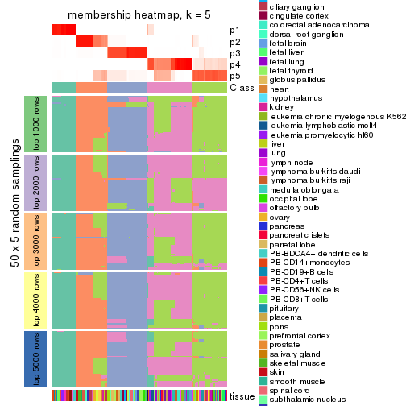</p>

</div>
<div id='tab-ATC-kmeans-membership-heatmap-5'>
<pre><code class="r">membership_heatmap(res, k = 6)
</code></pre>

<p></p>

</div>
</div>

As soon as we have had the classes for columns, we can look for signatures
which are significantly different between classes which can be candidate marks
for certain classes. Following are the heatmaps for signatures.


Signature heatmaps where rows are scaled:


<script>
$( function() {
	$( '#tabs-ATC-kmeans-get-signatures' ).tabs();
} );
</script>
<div id='tabs-ATC-kmeans-get-signatures'>
<ul>
<li><a href='#tab-ATC-kmeans-get-signatures-1'>k = 2</a></li>
<li><a href='#tab-ATC-kmeans-get-signatures-2'>k = 3</a></li>
<li><a href='#tab-ATC-kmeans-get-signatures-3'>k = 4</a></li>
<li><a href='#tab-ATC-kmeans-get-signatures-4'>k = 5</a></li>
<li><a href='#tab-ATC-kmeans-get-signatures-5'>k = 6</a></li>
</ul>
<div id='tab-ATC-kmeans-get-signatures-1'>
<pre><code class="r">get_signatures(res, k = 2)
</code></pre>

<p></p>

</div>
<div id='tab-ATC-kmeans-get-signatures-2'>
<pre><code class="r">get_signatures(res, k = 3)
</code></pre>

<p></p>

</div>
<div id='tab-ATC-kmeans-get-signatures-3'>
<pre><code class="r">get_signatures(res, k = 4)
</code></pre>

<p></p>

</div>
<div id='tab-ATC-kmeans-get-signatures-4'>
<pre><code class="r">get_signatures(res, k = 5)
</code></pre>

<p></p>

</div>
<div id='tab-ATC-kmeans-get-signatures-5'>
<pre><code class="r">get_signatures(res, k = 6)
</code></pre>

<p></p>

</div>
</div>


Signature heatmaps where rows are not scaled:


<script>
$( function() {
	$( '#tabs-ATC-kmeans-get-signatures-no-scale' ).tabs();
} );
</script>
<div id='tabs-ATC-kmeans-get-signatures-no-scale'>
<ul>
<li><a href='#tab-ATC-kmeans-get-signatures-no-scale-1'>k = 2</a></li>
<li><a href='#tab-ATC-kmeans-get-signatures-no-scale-2'>k = 3</a></li>
<li><a href='#tab-ATC-kmeans-get-signatures-no-scale-3'>k = 4</a></li>
<li><a href='#tab-ATC-kmeans-get-signatures-no-scale-4'>k = 5</a></li>
<li><a href='#tab-ATC-kmeans-get-signatures-no-scale-5'>k = 6</a></li>
</ul>
<div id='tab-ATC-kmeans-get-signatures-no-scale-1'>
<pre><code class="r">get_signatures(res, k = 2, scale_rows = FALSE)
</code></pre>

<p></p>

</div>
<div id='tab-ATC-kmeans-get-signatures-no-scale-2'>
<pre><code class="r">get_signatures(res, k = 3, scale_rows = FALSE)
</code></pre>

<p></p>

</div>
<div id='tab-ATC-kmeans-get-signatures-no-scale-3'>
<pre><code class="r">get_signatures(res, k = 4, scale_rows = FALSE)
</code></pre>

<p></p>

</div>
<div id='tab-ATC-kmeans-get-signatures-no-scale-4'>
<pre><code class="r">get_signatures(res, k = 5, scale_rows = FALSE)
</code></pre>

<p></p>

</div>
<div id='tab-ATC-kmeans-get-signatures-no-scale-5'>
<pre><code class="r">get_signatures(res, k = 6, scale_rows = FALSE)
</code></pre>

<p></p>

</div>
</div>


Compare the overlap of signatures from different k:

```r
compare_signatures(res)
```


`get_signature()` returns a data frame invisibly. TO get the list of signatures, the function
call should be assigned to a variable explicitly. In following code, if `plot` argument is set
to `FALSE`, no heatmap is plotted while only the differential analysis is performed.

```r
# code only for demonstration
tb = get_signature(res, k = ..., plot = FALSE)
```

An example of the output of `tb` is:

```
#>   which_row         fdr    mean_1    mean_2 scaled_mean_1 scaled_mean_2 km
#> 1        38 0.042760348  8.373488  9.131774    -0.5533452     0.5164555  1
#> 2        40 0.018707592  7.106213  8.469186    -0.6173731     0.5762149  1
#> 3        55 0.019134737 10.221463 11.207825    -0.6159697     0.5749050  1
#> 4        59 0.006059896  5.921854  7.869574    -0.6899429     0.6439467  1
#> 5        60 0.018055526  8.928898 10.211722    -0.6204761     0.5791110  1
#> 6        98 0.009384629 15.714769 14.887706     0.6635654    -0.6193277  2
...
```

The columns in `tb` are:

1. `which_row`: row indices corresponding to the input matrix.
2. `fdr`: FDR for the differential test. 
3. `mean_x`: The mean value in group x.
4. `scaled_mean_x`: The mean value in group x after rows are scaled.
5. `km`: Row groups if k-means clustering is applied to rows.


UMAP plot which shows how samples are separated.


<script>
$( function() {
	$( '#tabs-ATC-kmeans-dimension-reduction' ).tabs();
} );
</script>
<div id='tabs-ATC-kmeans-dimension-reduction'>
<ul>
<li><a href='#tab-ATC-kmeans-dimension-reduction-1'>k = 2</a></li>
<li><a href='#tab-ATC-kmeans-dimension-reduction-2'>k = 3</a></li>
<li><a href='#tab-ATC-kmeans-dimension-reduction-3'>k = 4</a></li>
<li><a href='#tab-ATC-kmeans-dimension-reduction-4'>k = 5</a></li>
<li><a href='#tab-ATC-kmeans-dimension-reduction-5'>k = 6</a></li>
</ul>
<div id='tab-ATC-kmeans-dimension-reduction-1'>
<pre><code class="r">dimension_reduction(res, k = 2, method = &quot;UMAP&quot;)
</code></pre>

<p></p>

</div>
<div id='tab-ATC-kmeans-dimension-reduction-2'>
<pre><code class="r">dimension_reduction(res, k = 3, method = &quot;UMAP&quot;)
</code></pre>

<p></p>

</div>
<div id='tab-ATC-kmeans-dimension-reduction-3'>
<pre><code class="r">dimension_reduction(res, k = 4, method = &quot;UMAP&quot;)
</code></pre>

<p></p>

</div>
<div id='tab-ATC-kmeans-dimension-reduction-4'>
<pre><code class="r">dimension_reduction(res, k = 5, method = &quot;UMAP&quot;)
</code></pre>

<p></p>

</div>
<div id='tab-ATC-kmeans-dimension-reduction-5'>
<pre><code class="r">dimension_reduction(res, k = 6, method = &quot;UMAP&quot;)
</code></pre>

<p></p>

</div>
</div>


Following heatmap shows how subgroups are split when increasing `k`:

```r
collect_classes(res)
```


Test correlation between subgroups and known annotations. If the known
annotation is numeric, one-way ANOVA test is applied, and if the known
annotation is discrete, chi-squared contingency table test is applied.

```r
test_to_known_factors(res)
```

```
#>              n tissue(p) k
#> ATC:kmeans 158  4.35e-07 2
#> ATC:kmeans 122  1.05e-08 3
#> ATC:kmeans 149  1.31e-15 4
#> ATC:kmeans 139  1.41e-16 5
#> ATC:kmeans 118  6.17e-18 6
```


If matrix rows can be associated to genes, consider to use `functional_enrichment(res,
...)` to perform function enrichment for the signature genes. See [this vignette](http://bioconductor.org/packages/devel/bioc/vignettes/cola/inst/doc/functional_enrichment.html) for more detailed explanations.


 

---------------------------------------------------


### ATC:skmeans**


The object with results only for a single top-value method and a single partition method 
can be extracted as:

```r
res = res_list["ATC", "skmeans"]
# you can also extract it by
# res = res_list["ATC:skmeans"]
```

A summary of `res` and all the functions that can be applied to it:

```r
res
```

```
#> A 'ConsensusPartition' object with k = 2, 3, 4, 5, 6.
#>   On a matrix with 21168 rows and 158 columns.
#>   Top rows (1000, 2000, 3000, 4000, 5000) are extracted by 'ATC' method.
#>   Subgroups are detected by 'skmeans' method.
#>   Performed in total 1250 partitions by row resampling.
#>   Best k for subgroups seems to be 5.
#> 
#> Following methods can be applied to this 'ConsensusPartition' object:
#>  [1] "cola_report"             "collect_classes"         "collect_plots"          
#>  [4] "collect_stats"           "colnames"                "compare_signatures"     
#>  [7] "consensus_heatmap"       "dimension_reduction"     "functional_enrichment"  
#> [10] "get_anno_col"            "get_anno"                "get_classes"            
#> [13] "get_consensus"           "get_matrix"              "get_membership"         
#> [16] "get_param"               "get_signatures"          "get_stats"              
#> [19] "is_best_k"               "is_stable_k"             "membership_heatmap"     
#> [22] "ncol"                    "nrow"                    "plot_ecdf"              
#> [25] "rownames"                "select_partition_number" "show"                   
#> [28] "suggest_best_k"          "test_to_known_factors"
```

`collect_plots()` function collects all the plots made from `res` for all `k` (number of partitions)
into one single page to provide an easy and fast comparison between different `k`.

```r
collect_plots(res)
```


The plots are:

- The first row: a plot of the ECDF (empirical cumulative distribution
  function) curves of the consensus matrix for each `k` and the heatmap of
  predicted classes for each `k`.
- The second row: heatmaps of the consensus matrix for each `k`.
- The third row: heatmaps of the membership matrix for each `k`.
- The fouth row: heatmaps of the signatures for each `k`.

All the plots in panels can be made by individual functions and they are
plotted later in this section.

`select_partition_number()` produces several plots showing different
statistics for choosing "optimized" `k`. There are following statistics:

- ECDF curves of the consensus matrix for each `k`;
- 1-PAC. [The PAC
  score](https://en.wikipedia.org/wiki/Consensus_clustering#Over-interpretation_potential_of_consensus_clustering)
  measures the proportion of the ambiguous subgrouping.
- Mean silhouette score.
- Concordance. The mean probability of fiting the consensus class ids in all
  partitions.
- Area increased. Denote $A_k$ as the area under the ECDF curve for current
  `k`, the area increased is defined as $A_k - A_{k-1}$.
- Rand index. The percent of pairs of samples that are both in a same cluster
  or both are not in a same cluster in the partition of k and k-1.
- Jaccard index. The ratio of pairs of samples are both in a same cluster in
  the partition of k and k-1 and the pairs of samples are both in a same
  cluster in the partition k or k-1.

The detailed explanations of these statistics can be found in [the _cola_
vignette](http://bioconductor.org/packages/devel/bioc/vignettes/cola/inst/doc/cola.html#toc_13).

Generally speaking, lower PAC score, higher mean silhouette score or higher
concordance corresponds to better partition. Rand index and Jaccard index
measure how similar the current partition is compared to partition with `k-1`.
If they are too similar, we won't accept `k` is better than `k-1`.

```r
select_partition_number(res)
```

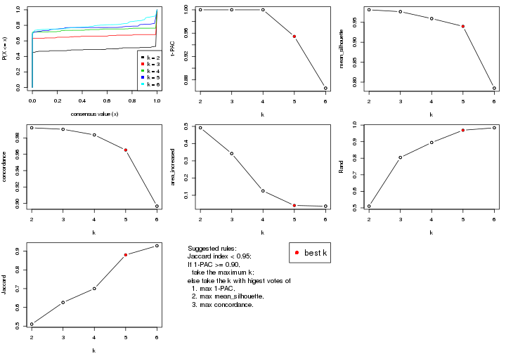

The numeric values for all these statistics can be obtained by `get_stats()`.

```r
get_stats(res)
```

```
#>   k 1-PAC mean_silhouette concordance area_increased  Rand Jaccard
#> 2 2 1.000           0.981       0.992         0.4918 0.510   0.510
#> 3 3 1.000           0.977       0.991         0.3422 0.804   0.626
#> 4 4 1.000           0.959       0.984         0.1253 0.895   0.700
#> 5 5 0.954           0.940       0.965         0.0406 0.969   0.880
#> 6 6 0.866           0.785       0.897         0.0367 0.984   0.928
```

`suggest_best_k()` suggests the best $k$ based on these statistics. The rules are as follows:

- All $k$ with Jaccard index larger than 0.95 are removed because increasing
  $k$ does not provide enough extra information. If all $k$ are removed, it is
  marked as no subgroup is detected.
- For all $k$ with 1-PAC score larger than 0.9, the maximal $k$ is taken as
  the best $k$, and other $k$ are marked as optional $k$.
- If it does not fit the second rule. The $k$ with the maximal vote of the
  highest 1-PAC score, highest mean silhouette, and highest concordance is
  taken as the best $k$.

```r
suggest_best_k(res)
```

```
#> [1] 5
#> attr(,"optional")
#> [1] 2 3 4
```

There is also optional best $k$ = 2 3 4 that is worth to check.

Following shows the table of the partitions (You need to click the **show/hide
code output** link to see it). The membership matrix (columns with name `p*`)
is inferred by
[`clue::cl_consensus()`](https://www.rdocumentation.org/link/cl_consensus?package=clue)
function with the `SE` method. Basically the value in the membership matrix
represents the probability to belong to a certain group. The finall class
label for an item is determined with the group with highest probability it
belongs to.

In `get_classes()` function, the entropy is calculated from the membership
matrix and the silhouette score is calculated from the consensus matrix.


<script>
$( function() {
	$( '#tabs-ATC-skmeans-get-classes' ).tabs();
} );
</script>
<div id='tabs-ATC-skmeans-get-classes'>
<ul>
<li><a href='#tab-ATC-skmeans-get-classes-1'>k = 2</a></li>
<li><a href='#tab-ATC-skmeans-get-classes-2'>k = 3</a></li>
<li><a href='#tab-ATC-skmeans-get-classes-3'>k = 4</a></li>
<li><a href='#tab-ATC-skmeans-get-classes-4'>k = 5</a></li>
<li><a href='#tab-ATC-skmeans-get-classes-5'>k = 6</a></li>
</ul>

<div id='tab-ATC-skmeans-get-classes-1'>
<p><a id='tab-ATC-skmeans-get-classes-1-a' style='color:#0366d6' href='#'>show/hide code output</a></p>
<pre><code class="r">cbind(get_classes(res, k = 2), get_membership(res, k = 2))
</code></pre>

<pre><code>#&gt;          class entropy silhouette    p1    p2
#&gt; GSM18927     2   0.000      0.988 0.000 1.000
#&gt; GSM18928     2   0.000      0.988 0.000 1.000
#&gt; GSM18915     2   0.000      0.988 0.000 1.000
#&gt; GSM18916     2   0.000      0.988 0.000 1.000
#&gt; GSM18939     2   0.000      0.988 0.000 1.000
#&gt; GSM18940     2   0.000      0.988 0.000 1.000
#&gt; GSM18933     2   0.278      0.941 0.048 0.952
#&gt; GSM18934     2   0.000      0.988 0.000 1.000
#&gt; GSM18925     2   0.000      0.988 0.000 1.000
#&gt; GSM18926     2   0.000      0.988 0.000 1.000
#&gt; GSM18931     2   0.000      0.988 0.000 1.000
#&gt; GSM18932     2   0.000      0.988 0.000 1.000
#&gt; GSM19019     2   0.000      0.988 0.000 1.000
#&gt; GSM19020     2   0.000      0.988 0.000 1.000
#&gt; GSM18923     2   0.000      0.988 0.000 1.000
#&gt; GSM18924     2   0.000      0.988 0.000 1.000
#&gt; GSM18941     2   0.000      0.988 0.000 1.000
#&gt; GSM18942     2   0.000      0.988 0.000 1.000
#&gt; GSM18929     2   0.000      0.988 0.000 1.000
#&gt; GSM18930     2   0.000      0.988 0.000 1.000
#&gt; GSM18911     2   0.000      0.988 0.000 1.000
#&gt; GSM18912     2   0.000      0.988 0.000 1.000
#&gt; GSM18935     2   0.000      0.988 0.000 1.000
#&gt; GSM18936     2   0.000      0.988 0.000 1.000
#&gt; GSM19005     2   0.000      0.988 0.000 1.000
#&gt; GSM19006     2   0.000      0.988 0.000 1.000
#&gt; GSM18921     2   0.000      0.988 0.000 1.000
#&gt; GSM18922     2   0.000      0.988 0.000 1.000
#&gt; GSM18919     2   0.000      0.988 0.000 1.000
#&gt; GSM18920     2   0.000      0.988 0.000 1.000
#&gt; GSM18917     2   0.000      0.988 0.000 1.000
#&gt; GSM18918     2   0.000      0.988 0.000 1.000
#&gt; GSM18913     2   0.000      0.988 0.000 1.000
#&gt; GSM18914     2   0.000      0.988 0.000 1.000
#&gt; GSM18937     2   0.000      0.988 0.000 1.000
#&gt; GSM18938     2   0.000      0.988 0.000 1.000
#&gt; GSM18943     2   0.000      0.988 0.000 1.000
#&gt; GSM18944     2   0.000      0.988 0.000 1.000
#&gt; GSM19003     2   0.000      0.988 0.000 1.000
#&gt; GSM19004     2   0.000      0.988 0.000 1.000
#&gt; GSM19011     2   0.000      0.988 0.000 1.000
#&gt; GSM19012     2   0.000      0.988 0.000 1.000
#&gt; GSM19009     2   0.000      0.988 0.000 1.000
#&gt; GSM19010     2   0.000      0.988 0.000 1.000
#&gt; GSM18945     2   0.000      0.988 0.000 1.000
#&gt; GSM18946     2   0.000      0.988 0.000 1.000
#&gt; GSM18963     2   0.000      0.988 0.000 1.000
#&gt; GSM18964     1   0.000      0.997 1.000 0.000
#&gt; GSM18905     2   0.000      0.988 0.000 1.000
#&gt; GSM18906     1   0.000      0.997 1.000 0.000
#&gt; GSM18965     1   0.000      0.997 1.000 0.000
#&gt; GSM18966     1   0.000      0.997 1.000 0.000
#&gt; GSM18873     1   0.000      0.997 1.000 0.000
#&gt; GSM18874     1   0.000      0.997 1.000 0.000
#&gt; GSM18973     1   0.000      0.997 1.000 0.000
#&gt; GSM18974     1   0.000      0.997 1.000 0.000
#&gt; GSM18977     1   0.000      0.997 1.000 0.000
#&gt; GSM18978     2   0.000      0.988 0.000 1.000
#&gt; GSM18979     2   0.978      0.307 0.412 0.588
#&gt; GSM18980     1   0.000      0.997 1.000 0.000
#&gt; GSM18883     1   0.000      0.997 1.000 0.000
#&gt; GSM18884     1   0.000      0.997 1.000 0.000
#&gt; GSM18885     1   0.000      0.997 1.000 0.000
#&gt; GSM18886     1   0.000      0.997 1.000 0.000
#&gt; GSM18907     1   0.000      0.997 1.000 0.000
#&gt; GSM18908     1   0.000      0.997 1.000 0.000
#&gt; GSM18909     1   0.163      0.974 0.976 0.024
#&gt; GSM18910     2   0.891      0.559 0.308 0.692
#&gt; GSM18867     1   0.000      0.997 1.000 0.000
#&gt; GSM18868     1   0.000      0.997 1.000 0.000
#&gt; GSM18947     2   0.000      0.988 0.000 1.000
#&gt; GSM18948     2   0.000      0.988 0.000 1.000
#&gt; GSM18995     2   0.000      0.988 0.000 1.000
#&gt; GSM18996     2   0.000      0.988 0.000 1.000
#&gt; GSM18975     2   0.000      0.988 0.000 1.000
#&gt; GSM18976     1   0.000      0.997 1.000 0.000
#&gt; GSM18997     2   0.000      0.988 0.000 1.000
#&gt; GSM18998     2   0.000      0.988 0.000 1.000
#&gt; GSM18967     1   0.000      0.997 1.000 0.000
#&gt; GSM18968     1   0.000      0.997 1.000 0.000
#&gt; GSM18959     1   0.000      0.997 1.000 0.000
#&gt; GSM18960     1   0.000      0.997 1.000 0.000
#&gt; GSM19015     2   0.000      0.988 0.000 1.000
#&gt; GSM19016     2   0.000      0.988 0.000 1.000
#&gt; GSM18957     1   0.000      0.997 1.000 0.000
#&gt; GSM18958     1   0.000      0.997 1.000 0.000
#&gt; GSM18981     2   0.000      0.988 0.000 1.000
#&gt; GSM18982     2   0.000      0.988 0.000 1.000
#&gt; GSM18989     2   0.000      0.988 0.000 1.000
#&gt; GSM18990     2   0.000      0.988 0.000 1.000
#&gt; GSM18985     1   0.584      0.835 0.860 0.140
#&gt; GSM18986     2   0.850      0.622 0.276 0.724
#&gt; GSM18987     2   0.000      0.988 0.000 1.000
#&gt; GSM18988     2   0.000      0.988 0.000 1.000
#&gt; GSM18983     2   0.000      0.988 0.000 1.000
#&gt; GSM18984     2   0.000      0.988 0.000 1.000
#&gt; GSM18951     2   0.000      0.988 0.000 1.000
#&gt; GSM18952     2   0.000      0.988 0.000 1.000
#&gt; GSM19007     2   0.000      0.988 0.000 1.000
#&gt; GSM19008     2   0.000      0.988 0.000 1.000
#&gt; GSM18999     2   0.000      0.988 0.000 1.000
#&gt; GSM19000     2   0.000      0.988 0.000 1.000
#&gt; GSM18889     1   0.000      0.997 1.000 0.000
#&gt; GSM18890     1   0.000      0.997 1.000 0.000
#&gt; GSM18881     1   0.000      0.997 1.000 0.000
#&gt; GSM18882     1   0.000      0.997 1.000 0.000
#&gt; GSM18877     1   0.000      0.997 1.000 0.000
#&gt; GSM18878     1   0.000      0.997 1.000 0.000
#&gt; GSM18875     1   0.000      0.997 1.000 0.000
#&gt; GSM18876     1   0.000      0.997 1.000 0.000
#&gt; GSM18879     1   0.000      0.997 1.000 0.000
#&gt; GSM18880     1   0.000      0.997 1.000 0.000
#&gt; GSM18871     1   0.000      0.997 1.000 0.000
#&gt; GSM18872     1   0.000      0.997 1.000 0.000
#&gt; GSM18903     1   0.000      0.997 1.000 0.000
#&gt; GSM18904     1   0.000      0.997 1.000 0.000
#&gt; GSM18949     1   0.000      0.997 1.000 0.000
#&gt; GSM18950     1   0.000      0.997 1.000 0.000
#&gt; GSM18953     2   0.000      0.988 0.000 1.000
#&gt; GSM18954     2   0.000      0.988 0.000 1.000
#&gt; GSM19013     2   0.000      0.988 0.000 1.000
#&gt; GSM19014     2   0.000      0.988 0.000 1.000
#&gt; GSM18971     1   0.000      0.997 1.000 0.000
#&gt; GSM18972     1   0.000      0.997 1.000 0.000
#&gt; GSM18969     1   0.000      0.997 1.000 0.000
#&gt; GSM18970     2   0.000      0.988 0.000 1.000
#&gt; GSM18869     1   0.000      0.997 1.000 0.000
#&gt; GSM18870     1   0.000      0.997 1.000 0.000
#&gt; GSM19017     2   0.000      0.988 0.000 1.000
#&gt; GSM19018     2   0.000      0.988 0.000 1.000
#&gt; GSM18991     2   0.000      0.988 0.000 1.000
#&gt; GSM18992     2   0.000      0.988 0.000 1.000
#&gt; GSM19021     2   0.000      0.988 0.000 1.000
#&gt; GSM19022     2   0.000      0.988 0.000 1.000
#&gt; GSM19001     2   0.000      0.988 0.000 1.000
#&gt; GSM19002     2   0.000      0.988 0.000 1.000
#&gt; GSM18899     1   0.000      0.997 1.000 0.000
#&gt; GSM18900     1   0.000      0.997 1.000 0.000
#&gt; GSM18961     1   0.000      0.997 1.000 0.000
#&gt; GSM18962     1   0.000      0.997 1.000 0.000
#&gt; GSM18901     1   0.000      0.997 1.000 0.000
#&gt; GSM18902     1   0.000      0.997 1.000 0.000
#&gt; GSM18993     2   0.000      0.988 0.000 1.000
#&gt; GSM18994     2   0.000      0.988 0.000 1.000
#&gt; GSM18865     1   0.000      0.997 1.000 0.000
#&gt; GSM18866     1   0.000      0.997 1.000 0.000
#&gt; GSM18897     1   0.000      0.997 1.000 0.000
#&gt; GSM18898     1   0.000      0.997 1.000 0.000
#&gt; GSM18887     1   0.000      0.997 1.000 0.000
#&gt; GSM18888     1   0.000      0.997 1.000 0.000
#&gt; GSM18893     1   0.000      0.997 1.000 0.000
#&gt; GSM18894     1   0.000      0.997 1.000 0.000
#&gt; GSM18895     1   0.000      0.997 1.000 0.000
#&gt; GSM18896     1   0.000      0.997 1.000 0.000
#&gt; GSM18891     1   0.000      0.997 1.000 0.000
#&gt; GSM18892     1   0.000      0.997 1.000 0.000
#&gt; GSM18955     2   0.000      0.988 0.000 1.000
#&gt; GSM18956     2   0.000      0.988 0.000 1.000
</code></pre>

<script>
$('#tab-ATC-skmeans-get-classes-1-a').parent().next().next().hide();
$('#tab-ATC-skmeans-get-classes-1-a').click(function(){
  $('#tab-ATC-skmeans-get-classes-1-a').parent().next().next().toggle();
  return(false);
});
</script>
</div>

<div id='tab-ATC-skmeans-get-classes-2'>
<p><a id='tab-ATC-skmeans-get-classes-2-a' style='color:#0366d6' href='#'>show/hide code output</a></p>
<pre><code class="r">cbind(get_classes(res, k = 3), get_membership(res, k = 3))
</code></pre>

<pre><code>#&gt;          class entropy silhouette    p1    p2  p3
#&gt; GSM18927     3   0.000      0.995 0.000 0.000 1.0
#&gt; GSM18928     3   0.000      0.995 0.000 0.000 1.0
#&gt; GSM18915     3   0.000      0.995 0.000 0.000 1.0
#&gt; GSM18916     3   0.000      0.995 0.000 0.000 1.0
#&gt; GSM18939     3   0.000      0.995 0.000 0.000 1.0
#&gt; GSM18940     3   0.000      0.995 0.000 0.000 1.0
#&gt; GSM18933     3   0.000      0.995 0.000 0.000 1.0
#&gt; GSM18934     3   0.000      0.995 0.000 0.000 1.0
#&gt; GSM18925     3   0.000      0.995 0.000 0.000 1.0
#&gt; GSM18926     3   0.000      0.995 0.000 0.000 1.0
#&gt; GSM18931     3   0.000      0.995 0.000 0.000 1.0
#&gt; GSM18932     3   0.000      0.995 0.000 0.000 1.0
#&gt; GSM19019     3   0.000      0.995 0.000 0.000 1.0
#&gt; GSM19020     3   0.000      0.995 0.000 0.000 1.0
#&gt; GSM18923     3   0.000      0.995 0.000 0.000 1.0
#&gt; GSM18924     3   0.000      0.995 0.000 0.000 1.0
#&gt; GSM18941     3   0.000      0.995 0.000 0.000 1.0
#&gt; GSM18942     3   0.455      0.746 0.000 0.200 0.8
#&gt; GSM18929     3   0.000      0.995 0.000 0.000 1.0
#&gt; GSM18930     3   0.000      0.995 0.000 0.000 1.0
#&gt; GSM18911     3   0.000      0.995 0.000 0.000 1.0
#&gt; GSM18912     3   0.000      0.995 0.000 0.000 1.0
#&gt; GSM18935     3   0.000      0.995 0.000 0.000 1.0
#&gt; GSM18936     3   0.000      0.995 0.000 0.000 1.0
#&gt; GSM19005     2   0.000      0.981 0.000 1.000 0.0
#&gt; GSM19006     2   0.000      0.981 0.000 1.000 0.0
#&gt; GSM18921     3   0.000      0.995 0.000 0.000 1.0
#&gt; GSM18922     3   0.000      0.995 0.000 0.000 1.0
#&gt; GSM18919     3   0.000      0.995 0.000 0.000 1.0
#&gt; GSM18920     3   0.000      0.995 0.000 0.000 1.0
#&gt; GSM18917     3   0.000      0.995 0.000 0.000 1.0
#&gt; GSM18918     3   0.000      0.995 0.000 0.000 1.0
#&gt; GSM18913     3   0.000      0.995 0.000 0.000 1.0
#&gt; GSM18914     3   0.000      0.995 0.000 0.000 1.0
#&gt; GSM18937     3   0.000      0.995 0.000 0.000 1.0
#&gt; GSM18938     3   0.000      0.995 0.000 0.000 1.0
#&gt; GSM18943     3   0.000      0.995 0.000 0.000 1.0
#&gt; GSM18944     3   0.000      0.995 0.000 0.000 1.0
#&gt; GSM19003     2   0.000      0.981 0.000 1.000 0.0
#&gt; GSM19004     2   0.000      0.981 0.000 1.000 0.0
#&gt; GSM19011     2   0.000      0.981 0.000 1.000 0.0
#&gt; GSM19012     2   0.000      0.981 0.000 1.000 0.0
#&gt; GSM19009     2   0.000      0.981 0.000 1.000 0.0
#&gt; GSM19010     2   0.000      0.981 0.000 1.000 0.0
#&gt; GSM18945     3   0.000      0.995 0.000 0.000 1.0
#&gt; GSM18946     3   0.000      0.995 0.000 0.000 1.0
#&gt; GSM18963     2   0.000      0.981 0.000 1.000 0.0
#&gt; GSM18964     1   0.000      0.994 1.000 0.000 0.0
#&gt; GSM18905     2   0.000      0.981 0.000 1.000 0.0
#&gt; GSM18906     2   0.606      0.380 0.384 0.616 0.0
#&gt; GSM18965     1   0.000      0.994 1.000 0.000 0.0
#&gt; GSM18966     1   0.000      0.994 1.000 0.000 0.0
#&gt; GSM18873     1   0.000      0.994 1.000 0.000 0.0
#&gt; GSM18874     1   0.000      0.994 1.000 0.000 0.0
#&gt; GSM18973     1   0.000      0.994 1.000 0.000 0.0
#&gt; GSM18974     1   0.000      0.994 1.000 0.000 0.0
#&gt; GSM18977     1   0.000      0.994 1.000 0.000 0.0
#&gt; GSM18978     2   0.000      0.981 0.000 1.000 0.0
#&gt; GSM18979     2   0.000      0.981 0.000 1.000 0.0
#&gt; GSM18980     1   0.000      0.994 1.000 0.000 0.0
#&gt; GSM18883     1   0.000      0.994 1.000 0.000 0.0
#&gt; GSM18884     1   0.000      0.994 1.000 0.000 0.0
#&gt; GSM18885     1   0.000      0.994 1.000 0.000 0.0
#&gt; GSM18886     1   0.000      0.994 1.000 0.000 0.0
#&gt; GSM18907     1   0.000      0.994 1.000 0.000 0.0
#&gt; GSM18908     1   0.000      0.994 1.000 0.000 0.0
#&gt; GSM18909     2   0.000      0.981 0.000 1.000 0.0
#&gt; GSM18910     2   0.000      0.981 0.000 1.000 0.0
#&gt; GSM18867     1   0.000      0.994 1.000 0.000 0.0
#&gt; GSM18868     1   0.000      0.994 1.000 0.000 0.0
#&gt; GSM18947     2   0.000      0.981 0.000 1.000 0.0
#&gt; GSM18948     2   0.000      0.981 0.000 1.000 0.0
#&gt; GSM18995     2   0.000      0.981 0.000 1.000 0.0
#&gt; GSM18996     2   0.000      0.981 0.000 1.000 0.0
#&gt; GSM18975     2   0.000      0.981 0.000 1.000 0.0
#&gt; GSM18976     1   0.573      0.509 0.676 0.324 0.0
#&gt; GSM18997     2   0.000      0.981 0.000 1.000 0.0
#&gt; GSM18998     2   0.000      0.981 0.000 1.000 0.0
#&gt; GSM18967     1   0.000      0.994 1.000 0.000 0.0
#&gt; GSM18968     1   0.000      0.994 1.000 0.000 0.0
#&gt; GSM18959     1   0.000      0.994 1.000 0.000 0.0
#&gt; GSM18960     1   0.000      0.994 1.000 0.000 0.0
#&gt; GSM19015     2   0.000      0.981 0.000 1.000 0.0
#&gt; GSM19016     2   0.000      0.981 0.000 1.000 0.0
#&gt; GSM18957     1   0.000      0.994 1.000 0.000 0.0
#&gt; GSM18958     1   0.000      0.994 1.000 0.000 0.0
#&gt; GSM18981     2   0.000      0.981 0.000 1.000 0.0
#&gt; GSM18982     2   0.000      0.981 0.000 1.000 0.0
#&gt; GSM18989     2   0.000      0.981 0.000 1.000 0.0
#&gt; GSM18990     2   0.000      0.981 0.000 1.000 0.0
#&gt; GSM18985     2   0.440      0.766 0.188 0.812 0.0
#&gt; GSM18986     2   0.811      0.445 0.096 0.604 0.3
#&gt; GSM18987     2   0.000      0.981 0.000 1.000 0.0
#&gt; GSM18988     2   0.000      0.981 0.000 1.000 0.0
#&gt; GSM18983     2   0.000      0.981 0.000 1.000 0.0
#&gt; GSM18984     2   0.000      0.981 0.000 1.000 0.0
#&gt; GSM18951     2   0.000      0.981 0.000 1.000 0.0
#&gt; GSM18952     2   0.000      0.981 0.000 1.000 0.0
#&gt; GSM19007     2   0.000      0.981 0.000 1.000 0.0
#&gt; GSM19008     2   0.000      0.981 0.000 1.000 0.0
#&gt; GSM18999     2   0.000      0.981 0.000 1.000 0.0
#&gt; GSM19000     2   0.000      0.981 0.000 1.000 0.0
#&gt; GSM18889     1   0.000      0.994 1.000 0.000 0.0
#&gt; GSM18890     1   0.000      0.994 1.000 0.000 0.0
#&gt; GSM18881     1   0.000      0.994 1.000 0.000 0.0
#&gt; GSM18882     1   0.000      0.994 1.000 0.000 0.0
#&gt; GSM18877     1   0.000      0.994 1.000 0.000 0.0
#&gt; GSM18878     1   0.000      0.994 1.000 0.000 0.0
#&gt; GSM18875     1   0.000      0.994 1.000 0.000 0.0
#&gt; GSM18876     1   0.000      0.994 1.000 0.000 0.0
#&gt; GSM18879     1   0.000      0.994 1.000 0.000 0.0
#&gt; GSM18880     1   0.000      0.994 1.000 0.000 0.0
#&gt; GSM18871     1   0.000      0.994 1.000 0.000 0.0
#&gt; GSM18872     1   0.000      0.994 1.000 0.000 0.0
#&gt; GSM18903     1   0.000      0.994 1.000 0.000 0.0
#&gt; GSM18904     1   0.000      0.994 1.000 0.000 0.0
#&gt; GSM18949     1   0.000      0.994 1.000 0.000 0.0
#&gt; GSM18950     1   0.000      0.994 1.000 0.000 0.0
#&gt; GSM18953     2   0.000      0.981 0.000 1.000 0.0
#&gt; GSM18954     2   0.000      0.981 0.000 1.000 0.0
#&gt; GSM19013     2   0.000      0.981 0.000 1.000 0.0
#&gt; GSM19014     2   0.000      0.981 0.000 1.000 0.0
#&gt; GSM18971     1   0.000      0.994 1.000 0.000 0.0
#&gt; GSM18972     1   0.000      0.994 1.000 0.000 0.0
#&gt; GSM18969     1   0.000      0.994 1.000 0.000 0.0
#&gt; GSM18970     2   0.000      0.981 0.000 1.000 0.0
#&gt; GSM18869     1   0.000      0.994 1.000 0.000 0.0
#&gt; GSM18870     1   0.000      0.994 1.000 0.000 0.0
#&gt; GSM19017     2   0.000      0.981 0.000 1.000 0.0
#&gt; GSM19018     2   0.000      0.981 0.000 1.000 0.0
#&gt; GSM18991     2   0.000      0.981 0.000 1.000 0.0
#&gt; GSM18992     2   0.000      0.981 0.000 1.000 0.0
#&gt; GSM19021     3   0.000      0.995 0.000 0.000 1.0
#&gt; GSM19022     3   0.000      0.995 0.000 0.000 1.0
#&gt; GSM19001     2   0.000      0.981 0.000 1.000 0.0
#&gt; GSM19002     2   0.000      0.981 0.000 1.000 0.0
#&gt; GSM18899     1   0.000      0.994 1.000 0.000 0.0
#&gt; GSM18900     1   0.000      0.994 1.000 0.000 0.0
#&gt; GSM18961     1   0.000      0.994 1.000 0.000 0.0
#&gt; GSM18962     1   0.000      0.994 1.000 0.000 0.0
#&gt; GSM18901     1   0.000      0.994 1.000 0.000 0.0
#&gt; GSM18902     1   0.000      0.994 1.000 0.000 0.0
#&gt; GSM18993     2   0.000      0.981 0.000 1.000 0.0
#&gt; GSM18994     2   0.000      0.981 0.000 1.000 0.0
#&gt; GSM18865     1   0.000      0.994 1.000 0.000 0.0
#&gt; GSM18866     1   0.000      0.994 1.000 0.000 0.0
#&gt; GSM18897     1   0.000      0.994 1.000 0.000 0.0
#&gt; GSM18898     1   0.000      0.994 1.000 0.000 0.0
#&gt; GSM18887     1   0.000      0.994 1.000 0.000 0.0
#&gt; GSM18888     1   0.000      0.994 1.000 0.000 0.0
#&gt; GSM18893     1   0.000      0.994 1.000 0.000 0.0
#&gt; GSM18894     1   0.000      0.994 1.000 0.000 0.0
#&gt; GSM18895     1   0.000      0.994 1.000 0.000 0.0
#&gt; GSM18896     1   0.000      0.994 1.000 0.000 0.0
#&gt; GSM18891     1   0.000      0.994 1.000 0.000 0.0
#&gt; GSM18892     1   0.000      0.994 1.000 0.000 0.0
#&gt; GSM18955     2   0.000      0.981 0.000 1.000 0.0
#&gt; GSM18956     2   0.000      0.981 0.000 1.000 0.0
</code></pre>

<script>
$('#tab-ATC-skmeans-get-classes-2-a').parent().next().next().hide();
$('#tab-ATC-skmeans-get-classes-2-a').click(function(){
  $('#tab-ATC-skmeans-get-classes-2-a').parent().next().next().toggle();
  return(false);
});
</script>
</div>

<div id='tab-ATC-skmeans-get-classes-3'>
<p><a id='tab-ATC-skmeans-get-classes-3-a' style='color:#0366d6' href='#'>show/hide code output</a></p>
<pre><code class="r">cbind(get_classes(res, k = 4), get_membership(res, k = 4))
</code></pre>

<pre><code>#&gt;          class entropy silhouette    p1    p2  p3    p4
#&gt; GSM18927     3  0.0000      0.994 0.000 0.000 1.0 0.000
#&gt; GSM18928     3  0.0000      0.994 0.000 0.000 1.0 0.000
#&gt; GSM18915     3  0.0000      0.994 0.000 0.000 1.0 0.000
#&gt; GSM18916     3  0.0000      0.994 0.000 0.000 1.0 0.000
#&gt; GSM18939     3  0.0000      0.994 0.000 0.000 1.0 0.000
#&gt; GSM18940     3  0.0000      0.994 0.000 0.000 1.0 0.000
#&gt; GSM18933     3  0.0000      0.994 0.000 0.000 1.0 0.000
#&gt; GSM18934     3  0.0000      0.994 0.000 0.000 1.0 0.000
#&gt; GSM18925     3  0.0000      0.994 0.000 0.000 1.0 0.000
#&gt; GSM18926     3  0.0000      0.994 0.000 0.000 1.0 0.000
#&gt; GSM18931     3  0.0000      0.994 0.000 0.000 1.0 0.000
#&gt; GSM18932     3  0.0000      0.994 0.000 0.000 1.0 0.000
#&gt; GSM19019     3  0.0000      0.994 0.000 0.000 1.0 0.000
#&gt; GSM19020     3  0.0000      0.994 0.000 0.000 1.0 0.000
#&gt; GSM18923     3  0.0000      0.994 0.000 0.000 1.0 0.000
#&gt; GSM18924     3  0.0000      0.994 0.000 0.000 1.0 0.000
#&gt; GSM18941     3  0.0000      0.994 0.000 0.000 1.0 0.000
#&gt; GSM18942     3  0.3610      0.731 0.000 0.200 0.8 0.000
#&gt; GSM18929     3  0.0000      0.994 0.000 0.000 1.0 0.000
#&gt; GSM18930     3  0.0000      0.994 0.000 0.000 1.0 0.000
#&gt; GSM18911     3  0.0000      0.994 0.000 0.000 1.0 0.000
#&gt; GSM18912     3  0.0000      0.994 0.000 0.000 1.0 0.000
#&gt; GSM18935     3  0.0000      0.994 0.000 0.000 1.0 0.000
#&gt; GSM18936     3  0.0000      0.994 0.000 0.000 1.0 0.000
#&gt; GSM19005     2  0.0000      0.980 0.000 1.000 0.0 0.000
#&gt; GSM19006     2  0.0000      0.980 0.000 1.000 0.0 0.000
#&gt; GSM18921     3  0.0000      0.994 0.000 0.000 1.0 0.000
#&gt; GSM18922     3  0.0000      0.994 0.000 0.000 1.0 0.000
#&gt; GSM18919     3  0.0000      0.994 0.000 0.000 1.0 0.000
#&gt; GSM18920     3  0.0000      0.994 0.000 0.000 1.0 0.000
#&gt; GSM18917     3  0.0000      0.994 0.000 0.000 1.0 0.000
#&gt; GSM18918     3  0.0000      0.994 0.000 0.000 1.0 0.000
#&gt; GSM18913     3  0.0000      0.994 0.000 0.000 1.0 0.000
#&gt; GSM18914     3  0.0000      0.994 0.000 0.000 1.0 0.000
#&gt; GSM18937     3  0.0000      0.994 0.000 0.000 1.0 0.000
#&gt; GSM18938     3  0.0000      0.994 0.000 0.000 1.0 0.000
#&gt; GSM18943     3  0.0000      0.994 0.000 0.000 1.0 0.000
#&gt; GSM18944     3  0.0000      0.994 0.000 0.000 1.0 0.000
#&gt; GSM19003     2  0.0000      0.980 0.000 1.000 0.0 0.000
#&gt; GSM19004     2  0.0000      0.980 0.000 1.000 0.0 0.000
#&gt; GSM19011     2  0.0000      0.980 0.000 1.000 0.0 0.000
#&gt; GSM19012     2  0.0000      0.980 0.000 1.000 0.0 0.000
#&gt; GSM19009     2  0.0000      0.980 0.000 1.000 0.0 0.000
#&gt; GSM19010     2  0.0000      0.980 0.000 1.000 0.0 0.000
#&gt; GSM18945     3  0.0000      0.994 0.000 0.000 1.0 0.000
#&gt; GSM18946     3  0.0000      0.994 0.000 0.000 1.0 0.000
#&gt; GSM18963     4  0.0000      0.940 0.000 0.000 0.0 1.000
#&gt; GSM18964     4  0.0000      0.940 0.000 0.000 0.0 1.000
#&gt; GSM18905     2  0.0000      0.980 0.000 1.000 0.0 0.000
#&gt; GSM18906     4  0.0336      0.934 0.000 0.008 0.0 0.992
#&gt; GSM18965     4  0.0000      0.940 0.000 0.000 0.0 1.000
#&gt; GSM18966     4  0.0000      0.940 0.000 0.000 0.0 1.000
#&gt; GSM18873     1  0.0000      1.000 1.000 0.000 0.0 0.000
#&gt; GSM18874     1  0.0000      1.000 1.000 0.000 0.0 0.000
#&gt; GSM18973     1  0.0000      1.000 1.000 0.000 0.0 0.000
#&gt; GSM18974     1  0.0000      1.000 1.000 0.000 0.0 0.000
#&gt; GSM18977     4  0.0000      0.940 0.000 0.000 0.0 1.000
#&gt; GSM18978     2  0.4955      0.180 0.000 0.556 0.0 0.444
#&gt; GSM18979     4  0.0000      0.940 0.000 0.000 0.0 1.000
#&gt; GSM18980     4  0.0000      0.940 0.000 0.000 0.0 1.000
#&gt; GSM18883     1  0.0000      1.000 1.000 0.000 0.0 0.000
#&gt; GSM18884     1  0.0000      1.000 1.000 0.000 0.0 0.000
#&gt; GSM18885     1  0.0000      1.000 1.000 0.000 0.0 0.000
#&gt; GSM18886     1  0.0000      1.000 1.000 0.000 0.0 0.000
#&gt; GSM18907     1  0.0000      1.000 1.000 0.000 0.0 0.000
#&gt; GSM18908     1  0.0000      1.000 1.000 0.000 0.0 0.000
#&gt; GSM18909     2  0.0000      0.980 0.000 1.000 0.0 0.000
#&gt; GSM18910     2  0.0000      0.980 0.000 1.000 0.0 0.000
#&gt; GSM18867     1  0.0000      1.000 1.000 0.000 0.0 0.000
#&gt; GSM18868     1  0.0000      1.000 1.000 0.000 0.0 0.000
#&gt; GSM18947     2  0.0000      0.980 0.000 1.000 0.0 0.000
#&gt; GSM18948     2  0.0000      0.980 0.000 1.000 0.0 0.000
#&gt; GSM18995     2  0.0000      0.980 0.000 1.000 0.0 0.000
#&gt; GSM18996     2  0.0000      0.980 0.000 1.000 0.0 0.000
#&gt; GSM18975     4  0.0000      0.940 0.000 0.000 0.0 1.000
#&gt; GSM18976     4  0.0000      0.940 0.000 0.000 0.0 1.000
#&gt; GSM18997     2  0.0000      0.980 0.000 1.000 0.0 0.000
#&gt; GSM18998     2  0.0000      0.980 0.000 1.000 0.0 0.000
#&gt; GSM18967     4  0.0000      0.940 0.000 0.000 0.0 1.000
#&gt; GSM18968     4  0.0000      0.940 0.000 0.000 0.0 1.000
#&gt; GSM18959     4  0.0000      0.940 0.000 0.000 0.0 1.000
#&gt; GSM18960     4  0.0000      0.940 0.000 0.000 0.0 1.000
#&gt; GSM19015     2  0.0000      0.980 0.000 1.000 0.0 0.000
#&gt; GSM19016     2  0.0000      0.980 0.000 1.000 0.0 0.000
#&gt; GSM18957     4  0.0000      0.940 0.000 0.000 0.0 1.000
#&gt; GSM18958     4  0.0000      0.940 0.000 0.000 0.0 1.000
#&gt; GSM18981     2  0.0000      0.980 0.000 1.000 0.0 0.000
#&gt; GSM18982     2  0.0000      0.980 0.000 1.000 0.0 0.000
#&gt; GSM18989     2  0.0000      0.980 0.000 1.000 0.0 0.000
#&gt; GSM18990     2  0.0000      0.980 0.000 1.000 0.0 0.000
#&gt; GSM18985     4  0.7113      0.154 0.128 0.416 0.0 0.456
#&gt; GSM18986     4  0.0000      0.940 0.000 0.000 0.0 1.000
#&gt; GSM18987     2  0.0000      0.980 0.000 1.000 0.0 0.000
#&gt; GSM18988     2  0.0000      0.980 0.000 1.000 0.0 0.000
#&gt; GSM18983     2  0.0000      0.980 0.000 1.000 0.0 0.000
#&gt; GSM18984     2  0.0000      0.980 0.000 1.000 0.0 0.000
#&gt; GSM18951     2  0.0000      0.980 0.000 1.000 0.0 0.000
#&gt; GSM18952     2  0.0000      0.980 0.000 1.000 0.0 0.000
#&gt; GSM19007     2  0.0000      0.980 0.000 1.000 0.0 0.000
#&gt; GSM19008     2  0.0000      0.980 0.000 1.000 0.0 0.000
#&gt; GSM18999     2  0.0000      0.980 0.000 1.000 0.0 0.000
#&gt; GSM19000     2  0.0000      0.980 0.000 1.000 0.0 0.000
#&gt; GSM18889     1  0.0000      1.000 1.000 0.000 0.0 0.000
#&gt; GSM18890     1  0.0000      1.000 1.000 0.000 0.0 0.000
#&gt; GSM18881     1  0.0000      1.000 1.000 0.000 0.0 0.000
#&gt; GSM18882     1  0.0000      1.000 1.000 0.000 0.0 0.000
#&gt; GSM18877     1  0.0000      1.000 1.000 0.000 0.0 0.000
#&gt; GSM18878     1  0.0000      1.000 1.000 0.000 0.0 0.000
#&gt; GSM18875     1  0.0000      1.000 1.000 0.000 0.0 0.000
#&gt; GSM18876     1  0.0000      1.000 1.000 0.000 0.0 0.000
#&gt; GSM18879     1  0.0000      1.000 1.000 0.000 0.0 0.000
#&gt; GSM18880     1  0.0000      1.000 1.000 0.000 0.0 0.000
#&gt; GSM18871     1  0.0000      1.000 1.000 0.000 0.0 0.000
#&gt; GSM18872     1  0.0000      1.000 1.000 0.000 0.0 0.000
#&gt; GSM18903     1  0.0000      1.000 1.000 0.000 0.0 0.000
#&gt; GSM18904     1  0.0000      1.000 1.000 0.000 0.0 0.000
#&gt; GSM18949     4  0.0000      0.940 0.000 0.000 0.0 1.000
#&gt; GSM18950     4  0.0000      0.940 0.000 0.000 0.0 1.000
#&gt; GSM18953     2  0.0000      0.980 0.000 1.000 0.0 0.000
#&gt; GSM18954     2  0.0000      0.980 0.000 1.000 0.0 0.000
#&gt; GSM19013     2  0.0000      0.980 0.000 1.000 0.0 0.000
#&gt; GSM19014     2  0.0000      0.980 0.000 1.000 0.0 0.000
#&gt; GSM18971     4  0.3837      0.720 0.224 0.000 0.0 0.776
#&gt; GSM18972     4  0.3837      0.720 0.224 0.000 0.0 0.776
#&gt; GSM18969     4  0.3837      0.720 0.224 0.000 0.0 0.776
#&gt; GSM18970     2  0.0000      0.980 0.000 1.000 0.0 0.000
#&gt; GSM18869     1  0.0000      1.000 1.000 0.000 0.0 0.000
#&gt; GSM18870     1  0.0000      1.000 1.000 0.000 0.0 0.000
#&gt; GSM19017     2  0.0000      0.980 0.000 1.000 0.0 0.000
#&gt; GSM19018     2  0.0000      0.980 0.000 1.000 0.0 0.000
#&gt; GSM18991     2  0.0000      0.980 0.000 1.000 0.0 0.000
#&gt; GSM18992     2  0.0000      0.980 0.000 1.000 0.0 0.000
#&gt; GSM19021     3  0.0000      0.994 0.000 0.000 1.0 0.000
#&gt; GSM19022     3  0.0000      0.994 0.000 0.000 1.0 0.000
#&gt; GSM19001     2  0.0000      0.980 0.000 1.000 0.0 0.000
#&gt; GSM19002     2  0.0000      0.980 0.000 1.000 0.0 0.000
#&gt; GSM18899     1  0.0000      1.000 1.000 0.000 0.0 0.000
#&gt; GSM18900     1  0.0000      1.000 1.000 0.000 0.0 0.000
#&gt; GSM18961     4  0.0000      0.940 0.000 0.000 0.0 1.000
#&gt; GSM18962     4  0.0000      0.940 0.000 0.000 0.0 1.000
#&gt; GSM18901     1  0.0000      1.000 1.000 0.000 0.0 0.000
#&gt; GSM18902     1  0.0000      1.000 1.000 0.000 0.0 0.000
#&gt; GSM18993     2  0.4972      0.138 0.000 0.544 0.0 0.456
#&gt; GSM18994     4  0.4103      0.634 0.000 0.256 0.0 0.744
#&gt; GSM18865     1  0.0000      1.000 1.000 0.000 0.0 0.000
#&gt; GSM18866     1  0.0000      1.000 1.000 0.000 0.0 0.000
#&gt; GSM18897     1  0.0000      1.000 1.000 0.000 0.0 0.000
#&gt; GSM18898     1  0.0000      1.000 1.000 0.000 0.0 0.000
#&gt; GSM18887     1  0.0000      1.000 1.000 0.000 0.0 0.000
#&gt; GSM18888     1  0.0000      1.000 1.000 0.000 0.0 0.000
#&gt; GSM18893     1  0.0000      1.000 1.000 0.000 0.0 0.000
#&gt; GSM18894     1  0.0000      1.000 1.000 0.000 0.0 0.000
#&gt; GSM18895     1  0.0000      1.000 1.000 0.000 0.0 0.000
#&gt; GSM18896     1  0.0000      1.000 1.000 0.000 0.0 0.000
#&gt; GSM18891     1  0.0000      1.000 1.000 0.000 0.0 0.000
#&gt; GSM18892     1  0.0000      1.000 1.000 0.000 0.0 0.000
#&gt; GSM18955     2  0.0000      0.980 0.000 1.000 0.0 0.000
#&gt; GSM18956     2  0.0000      0.980 0.000 1.000 0.0 0.000
</code></pre>

<script>
$('#tab-ATC-skmeans-get-classes-3-a').parent().next().next().hide();
$('#tab-ATC-skmeans-get-classes-3-a').click(function(){
  $('#tab-ATC-skmeans-get-classes-3-a').parent().next().next().toggle();
  return(false);
});
</script>
</div>

<div id='tab-ATC-skmeans-get-classes-4'>
<p><a id='tab-ATC-skmeans-get-classes-4-a' style='color:#0366d6' href='#'>show/hide code output</a></p>
<pre><code class="r">cbind(get_classes(res, k = 5), get_membership(res, k = 5))
</code></pre>

<pre><code>#&gt;          class entropy silhouette    p1    p2    p3    p4    p5
#&gt; GSM18927     3  0.0404      0.987 0.000 0.000 0.988 0.000 0.012
#&gt; GSM18928     3  0.0404      0.987 0.000 0.000 0.988 0.000 0.012
#&gt; GSM18915     3  0.0000      0.988 0.000 0.000 1.000 0.000 0.000
#&gt; GSM18916     3  0.0000      0.988 0.000 0.000 1.000 0.000 0.000
#&gt; GSM18939     3  0.0000      0.988 0.000 0.000 1.000 0.000 0.000
#&gt; GSM18940     3  0.0000      0.988 0.000 0.000 1.000 0.000 0.000
#&gt; GSM18933     3  0.0404      0.987 0.000 0.000 0.988 0.000 0.012
#&gt; GSM18934     3  0.0404      0.987 0.000 0.000 0.988 0.000 0.012
#&gt; GSM18925     3  0.0000      0.988 0.000 0.000 1.000 0.000 0.000
#&gt; GSM18926     3  0.0000      0.988 0.000 0.000 1.000 0.000 0.000
#&gt; GSM18931     3  0.0404      0.987 0.000 0.000 0.988 0.000 0.012
#&gt; GSM18932     3  0.0404      0.987 0.000 0.000 0.988 0.000 0.012
#&gt; GSM19019     3  0.0404      0.987 0.000 0.000 0.988 0.000 0.012
#&gt; GSM19020     3  0.0404      0.987 0.000 0.000 0.988 0.000 0.012
#&gt; GSM18923     3  0.0000      0.988 0.000 0.000 1.000 0.000 0.000
#&gt; GSM18924     3  0.0000      0.988 0.000 0.000 1.000 0.000 0.000
#&gt; GSM18941     3  0.0000      0.988 0.000 0.000 1.000 0.000 0.000
#&gt; GSM18942     3  0.3177      0.686 0.000 0.208 0.792 0.000 0.000
#&gt; GSM18929     3  0.0404      0.987 0.000 0.000 0.988 0.000 0.012
#&gt; GSM18930     3  0.0404      0.987 0.000 0.000 0.988 0.000 0.012
#&gt; GSM18911     3  0.0000      0.988 0.000 0.000 1.000 0.000 0.000
#&gt; GSM18912     3  0.0000      0.988 0.000 0.000 1.000 0.000 0.000
#&gt; GSM18935     3  0.0404      0.987 0.000 0.000 0.988 0.000 0.012
#&gt; GSM18936     3  0.0404      0.987 0.000 0.000 0.988 0.000 0.012
#&gt; GSM19005     2  0.0000      0.944 0.000 1.000 0.000 0.000 0.000
#&gt; GSM19006     2  0.0000      0.944 0.000 1.000 0.000 0.000 0.000
#&gt; GSM18921     3  0.0404      0.987 0.000 0.000 0.988 0.000 0.012
#&gt; GSM18922     3  0.0404      0.987 0.000 0.000 0.988 0.000 0.012
#&gt; GSM18919     3  0.0000      0.988 0.000 0.000 1.000 0.000 0.000
#&gt; GSM18920     3  0.0000      0.988 0.000 0.000 1.000 0.000 0.000
#&gt; GSM18917     3  0.0000      0.988 0.000 0.000 1.000 0.000 0.000
#&gt; GSM18918     3  0.0000      0.988 0.000 0.000 1.000 0.000 0.000
#&gt; GSM18913     3  0.0000      0.988 0.000 0.000 1.000 0.000 0.000
#&gt; GSM18914     3  0.0000      0.988 0.000 0.000 1.000 0.000 0.000
#&gt; GSM18937     3  0.0000      0.988 0.000 0.000 1.000 0.000 0.000
#&gt; GSM18938     3  0.0000      0.988 0.000 0.000 1.000 0.000 0.000
#&gt; GSM18943     3  0.0404      0.987 0.000 0.000 0.988 0.000 0.012
#&gt; GSM18944     3  0.0404      0.987 0.000 0.000 0.988 0.000 0.012
#&gt; GSM19003     2  0.0000      0.944 0.000 1.000 0.000 0.000 0.000
#&gt; GSM19004     2  0.0000      0.944 0.000 1.000 0.000 0.000 0.000
#&gt; GSM19011     2  0.0000      0.944 0.000 1.000 0.000 0.000 0.000
#&gt; GSM19012     2  0.0000      0.944 0.000 1.000 0.000 0.000 0.000
#&gt; GSM19009     2  0.0000      0.944 0.000 1.000 0.000 0.000 0.000
#&gt; GSM19010     2  0.0000      0.944 0.000 1.000 0.000 0.000 0.000
#&gt; GSM18945     3  0.0404      0.987 0.000 0.000 0.988 0.000 0.012
#&gt; GSM18946     3  0.0404      0.987 0.000 0.000 0.988 0.000 0.012
#&gt; GSM18963     4  0.0162      0.912 0.000 0.000 0.000 0.996 0.004
#&gt; GSM18964     4  0.0162      0.912 0.000 0.000 0.000 0.996 0.004
#&gt; GSM18905     2  0.1121      0.925 0.000 0.956 0.000 0.000 0.044
#&gt; GSM18906     4  0.3210      0.725 0.000 0.000 0.000 0.788 0.212
#&gt; GSM18965     4  0.0000      0.912 0.000 0.000 0.000 1.000 0.000
#&gt; GSM18966     4  0.0000      0.912 0.000 0.000 0.000 1.000 0.000
#&gt; GSM18873     1  0.0000      0.994 1.000 0.000 0.000 0.000 0.000
#&gt; GSM18874     1  0.0000      0.994 1.000 0.000 0.000 0.000 0.000
#&gt; GSM18973     1  0.0404      0.990 0.988 0.000 0.000 0.000 0.012
#&gt; GSM18974     1  0.0404      0.990 0.988 0.000 0.000 0.000 0.012
#&gt; GSM18977     4  0.0290      0.910 0.000 0.000 0.000 0.992 0.008
#&gt; GSM18978     2  0.4254      0.663 0.000 0.740 0.000 0.220 0.040
#&gt; GSM18979     4  0.0955      0.894 0.000 0.004 0.000 0.968 0.028
#&gt; GSM18980     4  0.0162      0.911 0.000 0.000 0.000 0.996 0.004
#&gt; GSM18883     1  0.0000      0.994 1.000 0.000 0.000 0.000 0.000
#&gt; GSM18884     1  0.0000      0.994 1.000 0.000 0.000 0.000 0.000
#&gt; GSM18885     1  0.0000      0.994 1.000 0.000 0.000 0.000 0.000
#&gt; GSM18886     1  0.0000      0.994 1.000 0.000 0.000 0.000 0.000
#&gt; GSM18907     1  0.0000      0.994 1.000 0.000 0.000 0.000 0.000
#&gt; GSM18908     1  0.0000      0.994 1.000 0.000 0.000 0.000 0.000
#&gt; GSM18909     2  0.2605      0.871 0.000 0.852 0.000 0.000 0.148
#&gt; GSM18910     2  0.2561      0.874 0.000 0.856 0.000 0.000 0.144
#&gt; GSM18867     1  0.0000      0.994 1.000 0.000 0.000 0.000 0.000
#&gt; GSM18868     1  0.0000      0.994 1.000 0.000 0.000 0.000 0.000
#&gt; GSM18947     2  0.2561      0.873 0.000 0.856 0.000 0.000 0.144
#&gt; GSM18948     2  0.2719      0.871 0.000 0.852 0.000 0.004 0.144
#&gt; GSM18995     2  0.0000      0.944 0.000 1.000 0.000 0.000 0.000
#&gt; GSM18996     2  0.0000      0.944 0.000 1.000 0.000 0.000 0.000
#&gt; GSM18975     4  0.0000      0.912 0.000 0.000 0.000 1.000 0.000
#&gt; GSM18976     4  0.0000      0.912 0.000 0.000 0.000 1.000 0.000
#&gt; GSM18997     2  0.0000      0.944 0.000 1.000 0.000 0.000 0.000
#&gt; GSM18998     2  0.0000      0.944 0.000 1.000 0.000 0.000 0.000
#&gt; GSM18967     4  0.0162      0.912 0.000 0.000 0.000 0.996 0.004
#&gt; GSM18968     4  0.0162      0.912 0.000 0.000 0.000 0.996 0.004
#&gt; GSM18959     4  0.0000      0.912 0.000 0.000 0.000 1.000 0.000
#&gt; GSM18960     4  0.0000      0.912 0.000 0.000 0.000 1.000 0.000
#&gt; GSM19015     2  0.0000      0.944 0.000 1.000 0.000 0.000 0.000
#&gt; GSM19016     2  0.0000      0.944 0.000 1.000 0.000 0.000 0.000
#&gt; GSM18957     4  0.0000      0.912 0.000 0.000 0.000 1.000 0.000
#&gt; GSM18958     4  0.0162      0.912 0.000 0.000 0.000 0.996 0.004
#&gt; GSM18981     5  0.0963      0.879 0.000 0.036 0.000 0.000 0.964
#&gt; GSM18982     5  0.0963      0.879 0.000 0.036 0.000 0.000 0.964
#&gt; GSM18989     5  0.2471      0.928 0.000 0.136 0.000 0.000 0.864
#&gt; GSM18990     5  0.2424      0.928 0.000 0.132 0.000 0.000 0.868
#&gt; GSM18985     5  0.2610      0.861 0.004 0.028 0.000 0.076 0.892
#&gt; GSM18986     5  0.2966      0.747 0.000 0.000 0.000 0.184 0.816
#&gt; GSM18987     5  0.2471      0.928 0.000 0.136 0.000 0.000 0.864
#&gt; GSM18988     5  0.2471      0.928 0.000 0.136 0.000 0.000 0.864
#&gt; GSM18983     5  0.2561      0.924 0.000 0.144 0.000 0.000 0.856
#&gt; GSM18984     5  0.2561      0.924 0.000 0.144 0.000 0.000 0.856
#&gt; GSM18951     2  0.2424      0.881 0.000 0.868 0.000 0.000 0.132
#&gt; GSM18952     2  0.2719      0.871 0.000 0.852 0.000 0.004 0.144
#&gt; GSM19007     2  0.0000      0.944 0.000 1.000 0.000 0.000 0.000
#&gt; GSM19008     2  0.0000      0.944 0.000 1.000 0.000 0.000 0.000
#&gt; GSM18999     2  0.0000      0.944 0.000 1.000 0.000 0.000 0.000
#&gt; GSM19000     2  0.0000      0.944 0.000 1.000 0.000 0.000 0.000
#&gt; GSM18889     1  0.0000      0.994 1.000 0.000 0.000 0.000 0.000
#&gt; GSM18890     1  0.0000      0.994 1.000 0.000 0.000 0.000 0.000
#&gt; GSM18881     1  0.0000      0.994 1.000 0.000 0.000 0.000 0.000
#&gt; GSM18882     1  0.0000      0.994 1.000 0.000 0.000 0.000 0.000
#&gt; GSM18877     1  0.0000      0.994 1.000 0.000 0.000 0.000 0.000
#&gt; GSM18878     1  0.0000      0.994 1.000 0.000 0.000 0.000 0.000
#&gt; GSM18875     1  0.0000      0.994 1.000 0.000 0.000 0.000 0.000
#&gt; GSM18876     1  0.0000      0.994 1.000 0.000 0.000 0.000 0.000
#&gt; GSM18879     1  0.0000      0.994 1.000 0.000 0.000 0.000 0.000
#&gt; GSM18880     1  0.0000      0.994 1.000 0.000 0.000 0.000 0.000
#&gt; GSM18871     1  0.0000      0.994 1.000 0.000 0.000 0.000 0.000
#&gt; GSM18872     1  0.0000      0.994 1.000 0.000 0.000 0.000 0.000
#&gt; GSM18903     1  0.0451      0.990 0.988 0.000 0.000 0.004 0.008
#&gt; GSM18904     1  0.0451      0.990 0.988 0.000 0.000 0.004 0.008
#&gt; GSM18949     4  0.1270      0.881 0.000 0.000 0.000 0.948 0.052
#&gt; GSM18950     4  0.1270      0.881 0.000 0.000 0.000 0.948 0.052
#&gt; GSM18953     2  0.2516      0.876 0.000 0.860 0.000 0.000 0.140
#&gt; GSM18954     2  0.2561      0.873 0.000 0.856 0.000 0.000 0.144
#&gt; GSM19013     2  0.0000      0.944 0.000 1.000 0.000 0.000 0.000
#&gt; GSM19014     2  0.0000      0.944 0.000 1.000 0.000 0.000 0.000
#&gt; GSM18971     4  0.4040      0.596 0.260 0.000 0.000 0.724 0.016
#&gt; GSM18972     4  0.4040      0.596 0.260 0.000 0.000 0.724 0.016
#&gt; GSM18969     4  0.4040      0.596 0.260 0.000 0.000 0.724 0.016
#&gt; GSM18970     2  0.1043      0.926 0.000 0.960 0.000 0.000 0.040
#&gt; GSM18869     1  0.0000      0.994 1.000 0.000 0.000 0.000 0.000
#&gt; GSM18870     1  0.0000      0.994 1.000 0.000 0.000 0.000 0.000
#&gt; GSM19017     2  0.0000      0.944 0.000 1.000 0.000 0.000 0.000
#&gt; GSM19018     2  0.0000      0.944 0.000 1.000 0.000 0.000 0.000
#&gt; GSM18991     2  0.0000      0.944 0.000 1.000 0.000 0.000 0.000
#&gt; GSM18992     2  0.0000      0.944 0.000 1.000 0.000 0.000 0.000
#&gt; GSM19021     3  0.0000      0.988 0.000 0.000 1.000 0.000 0.000
#&gt; GSM19022     3  0.0000      0.988 0.000 0.000 1.000 0.000 0.000
#&gt; GSM19001     2  0.0000      0.944 0.000 1.000 0.000 0.000 0.000
#&gt; GSM19002     2  0.0000      0.944 0.000 1.000 0.000 0.000 0.000
#&gt; GSM18899     1  0.0290      0.992 0.992 0.000 0.000 0.000 0.008
#&gt; GSM18900     1  0.0290      0.992 0.992 0.000 0.000 0.000 0.008
#&gt; GSM18961     4  0.0000      0.912 0.000 0.000 0.000 1.000 0.000
#&gt; GSM18962     4  0.0000      0.912 0.000 0.000 0.000 1.000 0.000
#&gt; GSM18901     1  0.0510      0.990 0.984 0.000 0.000 0.000 0.016
#&gt; GSM18902     1  0.0510      0.990 0.984 0.000 0.000 0.000 0.016
#&gt; GSM18993     2  0.4490      0.655 0.000 0.724 0.000 0.224 0.052
#&gt; GSM18994     4  0.4681      0.505 0.000 0.252 0.000 0.696 0.052
#&gt; GSM18865     1  0.0510      0.990 0.984 0.000 0.000 0.000 0.016
#&gt; GSM18866     1  0.0510      0.990 0.984 0.000 0.000 0.000 0.016
#&gt; GSM18897     1  0.0609      0.989 0.980 0.000 0.000 0.000 0.020
#&gt; GSM18898     1  0.0609      0.989 0.980 0.000 0.000 0.000 0.020
#&gt; GSM18887     1  0.0609      0.989 0.980 0.000 0.000 0.000 0.020
#&gt; GSM18888     1  0.0609      0.989 0.980 0.000 0.000 0.000 0.020
#&gt; GSM18893     1  0.0609      0.989 0.980 0.000 0.000 0.000 0.020
#&gt; GSM18894     1  0.0609      0.989 0.980 0.000 0.000 0.000 0.020
#&gt; GSM18895     1  0.0609      0.989 0.980 0.000 0.000 0.000 0.020
#&gt; GSM18896     1  0.0609      0.989 0.980 0.000 0.000 0.000 0.020
#&gt; GSM18891     1  0.0609      0.989 0.980 0.000 0.000 0.000 0.020
#&gt; GSM18892     1  0.0609      0.989 0.980 0.000 0.000 0.000 0.020
#&gt; GSM18955     2  0.2424      0.881 0.000 0.868 0.000 0.000 0.132
#&gt; GSM18956     2  0.2561      0.873 0.000 0.856 0.000 0.000 0.144
</code></pre>

<script>
$('#tab-ATC-skmeans-get-classes-4-a').parent().next().next().hide();
$('#tab-ATC-skmeans-get-classes-4-a').click(function(){
  $('#tab-ATC-skmeans-get-classes-4-a').parent().next().next().toggle();
  return(false);
});
</script>
</div>

<div id='tab-ATC-skmeans-get-classes-5'>
<p><a id='tab-ATC-skmeans-get-classes-5-a' style='color:#0366d6' href='#'>show/hide code output</a></p>
<pre><code class="r">cbind(get_classes(res, k = 6), get_membership(res, k = 6))
</code></pre>

<pre><code>#&gt;          class entropy silhouette    p1    p2    p3    p4    p5    p6
#&gt; GSM18927     3  0.1663    0.94240 0.000 0.000 0.912 0.000 0.000 0.088
#&gt; GSM18928     3  0.1663    0.94240 0.000 0.000 0.912 0.000 0.000 0.088
#&gt; GSM18915     3  0.0363    0.94571 0.000 0.000 0.988 0.000 0.000 0.012
#&gt; GSM18916     3  0.0363    0.94571 0.000 0.000 0.988 0.000 0.000 0.012
#&gt; GSM18939     3  0.0363    0.94571 0.000 0.000 0.988 0.000 0.000 0.012
#&gt; GSM18940     3  0.0363    0.94571 0.000 0.000 0.988 0.000 0.000 0.012
#&gt; GSM18933     3  0.1663    0.94240 0.000 0.000 0.912 0.000 0.000 0.088
#&gt; GSM18934     3  0.1663    0.94240 0.000 0.000 0.912 0.000 0.000 0.088
#&gt; GSM18925     3  0.0363    0.94571 0.000 0.000 0.988 0.000 0.000 0.012
#&gt; GSM18926     3  0.0363    0.94571 0.000 0.000 0.988 0.000 0.000 0.012
#&gt; GSM18931     3  0.1663    0.94240 0.000 0.000 0.912 0.000 0.000 0.088
#&gt; GSM18932     3  0.1663    0.94240 0.000 0.000 0.912 0.000 0.000 0.088
#&gt; GSM19019     3  0.1814    0.93691 0.000 0.000 0.900 0.000 0.000 0.100
#&gt; GSM19020     3  0.1958    0.93491 0.000 0.004 0.896 0.000 0.000 0.100
#&gt; GSM18923     3  0.0363    0.94571 0.000 0.000 0.988 0.000 0.000 0.012
#&gt; GSM18924     3  0.0363    0.94571 0.000 0.000 0.988 0.000 0.000 0.012
#&gt; GSM18941     3  0.0909    0.93307 0.000 0.020 0.968 0.000 0.000 0.012
#&gt; GSM18942     3  0.3784    0.48727 0.000 0.308 0.680 0.000 0.000 0.012
#&gt; GSM18929     3  0.1663    0.94240 0.000 0.000 0.912 0.000 0.000 0.088
#&gt; GSM18930     3  0.1663    0.94240 0.000 0.000 0.912 0.000 0.000 0.088
#&gt; GSM18911     3  0.0363    0.94571 0.000 0.000 0.988 0.000 0.000 0.012
#&gt; GSM18912     3  0.0363    0.94571 0.000 0.000 0.988 0.000 0.000 0.012
#&gt; GSM18935     3  0.1444    0.94407 0.000 0.000 0.928 0.000 0.000 0.072
#&gt; GSM18936     3  0.1663    0.94240 0.000 0.000 0.912 0.000 0.000 0.088
#&gt; GSM19005     2  0.0000    0.80640 0.000 1.000 0.000 0.000 0.000 0.000
#&gt; GSM19006     2  0.0000    0.80640 0.000 1.000 0.000 0.000 0.000 0.000
#&gt; GSM18921     3  0.1663    0.94240 0.000 0.000 0.912 0.000 0.000 0.088
#&gt; GSM18922     3  0.1663    0.94240 0.000 0.000 0.912 0.000 0.000 0.088
#&gt; GSM18919     3  0.0000    0.94648 0.000 0.000 1.000 0.000 0.000 0.000
#&gt; GSM18920     3  0.0000    0.94648 0.000 0.000 1.000 0.000 0.000 0.000
#&gt; GSM18917     3  0.0363    0.94571 0.000 0.000 0.988 0.000 0.000 0.012
#&gt; GSM18918     3  0.0363    0.94571 0.000 0.000 0.988 0.000 0.000 0.012
#&gt; GSM18913     3  0.0363    0.94571 0.000 0.000 0.988 0.000 0.000 0.012
#&gt; GSM18914     3  0.0363    0.94571 0.000 0.000 0.988 0.000 0.000 0.012
#&gt; GSM18937     3  0.0363    0.94571 0.000 0.000 0.988 0.000 0.000 0.012
#&gt; GSM18938     3  0.0363    0.94571 0.000 0.000 0.988 0.000 0.000 0.012
#&gt; GSM18943     3  0.1663    0.94240 0.000 0.000 0.912 0.000 0.000 0.088
#&gt; GSM18944     3  0.1663    0.94240 0.000 0.000 0.912 0.000 0.000 0.088
#&gt; GSM19003     2  0.0000    0.80640 0.000 1.000 0.000 0.000 0.000 0.000
#&gt; GSM19004     2  0.0000    0.80640 0.000 1.000 0.000 0.000 0.000 0.000
#&gt; GSM19011     2  0.0000    0.80640 0.000 1.000 0.000 0.000 0.000 0.000
#&gt; GSM19012     2  0.0000    0.80640 0.000 1.000 0.000 0.000 0.000 0.000
#&gt; GSM19009     2  0.0000    0.80640 0.000 1.000 0.000 0.000 0.000 0.000
#&gt; GSM19010     2  0.0000    0.80640 0.000 1.000 0.000 0.000 0.000 0.000
#&gt; GSM18945     3  0.1663    0.94240 0.000 0.000 0.912 0.000 0.000 0.088
#&gt; GSM18946     3  0.1663    0.94240 0.000 0.000 0.912 0.000 0.000 0.088
#&gt; GSM18963     4  0.0713    0.85018 0.000 0.000 0.000 0.972 0.000 0.028
#&gt; GSM18964     4  0.0000    0.85537 0.000 0.000 0.000 1.000 0.000 0.000
#&gt; GSM18905     2  0.3534    0.28550 0.000 0.716 0.000 0.000 0.008 0.276
#&gt; GSM18906     6  0.4212   -0.04491 0.000 0.000 0.000 0.264 0.048 0.688
#&gt; GSM18965     4  0.0363    0.85500 0.000 0.000 0.000 0.988 0.000 0.012
#&gt; GSM18966     4  0.0363    0.85500 0.000 0.000 0.000 0.988 0.000 0.012
#&gt; GSM18873     1  0.0000    0.91239 1.000 0.000 0.000 0.000 0.000 0.000
#&gt; GSM18874     1  0.0000    0.91239 1.000 0.000 0.000 0.000 0.000 0.000
#&gt; GSM18973     1  0.3213    0.83534 0.784 0.000 0.000 0.008 0.004 0.204
#&gt; GSM18974     1  0.3213    0.83534 0.784 0.000 0.000 0.008 0.004 0.204
#&gt; GSM18977     4  0.2378    0.80596 0.000 0.000 0.000 0.848 0.000 0.152
#&gt; GSM18978     2  0.5969   -0.38926 0.000 0.448 0.000 0.260 0.000 0.292
#&gt; GSM18979     4  0.2416    0.77213 0.000 0.000 0.000 0.844 0.000 0.156
#&gt; GSM18980     4  0.2149    0.82500 0.004 0.000 0.000 0.888 0.004 0.104
#&gt; GSM18883     1  0.0000    0.91239 1.000 0.000 0.000 0.000 0.000 0.000
#&gt; GSM18884     1  0.0000    0.91239 1.000 0.000 0.000 0.000 0.000 0.000
#&gt; GSM18885     1  0.0000    0.91239 1.000 0.000 0.000 0.000 0.000 0.000
#&gt; GSM18886     1  0.0000    0.91239 1.000 0.000 0.000 0.000 0.000 0.000
#&gt; GSM18907     1  0.0000    0.91239 1.000 0.000 0.000 0.000 0.000 0.000
#&gt; GSM18908     1  0.0000    0.91239 1.000 0.000 0.000 0.000 0.000 0.000
#&gt; GSM18909     6  0.4131    0.55695 0.000 0.384 0.000 0.000 0.016 0.600
#&gt; GSM18910     6  0.4205    0.54396 0.000 0.420 0.000 0.000 0.016 0.564
#&gt; GSM18867     1  0.0000    0.91239 1.000 0.000 0.000 0.000 0.000 0.000
#&gt; GSM18868     1  0.0000    0.91239 1.000 0.000 0.000 0.000 0.000 0.000
#&gt; GSM18947     2  0.4264   -0.51941 0.000 0.492 0.000 0.000 0.016 0.492
#&gt; GSM18948     6  0.4491    0.46252 0.000 0.476 0.000 0.008 0.016 0.500
#&gt; GSM18995     2  0.0000    0.80640 0.000 1.000 0.000 0.000 0.000 0.000
#&gt; GSM18996     2  0.0000    0.80640 0.000 1.000 0.000 0.000 0.000 0.000
#&gt; GSM18975     4  0.2482    0.80473 0.000 0.000 0.000 0.848 0.004 0.148
#&gt; GSM18976     4  0.1858    0.83127 0.000 0.000 0.000 0.904 0.004 0.092
#&gt; GSM18997     2  0.0000    0.80640 0.000 1.000 0.000 0.000 0.000 0.000
#&gt; GSM18998     2  0.0000    0.80640 0.000 1.000 0.000 0.000 0.000 0.000
#&gt; GSM18967     4  0.0363    0.85457 0.000 0.000 0.000 0.988 0.000 0.012
#&gt; GSM18968     4  0.0363    0.85457 0.000 0.000 0.000 0.988 0.000 0.012
#&gt; GSM18959     4  0.0260    0.85528 0.000 0.000 0.000 0.992 0.000 0.008
#&gt; GSM18960     4  0.0000    0.85537 0.000 0.000 0.000 1.000 0.000 0.000
#&gt; GSM19015     2  0.0000    0.80640 0.000 1.000 0.000 0.000 0.000 0.000
#&gt; GSM19016     2  0.0000    0.80640 0.000 1.000 0.000 0.000 0.000 0.000
#&gt; GSM18957     4  0.0000    0.85537 0.000 0.000 0.000 1.000 0.000 0.000
#&gt; GSM18958     4  0.0000    0.85537 0.000 0.000 0.000 1.000 0.000 0.000
#&gt; GSM18981     5  0.0146    0.98790 0.000 0.000 0.000 0.000 0.996 0.004
#&gt; GSM18982     5  0.0146    0.98790 0.000 0.000 0.000 0.000 0.996 0.004
#&gt; GSM18989     5  0.0260    0.98836 0.000 0.008 0.000 0.000 0.992 0.000
#&gt; GSM18990     5  0.0146    0.99003 0.000 0.004 0.000 0.000 0.996 0.000
#&gt; GSM18985     5  0.0000    0.98784 0.000 0.000 0.000 0.000 1.000 0.000
#&gt; GSM18986     5  0.1075    0.94539 0.000 0.000 0.000 0.048 0.952 0.000
#&gt; GSM18987     5  0.0146    0.99003 0.000 0.004 0.000 0.000 0.996 0.000
#&gt; GSM18988     5  0.0146    0.99003 0.000 0.004 0.000 0.000 0.996 0.000
#&gt; GSM18983     5  0.0260    0.98836 0.000 0.008 0.000 0.000 0.992 0.000
#&gt; GSM18984     5  0.0260    0.98836 0.000 0.008 0.000 0.000 0.992 0.000
#&gt; GSM18951     2  0.4161   -0.39487 0.000 0.540 0.000 0.000 0.012 0.448
#&gt; GSM18952     6  0.4925    0.49365 0.000 0.460 0.000 0.032 0.016 0.492
#&gt; GSM19007     2  0.0000    0.80640 0.000 1.000 0.000 0.000 0.000 0.000
#&gt; GSM19008     2  0.0000    0.80640 0.000 1.000 0.000 0.000 0.000 0.000
#&gt; GSM18999     2  0.0000    0.80640 0.000 1.000 0.000 0.000 0.000 0.000
#&gt; GSM19000     2  0.0000    0.80640 0.000 1.000 0.000 0.000 0.000 0.000
#&gt; GSM18889     1  0.0000    0.91239 1.000 0.000 0.000 0.000 0.000 0.000
#&gt; GSM18890     1  0.0000    0.91239 1.000 0.000 0.000 0.000 0.000 0.000
#&gt; GSM18881     1  0.0000    0.91239 1.000 0.000 0.000 0.000 0.000 0.000
#&gt; GSM18882     1  0.0000    0.91239 1.000 0.000 0.000 0.000 0.000 0.000
#&gt; GSM18877     1  0.0000    0.91239 1.000 0.000 0.000 0.000 0.000 0.000
#&gt; GSM18878     1  0.0000    0.91239 1.000 0.000 0.000 0.000 0.000 0.000
#&gt; GSM18875     1  0.0000    0.91239 1.000 0.000 0.000 0.000 0.000 0.000
#&gt; GSM18876     1  0.0000    0.91239 1.000 0.000 0.000 0.000 0.000 0.000
#&gt; GSM18879     1  0.0000    0.91239 1.000 0.000 0.000 0.000 0.000 0.000
#&gt; GSM18880     1  0.0000    0.91239 1.000 0.000 0.000 0.000 0.000 0.000
#&gt; GSM18871     1  0.0000    0.91239 1.000 0.000 0.000 0.000 0.000 0.000
#&gt; GSM18872     1  0.0000    0.91239 1.000 0.000 0.000 0.000 0.000 0.000
#&gt; GSM18903     1  0.2003    0.88486 0.884 0.000 0.000 0.000 0.000 0.116
#&gt; GSM18904     1  0.2092    0.88139 0.876 0.000 0.000 0.000 0.000 0.124
#&gt; GSM18949     4  0.2664    0.71393 0.000 0.000 0.000 0.816 0.000 0.184
#&gt; GSM18950     4  0.2664    0.71393 0.000 0.000 0.000 0.816 0.000 0.184
#&gt; GSM18953     2  0.4264   -0.50977 0.000 0.496 0.000 0.000 0.016 0.488
#&gt; GSM18954     2  0.4264   -0.50977 0.000 0.496 0.000 0.000 0.016 0.488
#&gt; GSM19013     2  0.0000    0.80640 0.000 1.000 0.000 0.000 0.000 0.000
#&gt; GSM19014     2  0.0000    0.80640 0.000 1.000 0.000 0.000 0.000 0.000
#&gt; GSM18971     4  0.5420    0.48713 0.272 0.000 0.000 0.580 0.004 0.144
#&gt; GSM18972     4  0.5386    0.49785 0.264 0.000 0.000 0.588 0.004 0.144
#&gt; GSM18969     4  0.5417    0.49197 0.264 0.000 0.000 0.584 0.004 0.148
#&gt; GSM18970     2  0.2882    0.51633 0.000 0.812 0.000 0.000 0.008 0.180
#&gt; GSM18869     1  0.0000    0.91239 1.000 0.000 0.000 0.000 0.000 0.000
#&gt; GSM18870     1  0.0000    0.91239 1.000 0.000 0.000 0.000 0.000 0.000
#&gt; GSM19017     2  0.0000    0.80640 0.000 1.000 0.000 0.000 0.000 0.000
#&gt; GSM19018     2  0.0000    0.80640 0.000 1.000 0.000 0.000 0.000 0.000
#&gt; GSM18991     2  0.0865    0.76452 0.000 0.964 0.000 0.000 0.000 0.036
#&gt; GSM18992     2  0.0865    0.76452 0.000 0.964 0.000 0.000 0.000 0.036
#&gt; GSM19021     3  0.1075    0.94215 0.000 0.000 0.952 0.000 0.000 0.048
#&gt; GSM19022     3  0.1075    0.94215 0.000 0.000 0.952 0.000 0.000 0.048
#&gt; GSM19001     2  0.0000    0.80640 0.000 1.000 0.000 0.000 0.000 0.000
#&gt; GSM19002     2  0.0000    0.80640 0.000 1.000 0.000 0.000 0.000 0.000
#&gt; GSM18899     1  0.1714    0.89259 0.908 0.000 0.000 0.000 0.000 0.092
#&gt; GSM18900     1  0.1814    0.89039 0.900 0.000 0.000 0.000 0.000 0.100
#&gt; GSM18961     4  0.0000    0.85537 0.000 0.000 0.000 1.000 0.000 0.000
#&gt; GSM18962     4  0.0000    0.85537 0.000 0.000 0.000 1.000 0.000 0.000
#&gt; GSM18901     1  0.3221    0.82713 0.736 0.000 0.000 0.000 0.000 0.264
#&gt; GSM18902     1  0.3221    0.82713 0.736 0.000 0.000 0.000 0.000 0.264
#&gt; GSM18993     6  0.6097    0.40546 0.000 0.344 0.000 0.284 0.000 0.372
#&gt; GSM18994     4  0.5571    0.00694 0.000 0.148 0.000 0.496 0.000 0.356
#&gt; GSM18865     1  0.3448    0.81474 0.716 0.000 0.000 0.000 0.004 0.280
#&gt; GSM18866     1  0.3586    0.81148 0.712 0.000 0.000 0.004 0.004 0.280
#&gt; GSM18897     1  0.3023    0.84997 0.768 0.000 0.000 0.000 0.000 0.232
#&gt; GSM18898     1  0.3023    0.84997 0.768 0.000 0.000 0.000 0.000 0.232
#&gt; GSM18887     1  0.3023    0.84997 0.768 0.000 0.000 0.000 0.000 0.232
#&gt; GSM18888     1  0.3023    0.84997 0.768 0.000 0.000 0.000 0.000 0.232
#&gt; GSM18893     1  0.3023    0.84997 0.768 0.000 0.000 0.000 0.000 0.232
#&gt; GSM18894     1  0.3023    0.84997 0.768 0.000 0.000 0.000 0.000 0.232
#&gt; GSM18895     1  0.3050    0.84818 0.764 0.000 0.000 0.000 0.000 0.236
#&gt; GSM18896     1  0.3023    0.84997 0.768 0.000 0.000 0.000 0.000 0.232
#&gt; GSM18891     1  0.3050    0.84818 0.764 0.000 0.000 0.000 0.000 0.236
#&gt; GSM18892     1  0.3050    0.84818 0.764 0.000 0.000 0.000 0.000 0.236
#&gt; GSM18955     2  0.4093   -0.46368 0.000 0.516 0.000 0.000 0.008 0.476
#&gt; GSM18956     2  0.4264   -0.51941 0.000 0.492 0.000 0.000 0.016 0.492
</code></pre>

<script>
$('#tab-ATC-skmeans-get-classes-5-a').parent().next().next().hide();
$('#tab-ATC-skmeans-get-classes-5-a').click(function(){
  $('#tab-ATC-skmeans-get-classes-5-a').parent().next().next().toggle();
  return(false);
});
</script>
</div>
</div>

Heatmaps for the consensus matrix. It visualizes the probability of two
samples to be in a same group.


<script>
$( function() {
	$( '#tabs-ATC-skmeans-consensus-heatmap' ).tabs();
} );
</script>
<div id='tabs-ATC-skmeans-consensus-heatmap'>
<ul>
<li><a href='#tab-ATC-skmeans-consensus-heatmap-1'>k = 2</a></li>
<li><a href='#tab-ATC-skmeans-consensus-heatmap-2'>k = 3</a></li>
<li><a href='#tab-ATC-skmeans-consensus-heatmap-3'>k = 4</a></li>
<li><a href='#tab-ATC-skmeans-consensus-heatmap-4'>k = 5</a></li>
<li><a href='#tab-ATC-skmeans-consensus-heatmap-5'>k = 6</a></li>
</ul>
<div id='tab-ATC-skmeans-consensus-heatmap-1'>
<pre><code class="r">consensus_heatmap(res, k = 2)
</code></pre>

<p></p>

</div>
<div id='tab-ATC-skmeans-consensus-heatmap-2'>
<pre><code class="r">consensus_heatmap(res, k = 3)
</code></pre>

<p></p>

</div>
<div id='tab-ATC-skmeans-consensus-heatmap-3'>
<pre><code class="r">consensus_heatmap(res, k = 4)
</code></pre>

<p></p>

</div>
<div id='tab-ATC-skmeans-consensus-heatmap-4'>
<pre><code class="r">consensus_heatmap(res, k = 5)
</code></pre>

<p></p>

</div>
<div id='tab-ATC-skmeans-consensus-heatmap-5'>
<pre><code class="r">consensus_heatmap(res, k = 6)
</code></pre>

<p></p>

</div>
</div>

Heatmaps for the membership of samples in all partitions to see how consistent they are:


<script>
$( function() {
	$( '#tabs-ATC-skmeans-membership-heatmap' ).tabs();
} );
</script>
<div id='tabs-ATC-skmeans-membership-heatmap'>
<ul>
<li><a href='#tab-ATC-skmeans-membership-heatmap-1'>k = 2</a></li>
<li><a href='#tab-ATC-skmeans-membership-heatmap-2'>k = 3</a></li>
<li><a href='#tab-ATC-skmeans-membership-heatmap-3'>k = 4</a></li>
<li><a href='#tab-ATC-skmeans-membership-heatmap-4'>k = 5</a></li>
<li><a href='#tab-ATC-skmeans-membership-heatmap-5'>k = 6</a></li>
</ul>
<div id='tab-ATC-skmeans-membership-heatmap-1'>
<pre><code class="r">membership_heatmap(res, k = 2)
</code></pre>

<p></p>

</div>
<div id='tab-ATC-skmeans-membership-heatmap-2'>
<pre><code class="r">membership_heatmap(res, k = 3)
</code></pre>

<p></p>

</div>
<div id='tab-ATC-skmeans-membership-heatmap-3'>
<pre><code class="r">membership_heatmap(res, k = 4)
</code></pre>

<p></p>

</div>
<div id='tab-ATC-skmeans-membership-heatmap-4'>
<pre><code class="r">membership_heatmap(res, k = 5)
</code></pre>

<p></p>

</div>
<div id='tab-ATC-skmeans-membership-heatmap-5'>
<pre><code class="r">membership_heatmap(res, k = 6)
</code></pre>

<p></p>

</div>
</div>

As soon as we have had the classes for columns, we can look for signatures
which are significantly different between classes which can be candidate marks
for certain classes. Following are the heatmaps for signatures.


Signature heatmaps where rows are scaled:


<script>
$( function() {
	$( '#tabs-ATC-skmeans-get-signatures' ).tabs();
} );
</script>
<div id='tabs-ATC-skmeans-get-signatures'>
<ul>
<li><a href='#tab-ATC-skmeans-get-signatures-1'>k = 2</a></li>
<li><a href='#tab-ATC-skmeans-get-signatures-2'>k = 3</a></li>
<li><a href='#tab-ATC-skmeans-get-signatures-3'>k = 4</a></li>
<li><a href='#tab-ATC-skmeans-get-signatures-4'>k = 5</a></li>
<li><a href='#tab-ATC-skmeans-get-signatures-5'>k = 6</a></li>
</ul>
<div id='tab-ATC-skmeans-get-signatures-1'>
<pre><code class="r">get_signatures(res, k = 2)
</code></pre>

<pre><code>#&gt; Error in mat[ceiling(1:nr/h_ratio), ceiling(1:nc/w_ratio), drop = FALSE]: subscript out of bounds
</code></pre>

<p></p>

</div>
<div id='tab-ATC-skmeans-get-signatures-2'>
<pre><code class="r">get_signatures(res, k = 3)
</code></pre>

<p></p>

</div>
<div id='tab-ATC-skmeans-get-signatures-3'>
<pre><code class="r">get_signatures(res, k = 4)
</code></pre>

<p></p>

</div>
<div id='tab-ATC-skmeans-get-signatures-4'>
<pre><code class="r">get_signatures(res, k = 5)
</code></pre>

<p></p>

</div>
<div id='tab-ATC-skmeans-get-signatures-5'>
<pre><code class="r">get_signatures(res, k = 6)
</code></pre>

<p></p>

</div>
</div>


Signature heatmaps where rows are not scaled:


<script>
$( function() {
	$( '#tabs-ATC-skmeans-get-signatures-no-scale' ).tabs();
} );
</script>
<div id='tabs-ATC-skmeans-get-signatures-no-scale'>
<ul>
<li><a href='#tab-ATC-skmeans-get-signatures-no-scale-1'>k = 2</a></li>
<li><a href='#tab-ATC-skmeans-get-signatures-no-scale-2'>k = 3</a></li>
<li><a href='#tab-ATC-skmeans-get-signatures-no-scale-3'>k = 4</a></li>
<li><a href='#tab-ATC-skmeans-get-signatures-no-scale-4'>k = 5</a></li>
<li><a href='#tab-ATC-skmeans-get-signatures-no-scale-5'>k = 6</a></li>
</ul>
<div id='tab-ATC-skmeans-get-signatures-no-scale-1'>
<pre><code class="r">get_signatures(res, k = 2, scale_rows = FALSE)
</code></pre>

<pre><code>#&gt; Error in mat[ceiling(1:nr/h_ratio), ceiling(1:nc/w_ratio), drop = FALSE]: subscript out of bounds
</code></pre>

<p></p>

</div>
<div id='tab-ATC-skmeans-get-signatures-no-scale-2'>
<pre><code class="r">get_signatures(res, k = 3, scale_rows = FALSE)
</code></pre>

<p></p>

</div>
<div id='tab-ATC-skmeans-get-signatures-no-scale-3'>
<pre><code class="r">get_signatures(res, k = 4, scale_rows = FALSE)
</code></pre>

<p></p>

</div>
<div id='tab-ATC-skmeans-get-signatures-no-scale-4'>
<pre><code class="r">get_signatures(res, k = 5, scale_rows = FALSE)
</code></pre>

<p></p>

</div>
<div id='tab-ATC-skmeans-get-signatures-no-scale-5'>
<pre><code class="r">get_signatures(res, k = 6, scale_rows = FALSE)
</code></pre>

<p></p>

</div>
</div>


Compare the overlap of signatures from different k:

```r
compare_signatures(res)
```


`get_signature()` returns a data frame invisibly. TO get the list of signatures, the function
call should be assigned to a variable explicitly. In following code, if `plot` argument is set
to `FALSE`, no heatmap is plotted while only the differential analysis is performed.

```r
# code only for demonstration
tb = get_signature(res, k = ..., plot = FALSE)
```

An example of the output of `tb` is:

```
#>   which_row         fdr    mean_1    mean_2 scaled_mean_1 scaled_mean_2 km
#> 1        38 0.042760348  8.373488  9.131774    -0.5533452     0.5164555  1
#> 2        40 0.018707592  7.106213  8.469186    -0.6173731     0.5762149  1
#> 3        55 0.019134737 10.221463 11.207825    -0.6159697     0.5749050  1
#> 4        59 0.006059896  5.921854  7.869574    -0.6899429     0.6439467  1
#> 5        60 0.018055526  8.928898 10.211722    -0.6204761     0.5791110  1
#> 6        98 0.009384629 15.714769 14.887706     0.6635654    -0.6193277  2
...
```

The columns in `tb` are:

1. `which_row`: row indices corresponding to the input matrix.
2. `fdr`: FDR for the differential test. 
3. `mean_x`: The mean value in group x.
4. `scaled_mean_x`: The mean value in group x after rows are scaled.
5. `km`: Row groups if k-means clustering is applied to rows.


UMAP plot which shows how samples are separated.


<script>
$( function() {
	$( '#tabs-ATC-skmeans-dimension-reduction' ).tabs();
} );
</script>
<div id='tabs-ATC-skmeans-dimension-reduction'>
<ul>
<li><a href='#tab-ATC-skmeans-dimension-reduction-1'>k = 2</a></li>
<li><a href='#tab-ATC-skmeans-dimension-reduction-2'>k = 3</a></li>
<li><a href='#tab-ATC-skmeans-dimension-reduction-3'>k = 4</a></li>
<li><a href='#tab-ATC-skmeans-dimension-reduction-4'>k = 5</a></li>
<li><a href='#tab-ATC-skmeans-dimension-reduction-5'>k = 6</a></li>
</ul>
<div id='tab-ATC-skmeans-dimension-reduction-1'>
<pre><code class="r">dimension_reduction(res, k = 2, method = &quot;UMAP&quot;)
</code></pre>

<p></p>

</div>
<div id='tab-ATC-skmeans-dimension-reduction-2'>
<pre><code class="r">dimension_reduction(res, k = 3, method = &quot;UMAP&quot;)
</code></pre>

<p></p>

</div>
<div id='tab-ATC-skmeans-dimension-reduction-3'>
<pre><code class="r">dimension_reduction(res, k = 4, method = &quot;UMAP&quot;)
</code></pre>

<p></p>

</div>
<div id='tab-ATC-skmeans-dimension-reduction-4'>
<pre><code class="r">dimension_reduction(res, k = 5, method = &quot;UMAP&quot;)
</code></pre>

<p>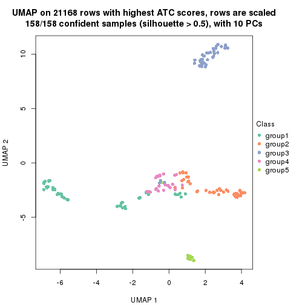</p>

</div>
<div id='tab-ATC-skmeans-dimension-reduction-5'>
<pre><code class="r">dimension_reduction(res, k = 6, method = &quot;UMAP&quot;)
</code></pre>

<p></p>

</div>
</div>


Following heatmap shows how subgroups are split when increasing `k`:

```r
collect_classes(res)
```


Test correlation between subgroups and known annotations. If the known
annotation is numeric, one-way ANOVA test is applied, and if the known
annotation is discrete, chi-squared contingency table test is applied.

```r
test_to_known_factors(res)
```

```
#>               n tissue(p) k
#> ATC:skmeans 157  1.12e-05 2
#> ATC:skmeans 156  5.31e-11 3
#> ATC:skmeans 155  2.17e-16 4
#> ATC:skmeans 158  1.35e-21 5
#> ATC:skmeans 141  2.31e-25 6
```


If matrix rows can be associated to genes, consider to use `functional_enrichment(res,
...)` to perform function enrichment for the signature genes. See [this vignette](http://bioconductor.org/packages/devel/bioc/vignettes/cola/inst/doc/functional_enrichment.html) for more detailed explanations.


 

---------------------------------------------------


### ATC:pam**


The object with results only for a single top-value method and a single partition method 
can be extracted as:

```r
res = res_list["ATC", "pam"]
# you can also extract it by
# res = res_list["ATC:pam"]
```

A summary of `res` and all the functions that can be applied to it:

```r
res
```

```
#> A 'ConsensusPartition' object with k = 2, 3, 4, 5, 6.
#>   On a matrix with 21168 rows and 158 columns.
#>   Top rows (1000, 2000, 3000, 4000, 5000) are extracted by 'ATC' method.
#>   Subgroups are detected by 'pam' method.
#>   Performed in total 1250 partitions by row resampling.
#>   Best k for subgroups seems to be 5.
#> 
#> Following methods can be applied to this 'ConsensusPartition' object:
#>  [1] "cola_report"             "collect_classes"         "collect_plots"          
#>  [4] "collect_stats"           "colnames"                "compare_signatures"     
#>  [7] "consensus_heatmap"       "dimension_reduction"     "functional_enrichment"  
#> [10] "get_anno_col"            "get_anno"                "get_classes"            
#> [13] "get_consensus"           "get_matrix"              "get_membership"         
#> [16] "get_param"               "get_signatures"          "get_stats"              
#> [19] "is_best_k"               "is_stable_k"             "membership_heatmap"     
#> [22] "ncol"                    "nrow"                    "plot_ecdf"              
#> [25] "rownames"                "select_partition_number" "show"                   
#> [28] "suggest_best_k"          "test_to_known_factors"
```

`collect_plots()` function collects all the plots made from `res` for all `k` (number of partitions)
into one single page to provide an easy and fast comparison between different `k`.

```r
collect_plots(res)
```

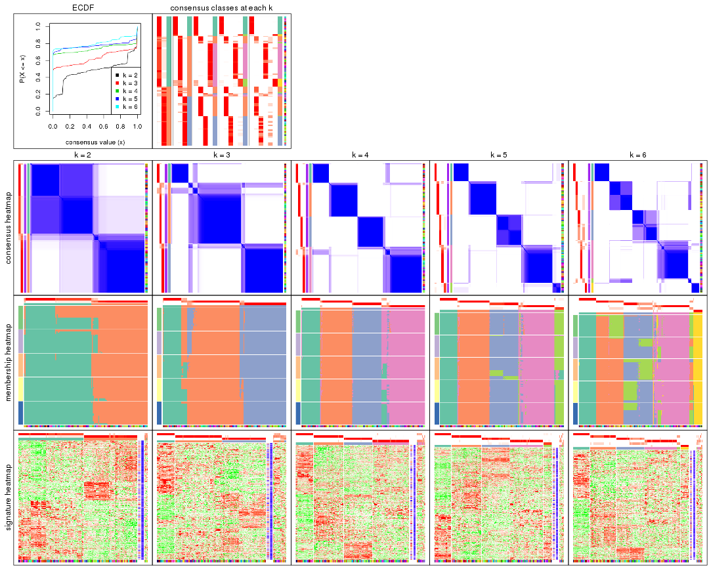

The plots are:

- The first row: a plot of the ECDF (empirical cumulative distribution
  function) curves of the consensus matrix for each `k` and the heatmap of
  predicted classes for each `k`.
- The second row: heatmaps of the consensus matrix for each `k`.
- The third row: heatmaps of the membership matrix for each `k`.
- The fouth row: heatmaps of the signatures for each `k`.

All the plots in panels can be made by individual functions and they are
plotted later in this section.

`select_partition_number()` produces several plots showing different
statistics for choosing "optimized" `k`. There are following statistics:

- ECDF curves of the consensus matrix for each `k`;
- 1-PAC. [The PAC
  score](https://en.wikipedia.org/wiki/Consensus_clustering#Over-interpretation_potential_of_consensus_clustering)
  measures the proportion of the ambiguous subgrouping.
- Mean silhouette score.
- Concordance. The mean probability of fiting the consensus class ids in all
  partitions.
- Area increased. Denote $A_k$ as the area under the ECDF curve for current
  `k`, the area increased is defined as $A_k - A_{k-1}$.
- Rand index. The percent of pairs of samples that are both in a same cluster
  or both are not in a same cluster in the partition of k and k-1.
- Jaccard index. The ratio of pairs of samples are both in a same cluster in
  the partition of k and k-1 and the pairs of samples are both in a same
  cluster in the partition k or k-1.

The detailed explanations of these statistics can be found in [the _cola_
vignette](http://bioconductor.org/packages/devel/bioc/vignettes/cola/inst/doc/cola.html#toc_13).

Generally speaking, lower PAC score, higher mean silhouette score or higher
concordance corresponds to better partition. Rand index and Jaccard index
measure how similar the current partition is compared to partition with `k-1`.
If they are too similar, we won't accept `k` is better than `k-1`.

```r
select_partition_number(res)
```


The numeric values for all these statistics can be obtained by `get_stats()`.

```r
get_stats(res)
```

```
#>   k 1-PAC mean_silhouette concordance area_increased  Rand Jaccard
#> 2 2 0.560           0.901       0.940         0.4797 0.501   0.501
#> 3 3 0.848           0.857       0.947         0.3047 0.762   0.576
#> 4 4 0.916           0.902       0.962         0.1805 0.812   0.551
#> 5 5 0.969           0.913       0.956         0.0494 0.958   0.842
#> 6 6 0.887           0.786       0.863         0.0371 0.979   0.909
```

`suggest_best_k()` suggests the best $k$ based on these statistics. The rules are as follows:

- All $k$ with Jaccard index larger than 0.95 are removed because increasing
  $k$ does not provide enough extra information. If all $k$ are removed, it is
  marked as no subgroup is detected.
- For all $k$ with 1-PAC score larger than 0.9, the maximal $k$ is taken as
  the best $k$, and other $k$ are marked as optional $k$.
- If it does not fit the second rule. The $k$ with the maximal vote of the
  highest 1-PAC score, highest mean silhouette, and highest concordance is
  taken as the best $k$.

```r
suggest_best_k(res)
```

```
#> [1] 5
#> attr(,"optional")
#> [1] 4
```

There is also optional best $k$ = 4 that is worth to check.

Following shows the table of the partitions (You need to click the **show/hide
code output** link to see it). The membership matrix (columns with name `p*`)
is inferred by
[`clue::cl_consensus()`](https://www.rdocumentation.org/link/cl_consensus?package=clue)
function with the `SE` method. Basically the value in the membership matrix
represents the probability to belong to a certain group. The finall class
label for an item is determined with the group with highest probability it
belongs to.

In `get_classes()` function, the entropy is calculated from the membership
matrix and the silhouette score is calculated from the consensus matrix.


<script>
$( function() {
	$( '#tabs-ATC-pam-get-classes' ).tabs();
} );
</script>
<div id='tabs-ATC-pam-get-classes'>
<ul>
<li><a href='#tab-ATC-pam-get-classes-1'>k = 2</a></li>
<li><a href='#tab-ATC-pam-get-classes-2'>k = 3</a></li>
<li><a href='#tab-ATC-pam-get-classes-3'>k = 4</a></li>
<li><a href='#tab-ATC-pam-get-classes-4'>k = 5</a></li>
<li><a href='#tab-ATC-pam-get-classes-5'>k = 6</a></li>
</ul>

<div id='tab-ATC-pam-get-classes-1'>
<p><a id='tab-ATC-pam-get-classes-1-a' style='color:#0366d6' href='#'>show/hide code output</a></p>
<pre><code class="r">cbind(get_classes(res, k = 2), get_membership(res, k = 2))
</code></pre>

<pre><code>#&gt;          class entropy silhouette    p1    p2
#&gt; GSM18927     2  0.0000     0.9518 0.000 1.000
#&gt; GSM18928     2  0.0000     0.9518 0.000 1.000
#&gt; GSM18915     2  0.0000     0.9518 0.000 1.000
#&gt; GSM18916     2  0.0000     0.9518 0.000 1.000
#&gt; GSM18939     2  0.0000     0.9518 0.000 1.000
#&gt; GSM18940     2  0.0000     0.9518 0.000 1.000
#&gt; GSM18933     2  0.7883     0.6678 0.236 0.764
#&gt; GSM18934     2  0.0000     0.9518 0.000 1.000
#&gt; GSM18925     2  0.0000     0.9518 0.000 1.000
#&gt; GSM18926     2  0.0000     0.9518 0.000 1.000
#&gt; GSM18931     2  0.0000     0.9518 0.000 1.000
#&gt; GSM18932     2  0.0000     0.9518 0.000 1.000
#&gt; GSM19019     2  0.8608     0.5869 0.284 0.716
#&gt; GSM19020     2  0.8608     0.5869 0.284 0.716
#&gt; GSM18923     2  0.0000     0.9518 0.000 1.000
#&gt; GSM18924     2  0.0000     0.9518 0.000 1.000
#&gt; GSM18941     2  0.0000     0.9518 0.000 1.000
#&gt; GSM18942     2  0.0000     0.9518 0.000 1.000
#&gt; GSM18929     2  0.0000     0.9518 0.000 1.000
#&gt; GSM18930     2  0.0000     0.9518 0.000 1.000
#&gt; GSM18911     2  0.0000     0.9518 0.000 1.000
#&gt; GSM18912     2  0.0000     0.9518 0.000 1.000
#&gt; GSM18935     2  0.0000     0.9518 0.000 1.000
#&gt; GSM18936     2  0.0000     0.9518 0.000 1.000
#&gt; GSM19005     2  0.0000     0.9518 0.000 1.000
#&gt; GSM19006     2  0.0000     0.9518 0.000 1.000
#&gt; GSM18921     2  0.0000     0.9518 0.000 1.000
#&gt; GSM18922     2  0.0000     0.9518 0.000 1.000
#&gt; GSM18919     2  0.0000     0.9518 0.000 1.000
#&gt; GSM18920     2  0.0000     0.9518 0.000 1.000
#&gt; GSM18917     2  0.0000     0.9518 0.000 1.000
#&gt; GSM18918     2  0.0000     0.9518 0.000 1.000
#&gt; GSM18913     2  0.0000     0.9518 0.000 1.000
#&gt; GSM18914     2  0.0000     0.9518 0.000 1.000
#&gt; GSM18937     2  0.0000     0.9518 0.000 1.000
#&gt; GSM18938     2  0.0000     0.9518 0.000 1.000
#&gt; GSM18943     2  0.4298     0.8728 0.088 0.912
#&gt; GSM18944     2  0.0000     0.9518 0.000 1.000
#&gt; GSM19003     2  0.0000     0.9518 0.000 1.000
#&gt; GSM19004     2  0.0000     0.9518 0.000 1.000
#&gt; GSM19011     2  0.0000     0.9518 0.000 1.000
#&gt; GSM19012     2  0.0000     0.9518 0.000 1.000
#&gt; GSM19009     2  0.0000     0.9518 0.000 1.000
#&gt; GSM19010     2  0.0000     0.9518 0.000 1.000
#&gt; GSM18945     2  0.0000     0.9518 0.000 1.000
#&gt; GSM18946     2  0.0000     0.9518 0.000 1.000
#&gt; GSM18963     1  0.5294     0.9237 0.880 0.120
#&gt; GSM18964     1  0.5294     0.9237 0.880 0.120
#&gt; GSM18905     2  0.9933     0.0705 0.452 0.548
#&gt; GSM18906     1  0.5294     0.9237 0.880 0.120
#&gt; GSM18965     1  0.5294     0.9237 0.880 0.120
#&gt; GSM18966     1  0.5294     0.9237 0.880 0.120
#&gt; GSM18873     1  0.0000     0.9150 1.000 0.000
#&gt; GSM18874     1  0.0000     0.9150 1.000 0.000
#&gt; GSM18973     1  0.0000     0.9150 1.000 0.000
#&gt; GSM18974     1  0.0000     0.9150 1.000 0.000
#&gt; GSM18977     1  0.5294     0.9237 0.880 0.120
#&gt; GSM18978     1  0.5294     0.9237 0.880 0.120
#&gt; GSM18979     1  0.5294     0.9237 0.880 0.120
#&gt; GSM18980     1  0.5294     0.9237 0.880 0.120
#&gt; GSM18883     1  0.0000     0.9150 1.000 0.000
#&gt; GSM18884     1  0.0000     0.9150 1.000 0.000
#&gt; GSM18885     1  0.0000     0.9150 1.000 0.000
#&gt; GSM18886     1  0.0000     0.9150 1.000 0.000
#&gt; GSM18907     1  0.0000     0.9150 1.000 0.000
#&gt; GSM18908     1  0.0000     0.9150 1.000 0.000
#&gt; GSM18909     1  0.5294     0.9237 0.880 0.120
#&gt; GSM18910     1  0.5294     0.9237 0.880 0.120
#&gt; GSM18867     1  0.0000     0.9150 1.000 0.000
#&gt; GSM18868     1  0.0000     0.9150 1.000 0.000
#&gt; GSM18947     1  0.9896     0.3334 0.560 0.440
#&gt; GSM18948     1  0.5294     0.9237 0.880 0.120
#&gt; GSM18995     2  0.2043     0.9314 0.032 0.968
#&gt; GSM18996     2  0.2043     0.9314 0.032 0.968
#&gt; GSM18975     1  0.5294     0.9237 0.880 0.120
#&gt; GSM18976     1  0.5294     0.9237 0.880 0.120
#&gt; GSM18997     2  0.2423     0.9250 0.040 0.960
#&gt; GSM18998     2  0.2236     0.9284 0.036 0.964
#&gt; GSM18967     1  0.5294     0.9237 0.880 0.120
#&gt; GSM18968     1  0.5294     0.9237 0.880 0.120
#&gt; GSM18959     1  0.5294     0.9237 0.880 0.120
#&gt; GSM18960     1  0.5294     0.9237 0.880 0.120
#&gt; GSM19015     2  0.1414     0.9397 0.020 0.980
#&gt; GSM19016     2  0.1184     0.9423 0.016 0.984
#&gt; GSM18957     1  0.5294     0.9237 0.880 0.120
#&gt; GSM18958     1  0.5294     0.9237 0.880 0.120
#&gt; GSM18981     1  0.5294     0.9237 0.880 0.120
#&gt; GSM18982     1  0.5294     0.9237 0.880 0.120
#&gt; GSM18989     2  0.2236     0.9285 0.036 0.964
#&gt; GSM18990     1  0.5294     0.9237 0.880 0.120
#&gt; GSM18985     1  0.5294     0.9237 0.880 0.120
#&gt; GSM18986     1  0.5294     0.9237 0.880 0.120
#&gt; GSM18987     1  0.5629     0.9131 0.868 0.132
#&gt; GSM18988     1  0.5629     0.9131 0.868 0.132
#&gt; GSM18983     2  0.2236     0.9285 0.036 0.964
#&gt; GSM18984     2  0.0376     0.9495 0.004 0.996
#&gt; GSM18951     2  0.3431     0.8978 0.064 0.936
#&gt; GSM18952     1  0.5294     0.9237 0.880 0.120
#&gt; GSM19007     2  0.0000     0.9518 0.000 1.000
#&gt; GSM19008     2  0.0000     0.9518 0.000 1.000
#&gt; GSM18999     2  0.0000     0.9518 0.000 1.000
#&gt; GSM19000     2  0.0000     0.9518 0.000 1.000
#&gt; GSM18889     1  0.0000     0.9150 1.000 0.000
#&gt; GSM18890     1  0.0000     0.9150 1.000 0.000
#&gt; GSM18881     1  0.0000     0.9150 1.000 0.000
#&gt; GSM18882     1  0.0000     0.9150 1.000 0.000
#&gt; GSM18877     1  0.0000     0.9150 1.000 0.000
#&gt; GSM18878     1  0.0000     0.9150 1.000 0.000
#&gt; GSM18875     1  0.0000     0.9150 1.000 0.000
#&gt; GSM18876     1  0.0000     0.9150 1.000 0.000
#&gt; GSM18879     1  0.0000     0.9150 1.000 0.000
#&gt; GSM18880     1  0.0000     0.9150 1.000 0.000
#&gt; GSM18871     1  0.0000     0.9150 1.000 0.000
#&gt; GSM18872     1  0.0000     0.9150 1.000 0.000
#&gt; GSM18903     1  0.5294     0.9237 0.880 0.120
#&gt; GSM18904     1  0.5294     0.9237 0.880 0.120
#&gt; GSM18949     1  0.5294     0.9237 0.880 0.120
#&gt; GSM18950     1  0.5294     0.9237 0.880 0.120
#&gt; GSM18953     2  0.9710     0.2450 0.400 0.600
#&gt; GSM18954     1  0.6712     0.8676 0.824 0.176
#&gt; GSM19013     2  0.0000     0.9518 0.000 1.000
#&gt; GSM19014     2  0.0000     0.9518 0.000 1.000
#&gt; GSM18971     1  0.5294     0.9237 0.880 0.120
#&gt; GSM18972     1  0.5294     0.9237 0.880 0.120
#&gt; GSM18969     1  0.5294     0.9237 0.880 0.120
#&gt; GSM18970     1  0.5408     0.9203 0.876 0.124
#&gt; GSM18869     1  0.0000     0.9150 1.000 0.000
#&gt; GSM18870     1  0.0000     0.9150 1.000 0.000
#&gt; GSM19017     2  0.2043     0.9314 0.032 0.968
#&gt; GSM19018     2  0.2043     0.9314 0.032 0.968
#&gt; GSM18991     1  0.9087     0.6206 0.676 0.324
#&gt; GSM18992     2  0.9170     0.4766 0.332 0.668
#&gt; GSM19021     2  0.8608     0.5869 0.284 0.716
#&gt; GSM19022     2  0.8608     0.5869 0.284 0.716
#&gt; GSM19001     2  0.0000     0.9518 0.000 1.000
#&gt; GSM19002     2  0.0000     0.9518 0.000 1.000
#&gt; GSM18899     1  0.0000     0.9150 1.000 0.000
#&gt; GSM18900     1  0.0000     0.9150 1.000 0.000
#&gt; GSM18961     1  0.5294     0.9237 0.880 0.120
#&gt; GSM18962     1  0.5294     0.9237 0.880 0.120
#&gt; GSM18901     1  0.5294     0.9237 0.880 0.120
#&gt; GSM18902     1  0.5294     0.9237 0.880 0.120
#&gt; GSM18993     1  0.5294     0.9237 0.880 0.120
#&gt; GSM18994     1  0.5294     0.9237 0.880 0.120
#&gt; GSM18865     1  0.5294     0.9237 0.880 0.120
#&gt; GSM18866     1  0.4298     0.9221 0.912 0.088
#&gt; GSM18897     1  0.0000     0.9150 1.000 0.000
#&gt; GSM18898     1  0.0672     0.9158 0.992 0.008
#&gt; GSM18887     1  0.0000     0.9150 1.000 0.000
#&gt; GSM18888     1  0.0000     0.9150 1.000 0.000
#&gt; GSM18893     1  0.0000     0.9150 1.000 0.000
#&gt; GSM18894     1  0.0000     0.9150 1.000 0.000
#&gt; GSM18895     1  0.0000     0.9150 1.000 0.000
#&gt; GSM18896     1  0.0000     0.9150 1.000 0.000
#&gt; GSM18891     1  0.0000     0.9150 1.000 0.000
#&gt; GSM18892     1  0.0000     0.9150 1.000 0.000
#&gt; GSM18955     2  0.0000     0.9518 0.000 1.000
#&gt; GSM18956     1  0.7139     0.8390 0.804 0.196
</code></pre>

<script>
$('#tab-ATC-pam-get-classes-1-a').parent().next().next().hide();
$('#tab-ATC-pam-get-classes-1-a').click(function(){
  $('#tab-ATC-pam-get-classes-1-a').parent().next().next().toggle();
  return(false);
});
</script>
</div>

<div id='tab-ATC-pam-get-classes-2'>
<p><a id='tab-ATC-pam-get-classes-2-a' style='color:#0366d6' href='#'>show/hide code output</a></p>
<pre><code class="r">cbind(get_classes(res, k = 3), get_membership(res, k = 3))
</code></pre>

<pre><code>#&gt;          class entropy silhouette    p1    p2    p3
#&gt; GSM18927     3  0.0000     0.9575 0.000 0.000 1.000
#&gt; GSM18928     3  0.0000     0.9575 0.000 0.000 1.000
#&gt; GSM18915     3  0.0000     0.9575 0.000 0.000 1.000
#&gt; GSM18916     3  0.0000     0.9575 0.000 0.000 1.000
#&gt; GSM18939     3  0.0000     0.9575 0.000 0.000 1.000
#&gt; GSM18940     3  0.0000     0.9575 0.000 0.000 1.000
#&gt; GSM18933     3  0.6008     0.3650 0.000 0.372 0.628
#&gt; GSM18934     3  0.0000     0.9575 0.000 0.000 1.000
#&gt; GSM18925     3  0.0000     0.9575 0.000 0.000 1.000
#&gt; GSM18926     3  0.0000     0.9575 0.000 0.000 1.000
#&gt; GSM18931     3  0.0000     0.9575 0.000 0.000 1.000
#&gt; GSM18932     3  0.0000     0.9575 0.000 0.000 1.000
#&gt; GSM19019     2  0.0237     0.9012 0.000 0.996 0.004
#&gt; GSM19020     2  0.0237     0.9012 0.000 0.996 0.004
#&gt; GSM18923     3  0.0000     0.9575 0.000 0.000 1.000
#&gt; GSM18924     3  0.0000     0.9575 0.000 0.000 1.000
#&gt; GSM18941     3  0.0000     0.9575 0.000 0.000 1.000
#&gt; GSM18942     3  0.0000     0.9575 0.000 0.000 1.000
#&gt; GSM18929     3  0.0000     0.9575 0.000 0.000 1.000
#&gt; GSM18930     3  0.0000     0.9575 0.000 0.000 1.000
#&gt; GSM18911     3  0.0000     0.9575 0.000 0.000 1.000
#&gt; GSM18912     3  0.0000     0.9575 0.000 0.000 1.000
#&gt; GSM18935     3  0.0000     0.9575 0.000 0.000 1.000
#&gt; GSM18936     3  0.0000     0.9575 0.000 0.000 1.000
#&gt; GSM19005     3  0.0000     0.9575 0.000 0.000 1.000
#&gt; GSM19006     3  0.0000     0.9575 0.000 0.000 1.000
#&gt; GSM18921     3  0.0000     0.9575 0.000 0.000 1.000
#&gt; GSM18922     3  0.0000     0.9575 0.000 0.000 1.000
#&gt; GSM18919     3  0.0000     0.9575 0.000 0.000 1.000
#&gt; GSM18920     3  0.0000     0.9575 0.000 0.000 1.000
#&gt; GSM18917     3  0.0000     0.9575 0.000 0.000 1.000
#&gt; GSM18918     3  0.0000     0.9575 0.000 0.000 1.000
#&gt; GSM18913     3  0.0000     0.9575 0.000 0.000 1.000
#&gt; GSM18914     3  0.0000     0.9575 0.000 0.000 1.000
#&gt; GSM18937     3  0.0000     0.9575 0.000 0.000 1.000
#&gt; GSM18938     3  0.0000     0.9575 0.000 0.000 1.000
#&gt; GSM18943     3  0.3038     0.8387 0.000 0.104 0.896
#&gt; GSM18944     3  0.0000     0.9575 0.000 0.000 1.000
#&gt; GSM19003     3  0.0000     0.9575 0.000 0.000 1.000
#&gt; GSM19004     3  0.0000     0.9575 0.000 0.000 1.000
#&gt; GSM19011     3  0.0000     0.9575 0.000 0.000 1.000
#&gt; GSM19012     3  0.0000     0.9575 0.000 0.000 1.000
#&gt; GSM19009     3  0.0000     0.9575 0.000 0.000 1.000
#&gt; GSM19010     3  0.0000     0.9575 0.000 0.000 1.000
#&gt; GSM18945     3  0.0000     0.9575 0.000 0.000 1.000
#&gt; GSM18946     3  0.0000     0.9575 0.000 0.000 1.000
#&gt; GSM18963     2  0.0000     0.9039 0.000 1.000 0.000
#&gt; GSM18964     2  0.0000     0.9039 0.000 1.000 0.000
#&gt; GSM18905     2  0.4121     0.7423 0.000 0.832 0.168
#&gt; GSM18906     2  0.0000     0.9039 0.000 1.000 0.000
#&gt; GSM18965     2  0.0000     0.9039 0.000 1.000 0.000
#&gt; GSM18966     2  0.0000     0.9039 0.000 1.000 0.000
#&gt; GSM18873     1  0.0000     0.9789 1.000 0.000 0.000
#&gt; GSM18874     1  0.0000     0.9789 1.000 0.000 0.000
#&gt; GSM18973     2  0.0000     0.9039 0.000 1.000 0.000
#&gt; GSM18974     2  0.0000     0.9039 0.000 1.000 0.000
#&gt; GSM18977     2  0.0000     0.9039 0.000 1.000 0.000
#&gt; GSM18978     2  0.0000     0.9039 0.000 1.000 0.000
#&gt; GSM18979     2  0.0000     0.9039 0.000 1.000 0.000
#&gt; GSM18980     2  0.0000     0.9039 0.000 1.000 0.000
#&gt; GSM18883     1  0.0000     0.9789 1.000 0.000 0.000
#&gt; GSM18884     1  0.0000     0.9789 1.000 0.000 0.000
#&gt; GSM18885     1  0.0000     0.9789 1.000 0.000 0.000
#&gt; GSM18886     1  0.0000     0.9789 1.000 0.000 0.000
#&gt; GSM18907     1  0.1411     0.9427 0.964 0.036 0.000
#&gt; GSM18908     1  0.0000     0.9789 1.000 0.000 0.000
#&gt; GSM18909     2  0.0000     0.9039 0.000 1.000 0.000
#&gt; GSM18910     2  0.0000     0.9039 0.000 1.000 0.000
#&gt; GSM18867     1  0.0000     0.9789 1.000 0.000 0.000
#&gt; GSM18868     1  0.6168     0.2598 0.588 0.412 0.000
#&gt; GSM18947     2  0.4555     0.7062 0.000 0.800 0.200
#&gt; GSM18948     2  0.0000     0.9039 0.000 1.000 0.000
#&gt; GSM18995     2  0.6309     0.0204 0.000 0.504 0.496
#&gt; GSM18996     3  0.6062     0.3613 0.000 0.384 0.616
#&gt; GSM18975     2  0.0000     0.9039 0.000 1.000 0.000
#&gt; GSM18976     2  0.0000     0.9039 0.000 1.000 0.000
#&gt; GSM18997     2  0.6079     0.3569 0.000 0.612 0.388
#&gt; GSM18998     2  0.6307     0.0507 0.000 0.512 0.488
#&gt; GSM18967     2  0.0000     0.9039 0.000 1.000 0.000
#&gt; GSM18968     2  0.0000     0.9039 0.000 1.000 0.000
#&gt; GSM18959     2  0.0000     0.9039 0.000 1.000 0.000
#&gt; GSM18960     2  0.0000     0.9039 0.000 1.000 0.000
#&gt; GSM19015     3  0.5058     0.6626 0.000 0.244 0.756
#&gt; GSM19016     3  0.4931     0.6822 0.000 0.232 0.768
#&gt; GSM18957     2  0.0000     0.9039 0.000 1.000 0.000
#&gt; GSM18958     2  0.0000     0.9039 0.000 1.000 0.000
#&gt; GSM18981     2  0.0000     0.9039 0.000 1.000 0.000
#&gt; GSM18982     2  0.0000     0.9039 0.000 1.000 0.000
#&gt; GSM18989     2  0.6111     0.3366 0.000 0.604 0.396
#&gt; GSM18990     2  0.0000     0.9039 0.000 1.000 0.000
#&gt; GSM18985     2  0.0000     0.9039 0.000 1.000 0.000
#&gt; GSM18986     2  0.0000     0.9039 0.000 1.000 0.000
#&gt; GSM18987     2  0.0000     0.9039 0.000 1.000 0.000
#&gt; GSM18988     2  0.0000     0.9039 0.000 1.000 0.000
#&gt; GSM18983     2  0.6154     0.3057 0.000 0.592 0.408
#&gt; GSM18984     3  0.0237     0.9535 0.000 0.004 0.996
#&gt; GSM18951     3  0.0000     0.9575 0.000 0.000 1.000
#&gt; GSM18952     2  0.0000     0.9039 0.000 1.000 0.000
#&gt; GSM19007     3  0.0000     0.9575 0.000 0.000 1.000
#&gt; GSM19008     3  0.0000     0.9575 0.000 0.000 1.000
#&gt; GSM18999     3  0.0000     0.9575 0.000 0.000 1.000
#&gt; GSM19000     3  0.0000     0.9575 0.000 0.000 1.000
#&gt; GSM18889     1  0.0000     0.9789 1.000 0.000 0.000
#&gt; GSM18890     1  0.0000     0.9789 1.000 0.000 0.000
#&gt; GSM18881     1  0.0000     0.9789 1.000 0.000 0.000
#&gt; GSM18882     1  0.0000     0.9789 1.000 0.000 0.000
#&gt; GSM18877     1  0.0000     0.9789 1.000 0.000 0.000
#&gt; GSM18878     1  0.0000     0.9789 1.000 0.000 0.000
#&gt; GSM18875     1  0.0000     0.9789 1.000 0.000 0.000
#&gt; GSM18876     1  0.0000     0.9789 1.000 0.000 0.000
#&gt; GSM18879     1  0.0000     0.9789 1.000 0.000 0.000
#&gt; GSM18880     1  0.0000     0.9789 1.000 0.000 0.000
#&gt; GSM18871     1  0.0000     0.9789 1.000 0.000 0.000
#&gt; GSM18872     1  0.0000     0.9789 1.000 0.000 0.000
#&gt; GSM18903     2  0.0000     0.9039 0.000 1.000 0.000
#&gt; GSM18904     2  0.0000     0.9039 0.000 1.000 0.000
#&gt; GSM18949     2  0.0000     0.9039 0.000 1.000 0.000
#&gt; GSM18950     2  0.0000     0.9039 0.000 1.000 0.000
#&gt; GSM18953     2  0.6204     0.2608 0.000 0.576 0.424
#&gt; GSM18954     2  0.2878     0.8184 0.000 0.904 0.096
#&gt; GSM19013     3  0.0000     0.9575 0.000 0.000 1.000
#&gt; GSM19014     3  0.0000     0.9575 0.000 0.000 1.000
#&gt; GSM18971     2  0.0000     0.9039 0.000 1.000 0.000
#&gt; GSM18972     2  0.0000     0.9039 0.000 1.000 0.000
#&gt; GSM18969     2  0.0000     0.9039 0.000 1.000 0.000
#&gt; GSM18970     2  0.0000     0.9039 0.000 1.000 0.000
#&gt; GSM18869     1  0.0000     0.9789 1.000 0.000 0.000
#&gt; GSM18870     1  0.0000     0.9789 1.000 0.000 0.000
#&gt; GSM19017     3  0.5621     0.5418 0.000 0.308 0.692
#&gt; GSM19018     3  0.6008     0.3921 0.000 0.372 0.628
#&gt; GSM18991     2  0.0424     0.8982 0.000 0.992 0.008
#&gt; GSM18992     2  0.1289     0.8784 0.000 0.968 0.032
#&gt; GSM19021     2  0.0000     0.9039 0.000 1.000 0.000
#&gt; GSM19022     2  0.1289     0.8785 0.000 0.968 0.032
#&gt; GSM19001     3  0.0000     0.9575 0.000 0.000 1.000
#&gt; GSM19002     3  0.0000     0.9575 0.000 0.000 1.000
#&gt; GSM18899     2  0.0000     0.9039 0.000 1.000 0.000
#&gt; GSM18900     2  0.0000     0.9039 0.000 1.000 0.000
#&gt; GSM18961     2  0.0000     0.9039 0.000 1.000 0.000
#&gt; GSM18962     2  0.0000     0.9039 0.000 1.000 0.000
#&gt; GSM18901     2  0.0000     0.9039 0.000 1.000 0.000
#&gt; GSM18902     2  0.0000     0.9039 0.000 1.000 0.000
#&gt; GSM18993     2  0.0000     0.9039 0.000 1.000 0.000
#&gt; GSM18994     2  0.0000     0.9039 0.000 1.000 0.000
#&gt; GSM18865     2  0.0000     0.9039 0.000 1.000 0.000
#&gt; GSM18866     2  0.0000     0.9039 0.000 1.000 0.000
#&gt; GSM18897     2  0.0000     0.9039 0.000 1.000 0.000
#&gt; GSM18898     2  0.0000     0.9039 0.000 1.000 0.000
#&gt; GSM18887     2  0.6204     0.2585 0.424 0.576 0.000
#&gt; GSM18888     2  0.6204     0.2585 0.424 0.576 0.000
#&gt; GSM18893     2  0.6204     0.2585 0.424 0.576 0.000
#&gt; GSM18894     2  0.6204     0.2585 0.424 0.576 0.000
#&gt; GSM18895     2  0.5810     0.4609 0.336 0.664 0.000
#&gt; GSM18896     2  0.6204     0.2585 0.424 0.576 0.000
#&gt; GSM18891     2  0.5988     0.3940 0.368 0.632 0.000
#&gt; GSM18892     2  0.0000     0.9039 0.000 1.000 0.000
#&gt; GSM18955     3  0.0000     0.9575 0.000 0.000 1.000
#&gt; GSM18956     2  0.0424     0.8982 0.000 0.992 0.008
</code></pre>

<script>
$('#tab-ATC-pam-get-classes-2-a').parent().next().next().hide();
$('#tab-ATC-pam-get-classes-2-a').click(function(){
  $('#tab-ATC-pam-get-classes-2-a').parent().next().next().toggle();
  return(false);
});
</script>
</div>

<div id='tab-ATC-pam-get-classes-3'>
<p><a id='tab-ATC-pam-get-classes-3-a' style='color:#0366d6' href='#'>show/hide code output</a></p>
<pre><code class="r">cbind(get_classes(res, k = 4), get_membership(res, k = 4))
</code></pre>

<pre><code>#&gt;          class entropy silhouette    p1    p2    p3    p4
#&gt; GSM18927     3  0.0000     0.9918 0.000 0.000 1.000 0.000
#&gt; GSM18928     3  0.0000     0.9918 0.000 0.000 1.000 0.000
#&gt; GSM18915     3  0.0000     0.9918 0.000 0.000 1.000 0.000
#&gt; GSM18916     3  0.0000     0.9918 0.000 0.000 1.000 0.000
#&gt; GSM18939     3  0.0000     0.9918 0.000 0.000 1.000 0.000
#&gt; GSM18940     3  0.0000     0.9918 0.000 0.000 1.000 0.000
#&gt; GSM18933     3  0.0000     0.9918 0.000 0.000 1.000 0.000
#&gt; GSM18934     3  0.0000     0.9918 0.000 0.000 1.000 0.000
#&gt; GSM18925     3  0.0000     0.9918 0.000 0.000 1.000 0.000
#&gt; GSM18926     3  0.0000     0.9918 0.000 0.000 1.000 0.000
#&gt; GSM18931     3  0.0000     0.9918 0.000 0.000 1.000 0.000
#&gt; GSM18932     3  0.0000     0.9918 0.000 0.000 1.000 0.000
#&gt; GSM19019     4  0.4406     0.5676 0.000 0.000 0.300 0.700
#&gt; GSM19020     4  0.4972     0.1820 0.000 0.000 0.456 0.544
#&gt; GSM18923     3  0.0000     0.9918 0.000 0.000 1.000 0.000
#&gt; GSM18924     3  0.0000     0.9918 0.000 0.000 1.000 0.000
#&gt; GSM18941     3  0.0000     0.9918 0.000 0.000 1.000 0.000
#&gt; GSM18942     3  0.2530     0.8640 0.000 0.112 0.888 0.000
#&gt; GSM18929     3  0.0000     0.9918 0.000 0.000 1.000 0.000
#&gt; GSM18930     3  0.0000     0.9918 0.000 0.000 1.000 0.000
#&gt; GSM18911     3  0.0000     0.9918 0.000 0.000 1.000 0.000
#&gt; GSM18912     3  0.0000     0.9918 0.000 0.000 1.000 0.000
#&gt; GSM18935     3  0.0000     0.9918 0.000 0.000 1.000 0.000
#&gt; GSM18936     3  0.0000     0.9918 0.000 0.000 1.000 0.000
#&gt; GSM19005     2  0.0000     0.9679 0.000 1.000 0.000 0.000
#&gt; GSM19006     2  0.0000     0.9679 0.000 1.000 0.000 0.000
#&gt; GSM18921     3  0.0000     0.9918 0.000 0.000 1.000 0.000
#&gt; GSM18922     3  0.0000     0.9918 0.000 0.000 1.000 0.000
#&gt; GSM18919     3  0.0000     0.9918 0.000 0.000 1.000 0.000
#&gt; GSM18920     3  0.0000     0.9918 0.000 0.000 1.000 0.000
#&gt; GSM18917     3  0.0000     0.9918 0.000 0.000 1.000 0.000
#&gt; GSM18918     3  0.0000     0.9918 0.000 0.000 1.000 0.000
#&gt; GSM18913     3  0.0000     0.9918 0.000 0.000 1.000 0.000
#&gt; GSM18914     3  0.0000     0.9918 0.000 0.000 1.000 0.000
#&gt; GSM18937     3  0.0000     0.9918 0.000 0.000 1.000 0.000
#&gt; GSM18938     3  0.0000     0.9918 0.000 0.000 1.000 0.000
#&gt; GSM18943     3  0.0000     0.9918 0.000 0.000 1.000 0.000
#&gt; GSM18944     3  0.0000     0.9918 0.000 0.000 1.000 0.000
#&gt; GSM19003     2  0.0000     0.9679 0.000 1.000 0.000 0.000
#&gt; GSM19004     2  0.0000     0.9679 0.000 1.000 0.000 0.000
#&gt; GSM19011     2  0.0000     0.9679 0.000 1.000 0.000 0.000
#&gt; GSM19012     2  0.0000     0.9679 0.000 1.000 0.000 0.000
#&gt; GSM19009     2  0.0000     0.9679 0.000 1.000 0.000 0.000
#&gt; GSM19010     2  0.0000     0.9679 0.000 1.000 0.000 0.000
#&gt; GSM18945     3  0.0000     0.9918 0.000 0.000 1.000 0.000
#&gt; GSM18946     3  0.0000     0.9918 0.000 0.000 1.000 0.000
#&gt; GSM18963     4  0.0000     0.9157 0.000 0.000 0.000 1.000
#&gt; GSM18964     4  0.0000     0.9157 0.000 0.000 0.000 1.000
#&gt; GSM18905     2  0.0000     0.9679 0.000 1.000 0.000 0.000
#&gt; GSM18906     4  0.0000     0.9157 0.000 0.000 0.000 1.000
#&gt; GSM18965     4  0.0000     0.9157 0.000 0.000 0.000 1.000
#&gt; GSM18966     4  0.0000     0.9157 0.000 0.000 0.000 1.000
#&gt; GSM18873     1  0.0000     0.9780 1.000 0.000 0.000 0.000
#&gt; GSM18874     1  0.0000     0.9780 1.000 0.000 0.000 0.000
#&gt; GSM18973     4  0.0000     0.9157 0.000 0.000 0.000 1.000
#&gt; GSM18974     4  0.0000     0.9157 0.000 0.000 0.000 1.000
#&gt; GSM18977     4  0.0000     0.9157 0.000 0.000 0.000 1.000
#&gt; GSM18978     4  0.0592     0.9027 0.000 0.016 0.000 0.984
#&gt; GSM18979     4  0.0000     0.9157 0.000 0.000 0.000 1.000
#&gt; GSM18980     4  0.0000     0.9157 0.000 0.000 0.000 1.000
#&gt; GSM18883     1  0.0000     0.9780 1.000 0.000 0.000 0.000
#&gt; GSM18884     1  0.0000     0.9780 1.000 0.000 0.000 0.000
#&gt; GSM18885     1  0.0000     0.9780 1.000 0.000 0.000 0.000
#&gt; GSM18886     1  0.0000     0.9780 1.000 0.000 0.000 0.000
#&gt; GSM18907     1  0.1118     0.9414 0.964 0.000 0.000 0.036
#&gt; GSM18908     1  0.0000     0.9780 1.000 0.000 0.000 0.000
#&gt; GSM18909     2  0.4304     0.5926 0.000 0.716 0.000 0.284
#&gt; GSM18910     2  0.0000     0.9679 0.000 1.000 0.000 0.000
#&gt; GSM18867     1  0.0000     0.9780 1.000 0.000 0.000 0.000
#&gt; GSM18868     1  0.4888     0.2036 0.588 0.000 0.000 0.412
#&gt; GSM18947     2  0.0000     0.9679 0.000 1.000 0.000 0.000
#&gt; GSM18948     4  0.0188     0.9126 0.000 0.000 0.004 0.996
#&gt; GSM18995     2  0.0000     0.9679 0.000 1.000 0.000 0.000
#&gt; GSM18996     2  0.0000     0.9679 0.000 1.000 0.000 0.000
#&gt; GSM18975     4  0.0000     0.9157 0.000 0.000 0.000 1.000
#&gt; GSM18976     4  0.0000     0.9157 0.000 0.000 0.000 1.000
#&gt; GSM18997     2  0.0000     0.9679 0.000 1.000 0.000 0.000
#&gt; GSM18998     2  0.0000     0.9679 0.000 1.000 0.000 0.000
#&gt; GSM18967     4  0.0000     0.9157 0.000 0.000 0.000 1.000
#&gt; GSM18968     4  0.0000     0.9157 0.000 0.000 0.000 1.000
#&gt; GSM18959     4  0.0000     0.9157 0.000 0.000 0.000 1.000
#&gt; GSM18960     4  0.0000     0.9157 0.000 0.000 0.000 1.000
#&gt; GSM19015     2  0.0000     0.9679 0.000 1.000 0.000 0.000
#&gt; GSM19016     2  0.0000     0.9679 0.000 1.000 0.000 0.000
#&gt; GSM18957     4  0.0000     0.9157 0.000 0.000 0.000 1.000
#&gt; GSM18958     4  0.0000     0.9157 0.000 0.000 0.000 1.000
#&gt; GSM18981     4  0.0000     0.9157 0.000 0.000 0.000 1.000
#&gt; GSM18982     4  0.0000     0.9157 0.000 0.000 0.000 1.000
#&gt; GSM18989     2  0.0000     0.9679 0.000 1.000 0.000 0.000
#&gt; GSM18990     4  0.1557     0.8668 0.000 0.056 0.000 0.944
#&gt; GSM18985     4  0.0000     0.9157 0.000 0.000 0.000 1.000
#&gt; GSM18986     4  0.0000     0.9157 0.000 0.000 0.000 1.000
#&gt; GSM18987     2  0.4605     0.4923 0.000 0.664 0.000 0.336
#&gt; GSM18988     2  0.0592     0.9516 0.000 0.984 0.000 0.016
#&gt; GSM18983     2  0.0000     0.9679 0.000 1.000 0.000 0.000
#&gt; GSM18984     2  0.0000     0.9679 0.000 1.000 0.000 0.000
#&gt; GSM18951     2  0.0000     0.9679 0.000 1.000 0.000 0.000
#&gt; GSM18952     4  0.0000     0.9157 0.000 0.000 0.000 1.000
#&gt; GSM19007     2  0.0000     0.9679 0.000 1.000 0.000 0.000
#&gt; GSM19008     2  0.0000     0.9679 0.000 1.000 0.000 0.000
#&gt; GSM18999     2  0.0000     0.9679 0.000 1.000 0.000 0.000
#&gt; GSM19000     2  0.0000     0.9679 0.000 1.000 0.000 0.000
#&gt; GSM18889     1  0.0000     0.9780 1.000 0.000 0.000 0.000
#&gt; GSM18890     1  0.0000     0.9780 1.000 0.000 0.000 0.000
#&gt; GSM18881     1  0.0000     0.9780 1.000 0.000 0.000 0.000
#&gt; GSM18882     1  0.0000     0.9780 1.000 0.000 0.000 0.000
#&gt; GSM18877     1  0.0000     0.9780 1.000 0.000 0.000 0.000
#&gt; GSM18878     1  0.0000     0.9780 1.000 0.000 0.000 0.000
#&gt; GSM18875     1  0.0000     0.9780 1.000 0.000 0.000 0.000
#&gt; GSM18876     1  0.0000     0.9780 1.000 0.000 0.000 0.000
#&gt; GSM18879     1  0.0000     0.9780 1.000 0.000 0.000 0.000
#&gt; GSM18880     1  0.0000     0.9780 1.000 0.000 0.000 0.000
#&gt; GSM18871     1  0.0000     0.9780 1.000 0.000 0.000 0.000
#&gt; GSM18872     1  0.0000     0.9780 1.000 0.000 0.000 0.000
#&gt; GSM18903     4  0.0000     0.9157 0.000 0.000 0.000 1.000
#&gt; GSM18904     4  0.0000     0.9157 0.000 0.000 0.000 1.000
#&gt; GSM18949     4  0.0000     0.9157 0.000 0.000 0.000 1.000
#&gt; GSM18950     4  0.0000     0.9157 0.000 0.000 0.000 1.000
#&gt; GSM18953     2  0.0000     0.9679 0.000 1.000 0.000 0.000
#&gt; GSM18954     2  0.0000     0.9679 0.000 1.000 0.000 0.000
#&gt; GSM19013     2  0.0000     0.9679 0.000 1.000 0.000 0.000
#&gt; GSM19014     2  0.0000     0.9679 0.000 1.000 0.000 0.000
#&gt; GSM18971     4  0.0000     0.9157 0.000 0.000 0.000 1.000
#&gt; GSM18972     4  0.0000     0.9157 0.000 0.000 0.000 1.000
#&gt; GSM18969     4  0.0000     0.9157 0.000 0.000 0.000 1.000
#&gt; GSM18970     2  0.0000     0.9679 0.000 1.000 0.000 0.000
#&gt; GSM18869     1  0.0000     0.9780 1.000 0.000 0.000 0.000
#&gt; GSM18870     1  0.0000     0.9780 1.000 0.000 0.000 0.000
#&gt; GSM19017     2  0.0000     0.9679 0.000 1.000 0.000 0.000
#&gt; GSM19018     2  0.0000     0.9679 0.000 1.000 0.000 0.000
#&gt; GSM18991     2  0.0000     0.9679 0.000 1.000 0.000 0.000
#&gt; GSM18992     2  0.0000     0.9679 0.000 1.000 0.000 0.000
#&gt; GSM19021     4  0.4998     0.0919 0.000 0.000 0.488 0.512
#&gt; GSM19022     3  0.2921     0.8188 0.000 0.000 0.860 0.140
#&gt; GSM19001     2  0.0000     0.9679 0.000 1.000 0.000 0.000
#&gt; GSM19002     2  0.0000     0.9679 0.000 1.000 0.000 0.000
#&gt; GSM18899     4  0.0000     0.9157 0.000 0.000 0.000 1.000
#&gt; GSM18900     4  0.0000     0.9157 0.000 0.000 0.000 1.000
#&gt; GSM18961     4  0.0000     0.9157 0.000 0.000 0.000 1.000
#&gt; GSM18962     4  0.0000     0.9157 0.000 0.000 0.000 1.000
#&gt; GSM18901     4  0.0000     0.9157 0.000 0.000 0.000 1.000
#&gt; GSM18902     4  0.0000     0.9157 0.000 0.000 0.000 1.000
#&gt; GSM18993     4  0.2345     0.8214 0.000 0.100 0.000 0.900
#&gt; GSM18994     4  0.0000     0.9157 0.000 0.000 0.000 1.000
#&gt; GSM18865     4  0.0000     0.9157 0.000 0.000 0.000 1.000
#&gt; GSM18866     4  0.0000     0.9157 0.000 0.000 0.000 1.000
#&gt; GSM18897     4  0.0000     0.9157 0.000 0.000 0.000 1.000
#&gt; GSM18898     4  0.0000     0.9157 0.000 0.000 0.000 1.000
#&gt; GSM18887     4  0.4916     0.3162 0.424 0.000 0.000 0.576
#&gt; GSM18888     4  0.4916     0.3162 0.424 0.000 0.000 0.576
#&gt; GSM18893     4  0.4916     0.3162 0.424 0.000 0.000 0.576
#&gt; GSM18894     4  0.4916     0.3162 0.424 0.000 0.000 0.576
#&gt; GSM18895     4  0.4605     0.5058 0.336 0.000 0.000 0.664
#&gt; GSM18896     4  0.4916     0.3162 0.424 0.000 0.000 0.576
#&gt; GSM18891     4  0.4746     0.4432 0.368 0.000 0.000 0.632
#&gt; GSM18892     4  0.0000     0.9157 0.000 0.000 0.000 1.000
#&gt; GSM18955     2  0.0000     0.9679 0.000 1.000 0.000 0.000
#&gt; GSM18956     2  0.4961     0.2108 0.000 0.552 0.000 0.448
</code></pre>

<script>
$('#tab-ATC-pam-get-classes-3-a').parent().next().next().hide();
$('#tab-ATC-pam-get-classes-3-a').click(function(){
  $('#tab-ATC-pam-get-classes-3-a').parent().next().next().toggle();
  return(false);
});
</script>
</div>

<div id='tab-ATC-pam-get-classes-4'>
<p><a id='tab-ATC-pam-get-classes-4-a' style='color:#0366d6' href='#'>show/hide code output</a></p>
<pre><code class="r">cbind(get_classes(res, k = 5), get_membership(res, k = 5))
</code></pre>

<pre><code>#&gt;          class entropy silhouette    p1    p2    p3    p4    p5
#&gt; GSM18927     3  0.1965     0.9453 0.000 0.000 0.904 0.000 0.096
#&gt; GSM18928     3  0.1965     0.9453 0.000 0.000 0.904 0.000 0.096
#&gt; GSM18915     3  0.0000     0.9496 0.000 0.000 1.000 0.000 0.000
#&gt; GSM18916     3  0.0000     0.9496 0.000 0.000 1.000 0.000 0.000
#&gt; GSM18939     3  0.0000     0.9496 0.000 0.000 1.000 0.000 0.000
#&gt; GSM18940     3  0.0510     0.9499 0.000 0.000 0.984 0.000 0.016
#&gt; GSM18933     3  0.1965     0.9453 0.000 0.000 0.904 0.000 0.096
#&gt; GSM18934     3  0.1965     0.9453 0.000 0.000 0.904 0.000 0.096
#&gt; GSM18925     3  0.0000     0.9496 0.000 0.000 1.000 0.000 0.000
#&gt; GSM18926     3  0.0000     0.9496 0.000 0.000 1.000 0.000 0.000
#&gt; GSM18931     3  0.1965     0.9453 0.000 0.000 0.904 0.000 0.096
#&gt; GSM18932     3  0.1965     0.9453 0.000 0.000 0.904 0.000 0.096
#&gt; GSM19019     4  0.3796     0.5484 0.000 0.000 0.300 0.700 0.000
#&gt; GSM19020     4  0.4278     0.1857 0.000 0.000 0.452 0.548 0.000
#&gt; GSM18923     3  0.0000     0.9496 0.000 0.000 1.000 0.000 0.000
#&gt; GSM18924     3  0.0000     0.9496 0.000 0.000 1.000 0.000 0.000
#&gt; GSM18941     3  0.0000     0.9496 0.000 0.000 1.000 0.000 0.000
#&gt; GSM18942     3  0.2179     0.8251 0.000 0.112 0.888 0.000 0.000
#&gt; GSM18929     3  0.1965     0.9453 0.000 0.000 0.904 0.000 0.096
#&gt; GSM18930     3  0.1965     0.9453 0.000 0.000 0.904 0.000 0.096
#&gt; GSM18911     3  0.0000     0.9496 0.000 0.000 1.000 0.000 0.000
#&gt; GSM18912     3  0.0000     0.9496 0.000 0.000 1.000 0.000 0.000
#&gt; GSM18935     3  0.1965     0.9453 0.000 0.000 0.904 0.000 0.096
#&gt; GSM18936     3  0.1965     0.9453 0.000 0.000 0.904 0.000 0.096
#&gt; GSM19005     2  0.0000     0.9654 0.000 1.000 0.000 0.000 0.000
#&gt; GSM19006     2  0.0000     0.9654 0.000 1.000 0.000 0.000 0.000
#&gt; GSM18921     3  0.1965     0.9453 0.000 0.000 0.904 0.000 0.096
#&gt; GSM18922     3  0.1965     0.9453 0.000 0.000 0.904 0.000 0.096
#&gt; GSM18919     3  0.1121     0.9490 0.000 0.000 0.956 0.000 0.044
#&gt; GSM18920     3  0.0162     0.9498 0.000 0.000 0.996 0.000 0.004
#&gt; GSM18917     3  0.0000     0.9496 0.000 0.000 1.000 0.000 0.000
#&gt; GSM18918     3  0.0000     0.9496 0.000 0.000 1.000 0.000 0.000
#&gt; GSM18913     3  0.0000     0.9496 0.000 0.000 1.000 0.000 0.000
#&gt; GSM18914     3  0.0000     0.9496 0.000 0.000 1.000 0.000 0.000
#&gt; GSM18937     3  0.0000     0.9496 0.000 0.000 1.000 0.000 0.000
#&gt; GSM18938     3  0.0000     0.9496 0.000 0.000 1.000 0.000 0.000
#&gt; GSM18943     3  0.1965     0.9453 0.000 0.000 0.904 0.000 0.096
#&gt; GSM18944     3  0.1965     0.9453 0.000 0.000 0.904 0.000 0.096
#&gt; GSM19003     2  0.0000     0.9654 0.000 1.000 0.000 0.000 0.000
#&gt; GSM19004     2  0.0000     0.9654 0.000 1.000 0.000 0.000 0.000
#&gt; GSM19011     2  0.0000     0.9654 0.000 1.000 0.000 0.000 0.000
#&gt; GSM19012     2  0.0000     0.9654 0.000 1.000 0.000 0.000 0.000
#&gt; GSM19009     2  0.0000     0.9654 0.000 1.000 0.000 0.000 0.000
#&gt; GSM19010     2  0.0000     0.9654 0.000 1.000 0.000 0.000 0.000
#&gt; GSM18945     3  0.1965     0.9453 0.000 0.000 0.904 0.000 0.096
#&gt; GSM18946     3  0.1965     0.9453 0.000 0.000 0.904 0.000 0.096
#&gt; GSM18963     4  0.0000     0.9369 0.000 0.000 0.000 1.000 0.000
#&gt; GSM18964     4  0.0000     0.9369 0.000 0.000 0.000 1.000 0.000
#&gt; GSM18905     2  0.0000     0.9654 0.000 1.000 0.000 0.000 0.000
#&gt; GSM18906     4  0.0000     0.9369 0.000 0.000 0.000 1.000 0.000
#&gt; GSM18965     4  0.0000     0.9369 0.000 0.000 0.000 1.000 0.000
#&gt; GSM18966     4  0.0000     0.9369 0.000 0.000 0.000 1.000 0.000
#&gt; GSM18873     1  0.0000     0.9989 1.000 0.000 0.000 0.000 0.000
#&gt; GSM18874     1  0.0000     0.9989 1.000 0.000 0.000 0.000 0.000
#&gt; GSM18973     4  0.3534     0.6285 0.000 0.000 0.000 0.744 0.256
#&gt; GSM18974     4  0.2966     0.7443 0.000 0.000 0.000 0.816 0.184
#&gt; GSM18977     4  0.0000     0.9369 0.000 0.000 0.000 1.000 0.000
#&gt; GSM18978     4  0.0510     0.9229 0.000 0.016 0.000 0.984 0.000
#&gt; GSM18979     4  0.0000     0.9369 0.000 0.000 0.000 1.000 0.000
#&gt; GSM18980     4  0.0000     0.9369 0.000 0.000 0.000 1.000 0.000
#&gt; GSM18883     1  0.0000     0.9989 1.000 0.000 0.000 0.000 0.000
#&gt; GSM18884     1  0.0000     0.9989 1.000 0.000 0.000 0.000 0.000
#&gt; GSM18885     1  0.0000     0.9989 1.000 0.000 0.000 0.000 0.000
#&gt; GSM18886     1  0.0000     0.9989 1.000 0.000 0.000 0.000 0.000
#&gt; GSM18907     5  0.1965     0.8959 0.096 0.000 0.000 0.000 0.904
#&gt; GSM18908     1  0.0609     0.9772 0.980 0.000 0.000 0.000 0.020
#&gt; GSM18909     2  0.3707     0.5726 0.000 0.716 0.000 0.284 0.000
#&gt; GSM18910     2  0.0000     0.9654 0.000 1.000 0.000 0.000 0.000
#&gt; GSM18867     1  0.0000     0.9989 1.000 0.000 0.000 0.000 0.000
#&gt; GSM18868     5  0.4528     0.3038 0.444 0.000 0.000 0.008 0.548
#&gt; GSM18947     2  0.0000     0.9654 0.000 1.000 0.000 0.000 0.000
#&gt; GSM18948     4  0.0162     0.9337 0.000 0.000 0.004 0.996 0.000
#&gt; GSM18995     2  0.0000     0.9654 0.000 1.000 0.000 0.000 0.000
#&gt; GSM18996     2  0.0000     0.9654 0.000 1.000 0.000 0.000 0.000
#&gt; GSM18975     4  0.0000     0.9369 0.000 0.000 0.000 1.000 0.000
#&gt; GSM18976     4  0.0000     0.9369 0.000 0.000 0.000 1.000 0.000
#&gt; GSM18997     2  0.0000     0.9654 0.000 1.000 0.000 0.000 0.000
#&gt; GSM18998     2  0.0000     0.9654 0.000 1.000 0.000 0.000 0.000
#&gt; GSM18967     4  0.0000     0.9369 0.000 0.000 0.000 1.000 0.000
#&gt; GSM18968     4  0.0000     0.9369 0.000 0.000 0.000 1.000 0.000
#&gt; GSM18959     4  0.0000     0.9369 0.000 0.000 0.000 1.000 0.000
#&gt; GSM18960     4  0.0000     0.9369 0.000 0.000 0.000 1.000 0.000
#&gt; GSM19015     2  0.0000     0.9654 0.000 1.000 0.000 0.000 0.000
#&gt; GSM19016     2  0.0000     0.9654 0.000 1.000 0.000 0.000 0.000
#&gt; GSM18957     4  0.0000     0.9369 0.000 0.000 0.000 1.000 0.000
#&gt; GSM18958     4  0.0000     0.9369 0.000 0.000 0.000 1.000 0.000
#&gt; GSM18981     4  0.0000     0.9369 0.000 0.000 0.000 1.000 0.000
#&gt; GSM18982     4  0.0000     0.9369 0.000 0.000 0.000 1.000 0.000
#&gt; GSM18989     2  0.0000     0.9654 0.000 1.000 0.000 0.000 0.000
#&gt; GSM18990     4  0.1341     0.8815 0.000 0.056 0.000 0.944 0.000
#&gt; GSM18985     4  0.0000     0.9369 0.000 0.000 0.000 1.000 0.000
#&gt; GSM18986     4  0.0000     0.9369 0.000 0.000 0.000 1.000 0.000
#&gt; GSM18987     2  0.3966     0.4829 0.000 0.664 0.000 0.336 0.000
#&gt; GSM18988     2  0.0510     0.9475 0.000 0.984 0.000 0.016 0.000
#&gt; GSM18983     2  0.0000     0.9654 0.000 1.000 0.000 0.000 0.000
#&gt; GSM18984     2  0.0000     0.9654 0.000 1.000 0.000 0.000 0.000
#&gt; GSM18951     2  0.0000     0.9654 0.000 1.000 0.000 0.000 0.000
#&gt; GSM18952     4  0.0000     0.9369 0.000 0.000 0.000 1.000 0.000
#&gt; GSM19007     2  0.0000     0.9654 0.000 1.000 0.000 0.000 0.000
#&gt; GSM19008     2  0.0000     0.9654 0.000 1.000 0.000 0.000 0.000
#&gt; GSM18999     2  0.0000     0.9654 0.000 1.000 0.000 0.000 0.000
#&gt; GSM19000     2  0.0000     0.9654 0.000 1.000 0.000 0.000 0.000
#&gt; GSM18889     1  0.0000     0.9989 1.000 0.000 0.000 0.000 0.000
#&gt; GSM18890     1  0.0000     0.9989 1.000 0.000 0.000 0.000 0.000
#&gt; GSM18881     1  0.0000     0.9989 1.000 0.000 0.000 0.000 0.000
#&gt; GSM18882     1  0.0000     0.9989 1.000 0.000 0.000 0.000 0.000
#&gt; GSM18877     1  0.0000     0.9989 1.000 0.000 0.000 0.000 0.000
#&gt; GSM18878     1  0.0000     0.9989 1.000 0.000 0.000 0.000 0.000
#&gt; GSM18875     1  0.0000     0.9989 1.000 0.000 0.000 0.000 0.000
#&gt; GSM18876     1  0.0000     0.9989 1.000 0.000 0.000 0.000 0.000
#&gt; GSM18879     1  0.0000     0.9989 1.000 0.000 0.000 0.000 0.000
#&gt; GSM18880     1  0.0000     0.9989 1.000 0.000 0.000 0.000 0.000
#&gt; GSM18871     1  0.0000     0.9989 1.000 0.000 0.000 0.000 0.000
#&gt; GSM18872     1  0.0000     0.9989 1.000 0.000 0.000 0.000 0.000
#&gt; GSM18903     4  0.0000     0.9369 0.000 0.000 0.000 1.000 0.000
#&gt; GSM18904     4  0.0000     0.9369 0.000 0.000 0.000 1.000 0.000
#&gt; GSM18949     4  0.0000     0.9369 0.000 0.000 0.000 1.000 0.000
#&gt; GSM18950     4  0.0000     0.9369 0.000 0.000 0.000 1.000 0.000
#&gt; GSM18953     2  0.0000     0.9654 0.000 1.000 0.000 0.000 0.000
#&gt; GSM18954     2  0.0000     0.9654 0.000 1.000 0.000 0.000 0.000
#&gt; GSM19013     2  0.0000     0.9654 0.000 1.000 0.000 0.000 0.000
#&gt; GSM19014     2  0.0000     0.9654 0.000 1.000 0.000 0.000 0.000
#&gt; GSM18971     4  0.0000     0.9369 0.000 0.000 0.000 1.000 0.000
#&gt; GSM18972     4  0.0000     0.9369 0.000 0.000 0.000 1.000 0.000
#&gt; GSM18969     4  0.0000     0.9369 0.000 0.000 0.000 1.000 0.000
#&gt; GSM18970     2  0.0000     0.9654 0.000 1.000 0.000 0.000 0.000
#&gt; GSM18869     1  0.0000     0.9989 1.000 0.000 0.000 0.000 0.000
#&gt; GSM18870     1  0.0000     0.9989 1.000 0.000 0.000 0.000 0.000
#&gt; GSM19017     2  0.0000     0.9654 0.000 1.000 0.000 0.000 0.000
#&gt; GSM19018     2  0.0000     0.9654 0.000 1.000 0.000 0.000 0.000
#&gt; GSM18991     2  0.0000     0.9654 0.000 1.000 0.000 0.000 0.000
#&gt; GSM18992     2  0.0000     0.9654 0.000 1.000 0.000 0.000 0.000
#&gt; GSM19021     4  0.5721     0.0393 0.000 0.000 0.424 0.492 0.084
#&gt; GSM19022     3  0.4252     0.7417 0.000 0.000 0.764 0.172 0.064
#&gt; GSM19001     2  0.0000     0.9654 0.000 1.000 0.000 0.000 0.000
#&gt; GSM19002     2  0.0000     0.9654 0.000 1.000 0.000 0.000 0.000
#&gt; GSM18899     4  0.0000     0.9369 0.000 0.000 0.000 1.000 0.000
#&gt; GSM18900     4  0.0000     0.9369 0.000 0.000 0.000 1.000 0.000
#&gt; GSM18961     4  0.0000     0.9369 0.000 0.000 0.000 1.000 0.000
#&gt; GSM18962     4  0.0000     0.9369 0.000 0.000 0.000 1.000 0.000
#&gt; GSM18901     4  0.4235     0.2226 0.000 0.000 0.000 0.576 0.424
#&gt; GSM18902     4  0.1478     0.8833 0.000 0.000 0.000 0.936 0.064
#&gt; GSM18993     4  0.2020     0.8289 0.000 0.100 0.000 0.900 0.000
#&gt; GSM18994     4  0.0000     0.9369 0.000 0.000 0.000 1.000 0.000
#&gt; GSM18865     4  0.0703     0.9186 0.000 0.000 0.000 0.976 0.024
#&gt; GSM18866     4  0.0000     0.9369 0.000 0.000 0.000 1.000 0.000
#&gt; GSM18897     5  0.1965     0.8725 0.000 0.000 0.000 0.096 0.904
#&gt; GSM18898     5  0.1965     0.8725 0.000 0.000 0.000 0.096 0.904
#&gt; GSM18887     5  0.2136     0.9062 0.088 0.000 0.000 0.008 0.904
#&gt; GSM18888     5  0.2136     0.9062 0.088 0.000 0.000 0.008 0.904
#&gt; GSM18893     5  0.2136     0.9062 0.088 0.000 0.000 0.008 0.904
#&gt; GSM18894     5  0.2136     0.9062 0.088 0.000 0.000 0.008 0.904
#&gt; GSM18895     5  0.2300     0.8893 0.024 0.000 0.000 0.072 0.904
#&gt; GSM18896     5  0.2136     0.9062 0.088 0.000 0.000 0.008 0.904
#&gt; GSM18891     5  0.2378     0.8998 0.048 0.000 0.000 0.048 0.904
#&gt; GSM18892     5  0.1965     0.8725 0.000 0.000 0.000 0.096 0.904
#&gt; GSM18955     2  0.0000     0.9654 0.000 1.000 0.000 0.000 0.000
#&gt; GSM18956     2  0.4273     0.1906 0.000 0.552 0.000 0.448 0.000
</code></pre>

<script>
$('#tab-ATC-pam-get-classes-4-a').parent().next().next().hide();
$('#tab-ATC-pam-get-classes-4-a').click(function(){
  $('#tab-ATC-pam-get-classes-4-a').parent().next().next().toggle();
  return(false);
});
</script>
</div>

<div id='tab-ATC-pam-get-classes-5'>
<p><a id='tab-ATC-pam-get-classes-5-a' style='color:#0366d6' href='#'>show/hide code output</a></p>
<pre><code class="r">cbind(get_classes(res, k = 6), get_membership(res, k = 6))
</code></pre>

<pre><code>#&gt;          class entropy silhouette    p1    p2    p3    p4    p5    p6
#&gt; GSM18927     3  0.3868      0.739 0.000 0.000 0.508 0.000 0.492 0.000
#&gt; GSM18928     3  0.3868      0.739 0.000 0.000 0.508 0.000 0.492 0.000
#&gt; GSM18915     3  0.0000      0.741 0.000 0.000 1.000 0.000 0.000 0.000
#&gt; GSM18916     3  0.0000      0.741 0.000 0.000 1.000 0.000 0.000 0.000
#&gt; GSM18939     3  0.0000      0.741 0.000 0.000 1.000 0.000 0.000 0.000
#&gt; GSM18940     3  0.2912      0.751 0.000 0.000 0.784 0.000 0.216 0.000
#&gt; GSM18933     3  0.3868      0.739 0.000 0.000 0.508 0.000 0.492 0.000
#&gt; GSM18934     3  0.3868      0.739 0.000 0.000 0.508 0.000 0.492 0.000
#&gt; GSM18925     3  0.0000      0.741 0.000 0.000 1.000 0.000 0.000 0.000
#&gt; GSM18926     3  0.0000      0.741 0.000 0.000 1.000 0.000 0.000 0.000
#&gt; GSM18931     3  0.3868      0.739 0.000 0.000 0.508 0.000 0.492 0.000
#&gt; GSM18932     3  0.3868      0.739 0.000 0.000 0.508 0.000 0.492 0.000
#&gt; GSM19019     4  0.3342      0.648 0.000 0.000 0.228 0.760 0.012 0.000
#&gt; GSM19020     4  0.3883      0.445 0.000 0.000 0.332 0.656 0.012 0.000
#&gt; GSM18923     3  0.0000      0.741 0.000 0.000 1.000 0.000 0.000 0.000
#&gt; GSM18924     3  0.0000      0.741 0.000 0.000 1.000 0.000 0.000 0.000
#&gt; GSM18941     3  0.0260      0.735 0.000 0.008 0.992 0.000 0.000 0.000
#&gt; GSM18942     3  0.2823      0.530 0.000 0.204 0.796 0.000 0.000 0.000
#&gt; GSM18929     3  0.3868      0.739 0.000 0.000 0.508 0.000 0.492 0.000
#&gt; GSM18930     3  0.3868      0.739 0.000 0.000 0.508 0.000 0.492 0.000
#&gt; GSM18911     3  0.0000      0.741 0.000 0.000 1.000 0.000 0.000 0.000
#&gt; GSM18912     3  0.0000      0.741 0.000 0.000 1.000 0.000 0.000 0.000
#&gt; GSM18935     3  0.3843      0.743 0.000 0.000 0.548 0.000 0.452 0.000
#&gt; GSM18936     3  0.3868      0.739 0.000 0.000 0.508 0.000 0.492 0.000
#&gt; GSM19005     2  0.0000      0.720 0.000 1.000 0.000 0.000 0.000 0.000
#&gt; GSM19006     2  0.0000      0.720 0.000 1.000 0.000 0.000 0.000 0.000
#&gt; GSM18921     3  0.3868      0.739 0.000 0.000 0.508 0.000 0.492 0.000
#&gt; GSM18922     3  0.3868      0.739 0.000 0.000 0.508 0.000 0.492 0.000
#&gt; GSM18919     3  0.3620      0.748 0.000 0.000 0.648 0.000 0.352 0.000
#&gt; GSM18920     3  0.2912      0.751 0.000 0.000 0.784 0.000 0.216 0.000
#&gt; GSM18917     3  0.0000      0.741 0.000 0.000 1.000 0.000 0.000 0.000
#&gt; GSM18918     3  0.0000      0.741 0.000 0.000 1.000 0.000 0.000 0.000
#&gt; GSM18913     3  0.0000      0.741 0.000 0.000 1.000 0.000 0.000 0.000
#&gt; GSM18914     3  0.0000      0.741 0.000 0.000 1.000 0.000 0.000 0.000
#&gt; GSM18937     3  0.0000      0.741 0.000 0.000 1.000 0.000 0.000 0.000
#&gt; GSM18938     3  0.0000      0.741 0.000 0.000 1.000 0.000 0.000 0.000
#&gt; GSM18943     3  0.3868      0.739 0.000 0.000 0.508 0.000 0.492 0.000
#&gt; GSM18944     3  0.3868      0.739 0.000 0.000 0.508 0.000 0.492 0.000
#&gt; GSM19003     2  0.0000      0.720 0.000 1.000 0.000 0.000 0.000 0.000
#&gt; GSM19004     2  0.0000      0.720 0.000 1.000 0.000 0.000 0.000 0.000
#&gt; GSM19011     2  0.0000      0.720 0.000 1.000 0.000 0.000 0.000 0.000
#&gt; GSM19012     2  0.0000      0.720 0.000 1.000 0.000 0.000 0.000 0.000
#&gt; GSM19009     2  0.0000      0.720 0.000 1.000 0.000 0.000 0.000 0.000
#&gt; GSM19010     2  0.0000      0.720 0.000 1.000 0.000 0.000 0.000 0.000
#&gt; GSM18945     3  0.3868      0.739 0.000 0.000 0.508 0.000 0.492 0.000
#&gt; GSM18946     3  0.3868      0.739 0.000 0.000 0.508 0.000 0.492 0.000
#&gt; GSM18963     4  0.0000      0.900 0.000 0.000 0.000 1.000 0.000 0.000
#&gt; GSM18964     4  0.0000      0.900 0.000 0.000 0.000 1.000 0.000 0.000
#&gt; GSM18905     2  0.2823      0.704 0.000 0.796 0.000 0.000 0.204 0.000
#&gt; GSM18906     4  0.0000      0.900 0.000 0.000 0.000 1.000 0.000 0.000
#&gt; GSM18965     4  0.0000      0.900 0.000 0.000 0.000 1.000 0.000 0.000
#&gt; GSM18966     4  0.0000      0.900 0.000 0.000 0.000 1.000 0.000 0.000
#&gt; GSM18873     1  0.0000      0.998 1.000 0.000 0.000 0.000 0.000 0.000
#&gt; GSM18874     1  0.0000      0.998 1.000 0.000 0.000 0.000 0.000 0.000
#&gt; GSM18973     4  0.3428      0.567 0.000 0.000 0.000 0.696 0.000 0.304
#&gt; GSM18974     4  0.2664      0.741 0.000 0.000 0.000 0.816 0.000 0.184
#&gt; GSM18977     4  0.0000      0.900 0.000 0.000 0.000 1.000 0.000 0.000
#&gt; GSM18978     4  0.0632      0.884 0.000 0.000 0.000 0.976 0.024 0.000
#&gt; GSM18979     4  0.0000      0.900 0.000 0.000 0.000 1.000 0.000 0.000
#&gt; GSM18980     4  0.0000      0.900 0.000 0.000 0.000 1.000 0.000 0.000
#&gt; GSM18883     1  0.0000      0.998 1.000 0.000 0.000 0.000 0.000 0.000
#&gt; GSM18884     1  0.0000      0.998 1.000 0.000 0.000 0.000 0.000 0.000
#&gt; GSM18885     1  0.0000      0.998 1.000 0.000 0.000 0.000 0.000 0.000
#&gt; GSM18886     1  0.0000      0.998 1.000 0.000 0.000 0.000 0.000 0.000
#&gt; GSM18907     6  0.0000      0.964 0.000 0.000 0.000 0.000 0.000 1.000
#&gt; GSM18908     1  0.0865      0.961 0.964 0.000 0.000 0.000 0.000 0.036
#&gt; GSM18909     2  0.4363     -0.076 0.000 0.636 0.000 0.324 0.040 0.000
#&gt; GSM18910     2  0.3012      0.695 0.000 0.796 0.000 0.008 0.196 0.000
#&gt; GSM18867     1  0.0000      0.998 1.000 0.000 0.000 0.000 0.000 0.000
#&gt; GSM18868     6  0.3634      0.439 0.356 0.000 0.000 0.000 0.000 0.644
#&gt; GSM18947     2  0.2823      0.704 0.000 0.796 0.000 0.000 0.204 0.000
#&gt; GSM18948     4  0.0291      0.896 0.000 0.000 0.004 0.992 0.004 0.000
#&gt; GSM18995     2  0.2823      0.704 0.000 0.796 0.000 0.000 0.204 0.000
#&gt; GSM18996     2  0.2823      0.704 0.000 0.796 0.000 0.000 0.204 0.000
#&gt; GSM18975     4  0.0000      0.900 0.000 0.000 0.000 1.000 0.000 0.000
#&gt; GSM18976     4  0.0000      0.900 0.000 0.000 0.000 1.000 0.000 0.000
#&gt; GSM18997     2  0.2793      0.705 0.000 0.800 0.000 0.000 0.200 0.000
#&gt; GSM18998     2  0.2793      0.705 0.000 0.800 0.000 0.000 0.200 0.000
#&gt; GSM18967     4  0.0000      0.900 0.000 0.000 0.000 1.000 0.000 0.000
#&gt; GSM18968     4  0.0000      0.900 0.000 0.000 0.000 1.000 0.000 0.000
#&gt; GSM18959     4  0.0000      0.900 0.000 0.000 0.000 1.000 0.000 0.000
#&gt; GSM18960     4  0.0000      0.900 0.000 0.000 0.000 1.000 0.000 0.000
#&gt; GSM19015     2  0.2823      0.704 0.000 0.796 0.000 0.000 0.204 0.000
#&gt; GSM19016     2  0.2823      0.704 0.000 0.796 0.000 0.000 0.204 0.000
#&gt; GSM18957     4  0.0000      0.900 0.000 0.000 0.000 1.000 0.000 0.000
#&gt; GSM18958     4  0.0000      0.900 0.000 0.000 0.000 1.000 0.000 0.000
#&gt; GSM18981     4  0.3446      0.628 0.000 0.000 0.000 0.692 0.308 0.000
#&gt; GSM18982     4  0.3446      0.628 0.000 0.000 0.000 0.692 0.308 0.000
#&gt; GSM18989     5  0.3868      0.755 0.000 0.492 0.000 0.000 0.508 0.000
#&gt; GSM18990     4  0.4018      0.434 0.000 0.008 0.000 0.580 0.412 0.000
#&gt; GSM18985     4  0.3428      0.631 0.000 0.000 0.000 0.696 0.304 0.000
#&gt; GSM18986     4  0.0000      0.900 0.000 0.000 0.000 1.000 0.000 0.000
#&gt; GSM18987     5  0.5859      0.448 0.000 0.288 0.000 0.232 0.480 0.000
#&gt; GSM18988     5  0.4263      0.747 0.000 0.480 0.000 0.016 0.504 0.000
#&gt; GSM18983     5  0.3868      0.755 0.000 0.492 0.000 0.000 0.508 0.000
#&gt; GSM18984     5  0.3868      0.755 0.000 0.492 0.000 0.000 0.508 0.000
#&gt; GSM18951     2  0.2823      0.704 0.000 0.796 0.000 0.000 0.204 0.000
#&gt; GSM18952     4  0.0146      0.898 0.000 0.000 0.000 0.996 0.004 0.000
#&gt; GSM19007     2  0.0000      0.720 0.000 1.000 0.000 0.000 0.000 0.000
#&gt; GSM19008     2  0.0000      0.720 0.000 1.000 0.000 0.000 0.000 0.000
#&gt; GSM18999     2  0.0000      0.720 0.000 1.000 0.000 0.000 0.000 0.000
#&gt; GSM19000     2  0.0000      0.720 0.000 1.000 0.000 0.000 0.000 0.000
#&gt; GSM18889     1  0.0000      0.998 1.000 0.000 0.000 0.000 0.000 0.000
#&gt; GSM18890     1  0.0000      0.998 1.000 0.000 0.000 0.000 0.000 0.000
#&gt; GSM18881     1  0.0000      0.998 1.000 0.000 0.000 0.000 0.000 0.000
#&gt; GSM18882     1  0.0000      0.998 1.000 0.000 0.000 0.000 0.000 0.000
#&gt; GSM18877     1  0.0000      0.998 1.000 0.000 0.000 0.000 0.000 0.000
#&gt; GSM18878     1  0.0000      0.998 1.000 0.000 0.000 0.000 0.000 0.000
#&gt; GSM18875     1  0.0000      0.998 1.000 0.000 0.000 0.000 0.000 0.000
#&gt; GSM18876     1  0.0000      0.998 1.000 0.000 0.000 0.000 0.000 0.000
#&gt; GSM18879     1  0.0000      0.998 1.000 0.000 0.000 0.000 0.000 0.000
#&gt; GSM18880     1  0.0000      0.998 1.000 0.000 0.000 0.000 0.000 0.000
#&gt; GSM18871     1  0.0000      0.998 1.000 0.000 0.000 0.000 0.000 0.000
#&gt; GSM18872     1  0.0000      0.998 1.000 0.000 0.000 0.000 0.000 0.000
#&gt; GSM18903     4  0.0000      0.900 0.000 0.000 0.000 1.000 0.000 0.000
#&gt; GSM18904     4  0.0000      0.900 0.000 0.000 0.000 1.000 0.000 0.000
#&gt; GSM18949     4  0.0000      0.900 0.000 0.000 0.000 1.000 0.000 0.000
#&gt; GSM18950     4  0.0000      0.900 0.000 0.000 0.000 1.000 0.000 0.000
#&gt; GSM18953     2  0.2823      0.704 0.000 0.796 0.000 0.000 0.204 0.000
#&gt; GSM18954     2  0.2823      0.704 0.000 0.796 0.000 0.000 0.204 0.000
#&gt; GSM19013     2  0.0000      0.720 0.000 1.000 0.000 0.000 0.000 0.000
#&gt; GSM19014     2  0.0146      0.721 0.000 0.996 0.000 0.000 0.004 0.000
#&gt; GSM18971     4  0.0000      0.900 0.000 0.000 0.000 1.000 0.000 0.000
#&gt; GSM18972     4  0.0000      0.900 0.000 0.000 0.000 1.000 0.000 0.000
#&gt; GSM18969     4  0.0000      0.900 0.000 0.000 0.000 1.000 0.000 0.000
#&gt; GSM18970     2  0.2823      0.704 0.000 0.796 0.000 0.000 0.204 0.000
#&gt; GSM18869     1  0.0000      0.998 1.000 0.000 0.000 0.000 0.000 0.000
#&gt; GSM18870     1  0.0000      0.998 1.000 0.000 0.000 0.000 0.000 0.000
#&gt; GSM19017     2  0.2823      0.704 0.000 0.796 0.000 0.000 0.204 0.000
#&gt; GSM19018     2  0.2823      0.704 0.000 0.796 0.000 0.000 0.204 0.000
#&gt; GSM18991     2  0.2823      0.704 0.000 0.796 0.000 0.000 0.204 0.000
#&gt; GSM18992     2  0.2823      0.704 0.000 0.796 0.000 0.000 0.204 0.000
#&gt; GSM19021     4  0.6023     -0.139 0.000 0.000 0.260 0.420 0.320 0.000
#&gt; GSM19022     3  0.5919      0.558 0.000 0.000 0.452 0.228 0.320 0.000
#&gt; GSM19001     2  0.0260      0.720 0.000 0.992 0.000 0.000 0.008 0.000
#&gt; GSM19002     2  0.0000      0.720 0.000 1.000 0.000 0.000 0.000 0.000
#&gt; GSM18899     4  0.0000      0.900 0.000 0.000 0.000 1.000 0.000 0.000
#&gt; GSM18900     4  0.0000      0.900 0.000 0.000 0.000 1.000 0.000 0.000
#&gt; GSM18961     4  0.0000      0.900 0.000 0.000 0.000 1.000 0.000 0.000
#&gt; GSM18962     4  0.0000      0.900 0.000 0.000 0.000 1.000 0.000 0.000
#&gt; GSM18901     4  0.3838      0.227 0.000 0.000 0.000 0.552 0.000 0.448
#&gt; GSM18902     4  0.1327      0.859 0.000 0.000 0.000 0.936 0.000 0.064
#&gt; GSM18993     4  0.2593      0.754 0.000 0.008 0.000 0.844 0.148 0.000
#&gt; GSM18994     4  0.0000      0.900 0.000 0.000 0.000 1.000 0.000 0.000
#&gt; GSM18865     4  0.0632      0.886 0.000 0.000 0.000 0.976 0.000 0.024
#&gt; GSM18866     4  0.0000      0.900 0.000 0.000 0.000 1.000 0.000 0.000
#&gt; GSM18897     6  0.0000      0.964 0.000 0.000 0.000 0.000 0.000 1.000
#&gt; GSM18898     6  0.0000      0.964 0.000 0.000 0.000 0.000 0.000 1.000
#&gt; GSM18887     6  0.0000      0.964 0.000 0.000 0.000 0.000 0.000 1.000
#&gt; GSM18888     6  0.0000      0.964 0.000 0.000 0.000 0.000 0.000 1.000
#&gt; GSM18893     6  0.0000      0.964 0.000 0.000 0.000 0.000 0.000 1.000
#&gt; GSM18894     6  0.0000      0.964 0.000 0.000 0.000 0.000 0.000 1.000
#&gt; GSM18895     6  0.0000      0.964 0.000 0.000 0.000 0.000 0.000 1.000
#&gt; GSM18896     6  0.0000      0.964 0.000 0.000 0.000 0.000 0.000 1.000
#&gt; GSM18891     6  0.0000      0.964 0.000 0.000 0.000 0.000 0.000 1.000
#&gt; GSM18892     6  0.0000      0.964 0.000 0.000 0.000 0.000 0.000 1.000
#&gt; GSM18955     2  0.2823      0.704 0.000 0.796 0.000 0.000 0.204 0.000
#&gt; GSM18956     4  0.5873     -0.335 0.000 0.352 0.000 0.444 0.204 0.000
</code></pre>

<script>
$('#tab-ATC-pam-get-classes-5-a').parent().next().next().hide();
$('#tab-ATC-pam-get-classes-5-a').click(function(){
  $('#tab-ATC-pam-get-classes-5-a').parent().next().next().toggle();
  return(false);
});
</script>
</div>
</div>

Heatmaps for the consensus matrix. It visualizes the probability of two
samples to be in a same group.


<script>
$( function() {
	$( '#tabs-ATC-pam-consensus-heatmap' ).tabs();
} );
</script>
<div id='tabs-ATC-pam-consensus-heatmap'>
<ul>
<li><a href='#tab-ATC-pam-consensus-heatmap-1'>k = 2</a></li>
<li><a href='#tab-ATC-pam-consensus-heatmap-2'>k = 3</a></li>
<li><a href='#tab-ATC-pam-consensus-heatmap-3'>k = 4</a></li>
<li><a href='#tab-ATC-pam-consensus-heatmap-4'>k = 5</a></li>
<li><a href='#tab-ATC-pam-consensus-heatmap-5'>k = 6</a></li>
</ul>
<div id='tab-ATC-pam-consensus-heatmap-1'>
<pre><code class="r">consensus_heatmap(res, k = 2)
</code></pre>

<p></p>

</div>
<div id='tab-ATC-pam-consensus-heatmap-2'>
<pre><code class="r">consensus_heatmap(res, k = 3)
</code></pre>

<p></p>

</div>
<div id='tab-ATC-pam-consensus-heatmap-3'>
<pre><code class="r">consensus_heatmap(res, k = 4)
</code></pre>

<p></p>

</div>
<div id='tab-ATC-pam-consensus-heatmap-4'>
<pre><code class="r">consensus_heatmap(res, k = 5)
</code></pre>

<p></p>

</div>
<div id='tab-ATC-pam-consensus-heatmap-5'>
<pre><code class="r">consensus_heatmap(res, k = 6)
</code></pre>

<p></p>

</div>
</div>

Heatmaps for the membership of samples in all partitions to see how consistent they are:


<script>
$( function() {
	$( '#tabs-ATC-pam-membership-heatmap' ).tabs();
} );
</script>
<div id='tabs-ATC-pam-membership-heatmap'>
<ul>
<li><a href='#tab-ATC-pam-membership-heatmap-1'>k = 2</a></li>
<li><a href='#tab-ATC-pam-membership-heatmap-2'>k = 3</a></li>
<li><a href='#tab-ATC-pam-membership-heatmap-3'>k = 4</a></li>
<li><a href='#tab-ATC-pam-membership-heatmap-4'>k = 5</a></li>
<li><a href='#tab-ATC-pam-membership-heatmap-5'>k = 6</a></li>
</ul>
<div id='tab-ATC-pam-membership-heatmap-1'>
<pre><code class="r">membership_heatmap(res, k = 2)
</code></pre>

<p></p>

</div>
<div id='tab-ATC-pam-membership-heatmap-2'>
<pre><code class="r">membership_heatmap(res, k = 3)
</code></pre>

<p></p>

</div>
<div id='tab-ATC-pam-membership-heatmap-3'>
<pre><code class="r">membership_heatmap(res, k = 4)
</code></pre>

<p></p>

</div>
<div id='tab-ATC-pam-membership-heatmap-4'>
<pre><code class="r">membership_heatmap(res, k = 5)
</code></pre>

<p></p>

</div>
<div id='tab-ATC-pam-membership-heatmap-5'>
<pre><code class="r">membership_heatmap(res, k = 6)
</code></pre>

<p></p>

</div>
</div>

As soon as we have had the classes for columns, we can look for signatures
which are significantly different between classes which can be candidate marks
for certain classes. Following are the heatmaps for signatures.


Signature heatmaps where rows are scaled:


<script>
$( function() {
	$( '#tabs-ATC-pam-get-signatures' ).tabs();
} );
</script>
<div id='tabs-ATC-pam-get-signatures'>
<ul>
<li><a href='#tab-ATC-pam-get-signatures-1'>k = 2</a></li>
<li><a href='#tab-ATC-pam-get-signatures-2'>k = 3</a></li>
<li><a href='#tab-ATC-pam-get-signatures-3'>k = 4</a></li>
<li><a href='#tab-ATC-pam-get-signatures-4'>k = 5</a></li>
<li><a href='#tab-ATC-pam-get-signatures-5'>k = 6</a></li>
</ul>
<div id='tab-ATC-pam-get-signatures-1'>
<pre><code class="r">get_signatures(res, k = 2)
</code></pre>

<p></p>

</div>
<div id='tab-ATC-pam-get-signatures-2'>
<pre><code class="r">get_signatures(res, k = 3)
</code></pre>

<p></p>

</div>
<div id='tab-ATC-pam-get-signatures-3'>
<pre><code class="r">get_signatures(res, k = 4)
</code></pre>

<p></p>

</div>
<div id='tab-ATC-pam-get-signatures-4'>
<pre><code class="r">get_signatures(res, k = 5)
</code></pre>

<p></p>

</div>
<div id='tab-ATC-pam-get-signatures-5'>
<pre><code class="r">get_signatures(res, k = 6)
</code></pre>

<p></p>

</div>
</div>


Signature heatmaps where rows are not scaled:


<script>
$( function() {
	$( '#tabs-ATC-pam-get-signatures-no-scale' ).tabs();
} );
</script>
<div id='tabs-ATC-pam-get-signatures-no-scale'>
<ul>
<li><a href='#tab-ATC-pam-get-signatures-no-scale-1'>k = 2</a></li>
<li><a href='#tab-ATC-pam-get-signatures-no-scale-2'>k = 3</a></li>
<li><a href='#tab-ATC-pam-get-signatures-no-scale-3'>k = 4</a></li>
<li><a href='#tab-ATC-pam-get-signatures-no-scale-4'>k = 5</a></li>
<li><a href='#tab-ATC-pam-get-signatures-no-scale-5'>k = 6</a></li>
</ul>
<div id='tab-ATC-pam-get-signatures-no-scale-1'>
<pre><code class="r">get_signatures(res, k = 2, scale_rows = FALSE)
</code></pre>

<p></p>

</div>
<div id='tab-ATC-pam-get-signatures-no-scale-2'>
<pre><code class="r">get_signatures(res, k = 3, scale_rows = FALSE)
</code></pre>

<p></p>

</div>
<div id='tab-ATC-pam-get-signatures-no-scale-3'>
<pre><code class="r">get_signatures(res, k = 4, scale_rows = FALSE)
</code></pre>

<p></p>

</div>
<div id='tab-ATC-pam-get-signatures-no-scale-4'>
<pre><code class="r">get_signatures(res, k = 5, scale_rows = FALSE)
</code></pre>

<p></p>

</div>
<div id='tab-ATC-pam-get-signatures-no-scale-5'>
<pre><code class="r">get_signatures(res, k = 6, scale_rows = FALSE)
</code></pre>

<p></p>

</div>
</div>


Compare the overlap of signatures from different k:

```r
compare_signatures(res)
```


`get_signature()` returns a data frame invisibly. TO get the list of signatures, the function
call should be assigned to a variable explicitly. In following code, if `plot` argument is set
to `FALSE`, no heatmap is plotted while only the differential analysis is performed.

```r
# code only for demonstration
tb = get_signature(res, k = ..., plot = FALSE)
```

An example of the output of `tb` is:

```
#>   which_row         fdr    mean_1    mean_2 scaled_mean_1 scaled_mean_2 km
#> 1        38 0.042760348  8.373488  9.131774    -0.5533452     0.5164555  1
#> 2        40 0.018707592  7.106213  8.469186    -0.6173731     0.5762149  1
#> 3        55 0.019134737 10.221463 11.207825    -0.6159697     0.5749050  1
#> 4        59 0.006059896  5.921854  7.869574    -0.6899429     0.6439467  1
#> 5        60 0.018055526  8.928898 10.211722    -0.6204761     0.5791110  1
#> 6        98 0.009384629 15.714769 14.887706     0.6635654    -0.6193277  2
...
```

The columns in `tb` are:

1. `which_row`: row indices corresponding to the input matrix.
2. `fdr`: FDR for the differential test. 
3. `mean_x`: The mean value in group x.
4. `scaled_mean_x`: The mean value in group x after rows are scaled.
5. `km`: Row groups if k-means clustering is applied to rows.


UMAP plot which shows how samples are separated.


<script>
$( function() {
	$( '#tabs-ATC-pam-dimension-reduction' ).tabs();
} );
</script>
<div id='tabs-ATC-pam-dimension-reduction'>
<ul>
<li><a href='#tab-ATC-pam-dimension-reduction-1'>k = 2</a></li>
<li><a href='#tab-ATC-pam-dimension-reduction-2'>k = 3</a></li>
<li><a href='#tab-ATC-pam-dimension-reduction-3'>k = 4</a></li>
<li><a href='#tab-ATC-pam-dimension-reduction-4'>k = 5</a></li>
<li><a href='#tab-ATC-pam-dimension-reduction-5'>k = 6</a></li>
</ul>
<div id='tab-ATC-pam-dimension-reduction-1'>
<pre><code class="r">dimension_reduction(res, k = 2, method = &quot;UMAP&quot;)
</code></pre>

<p></p>

</div>
<div id='tab-ATC-pam-dimension-reduction-2'>
<pre><code class="r">dimension_reduction(res, k = 3, method = &quot;UMAP&quot;)
</code></pre>

<p></p>

</div>
<div id='tab-ATC-pam-dimension-reduction-3'>
<pre><code class="r">dimension_reduction(res, k = 4, method = &quot;UMAP&quot;)
</code></pre>

<p></p>

</div>
<div id='tab-ATC-pam-dimension-reduction-4'>
<pre><code class="r">dimension_reduction(res, k = 5, method = &quot;UMAP&quot;)
</code></pre>

<p></p>

</div>
<div id='tab-ATC-pam-dimension-reduction-5'>
<pre><code class="r">dimension_reduction(res, k = 6, method = &quot;UMAP&quot;)
</code></pre>

<p></p>

</div>
</div>


Following heatmap shows how subgroups are split when increasing `k`:

```r
collect_classes(res)
```

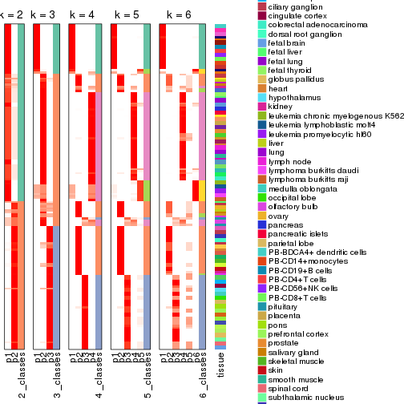


Test correlation between subgroups and known annotations. If the known
annotation is numeric, one-way ANOVA test is applied, and if the known
annotation is discrete, chi-squared contingency table test is applied.

```r
test_to_known_factors(res)
```

```
#>           n tissue(p) k
#> ATC:pam 154  3.04e-06 2
#> ATC:pam 141  3.44e-10 3
#> ATC:pam 147  6.18e-14 4
#> ATC:pam 152  2.96e-18 5
#> ATC:pam 150  2.52e-22 6
```


If matrix rows can be associated to genes, consider to use `functional_enrichment(res,
...)` to perform function enrichment for the signature genes. See [this vignette](http://bioconductor.org/packages/devel/bioc/vignettes/cola/inst/doc/functional_enrichment.html) for more detailed explanations.


 

---------------------------------------------------


### ATC:mclust


The object with results only for a single top-value method and a single partition method 
can be extracted as:

```r
res = res_list["ATC", "mclust"]
# you can also extract it by
# res = res_list["ATC:mclust"]
```

A summary of `res` and all the functions that can be applied to it:

```r
res
```

```
#> A 'ConsensusPartition' object with k = 2, 3, 4, 5, 6.
#>   On a matrix with 21168 rows and 158 columns.
#>   Top rows (1000, 2000, 3000, 4000, 5000) are extracted by 'ATC' method.
#>   Subgroups are detected by 'mclust' method.
#>   Performed in total 1250 partitions by row resampling.
#>   Best k for subgroups seems to be 6.
#> 
#> Following methods can be applied to this 'ConsensusPartition' object:
#>  [1] "cola_report"             "collect_classes"         "collect_plots"          
#>  [4] "collect_stats"           "colnames"                "compare_signatures"     
#>  [7] "consensus_heatmap"       "dimension_reduction"     "functional_enrichment"  
#> [10] "get_anno_col"            "get_anno"                "get_classes"            
#> [13] "get_consensus"           "get_matrix"              "get_membership"         
#> [16] "get_param"               "get_signatures"          "get_stats"              
#> [19] "is_best_k"               "is_stable_k"             "membership_heatmap"     
#> [22] "ncol"                    "nrow"                    "plot_ecdf"              
#> [25] "rownames"                "select_partition_number" "show"                   
#> [28] "suggest_best_k"          "test_to_known_factors"
```

`collect_plots()` function collects all the plots made from `res` for all `k` (number of partitions)
into one single page to provide an easy and fast comparison between different `k`.

```r
collect_plots(res)
```


The plots are:

- The first row: a plot of the ECDF (empirical cumulative distribution
  function) curves of the consensus matrix for each `k` and the heatmap of
  predicted classes for each `k`.
- The second row: heatmaps of the consensus matrix for each `k`.
- The third row: heatmaps of the membership matrix for each `k`.
- The fouth row: heatmaps of the signatures for each `k`.

All the plots in panels can be made by individual functions and they are
plotted later in this section.

`select_partition_number()` produces several plots showing different
statistics for choosing "optimized" `k`. There are following statistics:

- ECDF curves of the consensus matrix for each `k`;
- 1-PAC. [The PAC
  score](https://en.wikipedia.org/wiki/Consensus_clustering#Over-interpretation_potential_of_consensus_clustering)
  measures the proportion of the ambiguous subgrouping.
- Mean silhouette score.
- Concordance. The mean probability of fiting the consensus class ids in all
  partitions.
- Area increased. Denote $A_k$ as the area under the ECDF curve for current
  `k`, the area increased is defined as $A_k - A_{k-1}$.
- Rand index. The percent of pairs of samples that are both in a same cluster
  or both are not in a same cluster in the partition of k and k-1.
- Jaccard index. The ratio of pairs of samples are both in a same cluster in
  the partition of k and k-1 and the pairs of samples are both in a same
  cluster in the partition k or k-1.

The detailed explanations of these statistics can be found in [the _cola_
vignette](http://bioconductor.org/packages/devel/bioc/vignettes/cola/inst/doc/cola.html#toc_13).

Generally speaking, lower PAC score, higher mean silhouette score or higher
concordance corresponds to better partition. Rand index and Jaccard index
measure how similar the current partition is compared to partition with `k-1`.
If they are too similar, we won't accept `k` is better than `k-1`.

```r
select_partition_number(res)
```


The numeric values for all these statistics can be obtained by `get_stats()`.

```r
get_stats(res)
```

```
#>   k 1-PAC mean_silhouette concordance area_increased  Rand Jaccard
#> 2 2 0.534           0.862       0.864         0.4835 0.508   0.508
#> 3 3 0.649           0.852       0.914         0.3314 0.626   0.402
#> 4 4 0.739           0.746       0.890         0.1341 0.888   0.699
#> 5 5 0.728           0.689       0.816         0.0608 0.931   0.749
#> 6 6 0.858           0.874       0.916         0.0409 0.882   0.560
```

`suggest_best_k()` suggests the best $k$ based on these statistics. The rules are as follows:

- All $k$ with Jaccard index larger than 0.95 are removed because increasing
  $k$ does not provide enough extra information. If all $k$ are removed, it is
  marked as no subgroup is detected.
- For all $k$ with 1-PAC score larger than 0.9, the maximal $k$ is taken as
  the best $k$, and other $k$ are marked as optional $k$.
- If it does not fit the second rule. The $k$ with the maximal vote of the
  highest 1-PAC score, highest mean silhouette, and highest concordance is
  taken as the best $k$.

```r
suggest_best_k(res)
```

```
#> [1] 6
```


Following shows the table of the partitions (You need to click the **show/hide
code output** link to see it). The membership matrix (columns with name `p*`)
is inferred by
[`clue::cl_consensus()`](https://www.rdocumentation.org/link/cl_consensus?package=clue)
function with the `SE` method. Basically the value in the membership matrix
represents the probability to belong to a certain group. The finall class
label for an item is determined with the group with highest probability it
belongs to.

In `get_classes()` function, the entropy is calculated from the membership
matrix and the silhouette score is calculated from the consensus matrix.


<script>
$( function() {
	$( '#tabs-ATC-mclust-get-classes' ).tabs();
} );
</script>
<div id='tabs-ATC-mclust-get-classes'>
<ul>
<li><a href='#tab-ATC-mclust-get-classes-1'>k = 2</a></li>
<li><a href='#tab-ATC-mclust-get-classes-2'>k = 3</a></li>
<li><a href='#tab-ATC-mclust-get-classes-3'>k = 4</a></li>
<li><a href='#tab-ATC-mclust-get-classes-4'>k = 5</a></li>
<li><a href='#tab-ATC-mclust-get-classes-5'>k = 6</a></li>
</ul>

<div id='tab-ATC-mclust-get-classes-1'>
<p><a id='tab-ATC-mclust-get-classes-1-a' style='color:#0366d6' href='#'>show/hide code output</a></p>
<pre><code class="r">cbind(get_classes(res, k = 2), get_membership(res, k = 2))
</code></pre>

<pre><code>#&gt;          class entropy silhouette    p1    p2
#&gt; GSM18927     2  0.0000      0.902 0.000 1.000
#&gt; GSM18928     2  0.0000      0.902 0.000 1.000
#&gt; GSM18915     2  0.0000      0.902 0.000 1.000
#&gt; GSM18916     2  0.0000      0.902 0.000 1.000
#&gt; GSM18939     2  0.0000      0.902 0.000 1.000
#&gt; GSM18940     2  0.0000      0.902 0.000 1.000
#&gt; GSM18933     2  0.0000      0.902 0.000 1.000
#&gt; GSM18934     2  0.0000      0.902 0.000 1.000
#&gt; GSM18925     2  0.0000      0.902 0.000 1.000
#&gt; GSM18926     2  0.0000      0.902 0.000 1.000
#&gt; GSM18931     2  0.0000      0.902 0.000 1.000
#&gt; GSM18932     2  0.0000      0.902 0.000 1.000
#&gt; GSM19019     2  0.4022      0.884 0.080 0.920
#&gt; GSM19020     2  0.3431      0.888 0.064 0.936
#&gt; GSM18923     2  0.0000      0.902 0.000 1.000
#&gt; GSM18924     2  0.0000      0.902 0.000 1.000
#&gt; GSM18941     2  0.0000      0.902 0.000 1.000
#&gt; GSM18942     2  0.0000      0.902 0.000 1.000
#&gt; GSM18929     2  0.0000      0.902 0.000 1.000
#&gt; GSM18930     2  0.0000      0.902 0.000 1.000
#&gt; GSM18911     2  0.0000      0.902 0.000 1.000
#&gt; GSM18912     2  0.0000      0.902 0.000 1.000
#&gt; GSM18935     2  0.0000      0.902 0.000 1.000
#&gt; GSM18936     2  0.0000      0.902 0.000 1.000
#&gt; GSM19005     2  0.6247      0.864 0.156 0.844
#&gt; GSM19006     2  0.6247      0.864 0.156 0.844
#&gt; GSM18921     2  0.0000      0.902 0.000 1.000
#&gt; GSM18922     2  0.0000      0.902 0.000 1.000
#&gt; GSM18919     2  0.0000      0.902 0.000 1.000
#&gt; GSM18920     2  0.0000      0.902 0.000 1.000
#&gt; GSM18917     2  0.0000      0.902 0.000 1.000
#&gt; GSM18918     2  0.0000      0.902 0.000 1.000
#&gt; GSM18913     2  0.0000      0.902 0.000 1.000
#&gt; GSM18914     2  0.0000      0.902 0.000 1.000
#&gt; GSM18937     2  0.0000      0.902 0.000 1.000
#&gt; GSM18938     2  0.0000      0.902 0.000 1.000
#&gt; GSM18943     2  0.0000      0.902 0.000 1.000
#&gt; GSM18944     2  0.0000      0.902 0.000 1.000
#&gt; GSM19003     2  0.6247      0.864 0.156 0.844
#&gt; GSM19004     2  0.6247      0.864 0.156 0.844
#&gt; GSM19011     2  0.6247      0.864 0.156 0.844
#&gt; GSM19012     2  0.6247      0.864 0.156 0.844
#&gt; GSM19009     2  0.6247      0.864 0.156 0.844
#&gt; GSM19010     2  0.6247      0.864 0.156 0.844
#&gt; GSM18945     2  0.0000      0.902 0.000 1.000
#&gt; GSM18946     2  0.0000      0.902 0.000 1.000
#&gt; GSM18963     1  0.4298      0.887 0.912 0.088
#&gt; GSM18964     1  0.4161      0.889 0.916 0.084
#&gt; GSM18905     1  0.4431      0.884 0.908 0.092
#&gt; GSM18906     1  0.2778      0.895 0.952 0.048
#&gt; GSM18965     1  0.4022      0.891 0.920 0.080
#&gt; GSM18966     1  0.3879      0.892 0.924 0.076
#&gt; GSM18873     1  0.6048      0.849 0.852 0.148
#&gt; GSM18874     1  0.6048      0.849 0.852 0.148
#&gt; GSM18973     1  0.1843      0.896 0.972 0.028
#&gt; GSM18974     1  0.1843      0.896 0.972 0.028
#&gt; GSM18977     1  0.2236      0.895 0.964 0.036
#&gt; GSM18978     1  0.4161      0.889 0.916 0.084
#&gt; GSM18979     1  0.4022      0.891 0.920 0.080
#&gt; GSM18980     1  0.4022      0.891 0.920 0.080
#&gt; GSM18883     1  0.6048      0.849 0.852 0.148
#&gt; GSM18884     1  0.6048      0.849 0.852 0.148
#&gt; GSM18885     1  0.6048      0.849 0.852 0.148
#&gt; GSM18886     1  0.6048      0.849 0.852 0.148
#&gt; GSM18907     1  0.5946      0.852 0.856 0.144
#&gt; GSM18908     1  0.6048      0.849 0.852 0.148
#&gt; GSM18909     1  0.1843      0.896 0.972 0.028
#&gt; GSM18910     1  0.1843      0.896 0.972 0.028
#&gt; GSM18867     1  0.6048      0.849 0.852 0.148
#&gt; GSM18868     1  0.4161      0.883 0.916 0.084
#&gt; GSM18947     1  0.4161      0.889 0.916 0.084
#&gt; GSM18948     1  0.4298      0.887 0.912 0.088
#&gt; GSM18995     2  0.9170      0.638 0.332 0.668
#&gt; GSM18996     2  0.9635      0.518 0.388 0.612
#&gt; GSM18975     1  0.4161      0.889 0.916 0.084
#&gt; GSM18976     1  0.4161      0.889 0.916 0.084
#&gt; GSM18997     2  0.9460      0.574 0.364 0.636
#&gt; GSM18998     2  0.7674      0.803 0.224 0.776
#&gt; GSM18967     1  0.3431      0.894 0.936 0.064
#&gt; GSM18968     1  0.3879      0.892 0.924 0.076
#&gt; GSM18959     1  0.4431      0.884 0.908 0.092
#&gt; GSM18960     1  0.4298      0.887 0.912 0.088
#&gt; GSM19015     2  0.7950      0.784 0.240 0.760
#&gt; GSM19016     2  0.7219      0.829 0.200 0.800
#&gt; GSM18957     1  0.4022      0.891 0.920 0.080
#&gt; GSM18958     1  0.3584      0.893 0.932 0.068
#&gt; GSM18981     1  0.4161      0.889 0.916 0.084
#&gt; GSM18982     1  0.4022      0.891 0.920 0.080
#&gt; GSM18989     2  0.9866      0.402 0.432 0.568
#&gt; GSM18990     1  0.4298      0.887 0.912 0.088
#&gt; GSM18985     1  0.4022      0.891 0.920 0.080
#&gt; GSM18986     1  0.9996     -0.144 0.512 0.488
#&gt; GSM18987     1  0.4431      0.884 0.908 0.092
#&gt; GSM18988     1  0.4431      0.884 0.908 0.092
#&gt; GSM18983     2  0.9977      0.275 0.472 0.528
#&gt; GSM18984     2  0.6887      0.844 0.184 0.816
#&gt; GSM18951     1  0.4298      0.887 0.912 0.088
#&gt; GSM18952     1  0.4161      0.889 0.916 0.084
#&gt; GSM19007     2  0.6247      0.864 0.156 0.844
#&gt; GSM19008     2  0.6247      0.864 0.156 0.844
#&gt; GSM18999     2  0.6247      0.864 0.156 0.844
#&gt; GSM19000     2  0.6247      0.864 0.156 0.844
#&gt; GSM18889     1  0.6048      0.849 0.852 0.148
#&gt; GSM18890     1  0.6048      0.849 0.852 0.148
#&gt; GSM18881     1  0.6048      0.849 0.852 0.148
#&gt; GSM18882     1  0.6048      0.849 0.852 0.148
#&gt; GSM18877     1  0.6048      0.849 0.852 0.148
#&gt; GSM18878     1  0.6048      0.849 0.852 0.148
#&gt; GSM18875     1  0.6048      0.849 0.852 0.148
#&gt; GSM18876     1  0.6048      0.849 0.852 0.148
#&gt; GSM18879     1  0.6048      0.849 0.852 0.148
#&gt; GSM18880     1  0.6048      0.849 0.852 0.148
#&gt; GSM18871     1  0.6048      0.849 0.852 0.148
#&gt; GSM18872     1  0.6048      0.849 0.852 0.148
#&gt; GSM18903     1  0.3431      0.891 0.936 0.064
#&gt; GSM18904     1  0.2043      0.896 0.968 0.032
#&gt; GSM18949     1  0.3431      0.894 0.936 0.064
#&gt; GSM18950     1  0.2043      0.895 0.968 0.032
#&gt; GSM18953     1  0.4298      0.887 0.912 0.088
#&gt; GSM18954     1  0.4298      0.887 0.912 0.088
#&gt; GSM19013     2  0.6247      0.864 0.156 0.844
#&gt; GSM19014     2  0.6247      0.864 0.156 0.844
#&gt; GSM18971     1  0.0376      0.892 0.996 0.004
#&gt; GSM18972     1  0.0376      0.892 0.996 0.004
#&gt; GSM18969     1  0.0376      0.892 0.996 0.004
#&gt; GSM18970     1  0.4022      0.891 0.920 0.080
#&gt; GSM18869     1  0.6048      0.849 0.852 0.148
#&gt; GSM18870     1  0.6048      0.849 0.852 0.148
#&gt; GSM19017     2  0.6712      0.850 0.176 0.824
#&gt; GSM19018     2  0.6247      0.864 0.156 0.844
#&gt; GSM18991     1  0.4022      0.891 0.920 0.080
#&gt; GSM18992     1  0.4298      0.887 0.912 0.088
#&gt; GSM19021     2  0.5059      0.878 0.112 0.888
#&gt; GSM19022     2  0.4690      0.880 0.100 0.900
#&gt; GSM19001     2  0.6247      0.864 0.156 0.844
#&gt; GSM19002     2  0.6247      0.864 0.156 0.844
#&gt; GSM18899     1  0.1843      0.896 0.972 0.028
#&gt; GSM18900     1  0.1843      0.896 0.972 0.028
#&gt; GSM18961     1  0.4298      0.887 0.912 0.088
#&gt; GSM18962     1  0.4161      0.889 0.916 0.084
#&gt; GSM18901     1  0.2603      0.895 0.956 0.044
#&gt; GSM18902     1  0.2423      0.895 0.960 0.040
#&gt; GSM18993     1  0.4298      0.887 0.912 0.088
#&gt; GSM18994     1  0.4298      0.887 0.912 0.088
#&gt; GSM18865     1  0.1633      0.895 0.976 0.024
#&gt; GSM18866     1  0.1633      0.895 0.976 0.024
#&gt; GSM18897     1  0.2423      0.895 0.960 0.040
#&gt; GSM18898     1  0.2043      0.896 0.968 0.032
#&gt; GSM18887     1  0.3431      0.891 0.936 0.064
#&gt; GSM18888     1  0.3431      0.891 0.936 0.064
#&gt; GSM18893     1  0.3431      0.891 0.936 0.064
#&gt; GSM18894     1  0.3431      0.891 0.936 0.064
#&gt; GSM18895     1  0.3431      0.891 0.936 0.064
#&gt; GSM18896     1  0.3431      0.891 0.936 0.064
#&gt; GSM18891     1  0.3431      0.891 0.936 0.064
#&gt; GSM18892     1  0.3431      0.891 0.936 0.064
#&gt; GSM18955     1  0.4022      0.891 0.920 0.080
#&gt; GSM18956     1  0.4298      0.887 0.912 0.088
</code></pre>

<script>
$('#tab-ATC-mclust-get-classes-1-a').parent().next().next().hide();
$('#tab-ATC-mclust-get-classes-1-a').click(function(){
  $('#tab-ATC-mclust-get-classes-1-a').parent().next().next().toggle();
  return(false);
});
</script>
</div>

<div id='tab-ATC-mclust-get-classes-2'>
<p><a id='tab-ATC-mclust-get-classes-2-a' style='color:#0366d6' href='#'>show/hide code output</a></p>
<pre><code class="r">cbind(get_classes(res, k = 3), get_membership(res, k = 3))
</code></pre>

<pre><code>#&gt;          class entropy silhouette    p1    p2    p3
#&gt; GSM18927     3  0.0000      1.000 0.000 0.000 1.000
#&gt; GSM18928     3  0.0000      1.000 0.000 0.000 1.000
#&gt; GSM18915     3  0.0000      1.000 0.000 0.000 1.000
#&gt; GSM18916     3  0.0000      1.000 0.000 0.000 1.000
#&gt; GSM18939     3  0.0000      1.000 0.000 0.000 1.000
#&gt; GSM18940     3  0.0000      1.000 0.000 0.000 1.000
#&gt; GSM18933     3  0.0000      1.000 0.000 0.000 1.000
#&gt; GSM18934     3  0.0000      1.000 0.000 0.000 1.000
#&gt; GSM18925     3  0.0000      1.000 0.000 0.000 1.000
#&gt; GSM18926     3  0.0000      1.000 0.000 0.000 1.000
#&gt; GSM18931     3  0.0000      1.000 0.000 0.000 1.000
#&gt; GSM18932     3  0.0000      1.000 0.000 0.000 1.000
#&gt; GSM19019     2  0.6215      0.339 0.000 0.572 0.428
#&gt; GSM19020     2  0.6225      0.330 0.000 0.568 0.432
#&gt; GSM18923     3  0.0000      1.000 0.000 0.000 1.000
#&gt; GSM18924     3  0.0000      1.000 0.000 0.000 1.000
#&gt; GSM18941     3  0.0000      1.000 0.000 0.000 1.000
#&gt; GSM18942     3  0.0000      1.000 0.000 0.000 1.000
#&gt; GSM18929     3  0.0000      1.000 0.000 0.000 1.000
#&gt; GSM18930     3  0.0000      1.000 0.000 0.000 1.000
#&gt; GSM18911     3  0.0000      1.000 0.000 0.000 1.000
#&gt; GSM18912     3  0.0000      1.000 0.000 0.000 1.000
#&gt; GSM18935     3  0.0000      1.000 0.000 0.000 1.000
#&gt; GSM18936     3  0.0000      1.000 0.000 0.000 1.000
#&gt; GSM19005     2  0.8408      0.667 0.152 0.616 0.232
#&gt; GSM19006     2  0.8408      0.667 0.152 0.616 0.232
#&gt; GSM18921     3  0.0000      1.000 0.000 0.000 1.000
#&gt; GSM18922     3  0.0000      1.000 0.000 0.000 1.000
#&gt; GSM18919     3  0.0000      1.000 0.000 0.000 1.000
#&gt; GSM18920     3  0.0000      1.000 0.000 0.000 1.000
#&gt; GSM18917     3  0.0000      1.000 0.000 0.000 1.000
#&gt; GSM18918     3  0.0000      1.000 0.000 0.000 1.000
#&gt; GSM18913     3  0.0000      1.000 0.000 0.000 1.000
#&gt; GSM18914     3  0.0000      1.000 0.000 0.000 1.000
#&gt; GSM18937     3  0.0000      1.000 0.000 0.000 1.000
#&gt; GSM18938     3  0.0000      1.000 0.000 0.000 1.000
#&gt; GSM18943     3  0.0000      1.000 0.000 0.000 1.000
#&gt; GSM18944     3  0.0000      1.000 0.000 0.000 1.000
#&gt; GSM19003     2  0.8408      0.667 0.152 0.616 0.232
#&gt; GSM19004     2  0.8408      0.667 0.152 0.616 0.232
#&gt; GSM19011     2  0.8408      0.667 0.152 0.616 0.232
#&gt; GSM19012     2  0.8408      0.667 0.152 0.616 0.232
#&gt; GSM19009     2  0.8408      0.667 0.152 0.616 0.232
#&gt; GSM19010     2  0.8408      0.667 0.152 0.616 0.232
#&gt; GSM18945     3  0.0000      1.000 0.000 0.000 1.000
#&gt; GSM18946     3  0.0000      1.000 0.000 0.000 1.000
#&gt; GSM18963     2  0.0000      0.838 0.000 1.000 0.000
#&gt; GSM18964     2  0.0000      0.838 0.000 1.000 0.000
#&gt; GSM18905     2  0.4291      0.803 0.152 0.840 0.008
#&gt; GSM18906     2  0.0000      0.838 0.000 1.000 0.000
#&gt; GSM18965     2  0.0000      0.838 0.000 1.000 0.000
#&gt; GSM18966     2  0.0000      0.838 0.000 1.000 0.000
#&gt; GSM18873     1  0.0000      0.958 1.000 0.000 0.000
#&gt; GSM18874     1  0.0000      0.958 1.000 0.000 0.000
#&gt; GSM18973     2  0.5926      0.401 0.356 0.644 0.000
#&gt; GSM18974     2  0.5926      0.401 0.356 0.644 0.000
#&gt; GSM18977     2  0.1860      0.817 0.052 0.948 0.000
#&gt; GSM18978     2  0.0592      0.838 0.012 0.988 0.000
#&gt; GSM18979     2  0.0000      0.838 0.000 1.000 0.000
#&gt; GSM18980     2  0.0000      0.838 0.000 1.000 0.000
#&gt; GSM18883     1  0.0000      0.958 1.000 0.000 0.000
#&gt; GSM18884     1  0.0000      0.958 1.000 0.000 0.000
#&gt; GSM18885     1  0.0000      0.958 1.000 0.000 0.000
#&gt; GSM18886     1  0.0000      0.958 1.000 0.000 0.000
#&gt; GSM18907     1  0.0000      0.958 1.000 0.000 0.000
#&gt; GSM18908     1  0.0000      0.958 1.000 0.000 0.000
#&gt; GSM18909     1  0.4002      0.775 0.840 0.160 0.000
#&gt; GSM18910     1  0.4291      0.744 0.820 0.180 0.000
#&gt; GSM18867     1  0.0000      0.958 1.000 0.000 0.000
#&gt; GSM18868     1  0.0000      0.958 1.000 0.000 0.000
#&gt; GSM18947     2  0.0000      0.838 0.000 1.000 0.000
#&gt; GSM18948     2  0.0000      0.838 0.000 1.000 0.000
#&gt; GSM18995     2  0.4679      0.805 0.148 0.832 0.020
#&gt; GSM18996     2  0.4741      0.802 0.152 0.828 0.020
#&gt; GSM18975     2  0.0000      0.838 0.000 1.000 0.000
#&gt; GSM18976     2  0.0000      0.838 0.000 1.000 0.000
#&gt; GSM18997     2  0.3879      0.802 0.152 0.848 0.000
#&gt; GSM18998     2  0.3879      0.802 0.152 0.848 0.000
#&gt; GSM18967     2  0.0237      0.837 0.004 0.996 0.000
#&gt; GSM18968     2  0.0237      0.837 0.004 0.996 0.000
#&gt; GSM18959     2  0.0592      0.836 0.000 0.988 0.012
#&gt; GSM18960     2  0.0000      0.838 0.000 1.000 0.000
#&gt; GSM19015     2  0.4602      0.803 0.152 0.832 0.016
#&gt; GSM19016     2  0.4602      0.803 0.152 0.832 0.016
#&gt; GSM18957     2  0.0000      0.838 0.000 1.000 0.000
#&gt; GSM18958     2  0.0000      0.838 0.000 1.000 0.000
#&gt; GSM18981     2  0.0000      0.838 0.000 1.000 0.000
#&gt; GSM18982     2  0.0000      0.838 0.000 1.000 0.000
#&gt; GSM18989     2  0.3879      0.802 0.152 0.848 0.000
#&gt; GSM18990     2  0.0000      0.838 0.000 1.000 0.000
#&gt; GSM18985     2  0.0000      0.838 0.000 1.000 0.000
#&gt; GSM18986     2  0.0892      0.834 0.000 0.980 0.020
#&gt; GSM18987     2  0.1964      0.832 0.056 0.944 0.000
#&gt; GSM18988     2  0.3619      0.810 0.136 0.864 0.000
#&gt; GSM18983     2  0.3879      0.802 0.152 0.848 0.000
#&gt; GSM18984     2  0.3879      0.802 0.152 0.848 0.000
#&gt; GSM18951     2  0.3846      0.819 0.108 0.876 0.016
#&gt; GSM18952     2  0.1031      0.831 0.024 0.976 0.000
#&gt; GSM19007     2  0.8336      0.675 0.152 0.624 0.224
#&gt; GSM19008     2  0.8336      0.675 0.152 0.624 0.224
#&gt; GSM18999     2  0.6529      0.772 0.152 0.756 0.092
#&gt; GSM19000     2  0.5558      0.794 0.152 0.800 0.048
#&gt; GSM18889     1  0.0000      0.958 1.000 0.000 0.000
#&gt; GSM18890     1  0.0000      0.958 1.000 0.000 0.000
#&gt; GSM18881     1  0.0000      0.958 1.000 0.000 0.000
#&gt; GSM18882     1  0.0000      0.958 1.000 0.000 0.000
#&gt; GSM18877     1  0.0000      0.958 1.000 0.000 0.000
#&gt; GSM18878     1  0.0000      0.958 1.000 0.000 0.000
#&gt; GSM18875     1  0.0000      0.958 1.000 0.000 0.000
#&gt; GSM18876     1  0.0000      0.958 1.000 0.000 0.000
#&gt; GSM18879     1  0.0000      0.958 1.000 0.000 0.000
#&gt; GSM18880     1  0.0000      0.958 1.000 0.000 0.000
#&gt; GSM18871     1  0.0000      0.958 1.000 0.000 0.000
#&gt; GSM18872     1  0.0000      0.958 1.000 0.000 0.000
#&gt; GSM18903     1  0.0892      0.954 0.980 0.020 0.000
#&gt; GSM18904     1  0.0892      0.954 0.980 0.020 0.000
#&gt; GSM18949     2  0.1163      0.831 0.028 0.972 0.000
#&gt; GSM18950     2  0.0000      0.838 0.000 1.000 0.000
#&gt; GSM18953     1  0.6641      0.229 0.544 0.448 0.008
#&gt; GSM18954     1  0.6302      0.147 0.520 0.480 0.000
#&gt; GSM19013     2  0.7564      0.730 0.152 0.692 0.156
#&gt; GSM19014     2  0.7509      0.733 0.152 0.696 0.152
#&gt; GSM18971     2  0.5431      0.551 0.284 0.716 0.000
#&gt; GSM18972     2  0.5254      0.586 0.264 0.736 0.000
#&gt; GSM18969     2  0.4654      0.671 0.208 0.792 0.000
#&gt; GSM18970     2  0.5502      0.729 0.248 0.744 0.008
#&gt; GSM18869     1  0.0000      0.958 1.000 0.000 0.000
#&gt; GSM18870     1  0.0000      0.958 1.000 0.000 0.000
#&gt; GSM19017     2  0.4741      0.802 0.152 0.828 0.020
#&gt; GSM19018     2  0.4602      0.803 0.152 0.832 0.016
#&gt; GSM18991     2  0.3879      0.802 0.152 0.848 0.000
#&gt; GSM18992     2  0.4291      0.803 0.152 0.840 0.008
#&gt; GSM19021     2  0.5988      0.465 0.000 0.632 0.368
#&gt; GSM19022     2  0.6026      0.449 0.000 0.624 0.376
#&gt; GSM19001     2  0.5454      0.795 0.152 0.804 0.044
#&gt; GSM19002     2  0.6122      0.782 0.152 0.776 0.072
#&gt; GSM18899     1  0.1643      0.932 0.956 0.044 0.000
#&gt; GSM18900     1  0.1643      0.932 0.956 0.044 0.000
#&gt; GSM18961     2  0.0000      0.838 0.000 1.000 0.000
#&gt; GSM18962     2  0.0000      0.838 0.000 1.000 0.000
#&gt; GSM18901     1  0.0892      0.954 0.980 0.020 0.000
#&gt; GSM18902     1  0.0892      0.954 0.980 0.020 0.000
#&gt; GSM18993     2  0.0000      0.838 0.000 1.000 0.000
#&gt; GSM18994     2  0.0000      0.838 0.000 1.000 0.000
#&gt; GSM18865     2  0.5431      0.556 0.284 0.716 0.000
#&gt; GSM18866     2  0.5810      0.449 0.336 0.664 0.000
#&gt; GSM18897     1  0.0892      0.954 0.980 0.020 0.000
#&gt; GSM18898     1  0.0892      0.954 0.980 0.020 0.000
#&gt; GSM18887     1  0.0892      0.954 0.980 0.020 0.000
#&gt; GSM18888     1  0.0892      0.954 0.980 0.020 0.000
#&gt; GSM18893     1  0.0892      0.954 0.980 0.020 0.000
#&gt; GSM18894     1  0.0892      0.954 0.980 0.020 0.000
#&gt; GSM18895     1  0.0892      0.954 0.980 0.020 0.000
#&gt; GSM18896     1  0.0892      0.954 0.980 0.020 0.000
#&gt; GSM18891     1  0.0892      0.954 0.980 0.020 0.000
#&gt; GSM18892     1  0.0892      0.954 0.980 0.020 0.000
#&gt; GSM18955     2  0.0000      0.838 0.000 1.000 0.000
#&gt; GSM18956     2  0.0000      0.838 0.000 1.000 0.000
</code></pre>

<script>
$('#tab-ATC-mclust-get-classes-2-a').parent().next().next().hide();
$('#tab-ATC-mclust-get-classes-2-a').click(function(){
  $('#tab-ATC-mclust-get-classes-2-a').parent().next().next().toggle();
  return(false);
});
</script>
</div>

<div id='tab-ATC-mclust-get-classes-3'>
<p><a id='tab-ATC-mclust-get-classes-3-a' style='color:#0366d6' href='#'>show/hide code output</a></p>
<pre><code class="r">cbind(get_classes(res, k = 4), get_membership(res, k = 4))
</code></pre>

<pre><code>#&gt;          class entropy silhouette    p1    p2    p3    p4
#&gt; GSM18927     3  0.0000   1.000000 0.000 0.000 1.000 0.000
#&gt; GSM18928     3  0.0000   1.000000 0.000 0.000 1.000 0.000
#&gt; GSM18915     3  0.0000   1.000000 0.000 0.000 1.000 0.000
#&gt; GSM18916     3  0.0000   1.000000 0.000 0.000 1.000 0.000
#&gt; GSM18939     3  0.0000   1.000000 0.000 0.000 1.000 0.000
#&gt; GSM18940     3  0.0000   1.000000 0.000 0.000 1.000 0.000
#&gt; GSM18933     3  0.0000   1.000000 0.000 0.000 1.000 0.000
#&gt; GSM18934     3  0.0000   1.000000 0.000 0.000 1.000 0.000
#&gt; GSM18925     3  0.0000   1.000000 0.000 0.000 1.000 0.000
#&gt; GSM18926     3  0.0000   1.000000 0.000 0.000 1.000 0.000
#&gt; GSM18931     3  0.0000   1.000000 0.000 0.000 1.000 0.000
#&gt; GSM18932     3  0.0000   1.000000 0.000 0.000 1.000 0.000
#&gt; GSM19019     4  0.7423   0.143480 0.000 0.344 0.180 0.476
#&gt; GSM19020     4  0.7423   0.143480 0.000 0.344 0.180 0.476
#&gt; GSM18923     3  0.0000   1.000000 0.000 0.000 1.000 0.000
#&gt; GSM18924     3  0.0000   1.000000 0.000 0.000 1.000 0.000
#&gt; GSM18941     3  0.0000   1.000000 0.000 0.000 1.000 0.000
#&gt; GSM18942     3  0.0000   1.000000 0.000 0.000 1.000 0.000
#&gt; GSM18929     3  0.0000   1.000000 0.000 0.000 1.000 0.000
#&gt; GSM18930     3  0.0000   1.000000 0.000 0.000 1.000 0.000
#&gt; GSM18911     3  0.0000   1.000000 0.000 0.000 1.000 0.000
#&gt; GSM18912     3  0.0000   1.000000 0.000 0.000 1.000 0.000
#&gt; GSM18935     3  0.0000   1.000000 0.000 0.000 1.000 0.000
#&gt; GSM18936     3  0.0000   1.000000 0.000 0.000 1.000 0.000
#&gt; GSM19005     2  0.0188   0.755036 0.000 0.996 0.004 0.000
#&gt; GSM19006     2  0.0188   0.755036 0.000 0.996 0.004 0.000
#&gt; GSM18921     3  0.0000   1.000000 0.000 0.000 1.000 0.000
#&gt; GSM18922     3  0.0000   1.000000 0.000 0.000 1.000 0.000
#&gt; GSM18919     3  0.0000   1.000000 0.000 0.000 1.000 0.000
#&gt; GSM18920     3  0.0000   1.000000 0.000 0.000 1.000 0.000
#&gt; GSM18917     3  0.0000   1.000000 0.000 0.000 1.000 0.000
#&gt; GSM18918     3  0.0000   1.000000 0.000 0.000 1.000 0.000
#&gt; GSM18913     3  0.0000   1.000000 0.000 0.000 1.000 0.000
#&gt; GSM18914     3  0.0000   1.000000 0.000 0.000 1.000 0.000
#&gt; GSM18937     3  0.0000   1.000000 0.000 0.000 1.000 0.000
#&gt; GSM18938     3  0.0000   1.000000 0.000 0.000 1.000 0.000
#&gt; GSM18943     3  0.0000   1.000000 0.000 0.000 1.000 0.000
#&gt; GSM18944     3  0.0000   1.000000 0.000 0.000 1.000 0.000
#&gt; GSM19003     2  0.0188   0.755036 0.000 0.996 0.004 0.000
#&gt; GSM19004     2  0.0188   0.755036 0.000 0.996 0.004 0.000
#&gt; GSM19011     2  0.0188   0.755036 0.000 0.996 0.004 0.000
#&gt; GSM19012     2  0.0188   0.755036 0.000 0.996 0.004 0.000
#&gt; GSM19009     2  0.0188   0.755036 0.000 0.996 0.004 0.000
#&gt; GSM19010     2  0.0188   0.755036 0.000 0.996 0.004 0.000
#&gt; GSM18945     3  0.0000   1.000000 0.000 0.000 1.000 0.000
#&gt; GSM18946     3  0.0000   1.000000 0.000 0.000 1.000 0.000
#&gt; GSM18963     4  0.0707   0.756620 0.000 0.020 0.000 0.980
#&gt; GSM18964     4  0.0592   0.757232 0.000 0.016 0.000 0.984
#&gt; GSM18905     4  0.4967   0.067768 0.000 0.452 0.000 0.548
#&gt; GSM18906     4  0.4406   0.473374 0.000 0.300 0.000 0.700
#&gt; GSM18965     4  0.0000   0.759319 0.000 0.000 0.000 1.000
#&gt; GSM18966     4  0.0000   0.759319 0.000 0.000 0.000 1.000
#&gt; GSM18873     1  0.0000   0.908565 1.000 0.000 0.000 0.000
#&gt; GSM18874     1  0.0000   0.908565 1.000 0.000 0.000 0.000
#&gt; GSM18973     4  0.0937   0.752716 0.012 0.012 0.000 0.976
#&gt; GSM18974     4  0.0804   0.754045 0.012 0.008 0.000 0.980
#&gt; GSM18977     4  0.4164   0.524184 0.000 0.264 0.000 0.736
#&gt; GSM18978     4  0.4522   0.428547 0.000 0.320 0.000 0.680
#&gt; GSM18979     4  0.3610   0.611237 0.000 0.200 0.000 0.800
#&gt; GSM18980     4  0.3764   0.583463 0.000 0.216 0.000 0.784
#&gt; GSM18883     1  0.1302   0.913654 0.956 0.000 0.000 0.044
#&gt; GSM18884     1  0.1302   0.913654 0.956 0.000 0.000 0.044
#&gt; GSM18885     1  0.0000   0.908565 1.000 0.000 0.000 0.000
#&gt; GSM18886     1  0.0000   0.908565 1.000 0.000 0.000 0.000
#&gt; GSM18907     1  0.1637   0.912688 0.940 0.000 0.000 0.060
#&gt; GSM18908     1  0.1302   0.913654 0.956 0.000 0.000 0.044
#&gt; GSM18909     1  0.5495   0.755080 0.728 0.096 0.000 0.176
#&gt; GSM18910     1  0.5766   0.721859 0.704 0.104 0.000 0.192
#&gt; GSM18867     1  0.1557   0.913097 0.944 0.000 0.000 0.056
#&gt; GSM18868     1  0.1637   0.912688 0.940 0.000 0.000 0.060
#&gt; GSM18947     4  0.0000   0.759319 0.000 0.000 0.000 1.000
#&gt; GSM18948     4  0.0921   0.749556 0.000 0.028 0.000 0.972
#&gt; GSM18995     2  0.4967   0.207830 0.000 0.548 0.000 0.452
#&gt; GSM18996     2  0.4967   0.211001 0.000 0.548 0.000 0.452
#&gt; GSM18975     4  0.0000   0.759319 0.000 0.000 0.000 1.000
#&gt; GSM18976     4  0.0188   0.759482 0.000 0.004 0.000 0.996
#&gt; GSM18997     2  0.4994   0.148618 0.000 0.520 0.000 0.480
#&gt; GSM18998     2  0.5000   0.076490 0.000 0.500 0.000 0.500
#&gt; GSM18967     4  0.0000   0.759319 0.000 0.000 0.000 1.000
#&gt; GSM18968     4  0.0000   0.759319 0.000 0.000 0.000 1.000
#&gt; GSM18959     4  0.4720   0.503342 0.000 0.264 0.016 0.720
#&gt; GSM18960     4  0.0707   0.756053 0.000 0.020 0.000 0.980
#&gt; GSM19015     2  0.4989   0.167811 0.000 0.528 0.000 0.472
#&gt; GSM19016     2  0.4996   0.129622 0.000 0.516 0.000 0.484
#&gt; GSM18957     4  0.0188   0.759482 0.000 0.004 0.000 0.996
#&gt; GSM18958     4  0.0188   0.759416 0.000 0.004 0.000 0.996
#&gt; GSM18981     4  0.0000   0.759319 0.000 0.000 0.000 1.000
#&gt; GSM18982     4  0.0000   0.759319 0.000 0.000 0.000 1.000
#&gt; GSM18989     4  0.4989  -0.012959 0.000 0.472 0.000 0.528
#&gt; GSM18990     4  0.4564   0.435206 0.000 0.328 0.000 0.672
#&gt; GSM18985     4  0.2408   0.713578 0.000 0.104 0.000 0.896
#&gt; GSM18986     4  0.5368   0.384458 0.000 0.340 0.024 0.636
#&gt; GSM18987     4  0.4477   0.447844 0.000 0.312 0.000 0.688
#&gt; GSM18988     4  0.4605   0.412877 0.000 0.336 0.000 0.664
#&gt; GSM18983     4  0.4985  -0.000821 0.000 0.468 0.000 0.532
#&gt; GSM18984     4  0.4999  -0.096314 0.000 0.492 0.000 0.508
#&gt; GSM18951     4  0.6155   0.483211 0.176 0.148 0.000 0.676
#&gt; GSM18952     4  0.0188   0.759016 0.000 0.004 0.000 0.996
#&gt; GSM19007     2  0.0188   0.755036 0.000 0.996 0.004 0.000
#&gt; GSM19008     2  0.0188   0.755036 0.000 0.996 0.004 0.000
#&gt; GSM18999     2  0.0895   0.753534 0.000 0.976 0.004 0.020
#&gt; GSM19000     2  0.2053   0.738641 0.000 0.924 0.004 0.072
#&gt; GSM18889     1  0.0000   0.908565 1.000 0.000 0.000 0.000
#&gt; GSM18890     1  0.0000   0.908565 1.000 0.000 0.000 0.000
#&gt; GSM18881     1  0.0000   0.908565 1.000 0.000 0.000 0.000
#&gt; GSM18882     1  0.0000   0.908565 1.000 0.000 0.000 0.000
#&gt; GSM18877     1  0.0000   0.908565 1.000 0.000 0.000 0.000
#&gt; GSM18878     1  0.0000   0.908565 1.000 0.000 0.000 0.000
#&gt; GSM18875     1  0.0000   0.908565 1.000 0.000 0.000 0.000
#&gt; GSM18876     1  0.0000   0.908565 1.000 0.000 0.000 0.000
#&gt; GSM18879     1  0.0000   0.908565 1.000 0.000 0.000 0.000
#&gt; GSM18880     1  0.0000   0.908565 1.000 0.000 0.000 0.000
#&gt; GSM18871     1  0.0000   0.908565 1.000 0.000 0.000 0.000
#&gt; GSM18872     1  0.0000   0.908565 1.000 0.000 0.000 0.000
#&gt; GSM18903     1  0.2888   0.900806 0.872 0.004 0.000 0.124
#&gt; GSM18904     1  0.2888   0.900806 0.872 0.004 0.000 0.124
#&gt; GSM18949     4  0.0188   0.759550 0.000 0.004 0.000 0.996
#&gt; GSM18950     4  0.0000   0.759319 0.000 0.000 0.000 1.000
#&gt; GSM18953     1  0.6737   0.293091 0.532 0.100 0.000 0.368
#&gt; GSM18954     4  0.6537   0.073413 0.424 0.076 0.000 0.500
#&gt; GSM19013     2  0.2197   0.731209 0.000 0.916 0.004 0.080
#&gt; GSM19014     2  0.2466   0.719614 0.000 0.900 0.004 0.096
#&gt; GSM18971     4  0.0336   0.758372 0.000 0.008 0.000 0.992
#&gt; GSM18972     4  0.0336   0.758372 0.000 0.008 0.000 0.992
#&gt; GSM18969     4  0.0188   0.759077 0.000 0.004 0.000 0.996
#&gt; GSM18970     4  0.6609  -0.051233 0.080 0.448 0.000 0.472
#&gt; GSM18869     1  0.0000   0.908565 1.000 0.000 0.000 0.000
#&gt; GSM18870     1  0.0000   0.908565 1.000 0.000 0.000 0.000
#&gt; GSM19017     2  0.4948   0.251197 0.000 0.560 0.000 0.440
#&gt; GSM19018     2  0.4933   0.264937 0.000 0.568 0.000 0.432
#&gt; GSM18991     4  0.4804   0.308403 0.000 0.384 0.000 0.616
#&gt; GSM18992     4  0.4817   0.300471 0.000 0.388 0.000 0.612
#&gt; GSM19021     4  0.7169   0.193326 0.000 0.344 0.148 0.508
#&gt; GSM19022     4  0.7239   0.180800 0.000 0.344 0.156 0.500
#&gt; GSM19001     2  0.1824   0.743421 0.000 0.936 0.004 0.060
#&gt; GSM19002     2  0.1489   0.748107 0.000 0.952 0.004 0.044
#&gt; GSM18899     1  0.3105   0.886546 0.856 0.004 0.000 0.140
#&gt; GSM18900     1  0.3052   0.889499 0.860 0.004 0.000 0.136
#&gt; GSM18961     4  0.1716   0.736288 0.000 0.064 0.000 0.936
#&gt; GSM18962     4  0.0592   0.758004 0.000 0.016 0.000 0.984
#&gt; GSM18901     1  0.2888   0.900806 0.872 0.004 0.000 0.124
#&gt; GSM18902     1  0.2888   0.900806 0.872 0.004 0.000 0.124
#&gt; GSM18993     4  0.3074   0.659546 0.000 0.152 0.000 0.848
#&gt; GSM18994     4  0.3873   0.576260 0.000 0.228 0.000 0.772
#&gt; GSM18865     4  0.0804   0.754045 0.012 0.008 0.000 0.980
#&gt; GSM18866     4  0.0804   0.754045 0.012 0.008 0.000 0.980
#&gt; GSM18897     1  0.2888   0.900806 0.872 0.004 0.000 0.124
#&gt; GSM18898     1  0.2888   0.900806 0.872 0.004 0.000 0.124
#&gt; GSM18887     1  0.2773   0.903074 0.880 0.004 0.000 0.116
#&gt; GSM18888     1  0.2773   0.903074 0.880 0.004 0.000 0.116
#&gt; GSM18893     1  0.2888   0.900806 0.872 0.004 0.000 0.124
#&gt; GSM18894     1  0.2888   0.900806 0.872 0.004 0.000 0.124
#&gt; GSM18895     1  0.2888   0.900806 0.872 0.004 0.000 0.124
#&gt; GSM18896     1  0.2888   0.900806 0.872 0.004 0.000 0.124
#&gt; GSM18891     1  0.2888   0.900806 0.872 0.004 0.000 0.124
#&gt; GSM18892     1  0.2888   0.900806 0.872 0.004 0.000 0.124
#&gt; GSM18955     4  0.0592   0.756348 0.000 0.016 0.000 0.984
#&gt; GSM18956     4  0.0000   0.759319 0.000 0.000 0.000 1.000
</code></pre>

<script>
$('#tab-ATC-mclust-get-classes-3-a').parent().next().next().hide();
$('#tab-ATC-mclust-get-classes-3-a').click(function(){
  $('#tab-ATC-mclust-get-classes-3-a').parent().next().next().toggle();
  return(false);
});
</script>
</div>

<div id='tab-ATC-mclust-get-classes-4'>
<p><a id='tab-ATC-mclust-get-classes-4-a' style='color:#0366d6' href='#'>show/hide code output</a></p>
<pre><code class="r">cbind(get_classes(res, k = 5), get_membership(res, k = 5))
</code></pre>

<pre><code>#&gt;          class entropy silhouette    p1    p2    p3    p4    p5
#&gt; GSM18927     3  0.0000     0.9907 0.000 0.000 1.000 0.000 0.000
#&gt; GSM18928     3  0.0000     0.9907 0.000 0.000 1.000 0.000 0.000
#&gt; GSM18915     3  0.0000     0.9907 0.000 0.000 1.000 0.000 0.000
#&gt; GSM18916     3  0.0000     0.9907 0.000 0.000 1.000 0.000 0.000
#&gt; GSM18939     3  0.0000     0.9907 0.000 0.000 1.000 0.000 0.000
#&gt; GSM18940     3  0.0000     0.9907 0.000 0.000 1.000 0.000 0.000
#&gt; GSM18933     3  0.0000     0.9907 0.000 0.000 1.000 0.000 0.000
#&gt; GSM18934     3  0.0000     0.9907 0.000 0.000 1.000 0.000 0.000
#&gt; GSM18925     3  0.0000     0.9907 0.000 0.000 1.000 0.000 0.000
#&gt; GSM18926     3  0.0000     0.9907 0.000 0.000 1.000 0.000 0.000
#&gt; GSM18931     3  0.0000     0.9907 0.000 0.000 1.000 0.000 0.000
#&gt; GSM18932     3  0.0000     0.9907 0.000 0.000 1.000 0.000 0.000
#&gt; GSM19019     4  0.5194     0.4170 0.012 0.012 0.076 0.728 0.172
#&gt; GSM19020     4  0.5249     0.4132 0.012 0.012 0.080 0.724 0.172
#&gt; GSM18923     3  0.0000     0.9907 0.000 0.000 1.000 0.000 0.000
#&gt; GSM18924     3  0.0000     0.9907 0.000 0.000 1.000 0.000 0.000
#&gt; GSM18941     3  0.0000     0.9907 0.000 0.000 1.000 0.000 0.000
#&gt; GSM18942     3  0.0000     0.9907 0.000 0.000 1.000 0.000 0.000
#&gt; GSM18929     3  0.0000     0.9907 0.000 0.000 1.000 0.000 0.000
#&gt; GSM18930     3  0.0000     0.9907 0.000 0.000 1.000 0.000 0.000
#&gt; GSM18911     3  0.0000     0.9907 0.000 0.000 1.000 0.000 0.000
#&gt; GSM18912     3  0.0000     0.9907 0.000 0.000 1.000 0.000 0.000
#&gt; GSM18935     3  0.0000     0.9907 0.000 0.000 1.000 0.000 0.000
#&gt; GSM18936     3  0.0000     0.9907 0.000 0.000 1.000 0.000 0.000
#&gt; GSM19005     2  0.0000     0.9920 0.000 1.000 0.000 0.000 0.000
#&gt; GSM19006     2  0.0000     0.9920 0.000 1.000 0.000 0.000 0.000
#&gt; GSM18921     3  0.0000     0.9907 0.000 0.000 1.000 0.000 0.000
#&gt; GSM18922     3  0.0880     0.9644 0.000 0.000 0.968 0.000 0.032
#&gt; GSM18919     3  0.0000     0.9907 0.000 0.000 1.000 0.000 0.000
#&gt; GSM18920     3  0.0000     0.9907 0.000 0.000 1.000 0.000 0.000
#&gt; GSM18917     3  0.0000     0.9907 0.000 0.000 1.000 0.000 0.000
#&gt; GSM18918     3  0.0000     0.9907 0.000 0.000 1.000 0.000 0.000
#&gt; GSM18913     3  0.0000     0.9907 0.000 0.000 1.000 0.000 0.000
#&gt; GSM18914     3  0.0000     0.9907 0.000 0.000 1.000 0.000 0.000
#&gt; GSM18937     3  0.0000     0.9907 0.000 0.000 1.000 0.000 0.000
#&gt; GSM18938     3  0.0000     0.9907 0.000 0.000 1.000 0.000 0.000
#&gt; GSM18943     3  0.2561     0.8576 0.000 0.000 0.856 0.000 0.144
#&gt; GSM18944     3  0.2561     0.8576 0.000 0.000 0.856 0.000 0.144
#&gt; GSM19003     2  0.0000     0.9920 0.000 1.000 0.000 0.000 0.000
#&gt; GSM19004     2  0.0000     0.9920 0.000 1.000 0.000 0.000 0.000
#&gt; GSM19011     2  0.0000     0.9920 0.000 1.000 0.000 0.000 0.000
#&gt; GSM19012     2  0.0000     0.9920 0.000 1.000 0.000 0.000 0.000
#&gt; GSM19009     2  0.0000     0.9920 0.000 1.000 0.000 0.000 0.000
#&gt; GSM19010     2  0.0000     0.9920 0.000 1.000 0.000 0.000 0.000
#&gt; GSM18945     3  0.0404     0.9822 0.000 0.000 0.988 0.000 0.012
#&gt; GSM18946     3  0.0404     0.9822 0.000 0.000 0.988 0.000 0.012
#&gt; GSM18963     4  0.5924    -0.0380 0.096 0.004 0.000 0.524 0.376
#&gt; GSM18964     4  0.0880     0.5592 0.000 0.000 0.000 0.968 0.032
#&gt; GSM18905     5  0.7971     0.7910 0.176 0.176 0.000 0.188 0.460
#&gt; GSM18906     5  0.6526     0.4212 0.216 0.000 0.000 0.316 0.468
#&gt; GSM18965     4  0.1012     0.5649 0.012 0.000 0.000 0.968 0.020
#&gt; GSM18966     4  0.0671     0.5629 0.004 0.000 0.000 0.980 0.016
#&gt; GSM18873     1  0.4030     0.7784 0.648 0.000 0.000 0.000 0.352
#&gt; GSM18874     1  0.4030     0.7784 0.648 0.000 0.000 0.000 0.352
#&gt; GSM18973     4  0.4138     0.4627 0.276 0.000 0.000 0.708 0.016
#&gt; GSM18974     4  0.4114     0.4656 0.272 0.000 0.000 0.712 0.016
#&gt; GSM18977     5  0.6641     0.3109 0.224 0.000 0.000 0.368 0.408
#&gt; GSM18978     5  0.8088     0.6374 0.156 0.148 0.000 0.304 0.392
#&gt; GSM18979     4  0.6633    -0.2780 0.152 0.012 0.000 0.440 0.396
#&gt; GSM18980     4  0.2536     0.5561 0.052 0.004 0.000 0.900 0.044
#&gt; GSM18883     1  0.3861     0.7839 0.728 0.000 0.000 0.008 0.264
#&gt; GSM18884     1  0.3809     0.7842 0.736 0.000 0.000 0.008 0.256
#&gt; GSM18885     1  0.4030     0.7784 0.648 0.000 0.000 0.000 0.352
#&gt; GSM18886     1  0.4030     0.7784 0.648 0.000 0.000 0.000 0.352
#&gt; GSM18907     1  0.3551     0.7829 0.772 0.000 0.000 0.008 0.220
#&gt; GSM18908     1  0.3783     0.7842 0.740 0.000 0.000 0.008 0.252
#&gt; GSM18909     1  0.4026     0.4620 0.736 0.000 0.000 0.020 0.244
#&gt; GSM18910     1  0.4026     0.4620 0.736 0.000 0.000 0.020 0.244
#&gt; GSM18867     1  0.3455     0.7786 0.784 0.000 0.000 0.008 0.208
#&gt; GSM18868     1  0.2358     0.7588 0.888 0.000 0.000 0.008 0.104
#&gt; GSM18947     4  0.6006     0.1270 0.144 0.000 0.000 0.556 0.300
#&gt; GSM18948     4  0.4487     0.4581 0.104 0.000 0.000 0.756 0.140
#&gt; GSM18995     5  0.7848     0.8005 0.172 0.184 0.000 0.164 0.480
#&gt; GSM18996     5  0.7840     0.7984 0.172 0.192 0.000 0.156 0.480
#&gt; GSM18975     4  0.5939     0.0334 0.120 0.000 0.000 0.536 0.344
#&gt; GSM18976     4  0.3661     0.3800 0.000 0.000 0.000 0.724 0.276
#&gt; GSM18997     5  0.7958     0.7949 0.172 0.204 0.000 0.164 0.460
#&gt; GSM18998     5  0.7958     0.7949 0.172 0.204 0.000 0.164 0.460
#&gt; GSM18967     4  0.0865     0.5636 0.024 0.000 0.000 0.972 0.004
#&gt; GSM18968     4  0.0771     0.5623 0.020 0.000 0.000 0.976 0.004
#&gt; GSM18959     4  0.1442     0.5523 0.012 0.004 0.000 0.952 0.032
#&gt; GSM18960     4  0.3689     0.4067 0.004 0.000 0.000 0.740 0.256
#&gt; GSM19015     5  0.7877     0.7925 0.172 0.204 0.000 0.152 0.472
#&gt; GSM19016     5  0.7905     0.7927 0.172 0.204 0.000 0.156 0.468
#&gt; GSM18957     4  0.4196     0.2286 0.004 0.000 0.000 0.640 0.356
#&gt; GSM18958     4  0.4444     0.2276 0.012 0.000 0.000 0.624 0.364
#&gt; GSM18981     4  0.5825     0.1075 0.116 0.000 0.000 0.564 0.320
#&gt; GSM18982     4  0.5697     0.1923 0.116 0.000 0.000 0.596 0.288
#&gt; GSM18989     5  0.7876     0.7969 0.172 0.172 0.000 0.180 0.476
#&gt; GSM18990     5  0.6220     0.5579 0.172 0.004 0.000 0.264 0.560
#&gt; GSM18985     4  0.6211    -0.2246 0.120 0.004 0.000 0.444 0.432
#&gt; GSM18986     4  0.2783     0.5090 0.012 0.004 0.000 0.868 0.116
#&gt; GSM18987     5  0.6209     0.5725 0.168 0.004 0.000 0.268 0.560
#&gt; GSM18988     5  0.6207     0.5945 0.184 0.004 0.000 0.244 0.568
#&gt; GSM18983     5  0.7876     0.7969 0.172 0.172 0.000 0.180 0.476
#&gt; GSM18984     5  0.7920     0.7989 0.172 0.192 0.000 0.168 0.468
#&gt; GSM18951     4  0.7214    -0.2886 0.216 0.028 0.000 0.424 0.332
#&gt; GSM18952     4  0.4848     0.4270 0.132 0.000 0.000 0.724 0.144
#&gt; GSM19007     2  0.0000     0.9920 0.000 1.000 0.000 0.000 0.000
#&gt; GSM19008     2  0.0000     0.9920 0.000 1.000 0.000 0.000 0.000
#&gt; GSM18999     2  0.0000     0.9920 0.000 1.000 0.000 0.000 0.000
#&gt; GSM19000     2  0.1364     0.9344 0.012 0.952 0.000 0.036 0.000
#&gt; GSM18889     1  0.4030     0.7784 0.648 0.000 0.000 0.000 0.352
#&gt; GSM18890     1  0.4030     0.7784 0.648 0.000 0.000 0.000 0.352
#&gt; GSM18881     1  0.4030     0.7784 0.648 0.000 0.000 0.000 0.352
#&gt; GSM18882     1  0.4030     0.7784 0.648 0.000 0.000 0.000 0.352
#&gt; GSM18877     1  0.4030     0.7784 0.648 0.000 0.000 0.000 0.352
#&gt; GSM18878     1  0.4030     0.7784 0.648 0.000 0.000 0.000 0.352
#&gt; GSM18875     1  0.4030     0.7784 0.648 0.000 0.000 0.000 0.352
#&gt; GSM18876     1  0.4030     0.7784 0.648 0.000 0.000 0.000 0.352
#&gt; GSM18879     1  0.4030     0.7784 0.648 0.000 0.000 0.000 0.352
#&gt; GSM18880     1  0.4030     0.7784 0.648 0.000 0.000 0.000 0.352
#&gt; GSM18871     1  0.4030     0.7784 0.648 0.000 0.000 0.000 0.352
#&gt; GSM18872     1  0.4030     0.7784 0.648 0.000 0.000 0.000 0.352
#&gt; GSM18903     1  0.1251     0.7168 0.956 0.000 0.000 0.008 0.036
#&gt; GSM18904     1  0.1251     0.7168 0.956 0.000 0.000 0.008 0.036
#&gt; GSM18949     4  0.1041     0.5635 0.032 0.000 0.000 0.964 0.004
#&gt; GSM18950     4  0.1557     0.5607 0.052 0.000 0.000 0.940 0.008
#&gt; GSM18953     1  0.5399    -0.0559 0.524 0.024 0.000 0.432 0.020
#&gt; GSM18954     1  0.5061    -0.0751 0.528 0.008 0.000 0.444 0.020
#&gt; GSM19013     2  0.0324     0.9868 0.004 0.992 0.000 0.000 0.004
#&gt; GSM19014     2  0.0324     0.9868 0.004 0.992 0.000 0.000 0.004
#&gt; GSM18971     4  0.3630     0.5123 0.204 0.000 0.000 0.780 0.016
#&gt; GSM18972     4  0.3527     0.5205 0.192 0.000 0.000 0.792 0.016
#&gt; GSM18969     4  0.3183     0.5354 0.156 0.000 0.000 0.828 0.016
#&gt; GSM18970     5  0.8489     0.6653 0.256 0.184 0.000 0.236 0.324
#&gt; GSM18869     1  0.4030     0.7784 0.648 0.000 0.000 0.000 0.352
#&gt; GSM18870     1  0.4030     0.7784 0.648 0.000 0.000 0.000 0.352
#&gt; GSM19017     5  0.7877     0.7925 0.172 0.204 0.000 0.152 0.472
#&gt; GSM19018     5  0.7877     0.7925 0.172 0.204 0.000 0.152 0.472
#&gt; GSM18991     5  0.5572     0.6160 0.248 0.000 0.000 0.124 0.628
#&gt; GSM18992     5  0.5572     0.6160 0.248 0.000 0.000 0.124 0.628
#&gt; GSM19021     4  0.5078     0.4229 0.012 0.012 0.068 0.736 0.172
#&gt; GSM19022     4  0.5137     0.4205 0.012 0.012 0.072 0.732 0.172
#&gt; GSM19001     2  0.0510     0.9768 0.000 0.984 0.000 0.016 0.000
#&gt; GSM19002     2  0.0290     0.9858 0.000 0.992 0.000 0.008 0.000
#&gt; GSM18899     1  0.1485     0.7119 0.948 0.000 0.000 0.032 0.020
#&gt; GSM18900     1  0.1753     0.7033 0.936 0.000 0.000 0.032 0.032
#&gt; GSM18961     4  0.6132    -0.0876 0.104 0.008 0.000 0.504 0.384
#&gt; GSM18962     4  0.5242     0.1129 0.036 0.008 0.000 0.576 0.380
#&gt; GSM18901     1  0.1697     0.6989 0.932 0.000 0.000 0.008 0.060
#&gt; GSM18902     1  0.1697     0.6989 0.932 0.000 0.000 0.008 0.060
#&gt; GSM18993     4  0.6792    -0.2907 0.152 0.020 0.000 0.440 0.388
#&gt; GSM18994     4  0.6765    -0.2796 0.148 0.020 0.000 0.444 0.388
#&gt; GSM18865     4  0.4428     0.4628 0.268 0.000 0.000 0.700 0.032
#&gt; GSM18866     4  0.3934     0.4877 0.244 0.000 0.000 0.740 0.016
#&gt; GSM18897     1  0.0798     0.7279 0.976 0.000 0.000 0.008 0.016
#&gt; GSM18898     1  0.0992     0.7235 0.968 0.000 0.000 0.008 0.024
#&gt; GSM18887     1  0.0290     0.7353 0.992 0.000 0.000 0.008 0.000
#&gt; GSM18888     1  0.0290     0.7353 0.992 0.000 0.000 0.008 0.000
#&gt; GSM18893     1  0.0451     0.7341 0.988 0.000 0.000 0.008 0.004
#&gt; GSM18894     1  0.0290     0.7353 0.992 0.000 0.000 0.008 0.000
#&gt; GSM18895     1  0.1168     0.7203 0.960 0.000 0.000 0.008 0.032
#&gt; GSM18896     1  0.0992     0.7254 0.968 0.000 0.000 0.008 0.024
#&gt; GSM18891     1  0.1168     0.7203 0.960 0.000 0.000 0.008 0.032
#&gt; GSM18892     1  0.1251     0.7168 0.956 0.000 0.000 0.008 0.036
#&gt; GSM18955     4  0.6504    -0.1056 0.172 0.004 0.000 0.472 0.352
#&gt; GSM18956     4  0.4307     0.4775 0.128 0.000 0.000 0.772 0.100
</code></pre>

<script>
$('#tab-ATC-mclust-get-classes-4-a').parent().next().next().hide();
$('#tab-ATC-mclust-get-classes-4-a').click(function(){
  $('#tab-ATC-mclust-get-classes-4-a').parent().next().next().toggle();
  return(false);
});
</script>
</div>

<div id='tab-ATC-mclust-get-classes-5'>
<p><a id='tab-ATC-mclust-get-classes-5-a' style='color:#0366d6' href='#'>show/hide code output</a></p>
<pre><code class="r">cbind(get_classes(res, k = 6), get_membership(res, k = 6))
</code></pre>

<pre><code>#&gt;          class entropy silhouette    p1    p2    p3    p4    p5    p6
#&gt; GSM18927     3  0.0000      0.995 0.000 0.000 1.000 0.000 0.000 0.000
#&gt; GSM18928     3  0.0000      0.995 0.000 0.000 1.000 0.000 0.000 0.000
#&gt; GSM18915     3  0.0146      0.994 0.000 0.000 0.996 0.000 0.004 0.000
#&gt; GSM18916     3  0.0146      0.994 0.000 0.000 0.996 0.000 0.004 0.000
#&gt; GSM18939     3  0.0146      0.994 0.000 0.000 0.996 0.000 0.004 0.000
#&gt; GSM18940     3  0.0000      0.995 0.000 0.000 1.000 0.000 0.000 0.000
#&gt; GSM18933     3  0.0000      0.995 0.000 0.000 1.000 0.000 0.000 0.000
#&gt; GSM18934     3  0.0000      0.995 0.000 0.000 1.000 0.000 0.000 0.000
#&gt; GSM18925     3  0.0000      0.995 0.000 0.000 1.000 0.000 0.000 0.000
#&gt; GSM18926     3  0.0000      0.995 0.000 0.000 1.000 0.000 0.000 0.000
#&gt; GSM18931     3  0.0000      0.995 0.000 0.000 1.000 0.000 0.000 0.000
#&gt; GSM18932     3  0.0000      0.995 0.000 0.000 1.000 0.000 0.000 0.000
#&gt; GSM19019     4  0.5212      0.650 0.000 0.000 0.120 0.700 0.108 0.072
#&gt; GSM19020     4  0.5212      0.650 0.000 0.000 0.120 0.700 0.108 0.072
#&gt; GSM18923     3  0.0000      0.995 0.000 0.000 1.000 0.000 0.000 0.000
#&gt; GSM18924     3  0.0000      0.995 0.000 0.000 1.000 0.000 0.000 0.000
#&gt; GSM18941     3  0.0146      0.994 0.000 0.000 0.996 0.000 0.004 0.000
#&gt; GSM18942     3  0.0146      0.994 0.000 0.000 0.996 0.000 0.004 0.000
#&gt; GSM18929     3  0.0000      0.995 0.000 0.000 1.000 0.000 0.000 0.000
#&gt; GSM18930     3  0.0000      0.995 0.000 0.000 1.000 0.000 0.000 0.000
#&gt; GSM18911     3  0.0146      0.994 0.000 0.000 0.996 0.000 0.004 0.000
#&gt; GSM18912     3  0.0146      0.994 0.000 0.000 0.996 0.000 0.004 0.000
#&gt; GSM18935     3  0.0000      0.995 0.000 0.000 1.000 0.000 0.000 0.000
#&gt; GSM18936     3  0.0000      0.995 0.000 0.000 1.000 0.000 0.000 0.000
#&gt; GSM19005     2  0.0000      0.988 0.000 1.000 0.000 0.000 0.000 0.000
#&gt; GSM19006     2  0.0000      0.988 0.000 1.000 0.000 0.000 0.000 0.000
#&gt; GSM18921     3  0.0000      0.995 0.000 0.000 1.000 0.000 0.000 0.000
#&gt; GSM18922     3  0.0000      0.995 0.000 0.000 1.000 0.000 0.000 0.000
#&gt; GSM18919     3  0.0000      0.995 0.000 0.000 1.000 0.000 0.000 0.000
#&gt; GSM18920     3  0.0000      0.995 0.000 0.000 1.000 0.000 0.000 0.000
#&gt; GSM18917     3  0.0603      0.980 0.000 0.000 0.980 0.000 0.004 0.016
#&gt; GSM18918     3  0.0717      0.980 0.000 0.000 0.976 0.000 0.008 0.016
#&gt; GSM18913     3  0.0146      0.994 0.000 0.000 0.996 0.000 0.004 0.000
#&gt; GSM18914     3  0.0146      0.994 0.000 0.000 0.996 0.000 0.004 0.000
#&gt; GSM18937     3  0.0146      0.994 0.000 0.000 0.996 0.000 0.004 0.000
#&gt; GSM18938     3  0.0146      0.994 0.000 0.000 0.996 0.000 0.004 0.000
#&gt; GSM18943     3  0.1408      0.950 0.000 0.000 0.944 0.000 0.020 0.036
#&gt; GSM18944     3  0.1408      0.950 0.000 0.000 0.944 0.000 0.020 0.036
#&gt; GSM19003     2  0.0000      0.988 0.000 1.000 0.000 0.000 0.000 0.000
#&gt; GSM19004     2  0.0000      0.988 0.000 1.000 0.000 0.000 0.000 0.000
#&gt; GSM19011     2  0.0000      0.988 0.000 1.000 0.000 0.000 0.000 0.000
#&gt; GSM19012     2  0.0000      0.988 0.000 1.000 0.000 0.000 0.000 0.000
#&gt; GSM19009     2  0.0000      0.988 0.000 1.000 0.000 0.000 0.000 0.000
#&gt; GSM19010     2  0.0000      0.988 0.000 1.000 0.000 0.000 0.000 0.000
#&gt; GSM18945     3  0.0146      0.993 0.000 0.000 0.996 0.000 0.000 0.004
#&gt; GSM18946     3  0.0146      0.993 0.000 0.000 0.996 0.000 0.000 0.004
#&gt; GSM18963     4  0.1327      0.867 0.000 0.000 0.000 0.936 0.064 0.000
#&gt; GSM18964     4  0.0713      0.857 0.000 0.000 0.000 0.972 0.028 0.000
#&gt; GSM18905     4  0.3835      0.597 0.000 0.004 0.000 0.656 0.336 0.004
#&gt; GSM18906     4  0.1958      0.857 0.000 0.000 0.000 0.896 0.100 0.004
#&gt; GSM18965     4  0.0458      0.862 0.000 0.000 0.000 0.984 0.016 0.000
#&gt; GSM18966     4  0.0458      0.862 0.000 0.000 0.000 0.984 0.016 0.000
#&gt; GSM18873     1  0.0000      0.992 1.000 0.000 0.000 0.000 0.000 0.000
#&gt; GSM18874     1  0.0000      0.992 1.000 0.000 0.000 0.000 0.000 0.000
#&gt; GSM18973     6  0.3629      0.672 0.000 0.000 0.000 0.260 0.016 0.724
#&gt; GSM18974     6  0.3652      0.669 0.000 0.000 0.000 0.264 0.016 0.720
#&gt; GSM18977     4  0.2294      0.859 0.000 0.000 0.000 0.892 0.072 0.036
#&gt; GSM18978     4  0.1957      0.853 0.000 0.000 0.000 0.888 0.112 0.000
#&gt; GSM18979     4  0.1610      0.862 0.000 0.000 0.000 0.916 0.084 0.000
#&gt; GSM18980     4  0.1644      0.856 0.000 0.000 0.000 0.932 0.028 0.040
#&gt; GSM18883     1  0.2048      0.854 0.880 0.000 0.000 0.000 0.000 0.120
#&gt; GSM18884     6  0.3592      0.516 0.344 0.000 0.000 0.000 0.000 0.656
#&gt; GSM18885     1  0.0000      0.992 1.000 0.000 0.000 0.000 0.000 0.000
#&gt; GSM18886     1  0.0000      0.992 1.000 0.000 0.000 0.000 0.000 0.000
#&gt; GSM18907     6  0.3266      0.627 0.272 0.000 0.000 0.000 0.000 0.728
#&gt; GSM18908     6  0.3446      0.577 0.308 0.000 0.000 0.000 0.000 0.692
#&gt; GSM18909     6  0.5508      0.168 0.008 0.000 0.000 0.364 0.108 0.520
#&gt; GSM18910     6  0.5550      0.147 0.008 0.000 0.000 0.368 0.112 0.512
#&gt; GSM18867     6  0.3198      0.645 0.260 0.000 0.000 0.000 0.000 0.740
#&gt; GSM18868     6  0.2260      0.760 0.140 0.000 0.000 0.000 0.000 0.860
#&gt; GSM18947     4  0.2003      0.855 0.000 0.000 0.000 0.884 0.116 0.000
#&gt; GSM18948     4  0.1714      0.865 0.000 0.000 0.000 0.908 0.092 0.000
#&gt; GSM18995     5  0.1806      0.976 0.000 0.004 0.000 0.088 0.908 0.000
#&gt; GSM18996     5  0.1644      0.985 0.000 0.004 0.000 0.076 0.920 0.000
#&gt; GSM18975     4  0.1610      0.866 0.000 0.000 0.000 0.916 0.084 0.000
#&gt; GSM18976     4  0.0865      0.866 0.000 0.000 0.000 0.964 0.036 0.000
#&gt; GSM18997     5  0.1588      0.988 0.000 0.004 0.000 0.072 0.924 0.000
#&gt; GSM18998     5  0.1588      0.988 0.000 0.004 0.000 0.072 0.924 0.000
#&gt; GSM18967     4  0.0717      0.853 0.000 0.000 0.000 0.976 0.016 0.008
#&gt; GSM18968     4  0.0891      0.850 0.000 0.000 0.000 0.968 0.024 0.008
#&gt; GSM18959     4  0.2511      0.835 0.000 0.000 0.000 0.880 0.064 0.056
#&gt; GSM18960     4  0.0937      0.856 0.000 0.000 0.000 0.960 0.040 0.000
#&gt; GSM19015     5  0.1588      0.988 0.000 0.004 0.000 0.072 0.924 0.000
#&gt; GSM19016     5  0.1588      0.988 0.000 0.004 0.000 0.072 0.924 0.000
#&gt; GSM18957     4  0.0865      0.866 0.000 0.000 0.000 0.964 0.036 0.000
#&gt; GSM18958     4  0.0632      0.859 0.000 0.000 0.000 0.976 0.024 0.000
#&gt; GSM18981     4  0.1075      0.866 0.000 0.000 0.000 0.952 0.048 0.000
#&gt; GSM18982     4  0.1007      0.867 0.000 0.000 0.000 0.956 0.044 0.000
#&gt; GSM18989     5  0.2234      0.927 0.000 0.004 0.000 0.124 0.872 0.000
#&gt; GSM18990     4  0.3213      0.832 0.000 0.000 0.000 0.820 0.132 0.048
#&gt; GSM18985     4  0.2511      0.854 0.000 0.000 0.000 0.880 0.064 0.056
#&gt; GSM18986     4  0.2937      0.812 0.000 0.000 0.000 0.848 0.096 0.056
#&gt; GSM18987     4  0.3229      0.829 0.000 0.000 0.000 0.816 0.140 0.044
#&gt; GSM18988     4  0.3422      0.812 0.000 0.000 0.000 0.792 0.168 0.040
#&gt; GSM18983     5  0.1806      0.976 0.000 0.004 0.000 0.088 0.908 0.000
#&gt; GSM18984     5  0.1588      0.988 0.000 0.004 0.000 0.072 0.924 0.000
#&gt; GSM18951     4  0.3748      0.636 0.000 0.012 0.000 0.688 0.300 0.000
#&gt; GSM18952     4  0.1531      0.865 0.000 0.000 0.000 0.928 0.068 0.004
#&gt; GSM19007     2  0.0000      0.988 0.000 1.000 0.000 0.000 0.000 0.000
#&gt; GSM19008     2  0.0000      0.988 0.000 1.000 0.000 0.000 0.000 0.000
#&gt; GSM18999     2  0.0000      0.988 0.000 1.000 0.000 0.000 0.000 0.000
#&gt; GSM19000     2  0.0260      0.983 0.000 0.992 0.000 0.000 0.008 0.000
#&gt; GSM18889     1  0.0146      0.989 0.996 0.000 0.000 0.000 0.000 0.004
#&gt; GSM18890     1  0.0146      0.989 0.996 0.000 0.000 0.000 0.000 0.004
#&gt; GSM18881     1  0.0000      0.992 1.000 0.000 0.000 0.000 0.000 0.000
#&gt; GSM18882     1  0.0000      0.992 1.000 0.000 0.000 0.000 0.000 0.000
#&gt; GSM18877     1  0.0000      0.992 1.000 0.000 0.000 0.000 0.000 0.000
#&gt; GSM18878     1  0.0000      0.992 1.000 0.000 0.000 0.000 0.000 0.000
#&gt; GSM18875     1  0.0000      0.992 1.000 0.000 0.000 0.000 0.000 0.000
#&gt; GSM18876     1  0.0000      0.992 1.000 0.000 0.000 0.000 0.000 0.000
#&gt; GSM18879     1  0.0000      0.992 1.000 0.000 0.000 0.000 0.000 0.000
#&gt; GSM18880     1  0.0000      0.992 1.000 0.000 0.000 0.000 0.000 0.000
#&gt; GSM18871     1  0.0000      0.992 1.000 0.000 0.000 0.000 0.000 0.000
#&gt; GSM18872     1  0.0000      0.992 1.000 0.000 0.000 0.000 0.000 0.000
#&gt; GSM18903     6  0.0865      0.811 0.036 0.000 0.000 0.000 0.000 0.964
#&gt; GSM18904     6  0.0972      0.808 0.028 0.000 0.000 0.000 0.008 0.964
#&gt; GSM18949     4  0.1480      0.833 0.000 0.000 0.000 0.940 0.020 0.040
#&gt; GSM18950     4  0.1616      0.827 0.000 0.000 0.000 0.932 0.020 0.048
#&gt; GSM18953     4  0.3240      0.724 0.000 0.004 0.000 0.752 0.244 0.000
#&gt; GSM18954     4  0.3023      0.759 0.000 0.000 0.000 0.784 0.212 0.004
#&gt; GSM19013     2  0.0260      0.983 0.000 0.992 0.000 0.000 0.008 0.000
#&gt; GSM19014     2  0.0260      0.983 0.000 0.992 0.000 0.000 0.008 0.000
#&gt; GSM18971     6  0.4012      0.600 0.000 0.000 0.000 0.344 0.016 0.640
#&gt; GSM18972     6  0.3998      0.605 0.000 0.000 0.000 0.340 0.016 0.644
#&gt; GSM18969     6  0.3898      0.613 0.000 0.000 0.000 0.336 0.012 0.652
#&gt; GSM18970     4  0.3221      0.760 0.000 0.004 0.000 0.772 0.220 0.004
#&gt; GSM18869     1  0.0000      0.992 1.000 0.000 0.000 0.000 0.000 0.000
#&gt; GSM18870     1  0.0000      0.992 1.000 0.000 0.000 0.000 0.000 0.000
#&gt; GSM19017     5  0.1588      0.988 0.000 0.004 0.000 0.072 0.924 0.000
#&gt; GSM19018     5  0.1588      0.988 0.000 0.004 0.000 0.072 0.924 0.000
#&gt; GSM18991     4  0.4426      0.461 0.000 0.004 0.000 0.584 0.388 0.024
#&gt; GSM18992     4  0.4407      0.480 0.000 0.004 0.000 0.592 0.380 0.024
#&gt; GSM19021     4  0.5212      0.650 0.000 0.000 0.120 0.700 0.108 0.072
#&gt; GSM19022     4  0.5212      0.650 0.000 0.000 0.120 0.700 0.108 0.072
#&gt; GSM19001     2  0.1572      0.914 0.000 0.936 0.000 0.036 0.028 0.000
#&gt; GSM19002     2  0.1257      0.935 0.000 0.952 0.000 0.028 0.020 0.000
#&gt; GSM18899     6  0.1552      0.796 0.020 0.000 0.000 0.036 0.004 0.940
#&gt; GSM18900     6  0.1693      0.794 0.020 0.000 0.000 0.044 0.004 0.932
#&gt; GSM18961     4  0.1075      0.868 0.000 0.000 0.000 0.952 0.048 0.000
#&gt; GSM18962     4  0.0937      0.866 0.000 0.000 0.000 0.960 0.040 0.000
#&gt; GSM18901     6  0.0909      0.805 0.020 0.000 0.000 0.000 0.012 0.968
#&gt; GSM18902     6  0.0909      0.805 0.020 0.000 0.000 0.000 0.012 0.968
#&gt; GSM18993     4  0.2135      0.852 0.000 0.000 0.000 0.872 0.128 0.000
#&gt; GSM18994     4  0.1765      0.858 0.000 0.000 0.000 0.904 0.096 0.000
#&gt; GSM18865     6  0.4159      0.476 0.000 0.000 0.000 0.396 0.016 0.588
#&gt; GSM18866     6  0.3816      0.645 0.000 0.000 0.000 0.296 0.016 0.688
#&gt; GSM18897     6  0.1124      0.811 0.036 0.000 0.000 0.008 0.000 0.956
#&gt; GSM18898     6  0.1010      0.811 0.036 0.000 0.000 0.004 0.000 0.960
#&gt; GSM18887     6  0.0865      0.811 0.036 0.000 0.000 0.000 0.000 0.964
#&gt; GSM18888     6  0.0937      0.810 0.040 0.000 0.000 0.000 0.000 0.960
#&gt; GSM18893     6  0.0865      0.811 0.036 0.000 0.000 0.000 0.000 0.964
#&gt; GSM18894     6  0.0865      0.811 0.036 0.000 0.000 0.000 0.000 0.964
#&gt; GSM18895     6  0.0865      0.811 0.036 0.000 0.000 0.000 0.000 0.964
#&gt; GSM18896     6  0.0865      0.811 0.036 0.000 0.000 0.000 0.000 0.964
#&gt; GSM18891     6  0.0865      0.811 0.036 0.000 0.000 0.000 0.000 0.964
#&gt; GSM18892     6  0.0865      0.811 0.036 0.000 0.000 0.000 0.000 0.964
#&gt; GSM18955     4  0.3528      0.646 0.000 0.004 0.000 0.700 0.296 0.000
#&gt; GSM18956     4  0.2092      0.853 0.000 0.000 0.000 0.876 0.124 0.000
</code></pre>

<script>
$('#tab-ATC-mclust-get-classes-5-a').parent().next().next().hide();
$('#tab-ATC-mclust-get-classes-5-a').click(function(){
  $('#tab-ATC-mclust-get-classes-5-a').parent().next().next().toggle();
  return(false);
});
</script>
</div>
</div>

Heatmaps for the consensus matrix. It visualizes the probability of two
samples to be in a same group.


<script>
$( function() {
	$( '#tabs-ATC-mclust-consensus-heatmap' ).tabs();
} );
</script>
<div id='tabs-ATC-mclust-consensus-heatmap'>
<ul>
<li><a href='#tab-ATC-mclust-consensus-heatmap-1'>k = 2</a></li>
<li><a href='#tab-ATC-mclust-consensus-heatmap-2'>k = 3</a></li>
<li><a href='#tab-ATC-mclust-consensus-heatmap-3'>k = 4</a></li>
<li><a href='#tab-ATC-mclust-consensus-heatmap-4'>k = 5</a></li>
<li><a href='#tab-ATC-mclust-consensus-heatmap-5'>k = 6</a></li>
</ul>
<div id='tab-ATC-mclust-consensus-heatmap-1'>
<pre><code class="r">consensus_heatmap(res, k = 2)
</code></pre>

<p></p>

</div>
<div id='tab-ATC-mclust-consensus-heatmap-2'>
<pre><code class="r">consensus_heatmap(res, k = 3)
</code></pre>

<p></p>

</div>
<div id='tab-ATC-mclust-consensus-heatmap-3'>
<pre><code class="r">consensus_heatmap(res, k = 4)
</code></pre>

<p></p>

</div>
<div id='tab-ATC-mclust-consensus-heatmap-4'>
<pre><code class="r">consensus_heatmap(res, k = 5)
</code></pre>

<p></p>

</div>
<div id='tab-ATC-mclust-consensus-heatmap-5'>
<pre><code class="r">consensus_heatmap(res, k = 6)
</code></pre>

<p></p>

</div>
</div>

Heatmaps for the membership of samples in all partitions to see how consistent they are:


<script>
$( function() {
	$( '#tabs-ATC-mclust-membership-heatmap' ).tabs();
} );
</script>
<div id='tabs-ATC-mclust-membership-heatmap'>
<ul>
<li><a href='#tab-ATC-mclust-membership-heatmap-1'>k = 2</a></li>
<li><a href='#tab-ATC-mclust-membership-heatmap-2'>k = 3</a></li>
<li><a href='#tab-ATC-mclust-membership-heatmap-3'>k = 4</a></li>
<li><a href='#tab-ATC-mclust-membership-heatmap-4'>k = 5</a></li>
<li><a href='#tab-ATC-mclust-membership-heatmap-5'>k = 6</a></li>
</ul>
<div id='tab-ATC-mclust-membership-heatmap-1'>
<pre><code class="r">membership_heatmap(res, k = 2)
</code></pre>

<p></p>

</div>
<div id='tab-ATC-mclust-membership-heatmap-2'>
<pre><code class="r">membership_heatmap(res, k = 3)
</code></pre>

<p></p>

</div>
<div id='tab-ATC-mclust-membership-heatmap-3'>
<pre><code class="r">membership_heatmap(res, k = 4)
</code></pre>

<p></p>

</div>
<div id='tab-ATC-mclust-membership-heatmap-4'>
<pre><code class="r">membership_heatmap(res, k = 5)
</code></pre>

<p></p>

</div>
<div id='tab-ATC-mclust-membership-heatmap-5'>
<pre><code class="r">membership_heatmap(res, k = 6)
</code></pre>

<p></p>

</div>
</div>

As soon as we have had the classes for columns, we can look for signatures
which are significantly different between classes which can be candidate marks
for certain classes. Following are the heatmaps for signatures.


Signature heatmaps where rows are scaled:


<script>
$( function() {
	$( '#tabs-ATC-mclust-get-signatures' ).tabs();
} );
</script>
<div id='tabs-ATC-mclust-get-signatures'>
<ul>
<li><a href='#tab-ATC-mclust-get-signatures-1'>k = 2</a></li>
<li><a href='#tab-ATC-mclust-get-signatures-2'>k = 3</a></li>
<li><a href='#tab-ATC-mclust-get-signatures-3'>k = 4</a></li>
<li><a href='#tab-ATC-mclust-get-signatures-4'>k = 5</a></li>
<li><a href='#tab-ATC-mclust-get-signatures-5'>k = 6</a></li>
</ul>
<div id='tab-ATC-mclust-get-signatures-1'>
<pre><code class="r">get_signatures(res, k = 2)
</code></pre>

<p></p>

</div>
<div id='tab-ATC-mclust-get-signatures-2'>
<pre><code class="r">get_signatures(res, k = 3)
</code></pre>

<p></p>

</div>
<div id='tab-ATC-mclust-get-signatures-3'>
<pre><code class="r">get_signatures(res, k = 4)
</code></pre>

<p></p>

</div>
<div id='tab-ATC-mclust-get-signatures-4'>
<pre><code class="r">get_signatures(res, k = 5)
</code></pre>

<p></p>

</div>
<div id='tab-ATC-mclust-get-signatures-5'>
<pre><code class="r">get_signatures(res, k = 6)
</code></pre>

<p></p>

</div>
</div>


Signature heatmaps where rows are not scaled:


<script>
$( function() {
	$( '#tabs-ATC-mclust-get-signatures-no-scale' ).tabs();
} );
</script>
<div id='tabs-ATC-mclust-get-signatures-no-scale'>
<ul>
<li><a href='#tab-ATC-mclust-get-signatures-no-scale-1'>k = 2</a></li>
<li><a href='#tab-ATC-mclust-get-signatures-no-scale-2'>k = 3</a></li>
<li><a href='#tab-ATC-mclust-get-signatures-no-scale-3'>k = 4</a></li>
<li><a href='#tab-ATC-mclust-get-signatures-no-scale-4'>k = 5</a></li>
<li><a href='#tab-ATC-mclust-get-signatures-no-scale-5'>k = 6</a></li>
</ul>
<div id='tab-ATC-mclust-get-signatures-no-scale-1'>
<pre><code class="r">get_signatures(res, k = 2, scale_rows = FALSE)
</code></pre>

<p></p>

</div>
<div id='tab-ATC-mclust-get-signatures-no-scale-2'>
<pre><code class="r">get_signatures(res, k = 3, scale_rows = FALSE)
</code></pre>

<p></p>

</div>
<div id='tab-ATC-mclust-get-signatures-no-scale-3'>
<pre><code class="r">get_signatures(res, k = 4, scale_rows = FALSE)
</code></pre>

<p></p>

</div>
<div id='tab-ATC-mclust-get-signatures-no-scale-4'>
<pre><code class="r">get_signatures(res, k = 5, scale_rows = FALSE)
</code></pre>

<p>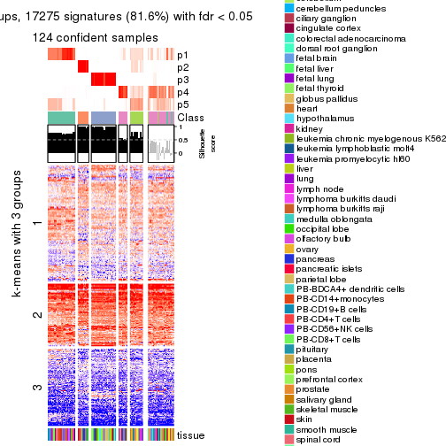</p>

</div>
<div id='tab-ATC-mclust-get-signatures-no-scale-5'>
<pre><code class="r">get_signatures(res, k = 6, scale_rows = FALSE)
</code></pre>

<p>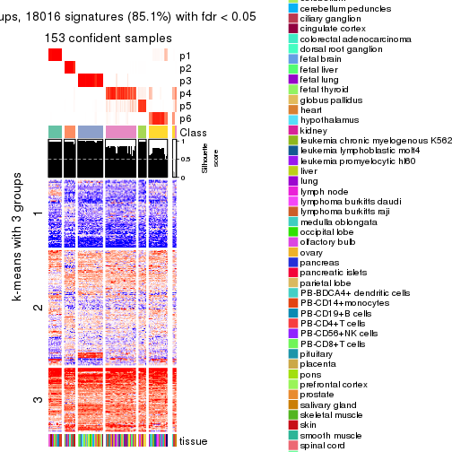</p>

</div>
</div>


Compare the overlap of signatures from different k:

```r
compare_signatures(res)
```


`get_signature()` returns a data frame invisibly. TO get the list of signatures, the function
call should be assigned to a variable explicitly. In following code, if `plot` argument is set
to `FALSE`, no heatmap is plotted while only the differential analysis is performed.

```r
# code only for demonstration
tb = get_signature(res, k = ..., plot = FALSE)
```

An example of the output of `tb` is:

```
#>   which_row         fdr    mean_1    mean_2 scaled_mean_1 scaled_mean_2 km
#> 1        38 0.042760348  8.373488  9.131774    -0.5533452     0.5164555  1
#> 2        40 0.018707592  7.106213  8.469186    -0.6173731     0.5762149  1
#> 3        55 0.019134737 10.221463 11.207825    -0.6159697     0.5749050  1
#> 4        59 0.006059896  5.921854  7.869574    -0.6899429     0.6439467  1
#> 5        60 0.018055526  8.928898 10.211722    -0.6204761     0.5791110  1
#> 6        98 0.009384629 15.714769 14.887706     0.6635654    -0.6193277  2
...
```

The columns in `tb` are:

1. `which_row`: row indices corresponding to the input matrix.
2. `fdr`: FDR for the differential test. 
3. `mean_x`: The mean value in group x.
4. `scaled_mean_x`: The mean value in group x after rows are scaled.
5. `km`: Row groups if k-means clustering is applied to rows.


UMAP plot which shows how samples are separated.


<script>
$( function() {
	$( '#tabs-ATC-mclust-dimension-reduction' ).tabs();
} );
</script>
<div id='tabs-ATC-mclust-dimension-reduction'>
<ul>
<li><a href='#tab-ATC-mclust-dimension-reduction-1'>k = 2</a></li>
<li><a href='#tab-ATC-mclust-dimension-reduction-2'>k = 3</a></li>
<li><a href='#tab-ATC-mclust-dimension-reduction-3'>k = 4</a></li>
<li><a href='#tab-ATC-mclust-dimension-reduction-4'>k = 5</a></li>
<li><a href='#tab-ATC-mclust-dimension-reduction-5'>k = 6</a></li>
</ul>
<div id='tab-ATC-mclust-dimension-reduction-1'>
<pre><code class="r">dimension_reduction(res, k = 2, method = &quot;UMAP&quot;)
</code></pre>

<p></p>

</div>
<div id='tab-ATC-mclust-dimension-reduction-2'>
<pre><code class="r">dimension_reduction(res, k = 3, method = &quot;UMAP&quot;)
</code></pre>

<p></p>

</div>
<div id='tab-ATC-mclust-dimension-reduction-3'>
<pre><code class="r">dimension_reduction(res, k = 4, method = &quot;UMAP&quot;)
</code></pre>

<p></p>

</div>
<div id='tab-ATC-mclust-dimension-reduction-4'>
<pre><code class="r">dimension_reduction(res, k = 5, method = &quot;UMAP&quot;)
</code></pre>

<p></p>

</div>
<div id='tab-ATC-mclust-dimension-reduction-5'>
<pre><code class="r">dimension_reduction(res, k = 6, method = &quot;UMAP&quot;)
</code></pre>

<p></p>

</div>
</div>


Following heatmap shows how subgroups are split when increasing `k`:

```r
collect_classes(res)
```


Test correlation between subgroups and known annotations. If the known
annotation is numeric, one-way ANOVA test is applied, and if the known
annotation is discrete, chi-squared contingency table test is applied.

```r
test_to_known_factors(res)
```

```
#>              n tissue(p) k
#> ATC:mclust 155  5.01e-07 2
#> ATC:mclust 149  3.71e-12 3
#> ATC:mclust 130  1.15e-14 4
#> ATC:mclust 124  1.18e-16 5
#> ATC:mclust 153  6.02e-26 6
```


If matrix rows can be associated to genes, consider to use `functional_enrichment(res,
...)` to perform function enrichment for the signature genes. See [this vignette](http://bioconductor.org/packages/devel/bioc/vignettes/cola/inst/doc/functional_enrichment.html) for more detailed explanations.


 

---------------------------------------------------


### ATC:NMF*


The object with results only for a single top-value method and a single partition method 
can be extracted as:

```r
res = res_list["ATC", "NMF"]
# you can also extract it by
# res = res_list["ATC:NMF"]
```

A summary of `res` and all the functions that can be applied to it:

```r
res
```

```
#> A 'ConsensusPartition' object with k = 2, 3, 4, 5, 6.
#>   On a matrix with 21168 rows and 158 columns.
#>   Top rows (1000, 2000, 3000, 4000, 5000) are extracted by 'ATC' method.
#>   Subgroups are detected by 'NMF' method.
#>   Performed in total 1250 partitions by row resampling.
#>   Best k for subgroups seems to be 4.
#> 
#> Following methods can be applied to this 'ConsensusPartition' object:
#>  [1] "cola_report"             "collect_classes"         "collect_plots"          
#>  [4] "collect_stats"           "colnames"                "compare_signatures"     
#>  [7] "consensus_heatmap"       "dimension_reduction"     "functional_enrichment"  
#> [10] "get_anno_col"            "get_anno"                "get_classes"            
#> [13] "get_consensus"           "get_matrix"              "get_membership"         
#> [16] "get_param"               "get_signatures"          "get_stats"              
#> [19] "is_best_k"               "is_stable_k"             "membership_heatmap"     
#> [22] "ncol"                    "nrow"                    "plot_ecdf"              
#> [25] "rownames"                "select_partition_number" "show"                   
#> [28] "suggest_best_k"          "test_to_known_factors"
```

`collect_plots()` function collects all the plots made from `res` for all `k` (number of partitions)
into one single page to provide an easy and fast comparison between different `k`.

```r
collect_plots(res)
```


The plots are:

- The first row: a plot of the ECDF (empirical cumulative distribution
  function) curves of the consensus matrix for each `k` and the heatmap of
  predicted classes for each `k`.
- The second row: heatmaps of the consensus matrix for each `k`.
- The third row: heatmaps of the membership matrix for each `k`.
- The fouth row: heatmaps of the signatures for each `k`.

All the plots in panels can be made by individual functions and they are
plotted later in this section.

`select_partition_number()` produces several plots showing different
statistics for choosing "optimized" `k`. There are following statistics:

- ECDF curves of the consensus matrix for each `k`;
- 1-PAC. [The PAC
  score](https://en.wikipedia.org/wiki/Consensus_clustering#Over-interpretation_potential_of_consensus_clustering)
  measures the proportion of the ambiguous subgrouping.
- Mean silhouette score.
- Concordance. The mean probability of fiting the consensus class ids in all
  partitions.
- Area increased. Denote $A_k$ as the area under the ECDF curve for current
  `k`, the area increased is defined as $A_k - A_{k-1}$.
- Rand index. The percent of pairs of samples that are both in a same cluster
  or both are not in a same cluster in the partition of k and k-1.
- Jaccard index. The ratio of pairs of samples are both in a same cluster in
  the partition of k and k-1 and the pairs of samples are both in a same
  cluster in the partition k or k-1.

The detailed explanations of these statistics can be found in [the _cola_
vignette](http://bioconductor.org/packages/devel/bioc/vignettes/cola/inst/doc/cola.html#toc_13).

Generally speaking, lower PAC score, higher mean silhouette score or higher
concordance corresponds to better partition. Rand index and Jaccard index
measure how similar the current partition is compared to partition with `k-1`.
If they are too similar, we won't accept `k` is better than `k-1`.

```r
select_partition_number(res)
```


The numeric values for all these statistics can be obtained by `get_stats()`.

```r
get_stats(res)
```

```
#>   k 1-PAC mean_silhouette concordance area_increased  Rand Jaccard
#> 2 2 1.000           0.960       0.984         0.4651 0.536   0.536
#> 3 3 0.932           0.929       0.969         0.4221 0.758   0.566
#> 4 4 0.949           0.926       0.964         0.1379 0.837   0.565
#> 5 5 0.830           0.792       0.893         0.0606 0.921   0.700
#> 6 6 0.840           0.761       0.865         0.0337 0.929   0.678
```

`suggest_best_k()` suggests the best $k$ based on these statistics. The rules are as follows:

- All $k$ with Jaccard index larger than 0.95 are removed because increasing
  $k$ does not provide enough extra information. If all $k$ are removed, it is
  marked as no subgroup is detected.
- For all $k$ with 1-PAC score larger than 0.9, the maximal $k$ is taken as
  the best $k$, and other $k$ are marked as optional $k$.
- If it does not fit the second rule. The $k$ with the maximal vote of the
  highest 1-PAC score, highest mean silhouette, and highest concordance is
  taken as the best $k$.

```r
suggest_best_k(res)
```

```
#> [1] 4
#> attr(,"optional")
#> [1] 2 3
```

There is also optional best $k$ = 2 3 that is worth to check.

Following shows the table of the partitions (You need to click the **show/hide
code output** link to see it). The membership matrix (columns with name `p*`)
is inferred by
[`clue::cl_consensus()`](https://www.rdocumentation.org/link/cl_consensus?package=clue)
function with the `SE` method. Basically the value in the membership matrix
represents the probability to belong to a certain group. The finall class
label for an item is determined with the group with highest probability it
belongs to.

In `get_classes()` function, the entropy is calculated from the membership
matrix and the silhouette score is calculated from the consensus matrix.


<script>
$( function() {
	$( '#tabs-ATC-NMF-get-classes' ).tabs();
} );
</script>
<div id='tabs-ATC-NMF-get-classes'>
<ul>
<li><a href='#tab-ATC-NMF-get-classes-1'>k = 2</a></li>
<li><a href='#tab-ATC-NMF-get-classes-2'>k = 3</a></li>
<li><a href='#tab-ATC-NMF-get-classes-3'>k = 4</a></li>
<li><a href='#tab-ATC-NMF-get-classes-4'>k = 5</a></li>
<li><a href='#tab-ATC-NMF-get-classes-5'>k = 6</a></li>
</ul>

<div id='tab-ATC-NMF-get-classes-1'>
<p><a id='tab-ATC-NMF-get-classes-1-a' style='color:#0366d6' href='#'>show/hide code output</a></p>
<pre><code class="r">cbind(get_classes(res, k = 2), get_membership(res, k = 2))
</code></pre>

<pre><code>#&gt;          class entropy silhouette    p1    p2
#&gt; GSM18927     2  0.0000     0.9859 0.000 1.000
#&gt; GSM18928     2  0.0000     0.9859 0.000 1.000
#&gt; GSM18915     2  0.0000     0.9859 0.000 1.000
#&gt; GSM18916     2  0.0000     0.9859 0.000 1.000
#&gt; GSM18939     2  0.0000     0.9859 0.000 1.000
#&gt; GSM18940     2  0.0000     0.9859 0.000 1.000
#&gt; GSM18933     2  0.0000     0.9859 0.000 1.000
#&gt; GSM18934     2  0.0000     0.9859 0.000 1.000
#&gt; GSM18925     2  0.0000     0.9859 0.000 1.000
#&gt; GSM18926     2  0.0000     0.9859 0.000 1.000
#&gt; GSM18931     2  0.0000     0.9859 0.000 1.000
#&gt; GSM18932     2  0.0000     0.9859 0.000 1.000
#&gt; GSM19019     2  0.0000     0.9859 0.000 1.000
#&gt; GSM19020     2  0.0000     0.9859 0.000 1.000
#&gt; GSM18923     2  0.0000     0.9859 0.000 1.000
#&gt; GSM18924     2  0.0000     0.9859 0.000 1.000
#&gt; GSM18941     2  0.0000     0.9859 0.000 1.000
#&gt; GSM18942     2  0.0000     0.9859 0.000 1.000
#&gt; GSM18929     2  0.0000     0.9859 0.000 1.000
#&gt; GSM18930     2  0.0000     0.9859 0.000 1.000
#&gt; GSM18911     2  0.0000     0.9859 0.000 1.000
#&gt; GSM18912     2  0.0000     0.9859 0.000 1.000
#&gt; GSM18935     2  0.0000     0.9859 0.000 1.000
#&gt; GSM18936     2  0.0000     0.9859 0.000 1.000
#&gt; GSM19005     2  0.0000     0.9859 0.000 1.000
#&gt; GSM19006     2  0.0000     0.9859 0.000 1.000
#&gt; GSM18921     2  0.0000     0.9859 0.000 1.000
#&gt; GSM18922     2  0.0000     0.9859 0.000 1.000
#&gt; GSM18919     2  0.0000     0.9859 0.000 1.000
#&gt; GSM18920     2  0.0000     0.9859 0.000 1.000
#&gt; GSM18917     2  0.0000     0.9859 0.000 1.000
#&gt; GSM18918     2  0.0000     0.9859 0.000 1.000
#&gt; GSM18913     2  0.0000     0.9859 0.000 1.000
#&gt; GSM18914     2  0.0000     0.9859 0.000 1.000
#&gt; GSM18937     2  0.0000     0.9859 0.000 1.000
#&gt; GSM18938     2  0.0000     0.9859 0.000 1.000
#&gt; GSM18943     2  0.0000     0.9859 0.000 1.000
#&gt; GSM18944     2  0.0000     0.9859 0.000 1.000
#&gt; GSM19003     2  0.0000     0.9859 0.000 1.000
#&gt; GSM19004     2  0.0000     0.9859 0.000 1.000
#&gt; GSM19011     2  0.0000     0.9859 0.000 1.000
#&gt; GSM19012     2  0.0000     0.9859 0.000 1.000
#&gt; GSM19009     2  0.0000     0.9859 0.000 1.000
#&gt; GSM19010     2  0.0000     0.9859 0.000 1.000
#&gt; GSM18945     2  0.0000     0.9859 0.000 1.000
#&gt; GSM18946     2  0.0000     0.9859 0.000 1.000
#&gt; GSM18963     2  0.0000     0.9859 0.000 1.000
#&gt; GSM18964     2  0.1843     0.9603 0.028 0.972
#&gt; GSM18905     2  0.0000     0.9859 0.000 1.000
#&gt; GSM18906     2  0.4022     0.9057 0.080 0.920
#&gt; GSM18965     1  0.0000     0.9803 1.000 0.000
#&gt; GSM18966     1  0.0000     0.9803 1.000 0.000
#&gt; GSM18873     1  0.0000     0.9803 1.000 0.000
#&gt; GSM18874     1  0.0000     0.9803 1.000 0.000
#&gt; GSM18973     1  0.0000     0.9803 1.000 0.000
#&gt; GSM18974     1  0.0000     0.9803 1.000 0.000
#&gt; GSM18977     1  0.9170     0.5007 0.668 0.332
#&gt; GSM18978     2  0.0000     0.9859 0.000 1.000
#&gt; GSM18979     2  0.0000     0.9859 0.000 1.000
#&gt; GSM18980     2  0.9129     0.5090 0.328 0.672
#&gt; GSM18883     1  0.0000     0.9803 1.000 0.000
#&gt; GSM18884     1  0.0000     0.9803 1.000 0.000
#&gt; GSM18885     1  0.0000     0.9803 1.000 0.000
#&gt; GSM18886     1  0.0000     0.9803 1.000 0.000
#&gt; GSM18907     1  0.0000     0.9803 1.000 0.000
#&gt; GSM18908     1  0.0000     0.9803 1.000 0.000
#&gt; GSM18909     2  0.8267     0.6456 0.260 0.740
#&gt; GSM18910     2  0.0672     0.9788 0.008 0.992
#&gt; GSM18867     1  0.0000     0.9803 1.000 0.000
#&gt; GSM18868     1  0.0000     0.9803 1.000 0.000
#&gt; GSM18947     2  0.0000     0.9859 0.000 1.000
#&gt; GSM18948     2  0.0000     0.9859 0.000 1.000
#&gt; GSM18995     2  0.0000     0.9859 0.000 1.000
#&gt; GSM18996     2  0.0000     0.9859 0.000 1.000
#&gt; GSM18975     2  0.0000     0.9859 0.000 1.000
#&gt; GSM18976     2  0.0000     0.9859 0.000 1.000
#&gt; GSM18997     2  0.0000     0.9859 0.000 1.000
#&gt; GSM18998     2  0.0000     0.9859 0.000 1.000
#&gt; GSM18967     1  0.0672     0.9731 0.992 0.008
#&gt; GSM18968     1  0.7528     0.7183 0.784 0.216
#&gt; GSM18959     2  0.9998     0.0170 0.492 0.508
#&gt; GSM18960     1  0.9983     0.0823 0.524 0.476
#&gt; GSM19015     2  0.0000     0.9859 0.000 1.000
#&gt; GSM19016     2  0.0000     0.9859 0.000 1.000
#&gt; GSM18957     2  0.2948     0.9360 0.052 0.948
#&gt; GSM18958     1  0.0000     0.9803 1.000 0.000
#&gt; GSM18981     2  0.0000     0.9859 0.000 1.000
#&gt; GSM18982     2  0.0000     0.9859 0.000 1.000
#&gt; GSM18989     2  0.0000     0.9859 0.000 1.000
#&gt; GSM18990     2  0.0000     0.9859 0.000 1.000
#&gt; GSM18985     2  0.1414     0.9679 0.020 0.980
#&gt; GSM18986     2  0.0000     0.9859 0.000 1.000
#&gt; GSM18987     2  0.0000     0.9859 0.000 1.000
#&gt; GSM18988     2  0.0000     0.9859 0.000 1.000
#&gt; GSM18983     2  0.0000     0.9859 0.000 1.000
#&gt; GSM18984     2  0.0000     0.9859 0.000 1.000
#&gt; GSM18951     2  0.0000     0.9859 0.000 1.000
#&gt; GSM18952     2  0.0000     0.9859 0.000 1.000
#&gt; GSM19007     2  0.0000     0.9859 0.000 1.000
#&gt; GSM19008     2  0.0000     0.9859 0.000 1.000
#&gt; GSM18999     2  0.0000     0.9859 0.000 1.000
#&gt; GSM19000     2  0.0000     0.9859 0.000 1.000
#&gt; GSM18889     1  0.0000     0.9803 1.000 0.000
#&gt; GSM18890     1  0.0000     0.9803 1.000 0.000
#&gt; GSM18881     1  0.0000     0.9803 1.000 0.000
#&gt; GSM18882     1  0.0000     0.9803 1.000 0.000
#&gt; GSM18877     1  0.0000     0.9803 1.000 0.000
#&gt; GSM18878     1  0.0000     0.9803 1.000 0.000
#&gt; GSM18875     1  0.0000     0.9803 1.000 0.000
#&gt; GSM18876     1  0.0000     0.9803 1.000 0.000
#&gt; GSM18879     1  0.0000     0.9803 1.000 0.000
#&gt; GSM18880     1  0.0000     0.9803 1.000 0.000
#&gt; GSM18871     1  0.0000     0.9803 1.000 0.000
#&gt; GSM18872     1  0.0000     0.9803 1.000 0.000
#&gt; GSM18903     1  0.0000     0.9803 1.000 0.000
#&gt; GSM18904     1  0.0000     0.9803 1.000 0.000
#&gt; GSM18949     1  0.2603     0.9380 0.956 0.044
#&gt; GSM18950     1  0.0000     0.9803 1.000 0.000
#&gt; GSM18953     2  0.0000     0.9859 0.000 1.000
#&gt; GSM18954     2  0.0000     0.9859 0.000 1.000
#&gt; GSM19013     2  0.0000     0.9859 0.000 1.000
#&gt; GSM19014     2  0.0000     0.9859 0.000 1.000
#&gt; GSM18971     1  0.0000     0.9803 1.000 0.000
#&gt; GSM18972     1  0.0000     0.9803 1.000 0.000
#&gt; GSM18969     1  0.0000     0.9803 1.000 0.000
#&gt; GSM18970     2  0.0000     0.9859 0.000 1.000
#&gt; GSM18869     1  0.0000     0.9803 1.000 0.000
#&gt; GSM18870     1  0.0000     0.9803 1.000 0.000
#&gt; GSM19017     2  0.0000     0.9859 0.000 1.000
#&gt; GSM19018     2  0.0000     0.9859 0.000 1.000
#&gt; GSM18991     2  0.0000     0.9859 0.000 1.000
#&gt; GSM18992     2  0.0000     0.9859 0.000 1.000
#&gt; GSM19021     2  0.0000     0.9859 0.000 1.000
#&gt; GSM19022     2  0.0000     0.9859 0.000 1.000
#&gt; GSM19001     2  0.0000     0.9859 0.000 1.000
#&gt; GSM19002     2  0.0000     0.9859 0.000 1.000
#&gt; GSM18899     1  0.0000     0.9803 1.000 0.000
#&gt; GSM18900     1  0.0000     0.9803 1.000 0.000
#&gt; GSM18961     1  0.0000     0.9803 1.000 0.000
#&gt; GSM18962     2  0.4939     0.8728 0.108 0.892
#&gt; GSM18901     1  0.0000     0.9803 1.000 0.000
#&gt; GSM18902     1  0.0000     0.9803 1.000 0.000
#&gt; GSM18993     2  0.0000     0.9859 0.000 1.000
#&gt; GSM18994     2  0.0000     0.9859 0.000 1.000
#&gt; GSM18865     1  0.0000     0.9803 1.000 0.000
#&gt; GSM18866     1  0.0000     0.9803 1.000 0.000
#&gt; GSM18897     1  0.0000     0.9803 1.000 0.000
#&gt; GSM18898     1  0.0000     0.9803 1.000 0.000
#&gt; GSM18887     1  0.0000     0.9803 1.000 0.000
#&gt; GSM18888     1  0.0000     0.9803 1.000 0.000
#&gt; GSM18893     1  0.0000     0.9803 1.000 0.000
#&gt; GSM18894     1  0.0000     0.9803 1.000 0.000
#&gt; GSM18895     1  0.0000     0.9803 1.000 0.000
#&gt; GSM18896     1  0.0000     0.9803 1.000 0.000
#&gt; GSM18891     1  0.0000     0.9803 1.000 0.000
#&gt; GSM18892     1  0.0000     0.9803 1.000 0.000
#&gt; GSM18955     2  0.0000     0.9859 0.000 1.000
#&gt; GSM18956     2  0.0000     0.9859 0.000 1.000
</code></pre>

<script>
$('#tab-ATC-NMF-get-classes-1-a').parent().next().next().hide();
$('#tab-ATC-NMF-get-classes-1-a').click(function(){
  $('#tab-ATC-NMF-get-classes-1-a').parent().next().next().toggle();
  return(false);
});
</script>
</div>

<div id='tab-ATC-NMF-get-classes-2'>
<p><a id='tab-ATC-NMF-get-classes-2-a' style='color:#0366d6' href='#'>show/hide code output</a></p>
<pre><code class="r">cbind(get_classes(res, k = 3), get_membership(res, k = 3))
</code></pre>

<pre><code>#&gt;          class entropy silhouette    p1    p2    p3
#&gt; GSM18927     3  0.0000     0.9893 0.000 0.000 1.000
#&gt; GSM18928     3  0.0000     0.9893 0.000 0.000 1.000
#&gt; GSM18915     3  0.0000     0.9893 0.000 0.000 1.000
#&gt; GSM18916     3  0.0000     0.9893 0.000 0.000 1.000
#&gt; GSM18939     3  0.0000     0.9893 0.000 0.000 1.000
#&gt; GSM18940     3  0.0000     0.9893 0.000 0.000 1.000
#&gt; GSM18933     3  0.0000     0.9893 0.000 0.000 1.000
#&gt; GSM18934     3  0.0000     0.9893 0.000 0.000 1.000
#&gt; GSM18925     3  0.0000     0.9893 0.000 0.000 1.000
#&gt; GSM18926     3  0.0000     0.9893 0.000 0.000 1.000
#&gt; GSM18931     3  0.0000     0.9893 0.000 0.000 1.000
#&gt; GSM18932     3  0.0000     0.9893 0.000 0.000 1.000
#&gt; GSM19019     3  0.2165     0.9335 0.000 0.064 0.936
#&gt; GSM19020     3  0.1860     0.9458 0.000 0.052 0.948
#&gt; GSM18923     3  0.0000     0.9893 0.000 0.000 1.000
#&gt; GSM18924     3  0.0000     0.9893 0.000 0.000 1.000
#&gt; GSM18941     3  0.1529     0.9560 0.000 0.040 0.960
#&gt; GSM18942     3  0.3941     0.8188 0.000 0.156 0.844
#&gt; GSM18929     3  0.0000     0.9893 0.000 0.000 1.000
#&gt; GSM18930     3  0.0000     0.9893 0.000 0.000 1.000
#&gt; GSM18911     3  0.0000     0.9893 0.000 0.000 1.000
#&gt; GSM18912     3  0.0000     0.9893 0.000 0.000 1.000
#&gt; GSM18935     3  0.0000     0.9893 0.000 0.000 1.000
#&gt; GSM18936     3  0.0000     0.9893 0.000 0.000 1.000
#&gt; GSM19005     2  0.0000     0.9613 0.000 1.000 0.000
#&gt; GSM19006     2  0.0000     0.9613 0.000 1.000 0.000
#&gt; GSM18921     3  0.0000     0.9893 0.000 0.000 1.000
#&gt; GSM18922     3  0.0000     0.9893 0.000 0.000 1.000
#&gt; GSM18919     3  0.0000     0.9893 0.000 0.000 1.000
#&gt; GSM18920     3  0.0000     0.9893 0.000 0.000 1.000
#&gt; GSM18917     3  0.0000     0.9893 0.000 0.000 1.000
#&gt; GSM18918     3  0.0000     0.9893 0.000 0.000 1.000
#&gt; GSM18913     3  0.0000     0.9893 0.000 0.000 1.000
#&gt; GSM18914     3  0.0000     0.9893 0.000 0.000 1.000
#&gt; GSM18937     3  0.0000     0.9893 0.000 0.000 1.000
#&gt; GSM18938     3  0.0000     0.9893 0.000 0.000 1.000
#&gt; GSM18943     3  0.0000     0.9893 0.000 0.000 1.000
#&gt; GSM18944     3  0.0000     0.9893 0.000 0.000 1.000
#&gt; GSM19003     2  0.0000     0.9613 0.000 1.000 0.000
#&gt; GSM19004     2  0.0000     0.9613 0.000 1.000 0.000
#&gt; GSM19011     2  0.0000     0.9613 0.000 1.000 0.000
#&gt; GSM19012     2  0.0000     0.9613 0.000 1.000 0.000
#&gt; GSM19009     2  0.0000     0.9613 0.000 1.000 0.000
#&gt; GSM19010     2  0.0000     0.9613 0.000 1.000 0.000
#&gt; GSM18945     3  0.0000     0.9893 0.000 0.000 1.000
#&gt; GSM18946     3  0.0000     0.9893 0.000 0.000 1.000
#&gt; GSM18963     2  0.0892     0.9461 0.000 0.980 0.020
#&gt; GSM18964     2  0.7022     0.5940 0.260 0.684 0.056
#&gt; GSM18905     2  0.0000     0.9613 0.000 1.000 0.000
#&gt; GSM18906     2  0.0592     0.9518 0.012 0.988 0.000
#&gt; GSM18965     1  0.1529     0.9249 0.960 0.040 0.000
#&gt; GSM18966     1  0.0237     0.9538 0.996 0.004 0.000
#&gt; GSM18873     1  0.0000     0.9567 1.000 0.000 0.000
#&gt; GSM18874     1  0.0000     0.9567 1.000 0.000 0.000
#&gt; GSM18973     1  0.0000     0.9567 1.000 0.000 0.000
#&gt; GSM18974     1  0.0000     0.9567 1.000 0.000 0.000
#&gt; GSM18977     2  0.5706     0.5239 0.320 0.680 0.000
#&gt; GSM18978     2  0.0000     0.9613 0.000 1.000 0.000
#&gt; GSM18979     2  0.0000     0.9613 0.000 1.000 0.000
#&gt; GSM18980     1  0.1529     0.9249 0.960 0.040 0.000
#&gt; GSM18883     1  0.0000     0.9567 1.000 0.000 0.000
#&gt; GSM18884     1  0.0000     0.9567 1.000 0.000 0.000
#&gt; GSM18885     1  0.0000     0.9567 1.000 0.000 0.000
#&gt; GSM18886     1  0.0000     0.9567 1.000 0.000 0.000
#&gt; GSM18907     1  0.0000     0.9567 1.000 0.000 0.000
#&gt; GSM18908     1  0.0000     0.9567 1.000 0.000 0.000
#&gt; GSM18909     2  0.0000     0.9613 0.000 1.000 0.000
#&gt; GSM18910     2  0.0000     0.9613 0.000 1.000 0.000
#&gt; GSM18867     1  0.0000     0.9567 1.000 0.000 0.000
#&gt; GSM18868     1  0.0000     0.9567 1.000 0.000 0.000
#&gt; GSM18947     2  0.0000     0.9613 0.000 1.000 0.000
#&gt; GSM18948     2  0.1643     0.9250 0.000 0.956 0.044
#&gt; GSM18995     2  0.0000     0.9613 0.000 1.000 0.000
#&gt; GSM18996     2  0.0000     0.9613 0.000 1.000 0.000
#&gt; GSM18975     2  0.1031     0.9426 0.000 0.976 0.024
#&gt; GSM18976     2  0.3752     0.8605 0.020 0.884 0.096
#&gt; GSM18997     2  0.0000     0.9613 0.000 1.000 0.000
#&gt; GSM18998     2  0.0000     0.9613 0.000 1.000 0.000
#&gt; GSM18967     1  0.4887     0.7009 0.772 0.228 0.000
#&gt; GSM18968     2  0.6305     0.0517 0.484 0.516 0.000
#&gt; GSM18959     1  0.4834     0.7348 0.792 0.004 0.204
#&gt; GSM18960     1  0.6109     0.7212 0.760 0.048 0.192
#&gt; GSM19015     2  0.0000     0.9613 0.000 1.000 0.000
#&gt; GSM19016     2  0.0000     0.9613 0.000 1.000 0.000
#&gt; GSM18957     2  0.6771     0.5802 0.276 0.684 0.040
#&gt; GSM18958     1  0.0000     0.9567 1.000 0.000 0.000
#&gt; GSM18981     2  0.0237     0.9585 0.000 0.996 0.004
#&gt; GSM18982     2  0.0237     0.9584 0.004 0.996 0.000
#&gt; GSM18989     2  0.0000     0.9613 0.000 1.000 0.000
#&gt; GSM18990     2  0.0000     0.9613 0.000 1.000 0.000
#&gt; GSM18985     2  0.5956     0.7258 0.188 0.768 0.044
#&gt; GSM18986     2  0.6224     0.5693 0.016 0.688 0.296
#&gt; GSM18987     2  0.0000     0.9613 0.000 1.000 0.000
#&gt; GSM18988     2  0.0000     0.9613 0.000 1.000 0.000
#&gt; GSM18983     2  0.0000     0.9613 0.000 1.000 0.000
#&gt; GSM18984     2  0.0000     0.9613 0.000 1.000 0.000
#&gt; GSM18951     2  0.0000     0.9613 0.000 1.000 0.000
#&gt; GSM18952     2  0.0000     0.9613 0.000 1.000 0.000
#&gt; GSM19007     2  0.0000     0.9613 0.000 1.000 0.000
#&gt; GSM19008     2  0.0000     0.9613 0.000 1.000 0.000
#&gt; GSM18999     2  0.0000     0.9613 0.000 1.000 0.000
#&gt; GSM19000     2  0.0000     0.9613 0.000 1.000 0.000
#&gt; GSM18889     1  0.0000     0.9567 1.000 0.000 0.000
#&gt; GSM18890     1  0.0000     0.9567 1.000 0.000 0.000
#&gt; GSM18881     1  0.0000     0.9567 1.000 0.000 0.000
#&gt; GSM18882     1  0.0000     0.9567 1.000 0.000 0.000
#&gt; GSM18877     1  0.0000     0.9567 1.000 0.000 0.000
#&gt; GSM18878     1  0.0000     0.9567 1.000 0.000 0.000
#&gt; GSM18875     1  0.0000     0.9567 1.000 0.000 0.000
#&gt; GSM18876     1  0.0000     0.9567 1.000 0.000 0.000
#&gt; GSM18879     1  0.0000     0.9567 1.000 0.000 0.000
#&gt; GSM18880     1  0.0000     0.9567 1.000 0.000 0.000
#&gt; GSM18871     1  0.0000     0.9567 1.000 0.000 0.000
#&gt; GSM18872     1  0.0000     0.9567 1.000 0.000 0.000
#&gt; GSM18903     1  0.0000     0.9567 1.000 0.000 0.000
#&gt; GSM18904     1  0.0000     0.9567 1.000 0.000 0.000
#&gt; GSM18949     1  0.5760     0.5165 0.672 0.328 0.000
#&gt; GSM18950     1  0.2711     0.8806 0.912 0.088 0.000
#&gt; GSM18953     2  0.0000     0.9613 0.000 1.000 0.000
#&gt; GSM18954     2  0.0000     0.9613 0.000 1.000 0.000
#&gt; GSM19013     2  0.0000     0.9613 0.000 1.000 0.000
#&gt; GSM19014     2  0.0000     0.9613 0.000 1.000 0.000
#&gt; GSM18971     1  0.0000     0.9567 1.000 0.000 0.000
#&gt; GSM18972     1  0.0000     0.9567 1.000 0.000 0.000
#&gt; GSM18969     1  0.0000     0.9567 1.000 0.000 0.000
#&gt; GSM18970     2  0.0000     0.9613 0.000 1.000 0.000
#&gt; GSM18869     1  0.0000     0.9567 1.000 0.000 0.000
#&gt; GSM18870     1  0.0000     0.9567 1.000 0.000 0.000
#&gt; GSM19017     2  0.0000     0.9613 0.000 1.000 0.000
#&gt; GSM19018     2  0.0000     0.9613 0.000 1.000 0.000
#&gt; GSM18991     2  0.0000     0.9613 0.000 1.000 0.000
#&gt; GSM18992     2  0.0000     0.9613 0.000 1.000 0.000
#&gt; GSM19021     3  0.2066     0.9385 0.000 0.060 0.940
#&gt; GSM19022     3  0.1289     0.9644 0.000 0.032 0.968
#&gt; GSM19001     2  0.0000     0.9613 0.000 1.000 0.000
#&gt; GSM19002     2  0.0000     0.9613 0.000 1.000 0.000
#&gt; GSM18899     1  0.0000     0.9567 1.000 0.000 0.000
#&gt; GSM18900     1  0.0000     0.9567 1.000 0.000 0.000
#&gt; GSM18961     1  0.3619     0.8260 0.864 0.000 0.136
#&gt; GSM18962     1  0.8427     0.5586 0.620 0.208 0.172
#&gt; GSM18901     1  0.5859     0.4817 0.656 0.344 0.000
#&gt; GSM18902     1  0.5706     0.5339 0.680 0.320 0.000
#&gt; GSM18993     2  0.0000     0.9613 0.000 1.000 0.000
#&gt; GSM18994     2  0.0000     0.9613 0.000 1.000 0.000
#&gt; GSM18865     1  0.0000     0.9567 1.000 0.000 0.000
#&gt; GSM18866     1  0.0000     0.9567 1.000 0.000 0.000
#&gt; GSM18897     1  0.0000     0.9567 1.000 0.000 0.000
#&gt; GSM18898     1  0.0000     0.9567 1.000 0.000 0.000
#&gt; GSM18887     1  0.0000     0.9567 1.000 0.000 0.000
#&gt; GSM18888     1  0.0000     0.9567 1.000 0.000 0.000
#&gt; GSM18893     1  0.0000     0.9567 1.000 0.000 0.000
#&gt; GSM18894     1  0.0000     0.9567 1.000 0.000 0.000
#&gt; GSM18895     1  0.0000     0.9567 1.000 0.000 0.000
#&gt; GSM18896     1  0.0000     0.9567 1.000 0.000 0.000
#&gt; GSM18891     1  0.0000     0.9567 1.000 0.000 0.000
#&gt; GSM18892     1  0.0000     0.9567 1.000 0.000 0.000
#&gt; GSM18955     2  0.0000     0.9613 0.000 1.000 0.000
#&gt; GSM18956     2  0.0000     0.9613 0.000 1.000 0.000
</code></pre>

<script>
$('#tab-ATC-NMF-get-classes-2-a').parent().next().next().hide();
$('#tab-ATC-NMF-get-classes-2-a').click(function(){
  $('#tab-ATC-NMF-get-classes-2-a').parent().next().next().toggle();
  return(false);
});
</script>
</div>

<div id='tab-ATC-NMF-get-classes-3'>
<p><a id='tab-ATC-NMF-get-classes-3-a' style='color:#0366d6' href='#'>show/hide code output</a></p>
<pre><code class="r">cbind(get_classes(res, k = 4), get_membership(res, k = 4))
</code></pre>

<pre><code>#&gt;          class entropy silhouette    p1    p2    p3    p4
#&gt; GSM18927     3  0.0592     0.9591 0.000 0.000 0.984 0.016
#&gt; GSM18928     3  0.0469     0.9603 0.000 0.000 0.988 0.012
#&gt; GSM18915     3  0.0000     0.9625 0.000 0.000 1.000 0.000
#&gt; GSM18916     3  0.0000     0.9625 0.000 0.000 1.000 0.000
#&gt; GSM18939     3  0.0000     0.9625 0.000 0.000 1.000 0.000
#&gt; GSM18940     3  0.0000     0.9625 0.000 0.000 1.000 0.000
#&gt; GSM18933     3  0.0817     0.9542 0.000 0.000 0.976 0.024
#&gt; GSM18934     3  0.0592     0.9591 0.000 0.000 0.984 0.016
#&gt; GSM18925     3  0.0000     0.9625 0.000 0.000 1.000 0.000
#&gt; GSM18926     3  0.0000     0.9625 0.000 0.000 1.000 0.000
#&gt; GSM18931     3  0.0000     0.9625 0.000 0.000 1.000 0.000
#&gt; GSM18932     3  0.0336     0.9612 0.000 0.000 0.992 0.008
#&gt; GSM19019     3  0.4866     0.3702 0.000 0.000 0.596 0.404
#&gt; GSM19020     3  0.1302     0.9388 0.000 0.000 0.956 0.044
#&gt; GSM18923     3  0.0000     0.9625 0.000 0.000 1.000 0.000
#&gt; GSM18924     3  0.0000     0.9625 0.000 0.000 1.000 0.000
#&gt; GSM18941     3  0.1792     0.9088 0.000 0.068 0.932 0.000
#&gt; GSM18942     3  0.3610     0.7513 0.000 0.200 0.800 0.000
#&gt; GSM18929     3  0.0592     0.9591 0.000 0.000 0.984 0.016
#&gt; GSM18930     3  0.0592     0.9591 0.000 0.000 0.984 0.016
#&gt; GSM18911     3  0.0000     0.9625 0.000 0.000 1.000 0.000
#&gt; GSM18912     3  0.0188     0.9605 0.000 0.004 0.996 0.000
#&gt; GSM18935     3  0.0000     0.9625 0.000 0.000 1.000 0.000
#&gt; GSM18936     3  0.0592     0.9591 0.000 0.000 0.984 0.016
#&gt; GSM19005     2  0.0592     0.9404 0.000 0.984 0.016 0.000
#&gt; GSM19006     2  0.0469     0.9421 0.000 0.988 0.012 0.000
#&gt; GSM18921     3  0.0592     0.9591 0.000 0.000 0.984 0.016
#&gt; GSM18922     3  0.0592     0.9591 0.000 0.000 0.984 0.016
#&gt; GSM18919     3  0.0000     0.9625 0.000 0.000 1.000 0.000
#&gt; GSM18920     3  0.0000     0.9625 0.000 0.000 1.000 0.000
#&gt; GSM18917     3  0.0000     0.9625 0.000 0.000 1.000 0.000
#&gt; GSM18918     3  0.0188     0.9605 0.000 0.004 0.996 0.000
#&gt; GSM18913     3  0.0000     0.9625 0.000 0.000 1.000 0.000
#&gt; GSM18914     3  0.0000     0.9625 0.000 0.000 1.000 0.000
#&gt; GSM18937     3  0.0000     0.9625 0.000 0.000 1.000 0.000
#&gt; GSM18938     3  0.0000     0.9625 0.000 0.000 1.000 0.000
#&gt; GSM18943     3  0.0592     0.9591 0.000 0.000 0.984 0.016
#&gt; GSM18944     3  0.0592     0.9591 0.000 0.000 0.984 0.016
#&gt; GSM19003     2  0.0469     0.9421 0.000 0.988 0.012 0.000
#&gt; GSM19004     2  0.0707     0.9384 0.000 0.980 0.020 0.000
#&gt; GSM19011     2  0.0817     0.9359 0.000 0.976 0.024 0.000
#&gt; GSM19012     2  0.0817     0.9359 0.000 0.976 0.024 0.000
#&gt; GSM19009     2  0.0469     0.9421 0.000 0.988 0.012 0.000
#&gt; GSM19010     2  0.0592     0.9404 0.000 0.984 0.016 0.000
#&gt; GSM18945     3  0.0188     0.9620 0.000 0.000 0.996 0.004
#&gt; GSM18946     3  0.0188     0.9620 0.000 0.000 0.996 0.004
#&gt; GSM18963     4  0.0188     0.9467 0.000 0.004 0.000 0.996
#&gt; GSM18964     4  0.0188     0.9479 0.004 0.000 0.000 0.996
#&gt; GSM18905     2  0.2408     0.8880 0.000 0.896 0.000 0.104
#&gt; GSM18906     4  0.1474     0.9209 0.000 0.052 0.000 0.948
#&gt; GSM18965     4  0.0188     0.9479 0.004 0.000 0.000 0.996
#&gt; GSM18966     4  0.0188     0.9479 0.004 0.000 0.000 0.996
#&gt; GSM18873     1  0.0000     0.9937 1.000 0.000 0.000 0.000
#&gt; GSM18874     1  0.0000     0.9937 1.000 0.000 0.000 0.000
#&gt; GSM18973     4  0.1389     0.9138 0.048 0.000 0.000 0.952
#&gt; GSM18974     4  0.0707     0.9394 0.020 0.000 0.000 0.980
#&gt; GSM18977     4  0.0779     0.9427 0.004 0.016 0.000 0.980
#&gt; GSM18978     4  0.2408     0.8728 0.000 0.104 0.000 0.896
#&gt; GSM18979     4  0.0707     0.9410 0.000 0.020 0.000 0.980
#&gt; GSM18980     4  0.0188     0.9479 0.004 0.000 0.000 0.996
#&gt; GSM18883     1  0.0000     0.9937 1.000 0.000 0.000 0.000
#&gt; GSM18884     1  0.0000     0.9937 1.000 0.000 0.000 0.000
#&gt; GSM18885     1  0.0000     0.9937 1.000 0.000 0.000 0.000
#&gt; GSM18886     1  0.0000     0.9937 1.000 0.000 0.000 0.000
#&gt; GSM18907     1  0.0000     0.9937 1.000 0.000 0.000 0.000
#&gt; GSM18908     1  0.0000     0.9937 1.000 0.000 0.000 0.000
#&gt; GSM18909     2  0.0895     0.9415 0.004 0.976 0.000 0.020
#&gt; GSM18910     2  0.0469     0.9435 0.000 0.988 0.000 0.012
#&gt; GSM18867     1  0.0000     0.9937 1.000 0.000 0.000 0.000
#&gt; GSM18868     1  0.0000     0.9937 1.000 0.000 0.000 0.000
#&gt; GSM18947     4  0.1557     0.9181 0.000 0.056 0.000 0.944
#&gt; GSM18948     4  0.0336     0.9459 0.000 0.008 0.000 0.992
#&gt; GSM18995     2  0.2281     0.8945 0.000 0.904 0.000 0.096
#&gt; GSM18996     2  0.1118     0.9358 0.000 0.964 0.000 0.036
#&gt; GSM18975     4  0.0188     0.9467 0.000 0.004 0.000 0.996
#&gt; GSM18976     4  0.0188     0.9479 0.004 0.000 0.000 0.996
#&gt; GSM18997     2  0.1474     0.9274 0.000 0.948 0.000 0.052
#&gt; GSM18998     2  0.1389     0.9298 0.000 0.952 0.000 0.048
#&gt; GSM18967     4  0.0188     0.9479 0.004 0.000 0.000 0.996
#&gt; GSM18968     4  0.0188     0.9479 0.004 0.000 0.000 0.996
#&gt; GSM18959     4  0.0188     0.9479 0.004 0.000 0.000 0.996
#&gt; GSM18960     4  0.0188     0.9479 0.004 0.000 0.000 0.996
#&gt; GSM19015     2  0.0592     0.9429 0.000 0.984 0.000 0.016
#&gt; GSM19016     2  0.0336     0.9435 0.000 0.992 0.000 0.008
#&gt; GSM18957     4  0.0188     0.9479 0.004 0.000 0.000 0.996
#&gt; GSM18958     4  0.0188     0.9479 0.004 0.000 0.000 0.996
#&gt; GSM18981     4  0.0592     0.9430 0.000 0.016 0.000 0.984
#&gt; GSM18982     4  0.0592     0.9430 0.000 0.016 0.000 0.984
#&gt; GSM18989     2  0.2589     0.8753 0.000 0.884 0.000 0.116
#&gt; GSM18990     4  0.4713     0.4319 0.000 0.360 0.000 0.640
#&gt; GSM18985     4  0.0376     0.9471 0.004 0.004 0.000 0.992
#&gt; GSM18986     4  0.0188     0.9479 0.004 0.000 0.000 0.996
#&gt; GSM18987     4  0.4543     0.5179 0.000 0.324 0.000 0.676
#&gt; GSM18988     2  0.4746     0.4453 0.000 0.632 0.000 0.368
#&gt; GSM18983     2  0.2216     0.8980 0.000 0.908 0.000 0.092
#&gt; GSM18984     2  0.1211     0.9342 0.000 0.960 0.000 0.040
#&gt; GSM18951     2  0.2408     0.8866 0.000 0.896 0.000 0.104
#&gt; GSM18952     4  0.2647     0.8543 0.000 0.120 0.000 0.880
#&gt; GSM19007     2  0.0469     0.9421 0.000 0.988 0.012 0.000
#&gt; GSM19008     2  0.0469     0.9421 0.000 0.988 0.012 0.000
#&gt; GSM18999     2  0.0188     0.9428 0.000 0.996 0.004 0.000
#&gt; GSM19000     2  0.0336     0.9426 0.000 0.992 0.008 0.000
#&gt; GSM18889     1  0.0000     0.9937 1.000 0.000 0.000 0.000
#&gt; GSM18890     1  0.0000     0.9937 1.000 0.000 0.000 0.000
#&gt; GSM18881     1  0.0000     0.9937 1.000 0.000 0.000 0.000
#&gt; GSM18882     1  0.0000     0.9937 1.000 0.000 0.000 0.000
#&gt; GSM18877     1  0.0188     0.9907 0.996 0.000 0.000 0.004
#&gt; GSM18878     1  0.0000     0.9937 1.000 0.000 0.000 0.000
#&gt; GSM18875     1  0.0000     0.9937 1.000 0.000 0.000 0.000
#&gt; GSM18876     1  0.0000     0.9937 1.000 0.000 0.000 0.000
#&gt; GSM18879     1  0.0000     0.9937 1.000 0.000 0.000 0.000
#&gt; GSM18880     1  0.0188     0.9907 0.996 0.000 0.000 0.004
#&gt; GSM18871     1  0.0000     0.9937 1.000 0.000 0.000 0.000
#&gt; GSM18872     1  0.0000     0.9937 1.000 0.000 0.000 0.000
#&gt; GSM18903     1  0.0000     0.9937 1.000 0.000 0.000 0.000
#&gt; GSM18904     1  0.0000     0.9937 1.000 0.000 0.000 0.000
#&gt; GSM18949     4  0.0188     0.9479 0.004 0.000 0.000 0.996
#&gt; GSM18950     4  0.0188     0.9479 0.004 0.000 0.000 0.996
#&gt; GSM18953     4  0.4989     0.0922 0.000 0.472 0.000 0.528
#&gt; GSM18954     4  0.3907     0.7024 0.000 0.232 0.000 0.768
#&gt; GSM19013     2  0.0469     0.9421 0.000 0.988 0.012 0.000
#&gt; GSM19014     2  0.0469     0.9421 0.000 0.988 0.012 0.000
#&gt; GSM18971     4  0.0336     0.9458 0.008 0.000 0.000 0.992
#&gt; GSM18972     4  0.0336     0.9458 0.008 0.000 0.000 0.992
#&gt; GSM18969     4  0.0188     0.9479 0.004 0.000 0.000 0.996
#&gt; GSM18970     2  0.3942     0.7169 0.000 0.764 0.000 0.236
#&gt; GSM18869     1  0.0000     0.9937 1.000 0.000 0.000 0.000
#&gt; GSM18870     1  0.0000     0.9937 1.000 0.000 0.000 0.000
#&gt; GSM19017     2  0.0592     0.9428 0.000 0.984 0.000 0.016
#&gt; GSM19018     2  0.0336     0.9435 0.000 0.992 0.000 0.008
#&gt; GSM18991     2  0.0817     0.9405 0.000 0.976 0.000 0.024
#&gt; GSM18992     2  0.0469     0.9435 0.000 0.988 0.000 0.012
#&gt; GSM19021     3  0.4605     0.5357 0.000 0.000 0.664 0.336
#&gt; GSM19022     3  0.3486     0.7831 0.000 0.000 0.812 0.188
#&gt; GSM19001     2  0.0000     0.9427 0.000 1.000 0.000 0.000
#&gt; GSM19002     2  0.0000     0.9427 0.000 1.000 0.000 0.000
#&gt; GSM18899     1  0.1302     0.9520 0.956 0.000 0.000 0.044
#&gt; GSM18900     1  0.2281     0.8939 0.904 0.000 0.000 0.096
#&gt; GSM18961     4  0.0188     0.9479 0.004 0.000 0.000 0.996
#&gt; GSM18962     4  0.0188     0.9479 0.004 0.000 0.000 0.996
#&gt; GSM18901     1  0.1389     0.9491 0.952 0.048 0.000 0.000
#&gt; GSM18902     1  0.1211     0.9570 0.960 0.040 0.000 0.000
#&gt; GSM18993     4  0.1637     0.9148 0.000 0.060 0.000 0.940
#&gt; GSM18994     4  0.0817     0.9391 0.000 0.024 0.000 0.976
#&gt; GSM18865     4  0.0469     0.9438 0.012 0.000 0.000 0.988
#&gt; GSM18866     4  0.0336     0.9458 0.008 0.000 0.000 0.992
#&gt; GSM18897     1  0.0000     0.9937 1.000 0.000 0.000 0.000
#&gt; GSM18898     1  0.0000     0.9937 1.000 0.000 0.000 0.000
#&gt; GSM18887     1  0.0000     0.9937 1.000 0.000 0.000 0.000
#&gt; GSM18888     1  0.0000     0.9937 1.000 0.000 0.000 0.000
#&gt; GSM18893     1  0.0000     0.9937 1.000 0.000 0.000 0.000
#&gt; GSM18894     1  0.0000     0.9937 1.000 0.000 0.000 0.000
#&gt; GSM18895     1  0.0000     0.9937 1.000 0.000 0.000 0.000
#&gt; GSM18896     1  0.0000     0.9937 1.000 0.000 0.000 0.000
#&gt; GSM18891     1  0.0000     0.9937 1.000 0.000 0.000 0.000
#&gt; GSM18892     1  0.0000     0.9937 1.000 0.000 0.000 0.000
#&gt; GSM18955     2  0.4500     0.5624 0.000 0.684 0.000 0.316
#&gt; GSM18956     4  0.1022     0.9344 0.000 0.032 0.000 0.968
</code></pre>

<script>
$('#tab-ATC-NMF-get-classes-3-a').parent().next().next().hide();
$('#tab-ATC-NMF-get-classes-3-a').click(function(){
  $('#tab-ATC-NMF-get-classes-3-a').parent().next().next().toggle();
  return(false);
});
</script>
</div>

<div id='tab-ATC-NMF-get-classes-4'>
<p><a id='tab-ATC-NMF-get-classes-4-a' style='color:#0366d6' href='#'>show/hide code output</a></p>
<pre><code class="r">cbind(get_classes(res, k = 5), get_membership(res, k = 5))
</code></pre>

<pre><code>#&gt;          class entropy silhouette    p1    p2    p3    p4    p5
#&gt; GSM18927     3  0.0162     0.9560 0.000 0.000 0.996 0.004 0.000
#&gt; GSM18928     3  0.0162     0.9560 0.000 0.000 0.996 0.004 0.000
#&gt; GSM18915     3  0.0000     0.9564 0.000 0.000 1.000 0.000 0.000
#&gt; GSM18916     3  0.0162     0.9554 0.000 0.004 0.996 0.000 0.000
#&gt; GSM18939     3  0.0000     0.9564 0.000 0.000 1.000 0.000 0.000
#&gt; GSM18940     3  0.0000     0.9564 0.000 0.000 1.000 0.000 0.000
#&gt; GSM18933     3  0.0162     0.9560 0.000 0.000 0.996 0.004 0.000
#&gt; GSM18934     3  0.0162     0.9560 0.000 0.000 0.996 0.004 0.000
#&gt; GSM18925     3  0.0000     0.9564 0.000 0.000 1.000 0.000 0.000
#&gt; GSM18926     3  0.0290     0.9537 0.000 0.008 0.992 0.000 0.000
#&gt; GSM18931     3  0.0000     0.9564 0.000 0.000 1.000 0.000 0.000
#&gt; GSM18932     3  0.0162     0.9560 0.000 0.000 0.996 0.004 0.000
#&gt; GSM19019     3  0.6292     0.3509 0.000 0.012 0.572 0.260 0.156
#&gt; GSM19020     3  0.4816     0.7193 0.000 0.024 0.760 0.088 0.128
#&gt; GSM18923     3  0.0290     0.9537 0.000 0.008 0.992 0.000 0.000
#&gt; GSM18924     3  0.0000     0.9564 0.000 0.000 1.000 0.000 0.000
#&gt; GSM18941     3  0.1410     0.9099 0.000 0.060 0.940 0.000 0.000
#&gt; GSM18942     3  0.3424     0.6891 0.000 0.240 0.760 0.000 0.000
#&gt; GSM18929     3  0.0162     0.9560 0.000 0.000 0.996 0.004 0.000
#&gt; GSM18930     3  0.0162     0.9560 0.000 0.000 0.996 0.004 0.000
#&gt; GSM18911     3  0.0162     0.9554 0.000 0.004 0.996 0.000 0.000
#&gt; GSM18912     3  0.0404     0.9514 0.000 0.012 0.988 0.000 0.000
#&gt; GSM18935     3  0.0000     0.9564 0.000 0.000 1.000 0.000 0.000
#&gt; GSM18936     3  0.0162     0.9560 0.000 0.000 0.996 0.004 0.000
#&gt; GSM19005     2  0.0162     0.9092 0.000 0.996 0.004 0.000 0.000
#&gt; GSM19006     2  0.0162     0.9092 0.000 0.996 0.004 0.000 0.000
#&gt; GSM18921     3  0.0162     0.9560 0.000 0.000 0.996 0.004 0.000
#&gt; GSM18922     3  0.0162     0.9560 0.000 0.000 0.996 0.004 0.000
#&gt; GSM18919     3  0.0000     0.9564 0.000 0.000 1.000 0.000 0.000
#&gt; GSM18920     3  0.0000     0.9564 0.000 0.000 1.000 0.000 0.000
#&gt; GSM18917     3  0.0162     0.9554 0.000 0.004 0.996 0.000 0.000
#&gt; GSM18918     3  0.0404     0.9514 0.000 0.012 0.988 0.000 0.000
#&gt; GSM18913     3  0.0510     0.9487 0.000 0.016 0.984 0.000 0.000
#&gt; GSM18914     3  0.0510     0.9487 0.000 0.016 0.984 0.000 0.000
#&gt; GSM18937     3  0.0000     0.9564 0.000 0.000 1.000 0.000 0.000
#&gt; GSM18938     3  0.0290     0.9537 0.000 0.008 0.992 0.000 0.000
#&gt; GSM18943     3  0.0162     0.9560 0.000 0.000 0.996 0.004 0.000
#&gt; GSM18944     3  0.0162     0.9560 0.000 0.000 0.996 0.004 0.000
#&gt; GSM19003     2  0.0000     0.9096 0.000 1.000 0.000 0.000 0.000
#&gt; GSM19004     2  0.0162     0.9092 0.000 0.996 0.004 0.000 0.000
#&gt; GSM19011     2  0.0566     0.9054 0.000 0.984 0.012 0.000 0.004
#&gt; GSM19012     2  0.0290     0.9079 0.000 0.992 0.008 0.000 0.000
#&gt; GSM19009     2  0.0162     0.9092 0.000 0.996 0.004 0.000 0.000
#&gt; GSM19010     2  0.0162     0.9092 0.000 0.996 0.004 0.000 0.000
#&gt; GSM18945     3  0.0000     0.9564 0.000 0.000 1.000 0.000 0.000
#&gt; GSM18946     3  0.0000     0.9564 0.000 0.000 1.000 0.000 0.000
#&gt; GSM18963     4  0.2966     0.8189 0.000 0.000 0.000 0.816 0.184
#&gt; GSM18964     4  0.2773     0.8302 0.000 0.000 0.000 0.836 0.164
#&gt; GSM18905     2  0.4268     0.5304 0.000 0.648 0.000 0.008 0.344
#&gt; GSM18906     5  0.2214     0.7010 0.004 0.028 0.000 0.052 0.916
#&gt; GSM18965     4  0.2773     0.8311 0.000 0.000 0.000 0.836 0.164
#&gt; GSM18966     4  0.2773     0.8312 0.000 0.000 0.000 0.836 0.164
#&gt; GSM18873     1  0.0000     0.9146 1.000 0.000 0.000 0.000 0.000
#&gt; GSM18874     1  0.0000     0.9146 1.000 0.000 0.000 0.000 0.000
#&gt; GSM18973     5  0.2293     0.7037 0.016 0.000 0.000 0.084 0.900
#&gt; GSM18974     5  0.1831     0.7014 0.004 0.000 0.000 0.076 0.920
#&gt; GSM18977     5  0.4287    -0.0663 0.000 0.000 0.000 0.460 0.540
#&gt; GSM18978     4  0.4889     0.7460 0.000 0.136 0.000 0.720 0.144
#&gt; GSM18979     4  0.2707     0.8455 0.000 0.008 0.000 0.860 0.132
#&gt; GSM18980     5  0.3816     0.4125 0.000 0.000 0.000 0.304 0.696
#&gt; GSM18883     1  0.1671     0.8687 0.924 0.000 0.000 0.000 0.076
#&gt; GSM18884     1  0.2179     0.8349 0.888 0.000 0.000 0.000 0.112
#&gt; GSM18885     1  0.0290     0.9125 0.992 0.000 0.000 0.000 0.008
#&gt; GSM18886     1  0.0290     0.9125 0.992 0.000 0.000 0.000 0.008
#&gt; GSM18907     5  0.4235     0.2990 0.424 0.000 0.000 0.000 0.576
#&gt; GSM18908     1  0.4249     0.1453 0.568 0.000 0.000 0.000 0.432
#&gt; GSM18909     2  0.5315     0.6803 0.052 0.716 0.000 0.180 0.052
#&gt; GSM18910     2  0.3835     0.7589 0.000 0.796 0.000 0.156 0.048
#&gt; GSM18867     1  0.0162     0.9128 0.996 0.000 0.000 0.000 0.004
#&gt; GSM18868     1  0.0162     0.9132 0.996 0.000 0.000 0.000 0.004
#&gt; GSM18947     4  0.1549     0.8183 0.000 0.016 0.000 0.944 0.040
#&gt; GSM18948     4  0.1124     0.8220 0.000 0.004 0.000 0.960 0.036
#&gt; GSM18995     2  0.1872     0.8831 0.000 0.928 0.000 0.052 0.020
#&gt; GSM18996     2  0.0963     0.8990 0.000 0.964 0.000 0.036 0.000
#&gt; GSM18975     4  0.3039     0.8125 0.000 0.000 0.000 0.808 0.192
#&gt; GSM18976     4  0.3424     0.7642 0.000 0.000 0.000 0.760 0.240
#&gt; GSM18997     2  0.1668     0.8926 0.000 0.940 0.000 0.032 0.028
#&gt; GSM18998     2  0.1750     0.8903 0.000 0.936 0.000 0.036 0.028
#&gt; GSM18967     4  0.1608     0.8475 0.000 0.000 0.000 0.928 0.072
#&gt; GSM18968     4  0.1608     0.8475 0.000 0.000 0.000 0.928 0.072
#&gt; GSM18959     4  0.4111     0.7102 0.000 0.004 0.008 0.708 0.280
#&gt; GSM18960     4  0.2561     0.8397 0.000 0.000 0.000 0.856 0.144
#&gt; GSM19015     2  0.1041     0.9013 0.000 0.964 0.000 0.032 0.004
#&gt; GSM19016     2  0.0510     0.9076 0.000 0.984 0.000 0.016 0.000
#&gt; GSM18957     4  0.1851     0.8492 0.000 0.000 0.000 0.912 0.088
#&gt; GSM18958     4  0.1043     0.8400 0.000 0.000 0.000 0.960 0.040
#&gt; GSM18981     5  0.3013     0.6746 0.000 0.008 0.000 0.160 0.832
#&gt; GSM18982     5  0.2929     0.6782 0.000 0.008 0.000 0.152 0.840
#&gt; GSM18989     2  0.4287     0.2717 0.000 0.540 0.000 0.000 0.460
#&gt; GSM18990     5  0.2006     0.6914 0.000 0.072 0.000 0.012 0.916
#&gt; GSM18985     5  0.1041     0.7035 0.004 0.000 0.000 0.032 0.964
#&gt; GSM18986     5  0.2806     0.6384 0.000 0.004 0.000 0.152 0.844
#&gt; GSM18987     5  0.2017     0.6858 0.000 0.080 0.000 0.008 0.912
#&gt; GSM18988     5  0.2753     0.6589 0.000 0.136 0.000 0.008 0.856
#&gt; GSM18983     2  0.4088     0.4965 0.000 0.632 0.000 0.000 0.368
#&gt; GSM18984     2  0.3612     0.6604 0.000 0.732 0.000 0.000 0.268
#&gt; GSM18951     4  0.5240     0.3254 0.000 0.360 0.000 0.584 0.056
#&gt; GSM18952     4  0.1788     0.8087 0.004 0.008 0.000 0.932 0.056
#&gt; GSM19007     2  0.0000     0.9096 0.000 1.000 0.000 0.000 0.000
#&gt; GSM19008     2  0.0000     0.9096 0.000 1.000 0.000 0.000 0.000
#&gt; GSM18999     2  0.0000     0.9096 0.000 1.000 0.000 0.000 0.000
#&gt; GSM19000     2  0.0162     0.9096 0.000 0.996 0.000 0.004 0.000
#&gt; GSM18889     1  0.0510     0.9090 0.984 0.000 0.000 0.000 0.016
#&gt; GSM18890     1  0.0703     0.9048 0.976 0.000 0.000 0.000 0.024
#&gt; GSM18881     1  0.0000     0.9146 1.000 0.000 0.000 0.000 0.000
#&gt; GSM18882     1  0.0000     0.9146 1.000 0.000 0.000 0.000 0.000
#&gt; GSM18877     1  0.0000     0.9146 1.000 0.000 0.000 0.000 0.000
#&gt; GSM18878     1  0.0000     0.9146 1.000 0.000 0.000 0.000 0.000
#&gt; GSM18875     1  0.0000     0.9146 1.000 0.000 0.000 0.000 0.000
#&gt; GSM18876     1  0.0000     0.9146 1.000 0.000 0.000 0.000 0.000
#&gt; GSM18879     1  0.0000     0.9146 1.000 0.000 0.000 0.000 0.000
#&gt; GSM18880     1  0.0162     0.9135 0.996 0.000 0.000 0.000 0.004
#&gt; GSM18871     1  0.0000     0.9146 1.000 0.000 0.000 0.000 0.000
#&gt; GSM18872     1  0.0000     0.9146 1.000 0.000 0.000 0.000 0.000
#&gt; GSM18903     1  0.1106     0.8923 0.964 0.000 0.000 0.024 0.012
#&gt; GSM18904     1  0.0798     0.9025 0.976 0.000 0.000 0.016 0.008
#&gt; GSM18949     4  0.1518     0.8153 0.004 0.004 0.000 0.944 0.048
#&gt; GSM18950     4  0.1285     0.8207 0.004 0.004 0.000 0.956 0.036
#&gt; GSM18953     4  0.3442     0.7339 0.000 0.104 0.000 0.836 0.060
#&gt; GSM18954     4  0.2236     0.7944 0.000 0.024 0.000 0.908 0.068
#&gt; GSM19013     2  0.0290     0.9087 0.000 0.992 0.000 0.000 0.008
#&gt; GSM19014     2  0.0566     0.9070 0.000 0.984 0.004 0.000 0.012
#&gt; GSM18971     5  0.3586     0.5196 0.000 0.000 0.000 0.264 0.736
#&gt; GSM18972     5  0.4060     0.3141 0.000 0.000 0.000 0.360 0.640
#&gt; GSM18969     5  0.2852     0.6385 0.000 0.000 0.000 0.172 0.828
#&gt; GSM18970     2  0.5131     0.4404 0.000 0.588 0.000 0.048 0.364
#&gt; GSM18869     1  0.0000     0.9146 1.000 0.000 0.000 0.000 0.000
#&gt; GSM18870     1  0.0000     0.9146 1.000 0.000 0.000 0.000 0.000
#&gt; GSM19017     2  0.0566     0.9080 0.000 0.984 0.000 0.012 0.004
#&gt; GSM19018     2  0.0693     0.9074 0.000 0.980 0.000 0.012 0.008
#&gt; GSM18991     2  0.1668     0.8922 0.000 0.940 0.000 0.032 0.028
#&gt; GSM18992     2  0.1399     0.8971 0.000 0.952 0.000 0.020 0.028
#&gt; GSM19021     3  0.4763     0.6417 0.000 0.000 0.712 0.076 0.212
#&gt; GSM19022     3  0.4325     0.7034 0.000 0.000 0.756 0.064 0.180
#&gt; GSM19001     2  0.0162     0.9096 0.000 0.996 0.000 0.004 0.000
#&gt; GSM19002     2  0.0000     0.9096 0.000 1.000 0.000 0.000 0.000
#&gt; GSM18899     1  0.3016     0.7717 0.848 0.000 0.000 0.132 0.020
#&gt; GSM18900     1  0.4163     0.6242 0.740 0.000 0.000 0.228 0.032
#&gt; GSM18961     4  0.2338     0.8474 0.000 0.000 0.004 0.884 0.112
#&gt; GSM18962     4  0.2280     0.8456 0.000 0.000 0.000 0.880 0.120
#&gt; GSM18901     1  0.1628     0.8699 0.936 0.056 0.000 0.000 0.008
#&gt; GSM18902     1  0.1768     0.8550 0.924 0.072 0.000 0.000 0.004
#&gt; GSM18993     4  0.3182     0.8437 0.000 0.032 0.000 0.844 0.124
#&gt; GSM18994     4  0.3106     0.8415 0.000 0.020 0.000 0.840 0.140
#&gt; GSM18865     5  0.2338     0.6909 0.004 0.000 0.000 0.112 0.884
#&gt; GSM18866     5  0.3366     0.6330 0.000 0.000 0.000 0.232 0.768
#&gt; GSM18897     5  0.3177     0.6192 0.208 0.000 0.000 0.000 0.792
#&gt; GSM18898     5  0.3074     0.6289 0.196 0.000 0.000 0.000 0.804
#&gt; GSM18887     5  0.4235     0.2935 0.424 0.000 0.000 0.000 0.576
#&gt; GSM18888     5  0.4256     0.2620 0.436 0.000 0.000 0.000 0.564
#&gt; GSM18893     5  0.4171     0.3534 0.396 0.000 0.000 0.000 0.604
#&gt; GSM18894     5  0.4273     0.2250 0.448 0.000 0.000 0.000 0.552
#&gt; GSM18895     5  0.4420     0.2227 0.448 0.004 0.000 0.000 0.548
#&gt; GSM18896     1  0.4302    -0.0320 0.520 0.000 0.000 0.000 0.480
#&gt; GSM18891     1  0.3395     0.6591 0.764 0.000 0.000 0.000 0.236
#&gt; GSM18892     1  0.3596     0.7099 0.784 0.000 0.000 0.016 0.200
#&gt; GSM18955     4  0.4780     0.5311 0.000 0.280 0.000 0.672 0.048
#&gt; GSM18956     4  0.1430     0.8149 0.000 0.004 0.000 0.944 0.052
</code></pre>

<script>
$('#tab-ATC-NMF-get-classes-4-a').parent().next().next().hide();
$('#tab-ATC-NMF-get-classes-4-a').click(function(){
  $('#tab-ATC-NMF-get-classes-4-a').parent().next().next().toggle();
  return(false);
});
</script>
</div>

<div id='tab-ATC-NMF-get-classes-5'>
<p><a id='tab-ATC-NMF-get-classes-5-a' style='color:#0366d6' href='#'>show/hide code output</a></p>
<pre><code class="r">cbind(get_classes(res, k = 6), get_membership(res, k = 6))
</code></pre>

<pre><code>#&gt;          class entropy silhouette    p1    p2    p3    p4    p5    p6
#&gt; GSM18927     3  0.0508     0.9759 0.000 0.000 0.984 0.012 0.004 0.000
#&gt; GSM18928     3  0.0260     0.9781 0.000 0.000 0.992 0.008 0.000 0.000
#&gt; GSM18915     3  0.0291     0.9787 0.000 0.004 0.992 0.000 0.004 0.000
#&gt; GSM18916     3  0.0622     0.9758 0.000 0.008 0.980 0.000 0.012 0.000
#&gt; GSM18939     3  0.0260     0.9786 0.000 0.008 0.992 0.000 0.000 0.000
#&gt; GSM18940     3  0.0000     0.9789 0.000 0.000 1.000 0.000 0.000 0.000
#&gt; GSM18933     3  0.0363     0.9763 0.000 0.000 0.988 0.012 0.000 0.000
#&gt; GSM18934     3  0.0260     0.9781 0.000 0.000 0.992 0.008 0.000 0.000
#&gt; GSM18925     3  0.0260     0.9786 0.000 0.008 0.992 0.000 0.000 0.000
#&gt; GSM18926     3  0.0260     0.9786 0.000 0.008 0.992 0.000 0.000 0.000
#&gt; GSM18931     3  0.0146     0.9790 0.000 0.000 0.996 0.004 0.000 0.000
#&gt; GSM18932     3  0.0146     0.9790 0.000 0.000 0.996 0.004 0.000 0.000
#&gt; GSM19019     4  0.3526     0.6801 0.000 0.092 0.048 0.828 0.032 0.000
#&gt; GSM19020     4  0.4444     0.6190 0.000 0.128 0.080 0.756 0.036 0.000
#&gt; GSM18923     3  0.0260     0.9786 0.000 0.008 0.992 0.000 0.000 0.000
#&gt; GSM18924     3  0.0260     0.9786 0.000 0.008 0.992 0.000 0.000 0.000
#&gt; GSM18941     3  0.1812     0.9070 0.000 0.080 0.912 0.000 0.008 0.000
#&gt; GSM18942     3  0.3536     0.6638 0.000 0.252 0.736 0.004 0.008 0.000
#&gt; GSM18929     3  0.0363     0.9763 0.000 0.000 0.988 0.012 0.000 0.000
#&gt; GSM18930     3  0.0260     0.9781 0.000 0.000 0.992 0.008 0.000 0.000
#&gt; GSM18911     3  0.0405     0.9782 0.000 0.008 0.988 0.000 0.004 0.000
#&gt; GSM18912     3  0.0458     0.9753 0.000 0.016 0.984 0.000 0.000 0.000
#&gt; GSM18935     3  0.0146     0.9790 0.000 0.000 0.996 0.004 0.000 0.000
#&gt; GSM18936     3  0.0260     0.9781 0.000 0.000 0.992 0.008 0.000 0.000
#&gt; GSM19005     2  0.0405     0.8751 0.000 0.988 0.004 0.000 0.008 0.000
#&gt; GSM19006     2  0.0146     0.8796 0.000 0.996 0.000 0.004 0.000 0.000
#&gt; GSM18921     3  0.0622     0.9743 0.000 0.000 0.980 0.012 0.008 0.000
#&gt; GSM18922     3  0.0806     0.9693 0.000 0.000 0.972 0.008 0.020 0.000
#&gt; GSM18919     3  0.0146     0.9792 0.000 0.004 0.996 0.000 0.000 0.000
#&gt; GSM18920     3  0.0146     0.9792 0.000 0.004 0.996 0.000 0.000 0.000
#&gt; GSM18917     3  0.0622     0.9758 0.000 0.008 0.980 0.000 0.012 0.000
#&gt; GSM18918     3  0.1151     0.9572 0.000 0.032 0.956 0.000 0.012 0.000
#&gt; GSM18913     3  0.0458     0.9752 0.000 0.016 0.984 0.000 0.000 0.000
#&gt; GSM18914     3  0.0777     0.9678 0.000 0.024 0.972 0.000 0.004 0.000
#&gt; GSM18937     3  0.0146     0.9791 0.000 0.004 0.996 0.000 0.000 0.000
#&gt; GSM18938     3  0.0363     0.9772 0.000 0.012 0.988 0.000 0.000 0.000
#&gt; GSM18943     3  0.0508     0.9754 0.000 0.000 0.984 0.012 0.004 0.000
#&gt; GSM18944     3  0.0653     0.9762 0.000 0.004 0.980 0.012 0.004 0.000
#&gt; GSM19003     2  0.0935     0.8812 0.000 0.964 0.004 0.032 0.000 0.000
#&gt; GSM19004     2  0.0405     0.8780 0.000 0.988 0.008 0.004 0.000 0.000
#&gt; GSM19011     2  0.1059     0.8646 0.000 0.964 0.016 0.004 0.016 0.000
#&gt; GSM19012     2  0.0458     0.8740 0.000 0.984 0.016 0.000 0.000 0.000
#&gt; GSM19009     2  0.0692     0.8816 0.000 0.976 0.004 0.020 0.000 0.000
#&gt; GSM19010     2  0.0405     0.8807 0.000 0.988 0.004 0.008 0.000 0.000
#&gt; GSM18945     3  0.0146     0.9790 0.000 0.000 0.996 0.004 0.000 0.000
#&gt; GSM18946     3  0.0146     0.9790 0.000 0.000 0.996 0.004 0.000 0.000
#&gt; GSM18963     4  0.2070     0.7212 0.000 0.044 0.000 0.908 0.048 0.000
#&gt; GSM18964     4  0.1806     0.6931 0.000 0.004 0.000 0.908 0.088 0.000
#&gt; GSM18905     2  0.5317     0.0848 0.000 0.500 0.000 0.008 0.080 0.412
#&gt; GSM18906     6  0.2278     0.7562 0.000 0.004 0.000 0.052 0.044 0.900
#&gt; GSM18965     4  0.1501     0.7003 0.000 0.000 0.000 0.924 0.076 0.000
#&gt; GSM18966     4  0.1327     0.7059 0.000 0.000 0.000 0.936 0.064 0.000
#&gt; GSM18873     1  0.0000     0.9062 1.000 0.000 0.000 0.000 0.000 0.000
#&gt; GSM18874     1  0.0000     0.9062 1.000 0.000 0.000 0.000 0.000 0.000
#&gt; GSM18973     6  0.2341     0.7484 0.012 0.000 0.000 0.056 0.032 0.900
#&gt; GSM18974     6  0.2226     0.7480 0.008 0.000 0.000 0.060 0.028 0.904
#&gt; GSM18977     4  0.3351     0.6983 0.000 0.016 0.000 0.832 0.048 0.104
#&gt; GSM18978     4  0.3375     0.6932 0.000 0.088 0.000 0.828 0.076 0.008
#&gt; GSM18979     4  0.2791     0.6989 0.000 0.032 0.000 0.864 0.096 0.008
#&gt; GSM18980     4  0.3835     0.5256 0.000 0.000 0.000 0.668 0.012 0.320
#&gt; GSM18883     1  0.2815     0.8049 0.848 0.000 0.000 0.000 0.032 0.120
#&gt; GSM18884     1  0.3101     0.7695 0.820 0.000 0.000 0.000 0.032 0.148
#&gt; GSM18885     1  0.0820     0.9006 0.972 0.000 0.000 0.000 0.016 0.012
#&gt; GSM18886     1  0.1003     0.8976 0.964 0.000 0.000 0.000 0.016 0.020
#&gt; GSM18907     6  0.3511     0.7006 0.216 0.000 0.000 0.000 0.024 0.760
#&gt; GSM18908     6  0.4333     0.4312 0.376 0.000 0.000 0.000 0.028 0.596
#&gt; GSM18909     5  0.4717     0.5184 0.032 0.208 0.000 0.000 0.704 0.056
#&gt; GSM18910     5  0.4728     0.3170 0.004 0.340 0.000 0.000 0.604 0.052
#&gt; GSM18867     1  0.0260     0.9043 0.992 0.000 0.000 0.000 0.008 0.000
#&gt; GSM18868     1  0.0508     0.9032 0.984 0.000 0.000 0.000 0.012 0.004
#&gt; GSM18947     5  0.3772     0.7061 0.000 0.008 0.000 0.296 0.692 0.004
#&gt; GSM18948     5  0.3652     0.6811 0.000 0.000 0.000 0.324 0.672 0.004
#&gt; GSM18995     2  0.1845     0.8641 0.000 0.916 0.000 0.072 0.008 0.004
#&gt; GSM18996     2  0.1225     0.8801 0.000 0.952 0.000 0.036 0.012 0.000
#&gt; GSM18975     4  0.1867     0.7248 0.000 0.036 0.000 0.924 0.036 0.004
#&gt; GSM18976     4  0.1832     0.7252 0.000 0.032 0.000 0.928 0.008 0.032
#&gt; GSM18997     2  0.2355     0.8371 0.000 0.876 0.000 0.112 0.008 0.004
#&gt; GSM18998     2  0.2544     0.8140 0.000 0.852 0.000 0.140 0.004 0.004
#&gt; GSM18967     5  0.3860     0.4161 0.000 0.000 0.000 0.472 0.528 0.000
#&gt; GSM18968     5  0.3866     0.3814 0.000 0.000 0.000 0.484 0.516 0.000
#&gt; GSM18959     4  0.2500     0.7111 0.000 0.036 0.000 0.896 0.032 0.036
#&gt; GSM18960     4  0.1908     0.6866 0.000 0.004 0.000 0.900 0.096 0.000
#&gt; GSM19015     2  0.1501     0.8666 0.000 0.924 0.000 0.076 0.000 0.000
#&gt; GSM19016     2  0.1327     0.8724 0.000 0.936 0.000 0.064 0.000 0.000
#&gt; GSM18957     4  0.3672     0.1020 0.000 0.000 0.000 0.632 0.368 0.000
#&gt; GSM18958     5  0.3727     0.5906 0.000 0.000 0.000 0.388 0.612 0.000
#&gt; GSM18981     6  0.3801     0.6592 0.000 0.012 0.000 0.016 0.232 0.740
#&gt; GSM18982     6  0.3665     0.6757 0.000 0.012 0.000 0.016 0.212 0.760
#&gt; GSM18989     6  0.4566     0.3395 0.000 0.364 0.000 0.004 0.036 0.596
#&gt; GSM18990     6  0.1078     0.7582 0.000 0.012 0.000 0.008 0.016 0.964
#&gt; GSM18985     6  0.0914     0.7569 0.000 0.000 0.000 0.016 0.016 0.968
#&gt; GSM18986     4  0.4982     0.6059 0.000 0.040 0.008 0.704 0.056 0.192
#&gt; GSM18987     6  0.2295     0.7439 0.000 0.052 0.000 0.028 0.016 0.904
#&gt; GSM18988     6  0.2094     0.7399 0.000 0.068 0.000 0.008 0.016 0.908
#&gt; GSM18983     2  0.4593     0.0658 0.000 0.512 0.000 0.004 0.028 0.456
#&gt; GSM18984     2  0.4807     0.1120 0.000 0.524 0.000 0.004 0.044 0.428
#&gt; GSM18951     5  0.3327     0.6627 0.000 0.112 0.000 0.036 0.832 0.020
#&gt; GSM18952     5  0.3056     0.7263 0.008 0.000 0.000 0.160 0.820 0.012
#&gt; GSM19007     2  0.0291     0.8788 0.000 0.992 0.000 0.004 0.004 0.000
#&gt; GSM19008     2  0.0146     0.8796 0.000 0.996 0.000 0.004 0.000 0.000
#&gt; GSM18999     2  0.0632     0.8820 0.000 0.976 0.000 0.024 0.000 0.000
#&gt; GSM19000     2  0.0713     0.8819 0.000 0.972 0.000 0.028 0.000 0.000
#&gt; GSM18889     1  0.0935     0.8934 0.964 0.000 0.000 0.000 0.004 0.032
#&gt; GSM18890     1  0.1152     0.8862 0.952 0.000 0.000 0.000 0.004 0.044
#&gt; GSM18881     1  0.0000     0.9062 1.000 0.000 0.000 0.000 0.000 0.000
#&gt; GSM18882     1  0.0000     0.9062 1.000 0.000 0.000 0.000 0.000 0.000
#&gt; GSM18877     1  0.0146     0.9060 0.996 0.000 0.000 0.000 0.004 0.000
#&gt; GSM18878     1  0.0146     0.9060 0.996 0.000 0.000 0.000 0.004 0.000
#&gt; GSM18875     1  0.0000     0.9062 1.000 0.000 0.000 0.000 0.000 0.000
#&gt; GSM18876     1  0.0000     0.9062 1.000 0.000 0.000 0.000 0.000 0.000
#&gt; GSM18879     1  0.0146     0.9060 0.996 0.000 0.000 0.000 0.004 0.000
#&gt; GSM18880     1  0.0260     0.9053 0.992 0.000 0.000 0.000 0.008 0.000
#&gt; GSM18871     1  0.0146     0.9053 0.996 0.000 0.000 0.000 0.004 0.000
#&gt; GSM18872     1  0.0146     0.9053 0.996 0.000 0.000 0.000 0.004 0.000
#&gt; GSM18903     1  0.2506     0.8555 0.896 0.008 0.000 0.052 0.036 0.008
#&gt; GSM18904     1  0.1835     0.8829 0.932 0.008 0.000 0.016 0.036 0.008
#&gt; GSM18949     5  0.3499     0.7203 0.004 0.000 0.000 0.264 0.728 0.004
#&gt; GSM18950     5  0.3390     0.7035 0.000 0.000 0.000 0.296 0.704 0.000
#&gt; GSM18953     5  0.3124     0.7114 0.000 0.024 0.000 0.100 0.848 0.028
#&gt; GSM18954     5  0.3178     0.7197 0.000 0.012 0.000 0.128 0.832 0.028
#&gt; GSM19013     2  0.1812     0.8377 0.000 0.924 0.004 0.004 0.060 0.008
#&gt; GSM19014     2  0.1812     0.8377 0.000 0.924 0.004 0.004 0.060 0.008
#&gt; GSM18971     4  0.4157     0.2777 0.000 0.000 0.000 0.544 0.012 0.444
#&gt; GSM18972     4  0.4064     0.4635 0.000 0.000 0.000 0.624 0.016 0.360
#&gt; GSM18969     6  0.3912     0.5531 0.000 0.000 0.000 0.224 0.044 0.732
#&gt; GSM18970     6  0.5894     0.2828 0.000 0.352 0.000 0.008 0.164 0.476
#&gt; GSM18869     1  0.0260     0.9053 0.992 0.000 0.000 0.000 0.008 0.000
#&gt; GSM18870     1  0.0000     0.9062 1.000 0.000 0.000 0.000 0.000 0.000
#&gt; GSM19017     2  0.1007     0.8795 0.000 0.956 0.000 0.044 0.000 0.000
#&gt; GSM19018     2  0.1152     0.8794 0.000 0.952 0.000 0.044 0.004 0.000
#&gt; GSM18991     2  0.4564     0.5508 0.000 0.656 0.000 0.292 0.040 0.012
#&gt; GSM18992     2  0.4605     0.5518 0.000 0.652 0.000 0.296 0.036 0.016
#&gt; GSM19021     4  0.5277     0.5083 0.000 0.044 0.232 0.668 0.032 0.024
#&gt; GSM19022     4  0.5305     0.3631 0.000 0.032 0.356 0.572 0.028 0.012
#&gt; GSM19001     2  0.1204     0.8758 0.000 0.944 0.000 0.056 0.000 0.000
#&gt; GSM19002     2  0.0363     0.8812 0.000 0.988 0.000 0.012 0.000 0.000
#&gt; GSM18899     1  0.3653     0.5664 0.692 0.000 0.000 0.008 0.300 0.000
#&gt; GSM18900     1  0.4205     0.2808 0.564 0.000 0.000 0.016 0.420 0.000
#&gt; GSM18961     4  0.3626     0.3633 0.000 0.000 0.004 0.704 0.288 0.004
#&gt; GSM18962     4  0.2697     0.5766 0.000 0.000 0.000 0.812 0.188 0.000
#&gt; GSM18901     1  0.2162     0.8675 0.916 0.032 0.000 0.008 0.036 0.008
#&gt; GSM18902     1  0.2077     0.8721 0.920 0.024 0.000 0.008 0.040 0.008
#&gt; GSM18993     4  0.3097     0.7086 0.000 0.064 0.000 0.852 0.072 0.012
#&gt; GSM18994     4  0.2922     0.7137 0.000 0.056 0.000 0.864 0.068 0.012
#&gt; GSM18865     6  0.2412     0.7490 0.000 0.000 0.000 0.028 0.092 0.880
#&gt; GSM18866     6  0.4486     0.4438 0.004 0.000 0.000 0.028 0.384 0.584
#&gt; GSM18897     6  0.1409     0.7623 0.008 0.000 0.000 0.012 0.032 0.948
#&gt; GSM18898     6  0.1768     0.7622 0.008 0.004 0.000 0.012 0.044 0.932
#&gt; GSM18887     6  0.3888     0.6939 0.224 0.000 0.000 0.008 0.028 0.740
#&gt; GSM18888     6  0.3781     0.7114 0.204 0.000 0.000 0.004 0.036 0.756
#&gt; GSM18893     6  0.4146     0.6810 0.232 0.000 0.000 0.008 0.040 0.720
#&gt; GSM18894     6  0.4416     0.6339 0.268 0.000 0.000 0.008 0.044 0.680
#&gt; GSM18895     6  0.4946     0.6228 0.260 0.000 0.000 0.008 0.088 0.644
#&gt; GSM18896     6  0.4884     0.5309 0.324 0.000 0.000 0.008 0.060 0.608
#&gt; GSM18891     1  0.5726     0.2608 0.544 0.000 0.000 0.008 0.168 0.280
#&gt; GSM18892     1  0.6076     0.0754 0.436 0.000 0.000 0.004 0.328 0.232
#&gt; GSM18955     5  0.4391     0.6648 0.000 0.160 0.000 0.108 0.728 0.004
#&gt; GSM18956     5  0.3109     0.7286 0.000 0.000 0.000 0.224 0.772 0.004
</code></pre>

<script>
$('#tab-ATC-NMF-get-classes-5-a').parent().next().next().hide();
$('#tab-ATC-NMF-get-classes-5-a').click(function(){
  $('#tab-ATC-NMF-get-classes-5-a').parent().next().next().toggle();
  return(false);
});
</script>
</div>
</div>

Heatmaps for the consensus matrix. It visualizes the probability of two
samples to be in a same group.


<script>
$( function() {
	$( '#tabs-ATC-NMF-consensus-heatmap' ).tabs();
} );
</script>
<div id='tabs-ATC-NMF-consensus-heatmap'>
<ul>
<li><a href='#tab-ATC-NMF-consensus-heatmap-1'>k = 2</a></li>
<li><a href='#tab-ATC-NMF-consensus-heatmap-2'>k = 3</a></li>
<li><a href='#tab-ATC-NMF-consensus-heatmap-3'>k = 4</a></li>
<li><a href='#tab-ATC-NMF-consensus-heatmap-4'>k = 5</a></li>
<li><a href='#tab-ATC-NMF-consensus-heatmap-5'>k = 6</a></li>
</ul>
<div id='tab-ATC-NMF-consensus-heatmap-1'>
<pre><code class="r">consensus_heatmap(res, k = 2)
</code></pre>

<p></p>

</div>
<div id='tab-ATC-NMF-consensus-heatmap-2'>
<pre><code class="r">consensus_heatmap(res, k = 3)
</code></pre>

<p></p>

</div>
<div id='tab-ATC-NMF-consensus-heatmap-3'>
<pre><code class="r">consensus_heatmap(res, k = 4)
</code></pre>

<p></p>

</div>
<div id='tab-ATC-NMF-consensus-heatmap-4'>
<pre><code class="r">consensus_heatmap(res, k = 5)
</code></pre>

<p></p>

</div>
<div id='tab-ATC-NMF-consensus-heatmap-5'>
<pre><code class="r">consensus_heatmap(res, k = 6)
</code></pre>

<p></p>

</div>
</div>

Heatmaps for the membership of samples in all partitions to see how consistent they are:


<script>
$( function() {
	$( '#tabs-ATC-NMF-membership-heatmap' ).tabs();
} );
</script>
<div id='tabs-ATC-NMF-membership-heatmap'>
<ul>
<li><a href='#tab-ATC-NMF-membership-heatmap-1'>k = 2</a></li>
<li><a href='#tab-ATC-NMF-membership-heatmap-2'>k = 3</a></li>
<li><a href='#tab-ATC-NMF-membership-heatmap-3'>k = 4</a></li>
<li><a href='#tab-ATC-NMF-membership-heatmap-4'>k = 5</a></li>
<li><a href='#tab-ATC-NMF-membership-heatmap-5'>k = 6</a></li>
</ul>
<div id='tab-ATC-NMF-membership-heatmap-1'>
<pre><code class="r">membership_heatmap(res, k = 2)
</code></pre>

<p></p>

</div>
<div id='tab-ATC-NMF-membership-heatmap-2'>
<pre><code class="r">membership_heatmap(res, k = 3)
</code></pre>

<p></p>

</div>
<div id='tab-ATC-NMF-membership-heatmap-3'>
<pre><code class="r">membership_heatmap(res, k = 4)
</code></pre>

<p></p>

</div>
<div id='tab-ATC-NMF-membership-heatmap-4'>
<pre><code class="r">membership_heatmap(res, k = 5)
</code></pre>

<p></p>

</div>
<div id='tab-ATC-NMF-membership-heatmap-5'>
<pre><code class="r">membership_heatmap(res, k = 6)
</code></pre>

<p></p>

</div>
</div>

As soon as we have had the classes for columns, we can look for signatures
which are significantly different between classes which can be candidate marks
for certain classes. Following are the heatmaps for signatures.


Signature heatmaps where rows are scaled:


<script>
$( function() {
	$( '#tabs-ATC-NMF-get-signatures' ).tabs();
} );
</script>
<div id='tabs-ATC-NMF-get-signatures'>
<ul>
<li><a href='#tab-ATC-NMF-get-signatures-1'>k = 2</a></li>
<li><a href='#tab-ATC-NMF-get-signatures-2'>k = 3</a></li>
<li><a href='#tab-ATC-NMF-get-signatures-3'>k = 4</a></li>
<li><a href='#tab-ATC-NMF-get-signatures-4'>k = 5</a></li>
<li><a href='#tab-ATC-NMF-get-signatures-5'>k = 6</a></li>
</ul>
<div id='tab-ATC-NMF-get-signatures-1'>
<pre><code class="r">get_signatures(res, k = 2)
</code></pre>

<p></p>

</div>
<div id='tab-ATC-NMF-get-signatures-2'>
<pre><code class="r">get_signatures(res, k = 3)
</code></pre>

<p></p>

</div>
<div id='tab-ATC-NMF-get-signatures-3'>
<pre><code class="r">get_signatures(res, k = 4)
</code></pre>

<p></p>

</div>
<div id='tab-ATC-NMF-get-signatures-4'>
<pre><code class="r">get_signatures(res, k = 5)
</code></pre>

<p></p>

</div>
<div id='tab-ATC-NMF-get-signatures-5'>
<pre><code class="r">get_signatures(res, k = 6)
</code></pre>

<p></p>

</div>
</div>


Signature heatmaps where rows are not scaled:


<script>
$( function() {
	$( '#tabs-ATC-NMF-get-signatures-no-scale' ).tabs();
} );
</script>
<div id='tabs-ATC-NMF-get-signatures-no-scale'>
<ul>
<li><a href='#tab-ATC-NMF-get-signatures-no-scale-1'>k = 2</a></li>
<li><a href='#tab-ATC-NMF-get-signatures-no-scale-2'>k = 3</a></li>
<li><a href='#tab-ATC-NMF-get-signatures-no-scale-3'>k = 4</a></li>
<li><a href='#tab-ATC-NMF-get-signatures-no-scale-4'>k = 5</a></li>
<li><a href='#tab-ATC-NMF-get-signatures-no-scale-5'>k = 6</a></li>
</ul>
<div id='tab-ATC-NMF-get-signatures-no-scale-1'>
<pre><code class="r">get_signatures(res, k = 2, scale_rows = FALSE)
</code></pre>

<p>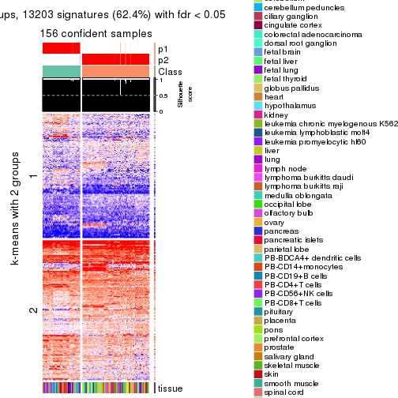</p>

</div>
<div id='tab-ATC-NMF-get-signatures-no-scale-2'>
<pre><code class="r">get_signatures(res, k = 3, scale_rows = FALSE)
</code></pre>

<p></p>

</div>
<div id='tab-ATC-NMF-get-signatures-no-scale-3'>
<pre><code class="r">get_signatures(res, k = 4, scale_rows = FALSE)
</code></pre>

<p></p>

</div>
<div id='tab-ATC-NMF-get-signatures-no-scale-4'>
<pre><code class="r">get_signatures(res, k = 5, scale_rows = FALSE)
</code></pre>

<p></p>

</div>
<div id='tab-ATC-NMF-get-signatures-no-scale-5'>
<pre><code class="r">get_signatures(res, k = 6, scale_rows = FALSE)
</code></pre>

<p></p>

</div>
</div>


Compare the overlap of signatures from different k:

```r
compare_signatures(res)
```


`get_signature()` returns a data frame invisibly. TO get the list of signatures, the function
call should be assigned to a variable explicitly. In following code, if `plot` argument is set
to `FALSE`, no heatmap is plotted while only the differential analysis is performed.

```r
# code only for demonstration
tb = get_signature(res, k = ..., plot = FALSE)
```

An example of the output of `tb` is:

```
#>   which_row         fdr    mean_1    mean_2 scaled_mean_1 scaled_mean_2 km
#> 1        38 0.042760348  8.373488  9.131774    -0.5533452     0.5164555  1
#> 2        40 0.018707592  7.106213  8.469186    -0.6173731     0.5762149  1
#> 3        55 0.019134737 10.221463 11.207825    -0.6159697     0.5749050  1
#> 4        59 0.006059896  5.921854  7.869574    -0.6899429     0.6439467  1
#> 5        60 0.018055526  8.928898 10.211722    -0.6204761     0.5791110  1
#> 6        98 0.009384629 15.714769 14.887706     0.6635654    -0.6193277  2
...
```

The columns in `tb` are:

1. `which_row`: row indices corresponding to the input matrix.
2. `fdr`: FDR for the differential test. 
3. `mean_x`: The mean value in group x.
4. `scaled_mean_x`: The mean value in group x after rows are scaled.
5. `km`: Row groups if k-means clustering is applied to rows.


UMAP plot which shows how samples are separated.


<script>
$( function() {
	$( '#tabs-ATC-NMF-dimension-reduction' ).tabs();
} );
</script>
<div id='tabs-ATC-NMF-dimension-reduction'>
<ul>
<li><a href='#tab-ATC-NMF-dimension-reduction-1'>k = 2</a></li>
<li><a href='#tab-ATC-NMF-dimension-reduction-2'>k = 3</a></li>
<li><a href='#tab-ATC-NMF-dimension-reduction-3'>k = 4</a></li>
<li><a href='#tab-ATC-NMF-dimension-reduction-4'>k = 5</a></li>
<li><a href='#tab-ATC-NMF-dimension-reduction-5'>k = 6</a></li>
</ul>
<div id='tab-ATC-NMF-dimension-reduction-1'>
<pre><code class="r">dimension_reduction(res, k = 2, method = &quot;UMAP&quot;)
</code></pre>

<p></p>

</div>
<div id='tab-ATC-NMF-dimension-reduction-2'>
<pre><code class="r">dimension_reduction(res, k = 3, method = &quot;UMAP&quot;)
</code></pre>

<p></p>

</div>
<div id='tab-ATC-NMF-dimension-reduction-3'>
<pre><code class="r">dimension_reduction(res, k = 4, method = &quot;UMAP&quot;)
</code></pre>

<p></p>

</div>
<div id='tab-ATC-NMF-dimension-reduction-4'>
<pre><code class="r">dimension_reduction(res, k = 5, method = &quot;UMAP&quot;)
</code></pre>

<p></p>

</div>
<div id='tab-ATC-NMF-dimension-reduction-5'>
<pre><code class="r">dimension_reduction(res, k = 6, method = &quot;UMAP&quot;)
</code></pre>

<p></p>

</div>
</div>


Following heatmap shows how subgroups are split when increasing `k`:

```r
collect_classes(res)
```


Test correlation between subgroups and known annotations. If the known
annotation is numeric, one-way ANOVA test is applied, and if the known
annotation is discrete, chi-squared contingency table test is applied.

```r
test_to_known_factors(res)
```

```
#>           n tissue(p) k
#> ATC:NMF 156  2.53e-06 2
#> ATC:NMF 156  1.37e-11 3
#> ATC:NMF 154  2.47e-15 4
#> ATC:NMF 142  1.22e-18 5
#> ATC:NMF 140  6.59e-22 6
```


If matrix rows can be associated to genes, consider to use `functional_enrichment(res,
...)` to perform function enrichment for the signature genes. See [this vignette](http://bioconductor.org/packages/devel/bioc/vignettes/cola/inst/doc/functional_enrichment.html) for more detailed explanations.


 

## Session info


```r
sessionInfo()
```

```
#> R version 3.6.0 (2019-04-26)
#> Platform: x86_64-pc-linux-gnu (64-bit)
#> Running under: CentOS Linux 7 (Core)
#> 
#> Matrix products: default
#> BLAS:   /usr/lib64/libblas.so.3.4.2
#> LAPACK: /usr/lib64/liblapack.so.3.4.2
#> 
#> locale:
#>  [1] LC_CTYPE=en_GB.UTF-8       LC_NUMERIC=C               LC_TIME=en_GB.UTF-8       
#>  [4] LC_COLLATE=en_GB.UTF-8     LC_MONETARY=en_GB.UTF-8    LC_MESSAGES=en_GB.UTF-8   
#>  [7] LC_PAPER=en_GB.UTF-8       LC_NAME=C                  LC_ADDRESS=C              
#> [10] LC_TELEPHONE=C             LC_MEASUREMENT=en_GB.UTF-8 LC_IDENTIFICATION=C       
#> 
#> attached base packages:
#> [1] grid      stats     graphics  grDevices utils     datasets  methods   base     
#> 
#> other attached packages:
#> [1] genefilter_1.66.0    ComplexHeatmap_2.3.1 markdown_1.1         knitr_1.26          
#> [5] GetoptLong_0.1.7     cola_1.3.2          
#> 
#> loaded via a namespace (and not attached):
#>  [1] circlize_0.4.8       shape_1.4.4          xfun_0.11            slam_0.1-46         
#>  [5] lattice_0.20-38      splines_3.6.0        colorspace_1.4-1     vctrs_0.2.0         
#>  [9] stats4_3.6.0         blob_1.2.0           XML_3.98-1.20        survival_2.44-1.1   
#> [13] rlang_0.4.2          pillar_1.4.2         DBI_1.0.0            BiocGenerics_0.30.0 
#> [17] bit64_0.9-7          RColorBrewer_1.1-2   matrixStats_0.55.0   stringr_1.4.0       
#> [21] GlobalOptions_0.1.1  evaluate_0.14        memoise_1.1.0        Biobase_2.44.0      
#> [25] IRanges_2.18.3       parallel_3.6.0       AnnotationDbi_1.46.1 highr_0.8           
#> [29] Rcpp_1.0.3           xtable_1.8-4         backports_1.1.5      S4Vectors_0.22.1    
#> [33] annotate_1.62.0      skmeans_0.2-11       bit_1.1-14           microbenchmark_1.4-7
#> [37] brew_1.0-6           impute_1.58.0        rjson_0.2.20         png_0.1-7           
#> [41] digest_0.6.23        stringi_1.4.3        polyclip_1.10-0      clue_0.3-57         
#> [45] tools_3.6.0          bitops_1.0-6         magrittr_1.5         eulerr_6.0.0        
#> [49] RCurl_1.95-4.12      RSQLite_2.1.4        tibble_2.1.3         cluster_2.1.0       
#> [53] crayon_1.3.4         pkgconfig_2.0.3      zeallot_0.1.0        Matrix_1.2-17       
#> [57] xml2_1.2.2           httr_1.4.1           R6_2.4.1             mclust_5.4.5        
#> [61] compiler_3.6.0
```


